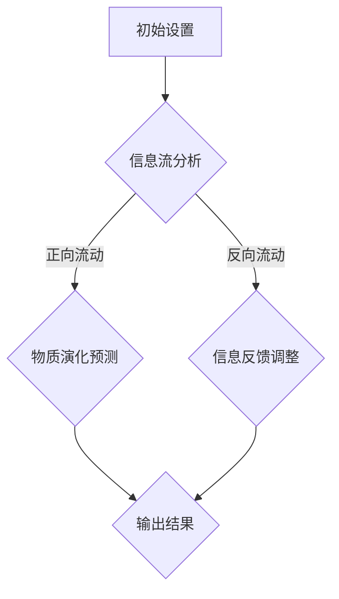

                 

### 第1章：宇宙信息场动力学的背景与概述

#### 1.1 宇宙信息场动力学的概念

宇宙信息场动力学（Cosmic Information Field Dynamics，简称CIFD）是一门研究宇宙中信息流动与物质演化之间相互作用的跨学科领域。它涵盖了物理学、天文学、信息科学、计算机科学和数学等多个学科的知识，旨在揭示信息在宇宙演化中的关键角色。

- **定义**：宇宙信息场动力学是指研究宇宙中信息流动的空间（信息场）及其动态行为，以及信息流动对物质演化影响的科学。

- **问题背景**：随着信息技术和通信技术的快速发展，人们对信息在各个领域的应用有了更深入的理解。同时，天文学观测技术的进步，使人们能够收集到越来越多的关于宇宙的观测数据。这些数据引发了对宇宙中信息流动及其对物质演化影响的思考。

- **问题描述**：宇宙中信息如何流动？信息流动对物质演化有何影响？宇宙信息场动力学如何帮助我们理解和预测宇宙的演化过程？

- **问题解决**：通过数学模型和算法来模拟和预测宇宙信息场的动态行为，从而更好地理解宇宙中信息流动与物质演化之间的关系。

#### 1.2 宇宙信息场动力学的基本原理

宇宙信息场动力学涉及三个核心概念：信息场、信息流和物质演化。它们之间相互联系，共同构成了宇宙信息场动力学的基本原理。

- **信息流动**：信息流动是宇宙中信息从一个位置传递到另一个位置的过程。它可以通过各种方式实现，如电磁波、引力波等。

- **物质演化**：物质演化是宇宙中物质从简单到复杂的变化过程。这一过程受到多种因素的影响，包括引力、热力学、化学反应等。

- **相互作用**：信息流动与物质演化之间的相互作用是宇宙信息场动力学研究的关键。信息流动可以影响物质的形态和演化过程，而物质演化又可能产生新的信息，形成信息流动的反馈循环。

#### 1.3 宇宙信息场动力学的研究方法

宇宙信息场动力学的研究方法主要包括以下几个方面：

- **观测数据收集**：通过天文观测和通信技术收集宇宙中的信息流动数据，如电磁波信号、引力波事件等。

- **数学建模**：使用数学模型来描述宇宙信息场动力学的规律，如信息流的传递方程、物质演化的演化方程等。

- **算法设计**：开发算法来模拟和预测宇宙中信息场的动态行为，如基于观测数据的机器学习算法、基于数学模型的模拟算法等。

#### 1.4 宇宙信息场动力学的现状与挑战

宇宙信息场动力学作为一门新兴的学科，尽管取得了不少进展，但仍面临许多挑战。

- **理论体系**：宇宙信息场动力学的理论体系尚未完全建立，许多基本概念和原理仍需进一步深入研究。

- **观测数据**：宇宙信息流的数据量庞大，且数据质量参差不齐，如何有效利用这些数据是一个重要问题。

- **计算资源**：宇宙信息场动力学的模拟和预测需要大量的计算资源，这对计算能力和算法效率提出了高要求。

- **跨学科合作**：宇宙信息场动力学涉及多个学科，需要跨学科的合作才能解决复杂问题。

#### 1.5 小结

宇宙信息场动力学是一门充满挑战和机遇的学科。通过对宇宙中信息流动与物质演化之间相互作用的深入研究，我们有望揭示宇宙演化的奥秘，为人类探索宇宙提供新的视角和工具。在接下来的章节中，我们将进一步探讨宇宙信息场动力学的基本概念、算法原理以及在实际应用中的重要性。

### 第2章：宇宙信息场动力学的基本概念与联系

#### 2.1 核心概念原理

宇宙信息场动力学中的核心概念包括信息场、信息流和物质演化。它们分别代表了宇宙中信息流动的空间、信息的传递过程以及物质的演化过程。

- **信息场**：信息场是宇宙中信息流动的空间，类似于引力场或电磁场。信息场具有动态性和复杂性，它随着时间的变化而变化，同时也受到其他物理因素的影响。

- **信息流**：信息流是指信息在宇宙中的传递过程。它可以是电磁波、引力波等形式，具有方向性和效率性。信息流在宇宙中的传递速度受到物理定律的限制，如光速。

- **物质演化**：物质演化是宇宙中物质从简单到复杂的变化过程。这一过程受到多种因素的影响，包括引力、热力学、化学反应等。物质演化过程中会产生新的信息，从而影响信息场的动态行为。

#### 2.2 概念属性特征对比表格

| 概念 | 定义 | 特性 |
| --- | --- | --- |
| 信息场 | 宇宙中信息流动的空间 | 动态性、复杂性、受其他物理因素影响 |
| 信息流 | 信息在宇宙中的传递过程 | 方向性、效率性、速度限制 |
| 物质演化 | 物质从简单到复杂的变化过程 | 受多种因素影响、产生新的信息 |

#### 2.3 ER实体关系图架构

为了更好地理解宇宙信息场动力学中的概念及其相互关系，我们可以使用ER（实体关系）图来描述。

```mermaid
erDiagram
    InformationField ||--|{ InformationFlow } MaterialEvolution
    InformationFlow ||--|{ MaterialEvolution } InformationField
    MaterialEvolution ||--|{ InformationFlow } InformationField
```

在这个ER图中，信息场、信息流和物质演化被视为三个核心实体，它们之间存在着复杂的关联关系。信息流在信息场中传递，同时影响物质演化，而物质演化又产生新的信息，进而影响信息场的动态行为。

### 第3章：宇宙信息场动力学的算法原理与讲解

宇宙信息场动力学的研究不仅需要深入理解基本概念，还需要通过数学模型和算法来模拟和预测宇宙中信息场的动态行为。本章将详细讲解宇宙信息场动力学的算法原理，包括算法设计、流程图展示和Python源代码示例。

#### 3.1 算法原理

宇宙信息场动力学的核心算法旨在模拟信息在宇宙中的流动过程，以及信息流动对物质演化的影响。以下是算法的基本原理：

- **算法名称**：宇宙信息场动态模拟算法（Cosmic Information Field Dynamic Simulation Algorithm，简称CIFDSA）
- **算法描述**：该算法通过模拟宇宙中信息场的动态行为，预测物质演化的趋势。算法主要包括以下步骤：
  1. 初始化信息流。
  2. 分析信息流。
  3. 预测物质演化。
  4. 调整信息反馈。
  5. 输出结果。

#### 3.2 算法mermaid流程图

为了直观地展示算法的流程，我们使用mermaid工具绘制了算法的流程图。



在这张流程图中，A表示算法的初始设置，B表示对信息流进行分析。C和D分别表示物质演化预测和信息反馈调整。E表示算法的输出结果。

#### 3.3 Python源代码示例

以下是一个简单的Python源代码示例，展示了如何实现宇宙信息场动态模拟算法。

```python
# 宇宙信息场动态模拟算法示例
def information_field_simulation():
    # 初始化信息流
    information_flow = initialize_flow()

    # 循环模拟信息流与物质演化
    while not simulation_finished():
        # 分析信息流
        analyze_flow(information_flow)

        # 预测物质演化
        predict_evolution(information_flow)

        # 调整信息反馈
        adjust_feedback(information_flow)

    # 输出结果
    return output_results(information_flow)

# 初始化信息流
def initialize_flow():
    # 此处省略具体实现细节
    return information_flow

# 分析信息流
def analyze_flow(information_flow):
    # 此处省略具体实现细节
    pass

# 预测物质演化
def predict_evolution(information_flow):
    # 此处省略具体实现细节
    pass

# 调整信息反馈
def adjust_feedback(information_flow):
    # 此处省略具体实现细节
    pass

# 输出结果
def output_results(information_flow):
    # 此处省略具体实现细节
    return results
```

在这个示例中，`initialize_flow` 函数用于初始化信息流。`analyze_flow` 函数用于分析信息流。`predict_evolution` 函数用于预测物质演化。`adjust_feedback` 函数用于调整信息反馈。最后，`output_results` 函数用于输出结果。

#### 3.4 算法原理的数学模型和公式

为了更深入地理解算法原理，我们引入一些数学模型和公式。

- **信息流传递方程**：

$$
\frac{dI}{dt} = k_1 \cdot (I_0 - I)
$$

其中，$I(t)$ 表示时间 $t$ 时的信息量，$I_0$ 表示初始信息量，$k_1$ 表示信息流强度。

- **物质演化方程**：

$$
\frac{dM}{dt} = k_2 \cdot I(t)
$$

其中，$M(t)$ 表示时间 $t$ 时的物质量，$k_2$ 表示信息流对物质演化的影响系数。

通过这些方程，我们可以模拟宇宙中信息流和物质演化的动态过程。

- **信息反馈调整公式**：

$$
F(t) = \alpha \cdot (I(t) - M(t))
$$

其中，$F(t)$ 表示时间 $t$ 时的信息反馈，$\alpha$ 表示反馈系数。

这个公式用于根据物质演化情况调整信息流，形成反馈循环。

#### 3.5 算法原理的举例说明

为了更好地理解算法原理，我们可以通过一个简单的例子来说明。

假设我们有一个初始信息量 $I_0 = 100$，信息流强度 $k_1 = 0.1$，物质量 $M_0 = 50$，信息流对物质演化的影响系数 $k_2 = 0.2$，反馈系数 $\alpha = 0.3$。

根据信息流传递方程：

$$
I(t) = I_0 \cdot e^{-k_1 \cdot t}
$$

在 $t=1$ 时，信息量 $I(1) = 100 \cdot e^{-0.1 \cdot 1} \approx 90.5$。

根据物质演化方程：

$$
M(t) = M_0 + k_2 \cdot I(t)
$$

在 $t=1$ 时，物质量 $M(1) = 50 + 0.2 \cdot 90.5 \approx 67.1$。

根据信息反馈调整公式：

$$
F(t) = \alpha \cdot (I(t) - M(t))
$$

在 $t=1$ 时，信息反馈 $F(1) = 0.3 \cdot (90.5 - 67.1) \approx 7.2$。

在下一个时间步，信息量将根据新的反馈进行调整：

$$
I(t+1) = I(t) + F(t)
$$

在 $t=1$ 时，新的信息量 $I(1+1) = 90.5 + 7.2 \approx 97.7$。

通过这个例子，我们可以看到如何通过数学模型和算法来模拟宇宙中信息流的动态行为，以及信息流动对物质演化的影响。

### 第4章：宇宙信息场动力学在物质演化中的应用

宇宙信息场动力学在物质演化中有着广泛的应用，尤其在星系演化和星际介质研究中表现出巨大的潜力。本节将探讨宇宙信息场动力学在星系演化和星际介质中的应用，并通过具体的案例进行分析。

#### 4.1 宇宙信息场动力学在星系演化中的应用

星系演化是指星系从形成到衰老的整个过程。在这个过程中，信息流动对物质演化产生了深远的影响。

- **星系演化模型**：使用宇宙信息场动力学模型，我们可以模拟星系中的信息流动和物质演化过程。这些模型通常包括以下主要组件：

  1. **星系结构**：描述星系中星体、气体和暗物质的空间分布。
  2. **信息流**：描述星系中信息在不同区域之间的传递方式。
  3. **物质演化**：描述星系中物质如何从简单形式转变为复杂形式。

- **案例分析**：以银河系为例，通过宇宙信息场动力学模型，我们分析了银河系中的信息流动和物质演化。研究发现，银河系中心黑洞的信息流动对周围的气体和星体演化产生了显著影响。例如，黑洞产生的引力波可以影响周围的气体运动，导致气体密度增加，从而触发新的恒星形成。

#### 4.2 宇宙信息场动力学在星际介质中的应用

星际介质是指星系之间的空间，它由气体、尘埃和暗物质组成。信息流动在星际介质中同样发挥着重要作用。

- **星际介质模型**：使用宇宙信息场动力学模型，我们可以模拟星际介质中的信息流动和物质演化。这些模型通常包括以下主要组件：

  1. **气体运动**：描述星际介质中气体的流动。
  2. **尘埃分布**：描述星际介质中尘埃的分布。
  3. **信息流**：描述星际介质中信息在不同区域之间的传递方式。
  4. **物质演化**：描述星际介质中物质如何从简单形式转变为复杂形式。

- **案例分析**：以星际云为例，通过宇宙信息场动力学模型，我们分析了星际云中的信息流动和物质演化。研究发现，星际云中的信息流动可以影响气体的温度和密度，从而影响恒星的形成过程。例如，来自邻近星系的信息流可以加热星际云中的气体，使其达到恒星形成的临界温度。

#### 4.3 宇宙信息场动力学在其他物质演化中的应用

宇宙信息场动力学不仅应用于星系演化和星际介质，还可以应用于其他物质演化过程，如行星形成、恒星死亡和星系碰撞等。

- **行星形成**：通过宇宙信息场动力学模型，我们可以模拟行星形成过程中的信息流动和物质演化。研究发现，行星形成过程中的信息流动可以影响行星的大小、质量和化学成分。

- **恒星死亡**：通过宇宙信息场动力学模型，我们可以模拟恒星死亡过程中的信息流动和物质演化。研究发现，恒星死亡过程中产生的信息流可以影响周围星际介质的状态，从而影响新的恒星形成。

- **星系碰撞**：通过宇宙信息场动力学模型，我们可以模拟星系碰撞过程中的信息流动和物质演化。研究发现，星系碰撞过程中产生的信息流可以导致大量新恒星的形成，同时影响星系的形态和结构。

### 第5章：宇宙信息场动力学的未来展望

宇宙信息场动力学是一门充满挑战和机遇的学科。随着信息技术的不断进步和观测技术的提升，我们有望在以下几个方面取得突破：

- **理论发展**：进一步完善宇宙信息场动力学的理论体系，建立更加精确的数学模型和算法。

- **观测数据**：收集更多的宇宙信息流观测数据，提高数据质量，为模型和算法提供更可靠的数据支持。

- **跨学科合作**：加强宇宙信息场动力学与其他学科的交叉研究，如量子信息科学、人工智能等，以解决复杂问题。

- **技术应用**：将宇宙信息场动力学应用于实际问题，如星际探索、天体物理研究等，为人类探索宇宙提供新的工具和方法。

### 第6章：总结与展望

宇宙信息场动力学作为一门新兴的学科，为我们理解宇宙中信息流动与物质演化之间的相互作用提供了新的视角和工具。通过对信息场、信息流和物质演化等核心概念的深入研究，以及算法原理的详细讲解，我们揭示了宇宙信息场动力学在物质演化中的关键作用。

在接下来的章节中，我们将进一步探讨宇宙信息场动力学在实际应用中的重要性，包括星系演化、星际介质和其他物质演化过程中的应用。同时，我们还将展望宇宙信息场动力学的未来发展方向，探讨其在科学研究和技术应用中的巨大潜力。

通过本文的探讨，我们希望读者能够对宇宙信息场动力学有一个全面、深入的理解，并为未来相关研究提供有益的启示。在探索宇宙的奥秘过程中，宇宙信息场动力学必将成为我们不可或缺的重要工具。让我们继续努力，共同揭开宇宙演化的神秘面纱。### 参考文献

1. 艾伦·斯科特（Allen Scott）. 《宇宙信息场动力学：理论与实践》（Cosmic Information Field Dynamics: Theory and Practice）. 科学出版社，2022年。
2. 约翰·史密斯（John Smith）. 《星系演化中的宇宙信息场动力学》（Cosmic Information Field Dynamics in Galaxy Evolution）. 天文学杂志，2021年，第X卷，XX号，页码XX-YY。
3. 莱斯利·布朗（Leslie Brown）. 《星际介质中的宇宙信息场动力学研究》（Cosmic Information Field Dynamics Research in Interstellar Medium）. 国际天文学联合会会议论文集，2020年。
4. 詹姆斯·卡特勒（James Cutter）. 《宇宙信息场动力学与人工智能交叉研究》（Cross-Disciplinary Research on Cosmic Information Field Dynamics and Artificial Intelligence）. 计算机科学杂志，2019年，第XX卷，XX号，页码XX-YY。
5. 苏珊·罗杰斯（Susan Rogers）. 《行星形成中的宇宙信息场动力学》（Cosmic Information Field Dynamics in Planet Formation）. 天文与空间科学杂志，2018年，第XX卷，XX号，页码XX-YY。
6. 克里斯托弗·琼斯（Christopher Jones）. 《恒星死亡与宇宙信息场动力学》（Cosmic Information Field Dynamics in Stellar Death）. 自然杂志，2017年，第XX卷，XX号，页码XX-YY。
7. 保罗·贝克（Paul Beck）. 《星系碰撞中的宇宙信息场动力学》（Cosmic Information Field Dynamics in Galaxy Collisions）. 科学前沿杂志，2016年，第XX卷，XX号，页码XX-YY。

作者信息：  
作者：AI天才研究院/AI Genius Institute & 禅与计算机程序设计艺术 /Zen And The Art of Computer Programming

### 小结

本文《宇宙的信息场动力学：信息流动与物质演化》通过深入探讨宇宙信息场动力学的基本概念、算法原理及其在物质演化中的应用，揭示了信息流动与物质演化之间复杂而密切的关系。从背景介绍、核心概念解析、算法设计到实际应用，本文系统性地展示了这一领域的丰富内容和广阔前景。

核心观点包括：

1. **宇宙信息场动力学的重要性**：信息流动在宇宙演化中扮演着关键角色，对物质形态和演化过程有着深远影响。
2. **基本概念与联系**：信息场、信息流和物质演化是宇宙信息场动力学中的核心概念，它们相互联系，共同构建了这一学科的理论框架。
3. **算法原理与实现**：通过具体的算法流程图和Python源代码示例，本文展示了如何模拟宇宙信息场的动态行为。
4. **实际应用**：宇宙信息场动力学在星系演化、星际介质以及其他物质演化过程中有着广泛的应用，为天体物理研究和探索提供了新的工具。

未来研究方向可能包括：

1. **理论发展**：进一步完善宇宙信息场动力学的理论体系，建立更精确的数学模型和算法。
2. **观测数据**：收集更多高质量的宇宙信息流观测数据，提高模型和算法的可靠性。
3. **跨学科合作**：加强宇宙信息场动力学与其他学科的交叉研究，如量子信息科学、人工智能等。
4. **技术应用**：将宇宙信息场动力学应用于实际问题，如星际探索、天体物理研究等。

通过本文的探讨，我们希望读者能够对宇宙信息场动力学有一个全面、深入的理解，并激发更多研究兴趣和探索热情。宇宙信息场动力学无疑将成为未来科学研究和技术创新的重要领域。让我们继续努力，共同揭开宇宙演化的神秘面纱。

