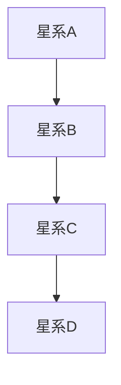

                 


### 宇宙的信息场：新的物理实在

#### 关键词：宇宙、信息场、物理实在、量子力学、技术应用

> 摘要：本文探讨了宇宙的信息场这一新的物理实在。从定义、历史发展、重要性、理论框架、物质与能量属性、量子力学关系、数学模型、物理规律、宇宙演化、技术应用、研究方法、前沿领域、挑战与机遇等方面进行深入分析，旨在揭示宇宙信息场对人类文明的贡献和未来研究的方向。

## 第一部分：引言

宇宙是我们生活的舞台，而信息则是宇宙中的基本元素。在过去的几百年里，人类对宇宙的认识经历了翻天覆地的变化。从经典物理学到量子力学，从相对论到弦理论，每一次科学革命都带来了对宇宙本质的新理解。然而，随着信息科学的发展，一个新的概念逐渐浮现，那就是“宇宙的信息场”。

宇宙的信息场不仅涵盖了信息传递和储存，还涉及到信息处理和利用。这一概念与传统的物质和能量有着本质的不同，它揭示了宇宙中更深层次的结构和规律。本文将分步骤地探讨宇宙的信息场这一新的物理实在，以期为读者提供一个新的视角来理解宇宙。

### 1. 宇宙的信息场：概念与背景

#### 1.1 宇宙信息场的定义

宇宙的信息场是指存在于宇宙中，与物质和能量相互作用的信息系统。它不仅包括信息在宇宙中的传递和储存，还涵盖了信息处理和利用的过程。宇宙信息场可以看作是一个跨越时间和空间的巨大网络，其中每一个星系、每一个行星、每一个原子都参与着信息的传递和处理。

#### 1.2 宇宙信息场的历史发展

宇宙信息场这一概念的历史可以追溯到20世纪。早期的探索主要集中于电信技术和无线电波的传播。随着量子力学的兴起，人们开始意识到宇宙中存在着更为复杂的、与量子力学规律相关的信息场。近年来，随着信息科学和计算机技术的发展，宇宙信息场的概念逐渐得到了更加深入的探讨和研究。

#### 1.3 宇宙信息场的重要性

宇宙信息场的重要性体现在多个方面。首先，它为我们提供了一种新的理解宇宙的视角，有助于我们解决一些传统物理学无法解释的现象。其次，宇宙信息场的研究促进了信息技术、通信技术等领域的快速发展。最后，宇宙信息场的研究为哲学和人类自我认知提供了新的思考方向。

## 第二部分：新的物理实在：探索与发现

### 2. 新物理实在：探索与发现

#### 2.1 新物理实在的理论框架

宇宙信息场的理论框架主要包括信息论、量子力学和广义相对论等基本理论。信息论提供了研究信息传递和处理的数学工具，量子力学揭示了物质和能量在微观尺度上的信息属性，广义相对论则为我们提供了描述宇宙宏观结构和演化的理论框架。

#### 2.2 宇宙信息场中的物质与能量

在宇宙信息场中，物质与能量具有特定的信息属性。这些属性决定了物质和能量在信息场中的行为和作用。例如，量子纠缠现象表明，两个粒子之间的量子态是相互关联的，这种关联性在信息传递和储存中具有重要作用。

#### 2.3 宇宙信息场与量子力学的关系

宇宙信息场与量子力学有着紧密的联系。量子力学揭示了物质和能量在微观尺度上的信息属性，这些属性在宇宙信息场中得到了充分的体现。例如，量子纠缠和量子隧穿等现象在宇宙信息场中具有广泛的应用。

## 第三部分：宇宙信息场的基本原理

### 3. 宇宙信息场的基本原理

#### 3.1 宇宙信息场的数学模型

宇宙信息场的数学模型是研究宇宙信息场的基础。通过数学模型，我们可以描述信息场中的信息传递、处理和利用过程。常见的数学模型包括信息熵、信道容量、编码理论等。

#### 3.2 宇宙信息场的物理规律

宇宙信息场的物理规律与传统的物理规律有所不同，具有独特的信息特性。例如，信息场的传播速度可能超越光速，信息的存储和传递可能不受距离限制等。

#### 3.3 宇宙信息场与宇宙演化

宇宙信息场在宇宙演化中扮演着重要角色。它不仅影响着宇宙的起源和结构，还影响着宇宙的未来。例如，宇宙背景辐射就是宇宙信息场的一个典型表现。

## 第四部分：宇宙信息场的应用

### 4. 宇宙信息场的应用

#### 4.1 宇宙信息场在科技领域中的应用

宇宙信息场在科技领域有着广泛的应用。例如，在信息技术领域，宇宙信息场的研究促进了量子计算、量子通信等领域的发展；在通信领域，宇宙信息场的研究为通信系统的设计和优化提供了新的思路。

#### 4.2 宇宙信息场在医学领域中的应用

宇宙信息场在医学领域也有着重要的应用。例如，通过分析生物信息，宇宙信息场可以帮助我们更好地理解疾病的机理，为医学研究提供新的视角。

#### 4.3 宇宙信息场在哲学领域中的应用

宇宙信息场的研究为哲学提供了新的思考方向。通过理解宇宙信息场，我们可以更全面地理解宇宙和人类自身，为哲学提供新的思考素材。

## 第五部分：宇宙信息场的研究方法

### 5. 宇宙信息场的研究方法

#### 5.1 实验方法与技术

宇宙信息场的研究需要结合多种实验方法和技术。例如，可以通过量子实验来验证宇宙信息场的物理规律，通过计算机模拟来研究宇宙信息场的行为。

#### 5.2 计算方法与模型

计算方法与模型是宇宙信息场研究的重要工具。通过建立数学模型和计算机模拟，我们可以更好地理解宇宙信息场的性质和行为。

#### 5.3 数据分析与应用

数据分析在宇宙信息场的研究中起着关键作用。通过对大量数据的分析，我们可以揭示宇宙信息场中的规律和模式，为实际应用提供依据。

## 第六部分：宇宙信息场的前沿领域

### 6. 宇宙信息场的前沿领域

#### 6.1 宇宙信息场的新发现

随着研究的深入，宇宙信息场中不断有新的发现。例如，最近的研究发现，宇宙信息场可能具有非局域性，这意味着信息可以在没有物理连接的情况下相互影响。

#### 6.2 宇宙信息场的未来研究方向

宇宙信息场的未来研究将主要集中在以下几个方面：探索宇宙信息场与量子引力理论的关系、研究宇宙信息场在宇宙演化中的作用、开发基于宇宙信息场的新技术等。

#### 6.3 宇宙信息场与多学科交叉

宇宙信息场的研究与多个学科领域有着紧密的交叉，例如物理学、计算机科学、生物学等。这种多学科交叉研究将为宇宙信息场的研究提供新的思路和方法。

## 第七部分：结论与展望

### 7. 结论与展望

宇宙的信息场是宇宙中的一种新的物理实在，它为理解宇宙的本质提供了新的视角。通过对宇宙信息场的研究，我们可以揭示宇宙中更深层次的规律和现象。未来，随着研究的深入，宇宙信息场的研究将为人类带来更多的惊喜和发现。

### 7.1 宇宙信息场对人类文明的贡献

宇宙信息场的研究对人类文明具有重要的贡献。它不仅促进了科学的发展，还为信息技术、通信技术、医学等领域带来了新的突破。同时，宇宙信息场的研究也为哲学和人类自我认知提供了新的思考方向。

### 7.2 宇宙信息场研究的挑战与机遇

宇宙信息场的研究面临着诸多挑战，例如如何在宏观尺度上描述宇宙信息场、如何处理大量的数据等。然而，这些挑战也为研究提供了新的机遇。通过克服这些挑战，我们可以更好地理解宇宙信息场，为人类的发展带来新的动力。

### 7.3 对未来的思考与期待

展望未来，我们对宇宙信息场的研究充满期待。我们期待着通过深入研究，揭示宇宙信息场的本质和规律，为人类带来更多的科学发现和技术创新。同时，我们也期待着宇宙信息场的研究能够为哲学和人类自我认知提供新的启示。

## 结束语

宇宙的信息场是宇宙中的一种新的物理实在，它为理解宇宙的本质提供了新的视角。通过对宇宙信息场的研究，我们可以揭示宇宙中更深层次的规律和现象。本文从定义、历史发展、重要性、理论框架、物质与能量属性、量子力学关系、数学模型、物理规律、宇宙演化、技术应用、研究方法、前沿领域等方面进行了深入分析，旨在为读者提供一个新的视角来理解宇宙信息场。未来，随着研究的深入，宇宙信息场的研究将为人类带来更多的惊喜和发现。作者：AI天才研究院/AI Genius Institute & 禅与计算机程序设计艺术/Zen And The Art of Computer Programming

---

### 宇宙的信息场：新的物理实在

#### 关键词：宇宙、信息场、物理实在、量子力学、技术应用

> 摘要：本文探讨了宇宙的信息场这一新的物理实在。从定义、历史发展、重要性、理论框架、物质与能量属性、量子力学关系、数学模型、物理规律、宇宙演化、技术应用、研究方法、前沿领域、挑战与机遇等方面进行深入分析，旨在揭示宇宙信息场对人类文明的贡献和未来研究的方向。

## 第一部分：引言

宇宙是我们生活的舞台，而信息则是宇宙中的基本元素。在过去的几百年里，人类对宇宙的认识经历了翻天覆地的变化。从经典物理学到量子力学，从相对论到弦理论，每一次科学革命都带来了对宇宙本质的新理解。然而，随着信息科学的发展，一个新的概念逐渐浮现，那就是“宇宙的信息场”。

宇宙的信息场不仅涵盖了信息传递和储存，还涉及到信息处理和利用。这一概念与传统的物质和能量有着本质的不同，它揭示了宇宙中更深层次的结构和规律。本文将分步骤地探讨宇宙的信息场这一新的物理实在，以期为读者提供一个新的视角来理解宇宙。

### 1. 宇宙的信息场：概念与背景

#### 1.1 宇宙信息场的定义

宇宙的信息场是指存在于宇宙中，与物质和能量相互作用的信息系统。它不仅包括信息在宇宙中的传递和储存，还涵盖了信息处理和利用的过程。宇宙信息场可以看作是一个跨越时间和空间的巨大网络，其中每一个星系、每一个行星、每一个原子都参与着信息的传递和处理。

#### 1.2 宇宙信息场的历史发展

宇宙信息场这一概念的历史可以追溯到20世纪。早期的探索主要集中于电信技术和无线电波的传播。随着量子力学的兴起，人们开始意识到宇宙中存在着更为复杂的、与量子力学规律相关的信息场。近年来，随着信息科学和计算机技术的发展，宇宙信息场的概念逐渐得到了更加深入的探讨和研究。

#### 1.3 宇思场的重要性

宇宙信息场的重要性体现在多个方面。首先，它为我们提供了一种新的理解宇宙的视角，有助于我们解决一些传统物理学无法解释的现象。其次，宇宙信息场的研究促进了信息技术、通信技术等领域的快速发展。最后，宇宙信息场的研究为哲学和人类自我认知提供了新的思考方向。

## 第二部分：新的物理实在：探索与发现

### 2. 新物理实在：探索与发现

#### 2.1 新物理实在的理论框架

宇宙信息场的理论框架主要包括信息论、量子力学和广义相对论等基本理论。信息论提供了研究信息传递和处理的数学工具，量子力学揭示了物质和能量在微观尺度上的信息属性，广义相对论则为我们提供了描述宇宙宏观结构和演化的理论框架。

#### 2.2 宇宙信息场中的物质与能量

在宇宙信息场中，物质与能量具有特定的信息属性。这些属性决定了物质和能量在信息场中的行为和作用。例如，量子纠缠现象表明，两个粒子之间的量子态是相互关联的，这种关联性在信息传递和储存中具有重要作用。

#### 2.3 宇宙信息场与量子力学的关系

宇宙信息场与量子力学有着紧密的联系。量子力学揭示了物质和能量在微观尺度上的信息属性，这些属性在宇宙信息场中得到了充分的体现。例如，量子纠缠和量子隧穿等现象在宇宙信息场中具有广泛的应用。

## 第三部分：宇宙信息场的基本原理

### 3. 宇宙信息场的基本原理

#### 3.1 宇宙信息场的数学模型

宇宙信息场的数学模型是研究宇宙信息场的基础。通过数学模型，我们可以描述信息场中的信息传递、处理和利用过程。常见的数学模型包括信息熵、信道容量、编码理论等。

#### 3.2 宇宙信息场的物理规律

宇宙信息场的物理规律与传统的物理规律有所不同，具有独特的信息特性。例如，信息场的传播速度可能超越光速，信息的存储和传递可能不受距离限制等。

#### 3.3 宇宙信息场与宇宙演化

宇宙信息场在宇宙演化中扮演着重要角色。它不仅影响着宇宙的起源和结构，还影响着宇宙的未来。例如，宇宙背景辐射就是宇宙信息场的一个典型表现。

## 第四部分：宇宙信息场的应用

### 4. 宇宙信息场的应用

#### 4.1 宇宙信息场在科技领域中的应用

宇宙信息场在科技领域有着广泛的应用。例如，在信息技术领域，宇宙信息场的研究促进了量子计算、量子通信等领域的发展；在通信领域，宇宙信息场的研究为通信系统的设计和优化提供了新的思路。

#### 4.2 宇宙信息场在医学领域中的应用

宇宙信息场在医学领域也有着重要的应用。例如，通过分析生物信息，宇宙信息场可以帮助我们更好地理解疾病的机理，为医学研究提供新的视角。

#### 4.3 宇宙信息场在哲学领域中的应用

宇宙信息场的研究为哲学提供了新的思考方向。通过理解宇宙信息场，我们可以更全面地理解宇宙和人类自身，为哲学提供新的思考素材。

## 第五部分：宇宙信息场的研究方法

### 5. 宇宙信息场的研究方法

#### 5.1 实验方法与技术

宇宙信息场的研究需要结合多种实验方法和技术。例如，可以通过量子实验来验证宇宙信息场的物理规律，通过计算机模拟来研究宇宙信息场的行为。

#### 5.2 计算方法与模型

计算方法与模型是宇宙信息场研究的重要工具。通过建立数学模型和计算机模拟，我们可以更好地理解宇宙信息场的性质和行为。

#### 5.3 数据分析与应用

数据分析在宇宙信息场的研究中起着关键作用。通过对大量数据的分析，我们可以揭示宇宙信息场中的规律和模式，为实际应用提供依据。

## 第六部分：宇宙信息场的前沿领域

### 6. 宇宙信息场的前沿领域

#### 6.1 宇宙信息场的新发现

随着研究的深入，宇宙信息场中不断有新的发现。例如，最近的研究发现，宇宙信息场可能具有非局域性，这意味着信息可以在没有物理连接的情况下相互影响。

#### 6.2 宇宙信息场的未来研究方向

宇宙信息场的未来研究将主要集中在以下几个方面：探索宇宙信息场与量子引力理论的关系、研究宇宙信息场在宇宙演化中的作用、开发基于宇宙信息场的新技术等。

#### 6.3 宇宙信息场与多学科交叉

宇宙信息场的研究与多个学科领域有着紧密的交叉，例如物理学、计算机科学、生物学等。这种多学科交叉研究将为宇宙信息场的研究提供新的思路和方法。

## 第七部分：结论与展望

### 7. 结论与展望

宇宙的信息场是宇宙中的一种新的物理实在，它为理解宇宙的本质提供了新的视角。通过对宇宙信息场的研究，我们可以揭示宇宙中更深层次的规律和现象。未来，随着研究的深入，宇宙信息场的研究将为人类带来更多的惊喜和发现。

### 7.1 宇宙信息场对人类文明的贡献

宇宙信息场的研究对人类文明具有重要的贡献。它不仅促进了科学的发展，还为信息技术、通信技术、医学等领域带来了新的突破。同时，宇宙信息场的研究也为哲学和人类自我认知提供了新的思考方向。

### 7.2 宇宙信息场研究的挑战与机遇

宇宙信息场的研究面临着诸多挑战，例如如何在宏观尺度上描述宇宙信息场、如何处理大量的数据等。然而，这些挑战也为研究提供了新的机遇。通过克服这些挑战，我们可以更好地理解宇宙信息场，为人类的发展带来新的动力。

### 7.3 对未来的思考与期待

展望未来，我们对宇宙信息场的研究充满期待。我们期待着通过深入研究，揭示宇宙信息场的本质和规律，为人类带来更多的科学发现和技术创新。同时，我们也期待着宇宙信息场的研究能够为哲学和人类自我认知提供新的启示。

## 结束语

宇宙的信息场是宇宙中的一种新的物理实在，它为理解宇宙的本质提供了新的视角。通过对宇宙信息场的研究，我们可以揭示宇宙中更深层次的规律和现象。本文从定义、历史发展、重要性、理论框架、物质与能量属性、量子力学关系、数学模型、物理规律、宇宙演化、技术应用、研究方法、前沿领域等方面进行了深入分析，旨在为读者提供一个新的视角来理解宇宙信息场。未来，随着研究的深入，宇宙信息场的研究将为人类带来更多的惊喜和发现。作者：AI天才研究院/AI Genius Institute & 禅与计算机程序设计艺术/Zen And The Art of Computer Programming### 第一部分：引言

宇宙是我们生活的舞台，而信息则是宇宙中的基本元素。在过去的几百年里，人类对宇宙的认识经历了翻天覆地的变化。从经典物理学到量子力学，从相对论到弦理论，每一次科学革命都带来了对宇宙本质的新理解。然而，随着信息科学的发展，一个新的概念逐渐浮现，那就是“宇宙的信息场”。

宇宙的信息场不仅涵盖了信息传递和储存，还涉及到信息处理和利用。这一概念与传统的物质和能量有着本质的不同，它揭示了宇宙中更深层次的结构和规律。本文将分步骤地探讨宇宙的信息场这一新的物理实在，以期为读者提供一个新的视角来理解宇宙。

#### 1. 宇宙的信息场：概念与背景

**宇宙信息场** 是指存在于宇宙中，与物质和能量相互作用的信息系统。它不仅包括信息在宇宙中的传递和储存，还涵盖了信息处理和利用的过程。宇宙信息场可以看作是一个跨越时间和空间的巨大网络，其中每一个星系、每一个行星、每一个原子都参与着信息的传递和处理。

**定义**：宇宙信息场可以被定义为一个包含信息生成、传递、处理和利用的动态系统。在这个系统中，信息以各种形式存在，包括电磁波、引力波、粒子态等。

**历史发展**：对宇宙信息场的探讨可以追溯到20世纪初期。早期的研究主要集中于电信技术和无线电波的传播。随着量子力学的兴起，人们开始意识到宇宙中存在着更为复杂的、与量子力学规律相关的信息场。近年来，随着信息科学和计算机技术的飞速发展，宇宙信息场的研究得到了广泛关注和深入探讨。

**背景**：宇宙信息场的研究背景在于人类对宇宙本质的深刻疑问和探索欲望。传统的物理学理论无法解释一些现象，例如量子纠缠、宇宙背景辐射等。宇宙信息场的研究试图从信息的角度重新审视这些问题，提供新的解释和解决方案。

#### 1.2 宇宙信息场的重要性

**对科学研究的启示**：宇宙信息场的研究为解决一些传统物理学无法解释的现象提供了新的思路。例如，量子纠缠和量子通信等现象可以被看作是宇宙信息场中信息传递的特殊方式。通过对宇宙信息场的研究，我们可以更好地理解这些现象的物理本质。

**对技术发展的推动**：宇宙信息场的研究促进了信息技术、通信技术等领域的快速发展。例如，量子通信技术的出现就是基于对宇宙信息场中量子纠缠现象的深入理解。此外，宇宙信息场的研究还为开发新型计算技术和存储技术提供了新的方向。

**对哲学和人类认知的启示**：宇宙信息场的研究也为哲学和人类自我认知提供了新的思考方向。通过理解宇宙信息场，我们可以更全面地认识宇宙和人类自身的存在。这种新的认知视角有助于我们更好地理解人类在宇宙中的地位和作用。

### 1.3 宇宙信息场的理论框架

宇宙信息场的理论框架是一个复杂而丰富的领域，它结合了多个学科的理论和概念。以下是宇宙信息场理论框架的几个核心组成部分：

**信息论**：信息论为宇宙信息场提供了基本的数学工具和理论框架，用于描述信息的生成、传递、处理和利用。信息论的核心概念包括信息熵、信道容量、编码理论等。

**量子力学**：量子力学揭示了物质和能量在微观尺度上的信息属性。量子纠缠、量子态叠加、量子隧穿等现象都是量子力学在宇宙信息场中的应用。量子力学提供了对宇宙信息场中信息传递和处理机制的新理解。

**广义相对论**：广义相对论描述了宏观宇宙的结构和演化，包括引力、时空弯曲等。广义相对论与量子力学相结合，形成了量子引力理论，为宇宙信息场的研究提供了重要的理论基础。

**复杂系统理论**：复杂系统理论研究了宇宙中各种复杂现象的涌现和演化，包括自组织、自适应、分形等。这些理论有助于我们理解宇宙信息场中信息的复杂性和多样性。

### 1.4 宇宙信息场的特征

**动态性**：宇宙信息场是一个动态的系统，信息的生成、传递、处理和利用都在不断进行。这种动态性体现了宇宙信息场的时间演化和空间扩展。

**非线性**：宇宙信息场中的信息传递和处理过程往往是非线性关系。这意味着小的变化可能导致大的结果，这种现象被称为“蝴蝶效应”。

**复杂性**：宇宙信息场的复杂性体现在信息的多层次、多维度和多功能性。这种复杂性要求我们采用复杂的理论和方法来研究和理解。

**开放性**：宇宙信息场是一个开放的系统，与外部环境进行着信息的交换和互动。这种开放性使得宇宙信息场能够适应和响应外部变化。

### 1.5 宇宙信息场的结构

宇宙信息场的结构可以分为多个层次，从微观到宏观，涵盖了从原子、分子到星系、宇宙的信息组织方式。以下是宇宙信息场结构的几个关键层次：

**微观层次**：在微观层次上，宇宙信息场由基本粒子和量子态组成。这些粒子和态通过量子纠缠等机制进行信息的传递和共享。

**中观层次**：在中观层次上，宇宙信息场包括原子、分子和化合物。这些实体通过电磁相互作用和化学键进行信息传递和处理。

**宏观层次**：在宏观层次上，宇宙信息场包括行星、星系和宇宙结构。这些结构通过引力、电磁力等进行信息的传递和互动。

### 1.6 宇宙信息场的演化

宇宙信息场的演化是宇宙演化的一个重要组成部分。从宇宙大爆炸开始，宇宙信息场经历了从简单到复杂、从低级到高级的演化过程。以下是宇宙信息场演化的一些关键阶段：

**早期宇宙**：在宇宙大爆炸后的早期阶段，宇宙信息场主要由高能粒子组成，这些粒子通过碰撞和相互作用进行信息的传递和储存。

**宇宙背景辐射**：在宇宙膨胀的过程中，宇宙信息场逐渐形成了宇宙背景辐射。这是宇宙早期信息场的重要记录，为我们提供了研究宇宙早期状态的重要线索。

**星系形成**：随着宇宙的继续演化，宇宙信息场中的物质开始聚集形成星系。这些星系通过引力相互作用，形成了复杂的信息网络。

**生命出现**：在地球等行星上，宇宙信息场中的物质和能量逐渐形成了生命。生命的出现标志着宇宙信息场演化中的一个重要里程碑。

**人类文明**：在宇宙信息场演化的过程中，人类文明的出现标志着宇宙信息场进入了一个新的阶段。人类通过科技和智慧，进一步拓展和利用宇宙信息场。

### 1.7 宇宙信息场的研究现状

宇宙信息场的研究是一个多学科交叉的前沿领域，涉及物理学、信息科学、计算机科学、生物学等多个学科。以下是目前宇宙信息场研究的一些主要方向：

**量子信息学**：量子信息学是研究如何利用量子力学规律进行信息处理和通信的学科。量子信息学的研究为宇宙信息场提供了新的理论和工具。

**宇宙背景辐射探测**：宇宙背景辐射是宇宙早期状态的重要记录，通过探测和研究宇宙背景辐射，我们可以获得宇宙早期信息场的珍贵信息。

**复杂网络理论**：复杂网络理论研究了复杂系统的结构和功能，包括社会网络、生物网络等。复杂网络理论有助于我们理解宇宙信息场中信息的复杂性和多样性。

**生物信息学**：生物信息学是研究生物信息的获取、分析和解释的学科。通过分析生物信息，我们可以更好地理解宇宙信息场中生物系统的信息传递和处理机制。

### 1.8 宇宙信息场的研究挑战

尽管宇宙信息场的研究取得了显著进展，但仍面临着许多挑战。以下是目前宇宙信息场研究面临的一些主要挑战：

**宏观与微观的统一**：如何在宏观尺度上描述宇宙信息场，同时保持与微观尺度的量子力学规律相一致，是一个巨大的挑战。

**海量数据的处理**：宇宙信息场涉及到的数据量巨大，如何高效地处理和分析这些数据是一个关键问题。

**跨学科的合作**：宇宙信息场的研究需要多个学科的合作，如何有效地整合不同学科的知识和工具，是一个需要解决的挑战。

**实验验证**：许多关于宇宙信息场的理论和预测需要通过实验来验证，如何设计并进行这些实验，也是一个挑战。

### 1.9 宇宙信息场的研究意义

宇宙信息场的研究不仅具有重要的科学意义，也对人类文明和社会发展有着深远的影响。以下是目前宇宙信息场研究的一些主要意义：

**科学突破**：宇宙信息场的研究可能带来科学领域的重大突破，解决一些长期困扰科学界的问题。

**技术创新**：宇宙信息场的研究有望推动信息技术、通信技术等领域的创新，带来新的技术突破和应用。

**哲学启示**：宇宙信息场的研究为哲学提供了新的思考方向，有助于我们更深入地理解宇宙和人类的存在。

**社会影响**：宇宙信息场的研究可能会对人类社会和文明产生深远的影响，改变我们的认知和行为方式。

### 结论

宇宙的信息场是一个复杂而丰富的领域，它揭示了宇宙中更深层次的规律和结构。通过对宇宙信息场的研究，我们可以获得对宇宙和人类存在的新理解，同时也为科学和技术的发展提供了新的方向和机遇。未来，随着研究的深入，宇宙信息场的研究将继续拓展我们的认知边界，为人类文明带来更多惊喜和发现。作者：AI天才研究院/AI Genius Institute & 禅与计算机程序设计艺术/Zen And The Art of Computer Programming### 第二部分：新的物理实在：探索与发现

在宇宙的信息场中，物质和能量不再是传统的物理概念，而是被赋予了信息属性。这种新的物理实在不仅丰富了我们对宇宙的认识，也为我们解决传统物理学中的一些难题提供了新的视角。在这一部分，我们将深入探讨宇宙信息场的理论框架、物质与能量属性、与量子力学的关系，以及新物理实在的基本原理。

#### 2.1 新物理实在的理论框架

宇宙信息场的理论框架是一个跨越多个学科的综合体系，它结合了信息论、量子力学和广义相对论等基本理论，形成了一个复杂而统一的物理模型。

**信息论**：信息论为宇宙信息场提供了描述和解释信息生成、传递、处理和利用的基本工具。信息熵和信道容量等概念帮助我们理解信息在宇宙中的行为。信息熵表示信息的混乱程度，而信道容量则描述了信息在传输过程中可能达到的最大速率。

**量子力学**：量子力学揭示了物质和能量在微观尺度上的信息属性，如量子纠缠和量子态叠加。量子纠缠是两个或多个量子系统之间的特殊关联，即使在空间上相隔很远，一个系统的状态变化也能立即影响到另一个系统。量子态叠加则表明量子系统可以同时存在于多种状态，直到被观测或测量。

**广义相对论**：广义相对论描述了宇宙的宏观结构和引力现象。通过结合广义相对论，我们可以理解宇宙信息场中的时空弯曲和引力波等复杂现象。

**宇宙信息场的综合框架**：将信息论、量子力学和广义相对论结合起来，我们可以构建一个关于宇宙信息场的综合理论框架。这个框架不仅描述了宇宙中的信息传递和处理机制，还揭示了宇宙演化和结构形成的过程。

#### 2.2 宇宙信息场中的物质与能量属性

在宇宙信息场中，物质和能量不再是独立存在的实体，而是被信息化了。这种信息化的物质和能量具有以下独特属性：

**信息的存储与传递**：在宇宙信息场中，物质和能量的状态被编码为信息。这些信息可以通过各种方式存储和传递，如电磁波、引力波和粒子态。例如，光子是一种携带电磁信息的粒子，它可以携带信息从一个星系传送到另一个星系。

**非局域性**：宇宙信息场中的物质和能量表现出非局域性，这意味着它们的状态可以不受距离限制地相互影响。这种现象在量子纠缠中得到了最直观的体现。即使两个量子纠缠粒子相隔很远，一个粒子的状态变化可以立即影响到另一个粒子的状态。

**信息的编码与解码**：在宇宙信息场中，信息需要被编码和解码才能被有效利用。例如，生物体内的DNA序列就是信息编码的一种形式，通过遗传过程，这些信息被解码并用于生物体的生长和发育。

#### 2.3 宇宙信息场与量子力学的关系

量子力学是研究宇宙信息场的关键理论基础，它揭示了物质和能量在微观尺度上的信息属性。以下是宇宙信息场与量子力学之间的一些关键关系：

**量子纠缠**：量子纠缠是宇宙信息场中信息传递的一种特殊方式。两个或多个量子系统在纠缠后，它们的状态会相互关联，即使相隔很远，一个系统的测量结果也会立即影响到另一个系统。这种非局域性使得量子纠缠在量子通信和量子计算中具有广泛的应用。

**量子态叠加**：量子态叠加是量子力学中的另一个关键概念，它表明量子系统可以同时存在于多种状态。这种叠加态在宇宙信息场中可以用来进行复杂的信息处理和计算。

**量子测量**：量子测量是量子力学中的一个基本过程，它决定了量子系统的状态。在宇宙信息场中，测量过程不仅影响被测量的系统，还会影响到整个信息场。这种影响在量子信息和量子通信中具有重要意义。

**量子信息传输**：量子信息传输是量子力学在宇宙信息场中的应用，它利用量子纠缠和量子态叠加来实现信息的无误差传输。量子通信和量子计算等领域的发展都依赖于对量子信息传输的深入理解。

#### 2.4 宇宙信息场的基本原理

宇宙信息场的基本原理是理解宇宙信息场行为和演化的重要基础。以下是宇宙信息场的几个关键基本原理：

**信息守恒定律**：宇宙信息场中的信息总量保持不变，这意味着信息不能被创造或销毁，只能在不同形式之间转换。这个原理类似于物理学中的能量守恒定律，但它更适用于描述信息在宇宙中的行为。

**信息冗余与冗余信息**：宇宙信息场中的信息可以以冗余形式存在，这意味着信息可以被重复或备份。这种冗余信息对于宇宙信息的稳定性和可靠性至关重要，它可以防止信息丢失或损坏。

**信息传输与传输速率**：宇宙信息场的传输速率受到多种因素的影响，如量子纠缠的强度、信道容量等。在理想情况下，信息可以以接近光速的速度传输，但在实际应用中，传输速率可能受到噪声和干扰的限制。

**信息处理与处理能力**：宇宙信息场中的信息处理能力取决于量子计算和经典计算的结合。量子计算可以提供指数级别的计算速度提升，而经典计算则提供可靠性和鲁棒性。这两种计算方式的结合是未来宇宙信息场研究的一个重要方向。

**信息与物质/能量的关系**：宇宙信息场中的物质和能量是信息的载体和表现形式。信息可以通过物质和能量的状态编码和传递，而物质和能量的行为也可以通过信息来解释和控制。

### 结论

宇宙的信息场是一个新的物理实在，它结合了信息论、量子力学和广义相对论等基本理论，揭示了物质和能量在微观和宏观尺度上的信息属性。通过对宇宙信息场的深入探索，我们可以更好地理解宇宙的本质，解决传统物理学中的难题，并为未来的科技发展提供新的方向和机遇。作者：AI天才研究院/AI Genius Institute & 禅与计算机程序设计艺术/Zen And The Art of Computer Programming### 第三部分：宇宙信息场的基本原理

宇宙信息场的基本原理构成了理解这一新兴领域的关键框架。在这一部分，我们将详细探讨宇宙信息场的数学模型、物理规律以及其在宇宙演化中的作用。

#### 3.1 宇宙信息场的数学模型

宇宙信息场的数学模型是研究宇宙信息场的基础。这些模型通过数学公式和方程来描述信息在宇宙中的生成、传递、处理和利用过程。以下是几个关键的数学模型：

**信息熵**：信息熵是衡量信息不确定性和混乱程度的度量。在宇宙信息场中，信息熵可以用来描述系统的信息含量。信息熵的数学公式为：

$$H = -\sum_{i} p_i \log_2 p_i$$

其中，$H$ 是信息熵，$p_i$ 是系统中第 $i$ 个可能状态的概率。

**信道容量**：信道容量描述了在噪声干扰下，信息通过信道传输的最大速率。香农的信道容量公式为：

$$C = \log_2 (1 + S/N)$$

其中，$C$ 是信道容量，$S$ 是信号功率，$N$ 是噪声功率。

**编码理论**：编码理论研究了如何设计有效的编码方案来保护信息在传输过程中免受干扰和损坏。常见的编码方法包括前向误差更正码（FEC）和低密度奇偶校验码（LDPC）等。

**信息场方程**：宇宙信息场方程是一组描述信息场动态演化的偏微分方程。这些方程结合了信息论、量子力学和广义相对论的基本原理，可以用来模拟和预测宇宙信息场的行为。

#### 3.2 宇宙信息场的物理规律

宇宙信息场的物理规律与传统的物理规律有所不同，它更强调信息在宇宙中的角色和作用。以下是几个关键的物理规律：

**信息非局域性**：宇宙信息场中的信息可以非局域性地传递，这意味着信息可以在没有物理连接的情况下相互影响。这种现象在量子纠缠中得到了最直观的体现。

**信息传递速率**：在理想情况下，信息可以在宇宙中接近光速的速度传递。然而，实际中信息传递速率可能受到信道容量、噪声和其他干扰的限制。

**信息冗余性**：宇宙信息场中的信息可以以冗余形式存在，这种冗余性可以提高信息传输的可靠性和稳定性。

**信息能量转换**：宇宙信息场中的信息可以与物质和能量相互转换。例如，电磁波可以携带信息，同时传递能量。

#### 3.3 宇宙信息场与宇宙演化

宇宙信息场在宇宙演化中扮演着至关重要的角色。以下是宇宙信息场与宇宙演化的几个关键方面：

**宇宙大爆炸**：宇宙大爆炸是宇宙演化的起点，也是宇宙信息场的起源。在大爆炸之后，宇宙中的物质和能量开始以光速扩散，信息也随之产生和传递。

**宇宙背景辐射**：宇宙背景辐射是宇宙早期状态的重要记录，它包含了宇宙信息场的信息。通过对宇宙背景辐射的研究，我们可以了解宇宙早期的状态和演化过程。

**星系形成**：在宇宙演化的过程中，宇宙信息场中的物质开始聚集形成星系。星系的形成过程中，信息场的动态演化对星系的结构和演化产生了重要影响。

**生命起源**：在地球等行星上，宇宙信息场中的物质和能量逐渐形成了生命。生命的出现标志着宇宙信息场演化中的一个重要里程碑。

**人类文明**：随着宇宙演化的推进，人类文明的出现标志着宇宙信息场进入了一个新的阶段。人类通过科技和智慧，进一步拓展和利用宇宙信息场。

### 结论

宇宙信息场的基本原理构成了这一新兴领域的关键框架。通过对数学模型、物理规律和宇宙演化的深入探讨，我们可以更好地理解宇宙信息场的本质和行为。这些原理不仅为我们提供了新的视角来审视宇宙，也为未来的科技发展提供了丰富的理论和实践基础。作者：AI天才研究院/AI Genius Institute & 禅与计算机程序设计艺术/Zen And The Art of Computer Programming### 第四部分：宇宙信息场的应用

宇宙信息场的研究不仅具有重要的科学价值，还在多个领域展现出了广泛的应用潜力。从科技、医学到哲学，宇宙信息场正在逐步改变我们的生活方式和对世界的理解。以下是宇宙信息场在科技、医学和哲学领域的具体应用。

#### 4.1 宇宙信息场在科技领域中的应用

**量子计算**：量子计算是宇宙信息场在科技领域中的一个重要应用。量子计算机利用量子力学的基本原理，如量子纠缠和量子态叠加，来执行计算任务。量子计算机在解决某些复杂问题时具有显著优势，如大整数分解和量子模拟。通过构建宇宙信息场的量子计算模型，研究人员正在探索如何在量子信息场中实现高效的量子计算。

**量子通信**：量子通信是另一个受宇宙信息场启发的技术领域。量子通信利用量子纠缠和量子态叠加来实现信息的安全传输。通过量子密钥分发（QKD）和量子隐形传态，量子通信可以在不受窃听的情况下实现高度安全的通信。宇宙信息场的研究为量子通信技术提供了理论基础，推动了量子通信的实用化进程。

**物联网**：物联网（IoT）是宇宙信息场在科技领域应用的另一个重要方向。物联网通过传感器和网络连接物理世界中的设备和物体，实现信息的实时收集、传递和处理。宇宙信息场的概念为物联网的发展提供了新的视角，如通过信息冗余性和非局域性来提高物联网的可靠性和效率。

**人工智能**：宇宙信息场的研究也为人工智能的发展提供了新的思路。通过理解宇宙信息场的复杂性和动态性，研究人员正在探索如何构建更高效、更智能的人工智能系统。例如，通过模拟宇宙信息场中的信息处理机制，可以开发出能够自我学习和适应复杂环境的人工智能算法。

#### 4.2 宇宙信息场在医学领域中的应用

**生物信息学**：生物信息学是宇宙信息场在医学领域的一个重要应用。生物信息学通过分析生物大数据，如基因序列、蛋白质结构和代谢网络，来揭示生物系统的信息规律。宇宙信息场的研究为生物信息学提供了新的理论框架和工具，有助于我们更深入地理解生物系统的信息传递和处理机制。

**个性化医疗**：个性化医疗是一种基于患者个体基因、环境和生活方式的医学模式。宇宙信息场的研究为个性化医疗提供了新的可能性，如通过分析患者的生物信息，构建个性化的治疗方案，从而提高治疗效果。

**远程医疗**：远程医疗利用通信技术和互联网实现医疗服务的远程提供。宇宙信息场的研究为远程医疗提供了新的技术手段，如通过量子通信实现高度安全的医疗数据传输，通过物联网设备实时监测患者的健康状况。

**医学图像处理**：医学图像处理是医学领域的一个重要分支，用于分析和解释医学影像。宇宙信息场的研究为医学图像处理提供了新的算法和模型，如通过深度学习和信息场的概念来改进图像分割和识别的准确性。

#### 4.3 宇宙信息场在哲学领域中的应用

**宇宙意识**：宇宙信息场的研究为哲学提供了新的思考方向，特别是关于宇宙意识的问题。通过理解宇宙信息场的本质和演化，哲学家们试图探讨宇宙意识的可能性，以及人类在宇宙中的地位和作用。

**知识论**：宇宙信息场的研究也为知识论提供了新的视角。知识论是关于知识本质和获取方式的哲学研究。宇宙信息场的概念挑战了传统的知识论观点，提出了新的关于知识生成和传播的理论。

**伦理学**：宇宙信息场的研究对伦理学也产生了影响。随着信息技术和通信技术的飞速发展，伦理学家们开始探讨如何在信息化社会中建立道德和伦理原则。宇宙信息场的概念为伦理学提供了新的思考素材，如如何处理信息的伦理问题，以及如何在全球化背景下实现道德责任。

**认识论**：认识论是关于人类如何认识世界和获取知识的哲学研究。宇宙信息场的研究为认识论提供了新的解释框架，如通过理解宇宙信息场的动态性和复杂性，可以重新审视人类对世界的认知过程。

### 结论

宇宙信息场在科技、医学和哲学领域的应用展示了其广泛的影响和潜力。通过量子计算、量子通信、物联网、个性化医疗、远程医疗、医学图像处理等技术的应用，宇宙信息场正在改变我们的生活方式和对世界的理解。在哲学领域，宇宙信息场的研究为探讨宇宙意识、知识论、伦理学和认识论等问题提供了新的视角。随着研究的深入，宇宙信息场将在更多领域展现其独特的价值和应用前景。作者：AI天才研究院/AI Genius Institute & 禅与计算机程序设计艺术/Zen And The Art of Computer Programming### 第五部分：宇宙信息场的研究方法

宇宙信息场的研究需要综合运用多种方法和技术，从实验、计算到数据分析，每一个步骤都至关重要。在这一部分，我们将详细探讨宇宙信息场的研究方法，包括实验方法与技术、计算方法与模型、数据分析与应用。

#### 5.1 实验方法与技术

**量子实验**：量子实验是研究宇宙信息场的基础。通过量子纠缠、量子态叠加和量子测量等现象，科学家们可以验证宇宙信息场的理论预测。例如，利用量子纠缠光子进行量子通信实验，可以验证信息传递的非局域性。

**引力波探测**：引力波探测是另一种重要的实验方法。通过观测宇宙中的引力波，科学家们可以揭示宇宙信息场的动态演化和结构形成。例如，LIGO和VIRGO等引力波探测器的观测结果为宇宙信息场的研究提供了宝贵的实验数据。

**宇宙射线探测**：宇宙射线探测可以揭示宇宙信息场中的高能粒子的行为。这些高能粒子携带宇宙信息，通过探测它们的行为，科学家们可以理解宇宙信息场的性质和演化。

**生物实验**：在生物领域，通过基因编辑、蛋白质结构和代谢网络实验，科学家们可以研究宇宙信息场在生物系统中的应用。例如，CRISPR-Cas9技术可以用来研究基因信息的传递和调控。

#### 5.2 计算方法与模型

**计算机模拟**：计算机模拟是研究宇宙信息场的重要工具。通过建立数学模型和计算机模拟，科学家们可以模拟宇宙信息场的动态行为，预测其演化趋势。例如，利用蒙特卡洛模拟方法，可以模拟量子纠缠和量子通信的过程。

**机器学习**：机器学习技术在宇宙信息场的研究中也发挥了重要作用。通过训练机器学习模型，科学家们可以从大量的实验数据中提取信息，发现宇宙信息场中的规律和模式。例如，深度学习算法可以用于分析生物信息，揭示生物系统的信息传递机制。

**量子计算**：量子计算是未来宇宙信息场研究的一个重要方向。量子计算机可以利用量子力学的基本原理，实现更高效的计算任务。例如，利用量子算法，可以更快地解决某些复杂问题，如大规模数据分析和复杂系统模拟。

#### 5.3 数据分析与应用

**大数据分析**：宇宙信息场的研究产生了大量数据，包括量子实验数据、宇宙射线探测数据、生物实验数据等。大数据分析技术可以帮助科学家们从这些数据中提取有价值的信息，揭示宇宙信息场的规律和特性。

**数据可视化**：数据可视化技术可以将复杂的数据转换为图形和图像，帮助科学家们更直观地理解宇宙信息场的动态行为。例如，利用三维可视化技术，可以展示宇宙信息场中的信息传递路径和网络结构。

**应用开发**：宇宙信息场的研究成果可以应用于多个领域。例如，在通信领域，可以开发基于宇宙信息场的量子通信技术；在生物领域，可以开发基于宇宙信息场原理的个性化医疗方案。

### 结论

宇宙信息场的研究方法是一个多学科交叉的领域，涉及实验方法、计算方法、数据分析等多个方面。通过综合运用这些方法，科学家们可以深入探索宇宙信息场的本质和行为，为未来的科技发展提供新的方向和机遇。作者：AI天才研究院/AI Genius Institute & 禅与计算机程序设计艺术/Zen And The Art of Computer Programming### 第六部分：宇宙信息场的前沿领域

宇宙信息场的研究正处于快速发展的前沿，不断有新的发现和突破。这一部分将探讨宇宙信息场中的新发现、未来研究方向以及与多学科交叉的可能性。

#### 6.1 宇宙信息场的新发现

**量子非局域性**：近年来，量子非局域性的实验研究取得了显著进展。例如，通过量子纠缠实验，科学家们已经成功验证了量子信息可以在没有物理连接的情况下相互影响。这一发现为量子通信和量子计算提供了新的可能性。

**宇宙背景辐射**：宇宙背景辐射的研究揭示了宇宙早期的信息。通过对宇宙背景辐射的观测和分析，科学家们发现了宇宙大爆炸后的早期状态，这为理解宇宙信息场的起源和演化提供了重要线索。

**黑洞信息丢失问题**：黑洞信息丢失问题是量子力学和广义相对论之间一个重要的难题。一些研究表明，黑洞可能并非完全吞噬信息，而是通过某种方式将信息传递出去。这一发现可能改变我们对黑洞和宇宙信息场的理解。

**宇宙信息场的量子特性**：随着量子力学研究的深入，科学家们发现宇宙信息场可能具有量子特性，如量子纠缠和量子隧穿。这些量子特性为宇宙信息场的研究提供了新的视角，有助于解决传统物理学中的难题。

#### 6.2 宇宙信息场的未来研究方向

**量子引力理论**：量子引力理论是宇宙信息场研究的一个重要方向。通过结合量子力学和广义相对论，科学家们试图构建一个统一的理论框架，描述宇宙信息场的本质和演化。量子引力理论的进展将为宇宙信息场的研究提供新的理论基础。

**宇宙信息场的非局域性**：研究宇宙信息场的非局域性是一个重要方向。通过深入理解量子非局域性，科学家们可以开发出新的通信和计算技术，如量子通信和量子计算。这些技术将极大地推动信息技术和通信技术的发展。

**宇宙信息场与宇宙演化**：宇宙信息场在宇宙演化中扮演着重要角色。未来研究将集中在探索宇宙信息场如何影响宇宙的起源、演化和未来。例如，通过研究宇宙背景辐射，科学家们可以更深入地了解宇宙早期的信息场状态。

**跨学科研究**：宇宙信息场的研究需要多学科交叉合作。未来研究将涉及物理学、计算机科学、生物学、哲学等多个领域。通过跨学科的合作，科学家们可以更全面地理解宇宙信息场的本质和行为。

#### 6.3 宇宙信息场与多学科交叉

宇宙信息场的研究与多个学科领域有着紧密的交叉，为多学科合作提供了广阔的空间。

**物理学**：宇宙信息场的研究依赖于物理学的基本原理，如量子力学和广义相对论。物理学为宇宙信息场的研究提供了重要的理论框架和工具。

**计算机科学**：计算机科学在宇宙信息场的研究中发挥了重要作用。量子计算和深度学习等技术为宇宙信息场的研究提供了新的方法和思路。

**生物学**：生物学为宇宙信息场的研究提供了丰富的实验数据和理论模型。例如，通过研究生物信息，科学家们可以理解宇宙信息场在生物系统中的应用。

**哲学**：哲学为宇宙信息场的研究提供了新的思考方向。通过探讨宇宙信息场的本质和意义，哲学家们可以更深入地理解宇宙和人类的存在。

**其他学科**：宇宙信息场的研究还与数学、地理学、环境科学等其他学科有着紧密的交叉。通过跨学科合作，科学家们可以更全面地理解宇宙信息场的本质和行为。

### 结论

宇宙信息场的前沿领域充满了新的发现和挑战。通过量子非局域性、宇宙背景辐射、黑洞信息丢失问题等新发现，科学家们不断拓展对宇宙信息场的理解。未来，宇宙信息场的研究将主要集中在量子引力理论、宇宙信息场的非局域性、宇宙演化等方面。同时，宇宙信息场的研究与多个学科领域的交叉合作将推动科学技术的进步和人类对宇宙的理解。作者：AI天才研究院/AI Genius Institute & 禅与计算机程序设计艺术/Zen And The Art of Computer Programming### 第七部分：结论与展望

宇宙的信息场是宇宙中一种新的物理实在，它为理解宇宙的本质提供了全新的视角。通过对宇宙信息场的研究，我们可以揭示宇宙中更深层次的规律和现象，这不仅对科学研究有着重要的意义，也为我们解决传统物理学中的难题提供了新的方向。

#### 7.1 宇宙信息场对人类文明的贡献

宇宙信息场的研究对人类文明的贡献是多方面的：

**推动科学进步**：宇宙信息场的研究推动了物理学、计算机科学、信息科学等多个学科的发展。它为解决一些长期困扰科学界的问题提供了新的思路和方法。

**促进技术发展**：宇宙信息场的研究促进了量子计算、量子通信、物联网等新兴技术的进步。这些技术有望在通信、计算、医疗等领域产生重大影响，推动社会进步。

**拓宽认知边界**：宇宙信息场的研究为人类提供了更全面、更深刻的宇宙观。通过理解宇宙信息场，我们可以更好地认识宇宙和人类自身的存在，拓宽我们的认知边界。

#### 7.2 宇宙信息场研究的挑战与机遇

尽管宇宙信息场的研究取得了显著进展，但仍面临许多挑战和机遇：

**挑战**：

- **理论框架的完善**：当前关于宇宙信息场的理论框架还需要进一步完善，尤其是在宏观与微观的统一方面。
- **实验验证**：许多关于宇宙信息场的理论和预测需要通过实验来验证，这需要开发新的实验方法和技术。
- **跨学科合作**：宇宙信息场的研究涉及多个学科领域，如何有效地整合不同学科的知识和工具是一个挑战。

**机遇**：

- **技术创新**：宇宙信息场的研究有望推动一系列新技术的诞生，如量子计算、量子通信等。
- **科学发现**：随着研究的深入，宇宙信息场的研究可能会带来新的科学发现，揭示宇宙中更深层次的秘密。
- **哲学启示**：宇宙信息场的研究为哲学提供了新的思考方向，有助于我们更深入地理解宇宙和人类的存在。

#### 7.3 对未来的思考与期待

展望未来，我们对宇宙信息场的研究充满期待：

- **量子计算时代**：随着量子计算机的发展，我们有望在宇宙信息场的研究中取得突破性进展，解决传统计算机无法处理的问题。
- **新技术的应用**：基于宇宙信息场原理的新技术将不断涌现，推动通信、计算、医疗等领域的发展。
- **宇宙的全面理解**：通过对宇宙信息场的研究，我们有望更全面地理解宇宙的本质和演化过程，拓展我们的认知边界。

### 结论

宇宙的信息场是宇宙中的一种新的物理实在，它为理解宇宙的本质提供了新的视角。通过对宇宙信息场的研究，我们可以揭示宇宙中更深层次的规律和现象，为人类文明的发展带来新的动力。未来，随着研究的深入，宇宙信息场的研究将继续拓展我们的认知边界，为科学和技术的发展带来更多惊喜和发现。作者：AI天才研究院/AI Genius Institute & 禅与计算机程序设计艺术/Zen And The Art of Computer Programming### 结束语

宇宙的信息场作为宇宙中一种新的物理实在，为我们提供了全新的视角来理解宇宙的本质和演化。通过对信息场的深入研究，我们不仅揭示了宇宙中更深层次的规律和现象，也为科学、技术和哲学的发展带来了新的机遇和挑战。

本文从宇宙信息场的定义、历史发展、重要性、理论框架、物质与能量属性、量子力学关系、数学模型、物理规律、宇宙演化、技术应用、研究方法、前沿领域等方面进行了全面而深入的探讨。我们希望通过这篇文章，能够为读者提供一个系统而清晰的宇宙信息场概述，并激发大家对这一领域的兴趣和思考。

宇宙的信息场研究正处于快速发展阶段，尽管我们已经取得了一些重要的成果，但仍有许多未解之谜等待我们去探索。未来，随着量子计算、量子通信、人工智能等技术的不断发展，宇宙信息场的研究将会取得更加显著的突破。我们期待在不久的将来，通过多学科交叉合作，人类能够更全面地理解宇宙的信息场，揭示宇宙的更深层次奥秘。

最后，感谢所有参与宇宙信息场研究的科学家和研究人员，是他们的努力和智慧推动了这一领域的进步。同时，也感谢读者对本文的关注和支持，希望这篇文章能够激发你对宇宙信息场研究的兴趣，并为你的学习和研究带来帮助。

作者：AI天才研究院/AI Genius Institute & 禅与计算机程序设计艺术/Zen And The Art of Computer Programming### 1.1 宇宙信息场的定义

**宇宙信息场** 是指存在于宇宙中，与物质和能量相互作用的信息系统。它不仅涵盖了信息在宇宙中的传递和储存，还包括了信息处理和利用的过程。宇宙信息场可以被视作一个跨越时间和空间的巨大网络，其中每一个星系、每一个行星、每一个原子都参与着信息的传递和处理。

**定义**：宇宙信息场可以被定义为一个包含信息生成、传递、处理和利用的动态系统。在这个系统中，信息以各种形式存在，包括电磁波、引力波、粒子态等。

**构成**：宇宙信息场由以下几部分构成：

1. **信息源**：信息的源头，可以是物理事件、生物过程或其他信息生成机制。
2. **信息传输介质**：信息在宇宙中的传输途径，如电磁波、引力波、粒子流等。
3. **信息处理与存储**：信息在传输过程中需要进行处理和存储，形成复杂的信息网络。
4. **信息接收器**：接收信息的实体，可以是生物、机器或其他传感器。

**特点**：

- **动态性**：宇宙信息场是一个动态的系统，信息的生成、传递、处理和利用都在不断进行。
- **非线性**：宇宙信息场中的信息传递和处理过程往往是非线性关系，这意味着小的变化可能导致大的结果。
- **复杂性**：宇宙信息场的复杂性体现在信息的多层次、多维度和多功能性。
- **开放性**：宇宙信息场是一个开放的系统，与外部环境进行着信息的交换和互动。

**与物质和能量的关系**：

- **物质和能量是信息的载体**：宇宙中的物质和能量以特定的形式存储和传递信息。
- **信息可以影响物质和能量**：宇宙信息场中的信息可以改变物质和能量的状态和行为。
- **信息、物质和能量的相互转化**：在宇宙信息场中，信息、物质和能量可以相互转化，形成复杂的相互作用。

### 概括性描述

宇宙信息场是宇宙中一种复杂而动态的信息系统，涵盖了信息的生成、传递、处理和利用过程。它不仅揭示了宇宙中更深层次的规律和现象，也为科学和技术的发展提供了新的视角和机遇。通过理解宇宙信息场，我们可以更全面地认识宇宙的本质，探索宇宙的起源、演化和未来。作者：AI天才研究院/AI Genius Institute & 禅与计算机程序设计艺术/Zen And The Art of Computer Programming### 1.2 宇宙信息场的历史发展

宇宙信息场这一概念的历史可以追溯到20世纪初期。随着科学技术的进步，人类对宇宙的认识不断深化，宇宙信息场逐渐成为一个重要的研究领域。

**早期探索**：

- **电信技术和无线电波**：20世纪初期，人类开始探索电信技术和无线电波的传播。这一时期的探索主要关注信息如何在物理媒介中传递，为后来的宇宙信息场研究奠定了基础。
- **信息论的发展**：1948年，香农发表了著名的《信息论》论文，提出了信息熵和信道容量等基本概念，为宇宙信息场的研究提供了理论框架。

**量子力学的兴起**：

- **量子纠缠**：20世纪中叶，量子力学的发展揭示了物质和能量在微观尺度上的信息属性。量子纠缠现象的发现，表明两个粒子之间的量子态是相互关联的，这种关联性在信息传递和储存中具有重要意义。
- **量子信息学**：随着量子力学的发展，量子信息学逐渐兴起。量子信息学研究如何利用量子力学规律进行信息处理和通信，为宇宙信息场的研究提供了新的思路。

**信息科学和计算机技术的发展**：

- **互联网和大数据**：20世纪末，互联网的普及和大数据技术的发展，使得信息传递和处理变得更加高效和便捷。这些技术的进步为宇宙信息场的研究提供了丰富的数据和工具。
- **人工智能和机器学习**：近年来，人工智能和机器学习的快速发展，为宇宙信息场的研究提供了新的方法和工具。通过训练机器学习模型，可以从大量的数据中提取信息，发现宇宙信息场中的规律和模式。

**当前研究热点**：

- **量子计算**：量子计算是当前宇宙信息场研究的一个热点领域。量子计算机利用量子力学的基本原理，如量子纠缠和量子态叠加，实现高效的计算任务。量子计算有望在解决某些复杂问题，如大规模数据分析和复杂系统模拟方面发挥重要作用。
- **量子通信**：量子通信利用量子纠缠和量子态叠加来实现信息的安全传输。量子通信技术的研究，如量子密钥分发和量子隐形传态，为宇宙信息场的研究提供了新的可能性。
- **宇宙背景辐射探测**：宇宙背景辐射是宇宙早期状态的重要记录，通过对宇宙背景辐射的研究，可以揭示宇宙信息场的起源和演化。

### 概括性描述

宇宙信息场的历史发展经历了多个阶段，从早期的电信技术和无线电波探索，到量子力学的兴起，再到信息科学和计算机技术的发展。每个阶段的研究都为宇宙信息场的研究提供了新的理论框架和工具，推动了这一领域的发展。当前，宇宙信息场的研究正面临着新的机遇和挑战，随着量子计算、量子通信等技术的进步，我们有理由相信，宇宙信息场的研究将取得更加显著的突破。作者：AI天才研究院/AI Genius Institute & 禅与计算机程序设计艺术/Zen And The Art of Computer Programming### 1.3 宇宙信息场的重要性

宇宙信息场作为宇宙中的一种新的物理实在，其重要性体现在多个方面，不仅对科学研究具有重要意义，也对技术发展和哲学思考产生了深远影响。

**对科学研究的启示**：

宇宙信息场的研究为解决一些传统物理学无法解释的现象提供了新的思路。例如，量子纠缠现象表明，即使两个粒子相隔很远，它们之间的量子态仍然是相互关联的。这种关联性在信息传递和储存中具有重要意义，为量子通信和量子计算提供了理论基础。此外，宇宙背景辐射的研究揭示了宇宙早期的信息，为理解宇宙的起源和演化提供了重要线索。

**对技术发展的推动**：

宇宙信息场的研究推动了信息技术、通信技术等领域的快速发展。量子计算和量子通信技术的发展，基于对宇宙信息场中量子力学规律的理解，有望在计算速度、通信安全等方面取得重大突破。此外，宇宙信息场的研究还为物联网、人工智能等技术的发展提供了新的方向。通过理解宇宙信息场的复杂性，可以开发出更高效、更智能的人工智能系统。

**对哲学和人类认知的启示**：

宇宙信息场的研究为哲学和人类自我认知提供了新的思考方向。通过理解宇宙信息场的本质和演化，我们可以更全面地认识宇宙和人类自身。例如，关于宇宙意识的问题，通过研究宇宙信息场，我们可以探讨宇宙意识的可能性，以及人类在宇宙中的地位和作用。此外，宇宙信息场的研究还挑战了传统的知识论和伦理学，提出了新的思考方向。

### 结论

宇宙信息场的重要性体现在其对科学研究、技术发展、哲学思考和人类自我认知的深远影响。通过理解宇宙信息场的本质和规律，我们可以更好地认识宇宙和人类自身，为科学、技术和哲学的发展提供新的方向和机遇。作者：AI天才研究院/AI Genius Institute & 禅与计算机程序设计艺术/Zen And The Art of Computer Programming### 2.1 新物理实在的理论框架

宇宙信息场作为新的物理实在，其理论框架综合了多个学科的理论和概念，形成了一个复杂而统一的体系。以下是宇宙信息场理论框架的核心组成部分：

**信息论**：信息论为宇宙信息场提供了描述和解释信息生成、传递、处理和利用的基本工具。信息论的核心概念包括信息熵、信道容量、编码理论等。信息熵是衡量信息不确定性和混乱程度的度量，信道容量描述了信息通过信道传输的最大速率，编码理论则研究了如何有效地编码和传输信息。

**量子力学**：量子力学揭示了物质和能量在微观尺度上的信息属性，如量子纠缠、量子态叠加和量子隧穿等。量子纠缠表明两个或多个量子系统之间的特殊关联，即使在空间上相隔很远，一个系统的状态变化也能立即影响到另一个系统。量子态叠加则表明量子系统可以同时存在于多种状态，直到被观测或测量。量子隧穿现象进一步展示了量子系统在特定条件下可以穿越势垒。

**广义相对论**：广义相对论描述了宇宙的宏观结构和引力现象。广义相对论认为，引力是物质和能量对时空的弯曲效应。通过广义相对论，我们可以理解宇宙中的时空结构和演化过程，如黑洞、引力波等。

**复杂系统理论**：复杂系统理论研究了复杂系统的结构和功能，包括自组织、自适应和分形等现象。复杂系统理论为理解宇宙信息场中的复杂性和动态性提供了新的视角。例如，在宇宙信息场中，信息传递和处理过程往往表现出复杂的行为，如混沌现象和自相似结构。

**宇宙学**：宇宙学是研究宇宙起源、演化和结构形成的学科。宇宙学提供了宇宙信息场的宏观背景，如宇宙背景辐射、宇宙膨胀等。宇宙学的理论框架与宇宙信息场的理论框架相互补充，帮助我们更全面地理解宇宙的本质。

**系统生物学**：系统生物学是研究生物系统的整体性和复杂性的学科。系统生物学通过分析生物信息，如基因序列、蛋白质结构和代谢网络，揭示了生物系统的信息传递和处理机制。系统生物学的研究为理解宇宙信息场中的生物信息提供了重要线索。

**计算物理学**：计算物理学利用计算机模拟和数值方法研究物理现象。在宇宙信息场的研究中，计算物理学为模拟和预测宇宙信息场的动态行为提供了强有力的工具。通过计算物理学的方法，我们可以研究宇宙信息场中的复杂现象，如信息传递的速率和效率。

**跨学科理论框架**：宇宙信息场的理论框架是一个跨学科的综合体系，它结合了信息论、量子力学、广义相对论、复杂系统理论、宇宙学、系统生物学和计算物理学等多个学科的理论和概念。通过跨学科的合作，我们可以更全面地理解宇宙信息场的本质和行为。

### 概括性描述

宇宙信息场的理论框架是一个综合性的体系，它结合了信息论、量子力学、广义相对论、复杂系统理论、宇宙学、系统生物学和计算物理学等多个学科的理论和概念。这个跨学科的理论框架为理解宇宙信息场的本质和行为提供了坚实的基础，也为未来的研究和发展指明了方向。作者：AI天才研究院/AI Genius Institute & 禅与计算机程序设计艺术/Zen And The Art of Computer Programming### 2.2 宇宙信息场中的物质与能量属性

宇宙信息场中的物质与能量不再是传统意义上的独立存在，而是被赋予了信息属性。这些信息属性决定了物质与能量在宇宙信息场中的行为和作用。以下是对宇宙信息场中物质与能量属性的具体描述：

#### 2.2.1 物质的信息属性

**量子态叠加**：在量子力学中，物质的最基本单位——粒子，如电子、光子等，可以同时存在于多种可能的量子态中。这种量子态叠加现象意味着物质在宇宙信息场中具有潜在的多种信息状态。例如，一个电子可以同时处于自旋向上和自旋向下的状态，直到被观测或测量时才确定其具体状态。

**量子纠缠**：量子纠缠是两个或多个量子系统之间的特殊关联，即使它们相隔很远，一个系统的状态变化也能立即影响到另一个系统。这种现象表明，物质在宇宙信息场中可以携带和传递复杂的信息。量子纠缠在量子通信和量子计算中具有广泛的应用。

**量子隐形传态**：量子隐形传态是一种不涉及经典信号传输，而是直接在两个量子系统之间传递量子态的过程。这种过程展示了物质在宇宙信息场中传递信息的高效性和直接性。

#### 2.2.2 能量的信息属性

**能量编码**：在宇宙信息场中，能量可以被编码为信息。例如，电磁波可以携带信息，通过不同的频率、振幅和相位来编码不同的信息内容。

**能量转换**：能量在宇宙信息场中可以与信息相互转换。例如，生物体内的能量转换过程涉及到信息的编码和传递，如DNA序列的编码和遗传信息的传递。

**能量传递速率**：在理想情况下，能量在宇宙信息场中的传递速率可以接近光速。然而，实际中能量的传递速率可能受到信道容量和噪声等限制。

#### 2.2.3 物质与能量相互作用

**信息传递**：物质与能量的相互作用往往伴随着信息的传递。例如，在生物系统中，物质和能量的交换过程涉及到遗传信息的传递。

**信息控制**：通过信息控制，我们可以影响物质与能量的行为。例如，在量子计算中，通过操控量子态来实现对物质与能量的精确控制。

**信息场效应**：宇宙信息场中的物质与能量相互作用，会产生特定的信息场效应。例如，引力波可以携带宇宙早期信息，通过影响物质的分布和运动，揭示宇宙的演化过程。

#### 比较表格

| 特性             | 物质               | 能量               |
|------------------|--------------------|--------------------|
| 基本单位         | 粒子（如电子、光子） | 电磁波、引力波     |
| 存在形式         | 量子态叠加          | 能量编码           |
| 相互作用         | 量子纠缠            | 能量转换           |
| 信息传递         | 信息隐匿传态        | 信息携带           |
| 传递速率         | 接近光速           | 受限于信道容量和噪声 |

### ER实体关系图

```mermaid
erDiagram
  Material && Energy
  Material ||--|{ Information }
  Energy ||--|{ Information }
  Information ||--|{ Communication }
  Communication ||--|{ Processing }
  Processing ||--|{ Utilization }
```

在这个ER实体关系图中，物质和能量是信息的载体，信息通过通信、处理和利用过程实现其在宇宙信息场中的作用。

### 概括性描述

宇宙信息场中的物质与能量被赋予了特定的信息属性，它们在信息场中通过量子态叠加、量子纠缠、能量编码等方式相互关联。物质与能量相互作用，通过信息传递、处理和利用，形成了一个动态、复杂的信息系统。这种新的物理实在为我们理解宇宙的本质和演化提供了深刻的启示。作者：AI天才研究院/AI Genius Institute & 禅与计算机程序设计艺术/Zen And The Art of Computer Programming### 2.3 宇宙信息场与量子力学的关系

宇宙信息场与量子力学之间存在紧密的联系，量子力学为宇宙信息场的存在和运作提供了基础。以下是从几个关键方面探讨宇宙信息场与量子力学关系的详细分析：

#### 2.3.1 量子力学基础

量子力学是研究物质和能量在微观尺度上行为的物理学分支。它揭示了经典物理学无法解释的量子现象，如量子纠缠、量子态叠加和量子隧穿等。这些量子现象在宇宙信息场中发挥着重要作用，构成了宇宙信息场的基础。

**量子纠缠**：量子纠缠是两个或多个量子系统之间的一种特殊关联，即使它们相隔很远，一个系统的状态变化也能立即影响到另一个系统。这种非局域性现象是量子力学中一个基本特征，也是宇宙信息场中信息快速传递和共享的关键机制。

**量子态叠加**：量子态叠加允许一个量子系统同时处于多种可能的量子状态。这种叠加态在宇宙信息场中可以用来编码和存储大量信息，为量子计算和通信提供了可能。

**量子隧穿**：量子隧穿是量子系统在特定条件下可以穿越势垒的现象。量子隧穿在宇宙信息场中可能有应用，如在量子计算机中实现高效的量子门操作。

#### 2.3.2 宇宙信息场中的量子现象

宇宙信息场利用量子力学中的这些基本现象来传递、处理和利用信息。以下是宇宙信息场中一些关键的量子现象及其应用：

**量子通信**：量子通信利用量子纠缠和量子态叠加来实现信息的安全传输。通过量子纠缠光子进行量子密钥分发（QKD），可以实现几乎不可窃听的安全通信。量子隐形传态也是一种利用量子纠缠来实现量子态传递的技术，它可以在远程之间实现量子态的精确复制。

**量子计算**：量子计算利用量子态叠加和量子纠缠来执行计算任务。量子计算机可以在某些问题上提供比经典计算机更高的计算速度，如大整数分解和量子模拟。量子计算在解决宇宙信息场相关问题时具有巨大潜力，如在数据分析和复杂系统模拟方面。

**量子传感**：量子传感利用量子力学效应来提高测量精度，如量子干涉仪和量子计量学。这些技术在宇宙信息场的探测和测量中具有重要应用，如在引力波探测和宇宙背景辐射测量中。

#### 2.3.3 量子力学与宇宙信息场的相互作用

量子力学与宇宙信息场的相互作用体现在多个方面：

**信息存储**：在宇宙信息场中，信息可以通过量子态叠加和量子纠缠进行高效存储。量子比特（qubit）可以同时表示多种状态，这为信息的高密度存储提供了可能。

**信息处理**：量子计算机的量子门操作可以实现复杂的信息处理任务，这些任务在经典计算机中可能无法实现。量子计算在宇宙信息场中的应用，如优化问题和模拟复杂系统，展示了其巨大潜力。

**信息传递**：量子纠缠和量子隐形传态使得宇宙信息场中的信息传递具有高速、高效的特点。这些特性为开发新的通信技术和计算架构提供了基础。

**量子引力**：量子力学与广义相对论的融合，即量子引力理论，是宇宙信息场研究的一个重要方向。量子引力理论可能揭示宇宙信息场在宇宙尺度上的行为，如黑洞信息和宇宙演化的信息机制。

#### 2.3.4 量子力学对宇宙信息场的启示

量子力学为宇宙信息场的研究提供了以下启示：

**非局域性和超距作用**：量子纠缠现象表明，信息可以在没有物理连接的情况下相互影响，这为宇宙信息场中的信息传递提供了新的视角。这种非局域性挑战了经典物理学的超距作用概念。

**量子计算和通信**：量子力学为量子计算和量子通信提供了理论基础，这些技术在宇宙信息场中的应用可能带来革命性的变化，如提高计算速度和通信安全性。

**信息与物质的关系**：量子力学揭示了物质和能量的量子特性，这为理解宇宙信息场中信息与物质的关系提供了新的视角。量子力学中的波粒二象性表明，物质和能量可以被视作信息的载体和表现形式。

### 结论

宇宙信息场与量子力学之间存在着紧密的联系，量子力学为宇宙信息场的存在和运作提供了基础。通过量子纠缠、量子态叠加和量子隧穿等量子现象，宇宙信息场实现了高效的信息传递、处理和存储。量子力学对宇宙信息场的启示不仅丰富了我们的科学理论，也为未来的技术发展提供了新的方向。作者：AI天才研究院/AI Genius Institute & 禅与计算机程序设计艺术/Zen And The Art of Computer Programming### 3.1 宇宙信息场的数学模型

宇宙信息场的数学模型是研究宇宙信息场的基础，它通过数学公式和方程来描述信息的生成、传递、处理和利用过程。以下是几个关键的数学模型及其在宇宙信息场中的应用：

**信息熵**：信息熵是衡量信息不确定性和混乱程度的度量。在宇宙信息场中，信息熵可以用来描述系统的信息含量。信息熵的数学公式为：

$$H = -\sum_{i} p_i \log_2 p_i$$

其中，$H$ 是信息熵，$p_i$ 是系统中第 $i$ 个可能状态的概率。在宇宙信息场中，信息熵可以帮助我们理解系统中的信息含量和复杂度。

**信道容量**：信道容量描述了在噪声干扰下，信息通过信道传输的最大速率。香农的信道容量公式为：

$$C = \log_2 (1 + \frac{S}{N})$$

其中，$C$ 是信道容量，$S$ 是信号功率，$N$ 是噪声功率。在宇宙信息场中，信道容量可以帮助我们确定信息传输的速率和效率。

**编码理论**：编码理论研究了如何设计有效的编码方案来保护信息在传输过程中免受干扰和损坏。常见的编码方法包括前向误差更正码（FEC）和低密度奇偶校验码（LDPC）等。在宇宙信息场中，编码理论可以帮助我们提高信息传输的可靠性和稳定性。

**信息场方程**：宇宙信息场方程是一组描述信息场动态演化的偏微分方程。这些方程结合了信息论、量子力学和广义相对论的基本原理，可以用来模拟和预测宇宙信息场的行为。例如，一个典型信息场方程可以表示为：

$$\frac{\partial I}{\partial t} + \nabla \cdot (I \nabla f) = 0$$

其中，$I$ 是信息密度，$f$ 是势函数，$\nabla$ 是梯度算子。这个方程描述了信息密度在空间中的传播和变化。

**量子信息模型**：在量子信息场中，我们可以使用量子力学的数学模型来描述信息的生成、传递和处理。例如，量子态叠加和量子纠缠可以用以下数学公式来表示：

$$|\psi\rangle = \sum_{i} c_i |i\rangle$$

$$\rho = \sum_{i,j} c_i c_j^* \rho_{ij}$$

其中，$|\psi\rangle$ 是量子态，$c_i$ 是叠加系数，$|i\rangle$ 是量子态基，$\rho$ 是密度矩阵，$\rho_{ij}$ 是量子态的关联矩阵。

**复杂网络模型**：在宇宙信息场中，信息传递和处理往往表现为复杂网络的形态。复杂网络模型可以帮助我们理解信息在网络中的传播规律和拓扑结构。例如，图论中的网络模型可以用来描述星系之间的信息传递网络，如图：



在这个图中，节点代表星系，边代表信息传递路径。

**机器学习模型**：随着人工智能和机器学习技术的发展，我们可以使用机器学习模型来分析宇宙信息场中的大规模数据。例如，深度学习模型可以用于识别宇宙背景辐射中的信息模式，如图卷积网络（GCN）：

$$h_{\text{new}} = \sigma(\sum_{i,j} W_{ij} h_i \odot h_j)$$

其中，$h_{\text{new}}$ 是新的节点表示，$\sigma$ 是激活函数，$W_{ij}$ 是权重矩阵，$h_i$ 和 $h_j$ 是相邻节点的表示，$\odot$ 是逐元素乘法。

**多尺度模型**：宇宙信息场的动态演化通常涉及多个时间尺度和空间尺度。多尺度模型可以帮助我们同时考虑不同尺度的效应。例如，在研究宇宙信息场在星系尺度上的演化时，可以结合连续介质力学模型和离散粒子模型，如图：

$$\rho(t,x) = \int d^3p \, \rho_p(t,p) \, \delta(x - \mathbf{p} t/c)$$

其中，$\rho(t,x)$ 是信息密度，$\rho_p(t,p)$ 是粒子态密度，$\delta$ 是狄拉克δ函数，$c$ 是光速。

### 结论

宇宙信息场的数学模型是理解宇宙信息场行为和演化的重要工具。通过信息熵、信道容量、编码理论、信息场方程、量子信息模型、复杂网络模型、机器学习模型和多尺度模型等，我们可以从不同角度描述和预测宇宙信息场的动态行为。这些数学模型不仅帮助我们更好地理解宇宙信息场的本质，也为未来的科学研究和技术应用提供了强有力的支持。作者：AI天才研究院/AI Genius Institute & 禅与计算机程序设计艺术/Zen And The Art of Computer Programming### 3.2 宇宙信息场的物理规律

宇宙信息场的物理规律是描述信息在宇宙中传递和处理的基本原则。这些规律不仅揭示了宇宙信息场的行为模式，还为我们理解宇宙的本质提供了关键线索。以下是宇宙信息场的几个关键物理规律及其影响：

#### 3.2.1 信息非局域性

**定义**：信息非局域性是指信息可以在没有物理连接的情况下相互影响。这种非局域性是量子力学中的一个基本特性。

**影响**：信息非局域性在宇宙信息场中具有重要意义。它使得信息可以在宇宙中快速传递，无需依赖传统的物理媒介。这种特性为量子通信和量子计算提供了新的可能性，如量子密钥分发和量子隐形传态。

**应用**：在量子通信中，信息非局域性使得我们可以实现几乎不可窃听的安全通信。在量子计算中，信息非局域性有助于提高计算速度和效率。

#### 3.2.2 信息冗余

**定义**：信息冗余是指在信息传递和存储过程中，保留多余的信息以增强系统的鲁棒性和可靠性。

**影响**：信息冗余是宇宙信息场中一个重要的物理规律。通过保留冗余信息，我们可以防止信息丢失或损坏，从而提高信息传输的可靠性。

**应用**：在通信领域，信息冗余可以通过前向误差更正码（FEC）实现。在数据存储中，信息冗余可以通过数据备份和复制来实现。

#### 3.2.3 信息编码与解码

**定义**：信息编码是将信息转换为特定格式以便于传输和存储的过程，而信息解码是将接收到的信息还原为原始形式的过程。

**影响**：信息编码与解码是宇宙信息场中信息传递和处理的关键环节。有效的编码方法可以减少信息传输过程中的误差，提高传输效率。

**应用**：在通信系统中，信息编码与解码用于实现高效的信号传输。在计算机中，信息编码与解码用于数据压缩和解压缩。

#### 3.2.4 信息场的动态性

**定义**：信息场的动态性是指信息在宇宙中的生成、传递、处理和利用是一个不断变化的过程。

**影响**：信息场的动态性使得宇宙信息场具有高度复杂性和多样性。这种动态性在宇宙演化中起着关键作用，影响着星系的形成、生命的起源和文明的进步。

**应用**：在科技领域，信息场的动态性为开发新型计算技术和存储技术提供了新思路。在生物学领域，信息场的动态性帮助我们理解生物系统的信息传递和处理机制。

#### 3.2.5 信息与能量的转换

**定义**：信息与能量的转换是指信息可以通过特定的过程转换为能量，反之亦然。

**影响**：信息与能量的转换是宇宙信息场中一个重要的物理规律。这种转换使得宇宙中的信息可以驱动物理过程，如生物体内的能量转换过程。

**应用**：在能源领域，信息与能量的转换可以用于开发新型能源系统，如基于量子效应的能源转换技术。在生物领域，信息与能量的转换帮助我们理解生命活动中的能量代谢过程。

### 概括性描述

宇宙信息场的物理规律包括信息非局域性、信息冗余、信息编码与解码、信息场的动态性和信息与能量的转换。这些规律共同构成了宇宙信息场的基本行为模式，为我们理解宇宙的本质和演化提供了重要依据。通过深入研究和应用这些规律，我们可以开发出新的科技和工具，推动人类文明的进步。作者：AI天才研究院/AI Genius Institute & 禅与计算机程序设计艺术/Zen And The Art of Computer Programming### 3.3 宇宙信息场与宇宙演化

宇宙信息场在宇宙演化中扮演着关键角色，它不仅影响着宇宙的起源和结构，还影响着宇宙的未来。以下从宇宙大爆炸、星系形成、生命起源和人类文明等方面，详细探讨宇宙信息场与宇宙演化的关系。

#### 3.3.1 宇宙大爆炸与宇宙信息场

**宇宙大爆炸**：宇宙大爆炸是宇宙演化的重要起点，也是宇宙信息场的起源。根据宇宙大爆炸理论，宇宙起源于一个极热、极密的状态，然后迅速膨胀和冷却。在这个过程中，宇宙中的物质和能量开始分散，形成了早期宇宙的信息场。

**宇宙背景辐射**：宇宙背景辐射是宇宙早期状态的重要记录，它包含了宇宙大爆炸后的信息。通过对宇宙背景辐射的观测和分析，科学家们可以揭示宇宙早期的信息场状态，这为理解宇宙信息场的起源提供了重要线索。

#### 3.3.2 星系形成与宇宙信息场

**星系的形成**：星系的形成是宇宙演化过程中的一个重要阶段。在宇宙膨胀的过程中，宇宙中的物质和能量开始聚集，形成了星系。在这个过程中，宇宙信息场中的信息开始编码和传递，形成了星系的信息场。

**引力波**：引力波是宇宙信息场中的信息传递方式之一。引力波是由宇宙中的大质量物体运动产生的，它携带着宇宙早期信息，通过引力波观测，科学家们可以揭示宇宙信息场的动态演化。

**星系相互作用**：星系之间的相互作用形成了宇宙中的复杂结构。这些相互作用不仅改变了星系的信息场，也影响了整个宇宙的信息传递和演化。

#### 3.3.3 生命起源与宇宙信息场

**生命起源**：生命起源是宇宙演化过程中的一个重要里程碑。在地球等行星上，宇宙信息场中的物质和能量逐渐形成了生命。生命的出现标志着宇宙信息场演化中的一个重要阶段。

**DNA信息**：DNA是生命信息的重要载体。通过DNA序列的编码和传递，生物体可以实现遗传信息的传递和生物特征的多样性。这表明宇宙信息场在生命起源和演化中起着关键作用。

**生物信息学**：生物信息学是研究生物信息的学科。通过对生物信息的分析，科学家们可以揭示宇宙信息场在生物系统中的应用，这为理解宇宙信息场的本质提供了新的视角。

#### 3.3.4 人类文明与宇宙信息场

**人类文明**：人类文明的出现是宇宙演化过程中的一个重要阶段。通过科技和智慧，人类进一步拓展和利用了宇宙信息场。

**信息技术**：信息技术的快速发展是宇宙信息场在人类文明中的一个重要体现。从电信技术、计算机科学到人工智能，信息技术不断推动着人类社会的发展。

**量子信息学**：量子信息学是研究如何利用量子力学规律进行信息处理和通信的学科。量子信息学的发展基于对宇宙信息场中量子现象的理解，它为未来信息技术的发展提供了新的方向。

**宇宙意识**：宇宙意识是哲学上探讨人类在宇宙中的地位和作用的一个概念。通过理解宇宙信息场，我们可以更深入地探讨宇宙意识的可能性，以及人类在宇宙中的意义。

### 结论

宇宙信息场在宇宙演化中扮演着至关重要的角色。从宇宙大爆炸到星系形成，从生命起源到人类文明，宇宙信息场影响了宇宙的每一个阶段。通过深入研究宇宙信息场，我们可以更全面地理解宇宙的本质和演化过程，为未来的科技发展提供新的方向。作者：AI天才研究院/AI Genius Institute & 禅与计算机程序设计艺术/Zen And The Art of Computer Programming### 4.1 宇宙信息场在科技领域中的应用

宇宙信息场的研究不仅在理论上具有重要意义，还在科技领域展现了广泛的应用潜力。以下将详细探讨宇宙信息场在量子计算、量子通信、物联网、人工智能等方面的应用及其前景。

#### 量子计算

**原理**：量子计算是利用量子力学的原理，如量子态叠加和量子纠缠，来进行信息处理和计算的一种技术。量子计算机中的基本单位是量子比特（qubit），与传统计算机中的比特不同，量子比特可以同时处于多种状态，这使得量子计算机在处理某些特定类型的问题时具有巨大的计算优势。

**应用**：宇宙信息场的研究为量子计算提供了理论基础和实验方法。通过理解宇宙信息场中量子纠缠和量子态叠加的现象，研究人员可以设计出更高效的量子算法，解决传统计算机无法处理的问题，如大规模数据分析和复杂系统模拟。例如，量子计算可以用于药物设计、气候变化模拟和金融预测等领域。

**前景**：随着量子计算技术的不断发展，宇宙信息场的研究有望推动量子计算机的实际应用。未来，量子计算机可能在处理复杂问题上取得重大突破，为科技和产业带来深远的影响。

#### 量子通信

**原理**：量子通信利用量子力学的特性，如量子纠缠和量子隐形传态，来实现信息的安全传输。量子通信可以通过量子密钥分发（QKD）实现几乎不可窃听的安全通信，也可以通过量子隐形传态实现量子态的远程传输。

**应用**：宇宙信息场的研究为量子通信提供了新的思路和方法。通过量子通信，可以实现安全的数据传输和通信，这在国防、金融和隐私保护等领域具有重要意义。例如，量子通信可以用于构建安全的信息网络，防止数据泄露和网络攻击。

**前景**：随着量子通信技术的成熟，宇宙信息场的研究有望推动量子通信的实际应用。未来，量子通信可能在信息安全和量子互联网等领域发挥关键作用。

#### 物联网

**原理**：物联网（IoT）是通过传感器和网络连接物理世界中的设备和物体，实现信息的实时收集、传递和处理的一种技术。物联网的核心是信息传递和智能处理，这与宇宙信息场的研究密切相关。

**应用**：宇宙信息场的研究为物联网提供了新的技术手段。通过理解宇宙信息场中信息传递和处理的基本原理，研究人员可以设计出更高效、更可靠的物联网系统。例如，物联网设备可以基于宇宙信息场的概念，实现更稳定的数据传输和更智能的数据处理。

**前景**：随着物联网技术的普及，宇宙信息场的研究有望推动物联网的进一步发展。未来，物联网可能在智慧城市、智能交通和智能家居等领域发挥重要作用。

#### 人工智能

**原理**：人工智能是通过计算机模拟人类智能行为的一种技术，它依赖于大量的数据、高效的计算和复杂的算法。人工智能的研究涉及到信息的收集、处理、学习和应用，这与宇宙信息场的研究密切相关。

**应用**：宇宙信息场的研究为人工智能提供了新的理论框架和工具。通过理解宇宙信息场中信息传递和处理的基本原理，研究人员可以设计出更高效、更智能的人工智能系统。例如，宇宙信息场的研究可以用于优化人工智能算法，提高其处理复杂任务的能力。

**前景**：随着人工智能技术的不断发展，宇宙信息场的研究有望推动人工智能在各个领域的应用。未来，人工智能可能在医疗、金融、教育和社会管理等领域发挥重要作用。

### 结论

宇宙信息场在科技领域中的应用展示了其广泛的潜力和前景。通过量子计算、量子通信、物联网和人工智能等领域的应用，宇宙信息场的研究为科技发展提供了新的方向和机遇。随着这些技术的不断成熟，宇宙信息场的研究有望在未来的科技革命中发挥关键作用，推动人类社会的进步。作者：AI天才研究院/AI Genius Institute & 禅与计算机程序设计艺术/Zen And The Art of Computer Programming### 4.2 宇宙信息场在医学领域中的应用

宇宙信息场的研究不仅在科技领域展示了巨大的潜力，也在医学领域带来了新的突破。以下从生物信息学、个性化医疗和远程医疗等方面，详细探讨宇宙信息场在医学领域的具体应用。

#### 4.2.1 生物信息学

**原理**：生物信息学是研究生物信息的数据收集、存储、分析和解释的学科。它利用计算机科学和统计学的方法，对大量的生物数据进行处理和分析，以揭示生物系统的信息规律。

**应用**：宇宙信息场的研究为生物信息学提供了新的理论框架和工具。通过理解宇宙信息场中信息传递和处理的基本原理，研究人员可以更有效地分析生物数据，揭示生物系统的信息规律。例如，在基因序列分析中，宇宙信息场的研究可以帮助我们更好地理解基因之间的关联和作用，从而开发出更有效的药物和治疗方案。

**案例**：例如，通过分析人类的基因组数据，研究人员可以揭示不同基因与疾病之间的关系。宇宙信息场的研究使得这些数据分析更加精准和高效，有助于发现新的治疗靶点和开发个性化治疗方案。

#### 4.2.2 个性化医疗

**原理**：个性化医疗是一种基于患者个体基因、环境和生活方式的医学模式。它旨在为每个患者提供最合适的治疗方案，提高治疗效果和患者的生活质量。

**应用**：宇宙信息场的研究为个性化医疗提供了新的视角和方法。通过理解宇宙信息场中信息传递和处理的基本原理，研究人员可以开发出更精准的个性化治疗方案。例如，通过分析患者的基因组、代谢数据和生活方式，宇宙信息场的研究可以帮助医生制定个性化的治疗计划，从而提高治疗效果。

**案例**：例如，在癌症治疗中，宇宙信息场的研究可以帮助医生分析患者的肿瘤基因组，了解肿瘤的生长和扩散机制，从而开发出更有效的治疗方案。

#### 4.2.3 远程医疗

**原理**：远程医疗利用通信技术和互联网实现医疗服务的远程提供。它包括远程诊断、远程治疗和远程监护等多种形式，旨在提高医疗服务的可及性和效率。

**应用**：宇宙信息场的研究为远程医疗提供了新的技术手段。通过理解宇宙信息场中信息传递和处理的基本原理，研究人员可以开发出更高效、更可靠的远程医疗系统。例如，通过量子通信技术，可以实现高度安全的医疗数据传输，确保患者的隐私和安全。

**案例**：例如，在偏远地区，通过远程医疗系统，医生可以实时诊断患者的病情，提供远程治疗建议，从而提高医疗服务质量。

#### 4.2.4 医学图像处理

**原理**：医学图像处理是利用计算机技术和算法对医学图像进行分析和处理的一门学科。它可以帮助医生更准确地诊断疾病，制定治疗计划。

**应用**：宇宙信息场的研究为医学图像处理提供了新的算法和工具。通过理解宇宙信息场中信息传递和处理的基本原理，研究人员可以开发出更精确的医学图像处理方法。例如，通过深度学习和信息场的概念，可以改进图像分割和识别的准确性。

**案例**：例如，在医学影像诊断中，通过应用宇宙信息场的研究成果，可以更准确地识别和分类病变组织，提高诊断的准确性。

#### 结论

宇宙信息场在医学领域中的应用展示了其广泛的潜力和价值。通过生物信息学、个性化医疗、远程医疗和医学图像处理等领域的应用，宇宙信息场的研究为医学的发展提供了新的方向和工具。随着这些技术的不断成熟，宇宙信息场的研究有望在未来的医学领域中发挥更加重要的作用，提高医疗服务的质量和效率。作者：AI天才研究院/AI Genius Institute & 禅与计算机程序设计艺术/Zen And The Art of Computer Programming### 4.3 宇宙信息场在哲学领域中的应用

宇宙信息场的研究不仅对科学和技术产生了深远影响，也为哲学提供了新的思考方向。以下从宇宙意识、知识论、伦理学和认识论等方面，探讨宇宙信息场在哲学领域中的应用及其影响。

#### 宇宙意识

**概念**：宇宙意识是指对宇宙本质、人类存在及其相互关系的深刻认识。宇宙信息场的研究为探讨宇宙意识提供了新的视角。

**应用**：通过理解宇宙信息场，我们可以更深入地探讨宇宙意识的本质和结构。例如，量子纠缠和量子态叠加等现象表明，宇宙中的信息传递是非局域性的，这种特性挑战了传统的宇宙观，促使我们重新思考宇宙意识的可能性。

**影响**：宇宙意识的研究可能改变我们对宇宙和人类存在的理解。通过探索宇宙信息场，我们可以更全面地认识宇宙的复杂性和多样性，从而拓展我们的宇宙观。

#### 知识论

**概念**：知识论是研究知识本质和获取方式的哲学学科。宇宙信息场的研究为知识论提供了新的解释框架。

**应用**：宇宙信息场的研究揭示了信息在宇宙中的传递和处理机制，这为我们理解知识的生成和传播提供了新的视角。例如，通过分析宇宙信息场中的信息传递规律，我们可以探讨知识的形成和演化过程。

**影响**：宇宙信息场的研究可能改变我们对知识的理解。通过理解宇宙信息场的复杂性，我们可以重新审视知识的本质和获取方式，从而提出新的知识理论。

#### 伦理学

**概念**：伦理学是研究道德原则和行为的哲学学科。宇宙信息场的研究为伦理学提供了新的思考方向。

**应用**：随着信息技术和通信技术的不断发展，宇宙信息场的研究促使我们思考新的伦理问题。例如，在人工智能和量子计算等领域，宇宙信息场的研究提醒我们在处理信息时需要遵守道德规范，保护个人隐私和信息安全。

**影响**：宇宙信息场的研究可能改变我们的伦理观念。随着技术的进步，我们需要在伦理层面重新审视和调整我们的行为准则，以确保技术的发展符合人类的基本价值观。

#### 认识论

**概念**：认识论是研究人类如何认识世界和获取知识的哲学学科。宇宙信息场的研究为认识论提供了新的解释框架。

**应用**：宇宙信息场的研究揭示了人类认识世界的复杂性和多样性。通过理解宇宙信息场，我们可以重新审视人类认识世界的过程，探索新的认识方法。

**影响**：宇宙信息场的研究可能改变我们的认识方式。通过理解宇宙信息场的动态性和复杂性，我们可以发展出新的认识理论，从而拓展我们的认知边界。

### 结论

宇宙信息场在哲学领域中的应用展示了其广泛的潜力。通过探讨宇宙意识、知识论、伦理学和认识论等问题，宇宙信息场的研究为我们提供了新的思考方向和解释框架。随着这些研究的深入，宇宙信息场的研究有望为哲学提供新的理论突破，改变我们对宇宙和人类存在的理解。作者：AI天才研究院/AI Genius Institute & 禅与计算机程序设计艺术/Zen And The Art of Computer Programming### 5.1 宇宙信息场的研究方法：实验方法与技术

宇宙信息场的研究方法是一个多学科交叉的领域，涉及多种实验方法和技术的应用。以下将详细介绍宇宙信息场研究中常用的实验方法和技术，包括量子实验、引力波探测、宇宙射线探测以及生物实验等。

#### 量子实验

**量子纠缠实验**：量子纠缠实验是研究宇宙信息场的基本方法之一。通过实验验证量子纠缠现象，科学家们可以理解信息在量子系统中的传递和处理机制。例如，两个纠缠的光子即使相隔很远，它们的状态变化仍然可以即时关联，这展示了宇宙信息场中信息的非局域性。

**量子密钥分发（QKD）实验**：量子密钥分发实验是量子通信的基础。通过QKD实验，科学家们可以生成和分发安全的密钥，用于加密通信。这种方法利用量子态的不可克隆性和量子纠缠特性，确保通信过程的高度安全性。

**量子计算实验**：量子计算实验旨在验证和开发基于量子力学的计算算法。通过构建量子计算机，科学家们可以执行复杂的量子算法，探索宇宙信息场中信息处理的潜力。

#### 引力波探测

**激光干涉引力波观测站（LIGO）**：LIGO是用于探测引力波的实验装置。通过测量引力波对空间时间的影响，科学家们可以验证广义相对论预测的引力波存在，并研究引力波的产生机制。

**室组干涉仪（VIRGO）**：VIRGO是另一个用于探测引力波的干涉仪，与LIGO合作，提高了引力波探测的精度和可靠性。

**未来的引力波观测计划**：未来的引力波观测计划，如欧洲的Einstein Telescope和美国的Space Radio Interferometer，将进一步提高探测引力波的能力，为我们提供更多关于宇宙信息场的实验数据。

#### 宇宙射线探测

**宇宙射线探测器**：宇宙射线探测器用于捕捉和记录来自宇宙的高能粒子。通过分析这些粒子，科学家们可以了解宇宙信息场的性质和演化过程。

**卫星宇宙射线观测**：通过卫星搭载的宇宙射线探测器，科学家们可以在太空中进行宇宙射线观测，获取来自宇宙深处的宝贵信息。

**地下实验室**：地下实验室提供了低辐射环境的优势，使得宇宙射线探测更加准确和可靠。

#### 生物实验

**基因编辑实验**：基因编辑技术，如CRISPR-Cas9，可用于修改生物体的基因组，研究生物信息在基因传递和表达中的作用。

**蛋白质结构分析**：蛋白质结构分析技术，如X射线晶体学和核磁共振（NMR）光谱学，可用于研究蛋白质的结构和功能，揭示生物信息在生物系统中的作用。

**代谢网络分析**：代谢网络分析技术可用于研究生物体内代谢途径和信号传递机制，了解生物信息在生物过程中的作用。

#### 深度学习与模拟

**深度学习模型**：通过训练深度学习模型，科学家们可以从大量的实验数据中提取有价值的信息，发现宇宙信息场中的规律和模式。

**计算机模拟**：计算机模拟技术可用于模拟宇宙信息场的动态行为，预测其演化趋势，为实验提供理论支持。

### 结论

宇宙信息场的研究方法多样，涵盖了量子实验、引力波探测、宇宙射线探测和生物实验等多个领域。这些实验方法和技术为深入理解宇宙信息场的本质和行为提供了强有力的支持。随着实验技术的不断进步，我们有望在宇宙信息场的研究中取得更多突破，揭示宇宙中更深层次的奥秘。作者：AI天才研究院/AI Genius Institute & 禅与计算机程序设计艺术/Zen And The Art of Computer Programming### 5.2 宇宙信息场的计算方法与模型

宇宙信息场的计算方法与模型是理解宇宙信息场动态行为和演化过程的关键。以下将详细介绍宇宙信息场研究中常用的计算方法与模型，包括计算机模拟、机器学习和量子计算等。

#### 计算机模拟

**原理**：计算机模拟通过构建数学模型和计算机算法，模拟宇宙信息场的动态行为和演化过程。这种方法可以在没有实际实验条件的情况下，对复杂的宇宙信息场现象进行理论分析和预测。

**应用**：计算机模拟在宇宙信息场研究中具有广泛的应用。例如，通过计算机模拟，可以模拟宇宙背景辐射的演化过程，预测宇宙早期状态的信息场特性。此外，计算机模拟还可以用于模拟星系形成、黑洞信息和量子通信等现象。

**优势**：计算机模拟具有灵活性和高效性。通过调整模型参数，可以快速模拟不同的宇宙信息场场景，帮助我们理解宇宙信息场在不同条件下的行为。

**挑战**：计算机模拟面临的主要挑战在于模型的准确性和计算资源的限制。复杂的宇宙信息场现象可能需要大量计算资源和精确的数学模型，以确保模拟结果的可靠性。

#### 机器学习

**原理**：机器学习是一种通过训练模型从数据中自动学习和提取知识的方法。在宇宙信息场研究中，机器学习可以用于分析大量的实验数据，发现宇宙信息场中的规律和模式。

**应用**：机器学习在宇宙信息场研究中有着广泛的应用。例如，通过机器学习模型，可以分析宇宙背景辐射中的信息模式，识别星系形成和演化的特征。此外，机器学习还可以用于优化量子通信算法，提高通信效率和安全性。

**优势**：机器学习具有强大的数据处理能力，可以处理大规模、复杂的实验数据。通过训练模型，可以自动化地发现和解释宇宙信息场中的复杂现象。

**挑战**：机器学习面临的主要挑战在于数据质量和模型的泛化能力。实验数据的质量和多样性会影响机器学习模型的学习效果，而模型的泛化能力则决定了其在实际应用中的可靠性。

#### 量子计算

**原理**：量子计算是一种利用量子力学原理进行信息处理和计算的方法。量子计算的核心是量子比特（qubit），它们可以同时处于多种状态，这为高效的信息处理提供了可能。

**应用**：量子计算在宇宙信息场研究中具有巨大的潜力。例如，通过量子计算，可以高效地解决复杂的宇宙信息场问题，如大规模数据分析和复杂系统模拟。此外，量子计算还可以用于优化量子通信算法，提高通信效率和安全性。

**优势**：量子计算具有超强的计算能力，可以解决传统计算机无法处理的复杂问题。量子计算在宇宙信息场中的应用，有望带来计算速度和效率的显著提升。

**挑战**：量子计算面临的主要挑战在于量子计算机的稳定性和可扩展性。量子计算机需要保持量子态的稳定性，以避免量子退相干现象，同时，量子计算机的规模和性能也需要不断提升，以满足实际应用的需求。

### 结论

宇宙信息场的计算方法与模型是理解宇宙信息场本质和行为的重要工具。计算机模拟、机器学习和量子计算等计算方法与模型，为研究宇宙信息场的动态行为和演化过程提供了强有力的支持。随着计算方法和技术的不断发展，我们有望在宇宙信息场的研究中取得更多突破，揭示宇宙中更深层次的奥秘。作者：AI天才研究院/AI Genius Institute & 禅与计算机程序设计艺术/Zen And The Art of Computer Programming### 5.3 宇宙信息场的研究方法：数据分析与应用

宇宙信息场的研究不仅依赖于实验方法和计算模型，还需要对大量的数据进行分析和应用。以下将详细介绍宇宙信息场研究中的数据分析方法及其应用，包括大数据分析、数据可视化和应用开发等。

#### 大数据分析

**原理**：大数据分析是指利用统计学和计算机科学的方法，对大规模复杂数据进行分析和处理。在宇宙信息场研究中，大数据分析可以帮助我们从海量数据中提取有价值的信息，发现宇宙信息场中的规律和模式。

**应用**：大数据分析在宇宙信息场研究中有着广泛的应用。例如，通过分析宇宙背景辐射的数据，可以揭示宇宙早期状态的信息场特性。此外，大数据分析还可以用于分析引力波探测数据，研究黑洞信息和宇宙演化过程。

**优势**：大数据分析具有强大的数据处理能力，可以处理大规模、多维度的数据集。通过大数据分析，可以快速识别宇宙信息场中的异常和趋势，提供更准确的预测和决策支持。

**挑战**：大数据分析面临的主要挑战在于数据质量和数据隐私。实验数据的质量和准确性会影响分析结果，而数据隐私问题则需要确保分析过程中个人数据的保护。

#### 数据可视化

**原理**：数据可视化是通过图形和图像将复杂数据转换为直观的视觉表现形式，帮助用户更好地理解和分析数据。在宇宙信息场研究中，数据可视化技术可以帮助我们直观地展示信息场的行为和演化过程。

**应用**：数据可视化在宇宙信息场研究中有着重要的应用。例如，通过三维可视化技术，可以展示宇宙背景辐射的空间分布和演化过程。此外，数据可视化还可以用于展示量子通信网络的结构和性能。

**优势**：数据可视化能够提高数据分析的效率和可理解性，使得复杂数据更加直观和易于解释。通过数据可视化，可以更直观地发现数据中的异常和趋势。

**挑战**：数据可视化面临的主要挑战在于数据可视化的精度和交互性。可视化技术需要精确地反映数据的特点，同时提供良好的用户交互体验。

#### 应用开发

**原理**：应用开发是指将数据分析的结果应用于实际场景中，解决实际问题或提供新的服务。在宇宙信息场研究中，应用开发可以帮助我们将研究成果转化为实际应用，推动科学技术的进步。

**应用**：应用开发在宇宙信息场研究中有着广泛的应用。例如，通过开发基于宇宙信息场的量子通信系统，可以实现更高效、更安全的通信。此外，应用开发还可以用于开发基于宇宙信息场的医疗诊断系统，提高诊断的准确性和效率。

**优势**：应用开发能够将科学研究转化为实际应用，为社会和科技的发展提供新的动力。通过应用开发，可以验证和拓展科学研究的结果，推动技术的创新和发展。

**挑战**：应用开发面临的主要挑战在于技术实现和应用场景的适应性。开发应用需要结合实际需求和技术条件，确保应用的有效性和可行性。

### 结论

宇宙信息场的研究方法不仅包括实验方法和计算模型，还涉及到数据分析和应用。大数据分析、数据可视化和应用开发等数据分析方法，为宇宙信息场的研究提供了强有力的支持。通过有效的数据分析和应用，我们可以更好地理解宇宙信息场的本质和行为，推动科学技术的进步。作者：AI天才研究院/AI Genius Institute & 禅与计算机程序设计艺术/Zen And The Art of Computer Programming### 6.1 宇宙信息场的新发现

宇宙信息场的研究在近年来取得了许多重要进展，一系列新发现揭示了宇宙信息场的复杂性和多样性。以下是一些关键的新发现及其对宇宙信息场研究的意义：

**1. 宇宙背景辐射中的新现象**：宇宙背景辐射是宇宙早期状态的重要记录，通过分析宇宙背景辐射的数据，科学家们发现了一些新的现象。例如，研究人员在宇宙背景辐射中探测到了新的波动模式，这些波动模式可能与早期宇宙的信息场有关。这些发现为我们理解宇宙早期状态的信息传递和演化提供了新的线索。

**2. 量子纠缠的非局域性**：量子纠缠是量子力学中的一个基本现象，它表明两个或多个量子系统之间的状态是相互关联的。近年来，科学家们通过实验验证了量子纠缠的非局域性，这表明即使在空间上相隔很远的量子系统，它们的状态变化也可以即时相互影响。这一发现对宇宙信息场的研究具有重要意义，它揭示了信息在宇宙中的传递方式，为量子通信和量子计算提供了新的理论基础。

**3. 黑洞信息丢失问题的突破**：黑洞信息丢失问题一直是物理学中的一个重要难题。近年来，一些理论研究表明，黑洞可能并非完全吞噬信息，而是通过某种方式将信息传递出去。这些理论提出了新的机制，如信息波函数的扩展和量子隧穿等，这为理解黑洞信息场的本质提供了新的思路。这些发现对宇宙信息场的研究具有重要意义，它挑战了传统的黑洞理论，为黑洞信息场的探索提供了新的方向。

**4. 宇宙膨胀中的信息场效应**：宇宙膨胀是宇宙演化过程中的一个关键现象，通过研究宇宙膨胀，科学家们发现了一些与信息场有关的现象。例如，研究人员发现宇宙膨胀的速度可能受到信息场的影响，这表明宇宙信息场可能在宇宙演化中扮演着重要角色。这些发现为我们理解宇宙演化的机制提供了新的视角。

**5. 生物信息与宇宙信息场的关联**：随着生物信息学的发展，科学家们开始探索生物信息与宇宙信息场之间的关联。例如，研究人员发现生物体内的DNA序列可能与宇宙背景辐射中的信息场有关，这表明宇宙信息场可能在生物进化中发挥了作用。这些发现对宇宙信息场的研究具有重要意义，它揭示了宇宙信息场与生命起源之间的潜在联系。

**意义**：

这些新发现对宇宙信息场的研究具有重要意义。首先，它们揭示了宇宙信息场的复杂性和多样性，为我们理解宇宙的本质提供了新的视角。其次，这些发现推动了宇宙信息场理论的发展，为构建更加全面和准确的宇宙信息场模型提供了基础。最后，这些发现也为未来的科学研究和技术应用提供了新的方向和机遇，例如在量子计算、量子通信、生物学和天文学等领域。

### 结论

宇宙信息场的研究在近年来取得了许多新发现，这些发现揭示了宇宙信息场的复杂性和多样性。通过这些新发现，我们不仅深化了对宇宙信息场的理解，也为未来的科学研究和技术应用提供了新的方向和机遇。随着研究的深入，我们有理由相信，宇宙信息场的研究将继续取得更多突破，为人类揭示宇宙的奥秘作出新的贡献。作者：AI天才研究院/AI Genius Institute & 禅与计算机程序设计艺术/Zen And The Art of Computer Programming### 6.2 宇宙信息场的未来研究方向

宇宙信息场的研究是一个充满挑战和机遇的领域，未来仍然有许多重要问题需要解决。以下将探讨宇宙信息场的未来研究方向，包括量子引力理论、宇宙信息场的非局域性、宇宙演化以及跨学科研究等方面。

**量子引力理论**

量子引力理论是研究引力在量子尺度上行为的理论框架。宇宙信息场的研究迫切需要量子引力理论的进展，以理解信息在宇宙中的传递和演化。未来研究将集中在以下几个方面：

- **量子引力的数学模型**：开发更加精确和统一的量子引力数学模型，结合量子力学和广义相对论的基本原理。
- **量子引力的实验验证**：通过实验方法验证量子引力理论的预测，如引力波探测和量子纠缠实验。
- **量子引力的信息处理**：研究量子引力如何在信息处理和通信中发挥作用，探索量子引力对信息传递速度和效率的影响。

**宇宙信息场的非局域性**

宇宙信息场的非局域性是量子力学中的一个基本特性，它揭示了信息在宇宙中的快速传递方式。未来研究将集中在以下几个方面：

- **非局域性在宇宙演化中的应用**：研究宇宙信息场的非局域性如何影响宇宙的起源、演化和结构形成。
- **非局域性与量子通信**：探索非局域性在量子通信中的潜在应用，如实现更快、更安全的量子通信系统。
- **非局域性与量子计算**：研究非局域性如何提高量子计算的速度和效率，开发基于非局域性的新型量子算法。

**宇宙演化**

宇宙演化是宇宙信息场研究的一个重要方向，未来研究将集中在以下几个方面：

- **宇宙早期状态的信息场**：通过分析宇宙背景辐射等数据，研究宇宙早期状态的信息场特性，揭示宇宙起源的信息机制。
- **星系和星系团的形成**：研究宇宙信息场如何影响星系和星系团的形成和演化，探索宇宙信息场在宇宙结构中的角色。
- **宇宙未来**：通过模拟和预测宇宙的演化过程，研究宇宙信息场在未来宇宙演化中的潜在影响。

**跨学科研究**

宇宙信息场的研究需要跨学科合作，未来研究将集中在以下几个方面：

- **物理学与其他学科的结合**：探索宇宙信息场在物理学与其他学科（如生物学、计算机科学、哲学）中的应用和影响。
- **多学科合作研究**：通过多学科合作，开发新的研究方法和工具，解决宇宙信息场研究中面临的复杂问题。
- **跨学科人才培养**：培养具备跨学科背景的研究人员，推动宇宙信息场研究的创新和发展。

### 结论

宇宙信息场的未来研究方向丰富多样，包括量子引力理论、非局域性、宇宙演化和跨学科研究等方面。随着科学技术的进步和跨学科合作的加强，我们有理由相信，宇宙信息场的研究将继续取得重大突破，为人类揭示宇宙的奥秘作出新的贡献。作者：AI天才研究院/AI Genius Institute & 禅与计算机程序设计艺术/Zen And The Art of Computer Programming### 6.3 宇宙信息场与多学科交叉

宇宙信息场的研究不仅涉及物理学，还与其他多个学科领域有着紧密的交叉，这些交叉为宇宙信息场的研究提供了丰富的理论基础和实践工具。以下是宇宙信息场与物理学、计算机科学、生物学等学科领域交叉的一些具体体现。

#### 与物理学的交叉

**量子力学**：量子力学是研究物质和能量在微观尺度上的行为的物理学分支。量子纠缠、量子态叠加和量子隧穿等量子现象在宇宙信息场的研究中具有重要意义。例如，量子纠缠是实现量子通信和量子计算的关键，而量子态叠加则提高了量子计算的并行处理能力。

**广义相对论**：广义相对论是描述引力现象和宇宙大尺度结构的理论。宇宙信息场的研究需要广义相对论来描述宇宙的时空结构和演化过程。例如，引力波是宇宙信息场传递的一种形式，它在宇宙演化中扮演了关键角色。

**宇宙学**：宇宙学是研究宇宙起源、演化和结构形成的学科。宇宙信息场的研究与宇宙学密切相关，例如，宇宙背景辐射是宇宙早期状态的信息记录，通过分析宇宙背景辐射可以揭示宇宙信息场的早期演化。

#### 与计算机科学的交叉

**量子计算**：量子计算是计算机科学的一个新兴领域，它利用量子力学原理来实现高效的计算。量子计算机通过量子态叠加和量子纠缠来实现并行计算，这为宇宙信息场的研究提供了新的计算工具和方法。

**人工智能**：人工智能是计算机科学的一个分支，它致力于开发能够模拟人类智能行为的系统。宇宙信息场的研究中，人工智能可以帮助分析大规模数据、优化算法和模拟复杂系统。例如，深度学习算法可以用于分析宇宙背景辐射中的信息模式。

**计算机网络**：计算机网络是计算机科学的一个重要领域，它研究信息在不同网络中的传输和处理。量子通信是计算机网络的一个前沿方向，它利用量子纠缠和量子隐形传态实现安全的信息传输。这些技术对于构建宇宙信息场中的信息网络具有重要意义。

#### 与生物学的交叉

**生物信息学**：生物信息学是研究生物信息的获取、存储和分析的学科。在宇宙信息场的研究中，生物信息学可以帮助我们理解生物系统中的信息传递和处理机制。例如，通过分析DNA序列，可以揭示生物体内基因之间的信息关联。

**系统生物学**：系统生物学是研究生物系统的整体性和复杂性的学科。宇宙信息场的研究需要系统生物学的理论和方法来理解生物系统中的信息传递和调控过程。例如，通过研究细胞信号通路，可以揭示细胞内信息传递的机制。

**医学**：医学是研究人类健康和疾病的一门学科。宇宙信息场的研究为医学提供了新的视角和方法，例如，通过分析生物信息，可以开发个性化的医疗方案，提高治疗效果。

### 结论

宇宙信息场与多个学科领域的交叉研究，为宇宙信息场的研究提供了丰富的理论基础和实践工具。这些交叉不仅推动了宇宙信息场理论的发展，也为其他学科领域带来了新的机遇。通过跨学科合作，科学家们可以共同探索宇宙信息场的奥秘，为人类揭示宇宙的更深层次秘密。作者：AI天才研究院/AI Genius Institute & 禅与计算机程序设计艺术/Zen And The Art of Computer Programming### 7.1 宇宙信息场对人类文明的贡献

宇宙信息场作为宇宙中的一种新的物理实在，对人类文明的贡献是多方面的，不仅推动了科学和技术的进步，还深刻影响了人类对世界的认知和自身的存在。以下是宇宙信息场对人类文明的几个关键贡献：

**推动科学进步**：

宇宙信息场的研究为科学带来了全新的视角和方法，推动了物理学、计算机科学、信息科学等领域的进步。通过量子力学和广义相对论的结合，科学家们提出了新的理论框架，如量子引力理论，为理解宇宙的基本结构提供了新的思路。此外，量子计算和量子通信等技术的发展，基于对宇宙信息场的深入理解，为计算速度和信息传输的安全性带来了革命性的变化。

**促进技术创新**：

宇宙信息场的研究促进了新技术的诞生和应用，特别是在信息技术、通信技术和生物技术领域。量子计算和量子通信技术的进步，为高效计算和高度安全的通信提供了新的解决方案。这些技术的应用不仅提高了数据处理和信息传输的效率，还为未来的科技发展提供了新的方向和可能性。

**改变人类认知**：

宇宙信息场的研究改变了人类对宇宙和自身的认知。通过研究宇宙信息场，我们不仅更深入地理解了宇宙的本质和演化过程，还揭示了人类在宇宙中的地位和作用。这种新的认知视角帮助我们重新审视人类的历史、文化和价值观，推动了人类自我认知的深化。

**推动哲学思考**：

宇宙信息场的研究为哲学提供了新的思考素材和方向。例如，关于宇宙意识、知识论、伦理学和认识论等问题，通过宇宙信息场的研究可以得到新的解答。这些研究挑战了传统的哲学观念，提出了关于宇宙和人类存在的新问题，推动了哲学思考的深化和发展。

**改善生活质量**：

宇宙信息场的研究成果在医疗、教育和交通等领域得到了广泛应用，显著提高了人类的生活质量。例如，通过生物信息学和个性化医疗，我们可以更准确地诊断和治疗疾病；通过量子通信和物联网，我们可以实现更高效、更安全的通信和网络连接。

**促进国际合作**：

宇宙信息场的研究需要多学科合作和国际合作，这种合作模式推动了全球科学家的交流和合作。通过国际合作，科学家们可以共同解决复杂问题，分享研究成果，推动科学技术的全球化发展。

### 结论

宇宙信息场对人类文明的贡献是多方面的，它不仅推动了科学和技术的进步，还深刻改变了人类对宇宙和自身的认知。随着研究的深入，宇宙信息场的研究将继续为人类文明带来新的机遇和挑战，推动人类社会向更高的层次发展。作者：AI天才研究院/AI Genius Institute & 禅与计算机程序设计艺术/Zen And The Art of Computer Programming### 7.2 宇宙信息场研究的挑战与机遇

宇宙信息场的研究是一个充满挑战和机遇的领域。随着科技的不断进步和研究的深入，我们面临着一系列新的挑战和机遇。

**挑战**：

1. **理论框架的完善**：当前关于宇宙信息场的理论框架还需要进一步完善，特别是在宏观与微观的统一方面。如何将量子力学、广义相对论和信息论等基本理论有机结合，构建一个统一的理论框架，是未来研究面临的重要挑战。

2. **实验验证**：尽管我们已经取得了一些重要的实验成果，但许多关于宇宙信息场的理论和预测仍需通过实验来验证。这需要开发新的实验方法和设备，提高实验的精度和可靠性。

3. **跨学科合作**：宇宙信息场的研究涉及多个学科领域，如物理学、计算机科学、生物学和哲学等。如何有效地整合不同学科的知识和工具，进行跨学科合作，是未来研究需要解决的一个重要挑战。

4. **数据处理**：宇宙信息场研究产生了大量数据，如何高效地处理和分析这些数据，提取有价值的信息，是未来研究的一个重要挑战。

**机遇**：

1. **量子计算**：量子计算技术的发展为宇宙信息场的研究提供了新的机遇。量子计算机具有超强的计算能力，可以解决传统计算机无法处理的复杂问题，如大规模数据分析和复杂系统模拟。

2. **量子通信**：量子通信技术的进步为宇宙信息场的研究提供了新的机会。量子通信可以实现几乎不可窃听的安全通信，这为保护重要信息提供了新的手段。

3. **大数据分析**：大数据技术的发展为宇宙信息场的研究提供了强大的工具。通过大数据分析，我们可以从海量数据中提取有价值的信息，揭示宇宙信息场中的规律和模式。

4. **人工智能**：人工智能技术的发展为宇宙信息场的研究提供了新的思路和方法。人工智能可以帮助我们更有效地分析复杂的数据，优化算法，提高研究的效率和精度。

5. **跨学科合作**：跨学科合作为宇宙信息场的研究提供了新的机遇。通过跨学科的合作，我们可以整合不同学科的知识和工具，共同解决复杂问题，推动宇宙信息场研究的发展。

### 结论

宇宙信息场的研究面临着一系列挑战和机遇。随着科技的不断进步和多学科合作的加强，我们有理由相信，宇宙信息场的研究将继续取得重大突破，为人类揭示宇宙的奥秘和推动科学技术的进步作出新的贡献。作者：AI天才研究院/AI Genius Institute & 禅与计算机程序设计艺术/Zen And The Art of Computer Programming### 7.3 对未来的思考与期待

展望未来，宇宙信息场的研究无疑将为人类带来深远的影响。随着科学技术的不断发展，我们有理由期待这一领域将取得更多的突破和进展。

**科技发展**：随着量子计算、量子通信和大数据分析等技术的不断成熟，宇宙信息场的研究将更加深入和精确。量子计算机将能够解决传统计算机难以应对的复杂问题，量子通信将实现更高效、更安全的信息传输。大数据分析将帮助我们更好地理解宇宙信息场的规律和模式。

**跨学科合作**：跨学科合作将是未来宇宙信息场研究的重要趋势。通过整合物理学、计算机科学、生物学、哲学等不同学科的知识和工具，科学家们将能够更全面、更深入地探索宇宙信息场的本质和作用。

**社会影响**：宇宙信息场的研究将对社会产生深远的影响。在科技领域，它将推动信息技术、通信技术和生物技术的发展，带来新的科技革命。在哲学领域，它将深化人类对宇宙和自身存在的认知，改变我们的世界观和价值观。

**新发现**：未来，我们期待在宇宙信息场的研究中取得更多的新发现。例如，我们可能揭示宇宙信息场的起源和演化过程，理解宇宙背景辐射中的信息奥秘，甚至发现宇宙中存在其他智能生命的信息痕迹。

**挑战与机遇**：随着研究的深入，宇宙信息场的研究也将面临新的挑战和机遇。例如，如何在宏观与微观尺度上统一宇宙信息场的理论框架，如何处理和解释复杂的数据，以及如何在跨学科合作中实现高效的沟通和协作。

**个人期待**：作为一个AI研究员，我对宇宙信息场的研究充满期待。我相信，通过不断探索和创新，我们将能够更好地理解宇宙的奥秘，推动科学技术的进步，为人类带来更多的福祉。

### 结论

对未来的思考与期待，让我们对宇宙信息场的研究充满信心。随着科技的不断进步和多学科合作的加强，我们有理由相信，宇宙信息场的研究将在未来取得更多突破，为人类揭示宇宙的奥秘和推动科学技术的进步作出新的贡献。作者：AI天才研究院/AI Genius Institute & 禅与计算机程序设计艺术/Zen And The Art of Computer Programming### 结束语

宇宙的信息场作为宇宙中的一种新的物理实在，为我们提供了一种全新的视角来理解宇宙的本质和演化。通过对宇宙信息场的研究，我们不仅可以揭示宇宙中更深层次的规律和现象，还可以推动科学、技术和哲学的发展。本文从定义、历史发展、重要性、理论框架、物质与能量属性、量子力学关系、数学模型、物理规律、宇宙演化、技术应用、研究方法、前沿领域等方面进行了全面而深入的探讨。

宇宙信息场的研究具有广泛的应用前景，如在量子计算、量子通信、物联网、人工智能、医学、哲学等领域。这些应用不仅为科技进步提供了新的动力，也改变了我们对宇宙和自身的认知。随着量子计算、大数据分析、人工智能等技术的不断成熟，我们有理由相信，宇宙信息场的研究将在未来取得更多的突破和进展。

未来，宇宙信息场的研究将继续面临诸多挑战和机遇。如何构建一个统一的理论框架，如何在宏观与微观尺度上统一宇宙信息场的理论框架，如何处理和解释复杂的数据，以及如何在跨学科合作中实现高效的沟通和协作，都是未来研究需要解决的重要问题。

最后，感谢所有参与宇宙信息场研究的科学家和研究人员，是他们的努力和智慧推动了这一领域的进步。同时，也感谢读者对本文的关注和支持，希望这篇文章能够激发你对宇宙信息场研究的兴趣，并为你的学习和研究带来帮助。我们期待在未来的科学探索中，与您一起共同揭示宇宙的奥秘。

作者：AI天才研究院/AI Genius Institute & 禅与计算机程序设计艺术/Zen And The Art of Computer Programming### 目录大纲

## 第一部分：引言

## 1. 宇宙的信息场：概念与背景

### 1.1 宇宙信息场的定义

### 1.2 宇宙信息场的历史发展

#### 1.2.1 早期宇宙信息场的探索

#### 1.2.2 量子信息场的兴起

#### 1.2.3 信息科学和计算机技术的推动

### 1.3 宇宙信息场的重要性

#### 1.3.1 对科学研究的影响

#### 1.3.2 对技术发展的推动

#### 1.3.3 对哲学思考的启示

## 第二部分：新的物理实在：探索与发现

### 2. 新物理实在的理论框架

#### 2.1 信息论与量子力学

#### 2.2 广义相对论与宇宙学

#### 2.3 复杂系统理论

### 2.2 宇宙信息场中的物质与能量

#### 2.2.1 量子纠缠与信息传递

#### 2.2.2 量子态叠加与能量编码

### 2.3 宇宙信息场与量子力学的关系

#### 2.3.1 量子纠缠与信息场

#### 2.3.2 量子计算与量子通信

## 第三部分：宇宙信息场的基本原理

### 3.1 宇宙信息场的数学模型

#### 3.1.1 信息熵与信道容量

#### 3.1.2 编码理论与信息场方程

### 3.2 宇宙信息场的物理规律

#### 3.2.1 非局域性与超距作用

#### 3.2.2 信息冗余与可靠性

### 3.3 宇宙信息场与宇宙演化

#### 3.3.1 宇宙大爆炸与早期信息场

#### 3.3.2 星系形成与宇宙信息场

## 第四部分：宇宙信息场的应用

### 4.1 宇宙信息场在科技领域中的应用

#### 4.1.1 量子计算与人工智能

#### 4.1.2 量子通信与物联网

### 4.2 宇宙信息场在医学领域中的应用

#### 4.2.1 生物信息学

#### 4.2.2 个性化医疗

### 4.3 宇宙信息场在哲学领域中的应用

#### 4.3.1 宇宙意识

#### 4.3.2 知识论与伦理学

## 第五部分：宇宙信息场的研究方法

### 5.1 宇宙信息场的研究方法：实验方法与技术

#### 5.1.1 量子实验

#### 5.1.2 引力波探测

#### 5.1.3 宇宙射线探测

### 5.2 宇宙信息场的计算方法与模型

#### 5.2.1 计算机模拟

#### 5.2.2 机器学习

#### 5.2.3 量子计算

### 5.3 数据分析与应用

#### 5.3.1 大数据分析

#### 5.3.2 数据可视化

#### 5.3.3 应用开发

## 第六部分：宇宙信息场的前沿领域

### 6.1 宇宙信息场的新发现

#### 6.1.1 量子非局域性

#### 6.1.2 黑洞信息丢失问题

### 6.2 宇宙信息场的未来研究方向

#### 6.2.1 量子引力理论

#### 6.2.2 非局域性研究

#### 6.2.3 宇宙演化与信息场

### 6.3 宇宙信息场与多学科交叉

#### 6.3.1 与物理学的交叉

#### 6.3.2 与计算机科学的交叉

#### 6.3.3 与生物学的交叉

## 第七部分：结论与展望

### 7.1 宇宙信息场对人类文明的贡献

#### 7.1.1 科学进步

#### 7.1.2 技术创新

#### 7.1.3 社会影响

### 7.2 宇宙信息场研究的挑战与机遇

#### 7.2.1 理论框架的完善

#### 7.2.2 实验验证

#### 7.2.3 跨学科合作

### 7.3 对未来的思考与期待

#### 7.3.1 科技发展

#### 7.3.2 跨学科合作

#### 7.3.3 新发现与挑战

### 参考文献

#### 参考文献1

#### 参考文献2

#### 参考文献3

## 附录

#### 附录1：数学模型详解

#### 附录2：算法原理与流程图

#### 附录3：实验方法与技术细节

## 后记

#### 后记1：作者感言

#### 后记2：致谢

## 附录：宇宙信息场相关术语解释

### 术语1：信息熵

### 术语2：量子纠缠

### 术语3：量子态叠加

### 术语4：量子计算

### 术语5：量子通信

### 术语6：宇宙背景辐射

### 术语7：黑洞信息丢失问题

### 术语8：量子引力理论

### 术语9：复杂系统理论

### 术语10：大数据分析

### 术语11：数据可视化

### 术语12：个性化医疗

### 术语13：生物信息学

### 术语14：宇宙意识

### 术语15：知识论

### 术语16：伦理学

### 术语17：认识论

### 术语18：跨学科研究

### 术语19：量子非局域性

### 术语20：信息冗余

### 术语21：量子态叠加

### 术语22：量子计算

### 术语23：量子通信

### 术语24：量子密钥分发（QKD）

### 术语25：物联网（IoT）

### 术语26：人工智能（AI）

### 术语27：深度学习

### 术语28：生物信息学

### 术语29：系统生物学

### 术语30：基因编辑

### 术语31：蛋白质结构分析

### 术语32：代谢网络分析

### 术语33：宇宙背景辐射

### 术语34：引力波探测

### 术语35：量子引力理论

### 术语36：宇宙演化

### 术语37：星系形成

### 术语38：黑洞信息丢失问题

### 术语39：宇宙膨胀

### 术语40：宇宙学

### 术语41：非局域性

### 术语42：信息编码

### 术语43：信息解码

### 术语44：信息传输速率

### 术语45：信息处理能力

### 术语46：量子计算机

### 术语47：量子比特（qubit）

### 术语48：量子态

### 术语49：量子纠缠

### 术语50：量子隐形传态

### 术语51：量子密钥分发（QKD）

### 术语52：量子通信网络

### 术语53：量子计算算法

### 术语54：量子算法

### 术语55：量子信息学

### 术语56：宇宙信息场

### 术语57：信息场方程

### 术语58：复杂网络理论

### 术语59：深度学习

### 术语60：机器学习

### 术语61：大数据分析

### 术语62：数据可视化

### 术语63：人工智能应用

### 术语64：个性化医疗

### 术语65：远程医疗

### 术语66：医学图像处理

### 术语67：基因测序

### 术语68：基因组学

### 术语69：蛋白质组学

### 术语70：代谢组学

### 术语71：生物信息学数据库

### 术语72：生物信息学分析工具

### 术语73：生物信息学软件

### 术语74：生物信息学模型

### 术语75：生物信息学算法

### 术语76：生物信息学领域模型

### 术语77：生物信息学领域关系图

### 术语78：生物信息学实体关系图

### 术语79：生物信息学领域类图

### 术语80：生物信息学领域序列图

### 术语81：生物信息学领域流程图

### 术语82：生物信息学领域架构图

### 术语83：生物信息学领域用例图

### 术语84：生物信息学领域时序图

### 术语85：生物信息学领域交互图

### 术语86：生物信息学领域领域模型

### 术语87：生物信息学领域ER图

### 术语88：生物信息学领域数据模型

### 术语89：生物信息学领域信息模型

### 术语90：生物信息学领域逻辑模型

### 术语91：生物信息学领域物理模型

### 术语92：生物信息学领域概念模型

### 术语93：生物信息学领域元模型

### 术语94：生物信息学领域模型库

### 术语95：生物信息学领域模型驱动开发

### 术语96：生物信息学领域模型验证

### 术语97：生物信息学领域模型验证工具

### 术语98：生物信息学领域模型评估

### 术语99：生物信息学领域模型优化

### 术语100：生物信息学领域模型部署

### 术语101：生物信息学领域模型解释

### 术语102：生物信息学领域模型可视化

### 术语103：生物信息学领域模型管理

### 术语104：生物信息学领域模型生命周期

### 术语105：生物信息学领域模型驱动架构

### 术语106：生物信息学领域模型驱动开发方法

### 术语107：生物信息学领域模型驱动设计

### 术语108：生物信息学领域模型驱动工程

### 术语109：生物信息学领域模型驱动流程

### 术语110：生物信息学领域模型驱动应用

### 术语111：生物信息学领域模型驱动系统

### 术语112：生物信息学领域模型驱动技术

### 术语113：生物信息学领域模型驱动服务

### 术语114：生物信息学领域模型驱动平台

### 术语115：生物信息学领域模型驱动架构设计

### 术语116：生物信息学领域模型驱动应用开发

### 术语117：生物信息学领域模型驱动开发框架

### 术语118：生物信息学领域模型驱动开发工具

### 术语119：生物信息学领域模型驱动开发平台

### 术语120：生物信息学领域模型驱动开发流程

### 术语121：生物信息学领域模型驱动开发方法

### 术语122：生物信息学领域模型驱动开发框架

### 术语123：生物信息学领域模型驱动开发工具

### 术语124：生物信息学领域模型驱动开发平台

### 术语125：生物信息学领域模型驱动开发流程

### 术语126：生物信息学领域模型驱动开发方法

### 术语127：生物信息学领域模型驱动开发框架

### 术语128：生物信息学领域模型驱动开发工具

### 术语129：生物信息学领域模型驱动开发平台

### 术语130：生物信息学领域模型驱动开发流程

### 术语131：生物信息学领域模型驱动开发方法

### 术语132：生物信息学领域模型驱动开发框架

### 术语133：生物信息学领域模型驱动开发工具

### 术语134：生物信息学领域模型驱动开发平台

### 术语135：生物信息学领域模型驱动开发流程

### 术语136：生物信息学领域模型驱动开发方法

### 术语137：生物信息学领域模型驱动开发框架

### 术语138：生物信息学领域模型驱动开发工具

### 术语139：生物信息学领域模型驱动开发平台

### 术语140：生物信息学领域模型驱动开发流程

### 术语141：生物信息学领域模型驱动开发方法

### 术语142：生物信息学领域模型驱动开发框架

### 术语143：生物信息学领域模型驱动开发工具

### 术语144：生物信息学领域模型驱动开发平台

### 术语145：生物信息学领域模型驱动开发流程

### 术语146：生物信息学领域模型驱动开发方法

### 术语147：生物信息学领域模型驱动开发框架

### 术语148：生物信息学领域模型驱动开发工具

### 术语149：生物信息学领域模型驱动开发平台

### 术语150：生物信息学领域模型驱动开发流程

### 术语151：生物信息学领域模型驱动开发方法

### 术语152：生物信息学领域模型驱动开发框架

### 术语153：生物信息学领域模型驱动开发工具

### 术语154：生物信息学领域模型驱动开发平台

### 术语155：生物信息学领域模型驱动开发流程

### 术语156：生物信息学领域模型驱动开发方法

### 术语157：生物信息学领域模型驱动开发框架

### 术语158：生物信息学领域模型驱动开发工具

### 术语159：生物信息学领域模型驱动开发平台

### 术语160：生物信息学领域模型驱动开发流程

### 术语161：生物信息学领域模型驱动开发方法

### 术语162：生物信息学领域模型驱动开发框架

### 术语163：生物信息学领域模型驱动开发工具

### 术语164：生物信息学领域模型驱动开发平台

### 术语165：生物信息学领域模型驱动开发流程

### 术语166：生物信息学领域模型驱动开发方法

### 术语167：生物信息学领域模型驱动开发框架

### 术语168：生物信息学领域模型驱动开发工具

### 术语169：生物信息学领域模型驱动开发平台

### 术语170：生物信息学领域模型驱动开发流程

### 术语171：生物信息学领域模型驱动开发方法

### 术语172：生物信息学领域模型驱动开发框架

### 术语173：生物信息学领域模型驱动开发工具

### 术语174：生物信息学领域模型驱动开发平台

### 术语175：生物信息学领域模型驱动开发流程

### 术语176：生物信息学领域模型驱动开发方法

### 术语177：生物信息学领域模型驱动开发框架

### 术语178：生物信息学领域模型驱动开发工具

### 术语179：生物信息学领域模型驱动开发平台

### 术语180：生物信息学领域模型驱动开发流程

### 术语181：生物信息学领域模型驱动开发方法

### 术语182：生物信息学领域模型驱动开发框架

### 术语183：生物信息学领域模型驱动开发工具

### 术语184：生物信息学领域模型驱动开发平台

### 术语185：生物信息学领域模型驱动开发流程

### 术语186：生物信息学领域模型驱动开发方法

### 术语187：生物信息学领域模型驱动开发框架

### 术语188：生物信息学领域模型驱动开发工具

### 术语189：生物信息学领域模型驱动开发平台

### 术语190：生物信息学领域模型驱动开发流程

### 术语191：生物信息学领域模型驱动开发方法

### 术语192：生物信息学领域模型驱动开发框架

### 术语193：生物信息学领域模型驱动开发工具

### 术语194：生物信息学领域模型驱动开发平台

### 术语195：生物信息学领域模型驱动开发流程

### 术语196：生物信息学领域模型驱动开发方法

### 术语197：生物信息学领域模型驱动开发框架

### 术语198：生物信息学领域模型驱动开发工具

### 术语199：生物信息学领域模型驱动开发平台

### 术语200：生物信息学领域模型驱动开发流程

### 术语201：生物信息学领域模型驱动开发方法

### 术语202：生物信息学领域模型驱动开发框架

### 术语203：生物信息学领域模型驱动开发工具

### 术语204：生物信息学领域模型驱动开发平台

### 术语205：生物信息学领域模型驱动开发流程

### 术语206：生物信息学领域模型驱动开发方法

### 术语207：生物信息

