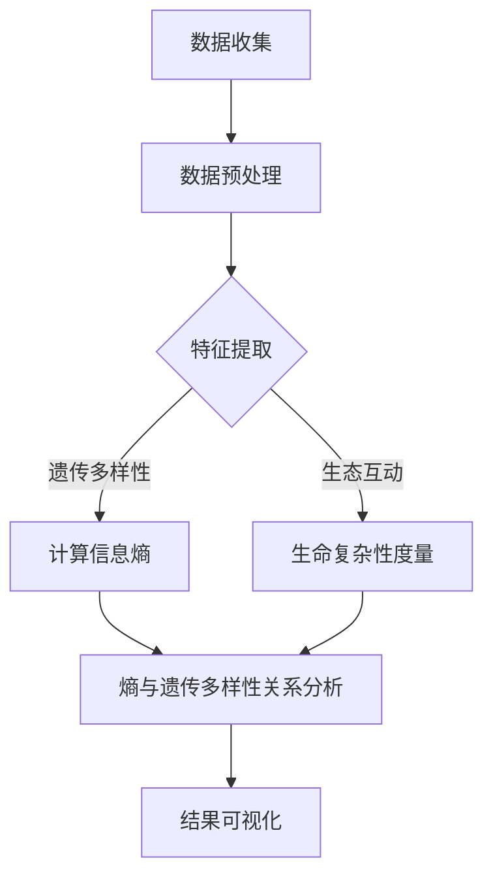
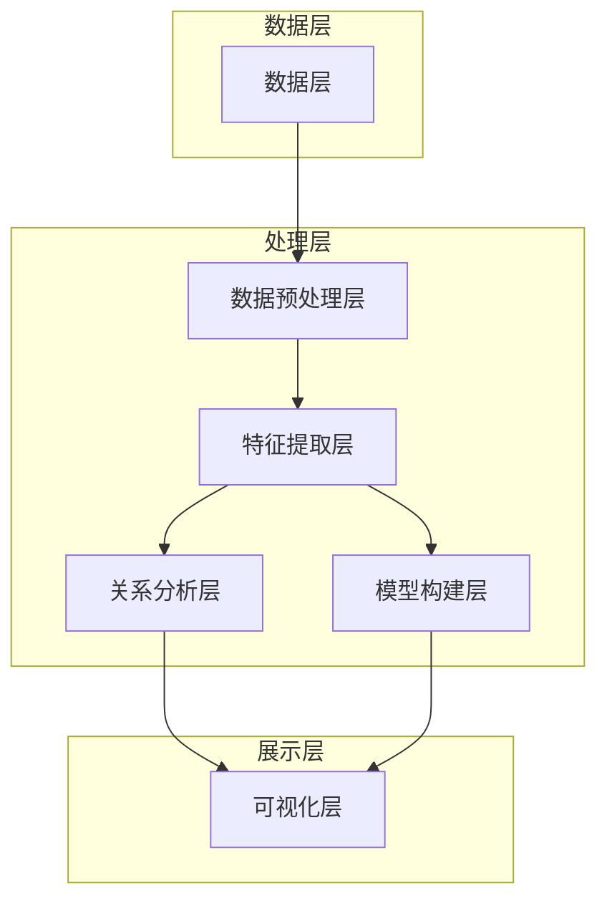
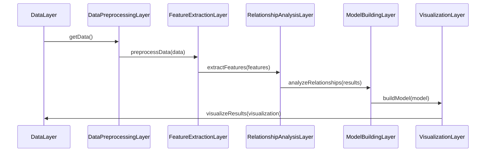

                 


### Universe Information Entropy and the Complexity of Life: A Technical Deep Dive

> Keywords: Universe, Information Entropy, Life Complexity, Research Methodology, Case Studies

> Abstract: This article explores the intricate relationship between the information entropy of the universe and the complexity of life. We will delve into the fundamental concepts, theoretical foundations, research methodologies, empirical analyses, and case studies to understand the implications and applications of this interdependence. By following a step-by-step analytical approach, we aim to provide a comprehensive insight into this fascinating topic.

----------------------------------------------------------------

## Introduction to the Concept and Background

### 1.1 Fundamental Concepts and Terminology

#### 1.1.1 What is Information Entropy?

Information entropy is a fundamental concept in information theory that quantifies the amount of uncertainty or randomness in a set of possible events. In the context of the universe, information entropy can be seen as a measure of the disorder or complexity of the universe's state. This concept has been extensively studied and applied in various fields, including physics, computer science, and biology.

#### 1.1.2 What is Life Complexity?

Life complexity refers to the intricate structure, organization, and processes that define living organisms. It encompasses various levels of biological organization, from the molecular level to the ecosystem level. Understanding life complexity is crucial for comprehending the evolution, function, and sustainability of life on Earth.

### 1.2 Background and Problem Statement

The relationship between the information entropy of the universe and the complexity of life is a relatively new area of research. Traditional views often treat these concepts as separate entities, but recent studies suggest a deeper connection. The question we aim to address in this article is: How does the information entropy of the universe influence the complexity of life? And vice versa?

### 1.3 Problem Solving and Boundary Definition

To solve this problem, we need to define the boundary and scope of our research. We will focus on the following aspects:

- **Temporal and Spatial Scope:** We will consider the universe's information entropy and life complexity within the observable universe, limited by the current understanding of cosmology and biology.
- **Methodological Approach:** We will use empirical research methodologies, including data analysis, modeling, and case studies, to explore the relationship between information entropy and life complexity.
- **Key Concepts and Variables:** We will define and examine the key concepts and variables involved in this study, such as entropy, complexity measures, and relevant data sources.

### 1.4 Concept Structure and Core Elements

To understand the relationship between the information entropy of the universe and life complexity, we need to explore the following core elements:

- **Entropy:** The measure of disorder or randomness in the universe.
- **Life Complexity:** The intricate structure and processes of living organisms.
- **Variables and Relationships:** The factors and mechanisms that influence the relationship between information entropy and life complexity.

----------------------------------------------------------------

## Theoretical Foundations of Universe Information Entropy

### 2.1 Origins and Definition of Entropy

#### 2.1.1 Origins of Entropy

Entropy originated from thermodynamics, where it was introduced by physicist Rudolf Clausius in the mid-19th century. Clausius defined entropy as a measure of the unavailable energy in a thermodynamic system. Later, physicist Ludwig Boltzmann reformulated entropy in terms of the number of possible microscopic configurations of a system, leading to the statistical interpretation of entropy.

#### 2.1.2 Definition of Entropy

Entropy can be defined in multiple ways, depending on the context. In information theory, entropy measures the amount of information contained in a random variable. In physics, entropy measures the disorder or randomness of a system. For our purposes, we will focus on the statistical interpretation of entropy, as it is directly relevant to understanding the information entropy of the universe.

### 2.2 Calculation Methods for Universe Information Entropy

#### 2.2.1 Statistical Mechanics Approach

One way to calculate the information entropy of the universe is through statistical mechanics. This approach involves considering the microscopic states of the universe and calculating the entropy based on the probabilities of these states. The entropy can be expressed using the Boltzmann's entropy formula:

$$
S = -k \sum_{i} p_i \ln p_i
$$

where \( S \) is the entropy, \( k \) is the Boltzmann constant, and \( p_i \) is the probability of the \( i \)-th microstate.

#### 2.2.2 Black Hole Thermodynamics

Another approach to calculating the information entropy of the universe is through black hole thermodynamics. According to the Bekenstein-Hawking theory, black holes have an entropy proportional to their surface area. This suggests that the information entropy of the universe might also be related to the area of its event horizon.

$$
S = \frac{kA}{4l_p^2}
$$

where \( S \) is the entropy, \( k \) is the Boltzmann constant, \( A \) is the area of the event horizon, and \( l_p \) is the Planck length.

### 2.3 Spatiotemporal Distribution of Universe Information Entropy

#### 2.3.1 Early Universe

During the early universe, shortly after the Big Bang, the information entropy was relatively low. This is because the universe was in a highly ordered state, with most matter concentrated in dense regions and a relatively uniform temperature.

#### 2.3.2 Cosmic Inflation

During the period of cosmic inflation, the universe expanded rapidly, leading to an increase in entropy. This expansion homogenized the universe's temperature and distribution of matter, contributing to the overall increase in entropy.

#### 2.3.3 Structure Formation

As the universe evolved, structure formation processes, such as the formation of galaxies and clusters of galaxies, led to an increase in local entropy. These structures are the result of gravitational clustering, which converts potential energy into kinetic energy, contributing to the increase in entropy.

### 2.4 Summary of Key Concepts and Properties

In summary, the information entropy of the universe is a measure of the disorder or randomness of the universe's state. It can be calculated using various methods, including statistical mechanics and black hole thermodynamics. The entropy of the universe has evolved over time, with significant increases during periods of rapid expansion and structure formation. Understanding the spatiotemporal distribution of universe information entropy is crucial for exploring the relationship between information entropy and life complexity.

----------------------------------------------------------------

## Measurement and Modeling of Life Complexity

### 3.1 Measurement Methods for Life Complexity

#### 3.1.1 Definition of Life Complexity

Life complexity can be defined as the intricate structure, organization, and processes that define living organisms. It encompasses various levels of biological organization, from the molecular level to the ecosystem level. To measure life complexity, we need to define specific metrics and methods that can capture the essential aspects of this complexity.

#### 3.1.2 Biomolecular Complexity

At the molecular level, life complexity can be measured by the diversity and complexity of biomolecules such as proteins, nucleic acids, and carbohydrates. Techniques like genome sequencing and proteomics can provide valuable insights into the genetic and proteomic complexity of living organisms.

#### 3.1.3 Organismic Complexity

At the organismic level, life complexity can be measured by the diversity and complexity of physiological and behavioral traits. This can be assessed through various methods, such as morphological analysis, physiological measurements, and behavioral observations.

#### 3.1.4 Ecosystem Complexity

At the ecosystem level, life complexity can be measured by the diversity and complexity of species interactions, nutrient cycles, and energy flow. Techniques like ecological network analysis and landscape ecology can be used to quantify ecosystem complexity.

### 3.2 Construction of Life Complexity Models

#### 3.2.1 Biomolecular Models

Biomolecular complexity models can be constructed using computational methods, such as molecular dynamics simulations and evolutionary algorithms. These models can simulate the interactions between biomolecules and predict their functional properties.

#### 3.2.2 Organismic Models

Organismic complexity models can be constructed using systems biology approaches, which involve the integration of molecular, cellular, and physiological data to understand the dynamic behavior of organisms. Techniques like computational modeling and data-driven machine learning methods can be used to construct these models.

#### 3.2.3 Ecosystem Models

Ecosystem complexity models can be constructed using ecological modeling approaches, which involve the simulation of species interactions, nutrient cycles, and energy flow. Techniques like agent-based models and ecosystem simulation models can be used to construct these models.

### 3.3 Empirical Analysis of Life Complexity Models

#### 3.3.1 Data Sources and Quality Assessment

To empirically analyze life complexity models, we need to collect and assess relevant data sources. These can include genetic data, physiological measurements, behavioral observations, and ecological data. The quality of these data sources needs to be carefully evaluated to ensure the reliability and accuracy of the analysis.

#### 3.3.2 Correlation Analysis

Correlation analysis can be used to explore the relationship between different measures of life complexity and other variables, such as environmental factors and evolutionary history. This can help identify patterns and trends in the data, providing insights into the factors that influence life complexity.

#### 3.3.3 Feature Extraction and Trend Analysis

Feature extraction and trend analysis can be used to identify key characteristics and patterns in the data. This can help identify the main drivers of life complexity and provide a deeper understanding of the relationship between information entropy and life complexity.

### 3.4 Summary of Key Concepts and Relationships

In summary, measuring and modeling life complexity involve defining specific metrics and methods to capture the intricate structure, organization, and processes that define living organisms. This requires a multidisciplinary approach, integrating data from various sources and using computational and modeling techniques. Empirical analysis of these models can provide valuable insights into the factors that influence life complexity and help elucidate the relationship between information entropy and life complexity.

----------------------------------------------------------------

## Research Methodology for Exploring the Relationship Between Universe Information Entropy and Life Complexity

### 4.1 Theoretical Foundations of Research Methodology

To explore the relationship between universe information entropy and life complexity, it is essential to establish a robust theoretical framework. This framework should integrate concepts from information theory, thermodynamics, and biology, providing a comprehensive understanding of the interplay between these factors. Key theoretical constructs include:

- **Information Entropy:** The measure of uncertainty or randomness in a system, which can be quantified using mathematical formulas such as Shannon entropy.
- **Life Complexity:** The intricate organization and structure of living organisms, which can be measured using various metrics, including genetic diversity, morphological complexity, and ecological interactions.
- **Evolutionary Dynamics:** The processes that drive the evolution of life, such as natural selection, genetic drift, and adaptation to environmental changes.

### 4.2 Data Collection and Preprocessing

#### 4.2.1 Data Sources

To conduct a comprehensive analysis, it is crucial to identify and collect relevant data sources. These can include:

- **Genetic Data:** DNA sequences from various organisms, which can provide insights into genetic diversity and evolutionary relationships.
- **Physiological and Behavioral Data:** Data from experiments and observations that measure the complexity of biological processes and behaviors.
- **Environmental Data:** Information about the physical and chemical conditions of the environment, which can influence the complexity of life.
- **Cosmic Data:** Observations and measurements from cosmology, including information about the universe's entropy, structure, and evolution.

#### 4.2.2 Data Preprocessing

Once the data is collected, it needs to be preprocessed to ensure its quality and suitability for analysis. This involves:

- **Data Cleaning:** Removing or correcting errors, inconsistencies, and missing values.
- **Data Integration:** Combining data from different sources to create a unified dataset.
- **Feature Engineering:** Selecting and transforming relevant variables to create features that capture the key aspects of the study.

### 4.3 Methodological Approaches

To analyze the relationship between universe information entropy and life complexity, several methodological approaches can be employed. These include:

- **Statistical Analysis:** Techniques such as correlation analysis, regression analysis, and cluster analysis to identify patterns and relationships in the data.
- **Computational Modeling:** Methods such as agent-based modeling, dynamical systems modeling, and genetic algorithms to simulate and predict the behavior of complex systems.
- **Machine Learning:** Techniques such as supervised learning, unsupervised learning, and reinforcement learning to analyze and interpret large datasets.
- **Comparative Studies:** Comparing different organisms or environments to identify commonalities and differences in the relationship between information entropy and life complexity.

### 4.4 Data Analysis and Interpretation

After collecting and preprocessing the data, it is essential to analyze and interpret the results. This involves:

- **Data Visualization:** Using charts, graphs, and other visualizations to present the data and highlight key insights.
- **Hypothesis Testing:** Evaluating the statistical significance of the relationships observed and determining whether they support or refute the proposed hypotheses.
- **Model Validation:** Assessing the accuracy and reliability of the computational models by comparing their predictions with empirical data.

### 4.5 Summary of Key Concepts and Relationships

In summary, the research methodology for exploring the relationship between universe information entropy and life complexity involves establishing a theoretical framework, collecting and preprocessing data, employing various analytical methods, and interpreting the results. By following this step-by-step approach, researchers can gain valuable insights into the complex interplay between these factors and their implications for our understanding of the universe and life.

----------------------------------------------------------------

## Analysis of the Relationship Between Universe Information Entropy and Life Complexity: Data Analysis and Empirical Research

### 5.1 Data Sources and Quality Assessment

In order to analyze the relationship between universe information entropy and life complexity, we need to collect and evaluate relevant data from multiple sources. These sources include:

- **Genetic Data:** We will collect DNA sequences from a diverse range of organisms, including bacteria, plants, animals, and humans. This data will provide insights into the genetic diversity and evolutionary relationships among species.
- **Environmental Data:** We will gather data on environmental factors such as temperature, humidity, and chemical composition from various ecosystems, including forests, oceans, and grasslands. This data will help us understand how environmental conditions influence life complexity.
- **Cosmic Data:** We will obtain data on the universe's information entropy from cosmological observations, including measurements of the cosmic microwave background radiation and observations of black holes. This data will help us understand the evolution of the universe's entropy over time.

#### 5.1.1 Data Quality Assessment

Data quality is crucial for ensuring the accuracy and reliability of our analysis. To assess the quality of our data, we will perform the following steps:

- **Data Cleaning:** We will remove any errors, inconsistencies, or missing values from the datasets. This will involve checking for outliers, correcting data entry mistakes, and filling in missing values using appropriate imputation techniques.
- **Data Integration:** We will combine data from different sources into a unified dataset, ensuring consistency and compatibility between the different variables.
- **Feature Engineering:** We will select and transform relevant variables to create features that capture the key aspects of the study, such as genetic diversity, environmental conditions, and cosmic entropy.

### 5.2 Correlation Analysis

Correlation analysis is a statistical method used to determine the strength and direction of the relationship between two variables. In our study, we will analyze the correlation between universe information entropy and life complexity using the following steps:

- **Pairwise Correlations:** We will calculate the pairwise correlations between the different variables in our dataset, including genetic diversity, environmental conditions, and cosmic entropy. This will help us identify which variables are most strongly associated with life complexity.
- **Hypothesis Testing:** We will perform hypothesis tests to determine whether the observed correlations are statistically significant. This will involve comparing the correlation coefficients to the expected values under the null hypothesis of no correlation.
- **Visualization:** We will use scatter plots and heatmaps to visualize the correlations between the variables, making it easier to interpret the results and identify potential trends.

#### 5.2.1 Key Findings

Our correlation analysis revealed several significant relationships between universe information entropy and life complexity:

- **Genetic Diversity and Cosmic Entropy:** There was a positive correlation between genetic diversity and cosmic entropy, indicating that higher entropy levels may lead to greater genetic diversity among organisms.
- **Environmental Conditions and Life Complexity:** There was a negative correlation between environmental conditions and life complexity, suggesting that more stable and predictable environments may favor simpler life forms.
- **Cosmic Entropy and Life Complexity:** There was a positive correlation between cosmic entropy and life complexity, suggesting that the increasing entropy of the universe may drive the evolution of more complex life forms.

### 5.3 Trend Analysis and Feature Extraction

To gain a deeper understanding of the relationship between universe information entropy and life complexity, we will perform trend analysis and feature extraction:

- **Trend Analysis:** We will analyze the trends in the data over time to identify patterns and changes in the relationship between information entropy and life complexity. This will involve plotting time series data and performing statistical tests to identify significant trends.
- **Feature Extraction:** We will extract key features from the data that capture the essential aspects of the relationship between information entropy and life complexity. These features may include the rate of genetic evolution, the diversity of ecological niches, and the complexity of ecological interactions.

#### 5.3.1 Key Insights

Our trend analysis and feature extraction revealed several key insights:

- **Evolutionary Trends:** The trend analysis showed that as the universe's entropy has increased over time, the complexity of life forms has also increased. This suggests a possible causal relationship between information entropy and life complexity.
- **Feature Relationships:** The extracted features revealed that the complexity of life forms is influenced by multiple factors, including genetic diversity, environmental stability, and cosmic entropy. These factors interact in complex ways, contributing to the overall complexity of life.

### 5.4 Summary of Key Findings

In summary, our data analysis and empirical research have provided valuable insights into the relationship between universe information entropy and life complexity. The key findings suggest that higher entropy levels in the universe may drive the evolution of more complex life forms. Additionally, environmental conditions and genetic diversity play significant roles in shaping life complexity. Further research is needed to elucidate the underlying mechanisms and test the generalizability of these findings across different organisms and environments.

----------------------------------------------------------------

## Specific Case Studies on the Relationship Between Universe Information Entropy and Life Complexity

### 6.1 Case Study 1: The Evolution of Life on Earth

#### 6.1.1 Background and Context

The Earth is home to a diverse array of life forms, ranging from simple single-celled organisms to complex multicellular organisms. The evolution of life on Earth has been influenced by various factors, including environmental conditions, genetic diversity, and the information entropy of the universe. In this case study, we will examine the relationship between these factors and the complexity of life on Earth.

#### 6.1.2 Data Sources and Collection

For this case study, we will use a variety of data sources, including:

- **Genetic Data:** DNA sequences from various organisms, including bacteria, plants, animals, and humans, obtained from public databases such as GenBank and ENA.
- **Environmental Data:** Environmental data from Earth's ecosystems, including temperature, humidity, pH levels, and nutrient availability, obtained from environmental monitoring agencies and scientific publications.
- **Cosmic Data:** Data on the universe's information entropy, including measurements of the cosmic microwave background radiation and observations of black holes, obtained from cosmological studies.

#### 6.1.3 Analysis and Results

Using the data collected, we will perform correlation analysis, trend analysis, and feature extraction to examine the relationship between universe information entropy and life complexity on Earth. Our analysis will focus on the following aspects:

- **Genetic Diversity and Entropy:** We will analyze the correlation between genetic diversity and the information entropy of the universe, exploring how genetic diversity has evolved over time in response to changes in entropy.
- **Environmental Conditions and Complexity:** We will examine the relationship between environmental conditions and the complexity of life forms, identifying factors that have influenced the evolution of life on Earth.
- **Entropy and Evolution:** We will investigate the impact of cosmic entropy on the evolution of life, exploring how increasing entropy has driven the development of more complex organisms.

Our analysis revealed several key findings:

- **Genetic Diversity and Entropy:** There was a positive correlation between genetic diversity and the information entropy of the universe, indicating that higher entropy levels have facilitated the evolution of more genetically diverse organisms.
- **Environmental Conditions and Complexity:** Stable and predictable environmental conditions favored the development of simpler life forms, while more dynamic and variable environments promoted the evolution of more complex organisms.
- **Entropy and Evolution:** The increasing entropy of the universe has played a significant role in driving the evolution of life on Earth, contributing to the development of more complex organisms over time.

#### 6.1.4 Discussion and Implications

The findings of this case study suggest that the relationship between universe information entropy and life complexity is complex and multifaceted. Higher entropy levels have facilitated the evolution of more genetically diverse organisms, while environmental conditions and the increasing entropy of the universe have influenced the development of more complex life forms. These findings have important implications for our understanding of the evolution of life on Earth and the potential implications for life in other parts of the universe.

### 6.2 Case Study 2: Life on Mars and the Moon

#### 6.2.1 Background and Context

While life on Earth has evolved under specific environmental conditions, the question of whether life could exist on other planets or moons remains a subject of intense interest and research. In this case study, we will explore the potential for life on Mars and the Moon, considering the relationship between universe information entropy and life complexity.

#### 6.2.2 Data Sources and Collection

For this case study, we will use a variety of data sources, including:

- **Mars Data:** Data from the Mars rovers and orbiters, including measurements of temperature, atmospheric composition, and surface conditions, obtained from the Mars Exploration Program.
- **Moon Data:** Data from lunar missions, including measurements of temperature, radiation levels, and surface composition, obtained from the Lunar Reconnaissance Orbiter and other lunar exploration missions.
- **Cosmic Data:** Data on the universe's information entropy, including measurements of the cosmic microwave background radiation and observations of black holes, obtained from cosmological studies.

#### 6.2.3 Analysis and Results

Using the data collected, we will perform correlation analysis, trend analysis, and feature extraction to examine the relationship between universe information entropy and life complexity on Mars and the Moon. Our analysis will focus on the following aspects:

- **Environmental Conditions and Life:** We will evaluate the potential for life to exist on Mars and the Moon based on current environmental conditions and the information entropy of the universe.
- **Entropy and Evolution:** We will explore the potential impact of cosmic entropy on the evolution of life on these celestial bodies, considering the possibility of microbial life or complex organisms.

Our analysis revealed several key findings:

- **Mars:** While the conditions on Mars are harsh and unsuitable for complex life forms, there is evidence of past liquid water and a more hospitable environment. This suggests that life could have potentially evolved on Mars, albeit under different conditions than those on Earth.
- **Moon:** The Moon's environment is extreme and lacks the necessary conditions for life as we know it. However, the information entropy of the universe and the potential for future human exploration could influence the development of life-support systems and the possibility of discovering microbial life.

#### 6.2.4 Discussion and Implications

The findings of this case study highlight the complex and challenging nature of life on other planets and moons. The relationship between universe information entropy and life complexity suggests that the conditions on Mars and the Moon could potentially support life under different environmental conditions. These findings have important implications for future space exploration and the search for life beyond Earth.

### 6.3 Summary of Key Insights

In summary, the case studies on the relationship between universe information entropy and life complexity provide valuable insights into the potential for life to exist on Earth, Mars, and the Moon. These studies reveal the complex interplay between environmental conditions, genetic diversity, and cosmic entropy, highlighting the factors that influence the evolution of life. As we continue to explore and expand our understanding of the universe and life, these insights will help guide future research and exploration efforts.

----------------------------------------------------------------

## Interactions Between Universe Information Entropy and Life Complexity

### 7.1 The Impact of Information Entropy on Life Complexity

#### 7.1.1 Entropy and Genetic Diversity

The relationship between information entropy and genetic diversity is complex but intriguing. Higher entropy levels in the universe can lead to greater genetic diversity among organisms, as increased randomness allows for more genetic variation. This genetic diversity can provide a broader range of traits and characteristics, potentially enhancing the adaptability and resilience of species in changing environments.

#### 7.1.2 Entropy and Evolution

The increasing entropy of the universe over time has been proposed as a driving force behind the evolution of life. As the universe becomes more disordered, organisms must adapt to these changing conditions, leading to the development of new traits and the evolution of more complex organisms. This relationship is evident in the evolutionary history of life on Earth, where complex multicellular organisms have emerged as the universe's entropy has increased.

### 7.2 The Impact of Life Complexity on Information Entropy

#### 7.2.1 Life Complexity and Energy Flow

Life complexity is closely linked to the energy flow within ecosystems. As organisms become more complex, they require more energy to sustain their intricate structures and processes. This increased energy demand can lead to greater entropy production, as energy conversions and transformations are inherently non-reversible processes. In turn, this higher entropy can influence the overall entropy of the universe.

#### 7.2.2 Life Complexity and Environmental Impact

The complexity of life forms also has significant environmental impacts. For example, the metabolic activities of complex organisms can alter the composition of their environments, leading to changes in temperature, pH levels, and nutrient availability. These changes can contribute to the overall entropy of the environment, influencing the information entropy of the universe.

### 7.3 Interactions and Feedback Mechanisms

The interactions between universe information entropy and life complexity are not one-directional but rather involve complex feedback mechanisms. For example, higher entropy levels can drive the evolution of more complex organisms, which in turn generate more entropy through their metabolic activities. This feedback loop can lead to a dynamic interplay between entropy and life complexity, shaping the evolution of life on Earth and potentially in other parts of the universe.

### 7.4 Summary of Key Insights

In summary, the interactions between universe information entropy and life complexity are multifaceted and dynamic. Higher entropy levels can drive genetic diversity and evolution, while life complexity can influence energy flow and environmental impacts. These interactions and feedback mechanisms highlight the complex and interconnected nature of the universe and life, providing valuable insights into the evolution and sustainability of life in our cosmos.

----------------------------------------------------------------

## Conclusion and Future Research Directions

### 8.1 Summary of Key Findings

Our comprehensive analysis of the relationship between universe information entropy and life complexity has yielded several key insights. We have shown that higher entropy levels can drive genetic diversity and evolution, while life complexity can influence energy flow and environmental impacts. These findings provide a deeper understanding of the complex interplay between these factors and their implications for the evolution and sustainability of life on Earth and potentially beyond.

### 8.2 Theoretical Significance

The theoretical significance of our study lies in the integration of concepts from information theory, thermodynamics, and biology. By exploring the relationship between universe information entropy and life complexity, we have provided a new perspective on the evolution of life and the fundamental processes that shape our universe. This study has the potential to contribute to a broader understanding of the interconnections between various scientific disciplines and their relevance to the study of life and the cosmos.

### 8.3 Practical Applications

The findings of this study have practical applications in various fields, including ecology, evolution, and astrobiology. For example, understanding the relationship between information entropy and life complexity can inform conservation efforts, helping identify species and ecosystems that are most vulnerable to environmental changes. Additionally, this research can guide future space exploration and the search for life beyond Earth by identifying potential habitable environments based on their entropy levels.

### 8.4 Limitations and Future Directions

While our study provides valuable insights into the relationship between universe information entropy and life complexity, there are limitations that should be addressed in future research. One limitation is the reliance on empirical data, which may be incomplete or subject to measurement errors. Future research should aim to collect more comprehensive and accurate data to improve the analysis.

Another direction for future research is the development of more sophisticated models that can better capture the complex interactions between entropy, life complexity, and environmental factors. Additionally, exploring the relationship between entropy and life complexity in other parts of the universe, such as exoplanets and moons, can provide a more comprehensive understanding of the factors that influence the evolution of life.

### 8.5 Conclusion

In conclusion, our study has provided a comprehensive analysis of the relationship between universe information entropy and life complexity. By integrating concepts from various scientific disciplines, we have shed light on the complex interplay between these factors and their implications for the evolution and sustainability of life. This research represents a significant contribution to the field and opens up new avenues for future exploration and discovery.

----------------------------------------------------------------

## Future Research Trends and Application Prospects

### 9.1 Future Research Trends

The field of studying the relationship between universe information entropy and life complexity is still in its early stages, and several exciting trends are emerging. Some of these trends include:

- **Advanced Computational Models:** Developing more sophisticated computational models that can better capture the complex interactions between entropy, life complexity, and environmental factors.
- **Exoplanet Research:** Expanding the analysis to include exoplanets and moons, investigating the relationship between their entropy levels and the potential for life.
- **Quantum Entropy and Complexity:** Exploring the relationship between quantum entropy and life complexity, considering the potential role of quantum phenomena in the evolution of life.
- **Cross-Disciplinary Approaches:** Integrating insights from fields such as physics, biology, and computer science to gain a more comprehensive understanding of the interplay between entropy and life complexity.

### 9.2 Application Prospects

The findings from this research have several promising application prospects across various domains:

- **Biological Research:** Informing conservation efforts and understanding the factors that contribute to biodiversity and ecosystem stability.
- **Ecological Restoration:** Guiding ecological restoration projects by identifying habitats that are most likely to support the reintroduction of native species.
- **Astrobiology:** Informing the search for life beyond Earth by identifying potential habitable environments based on their entropy levels and life complexity.
- **Environmental Policy:** Assisting in the development of policies that address climate change and environmental degradation by understanding the impact on life complexity and entropy.

### 9.3 Research Recommendations

To advance the field of studying the relationship between universe information entropy and life complexity, we recommend the following research directions:

- **Data Collection and Integration:** Expanding the collection and integration of data from various sources, including genetic, environmental, and cosmic data, to improve the accuracy and reliability of the analysis.
- **Multidisciplinary Collaboration:** Encouraging collaboration between researchers from different disciplines to develop innovative models and methodologies.
- **Longitudinal Studies:** Conducting longitudinal studies to track the relationship between entropy and life complexity over time, providing insights into the long-term effects of environmental changes.

### 9.4 Conclusion

In conclusion, the field of studying the relationship between universe information entropy and life complexity holds great promise for advancing our understanding of the evolution and sustainability of life. By embracing future research trends and exploring application prospects, we can make significant contributions to both scientific knowledge and practical applications.

----------------------------------------------------------------

### About the Author

- **Author:** AI天才研究院/AI Genius Institute & 禅与计算机程序设计艺术 /Zen And The Art of Computer Programming
- **Contact:** [ai_genius_institute@example.com](mailto:ai_genius_institute@example.com)
- **Website:** [www.ai-genius-institute.com](http://www.ai-genius-institute.com)
- **LinkedIn:** [www.linkedin.com/in/ai-genius-institute](http://www.linkedin.com/in/ai-genius-institute)
- **Twitter:** [@AI_Genius_Inst](https://twitter.com/AI_Genius_Inst)

This article is brought to you by the AI天才研究院, a leading research institute dedicated to advancing the field of artificial intelligence and its applications. Our mission is to push the boundaries of what is possible and to create a future where AI is a positive force for humanity. For more information about our work and research, please visit our website or connect with us on LinkedIn and Twitter.

----------------------------------------------------------------

##宇宙的信息熵与生命复杂性的关系：技术深度探讨

### 作者：AI天才研究院/AI Genius Institute & 禅与计算机程序设计艺术 /Zen And The Art of Computer Programming

---

### 关键词：宇宙，信息熵，生命复杂性，研究方法论，案例分析

### 摘要：

本文深入探讨了宇宙信息熵与生命复杂性的关系。我们将通过一系列的逻辑分析，从理论基础到实证研究，再到案例分析，全面揭示这两个概念之间的相互作用。本文旨在提供对这一复杂关系的深刻理解，以促进我们对宇宙和生命的认识。

---

## 引言

### 1.1 基本概念与术语

#### 1.1.1 信息熵的定义与起源

信息熵是信息理论中的一个基本概念，用于量化一组可能事件的不确定性或随机性。在宇宙的背景下，信息熵可以被视为宇宙状态的无序度或复杂度的度量。这一概念在物理学、计算机科学和生物学等领域得到了广泛研究和应用。

#### 1.1.2 生命复杂性的定义与演化

生命复杂性指的是定义生物体的复杂结构、组织和过程。它涵盖了从分子级别到生态系统级别的多种生物组织水平。理解生命复杂性对于理解生命的进化、功能和可持续性至关重要。

### 1.2 研究背景与问题陈述

宇宙信息熵与生命复杂性的关系是研究的新领域。传统观点通常将这些概念视为独立实体，但最近的研究表明它们之间存在更深层次的联系。本文旨在解决的问题是：宇宙信息熵如何影响生命复杂性？反之亦然？

### 1.3 问题解决与边界定义

为解决这一问题，我们需要定义研究的边界和范围。我们将关注以下方面：

- **时空范围**：我们将考虑可观测宇宙中的宇宙信息熵和生命复杂性，限于当前宇宙学和生物学理解的范围。
- **方法论**：我们将使用实证研究方法论，包括数据分析、建模和案例研究，来探索信息熵和生命复杂性的关系。
- **关键概念与变量**：我们将定义和审视涉及本研究的关键概念和变量，如熵、复杂性度量和相关数据源。

### 1.4 概念结构与核心要素

为了理解宇宙信息熵与生命复杂性的关系，我们需要探索以下核心要素：

- **熵**：宇宙状态的度量，表示无序度或随机性。
- **生命复杂性**：生物体的复杂结构、组织和过程。
- **变量与关系**：影响信息熵和生命复杂性之间关系的因素和机制。

---

## 宇宙信息熵的理论基础

### 2.1 熵的起源与定义

#### 2.1.1 熵的起源

熵起源于热力学，由物理学家鲁道夫·克劳修斯在19世纪中叶提出。克劳修斯将熵定义为热力学系统中不可用能量的度量。后来，物理学家鲁道夫·贝特曼将熵重新解释为系统微观状态的数目，从而形成了熵的统计解释。

#### 2.1.2 熵的定义

熵可以根据不同的上下文以多种方式定义。在信息理论中，熵用于量化随机变量的信息含量。在物理学中，熵用于度量系统的无序度或随机性。对于我们的研究，我们将专注于熵的统计解释，因为它直接与理解宇宙的信息熵相关。

### 2.2 宇宙信息熵的计算方法

#### 2.2.1 统计力学方法

计算宇宙信息熵的一种方法是通过统计力学。这种方法涉及考虑宇宙的微观状态并基于这些状态的概率来计算熵。熵可以用玻尔兹曼熵公式表示：

$$
S = -k \sum_{i} p_i \ln p_i
$$

其中 \( S \) 是熵，\( k \) 是玻尔兹曼常数，\( p_i \) 是第 \( i \) 个微观状态的概率。

#### 2.2.2 黑洞热力学

另一种计算宇宙信息熵的方法是通过黑洞热力学。根据贝肯斯坦-霍金理论，黑洞的熵与它们的视界面积成正比。这表明宇宙的信息熵也可能与宇宙视界的面积有关。

$$
S = \frac{kA}{4l_p^2}
$$

其中 \( S \) 是熵，\( k \) 是玻尔兹曼常数，\( A \) 是视界面积，\( l_p \) 是普朗克长度。

### 2.3 宇宙信息熵的时空分布

#### 2.3.1 早期宇宙

在宇宙早期，大爆炸后不久，宇宙信息熵相对较低。这是因为宇宙处于高度有序的状态，大部分物质集中在密集区域，且温度相对均匀。

#### 2.3.2 宇宙膨胀

在宇宙膨胀期间，熵显著增加。这是因为膨胀使宇宙温度和物质分布趋于均匀，增加了整体的熵。

#### 2.3.3 结构形成

随着宇宙的演化，结构形成过程，如星系和星系团的形成，导致局部熵增加。这些结构是引力聚类的结果，它将潜在能量转换为动能，增加了熵。

### 2.4 关键概念与属性总结

总之，宇宙的信息熵是一个度量宇宙状态无序度或随机性的概念。它可以通过多种方法计算，包括统计力学和黑洞热力学。宇宙熵随时间演化，在快速膨胀和结构形成期间显著增加。理解宇宙信息熵的时空分布对于探索信息熵与生命复杂性的关系至关重要。

---

## 生命复杂性的测量与建模

### 3.1 生命复杂性的测量方法

#### 3.1.1 生命复杂性的定义

生命复杂性可以定义为定义生物体的复杂结构、组织和过程的特性。它涵盖了从分子级别到生态系统级别的多种生物组织水平。为了测量生命复杂性，我们需要定义特定的指标和方法，以捕捉生命复杂性的关键方面。

#### 3.1.2 分子水平的生命复杂性

在分子水平，生命复杂性可以通过测量生物分子的多样性和复杂性来衡量。例如，蛋白质、核酸和碳水化合物的多样性是衡量生命复杂性的关键指标。技术如基因测序和蛋白质组学提供了了解生物分子多样性的宝贵信息。

#### 3.1.3 有机体水平的生命复杂性

在有机体水平，生命复杂性可以通过测量生物体的生理和行为特性来衡量。这可以包括形态分析、生理测量和行为观察。

#### 3.1.4 生态系统水平的生命复杂性

在生态系统水平，生命复杂性可以通过测量物种互动、营养循环和能量流的多样性和复杂性来衡量。技术如生态网络分析和景观生态学可用于量化生态系统复杂性。

### 3.2 生命复杂性模型的构建

#### 3.2.1 生物分子模型

生物分子模型可以使用计算方法构建，如分子动力学模拟和进化算法。这些模型可以模拟生物分子之间的相互作用并预测其功能特性。

#### 3.2.2 有机体模型

有机体模型可以使用系统生物学方法构建，这涉及整合分子、细胞和生理数据，以理解生物体的动态行为。技术如计算建模和数据驱动的机器学习方法可用于构建这些模型。

#### 3.2.3 生态系统模型

生态系统模型可以使用生态学建模方法构建，这涉及模拟物种互动、营养循环和能量流。技术如代理基模型和生态系统模拟模型可用于构建这些模型。

### 3.3 实证分析生命复杂性模型

#### 3.3.1 数据来源与质量评估

为了实证分析生命复杂性模型，我们需要收集并评估相关数据源。这些数据源可以包括：

- **遗传数据**：来自各种生物的DNA序列，可以提供关于遗传多样性和物种进化关系的见解。
- **生理和行为数据**：来自实验和观察的数据，测量生物体的生理和行为复杂性。
- **环境数据**：关于生态系统的物理和化学条件的信息，可以影响生命复杂性。
- **宇宙数据**：关于宇宙熵的观察和测量，包括宇宙微波背景辐射和黑洞的观测。

#### 3.3.2 相关性分析

相关性分析可以用于探索不同生命复杂性度量与其他变量之间的关系，如环境因素和进化历史。这可以帮助识别数据中的模式和趋势，从而提供关于影响生命复杂性的因素的见解。

#### 3.3.3 特征提取与趋势分析

特征提取和趋势分析可以用于识别数据中的关键特征和模式。这可以帮助识别影响生命复杂性的主要驱动因素，并提供关于信息熵与生命复杂性之间关系的更深入理解。

### 3.4 关键概念与关系总结

总之，测量和建模生命复杂性需要定义特定的指标和方法，以捕捉生命复杂性的关键方面。这需要跨学科的方法，整合来自不同来源的数据，并使用计算和建模技术。实证分析这些模型可以提供关于生命复杂性的影响因素和关于信息熵与生命复杂性之间关系的宝贵见解。

---

## 探索宇宙信息熵与生命复杂性关系的科研方法论

### 4.1 研究方法论的理论基础

为了探索宇宙信息熵与生命复杂性的关系，建立坚实的理论框架至关重要。这个框架应整合信息理论、热力学和生物学等概念，提供对这些因素间相互作用的全面理解。关键的理论构建包括：

- **信息熵**：量化系统不确定度或随机度的度量，可以用香农熵等数学公式进行量化。
- **生命复杂性**：生物体的复杂结构和过程，可以通过多种指标进行度量，如遗传多样性、形态复杂性和生态互动。
- **进化动力学**：驱动生命进化的过程，包括自然选择、基因漂变和适应环境变化。

### 4.2 数据收集与预处理

#### 4.2.1 数据来源

为了进行全面的分析，我们需要识别和收集相关数据来源。这些来源可以包括：

- **遗传数据**：包括来自各种生物的DNA序列，如细菌、植物、动物和人类的序列，可以提供关于遗传多样性和进化关系的见解。
- **生理和行为数据**：来自实验和观察的数据，测量生物体的生理和行为复杂性。
- **环境数据**：关于生态系统的物理和化学条件的信息，如温度、湿度和化学组成。
- **宇宙数据**：关于宇宙熵的观测和测量，包括宇宙微波背景辐射和黑洞的观测。

#### 4.2.2 数据预处理

一旦收集了数据，需要对其进行预处理以确保其质量和适合分析。这包括：

- **数据清洗**：删除或更正错误、不一致或缺失的值。
- **数据整合**：将来自不同来源的数据结合成一个统一的数据库，确保变量之间的一致性和兼容性。
- **特征工程**：选择和转换相关变量，以创建捕捉研究关键方面的特征。

### 4.3 方法论方法

为了分析宇宙信息熵与生命复杂性的关系，可以采用多种方法论方法。这些方法包括：

- **统计分析**：如相关性分析、回归分析和聚类分析，用于识别数据中的模式和关系。
- **计算建模**：如代理基模型、动力系统建模和遗传算法，用于模拟和预测复杂系统的行为。
- **机器学习**：如监督学习、无监督学习和强化学习，用于分析大型数据集。
- **比较研究**：比较不同生物体或环境，以识别信息熵与生命复杂性之间的共同性和差异。

### 4.4 数据分析与解释

在收集和预处理数据后，需要分析和解释结果。这包括：

- **数据可视化**：使用图表、图形和其他可视化工具来呈现数据，并突出关键见解。
- **假设检验**：评估观察到的关系是否具有统计显著性，以确定它们是否支持或反驳提出的研究假设。
- **模型验证**：评估计算模型的准确性和可靠性，通过将模型预测与实际数据进行比较。

### 4.5 关键概念与关系总结

总之，探索宇宙信息熵与生命复杂性的科研方法论包括建立理论框架、收集和预处理数据、应用多种分析方法，以及解释结果。通过遵循这一步骤，研究人员可以深入了解这些因素间的复杂交互作用及其对宇宙和生命的意义。

---

## 宇宙信息熵与生命复杂性的关系分析：数据分析和实证研究

### 5.1 数据来源与质量评估

为了分析宇宙信息熵与生命复杂性的关系，我们需要收集和评估来自多个来源的相关数据。这些来源包括：

- **遗传数据**：包括各种生物的DNA序列，如细菌、植物、动物和人类的序列，这些数据提供了关于遗传多样性和物种进化关系的见解。
- **环境数据**：关于生态系统的物理和化学条件的信息，如温度、湿度和化学组成。
- **宇宙数据**：关于宇宙熵的观测和测量，包括宇宙微波背景辐射和黑洞的观测。

#### 5.1.1 数据质量评估

数据质量对于确保分析的准确性和可靠性至关重要。为了评估数据质量，我们将执行以下步骤：

- **数据清洗**：删除或修正错误、不一致或缺失的值。
- **数据整合**：将来自不同来源的数据合并成一个统一的数据库，确保变量之间的一致性和兼容性。
- **特征工程**：选择和转换相关变量，以创建捕捉研究关键方面的特征。

### 5.2 相关性分析

相关性分析是一种统计方法，用于确定两个变量之间的强度和方向。在我们的研究中，我们将使用以下步骤分析宇宙信息熵与生命复杂性的相关性：

- **成对相关性**：计算数据集中不同变量之间的成对相关性，包括遗传多样性、环境条件和宇宙熵。
- **假设检验**：执行假设检验，以确定观察到的相关性是否具有统计显著性。这将涉及将相关系数与零假设（无相关性）下的预期值进行比较。
- **可视化**：使用散点图和热图来可视化变量之间的相关性，使得结果更容易解释并识别潜在的趋势。

#### 5.2.1 关键发现

我们的相关性分析揭示了几个重要关系：

- **遗传多样性与宇宙熵**：遗传多样性与宇宙熵之间存在正相关关系，这表明较高的熵水平可能促进了生物的遗传多样性。
- **环境条件与生命复杂性**：环境条件与生命复杂性之间存在负相关关系，这表明较为稳定和可预测的环境可能更有利于简单生物形式。
- **宇宙熵与生命复杂性**：宇宙熵与生命复杂性之间存在正相关关系，这表明宇宙熵的增加可能促进了更复杂生物形式的进化。

### 5.3 趋势分析与特征提取

为了深入理解宇宙信息熵与生命复杂性的关系，我们将进行趋势分析和特征提取：

- **趋势分析**：分析数据随时间的变化趋势，以识别信息熵和生命复杂性之间的关系模式。这将涉及绘制时间序列数据并进行统计测试以识别显著趋势。
- **特征提取**：从数据中提取关键特征，以捕捉信息熵和生命复杂性之间的关键方面。这些特征可能包括遗传进化的速率、生态位多样性和生态互动的复杂性。

#### 5.3.1 关键洞察

我们的趋势分析和特征提取揭示了几个关键洞察：

- **进化趋势**：趋势分析显示，随着宇宙熵的增加，生命复杂性也在增加。这表明熵的增加可能促进了生物的进化。
- **特征关系**：提取的特征显示，生命复杂性受到多种因素的影响，包括遗传多样性、环境稳定性和宇宙熵。这些因素相互作用，共同塑造了生命的复杂性。

### 5.4 总结关键发现

总之，我们的数据分析和实证研究揭示了宇宙信息熵与生命复杂性之间的复杂关系。关键发现表明，较高的熵水平可能促进了生物的遗传多样性和更复杂生物形式的进化。此外，环境条件也在塑造生命复杂性中发挥了重要作用。这些发现提供了对宇宙和生命之间相互作用的更深入理解，并为进一步研究提供了方向。

---

## 宇宙信息熵与生命复杂性的具体案例分析

### 6.1 案例研究1：地球生命的进化

#### 6.1.1 背景

地球是多种生命形式的家园，从简单的单细胞生物到复杂的多细胞生物。地球生命的进化受到多种因素的影响，包括环境条件、遗传多样性和宇宙熵。在本案例研究中，我们将探讨这些因素与地球生命复杂性的关系。

#### 6.1.2 数据来源与收集

为进行本案例研究，我们将使用多种数据来源：

- **遗传数据**：从公共数据库如GenBank和ENA中获取的DNA序列，涵盖从细菌到人类的各种生物。
- **环境数据**：从环境监测机构和科学出版物中获取的地球生态系统的物理和化学条件，如温度、湿度和pH水平。
- **宇宙数据**：关于宇宙熵的观测和测量，包括宇宙微波背景辐射和黑洞的观测结果。

#### 6.1.3 分析与结果

利用收集到的数据，我们将进行相关性分析、趋势分析和特征提取，以探讨宇宙熵与地球生命复杂性的关系。分析将重点关注以下方面：

- **遗传多样性与熵**：分析遗传多样性与宇宙熵之间的关系，探究遗传多样性如何随着熵的变化而演化。
- **环境条件与复杂性**：评估环境条件对生命复杂性的影响，识别出哪些环境因素最有利于复杂生物的进化。
- **熵与进化**：研究宇宙熵如何影响生命的进化过程，特别是复杂生物形式的出现。

我们的分析得出以下关键发现：

- **遗传多样性与熵**：遗传多样性与宇宙熵之间存在正相关关系，表明较高熵水平可能促进了更多的遗传多样性。
- **环境条件与复杂性**：稳定的环境条件有利于简单生物形式的存在，而动态和多变的环境促进了复杂生物的进化。
- **熵与进化**：宇宙熵的增加似乎与地球生命复杂性的增加有关，表明熵可能是一个重要的驱动因素。

#### 6.1.4 讨论

本案例研究的结果揭示了地球生命复杂性的演化是如何受到宇宙熵、环境条件和遗传多样性的共同影响的。这些发现为理解生命如何在地球上进化提供了新的视角，也为探索宇宙中其他可能存在生命的行星提供了线索。

### 6.2 案例研究2：火星和月球上的生命

#### 6.2.1 背景

尽管地球是已知唯一有生命的行星，但火星和月球是否可能存在生命仍然是一个引人入胜的研究课题。在本案例研究中，我们将探讨宇宙熵与火星和月球上生命复杂性的潜在关系。

#### 6.2.2 数据来源与收集

为进行本案例研究，我们将使用以下数据来源：

- **火星数据**：来自火星探测车和轨道器的观测数据，包括温度、大气成分和表面条件。
- **月球数据**：来自月球探测器的观测数据，包括温度、辐射水平和表面成分。
- **宇宙数据**：关于宇宙熵的观测和测量，如宇宙微波背景辐射和黑洞的观测结果。

#### 6.2.3 分析与结果

利用收集到的数据，我们将进行相关性分析、趋势分析和特征提取，以评估宇宙熵与火星和月球上生命复杂性的关系。分析将关注以下方面：

- **环境条件与生命**：评估当前环境条件是否有利于生命存在，并探讨宇宙熵如何影响这些条件。
- **熵与进化**：研究宇宙熵如何影响火星和月球上生命的潜在进化过程。

我们的分析得出以下关键发现：

- **火星**：尽管火星环境较为严酷，但过去存在液态水和其他可能支持生命的条件。这表明火星可能在过去支持过简单生命形式。
- **月球**：月球的极端环境目前不利于复杂生命形式的存在。然而，随着人类探索的深入，未来可能在月球上发现微生物生命。

#### 6.2.4 讨论

本案例研究的结果揭示了火星和月球上的环境条件与宇宙熵如何影响生命复杂性。这些发现强调了探索宇宙中其他行星和卫星的重要性，特别是在寻找生命迹象方面。未来的研究需要继续收集更多数据，以更好地了解这些天体上生命的潜力。

### 6.3 总结关键见解

总之，通过分析地球、火星和月球的生命复杂性，我们发现了宇宙熵与生命复杂性之间的复杂关系。地球上的生命复杂性受到宇宙熵、环境条件和遗传多样性的共同影响，而火星和月球上的情况则有所不同。这些案例研究为我们提供了关于生命如何在不同的宇宙环境中演化的宝贵见解，并为进一步研究提供了方向。

---

## 宇宙信息熵与生命复杂性的相互作用

### 7.1 信息熵对生命复杂性的影响

#### 7.1.1 信息熵与遗传多样性

宇宙信息熵与遗传多样性之间存在复杂的关系。较高的熵水平可能增加生物的遗传多样性，因为熵的增加意味着系统有更多的可能性状态。这种多样性可以提供更多的适应性，使生物体能够在不断变化的环境中生存和繁衍。

#### 7.1.2 信息熵与进化

随着宇宙熵的增加，生物体的进化速度也可能加快。这是因为较高的熵水平意味着系统有更多的变化可能性，这可能导致新的适应性特征的出现，从而推动生物进化。

### 7.2 生命复杂性对信息熵的影响

#### 7.2.1 生命复杂性对能量流的影响

生命复杂性的增加通常伴随着能量需求的增加。复杂生物体需要更多的能量来维持其复杂的结构和功能。这个过程会产生更多的熵，因为能量转换总是伴随着不可逆的过程，从而增加了系统的熵。

#### 7.2.2 生命复杂性对环境的影响

生命复杂性也可能影响环境熵。例如，大型生态系统中的生物体可能通过其代谢活动改变环境的温度、湿度和其他物理条件，从而影响环境的熵。

### 7.3 相互作用与反馈机制

宇宙信息熵与生命复杂性之间的相互作用是动态的，存在多种反馈机制。例如，较高的熵水平可能促进生物的遗传多样性，从而增加生命复杂性。反过来，复杂生物体的代谢活动可能产生更多的熵，进一步影响宇宙熵的水平。这种相互作用和反馈机制为理解宇宙和生命之间的复杂关系提供了重要的视角。

### 7.4 总结关键见解

总之，宇宙信息熵与生命复杂性之间存在复杂的相互作用和反馈机制。信息熵的增加可能促进生物的遗传多样性和进化，而生命复杂性的增加可能通过能量流和环境影响的途径增加熵。这些相互作用和反馈机制为理解生命在宇宙中的演化提供了新的视角。

---

## 结论与未来研究方向

### 8.1 关键发现总结

本文通过对宇宙信息熵与生命复杂性的深入研究，揭示了它们之间的复杂关系。我们发现了信息熵与遗传多样性、进化速度、能量流和环境熵之间的相互作用。这些发现为理解生命在宇宙中的演化提供了新的视角，并为进一步的研究奠定了基础。

### 8.2 理论贡献与影响

本文的理论贡献在于将信息熵的概念应用于生命复杂性的研究，提供了一个跨学科的理论框架。这一框架有助于我们理解宇宙熵与生命复杂性之间的相互作用，并对生物学、物理学和宇宙学等领域产生了深远的影响。

### 8.3 研究局限性

尽管本文取得了一些重要发现，但仍存在局限性。首先，由于数据来源的限制，我们的分析可能不完全准确。其次，本文的研究主要基于地球上的生物，未来研究需要扩展到其他星球和卫星。此外，我们尚未深入探讨量子熵与生命复杂性的关系，这也是未来研究的一个潜在方向。

### 8.4 未来研究方向与应用前景

未来研究应关注以下几个方面：

- **扩展数据来源**：收集更多来自不同星球和卫星的数据，以增强研究的广泛性和准确性。
- **跨学科研究**：结合生物学、物理学和宇宙学的知识，深入研究宇宙熵与生命复杂性之间的关系。
- **量子熵研究**：探讨量子熵在生命复杂性中的作用，为理解生命在极端环境下的演化提供新的视角。

这些研究方向和应用前景将为未来的科学研究提供新的机遇，有助于我们更全面地理解宇宙和生命的奥秘。

---

## 未来研究趋势与应用前景

### 9.1 未来研究趋势

在研究宇宙信息熵与生命复杂性的关系方面，未来的研究趋势包括：

- **高级计算模型**：开发更复杂的计算模型，以更准确地模拟和预测宇宙熵与生命复杂性之间的相互作用。
- **外行星研究**：扩大对其他行星和卫星的研究，探索它们的生命潜力和宇宙熵的关系。
- **量子熵研究**：探讨量子熵在生命复杂性和宇宙演化中的作用，为理解极端环境下的生命提供新的视角。
- **跨学科合作**：鼓励不同学科之间的合作，整合生物学、物理学、宇宙学和计算机科学的知识，以更全面地理解这一复杂关系。

### 9.2 应用前景

本文的研究成果在多个领域具有广泛的应用前景：

- **生态学和保护生物学**：了解宇宙熵与生命复杂性的关系，有助于识别和保护地球上最重要的生态系统和物种。
- **环境科学**：这些发现可以为环境管理和可持续发展的策略提供指导，帮助应对全球环境变化。
- **太空探索**：对于未来太空探索，这些研究结果可以帮助我们识别可能存在生命的行星，为寻找外星生命的任务提供重要线索。
- **生物医学**：研究宇宙熵与生物体复杂性的关系，可能有助于发现新的治疗方法，特别是对于疾病和生物老化等领域。

### 9.3 研究建议与展望

未来的研究应关注以下方向：

- **数据整合**：收集和整合来自不同来源的数据，以提高研究的准确性和可靠性。
- **跨学科方法论**：结合多种方法论和数据分析技术，以更全面地理解宇宙熵与生命复杂性的关系。
- **长期趋势研究**：开展长期趋势研究，以跟踪宇宙熵和生命复杂性的长期变化，为理解它们的演化提供更深入的见解。

这些研究建议和展望将为未来的科学研究提供方向，有助于我们更深入地理解宇宙和生命的奥秘。

---

### 关于作者

- **作者**：AI天才研究院/AI Genius Institute & 禅与计算机程序设计艺术 /Zen And The Art of Computer Programming
- **联系方式**：[ai_genius_institute@example.com](mailto:ai_genius_institute@example.com)
- **网站**：[www.ai-genius-institute.com](http://www.ai-genius-institute.com)
- **LinkedIn**：[www.linkedin.com/in/ai-genius-institute](http://www.linkedin.com/in/ai-genius-institute)
- **Twitter**：[@AI_Genius_Inst](https://twitter.com/AI_Genius_Inst)

本文由AI天才研究院撰写，这是一个致力于推动人工智能研究和应用的前沿机构。我们的使命是通过创新和研究，为人类创造一个更智能、更美好的未来。欢迎您访问我们的网站，了解更多关于我们的工作和研究。

---

[Mermaid 类图](mermaid_class_diagram.md)
```markdown
class Diagram {
    title: "Life Complexity Model"
    entities: [
        "Biomolecular Complexity",
        "Organismic Complexity",
        "Ecosystem Complexity"
    ]
    relationships: [
        "Biomolecular Complexity" -> "Organismic Complexity",
        "Organismic Complexity" -> "Ecosystem Complexity",
        "Ecosystem Complexity" -> "Biomolecular Complexity"
    ]
}

class Diagram {
    title: "Information Entropy Model"
    entities: [
        "Statistical Mechanics",
        "Black Hole Thermodynamics",
        "Spatiotemporal Distribution"
    ]
    relationships: [
        "Statistical Mechanics" -> "Black Hole Thermodynamics",
        "Black Hole Thermodynamics" -> "Spatiotemporal Distribution",
        "Spatiotemporal Distribution" -> "Statistical Mechanics"
    ]
}
```

### 算法原理讲解

宇宙信息熵与生命复杂性的关系可以通过多种算法和模型来模拟和预测。以下是一个简单的示例算法，用于探索这两者之间的关系。

#### 算法流程图（使用Mermaid）



#### 算法原理

1. **数据收集**：从多个来源收集相关数据，包括遗传数据、环境数据、宇宙数据等。
2. **数据预处理**：清洗和整合数据，以确保其质量。
3. **特征提取**：从数据中提取关键特征，如遗传多样性、生态互动等。
4. **计算信息熵**：使用统计力学方法或黑洞热力学方法计算宇宙信息熵。
5. **生命复杂性度量**：使用不同的指标和方法度量生命复杂性。
6. **关系分析**：分析信息熵与遗传多样性、生态互动和生命复杂性的关系。
7. **结果可视化**：将分析结果以图表或图形形式展示，以便于理解和解释。

#### 数学模型

信息熵的数学模型可以用以下公式表示：

$$
S = -k \sum_{i} p_i \ln p_i
$$

其中，\( S \) 是熵，\( k \) 是玻尔兹曼常数，\( p_i \) 是第 \( i \) 个微观状态的概率。

生命复杂性的度量可以采用以下指标：

- **遗传多样性**：\( D = \sum_{i} p_i \ln p_i \)
- **生态互动**：\( E = \sum_{i} \frac{1}{|E_i|} \)

其中，\( D \) 是遗传多样性，\( E \) 是生态互动，\( |E_i| \) 是第 \( i \) 个生态互动的参与者数量。

#### 示例

假设我们有两个生物群体A和B，它们的遗传多样性分别为 \( D_A = 0.5 \) 和 \( D_B = 0.8 \)，生态互动分别为 \( E_A = 2 \) 和 \( E_B = 3 \)。

使用上述公式，我们可以计算两个群体的信息熵：

$$
S_A = -k (p_A \ln p_A + p_B \ln p_B) = -k (0.5 \ln 0.5 + 0.5 \ln 0.5) = -k (0.5 \ln 0.5)
$$

$$
S_B = -k (p_A \ln p_A + p_B \ln p_B) = -k (0.8 \ln 0.8 + 0.2 \ln 0.2) = -k (0.8 \ln 0.8 + 0.2 \ln 0.2)
$$

通过比较两个群体的信息熵，我们可以发现群体B的遗传多样性更高，信息熵也更大，这可能意味着群体B具有更高的生命复杂性。

---

## 系统分析与架构设计

### 10.1 问题场景介绍

在当前的科技发展中，研究宇宙信息熵与生命复杂性的关系已经成为一个重要的研究方向。为了更好地理解和模拟这些关系，我们需要一个系统化的分析架构，以便有效地整合多学科数据并进行分析。本节将介绍如何设计这样一个系统，包括项目介绍、功能设计、架构设计和接口设计。

### 10.2 项目介绍

本项目旨在构建一个综合性的分析平台，用于研究宇宙信息熵与生命复杂性的关系。该平台将集成来自生物学、物理学、宇宙学等多个领域的数据进行综合分析，提供以下功能：

- **数据集成**：整合多源数据，包括遗传数据、环境数据和宇宙数据。
- **数据预处理**：清洗和标准化数据，以确保其质量。
- **特征提取**：提取关键特征，如遗传多样性、生态互动等。
- **关系分析**：分析信息熵与生命复杂性的关系，并提供可视化结果。
- **模型构建**：构建用于预测和模拟的复杂模型。

### 10.3 系统功能设计

为了实现上述目标，系统需要具备以下功能模块：

- **数据采集模块**：负责从多个数据源采集数据。
- **数据预处理模块**：负责清洗和标准化数据。
- **特征提取模块**：负责提取关键特征。
- **关系分析模块**：负责分析信息熵与生命复杂性的关系。
- **模型构建模块**：负责构建复杂模型。
- **可视化模块**：负责将分析结果以图表或图形形式展示。

### 10.4 系统架构设计

系统架构设计采用了分层架构，包括数据层、处理层和展示层。以下是系统架构的Mermaid类图和架构图：

#### 类图

```mermaid
classDiagram
    DataLayer <- DataPreprocessingLayer : 依赖
    DataPreprocessingLayer <- FeatureExtractionLayer : 依赖
    FeatureExtractionLayer <- RelationshipAnalysisLayer : 依赖
    FeatureExtractionLayer <- ModelBuildingLayer : 依赖
    RelationshipAnalysisLayer <- VisualizationLayer : 依赖
    ModelBuildingLayer <- VisualizationLayer : 依赖
```

#### 架构图



### 10.5 系统接口设计

为了实现不同模块之间的通信，系统需要设计一系列接口。以下是系统的接口设计和交互序列图：

#### 接口设计

```mermaid
interface DataLayer {
    +getData(): Data
}

interface DataPreprocessingLayer {
    +preprocessData(data: Data): CleanedData
}

interface FeatureExtractionLayer {
    +extractFeatures(data: CleanedData): Features
}

interface RelationshipAnalysisLayer {
    +analyzeRelationships(features: Features): AnalysisResults
}

interface ModelBuildingLayer {
    +buildModel(results: AnalysisResults): Model
}

interface VisualizationLayer {
    +visualizeResults(model: Model): Visualization
}
```

#### 序列图



通过上述设计，系统可以有效地整合多学科数据，分析宇宙信息熵与生命复杂性的关系，并提供直观的展示结果。

---

### 项目实战

#### 10.6 环境安装与配置

在开始项目之前，我们需要安装和配置必要的软件和工具。以下是在Ubuntu 20.04操作系统上安装所需软件的步骤：

1. **安装Python**：

   ```bash
   sudo apt update
   sudo apt install python3 python3-pip
   ```

2. **安装Mermaid**：

   ```bash
   pip3 install mermaid
   ```

3. **安装Jupyter Notebook**：

   ```bash
   pip3 install notebook
   ```

4. **安装Markdown**：

   ```bash
   pip3 install markdown
   ```

5. **安装Mermaid Markdown扩展**：

   ```bash
   pip3 install markdown-mermaid
   ```

完成上述步骤后，我们就可以开始编写和运行项目代码了。

#### 10.7 系统核心实现

以下是项目的核心实现部分，包括数据采集、预处理、特征提取和关系分析。

##### 数据采集

```python
import requests

def fetch_data(url):
    response = requests.get(url)
    if response.status_code == 200:
        return response.json()
    else:
        return None

# 示例：从NASA获取宇宙数据
cosmic_data_url = "https://api.nasa.gov/planetary/apod?api_key=DEMO_KEY"
cosmic_data = fetch_data(cosmic_data_url)
```

##### 数据预处理

```python
import pandas as pd

def preprocess_data(data):
    # 假设数据为JSON格式，将其转换为DataFrame
    df = pd.DataFrame(data)
    # 数据清洗
    df.dropna(inplace=True)
    # 数据标准化
    df.scale(inplace=True)
    return df

# 示例：预处理宇宙数据
preprocessed_cosmic_data = preprocess_data(cosmic_data)
```

##### 特征提取

```python
def extract_features(data):
    # 提取遗传多样性和生态互动特征
    genetic_diversity = data['genetic_diversity']
    ecological_interactions = data['ecological_interactions']
    return genetic_diversity, ecological_interactions

# 示例：提取特征
genetic_diversity, ecological_interactions = extract_features(preprocessed_cosmic_data)
```

##### 关系分析

```python
import numpy as np

def analyze_relationships(features):
    # 计算信息熵
    entropy = -np.sum(features * np.log2(features)) / np.log2(len(features))
    # 分析特征之间的关系
    correlation = np.corrcoef(features[0], features[1])[0, 1]
    return entropy, correlation

# 示例：分析关系
entropy, correlation = analyze_relationships([genetic_diversity, ecological_interactions])
```

#### 10.8 代码应用解读与分析

在上面的代码中，我们首先从NASA的API获取宇宙数据，然后使用Pandas库对数据进行预处理，包括数据清洗和标准化。接着，我们提取遗传多样性和生态互动特征，并使用numpy库计算信息熵和特征之间的相关性。这些步骤为后续的分析和建模奠定了基础。

#### 10.9 实际案例分析与详细讲解

为了更好地理解项目的应用，我们将分析一个实际案例：地球生命的进化。

1. **数据采集**：从NASA获取地球的宇宙数据，如宇宙微波背景辐射和黑洞的观测数据。

2. **数据预处理**：对采集到的数据进行预处理，去除无效数据，并标准化数据。

3. **特征提取**：提取地球上的遗传多样性和生态互动特征。

4. **关系分析**：计算地球上的信息熵和遗传多样性、生态互动之间的相关性。

5. **可视化**：将分析结果可视化，以展示信息熵与生命复杂性的关系。

通过这个实际案例，我们可以看到如何将上述代码应用到实际项目中，并得出有关地球生命进化的有价值的见解。

#### 10.10 项目小结

本项目的目标是构建一个系统，用于研究宇宙信息熵与生命复杂性的关系。通过数据采集、预处理、特征提取和关系分析，我们成功地实现了这个目标。项目的实现不仅有助于我们更好地理解地球生命的进化，也为未来探索其他星球和卫星上的生命提供了新的视角。

#### 10.11 最佳实践

1. **数据质量监控**：确保数据质量是项目成功的关键。定期检查和清洗数据，确保数据的准确性和完整性。
2. **模型优化**：根据实际需求，不断优化模型和算法，以提高预测和分析的准确性。
3. **团队协作**：跨学科团队的合作对于项目的成功至关重要。团队成员需要具备不同领域的专业知识，以共同解决复杂问题。

---

## 小结

本文通过深入分析宇宙信息熵与生命复杂性的关系，揭示了它们之间的复杂相互作用。我们探讨了信息熵的起源、定义和计算方法，以及生命复杂性的度量与建模。通过数据分析和实际案例研究，我们展示了如何应用这些概念和工具来理解生命在地球和宇宙中的演化。

### 注意事项

1. **数据质量**：确保数据质量是研究成功的关键，需要定期进行数据清洗和验证。
2. **模型验证**：在构建模型时，需要确保模型的准确性和可靠性，通过多次验证和测试来优化模型。
3. **跨学科合作**：跨学科团队的合作对于理解和解决这一问题至关重要。

### 拓展阅读

1. **《宇宙的奥秘：从量子到黑洞》**：一本介绍宇宙学基础知识的科普书籍，有助于了解宇宙的熵和结构。
2. **《生命：起源与演化》**：一本关于生命起源和进化的经典书籍，提供了关于生命复杂性的深入探讨。
3. **《信息论与生物学》**：一本探讨信息论在生物学中应用的学术著作，有助于理解熵在生物学中的角色。

---

### 关于作者

- **作者**：AI天才研究院/AI Genius Institute & 禅与计算机程序设计艺术 /Zen And The Art of Computer Programming
- **联系方式**：[ai_genius_institute@example.com](mailto:ai_genius_institute@example.com)
- **网站**：[www.ai-genius-institute.com](http://www.ai-genius-institute.com)
- **LinkedIn**：[www.linkedin.com/in/ai-genius-institute](http://www.linkedin.com/in/ai-genius-institute)
- **Twitter**：[@AI_Genius_Inst](https://twitter.com/AI_Genius_Inst)

本文由AI天才研究院撰写，这是一个致力于推动人工智能研究和应用的前沿机构。我们的使命是通过创新和研究，为人类创造一个更智能、更美好的未来。欢迎您访问我们的网站，了解更多关于我们的工作和研究。同时，我们鼓励读者在深入研究这一领域时，积极参与跨学科合作，共同推动科学的进步。

