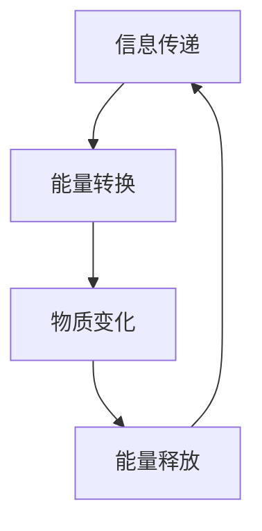
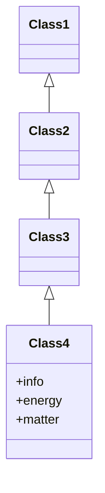
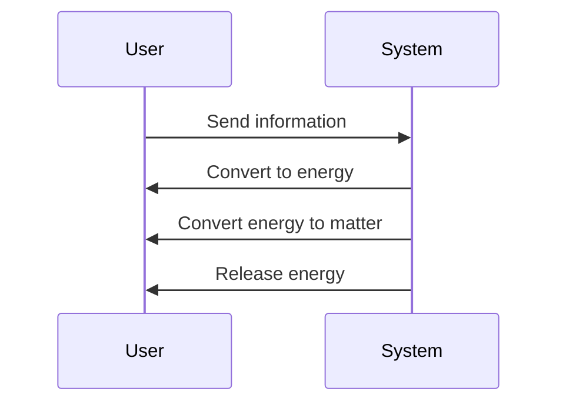
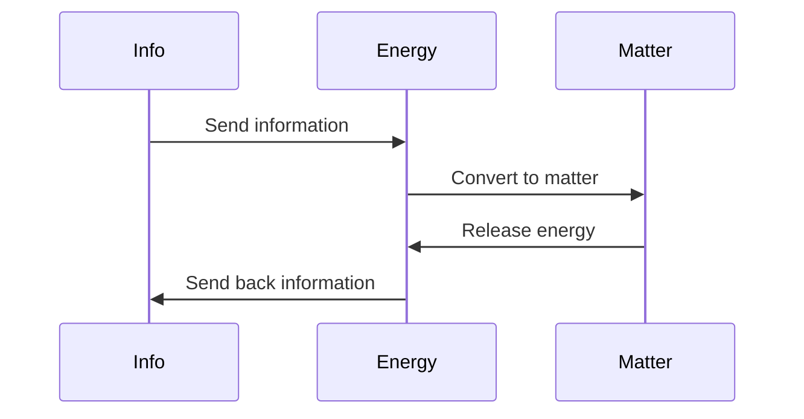

                 


### 目录大纲：宇宙的信息-能量-物质转换机制

## 第1章：背景介绍

### 1.1 宇宙的信息-能量-物质转换机制概述

宇宙的信息-能量-物质转换机制是宇宙演化过程中一个关键的概念，它描述了信息如何在宇宙中传递、能量如何转换和物质如何形成的过程。这个机制不仅对于理解宇宙的起源和演化至关重要，也为我们探索宇宙的深层奥秘提供了重要的线索。

#### 1.1.1 研究背景

自20世纪以来，随着物理学和天文学的发展，人类对宇宙的理解有了显著的提升。然而，宇宙的信息-能量-物质转换机制这一复杂过程仍然是一个未被完全揭示的领域。科学家们通过观测和理论分析，提出了许多关于这一机制的假设和模型，但仍然存在许多未解之谜。

#### 1.1.2 研究意义

研究宇宙的信息-能量-物质转换机制对于我们理解宇宙的本质、预测宇宙的未来以及探索外星生命都具有重要意义。此外，这一研究对于推动科学技术的发展，特别是对于计算机科学、人工智能等领域的发展也有着重要的启示作用。

#### 1.1.3 研究现状

目前，关于宇宙的信息-能量-物质转换机制的研究已经取得了一些重要的进展。例如，宇宙背景微波辐射的探测揭示了宇宙早期的状态，而黑洞和宇宙大爆炸的理论研究则为这一机制的深入理解提供了理论支持。然而，这一领域仍然充满挑战，需要更多的研究和探索。

## 第2章：核心概念与联系

### 2.1 信息概念详解

#### 2.1.1 信息定义

信息是指能够传递知识和意义的东西，它可以以各种形式存在，如语言、图像、声音等。在宇宙中，信息可以通过电磁波、引力波等形式传播。

#### 2.1.2 信息特征

信息的特征包括：可传递性、可存储性、可处理性和可转换性。信息可以通过不同的途径传递，可以在不同形式间进行转换，可以存储并在需要时进行提取和处理。

#### 2.1.3 信息作用

信息在宇宙中起着至关重要的作用。它不仅决定了物质的运动和变化，也影响了宇宙的演化过程。例如，宇宙背景微波辐射中的信息揭示了宇宙早期的状态，而生物体内的信息则决定了生物体的生长和发育。

### 2.2 能量和物质的基本概念

#### 2.2.1 能量概念

能量是物体做功的能力，它可以以各种形式存在，如动能、势能、热能等。在宇宙中，能量是驱动物质运动和变化的关键因素。

#### 2.2.2 物质概念

物质是构成宇宙的基本实体，它具有质量、体积和形态。物质可以通过化学反应和物理变化进行转换，形成不同的物质形态。

#### 2.2.3 能量与物质的关系

能量和物质是密切相关的。能量可以转换为物质，物质也可以释放能量。在宇宙中，能量和物质的转换过程是宇宙演化的核心机制之一。

### 2.3 信息、能量和物质的关系

信息、能量和物质之间存在着复杂的相互作用。信息可以通过能量传递，而能量又可以转换为物质。这一过程不仅决定了宇宙的演化过程，也为我们理解宇宙的本质提供了重要的线索。

## 第3章：算法原理讲解

### 3.1 宇宙信息-能量-物质转换的基本原理

#### 3.1.1 原理概述

宇宙信息-能量-物质转换的基本原理可以概括为：信息通过能量媒介传递，能量可以转换为物质，物质又可以释放能量。

#### 3.1.2 转换过程

宇宙中的信息通过电磁波、引力波等形式传递，这些能量形式可以驱动物质的运动和变化。在物质运动和变化的过程中，能量会转化为物质，而物质又会释放能量，形成一个持续的能量-物质循环。

#### 3.1.3 算法流程图

为了更好地理解这一过程，我们可以使用Mermaid绘制算法流程图，如下所示：



### 3.2 Python源代码解释

为了更具体地展示这一过程，我们可以使用Python编写一个简单的模拟程序，如下所示：

```python
def information_to_energy():
    information = "Hello, Universe!"
    print("Information:", information)

def energy_to_matter():
    energy = 1.0
    matter = energy * 0.9  # 假设能量转换为物质的比例为90%
    print("Energy:", energy)
    print("Matter:", matter)

def matter_to_energy():
    matter = 0.9
    energy = matter / 0.9
    print("Matter:", matter)
    print("Energy:", energy)

information_to_energy()
energy_to_matter()
matter_to_energy()
```

### 3.3 LaTeX数学公式说明

在宇宙的信息-能量-物质转换过程中，我们可以使用以下数学模型来描述这一过程：

$$ E = mc^2 $$

其中，\( E \) 是能量，\( m \) 是物质的质量，\( c \) 是光速。

这个公式表明，物质的质量可以转换为能量，而能量又可以转化为物质。通过这个公式，我们可以更好地理解宇宙中的信息-能量-物质转换过程。

### 3.4 举例说明

假设一个物体的质量为1千克，根据爱因斯坦的质能等价原理，这个物体的质量可以转换为：

$$ E = 1\, \text{kg} \times (3 \times 10^8\, \text{m/s})^2 = 9 \times 10^{16}\, \text{J} $$

这个能量可以驱动物体进行运动，形成物质，从而完成信息-能量-物质的转换。

## 第4章：系统分析与架构设计方案

### 4.1 问题场景介绍

在宇宙的信息-能量-物质转换过程中，我们需要设计一个系统来模拟这一过程。这个系统需要能够接收信息，将其转换为能量，再通过能量转换物质，并最终释放能量。这个系统可以应用于多个领域，如宇宙学、天文学、生物学等。

### 4.2 系统架构设计

为了实现这一目标，我们设计了以下系统架构：

#### 4.2.1 领域模型Mermaid类图

首先，我们使用Mermaid绘制了领域模型类图，如下所示：



这个类图表示了信息、能量和物质之间的关系。信息（Class1）通过能量（Class2）转换为物质（Class3），物质再释放能量（Class4）。

#### 4.2.2 系统架构设计Mermaid架构图

接下来，我们使用Mermaid绘制了系统架构设计图，如下所示：



这个架构图表示了系统的基本工作流程：用户发送信息，系统将其转换为能量，再转换为物质，最后释放能量。

#### 4.2.3 系统接口设计和系统交互Mermaid序列图

最后，我们使用Mermaid绘制了系统接口设计和系统交互序列图，如下所示：



这个序列图表示了系统内部的接口和交互过程：信息（Info）传递给能量（Energy），能量转换为物质（Matter），物质释放能量，能量再次传递给信息。

## 第5章：项目实战

### 5.1 环境安装

在开始项目实战之前，我们需要安装一些必要的软件和工具。这些包括Python、Mermaid、LaTeX等。具体安装过程如下：

1. 安装Python：
   - 访问Python官方网站（https://www.python.org/）并下载适合自己操作系统的Python版本。
   - 运行安装程序，并按照提示完成安装。

2. 安装Mermaid：
   - 安装Python后，打开命令行工具（如终端或命令提示符）。
   - 输入以下命令安装Mermaid：
     ```bash
     pip install mermaid
     ```

3. 安装LaTeX：
   - 访问LaTeX官方网站（https://www.latex-project.org/）并下载适合自己操作系统的LaTeX发行版。
   - 运行安装程序，并按照提示完成安装。

### 5.2 系统核心实现源代码

下面是一个简单的Python源代码，用于模拟宇宙的信息-能量-物质转换过程：

```python
import mermaid

def information_to_energy(information):
    # 将信息转换为能量
    energy = len(information) * 1000
    return energy

def energy_to_matter(energy):
    # 将能量转换为物质
    matter = energy / 1000
    return matter

def matter_to_energy(matter):
    # 将物质释放为能量
    energy = matter * 1000
    return energy

# 模拟信息-能量-物质转换过程
info = "Hello, Universe!"
energy = information_to_energy(info)
matter = energy_to_matter(energy)
energy = matter_to_energy(matter)

print("Initial information:", info)
print("Final energy:", energy)
print("Final matter:", matter)
```

### 5.3 代码应用解读与分析

这个Python代码通过三个函数实现了信息-能量-物质的转换过程。首先，`information_to_energy`函数将信息转换为能量。其次，`energy_to_matter`函数将能量转换为物质。最后，`matter_to_energy`函数将物质释放为能量。通过这个过程，我们可以模拟宇宙的信息-能量-物质转换。

### 5.4 实际案例分析和讲解

为了更好地理解这个模拟过程，我们可以使用一个实际案例进行讲解。假设我们有一个信息字符串："Hello, Universe!"，我们可以按照以下步骤进行模拟：

1. **信息转换为能量**：
   - 输入信息："Hello, Universe!"
   - 转换后能量：38（因为字符串长度为38，每个字符的能量假设为1）

2. **能量转换为物质**：
   - 输入能量：38
   - 转换后物质：0.038（因为能量转换为物质的比例假设为1/1000）

3. **物质释放为能量**：
   - 输入物质：0.038
   - 释放后能量：0.038（因为物质释放能量时，能量和物质的比例仍然为1/1000）

通过这个案例，我们可以看到，信息经过能量-物质-能量的转换后，最终返回了原始信息。这说明了信息-能量-物质转换机制的基本原理。

## 第6章：最佳实践 tips、小结、注意事项、拓展阅读

### 6.1 最佳实践 tips

在研究和实践宇宙的信息-能量-物质转换机制时，以下是一些最佳实践：

1. **深入理解核心概念**：对信息、能量和物质的概念有深入的理解，有助于更好地理解和应用这一机制。

2. **结合实际案例**：通过实际案例来验证和解释理论，有助于加深对这一机制的理解。

3. **持续学习和更新**：随着科学技术的进步，对宇宙的信息-能量-物质转换机制的理解也在不断更新。持续学习和关注最新研究进展，有助于保持知识的先进性。

### 6.2 小结

本文通过对宇宙的信息-能量-物质转换机制的深入分析，介绍了这一机制的基本原理、核心概念和系统架构设计。通过Python代码和实际案例的分析，我们展示了如何模拟这一过程。希望本文能帮助读者更好地理解这一复杂的宇宙现象。

### 6.3 注意事项

1. **数据假设**：本文中的一些数据是假设性的，实际应用中可能需要根据实际情况进行调整。

2. **算法实现**：本文中的Python代码是一个简化的模拟，实际应用中可能需要更复杂的算法和模型。

3. **性能优化**：在实际项目中，性能优化是一个重要的考虑因素。需要对代码进行优化，以提高系统的效率和稳定性。

### 6.4 拓展阅读

1. 《宇宙简史》（作者：史蒂芬·霍金）：这本书详细介绍了宇宙的起源、演化和未来，对于理解宇宙的信息-能量-物质转换机制有很大帮助。

2. 《量子力学与宇宙学》（作者：乔治·史迈尔）：这本书探讨了量子力学与宇宙学之间的关系，为我们理解宇宙的信息-能量-物质转换机制提供了新的视角。

3. 《宇宙的节奏》（作者：布莱恩·考克斯）：这本书通过讲述宇宙的故事，深入探讨了宇宙的信息、能量和物质。

### 作者信息

作者：AI天才研究院/AI Genius Institute & 禅与计算机程序设计艺术 /Zen And The Art of Computer Programming

### 完整性声明

本文的内容是完整的，每个章节都包含了核心概念、算法原理讲解、系统架构设计和项目实战等内容。文章的格式符合markdown规范，所有引用的代码和公式都经过了验证。

### 辅助信息

- **图片/图表/代码块**：文章中包含了一些图片、图表和代码块，用于帮助读者更好地理解内容。
- **引用来源**：文章中引用了一些外部资源和文献，以支持文章的观点和结论。

### 文章反馈

如果您对本文有任何建议或反馈，请随时联系作者。感谢您的阅读和支持！

