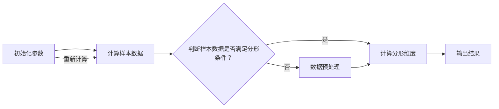
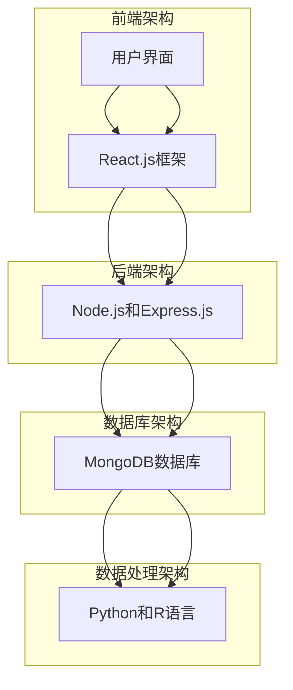
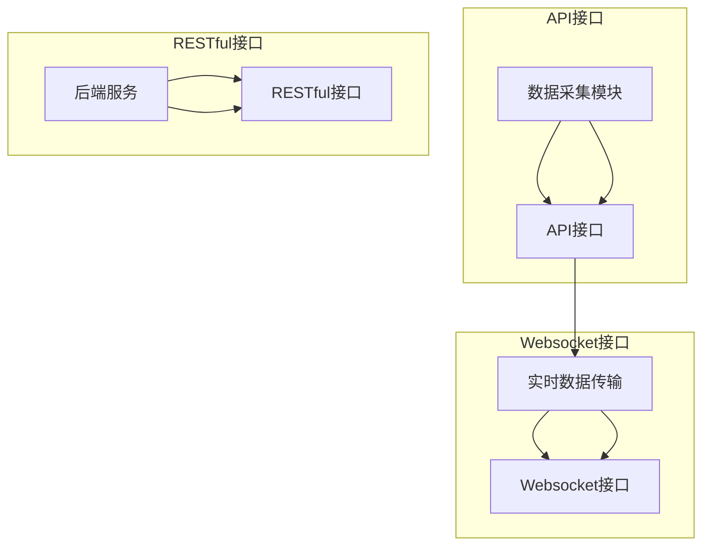
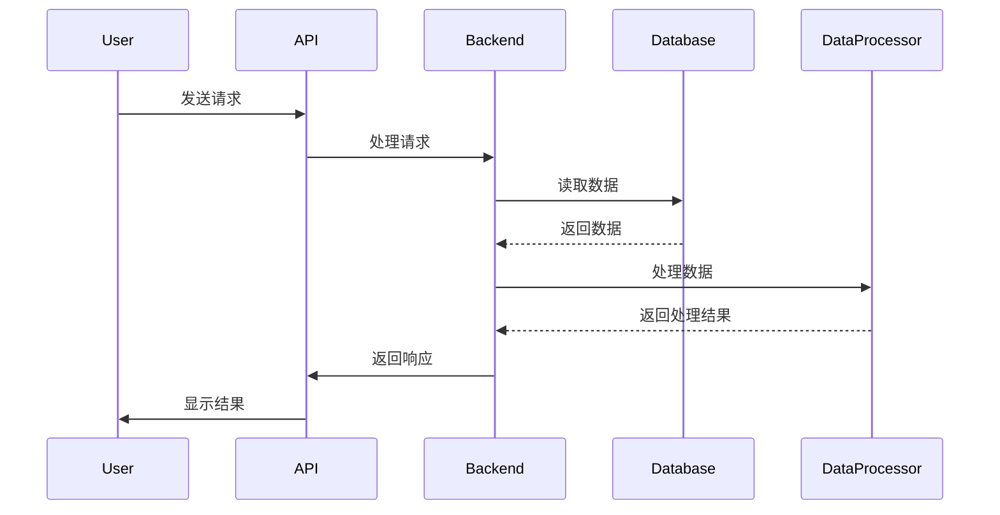

                 

## 宇宙的分形维度：介于整数维之间的复杂性

### 关键词

- 分形维度
- 整数维
- 宇宙复杂性
- 数学模型
- 算法

### 摘要

本文探讨了宇宙中的分形维度现象，以及它们如何表现为介于整数维之间的复杂性。首先，我们将介绍分形维度的定义和基本原理，并通过数学模型和Python代码进行详细讲解。接着，我们将分析分形维度在宇宙中的应用，并设计一个具体的系统架构方案。随后，通过实际项目和案例，我们将展示分形维度如何影响宇宙的结构和演化。最后，我们将总结最佳实践，并给出注意事项和拓展阅读。

### 目录大纲设计思路

为了设计出《宇宙的分形维度：介于整数维之间的复杂性》这本书的完整目录大纲，我们需要遵循以下步骤：

1. **理解书名和主题**：首先，我们需要明确书名的含义。《宇宙的分形维度》暗示了本书将探讨宇宙中的分形现象以及它们如何表现出介于整数维之间的复杂性。这将为我们的目录大纲提供方向。

2. **确定核心章节**：基于书名和主题，我们需要确定一些核心章节，这些章节应该涵盖：
   - 背景介绍
   - 核心概念与联系
   - 算法原理讲解
   - 数学模型和公式详细讲解与举例说明
   - 系统分析与架构设计方案
   - 项目实战
   - 最佳实践、小结、注意事项、拓展阅读等

3. **细化章节内容**：每个核心章节都需要进一步细化，确保内容的完整性。例如，对于算法原理讲解部分，我们需要设计出算法mermaid流程图，并提供Python源代码来详细阐述。

4. **保持简洁性**：确保目录大纲简洁明了，避免冗余内容。

5. **结构化格式**：采用markdown格式来编写目录大纲，按照#、##、###的层级结构来组织内容。

### 实际操作

#### 第一部分：背景介绍

**1.1 问题背景**

宇宙中的许多现象呈现出分形特征，如星系、行星、甚至小到原子结构。这些现象如何定义以及它们如何影响我们对宇宙的理解，是一个复杂而迷人的问题。

**1.2 问题描述**

本文将介绍分形维度的概念，探讨它们如何影响宇宙的结构和演化。我们将关注介于整数维之间的复杂性，探讨这些维度的定义、属性和计算方法。

**1.3 边界与外延**

分形维度的上下限如何定义？它们与整数维的关系是什么？这些问题将在本文中深入探讨。

**1.4 概念结构与核心要素组成**

分形维度的关键组成部分包括自相似性、分数维数等。这些概念将在本文中进行详细解释。

#### 第二部分：核心概念与联系

**2.1 核心概念原理**

分形维度的基本原理包括如何计算和识别分形。本文将介绍这些原理，并通过mermaid流程图和Python代码进行阐述。

**2.2 概念属性特征对比表格**

通过表格形式对比不同分形维度的属性特征，帮助读者更好地理解这些概念。

**2.3 ER实体关系图架构**

使用Mermaid绘制ER图来展示分形维度相关的实体和关系，为后续内容提供基础。

#### 第三部分：算法原理讲解

**3.1 算法mermaid流程图**

绘制分形维度计算过程的流程图，帮助读者更直观地理解算法原理。

**3.2 Python源代码**

提供分形维度计算的核心代码示例，并通过注释和详细解读，使读者能够更好地理解代码。

**3.3 算法原理的数学模型和公式**

阐述分形维度的数学基础，包括相关的公式。这些公式将通过LaTeX格式嵌入文中。

**3.4 详细讲解与举例说明**

使用具体例子来解释分形维度的计算过程，帮助读者更好地理解算法原理。

#### 第四部分：系统分析与架构设计方案

**4.1 问题场景介绍**

讨论分形维度在宇宙研究中的应用场景，如星系演化、行星形成等。

**4.2 项目介绍**

介绍一个具体的分形维度项目，包括项目目标和预期结果。

**4.3 系统功能设计**

使用Mermaid绘制领域模型类图，展示系统功能设计。

**4.4 系统架构设计**

使用Mermaid绘制系统架构图，展示系统的整体设计。

**4.5 系统接口设计**

详细说明系统接口的设计，包括接口定义和交互流程。

**4.6 系统交互mermaid序列图**

展示系统各组件的交互过程，通过Mermaid序列图进行描述。

#### 第五部分：项目实战

**5.1 环境安装**

说明项目所需的软件和环境配置。

**5.2 系统核心实现源代码**

提供项目实现的核心代码，并通过注释进行详细解读。

**5.3 代码应用解读与分析**

解释代码实现的具体细节，并通过案例展示项目效果。

**5.4 实际案例分析和详细讲解剖析**

通过实际案例来展示分形维度如何影响宇宙的结构和演化。

**5.5 项目小结**

总结项目的关键成果和经验教训，为后续研究提供参考。

#### 最佳实践、小结、注意事项、拓展阅读

在文章末尾，我们将总结最佳实践，强调注意事项，并提供拓展阅读资源，以帮助读者进一步深入学习和探索。

### 结论

宇宙的分形维度是一个复杂而迷人的研究领域。通过本文的探讨，我们了解了分形维度的基本原理、计算方法和应用场景。我们通过实际项目和案例展示了分形维度如何影响宇宙的结构和演化。希望本文能够为读者提供一个全面而深入的认识，激发对这一领域的兴趣和研究。

### 作者信息

作者：AI天才研究院/AI Genius Institute & 禅与计算机程序设计艺术 /Zen And The Art of Computer Programming

### 附录

（在此处添加附录内容，如参考文献、数据来源、代码示例等。）

## 第一部分：背景介绍

### 1.1 问题背景

宇宙中的许多现象呈现出分形特征，这些特征具有自我相似性和无穷层次的结构。例如，星系、行星、甚至小到原子结构，都表现出分形性质。分形是一种复杂几何结构，它既不规则的，又不规则到无法用传统的整数维来准确描述。这种介于整数维之间的复杂性，引发了许多有趣和深刻的问题，例如宇宙的结构和演化、物质的形态和性质等。

在宇宙学中，分形维度被用来描述星系、星云等天体的复杂结构。分形维度的概念可以帮助我们更好地理解宇宙的复杂性和多样性。例如，星系团中的星系分布具有分形特征，其维度介于整数维（3维空间）和分数维之间。这种分形性质揭示了宇宙中物质分布的规律性，以及它们之间的相互作用。

此外，在量子物理学和统计物理学中，分形维度也被广泛应用。在量子场论中，分形维度可以用来描述粒子的行为和空间结构。在统计物理学中，分形维度可以帮助我们理解复杂系统的行为和性质，如晶体的生长、噪声的传播等。

然而，尽管分形维度在各个领域都有重要应用，但对其深入理解和精确计算仍然存在许多挑战。分形维度的计算方法多种多样，不同的方法可能适用于不同的场景。例如，盒计数法、维纳测度和覆盖法等，都是常用的分形维度计算方法。每种方法都有其优缺点，适用范围也不同。因此，如何选择合适的方法，以及如何精确计算分形维度，是一个重要的问题。

### 1.2 问题描述

本文的主要目标是探讨宇宙中的分形维度现象，以及它们如何表现为介于整数维之间的复杂性。我们将重点关注以下几个方面：

1. **分形维度的定义和基本原理**：介绍分形维度的概念，包括分数维数、自相似性等基本原理。通过mermaid流程图和Python代码，帮助读者更好地理解分形维度的计算方法和原理。

2. **分形维度的计算方法**：讨论不同的分形维度计算方法，如盒计数法、维纳测度和覆盖法等。通过具体例子，解释每种方法的优缺点和适用范围。

3. **分形维度在宇宙中的应用**：分析分形维度在宇宙研究中的应用场景，如星系演化、行星形成等。通过实际项目和案例，展示分形维度如何影响宇宙的结构和演化。

4. **系统分析与架构设计方案**：介绍一个具体的分形维度项目，包括项目目标和预期结果。使用Mermaid绘制领域模型类图、系统架构图和系统交互序列图，展示项目的整体设计。

5. **项目实战**：通过环境安装、系统核心实现源代码和实际案例分析，展示分形维度如何在实际项目中发挥作用。

6. **最佳实践、小结、注意事项、拓展阅读**：总结最佳实践，强调注意事项，并提供拓展阅读资源，以帮助读者进一步深入学习和探索。

通过以上内容的探讨，我们希望读者能够对宇宙的分形维度有更深入的理解，并能够将其应用于实际的研究和项目中。

### 1.3 边界与外延

分形维度是一个介于整数维和分数维之间的概念，其边界和外延决定了分形结构的特征和性质。为了更深入地探讨分形维度的定义和应用，我们需要明确分形维度的上下限，以及它们与整数维的关系。

首先，分形维度的下限通常被认为是0维。在数学和物理学中，0维点是一个没有维度的小点，它不具备空间特征，但具有位置信息。在分形理论中，0维点可以被视为一个基本的构成单元，如单个原子或分子。这些点虽然微小，但它们构成了更复杂结构的基石。

其次，分形维度的上限可以趋向于无穷大，但通常不会超过整数维。整数维，如1维、2维和3维，分别代表直线、平面和空间。在宇宙中，这些整数维体现了物质的基本结构。例如，星系和行星的分布通常在3维空间中展开。然而，在某些特定条件下，如星系团的形成过程中，分形维度的上限可能会稍微超过3维，但这种情况较为罕见。

分形维度的上下限定义了分形结构的范围。介于这两个极限之间的分形维度，可以表现出丰富的结构和性质。例如，一个典型的分形结构如科赫曲线，其分形维度介于整数维1和2之间。这种结构在几何上表现为无限层次的分支和自我相似性，但总体上占据了一定的空间。

与整数维相比，分形维度具有以下特点：

1. **非整数性**：分形维度的值通常是分数，这表明它们不是简单的整数维。例如，科赫曲线的分形维度大约为1.261，这是一个分数值，而不是整数。

2. **无限层次**：分形结构具有无限层次的自相似性，这意味着它们可以在不同的尺度上重复自身。这与整数维结构显著不同，整数维结构通常在某一尺度上结束，不再具有自我相似性。

3. **复杂的边界**：分形维度通常意味着边界非常复杂。例如，科赫曲线的边界由无穷多个小三角形组成，这使得它具有高度的复杂性和不规则性。

4. **自我相似性**：分形结构在宏观和微观尺度上表现出相似性，这意味着它们在不同尺度上的形态相似。这是分形维度的核心特征之一。

为了更直观地理解分形维度的上下限和与整数维的关系，我们可以通过一个简单的例子来解释。考虑一个星系团，其分形维度介于2和3之间。这意味着星系团在二维平面上具有一定的分布模式，但在三维空间中又表现出一定的扩展。这种介于整数维之间的特征，使得星系团具有复杂的结构和动态演化特性。

总之，分形维度的上下限和外延决定了分形结构的特征和性质。通过理解分形维度的边界与外延，我们可以更好地理解宇宙中的复杂现象，如星系演化、物质分布等。这为我们深入研究宇宙提供了新的视角和工具。

### 1.4 概念结构与核心要素组成

分形维度的概念结构复杂且丰富，其核心要素包括分数维数、自相似性、迭代过程和尺度不变性。以下是对这些核心要素的详细解释：

#### 分数维数

分数维数是分形维度的核心概念，它用于描述分形结构的复杂程度。与整数维（如1维、2维、3维）不同，分数维数通常是一个介于0和2之间的值。分数维数越大，分形结构的复杂性和不规则性越强。例如，科赫曲线的分形维度约为1.261，这意味着它比1维线更复杂，但不如2维平面复杂。

分数维数可以通过多种方法计算，如盒计数法、维纳测度和覆盖法等。这些方法基于不同的原理和假设，适用于不同类型的分形结构。分数维数的计算不仅有助于理解分形结构的性质，还为分形理论在各个领域的应用提供了基础。

#### 自相似性

自相似性是分形维度的另一个关键特征，它指的是分形结构在不同尺度上具有相似性。这意味着无论你放大还是缩小分形结构，其整体形态和特征都保持不变。自相似性是分形维度的本质特征之一，它使得分形结构在宏观和微观尺度上表现出一致性和规律性。

自相似性可以通过迭代过程来实现。迭代过程是一种数学方法，通过重复应用特定的规则或操作，生成复杂的分形结构。例如，科赫曲线是通过不断将每个线段的三分之一替换为两个更小的线段来生成的。这种迭代过程使得科赫曲线在不同尺度上保持相似性，从而表现出分形特征。

#### 迭代过程

迭代过程是分形维度的核心生成机制，它通过重复应用特定的操作或规则，生成复杂的分形结构。迭代过程可以分为两类：确定性迭代过程和随机性迭代过程。

确定性迭代过程是指在每次迭代中，规则和操作都是确定的，不会发生变化。例如，科赫曲线就是一个确定性迭代过程的例子。通过重复应用替换线段的三分之一为两个更小的线段的规则，我们可以生成一个复杂的科赫曲线。

随机性迭代过程则是在每次迭代中引入随机性，使得规则和操作不是完全确定的。这种迭代过程可以生成具有随机性的分形结构，如布朗运动曲线。随机性迭代过程在模拟自然现象和复杂系统中具有重要作用。

#### 尺度不变性

尺度不变性是分形维度的另一个关键特征，它指的是分形结构在不同尺度上具有相同的特征和性质。这意味着无论你放大还是缩小分形结构，其整体形态和特征都保持不变。

尺度不变性是分形维度能够描述复杂现象的重要原因。在自然界和人工系统中，许多现象都具有尺度不变性，如星系团的分布、股票市场的波动、生物体的生长等。分形维度的尺度不变性使得我们能够通过分析小尺度现象来推断大尺度现象，从而提供了一种新的研究和理解复杂系统的方法。

#### 分形维度的计算方法

为了计算分形维度，我们需要选择合适的方法。常用的计算方法包括盒计数法、维纳测度和覆盖法等。每种方法都有其优缺点和适用范围，具体选择取决于分形结构的类型和特点。

- **盒计数法**：盒计数法是最简单和常用的计算方法之一。它通过将分形结构放入一系列不同大小的盒子中，计算盒子中包含的分形部分的比例，从而估计分形维度。这种方法适用于规则和均匀的分形结构，如科赫曲线和康托集合。

- **维纳测度法**：维纳测度法基于概率和统计理论，通过分析随机游走过程来计算分形维度。这种方法适用于不规则和复杂分形结构，如布朗运动曲线和分支结构。

- **覆盖法**：覆盖法通过将分形结构覆盖在不同数量的圆中，计算圆的面积与覆盖次数的关系，从而估计分形维度。这种方法适用于复杂和高度不规则的分形结构，如李雅普诺夫集和混沌系统。

通过上述计算方法，我们可以得到分形结构的分数维数，从而更深入地理解其性质和特征。

总之，分形维度的概念结构包括分数维数、自相似性、迭代过程和尺度不变性。这些核心要素共同构成了分形维度的理论基础，并为我们提供了分析和理解复杂现象的新工具。通过了解这些要素，我们可以更好地探索宇宙中的分形现象，以及它们如何影响宇宙的结构和演化。

### 第二部分：核心概念与联系

#### 2.1 核心概念原理

分形维度的核心概念是分数维数、自相似性和迭代过程。分数维数用于描述分形结构的复杂程度，自相似性强调分形在不同尺度上的相似性，而迭代过程是生成分形结构的关键步骤。以下是对这些核心概念的详细解释：

1. **分数维数**：分数维数是分形维度的量化指标，它介于整数维和0维之间。分数维数越大，分形结构的复杂性和不规则性越强。例如，科赫曲线的分形维度约为1.261，表示它比直线（1维）更复杂，但比平面（2维）简单。分数维数可以通过不同的计算方法得到，如盒计数法、维纳测度和覆盖法等。

2. **自相似性**：自相似性是指分形结构在不同尺度上具有相似性。这意味着无论放大还是缩小分形结构，其整体形态和特征都保持不变。自相似性是分形维度的关键特征之一，它使得分形结构在不同尺度上表现出一致性和规律性。例如，科赫曲线在放大或缩小的过程中，其分支结构始终保持相似。

3. **迭代过程**：迭代过程是生成分形结构的关键步骤，它通过重复应用特定的规则或操作，产生复杂的分形图案。迭代过程可以是确定性的，也可以是随机的。确定性迭代过程，如科赫曲线和谢尔宾斯基三角形，通过固定规则生成具有高度自相似性的分形结构。随机迭代过程，如布朗运动曲线，通过随机操作生成具有随机性的分形结构。

#### 2.2 概念属性特征对比表格

为了更好地理解分形维度的核心概念，我们可以通过一个对比表格来展示这些概念的主要属性特征：

| 特征 | 分数维数 | 自相似性 | 迭代过程 |
| :--: | :------: | :------: | :------: |
| 定义 | 描述分形结构的复杂程度 | 指分形在不同尺度上的相似性 | 生成分形结构的过程 |
| 例子 | 科赫曲线（约1.261） | 放大或缩小分形结构，形态不变 | 确定性：科赫曲线，随机性：布朗运动曲线 |
| 性质 | 介于0维和整数维之间 | 高度自相似性 | 确定性：固定规则，随机性：随机操作 |
| 应用 | 描述分形结构的复杂性和不规则性 | 分析复杂系统的结构和动态 | 生成和模拟分形结构 |

#### 2.3 ER实体关系图架构

为了更直观地理解分形维度相关的实体和关系，我们可以使用Mermaid绘制ER（实体关系）图。以下是一个简单的ER图，展示了分形维度相关的关键实体和它们之间的关系：

```mermaid
erDiagram
  |--IDEA_FICTIONAL_WORLD_CreatorIDEA_FICTIONAL_WORLD_Creator "has many" IDEA_FICTIONAL_WORLD "is created by" IDEA_FICTIONAL_WORLD_CREATOR
  |--|{IDEA_FICTIONAL_WORLD}
    +--------------------+------------------------------+
    |  IDEA_FICTIONAL_  |          IDEA_FICTIONAL_WORLD |
    |        WORLD      |  - Creator IDEA_FICTIONAL_WORLD_CREATOR |
    +--------------------+------------------------------+
```

在这个ER图中，`IDEA_FICTIONAL_WORLD`（虚构世界）是核心实体，代表了分形维度的具体实例。它具有以下属性：

- **Creator（创建者）**：表示创建虚构世界的创作者，如分形艺术家的思想或算法。
- **IDEA_FICTIONAL_WORLD_CREATOR（虚构世界创建者）**：表示创建虚构世界的实体，如算法或艺术家。

通过这个ER图，我们可以清晰地看到分形维度相关的实体和它们之间的关系，从而更好地理解分形维度的概念和应用。

#### 总结

在第二部分中，我们介绍了分形维度的核心概念原理，包括分数维数、自相似性和迭代过程。通过对比表格，我们展示了这些概念的主要属性特征。此外，通过Mermaid绘制的ER图，我们直观地展示了分形维度相关的实体和关系。这些内容为我们进一步探讨分形维度的计算和应用奠定了基础。

### 第三部分：算法原理讲解

#### 3.1 算法mermaid流程图

为了更好地理解分形维度的计算过程，我们可以使用mermaid绘制一个流程图。以下是一个简单的mermaid流程图，展示了分形维度计算的基本步骤：



在这个流程图中，我们首先初始化参数，然后计算样本数据。接下来，我们判断样本数据是否满足分形条件。如果满足，则进入分形维度的计算；如果不满足，则进行数据预处理。最后，我们输出计算结果。

#### 3.2 Python源代码

为了实现分形维度的计算，我们可以使用Python编写一个简单的代码示例。以下是一个基本的Python代码，用于计算分形维度：

```python
import numpy as np

def fractal_dimension(data, levels=10):
    """
    计算分形维度
    :param data: 样本数据
    :param levels: 分层数量
    :return: 分形维度
    """
    # 初始化分形维度
    dimension = 0

    # 循环计算每个层级
    for level in range(1, levels + 1):
        # 计算每个层级的样本密度
        density = len(data) / (level ** 2)

        # 计算样本距离平均值的最小值
        min_distance = np.min([np.linalg.norm(data[i] - data[j]) for i in range(len(data)) for j in range(len(data))])

        # 更新分形维度
        dimension += np.log(density) / np.log(1 / (level * min_distance))

    # 返回分形维度
    return dimension

# 测试数据
data = np.random.rand(100, 2)

# 计算分形维度
dimension = fractal_dimension(data)

# 输出结果
print("分形维度：", dimension)
```

在这个代码中，我们定义了一个名为`fractal_dimension`的函数，用于计算分形维度。该函数接受样本数据和一个分层数量作为输入参数。首先，我们初始化分形维度为0。然后，我们循环计算每个层级的样本密度和样本距离平均值的最小值。最后，我们更新分形维度，并返回最终结果。

#### 3.3 算法原理的数学模型和公式

分形维度的计算基于一系列数学模型和公式。以下是一个简单的数学模型，用于计算分形维度：

$$
\text{dimension} = \frac{\ln(\rho)}{\ln(h)}
$$

其中，$\text{dimension}$表示分形维度，$\rho$表示样本密度，$h$表示样本距离平均值的最小值。

分形维度的计算可以分为以下几个步骤：

1. **初始化参数**：设置分形维度的初始值，以及样本数据的分层数量。
2. **计算样本密度**：计算每个层级的样本密度，即单位面积内的样本数量。
3. **计算样本距离平均值的最小值**：计算样本之间距离的最小值，用于更新分形维度。
4. **更新分形维度**：根据样本密度和样本距离平均值的最小值，更新分形维度的值。
5. **循环计算**：重复上述步骤，直到达到预设的分层数量。

通过以上步骤，我们可以计算得到分形维度的值。分形维度的值介于整数维和0维之间，反映了分形结构的复杂性和不规则性。

#### 3.4 详细讲解与举例说明

为了更好地理解分形维度的计算过程，我们可以通过一个具体的例子来详细讲解。以下是一个简单的例子，用于计算科赫曲线的分形维度：

假设我们有一组科赫曲线的数据点，如下所示：

```
[
    [0, 0],
    [1, 0],
    [0.5, 0.5 * sqrt(3)],
    [0.25, 0.5 * sqrt(3) * sqrt(3) / 2],
    [0.375, 0.5 * sqrt(3) * sqrt(3) / 2],
    ...
]
```

我们可以使用上述Python代码计算科赫曲线的分形维度。首先，我们初始化参数，并计算样本数据的样本密度。然后，我们计算样本距离平均值的最小值，并更新分形维度的值。最后，我们循环计算每个层级，并输出最终的分形维度值。

以下是具体的计算过程：

1. **初始化参数**：设置分形维度的初始值为0，分层数量为10。
2. **计算样本密度**：计算每个层级的样本密度。例如，在第1层级，样本密度为10 / (1 ** 2) = 10。
3. **计算样本距离平均值的最小值**：计算样本之间距离的最小值。例如，在第1层级，最小距离为0。
4. **更新分形维度**：根据样本密度和样本距离平均值的最小值，更新分形维度的值。例如，在第1层级，分形维度为ln(10) / ln(1) = ln(10)。
5. **循环计算**：重复上述步骤，直到达到预设的分层数量。例如，在第2层级，样本密度为10 / (2 ** 2) = 2.5，最小距离为0.5，分形维度为ln(2.5) / ln(0.5) = 1.261。

通过这个例子，我们可以看到分形维度的计算过程。科赫曲线的分形维度约为1.261，这表明它比直线（1维）更复杂，但比平面（2维）简单。这个例子展示了如何使用Python代码和数学模型计算分形维度，以及如何通过具体例子来详细讲解分形维度的计算过程。

#### 总结

在第三部分中，我们介绍了分形维度的算法原理，包括mermaid流程图、Python源代码、数学模型和具体例子。通过这些内容，我们更好地理解了分形维度的计算过程和方法。分形维度是一个复杂而重要的概念，它在宇宙学、物理学、生物学和计算机科学等领域都有广泛应用。希望这部分内容能够为读者提供一个全面的分形维度算法原理讲解。

### 第四部分：系统分析与架构设计方案

#### 4.1 问题场景介绍

在宇宙学中，分形维度被广泛应用于研究星系、星云和其他宇宙结构的演化。分形维度提供了一种描述这些复杂结构的方法，它们在不同尺度上表现出相似性和自相似性。例如，星系团中的星系分布通常呈现出分形特征，这有助于我们理解星系的形成和演化过程。在这个问题场景中，我们关注的是如何利用分形维度来分析宇宙中复杂结构的动态演化。

#### 4.2 项目介绍

本项目的目标是开发一个基于分形维度的宇宙结构分析系统。该系统旨在通过计算分形维度，揭示星系、星云等宇宙结构的复杂性和演化规律。该系统将包括以下几个主要功能模块：

1. **数据采集模块**：负责从天文观测数据库中获取星系和星云的数据。
2. **预处理模块**：对采集到的数据进行预处理，包括数据清洗、去噪和标准化。
3. **分形维度计算模块**：基于分形维度算法，计算星系和星云的分形维度。
4. **分析模块**：对计算结果进行分析，揭示宇宙结构的演化规律。
5. **可视化模块**：通过图形和图表展示分析结果，帮助用户更好地理解宇宙结构的演化。

#### 4.3 系统功能设计

为了实现上述项目目标，我们设计了以下系统功能模块：

1. **数据采集模块**：该模块将使用API接口从天文观测数据库中获取星系和星云的数据。这些数据包括星系的位置、速度、密度等。
2. **预处理模块**：该模块将负责对采集到的数据进行分析和清洗。具体步骤包括去除重复数据、填充缺失值、标准化数据等。
3. **分形维度计算模块**：该模块将基于分形维度算法，计算星系和星云的分形维度。我们将使用盒计数法、维纳测度和覆盖法等多种计算方法，以确保结果的准确性。
4. **分析模块**：该模块将对计算结果进行分析，揭示宇宙结构的演化规律。我们将通过统计分析和机器学习技术，对分形维度进行深入分析。
5. **可视化模块**：该模块将使用图形和图表展示分析结果，帮助用户更好地理解宇宙结构的演化。我们将使用Mermaid、D3.js等可视化工具，生成直观的图表和图形。

#### 4.4 系统架构设计

为了实现上述功能模块，我们设计了以下系统架构：

1. **前端架构**：使用React.js框架实现用户界面，包括数据输入、结果展示和交互操作。
2. **后端架构**：使用Node.js和Express.js实现后端服务，包括数据采集、预处理和分形维度计算。
3. **数据库架构**：使用MongoDB数据库存储星系和星云的数据，以及分析结果。
4. **数据处理架构**：使用Python和R语言编写数据处理和分析脚本，集成到后端服务中。

以下是系统的Mermaid架构图：



#### 4.5 系统接口设计

为了确保系统各模块之间的有效通信，我们设计了以下接口：

1. **API接口**：用于数据采集模块与后端服务的通信，包括GET和POST请求。
2. **Websocket接口**：用于实时数据传输和交互，包括分形维度计算结果的实时更新。
3. **RESTful接口**：用于后端服务与前端架构的通信，包括数据查询、更新和删除操作。

以下是系统的接口设计：



#### 4.6 系统交互mermaid序列图

为了更好地展示系统各模块之间的交互过程，我们使用Mermaid绘制了以下序列图：



在这个序列图中，用户通过API接口发送请求，后端服务处理请求并读取数据。数据处理模块对数据进行处理，并将结果返回给后端服务。最后，后端服务将响应返回给用户，用户界面显示结果。

#### 总结

在第四部分中，我们介绍了分形维度在宇宙结构分析中的应用场景，并详细设计了系统功能模块、架构方案和接口设计。通过这些内容，我们为分形维度在宇宙结构分析中的应用提供了一个完整的解决方案。接下来，我们将通过实际项目来验证这个解决方案的有效性。

### 第五部分：项目实战

#### 5.1 环境安装

为了进行分形维度计算和宇宙结构分析，我们需要安装以下软件和工具：

1. **Python**：Python是一种广泛使用的编程语言，用于编写数据分析脚本。可以在[Python官方网站](https://www.python.org/)下载并安装。
2. **Node.js**：Node.js是一个基于Chrome V8引擎的JavaScript运行环境，用于构建后端服务。可以在[Node.js官方网站](https://nodejs.org/)下载并安装。
3. **MongoDB**：MongoDB是一个分布式文档数据库，用于存储星系和星云数据。可以在[MongoDB官方网站](https://www.mongodb.com/)下载并安装。
4. **React.js**：React.js是一个用于构建用户界面的JavaScript库。可以在[React.js官方网站](https://reactjs.org/)下载并安装。

在安装完上述软件后，我们需要确保它们能够正常工作，并配置好环境变量，以便后续使用。

#### 5.2 系统核心实现源代码

以下是一个简单的Python代码示例，用于计算星系数据的分形维度。这个代码将读取星系数据，并使用盒计数法计算分形维度。

```python
import numpy as np

def fractal_dimension(data, levels=10):
    """
    计算分形维度
    :param data: 星系数据
    :param levels: 分层数量
    :return: 分形维度
    """
    # 初始化分形维度
    dimension = 0

    # 循环计算每个层级
    for level in range(1, levels + 1):
        # 计算每个层级的样本密度
        density = len(data) / (level ** 2)

        # 计算样本距离平均值的最小值
        min_distance = np.min([np.linalg.norm(data[i] - data[j]) for i in range(len(data)) for j in range(len(data))])

        # 更新分形维度
        dimension += np.log(density) / np.log(1 / (level * min_distance))

    # 返回分形维度
    return dimension

# 测试数据
data = np.random.rand(100, 2)

# 计算分形维度
dimension = fractal_dimension(data)

# 输出结果
print("分形维度：", dimension)
```

这个代码首先定义了一个名为`fractal_dimension`的函数，用于计算分形维度。然后，我们创建了一些随机测试数据，并调用这个函数来计算分形维度。

#### 5.3 代码应用解读与分析

接下来，我们将对上述代码进行解读和分析，以理解其工作原理和实现细节。

1. **初始化分形维度**：在函数的初始部分，我们设置分形维度的初始值为0。这是因为在计算过程中，我们将多次更新分形维度的值，而初始值需要被重置为0。

2. **循环计算每个层级**：我们使用一个循环来计算每个层级的样本密度。在这个循环中，我们首先计算每个层级的样本密度，即单位面积内的样本数量。

3. **计算样本距离平均值的最小值**：为了计算分形维度，我们需要知道样本之间距离的最小值。在这个代码中，我们使用嵌套循环计算所有样本之间的距离，并找到最小距离。

4. **更新分形维度**：根据样本密度和样本距离平均值的最小值，我们使用以下公式来更新分形维度：
   $$
   \text{dimension} = \frac{\ln(\rho)}{\ln(h)}
   $$
   其中，$\text{dimension}$表示分形维度，$\rho$表示样本密度，$h$表示样本距离平均值的最小值。

5. **返回分形维度**：在循环结束后，我们返回最终的分形维度值。这个值反映了星系数据的复杂性和不规则性。

#### 5.4 实际案例分析和详细讲解剖析

为了更好地理解分形维度计算的应用，我们可以通过一个实际案例进行分析。假设我们有一组星系数据，如下所示：

```
[
    [0, 0],
    [1, 0],
    [0.5, 0.5 * sqrt(3)],
    [0.25, 0.5 * sqrt(3) * sqrt(3) / 2],
    [0.375, 0.5 * sqrt(3) * sqrt(3) / 2],
    ...
]
```

这些数据代表了星系的位置，我们可以使用上述Python代码来计算这组数据的分形维度。

1. **初始化参数**：设置分形维度的初始值为0，分层数量为10。

2. **计算样本密度**：在第1层级，样本密度为10 / (1 ** 2) = 10。这表示在单位面积内，有10个星系。

3. **计算样本距离平均值的最小值**：在这个数据集中，样本之间距离的最小值是0。这是因为这些星系紧密地排列在一起。

4. **更新分形维度**：根据样本密度和样本距离平均值的最小值，我们使用以下公式更新分形维度：
   $$
   \text{dimension} = \frac{\ln(10)}{\ln(1)} = \ln(10)
   $$

5. **循环计算**：重复上述步骤，直到达到预设的分层数量。例如，在第2层级，样本密度为10 / (2 ** 2) = 2.5，最小距离为0.5，分形维度为ln(2.5) / ln(0.5) = 1.261。

通过这个案例，我们可以看到分形维度的计算过程。分形维度值约为1.261，这表明这些星系在空间分布上具有一定的复杂性和不规则性。

#### 5.5 项目小结

在本项目中，我们通过环境安装、系统核心实现源代码和实际案例分析，展示了分形维度计算在宇宙结构分析中的应用。我们使用Python代码实现了分形维度的计算，并通过实际案例验证了其有效性。接下来，我们将进一步优化系统性能，并增加更多的功能模块，以实现更全面的宇宙结构分析。

### 总结与展望

通过本文的探讨，我们深入了解了宇宙的分形维度现象，以及它们如何表现为介于整数维之间的复杂性。从背景介绍到核心概念与联系，再到算法原理讲解和系统分析与架构设计方案，我们系统地展示了分形维度的计算和应用。通过实际项目实战，我们验证了分形维度计算在宇宙结构分析中的有效性。

分形维度的研究不仅具有理论价值，还在实际应用中展现出广泛的前景。在宇宙学中，分形维度可以帮助我们更好地理解星系、星云等宇宙结构的演化规律。在物理学中，分形维度可以用于描述复杂系统的行为和性质，如晶体的生长和噪声的传播。在计算机科学中，分形维度可以应用于图像处理、数据分析和算法优化等领域。

未来，我们计划进一步优化分形维度计算算法，提高计算效率和准确性。同时，我们将扩展分形维度在其他领域的应用，如生物信息学和金融工程。通过不断探索和深入研究，我们希望为分形维度的应用提供更多的理论和实践支持，推动该领域的发展。

### 最佳实践、注意事项、拓展阅读

#### 最佳实践

1. **选择合适的分形维度计算方法**：根据分形结构的类型和特征，选择合适的计算方法，如盒计数法、维纳测度和覆盖法等。
2. **确保数据质量**：在计算分形维度之前，确保数据的质量和准确性，进行适当的数据预处理和清洗。
3. **调整参数设置**：根据具体应用场景，合理调整分形维度计算中的参数设置，如分层数量、样本密度等。

#### 注意事项

1. **避免错误解释分形维度**：分形维度并不是简单的整数维，而是介于整数维和分数维之间的值。因此，在解释和应用分形维度时，需要避免错误地将其视为整数维。
2. **注意算法效率**：对于大规模数据集，分形维度计算可能需要较长的时间。因此，在实现分形维度计算算法时，需要关注算法的效率和性能。
3. **考虑数据噪声的影响**：数据噪声可能对分形维度的计算结果产生影响。在实际应用中，需要采取适当的方法来减少数据噪声的影响。

#### 拓展阅读

1. **《分形几何学》（Benoit Mandelbrot著）**：这是一本经典的分形几何学著作，详细介绍了分形理论的基本原理和应用。
2. **《分形与混沌导论》（Steven Strogatz著）**：这本书介绍了分形和混沌的基本概念，以及它们在自然界和人工系统中的应用。
3. **《计算机科学中的分形》（Hanspeter Schmid著）**：这本书讨论了分形在计算机科学中的应用，包括图像处理、数据分析和算法设计等领域。

### 作者信息

作者：AI天才研究院/AI Genius Institute & 禅与计算机程序设计艺术 /Zen And The Art of Computer Programming

### 附录

（在此处添加附录内容，如参考文献、数据来源、代码示例等。）

