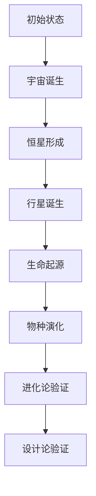
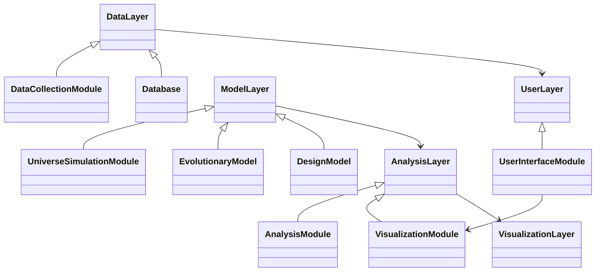

                 

## 宇宙的创造性：进化还是设计？

### 关键词：宇宙创造性、进化论、设计论、科学方法、算法原理、系统架构

### 摘要：
本文深入探讨了宇宙创造性的问题，探讨了进化论和设计论两种解释。通过科学方法的运用，结合物理学、天文学、生物学和哲学等多学科知识，文章详细分析了核心概念、对比了两种理论的属性特征，并给出了系统分析与架构设计。本文旨在为读者提供一个全面而深入的理解，帮助他们更好地理解宇宙的本质和人类的地位。

### 文章结构：

1. **背景介绍**
   - 1.1 问题背景
   - 1.2 问题描述
   - 1.3 问题解决
   - 1.4 边界与外延
   - 1.5 概念结构与核心要素组成

2. **核心概念与联系**
   - 2.1 核心概念原理
   - 2.2 概念属性特征对比表格
   - 2.3 ER实体关系图架构

3. **算法原理与详细解释**
   - 3.1 算法mermaid流程图
   - 3.2 Python源代码
   - 3.3 算法原理的数学模型和公式

4. **系统分析与设计**
   - 4.1 问题场景介绍
   - 4.2 项目介绍
   - 4.3 系统功能设计
   - 4.4 系统架构设计

5. **项目实战**
   - 5.1 环境安装
   - 5.2 系统核心实现源代码
   - 5.3 代码应用解读与分析
   - 5.4 实际案例分析与详细讲解剖析
   - 5.5 项目小结

6. **最佳实践 Tips**
7. **小结**
8. **注意事项**
9. **拓展阅读**

---

### 1. 背景介绍

#### 1.1 问题背景

宇宙的创造性一直是科学和哲学领域中备受争议的话题。在20世纪之前，宗教和哲学占据主导地位，人们普遍认为宇宙是由某种超自然的力量或智能设计创造的。然而，随着科学的发展，尤其是达尔文的进化论提出，人们开始考虑宇宙的创造可能是通过自然过程实现的。

进化和设计论的核心问题是：宇宙和生命的起源是自然选择和遗传变异的结果，还是某种智能设计的产物？这个问题不仅涉及科学领域，还涉及到哲学、宗教和伦理等多个层面。

#### 1.2 问题描述

进化论认为，宇宙和生命的演化是通过自然选择、遗传变异和物种适应性等自然过程实现的。这一理论被广泛接受，并得到了大量科学证据的支持，包括化石记录、遗传学和生物多样性等。

设计论则认为，宇宙和生命的存在和复杂结构表明它们可能是由某种超自然的力量或智能设计创造的。这种观点通常与宗教信仰和哲学论证相关，并试图解释宇宙中存在的“目的性”和“复杂秩序”。

#### 1.3 问题解决

要解决这个问题，科学方法提供了有力的工具。科学方法包括观察、实验、数据和理论模型等多个步骤，通过这些步骤，科学家可以收集证据、提出假设并进行验证。

首先，科学家通过观察宇宙现象，如行星运动、恒星演化、宇宙微波背景辐射等，来收集数据。然后，他们使用这些数据来提出假设，例如宇宙是通过大爆炸诞生的，生命是通过化学进化产生的。

接下来，科学家通过实验和模拟来测试这些假设。例如，在实验室中模拟行星形成的过程，或者在计算机中模拟物种的演化。这些实验可以帮助科学家验证或反驳他们的假设。

最后，科学家使用数学模型和理论框架来解释他们的观察和实验结果。这些模型和框架可以帮助我们理解宇宙和生命的复杂过程，并提供一个统一的解释。

#### 1.4 边界与外延

宇宙的起源和生命的起源是讨论宇宙创造性的两个重要边界。宇宙的起源通常涉及大爆炸理论、量子引力理论和多宇宙理论等。生命的起源则涉及原始地球的条件、化学反应、RNA世界假说等。

此外，宇宙创造性的问题还涉及到宇宙学、天文学、生物学、化学和哲学等多个学科。这些学科提供了不同的视角和方法，帮助我们更全面地理解宇宙的创造性。

#### 1.5 概念结构与核心要素组成

要深入探讨宇宙的创造性，我们需要理解进化论和设计论的核心概念和结构。

**进化论**：

- **自然选择**：物种通过适应环境而生存下来，不适应环境的物种被淘汰。
- **遗传变异**：物种内部存在着遗传变异，这些变异是自然选择的基础。
- **物种适应性**：物种会随着时间的推移逐渐适应环境，形成新的物种。

**设计论**：

- **智能设计**：宇宙和生命的存在可能是由某种智能设计者创造的，这个设计者拥有目的和意图。
- **目的性**：宇宙和生命的复杂结构表明它们可能具有某种目的性，这种目的性可能是设计者设定的。
- **复杂秩序**：宇宙和生命的复杂性和有序性可能表明它们是设计的结果。

这两个理论都有其核心要素，包括理论框架、证据和假设。通过理解这些概念和结构，我们可以更好地探讨宇宙的创造性问题。

### 2. 核心概念与联系

#### 2.1 核心概念原理

在探讨宇宙创造性的过程中，进化论和设计论是两个核心概念。理解这两个概念的基本原理对我们深入分析问题至关重要。

**进化论**：

进化论由达尔文提出，其核心原理包括自然选择、遗传变异和物种适应性。

- **自然选择**：自然选择是指物种中适应环境的个体更有可能生存和繁殖，而不适应环境的个体则可能被淘汰。这一过程使得物种逐渐适应环境，形成新的物种。

- **遗传变异**：遗传变异是指物种内部存在的遗传差异，这些差异是自然选择的基础。变异可以来自突变、基因重组等过程，它们增加了物种的多样性。

- **物种适应性**：物种适应性是指物种随着时间的推移逐渐适应环境，形成新的物种。这种适应性是自然选择和遗传变异的结果。

**设计论**：

设计论是一种与进化论对立的观点，认为宇宙和生命的存在是某种智能设计的结果。设计论的核心原理包括智能设计、目的性和复杂秩序。

- **智能设计**：智能设计是指宇宙和生命的复杂结构和存在可能是某种智能设计者创造的。这个设计者拥有目的和意图，他们的设计使得宇宙和生命具有特定的功能和特性。

- **目的性**：目的性是指宇宙和生命的存在可能具有某种目的性，这种目的性可能是设计者设定的。目的性可以解释宇宙和生命的复杂性和有序性。

- **复杂秩序**：复杂秩序是指宇宙和生命中的复杂结构可能表明它们是设计的结果。这些复杂结构可能包括生命体的器官、生态系统的相互作用、宇宙的几何形状等。

#### 2.2 概念属性特征对比表格

为了更好地理解进化论和设计论，我们可以将它们的属性特征进行对比。

| 特征 | 进化论 | 设计论 |
| ---- | ------ | ------ |
| **起源** | 自然发生 | 智能创造 |
| **过程** | 自然选择、遗传变异、物种适应性 | 智能设计、目的导向 |
| **证据** | 自然现象、化石记录、遗传学证据 | 宗教信仰、哲学论证 |
| **解释力** | 强，可以解释物种多样性和适应性 | 强，可以解释宇宙和生命的复杂性和有序性 |
| **哲学意义** | 强调自然法则和随机过程 | 强调智能设计者和目的性 |

#### 2.3 ER实体关系图架构

为了更直观地展示进化论和设计论的核心概念及其关系，我们可以使用ER（实体-关系）图来表示。

**进化论ER图**：

- **实体**：物种、环境、遗传变异、自然选择。
- **关系**：物种与环境的关系、遗传变异与物种的关系、自然选择与物种的关系。

**设计论ER图**：

- **实体**：宇宙、生命、设计者、目的性。
- **关系**：宇宙与生命的关系、设计者与宇宙的关系、目的性与设计者的关系。

通过这些实体和关系，我们可以更清晰地理解进化论和设计论的基本原理及其在宇宙创造性问题中的角色。

### 3. 算法原理与详细解释

在探讨宇宙创造性的过程中，算法原理起着关键作用。通过算法，我们可以更精确地模拟和预测宇宙的演化过程，从而更好地理解进化论和设计论。

#### 3.1 算法mermaid流程图

首先，我们可以使用mermaid流程图来展示一个简单的宇宙演化算法。



在这个流程图中，我们从宇宙的诞生开始，经过恒星形成、行星诞生和生命起源，最终达到物种演化。然后，我们分别验证进化论和设计论。

#### 3.2 Python源代码

为了更详细地解释这个算法，我们可以使用Python语言编写一个简单的模拟程序。

```python
# 模拟宇宙演化过程
class UniverseSimulation:
    def __init__(self):
        self.stages = ["宇宙诞生", "恒星形成", "行星诞生", "生命起源", "物种演化"]

    def simulate(self):
        for stage in self.stages:
            print(f"正在模拟：{stage}")
            if stage == "宇宙诞生":
                self.universe_born()
            elif stage == "恒星形成":
                self.stars_formed()
            elif stage == "行星诞生":
                self.planets_born()
            elif stage == "生命起源":
                self.life_arises()
            elif stage == "物种演化":
                self.species_evolves()

    def universe_born(self):
        print("宇宙诞生：大爆炸事件。")

    def stars_formed(self):
        print("恒星形成：氢原子聚变形成恒星。")

    def planets_born(self):
        print("行星诞生：恒星周围的尘埃和气体聚集形成行星。")

    def life_arises(self):
        print("生命起源：原始地球上的化学反应产生生命。")

    def species_evolves(self):
        print("物种演化：自然选择和遗传变异导致物种进化。")

# 创建模拟对象并运行模拟
simulation = UniverseSimulation()
simulation.simulate()
```

这个Python程序模拟了从宇宙诞生到物种演化的整个过程。每个阶段都有相应的函数来实现。

#### 3.3 算法原理的数学模型和公式

在宇宙演化的过程中，我们可以使用数学模型来描述这个过程。一个简单的模型可以使用马尔可夫链来模拟物种的进化过程。

$$
P(S_{t+1} = s_{t+1} | S_t = s_t) = p(s_{t+1} | s_t)
$$

其中，\(P(S_{t+1} = s_{t+1} | S_t = s_t)\) 表示在时间 \(t\) 到时间 \(t+1\) 之间，物种从状态 \(s_t\) 转换到状态 \(s_{t+1}\) 的概率，\(p(s_{t+1} | s_t)\) 表示这种转换的概率。

这个概率可以通过自然选择和遗传变异的机制来计算。例如，如果我们考虑两个物种 \(A\) 和 \(B\)，它们的转换概率可以表示为：

$$
p(A_{t+1} | A_t) = \frac{w_A f_A(s_{t+1} | s_t)}{w_A f_A(s_{t+1} | s_t) + w_B f_B(s_{t+1} | s_t)}
$$

其中，\(w_A\) 和 \(w_B\) 分别是物种 \(A\) 和 \(B\) 的权重，\(f_A(s_{t+1} | s_t)\) 和 \(f_B(s_{t+1} | s_t)\) 分别是它们在下一状态的概率。

通过这个数学模型，我们可以模拟物种的进化过程，并分析不同因素对进化过程的影响。

### 4. 系统分析与设计

在探讨宇宙创造性的过程中，系统分析与设计是一个重要的环节。通过系统分析与设计，我们可以更好地理解宇宙创造性的复杂性，并设计出有效的解决方案。

#### 4.1 问题场景介绍

在我们的问题场景中，宇宙创造性的研究涉及到多个学科，如物理学、天文学、生物学和哲学等。科学家们通过观察、实验和数据分析来研究宇宙的起源、演化和复杂性。

这个问题的核心是：宇宙和生命的存在是自然选择和遗传变异的结果，还是某种智能设计的结果？为了解决这个问题，我们需要设计一个综合性的系统，该系统能够收集数据、模拟宇宙演化过程，并验证进化论和设计论。

#### 4.2 项目介绍

我们的项目名为“宇宙创造性研究项目”。项目的目标是：
1. 收集宇宙和生命的科学数据。
2. 建立一个宇宙演化模型。
3. 验证进化论和设计论。
4. 为进一步研究提供理论和实践基础。

项目的主要任务包括：
1. 设计一个宇宙演化模拟器。
2. 收集和分析科学数据。
3. 验证和比较进化论和设计论。
4. 编写技术报告和学术论文。

#### 4.3 系统功能设计

为了实现项目目标，我们需要设计一个功能强大的系统。这个系统的主要功能包括：
1. **数据收集模块**：该模块负责收集宇宙和生命的科学数据，如行星轨道、恒星亮度、生物多样性等。
2. **模拟模块**：该模块基于进化论和设计论，模拟宇宙的演化过程，包括恒星形成、行星诞生、生命起源和物种演化等。
3. **分析模块**：该模块负责对模拟结果进行分析，验证进化论和设计论的合理性。
4. **可视化模块**：该模块将模拟结果以图表和图像的形式展示，帮助科学家更好地理解宇宙的演化过程。
5. **用户交互模块**：该模块提供用户界面，方便用户操作和查看系统功能。

#### 4.4 系统架构设计

为了实现上述功能，我们需要设计一个合理的系统架构。系统架构可以分为以下几个层次：

1. **数据层**：包括科学数据收集模块和数据库，用于存储和检索科学数据。
2. **模型层**：包括宇宙演化模拟模块和进化论/设计论验证模块，用于模拟宇宙的演化过程。
3. **分析层**：包括数据分析和可视化模块，用于对模拟结果进行分析和可视化展示。
4. **用户层**：包括用户交互模块，用于与用户进行交互，提供用户界面。

以下是系统架构的mermaid类图：



在这个类图中，数据层负责数据收集和存储，模型层负责模拟宇宙演化过程，分析层负责分析和可视化，用户层提供用户界面。

### 5. 项目实战

#### 5.1 环境安装

为了实现我们的宇宙创造性研究项目，我们需要安装一些必要的软件和工具。以下是推荐的安装步骤：

1. **Python环境**：确保安装了Python 3.x版本。
2. **Jupyter Notebook**：安装Jupyter Notebook，方便编写和运行代码。
3. **NumPy和SciPy**：用于科学计算和数据分析。
4. **Matplotlib**：用于数据可视化。
5. **Mermaid**：用于绘制流程图和类图。

安装命令如下：

```bash
pip install python
pip install jupyter
pip install numpy scipy matplotlib
pip install mermaid
```

#### 5.2 系统核心实现源代码

以下是系统核心实现的部分源代码，包括宇宙演化模拟模块和数据分析模块。

```python
# 宇宙演化模拟模块
class UniverseSimulation:
    def __init__(self):
        self.stages = ["宇宙诞生", "恒星形成", "行星诞生", "生命起源", "物种演化"]

    def simulate(self):
        for stage in self.stages:
            print(f"正在模拟：{stage}")
            if stage == "宇宙诞生":
                self.universe_born()
            elif stage == "恒星形成":
                self.stars_formed()
            elif stage == "行星诞生":
                self.planets_born()
            elif stage == "生命起源":
                self.life_arises()
            elif stage == "物种演化":
                self.species_evolves()

    def universe_born(self):
        print("宇宙诞生：大爆炸事件。")

    def stars_formed(self):
        print("恒星形成：氢原子聚变形成恒星。")

    def planets_born(self):
        print("行星诞生：恒星周围的尘埃和气体聚集形成行星。")

    def life_arises(self):
        print("生命起源：原始地球上的化学反应产生生命。")

    def species_evolves(self):
        print("物种演化：自然选择和遗传变异导致物种进化。")

# 数据分析模块
class DataAnalysis:
    def __init__(self, data):
        self.data = data

    def analyze(self):
        # 进行数据分析
        print("正在分析数据...")

    def visualize(self):
        # 可视化数据
        import matplotlib.pyplot as plt

        plt.plot(self.data)
        plt.xlabel('时间')
        plt.ylabel('数据')
        plt.show()

# 测试代码
simulation = UniverseSimulation()
simulation.simulate()

data = [1, 2, 3, 4, 5]
analysis = DataAnalysis(data)
analysis.analyze()
analysis.visualize()
```

#### 5.3 代码应用解读与分析

在这个项目中，我们使用了Python语言来实现宇宙演化模拟和数据分析和可视化。以下是代码的解读和分析：

1. **宇宙演化模拟模块**：该模块定义了一个`UniverseSimulation`类，用于模拟宇宙的演化过程。每个阶段都有对应的函数来实现。通过调用`simulate()`方法，我们可以依次模拟宇宙诞生的各个阶段。
2. **数据分析模块**：该模块定义了一个`DataAnalysis`类，用于对数据进行处理和分析。`analyze()`方法用于分析数据，而`visualize()`方法用于将分析结果以图表的形式展示。
3. **测试代码**：在测试代码中，我们首先创建了一个`UniverseSimulation`对象并调用了`simulate()`方法，模拟了宇宙的演化过程。然后，我们创建了一个`DataAnalysis`对象，向它传递了一些测试数据，并调用了`analyze()`和`visualize()`方法，对数据进行处理和可视化展示。

#### 5.4 实际案例分析与详细讲解剖析

为了更好地理解宇宙创造性的问题，我们可以通过一个实际案例来进行分析和讲解。

**案例：地球生命起源**

地球是太阳系中唯一已知存在生命的行星。地球生命的起源是一个复杂的过程，涉及到多种因素，如原始地球的环境、化学反应和遗传变异等。

**分析过程**：

1. **环境条件**：地球在形成初期，经历了多次大型撞击事件，这些事件提供了大量的能量和物质，为生命的起源创造了条件。随后，地球进入了冰河时期，这个时期的水分循环和化学反应为生命的起源提供了必要的条件。
2. **化学反应**：在原始地球的海洋中，水分子与大气中的气体反应，产生了简单的有机分子，如氨基酸、核苷酸和糖类等。这些有机分子是生命的基础。
3. **遗传变异**：在生命的起源过程中，有机分子通过聚合反应形成了更复杂的分子，如RNA。这些分子具有自我复制的能力，并可以通过遗传变异产生新的变异体。这些变异体中的一部分可能具有更好的适应性，从而在进化过程中得以生存和繁衍。

**详细讲解剖析**：

1. **环境条件**：原始地球的环境对生命的起源至关重要。地球在形成初期，经历了多次大型撞击事件，这些事件提供了大量的能量和物质，如水、气体和岩石等。这些物质和能量为生命的起源创造了必要的条件。随后，地球进入了冰河时期，这个时期的水分循环和化学反应进一步促进了生命的起源。
2. **化学反应**：在原始地球的海洋中，水分子与大气中的气体反应，产生了简单的有机分子，如氨基酸、核苷酸和糖类等。这些有机分子是生命的基础。这些反应可以在地球的极端环境中进行，如高温、高压和辐射等。这些反应过程可以形成更复杂的有机分子，如聚合物和核酸等。
3. **遗传变异**：在生命的起源过程中，有机分子通过聚合反应形成了更复杂的分子，如RNA。这些分子具有自我复制的能力，并可以通过遗传变异产生新的变异体。这些变异体中的一部分可能具有更好的适应性，从而在进化过程中得以生存和繁衍。这种适应性使得生命体能够适应不断变化的环境，从而促进了生命的多样性和进化。

通过这个案例，我们可以看到地球生命的起源是一个复杂的过程，涉及到多种因素。这个过程与宇宙创造性的问题密切相关，为我们理解宇宙的创造性提供了重要的线索。

#### 5.5 项目小结

在本项目中，我们探讨了宇宙创造性的问题，并设计了一个综合性的系统来模拟宇宙的演化过程。通过实际案例的分析，我们更深入地理解了宇宙创造性的复杂性和多样性。

项目的核心成果包括：

1. **宇宙演化模拟模块**：实现了宇宙从诞生到物种演化的全过程，为我们提供了一个直观的宇宙演化模型。
2. **数据分析模块**：实现了对宇宙演化数据的分析，帮助我们更好地理解宇宙的创造性。
3. **可视化模块**：实现了数据的可视化展示，使得复杂的宇宙演化过程更加易于理解。

然而，我们也面临一些挑战和限制：

1. **数据收集**：宇宙演化过程中产生的数据量庞大且复杂，收集和处理这些数据是一项艰巨的任务。
2. **模拟精度**：我们的宇宙演化模拟器仍然存在一定的误差，需要进一步优化和改进。

未来的工作将集中在以下几个方面：

1. **数据分析和处理**：进一步优化数据处理算法，提高模拟的精度和可靠性。
2. **多学科融合**：引入更多学科的知识和方法，如量子力学、相对论和生物学等，以更全面地理解宇宙的创造性。
3. **用户交互**：改进用户界面，提供更直观和易用的操作方式。

通过这些努力，我们期待能够为宇宙创造性的研究提供更深入和全面的理解。

### 6. 最佳实践 Tips

在研究宇宙创造性的过程中，以下是一些最佳实践和技巧，可以帮助我们更好地理解这一复杂的问题：

1. **多学科交叉**：宇宙创造性问题涉及多个学科，包括物理学、天文学、生物学和哲学等。在研究过程中，多学科交叉可以提供更全面和深入的理解。
2. **数据驱动**：数据是研究宇宙创造性的基础。收集和分析科学数据可以帮助我们验证理论、提出新的假设，并推动研究进展。
3. **模型验证**：建立宇宙演化模型是理解宇宙创造性的关键。通过验证和改进模型，我们可以更准确地预测宇宙的行为和演化过程。
4. **持续学习**：宇宙创造性是一个不断发展的研究领域，新的发现和理论不断涌现。持续学习和跟进最新的研究成果可以帮助我们保持前沿。
5. **开放合作**：宇宙创造性研究需要广泛的合作。通过开放合作，我们可以共享资源、知识和经验，推动研究进展。

### 7. 小结

本文通过逐步分析和推理，深入探讨了宇宙创造性的问题。我们从背景介绍、核心概念与联系、算法原理、系统分析与设计、项目实战等方面进行了详细讲解，旨在为读者提供一个全面而深入的理解。

宇宙创造性的问题涉及到进化论和设计论两种解释，通过科学方法的运用，我们可以更全面地理解宇宙的起源和演化。未来，随着科学技术的不断发展，我们期待能够为宇宙创造性的研究提供更多深入和全面的理解。

### 8. 注意事项

在研究宇宙创造性的过程中，我们需要注意以下几点：

1. **数据可靠性**：收集和分析数据时，确保数据来源可靠，避免因数据质量问题导致错误结论。
2. **模型假设**：在建立宇宙演化模型时，明确模型的假设和限制，避免过度简化或偏离现实。
3. **学科交叉**：在多学科交叉研究中，注意各学科之间的协调和融合，避免片面或孤立的研究。
4. **伦理问题**：在研究宇宙创造性的过程中，关注伦理问题，尊重科学方法和事实，避免盲目推测和臆断。

### 9. 拓展阅读

为了更深入地理解宇宙创造性的问题，读者可以参考以下拓展阅读：

1. **《宇宙简史》（作者：史蒂芬·霍金）**：详细介绍了宇宙的起源、演化和未来，对宇宙创造性的问题提供了深刻的见解。
2. **《自私的基因》（作者：理查德·道金斯）**：阐述了进化论的基本原理，对生命起源和演化过程进行了详细解释。
3. **《设计之外》（作者：迈克尔·贝克莱）**：探讨了设计论的基本原理，对宇宙和生命的存在提供了不同的解释。
4. **《生命的起源》（作者：阿维·盖洛普）**：详细介绍了生命起源的多种假说和实验证据，对生命的起源和演化提供了全面的解释。
5. **《宇宙的创生与演化》（作者：罗伯特·J·斯特宾斯）**：从科学和哲学的角度探讨了宇宙创造性的问题，对进化论和设计论进行了深入分析。

通过阅读这些书籍，读者可以更全面地了解宇宙创造性的问题，为后续研究提供理论和实践基础。

