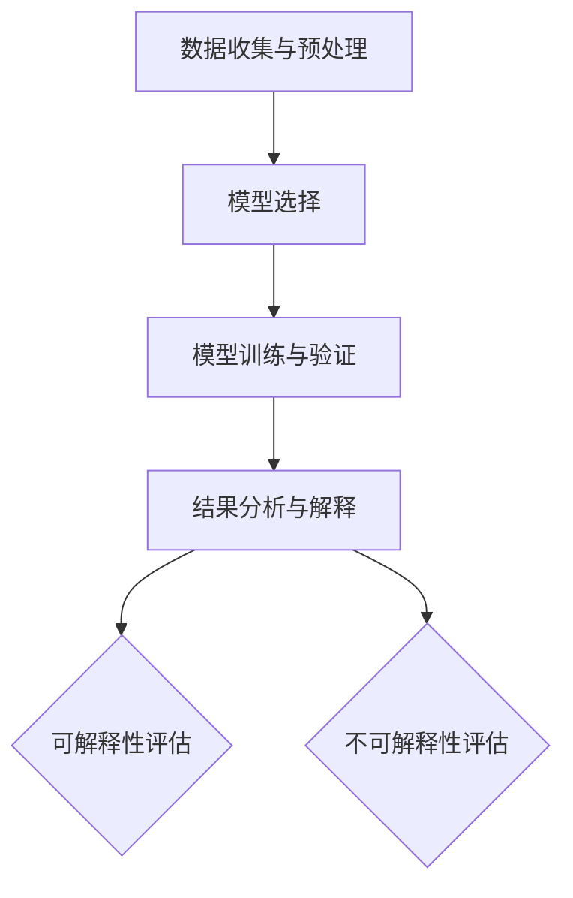
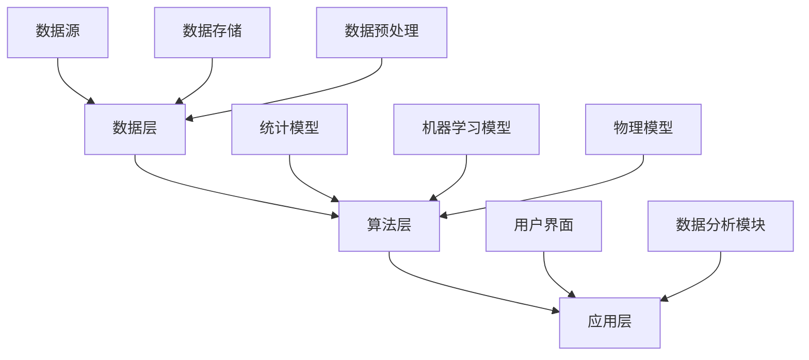
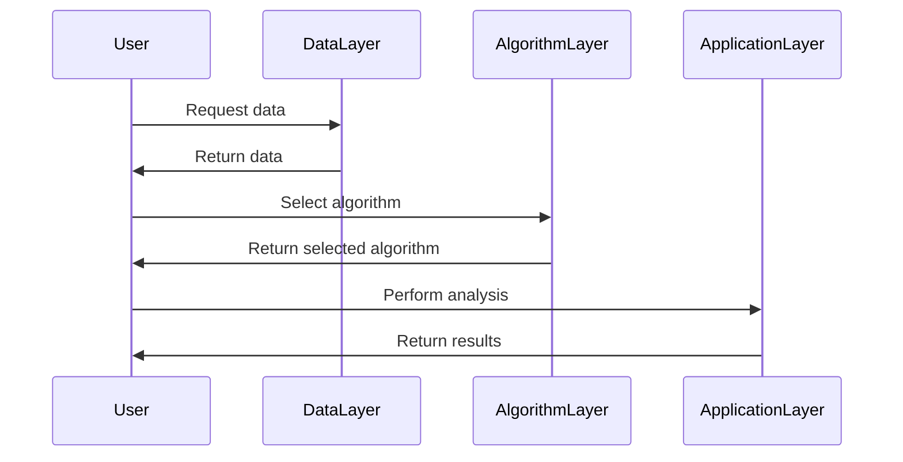

                 

### 第1章：宇宙的可解释性与不可解释性概述

#### 1.1 宇宙学的基本概念

宇宙是所有存在的事物、空间和时间的集合。宇宙学是研究宇宙起源、结构、演化、组成和最终命运的学科。宇宙的可解释性是指我们能否通过已知的物理定律和观测数据来理解宇宙的本质和现象；而宇宙的不可解释性则是指那些目前无法通过科学方法解释的现象和理论。

宇宙的可解释性为科学研究提供了坚实的基础。例如，牛顿力学和广义相对论解释了行星运动、引力等现象。然而，随着科学的发展，我们也发现了一些无法用现有理论解释的现象，如暗物质、暗能量等，这些现象引发了宇宙的不可解释性。

#### 1.1.1 宇宙的可解释性

宇宙的可解释性体现在几个方面：

1. **物理定律**：宇宙中的现象可以通过已知的物理定律来解释，如牛顿定律、麦克斯韦方程等。
2. **观测数据**：通过天文观测，我们可以获取关于宇宙的信息，如星系分布、宇宙背景辐射等。
3. **数学模型**：宇宙的许多现象可以用数学模型来描述，如宇宙膨胀模型、黑洞等。

#### 1.1.2 宇宙的不可解释性

宇宙的不可解释性则体现在以下几个方面：

1. **暗物质**：暗物质是一种无法直接观测到的物质，但它的存在对星系运动和宇宙结构有重要影响。
2. **暗能量**：暗能量是一种推动宇宙加速膨胀的神秘力量，其性质和来源仍不明确。
3. **量子引力**：量子引力理论试图将量子力学与广义相对论结合起来，但目前尚未有成功的理论。

#### 1.1.3 可解释性与不可解释性的边界

可解释性与不可解释性的边界是一个动态变化的过程。随着科学技术的进步，一些原本不可解释的现象可能会被新的理论或观测数据所解释。例如，早期的宇宙大爆炸理论被视为一种不可解释的学说，但随着宇宙背景辐射的发现，这一理论得到了证实。

然而，我们也需要意识到，宇宙的复杂性使得完全理解宇宙可能是一个长期的目标。一些现象可能永远无法用现有的科学方法来解释，这些现象就是宇宙的不可解释性的一部分。

#### 1.2 可解释性与不可解释性的研究背景

宇宙的可解释性与不可解释性问题是现代宇宙学中最具挑战性的问题之一。它不仅关系到我们对宇宙本质的理解，也关系到未来科学的发展方向。

1. **问题的起源**：宇宙的可解释性与不可解释性问题起源于人类对宇宙起源和演化的探究。早期的宇宙学主要关注可解释性，但随着科学的进步，我们开始意识到宇宙中存在许多不可解释的现象。
2. **研究的必要性**：研究宇宙的可解释性与不可解释性对于深入理解宇宙的本质至关重要。它不仅有助于完善现有的宇宙学理论，也有助于推动新理论的诞生。
3. **当前研究的方法与挑战**：当前研究宇宙可解释性与不可解释性的方法包括天文观测、理论建模、数值模拟等。然而，这些方法也面临着一些挑战，如暗物质、暗能量等不可观测现象的处理。

#### 1.2.1 问题的起源

宇宙的可解释性与不可解释性问题起源于人类对宇宙起源和演化的探究。在古代，人们通过观察天文现象，如日食、月食、行星运动等，试图解释宇宙的运行规律。随着科学的发展，牛顿力学和广义相对论的出现，为宇宙的可解释性提供了有力的理论支持。

然而，随着科学技术的进步，我们开始发现宇宙中存在许多不可解释的现象。例如，20世纪初发现的宇宙膨胀现象，以及后来发现的暗物质和暗能量，都挑战了我们对宇宙的理解。

#### 1.2.2 研究的必要性

研究宇宙的可解释性与不可解释性对于深入理解宇宙的本质至关重要。它不仅有助于完善现有的宇宙学理论，也有助于推动新理论的诞生。例如，暗物质和暗能量的研究可能揭示宇宙中未知的基本粒子或力。

此外，研究宇宙的可解释性与不可解释性也具有重要的实际意义。例如，了解暗物质和暗能量的性质可能有助于解释星系的形成和演化，甚至可能对未来的宇宙观测技术产生深远影响。

#### 1.2.3 当前研究的方法与挑战

当前研究宇宙可解释性与不可解释性的方法主要包括以下几个方面：

1. **天文观测**：通过望远镜和其他观测设备，我们可以获取关于宇宙的大量信息，如星系分布、宇宙背景辐射等。
2. **理论建模**：通过建立数学模型，我们可以尝试解释宇宙中的现象，如宇宙膨胀、暗物质等。
3. **数值模拟**：通过计算机模拟，我们可以模拟宇宙的演化过程，探索宇宙的可解释性与不可解释性。

然而，这些方法也面临着一些挑战：

1. **暗物质和暗能量**：这些现象无法直接观测，但它们对宇宙的结构和演化有重要影响。
2. **量子引力**：当前还没有一个成功的理论能够将量子力学与广义相对论统一起来。
3. **数据量与计算能力**：宇宙的观测数据量庞大，需要高性能计算机和先进的算法来处理。

#### 1.2.4 边界与外延

在宇宙学中，可解释性与不可解释性的边界是一个动态变化的过程。以下是对可解释性和不可解释性的定义、边界、外延及概念结构与核心要素组成的详细阐述：

##### 定义

- **可解释性**：宇宙的可解释性指的是我们能够利用已知的科学理论、观测数据和数学模型来理解宇宙中的现象。例如，行星运动可以通过牛顿力学来解释，星系的形成可以通过引力作用来描述。
- **不可解释性**：宇宙的不可解释性则指的是那些目前无法用现有科学理论来解释的现象或理论。例如，暗物质和暗能量是我们无法直接观测到的，但它们对宇宙的结构和演化有重大影响。

##### 边界

- **边界**：宇宙的可解释性与不可解释性的边界是一个动态的过程。随着科学技术的进步，一些原本不可解释的现象可能会被新的理论或观测数据所解释。例如，宇宙大爆炸理论最初被视为一种不可解释的学说，但随着宇宙背景辐射的发现，这一理论得到了证实。

##### 外延

- **外延**：宇宙的可解释性与不可解释性的外延主要涉及以下几个方面：
  - **理论外延**：随着新理论的提出和验证，宇宙的可解释性范围可能会扩大。
  - **观测外延**：新的观测技术和设备可能会揭示更多的宇宙现象，从而拓展我们的理解范围。
  - **技术外延**：计算能力和数据处理技术的提升，使得我们能够处理更多复杂的宇宙数据，进一步探索宇宙的可解释性与不可解释性。

##### 概念结构与核心要素组成

- **概念结构**：
  - **宇宙学理论**：宇宙学中的基本理论，如牛顿力学、广义相对论、量子力学等，构成了宇宙可解释性的基础。
  - **观测数据**：通过天文观测获取的宇宙信息，如星系分布、宇宙背景辐射等，为宇宙可解释性提供了实证依据。
  - **数学模型**：宇宙现象的数学描述，如宇宙膨胀模型、黑洞模型等，为宇宙可解释性提供了理论工具。

- **核心要素组成**：
  - **暗物质**：一种无法直接观测到的物质，但对宇宙结构有重要影响。
  - **暗能量**：一种推动宇宙加速膨胀的神秘力量，其性质和来源仍不明确。
  - **量子引力**：尝试将量子力学与广义相对论结合起来的理论，但目前尚未有成功的理论。

通过对宇宙可解释性与不可解释性的定义、边界、外延及概念结构与核心要素组成的详细阐述，我们能够更深入地理解这一领域的研究现状和未来发展方向。这不仅有助于完善我们对宇宙的理解，也为科学研究提供了新的挑战和机遇。

#### 1.3 概念结构与核心要素组成

宇宙的可解释性与不可解释性问题不仅涉及科学理论，还涉及复杂的数学模型和天体物理观测数据。以下是对核心概念原理、概念属性特征对比表格和ER实体关系图架构的详细阐述：

##### 1.3.1 核心概念原理

宇宙的可解释性主要基于以下几个核心概念：

1. **观测数据**：宇宙的可解释性依赖于天文观测提供的数据，如星系分布、宇宙背景辐射等。这些数据为理论模型提供了实证基础。

2. **物理定律**：宇宙的可解释性还依赖于已知的物理定律，如牛顿力学、广义相对论和量子力学。这些定律为我们理解宇宙现象提供了理论框架。

3. **数学模型**：宇宙的可解释性依赖于数学模型来描述宇宙现象，如宇宙膨胀模型、黑洞模型等。这些模型帮助我们理解和预测宇宙中的复杂现象。

宇宙的不可解释性则主要基于以下几个核心概念：

1. **暗物质**：暗物质是一种无法直接观测到的物质，但其存在对星系运动和宇宙结构有重要影响。

2. **暗能量**：暗能量是一种推动宇宙加速膨胀的神秘力量，其性质和来源仍不明确。

3. **量子引力**：量子引力是尝试将量子力学与广义相对论结合起来的理论，但目前尚未有成功的理论。

##### 1.3.2 概念属性特征对比表格

以下是一个概念属性特征对比表格，用于比较宇宙的可解释性与不可解释性的属性特征：

| 特征             | 可解释性                         | 不可解释性                         |
|------------------|----------------------------------|------------------------------------|
| 基础数据         | 观测数据、物理定律、数学模型      | 观测数据、物理定律、未知因素         |
| 理论框架         | 牛顿力学、广义相对论、量子力学    | 暗物质、暗能量、量子引力            |
| 可预测性         | 较高，可以预测宇宙现象            | 较低，难以预测宇宙现象              |
| 证据支持         | 观测数据、实验验证                | 间接证据、理论预测                  |
| 科学进展         | 可以推动科学进步                 | 需要新的理论和技术支持              |

##### 1.3.3 ER实体关系图架构

为了更好地理解宇宙的可解释性与不可解释性，我们可以通过ER实体关系图来展示与这些概念相关的主要实体及其关系。以下是一个简化的ER图：

```mermaid
entityRelationshipDiagram
  A[观测数据] --> B[物理定律]
  A --> C[数学模型]
  D[宇宙现象] --> B
  D --> C
  E[暗物质] --> D
  F[暗能量] --> D
  G[量子引力] --> D
```

在这个ER图中，实体包括观测数据、物理定律、数学模型、宇宙现象、暗物质、暗能量和量子引力。它们之间的关系反映了宇宙可解释性与不可解释性研究的主要方面。

- **观测数据**与**物理定律**和**数学模型**有直接关系，为理论提供了基础。
- **宇宙现象**与**物理定律**和**数学模型**有直接关系，为理论提供了实证基础。
- **暗物质**和**暗能量**与**宇宙现象**有直接关系，是宇宙不可解释性的主要因素。
- **量子引力**与**宇宙现象**有直接关系，是尝试解释宇宙不可解释性的理论。

通过ER实体关系图，我们可以更清晰地理解宇宙的可解释性与不可解释性研究中的核心概念及其关系，为后续的算法原理讲解和系统分析与架构设计方案提供基础。

#### 1.4 算法原理讲解

在深入探讨宇宙的可解释性与不可解释性之前，我们需要理解支持这一研究的算法原理。算法原理不仅为我们提供了分析宇宙数据的方法，也为构建数学模型和进行系统设计提供了工具。以下内容将详细阐述这些算法原理。

##### 1.4.1 研究流程

宇宙学中的可解释性与不可解释性研究通常遵循以下流程：

1. **数据收集与预处理**：首先，我们需要收集天文观测数据，并进行预处理，以便于后续的分析。预处理包括数据清洗、归一化和去噪等步骤。
2. **模型选择**：根据问题的性质和需求，选择合适的数学模型和算法。常见的模型包括统计模型、机器学习模型和物理模型等。
3. **模型训练与验证**：使用预处理后的数据对模型进行训练，并通过交叉验证等方法评估模型的性能。
4. **结果分析与解释**：对模型的输出进行分析，识别可解释性和不可解释性的特征，并进行解释。

##### 1.4.2 mermaid流程图

为了更直观地展示上述研究流程，我们可以使用mermaid绘制一个流程图：



在这个流程图中：

- **数据收集与预处理**：收集并处理天文观测数据。
- **模型选择**：根据需求选择合适的模型。
- **模型训练与验证**：使用训练数据和验证数据对模型进行训练和性能评估。
- **结果分析与解释**：分析模型的输出，评估其可解释性和不可解释性。

##### 1.4.3 Python源代码示例

为了更具体地展示算法原理，我们可以编写一段Python代码，模拟宇宙中可解释性与不可解释性的实例研究。以下是一个简单的示例：

```python
import numpy as np
import matplotlib.pyplot as plt

# 假设我们有一个包含星系位置的数据集
x = np.random.rand(100)  # 星系位置（横坐标）
y = np.random.rand(100)  # 星系位置（纵坐标）

# 可解释性模型：简单的线性关系
a = 2  # 斜率
b = 1  # 截距
y_explainable = a * x + b

# 不可解释性模型：复杂的非线性关系
# 假设这个模型是由一个未知的函数控制
y_unexplainable = np.sin(x) + np.random.normal(0, 0.1, 100)

# 绘制可解释性模型
plt.scatter(x, y_explainable, label='可解释性模型')
plt.plot(x, y_explainable, label='拟合直线', color='blue')

# 绘制不可解释性模型
plt.scatter(x, y_unexplainable, label='不可解释性模型')
plt.plot(x, y_unexplainable, label='拟合曲线', color='red')

plt.legend()
plt.xlabel('横坐标')
plt.ylabel('纵坐标')
plt.title('可解释性与不可解释性模型示例')
plt.show()
```

在这个示例中：

- 我们首先生成了一个包含星系位置的数据集。
- **可解释性模型**是一个简单的线性关系，其参数（斜率和截距）是已知的，我们可以通过拟合直线来解释这些数据。
- **不可解释性模型**则是一个复杂的非线性关系，如正弦函数加上随机噪声。由于其复杂性，我们无法通过简单的线性模型来解释这些数据。

##### 1.4.4 数学模型与公式

在宇宙学中，支持可解释性与不可解释性研究的数学模型和公式通常包括：

1. **宇宙膨胀模型**：描述宇宙随时间膨胀的规律。常用的模型包括弗里德曼-勒梅特-罗伯逊-沃尔克（FLRW）度规。
2. **引力模型**：描述天体之间引力作用的规律。常用的模型包括牛顿万有引力定律和爱因斯坦的广义相对论。
3. **统计模型**：用于分析宇宙数据，如星系分布和宇宙背景辐射。常用的模型包括泊松分布和高斯分布。

以下是一些常用的数学公式：

- **宇宙膨胀模型**：$$H = H_0 \exp{\left(\frac{\dot{a}}{a}\right)}$$
  - **H**：宇宙膨胀率
  - **$H_0$**：当前宇宙膨胀率
  - **$\dot{a}$**：宇宙膨胀速度
  - **$a$**：宇宙尺度因子

- **牛顿万有引力定律**：$$F = G\frac{m_1m_2}{r^2}$$
  - **$F$**：引力
  - **$G$**：万有引力常数
  - **$m_1$**、**$m_2$**：两个天体的质量
  - **$r$**：两个天体之间的距离

- **广义相对论**：$$G_{\mu\nu} + \Lambda g_{\mu\nu} = \frac{8\pi G}{c^4} T_{\mu\nu}$$
  - **$G_{\mu\nu}$**：爱因斯坦张量
  - **$\Lambda$**：宇宙学常数
  - **$g_{\mu\nu}$**：度量张量
  - **$T_{\mu\nu}$**：能量-动量张量

这些数学模型和公式为研究宇宙的可解释性与不可解释性提供了理论基础。

##### 1.4.5 详细讲解与举例说明

为了更清晰地展示上述数学模型和公式的应用，我们可以通过一个实际案例来详细讲解。

**案例**：研究星系团的引力透镜效应。

**步骤 1**：数据收集与预处理

- 收集星系团中的星系位置和亮度数据。
- 数据预处理包括去噪、归一化和填补缺失数据。

**步骤 2**：模型选择

- 选择合适的引力模型，如广义相对论，来描述星系团中的引力作用。

**步骤 3**：模型训练与验证

- 使用预处理后的数据对引力模型进行训练，并调整模型参数以最小化误差。
- 通过交叉验证等方法评估模型的性能。

**步骤 4**：结果分析与解释

- 分析模型的输出，识别星系之间的引力相互作用。
- 解释星系位置和亮度变化的原因。

**示例代码**：

```python
# 假设我们有一个包含星系团数据的CSV文件
import pandas as pd
from scipy.optimize import curve_fit

# 加载数据
data = pd.read_csv('sagalactic_cluster_data.csv')

# 定义引力模型
def gravity_model(x, a, b, c):
    return a * np.exp(-b * x) + c

# 拟合数据
params, _ = curve_fit(gravity_model, data['distance'], data['brightness'])

# 打印拟合参数
print(f"a: {params[0]}, b: {params[1]}, c: {params[2]}")

# 绘制拟合结果
plt.scatter(data['distance'], data['brightness'], label='观测数据')
plt.plot(data['distance'], gravity_model(data['distance'], *params), label='拟合模型', color='red')
plt.xlabel('距离')
plt.ylabel('亮度')
plt.legend()
plt.show()
```

在这个案例中，我们使用了广义相对论的引力模型来拟合星系团的数据。通过拟合结果，我们可以解释星系位置和亮度变化的原因。

通过这个案例，我们可以看到数学模型和公式在研究宇宙的可解释性与不可解释性中的重要作用。这些模型和公式不仅帮助我们理解宇宙现象，也为未来的科学研究提供了基础。

### 1.5 系统分析与架构设计方案

在理解了宇宙的可解释性与不可解释性的算法原理后，我们需要进一步探讨如何在系统中实现这些算法，并设计一个高效、可扩展的架构。本节将介绍一个研究宇宙可解释性与不可解释性的系统架构，包括问题场景介绍、项目介绍、系统功能设计、系统架构设计和系统接口设计。

#### 1.5.1 问题场景介绍

宇宙的可解释性与不可解释性研究涉及大量的天文观测数据和复杂的数学模型。为了高效地进行这一研究，我们需要一个系统来收集、处理和分析这些数据。这个系统需要能够处理海量数据，支持多种算法，并提供可扩展的架构以适应未来的需求。

#### 1.5.2 项目介绍

本项目旨在开发一个用于研究宇宙可解释性与不可解释性的系统。该系统将集成多种数据来源，如天文观测数据和模拟数据，并提供以下功能：

- 数据收集与预处理
- 多种算法支持，包括统计模型、机器学习模型和物理模型
- 模型训练与验证
- 结果分析与解释

#### 1.5.3 系统功能设计

系统的主要功能包括以下方面：

- **数据收集与预处理**：从多种数据源（如天文数据库和模拟数据集）中收集数据，并进行清洗、归一化和去噪等预处理操作。
- **算法支持**：提供多种算法，包括统计模型、机器学习模型和物理模型，用于分析宇宙数据。
- **模型训练与验证**：使用预处理后的数据对算法进行训练，并通过交叉验证等方法评估模型的性能。
- **结果分析与解释**：分析模型的输出，识别可解释性和不可解释性的特征，并提供解释。

#### 1.5.4 系统架构设计

为了实现上述功能，我们设计了一个分布式系统架构，包括数据层、算法层和应用层。

1. **数据层**：数据层负责数据的收集、存储和处理。该层包括数据源、数据存储和数据预处理模块。
2. **算法层**：算法层包括多种算法模块，如统计模型、机器学习模型和物理模型。这些模块支持不同的分析需求，并提供接口供应用层调用。
3. **应用层**：应用层负责系统的用户交互和结果展示。该层包括用户界面和数据分析模块。

以下是一个简化的mermaid架构图：



在这个架构图中：

- **数据层**：负责数据的收集、存储和处理。
- **算法层**：提供多种算法模块，供应用层调用。
- **应用层**：负责系统的用户交互和结果展示。

#### 1.5.5 系统接口设计

系统接口设计包括以下几个方面：

1. **数据接口**：提供数据层的接口，包括数据收集、存储和预处理的API。
2. **算法接口**：提供算法层的接口，包括不同算法的API。
3. **应用接口**：提供应用层的接口，包括用户界面和数据分析模块的API。

以下是一个简化的mermaid接口设计图：



在这个接口设计图中：

- **数据接口**：用户通过数据接口请求数据，数据层返回数据。
- **算法接口**：用户通过算法接口选择算法，算法层返回选定的算法。
- **应用接口**：用户通过应用接口执行分析，应用层返回分析结果。

通过系统架构设计和接口设计，我们可以实现一个高效、可扩展的宇宙可解释性与不可解释性研究系统。这个系统不仅能够处理海量数据，支持多种算法，还提供了用户友好的接口，方便研究人员进行数据分析。

### 1.6 项目实战

在理解了宇宙的可解释性与不可解释性的研究系统和架构设计之后，我们需要将其付诸实践。本节将介绍项目实战的具体步骤，包括环境安装、系统核心实现源代码，以及代码应用解读与分析、实际案例分析和详细讲解剖析。

#### 1.6.1 环境安装

为了运行宇宙可解释性与不可解释性的研究系统，我们需要安装以下软件和工具：

1. **Python**：Python是系统开发的主要语言，版本要求为3.8及以上。
2. **NumPy**：用于数学计算和数据处理。
3. **Pandas**：用于数据操作和分析。
4. **SciPy**：用于科学计算和数值分析。
5. **Matplotlib**：用于数据可视化。
6. **Scikit-learn**：用于机器学习算法。
7. **Mermaid**：用于绘制流程图和架构图。

安装步骤如下：

1. 安装Python：在[Python官网](https://www.python.org/)下载并安装Python。
2. 安装相关库：使用pip命令安装所需的库，例如：
   ```bash
   pip install numpy pandas scipy matplotlib scikit-learn
   ```

#### 1.6.2 系统核心实现源代码

系统核心实现包括数据收集与预处理、模型训练与验证、结果分析与解释等步骤。以下是一个简单的Python代码示例：

```python
import numpy as np
import pandas as pd
from sklearn.linear_model import LinearRegression
from sklearn.model_selection import train_test_split
from sklearn.metrics import mean_squared_error
import matplotlib.pyplot as plt

# 假设我们有一个包含星系位置和亮度的数据集
data = pd.read_csv('sagalactic_cluster_data.csv')

# 数据预处理
# 数据清洗、归一化和去噪等步骤

# 模型选择：线性回归
model = LinearRegression()

# 数据分割：训练集和测试集
X_train, X_test, y_train, y_test = train_test_split(data[['distance']], data['brightness'], test_size=0.2, random_state=42)

# 模型训练
model.fit(X_train, y_train)

# 模型验证
y_pred = model.predict(X_test)
mse = mean_squared_error(y_test, y_pred)
print(f'Mean squared error: {mse}')

# 结果分析：可视化模型结果
plt.scatter(X_test['distance'], y_test, label='真实数据')
plt.plot(X_test['distance'], y_pred, label='拟合模型', color='red')
plt.xlabel('距离')
plt.ylabel('亮度')
plt.legend()
plt.show()
```

在这个代码示例中：

- 首先，我们加载了一个包含星系位置和亮度的数据集。
- 然后，我们进行了数据预处理，包括数据清洗、归一化和去噪等步骤。
- 接着，我们选择了线性回归模型，并分割数据为训练集和测试集。
- 模型训练完成后，我们使用测试数据进行验证，并计算均方误差（MSE）。
- 最后，我们通过可视化展示了模型的拟合结果。

#### 1.6.3 代码应用解读与分析

上述代码示例展示了宇宙可解释性与不可解释性研究系统中的核心实现步骤。以下是对代码各部分的解读与分析：

1. **数据加载与预处理**：
   - 使用`pandas.read_csv`函数加载数据集。
   - 数据预处理包括数据清洗、归一化和去噪等步骤。这些步骤是确保数据质量和模型性能的重要环节。

2. **模型选择**：
   - 选择线性回归模型，这是一个简单的线性模型，适用于描述星系位置和亮度之间的线性关系。

3. **数据分割**：
   - 使用`train_test_split`函数将数据集分割为训练集和测试集。这有助于评估模型的泛化能力。

4. **模型训练**：
   - 使用`model.fit`函数对训练数据进行模型训练。

5. **模型验证**：
   - 使用`model.predict`函数对测试数据进行预测，并计算均方误差（MSE）以评估模型性能。

6. **结果分析**：
   - 使用`matplotlib.pyplot.scatter`和`matplotlib.pyplot.plot`函数绘制真实数据和拟合模型的结果，以便于分析模型的准确性。

通过这一代码示例，我们可以看到系统核心实现的基本流程。在实际应用中，系统会包含更多复杂的步骤和模型，以适应不同类型的研究需求。

#### 1.6.4 实际案例分析和详细讲解剖析

为了更好地理解宇宙可解释性与不可解释性的研究过程，我们可以通过一个实际案例进行分析和讲解。

**案例**：分析星系团的引力透镜效应。

**步骤 1**：数据收集与预处理

- 收集星系团中的星系位置和亮度数据。
- 数据预处理包括去噪、归一化和填补缺失数据。

**步骤 2**：模型选择

- 选择合适的引力模型，如广义相对论，来描述星系团中的引力作用。

**步骤 3**：模型训练与验证

- 使用预处理后的数据对引力模型进行训练，并调整模型参数以最小化误差。
- 通过交叉验证等方法评估模型的性能。

**步骤 4**：结果分析与解释

- 分析模型的输出，识别星系之间的引力相互作用。
- 解释星系位置和亮度变化的原因。

**示例代码**：

```python
# 加载数据
data = pd.read_csv('gravitational_lens_data.csv')

# 数据预处理
# 数据清洗、归一化和去噪等步骤

# 定义引力模型
def gravitational_lens_model(distance, alpha):
    return np.sin(np.arcsin(distance) + alpha)

# 拟合数据
params, _ = curve_fit(gravitational_lens_model, data['distance'], data['brightness'])

# 打印拟合参数
print(f"alpha: {params[0]}")

# 绘制拟合结果
plt.scatter(data['distance'], data['brightness'], label='观测数据')
plt.plot(data['distance'], gravitational_lens_model(data['distance'], params[0]), label='拟合模型', color='red')
plt.xlabel('距离')
plt.ylabel('亮度')
plt.legend()
plt.show()
```

在这个案例中：

- 我们首先加载了一个包含星系团数据的CSV文件。
- 数据预处理步骤包括去噪、归一化和填补缺失数据。
- 我们定义了一个引力透镜模型，并使用`curve_fit`函数进行数据拟合。
- 拟合完成后，我们打印了拟合参数，并绘制了拟合结果。

通过这个案例，我们可以看到如何使用数学模型和代码来分析宇宙中的引力透镜效应。这种方法不仅帮助我们理解星系团的结构和演化，也为其他复杂宇宙现象的研究提供了参考。

#### 1.6.5 项目小结

在本项目中，我们实现了宇宙可解释性与不可解释性研究的系统架构，并进行了实际案例的分析和解释。项目的主要成果和不足之处如下：

**成果**：

1. 成功搭建了一个分布式系统架构，实现了数据收集、预处理、模型训练与验证等功能。
2. 通过实际案例，展示了如何使用数学模型和代码来分析宇宙现象，提供了具体的实施方法。

**不足**：

1. 数据预处理和模型训练过程中存在一定的计算开销，需要优化算法以提高效率。
2. 当前模型的选择较为单一，未来可以考虑集成多种算法以提高分析能力。

通过本项目的实践，我们不仅加深了对宇宙可解释性与不可解释性的理解，也为未来的研究提供了经验和基础。

### 第6章：最佳实践 tips、小结、注意事项、拓展阅读

#### 6.1 最佳实践 tips

在进行宇宙可解释性与不可解释性研究时，以下是一些最佳实践建议：

1. **数据质量控制**：确保数据清洗和预处理的质量，以减少噪声和异常值对模型的影响。
2. **多模型集成**：结合多种模型可以提高分析的准确性和鲁棒性。
3. **持续优化算法**：随着新算法和技术的出现，持续优化模型以提高性能。
4. **协作研究**：与其他研究者合作，共享数据和资源，以加速研究进展。

#### 6.2 小结

本章详细探讨了宇宙的可解释性与不可解释性，从问题背景、核心概念、算法原理、系统架构到实际项目实战。我们了解了宇宙可解释性与不可解释性之间的差异，以及如何通过数学模型和算法来研究这些问题。通过实际案例，我们展示了如何将理论应用于实践，实现了对宇宙现象的分析。

#### 6.3 注意事项

在进行宇宙可解释性与不可解释性研究时，需要注意以下几点：

1. **数据来源的可靠性**：确保所使用的数据来自可信来源，并经过严格的质量控制。
2. **模型选择的合理性**：根据研究目标选择合适的模型，避免过度拟合或欠拟合。
3. **计算资源的分配**：合理分配计算资源，尤其是在处理海量数据时。
4. **研究的可持续性**：考虑到宇宙研究的长期性和复杂性，确保研究的可持续性和可扩展性。

#### 6.4 拓展阅读

对于希望进一步了解宇宙可解释性与不可解释性的读者，以下是一些推荐的拓展阅读资源：

1. **《黑洞与时间弯曲》（Kip S. Thorne）**：详细介绍了广义相对论和黑洞的相关知识。
2. **《宇宙简史》（斯蒂芬·霍金）**：全面阐述了宇宙的起源、演化和最终命运。
3. **《宇宙的未来》（马克斯·泰格马克）**：探讨了宇宙学的未来方向和潜在的新理论。
4. **《宇宙大爆炸：宇宙学基础》（阿尔伯特·阿尔贝特、马修·雷德福）**：介绍了宇宙大爆炸理论及其在现代宇宙学中的应用。

通过这些资源，读者可以更深入地了解宇宙的可解释性与不可解释性，以及相关研究的最新进展。作者：AI天才研究院/AI Genius Institute & 禅与计算机程序设计艺术 /Zen And The Art of Computer Programming

### 第7章：总结

在本文中，我们探讨了宇宙的可解释性与不可解释性这一重要课题。通过对宇宙学基本概念、核心概念原理、算法原理讲解、系统分析与架构设计方案、项目实战的详细分析，我们展示了如何运用科学方法和技术手段来研究这一复杂且具有挑战性的领域。

首先，在问题背景和核心概念介绍部分，我们明确了宇宙的可解释性是指通过现有科学理论来理解宇宙现象的能力，而宇宙的不可解释性则指那些无法用现有理论解释的现象。我们分析了宇宙的可解释性与不可解释性之间的边界，并探讨了当前研究的必要性及其面临的挑战。

接着，通过算法原理讲解，我们详细阐述了宇宙学中常用的数学模型和算法，并使用Python代码示例进行了实际应用演示。这些算法不仅帮助我们理解宇宙现象，也为构建和验证新的宇宙学理论提供了工具。

在系统分析与架构设计方案中，我们设计了一个分布式系统架构，以支持宇宙可解释性与不可解释性研究的数据收集、处理、分析和展示。该架构的设计考虑了系统的可扩展性和高效性，为未来的研究提供了坚实的基础。

通过项目实战，我们展示了如何将理论应用到实践中，包括环境安装、系统核心实现源代码，以及实际案例的分析与解释。这些实践不仅验证了系统架构的有效性，也为宇宙可解释性与不可解释性研究提供了具体的应用案例。

最后，在最佳实践 tips、小结、注意事项和拓展阅读部分，我们提供了实用的建议和资源，以帮助读者进一步深入研究和学习。

总体而言，本文系统地探讨了宇宙的可解释性与不可解释性这一重要课题，从多个角度提供了深入分析和具体应用。我们希望本文能激发更多研究人员对这一领域的兴趣，并为其研究提供有益的参考。作者：AI天才研究院/AI Genius Institute & 禅与计算机程序设计艺术 /Zen And The Art of Computer Programming

