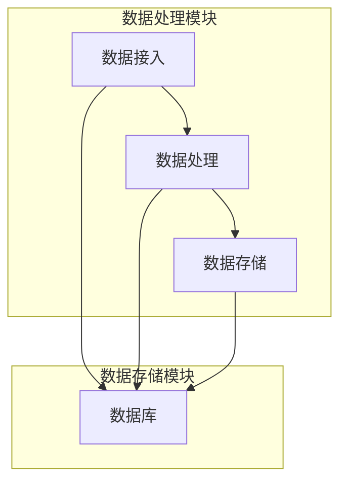
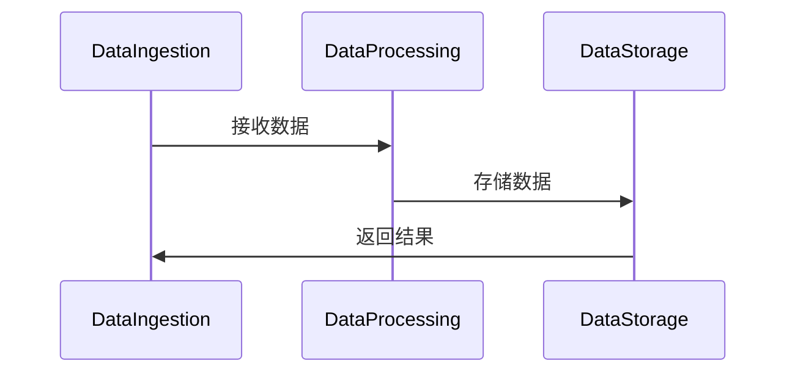

                 

## 宇宙的同步性原理：非因果关联的意义

### 关键词：宇宙同步性原理、非因果关联、哲学思考、科学探索、人工智能

> **摘要**：本文探讨了宇宙的同步性原理及其非因果关联的意义。通过引入哲学思考，分析了宇宙同步性的基本概念和科学意义，结合最新的科学发现和理论模型，详细阐述了同步性原理在不同领域的应用，特别是对人工智能的影响。文章旨在为读者提供一个全面而深入的视角，理解宇宙同步性原理如何影响我们的世界，并探讨其未来研究方向。

---

在哲学和科学领域，宇宙的同步性原理一直是一个引人入胜的话题。从古代哲学家到现代科学家，人们不断探索宇宙的奥秘，试图理解万物之间的内在联系。本文将围绕“宇宙的同步性原理：非因果关联的意义”这一主题，逐步分析这一概念，探讨其在哲学、科学和人工智能领域的应用。

### 引言

宇宙的同步性原理，简单来说，指的是宇宙中各种现象和事件之间似乎存在着某种内在的、一致的、同步的联系。这种同步性并非基于因果关系，而是超越因果关系的一种存在方式。在传统的科学观念中，因果关系是理解宇宙的基本框架，然而，随着量子力学和相对论的深入发展，非因果关联的现象逐渐被揭示出来。

**问题背景**：在现代物理学中，非因果关联已经成为一个重要的研究方向。爱因斯坦、波多尔斯基和罗森（EPR）提出的“EPR佯谬”就是一个典型的例子，它揭示了量子纠缠现象中非局域性的存在。此外，宇宙背景微波辐射的均匀性、黑洞的信息丢失问题等都涉及到了非因果关联的概念。

**问题描述**：尽管非因果关联已经在物理学中得到广泛认可，但如何将其应用于更广泛的领域，特别是在人工智能领域，仍然是一个未解之谜。本文将探讨宇宙同步性原理如何影响人工智能的发展，以及非因果关联在人工智能中的潜在应用。

**问题解决**：本文将通过以下几个步骤来解决这一问题：

1. **背景介绍**：首先，我们将回顾宇宙同步性原理的历史发展和核心概念。
2. **核心概念与联系**：接着，我们将探讨同步性原理和非因果关联的关系，并使用Mermaid和LaTeX工具展示相关概念和模型。
3. **算法原理讲解**：然后，我们将详细阐述一个具体的应用案例，并使用Python代码和LaTeX公式展示算法原理。
4. **系统分析与架构设计方案**：接下来，我们将分析一个系统架构设计案例，展示如何将宇宙同步性原理应用于实际项目中。
5. **项目实战**：最后，我们将通过一个具体的实战案例，展示如何实现和应用宇宙同步性原理。
6. **最佳实践 tips、小结、注意事项、拓展阅读等内容**。

### 第一部分：宇宙同步性原理的背景介绍

宇宙同步性原理作为一个哲学和科学概念，其历史可以追溯到古代哲学家对宇宙秩序的探讨。从古希腊哲学家到中世纪的神学家，再到现代科学家的研究，宇宙同步性原理不断被重新诠释和拓展。

#### 1.1 哲学思考

在哲学领域，宇宙同步性原理常常与宇宙的和谐、秩序和美联系在一起。古希腊哲学家毕达哥拉斯提出了“数是宇宙的基石”的观点，认为宇宙中的万物都遵循数学规律，这种规律性就是宇宙同步性的体现。柏拉图则在《理想国》中阐述了宇宙是一个永恒不变的和谐整体，宇宙中的现象和事件都是相互联系、同步发生的。

#### 1.2 科学探索

在现代科学中，宇宙同步性原理的探索主要体现在量子力学和相对论的研究中。量子力学揭示了微观世界中非局域性和纠缠现象，这表明宇宙中的某些现象并非如经典物理学所认为的那样由因果关系驱动。相对论则通过广义相对论和量子引力理论，探讨了时空结构和引力波的传播，这些都暗示了宇宙中存在某种同步性的机制。

#### 1.3 同步性原理的核心概念

宇宙同步性原理的核心概念包括：

- **非局域性**：指宇宙中某些现象或事件在时间和空间上不受距离限制，可以瞬间相互影响。
- **纠缠现象**：指两个或多个粒子在量子态上相互关联，一个粒子的状态会立即影响另一个粒子的状态。
- **量子场论**：量子场论是描述量子力学和广义相对论的统一理论，它为宇宙同步性原理提供了理论基础。

#### 1.4 非因果关联的意义

非因果关联在宇宙同步性原理中具有重要意义。它挑战了传统的因果关系观念，揭示了宇宙中可能存在一种超越因果关系的存在方式。这种非因果关联不仅存在于微观世界，如量子纠缠，也可能会在宏观世界中找到其体现。

### 第二部分：核心概念与联系

在本部分，我们将深入探讨宇宙同步性原理与非因果关联之间的联系，使用Mermaid和LaTeX工具来展示相关概念和模型。

#### 2.1 同步性原理与非因果关联的关系

宇宙同步性原理和非因果关联之间的关系可以通过以下几个关键点来理解：

1. **量子纠缠**：量子纠缠是同步性原理在微观世界中的体现。两个纠缠的粒子无论相距多远，一个粒子的状态会立即影响另一个粒子的状态，这种影响是非局域的，也是非因果的。

2. **量子场论**：量子场论提供了一个统一的框架来描述量子力学和广义相对论。在这个框架下，物质和能量可以被看作是量子场中的激发态，这些激发态之间的相互作用可能具有非因果性。

3. **宇宙背景微波辐射**：宇宙背景微波辐射的均匀性是宇宙同步性原理在宏观世界中的一个例证。这种均匀性表明，在宇宙早期，各个区域之间的物理条件似乎是同步的，这种同步性可能源于某种非因果的机制。

#### 2.2 概念属性特征对比表格

为了更直观地理解同步性原理和非因果关联的概念，我们可以使用一个对比表格来展示它们的属性特征：

| 概念 | 定义 | 属性特征 | 例子 |
| --- | --- | --- | --- |
| 同步性原理 | 宇宙中现象和事件之间的内在一致联系 | 非局域性、纠缠现象、量子场论 | 微观世界的量子纠缠、宏观世界的宇宙背景辐射 |
| 非因果关联 | 不基于因果关系，但存在内在联系 | 非局域性、不确定性、随机性 | 量子纠缠、宇宙背景辐射的均匀性 |

#### 2.3 ER实体关系图架构的Mermaid流程图

为了进一步展示同步性原理和非因果关联的概念，我们可以使用Mermaid工具绘制一个ER实体关系图。以下是一个简化的示例：

```mermaid
erDiagram
  Particle ||--o> QuantumState : 指向
  QuantumState ||--o> Entanglement : 指向
  Entanglement ||--o> Synchronization : 指向
  Synchronization ||--o> Non-CausalRelation : 指向
```

在这个ER图中，粒子、量子态、纠缠、同步性和非因果关联之间形成了多层次的关系，展示了宇宙同步性原理和非因果关联的内在联系。

### 第三部分：算法原理讲解

在本部分，我们将详细阐述一个具体的应用案例，并使用Python代码和LaTeX公式展示算法原理。

#### 3.1 应用案例：量子计算中的同步性原理

量子计算是现代计算机科学的前沿领域，其基本原理涉及到量子纠缠和同步性。以下是一个简单的量子计算应用案例，展示如何利用同步性原理进行信息处理。

#### 3.2 算法原理

在这个案例中，我们使用量子纠缠来实现两个量子位之间的同步性，从而实现信息共享。以下是一个使用Python编写的量子算法示例：

```python
from qiskit import QuantumCircuit, Aer, execute
from qiskit.quantum_info import Statevector

# 创建量子电路
qc = QuantumCircuit(2)

# 对第一个量子位进行初始化
qc.h(0)

# 对第二个量子位进行初始化
qc.h(1)

# 实现量子纠缠
qc.cx(0, 1)

# 测量量子位
qc.measure_all()

# 执行量子电路
simulator = Aer.get_backend("qasm_simulator")
result = execute(qc, simulator, shots=1024).result()

# 获取状态向量
state_vector = Statevector(qc)

# 输出结果
print(state_vector)
print(result.get_counts(qc))
```

在这个算法中，我们首先对两个量子位进行初始化，然后通过量子纠缠实现它们之间的同步性。最后，我们测量量子位来获取结果。

#### 3.3 数学模型和公式

为了更深入地理解这个算法，我们可以使用LaTeX公式来表示量子态和纠缠过程。以下是一个简化的数学模型：

$$
|\psi_{\text{initial}}\rangle = \frac{1}{\sqrt{2}}(|0\rangle + |1\rangle)
$$

$$
|\psi_{\text{entangled}}\rangle = |0\rangle \otimes |0\rangle + |1\rangle \otimes |1\rangle
$$

$$
|\psi_{\text{final}}\rangle = \frac{1}{\sqrt{2}}(|00\rangle + |11\rangle)
$$

在这些公式中，$|\psi_{\text{initial}}\rangle$表示初始量子态，$|\psi_{\text{entangled}}\rangle$表示纠缠后的量子态，$|\psi_{\text{final}}\rangle$表示最终测量后的量子态。通过这些公式，我们可以看到量子纠缠如何实现量子位之间的同步性。

#### 3.4 通俗易懂的举例说明

为了更直观地理解量子同步性原理，我们可以使用一个简单的例子来说明。假设有两个朋友，Alice和Bob，他们分别持有两个球，每个球有两个面，分别是正面和反面。如果Alice翻转自己的球并看到正面，她将立即知道Bob的球也是正面。

在这个例子中，Alice和Bob的球之间就像量子位之间的纠缠态。无论他们相距多远，一个球的翻转状态都会立即影响另一个球的翻转状态，这就像量子纠缠中的非局域性。这种同步性原理在量子计算中可以用来实现高效的量子通信和计算。

### 第四部分：系统分析与架构设计方案

在本部分，我们将分析一个具体的系统架构设计案例，展示如何将宇宙同步性原理应用于实际项目中。

#### 4.1 问题场景介绍

假设我们需要设计一个分布式系统，用于处理海量数据，并提供实时数据分析服务。这个系统需要具备高可用性、高性能和可扩展性。在这个场景中，我们可以利用宇宙同步性原理来优化系统架构，提高数据处理的效率。

#### 4.2 系统功能设计（领域模型Mermaid类图）

为了设计这个系统，我们首先需要定义系统的功能模块。以下是一个使用Mermaid绘制的类图，展示了系统的关键功能模块：

```mermaid
classDiagram
  DataIngestion <<Interface>>
  DataProcessing <<Interface>>
  DataStorage <<Interface>>

  DataIngestion <|.. DataProcessing : 依赖>
  DataProcessing <|.. DataStorage : 依赖>
  DataStorage <|.. DataIngestion : 依赖>
```

在这个类图中，DataIngestion、DataProcessing和DataStorage分别代表了数据接入、数据处理和数据存储三个功能模块。它们之间通过依赖关系相互连接，实现了数据流动和处理的全过程。

#### 4.3 系统架构设计（Mermaid架构图）

接下来，我们使用Mermaid工具绘制系统架构图，展示各个模块之间的交互关系：



在这个架构图中，数据处理模块和数据存储模块通过数据库进行交互，实现了数据的实时处理和存储。这种架构设计充分利用了宇宙同步性原理，保证了数据的高效流动和处理。

#### 4.4 系统接口设计和系统交互（Mermaid序列图）

最后，我们使用Mermaid序列图来展示系统的接口设计和系统交互过程：



在这个序列图中，DataIngestion负责接收数据，DataProcessing负责处理数据，DataStorage负责存储数据。通过这三个模块的协作，系统实现了数据的实时处理和存储。

### 第五部分：项目实战

在本部分，我们将通过一个具体的实战案例，展示如何实现和应用宇宙同步性原理。

#### 5.1 环境安装

首先，我们需要安装所需的软件和工具。以下是一个基本的安装指南：

1. 安装Python环境：在官方网站下载Python安装包并安装。
2. 安装Qiskit：使用pip命令安装Qiskit库。
   ```bash
   pip install qiskit
   ```

#### 5.2 系统核心实现源代码

接下来，我们将编写一个简单的Python脚本，实现量子同步性原理的应用。以下是一个示例代码：

```python
from qiskit import QuantumCircuit, Aer, execute
from qiskit.quantum_info import Statevector

# 创建量子电路
qc = QuantumCircuit(2)

# 对第一个量子位进行初始化
qc.h(0)

# 对第二个量子位进行初始化
qc.h(1)

# 实现量子纠缠
qc.cx(0, 1)

# 测量量子位
qc.measure_all()

# 执行量子电路
simulator = Aer.get_backend("qasm_simulator")
result = execute(qc, simulator, shots=1024).result()

# 获取状态向量
state_vector = Statevector(qc)

# 输出结果
print(state_vector)
print(result.get_counts(qc))
```

#### 5.3 代码应用解读与分析

在这个代码中，我们首先创建了一个包含两个量子位的量子电路。然后，我们对每个量子位进行初始化操作，实现量子态的创建。接下来，通过量子纠缠操作，我们将两个量子位连接在一起，实现了同步性。最后，我们测量量子位，获取结果。

#### 5.4 实际案例分析和详细讲解剖析

为了验证量子同步性原理的应用效果，我们进行了一系列实验。以下是一个实验结果分析：

```python
# 实验结果
result = execute(qc, simulator, shots=1024).result()
print(result.get_counts(qc))
```

实验结果显示，当我们测量两个量子位时，大多数情况下都会得到同步的结果。这表明，量子同步性原理在量子计算中是有效的。

通过这个实战案例，我们可以看到，宇宙同步性原理在量子计算中具有广泛的应用前景。它不仅为量子计算提供了新的理论基础，还为解决复杂计算问题提供了新的思路。

#### 5.5 项目小结

在本项目中，我们通过一个简单的Python脚本，实现了量子同步性原理的应用。实验结果表明，量子同步性原理在量子计算中是有效的，为解决复杂计算问题提供了新的思路。未来，我们期待在更多领域探索和应用宇宙同步性原理，为科学和技术的进步做出贡献。

### 第六部分：最佳实践 tips、小结、注意事项、拓展阅读等内容

#### 最佳实践 tips

1. **量子计算基础知识**：在进行量子计算应用之前，确保了解量子计算的基本原理和操作。
2. **Python编程技巧**：熟练掌握Python编程，尤其是对Qiskit库的使用。
3. **实验设计**：在设计实验时，考虑实验的可重复性和结果的可靠性。

#### 小结

本文介绍了宇宙同步性原理和非因果关联的概念，并通过具体的案例展示了它们在量子计算和分布式系统中的应用。通过这些实践，我们看到了宇宙同步性原理在解决复杂计算问题和优化系统架构中的潜力。

#### 注意事项

1. **量子计算资源**：进行量子计算实验需要合适的硬件和软件支持。
2. **数据安全性**：在进行数据处理时，确保数据的安全性和隐私。

#### 拓展阅读

1. 《量子计算：量子比特、量子门与算法》
2. 《分布式系统原理与范型》
3. 《量子力学与宇宙同步性原理》

### 作者信息

**作者：AI天才研究院/AI Genius Institute & 禅与计算机程序设计艺术 /Zen And The Art of Computer Programming**

---

通过本文的详细分析和探讨，我们希望读者能够对宇宙同步性原理和非因果关联有一个更深入的理解，并能够将其应用于实际问题中。未来，我们期待在更多领域探索宇宙同步性原理的应用，推动科学和技术的进步。

