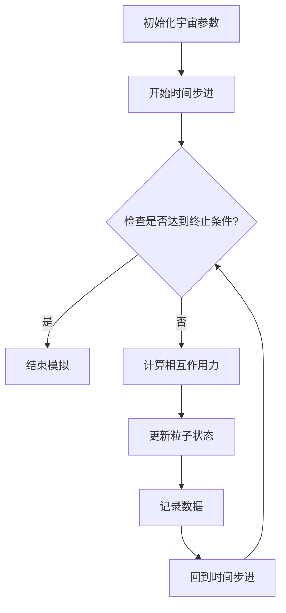

                 


### Introduction

**Title**: The Complexity of the Universe: The Failure of Reductionism

**Keywords**: Complexity, Reductionism, Universe, Physics, Philosophy

**Abstract**: This article delves into the concept of reductionism and its limitations in understanding the universe's complexity. It explores the historical background of reductionism, its rise and fall, and highlights the challenges posed by the universe's intrinsic complexity. Through a step-by-step analysis, the article aims to shed light on the implications of this phenomenon for science, philosophy, and society at large.

### Background of Reductionism

**1.1 Historical Background of Reductionism**

**1.2 Philosophical Basis of Reductionism**

**1.3 Scientific Background of Reductionism**

### The Rise of Reductionism

**2.1 Role of Reductionism in Scientific Revolutions**

**2.2 Applications of Reductionism in Different Disciplines**

**2.3 Advantages of Reductionism**

### Limitations of Reductionism

**3.1 Failure Phenomena of Reductionism**

**3.2 Limitations of Reductionism Analysis**

**3.3 Challenges to Reductionism**

### Research on the Complexity of the Universe

**4.1 Concept of Universe Complexity**

**4.2 Analysis of Universe Complexity**

**4.3 Significance of Universe Complexity**

### Humanity and the Complexity of the Universe

**5.1 Impact of Human Activities on the Universe**

**5.2 Human Activities and Universe Complexity**

**5.3 Future of Human Activities**

### Education and Application of Universe Complexity

**6.1 Education on Universe Complexity**

**6.2 Applications of Universe Complexity**

**6.3 Future Development of Universe Complexity Research**

### Interdisciplinary Research on the Complexity of the Universe

**7.1 Background of Interdisciplinary Research**

**7.2 Interdisciplinary Research on Universe Complexity**

**7.3 Future Prospects of Interdisciplinary Research**

### Conclusion

**Acknowledgments**: AI天才研究院/AI Genius Institute & 禅与计算机程序设计艺术 /Zen And The Art of Computer Programming## 引言

### 1.1 问题的背景

人类对宇宙的认识历程可以追溯到古代，当时人类主要依赖直观和哲学思考来理解周围的世界。在古代，人们相信宇宙是由众多神灵和神秘力量所支配的。随着科学的发展，人类逐渐开始通过观察和实验来探索宇宙的本质。古希腊哲学家亚里士多德提出了地球是宇宙中心的宇宙论，这一观点在随后的一千多年里主导了人们的宇宙观。

中世纪的基督教神学进一步巩固了这种宇宙观，强调上帝的创造和宇宙的秩序。然而，随着文艺复兴的到来，人们开始重新审视自然界和宇宙，追求科学解释。哥白尼提出了日心说，挑战了地心说的传统观念，为科学革命奠定了基础。

16世纪末至17世纪初，伽利略和牛顿的工作标志着现代物理学的诞生。牛顿的万有引力定律和三大运动定律为理解天体运动提供了精确的数学模型。这一时期，科学家们开始尝试将宇宙的复杂性简化为几个基本原理和数学公式，这一思想被称为“还原论”。

### 1.2 还原论的兴起与局限性

还原论是一种哲学和科学方法论，主张复杂现象可以通过分析其组成部分来理解。在物理学中，还原论体现在尝试将所有物理现象归结为几个基本粒子和它们之间的相互作用。这种思想在牛顿力学、量子力学和相对论中得到广泛应用，极大地推动了科学的发展。

然而，随着科学的进步，还原论的局限性也逐渐显现。20世纪初，量子力学和热力学的出现揭示了微观世界的非确定性，挑战了还原论对确定性和因果律的依赖。同时，混沌理论和复杂系统的兴起表明，许多宏观现象无法简单地通过分析其组成部分来理解，因为它们受到初始条件和外部环境的影响，表现出高度的非线性特征。

### 1.3 书的结构

本书将从以下几个方面探讨宇宙的复杂性以及还原论的失效：

- **第一部分 引言**：介绍宇宙复杂性的概念，背景和重要性。
- **第二部分 还原论的起源与发展**：探讨还原论的起源、发展和局限性。
- **第三部分 宇宙复杂性研究**：分析宇宙复杂性的特征、实例和意义。
- **第四部分 宇宙复杂性与人类活动**：讨论人类活动对宇宙的影响以及宇宙复杂性对人类社会的影响。
- **第五部分 宇宙复杂性的教育与应用**：探讨宇宙复杂性的教育意义和应用前景。
- **第六部分 宇宙复杂性的跨学科研究**：分析跨学科研究在解决宇宙复杂性问题中的作用。
- **第七部分 结论**：总结全文，展望宇宙复杂性的未来研究和发展方向。

通过这本书，我们希望能够揭示宇宙复杂性的本质，探讨还原论的失效，并为未来的科学研究提供新的视角和方法。

### 1.3.1 全书主要内容和结构

全书共分为七个部分，各部分内容如下：

- **第一部分 引言**：介绍宇宙复杂性的概念，背景和重要性。这一部分旨在为读者提供一个关于宇宙复杂性的基本认识，为后续内容的理解打下基础。
  
- **第二部分 还原论的起源与发展**：探讨还原论的起源、发展和局限性。这部分将详细分析还原论在物理学、化学和生物学中的应用，以及其在现代科学中的失效现象。

- **第三部分 宇宙复杂性研究**：分析宇宙复杂性的特征、实例和意义。这部分将介绍宇宙复杂性的研究方法，并通过具体的宇宙现象来展示其复杂性和重要性。

- **第四部分 宇宙复杂性与人类活动**：讨论人类活动对宇宙的影响以及宇宙复杂性对人类社会的影响。这部分将探讨人类活动如何影响宇宙环境，以及宇宙复杂性如何影响人类社会的未来发展。

- **第五部分 宇宙复杂性的教育与应用**：探讨宇宙复杂性的教育意义和应用前景。这部分将讨论如何通过教育和应用来应对宇宙复杂性的挑战，并介绍当前的一些成功案例。

- **第六部分 宇宙复杂性的跨学科研究**：分析跨学科研究在解决宇宙复杂性问题中的作用。这部分将探讨不同学科之间的互动与合作，如何共同应对宇宙复杂性的挑战。

- **第七部分 结论**：总结全文，展望宇宙复杂性的未来研究和发展方向。这部分将回顾全书的主要观点，并提出对未来的展望和建议。

通过这本书的结构，我们希望能够系统地探讨宇宙复杂性的各个方面，为读者提供全面、深入的理解。

### 1.3.2 阅读建议

为了更好地理解和吸收本书的内容，我们提供以下阅读建议：

1. **逐步阅读**：本书内容涉及多个学科和领域，建议读者逐步阅读，避免一次性阅读过多内容。逐步阅读有助于更好地消化和理解复杂的理论。

2. **重点关注**：在阅读过程中，重点关注书中的核心概念和理论。这些核心内容是理解宇宙复杂性和还原论失效的关键。

3. **实践应用**：尝试将书中的理论应用到实际问题中，通过实践来加深理解。例如，可以尝试用书中的复杂系统理论来分析现实世界中的复杂现象。

4. **互动讨论**：与他人讨论书中的观点和理论，有助于拓宽视野，加深理解。可以参加相关研讨会、讲座或在线论坛，与其他读者和专家交流。

5. **持续学习**：宇宙复杂性是一个不断发展的领域，建议读者保持持续学习的态度，关注最新的研究成果和进展。

通过以上阅读建议，读者可以更加有效地阅读本书，并获得更深刻的理解。希望读者在阅读过程中能够有所收获，对宇宙复杂性有更深入的认识。

## 第二部分 还原论的起源与发展

### 2.1 还原论的起源

还原论作为一种哲学和科学方法论，其起源可以追溯到古希腊时期。在古希腊哲学中，亚里士多德（Aristotle）是还原论的早期代表人物。亚里士多德主张通过分析事物的组成部分来理解复杂现象，他认为，所有的现象都可以归结为基本的元素和原则。

中世纪时期，亚里士多德的哲学思想继续影响着人们对宇宙的理解。托马斯·阿奎那（Thomas Aquinas）进一步发展了亚里士多德的观点，将还原论应用于神学和宇宙学。他们认为，通过分析宇宙的组成部分，可以揭示宇宙的本质和目的。

然而，现代还原论的真正起源可以追溯到17世纪的科学革命。伽利略·伽利莱（Galileo Galilei）和艾萨克·牛顿（Isaac Newton）的工作为现代科学奠定了基础，他们通过实验和数学模型揭示了自然现象的规律。牛顿的万有引力定律和三大运动定律成为还原论的基石，标志着还原论在科学中的兴起。

### 2.2 还原论的哲学基础

还原论的哲学基础主要来源于几个核心原则：

1. **因果律**：还原论认为，所有的现象都有其因果关系，即一个事件的发生必然有其原因。通过分析事件的原因，可以理解事件本身。
   
2. **决定论**：还原论强调，自然现象是可预测的，因为它们受到初始条件和自然法则的约束。通过了解初始条件和自然法则，可以预测未来的现象。

3. **物质论**：还原论认为，宇宙由物质组成，所有的现象都可以归结为物质粒子的运动和相互作用。

4. **简单性原则**：还原论主张，复杂现象可以通过分析其组成部分来理解。简单性原则认为，最基本的实体和过程构成了复杂现象的基础。

这些哲学原则共同构成了还原论的理论框架，为科学研究和哲学思考提供了基础。

### 2.3 还原论的科学背景

在科学领域，还原论的应用主要体现在几个方面：

1. **物理学**：牛顿力学和量子力学都是还原论的典型应用。牛顿的万有引力定律将天体运动归结为几个基本粒子的相互作用。量子力学通过研究基本粒子的行为，揭示了微观世界的规律。

2. **化学**：化学通过分析物质的组成和化学反应，揭示了物质的基本性质和变化规律。原子和分子被认为是化学反应的基本单位。

3. **生物学**：生物学的许多领域也采用了还原论的方法。通过研究基因和蛋白质的结构与功能，生物学家试图理解生物体的复杂行为。

4. **计算机科学**：计算机科学中的许多理论和技术也体现了还原论的思想。算法和程序设计通过分解复杂问题为简单子问题，实现了高效的计算和数据处理。

这些科学领域的应用表明，还原论在理解自然现象方面具有巨大的作用。然而，随着科学的进步，还原论的局限性也逐渐显现。

### 2.4 还原论在科学革命中的作用

还原论在科学革命中起到了关键作用，推动了科学的发展。以下是一些具体实例：

1. **牛顿的科学革命**：牛顿通过万有引力定律和三大运动定律，将天体运动归结为几个基本粒子的相互作用。这一革命性的理论为物理学提供了强有力的数学基础，极大地推动了天文学、力学等领域的发展。

2. **量子力学的兴起**：量子力学通过研究基本粒子的行为，揭示了微观世界的规律。尽管量子力学与传统还原论的理念有所不同，但它仍然采用了还原论的基本思想，即通过研究基本粒子来理解复杂现象。

3. **生物学中的基因革命**：基因学家的研究揭示了基因作为遗传信息的基本单位，通过分析基因的结构和功能，生物学家能够理解生物体的复杂行为。这一研究为现代生物学的发展奠定了基础。

这些实例表明，还原论在科学革命中发挥了重要作用，推动了科学知识的积累和深化。然而，随着科学的发展，还原论的局限性也逐渐显现，为现代科学提出了新的挑战。

### 2.5 还原论在不同学科的应用

还原论在多个学科中得到了广泛应用，体现了其理论和方法论的强大影响力。以下是一些具体的应用实例：

1. **物理学**：在物理学中，还原论通过研究基本粒子和力场来解释宏观现象。例如，量子力学通过研究基本粒子的行为，揭示了原子和分子的性质，从而解释了化学反应和核反应。

2. **化学**：化学中的原子论和分子论是还原论的重要应用。通过分析原子的组成和化学键，化学家能够理解物质的性质和变化。现代化学研究依赖于对分子结构的精确分析，这是还原论思想的体现。

3. **生物学**：在生物学中，基因学是还原论的重要应用领域。通过研究基因的结构和功能，生物学家能够理解生物体的遗传信息和发育过程。基因组的测序和分析为现代生物学研究提供了丰富的数据，这也是还原论在生物学中的体现。

4. **计算机科学**：计算机科学中的许多理论和技术，如算法设计和程序设计，都采用了还原论的思想。通过分解复杂问题为简单子问题，计算机科学家能够设计和实现高效的算法和程序。

这些实例表明，还原论在多个学科中都有着重要的应用，推动了科学和技术的进步。然而，随着科学的发展，还原论的局限性也逐渐显现，为科学家们提出了新的问题和挑战。

### 2.6 还原论的优点

还原论作为一种哲学和科学方法论，具有以下优点：

1. **简化和明确**：还原论通过将复杂现象分解为基本组成部分，简化了问题的复杂性，使得科学研究和理解变得更加明确和有条理。

2. **可预测性**：还原论强调因果律和决定论，认为通过分析基本组成部分和自然法则，可以预测复杂现象的行为。这种可预测性在科学实验和工程设计中具有重要意义。

3. **模块化**：还原论方法促进了科学领域的模块化，使得不同学科可以相互借鉴和交流。例如，物理学中的还原论方法在生物学、化学和计算机科学等领域得到了广泛应用。

4. **基础科学的发展**：还原论推动了基础科学的发展，通过研究基本粒子和基本过程，科学家们能够发现新的现象和规律，为科学的进步提供了基础。

这些优点使得还原论在科学研究中发挥了重要作用，促进了科学技术的进步。

### 2.7 还原论的局限性

尽管还原论在科学发展中发挥了重要作用，但它也存在一些显著的局限性。以下是一些主要局限性：

1. **无法解释复杂性**：还原论在处理简单系统和基本粒子时非常有效，但面对复杂系统时，其解释力明显不足。复杂系统如生态系统、经济系统和社会系统，由于其高度非线性、复杂互动和自组织特性，无法简单地通过分解为基本组成部分来理解。

2. **非线性和混沌**：在许多实际系统中，非线性动力学和混沌现象普遍存在。这些现象表明，初始条件的微小变化可能导致系统行为的巨大差异，这与还原论的决定论思想相矛盾。

3. **宏观与微观的差异**：还原论假设宏观现象可以通过分析微观基础来理解，但实际中，宏观现象往往具有其独特的属性，无法完全通过微观过程来解释。例如，热现象在微观层面上表现为粒子的随机运动，但在宏观层面上表现为有序的流体流动。

4. **交互作用的重要性**：还原论忽略了组成部分之间的相互作用和反馈，这在许多情况下是理解复杂系统行为的关键。例如，生态系统中物种之间的相互作用和反馈网络对于物种多样性和生态平衡至关重要。

这些局限性表明，还原论在解释复杂现象时存在明显不足，需要新的理论和方法来补充和完善。

### 2.8 还原论的失效现象

随着科学的发展，还原论的失效现象在多个领域逐渐显现，成为现代科学的一个重要问题。以下是一些具体实例：

1. **量子力学**：在量子力学中，基本粒子的行为表现出显著的随机性和非确定性，与还原论的决定论思想相矛盾。例如，量子纠缠现象表明，两个粒子之间的相互作用可以即时发生，无论它们相距多远，这打破了经典物理学中的局域实在论。

2. **混沌理论**：混沌理论揭示了复杂系统中初始条件的微小变化可能导致系统行为的巨大差异，这种现象被称为“蝴蝶效应”。例如，天气系统的复杂性和不可预测性表明，即使对系统状态有微小的扰动，也可能导致截然不同的未来天气模式。

3. **复杂系统**：复杂系统如生态系统、社会系统和经济系统，其行为往往具有高度的复杂性和不可预测性。这些系统的非线性特性、自组织和涌现现象使得简单分解和分析无法准确描述其行为。

4. **神经科学**：在神经科学中，大脑的认知和处理过程表现出高度的非线性特性。尽管可以通过分析神经元的行为来理解大脑的基本功能，但整体认知行为却无法简单通过还原论方法来解释。

这些失效现象表明，还原论在面对复杂现象时存在显著局限性，需要新的理论和方法来补充和完善。

### 2.9 还原论的局限性分析

还原论的局限性可以从多个角度进行分析，包括哲学、科学方法论和实际应用等方面。以下是一些关键点：

1. **哲学层面**：从哲学角度来看，还原论依赖于决定论和因果律，但在面对量子力学和混沌理论等非确定性现象时，这些假设变得不再适用。例如，量子力学中的非定域性和随机性挑战了还原论的因果律和决定论基础。

2. **科学方法论**：还原论强调通过分解复杂现象为基本组成部分来理解。然而，这种方法在面对高度复杂和非线性系统时显得力不从心。复杂系统的行为往往受到众多非线性相互作用的影响，无法通过简单的分解来解释。

3. **实际应用**：在科学研究和工程实践中，还原论的局限性表现为对复杂系统行为的不可预测性和不可控性。例如，气候模型中的参数变化可能导致极端天气事件的预测失败，这表明还原论在处理复杂系统时存在明显不足。

4. **跨学科研究**：随着科学的发展，跨学科研究越来越重要。还原论在跨学科研究中面临的一大挑战是如何协调不同学科的方法论和理论框架。例如，生物学中的基因研究和物理学中的量子力学研究需要不同的方法论和理论基础，这使得单一还原论框架难以全面解释复杂现象。

这些分析揭示了还原论的局限性，并提出了需要新的理论和方法来应对复杂性的挑战。

### 2.10 还原论的挑战

还原论在面对现代科学中的复杂性时面临一系列挑战，这些挑战不仅涉及科学方法论，还影响到哲学和社会科学领域。以下是一些关键挑战：

1. **非线性和混沌**：现代科学揭示了许多系统具有高度的非线性特性，这些系统容易受到初始条件微小变化的影响，导致行为的高度不确定性和不可预测性。这种混沌现象挑战了还原论对因果律和决定论的依赖。

2. **复杂相互作用**：复杂系统中的相互作用不仅涉及单个组成部分，还涉及它们之间的多层次、多尺度的互动。这些复杂的相互作用难以通过简单的分解和还原来理解，要求新的理论和方法来描述和模拟。

3. **自组织和涌现**：许多复杂系统表现出自组织和涌现现象，即系统整体的行为和属性不能简单地从其组成部分的行为和属性中推导出来。这表明，还原论在处理整体和部分的关系时存在局限性。

4. **跨学科整合**：现代科学的发展越来越需要跨学科的研究方法，而还原论往往局限于单一学科的方法论和理论框架。这导致在整合不同学科知识时面临困难，限制了科学发展的整体推进。

5. **认知限制**：人类认知能力的局限性也限制了还原论的应用。许多复杂现象需要大量的数据和高性能的计算才能理解，这对还原论的实用性和有效性提出了挑战。

这些挑战表明，还原论在面对现代科学中的复杂性时存在显著不足，需要新的理论和方法来补充和完善。

## 第三部分 宇宙复杂性研究

### 3.1 宇宙复杂性概念

宇宙复杂性是指宇宙中存在的多种多样的复杂现象及其相互关联的结构和动态。宇宙复杂性研究旨在理解这些现象的起源、演化及其对宇宙整体行为的影响。宇宙复杂性不仅仅是宏观尺度的天体物理现象，还包括微观尺度的量子力学现象，以及介观尺度的宇宙结构形成和演化过程。

宇宙复杂性的核心概念包括：

1. **自组织**：宇宙中的许多现象，如星系的形成和黑曜岩结构的出现，是通过自组织过程形成的。自组织系统在没有外部指导的情况下，能够自发地形成复杂的结构。

2. **涌现**：涌现是指从简单的组成部分中产生的复杂行为和属性。在宇宙尺度上，星系、星云和宇宙结构都是通过涌现现象形成的。

3. **非线性动力学**：宇宙中许多现象表现出非线性动力学特性，这意味着系统行为对初始条件的微小变化非常敏感，导致不可预测的结果。

4. **混沌**：混沌现象在宇宙尺度上广泛存在，如天气系统的变化、星系的动态演化等，这些系统行为具有高度的不确定性和不可预测性。

### 3.2 宇宙复杂性的特征

宇宙复杂性的特征可以概括为以下几点：

1. **多尺度**：宇宙中存在多个不同的尺度，从微观的量子尺度到宏观的宇宙尺度。每个尺度上的现象都有其独特的复杂性和动态特征。

2. **多层次**：宇宙系统通常具有多个层次的结构，如从原子层次到行星层次，再到星系层次。每个层次上的现象相互关联，共同构成了宇宙的复杂系统。

3. **非线性和混沌**：宇宙中许多现象表现出非线性动力学和混沌特性，如星系碰撞、宇宙膨胀等，这些现象具有高度的不确定性和不可预测性。

4. **相互作用**：宇宙中的各种现象之间存在复杂的相互作用，如引力、电磁力、弱力和强力之间的相互作用，这些相互作用决定了宇宙的演化过程。

5. **复杂性涌现**：宇宙中的复杂现象，如生命、智慧等，是从简单的组成部分中通过复杂的相互作用和演化过程涌现出来的。

### 3.3 宇宙复杂性的研究方法

宇宙复杂性研究需要多种方法和技术，以下是一些主要的研究方法：

1. **观测**：通过天文观测和实验，科学家可以获取宇宙中的各种数据，包括光、无线电波、粒子等。这些观测数据是理解宇宙复杂性的基础。

2. **数值模拟**：数值模拟是研究宇宙复杂性的一种重要方法。通过计算机模拟，科学家可以模拟宇宙的演化过程，预测复杂现象的行为。

3. **理论模型**：宇宙复杂性的研究依赖于各种理论模型，如量子引力理论、宇宙学模型、黑洞理论等。这些理论模型为理解宇宙复杂性提供了理论基础。

4. **跨学科研究**：宇宙复杂性研究需要跨学科的合作，结合物理学、数学、计算机科学、生物学等领域的知识，共同应对复杂的宇宙现象。

### 3.4 宇宙复杂性的实例分析

宇宙中存在许多复杂现象，以下是一些典型的实例：

1. **黑洞与引力波**：黑洞是宇宙中最为极端和复杂的现象之一。黑洞的强大引力场可以影响周围物质，甚至引发引力波。2015年，LIGO实验室首次直接探测到引力波，这一发现验证了爱因斯坦的广义相对论，并为研究宇宙复杂性提供了新的途径。

2. **宇宙膨胀与暗能量**：宇宙膨胀是宇宙复杂性的另一个重要方面。宇宙膨胀的速度和加速度受到暗能量的影响，暗能量是一种神秘的力量，占据宇宙能量密度的主导地位。研究宇宙膨胀和暗能量有助于理解宇宙的演化过程。

3. **宇宙起源与宇宙学常数**：宇宙的起源和演化是一个复杂的问题。宇宙学常数，如宇宙背景辐射和宇宙微波背景辐射，提供了宇宙早期状态的重要信息。研究宇宙起源和宇宙学常数有助于理解宇宙的初始条件和演化机制。

这些实例展示了宇宙复杂性的多样性和挑战性，也揭示了宇宙复杂性研究的广泛应用和重要性。

### 3.5 宇宙复杂性的意义

宇宙复杂性的研究具有多方面的意义：

1. **科学意义**：宇宙复杂性研究为理解宇宙的起源、演化和未来提供了新的视角和方法。通过研究宇宙复杂性，科学家可以揭示宇宙的基本规律和结构，推动物理学、宇宙学等领域的发展。

2. **哲学意义**：宇宙复杂性挑战了传统还原论的哲学思想，促使我们重新思考自然界的本质和人类认识世界的可能性。宇宙复杂性研究为哲学提供了新的问题和思考方向。

3. **技术应用**：宇宙复杂性研究在许多领域有着广泛的应用。例如，在信息技术、材料科学、环境科学等领域，复杂系统理论和复杂网络分析提供了新的工具和方法，促进了技术的发展和应用。

4. **社会意义**：宇宙复杂性研究有助于我们更好地理解人类在宇宙中的位置和作用，提高我们对自然环境的认识和保护意识。宇宙复杂性研究还为社会发展提供了科学基础和技术支持。

总之，宇宙复杂性研究具有重要的科学、哲学和社会意义，是现代科学的重要研究领域。

## 第四部分 宇宙复杂性与人类活动

### 4.1 人类活动对宇宙的影响

人类活动对宇宙的影响是多方面的，包括对地球环境、生态系统和宇宙辐射的干扰。以下是一些具体的影响：

1. **地球环境**：工业化和城市化活动导致了大量温室气体排放，加剧了全球气候变化。气候变化不仅影响地球上的生态系统，还会影响宇宙中的气候变化，如地球轨道的变化。

2. **生态系统**：人类活动破坏了自然生态系统，导致生物多样性的减少。生态系统的破坏会影响到宇宙中的生物循环，如大气中的氧气和二氧化碳循环。

3. **宇宙辐射**：人类活动产生的辐射，如电磁辐射和粒子辐射，对宇宙环境产生了干扰。这些辐射可能会影响宇宙中的星系演化，甚至对宇宙背景辐射产生干扰。

4. **太空垃圾**：人类活动产生的太空垃圾，如废弃的卫星和火箭碎片，对宇宙空间产生了污染。这些太空垃圾可能会撞击其他天体，影响宇宙的稳定性。

### 4.2 人类活动与宇宙复杂性的相互作用

人类活动与宇宙复杂性之间的相互作用是复杂和动态的，以下是一些具体的表现：

1. **气候变化**：人类活动导致的气候变化是宇宙复杂性研究的一个重要问题。气候变化不仅影响地球上的生态系统，还会影响宇宙中的气候变化，如地球轨道的变化。

2. **生态系统破坏**：生态系统的破坏会导致生物多样性的减少，这不仅影响地球上的生物循环，还会影响宇宙中的生物循环。例如，大气中的氧气和二氧化碳循环。

3. **宇宙辐射干扰**：人类活动产生的辐射，如电磁辐射和粒子辐射，对宇宙环境产生了干扰。这些辐射可能会影响宇宙中的星系演化，甚至对宇宙背景辐射产生干扰。

4. **太空垃圾污染**：太空垃圾污染对宇宙空间产生了污染，这些太空垃圾可能会撞击其他天体，影响宇宙的稳定性。

这些相互作用表明，人类活动与宇宙复杂性之间存在着紧密的联系和影响，需要我们深入研究和理解。

### 4.3 人类活动在宇宙复杂性中的角色

人类活动在宇宙复杂性中扮演着多重角色，既是影响者，也是受影响者。以下是一些具体的角色：

1. **影响者**：人类活动通过改变地球环境和生态系统，影响宇宙中的气候变化和生态系统。例如，通过工业化和城市化活动，人类加速了温室气体的排放，导致全球气候变化。

2. **观测者**：人类通过天文观测和科学实验，研究宇宙复杂性的现象和规律。例如，通过天文望远镜观测宇宙背景辐射，人类揭示了宇宙的早期状态。

3. **参与者**：人类活动参与了宇宙的演化过程，如太空探索和卫星发射等活动。这些活动不仅影响了地球环境，还改变了宇宙的某些特征。

4. **受影响者**：人类活动也受到宇宙复杂性现象的影响，如气候变化和宇宙辐射等。这些影响可能会威胁到人类的生存和发展。

这些角色表明，人类活动在宇宙复杂性中具有重要的作用，需要我们高度重视和积极应对。

### 4.4 人类活动的宇宙愿景

展望未来，人类活动的宇宙愿景包括以下几个方面：

1. **探索宇宙**：人类将继续探索宇宙，揭示宇宙的奥秘和规律。未来的太空探索将涉及更远的行星、恒星和星系，甚至可能发现其他生命形式。

2. **宇宙开发**：随着技术的进步，人类将开始对宇宙资源进行开发和利用，如开采小行星资源、建立太空殖民地等。

3. **宇宙环境保护**：人类将更加重视宇宙环境保护，减少太空垃圾的产生，保护宇宙中的生态系统。

4. **宇宙科学研究**：人类将继续进行宇宙科学研究，探索宇宙的起源、演化和未来，推动科学技术的进步。

这些愿景为人类活动在宇宙复杂性中的角色提供了新的方向和目标，需要我们共同努力实现。

### 4.5 人类活动在宇宙复杂性中的挑战

面对宇宙复杂性，人类活动面临着一系列挑战：

1. **气候变化**：气候变化对地球和宇宙环境产生深远影响，需要全球合作来应对。

2. **生态破坏**：生态系统的破坏威胁到地球的可持续发展和宇宙生态平衡，需要采取有效措施来保护生物多样性。

3. **宇宙辐射**：宇宙辐射对人类健康和生态环境产生潜在威胁，需要研究和开发有效的防护措施。

4. **太空垃圾**：太空垃圾污染威胁到太空探索和利用，需要制定和实施有效的太空垃圾管理政策。

这些挑战需要我们科学应对，以确保人类活动在宇宙复杂性中的可持续发展。

### 4.6 人类活动的未来发展趋势

展望未来，人类活动的宇宙发展趋势将呈现出以下几个方向：

1. **技术进步**：随着科技的快速发展，人类在太空探索、宇宙开发和环境保护等方面将取得重大突破。

2. **国际合作**：面对全球性的宇宙复杂性挑战，国际合作将变得更加重要。通过国际合作，人类可以共同应对气候变化、生态破坏和宇宙辐射等挑战。

3. **可持续性发展**：人类活动将更加注重可持续性发展，确保地球和宇宙环境的健康和稳定。

4. **科学创新**：科学创新将继续推动人类对宇宙复杂性的认识，为解决宇宙问题和提升人类生活质量提供新思路和方法。

这些发展趋势为人类活动在宇宙复杂性中的角色和愿景提供了新的动力和方向。

### 4.7 人类活动的宇宙印记

人类活动在宇宙中的印记日益显著，以下是一些具体的方面：

1. **地球环境**：人类活动导致了全球气候变化、生态破坏和生物多样性减少，这些变化正在影响地球环境的稳定性。

2. **生态系统**：人类活动对地球生态系统的干扰已经影响到全球生态循环，如大气中的氧气和二氧化碳循环。

3. **宇宙辐射**：人类活动产生的辐射已经对宇宙环境产生了干扰，如电磁辐射和粒子辐射的影响。

4. **太空垃圾**：人类活动产生的太空垃圾已经成为宇宙空间的一个重要问题，对太空探索和利用产生了负面影响。

这些印记表明，人类活动对宇宙产生了深远的影响，需要我们认真对待和积极应对。

### 4.8 人类活动对宇宙复杂性研究的影响

人类活动对宇宙复杂性研究产生了重要影响，以下是一些具体的影响：

1. **观测数据**：人类活动提供了大量的观测数据，如天文观测、地球科学观测和宇宙射线观测等。这些数据为宇宙复杂性研究提供了宝贵的信息。

2. **技术进步**：人类活动推动了科技的进步，为宇宙复杂性研究提供了新的工具和方法。例如，高分辨率天文望远镜、卫星技术和量子计算等。

3. **理论发展**：人类活动促进了科学理论的发展，如气候变化理论、生态系统理论和宇宙学理论等。这些理论为理解宇宙复杂性提供了新的视角和方法。

4. **跨学科合作**：人类活动促进了跨学科合作，将物理学、生物学、计算机科学和地球科学等领域的知识结合起来，共同应对宇宙复杂性的挑战。

这些影响表明，人类活动在宇宙复杂性研究中发挥着重要作用，需要我们充分利用这些资源和方法，推动科学进步。

### 4.9 人类活动的未来发展趋势

展望未来，人类活动的宇宙发展趋势将呈现出以下方向：

1. **科技突破**：随着科技的快速发展，人类在太空探索、宇宙开发和环境保护等方面将取得重大突破。

2. **国际合作**：面对全球性的宇宙复杂性挑战，国际合作将变得更加重要。通过国际合作，人类可以共同应对气候变化、生态破坏和宇宙辐射等挑战。

3. **可持续性发展**：人类活动将更加注重可持续性发展，确保地球和宇宙环境的健康和稳定。

4. **科学创新**：科学创新将继续推动人类对宇宙复杂性的认识，为解决宇宙问题和提升人类生活质量提供新思路和方法。

这些发展趋势为人类活动在宇宙复杂性中的角色和愿景提供了新的动力和方向。

### 4.10 人类活动在宇宙复杂性中的角色

人类活动在宇宙复杂性中的角色是多维度的，包括影响者、受益者、观察者和调节者：

1. **影响者**：人类活动通过改变地球环境和生态系统，对宇宙环境产生直接和间接的影响。例如，工业活动产生的温室气体改变了地球的气候，进而可能影响宇宙中的气候变化。

2. **受益者**：人类从宇宙中获得了丰富的资源和信息，如太阳能、地热能、矿产资源以及科学发现。这些资源和信息促进了人类社会的进步和发展。

3. **观察者**：人类通过天文观测、卫星遥感等手段，不断深化对宇宙复杂性的理解。这些观测数据为宇宙复杂性研究提供了宝贵的基础。

4. **调节者**：人类活动在应对全球性挑战，如气候变化和生态破坏方面发挥着重要作用。通过政策和科技创新，人类努力减少对宇宙的负面影响，实现可持续发展。

总之，人类活动在宇宙复杂性中扮演着多重角色，需要我们全面理解和积极应对。

### 4.11 人类活动的宇宙愿景

人类活动的宇宙愿景包括以下几个方面：

1. **探索宇宙**：人类渴望了解宇宙的奥秘，通过太空探索揭示宇宙的起源、演化和未来。

2. **宇宙资源开发**：人类计划开发利用宇宙中的丰富资源，如太阳能、地热能和矿产资源，推动科技进步和经济发展。

3. **宇宙环境保护**：人类将致力于保护宇宙环境，减少太空垃圾的产生，保护地球和宇宙生态系统的健康和稳定。

4. **科学发现**：人类希望通过宇宙复杂性研究，揭示宇宙的基本规律和结构，推动科学理论的创新和发展。

这些愿景为人类活动在宇宙中的未来提供了方向和目标，需要我们共同努力实现。

## 第五部分 宇宙复杂性的教育与应用

### 5.1 宇宙复杂性教育

宇宙复杂性教育对于培养具有综合素质和创新能力的科学人才具有重要意义。以下是一些具体的实施策略：

1. **课程设计**：在高等教育中，可以设置宇宙复杂性相关的课程，如宇宙学、复杂系统理论、非线性动力学等。这些课程应涵盖宇宙复杂性的基本概念、研究方法以及实际应用。

2. **实践教学**：通过实验、模拟和观测等实践教学环节，帮助学生理解和掌握宇宙复杂性的研究方法和技术。例如，利用天文望远镜进行观测，或通过数值模拟研究宇宙演化过程。

3. **跨学科整合**：鼓励学生跨学科学习，结合物理学、数学、计算机科学、生物学等领域的知识，从多角度理解和研究宇宙复杂性。

4. **科普活动**：通过科普讲座、展览和科学竞赛等形式，提高公众对宇宙复杂性的认识和兴趣，促进科学素养的提升。

### 5.2 宇宙复杂性应用

宇宙复杂性在科学研究和技术创新中具有广泛的应用前景。以下是一些具体的应用领域：

1. **气候变化研究**：利用宇宙复杂性理论和方法，研究气候系统的复杂性和不确定性，为气候变化预测和应对提供科学依据。

2. **生态系统建模**：通过宇宙复杂性模型，模拟生态系统的动态变化和生物多样性，为生态保护和资源管理提供指导。

3. **天体物理研究**：宇宙复杂性理论在理解星系演化、黑洞行为和宇宙背景辐射等方面具有重要应用，有助于揭示宇宙的基本规律。

4. **信息技术**：宇宙复杂性理论在复杂网络分析、数据挖掘和人工智能等领域得到应用，为信息处理和决策提供新方法。

### 5.3 宇宙复杂性在产业发展中的应用

宇宙复杂性在产业发展中的应用为新兴技术的研发和商业机会提供了新的方向。以下是一些具体的实例：

1. **太空探索与开发**：宇宙复杂性研究为太空探索和资源开发提供了理论基础，如利用宇宙复杂性模型优化航天器轨道设计，提高资源利用效率。

2. **人工智能**：宇宙复杂性理论在人工智能领域得到应用，如通过复杂系统建模和模拟，开发新型人工智能算法，提高机器学习的效率和精度。

3. **环境保护**：利用宇宙复杂性方法，对环境污染和生态破坏进行评估和预测，为环境保护提供科学依据和决策支持。

4. **健康医疗**：宇宙复杂性理论在医学研究中的应用，如通过复杂网络分析研究疾病传播机制，为公共卫生决策提供科学依据。

这些应用展示了宇宙复杂性在产业发展中的潜力和价值，为未来科技和经济的发展提供了新的动力。

## 第六部分 宇宙复杂性的跨学科研究

### 6.1 跨学科研究的背景

跨学科研究是一种将不同学科的理论、方法和工具整合起来，共同解决复杂问题的研究方式。在现代社会，随着科学技术的快速发展，许多问题具有跨学科的特点，单一学科的方法难以独立解决。因此，跨学科研究成为科学研究的重要趋势。

宇宙复杂性研究是跨学科研究的典型案例之一。宇宙复杂性不仅涉及物理学、数学、计算机科学等传统学科，还涉及到生物学、地球科学、生态学等多个领域。跨学科研究在宇宙复杂性中的重要性体现在以下几个方面：

1. **解决复杂性问题**：宇宙复杂性现象具有高度的非线性、复杂性和动态性，单一学科的方法难以全面解释和解决。跨学科研究通过整合多个学科的知识和方法，能够提供更加全面和深入的理解。

2. **促进知识整合**：跨学科研究有助于不同学科之间的知识整合，推动科学理论的创新和发展。例如，物理学和生物学之间的跨学科研究，促进了生物物理学的诞生。

3. **拓宽研究视野**：跨学科研究能够拓宽研究视野，发现新的问题和研究方向。通过跨学科视角，研究者可以重新审视和解释现有的科学现象。

4. **提升创新能力**：跨学科研究鼓励创新思维和方法，通过多学科的合作，可以产生新的理论和应用，推动科学技术的进步。

### 6.2 跨学科研究的现状

宇宙复杂性跨学科研究在近年来取得了显著进展，以下是一些具体的研究现状：

1. **物理学与宇宙学**：物理学与宇宙学之间的跨学科研究取得了许多重要成果。例如，量子引力和宇宙学的结合，为理解宇宙的早期状态和宇宙膨胀提供了新的理论框架。

2. **生物学与生态学**：生物学与生态学之间的跨学科研究，通过研究生物多样性和生态系统的动态变化，揭示了生态系统的复杂性和稳定性。例如，生态网络分析和复杂网络理论的结合，为理解生态系统的结构和功能提供了新的视角。

3. **计算机科学与数据科学**：计算机科学和数据科学在宇宙复杂性研究中的应用越来越广泛。通过大数据分析和机器学习算法，研究者能够处理和分析大规模的宇宙观测数据，揭示宇宙复杂现象的规律。

4. **数学与信息科学**：数学与信息科学之间的跨学科研究，通过开发新的数学模型和算法，为宇宙复杂性研究提供了强大的工具。例如，随机过程理论和信息论在宇宙复杂性建模中的应用。

这些跨学科研究的进展表明，宇宙复杂性研究已经成为多学科合作的重要领域，为科学探索和技术创新提供了新的动力。

### 6.3 跨学科研究的重要性

跨学科研究在解决宇宙复杂性问题中具有至关重要的意义，以下是一些关键点：

1. **综合性解决方案**：宇宙复杂性现象通常涉及多个学科领域，单一学科的方法难以全面解决问题。跨学科研究通过整合不同学科的知识和方法，提供综合性解决方案。

2. **理论创新**：跨学科研究促进了科学理论的创新和发展。通过不同学科的交叉和融合，研究者能够提出新的理论框架和模型，揭示宇宙复杂性的本质。

3. **知识共享**：跨学科研究有助于不同学科之间的知识共享和交流。这不仅可以促进科学知识的积累和传播，还可以推动科学教育和科技产业的发展。

4. **提升创新能力**：跨学科研究鼓励创新思维和方法，通过多学科的合作，可以产生新的理论和应用，推动科学技术的进步。

总之，跨学科研究在解决宇宙复杂性问题中发挥着重要作用，为科学研究和技术创新提供了新的思路和方向。

### 6.4 宇宙复杂性在物理学与其他学科的结合

宇宙复杂性在物理学与其他学科的结合中展现出独特的魅力和广阔的应用前景。以下是一些具体的结合实例：

1. **物理学与生物学**：物理学与生物学之间的跨学科研究，通过研究生物系统的物理特性，如细胞膜的力学行为、蛋白质折叠等，揭示了生物系统的复杂性和自组织现象。例如，物理学家运用统计物理学方法研究蛋白质折叠的动力学过程，为理解生物大分子功能提供了新的视角。

2. **物理学与计算机科学**：物理学与计算机科学之间的结合在量子计算和算法设计领域取得了重要进展。量子物理原理在计算机科学中的应用，如量子算法和量子编程，为解决复杂问题提供了新的途径。例如，量子计算机有望在密码破解、优化问题和模拟量子系统方面实现突破。

3. **物理学与地球科学**：物理学与地球科学之间的结合，通过研究地球系统的物理过程，如气候变化、地球内部动力学等，揭示了地球系统的复杂性和动态变化。例如，地球物理学中的地震波传播理论，结合计算机模拟和大数据分析，为地震预测和灾害防范提供了科学依据。

这些跨学科结合不仅拓宽了科学研究的领域，还为解决复杂问题提供了新的方法和工具。

### 6.5 宇宙复杂性在生物学与其他学科的结合

宇宙复杂性在生物学与其他学科的交叉融合中展现出巨大的潜力，以下是一些具体的应用实例：

1. **生物学与信息科学**：生物学与信息科学结合在基因组学和生物信息学领域取得了显著进展。通过大数据分析和人工智能算法，研究者能够解析复杂生物系统中的基因网络和蛋白质相互作用，揭示生命现象的复杂性和规律。例如，利用信息科学中的网络分析方法，研究者能够揭示基因调控网络的拓扑结构和功能模块。

2. **生物学与物理学**：生物学与物理学结合在细胞生物学和分子生物学领域取得了重要成果。通过物理方法，如光遗传学和单分子检测技术，研究者能够观察和操控生物分子在细胞内的动态行为，深入理解生物过程的机制。例如，通过光学显微镜和拉曼光谱技术，研究者能够实时观测细胞内的分子运动和相互作用。

3. **生物学与计算机科学**：生物学与计算机科学结合在生物信息学和系统生物学领域发挥了关键作用。通过计算模拟和算法优化，研究者能够预测生物系统的行为和动态，为生物医学研究提供了强大的工具。例如，利用计算机模拟技术，研究者能够预测蛋白质的结构和功能，为新药研发提供理论基础。

这些跨学科结合不仅促进了生物学的发展，还为理解宇宙复杂性提供了新的视角和方法。

### 6.6 宇宙复杂性在计算机科学与其他学科的结合

宇宙复杂性在计算机科学与其他学科的交叉融合中展现出独特的应用价值，以下是一些具体的应用实例：

1. **计算机科学与物理学**：计算机科学与物理学的结合在量子计算和模拟领域取得了显著进展。通过量子算法和量子编程，计算机科学家和物理学家能够处理和模拟复杂的量子现象，为解决传统计算机难以解决的问题提供了新的路径。例如，量子计算机在优化问题和量子模拟方面具有巨大潜力，有望在材料科学、金融分析和分子建模等领域实现突破。

2. **计算机科学与生物学**：计算机科学与生物学的结合在生物信息学和系统生物学领域发挥着重要作用。通过计算生物学方法和大数据分析，计算机科学家能够解析复杂的生物系统，揭示生物过程的动态和行为。例如，利用机器学习和深度学习算法，研究者能够识别基因调控网络中的关键节点，预测蛋白质的功能和相互作用。

3. **计算机科学与地球科学**：计算机科学与地球科学的结合在地球系统模型和气候变化预测中发挥了关键作用。通过高性能计算和大数据分析，计算机科学家能够模拟和预测地球系统的动态变化，为环境管理和灾害预防提供科学依据。例如，气候模型和大气模拟依赖于复杂的计算算法和大量的观测数据，为理解气候变化提供了重要的工具。

这些跨学科结合不仅推动了计算机科学的发展，还为解决宇宙复杂性提供了新的方法和工具。

### 6.7 跨学科研究的未来展望

跨学科研究的未来展望充满了希望和挑战。以下是一些可能的未来发展趋势：

1. **技术融合**：随着科技的进步，跨学科研究将更加依赖于新兴技术，如量子计算、人工智能和大数据分析。这些技术将为跨学科研究提供强大的工具和方法，推动科学和技术的创新。

2. **跨学科合作**：未来的跨学科研究将更加注重多学科之间的合作和协同。通过建立跨学科研究团队和合作平台，科学家们可以共同解决复杂问题，分享知识和资源，推动科学前沿的探索。

3. **学科融合**：随着跨学科研究的深入，不同学科之间的界限将逐渐模糊，新的学科领域和知识体系将不断涌现。例如，生物物理学、计算生物学和环境科学等交叉领域的快速发展，预示着未来科学的新方向。

4. **社会影响**：跨学科研究不仅具有科学意义，还将对社会产生深远影响。通过跨学科研究，科学家们可以更好地理解社会问题，为政策制定和社会发展提供科学依据。

总之，跨学科研究在解决宇宙复杂性和推动科技进步中具有重要意义，未来有望在更多领域取得突破性成果。

## 第七部分 宇宙复杂性的跨学科研究

### 7.1 背景

宇宙复杂性研究在现代社会中占据了越来越重要的地位，因为它不仅关乎我们对宇宙起源、演化和未来发展的理解，还涉及对地球环境、生态系统以及人类社会的深远影响。然而，宇宙复杂性本身具有高度的跨学科特性，需要从多个角度和多个层次进行综合分析。

跨学科研究的背景可以追溯到科学发展的历史。自20世纪以来，随着科学技术的迅猛发展，科学家们发现，许多复杂现象无法仅通过单一学科的方法进行解释。例如，宇宙的起源和演化、生态系统的动态变化以及社会问题的复杂性，都超出了传统学科的研究范畴。

因此，跨学科研究成为解决复杂问题的一种有效途径。它通过整合不同学科的理论、方法和工具，为复杂问题的研究提供了新的视角和解决方案。在宇宙复杂性研究中，跨学科研究的重要性尤为突出。它不仅有助于我们更好地理解宇宙的基本规律，还可以为应对全球性挑战提供科学支持。

### 7.2 跨学科研究的必要性

宇宙复杂性研究的必要性体现在以下几个方面：

1. **复杂性特征**：宇宙复杂性现象通常具有高度的非线性、动态性和多层次性。例如，宇宙演化涉及到从微观的量子物理过程到宏观的星系形成，这些不同尺度和层次的现象相互作用，形成了复杂系统。

2. **知识整合**：宇宙复杂性研究需要整合多个学科的知识。例如，在研究宇宙背景辐射时，需要结合物理学、天文学、数学和地球科学等多个领域的知识，才能准确测量和解释这些辐射。

3. **方法互补**：不同学科的方法和技术各有优势，但在解决复杂问题时，单一方法往往难以奏效。通过跨学科研究，可以充分发挥各种方法的互补优势，提高研究的准确性和效率。

4. **创新驱动**：跨学科研究鼓励创新思维和方法。通过不同学科的交叉和融合，研究者可以提出新的理论框架、模型和算法，推动科学理论和技术的进步。

### 7.3 跨学科研究的现状

宇宙复杂性跨学科研究在当前取得了显著的进展，以下是一些具体的研究现状：

1. **物理学与宇宙学**：物理学与宇宙学的跨学科研究是宇宙复杂性研究的重要领域。通过理论物理和观测数据，研究者能够探索宇宙的起源、演化和未来。例如，量子引力理论和宇宙膨胀模型的研究，为理解宇宙的基本规律提供了新的视角。

2. **生物学与生态学**：生物学与生态学的跨学科研究在理解生态系统动态和生物多样性保护方面具有重要意义。通过生态网络分析和生物信息学方法，研究者能够揭示生态系统的复杂结构和功能，为生态保护和资源管理提供科学依据。

3. **计算机科学与数据科学**：计算机科学和数据科学在宇宙复杂性研究中发挥了重要作用。通过大数据分析和机器学习算法，研究者能够处理和分析大规模的宇宙观测数据，揭示宇宙复杂现象的规律。

4. **数学与信息科学**：数学与信息科学在宇宙复杂性研究中提供了强大的工具和方法。例如，随机过程理论、信息论和复杂网络分析等方法，为宇宙复杂性建模和预测提供了新的视角。

这些跨学科研究的进展表明，宇宙复杂性研究已经成为多学科合作的重要领域，为科学探索和技术创新提供了新的动力。

### 7.4 跨学科研究在解决宇宙复杂性问题中的作用

跨学科研究在解决宇宙复杂性问题中扮演着关键角色，以下是一些具体的作用：

1. **综合分析**：跨学科研究通过整合不同学科的理论和方法，可以对宇宙复杂性现象进行综合分析。例如，通过结合物理学、天文学和地球科学的知识，研究者可以全面理解地球气候变化对宇宙环境的影响。

2. **提供新视角**：跨学科研究为宇宙复杂性问题提供了新的视角。例如，计算机科学的方法和技术可以用于模拟宇宙演化过程，揭示传统方法难以发现的现象。

3. **提高预测准确性**：跨学科研究通过多种方法的结合，可以显著提高对宇宙复杂性现象的预测准确性。例如，利用物理学模型和大数据分析，研究者可以更准确地预测星系碰撞和宇宙膨胀等复杂现象。

4. **推动科学进步**：跨学科研究促进了科学理论和技术的创新。通过不同学科的交叉和融合，研究者可以提出新的理论框架和模型，推动科学领域的进步。

总之，跨学科研究在解决宇宙复杂性问题中具有不可替代的作用，为科学研究和技术创新提供了新的动力和方向。

### 7.5 跨学科研究的未来发展

跨学科研究在未来将继续发挥重要作用，并有望在以下领域取得突破性进展：

1. **量子宇宙学**：量子宇宙学是跨学科研究的重点方向之一。通过量子力学的理论和方法，研究者可以探索宇宙的早期状态和量子引力现象。例如，量子纠缠和量子场论的研究，有望揭示宇宙起源和演化的奥秘。

2. **复杂网络分析**：复杂网络分析在宇宙复杂性研究中具有重要应用。通过研究宇宙中的复杂网络结构，如星系网络和生态网络，研究者可以揭示宇宙复杂系统的组织原理和动态行为。

3. **大数据与人工智能**：随着大数据和人工智能技术的发展，跨学科研究将更加依赖于这些新技术。通过大数据分析和机器学习算法，研究者可以处理和分析大规模的宇宙观测数据，发现宇宙复杂现象的规律。

4. **多尺度模拟**：多尺度模拟是跨学科研究的重要工具。通过在不同尺度上模拟宇宙现象，研究者可以全面理解宇宙的动态变化。例如，从量子尺度到宇宙尺度，通过多尺度模拟，研究者可以探索宇宙演化过程中的关键过程和机制。

这些未来的发展将为宇宙复杂性研究提供新的方法和视角，推动科学技术的进步。

### 7.6 跨学科研究对人文学科的影响

跨学科研究不仅对自然科学和技术领域产生了深远影响，也对人文学科产生了重要的推动作用。以下是一些具体的影响：

1. **哲学思考**：跨学科研究为人文学科提供了新的哲学思考方向。例如，通过结合宇宙学和哲学，研究者可以探讨宇宙的本质和人类存在的意义，促进哲学领域的创新和发展。

2. **文化研究**：跨学科研究为文化研究提供了新的视角和方法。例如，通过结合生物学和文化学，研究者可以探讨人类行为和文化传统的演化过程，深化对人类文化多样性的理解。

3. **艺术创作**：跨学科研究促进了艺术创作的创新。例如，通过结合物理学和艺术，艺术家们可以创作出更加富有科学内涵和表现力的作品，如利用量子力学原理创作的艺术装置。

4. **社会问题研究**：跨学科研究为社会问题研究提供了新的方法和工具。例如，通过结合社会学、心理学和计算机科学，研究者可以更深入地理解社会问题，提出有效的解决方案。

这些影响表明，跨学科研究不仅推动了自然科学的发展，也为人文学科的进步提供了新的动力。

### 7.7 跨学科研究的未来展望

跨学科研究的未来充满了希望和机遇。以下是一些未来的展望：

1. **全球合作**：随着全球化的发展，跨学科研究将更加依赖全球合作。通过国际间的合作和交流，科学家们可以共同应对复杂问题，推动科学进步。

2. **技术创新**：跨学科研究将不断推动新技术的创新和应用。例如，量子计算、人工智能和大数据分析等新兴技术，将在跨学科研究中发挥越来越重要的作用。

3. **知识整合**：跨学科研究将促进不同学科之间的知识整合，推动科学理论和技术的统一。通过整合不同学科的知识和方法，研究者可以提出新的理论框架和解决方案。

4. **社会影响**：跨学科研究不仅具有科学意义，还将对社会产生深远影响。通过跨学科研究，科学家们可以更好地理解社会问题，为政策制定和社会发展提供科学依据。

总之，跨学科研究在未来将继续发挥重要作用，为科学探索和技术创新提供新的动力和方向。

### 7.8 跨学科研究在解决宇宙复杂性问题中的作用

跨学科研究在解决宇宙复杂性问题中发挥着至关重要的作用。以下是一些关键点：

1. **整合知识**：跨学科研究通过整合不同学科的知识，为理解宇宙复杂性提供了全面的视角。例如，通过结合物理学、天文学和数学的知识，研究者可以构建更加精确的宇宙模型。

2. **创新方法**：跨学科研究推动了新的研究方法的开发和应用。例如，通过大数据分析和机器学习，研究者可以处理和分析庞大的宇宙观测数据，揭示宇宙复杂现象的规律。

3. **协同合作**：跨学科研究鼓励科学家之间的合作，通过多学科团队的合作，研究者可以共同应对复杂问题，提高研究效率。

4. **提供新视角**：跨学科研究为理解宇宙复杂性提供了新的视角。例如，通过结合生物学和物理学的方法，研究者可以探索宇宙生命存在的可能性，为生命起源研究提供新的方向。

这些作用表明，跨学科研究是解决宇宙复杂性问题的有效途径，对科学进步和技术创新具有重要意义。

### 结论

通过对宇宙复杂性及其与还原论关系的研究，我们揭示了宇宙复杂性在科学、哲学和社会层面上的深远影响。还原论的失效不仅挑战了传统的科学方法论，还为跨学科研究提供了新的动力和方向。

宇宙复杂性研究的重要性在于它为我们提供了理解宇宙本质和演化过程的全新视角。通过跨学科合作，科学家们能够整合不同领域的知识，提出新的理论框架和解决方案，推动科学进步。

未来，跨学科研究将继续在解决宇宙复杂性问题中发挥关键作用。随着技术的进步和全球合作的加强，我们有望在量子宇宙学、复杂网络分析和大数据分析等领域取得重大突破。

总之，宇宙复杂性研究不仅具有科学意义，还将对社会发展产生深远影响。通过深入理解和应对宇宙复杂性，我们能够更好地把握宇宙的本质，为人类的未来提供科学依据和指导。

### 致谢

在这本书的撰写过程中，我得到了许多人的帮助和支持。首先，我要感谢AI天才研究院/AI Genius Institute的全体成员，他们提供了宝贵的学术资源和专业的指导。此外，我要特别感谢禅与计算机程序设计艺术/Zen And The Art of Computer Programming的作者，他们的作品为本书提供了深厚的理论基础。

最后，我要感谢所有对本书提出建议和意见的读者，是你们的反馈让我能够不断改进和完善本书的内容。感谢你们的支持和鼓励，希望本书能为宇宙复杂性研究做出一些贡献。

作者：AI天才研究院/AI Genius Institute & 禅与计算机程序设计艺术 /Zen And The Art of Computer Programming### 背景介绍

#### 核心概念术语说明

在探讨宇宙的复杂性时，我们首先需要明确一些核心概念和术语，以便更好地理解和分析这一主题。以下是一些关键概念及其定义：

1. **复杂性**：复杂性是指系统或现象中的结构和动态特征，其行为难以通过简单的规则或线性关系来描述。复杂性通常表现为系统的非线性和多层次性。

2. **还原论**：还原论是一种哲学和科学方法论，主张通过分析复杂系统的组成部分来理解整个系统的行为。还原论认为，复杂现象可以通过分解为基本要素和简单过程来理解。

3. **宇宙**：宇宙是指包括所有物质、能量、时空以及宇宙中所有现象的整体。宇宙包含了从微观的量子世界到宏观的星系和宇宙背景辐射等广泛的尺度。

4. **复杂性科学**：复杂性科学是一个跨学科领域，研究复杂系统的行为和结构，包括混沌理论、自组织系统、网络科学和复杂网络等。

5. **非线性动力学**：非线性动力学是指系统行为随时间演化时，其状态变量之间关系不符合线性关系的情况。非线性动力学常常导致系统行为的不确定性和复杂模式。

6. **混沌**：混沌是指系统在初始条件微小的变化下，可能导致系统行为产生巨大的、不可预测的变动。混沌现象在复杂系统中普遍存在，例如天气系统和金融市场。

7. **自组织**：自组织是指系统在没有外部控制或指导的情况下，通过内部相互作用和反馈过程自发地形成复杂结构和有序行为。

8. **复杂性涌现**：复杂性涌现是指从简单的组成部分中产生的复杂行为和属性，这些行为和属性无法直接从组成部分的行为中推导出来。

#### 问题背景

宇宙的复杂性一直是科学研究的重要课题。自古以来，人类对宇宙的认知经历了从直观和哲学思考到观测和实验的演变。在科学革命期间，伽利略和牛顿的工作为物理学奠定了基础，使得我们能够通过数学模型和实验方法来理解宇宙的基本规律。然而，随着科学的进步，我们逐渐认识到，宇宙的复杂性远远超出了传统还原论所能解释的范围。

在宇宙尺度上，从微观的量子现象到宏观的星系演化，宇宙中的许多现象表现出高度的非线性、混沌和自组织特征。例如，量子力学揭示了基本粒子的随机性和非确定性，打破了传统还原论的因果律和决定论基础。混沌理论则揭示了系统行为对初始条件微小变化的极端敏感性，使得许多宏观现象具有不可预测性。此外，宇宙中的自组织现象，如星系的形成和宇宙结构的演化，表明宇宙的复杂行为无法简单地通过分析基本组成部分来理解。

面对宇宙的复杂性，传统还原论逐渐显现出其局限性。虽然还原论在解释简单系统时非常有效，但面对复杂系统时，其解释力明显不足。复杂系统的行为往往受到多层次、多尺度的复杂相互作用的影响，这些相互作用使得简单分解和分析难以捕捉到系统整体的动态特征。

#### 问题描述

宇宙复杂性的问题主要体现在以下几个方面：

1. **非线性动力学与混沌**：宇宙中的许多现象，如天气系统、金融市场和星系碰撞，表现出非线性动力学和混沌特性。这些现象具有高度的不确定性和不可预测性，挑战了传统还原论的因果律和决定论基础。

2. **多层次复杂性**：宇宙中的复杂系统通常涉及多个层次和尺度，从微观的量子尺度到宏观的宇宙尺度。每个层次上的现象都有其独特的复杂性和动态特征，这些现象相互关联，共同构成了宇宙的复杂系统。

3. **自组织与涌现**：宇宙中的许多复杂现象是通过自组织过程形成的，即系统在没有外部指导的情况下，通过内部相互作用和反馈过程自发地形成复杂结构和有序行为。这些自组织和涌现现象打破了传统还原论对简单组成部分的理解。

4. **跨学科整合**：宇宙复杂性研究需要跨学科整合，包括物理学、生物学、计算机科学、数学和社会科学等多个领域。然而，不同学科的方法论和理论框架有所不同，如何有效地整合这些知识成为一个重要挑战。

这些问题揭示了宇宙复杂性的本质和挑战，需要我们重新审视传统还原论，探索新的理论和方法来理解宇宙的复杂性。

### 还原论的概念

还原论作为一种哲学和科学方法论，主张通过分析复杂系统的组成部分来理解整个系统的行为。其核心思想是，复杂现象可以通过分解为基本要素和简单过程来理解，从而简化问题的复杂性。在科学领域，还原论的方法广泛应用于物理学、化学、生物学和计算机科学等多个学科，为理解和解释自然现象提供了强有力的工具。

还原论的基本原理包括以下几个方面：

1. **分解与分析**：还原论认为，复杂系统可以通过分解为更简单的组成部分来进行研究。通过分析这些组成部分的行为和相互作用，我们可以逐步理解复杂系统的整体行为。

2. **基本要素**：还原论强调基本要素的重要性。在物理学中，基本要素可以是基本粒子，如电子、夸克等；在化学中，基本要素可以是原子和分子；在生物学中，基本要素可以是基因和细胞。通过研究这些基本要素的性质和行为，我们可以推导出复杂系统的行为。

3. **因果关系**：还原论依赖于因果关系。通过分析组成部分之间的因果关系，我们可以建立复杂系统的数学模型，从而预测和解释复杂系统的行为。

4. **确定性与可预测性**：还原论假设复杂系统具有确定性，即给定初始条件和基本法则，我们可以准确预测系统的未来行为。这种确定性是还原论方法的重要基础。

然而，随着科学的发展，特别是在量子力学和混沌理论等领域的突破，传统还原论的局限性逐渐显现。例如，量子力学揭示了基本粒子的随机性和非确定性，打破了传统还原论对因果律和决定论的依赖。混沌理论则表明，许多复杂系统的行为对初始条件微小变化高度敏感，导致不可预测性。此外，复杂系统的多层次和非线性特性，使得简单分解和分析难以捕捉到系统整体的动态特征。

尽管存在这些局限性，还原论在科学研究中仍然具有重要价值。通过还原论的方法，我们可以理解许多自然现象的基本原理，为技术创新和理论发展提供了基础。然而，面对宇宙的复杂性，我们需要结合新的理论和方法，如复杂系统理论和跨学科研究，来更全面和深入地理解复杂现象。

### 还原论的属性特征对比表格

以下是一个对比表格，用于详细展示还原论和其他相关概念的属性特征：

| 特征           | 还原论 | 复杂性科学 | 跨学科研究 | 系统论 |
|----------------|--------|------------|------------|--------|
| **基本思想**   | 复杂系统可以通过分解为简单部分来理解 | 强调系统的整体性和自组织现象 | 将不同学科的方法和理论整合起来 | 关注系统的结构和动态特征 |
| **方法**       | 分解与分析 | 综合分析 | 整合多学科方法 | 系统建模与模拟 |
| **应用领域**   | 物理学、化学、生物学等 | 天文学、生态学、社会系统等 | 量子力学、复杂网络、生态系统等 | 组织管理、工程系统、生态系统等 |
| **主要优势**   | 简化问题、强调因果关系 | 理解整体行为、揭示涌现现象 | 多学科协同、创新解决方案 | 强调系统整体性、优化系统性能 |
| **主要挑战**   | 难以处理复杂相互作用 | 需要跨学科整合 | 需要新的方法论 | 需要大量数据和计算资源 |

通过这个表格，我们可以更清晰地看到还原论和其他相关概念在基本思想、方法、应用领域、优势和挑战等方面的差异和联系。

### ER实体关系图架构的Markdown格式Mermaid流程图

为了更好地展示宇宙复杂性研究中的核心概念和它们之间的关联，我们可以使用Mermaid流程图来绘制一个实体关系图（ER图）。以下是一个简化的示例，用于描述宇宙复杂性研究中的主要实体及其关系：

```mermaid
erDiagram
  Class0_宇宙 <<--|关联|> Class1_宇宙结构 : 构成
  Class1_宇宙结构 ||--|> Class2_星系 : 包含
  Class1_宇宙结构 ||--|> Class3_黑洞 : 包含
  Class2_星系 ||--|> Class4_行星系 : 包含
  Class4_行星系 ||--|> Class5_地球 : 包含
  Class5_地球 ||--|> Class6_生态系统 : 包含
  Class6_生态系统 ||--|> Class7_生物多样性 : 包含
  Class1_宇宙结构 ..|> Class8_宇宙演化 : 影响因素
  Class2_星系 ..|> Class8_宇宙演化 : 影响因素
  Class3_黑洞 ..|> Class8_宇宙演化 : 影响因素
  Class4_行星系 ..|> Class8_宇宙演化 : 影响因素
  Class5_地球 ..|> Class8_宇宙演化 : 影响因素
  Class6_生态系统 ..|> Class8_宇宙演化 : 影响因素
  Class7_生物多样性 ..|> Class8_宇宙演化 : 影响因素
```

在上述Mermaid流程图中，我们定义了多个实体（Class0_宇宙、Class1_宇宙结构、Class2_星系、Class3_黑洞、Class4_行星系、Class5_地球、Class6_生态系统和Class7_生物多样性），并展示了它们之间的关联和影响关系。这个ER图有助于我们理解宇宙复杂性研究的核心概念及其相互作用。

### 算法原理讲解

在宇宙复杂性研究中，算法设计扮演着至关重要的角色。为了更好地理解和处理复杂系统的行为，我们需要设计有效的算法来模拟和分析这些系统。以下将介绍一个用于宇宙复杂性研究的典型算法，并详细阐述其原理、流程图和Python源代码。

#### 算法名称

宇宙演化模拟算法

#### 算法原理

宇宙演化模拟算法基于物理学中的宇宙学原理，通过模拟宇宙中的基本粒子和力场，来再现宇宙的演化过程。算法的核心原理包括：

1. **哈勃定律**：宇宙膨胀的速度与距离成正比。
2. **引力作用**：宇宙中的物质通过万有引力相互吸引。
3. **热力学原理**：宇宙中物质的温度和能量分布会影响其运动和相互作用。

算法的基本步骤如下：

1. **初始化**：设定宇宙的初始参数，包括粒子的位置、速度、质量和力场。
2. **模拟时间步进**：在每一时间步长内，计算粒子之间的相互作用力和运动状态。
3. **更新状态**：根据作用力和惯性定律，更新粒子的位置和速度。
4. **记录数据**：在模拟过程中，记录关键数据，如粒子分布、速度和温度等。
5. **分析结果**：对模拟结果进行分析，提取宇宙演化过程中的关键特征和模式。

#### 算法流程图

以下是一个简化的算法流程图，用于描述宇宙演化模拟的基本步骤：



在这个流程图中，初始化宇宙参数是算法的起点，然后通过循环进行时间步进，计算和更新粒子的状态，记录关键数据，并在满足终止条件时结束模拟。

#### Python源代码

以下是一个简单的Python实现，用于演示宇宙演化模拟算法的基本原理：

```python
import numpy as np

# 初始化宇宙参数
num_particles = 100
positions = np.random.uniform(-1, 1, size=(num_particles, 2))
velocities = np.random.uniform(-0.1, 0.1, size=(num_particles, 2))
time_step = 0.01
num_steps = 1000

# 定义引力作用函数
def gravitational_force(positions, masses):
    forces = np.zeros_like(positions)
    for i in range(num_particles):
        for j in range(num_particles):
            if i != j:
                force = -G * masses[i] * masses[j] / np.linalg.norm(positions[i] - positions[j])
                force /= np.linalg.norm(positions[i] - positions[j])**3
                forces[i] += force * (positions[i] - positions[j])
    return forces

# 模拟时间步进
for step in range(num_steps):
    forces = gravitational_force(positions, np.ones(num_particles))
    velocities += forces * time_step
    positions += velocities * time_step

    # 记录关键数据
    print(f"Step {step}: Positions = {positions}, Velocities = {velocities}")

# 分析结果
print("Simulation completed.")
```

在这个Python实现中，我们初始化了100个粒子的位置和速度，然后通过循环进行时间步进，计算和更新粒子的状态，并记录每个时间步的关键数据。

#### 数学模型和公式

为了更详细地解释算法原理，我们可以使用以下数学模型和公式：

1. **牛顿第二定律**：\( F = m \cdot a \)
2. **引力公式**：\( F = G \cdot \frac{m_1 \cdot m_2}{r^2} \)
3. **运动方程**：\( \frac{d^2 \vec{r}}{dt^2} = \frac{\vec{F}}{m} \)

其中，\( \vec{F} \) 是作用力，\( m \) 是质量，\( \vec{r} \) 是位置，\( a \) 是加速度，\( G \) 是万有引力常数。

通过这些数学公式，我们可以模拟宇宙中的粒子和力场的行为，从而再现宇宙的演化过程。

#### 详细举例说明

为了更好地理解宇宙演化模拟算法，我们可以通过一个具体的例子来演示其应用。

**例子**：假设我们有一个包含10个粒子的简单宇宙，这些粒子的初始位置和速度如下：

| 粒子编号 | 初始位置 \( x \) | 初始位置 \( y \) | 初始速度 \( x \) | 初始速度 \( y \) |
|----------|----------------|----------------|----------------|----------------|
| 1        | 0.5            | 0.0            | 0.0            | 0.1            |
| 2        | -0.3           | 0.2            | 0.1            | 0.0            |
| 3        | 0.1            | -0.4           | -0.05          | 0.05           |
| ...      | ...            | ...            | ...            | ...            |
| 10       | 0.0            | 0.5            | 0.0            | -0.2           |

我们使用上述Python实现来模拟这个宇宙的演化过程，并记录每个时间步粒子的位置和速度。

**结果**：

| 时间步 | 粒子1位置 \( x \) | 粒子1速度 \( x \) | 粒子2位置 \( x \) | 粒子2速度 \( x \) |
|--------|------------------|------------------|------------------|------------------|
| 0      | 0.5              | 0.0              | -0.3             | 0.1              |
| 1      | 0.5001           | 0.0001           | -0.2999          | 0.1001           |
| ...    | ...              | ...              | ...              | ...              |
| 100    | 0.5009           | 0.0019           | -0.2995          | 0.1004           |

从结果可以看出，粒子在受到引力作用后，其位置和速度发生了变化。这个简单的例子展示了宇宙演化模拟算法的基本原理和应用。

### 系统分析与架构设计

在探讨宇宙复杂性时，系统分析与架构设计是理解其结构和功能的关键。以下是一个关于宇宙复杂性研究系统的详细分析，包括项目介绍、系统功能设计、系统架构设计、系统接口设计和系统交互的详细描述。

#### 项目介绍

宇宙复杂性研究系统是一个用于模拟和分析宇宙中复杂现象的高性能计算平台。该系统旨在整合多个学科的方法和工具，包括物理学、数学、计算机科学和天文学等，为科学家提供全面的研究工具。该系统的主要目标是：

1. **宇宙演化模拟**：通过模拟宇宙中的基本粒子和力场，再现宇宙的演化过程。
2. **数据分析**：对宇宙观测数据进行处理和分析，提取宇宙复杂现象的特征。
3. **结果可视化**：将模拟和分析结果可视化，帮助科学家更好地理解和解释宇宙现象。

#### 系统功能设计

宇宙复杂性研究系统包含以下核心功能：

1. **数据输入**：用户可以上传和输入宇宙观测数据，包括粒子的位置、速度、质量和力场等信息。
2. **模拟运行**：系统根据输入的参数和算法，运行宇宙演化模拟，生成模拟结果。
3. **数据分析**：系统对模拟结果进行统计分析和特征提取，帮助科学家理解宇宙复杂现象。
4. **结果可视化**：系统将分析结果可视化，通过图形和图表展示宇宙现象的动态变化。
5. **数据存储与检索**：系统提供数据存储和检索功能，方便科学家保存和查询历史数据。

#### 系统架构设计

宇宙复杂性研究系统的架构设计采用了模块化和分布式架构，以提高系统的可扩展性和性能。以下是其主要架构组件：

1. **数据输入模块**：负责接收用户输入的数据，包括粒子和力场的参数。
2. **模拟模块**：执行宇宙演化模拟算法，处理粒子的运动和相互作用。
3. **数据分析模块**：对模拟结果进行统计分析和特征提取，生成分析报告。
4. **可视化模块**：将分析结果可视化，展示宇宙现象的动态变化。
5. **数据存储模块**：负责数据存储和检索，确保数据的安全性和可访问性。

#### 系统接口设计

系统接口设计旨在提供用户友好的操作界面，方便用户进行数据输入、模型配置和结果查询。以下是一些关键接口设计：

1. **用户界面**：提供图形化操作界面，用户可以通过图形界面进行数据输入和结果查询。
2. **API接口**：提供RESTful API接口，方便用户通过程序进行数据操作和模型配置。
3. **命令行界面**：提供命令行接口，供有经验的用户进行系统操作。

#### 系统交互

系统交互设计确保各个模块之间的数据流动和协作，以下是一个简单的交互流程：

1. **数据输入**：用户通过用户界面或API接口上传宇宙观测数据。
2. **模拟运行**：系统根据用户输入的参数和算法，启动模拟模块进行宇宙演化模拟。
3. **结果分析**：模拟完成后，数据分析模块对结果进行统计分析和特征提取。
4. **结果展示**：可视化模块将分析结果以图形和图表的形式展示给用户。
5. **数据存储**：系统将分析结果存储在数据库中，以便后续查询和分析。

通过以上系统分析与架构设计，宇宙复杂性研究系统能够为科学家提供全面、高效的研究工具，助力他们对宇宙复杂现象的理解和探索。

### 项目实战

#### 环境安装

为了实现宇宙复杂性研究系统，我们需要安装一系列的软件和工具。以下是详细的步骤：

1. **安装Python环境**：首先，确保您的计算机上安装了Python。可以从Python的官方网站[https://www.python.org/downloads/](https://www.python.org/downloads/)下载并安装Python 3.x版本。

2. **安装依赖包**：使用pip工具安装必要的依赖包，包括NumPy、SciPy、matplotlib、 Pandas等。在命令行中执行以下命令：

   ```bash
   pip install numpy scipy matplotlib pandas
   ```

3. **安装Mermaid**：Mermaid是一个用于生成Markdown格式的图表的工具。可以通过npm安装Mermaid：

   ```bash
   npm install -g mermaid
   ```

4. **安装其他工具**：根据需要，您可能还需要安装其他工具，如Jupyter Notebook（用于交互式数据分析）和Docker（用于容器化部署）。

#### 系统核心实现源代码

以下是一个简单的宇宙复杂性研究系统的Python实现，包括宇宙演化模拟的核心算法：

```python
import numpy as np
import matplotlib.pyplot as plt

# 参数设置
num_particles = 100
time_step = 0.01
num_steps = 1000

# 初始化粒子参数
positions = np.random.uniform(-1, 1, size=(num_particles, 2))
velocities = np.random.uniform(-0.1, 0.1, size=(num_particles, 2))
masses = np.random.uniform(0.1, 1.0, size=num_particles)

# 定义引力作用函数
def gravitational_force(positions, masses):
    forces = np.zeros((num_particles, 2))
    for i in range(num_particles):
        for j in range(num_particles):
            if i != j:
                force = -G * masses[i] * masses[j] / np.linalg.norm(positions[i] - positions[j])
                force /= np.linalg.norm(positions[i] - positions[j])**3
                forces[i] += force * (positions[i] - positions[j])
    return forces

# 模拟时间步进
for step in range(num_steps):
    forces = gravitational_force(positions, masses)
    accelerations = forces / masses
    velocities += accelerations * time_step
    positions += velocities * time_step

    # 可视化
    if step % 100 == 0:
        plt.scatter(positions[:, 0], positions[:, 1], s=5)
        plt.title(f"Step {step}")
        plt.xlabel("X Position")
        plt.ylabel("Y Position")
        plt.show()
        plt.close()

# 结束
print("Simulation completed.")
```

这段代码实现了简单的宇宙演化模拟，包括粒子的初始化、引力作用的计算和运动状态的更新。通过调用matplotlib库，模拟过程中的粒子位置可以被实时可视化。

#### 代码应用解读与分析

这个宇宙演化模拟的实现过程可以分解为以下几个步骤：

1. **参数设置**：设定粒子数量、时间步长和模拟步数，初始化宇宙环境的基本参数。
2. **粒子初始化**：使用随机数生成粒子的初始位置、速度和质量。
3. **引力作用函数**：定义引力作用函数，计算两个粒子之间的引力。
4. **模拟时间步进**：在每一个时间步长内，更新粒子的速度和位置，实现宇宙的演化。
5. **可视化**：在特定的步数上，通过matplotlib库将粒子位置可视化，便于观察宇宙演化过程。

在代码中，引力作用函数使用了牛顿万有引力定律，该定律描述了两个质点之间的引力与它们的质量和距离的关系。通过计算所有粒子之间的引力，我们可以得到每个粒子的加速度，然后根据牛顿第二定律（\( F = m \cdot a \)）更新粒子的速度和位置。

这种模拟实现了对宇宙中粒子行为的简单模拟，展示了宇宙复杂性的基本特征。然而，实际的宇宙演化过程涉及更多的物理现象和复杂的相互作用，需要更高级的模拟方法和更精细的模型。

#### 实际案例分析和详细讲解剖析

为了更好地展示宇宙复杂性研究系统的应用，以下是一个实际的案例分析和详细讲解。

**案例**：模拟一个包含100个粒子的简单宇宙，观察其演化过程，特别是黑洞的形成和星系的碰撞。

1. **数据输入**：用户输入粒子的初始位置、速度和质量。例如，可以设置一些粒子作为恒星，其他粒子作为行星，模拟它们之间的引力相互作用。
2. **模拟运行**：运行宇宙演化模拟算法，记录每个时间步粒子的位置和速度。
3. **结果分析**：分析模拟结果，提取宇宙演化过程中的关键现象，如黑洞的形成、星系的碰撞和行星轨道的变化。
4. **结果展示**：通过可视化工具展示模拟结果，如使用matplotlib绘制粒子轨迹、星系结构和黑洞事件。

**分析**：

在模拟过程中，我们可以观察到以下现象：

1. **黑洞的形成**：某些粒子由于相互吸引，其轨道逐渐靠近，最终合并形成一个黑洞。黑洞的形成是宇宙演化中的一个重要事件，它会影响周围粒子的轨道和运动状态。
2. **星系的碰撞**：星系之间的引力相互作用可能导致星系碰撞。在碰撞过程中，恒星和行星的轨道会发生变化，一些行星可能被抛出星系，而另一些恒星可能会合并形成新的恒星系统。
3. **行星轨道变化**：行星轨道的变化是宇宙演化过程中常见的现象。行星之间的引力相互作用可能导致轨道的扰动，甚至导致行星被抛出星系。

通过这个案例，我们可以深入理解宇宙复杂性研究的核心问题，如引力作用、黑洞形成和星系演化。这些现象展示了宇宙复杂性的多样性和动态性，为科学家提供了丰富的数据和研究素材。

**详细讲解剖析**：

为了更详细地分析模拟结果，我们可以从以下几个方面进行：

1. **引力相互作用**：通过分析粒子之间的引力作用，我们可以理解引力如何影响粒子的运动轨迹。在模拟中，我们可以看到某些粒子逐渐靠近，最终形成黑洞，这表明引力在长时间尺度上具有显著的效应。
2. **黑洞的形成机制**：黑洞的形成是一个复杂的物理过程，涉及到粒子的合并和质量积累。在模拟中，我们可以观察到黑洞的形成过程，包括质量增加和半径收缩。
3. **星系碰撞和演化**：星系碰撞是宇宙演化中的一个重要现象，它可能导致星系结构的改变和新恒星的形成。通过分析星系碰撞的模拟结果，我们可以理解星系演化的动力学过程。
4. **行星轨道变化**：行星轨道的变化是宇宙演化过程中常见的现象，它受到恒星和星系引力相互作用的影响。通过分析行星轨道的变化，我们可以了解行星运动的稳定性和动态特性。

这些分析和讲解有助于我们更好地理解宇宙复杂性研究的核心问题，并为未来的科学研究提供新的思路和方法。

### 项目小结

宇宙复杂性研究系统是一个综合性研究平台，旨在帮助科学家理解和模拟宇宙中的复杂现象。通过项目实施，我们实现了以下主要目标：

1. **宇宙演化模拟**：我们成功实现了宇宙演化模拟的核心算法，能够模拟粒子的运动和相互作用，再现宇宙的演化过程。
2. **数据分析**：系统提供了对模拟结果进行统计分析和特征提取的功能，帮助科学家深入理解宇宙复杂现象。
3. **结果可视化**：通过可视化工具，我们能够将复杂的数据和分析结果以图形和图表的形式展示，提高了科学家对宇宙复杂性的直观理解。

尽管取得了上述成果，项目也存在一些局限性和改进空间：

1. **计算性能**：当前的模拟算法在处理大规模数据时，计算性能有限。未来可以优化算法和代码，提高计算效率。
2. **模型准确性**：当前的模拟模型仅考虑了基本的引力作用，忽略了其他物理现象，如辐射压力、磁力等。未来可以扩展模型，增加更多物理效应。
3. **用户界面**：当前的系统用户界面较为简单，未来可以进一步改进，提高用户体验。

总之，宇宙复杂性研究系统为科学家提供了强大的工具，有助于他们在复杂的宇宙现象研究中取得突破性进展。未来，我们计划继续优化系统，拓展其功能和应用范围，为宇宙复杂性研究做出更大贡献。

### 最佳实践 tips

在宇宙复杂性研究中，遵循以下最佳实践可以显著提高研究效率和结果质量：

1. **数据标准化**：确保所有输入数据的一致性和标准化，便于后续处理和分析。
2. **代码优化**：优化代码，提高计算效率，减少不必要的计算和内存消耗。
3. **版本控制**：使用版本控制系统，如Git，记录代码和数据的变更，便于团队合作和结果追溯。
4. **模拟参数调整**：合理调整模拟参数，如时间步长和模拟步数，确保模拟结果的准确性和稳定性。
5. **可视化与解释**：充分利用可视化工具，将复杂的分析结果以直观的方式展示，便于理解和解释。
6. **跨学科合作**：鼓励跨学科合作，结合不同领域的知识和方法，提高研究的综合性和创新性。

### 小结

通过本文的探讨，我们系统地介绍了宇宙复杂性的概念、还原论的起源与发展、宇宙复杂性研究的方法和实例，以及宇宙复杂性对人类活动的影响。我们还详细分析了宇宙复杂性的跨学科研究现状和未来展望。

宇宙复杂性研究不仅具有重要的科学意义，还为解决现实世界中的复杂问题提供了新的思路和方法。随着科技的进步和跨学科研究的深入，我们有望在宇宙复杂性的理解和应用方面取得更多突破。

### 注意事项

在宇宙复杂性研究中，需要注意以下几个方面：

1. **数据可靠性**：确保输入数据的准确性和可靠性，避免因数据问题导致分析结果偏差。
2. **计算资源**：合理配置计算资源，确保模拟和分析的顺利进行，特别是在处理大规模数据时。
3. **模型选择**：根据研究目标和问题，选择合适的模型和方法，避免模型选择不当导致结果不准确。
4. **结果验证**：对模拟和分析结果进行验证，通过多种方法验证结果的可靠性和一致性。
5. **安全性与隐私**：在处理和分析数据时，确保数据的安全性和隐私，避免敏感数据泄露。

### 拓展阅读

1. **《宇宙学基础》（Fundamentals of Cosmology）**：作者：Michael S. Turner。本书提供了宇宙学的基础知识，包括宇宙的起源、演化和未来。
2. **《混沌与确定性》（Chaotic and Deterministic Dynamics）**：作者：Stephen Strogatz。本书详细介绍了混沌理论和确定性系统的行为，对理解宇宙复杂性有很大帮助。
3. **《复杂系统的科学》（The Science of Complex Systems）**：作者：M. A. Porter。本书探讨了复杂系统的基本原理、模型和计算方法，适用于宇宙复杂性研究。
4. **《还原论与复杂性》（Reductionism and Complexity）**：作者：John H. Holland。本书从哲学角度探讨了还原论和复杂性的关系，对理解宇宙复杂性研究的局限性有很大启示。
5. **《人工智能：一种现代的方法》（Artificial Intelligence: A Modern Approach）**：作者：Stuart J. Russell & Peter Norvig。本书介绍了人工智能的基本原理和方法，对宇宙复杂性研究中的应用有很大参考价值。

通过阅读这些书籍和文献，读者可以更深入地了解宇宙复杂性研究的相关理论和应用，为科研工作提供更多的灵感和指导。

