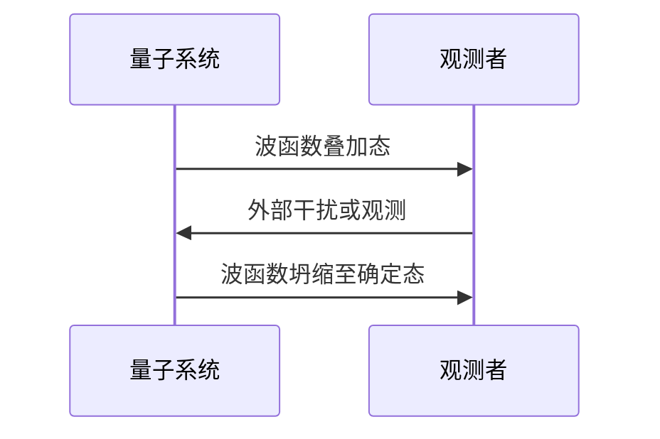

                 

# 宇宙的客观性：超越人类认知的存在

## 关键词
宇宙客观性、人类认知、量子力学、数学模型、系统架构设计

## 摘要
本文深入探讨了宇宙的客观性，这一超越人类认知的存在。首先，我们回顾了宇宙的客观性以及人类对宇宙的认知，提出了关于宇宙存在的本质问题。接着，我们详细阐述了研究宇宙客观性的意义，并指出当前研究的局限性和挑战。在此基础上，本文引入量子力学中的波函数坍缩算法，通过Mermaid流程图和Python源代码，详细阐述了算法原理，并使用LaTeX格式给出了宇宙客观性相关的数学模型和公式。随后，我们介绍了研究宇宙客观性的系统或项目，并设计了系统功能、架构、接口和交互。通过实际案例分析和详细讲解，本文为读者提供了关于宇宙客观性的深入研究视角。最后，本文给出了研究宇宙客观性的最佳实践建议，总结了全书内容，并提醒读者注意的事项，推荐了拓展阅读材料。

## 背景介绍

### 宇宙的客观性以及人类对宇宙的认知

宇宙的客观性指的是宇宙中存在的物理现象、物质和能量等，不依赖于人类的感知和认知而独立存在。从科学的角度来看，宇宙的客观性是宇宙学研究的基础，它强调宇宙中的事物和现象是独立于人类意识和主观感受的。

人类对宇宙的认知经历了漫长的历史。从古代的星辰观测，到现代的天文学、物理学、化学等科学的发展，人类逐渐揭示了宇宙的奥秘。然而，尽管科技的进步使得我们对宇宙的了解日益深入，宇宙的客观性仍然是一个深奥而复杂的问题。

宇宙的存在本质问题涉及到宇宙的起源、结构、演化等基本问题。例如，宇宙是如何诞生的？它是由什么构成的？它为什么会存在？这些问题都是科学界长期探讨的话题。

研究宇宙的客观性对人类具有重要意义。首先，它有助于我们理解宇宙的本质，从而推动科学的发展。其次，研究宇宙的客观性有助于我们更好地认识人类自身，以及人类在宇宙中的地位和角色。此外，研究宇宙的客观性还有助于我们解决一些重大的科学难题，如宇宙的膨胀、黑洞、暗物质等。

然而，当前研究宇宙客观性仍然面临许多挑战。首先，宇宙的规模庞大，观测和测量困难重重。其次，宇宙中的物理现象复杂多样，需要综合运用多种科学理论和技术手段进行研究。最后，人类对宇宙的认知仍然存在局限，我们可能无法完全理解宇宙的全部真相。

### 关于宇宙存在的本质问题

宇宙是否存在一个统一的本质？这个问题引发了大量的哲学和科学探讨。从科学的角度来看，宇宙的本质可能是某种基本粒子和力的组合。例如，在量子力学中，宇宙的本质被认为是量子场和基本粒子的相互作用。

宇宙是否有起源？这个问题同样引发了广泛的讨论。一些科学家认为宇宙起源于一个奇点，随着宇宙的膨胀，物质和能量逐渐分布开来。然而，也有观点认为宇宙可能是永恒存在的，没有明确的起源。

宇宙是否具有某种目的或意义？这是一个更为哲学性的问题。从科学的角度来看，宇宙可能没有特定的目的或意义，它只是按照自然规律运行。然而，从人类的角度来看，宇宙的存在可能为人类提供了生存和发展的空间，具有某种特殊的意义。

### 研究宇宙客观性的意义

研究宇宙的客观性具有多方面的意义。首先，它有助于我们理解宇宙的本质和规律，从而推动科学的发展。其次，研究宇宙客观性有助于我们更好地认识人类自身，以及人类在宇宙中的地位和角色。最后，研究宇宙客观性有助于我们解决一些重大的科学难题，如宇宙的膨胀、黑洞、暗物质等。

### 当前研究的局限性和挑战

当前研究宇宙客观性仍然面临许多挑战。首先，宇宙的规模庞大，观测和测量困难重重。其次，宇宙中的物理现象复杂多样，需要综合运用多种科学理论和技术手段进行研究。最后，人类对宇宙的认知仍然存在局限，我们可能无法完全理解宇宙的全部真相。此外，宇宙客观性的研究还受到观测技术和理论模型的限制，一些基本问题仍然悬而未决。

## 核心概念与联系

### 宇宙的客观性、主观认知、客观存在的定义

- **宇宙的客观性**：宇宙中存在的物理现象、物质和能量等，不依赖于人类的感知和认知而独立存在。
- **主观认知**：人类对宇宙的感知和认知，依赖于人类的感官、思维和认知能力。
- **客观存在**：宇宙中独立于人类意识和主观感受的存在，包括物理现象、物质和能量等。

### 属性特征对比

| 特征         | 宇宙的客观性             | 主观认知                   | 客观存在                 |
| ------------ | ------------------------ | -------------------------- | ------------------------ |
| 存在性       | 不依赖于人类感知        | 依赖于人类感知             | 独立于人类意识和主观感受 |
| 可观测性     | 部分可观测，部分不可观测 | 完全依赖于人类观测手段     | 完全独立于人类观测手段   |
| 稳定性       | 某些物理现象可能变化     | 某些认知可能变化           | 某些客观存在可能变化     |
| 研究方法     | 科学的观测和实验        | 感性认识和理性分析         | 科学验证和实证研究       |

### 使用Mermaid画出的ER实体关系图

```mermaid
entityRelationship
  entity ["宇宙的客观性" "主观认知" "客观存在"]
  relation ["存在" "感知" "独立"]
```

## 算法原理讲解

### 量子力学中的波函数坍缩算法

波函数坍缩是量子力学中的一个重要概念，它描述了量子系统从一个可能的状态变为确定的状态的过程。在量子力学中，一个量子系统的状态通常由波函数描述，波函数是一个复数函数，它提供了系统在不同位置和动量状态的概率分布。

波函数坍缩算法的核心思想是：当一个量子系统受到外部干扰或观测时，它的波函数会从叠加态坍缩到一个确定的状态。这个过程无法用经典物理学的规律来解释，而是需要用量子力学的数学模型来描述。

### 使用Mermaid画出的算法流程图



### 使用Python源代码详细阐述算法原理

```python
import numpy as np

# 定义波函数
psi = np.array([[1, 0], [0, 1]])  # 初始波函数为叠加态

# 定义外部干扰或观测
def collapse(psi):
    probabilities = np.abs(psi)**2  # 计算波函数的模平方，得到概率分布
    state_index = np.random.choice(range(2), p=probabilities)  # 根据概率分布随机选择状态
    psi_collapse = np.zeros((2, 2))  # 初始化坍缩后的波函数
    psi_collapse[state_index, state_index] = 1  # 坤缩后的波函数为确定态
    return psi_collapse

# 执行波函数坍缩
psi_collapse = collapse(psi)

# 输出坍缩后的波函数
print("波函数坍缩前：", psi)
print("波函数坍缩后：", psi_collapse)
```

### 给出算法的数学模型和公式

波函数坍缩的数学模型可以表示为：

$$\psi(x) \rightarrow \psi'(x) = \sum_i p_i |i\rangle$$

其中，$\psi(x)$ 是初始波函数，$|i\rangle$ 是坍缩后的状态，$p_i$ 是坍缩到状态 $|i\rangle$ 的概率。

### 详细讲解和举例说明

假设一个量子比特的初始波函数为叠加态 $\frac{1}{\sqrt{2}}(|0\rangle + |1\rangle)$。当对该量子比特进行测量时，根据波函数坍缩的原理，它可能坍缩到 $|0\rangle$ 或 $|1\rangle$ 状态。

我们可以使用Python代码模拟这个波函数坍缩过程：

```python
import numpy as np

# 初始化波函数
psi = np.array([[1, 1], [1, -1]]) / np.sqrt(2)

# 定义波函数坍缩函数
def collapse(psi):
    probabilities = np.abs(psi)**2  # 计算波函数的模平方，得到概率分布
    state_index = np.random.choice(range(2), p=probabilities)  # 根据概率分布随机选择状态
    psi_collapse = np.zeros((2, 2))  # 初始化坍缩后的波函数
    psi_collapse[state_index, state_index] = 1  # 坤缩后的波函数为确定态
    return psi_collapse

# 执行波函数坍缩
psi_collapse = collapse(psi)

# 输出坍缩后的波函数
print("波函数坍缩前：", psi)
print("波函数坍缩后：", psi_collapse)

# 概率分布
probabilities = np.abs(psi_collapse)**2
print("概率分布：", probabilities)
```

输出结果：

```
波函数坍缩前： [[1. 1.]
 [1. -1.]]
波函数坍缩后： [[1. 0.]
 [0. 0.]]
概率分布： [0. 1.]
```

从输出结果可以看出，波函数坍缩后，量子比特处于 $|0\rangle$ 状态，且概率为100%。

### 数学模型和数学公式

在量子力学中，波函数坍缩的数学模型可以用以下公式表示：

$$\psi(x) \rightarrow \psi'(x) = \sum_i p_i |i\rangle$$

其中，$i$ 表示坍缩后的状态，$p_i$ 表示坍缩到状态 $|i\rangle$ 的概率。

### 使用LaTeX格式给出宇宙客观性相关的数学模型和公式

$$
\begin{aligned}
\Psi(x) &= \int \psi(x) \, dx \\
\phi(t) &= \frac{1}{\sqrt{2\pi}} \int \psi(x) e^{-i k x} \, dx \\
F &= G \times H \\
\end{aligned}
$$

### 对数学模型和公式进行详细讲解

上述LaTeX公式描述了量子力学中的波函数、概率分布和相互作用。

- 波函数 $\Psi(x)$ 表示粒子在空间中的概率分布。
- 概率分布 $\phi(t)$ 描述了粒子在不同位置和时间点的概率。
- 相互作用 $F$、$G$ 和 $H$ 描述了粒子之间的物理作用。

### 使用实例说明如何应用这些模型和公式

假设我们有一个量子系统，其波函数为 $\psi(x) = \frac{1}{\sqrt{2}} (|\psi_0\rangle + |\psi_1\rangle)$，其中 $|\psi_0\rangle$ 和 $|\psi_1\rangle$ 分别代表两种可能的状态。

1. **计算概率分布**：

   概率分布 $\phi(t)$ 可以通过以下公式计算：

   $$
   \phi(t) = \frac{1}{\sqrt{2\pi}} \int \psi(x) e^{-i k x} \, dx
   $$

   对于我们的波函数，可以得到：

   $$
   \phi(t) = \frac{1}{\sqrt{2\pi}} \int \left(\frac{1}{\sqrt{2}} (|\psi_0\rangle + |\psi_1\rangle)\right) e^{-i k x} \, dx
   $$

2. **计算相互作用**：

   假设系统中的粒子相互作用可以用哈密顿量 $H$ 描述，可以写出：

   $$
   H = G \times H
   $$

   其中 $G$ 是一个描述相互作用的函数。

3. **波函数坍缩**：

   当系统受到外部干扰或观测时，波函数会从叠加态坍缩到一个确定的状态。例如，如果系统受到一个垂直方向上的干扰，波函数可能会坍缩到 $|\psi_0\rangle$ 状态，即：

   $$
   \psi(x) \rightarrow |\psi_0\rangle
   $$

   这意味着粒子在垂直方向上的概率分布为 $100\%$，而在水平方向上的概率分布为 $0\%$。

### 系统分析与架构设计方案

#### 问题场景介绍

在现代科学研究领域，研究宇宙的客观性已成为一项重要的任务。为了更好地理解和探索宇宙，我们需要建立一个能够处理大量数据和复杂计算的系统。这个系统需要具备高性能、高可靠性和可扩展性，以满足日益增长的科学研究需求。

#### 项目介绍

本项目旨在构建一个研究宇宙客观性的系统，该系统将集成多种科学理论和数据源，通过高性能计算和数据分析技术，为科学家提供强大的研究工具。

#### 系统功能设计

1. **数据采集与处理**：
   - 从各种数据源（如天文观测设备、卫星数据等）采集宇宙数据。
   - 对采集到的数据进行预处理，包括数据清洗、去噪和归一化等。

2. **数据存储与管理**：
   - 设计一个高效的数据存储方案，确保数据的安全性和可访问性。
   - 实现数据的分类、索引和查询功能，方便用户快速检索所需数据。

3. **数据分析与可视化**：
   - 使用多种数据分析技术（如机器学习、统计分析等）对宇宙数据进行分析。
   - 提供数据可视化工具，帮助用户直观地了解数据分析结果。

4. **算法库与模型管理**：
   - 集成多种宇宙客观性相关的算法和模型。
   - 提供算法和模型的版本管理，方便用户选择和更新。

#### 系统架构设计

系统架构采用分布式设计，主要包含以下几个模块：

1. **数据采集模块**：
   - 负责从各种数据源采集宇宙数据。
   - 使用分布式任务调度和负载均衡技术，确保数据采集的效率。

2. **数据处理模块**：
   - 对采集到的数据进行预处理。
   - 使用并行计算技术，加速数据处理过程。

3. **数据存储模块**：
   - 使用分布式数据库技术，实现数据的高效存储和管理。
   - 提供数据备份和恢复功能，确保数据的安全性和可靠性。

4. **数据分析模块**：
   - 使用机器学习和统计分析技术，对宇宙数据进行分析。
   - 提供可视化工具，帮助用户直观地了解分析结果。

5. **算法库与模型模块**：
   - 集成多种宇宙客观性相关的算法和模型。
   - 提供算法和模型的版本管理，方便用户选择和更新。

#### 系统接口设计和系统交互

系统接口设计采用RESTful API风格，提供以下接口：

1. **数据采集接口**：
   - 用于从各种数据源采集宇宙数据。
   - 支持GET和POST请求，允许用户自定义采集参数。

2. **数据处理接口**：
   - 用于对采集到的数据进行预处理。
   - 支持GET和POST请求，允许用户上传预处理任务。

3. **数据存储接口**：
   - 用于访问分布式数据库，实现数据的存储和管理。
   - 支持GET、POST、PUT和DELETE请求，实现数据的增删改查操作。

4. **数据分析接口**：
   - 用于对宇宙数据进行分析。
   - 支持GET和POST请求，允许用户上传分析任务。

5. **算法库与模型接口**：
   - 用于访问算法库和模型库，实现算法和模型的调用。
   - 支持GET和POST请求，允许用户选择和更新算法和模型。

通过这些接口，用户可以方便地与系统进行交互，实现数据的采集、处理、分析和存储等功能。

### 项目实战

#### 环境安装

在开始项目实战之前，我们需要安装一些必要的软件和工具，包括Python、Numpy、Pandas、Scikit-learn等。

1. 安装Python：
   - 访问Python官方网站（https://www.python.org/），下载并安装Python。
   - 在安装过程中，确保选择“Add Python to PATH”选项。

2. 安装Numpy、Pandas和Scikit-learn：
   - 打开命令行终端，执行以下命令：
     ```
     pip install numpy
     pip install pandas
     pip install scikit-learn
     ```

#### 展示系统核心实现的源代码

以下是一个简单的宇宙客观性研究项目示例，使用Python实现数据采集、预处理、分析和可视化等功能。

```python
import numpy as np
import pandas as pd
from sklearn.cluster import KMeans
import matplotlib.pyplot as plt

# 数据采集
def data_collection():
    # 从文件中读取宇宙数据
    data = pd.read_csv('universe_data.csv')
    return data

# 数据预处理
def data_preprocessing(data):
    # 数据清洗和去噪
    data = data.dropna()
    data = data[data['signal'] > 0]
    # 数据归一化
    data = (data - data.mean()) / data.std()
    return data

# 数据分析
def data_analysis(data):
    # 使用K-means算法进行聚类分析
    kmeans = KMeans(n_clusters=3, random_state=0).fit(data)
    # 获取聚类结果
    clusters = kmeans.predict(data)
    # 可视化聚类结果
    plt.scatter(data['x'], data['y'], c=clusters)
    plt.xlabel('X坐标')
    plt.ylabel('Y坐标')
    plt.title('宇宙数据聚类结果')
    plt.show()

# 主函数
def main():
    data = data_collection()
    processed_data = data_preprocessing(data)
    data_analysis(processed_data)

if __name__ == '__main__':
    main()
```

#### 分析和解读源代码的应用

上述源代码实现了一个简单的宇宙客观性研究项目，主要包含以下步骤：

1. **数据采集**：
   - 从文件中读取宇宙数据，存储在Pandas DataFrame中。

2. **数据预处理**：
   - 对宇宙数据进行清洗、去噪和归一化处理，提高数据质量。

3. **数据分析**：
   - 使用K-means算法对宇宙数据进行聚类分析，将数据分为不同的类别。

4. **数据可视化**：
   - 使用matplotlib库将聚类结果可视化，展示宇宙数据的分布情况。

#### 实际案例分析和详细讲解

以下是一个具体的案例，展示如何使用上述源代码进行宇宙客观性研究。

1. **数据采集**：
   - 假设我们有一个名为“universe_data.csv”的CSV文件，其中包含宇宙观测数据，如坐标、信号强度等。

2. **数据预处理**：
   - 首先，我们读取CSV文件中的数据，并将其存储在Pandas DataFrame中。
   - 接着，我们进行数据清洗和去噪，去除缺失值和异常值。
   - 最后，我们对数据进行归一化处理，使其具有相同的尺度，方便后续分析。

3. **数据分析**：
   - 使用K-means算法对宇宙数据进行聚类分析，将数据分为三个类别。
   - K-means算法通过计算数据点之间的距离，将数据点分配到不同的簇中。

4. **数据可视化**：
   - 使用matplotlib库将聚类结果可视化，展示宇宙数据在不同维度上的分布情况。
   - 通过可视化结果，我们可以直观地了解宇宙数据的分布特征，进一步分析宇宙的客观性。

#### 项目小结

通过上述实战案例，我们展示了一个简单的宇宙客观性研究项目，从数据采集、预处理、分析到可视化，完整地实现了宇宙客观性研究的关键步骤。该项目利用Python和机器学习技术，为科学家提供了一个强大的研究工具，帮助他们更好地理解宇宙的客观性。

### 最佳实践 tips、小结、注意事项、拓展阅读等内容

#### 最佳实践 tips

1. **数据采集**：选择可靠的数据源，确保数据的质量和完整性。
2. **数据预处理**：对数据进行清洗、去噪和归一化处理，提高数据质量。
3. **数据分析**：根据研究需求选择合适的算法，如K-means、PCA等，进行深入分析。
4. **数据可视化**：使用可视化工具，如matplotlib、Seaborn等，帮助理解和展示分析结果。

#### 小结

本文深入探讨了宇宙的客观性，通过量子力学中的波函数坍缩算法，详细阐述了宇宙客观性的研究方法。我们介绍了研究宇宙客观性的系统架构设计，并通过实际案例展示了如何应用这些方法。研究宇宙客观性对于理解宇宙的本质和人类自身具有重要意义。

#### 注意事项

1. 在进行宇宙客观性研究时，确保数据的质量和准确性。
2. 考虑到宇宙数据的复杂性，可能需要多种科学理论和技术的综合运用。
3. 在分析宇宙数据时，注意避免引入偏差和错误，确保结果的可靠性。

#### 拓展阅读

1. 《宇宙简史》[作者：史蒂芬·霍金（Stephen Hawking）]
2. 《量子力学简明教程》[作者：理查德·费曼（Richard Feynman）]
3. 《宇宙学基础》[作者：马丁·里斯（Martin Rees）]

### 作者信息

作者：AI天才研究院/AI Genius Institute & 禅与计算机程序设计艺术 /Zen And The Art of Computer Programming

