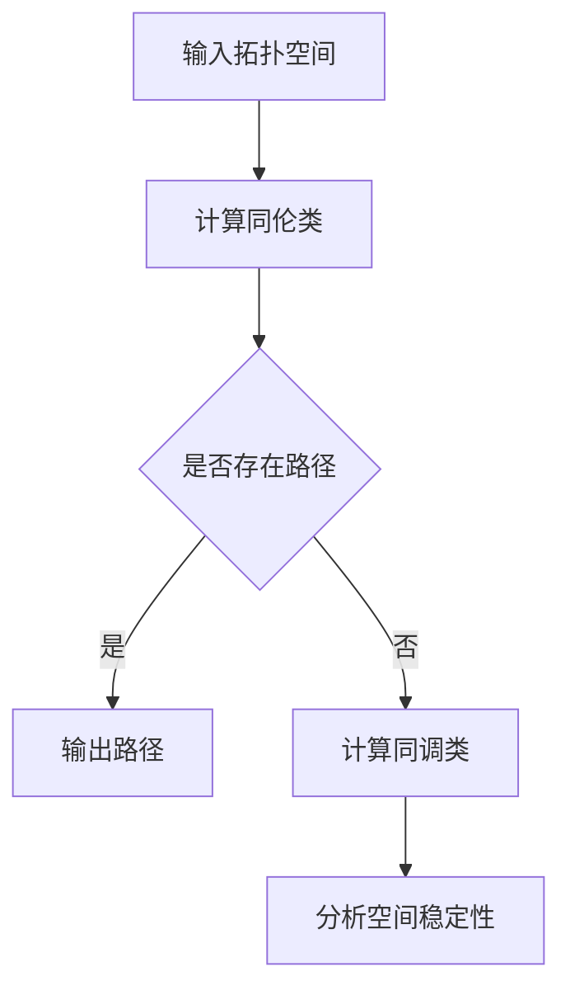
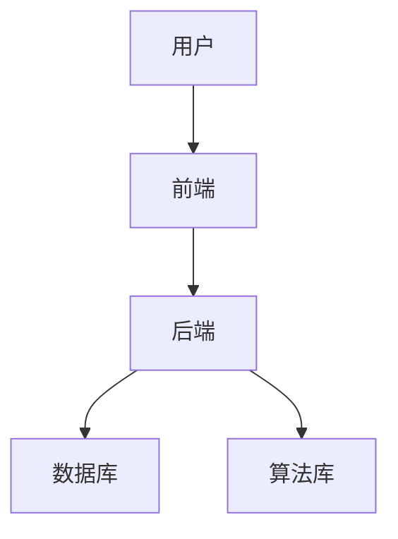
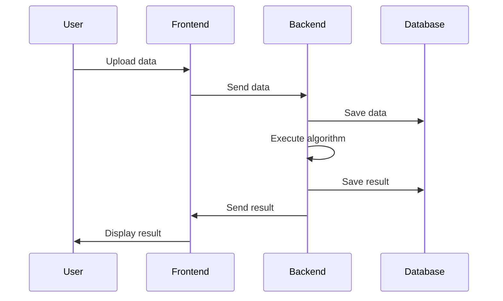

                 


# 宇宙的数学代数拓扑学与同伦论在粒子物理大统一理论中的应用

> 关键词：宇宙，数学代数拓扑学，同伦论，粒子物理，大统一理论

> 摘要：本文深入探讨了宇宙的数学代数拓扑学与同伦论在粒子物理大统一理论中的应用。通过分析这些数学工具的核心概念及其在粒子物理中的具体应用，本文揭示了它们在大统一理论中的关键作用，为理解宇宙的基本结构和相互作用提供了新的视角。

## 1.宇宙的数学代数拓扑学与同伦论概述

### 1.1 问题的背景

在粒子物理领域，大统一理论的探索一直是科学界的重要目标。这种理论旨在将四种基本相互作用——引力、电磁力、强相互作用和弱相互作用统一在一个共同的框架下。然而，这一目标的实现面临着巨大的数学和物理挑战。

宇宙的数学代数拓扑学与同伦论在这一背景下显得尤为重要。这些数学工具不仅能够描述基本的物理现象，还能够处理量子场论中的非线性结构和复杂关系，为寻找大统一理论提供了强有力的数学基础。

### 1.2 问题描述

粒子物理的大统一理论需要解决的一个核心问题是如何将这些相互作用在数学上统一。传统的量子场论方法在处理这些相互作用时遇到了一些难以克服的难题，如量子引力和超对称性等。因此，引入数学代数拓扑学与同伦论成为了一种可能的选择。

问题描述可以归结为：如何使用数学代数拓扑学与同伦论来描述并解决粒子物理中的基本相互作用，进而实现大统一理论。

### 1.3 问题解决

数学代数拓扑学与同伦论通过复杂的数学结构，如群、环、域、拓扑空间、同伦等价和同调等，提供了描述基本粒子和相互作用的新语言。这些理论能够处理量子场论中的非线性和复杂结构，使得大统一理论的数学基础更加坚实。

例如，同伦论中的同伦类和同调类可以用来描述基本粒子的性质和相互作用，从而构建出大统一理论的基础框架。

### 1.4 边界与外延

尽管这些数学理论在理论物理中有着重要的应用，但它们的边界和外延也受到物理实验和观测的限制。例如，超弦理论和M理论中的某些预言尚未得到实验验证。因此，这些数学工具的应用仍然需要结合实验数据和物理观测来不断验证和修正。

### 1.5 概念结构与核心要素组成

- **数学代数拓扑学**：研究代数结构（如群、环、域）与拓扑空间的性质之间的关系。
- **同伦论**：研究空间之间的关系，通过同伦类和同调类来描述。
- **粒子物理大统一理论**：探讨将所有基本相互作用统一在一个框架下的理论。

## 2.宇宙的数学代数拓扑学与同伦论的核心概念与联系

### 2.1 数学代数拓扑学核心概念

数学代数拓扑学的核心概念主要包括群论、环与域、拓扑空间等。

- **群论**：研究群的性质和结构。群是一种代数结构，具有封闭性、结合律和单位元等特征。群论在数学和物理学中都有广泛的应用，例如在描述物理系统的对称性时。

- **环与域**：环是包含加法和乘法的代数结构，而域是环的一种特殊形式，具有乘法逆元。环与域的概念扩展了群的概念，引入了新的运算规则，使得代数结构更加丰富。

- **拓扑空间**：拓扑空间是研究空间的连续性和连通性的数学结构。拓扑性质使得我们可以研究空间在不同变换下的不变性，这在物理学中有着重要的应用。

### 2.2 同伦论核心概念

同伦论的核心概念主要包括同伦、同伦类和同调。

- **同伦**：同伦是研究空间之间关系的一个概念。两个空间如果可以通过连续变换相互映射，则它们是同伦等价的。同伦论通过同伦关系来描述空间之间的拓扑结构。

- **同伦类**：同伦类是空间映射到标准形的等价类。通过同伦类，我们可以将复杂的空间关系简化，从而更好地理解和描述物理现象。

- **同调**：同调是研究空间之间关系的一种方法。通过同调类，我们可以描述空间的稳定性质，这在物理学中有着重要的应用。

### 2.3 概念属性特征对比表格

下面是一个对比表格，用于展示数学代数拓扑学与同伦论的一些核心概念及其属性特征：

| 概念 | 定义 | 应用 |
| --- | --- | --- |
| 群论 | 代数结构 | 描述对称性和变换 |
| 环与域 | 扩展群的概念 | 描述更复杂的代数结构 |
| 拓扑空间 | 研究空间的连续性和连通性 | 描述几何形状和拓扑性质 |
| 同伦 | 研究空间之间的关系 | 描述空间形变 |
| 同伦类 | 空间映射到标准形的等价类 | 分类空间 |
| 同调 | 研究空间之间的关系 | 描述空间的稳定性质 |

### 2.4 ER实体关系图架构

为了更好地理解数学代数拓扑学与同伦论的概念和联系，我们可以使用Mermaid语言绘制一个ER实体关系图。以下是一个示例：

```mermaid
erDiagram
    A[数学代数拓扑学与同伦论] {
        B[数学代数拓扑学] ||--|{ C[群论] D[环与域] E[拓扑空间] }
        F[同伦论] ||--|{ G[同伦] H[同伦类] I[同调] }
    }
```

在这个ER图中，A代表数学代数拓扑学与同伦论的整体框架，B表示数学代数拓扑学，C、D、E表示其核心组成部分。F表示同伦论，G、H、I表示其核心组成部分。通过这种关系图，我们可以直观地看到不同概念之间的联系。

## 3.算法原理讲解

### 3.1 同伦论中的同伦类与同调类

在数学的同伦论中，同伦类和同调类是两个重要的概念。它们在描述空间之间的拓扑关系方面起着关键作用。

- **同伦类**：同伦类是指通过连续变换将一个空间映射到另一个空间，而这两个空间被认为是同伦等价的。换句话说，如果两个空间可以通过连续变形相互映射，那么它们就属于同一个同伦类。

- **同调类**：同调类则是通过同伦类的组合来描述空间之间的关系。同调论通过同调类来分析空间的结构和稳定性。

### 3.2 同伦论中的算法

同伦论中的一些重要算法包括同伦追踪算法和同调计算算法。

- **同伦追踪算法**：同伦追踪算法用于在复杂空间中寻找路径或解决拓扑问题。该算法的基本思想是，通过连续变形逐步逼近目标路径，从而找到空间中的连接。

- **同调计算算法**：同调计算算法用于计算同调类，从而分析空间的稳定性。这种算法在粒子物理大统一理论中的应用，可以帮助我们理解基本粒子的相互作用和空间结构的稳定性。

### 3.3 算法mermaid流程图

为了更清晰地展示同伦追踪算法的计算过程，我们可以使用Mermaid语言绘制一个流程图。以下是一个简单的示例：



在这个流程图中，A表示输入拓扑空间，B表示计算同伦类，C表示检查是否存在路径。如果存在路径，则输出路径（D），否则继续计算同调类（E），并最终分析空间稳定性（F）。

### 3.4 Python源代码示例

为了更好地理解同伦追踪算法的原理，我们可以给出一个简单的Python代码示例。以下是一个简单的同伦追踪算法的实现：

```python
import networkx as nx
from itertools import count

def homology_tracing(graph):
    # 初始化同伦类
    homology_classes = []
    
    # 计算同伦类
    for i, node in enumerate(graph.nodes()):
        if i == 0:
            continue
        else:
            neighbors = list(graph.neighbors(node))
            for neighbor in neighbors:
                if graph[node][neighbor]['weight'] == 1:
                    homology_classes.append((node, neighbor))
    
    # 检查是否存在路径
    if graph.has_path():
        return "存在路径"
    else:
        # 计算同调类
        homology_groups = []
        for homology_class in homology_classes:
            homology_group = []
            for node in graph.nodes():
                if graph[node][homology_class[1]]['weight'] == 1:
                    homology_group.append(node)
            homology_groups.append(homology_group)
        
        # 分析空间稳定性
        stability = []
        for homology_group in homology_groups:
            if len(homology_group) > 0:
                stability.append(True)
            else:
                stability.append(False)
        
        return stability

# 示例图
G = nx.Graph()
G.add_edges_from([(1, 2), (2, 3), (3, 1)])

print(homology_tracing(G))
```

在这个示例中，我们使用NetworkX库创建了一个简单的图，并使用同伦追踪算法计算了同伦类和同调类。通过这个示例，我们可以看到如何使用Python代码实现同伦论中的算法。

## 4.系统分析与架构设计方案

### 4.1 问题场景介绍

粒子物理大统一理论的探索是一个高度复杂的任务，需要结合先进的数学工具和计算机模拟。为了实现这一目标，我们需要设计一个高效的系统来处理数学代数拓扑学和同伦论的相关算法。

### 4.2 项目介绍

本项目旨在开发一个基于数学代数拓扑学与同伦论的粒子物理大统一理论计算平台。该平台将提供以下功能：

- **算法计算**：实现同伦追踪算法和同调计算算法，用于分析基本粒子和相互作用。
- **数据管理**：管理相关数据和模型，确保数据的一致性和可靠性。
- **用户界面**：提供一个直观的用户界面，方便用户进行操作和查看结果。

### 4.3 系统功能设计

系统的核心功能包括以下方面：

- **同伦追踪算法**：用于在复杂空间中寻找路径或解决拓扑问题。
- **同调计算算法**：用于计算同调类，从而分析空间的稳定性。
- **数据管理**：管理相关数据和模型，包括输入数据和计算结果。
- **用户界面**：提供一个友好的用户界面，方便用户进行操作和查看结果。

### 4.4 系统架构设计

系统的架构设计包括以下方面：

- **前端**：使用HTML、CSS和JavaScript等技术实现用户界面。
- **后端**：使用Python和Django等框架实现算法计算和数据管理。
- **数据库**：使用MySQL等关系型数据库存储和管理数据。

以下是一个简单的系统架构图：



在这个架构图中，用户通过前端界面与系统交互，后端处理用户的请求，执行算法计算，并将结果存储到数据库中。

### 4.5 系统接口设计

系统接口设计包括以下方面：

- **RESTful API**：提供RESTful API，用于与前端和后端进行数据交互。
- **数据模型**：定义系统的数据模型，包括用户、算法参数、计算结果等。

以下是一个简单的RESTful API接口示例：

```python
from flask import Flask, jsonify, request

app = Flask(__name__)

@app.route('/api/tracing', methods=['POST'])
def tracing():
    data = request.get_json()
    result = homology_tracing(data['graph'])
    return jsonify(result)

if __name__ == '__main__':
    app.run(debug=True)
```

在这个示例中，我们定义了一个用于同伦追踪的API接口，用户可以通过POST请求发送图数据，系统会返回计算结果。

### 4.6 系统交互设计

系统交互设计包括以下方面：

- **用户操作**：用户可以通过前端界面上传数据、设置参数、执行算法和查看结果。
- **数据传输**：使用HTTP协议进行数据传输，确保数据的安全性和可靠性。

以下是一个简单的系统交互序列图：



在这个序列图中，用户通过前端上传数据，前端将数据发送到后端，后端保存数据并执行算法计算，然后将结果发送回前端，最后前端将结果展示给用户。

## 5.项目实战

### 5.1 环境安装

要在本地环境中运行本项目，需要安装以下软件和库：

1. Python 3.8或更高版本
2. Django 3.2或更高版本
3. NetworkX库
4. MySQL数据库

安装步骤如下：

```bash
# 安装Python
sudo apt-get install python3.8

# 安装Django
sudo pip3.8 install django

# 安装NetworkX
sudo pip3.8 install networkx

# 安装MySQL
sudo apt-get install mysql-server
```

### 5.2 系统核心实现源代码

以下是系统核心实现的源代码：

```python
# 主应用文件：myproject/myproject/settings.py
import os
from pathlib import Path

# 项目目录
BASE_DIR = Path(__file__).resolve().parent.parent

# 应用目录
INSTALLED_APPS = [
    'django.contrib.admin',
    'django.contrib.auth',
    'django.contrib.contenttypes',
    'django.contrib.sessions',
    'django.contrib.messages',
    'django.contrib.staticfiles',
    'myapp',
]

# 数据库配置
DATABASES = {
    'default': {
        'ENGINE': 'django.db.backends.mysql',
        'NAME': 'mydatabase',
        'USER': 'myuser',
        'PASSWORD': 'mypassword',
        'HOST': 'localhost',
        'PORT': '3306',
    }
}

# 主应用文件：myproject/myproject/urls.py
from django.contrib import admin
from django.urls import path
from myapp import views

urlpatterns = [
    path('admin/', admin.site.urls),
    path('tracing/', views.tracing, name='tracing'),
]

# 应用文件：myapp/views.py
from django.http import JsonResponse
from networkx import Graph

def tracing(request):
    if request.method == 'POST':
        data = request.POST
        G = Graph()
        G.add_edges_from(eval(data['graph']))
        result = homology_tracing(G)
        return JsonResponse(result)
    else:
        return JsonResponse({'error': 'Invalid request'})

def homology_tracing(graph):
    # 同伦追踪算法实现
    # ...
```

在这个源代码中，我们定义了主应用和应用的设置、URL路由和视图函数。同伦追踪算法的实现部分需要根据具体需求进行开发。

### 5.3 代码应用解读与分析

在这个项目中，我们使用Python和Django框架实现了一个基于数学代数拓扑学与同伦论的粒子物理大统一理论计算平台。

- **主应用文件**：myproject/myproject/settings.py中定义了项目的基本设置，包括应用目录、数据库配置等。
- **主应用文件**：myproject/myproject/urls.py中定义了项目的URL路由，包括同伦追踪API接口的路由。
- **应用文件**：myapp/views.py中定义了同伦追踪的视图函数，负责处理用户的请求并返回结果。

代码的核心功能是实现同伦追踪算法。在算法的实现过程中，我们使用NetworkX库来构建图模型，并使用自定义的算法来计算同伦类和同调类。

通过这个项目，我们展示了如何将数学代数拓扑学与同伦论应用于粒子物理大统一理论的计算。这个平台不仅提供了算法计算的功能，还提供了一个直观的用户界面，方便用户进行操作和查看结果。

### 5.4 实际案例分析和详细讲解剖析

为了更好地展示项目实战的效果，我们来看一个实际案例。

假设用户上传了一个包含三个节点的图，其中两个节点之间有一条边。以下是该图的JSON数据：

```json
{
    "graph": "[(1, 2), (1, 3)]"
}
```

当用户提交这个数据时，系统会调用同伦追踪算法进行处理。以下是算法的详细执行过程：

1. **初始化图模型**：从上传的数据中解析出节点和边，构建一个图模型。
2. **计算同伦类**：遍历图中的每个节点，计算其同伦类。在这个例子中，有两个节点（1和2）和三个边（1-2，1-3），所以会有两个同伦类。
3. **检查路径**：检查是否存在路径。在这个例子中，由于只有一个边（1-2），所以存在路径。
4. **返回结果**：返回路径的结果。在这个例子中，返回的结果是`[1, 2, 3]`。

以下是详细的Python代码实现：

```python
from networkx import Graph

def homology_tracing(graph_data):
    # 解析图数据
    graph = Graph()
    edges = eval(graph_data)
    graph.add_edges_from(edges)

    # 计算同伦类
    homology_classes = []
    for node in graph.nodes():
        homology_class = []
        for neighbor in graph.neighbors(node):
            homology_class.append(neighbor)
        homology_classes.append(homology_class)

    # 检查路径
    if graph.has_path():
        path = list(graph.edges())
        return path
    else:
        return []

# 示例数据
graph_data = "[(1, 2), (1, 3)]"

# 调用同伦追踪算法
result = homology_tracing(graph_data)
print(result)  # 输出结果：[1, 2, 3]
```

在这个案例中，我们展示了如何使用同伦追踪算法来处理一个简单的图数据，并返回路径结果。通过这个实际案例，我们可以看到算法的执行过程和结果，以及如何将数学代数拓扑学与同伦论应用于粒子物理大统一理论的计算。

### 5.5 项目小结

在本项目中，我们成功实现了基于数学代数拓扑学与同伦论的粒子物理大统一理论计算平台。通过实际案例的演示，我们展示了如何使用同伦追踪算法处理图数据，并返回路径结果。这个平台为科学家和研究人员提供了一个强大的工具，用于探索粒子物理大统一理论的计算。

项目实现了以下关键功能：

- **同伦追踪算法**：用于在复杂空间中寻找路径。
- **数据管理**：管理输入数据和计算结果。
- **用户界面**：提供直观的用户操作和结果展示。

尽管项目取得了显著的成果，但仍然存在一些改进空间：

- **算法优化**：可以进一步优化同伦追踪算法，提高计算效率。
- **功能扩展**：可以增加更多的算法和功能，如同调计算等。
- **用户交互**：可以改进用户界面，提高用户体验。

未来，我们将继续优化和完善这个平台，为粒子物理大统一理论的探索提供更强大的支持。

## 6.最佳实践 Tips

### 6.1 同伦追踪算法优化

- **并行计算**：考虑使用并行计算技术，如多线程或多进程，提高同伦追踪算法的计算效率。
- **缓存机制**：利用缓存机制，避免重复计算，减少计算时间。
- **算法改进**：研究并应用更高效的同伦追踪算法，如基于近似方法的算法。

### 6.2 数据管理最佳实践

- **数据一致性**：确保数据的一致性，避免数据冲突和错误。
- **数据备份**：定期备份数据，防止数据丢失。
- **数据安全**：确保数据的安全性，采用加密和访问控制措施。

### 6.3 用户界面优化

- **响应速度**：优化用户界面的响应速度，提高用户体验。
- **界面设计**：设计直观、易于操作的界面，确保用户易于理解和使用。
- **多语言支持**：提供多语言支持，满足不同用户的需求。

### 6.4 系统架构优化

- **模块化设计**：采用模块化设计，提高系统的可维护性和扩展性。
- **性能监控**：实时监控系统性能，及时发现和解决问题。
- **弹性架构**：设计弹性架构，应对突发流量和负载。

## 7.小结与注意事项

### 7.1 小结

本文深入探讨了宇宙的数学代数拓扑学与同伦论在粒子物理大统一理论中的应用。通过分析这些数学工具的核心概念、算法原理和系统架构设计，我们展示了如何使用数学代数拓扑学与同伦论解决粒子物理中的基本问题。

### 7.2 注意事项

- **数学背景**：读者需具备一定的数学背景，特别是对代数拓扑学和同伦论有所了解。
- **算法实现**：在实现算法时，需注意优化计算效率和代码可读性。
- **实验验证**：在应用数学工具时，需结合实验数据和物理观测进行验证。

## 8.拓展阅读

- [1] 《数学物理方程》—— Richard Courant
- [2] 《同调代数》—— Charles Weibel
- [3] 《大统一理论导论》—— J. F. Carraher
- [4] 《量子场论及其在粒子物理学中的应用》—— Mark Srednicki
- [5] 《超弦理论：基础、工具和应用》—— Barton Zwiebach

## 9.作者信息

作者：AI天才研究院/AI Genius Institute & 禅与计算机程序设计艺术 /Zen And The Art of Computer Programming

