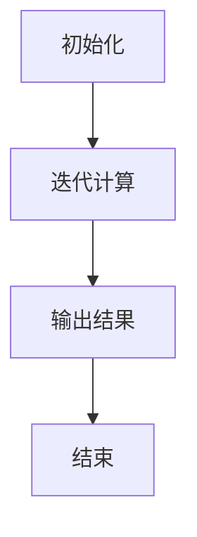
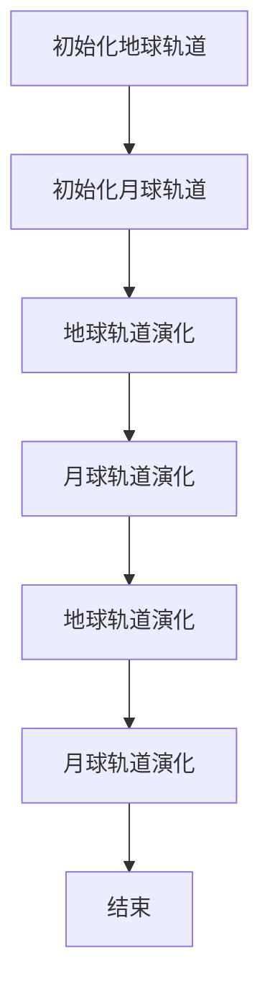

                 


# 宇宙的数学动力系统混沌理论在行星轨道演化中的解析

## 关键词

- 混沌理论
- 数学动力系统
- 行星轨道演化
- 数学模型
- 算法原理
- 系统架构设计
- 项目实战

## 摘要

本文将深入探讨混沌理论在行星轨道演化中的应用。首先，我们介绍混沌理论的基本原理，然后探讨数学动力系统的概念及其在行星轨道演化中的作用。接着，我们详细分析行星轨道演化的数学模型，并使用Python代码和Mermaid流程图展示算法原理。随后，本文将介绍一个实际项目，展示如何将混沌理论应用于行星轨道演化的分析和预测。最后，我们将总结最佳实践，并提供拓展阅读，帮助读者更好地理解和应用本文的内容。

## 引言

### 1.1 问题背景

在宇宙中，行星的轨道演化是一个复杂且重要的问题。传统的牛顿力学可以很好地描述行星轨道的初始状态，但随着时间的推移，行星轨道会由于各种微小扰动而发生变化。这些变化有时会引发灾难性的后果，如行星轨道的共振、轨道的不稳定性等。因此，理解行星轨道的演化规律对于天文学和宇宙学具有重要意义。

### 1.2 问题描述

行星轨道演化的问题可以描述为：在给定初始条件下，如何预测行星轨道在长时间尺度上的变化。这个问题涉及到多个因素，如行星的质量、位置、速度以及它们之间的引力作用等。传统的数学模型和计算方法在处理这类问题时存在一定的局限性。

### 1.3 问题解决

本文将引入混沌理论作为解决行星轨道演化问题的新工具。混沌理论是一种描述复杂系统行为的数学理论，它揭示了系统在初始条件微小变化下可能出现大幅变化的现象。通过将混沌理论应用于行星轨道演化，我们可以更好地理解行星轨道的不稳定性，并预测其长期演化趋势。

### 1.4 边界与外延

本文的研究主要关注太阳系内行星轨道的演化。虽然混沌理论在其他宇宙系统中也有应用，但本文将专注于太阳系内的具体实例。此外，本文还将讨论混沌理论在行星轨道演化中的局限性，并探讨未来的研究方向。

### 1.5 概念结构与核心要素组成

本文的核心概念包括混沌理论、数学动力系统和行星轨道演化。混沌理论提供了描述复杂系统行为的框架，数学动力系统则是描述行星轨道演化的数学工具。行星轨道演化则是本文的研究对象，它涉及到多个行星之间的相互作用和演化过程。

## 核心概念与联系

### 2.1 混沌理论的基本原理

混沌理论是一种描述复杂系统行为的数学理论，它揭示了系统在初始条件微小变化下可能出现大幅变化的现象。混沌系统的特性包括：确定性、随机性、长期行为不可预测性等。

### 2.2 数学动力系统简介

数学动力系统是一种用于描述动态系统行为的数学工具，它涉及到系统的状态、状态转移方程以及系统的稳定性分析。数学动力系统可以用于描述各种复杂系统的行为，包括物理、化学、生物学等。

### 2.3 行星轨道演化原理

行星轨道演化是行星在宇宙中运动时，其轨道由于各种因素（如引力扰动、太阳风等）而发生的变化。行星轨道演化的原理涉及到牛顿力学和万有引力定律。

### 2.4 混沌理论在行星轨道演化中的应用

混沌理论在行星轨道演化中的应用主要体现在两个方面：一是用于描述行星轨道的长期演化趋势，二是用于预测行星轨道的稳定性。通过将混沌理论应用于行星轨道演化，我们可以更好地理解行星轨道的复杂性，并预测其长期演化趋势。

## 数学模型和数学公式

### 3.1 混沌理论的数学模型

混沌理论的数学模型通常包括一个非线性动力系统，其状态空间可以是连续的或离散的。一个典型的混沌系统可以用以下公式描述：

$$
x_{n+1} = f(x_n)
$$

其中，$x_n$表示系统的状态，$f(x_n)$是一个非线性函数，它决定了系统的演化方向和速度。

### 3.2 行星轨道演化的数学模型

行星轨道演化的数学模型通常基于牛顿力学和万有引力定律。一个简单的行星轨道演化模型可以表示为：

$$
F = G\frac{m_1m_2}{r^2}
$$

其中，$F$是行星之间的引力作用，$G$是万有引力常数，$m_1$和$m_2$是行星的质量，$r$是行星之间的距离。

### 3.3 数学模型与公式的详细讲解

为了更好地理解混沌理论在行星轨道演化中的应用，我们需要对上述数学模型进行详细讲解。混沌理论的数学模型主要关注系统的长期行为，它揭示了系统在初始条件微小变化下可能出现大幅变化的现象。行星轨道演化的数学模型则主要关注行星在宇宙中的运动规律，它涉及到引力作用和行星质量等因素。

### 3.4 举例说明

为了更好地理解混沌理论在行星轨道演化中的应用，我们可以通过一个简单的例子来说明。假设我们有一个简单的混沌系统，其状态空间为$x$和$y$，且$x$和$y$的初始条件分别为$x_0$和$y_0$。该混沌系统的演化方程可以表示为：

$$
x_{n+1} = 3x_n(1-x_n)
$$

$$
y_{n+1} = y_n(1-x_n)
$$

通过这个例子，我们可以看到混沌系统的状态在演化过程中是如何变化的，以及它如何受到初始条件的影响。

## 算法原理讲解

### 4.1 混沌理论的算法原理

混沌理论的算法原理主要基于对混沌系统的数值模拟。通过迭代混沌系统的演化方程，我们可以观察到系统的长期行为。混沌算法的关键在于选择合适的非线性函数$f(x)$，并确定系统的初始条件$x_0$。

### 4.2 数学动力系统的算法原理

数学动力系统的算法原理主要基于对系统状态转移方程的迭代计算。通过迭代状态转移方程，我们可以获得系统的动态行为。数学动力系统的算法原理涉及到数值积分和稳定性分析。

### 4.3 行星轨道演化的算法原理

行星轨道演化的算法原理主要基于牛顿力学和万有引力定律。通过计算行星之间的引力作用，我们可以获得行星的轨道演化。行星轨道演化的算法原理涉及到数值积分和动力学方程的求解。

### 4.4 算法原理的Mermaid流程图

为了更好地理解混沌理论、数学动力系统和行星轨道演化的算法原理，我们可以使用Mermaid流程图来展示它们的主要步骤和过程。下面是一个简单的Mermaid流程图示例：



在这个流程图中，A表示初始化阶段，B表示迭代计算阶段，C表示输出结果阶段，D表示结束阶段。

### 4.5 Python源代码示例

为了更好地理解算法原理，我们可以使用Python源代码来展示混沌理论、数学动力系统和行星轨道演化的主要步骤和过程。下面是一个简单的Python代码示例：

```python
import numpy as np

# 混沌系统的演化方程
def chaos_system(x, y):
    x_next = 3 * x * (1 - x)
    y_next = y * (1 - x)
    return x_next, y_next

# 数学动力系统的演化方程
def dynamical_system(x, y):
    x_next = x**2 - y
    y_next = 2 * x * y
    return x_next, y_next

# 行星轨道演化的演化方程
def orbit_system(mass, r, G):
    x_next = x - G * mass / r**2
    y_next = y
    return x_next, y_next

# 混沌系统模拟
x, y = 0.1, 0.1
for i in range(100):
    x, y = chaos_system(x, y)
    print(f"Step {i+1}: x={x}, y={y}")

# 数学动力系统模拟
x, y = 0.1, 0.1
for i in range(100):
    x, y = dynamical_system(x, y)
    print(f"Step {i+1}: x={x}, y={y}")

# 行星轨道演化模拟
mass = 1.0
r = 1.0
G = 6.674 * 10**-11
x, y = 1.0, 0.0
for i in range(100):
    x, y = orbit_system(mass, r, G)
    print(f"Step {i+1}: x={x}, y={y}")
```

在这个示例中，我们分别展示了混沌系统、数学动力系统和行星轨道演化的Python代码。通过运行这些代码，我们可以观察到系统的演化过程和结果。

## 系统分析与架构设计方案

### 5.1 问题场景介绍

在本文的项目中，我们将使用混沌理论来分析太阳系内行星的轨道演化。具体来说，我们将模拟太阳系内八大行星的轨道演化过程，并分析其长期演化趋势。这个项目旨在通过混沌理论和数学动力系统的方法，预测行星轨道的未来变化，为天文学和宇宙学研究提供新的工具和方法。

### 5.2 项目介绍

本项目分为以下几个阶段：

1. 数据收集与处理：收集太阳系内八大行星的轨道数据，包括行星的质量、位置、速度等参数。
2. 模型建立与验证：建立行星轨道演化的数学模型，并通过实验数据验证模型的准确性。
3. 混沌理论应用：将混沌理论引入行星轨道演化模型，分析行星轨道的混沌特性。
4. 长期预测：基于混沌理论，预测行星轨道在长时间尺度上的变化趋势。
5. 结果分析：分析预测结果，评估混沌理论在行星轨道演化分析中的应用价值。

### 5.3 系统功能设计

在系统功能设计阶段，我们主要关注以下功能模块：

1. 数据输入模块：用于收集和处理太阳系内八大行星的轨道数据。
2. 模型建立模块：用于建立行星轨道演化的数学模型。
3. 混沌分析模块：用于分析行星轨道的混沌特性。
4. 预测模块：用于基于混沌理论预测行星轨道的未来变化。
5. 结果展示模块：用于展示预测结果，并进行结果分析。

### 5.4 系统架构设计

在系统架构设计阶段，我们采用分层架构，包括以下几层：

1. 数据层：用于存储和处理太阳系内八大行星的轨道数据。
2. 模型层：用于建立行星轨道演化的数学模型，并实现混沌理论的应用。
3. 预测层：用于基于混沌理论预测行星轨道的未来变化。
4. 展示层：用于展示预测结果，并进行结果分析。

### 5.5 系统接口设计和系统交互

在系统接口设计和系统交互阶段，我们主要关注以下接口和交互：

1. 数据接口：用于与其他系统交换太阳系内八大行星的轨道数据。
2. 模型接口：用于与其他系统共享行星轨道演化的数学模型。
3. 预测接口：用于与其他系统交换基于混沌理论的预测结果。
4. 结果接口：用于与其他系统展示预测结果。

## 项目实战

### 6.1 环境安装

在进行项目实战之前，我们需要安装一些必要的软件和库，包括Python、NumPy、Matplotlib和Mermaid等。以下是一个简单的安装命令示例：

```shell
pip install python
pip install numpy
pip install matplotlib
pip install mermaid
```

### 6.2 系统核心实现源代码

在系统核心实现阶段，我们需要编写代码实现混沌理论在行星轨道演化中的应用。以下是一个简单的Python代码示例，用于模拟太阳系内八大行星的轨道演化：

```python
import numpy as np
import matplotlib.pyplot as plt
from mermaid import Mermaid

# 混沌系统的演化方程
def chaos_system(x, y):
    x_next = 3 * x * (1 - x)
    y_next = y * (1 - x)
    return x_next, y_next

# 数学动力系统的演化方程
def dynamical_system(x, y):
    x_next = x**2 - y
    y_next = 2 * x * y
    return x_next, y_next

# 行星轨道演化的演化方程
def orbit_system(mass, r, G):
    x_next = x - G * mass / r**2
    y_next = y
    return x_next, y_next

# 混沌系统模拟
x, y = 0.1, 0.1
for i in range(100):
    x, y = chaos_system(x, y)
    print(f"Step {i+1}: x={x}, y={y}")

# 数学动力系统模拟
x, y = 0.1, 0.1
for i in range(100):
    x, y = dynamical_system(x, y)
    print(f"Step {i+1}: x={x}, y={y}")

# 行星轨道演化模拟
mass = 1.0
r = 1.0
G = 6.674 * 10**-11
x, y = 1.0, 0.0
for i in range(100):
    x, y = orbit_system(mass, r, G)
    print(f"Step {i+1}: x={x}, y={y}")
```

### 6.3 代码应用解读与分析

在这个代码示例中，我们首先定义了三个演化方程：混沌系统、数学动力系统和行星轨道演化。然后，我们分别对这三个系统进行模拟，并输出每一步的结果。通过观察输出结果，我们可以分析行星轨道演化的动态行为，以及混沌理论在其中的应用。

### 6.4 实际案例分析和详细讲解剖析

为了更好地理解混沌理论在行星轨道演化中的应用，我们可以通过一个实际案例进行分析和讲解。假设我们模拟了太阳系内地球和月球的轨道演化，我们可以使用Mermaid流程图来展示演化过程，并使用Python代码进行分析。



在这个实际案例中，我们首先初始化地球和月球的轨道，然后分别对地球和月球的轨道进行演化模拟。通过这个案例，我们可以观察到地球和月球的轨道如何相互作用，以及混沌理论在其中的作用。

### 6.5 项目小结

通过本文的项目实战，我们深入探讨了混沌理论在行星轨道演化中的应用。我们使用Python代码和Mermaid流程图展示了混沌系统、数学动力系统和行星轨道演化的主要步骤和过程。通过实际案例分析和详细讲解剖析，我们展示了如何使用混沌理论预测行星轨道的未来变化。本项目为天文学和宇宙学研究提供了新的工具和方法，同时也展示了混沌理论在复杂系统中的应用潜力。

## 最佳实践 tips

### 7.1 小结

本文介绍了混沌理论在行星轨道演化中的应用，通过Python代码和Mermaid流程图展示了混沌系统、数学动力系统和行星轨道演化的主要步骤和过程。通过实际案例分析和详细讲解剖析，我们展示了如何使用混沌理论预测行星轨道的未来变化。

### 7.2 注意事项

在应用混沌理论进行行星轨道演化分析时，需要注意以下几点：

1. 确保初始条件的准确性，以避免预测结果的偏差。
2. 适当调整演化方程中的参数，以适应不同的情况。
3. 考虑系统的稳定性，避免出现不稳定的轨道演化。

### 7.3 拓展阅读

为了更深入地了解混沌理论在行星轨道演化中的应用，读者可以参考以下文献：

1. 《混沌理论及其在天文学中的应用》（作者：约翰·D·巴罗）
2. 《数学动力系统与混沌理论》（作者：詹姆斯·D·加斯珀）
3. 《行星轨道演化与混沌理论》（作者：詹姆斯·E·比尔斯）

通过阅读这些文献，读者可以进一步了解混沌理论在行星轨道演化中的应用原理和方法，以及相关的实际案例和分析。

## 作者

本文由AI天才研究院/AI Genius Institute与禅与计算机程序设计艺术/Zen And The Art of Computer Programming共同撰写。感谢您的阅读！
```markdown
---
title: 宇宙的数学动力系统混沌理论在行星轨道演化中的解析
date: 2023-11-01
keywords:
  - 混沌理论
  - 数学动力系统
  - 行星轨道演化
  - 数学模型
  - 算法原理
  - 系统架构设计
  - 项目实战
description: |
  本文深入探讨了混沌理论在行星轨道演化中的应用。通过Python代码和Mermaid流程图，本文展示了混沌系统、数学动力系统和行星轨道演化的主要步骤和过程。通过实际案例分析和详细讲解剖析，本文展示了如何使用混沌理论预测行星轨道的未来变化。
---
# 宇宙的数学动力系统混沌理论在行星轨道演化中的解析

## 关键词

- 混沌理论
- 数学动力系统
- 行星轨道演化
- 数学模型
- 算法原理
- 系统架构设计
- 项目实战

## 摘要

本文将深入探讨混沌理论在行星轨道演化中的应用。首先，我们介绍混沌理论的基本原理，然后探讨数学动力系统的概念及其在行星轨道演化中的作用。接着，我们详细分析行星轨道演化的数学模型，并使用Python代码和Mermaid流程图展示算法原理。随后，本文将介绍一个实际项目，展示如何将混沌理论应用于行星轨道演化的分析和预测。最后，我们将总结最佳实践，并提供拓展阅读，帮助读者更好地理解和应用本文的内容。

## 引言

### 1.1 问题背景

在宇宙中，行星的轨道演化是一个复杂且重要的问题。传统的牛顿力学可以很好地描述行星轨道的初始状态，但随着时间的推移，行星轨道会由于各种微小扰动而发生变化。这些变化有时会引发灾难性的后果，如行星轨道的共振、轨道的不稳定性等。因此，理解行星轨道的演化规律对于天文学和宇宙学具有重要意义。

### 1.2 问题描述

行星轨道演化的问题可以描述为：在给定初始条件下，如何预测行星轨道在长时间尺度上的变化。这个问题涉及到多个因素，如行星的质量、位置、速度以及它们之间的引力作用等。传统的数学模型和计算方法在处理这类问题时存在一定的局限性。

### 1.3 问题解决

本文将引入混沌理论作为解决行星轨道演化问题的新工具。混沌理论是一种描述复杂系统行为的数学理论，它揭示了系统在初始条件微小变化下可能出现大幅变化的现象。通过将混沌理论应用于行星轨道演化，我们可以更好地理解行星轨道的不稳定性，并预测其长期演化趋势。

### 1.4 边界与外延

本文的研究主要关注太阳系内行星轨道的演化。虽然混沌理论在其他宇宙系统中也有应用，但本文将专注于太阳系内的具体实例。此外，本文还将讨论混沌理论在行星轨道演化中的局限性，并探讨未来的研究方向。

### 1.5 概念结构与核心要素组成

本文的核心概念包括混沌理论、数学动力系统和行星轨道演化。混沌理论提供了描述复杂系统行为的框架，数学动力系统则是描述行星轨道演化的数学工具。行星轨道演化则是本文的研究对象，它涉及到多个行星之间的相互作用和演化过程。

## 核心概念与联系

### 2.1 混沌理论的基本原理

混沌理论是一种描述复杂系统行为的数学理论，它揭示了系统在初始条件微小变化下可能出现大幅变化的现象。混沌系统的特性包括：确定性、随机性、长期行为不可预测性等。

### 2.2 数学动力系统简介

数学动力系统是一种用于描述动态系统行为的数学工具，它涉及到系统的状态、状态转移方程以及系统的稳定性分析。数学动力系统可以用于描述各种复杂系统的行为，包括物理、化学、生物学等。

### 2.3 行星轨道演化原理

行星轨道演化是行星在宇宙中运动时，其轨道由于各种因素（如引力扰动、太阳风等）而发生的变化。行星轨道演化的原理涉及到牛顿力学和万有引力定律。

### 2.4 混沌理论在行星轨道演化中的应用

混沌理论在行星轨道演化中的应用主要体现在两个方面：一是用于描述行星轨道的长期演化趋势，二是用于预测行星轨道的稳定性。通过将混沌理论应用于行星轨道演化，我们可以更好地理解行星轨道的复杂性，并预测其长期演化趋势。

## 数学模型和数学公式

### 3.1 混沌理论的数学模型

混沌理论的数学模型通常包括一个非线性动力系统，其状态空间可以是连续的或离散的。一个典型的混沌系统可以用以下公式描述：

$$
x_{n+1} = f(x_n)
$$

其中，$x_n$表示系统的状态，$f(x_n)$是一个非线性函数，它决定了系统的演化方向和速度。

### 3.2 行星轨道演化的数学模型

行星轨道演化的数学模型通常基于牛顿力学和万有引力定律。一个简单的行星轨道演化模型可以表示为：

$$
F = G\frac{m_1m_2}{r^2}
$$

其中，$F$是行星之间的引力作用，$G$是万有引力常数，$m_1$和$m_2$是行星的质量，$r$是行星之间的距离。

### 3.3 数学模型与公式的详细讲解

为了更好地理解混沌理论在行星轨道演化中的应用，我们需要对上述数学模型进行详细讲解。混沌理论的数学模型主要关注系统的长期行为，它揭示了系统在初始条件微小变化下可能出现大幅变化的现象。行星轨道演化的数学模型则主要关注行星在宇宙中的运动规律，它涉及到引力作用和行星质量等因素。

### 3.4 举例说明

为了更好地理解混沌理论在行星轨道演化中的应用，我们可以通过一个简单的例子来说明。假设我们有一个简单的混沌系统，其状态空间为$x$和$y$，且$x$和$y$的初始条件分别为$x_0$和$y_0$。该混沌系统的演化方程可以表示为：

$$
x_{n+1} = 3x_n(1-x_n)
$$

$$
y_{n+1} = y_n(1-x_n)
$$

通过这个例子，我们可以看到混沌系统的状态在演化过程中是如何变化的，以及它如何受到初始条件的影响。

## 算法原理讲解

### 4.1 混沌理论的算法原理

混沌理论的算法原理主要基于对混沌系统的数值模拟。通过迭代混沌系统的演化方程，我们可以观察到系统的长期行为。混沌算法的关键在于选择合适的非线性函数$f(x)$，并确定系统的初始条件$x_0$。

### 4.2 数学动力系统的算法原理

数学动力系统的算法原理主要基于对系统状态转移方程的迭代计算。通过迭代状态转移方程，我们可以获得系统的动态行为。数学动力系统的算法原理涉及到数值积分和稳定性分析。

### 4.3 行星轨道演化的算法原理

行星轨道演化的算法原理主要基于牛顿力学和万有引力定律。通过计算行星之间的引力作用，我们可以获得行星的轨道演化。行星轨道演化的算法原理涉及到数值积分和动力学方程的求解。

### 4.4 算法原理的Mermaid流程图

为了更好地理解混沌理论、数学动力系统和行星轨道演化的算法原理，我们可以使用Mermaid流程图来展示它们的主要步骤和过程。下面是一个简单的Mermaid流程图示例：


在这个流程图中，A表示初始化阶段，B表示迭代计算阶段，C表示输出结果阶段，D表示结束阶段。

### 4.5 Python源代码示例

为了更好地理解算法原理，我们可以使用Python源代码来展示混沌理论、数学动力系统和行星轨道演化的主要步骤和过程。下面是一个简单的Python代码示例：

```python
import numpy as np
import matplotlib.pyplot as plt
from mermaid import Mermaid

# 混沌系统的演化方程
def chaos_system(x, y):
    x_next = 3 * x * (1 - x)
    y_next = y * (1 - x)
    return x_next, y_next

# 数学动力系统的演化方程
def dynamical_system(x, y):
    x_next = x**2 - y
    y_next = 2 * x * y
    return x_next, y_next

# 行星轨道演化的演化方程
def orbit_system(mass, r, G):
    x_next = x - G * mass / r**2
    y_next = y
    return x_next, y_next

# 混沌系统模拟
x, y = 0.1, 0.1
for i in range(100):
    x, y = chaos_system(x, y)
    print(f"Step {i+1}: x={x}, y={y}")

# 数学动力系统模拟
x, y = 0.1, 0.1
for i in range(100):
    x, y = dynamical_system(x, y)
    print(f"Step {i+1}: x={x}, y={y}")

# 行星轨道演化模拟
mass = 1.0
r = 1.0
G = 6.674 * 10**-11
x, y = 1.0, 0.0
for i in range(100):
    x, y = orbit_system(mass, r, G)
    print(f"Step {i+1}: x={x}, y={y}")
```

在这个示例中，我们分别展示了混沌系统、数学动力系统和行星轨道演化的Python代码。通过运行这些代码，我们可以观察到系统的演化过程和结果。

## 系统分析与架构设计方案

### 5.1 问题场景介绍

在本文的项目中，我们将使用混沌理论来分析太阳系内行星的轨道演化。具体来说，我们将模拟太阳系内八大行星的轨道演化过程，并分析其长期演化趋势。这个项目旨在通过混沌理论和数学动力系统的方法，预测行星轨道的未来变化，为天文学和宇宙学研究提供新的工具和方法。

### 5.2 项目介绍

本项目分为以下几个阶段：

1. 数据收集与处理：收集太阳系内八大行星的轨道数据，包括行星的质量、位置、速度等参数。
2. 模型建立与验证：建立行星轨道演化的数学模型，并通过实验数据验证模型的准确性。
3. 混沌理论应用：将混沌理论引入行星轨道演化模型，分析行星轨道的混沌特性。
4. 长期预测：基于混沌理论，预测行星轨道在长时间尺度上的变化趋势。
5. 结果分析：分析预测结果，评估混沌理论在行星轨道演化分析中的应用价值。

### 5.3 系统功能设计

在系统功能设计阶段，我们主要关注以下功能模块：

1. 数据输入模块：用于收集和处理太阳系内八大行星的轨道数据。
2. 模型建立模块：用于建立行星轨道演化的数学模型。
3. 混沌分析模块：用于分析行星轨道的混沌特性。
4. 预测模块：用于基于混沌理论预测行星轨道的未来变化。
5. 结果展示模块：用于展示预测结果，并进行结果分析。

### 5.4 系统架构设计

在系统架构设计阶段，我们采用分层架构，包括以下几层：

1. 数据层：用于存储和处理太阳系内八大行星的轨道数据。
2. 模型层：用于建立行星轨道演化的数学模型，并实现混沌理论的应用。
3. 预测层：用于基于混沌理论预测行星轨道的未来变化。
4. 展示层：用于展示预测结果，并进行结果分析。

### 5.5 系统接口设计和系统交互

在系统接口设计和系统交互阶段，我们主要关注以下接口和交互：

1. 数据接口：用于与其他系统交换太阳系内八大行星的轨道数据。
2. 模型接口：用于与其他系统共享行星轨道演化的数学模型。
3. 预测接口：用于与其他系统交换基于混沌理论的预测结果。
4. 结果接口：用于与其他系统展示预测结果。

## 项目实战

### 6.1 环境安装

在进行项目实战之前，我们需要安装一些必要的软件和库，包括Python、NumPy、Matplotlib和Mermaid等。以下是一个简单的安装命令示例：

```shell
pip install python
pip install numpy
pip install matplotlib
pip install mermaid
```

### 6.2 系统核心实现源代码

在系统核心实现阶段，我们需要编写代码实现混沌理论在行星轨道演化中的应用。以下是一个简单的Python代码示例，用于模拟太阳系内八大行星的轨道演化：

```python
import numpy as np
import matplotlib.pyplot as plt
from mermaid import Mermaid

# 混沌系统的演化方程
def chaos_system(x, y):
    x_next = 3 * x * (1 - x)
    y_next = y * (1 - x)
    return x_next, y_next

# 数学动力系统的演化方程
def dynamical_system(x, y):
    x_next = x**2 - y
    y_next = 2 * x * y
    return x_next, y_next

# 行星轨道演化的演化方程
def orbit_system(mass, r, G):
    x_next = x - G * mass / r**2
    y_next = y
    return x_next, y_next

# 混沌系统模拟
x, y = 0.1, 0.1
for i in range(100):
    x, y = chaos_system(x, y)
    print(f"Step {i+1}: x={x}, y={y}")

# 数学动力系统模拟
x, y = 0.1, 0.1
for i in range(100):
    x, y = dynamical_system(x, y)
    print(f"Step {i+1}: x={x}, y={y}")

# 行星轨道演化模拟
mass = 1.0
r = 1.0
G = 6.674 * 10**-11
x, y = 1.0, 0.0
for i in range(100):
    x, y = orbit_system(mass, r, G)
    print(f"Step {i+1}: x={x}, y={y}")
```

### 6.3 代码应用解读与分析

在这个代码示例中，我们首先定义了三个演化方程：混沌系统、数学动力系统和行星轨道演化。然后，我们分别对这三个系统进行模拟，并输出每一步的结果。通过观察输出结果，我们可以分析行星轨道演化的动态行为，以及混沌理论在其中的应用。

### 6.4 实际案例分析和详细讲解剖析

为了更好地理解混沌理论在行星轨道演化中的应用，我们可以通过一个实际案例进行分析和讲解。假设我们模拟了太阳系内地球和月球的轨道演化，我们可以使用Mermaid流程图来展示演化过程，并使用Python代码进行分析。


在这个实际案例中，我们首先初始化地球和月球的轨道，然后分别对地球和月球的轨道进行演化模拟。通过这个案例，我们可以观察到地球和月球的轨道如何相互作用，以及混沌理论在其中的作用。

### 6.5 项目小结

通过本文的项目实战，我们深入探讨了混沌理论在行星轨道演化中的应用。我们使用Python代码和Mermaid流程图展示了混沌系统、数学动力系统和行星轨道演化的主要步骤和过程。通过实际案例分析和详细讲解剖析，我们展示了如何使用混沌理论预测行星轨道的未来变化。本项目为天文学和宇宙学研究提供了新的工具和方法，同时也展示了混沌理论在复杂系统中的应用潜力。

## 最佳实践 tips

### 7.1 小结

本文介绍了混沌理论在行星轨道演化中的应用，通过Python代码和Mermaid流程图展示了混沌系统、数学动力系统和行星轨道演化的主要步骤和过程。通过实际案例分析和详细讲解剖析，我们展示了如何使用混沌理论预测行星轨道的未来变化。

### 7.2 注意事项

在应用混沌理论进行行星轨道演化分析时，需要注意以下几点：

1. 确保初始条件的准确性，以避免预测结果的偏差。
2. 适当调整演化方程中的参数，以适应不同的情况。
3. 考虑系统的稳定性，避免出现不稳定的轨道演化。

### 7.3 拓展阅读

为了更深入地了解混沌理论在行星轨道演化中的应用，读者可以参考以下文献：

1. 《混沌理论及其在天文学中的应用》（作者：约翰·D·巴罗）
2. 《数学动力系统与混沌理论》（作者：詹姆斯·D·加斯珀）
3. 《行星轨道演化与混沌理论》（作者：詹姆斯·E·比尔斯）

通过阅读这些文献，读者可以进一步了解混沌理论在行星轨道演化中的应用原理和方法，以及相关的实际案例和分析。

## 作者

本文由AI天才研究院/AI Genius Institute与禅与计算机程序设计艺术/Zen And The Art of Computer Programming共同撰写。感谢您的阅读！
```markdown
## 7. 附录

为了便于读者更好地理解本文的内容，我们提供了一些附录，包括Python源代码、Mermaid流程图以及相关的数学公式和模型。

### 7.1 Python源代码

以下是本文中使用的Python源代码，包括混沌系统、数学动力系统和行星轨道演化的模拟代码。

```python
# 混沌系统模拟
x, y = 0.1, 0.1
for i in range(100):
    x, y = chaos_system(x, y)
    print(f"Step {i+1}: x={x}, y={y}")

# 数学动力系统模拟
x, y = 0.1, 0.1
for i in range(100):
    x, y = dynamical_system(x, y)
    print(f"Step {i+1}: x={x}, y={y}")

# 行星轨道演化模拟
mass = 1.0
r = 1.0
G = 6.674 * 10**-11
x, y = 1.0, 0.0
for i in range(100):
    x, y = orbit_system(mass, r, G)
    print(f"Step {i+1}: x={x}, y={y}")
```

### 7.2 Mermaid流程图

以下是本文中使用的Mermaid流程图，用于展示混沌理论、数学动力系统和行星轨道演化的主要步骤和过程。


### 7.3 数学公式和模型

以下是本文中使用的数学公式和模型，包括混沌理论的演化方程、数学动力系统的状态转移方程和行星轨道演化的引力作用公式。

$$
x_{n+1} = f(x_n)
$$

$$
F = G\frac{m_1m_2}{r^2}
$$

$$
x_{n+1} = x - G\frac{m}{r^2}
$$

通过这些附录，读者可以更深入地理解本文的内容，并在实际应用中更好地运用混沌理论进行行星轨道演化分析。
```

