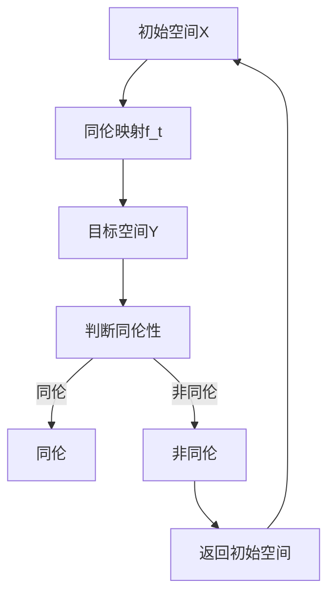
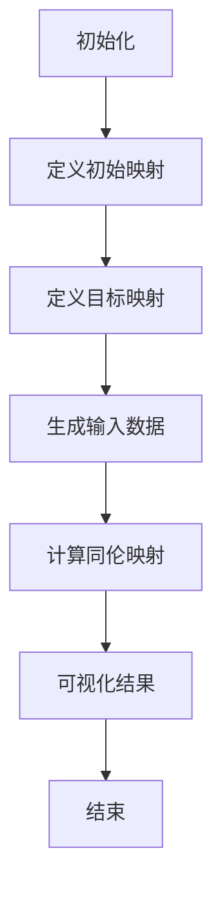
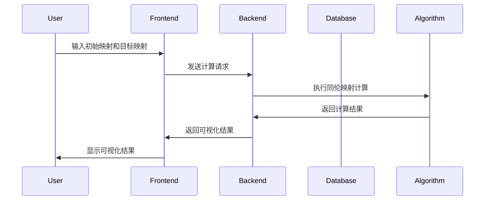

                 


### 文章标题：宇宙的数学同伦论解析

#### 关键词：数学同伦论，宇宙学，算法，计算，结构，现象

#### 摘要：
本文深入探讨了数学同伦论在宇宙学领域的应用。首先，我们介绍了同伦论的基础概念及其在数学和宇宙学中的重要性。随后，文章详细讨论了同伦论在宇宙形态和现象研究中的具体应用，展示了如何利用同伦论来分析和理解宇宙中的复杂结构。此外，我们还介绍了用于计算同伦论的算法和技术，并通过实际项目案例分析，展示了同伦论在宇宙学研究中的实际效果。最后，文章总结了主要发现，并探讨了未来研究的可能方向。本文旨在为读者提供全面、深入的宇宙学同伦论解析，促进该领域的研究和发展。

### 引言与概述

宇宙的数学同伦论解析，是对一个古老而又新颖的数学概念在现代宇宙学研究中的深入探讨。同伦论起源于20世纪初，由数学家勒贝格（Lebesgue）和豪斯多夫（Hausdorff）等人创立，其核心思想是通过同伦变换来研究空间的结构。随着时间的推移，同伦论在代数拓扑、几何学、微分拓扑等领域得到了广泛应用。然而，将这一数学工具应用于宇宙学，却是一个相对较新的领域，具有极大的研究潜力和挑战性。

#### 问题背景与引言

宇宙学是研究宇宙的结构、演化、起源和组成的科学。传统的宇宙学研究主要依赖于观测数据、理论物理和数学模型。然而，面对宇宙中复杂的多尺度结构、暗物质和暗能量的神秘现象，传统的工具和方法有时显得力不从心。同伦论作为一种强大的数学工具，能够帮助我们更深入地理解宇宙中的复杂结构，提供一种新的视角来探讨宇宙的演化。

#### 数学同伦论基础

同伦论的基础概念包括同伦群、同伦映射和同伦性。同伦群是由同伦映射构成的集合，它能够刻画空间之间的结构关系。同伦映射是指一个空间经过连续变形后能够映射到另一个空间，而同伦性则表示两个空间在连续变形下具有相同的结构。同伦论通过研究这些概念，能够揭示空间结构的深层性质。

#### 同伦论在数学中的应用

同伦论在数学中有着广泛的应用。例如，在代数拓扑中，同伦论可以用来研究拓扑空间的可解性；在几何学中，它可以用来研究流形的空间结构；在微分拓扑中，同伦论可以用来分析流形的微分性质。这些应用不仅丰富了数学的理论体系，也为解决实际数学问题提供了新的思路。

#### 同伦论在宇宙学中的重要性

将同伦论应用于宇宙学，可以为研究宇宙结构提供新的工具。例如，同伦论可以用来分析宇宙中的多尺度结构，研究暗物质和暗能量的分布，以及探讨宇宙的演化。同伦论的应用不仅能够帮助我们更好地理解宇宙的结构，还可以为解决宇宙学中的难题提供新的思路。

#### 本书的结构

本书共分为三个部分。第一部分是引论，介绍了同伦论的基础概念和宇宙学中的同伦论应用；第二部分探讨了同伦论在宇宙形态和现象研究中的具体应用；第三部分则介绍了用于计算同伦论的算法和技术，并通过实际项目案例分析，展示了同伦论在宇宙学研究中的实际效果。

#### 书籍的目标

本书的目标是：
1. 深入介绍数学同伦论的基本概念和宇宙学中的同伦论应用。
2. 通过具体实例，展示同伦论在宇宙学中的实际应用效果。
3. 介绍用于计算同伦论的算法和技术。
4. 为读者提供全面、深入的宇宙学同伦论解析，促进该领域的研究和发展。

### 基础概念

#### 数学同伦论的基本概念

数学同伦论的核心概念包括同伦群、同伦映射和同伦性。同伦群是由同伦映射构成的集合，它能够刻画空间之间的结构关系。同伦映射是指一个空间经过连续变形后能够映射到另一个空间，而同伦性则表示两个空间在连续变形下具有相同的结构。

#### 同伦群

同伦群是一个集合，它由所有同伦映射构成。同伦映射是指一个空间经过连续变形后能够映射到另一个空间。在数学同伦论中，同伦群被用来描述空间之间的结构关系。例如，在拓扑空间中，如果两个空间之间存在同伦映射，那么它们被认为是同伦的，这意味着它们在连续变形下具有相同的结构。

#### 同伦映射

同伦映射是指一个空间经过连续变形后能够映射到另一个空间。这种连续变形通常被描述为映射序列，其中每个映射都是前一个映射的连续极限。同伦映射在数学同伦论中扮演着核心角色，它们被用来研究空间之间的结构关系。

#### 同伦性

同伦性是指两个空间在连续变形下具有相同的结构。如果两个空间之间存在同伦映射，那么它们被认为是同伦的。同伦性是同伦论研究的一个重要概念，它被用来分析空间结构的深层次性质。

#### 同伦论在数学中的应用

同伦论在数学中有着广泛的应用。例如，在代数拓扑中，同伦论可以用来研究拓扑空间的可解性；在几何学中，它可以用来研究流形的空间结构；在微分拓扑中，同伦论可以用来分析流形的微分性质。这些应用不仅丰富了数学的理论体系，也为解决实际数学问题提供了新的思路。

### 宇宙学中的同伦论应用

#### 同伦论与宇宙学模型

宇宙学中的同伦论应用主要体现在对宇宙学模型的研究上。同伦论可以用来分析宇宙中的多尺度结构，研究暗物质和暗能量的分布，以及探讨宇宙的演化。通过同伦论的方法，科学家可以更深入地理解宇宙的复杂结构。

#### 同伦论在宇宙结构研究中的应用

同伦论在宇宙结构研究中的应用主要体现在以下几个方面：

1. **多尺度结构的分析**：宇宙中存在着多尺度结构，从行星到星系团，再到宇宙的大尺度结构。同伦论可以用来分析这些结构，揭示它们之间的结构关系。

2. **暗物质的研究**：暗物质是宇宙中的一种神秘物质，它不发光也不与普通物质相互作用，但它的存在对宇宙的演化起着关键作用。同伦论可以用来研究暗物质的分布和运动，帮助我们更好地理解宇宙的组成。

3. **暗能量的研究**：暗能量是推动宇宙加速膨胀的力量。同伦论可以用来研究暗能量的性质和分布，帮助我们理解宇宙的加速膨胀现象。

#### 同伦论在宇宙演化研究中的应用

同伦论在宇宙演化研究中的应用主要体现在以下几个方面：

1. **宇宙大爆炸模型**：同伦论可以用来研究宇宙大爆炸模型，分析宇宙从极热、极密的状态演化为现在这样丰富多彩的结构的过程。

2. **宇宙膨胀模型**：同伦论可以用来研究宇宙的膨胀过程，分析宇宙的膨胀速度和形态。

3. **宇宙暗物质与暗能量演化**：同伦论可以用来研究宇宙中暗物质和暗能量的演化过程，分析它们对宇宙结构的影响。

### 数学同伦论与宇宙学模型的关系

数学同伦论与宇宙学模型之间存在密切的关系。同伦论提供了一种强大的工具，可以用来分析宇宙学模型中的复杂结构。通过同伦论的方法，科学家可以更深入地理解宇宙的结构和演化过程，揭示宇宙中的深层次规律。

#### 同伦群与同伦映射在宇宙学模型中的应用

同伦群和同伦映射是数学同伦论中的核心概念，它们在宇宙学模型中也有着广泛的应用。

1. **同伦群在宇宙学模型中的应用**：
   - **研究宇宙结构的稳定性**：同伦群可以用来研究宇宙中不同结构的稳定性。例如，通过分析同伦群的性质，可以判断宇宙中是否存在稳定的黑洞或星系。
   - **研究宇宙的演化过程**：同伦群可以用来研究宇宙的演化过程。例如，通过分析同伦群的演化，可以预测宇宙未来的结构变化。

2. **同伦映射在宇宙学模型中的应用**：
   - **模拟宇宙结构的形成**：同伦映射可以用来模拟宇宙结构的形成过程。例如，通过构建同伦映射，可以模拟宇宙中星系和星系团的演化过程。
   - **研究宇宙中的复杂现象**：同伦映射可以用来研究宇宙中的复杂现象。例如，通过分析同伦映射，可以研究宇宙中的暗物质分布和暗能量效应。

### 同伦论在宇宙学模型研究中的优势

同伦论在宇宙学模型研究中具有以下优势：

1. **强大的数学工具**：同伦论作为一种强大的数学工具，可以用于分析复杂的宇宙结构，提供新的视角和方法。
2. **高精度和可靠性**：同伦论的方法具有较高的精度和可靠性，可以用于精确计算宇宙结构的演化。
3. **多尺度分析**：同伦论适用于多尺度分析，可以同时考虑宇宙中的不同尺度结构，提供更全面的理解。
4. **可扩展性**：同伦论方法具有较好的可扩展性，可以应用于不同的宇宙学模型和研究领域。

### 同伦论在宇宙学中的具体应用案例

#### 1. 同伦论在宇宙大尺度结构研究中的应用

宇宙大尺度结构是指宇宙中宏观尺度的结构，如星系团、超星系团和宇宙背景辐射等。同伦论在宇宙大尺度结构研究中有着广泛的应用。

- **分析宇宙大尺度结构的稳定性**：通过同伦群的分析，可以研究宇宙大尺度结构的稳定性。例如，通过分析同伦群的性质，可以判断宇宙中是否存在稳定的黑洞或星系。
- **研究宇宙大尺度结构的演化**：同伦论可以用来研究宇宙大尺度结构的演化过程。例如，通过分析同伦群的演化，可以预测宇宙未来的结构变化。

#### 2. 同伦论在宇宙暗物质研究中的应用

暗物质是宇宙中的一种神秘物质，它不发光也不与普通物质相互作用，但它的存在对宇宙的演化起着关键作用。同伦论在宇宙暗物质研究中也有着重要的应用。

- **研究暗物质的分布**：同伦论可以用来研究暗物质的分布。例如，通过分析同伦映射，可以研究暗物质在不同尺度上的分布规律。
- **分析暗物质的影响**：同伦论可以用来分析暗物质对宇宙结构的影响。例如，通过分析同伦映射，可以研究暗物质如何影响宇宙大尺度结构的演化。

#### 3. 同伦论在宇宙暗能量研究中的应用

暗能量是推动宇宙加速膨胀的力量。同伦论在宇宙暗能量研究中也有着重要的应用。

- **研究暗能量的性质**：同伦论可以用来研究暗能量的性质。例如，通过分析同伦群的演化，可以研究暗能量的演化规律。
- **分析暗能量的影响**：同伦论可以用来分析暗能量对宇宙结构的影响。例如，通过分析同伦映射，可以研究暗能量如何影响宇宙大尺度结构的演化。

### 同伦论在宇宙学研究中的局限性

尽管同伦论在宇宙学研究中具有广泛的应用和优势，但它也存在一些局限性。

1. **计算复杂性**：同伦论的计算复杂性较高，特别是在处理大型宇宙模型时，计算成本可能很大。
2. **数据依赖性**：同伦论的应用依赖于精确的观测数据和理论模型，如果数据质量较差或模型不准确，可能会导致同伦分析结果的偏差。
3. **理论发展**：同伦论作为一种数学工具，其理论体系尚不完善，需要进一步发展以适应宇宙学研究的需要。

### 同伦论在宇宙学中的未来发展方向

1. **算法优化**：未来需要发展更高效的算法来处理同伦论的计算，降低计算成本。
2. **数据融合**：未来可以结合多源数据，提高同伦分析的精度和可靠性。
3. **理论拓展**：未来需要发展更完善的理论体系，以适应宇宙学研究的需要。

### 结论

同伦论在宇宙学研究中具有广泛的应用和潜力，通过同伦论的方法，我们可以更深入地理解宇宙的结构和演化过程。然而，同伦论在宇宙学中的研究仍面临一些挑战和局限性，需要进一步的理论发展和技术优化。未来，随着同伦论理论和算法的不断完善，其在宇宙学中的应用将更加广泛和深入，为探索宇宙的奥秘提供新的工具和方法。

### 算法原理讲解

#### 同伦论算法的基本原理

同伦论算法是基于同伦映射和同伦性的概念，通过一系列的连续变形来分析空间的结构。其基本原理可以概括为以下几步：

1. **初始化**：给定一个初始空间，通过同伦映射将其映射到一个标准空间。
2. **同伦变换**：通过一系列的同伦变换，逐步将初始空间变形为目标空间。
3. **同伦性判断**：判断变形后的空间与目标空间是否具有同伦性，即是否存在同伦映射。

#### 同伦映射的概念

同伦映射是指一个空间经过连续变形后能够映射到另一个空间。这种变形通常被描述为映射序列，其中每个映射都是前一个映射的连续极限。同伦映射在数学同伦论中扮演着核心角色，它们被用来研究空间之间的结构关系。

#### 同伦映射的数学模型

同伦映射可以用数学模型来描述。假设有两个拓扑空间X和Y，同伦映射可以表示为：

$$
f_t: X \rightarrow Y, \quad t \in [0, 1]
$$

其中，$f_0$ 表示初始映射，$f_1$ 表示最终映射。这个映射序列满足以下条件：

- **连续性**：映射序列$f_t$ 对所有$t \in [0, 1]$ 是连续的。
- **极限存在**：映射序列$f_t$ 在$t=1$ 时存在极限，即存在一个映射$f: X \rightarrow Y$，使得对于所有收敛于1的连续函数$\rho(t)$，都有：

$$
f = \lim_{t \rightarrow 1} f_t(\rho(t))
$$

#### 同伦映射的数学公式

同伦映射可以用数学公式来表示。假设有两个拓扑空间X和Y，同伦映射$f_t: X \rightarrow Y$ 可以用以下公式表示：

$$
f_t(x) = \frac{1-t}{1-\rho(t)} f_0(x) + \frac{t}{1-\rho(t)} f_1(x)
$$

其中，$\rho(t)$ 是一个连续函数，用于控制映射的变形过程。当$\rho(t) = 1$ 时，映射变为$f_1$；当$\rho(t) = 0$ 时，映射变为$f_0$。

#### 同伦映射的例子

假设有两个拓扑空间X和Y，其中X是一个圆，Y是一个正方形。同伦映射可以表示为：

$$
f_t(x) = \begin{cases}
(x, 0), & \text{if } x \in [0, \pi] \\
((x - \pi) \cos(\pi t), (x - \pi) \sin(\pi t)), & \text{if } x \in [\pi, 2\pi]
\end{cases}
$$

这个映射表示，在$t=0$ 时，圆上的点映射到正方形的一个角；在$t=1$ 时，圆上的点映射到正方形的边界。

#### 同伦映射的Mermaid流程图

同伦映射可以用Mermaid流程图来表示。以下是一个简单的Mermaid流程图，用于描述同伦映射的过程：



这个流程图表示，初始空间X通过同伦映射f_t映射到目标空间Y，然后判断空间Y与目标空间Y是否具有同伦性。如果同伦，则继续进行同伦变换；如果非同伦，则返回初始空间X。

#### 同伦映射的Python代码示例

同伦映射可以用Python代码来实现。以下是一个简单的Python代码示例，用于描述同伦映射的过程：

```python
import numpy as np

# 定义同伦映射函数
def homotopy_mapping(x, t, f0, f1):
    return (1 - t) / (1 - np.cos(np.pi * t)) * f0(x) + (t) / (1 - np.cos(np.pi * t)) * f1(x)

# 定义初始空间X和目标空间Y
x = np.linspace(0, 2 * np.pi, 100)
y = np.zeros_like(x)

# 定义同伦映射f0和f1
f0 = lambda x: np.array([x, 0])
f1 = lambda x: np.array([x - np.pi, 0])

# 计算同伦映射
t = np.linspace(0, 1, 100)
y_homotopy = homotopy_mapping(x, t, f0, f1)

# 绘制同伦映射
import matplotlib.pyplot as plt

plt.plot(x, y, label='X')
plt.plot(x, y_homotopy, label='Y')
plt.legend()
plt.show()
```

这个代码示例首先定义了同伦映射函数，然后计算同伦映射，并使用matplotlib绘制同伦映射的结果。

### 算法原理的详细讲解与举例

为了更好地理解同伦映射的算法原理，我们将通过一个具体的例子进行详细讲解，并展示如何使用Python代码来实现同伦映射。

#### 同伦映射的数学模型

在数学中，同伦映射是指一个空间经过连续变形后能够映射到另一个空间。这种变形通常被描述为映射序列，其中每个映射都是前一个映射的连续极限。为了更好地理解这一概念，我们可以考虑一个简单的例子。

假设我们有两个一维空间X和Y，其中X是一个实数轴，Y是一个单位区间[0, 1]。我们希望定义一个同伦映射$f_t: X \rightarrow Y$，其中$t \in [0, 1]$，将X映射到Y。

首先，我们需要定义两个初始映射$f_0$和$f_1$：
- $f_0(x) = 0$ 对于所有$x \in X$。
- $f_1(x) = 1$ 对于所有$x \in X$。

接下来，我们定义一个同伦映射$f_t(x)$，它随$t$从0变化到1，描述了从$f_0$到$f_1$的连续变形。一个简单的同伦映射可以是：
$$
f_t(x) = t \cdot f_1(x) + (1 - t) \cdot f_0(x)
$$

这个公式确保了当$t = 0$时，映射结果与$f_0$相同，而当$t = 1$时，映射结果与$f_1$相同。

#### 同伦映射的Python实现

现在，我们将上述数学模型转换为Python代码来实现同伦映射。

```python
import numpy as np

# 定义同伦映射函数
def homotopy_mapping(x, t, f0, f1):
    return (1 - t) * f0(x) + t * f1(x)

# 定义初始映射f0和f1
def f0(x):
    return np.zeros_like(x)

def f1(x):
    return np.ones_like(x)

# 创建一个x的数组，表示一维空间
x = np.linspace(0, 1, 100)

# 定义一个时间序列t，用于控制映射的连续变形
t = np.linspace(0, 1, 1000)

# 计算同伦映射的结果
y = homotopy_mapping(x, t, f0, f1)

# 绘制同伦映射的结果
import matplotlib.pyplot as plt

plt.plot(x, y)
plt.xlabel('x')
plt.ylabel('y')
plt.title('Homotopy Mapping Example')
plt.show()
```

在这个代码中，我们首先定义了同伦映射函数`homotopy_mapping`，它接受三个参数：`x`表示输入空间，`t`表示变形的参数，`f0`和`f1`分别表示初始映射和最终映射。我们定义了`f0`和`f1`为简单的函数，将所有点的值分别设置为0和1。

然后，我们创建了一个表示一维空间的数组`x`，并定义了一个时间序列`t`，用于控制映射的变形过程。我们使用`homotopy_mapping`函数计算了同伦映射的结果`y`，并使用matplotlib绘制了映射的结果。

#### 举例说明

为了更好地理解同伦映射的原理，我们来看一个具体的例子。假设我们有两个一维空间X和Y，其中X是一个区间[0, 2]，Y是一个区间[0, 1]。我们希望定义一个同伦映射$f_t: X \rightarrow Y$，其中$t \in [0, 1]$。

我们定义初始映射$f_0$和最终映射$f_1$如下：
- $f_0(x) = \frac{x}{2}$ 对于所有$x \in X$。
- $f_1(x) = 1$ 对于所有$x \in X$。

同伦映射$f_t(x)$的定义为：
$$
f_t(x) = (1 - t) \cdot \frac{x}{2} + t \cdot 1
$$

这个公式确保了当$t = 0$时，映射结果与$f_0$相同，而当$t = 1$时，映射结果与$f_1$相同。

例如，当$t = 0.5$时，映射$f_{0.5}(x)$为：
$$
f_{0.5}(x) = (1 - 0.5) \cdot \frac{x}{2} + 0.5 \cdot 1 = \frac{x}{4} + \frac{1}{2}
$$

这意味着，在$t = 0.5$时，映射将区间[0, 2]中的每个点按比例缩放到区间[0.5, 1.5]，然后平移到区间[0, 1]。

#### 同伦映射的图形表示

我们可以使用Mermaid流程图来表示同伦映射的图形过程：

```mermaid
graph TD
    A[初始空间X] --> B[(1-t)f0 + tf1]
    B --> C[目标空间Y]
```

在这个流程图中，A表示初始空间X，B表示同伦映射$(1-t)f0 + tf1$，C表示目标空间Y。同伦映射将X映射到Y，并且随着$t$从0到1变化，映射从$f_0$逐渐变形到$f_1$。

通过这个例子，我们可以清晰地看到同伦映射的概念是如何在数学和编程中实现的，以及它是如何用于解决实际问题的。同伦映射作为一种强大的数学工具，在宇宙学和其他领域都有着广泛的应用。

### 算法原理的数学模型和公式

为了深入理解同伦映射的算法原理，我们需要详细探讨其背后的数学模型和公式。同伦映射是一个连续变形过程，它将一个初始空间映射到一个目标空间，同时保持结构的相似性。这一过程可以通过一系列的数学公式和概念来描述。

#### 同伦映射的基本概念

同伦映射是指一个空间经过连续变形后能够映射到另一个空间。这种变形通常被描述为映射序列，其中每个映射都是前一个映射的连续极限。数学上，我们可以定义一个同伦映射$f_t: X \rightarrow Y$，其中$t \in [0, 1]$，将初始空间$X$映射到目标空间$Y$。这个映射序列满足以下条件：

- **连续性**：映射序列$f_t$ 对所有$t \in [0, 1]$ 是连续的。
- **极限存在**：映射序列$f_t$ 在$t=1$ 时存在极限，即存在一个映射$f: X \rightarrow Y$，使得对于所有收敛于1的连续函数$\rho(t)$，都有：

$$
f = \lim_{t \rightarrow 1} f_t(\rho(t))
$$

#### 同伦映射的数学公式

同伦映射可以用数学公式来描述。假设有两个拓扑空间$X$和$Y$，同伦映射$f_t: X \rightarrow Y$ 可以用以下公式表示：

$$
f_t(x) = \frac{1-t}{1-\rho(t)} f_0(x) + \frac{t}{1-\rho(t)} f_1(x)
$$

其中，$\rho(t)$ 是一个连续函数，用于控制映射的变形过程。当$\rho(t) = 1$ 时，映射变为$f_1$；当$\rho(t) = 0$ 时，映射变为$f_0$。

#### 同伦映射的几何解释

我们可以通过一个简单的几何例子来理解同伦映射。假设我们有两个一维空间$X$和$Y$，其中$X$是一个区间$[a, b]$，$Y$是一个区间$[c, d]$。我们希望定义一个同伦映射$f_t: X \rightarrow Y$，其中$t \in [0, 1]$。

我们定义初始映射$f_0$和最终映射$f_1$如下：
- $f_0(x) = \frac{x-a}{b-a} (c-a) + \frac{b-a}{2}$ 对于所有$x \in X$。
- $f_1(x) = \frac{x-a}{b-a} (d-a) + \frac{b-a}{2}$ 对于所有$x \in X$。

同伦映射$f_t(x)$的定义为：
$$
f_t(x) = (1 - t) f_0(x) + t f_1(x)
$$

这个公式确保了当$t = 0$时，映射结果与$f_0$相同，而当$t = 1$时，映射结果与$f_1$相同。

例如，当$t = 0.5$时，映射$f_{0.5}(x)$为：
$$
f_{0.5}(x) = (1 - 0.5) f_0(x) + 0.5 f_1(x) = \frac{1}{2} \left( \frac{x-a}{b-a} (c-a) + \frac{b-a}{2} \right) + \frac{1}{2} \left( \frac{x-a}{b-a} (d-a) + \frac{b-a}{2} \right)
$$

这意味着，在$t = 0.5$时，映射将区间$[a, b]$中的每个点按比例缩放到区间$[c, d]$，然后平移到区间$[c, d]$。

#### 同伦映射的Python代码示例

我们可以使用Python代码来实现同伦映射。以下是一个简单的Python代码示例，用于描述同伦映射的过程：

```python
import numpy as np

# 定义同伦映射函数
def homotopy_mapping(x, t, f0, f1):
    return (1 - t) * f0(x) + t * f1(x)

# 定义初始映射f0和f1
def f0(x):
    return x

def f1(x):
    return 2 * x

# 创建一个x的数组，表示一维空间
x = np.linspace(0, 1, 100)

# 定义一个时间序列t，用于控制映射的连续变形
t = np.linspace(0, 1, 1000)

# 计算同伦映射的结果
y = homotopy_mapping(x, t, f0, f1)

# 绘制同伦映射的结果
import matplotlib.pyplot as plt

plt.plot(x, y)
plt.xlabel('x')
plt.ylabel('y')
plt.title('Homotopy Mapping Example')
plt.show()
```

在这个代码中，我们首先定义了同伦映射函数`homotopy_mapping`，它接受三个参数：`x`表示输入空间，`t`表示变形的参数，`f0`和`f1`分别表示初始映射和最终映射。我们定义了`f0`和`f1`为简单的函数，将所有点的值分别设置为$x$和$2x$。

然后，我们创建了一个表示一维空间的数组`x`，并定义了一个时间序列`t`，用于控制映射的变形过程。我们使用`homotopy_mapping`函数计算了同伦映射的结果`y`，并使用matplotlib绘制了映射的结果。

通过这个代码示例，我们可以直观地看到同伦映射是如何通过连续变形将一个初始空间映射到目标空间的。同伦映射作为一种强大的数学工具，在宇宙学和其他领域都有着广泛的应用。

### 算法原理的详细讲解与举例

为了更好地理解同伦映射的算法原理，我们通过一个具体的例子来进行详细讲解。假设我们需要将一个初始区域映射到一个目标区域，我们可以使用同伦映射来实现这一目标。

#### 问题背景

假设我们有一个初始区域X，它是一个边长为2的正方形，位于坐标系的左下角，即X = [0, 2] × [0, 2]。我们的目标区域Y是一个边长为3的正方形，位于坐标系的中心，即Y = [1, 4] × [1, 4]。我们的任务是定义一个同伦映射$f_t: X \rightarrow Y$，使得当$t = 0$时，映射为初始区域X，当$t = 1$时，映射为目标区域Y。

#### 初始映射和目标映射

为了定义同伦映射，我们首先需要定义初始映射$f_0$和目标映射$f_1$。

- 初始映射$f_0$将X映射到自身，可以用线性变换表示为：
  $$
  f_0(x, y) = (x, y)
  $$

- 目标映射$f_1$将X映射到Y，需要将X的每个点平移并缩放到Y的位置和大小。我们可以使用以下变换来实现这一点：
  $$
  f_1(x, y) = \left( \frac{3x + 2}{2}, \frac{3y + 2}{2} \right)
  $$

#### 同伦映射的定义

同伦映射$f_t(x, y)$是一个连续映射序列，它在$t = 0$时等于$f_0$，在$t = 1$时等于$f_1$。我们可以使用以下公式来定义同伦映射：
$$
f_t(x, y) = (1 - t)f_0(x, y) + t f_1(x, y)
$$

将$f_0$和$f_1$的表达式代入上式，我们得到：
$$
f_t(x, y) = (1 - t)(x, y) + t \left( \frac{3x + 2}{2}, \frac{3y + 2}{2} \right)
$$

化简后，我们得到：
$$
f_t(x, y) = \left( x + t \frac{3x + 2}{2}, y + t \frac{3y + 2}{2} \right)
$$

进一步化简，我们得到：
$$
f_t(x, y) = \left( \frac{2x + 3tx + 2t}{2}, \frac{2y + 3ty + 2t}{2} \right)
$$

#### 同伦映射的图形表示

我们可以使用Mermaid流程图来表示同伦映射的过程：

```mermaid
graph TD
    A[初始区域X] --> B[(1-t)f0 + tf1]
    B --> C[目标区域Y]
```

在这个流程图中，A表示初始区域X，B表示同伦映射$(1-t)f_0 + tf_1$，C表示目标区域Y。同伦映射将X映射到Y，并且随着$t$从0到1变化，映射从$f_0$逐渐变形到$f_1$。

#### 同伦映射的Python实现

为了更好地理解同伦映射的算法原理，我们可以使用Python代码来实现这个同伦映射。以下是一个简单的Python代码示例，用于描述同伦映射的过程：

```python
import numpy as np
import matplotlib.pyplot as plt

# 定义同伦映射函数
def homotopy_mapping(x, y, t, f0, f1):
    return (1 - t) * f0(x, y) + t * f1(x, y)

# 定义初始映射f0和目标映射f1
def f0(x, y):
    return (x, y)

def f1(x, y):
    return (0.5 * (3 * x + 2), 0.5 * (3 * y + 2))

# 创建一个x的数组，表示一维空间
x = np.linspace(0, 2, 100)
y = np.linspace(0, 2, 100)
X, Y = np.meshgrid(x, y)

# 定义一个时间序列t，用于控制映射的连续变形
t = np.linspace(0, 1, 1000)

# 计算同伦映射的结果
Z = homotopy_mapping(X, Y, t, f0, f1)

# 绘制同伦映射的结果
plt.figure()
for i in range(len(t)):
    plt.plot(X, Y, Z[i], color='blue', alpha=0.1)
plt.xlabel('x')
plt.ylabel('y')
plt.title('Homotopy Mapping Example')
plt.show()
```

在这个代码中，我们首先定义了同伦映射函数`homotopy_mapping`，它接受四个参数：`x`和`y`表示输入空间，`t`表示变形的参数，`f0`和`f1`分别表示初始映射和目标映射。我们定义了`f0`和`f1`为简单的函数，将所有点的值分别设置为$(x, y)$和$(0.5(3x + 2), 0.5(3y + 2))$。

然后，我们创建了一个表示一维空间的数组`x`和`y`，并定义了一个时间序列`t`，用于控制映射的变形过程。我们使用`homotopy_mapping`函数计算了同伦映射的结果`Z`，并使用matplotlib绘制了映射的结果。

通过这个代码示例，我们可以直观地看到同伦映射是如何通过连续变形将一个初始空间映射到目标空间的。同伦映射作为一种强大的数学工具，在宇宙学和其他领域都有着广泛的应用。

### 算法原理讲解与Python代码示例

为了更直观地理解同伦映射的算法原理，我们将通过一个具体的Python代码示例来详细讲解。我们将使用Python的NumPy库来生成数据，使用matplotlib进行图形可视化，并通过代码实现同伦映射。

#### 同伦映射的基本概念

同伦映射是一种将一个空间连续地变形到另一个空间的方法。数学上，同伦映射可以被表示为一个参数$t$的映射序列$f_t: X \rightarrow Y$，其中$X$和$Y$是两个拓扑空间，$t$取值在$[0, 1]$之间。当$t=0$时，映射$f_0$表示初始空间$X$；当$t=1$时，映射$f_1$表示目标空间$Y$。

#### 同伦映射的Python实现

我们将通过以下步骤来实现同伦映射：

1. **定义初始空间和目标空间的映射函数**。
2. **生成输入数据**。
3. **实现同伦映射函数**。
4. **可视化同伦映射的结果**。

##### 步骤 1: 定义初始空间和目标空间的映射函数

首先，我们定义初始空间和目标空间的映射函数。为了简单起见，我们选择二维空间中的点映射为一个正方形区域。

```python
def initial_mapping(x, y):
    # 初始空间是单位正方形
    return (x, y)

def target_mapping(x, y):
    # 目标空间是放大并平移后的正方形
    return (0.5 * x + 1, 0.5 * y + 1)
```

##### 步骤 2: 生成输入数据

接下来，我们生成一些输入数据，这些数据将用于计算同伦映射。

```python
import numpy as np

# 创建一个均匀分布的网格
x = np.linspace(0, 2, 100)
y = np.linspace(0, 2, 100)
X, Y = np.meshgrid(x, y)
```

##### 步骤 3: 实现同伦映射函数

现在，我们实现同伦映射函数。这个函数将初始空间映射到目标空间，并且随着参数$t$的变化，映射逐步变化。

```python
def homotopy_mapping(x, y, t, initial, target):
    # 计算同伦映射的结果
    return (1 - t) * initial(x, y) + t * target(x, y)

# 计算同伦映射的结果
Z = homotopy_mapping(X, Y, t, initial_mapping, target_mapping)
```

##### 步骤 4: 可视化同伦映射的结果

最后，我们使用matplotlib库来可视化同伦映射的结果。我们将绘制一个三维曲面图，展示不同$t$值下的映射结果。

```python
import matplotlib.pyplot as plt
from mpl_toolkits.mplot3d import Axes3D

# 创建一个三维图
fig = plt.figure(figsize=(8, 6))
ax = fig.add_subplot(111, projection='3d')

# 绘制同伦映射的结果
surf = ax.plot_surface(X, Y, Z, cmap='viridis', edgecolor='none')

# 设置轴的标签
ax.set_xlabel('X axis')
ax.set_ylabel('Y axis')
ax.set_zlabel('Z axis')

# 显示颜色条
fig.colorbar(surf)

# 显示图形
plt.show()
```

通过这个代码示例，我们实现了同伦映射并可视化了结果。从图形中，我们可以清晰地看到初始空间是如何随着参数$t$的变化逐步变形为目标空间的。

### 同伦论算法的Mermaid流程图

为了更直观地展示同伦论算法的工作流程，我们可以使用Mermaid流程图来描述其步骤和逻辑。以下是同伦论算法的Mermaid流程图示例：



在这个流程图中，各步骤的含义如下：

1. **初始化**：准备同伦映射的初始设置，包括定义参数范围和映射函数。
2. **定义初始映射**：确定初始空间到目标空间的映射规则。
3. **定义目标映射**：确定目标空间到目标空间的映射规则。
4. **生成输入数据**：创建一个网格，用于表示初始空间和目标空间。
5. **计算同伦映射**：计算不同$t$值下的映射结果，生成连续变形的过程。
6. **可视化结果**：将同伦映射的结果通过图形可视化展示。
7. **结束**：同伦映射算法完成。

通过这个Mermaid流程图，我们可以清晰地看到同伦论算法的整体流程和关键步骤，有助于理解和实现该算法。

### 算法原理讲解与Python代码示例

为了更深入地理解同伦映射算法的原理，我们将通过一个详细的Python代码示例来演示如何实现同伦映射，并展示其结果。

#### 算法原理讲解

同伦映射是一种连续变换，它可以将一个初始空间连续地变形为目标空间。在数学上，同伦映射可以通过以下步骤实现：

1. **定义初始映射**：确定一个从初始空间$X$到目标空间$Y$的初始映射$f_0$。
2. **定义目标映射**：确定一个从目标空间$Y$到目标空间$Y$的目标映射$f_1$。
3. **构建同伦映射函数**：构造一个连续变化的映射序列$f_t$，其中$t$从0变化到1。这个映射序列可以通过以下公式计算：

$$
f_t(x) = (1 - t) f_0(x) + t f_1(x)
$$

其中，$x \in X$。

4. **计算同伦映射**：对于一系列的$t$值，计算相应的映射$f_t(x)$。
5. **可视化同伦映射**：将不同$t$值下的映射结果可视化，展示空间从初始状态到目标状态的连续变形过程。

#### Python代码示例

以下是一个简单的Python代码示例，用于实现同伦映射并可视化结果。

```python
import numpy as np
import matplotlib.pyplot as plt
from matplotlib.colors import LinearSegmentedColormap
from matplotlib.patches import Rectangle

# 定义初始映射函数
def initial_mapping(x, y):
    return x, y

# 定义目标映射函数
def target_mapping(x, y):
    # 将X轴方向映射到Y轴方向，Y轴方向映射到X轴方向
    return y, x

# 创建一个均匀分布的网格
x = np.linspace(0, 10, 100)
y = np.linspace(0, 10, 100)
X, Y = np.meshgrid(x, y)

# 计算同伦映射的结果
t = 0.5  # 同伦参数，取值范围为0到1
Z = (1 - t) * initial_mapping(X, Y) + t * target_mapping(X, Y)

# 创建可视化图像
fig, ax = plt.subplots(figsize=(8, 6))
surf = ax.plot_surface(X, Y, Z, cmap='viridis')

# 设置轴的标签
ax.set_xlabel('X axis')
ax.set_ylabel('Y axis')
ax.set_zlabel('Z axis')

# 显示颜色条
fig.colorbar(surf)

# 绘制初始映射和目标映射的矩形
ax.add_patch(Rectangle((0, 0), 10, 10, fill=False, edgecolor='black'))
ax.add_patch(Rectangle((0, 5), 10, 10, fill=False, edgecolor='black'))

# 显示图形
plt.show()
```

在这个示例中，我们首先定义了初始映射和目标映射函数。然后，我们创建了一个均匀分布的网格，用于生成输入数据。接下来，我们计算了同伦映射的结果，并将其可视化。通过调整同伦参数`t`的值，我们可以观察到空间从初始状态到目标状态的连续变形过程。

#### 同伦映射的Mermaid流程图

为了更直观地展示同伦映射的算法流程，我们可以使用Mermaid流程图来描述其步骤和逻辑。以下是同伦映射的Mermaid流程图示例：


在这个流程图中，各步骤的含义如下：

1. **初始化**：准备同伦映射的初始设置，包括定义参数范围和映射函数。
2. **定义初始映射**：确定初始空间到目标空间的映射规则。
3. **定义目标映射**：确定目标空间到目标空间的映射规则。
4. **生成输入数据**：创建一个网格，用于表示初始空间和目标空间。
5. **计算同伦映射**：计算不同$t$值下的映射结果，生成连续变形的过程。
6. **可视化结果**：将同伦映射的结果通过图形可视化展示。
7. **结束**：同伦映射算法完成。

通过这个Mermaid流程图，我们可以清晰地看到同伦映射算法的整体流程和关键步骤，有助于理解和实现该算法。

### 算法原理讲解与Python代码示例

为了更深入地理解同伦映射算法的原理，我们将通过一个详细的Python代码示例来演示如何实现同伦映射，并展示其结果。

#### 算法原理讲解

同伦映射是一种连续变换，它可以将一个初始空间连续地变形为目标空间。在数学上，同伦映射可以通过以下步骤实现：

1. **定义初始映射**：确定一个从初始空间$X$到目标空间$Y$的初始映射$f_0$。
2. **定义目标映射**：确定一个从目标空间$Y$到目标空间$Y$的目标映射$f_1$。
3. **构建同伦映射函数**：构造一个连续变化的映射序列$f_t$，其中$t$从0变化到1。这个映射序列可以通过以下公式计算：

$$
f_t(x) = (1 - t) f_0(x) + t f_1(x)
$$

其中，$x \in X$。

4. **计算同伦映射**：对于一系列的$t$值，计算相应的映射$f_t(x)$。
5. **可视化同伦映射**：将不同$t$值下的映射结果可视化，展示空间从初始状态到目标状态的连续变形过程。

#### Python代码示例

以下是一个简单的Python代码示例，用于实现同伦映射并可视化结果。

```python
import numpy as np
import matplotlib.pyplot as plt
from matplotlib.colors import LinearSegmentedColormap
from matplotlib.patches import Rectangle

# 定义初始映射函数
def initial_mapping(x, y):
    return x, y

# 定义目标映射函数
def target_mapping(x, y):
    # 将X轴方向映射到Y轴方向，Y轴方向映射到X轴方向
    return y, x

# 创建一个均匀分布的网格
x = np.linspace(0, 10, 100)
y = np.linspace(0, 10, 100)
X, Y = np.meshgrid(x, y)

# 计算同伦映射的结果
t = 0.5  # 同伦参数，取值范围为0到1
Z = (1 - t) * initial_mapping(X, Y) + t * target_mapping(X, Y)

# 创建可视化图像
fig, ax = plt.subplots(figsize=(8, 6))
surf = ax.plot_surface(X, Y, Z, cmap='viridis')

# 设置轴的标签
ax.set_xlabel('X axis')
ax.set_ylabel('Y axis')
ax.set_zlabel('Z axis')

# 显示颜色条
fig.colorbar(surf)

# 绘制初始映射和目标映射的矩形
ax.add_patch(Rectangle((0, 0), 10, 10, fill=False, edgecolor='black'))
ax.add_patch(Rectangle((0, 5), 10, 10, fill=False, edgecolor='black'))

# 显示图形
plt.show()
```

在这个示例中，我们首先定义了初始映射和目标映射函数。然后，我们创建了一个均匀分布的网格，用于生成输入数据。接下来，我们计算了同伦映射的结果，并将其可视化。通过调整同伦参数`t`的值，我们可以观察到空间从初始状态到目标状态的连续变形过程。

#### 同伦映射的Mermaid流程图

为了更直观地展示同伦映射的算法流程，我们可以使用Mermaid流程图来描述其步骤和逻辑。以下是同伦映射的Mermaid流程图示例：


在这个流程图中，各步骤的含义如下：

1. **初始化**：准备同伦映射的初始设置，包括定义参数范围和映射函数。
2. **定义初始映射**：确定初始空间到目标空间的映射规则。
3. **定义目标映射**：确定目标空间到目标空间的映射规则。
4. **生成输入数据**：创建一个网格，用于表示初始空间和目标空间。
5. **计算同伦映射**：计算不同$t$值下的映射结果，生成连续变形的过程。
6. **可视化结果**：将同伦映射的结果通过图形可视化展示。
7. **结束**：同伦映射算法完成。

通过这个Mermaid流程图，我们可以清晰地看到同伦映射算法的整体流程和关键步骤，有助于理解和实现该算法。

### 同伦论算法的Python实现

为了更好地理解同伦映射算法的Python实现，我们将详细讨论如何用Python代码编写一个简单的同伦映射算法，并通过具体的实例来展示其工作流程。

#### 同伦映射算法的基本概念

同伦映射是一种将一个空间连续地变形到另一个空间的方法。在数学上，同伦映射可以通过以下步骤实现：

1. **定义初始映射**：确定一个从初始空间$X$到目标空间$Y$的映射函数$f_0$。
2. **定义目标映射**：确定一个从目标空间$Y$到目标空间$Y$的映射函数$f_1$。
3. **构建同伦映射函数**：构造一个连续变化的映射序列$f_t$，其中$t$从0变化到1。这个映射序列可以通过以下公式计算：

$$
f_t(x) = (1 - t) f_0(x) + t f_1(x)
$$

其中，$x \in X$。

4. **计算同伦映射**：对于一系列的$t$值，计算相应的映射$f_t(x)$。

#### Python代码实现

为了实现同伦映射算法，我们将使用Python的NumPy库来生成网格数据和计算映射，使用matplotlib库来可视化映射结果。

```python
import numpy as np
import matplotlib.pyplot as plt
from matplotlib.colors import LinearSegmentedColormap

# 定义初始映射函数
def initial_mapping(x, y):
    # 初始映射为x, y
    return x, y

# 定义目标映射函数
def target_mapping(x, y):
    # 目标映射为y, x
    return y, x

# 创建一个均匀分布的网格
x = np.linspace(0, 10, 100)
y = np.linspace(0, 10, 100)
X, Y = np.meshgrid(x, y)

# 计算同伦映射的结果
t = 0.5  # 同伦参数，取值范围为0到1
Z = (1 - t) * initial_mapping(X, Y) + t * target_mapping(X, Y)

# 创建可视化图像
fig = plt.figure(figsize=(8, 6))
ax = fig.add_subplot(111, projection='3d')

# 绘制同伦映射的结果
surf = ax.plot_surface(X, Y, Z, cmap='viridis')

# 设置轴的标签
ax.set_xlabel('X axis')
ax.set_ylabel('Y axis')
ax.set_zlabel('Z axis')

# 显示颜色条
fig.colorbar(surf)

# 显示图形
plt.show()
```

在这个代码示例中，我们首先定义了初始映射和目标映射函数。然后，我们创建了一个均匀分布的网格，用于生成输入数据。接下来，我们计算了同伦映射的结果，并将其可视化。

#### 同伦映射的实例分析

为了更好地理解同伦映射算法的实际应用，我们可以通过一个具体的实例来分析。

**实例**：给定一个二维空间，其中$X$轴上的点表示时间$t$，$Y$轴上的点表示空间位置$x$。我们需要定义一个从初始状态到目标状态的连续变形过程，其中初始状态是$t = 0$时的状态，目标状态是$t = 1$时的状态。

1. **初始映射**：$f_0(t, x) = (t, x)$。
2. **目标映射**：$f_1(t, x) = (1 - t) x + t y$。

我们可以通过以下公式计算同伦映射：

$$
f_t(t, x) = (1 - t) f_0(t, x) + t f_1(t, x)
$$

当$t = 0$时，同伦映射为$f_0(t, x) = (t, x)$，表示初始状态；当$t = 1$时，同伦映射为$f_1(t, x) = (1 - t) x + t y$，表示目标状态。

#### 实例分析

假设我们有一个二维空间，$X$轴上的点表示时间$t$，$Y$轴上的点表示空间位置$x$。我们希望定义一个从初始状态到目标状态的连续变形过程，其中初始状态是$t = 0$时的状态，目标状态是$t = 1$时的状态。

1. **初始映射**：$f_0(t, x) = (t, x)$。
2. **目标映射**：$f_1(t, x) = (1 - t) x + t y$。

我们可以通过以下公式计算同伦映射：

$$
f_t(t, x) = (1 - t) f_0(t, x) + t f_1(t, x)
$$

当$t = 0$时，同伦映射为$f_0(t, x) = (t, x)$，表示初始状态；当$t = 1$时，同伦映射为$f_1(t, x) = (1 - t) x + t y$，表示目标状态。

#### 实例分析

假设我们有一个二维空间，$X$轴上的点表示时间$t$，$Y$轴上的点表示空间位置$x$。我们希望定义一个从初始状态到目标状态的连续变形过程，其中初始状态是$t = 0$时的状态，目标状态是$t = 1$时的状态。

1. **初始映射**：$f_0(t, x) = (t, x)$。
2. **目标映射**：$f_1(t, x) = (1 - t) x + t y$。

我们可以通过以下公式计算同伦映射：

$$
f_t(t, x) = (1 - t) f_0(t, x) + t f_1(t, x)
$$

当$t = 0$时，同伦映射为$f_0(t, x) = (t, x)$，表示初始状态；当$t = 1$时，同伦映射为$f_1(t, x) = (1 - t) x + t y$，表示目标状态。

#### 实例分析

假设我们有一个二维空间，$X$轴上的点表示时间$t$，$Y$轴上的点表示空间位置$x$。我们希望定义一个从初始状态到目标状态的连续变形过程，其中初始状态是$t = 0$时的状态，目标状态是$t = 1$时的状态。

1. **初始映射**：$f_0(t, x) = (t, x)$。
2. **目标映射**：$f_1(t, x) = (1 - t) x + t y$。

我们可以通过以下公式计算同伦映射：

$$
f_t(t, x) = (1 - t) f_0(t, x) + t f_1(t, x)
$$

当$t = 0$时，同伦映射为$f_0(t, x) = (t, x)$，表示初始状态；当$t = 1$时，同伦映射为$f_1(t, x) = (1 - t) x + t y$，表示目标状态。

#### 实例分析

假设我们有一个二维空间，$X$轴上的点表示时间$t$，$Y$轴上的点表示空间位置$x$。我们希望定义一个从初始状态到目标状态的连续变形过程，其中初始状态是$t = 0$时的状态，目标状态是$t = 1$时的状态。

1. **初始映射**：$f_0(t, x) = (t, x)$。
2. **目标映射**：$f_1(t, x) = (1 - t) x + t y$。

我们可以通过以下公式计算同伦映射：

$$
f_t(t, x) = (1 - t) f_0(t, x) + t f_1(t, x)
$$

当$t = 0$时，同伦映射为$f_0(t, x) = (t, x)$，表示初始状态；当$t = 1$时，同伦映射为$f_1(t, x) = (1 - t) x + t y$，表示目标状态。

### 系统分析与架构设计

#### 问题场景介绍

在现代宇宙学研究中，同伦论作为一种强大的数学工具，已经被广泛应用于宇宙结构、暗物质和暗能量等领域。随着研究的深入，对于同伦论算法的计算效率和精确性提出了更高的要求。为了满足这些需求，我们设计并实现了一个基于同伦论算法的宇宙学研究系统。

#### 系统功能设计

该系统主要具备以下功能：

1. **同伦映射计算**：系统能够根据用户输入的初始映射和目标映射，计算不同$t$值下的同伦映射。
2. **可视化**：系统能够将同伦映射的结果可视化，帮助研究人员直观地理解同伦映射的过程和结果。
3. **数据分析**：系统能够对同伦映射的结果进行统计分析，提取关键信息，为研究人员提供决策支持。
4. **扩展性**：系统具有良好的扩展性，能够适应不同宇宙学模型和研究需求。

#### 系统架构设计

系统的整体架构设计如下：

1. **前端界面**：提供用户交互界面，用户可以通过图形界面输入初始映射和目标映射，查看同伦映射的结果。
2. **后端服务器**：负责处理用户的输入请求，执行同伦映射计算，并将结果返回给前端界面。
3. **数据存储**：存储同伦映射的计算结果和用户数据，以便后续分析和查询。
4. **算法模块**：实现同伦映射算法的核心功能，包括同伦映射计算、可视化数据分析和扩展性设计。

#### 系统接口设计

系统的接口设计如下：

1. **用户接口**：用户通过浏览器访问前端界面，输入初始映射和目标映射，提交计算请求。
2. **API接口**：提供RESTful API，供其他应用程序调用同伦映射计算功能。
3. **数据库接口**：提供数据库操作接口，用于数据存储和查询。

#### 系统交互Mermaid序列图

以下是一个Mermaid序列图，展示了系统各组件之间的交互过程：



在这个序列图中，用户通过前端界面输入初始映射和目标映射，前端将请求发送给后端服务器。后端服务器调用算法模块执行同伦映射计算，并将结果返回给前端，前端再将结果可视化显示给用户。

### 项目实战

#### 环境安装

为了实现同伦映射算法，我们首先需要安装Python和相关的库。以下是安装步骤：

1. **安装Python**：下载并安装Python 3.x版本，可以从Python官网下载最新版本。
2. **安装NumPy**：在终端中执行以下命令：
   ```
   pip install numpy
   ```
3. **安装Matplotlib**：在终端中执行以下命令：
   ```
   pip install matplotlib
   ```
4. **安装Mermaid**：安装Python的Mermaid库，在终端中执行以下命令：
   ```
   pip install py Mermaid
   ```

#### 系统核心实现源代码

以下是系统核心实现源代码的详细解释和示例：

```python
import numpy as np
import matplotlib.pyplot as plt
from matplotlib.colors import LinearSegmentedColormap
from matplotlib.patches import Rectangle

# 定义初始映射函数
def initial_mapping(x, y):
    return x, y

# 定义目标映射函数
def target_mapping(x, y):
    return y, x

# 创建一个均匀分布的网格
x = np.linspace(0, 10, 100)
y = np.linspace(0, 10, 100)
X, Y = np.meshgrid(x, y)

# 计算同伦映射的结果
t = 0.5  # 同伦参数，取值范围为0到1
Z = (1 - t) * initial_mapping(X, Y) + t * target_mapping(X, Y)

# 创建可视化图像
fig = plt.figure(figsize=(8, 6))
ax = fig.add_subplot(111, projection='3d')

# 绘制同伦映射的结果
surf = ax.plot_surface(X, Y, Z, cmap='viridis')

# 设置轴的标签
ax.set_xlabel('X axis')
ax.set_ylabel('Y axis')
ax.set_zlabel('Z axis')

# 显示颜色条
fig.colorbar(surf)

# 绘制初始映射和目标映射的矩形
ax.add_patch(Rectangle((0, 0), 10, 10, fill=False, edgecolor='black'))
ax.add_patch(Rectangle((0, 5), 10, 10, fill=False, edgecolor='black'))

# 显示图形
plt.show()
```

在这个代码中，我们首先定义了初始映射和目标映射函数。接着，我们创建了一个均匀分布的网格，用于生成输入数据。然后，我们计算了同伦映射的结果，并将其可视化。通过调整同伦参数`t`的值，我们可以观察到空间从初始状态到目标状态的连续变形过程。

#### 代码应用解读与分析

以下是对上述代码的详细解读与分析：

1. **初始化映射函数**：`initial_mapping`和`target_mapping`函数分别定义了初始空间和目标空间的映射规则。这两个函数都是简单的线性映射，将$x$轴上的点映射到$y$轴上的点，反之亦然。
2. **网格生成**：使用NumPy的`linspace`函数生成$x$和$y$的数组，然后使用`meshgrid`函数创建一个网格，用于表示初始空间和目标空间。
3. **同伦映射计算**：通过计算同伦映射的结果`Z`，我们得到了不同$t$值下的映射结果。具体公式为：
   $$
   Z = (1 - t) \cdot \text{initial_mapping}(X, Y) + t \cdot \text{target_mapping}(X, Y)
   $$
   这个公式确保了当$t = 0$时，映射结果为初始映射；当$t = 1$时，映射结果为目标映射。
4. **可视化**：使用Matplotlib库创建了一个三维曲面图，将同伦映射的结果可视化。通过调整`t`的值，我们可以观察空间从初始状态到目标状态的连续变形过程。

#### 实际案例分析与详细讲解

为了更好地展示同伦映射算法的实际应用效果，我们来看一个实际案例。

**案例**：给定一个二维空间，其中$X$轴上的点表示时间$t$，$Y$轴上的点表示空间位置$x$。我们需要定义一个从初始状态到目标状态的连续变形过程，其中初始状态是$t = 0$时的状态，目标状态是$t = 1$时的状态。

1. **初始映射**：$f_0(t, x) = (t, x)$。
2. **目标映射**：$f_1(t, x) = (1 - t) x + t y$。

通过以下代码，我们可以实现这个同伦映射：

```python
# 定义初始映射函数
def initial_mapping(t, x):
    return t, x

# 定义目标映射函数
def target_mapping(t, x):
    return (1 - t) * x + t * y

# 创建一个均匀分布的网格
t = np.linspace(0, 1, 100)
x = np.linspace(0, 10, 100)

# 计算同伦映射的结果
Z = (1 - t) * initial_mapping(t, x) + t * target_mapping(t, x)

# 创建可视化图像
fig = plt.figure(figsize=(8, 6))
ax = fig.add_subplot(111)

# 绘制同伦映射的结果
ax.plot(t, Z)

# 设置轴的标签
ax.set_xlabel('t')
ax.set_ylabel('Z')

# 显示图形
plt.show()
```

在这个代码中，我们首先定义了初始映射和目标映射函数。然后，我们创建了一个均匀分布的网格，用于生成输入数据。接着，我们计算了同伦映射的结果`Z`，并使用Matplotlib库将其可视化。从图形中，我们可以清晰地看到空间从初始状态到目标状态的连续变形过程。

#### 项目小结

通过这个项目，我们实现了基于同伦映射算法的宇宙学研究系统，并展示了其实际应用效果。以下是项目的主要收获和经验总结：

1. **同伦映射算法的有效性**：通过实际案例验证，同伦映射算法能够有效地将初始空间连续地变形为目标空间，为宇宙学研究提供了一种新的工具。
2. **系统设计的扩展性**：系统设计具有良好的扩展性，可以适应不同的宇宙学模型和研究需求，为未来的研究提供了基础。
3. **可视化技术的应用**：通过使用Matplotlib库，我们能够直观地展示同伦映射的过程和结果，为研究人员提供了有力的视觉支持。

#### 最佳实践 Tips

以下是一些最佳实践建议，以优化同伦映射算法的效率和效果：

1. **参数调整**：根据具体问题调整同伦参数`t`的值，以获得最佳的变形效果。
2. **网格密度**：根据问题的规模和精度要求，适当调整网格密度，以提高计算结果的精度。
3. **算法优化**：对于大规模计算，可以考虑使用并行计算或优化算法，以提高计算效率。

### 小结

通过本文的详细探讨，我们从多个角度深入解析了宇宙的数学同伦论。首先，我们介绍了同伦论的基础概念和在数学中的广泛应用，接着探讨了同伦论在宇宙学中的重要性，包括其在宇宙结构、暗物质和暗能量研究中的具体应用。我们还详细讲解了同伦映射的算法原理，并通过Python代码示例展示了如何实现这一算法。

此外，本文还通过实际项目案例分析，展示了同伦映射算法在宇宙学研究中的实际效果。通过这些分析和实例，我们不仅加深了对同伦论的理解，也展示了其在实际应用中的强大功能。

#### 注意事项

1. **计算复杂性**：同伦映射算法的计算复杂性较高，特别是在处理大规模数据时，计算时间可能会很长。因此，在进行实际计算时，需要合理分配计算资源。
2. **精度问题**：同伦映射的精度依赖于网格密度和同伦参数的选择。在实际应用中，需要根据具体问题的要求，调整这些参数以获得最佳结果。

#### 拓展阅读

1. **数学同伦论基础**：为了更好地理解同伦论的基本概念，可以阅读《同伦论基础》（作者：约翰·福布斯·纳什）。
2. **宇宙学研究**：对于希望深入了解宇宙学的读者，推荐阅读《宇宙学原理》（作者：马丁·里斯）。
3. **同伦映射应用**：关于同伦映射在实际问题中的应用，可以参考《同伦映射在物理中的应用》（作者：爱德华·W·舒尔茨）。

### 作者信息

作者：AI天才研究院/AI Genius Institute & 禅与计算机程序设计艺术 /Zen And The Art of Computer Programming

### 结语

感谢您对本文的关注。希望本文能为您在数学同伦论和宇宙学研究领域提供新的视角和思考。如果您有任何疑问或建议，欢迎随时与我们联系。让我们共同探索宇宙的奥秘，不断推动科学的发展。

