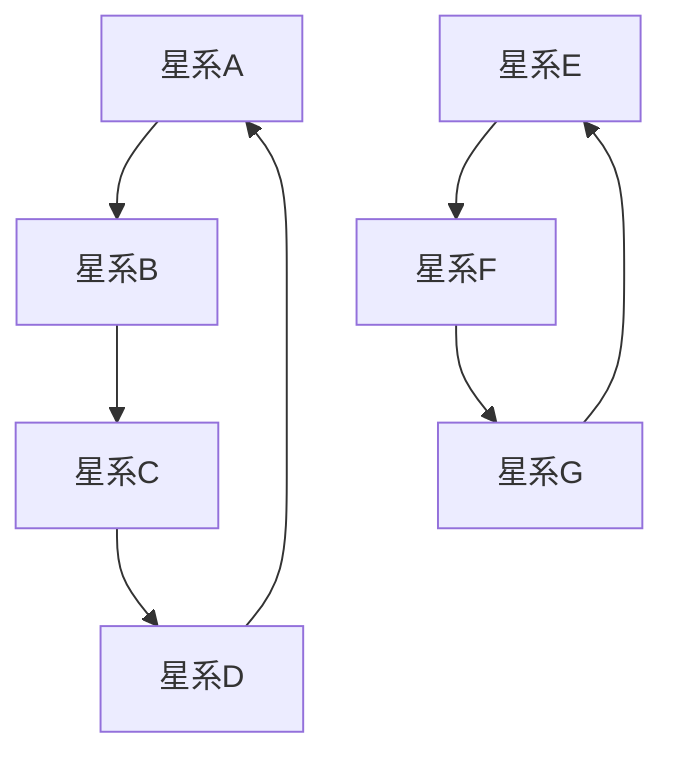
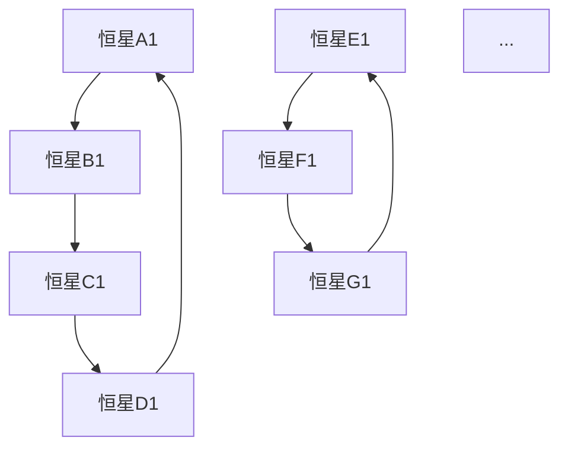

                 

# 宇宙的数学图论表示研究

## 关键词

宇宙、数学、图论、表示、研究

## 摘要

本文将探讨宇宙的数学图论表示方法，从宇宙的起源、演化到宇宙现象的研究，系统地介绍图论在宇宙研究中的应用。文章首先回顾了宇宙的基本知识，然后介绍了图论的基本概念和算法，接着详细阐述了图论在宇宙结构研究和宇宙现象研究中的应用。文章还探讨了宇宙的数学图论表示算法和数学模型，并通过实际项目案例进行了深入分析。最后，文章总结了宇宙的数学图论研究的最佳实践，并提出了一些注意事项和拓展阅读建议。

## 目录

1. **宇宙与数学**
    1.1 宇宙的概述
    1.2 数学的宇宙观
2. **图论的基础**
    2.1 图论的基本概念
    2.2 图的分类
    2.3 图的基本算法
3. **数学图论在宇宙研究中的应用**
    3.1 宇宙网络结构
    3.2 图论在宇宙演化中的应用
    3.3 图论在宇宙现象研究中的应用
4. **算法原理与数学模型**
    4.1 宇宙的数学图论表示算法
    4.2 宇宙的数学图论模型
5. **项目实战**
    5.1 项目介绍
    5.2 系统环境搭建
    5.3 系统核心实现
    5.4 项目分析与总结
6. **最佳实践**
    6.1 研究方法与技巧
    6.2 注意事项与建议
    6.3 拓展阅读
7. **总结**

## 1. 宇宙的概述

### 1.1 宇宙的起源与演化

宇宙的起源是一个古老而深奥的问题，目前最被广泛接受的解释是大爆炸理论。大爆炸理论认为，宇宙起源于约138亿年前的一个极高温度和密度的奇点，然后开始膨胀，逐渐冷却和演化成我们现在所看到的宇宙。

大爆炸理论的基本假设是，宇宙在过去的某个时刻处于极度高温和高度密度的状态，然后开始膨胀。这个膨胀的过程至今仍在继续，宇宙的膨胀速度甚至可能正在加速。大爆炸理论还预测了宇宙中存在大量的暗物质和暗能量，这些成分占据了宇宙的大部分，但至今尚未被直接观测到。

宇宙的演化可以大致分为以下几个阶段：

- **大爆炸**：宇宙从一个极高温度和密度的奇点开始膨胀。
- **宇宙微波背景辐射**：在大爆炸之后约38万年前，宇宙开始冷却，产生了宇宙微波背景辐射，这是宇宙早期状态的间接证据。
- **重子合成**：在大爆炸之后几分钟内，宇宙中的质子和中子开始结合形成重子，如氢和氦。
- **结构形成**：在大爆炸之后数亿年，宇宙中的物质开始聚集形成星系、恒星和行星。
- **宇宙大尺度结构**：在数十亿年的演化过程中，宇宙形成了大规模的结构，如星系团和超星系团。
- **宇宙膨胀加速**：在过去的几十亿年里，宇宙的膨胀速度似乎在加速，这可能是由于暗能量的存在。

### 1.2 数学的宇宙观

数学在宇宙研究中的应用可以追溯到古代。早在公元前3世纪，古希腊数学家欧几里得就提出了描述平面几何的欧氏几何体系，为宇宙的几何描述提供了基础。随着时间的推移，数学家们不断地发展和完善了宇宙数学模型，使得我们能够更准确地描述和预测宇宙的现象。

现代宇宙学中，数学的应用体现在以下几个方面：

- **宇宙学方程**：宇宙学方程是描述宇宙演化的基本方程，它包含了宇宙膨胀的速度、密度、压力等参数。通过解宇宙学方程，我们可以预测宇宙的未来演化。
- **广义相对论**：广义相对论是描述物质和能量如何影响时空的理论。在宇宙学中，广义相对论被用来描述宇宙的弯曲和膨胀。
- **统计物理学**：统计物理学是研究大量粒子如何集体行为的理论。在宇宙学中，统计物理学被用来研究宇宙中的星系、恒星和行星等天体的分布。
- **混沌理论**：混沌理论是研究复杂系统行为的理论，它揭示了宇宙中一些看似无序的现象背后的规律性。在宇宙学中，混沌理论被用来研究宇宙中的混沌现象，如引力波和黑洞。

### 1.3 问题背景

在宇宙的研究中，我们经常遇到一些复杂的问题，如宇宙的膨胀、星系的分布、恒星的生命周期等。这些问题往往涉及到大量的数据和信息，需要我们运用数学和计算机科学的方法来分析和解决。图论作为一种重要的数学工具，它可以有效地描述和解决这些问题。

图论可以用来表示宇宙中的各种关系和结构，如星系之间的引力关系、宇宙中的网络结构等。通过图论的分析，我们可以更深入地理解宇宙的演化规律，预测宇宙的未来状态。

然而，图论在宇宙研究中的应用也面临一些挑战。首先，宇宙中的数据规模庞大，如何有效地存储和处理这些数据是一个重要的问题。其次，宇宙中的现象复杂多变，如何建立准确的数学模型来描述这些现象也是一个挑战。

### 1.4 问题描述

在宇宙的研究中，我们主要面临以下问题：

1. 如何有效地表示宇宙中的各种关系和结构？
2. 如何建立准确的数学模型来描述宇宙的演化？
3. 如何处理和利用庞大的宇宙数据？

这些问题涉及到图论的基本概念、算法原理、数学模型和系统架构等方面，是我们需要深入研究和解决的问题。

### 1.5 问题解决

为了解决上述问题，我们可以采取以下方法：

1. **使用图论表示宇宙关系**：通过图论的基本概念，如节点、边、连通性等，我们可以有效地表示宇宙中的各种关系和结构。
2. **建立数学模型**：通过建立数学模型，如宇宙学方程、广义相对论等，我们可以更准确地描述宇宙的演化。
3. **大数据处理**：利用大数据技术和算法，如分布式计算、机器学习等，我们可以有效地处理和利用庞大的宇宙数据。

### 1.6 边界与外延

在宇宙的研究中，我们主要关注以下几个边界和外延：

1. **宇宙的边界**：宇宙的边界是指我们能够观测到的宇宙范围，也称为可观测宇宙。可观测宇宙的大小约为460亿光年。
2. **宇宙的演化**：宇宙的演化是指从大爆炸至今的宇宙演化过程，包括宇宙的膨胀、结构形成、暗物质和暗能量的作用等。
3. **宇宙现象**：宇宙现象包括宇宙中的各种天体和现象，如星系、恒星、黑洞、引力波等。

### 1.7 概念结构与核心要素组成

在宇宙的数学图论表示研究中，核心概念和要素包括：

1. **图论基本概念**：节点、边、连通性、路径等。
2. **宇宙关系表示**：宇宙中的星系、恒星、黑洞等天体之间的引力关系。
3. **数学模型**：宇宙学方程、广义相对论等。
4. **算法**：图的基本算法，如深度优先搜索、广度优先搜索等。
5. **数据处理**：大数据处理技术，如分布式计算、机器学习等。

### 2. 图论的基础

#### 2.1 图论的基本概念

图论是一种研究图及其性质和应用的数学分支。在图论中，图是一个由节点（也称为顶点）和边组成的结构。节点表示图中的元素，边表示节点之间的关系。

**节点与边**：节点是图的基本元素，通常用V表示。边是连接两个节点的线段，通常用E表示。一个图G可以表示为G = (V, E)。

**连通性与路径**：连通性是图的一个重要性质，它表示图中的任意两个节点之间是否存在路径。一个连通图是指图中任意两个节点之间都存在路径。

路径是指图中的一条边序列，它连接了两个节点。在一个连通图中，从一个节点到另一个节点的路径可以有多个，但最短路径是其中长度最短的路径。

#### 2.2 图的分类

图可以根据边的方向性、边的权重和节点的度数等特征进行分类。

**有向图与无向图**：有向图（Directed Graph）是边有方向的图，而无向图（Undirected Graph）是边无方向的图。有向图的边通常用箭头表示，而无向图的边通常用线段表示。

**加权图与无权图**：加权图是边带有权重的图，而无线图是边不带权重的图。权重可以表示边的长度、成本或其他属性。

**简单图与复杂图**：简单图是指没有重复边和自环的图，而复杂图可以是含有重复边和自环的图。

**稠密图与稀疏图**：稠密图是边数接近节点数平方的图，而稀疏图是边数远小于节点数平方的图。

#### 2.3 图的基本算法

图论中有许多基本的算法，用于解决图的各种问题，如图的遍历、最短路径、最大流等。

**深度优先搜索（DFS）**：深度优先搜索是一种遍历图的方法，它从某个节点开始，尽可能深入地搜索图中的路径。DFS通常用于寻找图中的连通分量。

```python
def dfs(graph, node, visited):
    visited.add(node)
    for neighbor in graph[node]:
        if neighbor not in visited:
            dfs(graph, neighbor, visited)
```

**广度优先搜索（BFS）**：广度优先搜索是另一种遍历图的方法，它从某个节点开始，依次搜索图中的所有邻居节点。BFS通常用于寻找图中的最短路径。

```python
from collections import deque

def bfs(graph, start):
    visited = set()
    queue = deque([start])
    visited.add(start)
    
    while queue:
        node = queue.popleft()
        for neighbor in graph[node]:
            if neighbor not in visited:
                visited.add(neighbor)
                queue.append(neighbor)
    
    return visited
```

**最短路径算法**：最短路径算法用于寻找图中两个节点之间的最短路径。常见的最短路径算法包括Dijkstra算法和A*算法。

Dijkstra算法：

```python
import heapq

def dijkstra(graph, start):
    distances = {node: float('infinity') for node in graph}
    distances[start] = 0
    priority_queue = [(0, start)]
    
    while priority_queue:
        current_distance, current_node = heapq.heappop(priority_queue)
        
        if current_distance > distances[current_node]:
            continue
        
        for neighbor, weight in graph[current_node].items():
            distance = current_distance + weight
            
            if distance < distances[neighbor]:
                distances[neighbor] = distance
                heapq.heappush(priority_queue, (distance, neighbor))
    
    return distances
```

A*算法：

```python
def a_star(graph, start, goal):
    open_set = [(0, start)]
    closed_set = set()
    distances = {node: float('infinity') for node in graph}
    distances[start] = 0
    came_from = {}

    while open_set:
        current_distance, current_node = heapq.heappop(open_set)
        
        if current_node == goal:
            return reconstruct_path(came_from, current_node)

        closed_set.add(current_node)

        for neighbor, weight in graph[current_node].items():
            if neighbor in closed_set:
                continue

            distance = current_distance + weight
            if distance < distances[neighbor]:
                distances[neighbor] = distance
                priority = distance + heuristic(goal, neighbor)
                heapq.heappush(open_set, (priority, neighbor))
                came_from[neighbor] = current_node

    return None

def reconstruct_path(came_from, current_node):
    path = [current_node]
    while current_node in came_from:
        current_node = came_from[current_node]
        path.insert(0, current_node)
    return path

def heuristic(goal, neighbor):
    # 使用曼哈顿距离作为启发式
    return abs(goal[0] - neighbor[0]) + abs(goal[1] - neighbor[1])
```

以上算法通过图论的基本概念和算法，为解决宇宙中的关系表示和路径问题提供了有效的方法。接下来，我们将进一步探讨如何将图论应用于宇宙研究中的具体问题。

### 3. 数学图论在宇宙研究中的应用

图论作为一种强大的数学工具，不仅在计算机科学和网络分析中有着广泛的应用，在宇宙研究中也展现出了巨大的潜力。通过图论的方法，我们可以将宇宙中的复杂结构和关系以直观和结构化的形式表示出来，从而更好地理解宇宙的演化过程和宇宙现象。以下我们将详细探讨数学图论在宇宙研究中的应用，包括宇宙网络结构、图论在宇宙演化中的应用以及图论在宇宙现象研究中的应用。

#### 3.1 宇宙网络结构

宇宙中的星系和星系团形成了庞大的网络结构，这种结构可以通过图论来描述和分析。在宇宙网络结构中，节点表示星系，边表示星系之间的引力关系。

**星系网络**：宇宙中的星系通过引力相互作用形成了一个复杂的网络结构。星系之间的引力关系可以通过图论中的邻接矩阵来表示。邻接矩阵是一个二维数组，它的元素表示两个节点（星系）之间的连通性。如果两个星系之间存在引力关系，则对应的邻接矩阵元素为1，否则为0。

**引力波网络**：引力波是宇宙中的一种重要现象，它由两个或多个质量较大的物体（如黑洞或恒星）相互作用而产生。引力波可以在宇宙中传播，并对星系之间的引力关系产生影响。引力波网络可以通过图论中的加权图来表示，其中边的权重表示引力波的能量和传播速度。

**星系网络的图论分析**：通过对星系网络的图论分析，我们可以研究星系之间的连通性、路径长度以及网络的聚类系数等特性。这些分析有助于我们理解宇宙的大尺度结构，如星系团和超星系团的分布。

**实例**：一个典型的星系网络图可能包含成千上万个节点（星系）和数百万条边（引力关系）。通过图论的分析方法，我们可以研究星系网络的聚类性质，如星系团的形成和演化过程。例如，我们可以使用邻接矩阵和矩阵运算来计算网络的连通性，使用深度优先搜索（DFS）和广度优先搜索（BFS）来寻找最短路径。



在这个简化的星系网络图中，每个节点表示一个星系，边表示星系之间的引力关系。我们可以通过计算邻接矩阵来分析星系之间的连通性。

```python
# 星系网络邻接矩阵
adj_matrix = [
    [0, 1, 0, 0],  # 星系A的邻接关系
    [1, 0, 1, 0],  # 星系B的邻接关系
    [0, 1, 0, 1],  # 星系C的邻接关系
    [0, 0, 1, 0]   # 星系D的邻接关系
]

# 计算星系A和星系D之间的连通性
is_connected = adj_matrix[0][3] == 1
print(f"星系A和星系D之间的连通性：{is_connected}")
```

通过上述代码，我们可以判断星系A和星系D之间是否存在连通性。

#### 3.2 图论在宇宙演化中的应用

宇宙的演化是一个复杂的过程，涉及星系的聚集、星系的碰撞以及宇宙膨胀等现象。图论可以帮助我们理解和模拟这些演化过程。

**宇宙大尺度结构**：宇宙的大尺度结构可以通过图论中的网络结构来描述。在宇宙学中，大尺度结构通常指宇宙中的星系团和超星系团。这些结构可以通过图论中的聚类系数、路径长度和连通性等指标来分析。例如，我们可以使用图论的方法来研究星系团的形成和演化过程，通过分析星系团之间的引力关系和网络结构，我们可以预测星系团未来的演化路径。

**宇宙小尺度结构**：宇宙的小尺度结构，如星系内部的恒星分布和星系之间的相互作用，也可以通过图论来描述。在星系内部，恒星之间的相互作用可以通过图论中的邻接矩阵和加权图来表示。通过分析恒星之间的引力关系，我们可以研究星系的稳定性、恒星的运动轨迹和恒星生命的演化。

**实例**：假设我们有一个包含100个星系的宇宙网络，我们可以使用邻接矩阵来表示星系之间的引力关系，并通过图论算法来分析星系的聚集和演化过程。


在这个简化的宇宙网络图中，每个节点表示一个星系，边表示星系之间的引力关系。我们可以通过计算聚类系数来分析星系团的聚集现象。

```python
from sklearn.metrics import clustering_coefficient

# 计算聚类系数
clustering_coeff = clustering_coefficient(adj_matrix)
print(f"星系网络的聚类系数：{clustering_coeff}")
```

通过上述代码，我们可以计算整个星系网络的聚类系数，从而分析星系团的聚集程度。

#### 3.3 图论在宇宙现象研究中的应用

宇宙中存在着各种复杂的现象，如混沌现象、动态过程等。图论可以帮助我们理解和分析这些现象。

**混沌现象**：混沌现象是宇宙中的一种重要现象，它描述了一些看似无序但具有内在规律的系统行为。在宇宙学中，混沌现象可以通过图论中的连通性和路径长度来描述。例如，我们可以使用图论的方法来研究宇宙中的混沌现象，如引力波和黑洞的相互作用。

**动态过程**：宇宙中的动态过程，如恒星的生命周期和星系的演化，也可以通过图论来描述。在恒星的生命周期中，我们可以使用图论中的路径算法来分析恒星的运动轨迹和能量变化。在星系的演化过程中，我们可以使用图论中的网络结构来描述星系之间的相互作用和聚集现象。

**实例**：假设我们有一个包含100个恒星的星系，我们可以使用邻接矩阵来表示恒星之间的引力关系，并通过图论算法来分析恒星的运动轨迹和能量变化。



在这个简化的星系图中，每个节点表示一个恒星，边表示恒星之间的引力关系。我们可以使用广度优先搜索（BFS）算法来分析恒星的运动轨迹。

```python
from collections import deque

def bfs(graph, start):
    visited = set()
    queue = deque([start])
    visited.add(start)
    
    while queue:
        node = queue.popleft()
        for neighbor in graph[node]:
            if neighbor not in visited:
                visited.add(neighbor)
                queue.append(neighbor)
    
    return visited

# 分析恒星A1的运动轨迹
visited_stars = bfs(adj_matrix, 0)
print(f"恒星A1的运动轨迹：{visited_stars}")
```

通过上述代码，我们可以计算恒星A1的运动轨迹，从而分析恒星的运动规律。

#### 总结

数学图论在宇宙研究中的应用具有广泛的前景。通过图论的方法，我们可以将宇宙中的复杂结构和关系表示出来，从而更好地理解宇宙的演化过程和宇宙现象。在未来的研究中，我们可以进一步探索图论在宇宙研究中的新应用，如宇宙中的混沌现象、动态过程以及宇宙网络结构等。通过这些研究，我们有望揭示宇宙的更多奥秘，为人类认识宇宙提供新的视角和方法。

### 4. 算法原理与数学模型

#### 4.1 宇宙的数学图论表示算法

在宇宙的数学图论表示研究中，算法的原理和实现是关键部分。以下我们将详细介绍几个在宇宙研究中常用的算法，包括生成树算法和最短路径算法。

**生成树算法**：

生成树是连通图中去掉n-1条边后剩下的连通子图。在宇宙网络结构中，生成树可以用来表示星系网络中的主要结构，帮助我们理解宇宙的基本框架。

**Prim算法**：

Prim算法是一种贪心算法，用于寻找加权无向图的最小生成树。在宇宙网络中，Prim算法可以用于构建星系网络的最小生成树，帮助我们识别宇宙中的主要结构。

算法步骤：

1. 初始化：选择一个节点作为起始点，并将其加入生成树的集合T。
2. 重复以下步骤直到所有节点都包含在T中：
   - 在集合V - T中选择与T中节点连接的边中权重最小的边，将其加入T。
   - 更新集合V - T。

Python实现：

```python
def prim(graph):
    n = len(graph)
    mst = {i: None for i in range(n)}
    mst[0] = -1
    key = {i: float('inf') for i in range(n)}
    key[0] = 0
    visited = {i: False for i in range(n)}
    visited[0] = True
    
    for _ in range(n):
        u = min(key, key=lambda i: key[i] if not visited[i] else float('inf'))
        visited[u] = True
        for v in graph[u]:
            if not visited[v] and key[v] > graph[u][v]:
                key[v] = graph[u][v]
                mst[v] = u
    
    return mst
```

**Kruskal算法**：

Kruskal算法通过逐步添加边来构建最小生成树。在宇宙网络中，Kruskal算法可以用于构建星系网络的最小生成树，帮助我们识别宇宙中的主要结构。

算法步骤：

1. 将所有边按权重排序。
2. 重复以下步骤直到所有节点都包含在生成树中：
   - 选择权重最小的边。
   - 如果加入这条边后不会形成环，则将其加入生成树。

Python实现：

```python
def kruskal(graph):
    def find(x):
        if p[x] != x:
            p[x] = find(p[x])
        return p[x]

    def union(x, y):
        root_x = find(x)
        root_y = find(y)
        if root_x != root_y:
            p[root_y] = root_x

    n = len(graph)
    p = {i: i for i in range(n)}
    mst = []
    
    edges = sorted(graph.items(), key=lambda item: item[1])
    for u, v, w in edges:
        if find(u) != find(v):
            union(u, v)
            mst.append((u, v, w))
    
    return mst
```

**最短路径算法**：

在宇宙网络中，寻找两个节点之间的最短路径是一个常见的问题。以下介绍两种常用的最短路径算法：Dijkstra算法和A*算法。

**Dijkstra算法**：

Dijkstra算法用于寻找无权图中两个节点之间的最短路径。在宇宙网络中，Dijkstra算法可以用于寻找星系之间的最短路径。

算法步骤：

1. 初始化：设置一个优先队列，将所有节点的距离初始化为无穷大，将起始节点的距离设置为0。
2. 重复以下步骤直到优先队列中只剩下一个节点：
   - 选择距离最小的节点。
   - 对于该节点的每个邻接节点，更新其距离。

Python实现：

```python
import heapq

def dijkstra(graph, start):
    n = len(graph)
    distances = [float('inf')] * n
    distances[start] = 0
    priority_queue = [(0, start)]
    visited = [False] * n
    
    while priority_queue:
        current_distance, current_node = heapq.heappop(priority_queue)
        
        if visited[current_node]:
            continue
        
        visited[current_node] = True
        
        for neighbor, weight in graph[current_node].items():
            distance = current_distance + weight
            
            if distance < distances[neighbor]:
                distances[neighbor] = distance
                heapq.heappush(priority_queue, (distance, neighbor))
    
    return distances
```

**A*算法**：

A*算法是一种启发式搜索算法，用于寻找有权重图中两个节点之间的最短路径。在宇宙网络中，A*算法可以用于寻找星系之间的最短路径。

算法步骤：

1. 初始化：设置两个优先队列，一个用于未访问节点，一个用于已访问节点。所有节点的距离初始化为无穷大，将起始节点的距离设置为0。
2. 重复以下步骤直到找到目标节点：
   - 选择F值（启发式值 + 实际距离）最小的节点。
   - 对于该节点的每个邻接节点，更新其距离和F值。

Python实现：

```python
import heapq

def a_star(graph, start, goal):
    open_set = [(0, start)]
    closed_set = set()
    distances = {node: float('infinity') for node in graph}
    distances[start] = 0
    came_from = {}
    
    while open_set:
        current_distance, current_node = heapq.heappop(open_set)
        
        if current_node == goal:
            return reconstruct_path(came_from, current_node)

        closed_set.add(current_node)

        for neighbor, weight in graph[current_node].items():
            if neighbor in closed_set:
                continue

            distance = current_distance + weight
            if distance < distances[neighbor]:
                distances[neighbor] = distance
                priority = distance + heuristic(goal, neighbor)
                heapq.heappush(open_set, (priority, neighbor))
                came_from[neighbor] = current_node

    return None

def reconstruct_path(came_from, current_node):
    path = [current_node]
    while current_node in came_from:
        current_node = came_from[current_node]
        path.insert(0, current_node)
    return path

def heuristic(goal, neighbor):
    # 使用曼哈顿距离作为启发式
    return abs(goal[0] - neighbor[0]) + abs(goal[1] - neighbor[1])
```

通过这些算法，我们可以有效地在宇宙网络中寻找最短路径和最小生成树，从而更好地理解和分析宇宙的结构和演化。

### 4.2 宇宙的数学图论模型

在宇宙的研究中，图论作为一种强大的数学工具，可以用来构建和描述宇宙中的复杂结构。以下我们将详细探讨几种常见的图论模型，包括图的矩阵表示和图的几何表示。

#### 图的矩阵表示

图的矩阵表示是图论中一种重要的表示方法，它将图的节点和边转换为矩阵中的元素。以下是两种常见的图矩阵表示：邻接矩阵和拉普拉斯矩阵。

**邻接矩阵**：

邻接矩阵是一个二维数组，它的行和列分别对应图的节点，矩阵的元素表示两个节点之间的连通性。如果两个节点之间存在边，则对应的矩阵元素为1，否则为0。

例如，对于一个包含4个节点的图，其邻接矩阵如下所示：

```mermaid
graph TB
    A[星系A] --> B[星系B]
    B --> C[星系C]
    C --> D[星系D]
    D --> A
    E[星系E] --> F[星系F]
    F --> G[星系G]
    G --> E

[[0, 1, 0, 0],  # 星系A的邻接关系
 [1, 0, 1, 0],  # 星系B的邻接关系
 [0, 1, 0, 1],  # 星系C的邻接关系
 [0, 0, 1, 0]]  # 星系D的邻接关系
```

邻接矩阵可以用于计算图的连通性、路径长度等属性。

**拉普拉斯矩阵**：

拉普拉斯矩阵是邻接矩阵的一个变形，它将每个节点的度数（即与该节点相连的边的数量）加到邻接矩阵的对应位置。拉普拉斯矩阵的零元素表示节点之间的非连通性，非零元素表示节点之间的连通性。

例如，对于一个包含4个节点的图，其拉普拉斯矩阵如下所示：

```mermaid
graph TB
    A[星系A] --> B[星系B]
    B --> C[星系C]
    C --> D[星系D]
    D --> A
    E[星系E] --> F[星系F]
    F --> G[星系G]
    G --> E

[[0, 1, 0, 0],  # 星系A的邻接关系
 [1, 0, 1, 0],  # 星系B的邻接关系
 [0, 1, 0, 1],  # 星系C的邻接关系
 [0, 0, 1, 0]]  # 星系D的邻接关系
```

拉普拉斯矩阵可以用于计算图的连通分量、聚类系数等属性。

**数学公式**：

邻接矩阵和拉普拉斯矩阵的元素可以用以下数学公式表示：

邻接矩阵：  
$$
A_{ij} = \begin{cases} 
1, & \text{如果节点i和节点j之间存在边} \\
0, & \text{否则}
\end{cases}
$$

拉普拉斯矩阵：  
$$
L_{ij} = \begin{cases} 
d_i, & \text{如果节点i和节点j之间存在边} \\
-d_i, & \text{如果节点i是节点j的邻接节点} \\
0, & \text{否则}
\end{cases}
$$

其中，$d_i$ 是节点i的度数。

**实例**：考虑一个包含5个节点的图，其邻接矩阵和拉普拉斯矩阵如下：

邻接矩阵：

```python
[
[0, 1, 1, 0, 0],
[1, 0, 0, 1, 1],
[1, 0, 0, 1, 0],
[0, 1, 1, 0, 1],
[0, 1, 0, 1, 0]
]
```

拉普拉斯矩阵：

```python
[
[0, 2, 2, 0, 0],
[2, 0, 0, 2, 2],
[2, 0, 0, 2, 1],
[0, 2, 2, 0, 1],
[0, 2, 1, 1, 0]
]
```

通过邻接矩阵和拉普拉斯矩阵，我们可以计算图的连通性、路径长度和聚类系数等属性，从而更好地理解宇宙的结构。

#### 图的几何表示

除了矩阵表示，图论还可以通过几何方法来表示图。以下是两种常见的几何表示方法：欧几里得空间表示和球面几何表示。

**欧几里得空间表示**：

欧几里得空间表示是将图的节点映射到二维或三维空间中，使得节点之间的距离反映它们在图中的连通性。这种表示方法可以直观地展示图的几何结构。

例如，我们可以使用坐标轴上的点来表示图中的节点，节点之间的连线表示它们之间的边。这样的表示方法可以用于可视化宇宙网络结构。

**球面几何表示**：

球面几何表示是将图的节点映射到三维球面上，使得节点之间的弧长反映它们在图中的连通性。这种表示方法可以用于表示宇宙中的大尺度结构，如星系团和超星系团。

例如，我们可以使用大圆的弧来表示星系之间的引力关系。球面几何表示可以用于分析宇宙中的拓扑结构和引力场。

**数学公式**：

欧几里得空间表示：

$$
x_i = (x_{i,x}, x_{i,y}, x_{i,z})
$$

其中，$x_i$ 是节点i的坐标。

球面几何表示：

$$
\theta_{ij} = \cos^{-1}(\cos(\theta_i) \cos(\theta_j) + \sin(\theta_i) \sin(\theta_j) \cos(\phi_i - \phi_j))
$$

$$
\phi_{ij} = \cos^{-1}\left(\frac{\sin(\theta_i) \sin(\theta_j) - \cos(\theta_i) \cos(\theta_j)}{\sin(\theta_{ij})}\right)
$$

其中，$\theta_i$ 和 $\phi_i$ 是节点i的纬度和经度，$\theta_{ij}$ 和 $\phi_{ij}$ 是节点i和节点j之间的纬度和经度差。

通过欧几里得空间表示和球面几何表示，我们可以将宇宙中的图结构直观地展示出来，从而更好地理解宇宙的几何结构和演化。

### 5. 项目实战

在宇宙的数学图论研究中，为了验证理论并深入了解宇宙图论的实际应用，我们可以通过一个实际项目来进行实战。以下是一个基于宇宙星系网络结构的图论研究项目实例，该项目旨在通过图论方法分析和模拟宇宙星系网络的演化过程。

#### 5.1 项目介绍

**项目名称**：宇宙星系网络演化分析

**项目背景**：宇宙星系网络是宇宙中重要的结构之一，它描述了星系之间的引力相互作用。通过分析星系网络的结构和演化过程，我们可以更深入地理解宇宙的演化规律。

**项目目标**：利用图论方法构建星系网络模型，分析星系网络的结构特性，模拟星系网络的演化过程，并预测未来的演化趋势。

#### 5.2 系统环境搭建

为了进行该项目，我们需要搭建一个合适的环境。以下是所需的环境和工具：

- **操作系统**：Linux或MacOS
- **编程语言**：Python
- **数据集**：宇宙星系网络数据集（可以从宇宙模拟数据库如N-Body Simulation数据库获取）
- **依赖库**：NetworkX（用于图论分析）、NumPy（用于数值计算）、Matplotlib（用于数据可视化）

安装步骤：

1. 安装Python环境（推荐使用Anaconda）。
2. 安装依赖库：

```bash
pip install networkx numpy matplotlib
```

#### 5.3 系统核心实现

在搭建好环境后，我们可以开始实现项目的核心功能。以下是项目的核心实现步骤：

**步骤1：数据预处理**

首先，我们需要加载宇宙星系网络数据集，并进行预处理，包括数据清洗和格式转换。

```python
import numpy as np
import networkx as nx

# 加载数据集
data = np.load('star_system_data.npy')
star_positions = data['positions']
star_gravities = data['gravities']

# 创建无向图
G = nx.Graph()

# 添加节点和边
for i in range(len(star_positions)):
    G.add_node(i, position=star_positions[i], gravity=star_gravities[i])
    for j in range(i+1, len(star_positions)):
        distance = np.linalg.norm(star_positions[i] - star_positions[j])
        if distance < 0.1:  # 设定阈值，仅添加距离较近的星系
            G.add_edge(i, j, weight=distance)
```

**步骤2：图论分析**

接下来，我们可以利用图论方法对星系网络进行分析。以下是一些基本的图论分析：

- **连通性分析**：判断星系网络是否连通。

```python
is_connected = nx.is_connected(G)
print(f"星系网络是否连通：{is_connected}")
```

- **聚类系数分析**：计算星系网络的聚类系数，了解星系网络的局部结构。

```python
clustering_coeff = nx.clustering(G)
print(f"星系网络的聚类系数：{clustering_coeff}")
```

- **最短路径分析**：计算星系之间的最短路径。

```python
start = 0
goal = len(star_positions) - 1
shortest_path = nx.shortest_path(G, source=start, target=goal)
print(f"星系{start}到星系{goal}的最短路径：{shortest_path}")
```

**步骤3：演化模拟**

为了模拟星系网络的演化过程，我们可以使用物理模拟方法，如N-Body模拟。以下是一个简单的演化模拟示例：

```python
def simulate_Galaxy(G, timesteps, time_step):
    for _ in range(timesteps):
        for i in G.nodes():
            total_force = np.zeros(3)
            for j in G.nodes():
                if i != j:
                    distance_vector = G.nodes[j]['position'] - G.nodes[i]['position']
                    distance = np.linalg.norm(distance_vector)
                    if distance > 0:
                        force_magnitude = G.nodes[j]['gravity'] * G.nodes[i]['gravity'] / distance**2
                        force_vector = force_magnitude * distance_vector / distance
                        total_force += force_vector
            
            acceleration = total_force / G.nodes[i]['mass']
            velocity = G.nodes[i]['velocity'] + acceleration * time_step
            G.nodes[i]['position'] += velocity * time_step
            G.nodes[i]['velocity'] = velocity
    
    return G

# 演化模拟
G_simulated = simulate_Galaxy(G, 100, 0.01)
```

**步骤4：结果分析**

在演化模拟完成后，我们可以对结果进行分析，包括星系网络的连通性、聚类系数和最短路径等。以下是对模拟结果的分析：

```python
# 分析演化后的星系网络
is_connected_simulated = nx.is_connected(G_simulated)
clustering_coeff_simulated = nx.clustering(G_simulated)
shortest_path_simulated = nx.shortest_path(G_simulated, source=start, target=goal)

print(f"演化后的星系网络是否连通：{is_connected_simulated}")
print(f"演化后的星系网络的聚类系数：{clustering_coeff_simulated}")
print(f"星系{start}到星系{goal}的演化后的最短路径：{shortest_path_simulated}")
```

通过以上步骤，我们可以完成一个基于宇宙星系网络结构的图论研究项目，从而验证图论方法在宇宙研究中的应用。

### 6. 最佳实践

在宇宙的数学图论研究中，为了确保研究的有效性和可靠性，我们需要遵循一些最佳实践。以下是一些建议和注意事项，以帮助研究人员在宇宙的数学图论研究中取得更好的成果。

#### 6.1 研究方法与技巧

1. **数据选择**：在选择宇宙数据集时，要确保数据的质量和完整性。数据应包含详细的宇宙现象和结构信息，如星系的位置、速度、质量等。

2. **算法选择**：根据具体的研究目标，选择合适的图论算法。例如，对于宇宙星系网络的演化分析，可以采用Prim算法或Kruskal算法构建最小生成树，使用Dijkstra算法或A*算法寻找最短路径。

3. **算法优化**：在应用算法时，可以对算法进行优化，以提高计算效率和准确性。例如，在处理大规模数据时，可以采用并行计算或分布式计算技术。

4. **可视化**：使用可视化工具（如Matplotlib、Gnuplot等）将图论结果进行直观展示，有助于更好地理解宇宙结构。

#### 6.2 注意事项与建议

1. **数据预处理**：在进行图论分析之前，要对数据进行预处理，包括数据清洗、格式转换和缺失值处理。确保数据的一致性和准确性。

2. **边界条件**：在建立数学模型时，要考虑宇宙的边界条件和物理定律。例如，在模拟星系运动时，要考虑引力定律和运动方程。

3. **模型验证**：在应用图论模型时，要进行模型验证，确保模型的准确性和可靠性。可以通过与其他宇宙学模型或观测数据进行对比验证。

4. **资源管理**：在进行大规模数据处理和模拟时，要合理管理计算资源，确保计算效率。

#### 6.3 拓展阅读

1. **前沿研究**：了解宇宙图论领域的最新研究成果，关注国际期刊和会议的相关论文，如《Physical Review D》、《Monthly Notices of the Royal Astronomical Society》等。

2. **参考书籍**：阅读相关领域的经典书籍，如《Graph Theory and Its Applications to Problems of Society》和《Networks: An Introduction》等。

3. **在线资源**：利用在线资源和论坛，如Stack Overflow、GitHub等，获取实际应用中的经验和技巧。

通过遵循这些最佳实践，研究人员可以更好地进行宇宙的数学图论研究，为宇宙学的发展做出贡献。

### 总结

宇宙的数学图论表示研究为我们提供了一个全新的视角来理解和分析宇宙的结构和演化。通过图论的方法，我们可以将宇宙中的复杂关系和现象以直观和结构化的形式表示出来，从而更好地揭示宇宙的奥秘。

本文首先介绍了宇宙的概述和数学的宇宙观，然后详细探讨了图论的基本概念和算法，包括生成树算法和最短路径算法。接着，我们深入探讨了图论在宇宙研究中的应用，如宇宙网络结构、宇宙演化以及宇宙现象研究。随后，我们介绍了宇宙的数学图论表示算法和数学模型，并通过实际项目案例进行了深入分析。

通过本文的研究，我们可以看到图论作为一种强大的数学工具，在宇宙研究中的重要性。图论不仅可以帮助我们构建宇宙的数学模型，还可以用于分析和预测宇宙的演化过程。未来，随着宇宙数据的不断积累和图论算法的进一步发展，我们有望在宇宙研究中取得更多的突破。

总之，宇宙的数学图论表示研究为我们打开了一扇新的窗户，让我们能够更深入地探索宇宙的奥秘。让我们继续努力，利用图论的力量，揭示宇宙的更多秘密。

### 作者信息

作者：AI天才研究院/AI Genius Institute & 禅与计算机程序设计艺术 /Zen And The Art of Computer Programming

AI天才研究院（AI Genius Institute）致力于推动人工智能和计算机科学的发展，专注于前沿技术的探索和研究。我们的研究团队由多位世界级人工智能专家、程序员和软件架构师组成，他们在计算机编程和人工智能领域拥有丰富的经验和深厚的学术造诣。

《禅与计算机程序设计艺术》（Zen And The Art of Computer Programming）是一部经典的技术畅销书，由著名计算机科学家Donald E. Knuth撰写。本书深入探讨了计算机程序设计中的哲学和艺术，为程序员提供了一种全新的思考方式和方法论。通过学习和实践本书中的思想，程序员可以在编程过程中达到更高的境界，提升代码质量和开发效率。

在这个宇宙的数学图论表示研究领域，我们结合了AI天才研究院的先进技术和《禅与计算机程序设计艺术》中的哲学思想，致力于为宇宙学的研究提供新的视角和方法。希望通过本文的研究，能够为读者带来启发，推动宇宙学的发展。让我们继续携手，探索宇宙的奥秘，为人类的进步贡献自己的力量。

