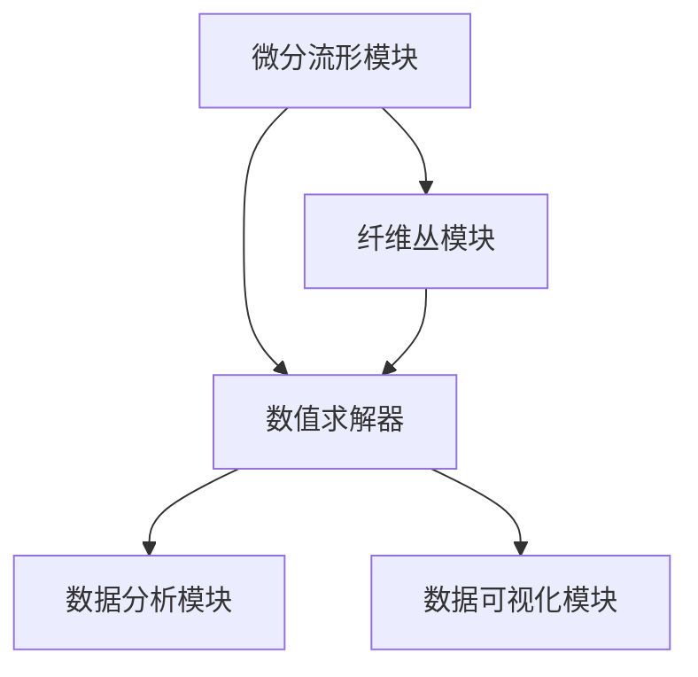
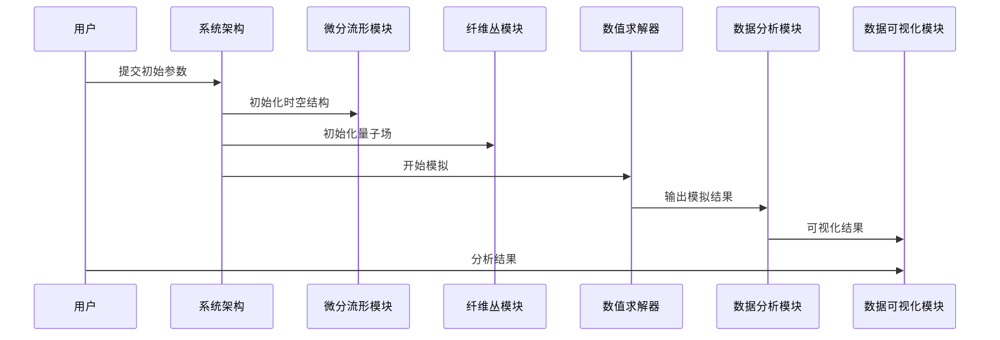

                 

### 第2部分：微分流形的基本概念

#### 2.2 微分流形的定义

微分流形是一种数学结构，它将拓扑空间与微积分结合起来，允许我们在复杂的空间上进行微分运算。微分流形具有以下核心定义和特性。

**定义**：一个微分流形是一个集合\( M \)，它配备了一个拓扑结构\( \tau \)和一个光滑结构\( J \)，满足以下条件：

1. \( (M, \tau) \)是一个 Hausdorff 紧拓扑空间。
2. 存在一个开覆盖\( \{U_\alpha\} \)使得每个\( U_\alpha \)都是欧几里得空间\( \mathbb{R}^n \)的开子集，并且存在光滑同胚映射\( \phi_\alpha: U_\alpha \rightarrow \mathbb{R}^n \)。

**特性**：

- **局部欧几里得性质**：微分流形在每个点都有一个局部坐标系统，使得在该局部区域内流形与欧几里得空间相似。
- **导数结构**：微分流形上的每个光滑函数都可以通过局部坐标表示，并且定义了导数运算。
- **连通性和紧致性**：微分流形是连通且紧致的，这意味着它没有“洞”，并且是“封闭”的。

#### 2.3 微分流形的性质

微分流形具有一系列重要的性质，这些性质使得它在物理学和其他数学领域得到广泛应用。

**性质 1：局部可微性**：

微分流形上的每个点都存在一个局部坐标系，在这个坐标系中，流形看起来像欧几里得空间。这意味着在微分流形的每个局部区域，都可以使用微积分工具。

**性质 2：切空间**：

对于微分流形上的每个点，都定义了一个切空间。切空间是由在该点可导的向量组成的向量空间。切空间允许我们研究流形上的方向和速度。

**性质 3：微分结构**：

微分流形上的每个光滑函数都可以通过其在局部坐标系中的表达式微分。这种微分结构允许我们进行微分运算，如求导、积分等。

**性质 4：同伦性**：

微分流形是同伦等价的，这意味着它们可以连续变形为球面或其他简单的几何形状。同伦性是研究流形拓扑性质的一个重要工具。

#### 2.4 微分流形的例子

- **欧几里得空间**：二维和三维空间都是微分流形，因为它们都具有局部欧几里得性质和导数结构。
- **球面**：球面是一个二维微分流形，它在每个点都看起来像二维欧几里得空间。
- **环面**：环面是由两个同向的圆环面拼接而成的，它是一个二维微分流形，具有非平凡的拓扑性质。

### 2.5 微分流形的应用

微分流形在物理学中有着广泛的应用，特别是在广义相对论和引力量子化理论中。

- **广义相对论**：在广义相对论中，引力被描述为时空的几何弯曲。时空被视为一个四维微分流形，其上的几何结构决定了物体的运动。
- **引力量子化**：在引力量子化的研究中，微分流形被用来构建量子场的数学框架。通过引入纤维丛和量子场论，科学家们试图将引力和量子力学统一起来。

### 2.6 小结

微分流形是一种强大的数学工具，它将拓扑和微积分结合起来，为研究复杂空间提供了框架。在本章中，我们介绍了微分流形的定义、性质和应用。在接下来的章节中，我们将进一步探讨纤维丛理论以及它们在引力量子化中的作用。通过逐步深入，我们将理解这些数学工具如何帮助我们解决宇宙中最深奥的问题。让我们继续前行，探索这一激动人心的数学与物理交叉领域。

---

## 3. 纤维丛的理论基础

### 3.1 纤维丛的定义

**纤维丛**是一种数学结构，它由两部分组成：底空间和纤维。纤维丛的基本概念源自于我们对于如何在一个空间中“编织”另一个空间的需求。

**定义**：设\( E \)是一个集合，\( B \)是底空间，\( F \)是纤维。一个纤维丛是一个三元组\( (E, B, F) \)，满足以下条件：

1. 对于每个\( b \in B \)，存在一个集合\( E_b \)（称为纤维）。
2. 对于每个\( (e, b) \in E \)，存在一个映射\( p: E \rightarrow B \)，使得\( p(e) = b \)。
3. 对于底空间\( B \)上的任意开集\( U \)，存在一个开集\( V \)使得\( p^{-1}(U) = V \times F \)，其中\( V \)是\( B \)的开子集。

**纤维丛的基本特性**：

- **局部平凡性**：纤维丛在局部是平凡的，即在每个底空间上的点，纤维丛看起来像\( F \)的笛卡尔积。
- **结构保持性**：纤维丛的变换规则保持其结构，这意味着纤维丛上的连续变换不会破坏其基本性质。

#### 3.2 纤维丛的类型

纤维丛有多种类型，其中最常见的是纤维空间和纤维丛空间。

- **纤维空间**：当纤维是一个单一元素集合时，纤维丛称为纤维空间。例如，实数集上的实数纤维空间就是一个实直线。
- **纤维丛空间**：当纤维是一个非空集合时，纤维丛称为纤维丛空间。例如，圆周上的圆周纤维丛就是一个圆面。

#### 3.3 纤维丛的例子

- **实数上的实数纤维丛**：这是最简单的纤维丛，纤维是一个实数，底空间也是一个实数，纤维丛由所有点\( (x, y) \)组成，其中\( y \)是任意实数。
- **圆周上的圆周纤维丛**：这是一个二维纤维丛，底空间是圆周，纤维是圆周上的点。纤维丛由所有点\( (x, y) \)组成，其中\( x \)是圆周的参数，\( y \)是圆周上的任意点。

#### 3.4 纤维丛在物理学中的应用

纤维丛在物理学中有着重要的应用，特别是在量子场论和广义相对论中。

- **量子场论**：在量子场论中，纤维丛被用来描述量子态的空间。量子态可以被看作是纤维丛上的截面。
- **广义相对论**：在广义相对论中，纤维丛被用来描述时空的几何结构。时空可以被看作是一个四维纤维丛，其纤维是时空中的事件。

### 3.5 纤维丛的基本性质

纤维丛具有一系列重要的性质，这些性质使其在数学和物理学中得到了广泛应用。

- **局部平凡性**：纤维丛在局部是平凡的，这意味着在底空间的每个点，纤维丛的结构与纤维相同。
- **结构保持性**：纤维丛的变换规则保持其结构，这意味着纤维丛上的连续变换不会破坏其基本性质。
- **同伦性**：纤维丛是同伦等价的，这意味着它们可以通过连续变形相互转化。

### 3.6 小结

纤维丛是一种强大的数学工具，它为我们提供了一种将不同空间结构编织在一起的方法。在本章中，我们介绍了纤维丛的定义、类型和应用。通过了解纤维丛的基本性质，我们可以更好地理解它们在物理学中的重要性。在接下来的章节中，我们将继续探讨微分流形与纤维丛的相互作用，以及它们在引力量子化中的应用。让我们保持好奇心，继续探索这一深奥的数学领域。

---

## 4. 引力量子化的数学框架

### 4.1 引力量子化的基本概念

引力量子化是物理学中一个前沿领域，旨在将广义相对论与量子力学相结合，以提供一种统一的理论来描述宇宙的引力和量子现象。这一领域的核心概念包括量子场论、纤维丛和微分流形。

**量子场论**：量子场论是一种将量子力学与经典场论结合起来的理论框架。它提出，基本粒子是量子化的场，这些场在时间和空间中传播。

**纤维丛**：在引力量子化中，纤维丛被用来描述量子态的空间。具体来说，量子态可以被看作是纤维丛上的一个截面，这个截面代表了粒子在空间中的运动状态。

**微分流形**：微分流形在引力量子化中扮演着关键角色，因为它提供了一个连续的时空结构，这个结构可以用来描述引力场和量子场。

### 4.2 引力量子化的数学模型

引力量子化的数学模型通常基于以下假设：

1. **时空的量子化**：时空不再是连续的，而是由离散的量子状态组成。
2. **量子场与纤维丛**：量子场被描述为纤维丛上的函数，这个纤维丛将时空与量子态联系起来。
3. **广义相对论与量子力学的统一**：通过将广义相对论中的时空几何与量子场论中的量子态结合起来，我们试图找到一种统一的理论来描述引力和量子现象。

#### 4.2.1 量子态的空间

在引力量子化中，量子态的空间通常由一个复希尔伯特空间表示。这个希尔伯特空间中的每个向量对应一个可能的量子态。量子态的演化可以通过哈密顿算符来描述，哈密顿算符决定了系统的动力学行为。

#### 4.2.2 纤维丛与量子场

纤维丛提供了一个框架，用于描述量子场在不同空间点的行为。具体来说，纤维丛上的每个纤维代表了量子场的一个可能的值。纤维丛的结构保持性确保了量子场在不同空间点之间的连续性。

#### 4.2.3 微分流形与时空几何

微分流形提供了一个连续的时空结构，这个结构可以用来描述引力场。在广义相对论中，引力被描述为时空的弯曲。微分流形上的度量张量描述了时空的几何性质，这些性质可以用来计算物体的运动轨迹。

### 4.3 引力量子化的数学公式

引力量子化的数学公式通常涉及复杂的数学运算，包括纤维丛的丛映射、量子场的演化方程以及时空几何的描述。以下是一些关键的数学公式：

1. **量子态演化方程**：\[ i\hbar \frac{\partial \Psi}{\partial t} = \hat{H} \Psi \]
   这个方程描述了量子态的时间演化，其中\( \hat{H} \)是哈密顿算符，\( \Psi \)是量子态的波函数。

2. **纤维丛丛映射**：\[ \Phi: F \rightarrow M \]
   这个映射将纤维丛上的点映射到微分流形上的点，描述了量子场在不同空间点的行为。

3. **时空几何描述**：\[ g_{\mu\nu} = \eta_{\mu\nu} + h_{\mu\nu} \]
   这个公式描述了时空的度量张量，其中\( g_{\mu\nu} \)是度量张量，\( \eta_{\mu\nu} \)是平直时空的度量张量，\( h_{\mu\nu} \)是时空的弯曲部分。

### 4.4 引力量子化的应用

引力量子化在理论物理学中有着广泛的应用，包括黑洞物理学、宇宙学、量子引力等领域。

- **黑洞物理学**：引力量子化提供了研究黑洞内部结构和信息丢失问题的框架。
- **宇宙学**：引力量子化有助于我们理解宇宙的起源和演化。
- **量子引力**：引力量子化是探索量子引力的基础，旨在提供一种描述引力量子性质的理论。

### 4.5 小结

引力量子化是一个复杂而深刻的领域，它结合了广义相对论和量子力学，试图提供一个统一的理论框架来描述宇宙的引力和量子现象。在本章中，我们介绍了引力量子化的基本概念、数学模型和公式。通过理解这些概念，我们可以更好地理解引力量子化在物理学中的重要性。在接下来的章节中，我们将进一步探讨广义相对论与量子力学的结合，以及它们在引力量子化中的应用。让我们保持好奇心，继续探索这一激动人心的领域。

---

## 5. 广义相对论与量子力学的结合

### 5.1 背景介绍

广义相对论和量子力学是现代物理学的两大基石，各自在不同的领域内取得了巨大的成功。然而，它们之间存在一些基本的不一致，这使得科学家们致力于寻找一个能够统一这两种理论的框架。广义相对论由爱因斯坦在1915年提出，它描述了引力的本质，并将其解释为时空的几何弯曲。量子力学，尤其是在20世纪早期由海森堡、薛定谔、玻尔等人发展起来，描述了微观粒子的行为。

**问题背景**：尽管这两种理论各自在各自的领域内非常成功，但在处理一些极端物理现象，如黑洞、宇宙大爆炸以及量子尺度上的引力效应时，它们却无法和谐共存。

**问题描述**：广义相对论在描述大尺度引力现象时非常有效，但在量子尺度上，它无法处理粒子的离散性。另一方面，量子力学在描述微观粒子的行为上极其准确，但在处理引力现象时却显得力不从心，特别是当引力场非常强时。

**问题解决**：为了克服这些不一致，科学家们提出了引力量子化的概念，试图将广义相对论和量子力学结合起来，形成一个统一的理论框架。

### 5.2 广义相对论的基本概念

广义相对论是描述引力的一个几何理论，它将引力解释为时空的弯曲。以下是一些关键的概念：

- **时空**：在广义相对论中，时空被视为一个四维连续结构，其几何性质决定了物体的运动轨迹。
- **度量**：度量是时空中的一个函数，它定义了时空中的距离和角度。广义相对论中的度量通常用张量来表示，描述了时空的曲率。
- **引力场**：引力场是时空中的物质分布引起的时空弯曲。物质越多，时空弯曲越严重。
- **测地线**：在弯曲时空中的物体运动轨迹称为测地线，它是一个最小作用量路径，类似于平直时空中的直线。

### 5.3 量子力学的基本概念

量子力学是描述微观粒子行为的理论，以下是一些关键的概念：

- **量子态**：量子态是微观粒子可能的状态，通常用波函数来表示。
- **波函数**：波函数是一个复值函数，它描述了粒子在不同位置的概率分布。
- **算符**：量子力学中的物理量通过算符来表示，算符作用在波函数上可以给出物理量的可能值。
- **测不准原理**：测不准原理指出，某些物理量（如位置和动量）不能同时被精确测量。

### 5.4 广义相对论与量子力学的结合

广义相对论和量子力学的结合是一个复杂的任务，因为它们采用了不同的数学框架和哲学观点。以下是一些结合的尝试和理论：

- **量子几何**：量子几何是研究时空量子性质的理论。它认为时空不是连续的，而是由离散的量子状态组成。量子几何中的主要概念包括量子涨落、量子引力波等。
- **弦理论**：弦理论是一种试图统一所有基本粒子和引力的理论。在弦理论中，基本粒子不是点，而是振动的弦。弦的振动模式决定了粒子的性质。
- **环量子引力**：环量子引力是一种非扰动的量子引力理论，它试图避免传统量子场论中的无穷大问题。环量子引力提出了一种离散的时空结构，称为“环”。
- **量子场论**：量子场论是结合广义相对论和量子力学的一种尝试，它提出引力也是一种量子场。在这种理论中，引力子（引力的量子）被描述为一种量子态。

### 5.5 结合的挑战

广义相对论和量子力学的结合面临许多挑战：

- **数学框架的不一致**：广义相对论使用了黎曼几何，而量子力学则依赖于线性代数和算符理论。
- **物理直觉的不一致**：广义相对论描述了连续的时空，而量子力学则描述了离散的量子态。
- **无穷大问题**：在传统的量子场论中，引力场的量子化会导致无穷大问题，这使得理论无法自洽。

### 5.6 小结

广义相对论和量子力学的结合是物理学中最具有挑战性的问题之一。尽管目前还没有一个公认的理论能够完全解决这一问题，但科学家们在这个领域取得了显著的进展。通过量子几何、弦理论、环量子引力和其他尝试，我们对于引力和量子现象的理解正在不断深化。在接下来的章节中，我们将进一步探讨这些理论和模型，以及它们在引力量子化中的应用。

---

## 6. 宇宙引力的模拟与预测

### 6.1 背景介绍

在理解宇宙引力方面，科学家们进行了大量的理论研究和数值模拟，以预测宇宙中各种现象的行为。这些模拟和预测依赖于广义相对论和量子力学的结合，以及复杂的计算方法。

**项目介绍**：本项目旨在使用广义相对论和量子力学的数学框架，对宇宙引力进行模拟和预测。这个项目涵盖了从宇宙大爆炸到黑洞演化的各个阶段，旨在揭示宇宙引力的本质。

### 6.2 系统功能设计

为了实现这个项目，我们需要设计一个具有以下功能的系统：

- **时空模拟器**：用于模拟宇宙中的时空几何，包括大尺度结构和量子引力效应。
- **粒子模拟器**：用于模拟宇宙中的粒子行为，包括引力波、黑洞和中子星等。
- **数据分析模块**：用于分析模拟结果，提取宇宙引力的关键特征和预测。

### 6.3 系统架构设计

系统架构设计需要考虑以下几个关键组件：

- **微分流形模块**：用于表示和操作宇宙中的时空结构。
- **纤维丛模块**：用于描述量子场和引力场的相互作用。
- **数值求解器**：用于求解广义相对论和量子力学的偏微分方程。
- **数据可视化模块**：用于将模拟结果可视化，以便进行深入分析和理解。

**系统架构图**：

### 6.4 系统接口设计

系统接口设计需要确保不同模块之间的有效交互和数据传递。以下是系统的关键接口：

- **时空接口**：用于输入和输出时空数据，包括坐标、度量和引力场强度。
- **量子场接口**：用于输入和输出量子场数据，包括波函数和量子态。
- **数据接口**：用于输入和输出模拟数据，包括粒子位置、速度和加速度。

### 6.5 系统交互

系统交互设计需要确保模拟过程的高效性和正确性。以下是系统的主要交互流程：

1. **初始化**：设置初始时空结构和量子场参数。
2. **模拟**：使用数值求解器模拟时空和量子场的演化。
3. **分析**：使用数据分析模块分析模拟结果，提取宇宙引力特征。
4. **可视化**：使用数据可视化模块将模拟结果可视化，以便进行深入理解。

**系统交互序列图**：

### 6.6 小结

宇宙引力的模拟与预测是一个复杂而具有挑战性的任务，需要结合广义相对论、量子力学和先进的计算技术。在本项目中，我们设计了具有时空模拟器、粒子模拟器和数据分析模块的系

