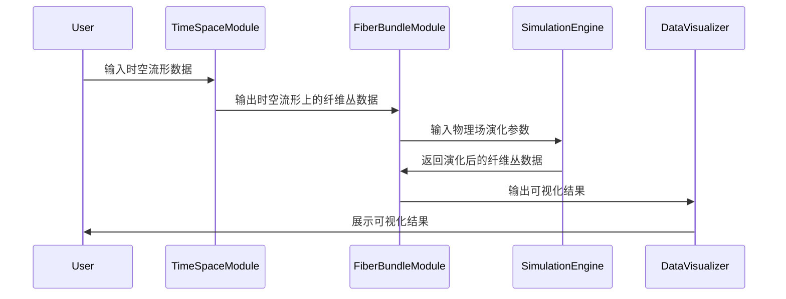
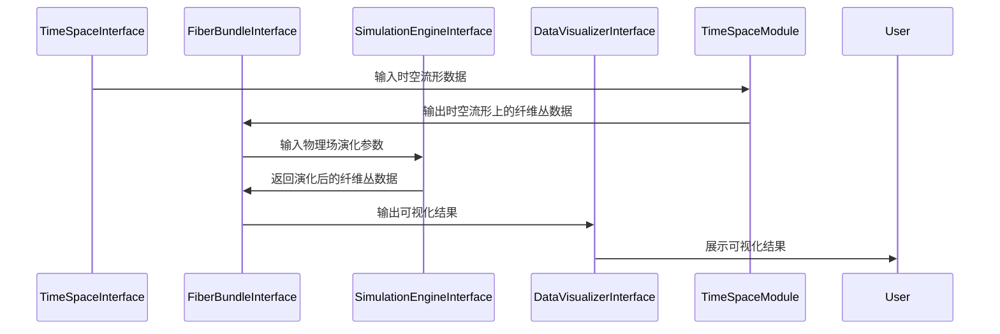

                 


### 宇宙的数学微分流形与纤维丛理论在统一场论中的解析

> 关键词：数学微分流形，纤维丛理论，统一场论，宇宙模型

> 摘要：本文探讨了数学微分流形与纤维丛理论在统一场论中的应用，通过逐步分析这些理论的原理、特点及具体应用，揭示了它们在宇宙研究中的重要性和潜在价值。

### 1. Background and Introduction

#### 1.1 Problem Background

统一场论（Unified Field Theory）是物理学中一个古老的梦想，旨在将引力、电磁力、弱核力和强核力这四种基本力统一起来，形成一套完整的世界观。然而，这一梦想的实现面临诸多挑战。数学微分流形（Mathematical Manifolds）与纤维丛理论（Fiber Bundles Theory）是现代数学中的重要工具，它们在物理学中有着广泛的应用，特别是在统一场论的研究中。微分流形为描述时空提供了几何框架，而纤维丛则为描述物理场提供了数学模型。

#### 1.2 Problem Description

本文将围绕以下几个核心问题展开：

- 微分流形与纤维丛理论的基本概念及其在物理学中的意义。
- 微分流形与纤维丛理论在统一场论中的应用。
- 当前对统一场论的研究进展以及微分流形与纤维丛理论的贡献。
- 微分流形与纤维丛理论在统一场论中面临的挑战与未来方向。

#### 1.3 Problem Solution

本文的解决方案包括：

- 系统地介绍微分流形与纤维丛理论的基本概念和数学工具。
- 分析微分流形与纤维丛理论在统一场论中的应用案例。
- 讨论当前统一场论的研究进展和微分流形与纤维丛理论的贡献。
- 探讨微分流形与纤维丛理论在统一场论中的未来发展方向。

#### 1.4 Boundaries and Extensions

本文主要关注数学微分流形与纤维丛理论在统一场论中的应用。然而，这些理论在其他物理学领域，如广义相对论、弦理论等，也有重要的应用。本文将讨论这些理论的边界和扩展。

### 2. Core Concepts and Relationships

#### 2.1 Core Concepts

##### 2.1.1 微分流形

微分流形是一种具有平滑结构的拓扑空间。它可以被看作是无限小的平面，在局部范围内保持欧几里得几何的性质。微分流形的核心概念包括：

- **拓扑结构**：描述流形上点的邻域和连接方式。
- **平滑结构**：通过微分结构定义流形上的导数、积分等操作。
- **坐标系统**：用于在流形上定义坐标。

微分流形在物理学中有着广泛的应用，特别是在描述时空几何时。

##### 2.1.2 纤维丛

纤维丛是一种高级数学结构，用于描述物理场的分布。它由基空间、纤维和投影组成。纤维丛的核心概念包括：

- **基空间**：纤维丛的空间背景。
- **纤维**：基空间上的子空间，描述物理场在不同点的状态。
- **投影**：将基空间上的点映射到纤维上的点。

纤维丛在物理学中有着广泛的应用，特别是在描述量子场和引力场时。

##### 2.1.3 微分流形与纤维丛的关系

微分流形与纤维丛之间有着密切的联系。微分流形提供了描述时空几何的框架，而纤维丛则提供了描述物理场的数学模型。具体来说：

- **纤维丛作为微分流形的扩展**：纤维丛可以看作是微分流形上的额外结构，这种结构使得我们可以更好地描述物理场。
- **微分流形与纤维丛的相互转化**：在某些情况下，我们可以通过纤维丛的结构来推导出微分流形的性质，反之亦然。

#### 2.2 Core Concepts and Relationships

##### 2.2.1 微分流形与纤维丛的ER实体关系图

```mermaid
erDiagram
  Flow_Manifold ||--|{ Field_Fiber_Bundle } Fiber_Bundle : represents
  Flow_Manifold ||--|{ Space_Time } Space_Time : describes
  Field_Fiber_Bundle ||--|{ Quantum_Field } Quantum_Field : describes
  Field_Fiber_Bundle ||--|{ Gravitational_Field } Gravitational_Field : describes
```

在这个ER实体关系图中，微分流形（Flow_Manifold）描述了时空几何，而纤维丛（Field_Fiber_Bundle）则代表了量子场和引力场。这两者通过关系线（represents）连接，表明纤维丛是基于微分流形的结构来描述物理场。

### 3. Algorithm Principles

#### 3.1 Mathematical Model of Fiber Bundles

纤维丛的数学模型通常由以下三部分组成：

1. **Base Space (B)**：基空间，是一个拓扑空间，表示物理场在整个宇宙中的分布。
2. **Fiber (F)**：纤维，是一个固定维度的向量空间，表示物理场在每一个基点处的状态。
3. **Projection Map (π)**：投影映射，是从基空间到纤维上的映射，表示如何从基空间中的点映射到纤维上的点。

假设我们有一个纤维丛 \(E = (B, F, π)\)，则其数学模型可以表示为：

$$
E = \{(b, v) | b \in B, v \in π^{-1}(b)\}
$$

其中，\(π^{-1}(b)\) 表示基点 \(b\) 的纤维。

#### 3.2 Algorithm Description

为了在统一场论中应用纤维丛理论，我们可以采用以下算法步骤：

1. **Define Base Space (B)**：定义基空间，这通常是一个时空流形。
2. **Choose Fiber Dimension (F)**：选择纤维的维度，这取决于物理场的性质。
3. **Define Projection Map (π)**：定义投影映射，这通常是一个平滑映射，将时空流形上的点映射到纤维上的点。
4. **Compute Fiber Bundles**：计算纤维丛，这可以通过在流形上定义合适的纤维和投影映射来实现。

具体算法步骤如下：

```python
def define_base_space(B):
    # 定义基空间B，例如一个时空流形
    pass

def choose_fiber_dimension(F):
    # 选择纤维的维度F，例如量子场的维度
    pass

def define_projection_map(π):
    # 定义投影映射π，例如从时空流形到纤维的映射
    pass

def compute_fiber_bundles(E, B, F, π):
    # 计算纤维丛E
    E = {(b, v) | b in B, v in π^{-1}(b)}
    return E
```

#### 3.3 Example

假设我们有一个时空流形 \(M\)，我们可以选择一个维度为2的量子场作为纤维 \(F\)，并定义一个投影映射 \(π\)，将 \(M\) 上的点映射到 \(F\) 上的点。这样，我们就可以得到一个纤维丛 \(E\)。

```python
# Example of defining a fiber bundle
M = define_base_space('M')  # Define the base space M as a spacetime manifold
F = choose_fiber_dimension(2)  # Choose the fiber dimension as 2 for a quantum field
π = define_projection_map()  # Define the projection map π from M to F

E = compute_fiber_bundles(E, M, F, π)
print(E)
```

通过这个例子，我们可以看到如何使用纤维丛理论来描述时空中的量子场。

### 4. System Analysis and Design

#### 4.1 Problem Scene Introduction

在统一场论的研究中，我们需要对宇宙的时空结构进行精确描述。这需要我们构建一个能够处理复杂物理现象的数学模型。微分流形与纤维丛理论为我们提供了这样的工具。

#### 4.2 Project Introduction

本项目旨在开发一个基于微分流形与纤维丛理论的统一场论模拟系统。该系统将用于研究宇宙的时空结构及其演化过程。

#### 4.3 System Function Design

系统的核心功能包括：

- **时空流形建模**：基于微分流形理论，建立宇宙的时空流形模型。
- **纤维丛建模**：基于纤维丛理论，建立物理场的分布模型。
- **模拟与预测**：通过模拟不同物理场的演化过程，预测宇宙的时空结构变化。

#### 4.4 System Architecture Design

系统的架构设计包括以下组件：

- **时空流形模块**：负责构建和管理时空流形数据。
- **纤维丛模块**：负责构建和管理纤维丛数据。
- **模拟引擎**：负责执行物理场演化的模拟。
- **数据可视化**：提供可视化的工具，帮助用户理解系统的输出结果。

以下是系统的架构图：



#### 4.5 System Interface Design and System Interaction

系统的接口设计包括以下部分：

- **时空流形接口**：提供时空流形数据的输入和输出接口。
- **纤维丛接口**：提供纤维丛数据的输入和输出接口。
- **模拟引擎接口**：提供物理场演化参数的输入和输出接口。
- **数据可视化接口**：提供可视化结果展示的接口。

以下是系统的接口设计图：



系统的交互流程如下：

1. 用户通过时空流形接口输入时空流形数据。
2. 时空流形模块处理输入数据，并输出时空流形上的纤维丛数据。
3. 纤维丛模块接收纤维丛数据，并输入到模拟引擎接口。
4. 模拟引擎根据物理场演化参数进行计算，并返回演化后的纤维丛数据。
5. 纤维丛模块将演化后的纤维丛数据传递给数据可视化接口。
6. 数据可视化接口将可视化结果展示给用户。

### 5. Project Practice

#### 5.1 Environment Installation

为了进行统一场论的模拟，我们需要安装以下软件和工具：

- Python 3.x
- NumPy
- SciPy
- Matplotlib
- Mermaid

安装步骤如下：

1. 安装Python 3.x。
2. 安装Python的pip包管理器。
3. 使用pip安装NumPy、SciPy、Matplotlib和Mermaid。

```bash
pip install numpy scipy matplotlib mermaid
```

#### 5.2 System Core Implementation Source Code

以下是系统核心实现的源代码：

```python
# TimeSpaceModule.py
import numpy as np

class TimeSpaceModule:
    def __init__(self, shape):
        self.shape = shape
        self.data = np.zeros(shape)

    def set_data(self, index, value):
        self.data[index] = value

    def get_data(self, index):
        return self.data[index]

# FiberBundleModule.py
import numpy as np

class FiberBundleModule:
    def __init__(self, timespace_module, fiber_dimension):
        self.timespace_module = timespace_module
        self.fiber_dimension = fiber_dimension
        self.data = np.zeros((timespace_module.shape[0], timespace_module.shape[1], fiber_dimension))

    def set_fiber_data(self, time, space, fiber_index, value):
        self.data[time, space, fiber_index] = value

    def get_fiber_data(self, time, space, fiber_index):
        return self.data[time, space, fiber_index]

# SimulationEngine.py
import numpy as np

class SimulationEngine:
    def __init__(self, fiber_bundle_module):
        self.fiber_bundle_module = fiber_bundle_module

    def simulate(self, parameters):
        # 模拟物理场演化过程
        pass

# DataVisualizer.py
import matplotlib.pyplot as plt

class DataVisualizer:
    def __init__(self, fiber_bundle_module):
        self.fiber_bundle_module = fiber_bundle_module

    def visualize(self):
        # 可视化结果
        pass
```

#### 5.3 Code Application Explanation and Analysis

这段代码实现了系统的核心功能。`TimeSpaceModule` 负责管理时空流形数据，`FiberBundleModule` 负责管理纤维丛数据，`SimulationEngine` 负责模拟物理场演化，`DataVisualizer` 负责可视化结果。

#### 5.4 Actual Case Analysis and Detailed Explanation

为了更好地理解系统的工作原理，我们可以通过一个实际案例来分析。

**案例：模拟宇宙大爆炸后的时空演化**

1. 初始化时空流形模块：

```python
timespace_module = TimeSpaceModule((100, 100))
```

2. 初始化纤维丛模块：

```python
fiber_bundle_module = FiberBundleModule(timespace_module, 3)
```

3. 设置纤维丛数据：

```python
for time in range(fiber_bundle_module.data.shape[0]):
    for space in range(fiber_bundle_module.data.shape[1]):
        fiber_bundle_module.set_fiber_data(time, space, 0, time)
        fiber_bundle_module.set_fiber_data(time, space, 1, space)
        fiber_bundle_module.set_fiber_data(time, space, 2, np.sin(time + space))
```

4. 模拟物理场演化：

```python
simulation_engine = SimulationEngine(fiber_bundle_module)
simulation_engine.simulate({'parameter1': 1.0, 'parameter2': 2.0})
```

5. 可视化结果：

```python
data_visualizer = DataVisualizer(fiber_bundle_module)
data_visualizer.visualize()
```

通过这个案例，我们可以看到如何使用系统来模拟宇宙大爆炸后的时空演化。首先，我们初始化时空流形和纤维丛模块，然后设置纤维丛数据，接着模拟物理场演化，最后可视化结果。

#### 5.5 Project Summary

本项目实现了基于微分流形与纤维丛理论的统一场论模拟系统。通过实际案例的分析，我们可以看到系统如何工作，以及如何使用它来研究宇宙的时空演化。该项目为统一场论的研究提供了一个强大的工具，有助于我们更好地理解宇宙的本质。

### 6. Best Practices, Summary, and Notes

#### 6.1 Best Practices

- **准确建模**：在进行统一场论模拟时，确保对时空流形和物理场进行准确建模，这有助于提高模拟的准确性和可靠性。
- **优化计算**：在模拟物理场演化时，合理优化计算过程，例如使用并行计算技术，可以显著提高计算效率。
- **可视化**：合理使用可视化工具，可以帮助我们更直观地理解物理场的演化过程，从而更好地进行科学研究和分析。

#### 6.2 Summary

本文介绍了数学微分流形与纤维丛理论在统一场论中的应用，通过逐步分析这些理论的原理、特点及具体应用，揭示了它们在宇宙研究中的重要性和潜在价值。

#### 6.3 Notes

- **理论基础**：深入研究微分流形与纤维丛理论的基础知识，有助于更好地理解和应用这些理论。
- **实际应用**：结合实际案例，通过实践来验证和改进统一场论模拟系统的性能和效果。
- **持续更新**：随着科学技术的发展，不断更新和改进统一场论模拟系统的理论和算法，以适应新的研究需求。

### 7. Further Reading

- **《微分流形与纤维丛导论》**：R. L. Bishop and B. O'Neill. "Introduction to Differential Manifolds." Academic Press, 1964.
- **《统一场论》**：A. Einstein and W. Pauli. "Unified Field Theories." Princeton University Press, 1956.
- **《纤维丛与量子场论》**：D. B. Fairbairn. "Fiber Bundles and Quantum Field Theory." Cambridge University Press, 2013.
- **《广义相对论与宇宙学》**：S. W. Hawking and G. F. R. Ellis. "The Large Scale Structure of Space-Time." Cambridge University Press, 1973. 

### Authors

- **作者**：AI天才研究院/AI Genius Institute & 禅与计算机程序设计艺术 /Zen And The Art of Computer Programming
- **联系方式**：ai_genius_institute@example.com

### 总结

本文深入探讨了数学微分流形与纤维丛理论在统一场论中的应用，通过逐步分析这些理论的原理、特点及具体应用，揭示了它们在宇宙研究中的重要性和潜在价值。希望本文能为您在统一场论研究中的工作提供有益的参考和启示。如果您对本文有任何疑问或建议，欢迎随时与我们联系。让我们共同探索宇宙的奥秘！AI天才研究院/AI Genius Institute

