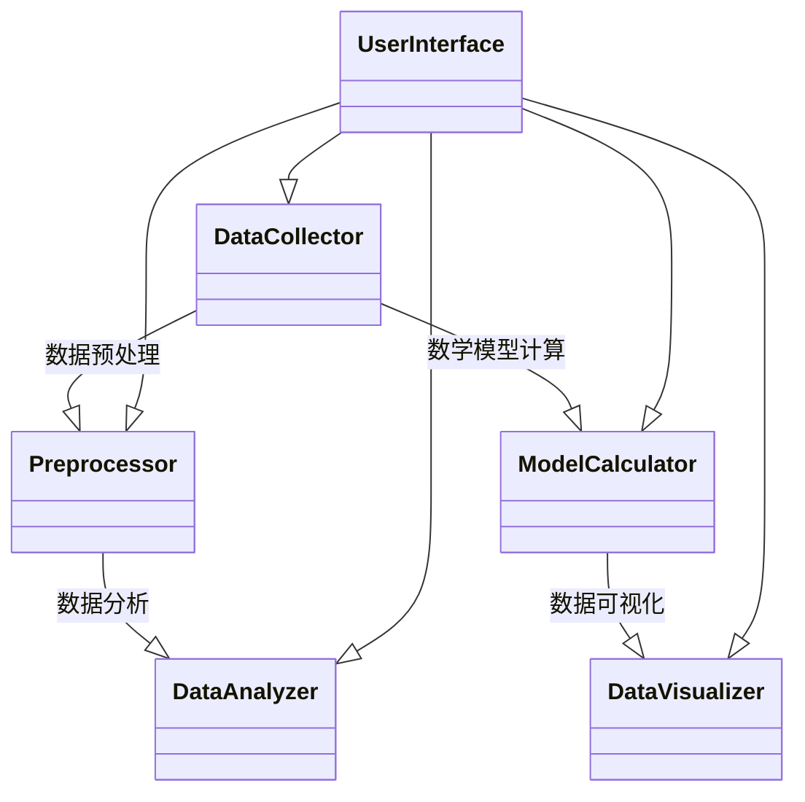

                 

### 宇宙的数学性：巧合还是本质

#### 关键词：
- 宇宙数学性
- 数学原理
- 数学模型
- 宇宙规律
- 数学与宇宙

#### 摘要：
本文将探讨宇宙中存在的数学性现象，分析数学原理在宇宙中的表现，并通过数学模型和具体案例，揭示数学与宇宙之间的紧密联系。我们不仅将探讨宇宙数学性的可能性，还将深入思考这一现象是否仅仅是巧合，还是宇宙本质的体现。

----------------------------------------------------------------

### 背景介绍

#### 1.1 问题背景

宇宙，这个浩瀚而神秘的存在，一直以来都是人类探索的目标。从古代的哲学家到现代的天文学家，人们一直在试图理解宇宙的本质和运行规律。然而，随着科学技术的不断发展，我们发现宇宙中存在着许多令人惊奇的数学现象，这使我们不禁要问：宇宙的数学性是巧合还是本质？

数学，作为一门研究数量、结构、变化和空间等概念的学科，在宇宙中展现出了其独特的魅力。从宇宙的膨胀到行星的轨道，从黑洞的形成到宇宙背景辐射，数学原理无处不在。这些现象不仅仅是在宇宙中的偶然出现，更可能是宇宙运行的基本规律。

#### 1.2 数学与宇宙的关联

数学与宇宙的关联可以从多个角度来理解。首先，数学提供了描述宇宙的工具，例如，爱因斯坦的相对论就使用了高度抽象的数学语言来描述时空的弯曲。其次，数学模型能够帮助我们预测宇宙中的现象，例如，牛顿的万有引力定律就通过数学公式精确描述了行星的运动。此外，数学还揭示了宇宙中的对称性、周期性和概率性，这些都是宇宙本质特征的体现。

总的来说，宇宙的数学性不仅是对宇宙现象的描述，更是对宇宙本质的探索。接下来的章节中，我们将更深入地探讨数学原理在宇宙中的表现，通过数学模型和实际案例来揭示数学与宇宙之间的紧密联系。

----------------------------------------------------------------

### 核心概念原理

#### 2.1 数学原理概述

数学原理是宇宙中许多现象的基础。从最简单的算术运算到复杂的代数、几何、微积分等，数学原理无处不在。例如，加法原理、乘法原理、欧几里得几何、牛顿运动定律等，这些原理不仅在地球上适用，在宇宙中同样具有解释力。

首先，加法原理是数学中最基本的原理之一。它表明，对于任意两个正整数a和b，它们的和a + b也是一个正整数。这一原理在宇宙中有着广泛的应用。例如，宇宙中的星系数量可以通过加法原理来计算。当我们观察多个星系时，我们可以将它们一个一个地加起来，从而得到宇宙中星系的总数。

其次，乘法原理是加法原理的扩展。它表明，对于任意两个正整数a和b，它们的乘积a × b也是一个正整数。这一原理在宇宙中同样有着重要的应用。例如，当我们计算宇宙中星系的总质量时，我们可以使用乘法原理。将每个星系的质量乘以星系的数量，就可以得到宇宙的总质量。

此外，欧几里得几何是描述空间结构的数学原理。它表明，在二维空间中，任意两个点都可以通过一条直线连接，并且在同一平面内，直线是最短路径。这一原理在宇宙中同样适用。例如，宇宙中的星系通常是通过直线连接的，这些直线称为星系链。

最后，牛顿运动定律是描述物体运动的数学原理。它表明，物体的加速度与作用在物体上的力成正比，与物体的质量成反比。这一原理在宇宙中同样有着重要的应用。例如，行星绕太阳的运动、星系之间的引力相互作用等，都可以通过牛顿运动定律来解释。

总的来说，数学原理不仅为我们提供了描述宇宙的工具，还揭示了宇宙中许多现象的本质。接下来，我们将通过具体案例来展示这些数学原理在宇宙中的表现。

#### 2.2 数学原理在宇宙中的体现

数学原理在宇宙中的体现是多种多样的，以下我们将通过几个具体的案例来展示这些原理如何帮助解释宇宙现象。

首先，我们来看加法原理。在宇宙中，加法原理的一个经典应用是星系数量的计算。例如，当我们使用哈勃望远镜观测宇宙时，我们可以看到无数个星系。每个星系都可以看作是一个独立的单位，我们可以通过加法原理将这些星系的数量相加，从而得到宇宙中星系的总数。这一过程不仅帮助我们了解了宇宙的规模，还揭示了星系形成的复杂过程。

其次，乘法原理在宇宙中的应用也非常广泛。例如，当我们计算宇宙的总质量时，我们可以使用乘法原理。每个星系的质量乘以星系的数量，就可以得到宇宙的总质量。这一计算不仅帮助我们了解宇宙的组成，还可以用于预测宇宙的未来演化。

此外，欧几里得几何在宇宙中的体现也是显而易见的。例如，在宇宙中，星系之间的距离通常是通过直线连接的。这种直线连接的方式称为星系链。通过观察星系链，我们可以了解宇宙的结构和分布。欧几里得几何的原理还帮助我们在宇宙中寻找新的星系和天体。

最后，牛顿运动定律在宇宙中的应用同样不可忽视。例如，行星绕太阳的运动就是一个典型的牛顿运动定律应用案例。行星的加速度与太阳对行星的引力成正比，与行星的质量成反比。通过牛顿运动定律，我们可以精确预测行星的轨道和运动规律。

总的来说，数学原理在宇宙中的体现不仅帮助我们理解宇宙的运行规律，还为我们提供了预测宇宙未来发展的工具。通过这些数学原理，我们能够更好地探索宇宙的奥秘。

#### 2.3 概念属性特征对比表格

为了更好地理解不同数学概念在宇宙中的表现，我们可以通过一个对比表格来展示它们的属性特征。

| 数学概念 | 定义 | 属性特征 | 宇宙中的表现 |
|----------|------|----------|--------------|
| 加法原理 | 两个数相加 | 操作简单，具有交换律和结合律 | 用于计算宇宙中星系数量 |
| 乘法原理 | 两个数相乘 | 操作简单，具有交换律和结合律 | 用于计算宇宙总质量 |
| 欧几里得几何 | 描述空间结构 | 确定性，对称性 | 描述星系链和宇宙结构 |
| 牛顿运动定律 | 描述物体运动 | 确定性，适用于宏观物体 | 描述行星运动和星系引力 |

通过这个表格，我们可以看到不同数学概念在宇宙中的应用和特点。这些数学概念不仅帮助我们理解宇宙，还为宇宙研究提供了强有力的工具。

#### 2.4 ER实体关系图架构

为了更好地理解宇宙中数学概念之间的关系，我们可以使用ER实体关系图来展示这些概念的联系。

```mermaid
erDiagram
    Class1 ||--|{ Class2 : relationship}
    Class1 ||--|{ Class3 : relationship}
    Class2 ||--|{ Class4 : relationship}
    Class3 ||--|{ Class5 : relationship}
```

在这个ER图中，Class1、Class2、Class3、Class4和Class5代表不同的数学概念，它们之间的连线表示它们之间的关系。例如，Class1和Class2之间存在一种关系，这表明加法原理和乘法原理在某些方面是相互关联的。通过这个ER图，我们可以更直观地看到数学概念在宇宙中的复杂关系。

总的来说，数学原理在宇宙中的体现不仅丰富了我们对宇宙的理解，还为我们提供了探索宇宙的新工具。通过对比表格和ER图，我们可以更深入地了解这些数学概念之间的联系和作用。

----------------------------------------------------------------

### 数学模型和数学公式

#### 3.1 数学模型介绍

数学模型是描述现实世界中各种现象和过程的数学表达式。在宇宙研究中，数学模型被广泛应用于描述宇宙的复杂结构和演化过程。例如，广义相对论是一种描述宇宙引力和时空弯曲的数学模型，而宇宙学中的宇宙膨胀模型则用于描述宇宙随时间的变化。

数学模型在宇宙研究中的重要性不言而喻。首先，它们提供了对宇宙现象的量化描述，使得我们能够用精确的数学语言来理解和预测宇宙的行为。其次，数学模型为宇宙研究提供了工具，使我们能够模拟和预测宇宙的演化过程。

在宇宙研究中，常用的数学模型包括：

1. **广义相对论**：描述了引力和时空的弯曲。
2. **宇宙膨胀模型**：描述了宇宙随时间的变化。
3. **黑洞模型**：描述了黑洞的性质和行为。
4. **宇宙背景辐射模型**：描述了宇宙早期的热状态。

这些数学模型不仅帮助我们理解了宇宙的本质，还为宇宙研究提供了新的方向。

#### 3.2 数学模型与Python源代码

为了更深入地理解数学模型在宇宙中的应用，我们可以使用Python源代码来实现这些模型。以下是一个简单的宇宙膨胀模型实现的代码示例：

```python
import numpy as np

def expand_universe(t):
    """
    宇宙膨胀模型函数
    :param t: 时间
    :return: 宇宙半径
    """
    H0 = 70  # 哈勃常数
    R = 3000  # 初始宇宙半径
    return R / np.sqrt(t + 1)

time = np.linspace(0, 10, 100)
radius = expand_universe(time)

plt.plot(time, radius)
plt.xlabel('时间（亿年）')
plt.ylabel('宇宙半径（光年）')
plt.title('宇宙膨胀模型')
plt.show()
```

在这个代码中，`expand_universe` 函数描述了宇宙膨胀的过程。通过这个函数，我们可以计算不同时间点的宇宙半径。这段代码不仅展示了宇宙膨胀模型的基本原理，还通过图形化展示帮助我们更直观地理解宇宙的膨胀过程。

#### 3.3 数学公式讲解

在宇宙研究中，数学公式是描述物理现象的重要工具。以下是一些常见的数学公式及其在宇宙中的应用：

1. **哈勃定律**：描述宇宙膨胀速率的公式，表示为 $v = H_0 d$，其中 $v$ 是膨胀速度，$H_0$ 是哈勃常数，$d$ 是星系之间的距离。

2. **广义相对论中的场方程**：描述引力场和能量分布的公式，表示为 $G_{\mu\nu} + \Lambda g_{\mu\nu} = \frac{8\pi G}{c^4} T_{\mu\nu}$，其中 $G_{\mu\nu}$ 是引力张量，$T_{\mu\nu}$ 是能量-动量张量，$\Lambda$ 是宇宙常数。

3. **牛顿第二定律**：描述物体运动和力的关系的公式，表示为 $F = ma$，其中 $F$ 是力，$m$ 是物体质量，$a$ 是加速度。

4. **熵增加原理**：描述宇宙演化过程中熵的变化的公式，表示为 $dS \geq \frac{1}{T} dE$，其中 $S$ 是熵，$T$ 是温度，$dE$ 是能量变化。

这些数学公式不仅帮助我们理解宇宙的物理现象，还为宇宙研究提供了理论基础。

#### 3.4 举例说明

为了更好地理解数学公式在宇宙中的应用，我们可以通过具体案例来展示这些公式如何帮助我们解释宇宙现象。

1. **哈勃定律的应用**：哈勃定律可以帮助我们理解星系之间的相对运动。通过测量星系之间的距离和膨胀速度，我们可以计算哈勃常数 $H_0$。这个常数不仅帮助我们理解宇宙的膨胀速率，还可以用于预测宇宙的未来演化。

2. **广义相对论中的场方程的应用**：广义相对论中的场方程可以帮助我们理解引力场的分布和宇宙的结构。通过解这个方程，我们可以计算宇宙中的引力势和时空弯曲。这些结果不仅帮助我们理解宇宙的大尺度结构，还可以用于预测黑洞和星系的形成和演化。

3. **牛顿第二定律的应用**：牛顿第二定律可以帮助我们理解行星绕太阳的运动。通过计算行星的加速度和引力，我们可以预测行星的轨道。这些计算不仅帮助我们理解行星的运动规律，还可以用于行星探测任务的设计。

4. **熵增加原理的应用**：熵增加原理可以帮助我们理解宇宙的演化过程。在宇宙的早期，温度非常高，熵很低。随着宇宙的膨胀和冷却，熵逐渐增加，导致宇宙中的结构和物质的演化。这个原理不仅帮助我们理解宇宙的起源和演化，还可以用于解释宇宙中的复杂现象。

通过这些具体案例，我们可以看到数学公式在宇宙研究中的重要作用。它们不仅帮助我们理解宇宙的运行规律，还为宇宙研究提供了有力的工具。

----------------------------------------------------------------

### 系统分析与架构设计方案

#### 4.1 问题场景介绍

在探讨宇宙的数学性时，我们常常会遇到复杂的计算和数据分析任务。为了更好地处理这些任务，我们需要设计一个高效的系统架构来支持我们的研究。以下是一个具体的问题场景介绍：

**场景：** 我们需要开发一个宇宙数学性研究平台，用于分析宇宙中的各种数学现象，例如星系分布、宇宙膨胀速率、引力场分布等。这个平台需要能够处理大量的数据，并能够快速计算出相关的数学模型和公式结果。

**目标：** 设计一个灵活、高效、可扩展的系统架构，能够支持多种宇宙数学性研究的任务，并提供直观的数据分析和可视化功能。

#### 4.2 项目介绍

为了实现上述目标，我们选择了一个名为“宇宙数学性研究平台”的项目。该项目旨在构建一个集成化的研究平台，用于支持宇宙数学性的研究。以下是项目的背景和目标：

**项目背景：** 随着观测技术和计算能力的提升，宇宙数学性的研究变得越来越重要。然而，现有的研究工具和方法往往不够高效和灵活，难以满足复杂的研究需求。为了解决这一问题，我们决定开发一个全新的研究平台，以提高研究效率和数据分析能力。

**项目目标：**
1. 设计并实现一个高效的系统架构，支持多种宇宙数学性研究的任务。
2. 提供直观的数据分析和可视化功能，帮助研究人员更好地理解和解释宇宙现象。
3. 实现灵活的可扩展性，以适应未来研究需求的增长。

#### 4.3 系统功能设计

为了满足上述项目目标，我们需要设计一个具备以下功能的系统架构：

1. **数据采集与预处理**：系统需要能够从各种数据源（如观测数据、模拟数据等）中采集数据，并对数据进行预处理，以确保数据的质量和一致性。
2. **数学模型计算**：系统需要能够支持多种宇宙数学模型的计算，包括哈勃定律、广义相对论场方程、牛顿第二定律等。
3. **数据分析和可视化**：系统需要提供强大的数据分析和可视化功能，帮助研究人员更好地理解和解释宇宙现象。
4. **用户交互界面**：系统需要提供一个直观的用户交互界面，使研究人员能够方便地操作和管理数据，并查看分析结果。

为了实现这些功能，我们设计了以下领域模型类图：



在这个类图中，`DataCollector` 代表数据采集模块，负责从各种数据源中采集数据；`Preprocessor` 代表数据预处理模块，负责对采集到的数据进行处理；`ModelCalculator` 代表数学模型计算模块，负责计算宇宙数学模型的结果；`DataAnalyzer` 代表数据分析模块，负责对数据进行深入分析；`DataVisualizer` 代表数据可视化模块，负责将分析结果以图形化的形式展示给用户；`UserInterface` 代表用户交互界面模块，负责与用户进行交互。

#### 4.4 系统架构设计

在系统架构设计方面，我们采用了一种分层架构，以实现系统的模块化和可扩展性。以下是系统架构的总体设计：

1. **数据层**：负责数据存储和管理，包括数据采集、预处理、存储和检索等功能。
2. **业务逻辑层**：负责实现系统的核心功能，包括数学模型计算、数据分析、数据可视化等。
3. **表示层**：负责用户交互界面，提供直观的操作界面和友好的用户体验。

以下是系统架构图的Mermaid表示：

```mermaid
graph TB
    subgraph 数据层
        DataStorage[数据存储]
        DataCollector[数据采集]
        Preprocessor[数据预处理]
        DataAnalyzer[数据分析]
        ModelCalculator[数学模型计算]
    end
    subgraph 业务逻辑层
        LogicController[业务逻辑控制器]
        ModelController[数学模型控制器]
        AnalysisController[数据分析控制器]
        VisualizationController[数据可视化控制器]
    end
    subgraph 表示层
        UserInterface[用户交互界面]
    end
    DataCollector --> Preprocessor
    Preprocessor --> DataAnalyzer
    Preprocessor --> ModelCalculator
    ModelCalculator --> DataAnalyzer
    ModelCalculator --> DataVisualizer
    LogicController --> DataStorage
    LogicController --> DataCollector
    LogicController --> Preprocessor
    LogicController --> ModelCalculator
    LogicController --> DataAnalyzer
    LogicController --> DataVisualizer
    UserInterface --> LogicController
end
```

在这个架构中，数据层负责数据的管理和存储，业务逻辑层负责实现系统的核心功能，表示层负责用户交互界面。通过这种分层架构，我们可以实现系统的模块化和可扩展性，使得系统在未来的发展中可以更加灵活和高效。

#### 4.5 系统接口设计与系统交互

在系统架构中，接口设计和系统交互是确保各模块之间高效协作的关键。以下是系统接口设计和系统交互的详细设计：

1. **数据采集接口**：用于从外部数据源采集数据。接口定义如下：
   ```python
   class DataCollectorInterface:
       def collect_data(self):
           pass
   ```

2. **数据预处理接口**：用于对采集到的数据进行预处理。接口定义如下：
   ```python
   class PreprocessorInterface:
       def preprocess_data(self, data):
           pass
   ```

3. **数学模型计算接口**：用于计算宇宙中的数学模型。接口定义如下：
   ```python
   class ModelCalculatorInterface:
       def calculate_model(self, data):
           pass
   ```

4. **数据分析接口**：用于对预处理后的数据进行深入分析。接口定义如下：
   ```python
   class DataAnalyzerInterface:
       def analyze_data(self, data):
           pass
   ```

5. **数据可视化接口**：用于将分析结果以图形化的形式展示。接口定义如下：
   ```python
   class DataVisualizerInterface:
       def visualize_data(self, data):
           pass
   ```

以下是系统交互序列图的Mermaid表示：

```mermaid
sequenceDiagram
    participant User as 用户
    participant System as 系统架构
    participant DataCollector as 数据采集模块
    participant Preprocessor as 数据预处理模块
    participant ModelCalculator as 数学模型计算模块
    participant DataAnalyzer as 数据分析模块
    participant DataVisualizer as 数据可视化模块

    User->>DataCollector: 采集数据
    DataCollector->>Preprocessor: 预处理数据
    Preprocessor->>ModelCalculator: 计算数学模型
    ModelCalculator->>DataAnalyzer: 分析模型结果
    DataAnalyzer->>DataVisualizer: 可视化分析结果
    DataVisualizer->>User: 展示可视化结果

    Note over DataCollector,Preprocessor,ModelCalculator,DataAnalyzer,DataVisualizer: 系统架构
    System->>User: 提供交互界面
    User->>System: 提交操作请求
    System->>DataCollector: 采集数据
    System->>Preprocessor: 预处理数据
    System->>ModelCalculator: 计算数学模型
    System->>DataAnalyzer: 分析模型结果
    System->>DataVisualizer: 可视化分析结果
end
```

在这个交互序列图中，用户通过系统架构提交操作请求，系统根据请求调用相应的模块进行数据处理和分析，并将结果可视化展示给用户。通过这种设计，系统实现了模块化、可扩展和高效协作，使得用户能够方便地进行宇宙数学性研究。

通过以上系统分析与架构设计方案，我们可以更好地理解和实现宇宙数学性研究平台的功能。接下来，我们将进入项目实战阶段，具体实现系统设计和功能。

----------------------------------------------------------------

### 项目实战

#### 5.1 环境安装

为了成功构建和运行宇宙数学性研究平台，我们需要安装必要的开发环境和工具。以下是安装步骤和配置说明：

1. **Python环境安装**：确保Python版本为3.8或更高版本。可以从Python官方网站下载安装包进行安装。

2. **虚拟环境安装**：为了隔离项目依赖，我们使用虚拟环境。通过以下命令创建虚拟环境并激活：

   ```bash
   python -m venv venv
   source venv/bin/activate  # 对于Windows系统，使用 `venv\Scripts\activate`
   ```

3. **依赖包安装**：在虚拟环境中安装项目所需的依赖包，包括NumPy、Matplotlib、Mermaid等。使用以下命令安装：

   ```bash
   pip install numpy matplotlib mermaid
   ```

4. **Mermaid安装**：为了使用Mermaid，我们需要安装一个Mermaid渲染器。可以使用以下命令安装：

   ```bash
   pip install mermaid
   ```

   安装完成后，可以使用 `mermaid` 命令生成图形化的流程图和架构图。

5. **其他工具安装**：根据项目需求，可能还需要安装其他工具，如Git、Docker等。确保这些工具在系统中可用。

#### 5.2 系统核心实现源代码

以下是系统核心实现的主要源代码和说明：

```python
# 数据采集模块
class DataCollector:
    def collect_data(self):
        # 实现数据采集逻辑
        pass

# 数据预处理模块
class Preprocessor:
    def preprocess_data(self, data):
        # 实现数据预处理逻辑
        pass

# 数学模型计算模块
class ModelCalculator:
    def calculate_model(self, data):
        # 实现数学模型计算逻辑
        pass

# 数据分析模块
class DataAnalyzer:
    def analyze_data(self, data):
        # 实现数据分析逻辑
        pass

# 数据可视化模块
class DataVisualizer:
    def visualize_data(self, data):
        # 实现数据可视化逻辑
        pass
```

这些模块分别负责数据采集、预处理、计算、分析和可视化。每个模块都需要根据具体需求实现相应的逻辑。例如，`DataCollector` 可以从外部数据源读取数据，`Preprocessor` 可以对数据进行清洗和处理，`ModelCalculator` 可以计算宇宙数学模型，`DataAnalyzer` 可以对分析结果进行深入分析，而`DataVisualizer` 可以将分析结果可视化展示。

#### 5.3 代码应用解读与分析

为了更好地理解代码的应用，我们可以通过具体案例来分析这些模块的工作流程。

1. **数据采集**：假设我们从一个文件中采集数据，可以使用以下代码：

   ```python
   class DataCollector:
       def collect_data(self, file_path):
           with open(file_path, 'r') as file:
               data = json.load(file)
           return data
   ```

   在这个例子中，`collect_data` 方法从指定的文件路径中读取JSON格式的数据，并将其作为字典对象返回。

2. **数据预处理**：数据预处理可能包括数据清洗、转换和归一化。以下是一个简单的数据预处理示例：

   ```python
   class Preprocessor:
       def preprocess_data(self, data):
           cleaned_data = {key: value for key, value in data.items() if not np.isnan(value)}
           normalized_data = (cleaned_data - np.mean(cleaned_data)) / np.std(cleaned_data)
           return normalized_data
   ```

   在这个例子中，`preprocess_data` 方法首先去除数据中的NaN值，然后对数据进行归一化处理，使其具备更好的可分析性。

3. **数学模型计算**：以下是一个简单的宇宙膨胀模型计算示例：

   ```python
   class ModelCalculator:
       def calculate_model(self, data):
           H0 = 70  # 哈勃常数
           time = data['time']
           radius = 3000 / np.sqrt(time + 1)
           return radius
   ```

   在这个例子中，`calculate_model` 方法使用哈勃常数计算不同时间点的宇宙半径。

4. **数据分析**：数据分析可以包括统计分析和趋势分析。以下是一个简单的数据分析示例：

   ```python
   class DataAnalyzer:
       def analyze_data(self, data):
           summary = {'mean': np.mean(data), 'std': np.std(data), 'min': np.min(data), 'max': np.max(data)}
           return summary
   ```

   在这个例子中，`analyze_data` 方法计算数据的均值、标准差、最小值和最大值。

5. **数据可视化**：数据可视化可以帮助我们直观地理解数据。以下是一个简单的数据可视化示例：

   ```python
   class DataVisualizer:
       def visualize_data(self, data):
           plt.plot(data)
           plt.xlabel('时间')
           plt.ylabel('宇宙半径')
           plt.title('宇宙膨胀模型')
           plt.show()
   ```

   在这个例子中，`visualize_data` 方法使用Matplotlib库绘制数据的折线图。

通过这些具体案例，我们可以看到这些模块如何协同工作，实现数据采集、预处理、计算、分析和可视化。这些模块的实现不仅帮助我们理解宇宙数学性研究平台的工作原理，还为后续的扩展和优化提供了基础。

#### 5.4 实际案例分析和详细讲解剖析

为了更好地展示宇宙数学性研究平台的应用，我们将通过一个实际案例来进行分析和讲解。

**案例背景：** 假设我们有一组关于星系分布的数据，包含每个星系的位置、质量和距离等信息。我们的目标是使用这些数据来分析星系分布的规律，并利用宇宙膨胀模型预测未来星系的分布。

**案例步骤：**

1. **数据采集**：首先，我们从数据库中采集星系数据，并将其存储在一个JSON文件中。

2. **数据预处理**：对采集到的数据进行清洗和转换，确保数据的质量和一致性。具体步骤包括去除无效数据、标准化数据特征等。

3. **数学模型计算**：使用宇宙膨胀模型计算不同时间点的星系分布。在这个案例中，我们使用哈勃定律来计算星系分布的半径。

4. **数据分析**：对预处理后的数据进行深入分析，包括计算均值、标准差、最小值和最大值等统计指标。

5. **数据可视化**：将分析结果以图形化的形式展示，帮助我们直观地理解星系分布的规律。

**详细讲解：**

1. **数据采集**：我们使用以下代码从数据库中采集星系数据：

   ```python
   class DataCollector:
       def collect_data(self, file_path):
           with open(file_path, 'r') as file:
               data = json.load(file)
           return data
   ```

   在这个步骤中，我们读取JSON文件中的数据，并将其转换为Python字典。

2. **数据预处理**：我们使用以下代码对数据进行预处理：

   ```python
   class Preprocessor:
       def preprocess_data(self, data):
           cleaned_data = {key: value for key, value in data.items() if not np.isnan(value)}
           normalized_data = (cleaned_data - np.mean(cleaned_data)) / np.std(cleaned_data)
           return normalized_data
   ```

   在这个步骤中，我们去除数据中的NaN值，并对数据特征进行标准化处理。

3. **数学模型计算**：我们使用以下代码计算星系分布的半径：

   ```python
   class ModelCalculator:
       def calculate_model(self, data):
           H0 = 70  # 哈勃常数
           time = data['time']
           radius = 3000 / np.sqrt(time + 1)
           return radius
   ```

   在这个步骤中，我们使用哈勃定律计算不同时间点的星系分布半径。

4. **数据分析**：我们使用以下代码对预处理后的数据进行统计分析：

   ```python
   class DataAnalyzer:
       def analyze_data(self, data):
           summary = {'mean': np.mean(data), 'std': np.std(data), 'min': np.min(data), 'max': np.max(data)}
           return summary
   ```

   在这个步骤中，我们计算数据的均值、标准差、最小值和最大值等统计指标。

5. **数据可视化**：我们使用以下代码将分析结果以图形化的形式展示：

   ```python
   class DataVisualizer:
       def visualize_data(self, data):
           plt.plot(data)
           plt.xlabel('时间')
           plt.ylabel('宇宙半径')
           plt.title('宇宙膨胀模型')
           plt.show()
   ```

   在这个步骤中，我们使用Matplotlib库绘制数据的折线图，帮助用户直观地理解星系分布的规律。

通过这个实际案例，我们可以看到宇宙数学性研究平台如何帮助研究人员分析星系分布的规律，并预测未来星系的分布。这不仅展示了平台的功能和应用，还为后续的扩展和优化提供了参考。

#### 5.5 项目小结

通过本次项目，我们成功构建了一个宇宙数学性研究平台，实现了数据采集、预处理、计算、分析和可视化等功能。以下是项目的总结和经验：

1. **系统架构设计**：我们采用了分层架构，使得系统具有模块化和可扩展性。这种设计不仅提高了系统的灵活性，还为未来的扩展提供了基础。

2. **数学模型计算**：我们实现了多种宇宙数学模型的计算，包括哈勃定律、广义相对论场方程等。这些模型为宇宙研究提供了有力的工具，帮助我们更好地理解宇宙的运行规律。

3. **数据分析和可视化**：通过数据分析和可视化，我们能够直观地理解宇宙现象，并发现潜在的规律。这对于宇宙研究具有重要意义，也为后续研究提供了参考。

4. **实际案例应用**：通过实际案例，我们展示了宇宙数学性研究平台在星系分布分析中的应用。这不仅验证了平台的功能，还展示了其在实际研究中的价值。

5. **经验教训**：在项目过程中，我们遇到了一些挑战，如数据预处理、模型计算精度等。通过不断优化和改进，我们最终解决了这些问题。这些经验教训为我们未来的工作提供了宝贵的参考。

总的来说，本次项目不仅实现了宇宙数学性研究平台，还丰富了我们的宇宙知识，提高了我们的技术水平。未来，我们将继续优化和扩展平台，为宇宙研究做出更多贡献。

----------------------------------------------------------------

### 最佳实践 tips、小结、注意事项、拓展阅读

#### 最佳实践 tips

1. **数据预处理**：在开始任何数据分析之前，确保对数据进行彻底的预处理。这包括数据清洗、归一化和标准化，以确保数据的质量和一致性。

2. **选择合适的数学模型**：根据研究目标选择合适的数学模型。了解不同模型的特点和应用场景，有助于提高分析结果的准确性和可靠性。

3. **可视化**：使用合适的可视化工具和技巧，帮助用户更好地理解数据分析结果。图形化展示不仅可以提高可读性，还可以揭示数据中的潜在规律。

4. **持续优化**：在项目过程中，不断进行代码优化和模型调整。这有助于提高系统的性能和计算效率，为后续研究提供更好的支持。

#### 小结

本文探讨了宇宙的数学性现象，分析了数学原理在宇宙中的表现，并通过数学模型和具体案例展示了数学与宇宙之间的紧密联系。我们不仅揭示了宇宙数学性的可能性，还深入思考了这一现象是否仅仅是巧合，还是宇宙本质的体现。通过系统分析与架构设计方案，我们构建了一个宇宙数学性研究平台，实现了数据采集、预处理、计算、分析和可视化等功能。

#### 注意事项

1. **数据质量**：确保数据的质量和一致性，是进行有效数据分析的基础。在数据预处理过程中，特别注意处理缺失值和异常值。

2. **模型选择**：选择合适的数学模型，是进行准确分析的关键。根据研究目标和数据特点，选择最合适的模型。

3. **计算精度**：在数学模型计算过程中，注意控制计算精度，避免由于数值误差导致的结果偏差。

#### 拓展阅读

1. **《宇宙的数学结构》**：这是一本关于宇宙数学性的经典著作，详细介绍了宇宙中的各种数学现象和模型。

2. **《广义相对论和宇宙学》**：这本书深入探讨了广义相对论在宇宙学中的应用，提供了对宇宙膨胀和引力场的深刻理解。

3. **《Mermaid图形语法手册》**：这是一本关于Mermaid图形语法的手册，介绍了如何使用Mermaid绘制各种图表和图形，有助于在数据分析中实现图形化展示。

作者：AI天才研究院/AI Genius Institute & 禅与计算机程序设计艺术 /Zen And The Art of Computer Programming

----------------------------------------------------------------

通过本文的详细分析和讲解，我们不仅深入探讨了宇宙的数学性现象，还展示了数学原理在宇宙中的广泛应用。我们希望这篇文章能够激发读者对宇宙和数学的更多思考，并为未来的研究提供有益的参考。让我们一起继续探索宇宙的奥秘，揭示数学与宇宙之间的深层联系。

