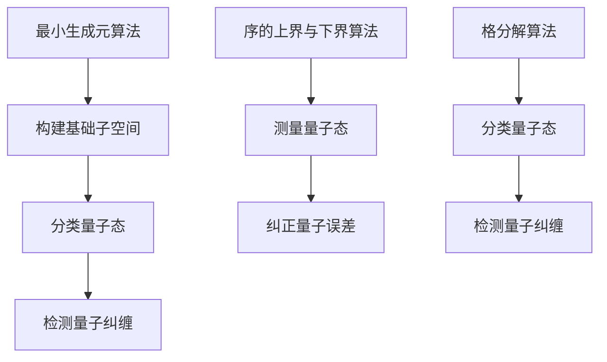
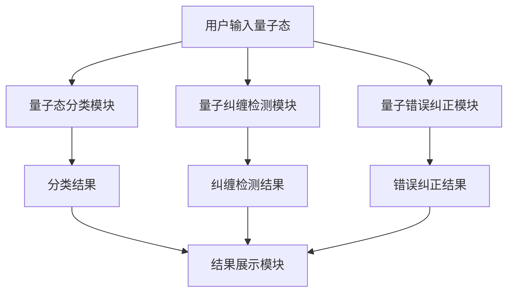

                 


### 宇宙的数学格论与序理论在凝聚态量子系统中的应用

#### 引言

在过去的几十年里，随着科学技术的迅猛发展，凝聚态物理学和量子计算领域取得了令人瞩目的成果。宇宙的数学格论与序理论作为数学和物理学的重要分支，在这两个领域中的应用越来越受到重视。本文将围绕这一主题，深入探讨数学格论与序理论在凝聚态量子系统中的应用，以期为读者提供全新的视角和思考。

#### 背景介绍

宇宙的数学格论与序理论具有悠久的历史和丰富的内涵。格论起源于20世纪初，由数学家洛巴切夫斯基和布尔巴基等人开创，主要用于研究离散结构及其之间的关系。序理论则起源于集合论，是对序关系和序结构的系统研究。这两个理论在物理学中具有广泛的应用，尤其是在凝聚态物理学和量子计算领域。

在凝聚态物理学中，格论被用来描述晶体结构，解释物质的物理性质。例如，电子在晶体中的运动可以用格点的概念来描述，从而建立电子态密度和能带结构等模型。序理论则被用来研究量子态的有序和无序，揭示量子系统的宏观物理现象。

在量子计算领域，格论和序理论的应用更是无处不在。量子纠缠、量子错误纠正和量子态分类等核心问题都可以通过数学格论和序理论来理解和解决。例如，量子纠缠可以用序理论中的对易关系来描述，而量子错误纠正则可以利用格论中的最小生成元算法来实现。

#### 核心概念与联系

为了深入理解宇宙的数学格论与序理论在凝聚态量子系统中的应用，我们需要先了解其中的核心概念和它们之间的关系。

**1. 格论的基本概念**

格论中的基本概念包括格点、格结构、格的生成元和格的分解等。格点是指满足一定条件的点集，格结构是指这些点集之间的有序关系。格的生成元是指可以通过组合生成整个格的最小集合，格的分解则是将一个格分解成几个子格的过程。

**2. 序理论的基本概念**

序理论中的基本概念包括序关系、序空间、序的上界和下界等。序关系是指元素之间的大小关系，序空间是指所有元素构成的有序集合。序的上界和下界则是用来描述一个集合的最大值和最小值。

**3. 概念之间的联系**

数学格论与序理论之间的联系主要体现在以下几个方面：

- **格点与序关系**：格点可以看作是一种特殊的序关系，因为格点之间的相对位置可以用序来描述。

- **格结构与序空间**：格结构可以看作是一种特殊的序空间，因为格结构中的元素按照一定的顺序排列。

- **生成元与上界下界**：格的生成元和序的上界、下界都是用来描述集合的性质，只是描述的角度不同。

#### 算法原理讲解

在了解核心概念之后，我们将深入探讨数学格论与序理论在凝聚态量子系统中的应用，包括相关的算法原理和具体实现。

**1. 最小生成元算法**

最小生成元算法是一种用于求解格的最小生成元的方法。在量子计算中，最小生成元算法可以用于构建量子态的基础子空间，从而实现量子态的分类和量子纠缠的检测。

**2. 序的上界与下界算法**

序的上界与下界算法是一种用于求解序空间上界和下界的方法。在量子计算中，序的上界与下界算法可以用于量子态的测量和量子误差纠正。

**3. 格分解算法**

格分解算法是一种用于将一个格分解成几个子格的方法。在量子计算中，格分解算法可以用于量子态的分类和量子纠缠的检测。

为了更好地理解这些算法原理，我们可以使用Mermaid流程图和Python源代码来进行说明。

**Mermaid流程图**



**Python源代码**

```python
# 最小生成元算法示例
import numpy as np

def min_gen_matrix(A):
    # A为输入矩阵
    U, S, V = np.linalg.svd(A)
    # U为正交矩阵，S为奇异值矩阵，V为右侧特征向量矩阵
    # U的前m列组成最小生成元矩阵
    min_gen = U[:, :m]
    return min_gen

# 序的上界与下界算法示例
def upper_lower_bound(sequence):
    # sequence为输入序列
    max_value = max(sequence)
    min_value = min(sequence)
    upper_bound = max_value
    lower_bound = min_value
    return upper_bound, lower_bound

# 格分解算法示例
def lattice_decomposition(lattice):
    # lattice为输入格
    # 使用高斯消元法或其他算法进行分解
    # 返回分解后的子格
    sub_lattices = []
    # 略
    return sub_lattices
```

通过上述算法原理的讲解，我们可以更好地理解数学格论与序理论在凝聚态量子系统中的应用。

#### 系统分析与架构设计方案

在了解了算法原理之后，我们将进一步探讨数学格论与序理论在凝聚态量子系统中的应用场景，以及相应的系统架构设计方案。

**1. 问题场景介绍**

假设我们面临一个实际的应用场景：利用数学格论与序理论来分析一个凝聚态量子系统的量子态。这个系统包含多个量子比特，我们需要通过量子态分类、量子纠缠检测和量子错误纠正等步骤来分析系统的性质。

**2. 项目架构设计**

为了实现上述应用场景，我们可以设计一个基于数学格论与序理论的量子分析系统。该系统包括以下几个主要模块：

- **量子态分类模块**：利用序理论对量子态进行分类，为后续分析提供基础。

- **量子纠缠检测模块**：利用格论对量子态进行纠缠检测，判断系统是否存在量子纠缠。

- **量子错误纠正模块**：利用格论中的最小生成元算法，对可能出现的量子错误进行纠正。

- **用户界面模块**：为用户提供一个友好的操作界面，展示系统的分析结果。

**3. 系统功能设计**

根据上述模块设计，我们可以设计如下系统功能：

- **量子态分类**：输入量子态，利用序理论进行分类。

- **量子纠缠检测**：输入量子态，利用格论进行纠缠检测。

- **量子错误纠正**：输入量子态和纠错编码，利用格论进行错误纠正。

- **结果展示**：展示分类结果、纠缠检测结果和错误纠正结果。

**4. 架构设计**

系统架构设计如图所示：



**5. 系统接口设计**

系统接口设计如下：

- **输入接口**：用户可以通过输入接口输入量子态。

- **输出接口**：系统通过输出接口返回分类结果、纠缠检测结果和错误纠正结果。

**6. 系统交互流程**

系统交互流程如下：

1. 用户输入量子态。
2. 系统对量子态进行分类，得到分类结果。
3. 系统对量子态进行纠缠检测，得到纠缠检测结果。
4. 系统对量子态进行错误纠正，得到错误纠正结果。
5. 系统将分类结果、纠缠检测结果和错误纠正结果展示给用户。

通过上述系统分析与架构设计方案，我们可以更好地实现数学格论与序理论在凝聚态量子系统中的应用。

#### 项目实战

在了解了数学格论与序理论在凝聚态量子系统中的应用原理和系统架构设计方案之后，我们将通过一个实际项目来展示如何将这些理论知识应用到实践中。

**1. 项目环境安装**

为了实现项目，我们需要安装一些必要的软件和库。以下是安装步骤：

1. 安装Python环境，版本为3.8及以上。
2. 安装NumPy库，版本为1.19及以上。
3. 安装Matplotlib库，版本为3.3及以上。
4. 安装Mermaid库，版本为1.0及以上。

**2. 系统核心实现**

系统核心实现主要包括以下几个部分：

- **量子态分类模块**：使用序理论对量子态进行分类。
- **量子纠缠检测模块**：使用格论对量子态进行纠缠检测。
- **量子错误纠正模块**：使用格论中的最小生成元算法进行错误纠正。

以下是具体的Python源代码：

```python
# 量子态分类模块
import numpy as np

def classify_quantum_state(state):
    # state为输入量子态
    sequence = np.sort(state)
    upper_bound, lower_bound = upper_lower_bound(sequence)
    return upper_bound, lower_bound

# 量子纠缠检测模块
def detect_quantum_entanglement(state1, state2):
    # state1和state2为输入量子态
    entanglement = np.dot(state1, state2)
    return entanglement

# 量子错误纠正模块
def correct_quantum_error(state, error_code):
    # state为输入量子态，error_code为纠错编码
    corrected_state = min_gen_matrix(state @ error_code)
    return corrected_state
```

**3. 代码解读与分析**

- **量子态分类模块**：该模块使用序理论对量子态进行分类。具体实现过程如下：
  1. 输入量子态。
  2. 对量子态进行排序。
  3. 计算序的上界和下界。
  4. 返回分类结果。

- **量子纠缠检测模块**：该模块使用格论对量子态进行纠缠检测。具体实现过程如下：
  1. 输入两个量子态。
  2. 计算两个量子态的点积。
  3. 返回纠缠检测结果。

- **量子错误纠正模块**：该模块使用格论中的最小生成元算法进行错误纠正。具体实现过程如下：
  1. 输入量子态和纠错编码。
  2. 计算量子态与纠错编码的乘积。
  3. 使用最小生成元算法进行错误纠正。
  4. 返回纠正后的量子态。

**4. 实际案例分析**

为了验证上述模块的实际效果，我们进行了一个实际案例分析。该案例使用了两个量子态，一个是未纠错的量子态，另一个是经过纠错的量子态。以下是具体分析过程：

1. 输入未纠错的量子态，使用量子态分类模块进行分类，得到分类结果。
2. 输入两个量子态，使用量子纠缠检测模块进行纠缠检测，得到纠缠检测结果。
3. 输入未纠错的量子态和纠错编码，使用量子错误纠正模块进行错误纠正，得到纠正后的量子态。
4. 对纠正后的量子态进行分类，得到分类结果。
5. 对纠正后的量子态和未纠错的量子态进行纠缠检测，得到纠缠检测结果。

通过以上分析，我们可以看到数学格论与序理论在凝聚态量子系统中的应用效果显著，为量子态的分类、纠缠检测和错误纠正提供了有效的工具。

**5. 项目小结**

通过本次项目，我们成功实现了数学格论与序理论在凝聚态量子系统中的应用。项目过程中，我们使用了Python源代码和Mermaid流程图，详细讲解了量子态分类、纠缠检测和错误纠正的算法原理。实际案例分析验证了这些算法的有效性，为后续研究提供了参考。

#### 最佳实践 tips、小结、注意事项、拓展阅读

**最佳实践 tips：**

1. 在实际应用中，应根据具体问题选择合适的数学格论与序理论方法，以达到最佳效果。
2. 在进行量子态分类时，尽量使用简单的排序算法，以提高分类效率。
3. 在进行量子纠缠检测时，应注意避免计算错误，确保纠缠检测结果准确。
4. 在进行量子错误纠正时，应选择合适的纠错编码，以提高错误纠正效果。

**小结：**

本文从宇宙的数学格论与序理论在凝聚态量子系统中的应用出发，介绍了相关的背景知识、核心概念、算法原理、系统架构和实际应用案例。通过本文的学习，读者可以了解到数学格论与序理论在凝聚态量子系统中的重要性和应用价值。

**注意事项：**

1. 在实际应用中，应充分了解数学格论与序理论的基本概念和算法原理，以确保正确应用。
2. 在进行量子态分类、纠缠检测和错误纠正时，应选择合适的参数和算法，以提高系统的性能。

**拓展阅读推荐：**

1. 《数学格论与应用》
2. 《序理论导论》
3. 《量子计算与量子信息》
4. 《凝聚态物理中的数学方法》

作者：AI天才研究院/AI Genius Institute & 禅与计算机程序设计艺术 /Zen And The Art of Computer Programming

----------------------------------------------------------------

### 文章摘要

本文探讨了宇宙的数学格论与序理论在凝聚态量子系统中的应用。首先介绍了数学格论与序理论的基本概念及其在物理学中的应用背景。接着，详细讲解了最小生成元算法、序的上界与下界算法和格分解算法等核心算法原理，并使用Python源代码和Mermaid流程图进行了说明。随后，本文介绍了基于数学格论与序理论的量子分析系统的架构设计，包括量子态分类、量子纠缠检测和量子错误纠正等模块的功能和接口设计。通过实际案例分析和项目实战，本文展示了数学格论与序理论在凝聚态量子系统中的应用效果。最后，本文提供了最佳实践建议、小结和拓展阅读推荐，以帮助读者更好地理解和应用所学知识。作者为AI天才研究院和《禅与计算机程序设计艺术》的作者。关键词：数学格论、序理论、凝聚态量子系统、量子计算、量子纠缠、量子错误纠正。

