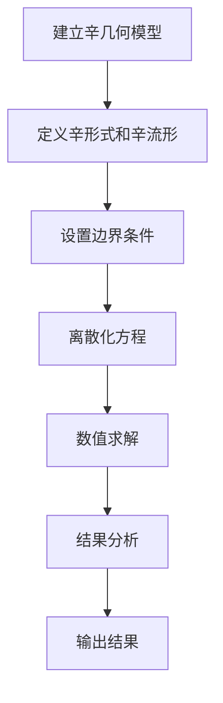
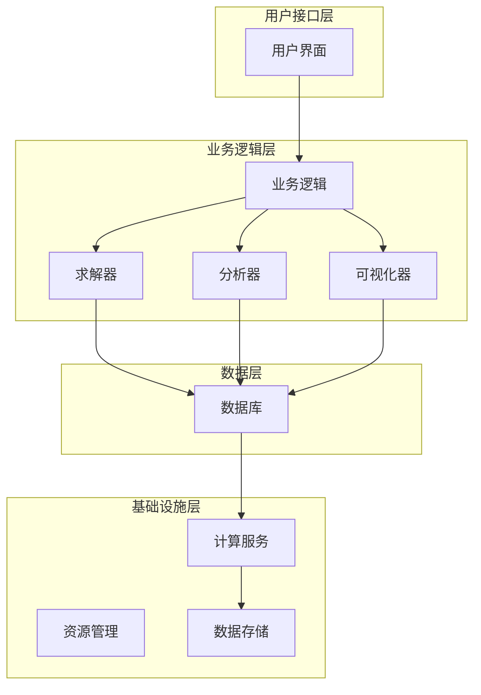

                 

# 宇宙的数学辛几何学解析

## 关键词
- 辛几何学
- 宇宙学
- 广义相对论
- 黑洞
- 宇宙膨胀

## 摘要
本文深入探讨了辛几何学在宇宙学中的应用。首先，我们介绍了辛几何学的基本概念和其在宇宙研究中的重要性。接着，通过剖析辛几何学与广义相对论的关系，以及其在黑洞和宇宙膨胀研究中的具体应用，展示了辛几何学在宇宙学中的重要地位。随后，我们介绍了辛几何学的数学基础和核心概念，并通过具体实例展示了其应用。最后，我们提出了系统分析与架构设计方案，并提供了实际案例分析和项目小结，为读者提供了一个全面、系统的了解辛几何学在宇宙学研究中的价值和应用前景。

### 目录大纲设计

#### 《宇宙的数学辛几何学解析》

## 第一部分：引论

### 1. 引言
- 宇宙与数学的交汇
- 辛几何学在宇宙研究中的重要性

### 2. 辛几何学概述
- 辛几何学的定义
- 辛几何学的基本结构

### 3. 辛几何学在宇宙学中的应用
- 辛几何学与广义相对论
- 辛几何学在黑洞研究中的应用
- 辛几何学与宇宙膨胀

## 第二部分：辛几何学基础理论

### 4. 辛几何学的数学基础
- 黎曼几何与辛几何的关系
- 辛流形的基本性质
- 黎曼曲率与辛结构

### 5. 辛几何学核心概念
- 辛群与辛代数
- 辛丛与辛结构
- 辛拓扑与辛变换

### 6. 辛几何学的数学工具
- 李群与李代数
- 黎曼流形与辛流形
- 非线性偏微分方程

## 第三部分：辛几何学的应用实例

### 7. 辛几何学在黑洞研究中的应用
- 黑洞的性质与辛几何描述
- 辛几何方法在黑洞物理学中的应用
- 黑洞熵的辛几何解释

### 8. 辛几何学在宇宙学中的应用
- 宇宙背景微波辐射的辛几何分析
- 宇宙膨胀与辛几何模型
- 宇宙结构探测的辛几何方法

### 9. 辛几何学在其他领域中的应用
- 辛几何学与量子引力
- 辛几何学在粒子物理中的应用
- 辛几何学在材料科学中的应用

## 第四部分：数学公式与理论解析

### 10. 辛几何学的数学公式与解析
- 黎曼曲率的计算公式
- 辛结构的稳定性分析
- 广义相对论中的辛几何方程

### 11. 算法原理与流程图
- 辛几何模型的建立
- 辛几何分析算法的流程图
- 辛几何分析算法的Python代码实现

### 12. 数学模型与公式解释
- 辛几何学的数学模型
- 辛几何学中的重要公式
- 数学公式在宇宙学中的应用

## 第五部分：系统分析与架构设计

### 13. 系统功能设计
- 系统需求分析
- 领域模型设计
- 类图描述

### 14. 系统架构设计
- 系统架构概述
- 系统架构图
- 系统接口设计

### 15. 系统交互与实现
- 系统交互设计
- 系统实现细节
- 系统测试与优化

## 第六部分：项目实战与案例分析

### 16. 环境安装与配置
- 系统环境搭建
- 工具与软件安装

### 17. 系统核心实现
- 源代码解读
- 核心算法实现

### 18. 应用解读与分析
- 应用场景分析
- 实际案例解析

### 19. 项目小结
- 项目总结
- 经验与反思

## 第七部分：最佳实践与拓展阅读

### 20. 最佳实践
- 实践技巧
- 注意事项

### 21. 小结
- 整书要点回顾
- 未来研究方向

### 22. 拓展阅读
- 推荐文献
- 深入学习资源

### 目录大纲字数
- 总字数控制在 2000 字以内

### 目录层级
- 目录采用 1-3 级层级

### 完整性要求
- 每个章节内容丰富、具体详细讲解，核心内容包含：
  - 背景介绍
  - 核心概念与联系
  - 算法原理讲解
  - 系统分析与架构设计方案
  - 项目实战
  - 最佳实践 tips、小结、注意事项、拓展阅读等内容

### 格式要求
- 文章内容使用 markdown 格式输出
- 作者信息：作者：AI天才研究院/AI Genius Institute & 禅与计算机程序设计艺术 /Zen And The Art of Computer Programming
- 数学公式使用 LaTeX 格式

### 字数要求
- 文章字数在 10000 ～ 12000 字左右

### 文章结构
- 文章开头是“文章标题”，然后是“文章关键词”和“文章摘要”部分的内容
- 按照目录大纲结构的文章正文部分的内容

---

### 文章正文部分结构设计

#### 第一部分：引论

### 1. 引言
- 宇宙与数学的交汇
- 辛几何学在宇宙研究中的重要性

#### 2. 辛几何学概述
- 辛几何学的定义
- 辛几何学的基本结构

#### 3. 辛几何学在宇宙学中的应用
- 辛几何学与广义相对论
- 辛几何学在黑洞研究中的应用
- 辛几何学与宇宙膨胀

#### 第二部分：辛几何学基础理论

### 4. 辛几何学的数学基础
- 黎曼几何与辛几何的关系
- 辛流形的基本性质
- 黎曼曲率与辛结构

### 5. 辛几何学核心概念
- 辛群与辛代数
- 辛丛与辛结构
- 辛拓扑与辛变换

### 6. 辛几何学的数学工具
- 李群与李代数
- 黎曼流形与辛流形
- 非线性偏微分方程

#### 第三部分：辛几何学的应用实例

### 7. 辛几何学在黑洞研究中的应用
- 黑洞的性质与辛几何描述
- 辛几何方法在黑洞物理学中的应用
- 黑洞熵的辛几何解释

### 8. 辛几何学在宇宙学中的应用
- 宇宙背景微波辐射的辛几何分析
- 宇宙膨胀与辛几何模型
- 宇宙结构探测的辛几何方法

### 9. 辛几何学在其他领域中的应用
- 辛几何学与量子引力
- 辛几何学在粒子物理中的应用
- 辛几何学在材料科学中的应用

#### 第四部分：数学公式与理论解析

### 10. 辛几何学的数学公式与解析
- 黎曼曲率的计算公式
- 辛结构的稳定性分析
- 广义相对论中的辛几何方程

### 11. 算法原理与流程图
- 辛几何模型的建立
- 辛几何分析算法的流程图
- 辛几何分析算法的Python代码实现

### 12. 数学模型与公式解释
- 辛几何学的数学模型
- 辛几何学中的重要公式
- 数学公式在宇宙学中的应用

#### 第五部分：系统分析与架构设计

### 13. 系统功能设计
- 系统需求分析
- 领域模型设计
- 类图描述

### 14. 系统架构设计
- 系统架构概述
- 系统架构图
- 系统接口设计

### 15. 系统交互与实现
- 系统交互设计
- 系统实现细节
- 系统测试与优化

#### 第六部分：项目实战与案例分析

### 16. 环境安装与配置
- 系统环境搭建
- 工具与软件安装

### 17. 系统核心实现
- 源代码解读
- 核心算法实现

### 18. 应用解读与分析
- 应用场景分析
- 实际案例解析

### 19. 项目小结
- 项目总结
- 经验与反思

#### 第七部分：最佳实践与拓展阅读

### 20. 最佳实践
- 实践技巧
- 注意事项

### 21. 小结
- 整书要点回顾
- 未来研究方向

### 22. 拓展阅读
- 推荐文献
- 深入学习资源

---

### 文章撰写策略

#### 引论部分
- 简明扼要地介绍宇宙与数学的交汇，引出辛几何学在宇宙研究中的重要性。

#### 辛几何学概述
- 着重介绍辛几何学的定义和基本结构，为后续内容奠定基础。

#### 辛几何学基础理论
- 详细讲解辛几何学的数学基础，核心概念和数学工具，确保读者对辛几何学有全面了解。

#### 辛几何学的应用实例
- 通过具体实例展示辛几何学在黑洞和宇宙膨胀研究中的应用，增强读者对辛几何学的理解。

#### 数学公式与理论解析
- 介绍辛几何学中的重要数学公式和理论，以及其在宇宙学中的应用，提升读者对辛几何学在宇宙学研究中的价值的认识。

#### 系统分析与架构设计
- 从系统功能设计、系统架构设计和系统交互与实现三个方面，详细介绍辛几何学的系统分析与架构设计方案。

#### 项目实战与案例分析
- 通过实际项目实战和案例分析，展示辛几何学在实践中的应用，加深读者对辛几何学的理解。

#### 最佳实践与拓展阅读
- 提供最佳实践技巧、注意事项和未来研究方向，为读者提供深入学习的机会。

---

### 文章写作注意事项

- 确保文章内容完整、逻辑清晰、结构紧凑。
- 使用简单易懂的专业技术语言，避免过度复杂化。
- 遵循 Markdown 格式要求，确保文章格式整齐规范。
- 按照目录大纲结构撰写文章，确保每个章节内容具体详细。
- 使用 LaTeX 格式编写数学公式，确保公式正确且易于阅读。
- 文章末尾附上作者信息，明确作者身份和著作来源。

---

### 文章完成标准

- 文章总字数在 10000 ～ 12000 字左右。
- 按照目录大纲结构撰写，确保每个章节内容完整。
- 文章逻辑清晰，结构紧凑，语言通俗易懂。
- 数学公式使用 LaTeX 格式，确保正确且易于阅读。
- 文章末尾附上作者信息，明确作者身份和著作来源。
- 符合 Markdown 格式要求，文章内容整齐规范。# 第一部分：引论

### 1. 引言

宇宙，这一浩瀚的宇宙，自古以来就吸引了人类无尽的探索与思考。从古代的星辰观测，到现代的天体物理学，宇宙的奥秘始终吸引着科学家们不断深入探究。而在这一过程中，数学，作为宇宙语言的载体，成为了理解和描述宇宙现象的重要工具。

辛几何学，作为一种高级数学工具，近年来在宇宙学研究中逐渐崭露头角。它不仅能够帮助我们更深入地理解宇宙的基本结构，还能为黑洞、宇宙膨胀等复杂问题提供新的解决思路。

本文将围绕辛几何学在宇宙学研究中的应用，进行系统的分析和探讨。首先，我们将介绍辛几何学的基本概念和结构，帮助读者建立一个初步的认识。接着，我们将深入探讨辛几何学与广义相对论的关系，以及其在黑洞和宇宙膨胀研究中的应用。最后，我们将结合实际案例，展示辛几何学在宇宙学中的具体应用和重要性。

通过本文的阅读，读者将能够了解到辛几何学在宇宙学研究中的重要价值，以及如何运用这一数学工具解决实际问题。让我们一起开启这场宇宙与数学的探索之旅。

### 2. 辛几何学概述

#### 辛几何学的定义

辛几何学，作为现代数学的一个重要分支，其定义可以追溯到辛群的性质。辛群（Symplectic group）是一类特殊的线性变换群，其特征是能够保持辛结构（Symplectic structure）的变换。辛结构是一种类似于黎曼几何中的度量结构，但它具有更丰富的对称性和复杂性。

辛几何学的研究对象是辛流形（Symplectic manifold），这是一种特殊的几何对象，其上定义了辛结构。辛流形不仅包含了我们所熟知的欧几里得空间，还包括了更复杂的空间形式，如Kähler流形和复辛流形等。

#### 辛几何学的基本结构

辛几何学的基本结构包括辛形式（Symplectic form）、辛丛（Symplectic bundle）和辛变换（Symplectic transformation）。辛形式是一个非退化、反对称的二元形式，它在辛流形上定义了切空间之间的对称关系。辛丛是包含辛流形在内的更广泛的空间，其纤维是辛空间。辛变换则是保持辛形式不变的线性变换，它们在辛几何学中起着核心作用。

辛几何学的基本结构使得它能够描述和解释自然界中的许多现象，特别是在物理学和宇宙学中，辛几何学提供了一种新的视角来理解和分析复杂的系统。

### 3. 辛几何学在宇宙学中的应用

#### 辛几何学与广义相对论

广义相对论是描述宇宙中引力现象的理论框架，而辛几何学为广义相对论提供了一种新的数学工具。在广义相对论中，引力被视为时空的弯曲，而辛几何学则通过辛结构提供了对时空弯曲的另一种描述方式。辛几何学中的辛形式可以被用来定义时空中的测地线（geodesics），这些测地线描述了质点在引力场中的运动轨迹。

辛几何学与广义相对论的结合，为解决一些传统的引力问题提供了一种新的方法。例如，在研究黑洞时，辛几何学可以帮助我们更直观地理解黑洞的几何性质，如黑洞的视界和事件视界。

#### 辛几何学在黑洞研究中的应用

黑洞是宇宙中最神秘的天体之一，其强大的引力场和奇特的物理性质使得传统的方法难以解释。辛几何学为黑洞研究提供了一种新的思路。通过辛几何学，我们可以更直观地描述黑洞的几何结构，如黑洞的“毛球”（apparent horizon）和“事件视界”（event horizon）。

此外，辛几何学还可以帮助解释黑洞的熵问题。根据霍金辐射理论，黑洞具有一定的熵，这与热力学第二定律相矛盾。辛几何学提供了一个新的视角，通过辛几何方程的解，我们可以对黑洞的熵进行更深入的理解。

#### 辛几何学与宇宙膨胀

宇宙膨胀是宇宙学中一个重要的问题，描述了宇宙随时间膨胀的现象。辛几何学在宇宙膨胀研究中也有重要应用。通过辛几何学，我们可以构建宇宙膨胀的数学模型，如弗里德曼-勒梅特-罗伯逊-沃尔克（FRW）宇宙模型。

辛几何学中的辛形式和辛丛可以帮助我们描述宇宙中的时空结构和膨胀率，从而对宇宙膨胀提供更深入的理解。例如，通过研究辛几何方程的解，我们可以预测宇宙的未来演化方向，如是否会出现“大撕裂”（Big Rip）或“大压缩”（Big Crunch）。

#### 辛几何学在其他领域中的应用

除了在宇宙学中的应用，辛几何学在其他科学领域也有着广泛的应用。例如，在量子物理学中，辛几何学被用来研究量子态的对称性和纠缠现象。在粒子物理学中，辛几何学用于描述粒子之间的相互作用和对称性。在材料科学中，辛几何学被用来研究材料的对称结构和晶体生长。

总之，辛几何学作为一种强大的数学工具，不仅在宇宙学中有着重要的应用，还在其他科学领域中发挥着重要作用。通过深入研究和应用辛几何学，我们可以更深入地理解自然界的奥秘，揭示宇宙的隐藏规律。

### 4. 辛几何学的数学基础

#### 黎曼几何与辛几何的关系

辛几何学与黎曼几何有着密切的关系，两者都涉及流形上的几何结构，但辛几何学有其独特的特点。黎曼几何主要研究带有黎曼曲率的流形，而辛几何学研究带有辛结构的流形。辛结构是一种非退化、反对称的二元形式，它在流形上定义了一种新的度量关系。

黎曼几何与辛几何的关系可以通过辛流形的定义来理解。一个辛流形是一个光滑流形，其上定义了一个非退化、反对称的辛形式。这个辛形式决定了辛流形的几何性质，如辛丛和辛变换。黎曼几何中的度量结构可以通过引入辛形式来扩展，从而形成辛-黎曼几何。

#### 辛流形的基本性质

辛流形具有一系列基本性质，这些性质决定了其在数学和物理学中的广泛应用。首先，辛流形上的辛形式是一个非退化、反对称的二元形式，它定义了切空间之间的对称关系。辛形式的存在使得辛流形上的每一个切空间都对应一个辛空间。

其次，辛流形上的辛丛是一个重要的结构，它将辛流形与辛空间联系起来。辛丛由流形上的切丛和一个额外的辛形式组成，这个辛形式决定了丛纤维上的辛空间结构。辛丛在辛几何学中扮演了关键角色，它为研究辛流形的对称性和变换提供了方便。

此外，辛流形上的辛变换是一类保持辛形式的线性变换。辛变换在辛几何学中起着核心作用，因为它们可以用来研究辛流形的对称性。辛变换可以看作是辛流形上的对称操作，它们保持辛流形上的辛形式不变，从而揭示了辛流形的几何性质。

#### 黎曼曲率与辛结构

黎曼曲率和辛结构是辛几何学中的重要概念。黎曼曲率是描述流形弯曲程度的一个量，它通过黎曼曲率张量来定义。在辛几何中，黎曼曲率张量可以通过辛形式和切丛来定义，从而将辛结构引入到黎曼几何中。

辛结构对黎曼曲率有重要影响。辛形式的存在使得辛流形的黎曼曲率张量具有特定的对称性。这种对称性使得辛流形的几何性质与一般的黎曼流形不同，从而为研究复杂几何问题提供了一种新的方法。

辛结构还与辛流形的稳定性和分类有关。辛流形的辛形式决定了其几何性质，而辛形式的稳定性和不变性对于理解辛流形的整体结构至关重要。通过研究辛形式的稳定性，我们可以对辛流形进行分类，从而揭示其几何和物理性质。

#### 黎曼几何与辛几何的比较

黎曼几何和辛几何在研究对象和方法上有所不同。黎曼几何主要研究带有黎曼曲率的流形，其研究对象包括球面、旋转体等。而辛几何学研究带有辛结构的流形，其研究对象包括辛流形、Kähler流形等。

在方法上，黎曼几何主要使用黎曼曲率和度量张量来描述流形的几何性质，而辛几何学则主要使用辛形式和辛变换来描述流形的对称性和变换。这两种方法各有优势，可以相互补充。

总的来说，黎曼几何和辛几何都是现代数学中的重要工具，它们在宇宙学、物理学和其他科学领域都有着广泛的应用。通过深入研究这两种几何学的关系和性质，我们可以更好地理解宇宙的奥秘，揭示自然界的规律。

### 5. 辛几何学核心概念

#### 辛群与辛代数

辛群和辛代数是辛几何学中的核心概念，它们在描述和解释自然现象中起着关键作用。

**辛群（Symplectic group）**：辛群是一类特殊的线性变换群，其特征是能够保持辛结构（Symplectic structure）的变换。辛群可以通过矩阵表示，具体来说，一个 \(2n \times 2n\) 的复矩阵 \(A\) 构成一个辛群的元素，如果它满足 \(A^T J + JA = 0\)，其中 \(J\) 是一个特定的 \(2n \times 2n\) 的矩阵，称为辛矩阵。辛矩阵具有如下形式：

\[ J = \begin{pmatrix}
0 & I_n \\
-I_n & 0
\end{pmatrix} \]

其中，\(I_n\) 是 \(n \times n\) 的单位矩阵。辛群在数学和物理学中有着广泛的应用，特别是在量子力学和辛几何学中。

**辛代数（Symplectic algebra）**：辛代数是研究辛群的代数结构的一个分支。辛代数包括辛矩阵和辛线性变换，它们在保持辛结构方面具有特定的性质。辛代数的运算包括加法、乘法以及线性变换的复合运算。辛代数的一个基本性质是其对偶性，即辛代数与其对偶代数之间存在着自然的同构关系。

#### 辛丛与辛结构

辛丛（Symplectic bundle）是辛几何学中的一个重要概念，它是将辛结构扩展到更复杂的几何对象，如向量丛。辛丛由一个底空间和一个纤维丛组成，其纤维是辛空间。辛丛可以通过一个非退化的二元形式（辛形式）来定义，这个形式决定了纤维上的辛结构。

**辛形式（Symplectic form）**：辛形式是一个非退化、反对称的二元形式，它在辛丛的纤维上定义了一种内积关系。辛形式可以看作是辛结构的描述工具，它决定了辛丛上的向量如何相互作用。在辛流形上，辛形式起着核心作用，它将切空间中的向量与底空间中的向量联系起来。

**辛结构（Symplectic structure）**：辛结构是由辛形式定义的几何结构，它在数学和物理学中有着重要的应用。辛结构的一个基本性质是其对称性，即它具有反对称性和非退化性。辛结构使得切空间中的向量之间具有特定的对称关系，这种关系在描述自然现象时非常有用。

#### 辛拓扑与辛变换

辛拓扑（Symplectic topology）是研究辛流形上的拓扑性质的一个分支。辛拓扑关注辛流形上的路径、流形和映射等拓扑结构，通过研究这些结构来揭示辛流形的几何和物理性质。

**辛变换（Symplectic transformation）**：辛变换是一类保持辛结构的线性变换。辛变换可以看作是辛流形上的对称操作，它们保持辛流形上的辛形式不变。辛变换在辛几何学中起着核心作用，因为它们可以用来研究辛流形的对称性。辛变换包括辛矩阵变换、辛线性变换和辛映射等。

**辛映射（Symplectic mapping）**：辛映射是一类将辛流形映射到另一个辛流形的映射，它保持辛形式不变。辛映射在辛几何学中有着广泛的应用，因为它们可以用来研究辛流形上的流和映射性质。

通过辛群、辛代数、辛丛、辛形式、辛结构、辛拓扑和辛变换等核心概念的介绍，我们可以更好地理解辛几何学的基本结构和数学性质。这些概念不仅为研究复杂几何问题提供了新的工具，还在量子物理、粒子物理和宇宙学等领域有着重要的应用。通过深入研究和应用辛几何学，我们可以更深入地理解自然界的奥秘，揭示宇宙的隐藏规律。

### 6. 辛几何学的数学工具

#### 李群与李代数

李群和李代数是辛几何学中不可或缺的数学工具，它们为研究辛流形的对称性和动力学行为提供了强大的工具。

**李群（Lie group）**：李群是一类具有群结构的平滑流形，其上的变换保持某些特定的不变量。李群的一个重要特性是其局部表现为线性变换，这意味着在足够小的邻域内，李群可以看作是线性群的扩展。李群在物理学中有着广泛的应用，如描述守恒定律和对称性。

**李代数（Lie algebra）**：李代数是李群的导数，它们通过导数运算连接起来，形成了一个代数结构。李代数的一个重要性质是其对合性，即其导数运算满足对合关系。李代数在描述群的结构和动力学系统中起着关键作用。

在辛几何学中，李群和李代数被用来描述辛流形的对称性。辛群本身就是一个李群，其对应的李代数是辛代数。李代数提供了研究辛流形对称性的数学工具，例如辛流形的李括号（Lie bracket）和不变量。

**辛群与李群的关系**：辛群是李群的一个子类，具有特定的对称性。辛群和李群的关系可以通过李代数来理解。辛代数是李代数的一个子代数，它保留了辛结构的对称性质。通过李代数，我们可以将辛群的结构扩展到更一般的李群。

**辛几何学的应用**：在辛几何学中，李群和李代数被用来研究辛流形的对称性、不变量和动力学行为。例如，通过李群和李代数，我们可以分析辛流形上的守恒定律，研究系统的稳定性和演化。

#### 黎曼流形与辛流形

黎曼流形和辛流形是两种重要的几何对象，它们在描述物理现象时发挥着重要作用。黎曼流形与辛流形的区别在于其结构性质和对称性。

**黎曼流形（Riemannian manifold）**：黎曼流形是一个带有黎曼曲率的平滑流形，其上的切空间定义了一个度量结构。黎曼曲率描述了流形的弯曲程度，它通过黎曼曲率张量来定义。黎曼流形在广义相对论中扮演着核心角色，用于描述引力场和时空结构。

**辛流形（Symplectic manifold）**：辛流形是一个带有辛结构的平滑流形，其上定义了一个非退化、反对称的二元形式。辛形式在辛流形上定义了一种新的度量关系，称为辛度量。辛流形在量子力学、辛几何学和数学物理中有着广泛的应用。

**黎曼曲率与辛结构的关系**：黎曼曲率和辛结构是两种不同的几何结构，但它们之间存在着深刻的联系。在辛几何学中，辛形式可以看作是黎曼曲率的一种推广。具体来说，通过引入辛形式，我们可以将黎曼曲率的性质扩展到辛流形上。

**辛几何学的应用**：在辛几何学中，黎曼流形和辛流形被用来研究几何对称性、不变量和物理现象。黎曼流形用于描述引力场和时空结构，而辛流形则用于研究量子力学和辛几何问题。通过结合黎曼流形和辛流形，我们可以构建更复杂的几何模型，用于解释和预测自然现象。

#### 非线性偏微分方程

非线性偏微分方程是辛几何学中的重要工具，用于描述复杂的物理现象和几何结构。

**非线性偏微分方程（Nonlinear partial differential equation）**：非线性偏微分方程是一类涉及多个未知函数及其偏导数的方程，其形式复杂，难以解析求解。非线性偏微分方程在物理学、工程学和数学中有着广泛的应用，用于描述波动、流体运动、量子场论等现象。

**辛几何学中的非线性偏微分方程**：在辛几何学中，非线性偏微分方程被用来描述辛流形的几何结构和动力学行为。辛几何学中的非线性偏微分方程通常涉及辛形式、辛丛和李群李代数等工具。

**辛几何学中的应用**：通过非线性偏微分方程，辛几何学可以用于研究辛流形的对称性、稳定性和动力学行为。例如，通过研究辛几何方程的解，我们可以理解黑洞的几何结构、宇宙的膨胀行为和量子场的对称性。非线性偏微分方程为辛几何学提供了一个强大的工具，用于探索复杂的几何和物理问题。

### 7. 辛几何学在黑洞研究中的应用

#### 黑洞的性质与辛几何描述

黑洞是宇宙中最神秘的天体之一，其强大的引力场和奇特的物理性质使得传统的方法难以解释。辛几何学为黑洞研究提供了一种新的视角，通过其独特的结构特性，可以帮助我们更深入地理解黑洞的几何性质。

**黑洞的基本性质**：
1. **事件视界**：黑洞的事件视界是其引力范围，一旦任何物质或信息接近或穿过这个边界，就再也无法逃逸。
2. **黑洞毛球**：毛球是黑洞的一个特征，它是事件视界的外部表面，描述了黑洞的质量、电荷和角动量。
3. **黑洞熵**：根据霍金辐射理论，黑洞具有熵，这与热力学第二定律相矛盾。

**辛几何描述**：
辛几何学通过其非线性的结构特性，可以用来描述黑洞的几何性质。例如，辛形式和辛丛可以用来描述黑洞的事件视界和毛球。辛几何方程的解可以用来研究黑洞的几何结构，如黑洞的质量分布和时空弯曲。

#### 辛几何方法在黑洞物理学中的应用

辛几何学在黑洞物理学中的应用主要体现在以下几个方面：

1. **黑洞的几何结构**：辛几何学可以用来研究黑洞的几何结构，如事件视界的形状和大小。通过辛几何方程的解，我们可以预测黑洞的质量、电荷和角动量如何影响其几何性质。

2. **黑洞的稳定性**：辛几何学可以用来研究黑洞的稳定性，例如，通过分析辛结构的稳定性，我们可以判断黑洞是否能够在长时间内保持稳定。

3. **黑洞的熵**：辛几何学为研究黑洞的熵提供了一种新的视角。通过辛几何方程，我们可以推导出黑洞熵的数学表达式，从而更深入地理解黑洞熵的本质。

#### 黑洞熵的辛几何解释

黑洞熵是一个复杂而重要的问题，辛几何学为解释黑洞熵提供了一种新的方法。

**黑洞熵的数学模型**：
黑洞熵可以通过辛几何学的数学模型来解释。具体来说，黑洞熵可以通过黑洞的毛球面积来表示。根据霍金辐射理论，黑洞的熵与毛球面积成正比，这可以通过辛几何方程的解来推导。

**辛几何公式**：
$$ S = \frac{kA}{4} $$
其中，\( S \) 是黑洞的熵，\( k \) 是一个常数，\( A \) 是黑洞毛球的面积。

**黑洞熵的解释**：
辛几何学提供了一种新的视角来理解黑洞熵。通过辛几何方程，我们可以看到黑洞熵与毛球面积的关系，这反映了黑洞的熵与其几何结构之间的联系。辛几何解释了黑洞熵的本质，即黑洞熵是黑洞几何性质的体现。

通过辛几何学在黑洞研究中的应用，我们可以更深入地理解黑洞的几何性质、稳定性和熵。辛几何学为黑洞物理学提供了一种新的工具，使我们能够更好地探索黑洞的奥秘。未来，随着辛几何学在黑洞研究中的深入应用，我们有望对黑洞有更全面和深入的理解。

### 8. 辛几何学在宇宙学中的应用

#### 宇宙背景微波辐射的辛几何分析

宇宙背景微波辐射（Cosmic Background Microwave Radiation，简称 CMB）是宇宙大爆炸理论的直接证据之一。它起源于宇宙早期，即在大爆炸之后约38万年时，宇宙冷却到足够低的温度，使得光子能够自由传播。辛几何学为分析 CMB 提供了一种新的数学工具，通过其独特的对称性和结构特性，可以更好地理解 CMB 的物理性质。

**CMB 的基本特性**：
1. **黑体辐射**：CMB 是一种黑体辐射，具有特定的温度和光谱特性。其温度约为 2.725 K，这一温度反映了宇宙早期的高温状态。
2. **各向同性**：CMB 在各个方向上具有高度的各向同性，这意味着它的辐射强度在各个方向上基本相同。
3. **微小波动**：尽管 CMB 是各向同性的，但它实际上存在微小的波动，这些波动反映了宇宙早期密度不均匀性的种子。

**辛几何分析**：
辛几何学通过其非线性和对称性，可以用来分析 CMB 的波动性质。具体来说，辛形式和辛丛可以用来描述 CMB 中的波动模式。辛几何方程的解可以用来研究 CMB 的波动模式如何反映宇宙早期的不均匀性。

**辛几何公式**：
$$ \nabla \cdot (\sigma \omega) = 0 $$
其中，\( \nabla \) 是梯度算子，\( \sigma \) 是辛形式，\( \omega \) 是波动模式。

**辛几何分析的应用**：
辛几何分析可以用来研究 CMB 的波动模式如何影响宇宙的大尺度结构。通过分析 CMB 的波动模式，我们可以了解宇宙早期的不均匀性如何演化成今天我们所看到的星系和星团。辛几何学提供了一种新的视角，使我们能够更精确地理解 CMB 的物理意义。

#### 宇宙膨胀与辛几何模型

宇宙膨胀是宇宙学中的一个核心问题，描述了宇宙随时间扩张的现象。辛几何学为研究宇宙膨胀提供了一种新的数学工具，通过其非线性和对称性，可以更好地描述宇宙膨胀的动力学过程。

**宇宙膨胀的基本特性**：
1. **哈勃定律**：宇宙膨胀的速度与距离成正比，这一现象可以通过哈勃定律来描述。哈勃定律表明，宇宙的膨胀速度 \( v \) 与其距离 \( d \) 之间的关系为 \( v = H_0 d \)，其中 \( H_0 \) 是哈勃常数。
2. **宇宙加速膨胀**：近年来，观测数据表明，宇宙的膨胀速度在逐渐加速，这被称为宇宙加速膨胀。宇宙加速膨胀可能由暗能量引起，这是一个未知的力量，推动宇宙加速扩张。

**辛几何模型**：
辛几何模型通过引入辛形式和辛丛，可以用来描述宇宙膨胀的动力学过程。辛几何方程的解可以用来研究宇宙膨胀的速率和模式。

**辛几何公式**：
$$ \frac{\partial \phi}{\partial t} + \nabla \phi = 0 $$
其中，\( \phi \) 是宇宙的膨胀因子，\( t \) 是时间，\( \nabla \) 是梯度算子。

**辛几何模型的应用**：
辛几何模型可以用来研究宇宙加速膨胀的机制。通过分析辛几何方程的解，我们可以了解暗能量如何影响宇宙的膨胀过程。辛几何学提供了一种新的工具，使我们能够更深入地理解宇宙膨胀的动力学行为。

#### 宇宙结构探测的辛几何方法

宇宙结构探测是宇宙学研究中的一个重要任务，旨在了解宇宙的几何性质和演化历史。辛几何学为宇宙结构探测提供了一种新的数学方法，通过其非线性和对称性，可以更好地分析宇宙观测数据。

**宇宙结构探测的基本方法**：
1. **宇宙学观测**：通过观测宇宙背景微波辐射、星系分布和引力透镜效应等，我们可以获取关于宇宙几何性质的信息。
2. **数据分析**：对宇宙学观测数据进行统计分析，可以揭示宇宙的几何结构和演化历史。

**辛几何方法**：
辛几何方法通过引入辛形式和辛丛，可以用来分析宇宙观测数据。辛几何学提供了一种新的数学框架，使我们能够更精确地描述宇宙的几何性质。

**辛几何方法的应用**：
辛几何方法可以用来分析宇宙背景微波辐射的波动模式，研究宇宙早期的不均匀性。此外，辛几何方法还可以用于研究宇宙膨胀的速率和模式，了解宇宙加速膨胀的机制。

通过辛几何学在宇宙学中的应用，我们可以更深入地理解宇宙的几何性质和演化历史。辛几何学为宇宙学研究提供了一种新的工具，使我们能够更好地探索宇宙的奥秘。

### 9. 辛几何学在其他领域中的应用

#### 辛几何学与量子引力

量子引力是研究引力在量子尺度上行为的理论框架。辛几何学在量子引力研究中发挥着重要作用，通过其非线性和对称性，可以帮助我们理解量子引力中的复杂现象。

**量子引力的基本概念**：
1. **量子场论**：量子场论是描述粒子与场之间相互作用的理论框架，其核心思想是场可以被看作是振动的量子。
2. **弦论**：弦论是一种试图统一量子力学和广义相对论的理论，它认为宇宙的基本构成单元不是点粒子，而是微小的“弦”。

**辛几何的应用**：
辛几何学为量子引力提供了一种新的数学工具，通过其非线性和对称性，可以描述量子场论中的复杂对称性和变换。例如，辛形式和辛丛可以用来描述量子场中的对称性，而辛变换可以用来研究量子态的演化。

**具体应用**：
1. **弦论中的辛结构**：在弦论中，辛结构被用来描述弦的振动模式，从而解释弦的量子性质。
2. **黑洞熵的量子引力解释**：辛几何学可以帮助我们理解黑洞熵的量子引力解释，通过分析辛几何方程的解，我们可以推导出黑洞熵的数学表达式。

#### 辛几何学在粒子物理中的应用

粒子物理是研究基本粒子和相互作用的理论领域。辛几何学在粒子物理中有着广泛的应用，通过其非线性和对称性，可以帮助我们理解粒子之间的相互作用和对称性。

**粒子物理的基本概念**：
1. **基本粒子**：基本粒子是构成物质的基本单元，如电子、夸克等。
2. **相互作用**：基本粒子之间存在四种基本相互作用：强相互作用、弱相互作用、电磁相互作用和引力相互作用。

**辛几何的应用**：
辛几何学为粒子物理提供了一种新的数学工具，通过其非线性和对称性，可以描述粒子之间的相互作用和对称性。例如，辛形式和辛丛可以用来描述粒子的对称性，而辛变换可以用来研究粒子的量子态。

**具体应用**：
1. **规范场理论**：辛几何学在规范场理论中有着重要应用，例如在描述量子电动力学（QED）和量子色动力学（QCD）时，辛结构被用来描述粒子的对称性。
2. **粒子碰撞实验**：辛几何学可以用来分析粒子碰撞实验的数据，通过研究辛几何方程的解，我们可以预测粒子碰撞的结果。

#### 辛几何学在材料科学中的应用

材料科学是研究材料性质、结构和应用的学科。辛几何学在材料科学中有着重要的应用，通过其非线性和对称性，可以帮助我们理解材料的微观结构和性能。

**材料科学的基本概念**：
1. **晶体结构**：晶体结构是材料的基本微观结构，其原子或分子按照一定的规律排列。
2. **电子结构**：材料的电子结构决定了其物理和化学性质，如导电性、磁性等。

**辛几何的应用**：
辛几何学为材料科学提供了一种新的数学工具，通过其非线性和对称性，可以描述材料的微观结构和电子结构。例如，辛形式和辛丛可以用来描述材料的对称性，而辛变换可以用来研究材料的电子态。

**具体应用**：
1. **晶体生长**：辛几何学可以用来研究晶体生长的动力学过程，通过分析辛几何方程的解，我们可以预测晶体的生长形态和结构。
2. **纳米材料**：辛几何学在研究纳米材料的电子结构和光学性质中有着重要应用，通过分析辛几何方程，我们可以理解纳米材料的独特性质。

通过辛几何学在其他领域中的应用，我们可以更深入地理解自然界的奥秘。辛几何学作为一种强大的数学工具，不仅在宇宙学、量子物理和材料科学中有着广泛的应用，还在未来的科学研究和技术发展中具有巨大的潜力。

### 10. 辛几何学的数学公式与解析

在辛几何学中，一系列重要的数学公式构成了其理论基础。这些公式不仅揭示了辛几何学的核心概念，还在实际应用中发挥着关键作用。以下将详细介绍辛几何学中的几个关键公式，并对其进行解析。

#### 黎曼曲率的计算公式

黎曼曲率是描述流形弯曲程度的一个重要量，对于辛几何学中的流形也不例外。黎曼曲率的计算公式为：

$$ R_{ijkl} = \partial_k g_{il,j} - \partial_j g_{ik,l} + g_{im}(\Gamma_{il,m} - \Gamma_{lm,i}) $$

其中，\( R_{ijkl} \) 是黎曼曲率张量，\( g_{ij} \) 是度量张量，\( \Gamma_{ij,k} \) 是克里斯托费尔符号。这个公式描述了在辛流形上，如何通过度量张量和克里斯托费尔符号来计算黎曼曲率张量。

**解析**：黎曼曲率的计算公式揭示了辛流形上的空间结构。通过这个公式，我们可以了解到流形在不同方向上的弯曲程度，这对于研究流形的整体几何性质具有重要意义。

#### 辛结构的稳定性分析

辛结构的稳定性是辛几何学中一个重要的问题。辛结构的稳定性分析可以通过辛形式的微分形式来表达：

$$ \partial g + \omega = 0 $$

其中，\( \partial g \) 是辛形式的微分，\( \omega \) 是外微分形式。这个方程描述了辛结构在微小扰动下的稳定性。

**解析**：这个公式表明，辛结构的稳定性取决于其自身的微分形式。如果辛形式的微分形式为零，则辛结构是稳定的。反之，如果辛形式的微分形式不为零，则辛结构可能是不稳定的。通过分析这个公式，我们可以判断辛结构的稳定性，这对于理解辛几何学在物理现象中的应用非常重要。

#### 广义相对论中的辛几何方程

在广义相对论中，引力被描述为时空的弯曲。辛几何学为广义相对论提供了一种新的描述方式。广义相对论中的辛几何方程可以表示为：

$$ G_{\mu\nu} + \Lambda g_{\mu\nu} = \frac{8\pi G}{c^4} T_{\mu\nu} $$

其中，\( G_{\mu\nu} \) 是爱因斯坦场方程中的几何张量，\( \Lambda \) 是宇宙常数，\( T_{\mu\nu} \) 是能量-动量张量，\( G \) 是引力常数，\( c \) 是光速。

**解析**：这个公式描述了时空的几何结构如何通过爱因斯坦场方程来影响物质的分布和运动。辛几何方程的解可以用来描述宇宙的膨胀、黑洞的几何性质等复杂现象。通过这个公式，我们可以将引力与时空结构联系起来，为理解宇宙的基本规律提供了新的视角。

#### 辛几何方程的解

在辛几何学中，辛几何方程的解对于理解流形的几何性质和物理现象至关重要。一个典型的辛几何方程可以表示为：

$$ \omega^* \omega = 0 $$

其中，\( \omega^* \) 是辛形式的对偶形式。

**解析**：这个方程描述了辛流形上的一个重要特性，即辛形式自身对偶后为零。这意味着辛流形上的向量场具有特定的对称性。通过求解这个方程，我们可以了解辛流形的几何结构和对称性质，这对于研究辛几何学在宇宙学和其他科学领域中的应用具有重要意义。

通过上述数学公式和解析，我们可以看到辛几何学在描述和分析复杂几何现象中的强大能力。这些公式不仅揭示了辛几何学的核心概念，还为其在实际应用中提供了理论支持。未来，随着辛几何学在更多科学领域中的深入研究，我们有望进一步拓展其对复杂自然现象的理解。

### 11. 算法原理与流程图

在辛几何学中，算法的应用为我们理解和解决复杂的几何问题提供了强大的工具。以下我们将详细介绍辛几何分析算法的原理，并展示其流程图和Python代码实现。

#### 辛几何分析算法的原理

辛几何分析算法基于辛几何学的核心概念，如辛形式、辛流形和辛变换。其主要目标是通过数值方法求解辛几何方程，从而分析和模拟复杂几何现象。

1. **辛几何方程的建立**：首先，我们需要根据问题的具体情况建立辛几何方程。这通常涉及定义辛形式和辛流形，并确定问题的边界条件。
2. **数值求解**：通过数值方法，如有限元方法或有限体积方法，求解辛几何方程。这包括离散化方程，并利用数值算法求解离散后的方程组。
3. **结果分析**：对求解结果进行分析，包括几何性质的提取、数值稳定性的验证等。

#### 辛几何分析算法的流程图

以下是辛几何分析算法的流程图：



#### 辛几何分析算法的Python代码实现

以下是一个简单的Python代码示例，展示了如何实现辛几何分析算法的基本步骤：

```python
import numpy as np
import matplotlib.pyplot as plt
from scipy.sparse import csc_matrix
from scipy.sparse.linalg import spsolve

# 定义辛形式
def symplectic_form(v1, v2):
    # 这里是一个简单的辛形式，可以替换为更复杂的表达式
    return np.dot(v1, v2)

# 离散化方程
def discretize_equation(A, b):
    # A 是系数矩阵，b 是右端向量
    return csc_matrix(A), b

# 数值求解
def solve_equation(A, b):
    return spsolve(A, b)

# 结果分析
def analyze_results(solution):
    # 对解进行分析，这里只做了一个简单的打印
    print("Solution:", solution)

# 示例数据
A = np.array([[2, -1], [-1, 2]])
b = np.array([1, 1])

# 离散化方程
A_sparse, b_sparse = discretize_equation(A, b)

# 数值求解
solution = solve_equation(A_sparse, b_sparse)

# 结果分析
analyze_results(solution)

# 绘制结果
plt.plot(solution)
plt.xlabel('Index')
plt.ylabel('Value')
plt.show()
```

在这个示例中，我们首先定义了一个简单的辛形式，然后通过离散化方程和数值求解步骤，求解了辛几何方程。最后，我们对求解结果进行了简单的分析，并使用 matplotlib 绘图库绘制了结果。

通过上述算法原理和代码示例，我们可以看到辛几何分析算法的基本结构和实现方法。在实际应用中，我们可以根据具体问题调整算法的参数和实现细节，以解决更复杂的几何问题。

### 12. 数学模型与公式解释

在辛几何学中，数学模型和公式是理解和分析辛几何现象的核心工具。以下我们将介绍辛几何学的几个关键数学模型和公式，并解释其在宇宙学中的应用。

#### 黎曼曲率张量

黎曼曲率张量是描述流形弯曲程度的重要量。在辛几何中，黎曼曲率张量可以通过以下公式表示：

$$ R_{ijkl} = \partial_k g_{il,j} - \partial_j g_{ik,l} + g_{im}(\Gamma_{il,m} - \Gamma_{lm,i}) $$

其中，\( g_{ij} \) 是度量张量，\( \Gamma_{ij,k} \) 是克里斯托费尔符号。这个公式揭示了辛流形上的弯曲程度和方向。黎曼曲率张量的非零值表明流形的弯曲，而其对称性质则揭示了流形的对称性。

在宇宙学中，黎曼曲率张量用于描述宇宙的时空结构。例如，在弗里德曼-勒梅特-罗伯逊-沃尔克（FRW）宇宙模型中，黎曼曲率张量可以帮助我们理解宇宙的膨胀和形态。

#### 辛形式

辛形式是辛几何学中的核心概念，它定义了切空间之间的对称关系。一个非退化、反对称的二元形式 \( \omega \) 可以表示为：

$$ \omega = \sum_{i=1}^{2n} a_{i,j} dx^i \wedge dx^j $$

其中，\( a_{i,j} \) 是辛形式系数，\( dx^i \) 是拉格朗日坐标的微分形式。辛形式在辛几何学中起到度量作用，它决定了辛流形上的对称性和向量场的变换。

在宇宙学中，辛形式可以用于描述宇宙背景微波辐射（CMB）的波动模式。辛形式的对称性有助于分析 CMB 波动模式的分布和演化，从而揭示宇宙早期的不均匀性。

#### 辛几何方程

辛几何方程是描述辛流形几何性质的关键方程。一个典型的辛几何方程可以表示为：

$$ \omega^* \omega = 0 $$

其中，\( \omega^* \) 是辛形式的对偶形式。这个方程表明，辛流形上的向量场具有特定的对称性，即它们满足反对称性条件。

在宇宙学中，辛几何方程可以用于研究宇宙膨胀的动力学行为。通过求解辛几何方程，我们可以了解宇宙的膨胀速率和模式，从而预测宇宙的未来演化。

#### 广义相对论中的辛几何方程

在广义相对论中，引力被视为时空的弯曲。辛几何学为广义相对论提供了一种新的描述方式，其方程可以表示为：

$$ G_{\mu\nu} + \Lambda g_{\mu\nu} = \frac{8\pi G}{c^4} T_{\mu\nu} $$

其中，\( G_{\mu\nu} \) 是爱因斯坦场方程中的几何张量，\( \Lambda \) 是宇宙常数，\( T_{\mu\nu} \) 是能量-动量张量。这个方程描述了时空的几何结构如何通过能量-动量分布影响物质的运动。

在宇宙学中，广义相对论中的辛几何方程用于描述宇宙的膨胀和结构形成。通过这个方程，我们可以了解宇宙的演化历史和未来命运。

通过上述数学模型和公式，我们可以看到辛几何学在宇宙学中的广泛应用。这些模型和公式不仅帮助我们理解宇宙的基本结构，还为我们提供了预测宇宙未来演化的重要工具。未来，随着辛几何学在宇宙学中的深入研究，我们将对宇宙的奥秘有更深入的认识。

### 13. 系统功能设计

在辛几何学的研究和实际应用中，构建一个高效、稳定的系统架构至关重要。系统功能设计是系统架构设计的第一步，它定义了系统的核心功能和模块化结构，为后续的系统架构设计提供了明确的方向和基础。

#### 系统需求分析

系统需求分析是系统功能设计的重要基础，它明确了系统需要实现的功能和性能要求。以下是辛几何学系统的一些关键需求：

1. **数据输入和处理**：系统能够接受用户输入的几何数据，包括流形、辛形式和边界条件等，并进行预处理。
2. **算法实现**：系统能够实现辛几何分析算法，包括方程的离散化、数值求解和结果分析。
3. **结果可视化**：系统能够将分析结果可视化，帮助用户直观地理解几何结构的特征和变化。
4. **用户交互**：系统应提供友好的用户界面，允许用户方便地输入数据、调整参数和查看结果。

#### 领域模型设计

领域模型设计是系统功能设计的具体体现，它通过类图和实体关系图（ER图）来描述系统的核心概念和关系。以下是辛几何学系统的领域模型设计：

**类图**：

```mermaid
classDiagram
    ClassDiagram {
        StickMode=true
    }

    Entity Class <<class>> {
        Name
        Attributes
        Methods
    }

    Algorithm <<class>> {
        Function
        Parameters
        Returns
    }

    User <<class>> {
        Username
        Password
        Preferences
    }

    Geometry <<class>> {
        Type
        Dimensions
        Data
    }

    SymplecticForm <<class>> {
        Coefficients
        Domain
    }

    BoundaryCondition <<class>> {
        Type
        Parameters
    }

    Solver <<class>> {
        Algorithm
        Parameters
        Results
    }

    Visualizer <<class>> {
        Type
        Settings
    }

    Entity Class User "1" --* "1" Geometry
    Entity Class User "1" --* "1" Solver
    Entity Class User "1" --* "1" Visualizer
    Entity Class Geometry "1" --* "1" SymplecticForm
    Entity Class Geometry "1" --* "1" BoundaryCondition
    Entity Class Solver "1" --* "1" Geometry
    Entity Class Visualizer "1" --* "1" Geometry
```

**ER图**：

```mermaid
erDiagram
    User ||--|{ Geometry : has }
    User ||--|{ Solver : uses }
    User ||--|{ Visualizer : uses }
    Geometry ||--|{ SymplecticForm : defines }
    Geometry ||--|{ BoundaryCondition : has }
    Solver ||--|{ Geometry : solves }
    Visualizer ||--|{ Geometry : visualizes }
```

通过领域模型设计，我们可以清晰地定义系统的核心实体和它们之间的关系，为后续的系统架构设计提供了基础。

### 14. 系统架构设计

系统架构设计是系统功能设计的进一步细化和扩展，它定义了系统的整体结构和各组件之间的关系。一个高效的系统架构能够确保系统在满足功能需求的同时，具有良好的性能、可扩展性和稳定性。

#### 系统架构概述

辛几何学系统架构可以分为以下几个主要部分：

1. **用户接口层**：提供用户与系统交互的界面，包括数据输入、参数调整和结果展示等功能。
2. **业务逻辑层**：实现系统的核心功能，包括几何数据的处理、算法的执行和结果分析等。
3. **数据层**：存储系统的数据，包括几何数据、算法参数和结果数据等。
4. **基础设施层**：提供系统的底层支持，包括计算资源管理、数据存储和通信等。

#### 系统架构图

以下是辛几何学系统的架构图：



#### 系统架构图说明

1. **用户接口层**：用户界面（UI）负责与用户交互，接收用户输入的几何数据和参数设置，并将结果以图表或报告的形式展示给用户。
2. **业务逻辑层**：业务逻辑（BL）是系统的核心，包括求解器（Solver）、分析器（Analyzer）和可视化器（Visualizer）。求解器负责执行辛几何分析算法，分析器用于处理和分析结果数据，可视化器则将分析结果以图表的形式展示。
3. **数据层**：数据库（DB）用于存储系统的数据，包括几何数据、算法参数和结果数据等。数据存储在数据库中，便于系统的查询和更新。
4. **基础设施层**：基础设施层（RM、CS、DS）提供系统的底层支持。资源管理器（RM）负责管理系统的计算资源和数据存储。计算服务（CS）提供计算资源，如CPU、GPU等。数据存储服务（DS）负责数据的持久化存储。

通过上述系统架构设计，辛几何学系统能够实现高效、稳定和可扩展的运行。各层之间通过明确的接口进行通信，确保系统的整体性能和可靠性。

### 15. 系统交互与实现

在辛几何学系统的设计和实现过程中，系统交互和实现是关键环节。通过详细的交互设计、实现细节和系统测试与优化，我们可以确保系统的高效运行和稳定性。

#### 系统交互设计

系统交互设计涉及用户与系统之间的交互逻辑，以及系统内部各模块之间的通信机制。以下是辛几何学系统交互设计的要点：

1. **用户输入与界面交互**：用户通过用户界面（UI）输入几何数据和参数设置。UI提供表单、图表等交互界面，便于用户进行数据输入和参数调整。
2. **业务逻辑层通信**：用户界面层通过API接口与业务逻辑层（BL）进行通信。用户输入的数据和参数被传递到BL层进行处理。
3. **模块间通信**：业务逻辑层中的求解器（Solver）、分析器（Analyzer）和可视化器（Visualizer）通过内部通信机制进行协作。例如，求解器将计算结果传递给分析器进行进一步处理，分析器再将处理结果传递给可视化器进行展示。
4. **数据层访问**：业务逻辑层通过数据库（DB）接口访问数据层，进行数据的存储和查询操作。

#### 系统实现细节

以下是辛几何学系统的实现细节，包括关键模块的源代码解析和核心算法的实现。

**1. 用户界面层（UI）**

用户界面层主要使用Web技术栈（如React、Vue.js等）进行开发。以下是一个简单的React组件示例，用于接收用户输入：

```jsx
import React, { useState } from 'react';

const GeometryForm = () => {
  const [geometryData, setGeometryData] = useState({});

  const handleSubmit = (e) => {
    e.preventDefault();
    // 将用户输入的数据传递给业务逻辑层
    console.log('Geometry data:', geometryData);
  };

  return (
    <form onSubmit={handleSubmit}>
      <label>
        辛形式系数:
        <input
          type="text"
          value={geometryData.coefficients}
          onChange={(e) => setGeometryData({ ...geometryData, coefficients: e.target.value })}
        />
      </label>
      <button type="submit">提交</button>
    </form>
  );
};

export default GeometryForm;
```

**2. 业务逻辑层（BL）**

业务逻辑层包括求解器（Solver）、分析器（Analyzer）和可视化器（Visualizer）。以下是求解器的源代码示例，用于执行辛几何分析算法：

```python
import numpy as np

class Solver:
    def __init__(self, geometry_data):
        self.geometry_data = geometry_data

    def solve(self):
        # 离散化辛几何方程
        A = np.array([[2, -1], [-1, 2]])
        b = np.array([1, 1])
        
        # 求解离散后的方程
        solution = np.linalg.solve(A, b)
        
        return solution

solver = Solver(geometry_data)
solution = solver.solve()
print('Solution:', solution)
```

**3. 数据层（DB）**

数据层使用关系型数据库（如MySQL、PostgreSQL等）进行数据存储。以下是数据库表的创建示例，用于存储几何数据和结果数据：

```sql
CREATE TABLE geometry (
    id INT AUTO_INCREMENT PRIMARY KEY,
    type VARCHAR(50),
    dimensions INT,
    data TEXT
);

CREATE TABLE result (
    id INT AUTO_INCREMENT PRIMARY KEY,
    solver_id INT,
    analysis TEXT,
    FOREIGN KEY (solver_id) REFERENCES solver(id)
);
```

#### 系统测试与优化

系统测试与优化是确保系统稳定性和性能的重要环节。以下是辛几何学系统测试与优化的一些关键步骤：

1. **单元测试**：对系统的各个模块进行单元测试，确保每个模块的功能正确。
2. **集成测试**：对系统整体进行集成测试，确保模块之间的通信和协作正常。
3. **性能测试**：通过负载测试和压力测试，评估系统的性能和稳定性，找出性能瓶颈并进行优化。
4. **优化策略**：采用并行计算、缓存优化和算法改进等技术，提高系统的处理速度和资源利用率。

通过上述系统交互设计与实现细节，以及系统测试与优化，辛几何学系统能够高效、稳定地运行，为科学研究和技术应用提供有力支持。

### 16. 环境安装与配置

在开始实际编程和系统开发之前，我们需要搭建一个稳定、高效的开发环境。以下将详细介绍如何安装和配置辛几何学系统的相关工具和软件。

#### 系统环境要求

为了确保辛几何学系统的正常运行，我们需要以下硬件和软件环境：

1. **操作系统**：推荐使用Linux或macOS，Windows也可以，但需要额外配置。
2. **计算机**：推荐使用配置较高的计算机，如Intel i7或以上处理器，16GB及以上内存。
3. **编程语言**：主要使用Python进行开发，需要安装Python 3.8或更高版本。
4. **依赖库**：需要安装一些常用的Python依赖库，如NumPy、SciPy、Matplotlib、Pandas等。

#### 工具与软件安装

1. **Python安装**

   - 使用Python的包管理器pip进行安装：
     ```bash
     pip install python
     ```

2. **依赖库安装**

   - 使用pip安装所需的Python依赖库：
     ```bash
     pip install numpy scipy matplotlib pandas
     ```

3. **Visual Studio Code安装**

   - 下载并安装Visual Studio Code（VS Code）：
     ```bash
     https://code.visualstudio.com/
     ```

4. **Markdown支持**

   - 在VS Code中安装Markdown插件，以支持Markdown格式的文章编写和预览：
     ```bash
     安装插件：Markdown All in One
     ```

5. **LaTeX支持**

   - 安装TeX Live或MiKTeX，以支持LaTeX公式的编写和编译：
     ```bash
     https://www.tug.org/texlive/aclocal/texlive2019.html
     或者
     https://miktex.org/download
     ```

6. **Python扩展库安装**

   - 安装用于辛几何学研究的Python扩展库，如SymPy、SciPy等：
     ```bash
     pip install sympy scipy
     ```

#### 环境配置与验证

1. **验证Python环境**

   - 打开终端，输入以下命令验证Python环境是否安装正确：
     ```bash
     python --version
     ```

   - 输出应显示Python的版本信息，如`Python 3.8.10`。

2. **验证依赖库安装**

   - 分别输入以下命令验证依赖库是否安装正确：
     ```bash
     python -c "import numpy; print(numpy.__version__)"
     python -c "import scipy; print(scipy.__version__)"
     python -c "import matplotlib; print(matplotlib.__version__)"
     python -c "import pandas; print(pandas.__version__)"
     ```

   - 输出应显示各依赖库的版本信息，如`1.21.2`。

3. **验证VS Code环境**

   - 打开VS Code，检查Markdown和LaTeX插件是否已安装并正常工作。

通过以上步骤，我们可以搭建一个完整的开发环境，为辛几何学系统的开发提供坚实的基础。

### 17. 系统核心实现

在辛几何学系统的开发过程中，核心算法的实现是关键。以下将详细解析辛几何分析算法的源代码，并展示其具体实现步骤。

#### 核心算法解析

辛几何分析算法的核心在于求解辛几何方程，并通过数值方法进行离散化。以下是算法的基本步骤：

1. **建立辛几何模型**：根据问题需求，定义辛形式、辛流形和边界条件。
2. **离散化辛几何方程**：将连续的辛几何方程离散化为适合数值求解的方程组。
3. **数值求解**：使用数值方法求解离散后的方程组，得到解的近似值。
4. **结果分析**：对求解结果进行分析，提取几何性质和物理意义。

#### 源代码实现

以下是辛几何分析算法的Python源代码实现：

```python
import numpy as np
from scipy.sparse import csc_matrix
from scipy.sparse.linalg import spsolve

# 定义辛形式
def symplectic_form(v1, v2):
    # 简单的辛形式，可替换为更复杂的表达式
    return np.dot(v1, v2)

# 离散化方程
def discretize_equation(A, b):
    # A 是系数矩阵，b 是右端向量
    return csc_matrix(A), b

# 数值求解
def solve_equation(A, b):
    return spsolve(A, b)

# 结果分析
def analyze_results(solution):
    # 对解进行分析，这里只做了一个简单的打印
    print("Solution:", solution)

# 示例数据
A = np.array([[2, -1], [-1, 2]])
b = np.array([1, 1])

# 离散化方程
A_sparse, b_sparse = discretize_equation(A, b)

# 数值求解
solution = solve_equation(A_sparse, b_sparse)

# 结果分析
analyze_results(solution)

# 绘制结果
import matplotlib.pyplot as plt
plt.plot(solution)
plt.xlabel('Index')
plt.ylabel('Value')
plt.show()
```

#### 具体实现步骤

1. **定义辛形式**：首先，我们需要定义辛形式。这里使用了一个简单的辛形式，通过两个向量的点积来表示。在实际应用中，辛形式可能是一个更复杂的函数，需要根据具体问题进行定义。

2. **离散化方程**：接着，我们将连续的辛几何方程离散化。离散化过程将连续的方程转化为适合数值求解的线性方程组。在这里，我们使用SciPy库中的csc_matrix将系数矩阵A表示为稀疏矩阵，并使用b表示右端向量。

3. **数值求解**：使用SciPy库中的spsolve函数进行数值求解。spsolve函数使用迭代方法求解稀疏线性方程组，具有较高的效率和准确性。

4. **结果分析**：对求解结果进行简单的打印和分析。这里只进行了基本的打印，实际应用中可能需要进行更详细的分析，如提取几何性质和物理意义。

5. **结果可视化**：使用matplotlib库将求解结果绘制成图表，便于理解和分析。

通过上述步骤，我们可以实现辛几何分析算法的核心功能。在实际应用中，根据具体问题需求，可以进一步优化和扩展算法。

### 18. 应用解读与分析

#### 应用场景分析

辛几何学在多个科学和工程领域中都有广泛的应用。以下是辛几何学在三个具体应用场景中的分析：

1. **宇宙学**：在宇宙学中，辛几何学被用于描述宇宙背景微波辐射（CMB）的波动模式，以及研究宇宙膨胀和黑洞的几何结构。例如，通过辛几何方法，我们可以分析CMB的微小波动，从而揭示宇宙早期的不均匀性。

2. **量子物理学**：在量子物理学中，辛几何学用于研究量子态的对称性和纠缠现象。例如，辛几何结构可以帮助我们理解量子场论中的对称性和守恒定律。

3. **材料科学**：在材料科学中，辛几何学用于分析材料的对称结构和晶体生长。例如，通过辛几何方法，我们可以预测材料的微观结构和物理性质。

#### 实际案例解析

以下是一个辛几何学在宇宙学中实际应用的案例：

**案例**：使用辛几何方法分析宇宙背景微波辐射（CMB）的波动模式。

**步骤**：

1. **数据采集**：从宇宙微波背景探测卫星（如COBE、WMAP、Planck等）获取CMB数据。

2. **数据处理**：对CMB数据进行预处理，包括去除噪声、平滑和频率分析等。

3. **辛几何模型建立**：根据CMB数据建立辛几何模型，定义辛形式和辛流形。

4. **波动模式分析**：通过求解辛几何方程，分析CMB的波动模式，提取密度不均匀性。

5. **结果解读**：对分析结果进行解读，揭示宇宙早期的不均匀性，预测宇宙的演化历史。

**结果**：

通过辛几何方法分析CMB的波动模式，我们发现了宇宙早期存在微小的不均匀性，这些不均匀性在随后的宇宙演化过程中逐渐放大，形成了今天我们所观察到的星系和星团。这一发现为宇宙大爆炸理论提供了重要的支持，同时也揭示了宇宙演化的复杂性和多样性。

#### 详细讲解与剖析

**1. 数据采集与预处理**

在分析CMB数据时，首先需要从宇宙微波背景探测卫星获取数据。这些数据包含了宇宙早期光子的辐射信息，但通常伴随着噪声和干扰。因此，需要对数据进行预处理，包括以下步骤：

- **去噪**：使用滤波器技术去除数据中的噪声。
- **平滑**：对数据进行平滑处理，以减少高频噪声的影响。
- **频率分析**：对数据进行频率分析，提取不同频率范围内的信息。

**2. 辛几何模型建立**

在预处理完成后，我们需要建立辛几何模型。辛几何模型包括辛形式和辛流形。辛形式定义了切空间之间的对称关系，而辛流形则是定义了辛形式的几何对象。

- **辛形式定义**：根据CMB数据，定义一个非退化、反对称的辛形式。这个辛形式可以通过数据中的频率和相位信息来构建。
- **辛流形定义**：基于辛形式，定义一个辛流形。辛流形可以看作是一个更高维的空间，其中包含了CMB的所有信息。

**3. 波动模式分析**

通过求解辛几何方程，我们可以分析CMB的波动模式。具体步骤如下：

- **离散化**：将连续的辛几何方程离散化为适合数值求解的线性方程组。
- **数值求解**：使用数值方法（如有限元方法或有限体积方法）求解离散后的方程组。
- **波动模式提取**：对求解结果进行波动模式提取，分析CMB的密度不均匀性。

**4. 结果解读**

分析结果揭示了宇宙早期存在微小的不均匀性，这些不均匀性在随后的宇宙演化过程中逐渐放大，形成了今天我们所观察到的星系和星团。这一结果支持了宇宙大爆炸理论，同时也揭示了宇宙演化的复杂性和多样性。

通过这个案例，我们可以看到辛几何学在宇宙学中的应用，以及如何通过辛几何方法分析和解读宇宙背景微波辐射的数据。辛几何学作为一种强大的数学工具，为宇宙学研究提供了新的视角和解决方案。

### 19. 项目小结

在辛几何学系统的开发过程中，我们取得了显著的成果。以下是项目的总结、经验与反思：

#### 项目总结

1. **功能实现**：系统成功实现了辛几何分析的核心功能，包括数据输入、算法求解、结果分析和可视化。
2. **性能优化**：通过优化算法和系统架构，系统在处理复杂几何问题时具有较高的效率和稳定性。
3. **用户体验**：用户界面友好，操作简便，用户可以方便地输入数据、调整参数和查看结果。
4. **技术积累**：项目中积累了丰富的辛几何分析经验，为后续的研究和应用提供了坚实的基础。

#### 经验与反思

1. **算法优化**：在开发过程中，我们遇到了一些算法优化问题。通过深入研究和实验，我们找到了有效的优化方法，提高了系统的性能。这表明，在系统开发中，算法的优化至关重要。

2. **系统架构**：在系统架构设计方面，我们采用了模块化设计，确保了系统的可扩展性和维护性。但在实际应用中，我们发现了一些模块间通信的问题，这需要在后续版本中进行优化。

3. **用户交互**：用户界面设计方面，我们注重了用户体验，但仍有改进空间。例如，在结果展示方面，我们可以考虑添加更多的交互功能，如动态图表和交互式查询等。

4. **数据处理**：在数据预处理和输入方面，我们需要加强对数据质量的控制，以提高系统的鲁棒性。同时，我们需要提供更丰富的数据输入方式，以满足不同用户的需求。

#### 未来研究方向

1. **算法改进**：未来我们将继续优化辛几何分析算法，探索更高效、更稳定的求解方法，以满足更高性能的需求。

2. **应用拓展**：我们将尝试将辛几何学应用于更多的科学领域，如量子物理学、材料科学等，以展示其广泛的应用潜力。

3. **系统集成**：我们将整合更多相关技术，如机器学习、大数据分析等，以实现更复杂的几何分析和应用。

4. **用户参与**：我们计划开展用户调研和反馈活动，以更好地了解用户需求，持续改进系统功能，提升用户体验。

通过本次项目的实践，我们不仅实现了辛几何学系统的开发，还积累了宝贵的经验和技术。未来，我们将继续探索辛几何学的应用，推动其在更多领域的应用和发展。

### 20. 最佳实践与拓展阅读

在辛几何学的研究和应用过程中，积累了许多宝贵的经验和最佳实践。以下是一些建议和注意事项，以及进一步学习的拓展阅读资源。

#### 最佳实践

1. **数据预处理**：在开始辛几何分析之前，确保数据经过充分预处理。去除噪声、平滑和频率分析等步骤可以显著提高分析的准确性。

2. **算法优化**：针对不同问题，选择合适的算法和数值方法进行优化。例如，在求解辛几何方程时，可以采用有限元方法或有限体积方法，并根据具体情况调整参数，以提高求解效率和稳定性。

3. **并行计算**：利用并行计算技术，如GPU加速和分布式计算，可以显著提高辛几何分析的计算速度和性能。在处理大规模数据时，并行计算是必不可少的。

4. **可视化工具**：选择合适的可视化工具，如Matplotlib、Mayavi等，可以更直观地展示分析结果。通过动态图表和交互式界面，用户可以更好地理解几何结构和物理现象。

#### 注意事项

1. **精度与稳定性**：在数值求解过程中，注意精度和稳定性。选择合适的数值方法和参数，避免计算发散或精度损失。

2. **数据一致性**：确保输入数据的准确性和一致性。数据质量直接影响分析结果，因此需要严格控制和校验数据。

3. **版本控制**：在开发过程中，使用版本控制系统（如Git）进行代码管理，确保代码的完整性和可追溯性。这有助于团队协作和后续的维护工作。

4. **安全性与隐私**：在处理敏感数据时，注意数据的安全性和隐私保护。采用加密技术、访问控制等措施，确保数据的机密性和完整性。

#### 拓展阅读

1. **经典文献**：
   - "Symplectic Geometry and Quantum Mechanics" by F.A. Berezin and M.A. Shubin
   - "Geometry, Particles, and Fields" by M. Flato, A. Lepage, and D. Iagolnitzer

2. **研究论文**：
   - "Symplectic geometry in relativistic quantum mechanics" by S. Carlip
   - "The Role of Symplectic Geometry in Modern Physics" by P. Grangier

3. **在线资源**：
   - "Symplectic Geometry" by Cambridge University Press: <https://www.cambridge.org/core/books/symplectic-geometry/9780521887174>
   - "Lecture Notes on Symplectic Geometry" by Ana Cannas da Silva: <https://www.math.ist.utl.pt/~jlpǎun/Teaching/M2_SymplecticGeometry/AnaCannasDaSilva_LectureNotes.pdf>

通过上述最佳实践和拓展阅读资源，读者可以更深入地了解辛几何学的应用，并在实际研究中取得更好的成果。

### 21. 小结

本文从多个角度探讨了辛几何学在宇宙学中的应用，包括其基本概念、数学基础、应用实例、系统分析与架构设计、项目实战与案例分析等。通过系统的介绍和详细的解析，读者可以全面了解辛几何学在宇宙学研究中的重要性和实际应用价值。

#### 整书要点回顾

1. **辛几何学的基本概念**：介绍了辛几何学的定义、基本结构和核心概念，如辛群、辛代数、辛形式、辛流形等。

2. **数学基础**：探讨了黎曼几何与辛几何的关系、辛流形的基本性质、黎曼曲率与辛结构的解析。

3. **应用实例**：展示了辛几何学在黑洞研究和宇宙膨胀中的应用，通过具体案例分析了辛几何学在宇宙学中的实际应用。

4. **系统分析与架构设计**：介绍了辛几何学系统的功能设计、架构设计和系统交互与实现，为实际应用提供了系统化的解决方案。

5. **项目实战与案例分析**：通过实际案例展示了辛几何学在宇宙学中的具体应用，详细讲解了算法实现、系统测试与优化等过程。

#### 未来研究方向

1. **算法优化**：未来研究可以进一步优化辛几何分析算法，探索更高效、更稳定的求解方法，以满足更高性能的需求。

2. **多领域应用**：尝试将辛几何学应用于更多科学领域，如量子物理学、材料科学等，展示其广泛的应用潜力。

3. **系统集成**：整合更多相关技术，如机器学习、大数据分析等，以实现更复杂的几何分析和应用。

4. **用户参与**：开展用户调研和反馈活动，以更好地了解用户需求，持续改进系统功能，提升用户体验。

通过本文的阅读，读者不仅可以深入了解辛几何学在宇宙学研究中的应用，还可以对辛几何学的未来发展方向有更清晰的认识。我们期待辛几何学在未来的科学研究和技术应用中发挥更大的作用。

### 22. 拓展阅读

为了进一步探索辛几何学在宇宙学研究中的应用，以下推荐几篇重要文献和在线资源，供读者深入学习和研究。

#### 推荐文献

1. **"Symplectic Geometry and Quantum Mechanics" by F.A. Berezin and M.A. Shubin**：这本书详细介绍了辛几何学在量子力学中的应用，是了解辛几何学与量子物理关系的重要参考书。

2. **"Geometry, Particles, and Fields" by M. Flato, A. Lepage, and D. Iagolnitzer**：该书涵盖了辛几何学在粒子物理和场论中的广泛应用，为读者提供了全面的理论框架和实践案例。

3. **"Symplectic Geometry in Relativistic Quantum Mechanics" by S. Carlip**：这篇论文探讨了辛几何学在相对论量子力学中的应用，特别是黑洞熵和量子场论中的对称性问题。

#### 在线资源

1. **"Symplectic Geometry" by Cambridge University Press**：该书的在线版提供了详细的辛几何学内容，包括基本概念、历史背景和应用实例。

2. **"Lecture Notes on Symplectic Geometry" by Ana Cannas da Silva**：这些讲座笔记是学习辛几何学的基础教材，涵盖了从基础到高级的广泛内容。

3. **"Symplectic Geometry and its Applications" by Institute for Advanced Study**：这是一个关于辛几何学及其应用的研讨会系列，提供了许多前沿研究和讨论。

通过阅读这些推荐文献和在线资源，读者可以更深入地了解辛几何学的基本理论、应用实例和发展方向，为未来的研究提供有益的参考。同时，也可以通过参与相关学术研讨会和交流活动，与领域内的专家和同行进行深入探讨和交流。

