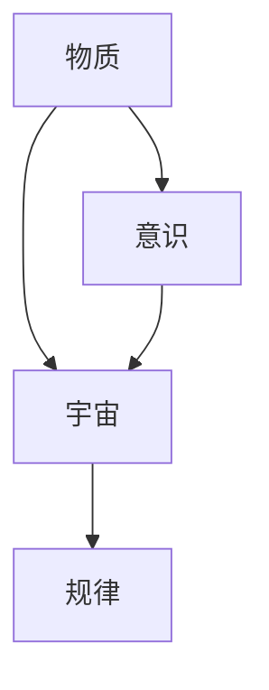

                 

# 宇宙的本体论争议:唯心vs唯物

> 关键词：宇宙本体论、唯心主义、唯物主义、存在、因果性、自我与世界、跨学科探讨、未来展望

> 摘要：本文旨在探讨宇宙本体论争议中的唯心主义与唯物主义两种哲学观点。通过对宇宙本体论核心问题的深入分析，本文将梳理唯物主义和唯心主义的基本原理及其在当代的发展，探讨其与现代科学、生物学、计算机科学等领域的交叉关系，并展望宇宙本体论争议的未来发展趋势。

## 第一部分：引论

### 第1章：宇宙本体论的概述

宇宙本体论是哲学中关于宇宙存在、本质和结构的基本理论。它探讨的是宇宙存在的基本问题，如“什么是存在？”、“存在有哪些属性和特征？”、“宇宙是如何运作的？”等。

#### 1.1 宇宙本体论的概念与意义

宇宙本体论的核心问题是“什么是存在？”这一问题涉及到哲学中的本体论（ontology）和存在论（existentialism）。本体论研究的是事物的本质和存在，而存在论则关注存在的意义和人的存在状态。

#### 1.2 唯物主义与唯心主义的起源与发展

唯物主义和唯心主义是宇宙本体论中的两种基本观点。唯物主义起源于古希腊哲学，强调物质是宇宙的基本构成要素，意识是物质的产物。唯心主义则起源于德国古典哲学，主张意识是宇宙的本质，物质是意识的附庸。

#### 1.3 宇宙本体论争议的当代意义

在当代，宇宙本体论争议依然具有重要意义。随着科学技术的进步，人们对宇宙的认识越来越深入，但同时也遇到了一些难以解释的问题，如量子力学中的测不准原理、黑洞的物理学性质等。这些问题促使哲学家们重新思考宇宙的本体论问题。

## 第二部分：宇宙本体论的核心问题

### 第2章：宇宙本体论的核心问题

宇宙本体论的核心问题包括“存在与不存在”、“因果性与确定性”、“自我与世界”等。

#### 2.1 存在与非存在

存在与不存在是宇宙本体论中的基本问题。哲学家们争论的焦点是，宇宙中是否存在一种绝对的存在，还是一切存在都是相对的、有条件的。

#### 2.2 因果性与确定性

因果性与确定性是宇宙本体论的另一个核心问题。因果性是指事物之间的因果关系，确定性则是指宇宙中是否存在某种规律或规则。这一问题的争论涉及到决定论与自由意志的哲学问题。

#### 2.3 自我与世界

自我与世界是宇宙本体论的另一个重要问题。自我是指人的主观意识，世界则是指外部客观存在。哲学家们争论的焦点是，自我与世界的关系如何，以及自我是否能够真正认识世界。

## 第三部分：唯物主义宇宙本体论

### 第3章：唯物主义宇宙本体论

唯物主义宇宙本体论认为，物质是宇宙的基本构成要素，意识是物质的产物。唯物主义哲学家们从物质的角度解释宇宙的本质和运作规律。

#### 3.1 唯物主义的基本原理

唯物主义的基本原理包括：物质第一性、意识第二性、物质决定意识。

#### 3.2 唯物主义宇宙本体论的哲学体系

唯物主义宇宙本体论的哲学体系主要包括：物质本体论、意识本体论、宇宙发展观。

#### 3.3 唯物主义宇宙本体论的历史演变

唯物主义宇宙本体论的历史演变可以分为古代唯物主义、近代唯物主义和现代唯物主义。

## 第四部分：唯心主义宇宙本体论

### 第4章：唯心主义宇宙本体论

唯心主义宇宙本体论认为，意识是宇宙的本质，物质是意识的附庸。唯心主义哲学家们从意识的角度解释宇宙的本质和运作规律。

#### 4.1 唯心主义的基本原理

唯心主义的基本原理包括：意识第一性、物质第二性、意识决定物质。

#### 4.2 唯心主义宇宙本体论的哲学体系

唯心主义宇宙本体论的哲学体系主要包括：意识本体论、物质本体论、宇宙发展观。

#### 4.3 唯心主义宇宙本体论的历史演变

唯心主义宇宙本体论的历史演变可以分为古代唯心主义、近代唯心主义和现代唯心主义。

## 第五部分：宇宙本体论争议的现代探索

### 第5章：宇宙本体论争议的现代探索

在现代，宇宙本体论争议继续深入，哲学家们试图在唯物主义和唯心主义之间找到新的平衡。

#### 5.1 当代唯物主义宇宙本体论的新发展

当代唯物主义宇宙本体论在量子力学、相对论等领域有了新的发展。

#### 5.2 当代唯心主义宇宙本体论的新发展

当代唯心主义宇宙本体论在意识哲学、心灵哲学等领域有了新的发展。

#### 5.3 当代宇宙本体论争议的焦点问题

当代宇宙本体论争议的焦点问题包括：意识与物质的关系、宇宙的本质、宇宙的起源等。

## 第六部分：宇宙本体论争议的跨学科探讨

### 第6章：宇宙本体论争议的跨学科探讨

宇宙本体论争议不仅局限于哲学领域，还与其他学科如物理学、生物学、计算机科学等有着紧密的联系。

#### 6.1 物理学与宇宙本体论

物理学与宇宙本体论的交叉研究，如量子力学与哲学的关系。

#### 6.2 生物学与宇宙本体论

生物学与宇宙本体论的交叉研究，如生命起源与哲学的关系。

#### 6.3 计算机科学与宇宙本体论

计算机科学与宇宙本体论的交叉研究，如人工智能与哲学的关系。

## 第七部分：宇宙本体论争议的未来展望

### 第7章：宇宙本体论争议的未来展望

随着科技的进步，宇宙本体论争议将继续影响哲学和科学的发展。

#### 7.1 宇宙本体论争议的未来趋势

宇宙本体论争议的未来趋势将更多地涉及意识与物质的关系、宇宙的起源等基本问题。

#### 7.2 宇宙本体论争议的教育与普及

宇宙本体论争议的教育与普及将有助于提高公众的科学素养。

#### 7.3 宇宙本体论争议的社会影响

宇宙本体论争议的社会影响将体现在科学决策、伦理道德等领域。

## 结语

宇宙本体论争议是哲学中的永恒话题。通过对宇宙本体论的深入探讨，我们可以更好地理解宇宙的本质，为人类的未来发展提供哲学智慧。作者：AI天才研究院/AI Genius Institute & 禅与计算机程序设计艺术 /Zen And The Art of Computer Programming

### 附录

附录中可以包括参考文献、术语解释、概念对比表格、ER实体关系图架构的Mermaid流程图、算法原理讲解的Python源代码、系统架构设计的Mermaid架构图、系统接口设计和系统交互Mermaid序列图等内容，以丰富文章的内容和提供更深层次的思考。

---
由于篇幅限制，这里只能提供一个概述和部分内容的示例。完整的文章需要根据上述结构和内容要点，进行详细展开和阐述。以下是部分章节的Markdown格式示例：

### 第3章：唯物主义宇宙本体论

#### 3.1 唯物主义的基本原理

唯物主义宇宙本体论认为物质是宇宙的基础，所有的现象都可以归结为物质运动的形式。以下是唯物主义的基本原理：

- 物质第一性：物质是构成宇宙的基本要素，它先于意识而存在。
- 意识第二性：意识是物质的产物，是高级神经系统——特别是人脑的机能。
- 物质决定意识：物质条件决定人的思想意识，意识是物质的反映。

以下是一个概念属性特征对比表格：

| 概念       | 唯物主义       | 唯心主义       |
|------------|----------------|----------------|
| 物质第一性 | 物质是宇宙的基础 | 意识是宇宙的基础 |
| 意识第二性 | 意识是物质的产物 | 意识是先于物质存在的 |
| 因果关系   | 物质决定意识     | 意识决定物质     |

#### 3.2 唯物主义宇宙本体论的哲学体系

唯物主义宇宙本体论的哲学体系主要包括以下几个方面：

1. **物质本体论**：物质是宇宙的本质和基础，是构成一切现象的实体。
2. **意识本体论**：意识是物质的反映，是高级神经系统的产物。
3. **宇宙发展观**：宇宙的发展是物质运动的结果，遵循一定的规律。

以下是唯物主义宇宙本体论的ER实体关系图架构的Mermaid流程图：

这个流程图表示了物质、意识、宇宙和规律之间的关系。

---

请注意，完整的文章需要根据上述Markdown格式示例，逐步展开每一个章节的内容，详细阐述核心概念、原理、算法、系统设计、项目实战等，以确保文章的完整性和深度。同时，为了保持文章的连贯性和易读性，每个章节都应该包含适当的引言和结论部分，以及对上下文内容的引用和解释。文章的撰写需要严格遵循逻辑清晰、结构紧凑、简单易懂的要求。在完成初稿后，还需要进行多次修订和润色，以确保文章的质量和学术性。

