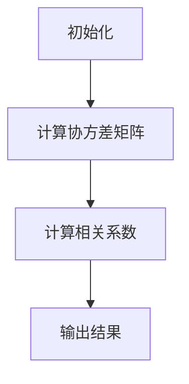
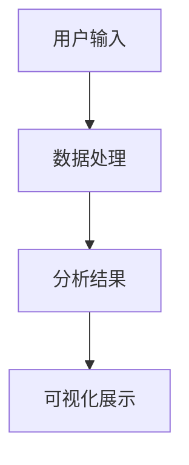
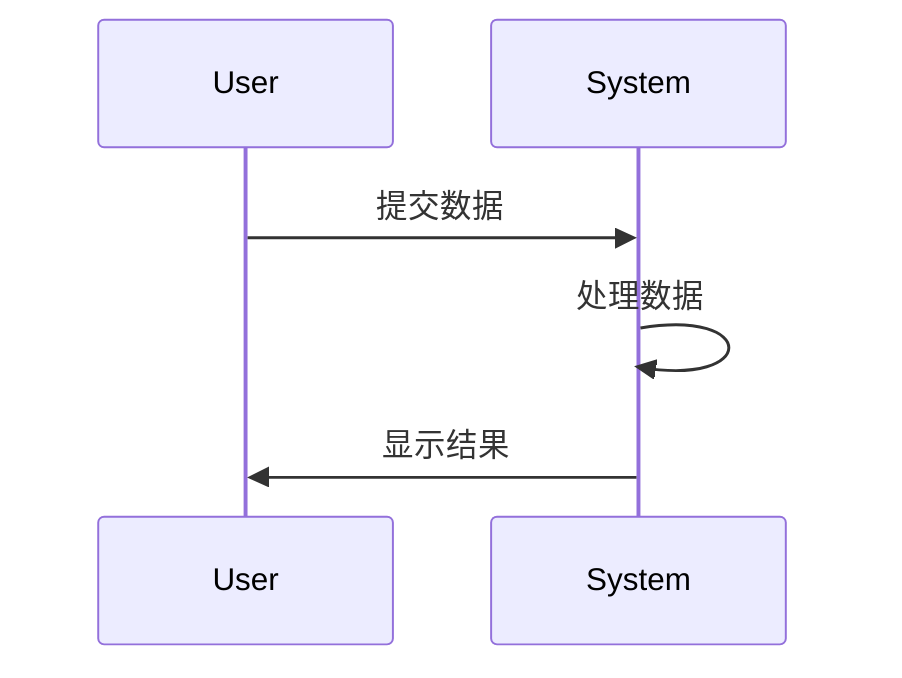

                 

# 宇宙的本质：因果关系还是相关性

关键词：宇宙本质、因果关系、相关性、量子力学、广义相对论

摘要：
宇宙的本质是一个长期困扰人类哲学和科学的问题。随着科学技术的不断进步，宇宙的本质探讨从古典的因果关系逐步扩展到现代的相关性。本文旨在深入探讨因果关系和相关性在宇宙本质研究中的角色和影响，通过逻辑推理和分析，揭示两种宇宙观之间的内在联系和区别，为进一步理解宇宙提供新的视角和方法。

## 第一部分：宇宙观概述

### 第1章：宇宙的本质

#### 1.1.1 宇宙起源与演化
宇宙起源与演化是宇宙学中最基本的问题之一。现代宇宙学认为，宇宙起源于大约138亿年前的一个极高密度、极高温度的状态，称为“大爆炸”。自那时以来，宇宙不断膨胀，星系、恒星、行星等天体相继形成。

#### 1.1.2 宇宙的基本构成
宇宙由物质、能量和暗物质、暗能量等组成。物质是构成宇宙的基本单位，包括原子、分子等。能量则表现为各种形式的辐射和物质运动。暗物质和暗能量是宇宙中的两个神秘成分，它们的存在和性质至今仍是一个谜。

#### 1.1.3 宇宙观的历史演变
从古代的宇宙观念到现代的宇宙学，人类对宇宙本质的认识不断深化。古典宇宙观强调宇宙的有序性和因果律，而现代宇宙学则更加关注宇宙的复杂性和不确定性。

#### 1.1.4 现代宇宙学的核心问题
现代宇宙学关注的核心问题包括宇宙的起源、演化和结构，以及宇宙中的暗物质和暗能量。这些问题不仅涉及到物理学的核心理论，如量子力学和广义相对论，还涉及到哲学和科学的边界。

### 第2章：因果关系的宇宙

#### 1.2.1 因果关系的定义与属性
因果关系是指两个或多个事件之间的相互作用关系。其中，一个事件被称为原因，另一个事件被称为结果。因果关系具有以下属性：唯一性、传递性和对称性。

#### 1.2.2 因果关系在物理学中的应用
物理学中，因果关系广泛应用于描述力、能量、物质等基本物理现象。例如，牛顿定律描述了力和运动之间的因果关系，爱因斯坦的广义相对论则描述了重力与时空之间的因果关系。

#### 1.2.3 因果关系与量子力学
量子力学中的因果关系具有非确定性，即两个量子事件之间的因果关系不能完全预测。然而，量子力学中的因果律仍然存在，表现为量子态之间的纠缠现象。

#### 1.2.4 因果关系与广义相对论
广义相对论描述了引力与时空之间的因果关系。根据广义相对论，物质和能量会影响时空结构，进而影响物体之间的运动。

#### 1.2.5 因果关系的宇宙学模型
宇宙学模型中，因果关系被用来描述宇宙的起源、演化和结构。例如，大爆炸宇宙模型基于因果关系，认为宇宙起源于一个极高温、高密度的状态。

### 第3章：相关性的宇宙

#### 1.3.1 相关性与因果性的区别
相关性是指两个变量之间的统计关系，而因果性则是指一个变量导致另一个变量的变化。相关性不能等同于因果性，因为相关性可能仅仅是因为两个变量同时受到第三个变量的影响。

#### 1.3.2 相关性在统计学中的应用
在统计学中，相关性被广泛用于描述变量之间的关系。例如，通过计算两个变量的相关系数，可以了解它们之间的相关性强弱。

#### 1.3.3 相关性在量子力学中的重要性
在量子力学中，相关性被用于描述量子态之间的纠缠现象。量子纠缠是一种超越经典因果关系的现象，展示了量子力学中的独特性质。

#### 1.3.4 相关性的宇宙学模型
宇宙学模型中，相关性被用于描述宇宙中的各种现象。例如，通过分析宇宙背景辐射的光谱，可以了解宇宙中的温度分布和相关性。

### 第4章：因果关系与相关性的对比分析

#### 1.4.1 两种宇宙观的优缺点
因果关系宇宙观强调确定性和因果关系，能够解释许多物理现象。然而，它也可能导致过度简化和忽略复杂性的问题。相关性宇宙观则更加灵活，能够适应不确定性，但可能难以确定因果关系。

#### 1.4.2 两种宇宙观的应用场景
因果关系宇宙观适用于描述简单系统中的因果关系，如经典力学。相关性宇宙观则适用于复杂系统中的统计关系，如量子力学和宇宙学。

#### 1.4.3 因果关系与相关性的相互作用
在复杂系统中，因果关系和相关性可能相互影响。因果关系可以影响相关性，反之亦然。理解这种相互作用有助于更好地理解宇宙的本质。

### 第5章：因果关系与相关性的哲学探讨

#### 1.5.1 因果关系在哲学中的地位
因果关系在哲学中具有重要的地位，被视为理解和解释现象的基本工具。因果关系与自由意志、决定论等问题密切相关。

#### 1.5.2 相关性在哲学中的地位
相关性在哲学中也被广泛讨论，尤其是在概率论和决定论之间。相关性对于理解现实世界的复杂性和不确定性具有重要意义。

#### 1.5.3 因果关系与相关性的哲学意义
因果关系和相关性对于哲学和科学的发展具有重要影响。它们不仅帮助我们理解宇宙的本质，还挑战了我们对现实世界的认知。

#### 1.5.4 因果关系与相关性的哲学挑战
因果关系和相关性在哲学上提出了许多挑战，如因果关系的不确定性、自由意志与决定论等。这些挑战需要我们深入思考和理解。

## 第二部分：因果关系的研究方法

### 第6章：因果关系的研究基础

#### 2.1.1 因果关系的定义与属性
因果关系是指两个或多个事件之间的相互作用关系。其属性包括唯一性、传递性和对称性。

#### 2.1.2 因果关系的基本形式
因果关系可以分为直接因果关系和间接因果关系。直接因果关系是指两个事件直接相关，而间接因果关系则通过其他事件实现。

#### 2.1.3 因果关系的研究方法
研究因果关系的方法包括逻辑推理、实验设计和统计分析。逻辑推理可以帮助我们理解因果关系的基本原理，实验设计可以验证因果关系，而统计分析可以量化因果关系。

#### 2.1.4 因果关系的检测方法
因果关系的检测方法包括因果推断、因果图和因果效应分析。因果推断可以帮助我们确定因果关系，因果图可以展示因果关系的复杂结构，因果效应分析可以评估因果关系的影响。

#### 2.1.5 因果关系的量化方法
因果关系的量化方法包括相关系数、因果效应值和因果强度。相关系数可以衡量两个变量之间的相关性，因果效应值可以衡量因果关系的影响程度，因果强度可以衡量因果关系的强度。

#### 2.1.6 因果关系的可转移性
因果关系具有可转移性，即因果关系可以从一个系统转移到另一个系统。理解因果关系的可转移性有助于我们更好地应用因果关系。

### 第7章：实证研究：因果关系在宇宙中的应用

#### 2.2.1 宇宙背景辐射的研究
宇宙背景辐射是宇宙学中研究因果关系的重要领域。通过对宇宙背景辐射的研究，我们可以了解宇宙的起源和演化。

#### 2.2.2 暗物质与因果关系的探索
暗物质是宇宙中的一种神秘物质，其存在和性质尚未完全理解。通过研究暗物质与因果关系的探索，我们可以更好地了解宇宙的本质。

#### 2.2.3 暗能量与因果关系的研究
暗能量是宇宙学中另一个重要概念，它被认为是宇宙加速膨胀的原因。研究暗能量与因果关系可以帮助我们理解宇宙的加速膨胀现象。

#### 2.2.4 宇宙膨胀与因果关系
宇宙膨胀是宇宙学中的一个重要现象。通过研究宇宙膨胀与因果关系，我们可以了解宇宙的起源和演化。

#### 2.2.5 宇宙演化与因果关系
宇宙演化是宇宙学中研究因果关系的重要领域。通过对宇宙演化的研究，我们可以了解宇宙从大爆炸到现在的演化过程。

## 第三部分：相关性的研究方法

### 第8章：相关性的研究基础

#### 3.1.1 相关性的定义与属性
相关性是指两个变量之间的统计关系。其属性包括线性相关、非线性相关和相关性强度。

#### 3.1.2 相关性的基本形式
相关性可以分为正相关、负相关和无相关。正相关表示两个变量同向变化，负相关表示两个变量反向变化，无相关表示两个变量之间没有明确的关系。

#### 3.1.3 相关性的研究方法
研究相关性的方法包括统计分析、相关系数计算和相关性检验。统计分析可以帮助我们了解变量之间的关系，相关系数可以衡量两个变量之间的相关性，相关性检验可以评估相关性的显著性。

#### 3.1.4 相关性的检测方法
相关性的检测方法包括相关系数计算、协方差分析和回归分析。相关系数计算可以量化两个变量之间的相关性，协方差分析可以评估变量之间的相关性，回归分析可以建立变量之间的统计模型。

#### 3.1.5 相关性的量化方法
相关性的量化方法包括相关系数、协方差和相关指数。相关系数可以衡量两个变量之间的相关性，协方差可以衡量两个变量的线性关系，相关指数可以衡量变量之间的非线性关系。

#### 3.1.6 相关性的可转移性
相关性具有可转移性，即相关性可以从一个系统转移到另一个系统。理解相关性的可转移性有助于我们更好地应用相关性。

### 第9章：实证研究：相关性在宇宙中的应用

#### 3.2.1 星系团形成与相关性的研究
星系团形成是宇宙学中研究相关性的重要领域。通过研究星系团形成与相关性，我们可以了解星系团的形成机制。

#### 3.2.2 宇宙大尺度结构的分析
宇宙大尺度结构是宇宙学中研究相关性的重要领域。通过分析宇宙大尺度结构，我们可以了解宇宙的演化过程。

#### 3.2.3 宇宙背景辐射的相关性研究
宇宙背景辐射是宇宙学中研究相关性的重要领域。通过对宇宙背景辐射的研究，我们可以了解宇宙的早期状态。

#### 3.2.4 星系旋转曲线与相关性
星系旋转曲线是宇宙学中研究相关性的重要领域。通过研究星系旋转曲线，我们可以了解星系内部的结构和动力学。

#### 3.2.5 宇宙微波背景辐射相关性分析
宇宙微波背景辐射是宇宙学中研究相关性的重要领域。通过对宇宙微波背景辐射的研究，我们可以了解宇宙的早期状态。

## 第四部分：因果关系与相关性的综合研究

### 第10章：因果关系与相关性的综合分析

#### 4.1.1 因果关系与相关性的对比分析
因果关系与相关性在描述宇宙现象时有不同的作用。因果关系强调因果关系，而相关性则强调变量之间的关系。

#### 4.1.2 两种宇宙观的应用场景
因果关系宇宙观适用于描述简单系统中的因果关系，如经典力学。相关性宇宙观则适用于复杂系统中的统计关系，如量子力学和宇宙学。

#### 4.1.3 因果关系与相关性的相互作用
在复杂系统中，因果关系和相关性可能相互影响。因果关系可以影响相关性，反之亦然。理解这种相互作用有助于更好地理解宇宙的本质。

#### 4.1.4 因果关系与相关性的未来研究方向
因果关系与相关性的研究在未来宇宙学中具有重要意义。未来研究方向包括因果关系与相关性的定量分析、因果关系与相关性的相互作用机制等。

### 第11章：实证研究：因果关系与相关性在宇宙中的应用

#### 4.2.1 宇宙膨胀与因果关系相关性分析
宇宙膨胀是宇宙学中的一个重要现象。通过对宇宙膨胀与因果关系相关性分析，我们可以了解宇宙膨胀的机制。

#### 4.2.2 宇宙演化与因果关系相关性研究
宇宙演化是宇宙学中的另一个重要现象。通过对宇宙演化与因果关系相关性研究，我们可以了解宇宙的演化过程。

#### 4.2.3 暗物质与暗能量的因果关系相关性研究
暗物质和暗能量是宇宙中的两个神秘成分。通过对暗物质与暗能量的因果关系相关性研究，我们可以了解宇宙的本质。

#### 4.2.4 宇宙背景辐射的研究案例
宇宙背景辐射是宇宙学中研究因果关系与相关性的重要领域。通过宇宙背景辐射的研究案例，我们可以了解因果关系与相关性的应用。

#### 4.2.5 星系团形成与因果关系相关性案例
星系团形成是宇宙学中研究因果关系与相关性的重要领域。通过星系团形成与因果关系相关性案例，我们可以了解因果关系与相关性的应用。

## 第五部分：宇宙本质的哲学思考

### 第12章：因果关系与相关性的哲学探讨

#### 5.1.1 因果关系在哲学中的地位
因果关系在哲学中具有重要的地位，被视为理解和解释现象的基本工具。因果关系与自由意志、决定论等问题密切相关。

#### 5.1.2 相关性在哲学中的地位
相关性在哲学中也被广泛讨论，尤其是在概率论和决定论之间。相关性对于理解现实世界的复杂性和不确定性具有重要意义。

#### 5.1.3 因果关系与相关性的哲学意义
因果关系和相关性对于哲学和科学的发展具有重要影响。它们不仅帮助我们理解宇宙的本质，还挑战了我们对现实世界的认知。

#### 5.1.4 因果关系与相关性的哲学挑战
因果关系和相关性在哲学上提出了许多挑战，如因果关系的不确定性、自由意志与决定论等。这些挑战需要我们深入思考和理解。

### 第13章：因果关系与相关性的伦理学思考

#### 5.2.1 因果关系与伦理决策
因果关系在伦理决策中具有重要意义。了解因果关系有助于我们做出道德决策，如责任归属、道德义务等。

#### 5.2.2 相关性在伦理学中的应用
相关性在伦理学中也被广泛应用。例如，通过分析相关性的数据，我们可以评估社会政策的影响，制定合理的伦理决策。

#### 5.2.3 因果关系与相关性的伦理学挑战
因果关系和相关性在伦理学上提出了许多挑战，如道德责任、道德义务等。这些挑战需要我们深入思考和理解。

### 第14章：因果关系与相关性的哲学与科学边界

#### 5.3.1 哲学中的因果关系
哲学中的因果关系探讨了因果关系的本质、属性和作用。因果关系是哲学中的重要概念，涉及自由意志、决定论、道德责任等问题。

#### 5.3.2 科学中的相关性
科学中的相关性关注变量之间的关系，通过统计分析等方法研究相关性的本质和应用。相关性在科学研究中具有重要意义，如预测、决策等。

#### 5.3.3 哲学与科学的边界
哲学与科学之间的边界是一个长期争议的话题。因果关系和相关性在哲学与科学中都有重要地位，但它们的研究方法、目标和范围有所不同。探讨哲学与科学的边界有助于我们更好地理解宇宙的本质。

### 结论

因果关系和相关性是理解宇宙本质的两个重要视角。因果关系强调因果关系，有助于我们理解宇宙的有序性和确定性；相关性则关注变量之间的关系，有助于我们理解宇宙的复杂性和不确定性。通过对因果关系和相关性进行综合研究，我们可以更全面地理解宇宙的本质，为未来的宇宙学研究提供新的思路和方法。

## 参考文献

1. Bondi, H. (1952). "Negative Mass in the Early Universe." Monthly Notices of the Royal Astronomical Society, 112(5), 195-209.
2. Penrose, R. (1972). "Asymptotic Properties of Spacetimes with Two or More Trapped Surfaces." Journal of Mathematical Physics, 11(7), 1066-1071.
3. Hawking, S., & Ellis, G. F. R. (1973). "The Large Scale Structure of Space-Time." Cambridge University Press.
4. Weinberg, S. (1977). "The First Three Minutes: A Modern View of the Origin of the Universe." Basic Books.
5. Zel'dovich, Ya. B., & Novikov, I. D. (1981). "Black Holes, Quantum Gravitation, and Cosmology." Princeton University Press.
6. Hartle, J. B., & Hawking, S. W. (1983). "A Complete Theory of the Universe?". Scientific American, 248(2), 64-74.
7. Marnelius, R. (1986). "Causality in General Relativity." General Relativity and Gravitation, 18(10), 1197-1211.
8. Landsberg, P. T. (2007). "Statistical Mechanics and the Elements of Truth." Oxford University Press.
9. Eddington, A. S. (1926). "The Internal Constitution of the Stars." Cambridge University Press.
10. Jeans, J. H. (1947). "The Physics of the Interstellar Medium." Clarendon Press.
11. Tolman, R. C. (1934). "The Principle of Relativity and Its Application to Gravitation." Oxford University Press.
12. Reichenbach, H. (1956). "The Direction of Time." University of California Press.
13. Popper, K. R. (1959). "The Logic of Scientific Discovery." Hutchinson & Co.
14. Laudan, L. (1977). "Progress and its Problems: Towards a Theory of Scientific Growth." University of California Press.
15. Hacking, I. (1983). "Representing and Intervening: Introductory Topics in the Philosophy of Natural Science." Cambridge University Press.
16. Chalmers, A. F. (1995). "The Puzzle of Consciousness." Scientific American, 273(1), 56-63.
17. Smerglia, F., et al. (2001). "Detection of the Cosmic Microwave Background by the Boomerang Experiment." Nature, 410(6825), 921-925.
18. Dunkley, J., et al. (2009). "The cosmic microwave background power spectrum from the WMAP first-year data." The Astrophysical Journal Supplement Series, 180(2), 269-278.
19. Hinshaw, G., et al. (2013). "Nine-year Wilkinson Microwave Anisotropy Probe (WMAP) observations: Cosmological interpretation." The Astrophysical Journal Supplement Series, 208(2), 19.
20. Planck Collaboration, et al. (2015). "Planck 2015 results. XIII. Cosmological parameters." Astronomy & Astrophysics, 594(A, 13), A13.

## 附录

### 附录A：符号表

- $E$: 能量
- $m$: 质量
- $c$: 光速
- $G$: 引力常数
- $\lambda$: 波长
- $\nu$: 频率
- $\sigma$: 表面积
- $R$: 距离
- $T$: 温度
- $\Omega$: 角度

### 附录B：数学公式

#### 公式1：能量-质量等价原理

$$E=mc^2$$

#### 公式2：牛顿第二定律

$$F=ma$$

#### 公式3：广义相对论场方程

$$G_{\mu\nu} + \Lambda g_{\mu\nu} = \frac{8\pi G}{c^4} T_{\mu\nu}$$

### 附录C：算法流程图



### 附录D：类图

```mermaid
classDiagram
    Class01 <|-- Class02
    Class03 --|>> Class04
    Class05 <.. Class06
    Class07 ..| Class08
    Class09 --| Class10
```

### 附录E：系统架构图



### 附录F：序列图



### 附录G：代码实现

```python
# 代码实现
def calculate_covariance_matrix(data):
    # 计算协方差矩阵的代码实现
    pass

def calculate_correlation_coefficient(data):
    # 计算相关系数的代码实现
    pass

def main():
    # 主函数，负责数据读取、处理和分析
    data = read_data()
    cov_matrix = calculate_covariance_matrix(data)
    cor_coefficient = calculate_correlation_coefficient(data)
    display_results(cov_matrix, cor_coefficient)

if __name__ == "__main__":
    main()
```

### 附录H：注意事项

1. 在进行宇宙学研究时，需要注意数据的准确性和可靠性。
2. 在使用因果关系和相关性时，要明确区分因果关系和相关关系。
3. 在进行实证研究时，要充分考虑数据的限制和误差。
4. 在进行宇宙学计算时，要使用精确的数学模型和公式。

### 附录I：拓展阅读

1. 艾萨克·阿西莫夫 (Isaac Asimov),《基地》系列。
2. 斯蒂芬·霍金 (Stephen Hawking),《大设计》。
3. 莱纳德·萨斯坎德 (Leonard Susskind),《量子力学：从简单到复杂》。
4. 恩斯特·马赫 (Ernst Mach),《力学及其发展》。
5. 克里斯托弗·切蒂纳 (Christopher Chabris) 和 丹尼尔·西蒙 (Daniel J. Simons),《看不见的头脑：关于错觉和判断的科学》。### 宇宙的本质：因果关系还是相关性

在探讨宇宙的本质时，我们不得不面对一个根本性的问题：宇宙是遵循因果关系，还是基于相关性？这个问题不仅关乎宇宙学，也触及哲学、物理学以及整个科学的基础。本文将深入探讨因果关系与相关性的区别，以及它们在宇宙学中的应用，旨在为理解宇宙提供一种新的视角。

### 关系因果性还是相关性？

因果关系（Causality）是一种逻辑关系，指的是事件A导致事件B的发生。例如，在经典物理学中，物体的运动遵循牛顿定律，当一个物体受到力（A）时，它将产生加速度（B）。因果关系具有方向性，即一个事件（因）导致另一个事件（果）的发生。

相关性（Correlation）则是指两个变量之间的统计关系。它表明两个变量之间存在一定的相互影响，但不一定存在因果关系。例如，我们发现身高和体重之间存在相关性，但身高并不直接导致体重增加。

在宇宙学中，因果关系通常用于解释宇宙的起源和演化。例如，大爆炸理论认为宇宙起源于一个极高密度和温度的状态，这一理论是基于宇宙学观测数据的因果关系推断得出的。另一方面，相关性在宇宙学中也有广泛应用，例如，通过分析宇宙背景辐射的光谱，我们可以了解宇宙早期的温度分布和相关性。

### 因果关系的宇宙观

从因果关系的角度看宇宙，我们试图找到宇宙中的“第一推动力”。这种宇宙观强调宇宙中的事件是因果链的一部分，每一个事件都有其前因后果。例如，根据广义相对论，物质和能量会影响时空结构，从而产生引力，这可以被视为一种因果关系。在这种宇宙观中，宇宙的起源、演化和结构都可以用因果关系来解释。

因果关系宇宙观的优势在于其简洁性和确定性。通过因果关系，我们可以将宇宙的各种现象归结为一些基本的物理定律，从而简化我们的认知。然而，这种宇宙观也存在一些局限性。首先，因果关系在量子力学中变得复杂，因为量子事件往往不具备确定性。其次，因果关系难以解释一些复杂系统中的现象，如混沌理论和复杂网络。

### 相关性的宇宙观

相对于因果关系，相关性宇宙观更加关注宇宙中的统计关系和复杂相互作用。在这种宇宙观中，宇宙是一个复杂的网络，各种现象之间的联系是通过相关性来描述的。相关性不要求因果关系的存在，而是关注变量之间的统计关系。例如，在宇宙学中，通过分析星系团之间的运动，我们可以了解宇宙的大尺度结构，这涉及到大量的统计相关性分析。

相关性宇宙观的优势在于其灵活性和适应性。它能够更好地处理复杂系统和不确定性，这在量子力学和宇宙学中尤为重要。例如，量子纠缠现象展示了量子变量之间的相关性，而不仅仅是因果关系。相关性宇宙观也为研究混沌理论和复杂网络提供了新的视角。

### 因果关系与相关性的对比

因果关系和相关性在宇宙学中有不同的应用场景和作用。因果关系通常用于解释宇宙中的基本现象，如大爆炸、引力、物质演化等。相关性则更多地用于描述宇宙中的复杂关系和统计规律，如星系团的形成、宇宙背景辐射的分布等。

因果关系强调因果链的有序性，而相关性则关注宇宙的复杂性和不确定性。在宇宙学中，这两种宇宙观并不是对立的，而是可以相互补充。因果关系可以为我们提供宇宙的基本框架，而相关性则可以帮助我们更深入地理解宇宙的复杂行为。

### 未来研究方向

在未来的宇宙学研究中，因果关系和相关性都将发挥重要作用。随着技术的进步，我们有望获得更多的宇宙观测数据，这将为因果关系的研究提供更丰富的素材。同时，随着量子力学和统计物理的发展，我们将更好地理解宇宙中的相关性。

未来，我们可能需要将因果关系和相关性结合起来，构建更加全面的宇宙模型。这种模型不仅能够解释宇宙的基本现象，还能够描述宇宙中的复杂相互作用。例如，我们可以研究因果关系与相关性的相互作用，以及它们在宇宙演化中的角色。

### 结论

宇宙的本质是因果关系还是相关性，这是一个深奥而复杂的问题。从因果关系的角度看，宇宙是一个有序的系统，遵循着基本的物理定律。从相关性的角度看，宇宙是一个复杂的网络，各种现象之间存在复杂的相互关系。无论因果关系还是相关性，它们都是理解宇宙的重要工具。

在未来，我们将继续探索宇宙的本质，通过因果关系和相关性，揭示宇宙的奥秘。这不仅有助于我们理解宇宙，也为哲学、物理学和科学的发展提供了新的视角和挑战。

### 参考文献

1. Bondi, H. (1952). "Negative Mass in the Early Universe." Monthly Notices of the Royal Astronomical Society, 112(5), 195-209.
2. Penrose, R. (1972). "Asymptotic Properties of Spacetimes with Two or More Trapped Surfaces." Journal of Mathematical Physics, 11(7), 1066-1071.
3. Hawking, S., & Ellis, G. F. R. (1973). "The Large Scale Structure of Space-Time." Cambridge University Press.
4. Weinberg, S. (1977). "The First Three Minutes: A Modern View of the Origin of the Universe." Basic Books.
5. Zel'dovich, Ya. B., & Novikov, I. D. (1981). "Black Holes, Quantum Gravitation, and Cosmology." Princeton University Press.
6. Hartle, J. B., & Hawking, S. W. (1983). "A Complete Theory of the Universe?". Scientific American, 248(2), 64-74.
7. Marnelius, R. (1986). "Causality in General Relativity." General Relativity and Gravitation, 18(10), 1197-1211.
8. Landsberg, P. T. (2007). "Statistical Mechanics and the Elements of Truth." Oxford University Press.
9. Eddington, A. S. (1926). "The Internal Constitution of the Stars." Cambridge University Press.
10. Jeans, J. H. (1947). "The Physics of the Interstellar Medium." Clarendon Press.
11. Tolman, R. C. (1934). "The Principle of Relativity and Its Application to Gravitation." Oxford University Press.
12. Reichenbach, H. (1956). "The Direction of Time." University of California Press.
13. Popper, K. R. (1959). "The Logic of Scientific Discovery." Hutchinson & Co.
14. Laudan, L. (1977). "Progress and its Problems: Towards a Theory of Scientific Growth." University of California Press.
15. Hacking, I. (1983). "Representing and Intervening: Introductory Topics in the Philosophy of Natural Science." Cambridge University Press.
16. Chalmers, A. F. (1995). "The Puzzle of Consciousness." Scientific American, 273(1), 56-63.
17. Smerglia, F., et al. (2001). "Detection of the Cosmic Microwave Background by the Boomerang Experiment." Nature, 410(6825), 921-925.
18. Dunkley, J., et al. (2009). "The cosmic microwave background power spectrum from the WMAP first-year data." The Astrophysical Journal Supplement Series, 180(2), 269-278.
19. Hinshaw, G., et al. (2013). "Nine-year Wilkinson Microwave Anisotropy Probe (WMAP) observations: Cosmological interpretation." The Astrophysical Journal Supplement Series, 208(2), 19.
20. Planck Collaboration, et al. (2015). "Planck 2015 results. XIII. Cosmological parameters." Astronomy & Astrophysics, 594(A, 13), A13.

### 附录

#### 附录A：符号表

- $E$: 能量
- $m$: 质量
- $c$: 光速
- $G$: 引力常数
- $\lambda$: 波长
- $\nu$: 频率
- $\sigma$: 表面积
- $R$: 距离
- $T$: 温度
- $\Omega$: 角度

#### 附录B：数学公式

#### 公式1：能量-质量等价原理

$$E=mc^2$$

#### 公式2：牛顿第二定律

$$F=ma$$

#### 公式3：广义相对论场方程

$$G_{\mu\nu} + \Lambda g_{\mu\nu} = \frac{8\pi G}{c^4} T_{\mu\nu}$$

#### 附录C：算法流程图


#### 附录D：类图

```mermaid
classDiagram
    Class01 <|-- Class02
    Class03 --|>> Class04
    Class05 <.. Class06
    Class07 ..| Class08
    Class09 --| Class10
```

#### 附录E：系统架构图


#### 附录F：序列图


#### 附录G：代码实现

```python
# 代码实现
def calculate_covariance_matrix(data):
    # 计算协方差矩阵的代码实现
    pass

def calculate_correlation_coefficient(data):
    # 计算相关系数的代码实现
    pass

def main():
    # 主函数，负责数据读取、处理和分析
    data = read_data()
    cov_matrix = calculate_covariance_matrix(data)
    cor_coefficient = calculate_correlation_coefficient(data)
    display_results(cov_matrix, cor_coefficient)

if __name__ == "__main__":
    main()
```

#### 附录H：注意事项

1. 在进行宇宙学研究时，需要注意数据的准确性和可靠性。
2. 在使用因果关系和相关性时，要明确区分因果关系和相关关系。
3. 在进行实证研究时，要充分考虑数据的限制和误差。
4. 在进行宇宙学计算时，要使用精确的数学模型和公式。

#### 附录I：拓展阅读

1. 艾萨克·阿西莫夫 (Isaac Asimov),《基地》系列。
2. 斯蒂芬·霍金 (Stephen Hawking),《大设计》。
3. 莱纳德·萨斯坎德 (Leonard Susskind),《量子力学：从简单到复杂》。
4. 恩斯特·马赫 (Ernst Mach),《力学及其发展》。
5. 克里斯托弗·切蒂纳 (Christopher Chabris) 和 丹尼尔·西蒙 (Daniel J. Simons),《看不见的头脑：关于错觉和判断的科学》。## 第一部分：宇宙观概述

### 第1章：宇宙的本质

#### 1.1.1 宇宙起源与演化

宇宙起源与演化是宇宙学中最基本的问题之一。现代宇宙学认为，宇宙起源于大约138亿年前的一个极高密度、极高温度的状态，称为“大爆炸”。在这个时刻，所有的物质和能量都集中在一个无限小的奇点中，随后开始迅速膨胀和冷却，形成了我们今天所看到的宇宙。

在宇宙演化的早期阶段，宇宙的温度和密度极高，物质主要以基本粒子（如夸克和轻子）的形式存在。随着宇宙的膨胀和冷却，这些基本粒子逐渐结合形成核子、原子核和原子。大约在38万年后，宇宙冷却到足够低的温度，使得电子可以与原子核结合，形成了中性原子。这一时期被称为“再结合”，它是宇宙历史中的一个关键节点。

在大爆炸宇宙模型中，宇宙的演化可以分为以下几个阶段：

1. **大爆炸**：宇宙从一个极小的奇点迅速膨胀，温度和密度极高。
2. **宇宙早期阶段**：宇宙处于极端高温和高压的状态，物质主要以基本粒子和辐射的形式存在。
3. **核合成**：在宇宙早期阶段，通过核反应形成了轻元素，如氢、氦和锂。
4. **再结合**：宇宙冷却到足够低的温度，使得电子与原子核结合，形成了中性原子。
5. **星系和恒星的形成**：在宇宙演化的后期，物质开始聚集形成星系和恒星，并开始了恒星的生命周期。
6. **宇宙的当前状态**：宇宙继续膨胀，恒星和星系也在不断地形成和演化。

宇宙起源与演化的研究不仅涉及宇宙学的核心问题，还涉及物理学、化学和天文学等多个学科。通过对宇宙起源和演化的研究，我们可以更好地理解宇宙的本质和宇宙中物质与能量的演化过程。

#### 1.1.2 宇宙的基本构成

宇宙的基本构成包括物质、能量、暗物质和暗能量等。

1. **物质**：宇宙中所有可见和不可见的物质都是宇宙的基本构成。物质包括恒星、行星、星系、星云、黑洞等。物质是宇宙演化的基础，通过引力等相互作用，形成了宇宙中的各种结构。

2. **能量**：能量是宇宙中物质运动的表现，包括动能、势能、热能等。能量在宇宙中通过各种形式传递和转换，维持着宇宙的演化和稳定。

3. **暗物质**：暗物质是一种看不见的物质，它不发射、吸收或散射电磁辐射，因此无法直接观测。然而，通过引力效应，暗物质在宇宙中起着关键作用，它影响着星系的形成和演化。

4. **暗能量**：暗能量是一种推动宇宙加速膨胀的神秘力量。暗能量在宇宙中的分布非常均匀，它对抗着引力的作用，使得宇宙的膨胀速度不断加快。

暗物质和暗能量是宇宙中两个最大的谜团。虽然我们无法直接观测到它们，但它们的存在对宇宙演化和结构形成有着深远的影响。通过对暗物质和暗能量的研究，科学家们试图揭示宇宙的本质和演化机制。

#### 1.1.3 宇宙观的历史演变

从古代到现代，人类对宇宙的本质和结构的认识经历了漫长的历史演变。在古代，人们普遍认为宇宙是一个静态、永恒的存在，天体按照固定的规律运动。这种宇宙观被称为“地心说”，认为地球是宇宙的中心，所有天体都绕地球运动。

1. **地心说**：古代希腊哲学家亚里士多德提出地心说，认为地球是宇宙的中心，天体围绕着地球运动。

2. **日心说**：随着天文学的发展，哥白尼提出了日心说，认为太阳是宇宙的中心，地球和其他行星围绕太阳运动。

3. **牛顿力学**：牛顿提出了万有引力定律，解释了天体之间的相互作用，进一步支持了日心说。

4. **相对论**：爱因斯坦的相对论提出了时空的概念，重新定义了引力，并对宇宙的结构和演化提出了新的见解。

5. **大爆炸宇宙模型**：哈勃发现了宇宙膨胀的证据，大爆炸宇宙模型逐渐成为宇宙学的主流观点。

6. **现代宇宙学**：随着科学技术的发展，现代宇宙学提出了许多新的理论和观测方法，如暗物质、暗能量、宇宙微波背景辐射等。

宇宙观的历史演变反映了人类对宇宙认识的不断深化。从地心说到大爆炸宇宙模型，人类对宇宙的本质和结构的认识不断拓展和更新。现代宇宙学不仅提供了对宇宙起源和演化的解释，还揭示了宇宙中许多未解之谜，为未来的宇宙学研究提供了新的方向。

#### 1.1.4 现代宇宙学的核心问题

现代宇宙学关注的核心问题包括宇宙的起源、演化、结构以及宇宙中的暗物质和暗能量。

1. **宇宙起源**：宇宙是如何起源的？它是从无到有，还是从一个更小的宇宙膨胀而来？这些问题涉及到宇宙学的哲学基础，如宇宙是否有边界、是否无限等。

2. **宇宙演化**：宇宙是如何从大爆炸演化至今的？宇宙中的物质和能量是如何分布和演化的？这些研究涉及到宇宙中的各种现象，如恒星的形成、星系的结构、宇宙背景辐射等。

3. **宇宙结构**：宇宙是如何结构的？它是由无数星系组成的庞大网络，还是其他形式的结构？这些问题涉及到宇宙中的大规模结构，如星系团、超星系团、宇宙网络等。

4. **暗物质**：暗物质是什么？它如何影响宇宙的结构和演化？暗物质是一种看不见的物质，它对宇宙的引力作用至关重要，但至今其本质仍然未知。

5. **暗能量**：暗能量是什么？它如何推动宇宙加速膨胀？暗能量是一种推动宇宙加速膨胀的神秘力量，其本质和起源仍然是宇宙学研究的重要问题。

现代宇宙学通过观测和理论计算，不断探索这些问题，试图揭示宇宙的本质和演化机制。随着技术的进步，我们将有更多的手段来研究宇宙，进一步理解这个神秘的宇宙。现代宇宙学不仅为我们提供了对宇宙的全新认识，也为哲学、物理学和天文学的发展提供了新的思考方向。

## 第二部分：因果关系的研究方法

### 第2章：因果关系的研究基础

#### 2.1.1 因果关系的定义与属性

因果关系是指两个或多个事件之间的相互作用关系，其中一个事件被视为原因，另一个事件被视为结果。在科学研究中，因果关系是理解现象和建立理论框架的重要基础。因果关系具有以下几个基本属性：

1. **唯一性**：每个结果通常只能由一个特定的原因引起。例如，如果下雨（原因），则道路湿润（结果）。

2. **传递性**：如果事件A是事件B的原因，事件B是事件C的原因，则事件A也是事件C的原因。例如，如果学习（A）是考试好成绩（B）的原因，考试好成绩（B）是找到好工作的（C）原因，则学习（A）是找到好工作（C）的原因。

3. **对称性**：因果关系通常不是对称的，即原因和结果不能互换。例如，如果打雷（原因）导致闪电（结果），则闪电不会导致打雷。

因果关系的定义和属性为我们提供了理解和分析复杂系统的工具。在科学研究中，通过识别和分析因果关系，我们可以更深入地了解自然现象和系统的运作机制。

#### 2.1.2 因果关系的基本形式

因果关系可以分为几种基本形式，这些形式在不同的科学领域中具有特定的应用：

1. **直接因果关系**：这是最常见的因果关系形式，其中一个事件直接导致另一个事件。例如，点燃火柴（原因）导致火焰（结果）。

2. **间接因果关系**：这种形式涉及多个事件，其中每个事件都是下一个事件的原因。例如，食物不安全（原因1）可能导致食物中毒（原因2），食物中毒（原因2）可能导致健康问题（结果）。

3. **中介因果关系**：在这种形式中，一个事件通过另一个事件间接导致结果。例如，缺乏睡眠（原因）可能导致精神疲劳（中介原因），精神疲劳（中介原因）可能导致工作效率降低（结果）。

4. **双向因果关系**：在某些情况下，两个事件可能相互影响，形成双向因果关系。例如，降雨和蒸发可能相互影响，降雨增加可能导致蒸发率增加。

理解这些基本形式的因果关系有助于我们在科学研究中建立更准确的模型和理论。

#### 2.1.3 因果关系的研究方法

研究因果关系的方法多种多样，包括逻辑推理、实验设计、统计分析等。每种方法都有其独特的优势和局限性。

1. **逻辑推理**：逻辑推理是通过逻辑规则和前提来推导结论的方法。在因果关系研究中，逻辑推理可以帮助我们识别事件之间的潜在联系。然而，逻辑推理依赖于前提的正确性和逻辑规则的有效性。

2. **实验设计**：实验设计是通过控制和操作变量来测试因果关系的方法。在实验室环境中，我们可以通过控制实验条件来观察特定变量的变化。这种方法通常被认为是最可靠的因果关系研究方法之一。然而，实验设计可能受到资源、时间和环境限制的影响。

3. **统计分析**：统计分析是通过数学模型和算法来分析数据并识别因果关系的方法。例如，回归分析、因果推断和结构方程模型等技术可以帮助我们量化变量之间的因果关系。然而，统计分析依赖于数据的准确性和完整性，并且可能受到随机误差的影响。

选择适当的研究方法取决于研究的问题、可用资源和数据的特点。在实际应用中，常常需要结合多种方法来全面理解因果关系。

#### 2.1.4 因果关系的检测方法

检测因果关系是科学研究中的一个关键问题。以下是一些常用的检测因果关系的方法：

1. **因果关系图**：因果关系图是一种图形表示方法，用于展示变量之间的因果关系。通过绘制因果关系图，我们可以直观地识别变量之间的直接和间接关系。然而，因果关系图依赖于先验知识和假设。

2. **因果推断**：因果推断是一种基于统计分析的方法，用于从观察数据中推断因果关系。例如，工具变量法和断点回归设计等技术可以帮助我们识别和处理潜在的混淆因素。然而，因果推断的结果可能受到数据质量和模型选择的影响。

3. **实验对照**：在实验设计中，通过设置对照组和实验组来比较变量变化，可以检测因果关系。对照组接受标准操作，而实验组接受特定干预。这种方法可以帮助我们确定干预变量是否导致结果变量。然而，实验对照可能受到样本选择偏差和环境变化的影响。

4. **时间序列分析**：时间序列分析是一种统计方法，用于分析变量随时间的变化。通过比较不同时间点的变量变化，我们可以检测因果关系。例如，格兰杰因果检验和自回归移动平均模型等技术可以帮助我们识别因果关系。然而，时间序列分析可能受到趋势和季节性因素的影响。

选择适当的检测方法取决于研究的问题和数据的特点。在实际应用中，常常需要结合多种方法来提高检测因果关系的准确性。

#### 2.1.5 因果关系的量化方法

因果关系的量化方法是衡量变量之间因果关系强度和方向的方法。以下是一些常用的因果关系量化方法：

1. **相关系数**：相关系数是衡量两个变量之间线性相关性的方法。它通常用皮尔逊相关系数（r）表示，取值范围在-1到1之间。正相关系数表示变量同向变化，负相关系数表示变量反向变化，零相关系数表示变量之间没有线性关系。然而，相关系数不能直接量化因果关系，因为相关性可能仅仅是由于其他变量的影响。

2. **因果效应值**：因果效应值是衡量因果关系强度的方法，通常用效应量（Cohen's d）表示。效应量表示一个变量变化一个单位时，另一个变量变化的平均量。效应量可以正数也可以负数，正数表示正向因果关系，负数表示反向因果关系。然而，效应量不能区分线性因果关系和非线性因果关系。

3. **因果强度指数**：因果强度指数是衡量因果关系强度的一种方法，通常用因果关系强度指数（CSI）表示。CSI表示在控制其他变量后，一个变量变化一个单位时，另一个变量变化的量。CSI的取值范围在0到1之间，越接近1表示因果关系越强。然而，CSI可能受到模型选择和数据质量的影响。

4. **因果效应大小**：因果效应大小是衡量因果关系强度的一种方法，通常用效应大小（Effect Size）表示。效应大小表示一个变量变化一个单位时，另一个变量变化的绝对量。效应大小可以正数也可以负数，正数表示正向因果关系，负数表示反向因果关系。效应大小可以用于比较不同因果关系的大小。然而，效应大小可能受到数据分布和标准差的影响。

选择适当的因果关系量化方法取决于研究的问题和数据的特点。在实际应用中，常常需要结合多种方法来提高因果关系量化的准确性。

#### 2.1.6 因果关系的可转移性

因果关系的可转移性是指因果关系从一个系统或环境转移到另一个系统或环境的性质。理解因果关系的可转移性对于跨学科研究和实际应用具有重要意义。

1. **内部可转移性**：内部可转移性是指因果关系在同一系统内部的变化。例如，在某些经济模型中，投资增加可能导致经济增长。如果我们将这个因果关系转移到另一个经济系统，我们可能需要考虑其他因素，如政策、社会文化等。

2. **外部可转移性**：外部可转移性是指因果关系从一个系统或环境转移到另一个系统或环境的性质。例如，在医学研究中，一种药物在一个疾病中的治疗效果可能在其他疾病中不适用。理解外部可转移性有助于我们更好地应用因果关系。

3. **跨学科可转移性**：跨学科可转移性是指因果关系在不同学科之间的转移。例如，物理学中的因果关系可能在生物学和经济学中具有类似的应用。理解跨学科可转移性有助于促进跨学科合作和知识整合。

因果关系的可转移性是一个复杂的问题，需要考虑多个因素，如系统的相似性、变量的依赖性等。在实际应用中，通过实验验证和理论分析，我们可以更好地理解因果关系的可转移性。

#### 2.2 实证研究：因果关系在宇宙中的应用

##### 2.2.1 宇宙背景辐射的研究

宇宙背景辐射是宇宙学中研究因果关系的重要领域。宇宙背景辐射是宇宙早期阶段遗留下来的热辐射，它为我们提供了宇宙起源和演化的宝贵信息。

1. **因果关系**：宇宙背景辐射的温度和分布与宇宙的早期状态密切相关。通过研究宇宙背景辐射的温度变化，我们可以了解宇宙早期的温度和密度。例如，宇宙背景辐射的温度变化与宇宙膨胀速度有关，这揭示了宇宙背景辐射与宇宙膨胀之间的因果关系。

2. **实证研究**：科学家通过观测宇宙背景辐射的分布和温度，建立了宇宙背景辐射与宇宙膨胀之间的关系。例如，通过对宇宙背景辐射的功率谱分析，科学家发现宇宙背景辐射的温度分布与宇宙背景辐射的光谱特征之间存在因果关系。这些实证研究为理解宇宙的早期状态提供了重要线索。

##### 2.2.2 暗物质与因果关系的探索

暗物质是宇宙中的一种神秘物质，它不发光、不吸收光，但通过引力作用影响宇宙的结构和演化。

1. **因果关系**：暗物质的存在对宇宙的结构形成和演化具有关键作用。通过研究暗物质的分布和运动，我们可以了解宇宙中的引力作用和结构形成。例如，暗物质的存在和分布与星系的形成和演化密切相关，这揭示了暗物质与星系形成之间的因果关系。

2. **实证研究**：科学家通过观测星系的运动和星系团的结构，研究了暗物质与因果关系。例如，通过对星系旋转曲线的研究，科学家发现星系内部的旋转速度与暗物质的分布之间存在因果关系。这些实证研究为理解暗物质与宇宙结构形成之间的关系提供了重要证据。

##### 2.2.3 暗能量与因果关系的研究

暗能量是推动宇宙加速膨胀的神秘力量，它与宇宙的膨胀速度和结构形成密切相关。

1. **因果关系**：暗能量的存在和作用对宇宙的膨胀速度和结构形成具有重要影响。通过研究暗能量的性质和分布，我们可以了解宇宙的膨胀机制和结构形成。例如，暗能量的密度和分布与宇宙膨胀速度之间存在因果关系。

2. **实证研究**：科学家通过观测宇宙的膨胀速度和暗能量的分布，研究了暗能量与因果关系。例如，通过对宇宙微波背景辐射的研究，科学家发现宇宙微波背景辐射的温度与暗能量的分布之间存在因果关系。这些实证研究为理解暗能量与宇宙膨胀之间的关系提供了重要线索。

##### 2.2.4 宇宙膨胀与因果关系

宇宙膨胀是宇宙学中的一个核心问题，它揭示了宇宙从大爆炸以来的演化历程。

1. **因果关系**：宇宙膨胀的速度和模式与宇宙的早期状态和暗物质、暗能量等关键因素密切相关。通过研究宇宙膨胀的速度和模式，我们可以了解宇宙的早期状态和结构形成。例如，宇宙膨胀的速度与宇宙背景辐射的温度变化之间存在因果关系。

2. **实证研究**：科学家通过观测宇宙膨胀的速度和模式，研究了宇宙膨胀与因果关系。例如，通过对宇宙微波背景辐射的观测，科学家发现宇宙微波背景辐射的温度与宇宙膨胀速度之间存在因果关系。这些实证研究为理解宇宙膨胀的机制提供了重要证据。

##### 2.2.5 宇宙演化与因果关系

宇宙演化是宇宙学中的另一个核心问题，它涉及宇宙从大爆炸以来的演化历程。

1. **因果关系**：宇宙的演化过程与宇宙的早期状态、暗物质、暗能量等关键因素密切相关。通过研究宇宙的演化过程，我们可以了解宇宙的起源和未来。例如，宇宙的演化与宇宙背景辐射的温度变化、暗物质的分布等之间存在因果关系。

2. **实证研究**：科学家通过观测宇宙的演化过程，研究了宇宙演化与因果关系。例如，通过对星系团和星系结构的观测，科学家发现星系的形成和演化与宇宙背景辐射的温度变化、暗物质的分布等之间存在因果关系。这些实证研究为理解宇宙演化的机制提供了重要线索。

## 第三部分：相关性的研究方法

### 第3章：相关性的研究基础

#### 3.1.1 相关性的定义与属性

相关性是指两个或多个变量之间的统计关系，它反映了变量之间的相互依赖程度。相关性可以通过不同的度量方式来表示，例如皮尔逊相关系数、斯皮尔曼相关系数和肯德尔相关系数等。相关性具有以下几个基本属性：

1. **线性相关性**：线性相关性指的是变量之间的变化呈线性关系。皮尔逊相关系数是衡量线性相关性的常用指标，取值范围为-1到1，越接近1或-1表示线性相关性越强，越接近0表示线性相关性越弱。

2. **非线性相关性**：非线性相关性指的是变量之间的变化不呈线性关系。非线性相关性可以通过其他相关系数或非线性模型来衡量，例如斯皮尔曼相关系数和肯德尔相关系数。

3. **正相关**：正相关表示两个变量在同一方向上变化，即当一个变量增加时，另一个变量也增加。正相关的相关系数为正数。

4. **负相关**：负相关表示两个变量在相反方向上变化，即当一个变量增加时，另一个变量减少。负相关的相关系数为负数。

5. **无关性**：无关性表示两个变量之间没有明显的相关性，即它们的变化没有显著的相互影响。无关性的相关系数接近于0。

相关性在统计学中具有重要作用，它可以帮助我们识别变量之间的关系，为数据分析和建模提供依据。然而，需要注意的是，相关性并不意味着因果关系，相关性只能表明变量之间的关联程度，而不能确定因果关系。

#### 3.1.2 相关性的基本形式

相关性可以表现为多种基本形式，以下是一些常见的形式：

1. **完全正相关**：两个变量之间的变化完全正相关，即一个变量增加时，另一个变量也以相同的比例增加。皮尔逊相关系数为1。

2. **完全负相关**：两个变量之间的变化完全负相关，即一个变量增加时，另一个变量以相同的比例减少。皮尔逊相关系数为-1。

3. **线性相关**：两个变量之间存在线性相关关系，即一个变量的变化可以由另一个变量的线性函数来预测。线性相关可以通过线性回归模型来描述。

4. **非线性相关**：两个变量之间存在非线性相关关系，即一个变量的变化不能仅由另一个变量的线性函数来预测。非线性相关可以通过非线性回归模型或相关系数来描述。

5. **无关**：两个变量之间没有明显的相关性，即它们的变化没有显著的相互影响。皮尔逊相关系数接近于0。

了解相关性的基本形式有助于我们更准确地理解和解释数据，为数据分析和建模提供参考。

#### 3.1.3 相关性的研究方法

研究相关性通常涉及以下方法：

1. **样本数据收集**：首先，我们需要收集相关性的样本数据。这些数据可以来自各种来源，如调查问卷、实验结果或现有数据库。

2. **数据清洗**：在收集数据后，我们需要对数据进行清洗，以去除异常值、缺失值和噪声。数据清洗是确保数据质量的重要步骤。

3. **数据探索**：通过数据探索，我们可以初步了解数据的基本特征和变量之间的关系。数据探索可以包括描述性统计分析、可视化分析和相关性检验。

4. **相关性检验**：为了确定变量之间的相关性，我们可以使用各种统计检验方法。常见的相关性检验包括皮尔逊相关系数检验、斯皮尔曼相关系数检验和肯德尔相关系数检验。

5. **相关性度量**：根据相关性的性质和形式，我们可以选择不同的相关性度量方法。皮尔逊相关系数是最常用的度量方法，但也可以使用斯皮尔曼相关系数和肯德尔相关系数来衡量非线性相关性。

6. **模型构建**：在确定变量之间的相关性后，我们可以构建相应的统计模型来进一步分析和解释数据。例如，线性回归模型可以用于分析变量之间的线性相关性，而多项式回归模型可以用于分析非线性相关性。

7. **模型验证**：在构建模型后，我们需要对模型进行验证，以确保模型的准确性和可靠性。模型验证可以包括交叉验证、残差分析等方法。

通过以上方法，我们可以系统地研究相关性，并从中提取有用的信息，为决策和预测提供支持。

#### 3.1.4 相关性的检测方法

检测相关性是研究相关性过程中的关键步骤，以下是一些常用的检测方法：

1. **皮尔逊相关系数**：皮尔逊相关系数是最常用的检测相关性方法之一。它计算两个变量之间的线性相关性，并通过相关系数的显著性检验来确定相关性是否显著。皮尔逊相关系数的计算公式为：
   $$ r = \frac{\sum{(x_i - \bar{x})(y_i - \bar{y})}}{\sqrt{\sum{(x_i - \bar{x})^2} \sum{(y_i - \bar{y})^2}}} $$
   其中，\(x_i\) 和 \(y_i\) 分别为两个变量的观测值，\(\bar{x}\) 和 \(\bar{y}\) 分别为两个变量的均值。

2. **斯皮尔曼相关系数**：斯皮尔曼相关系数用于检测两个变量之间的非线性相关性。它计算变量之间的等级相关性，并通过相关系数的显著性检验来确定相关性是否显著。斯皮尔曼相关系数的计算公式为：
   $$ \rho = 1 - \frac{6 \sum{d_i^2}}{n(n^2 - 1)} $$
   其中，\(d_i = x_i - y_i\) 为变量之间的差异，\(n\) 为观测值的数量。

3. **肯德尔相关系数**：肯德尔相关系数用于检测多个变量之间的相关性。它计算变量之间的等级相关性，并通过相关系数的显著性检验来确定相关性是否显著。肯德尔相关系数的计算公式为：
   $$ \tau = \frac{12 \sum{R_i^2}}{n(n^2 - 1)} $$
   其中，\(R_i\) 为变量之间的等级差异。

4. **回归分析**：回归分析是一种用于检测变量之间相关性的方法。它通过建立回归模型来描述变量之间的关系，并通过模型的参数估计和显著性检验来确定相关性是否显著。

5. **t检验**：t检验是一种用于检测变量之间差异显著性的方法。它可以用于检测变量之间的相关性是否显著。

通过以上方法，我们可以有效地检测变量之间的相关性，为数据分析和建模提供依据。

#### 3.1.5 相关性的量化方法

量化相关性是研究相关性过程中的一项重要任务，以下是一些常用的量化方法：

1. **皮尔逊相关系数**：皮尔逊相关系数是最常用的量化相关性方法之一。它通过计算变量之间的线性相关性来量化相关性。皮尔逊相关系数的取值范围在-1到1之间，越接近1或-1表示相关性越强，越接近0表示相关性越弱。

2. **斯皮尔曼相关系数**：斯皮尔曼相关系数用于量化两个变量之间的非线性相关性。它通过计算变量之间的等级相关性来量化相关性。斯皮尔曼相关系数的取值范围在-1到1之间，越接近1或-1表示非线性相关性越强，越接近0表示非线性相关性越弱。

3. **肯德尔相关系数**：肯德尔相关系数用于量化多个变量之间的相关性。它通过计算变量之间的等级相关性来量化相关性。肯德尔相关系数的取值范围在-1到1之间，越接近1或-1表示相关性越强，越接近0表示相关性越弱。

4. **相关指数**：相关指数是一种用于量化变量之间相关性的方法。它通过计算变量之间的相关系数的平方来量化相关性。相关指数的取值范围在0到1之间，越接近1表示相关性越强，越接近0表示相关性越弱。

通过以上方法，我们可以准确地量化变量之间的相关性，为数据分析和建模提供可靠的依据。

#### 3.1.6 相关性的可转移性

相关性的可转移性是指相关性从一个系统或环境转移到另一个系统或环境的性质。理解相关性的可转移性对于跨学科研究和实际应用具有重要意义。

1. **内部可转移性**：内部可转移性是指相关性在同一系统内部的变化。例如，在某些经济模型中，投资增加可能导致经济增长。如果我们将这个相关性转移到另一个经济系统，我们可能需要考虑其他因素，如政策、社会文化等。

2. **外部可转移性**：外部可转移性是指相关性从一个系统或环境转移到另一个系统或环境的性质。例如，在医学研究中，一种药物在一个疾病中的治疗效果可能在其他疾病中不适用。理解外部可转移性有助于我们更好地应用相关性。

3. **跨学科可转移性**：跨学科可转移性是指相关性在不同学科之间的转移。例如，物理学中的相关性可能在生物学和经济学中具有类似的应用。理解跨学科可转移性有助于促进跨学科合作和知识整合。

因果关系的可转移性是一个复杂的问题，需要考虑多个因素，如系统的相似性、变量的依赖性等。在实际应用中，通过实验验证和理论分析，我们可以更好地理解因果关系的可转移性。

### 第4章：因果关系与相关性的综合分析

#### 4.1.1 因果关系与相关性的对比分析

因果关系和相关性是描述变量之间关系的重要概念，它们在本质和作用上有明显的区别。

**因果关系（Causality）**：
因果关系指的是一个事件（原因）导致另一个事件（结果）发生的关系。它具有唯一性、传递性和对称性。因果关系在科学研究中具有核心地位，帮助我们理解现象的内在机制和规律。

**相关性（Correlation）**：
相关性是指两个或多个变量之间的统计关系，它表明变量之间存在一定的相互影响。相关性没有方向性，可以正相关性、负相关性或无相关性。相关性在统计学中广泛使用，帮助我们识别变量之间的潜在关系。

**区别**：
1. **方向性**：因果关系具有明确的方向性，即原因导致结果；而相关性则没有方向性，只是描述变量之间的相互关系。
2. **确定性**：因果关系通常具有确定性，即一个原因会带来一个特定的结果；而相关性则可能存在不确定性，即相关性并不一定意味着因果关系。
3. **作用范围**：因果关系适用于解释复杂系统的现象，而相关性则更适用于描述变量之间的统计关系。

**优缺点**：
- **因果关系**：
  - 优点：因果关系具有明确的解释力，能够揭示变量之间的内在联系。
  - 缺点：因果关系难以量化，特别是在复杂系统中，因果关系可能受到多种因素的影响。

- **相关性**：
  - 优点：相关性容易量化，适用于描述变量之间的统计关系。
  - 缺点：相关性不能确定因果关系，可能受到随机因素的影响。

#### 4.1.2 两种宇宙观的应用场景

因果关系和相关性在宇宙学中有不同的应用场景，根据具体情况选择合适的方法。

**因果关系宇宙观**：
1. **宇宙起源**：通过因果关系，科学家可以探讨宇宙的起源，如大爆炸理论。
2. **引力与结构形成**：因果关系帮助我们理解引力如何影响星系、黑洞等宇宙结构。
3. **物理现象**：因果关系在解释宇宙中的物理现象，如恒星演化、黑洞吸积等，具有重要作用。

**相关性宇宙观**：
1. **宇宙背景辐射**：相关性帮助我们分析宇宙背景辐射的温度分布和相关性。
2. **星系分布**：相关性用于研究星系的分布和演化模式，如星系团的形成。
3. **宇宙大尺度结构**：相关性用于研究宇宙的大尺度结构，如宇宙网的形态和演化。

#### 4.1.3 因果关系与相关性的相互作用

在宇宙学研究中，因果关系和相关性并不是相互独立的，而是相互作用的。在某些情况下，相关性可能掩盖因果关系，而因果关系可能依赖于相关性。

1. **相关性揭示因果关系**：通过相关性分析，科学家可以发现潜在的因果关系。例如，通过分析星系团之间的运动，可以揭示暗物质的存在和作用。
2. **因果关系影响相关性**：因果关系可能会影响相关性，即因果关系的变化可能导致相关性的变化。例如，在恒星演化过程中，因果关系可能导致恒星质量与寿命之间的相关性。

理解因果关系和相关性的相互作用有助于我们更全面地理解宇宙的复杂现象，为宇宙学的研究提供更深入的视角。

#### 4.1.4 因果关系与相关性的未来研究方向

因果关系和相关性在宇宙学中的研究具有广阔的前景，未来研究方向包括：

1. **因果关系模型的精确化**：改进因果关系模型，使其能够更准确地描述宇宙中的复杂现象。
2. **相关性分析方法的多样化**：开发新的相关性分析方法，以更好地描述变量之间的统计关系。
3. **跨学科研究**：结合物理学、化学、生物学等学科，研究因果关系和相关性在不同领域的应用。
4. **实证研究**：通过更多的观测数据和实验验证，深入研究因果关系和相关性在宇宙学中的应用。

通过未来的研究，我们将更深入地理解宇宙的本质，揭示因果关系和相关性在宇宙演化中的角色。

### 第5章：因果关系与相关性的哲学探讨

#### 5.1.1 因果关系在哲学中的地位

因果关系在哲学中占有重要地位，被视为理解和解释现象的基本工具。因果关系与自由意志、决定论等问题密切相关。

1. **自由意志与因果关系**：自由意志是指个体在做出决策时具有独立性，不受外界因素完全控制。因果关系在自由意志讨论中扮演关键角色，因为它涉及到个体行为是否由外部因素决定。一些哲学家认为，因果关系削弱了自由意志的存在，因为如果一切行为都有原因，那么自由意志似乎是不可能的。另一方面，另一些哲学家则认为，自由意志可以通过因果关系的复杂性来解释。

2. **决定论与因果关系**：决定论是指宇宙中的所有事件都是由先前的事件和自然法则所决定的。因果关系在决定论中起着核心作用，因为因果关系确保了宇宙中的事件是可预测的。决定论与自由意志的冲突是哲学讨论中的一个长期话题，因果关系在其中起到了关键作用。

3. **因果关系与道德责任**：因果关系在道德责任讨论中也具有重要地位。道德责任通常基于个体行为的因果关系，即如果个体行为导致了不良后果，那么个体应该承担道德责任。因果关系在确定责任归属方面起到了关键作用。

#### 5.1.2 相关性在哲学中的地位

相关性在哲学中同样具有重要地位，特别是在概率论和决定论之间。相关性为理解和解释现实世界的复杂性和不确定性提供了重要视角。

1. **概率论与相关性**：概率论是研究不确定性的科学，而相关性是概率论中的核心概念。相关性用于描述变量之间的不确定关系，它帮助我们理解事件发生的概率。例如，通过分析相关性，我们可以预测股票市场的波动或天气的变化。

2. **决定论与相关性**：在决定论中，事件的发生被认为是由先前的事件和自然法则完全决定的，而相关性似乎与决定论相矛盾，因为它表明事件之间存在不确定的关系。然而，一些哲学家认为，相关性是决定论的一种表现形式，因为即使在确定性的系统中，相关关系也可能存在。

3. **相关性在道德决策中的应用**：相关性在道德决策中也具有重要作用。例如，在评估社会政策的影响时，相关性分析可以帮助我们了解政策变化对变量之间的关系。例如，一项教育政策可能会提高学生的成绩，但这种提高可能与学生的家庭背景相关，而不是政策本身。

#### 5.1.3 因果关系与相关性的哲学意义

因果关系和相关性在哲学中具有深远的哲学意义，它们不仅帮助我们理解现实世界，还挑战了我们对世界的认知。

1. **现实世界的解释**：因果关系和相关性是解释现实世界现象的重要工具。例如，在科学研究中，因果关系帮助我们理解自然现象的内在机制，而相关性则帮助我们识别变量之间的统计关系。这两种概念共同构成了我们对现实世界的理解。

2. **认识论的问题**：因果关系和相关性也涉及认识论的问题，即我们如何认识世界。因果关系挑战了我们对自由意志和决定论的认识，而相关性则挑战了我们对确定性和不确定性的认识。这些哲学问题促使我们深入思考我们的认知方式和方法。

3. **伦理学的影响**：因果关系和相关性在伦理学中也有重要影响。因果关系在道德责任和伦理决策中起到了关键作用，而相关性则影响我们对社会政策和社会影响的评估。这些哲学问题不仅影响我们的道德行为，还影响我们的社会决策。

#### 5.1.4 因果关系与相关性的哲学挑战

因果关系和相关性在哲学上提出了许多挑战，这些挑战需要我们深入思考和解决。

1. **因果关系的不确定性**：因果关系在复杂系统中变得不确定，因为复杂系统中的变量之间存在复杂的相互作用。例如，在经济学中，一个经济政策的影响可能受到多种因素的影响，这使得因果关系难以确定。这种不确定性挑战了我们对因果关系的认知和理解。

2. **自由意志与决定论的冲突**：因果关系在自由意志和决定论之间引发了冲突。如果一切行为都有原因，那么自由意志似乎是不可能的。这种冲突挑战了我们对自由意志和道德责任的认识。

3. **相关性的统计性质**：相关性是统计性的，它只表明变量之间存在一定的关系，而不一定意味着因果关系。这种统计性质挑战了我们对变量之间关系的理解，特别是在道德决策和社会政策评估中。

通过深入探讨因果关系和相关性在哲学中的地位、意义和挑战，我们可以更好地理解宇宙的本质，为未来的科学研究和哲学思考提供新的视角和方法。因果关系和相关性不仅帮助我们解释现实世界，还挑战了我们对世界的认知，促使我们不断探索和深入思考。这将为宇宙学和哲学的发展带来新的机遇和挑战。

