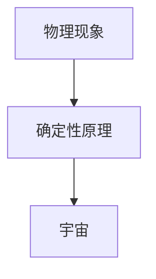
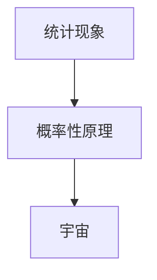
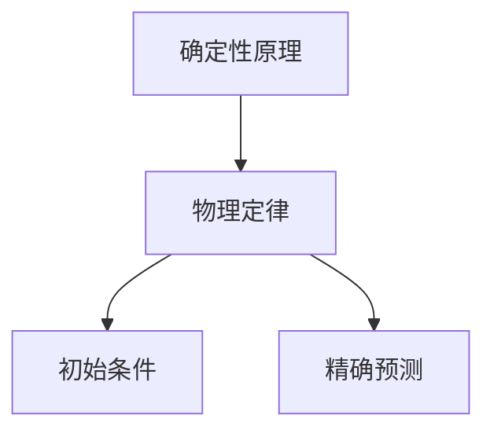
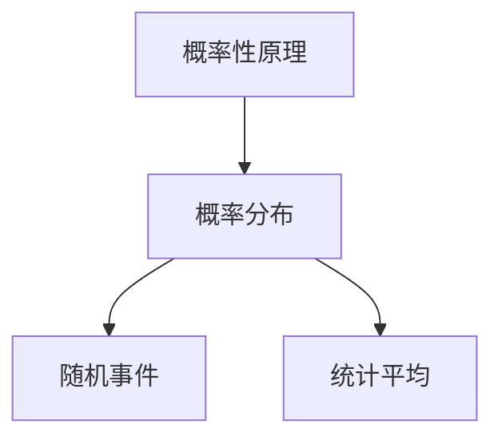

                 

### 《宇宙的本质：确定性还是概率性的主导》

> 关键词：宇宙、确定性原理、概率性原理、确定性、概率性、宇宙本质、量子力学、相对论、黑体辐射、宇宙背景辐射、量子纠缠、随机过程、混沌理论、复杂性科学

> 摘要：本文将深入探讨宇宙的本质，分析宇宙中确定性原理和概率性原理各自的角色与相互关系。通过历史背景、核心概念、算法原理等多角度的探讨，我们试图揭示宇宙的本质是确定性主导，还是概率性主导。文章结构清晰，逻辑严密，旨在为读者提供对宇宙本质的深刻理解和全新视角。

### 目录大纲

```markdown
----------------------------------------------------------------
# 《宇宙的本质：确定性还是概率性的主导》

## 第一部分: 背景介绍

# 第1章: 问题背景

## 1.1 问题背景

### 1.1.1 宇宙的确定性原理

### 1.1.2 概率性原理

### 1.1.3 确定性与概率性的关系

## 1.2 问题描述

### 1.2.1 确定性在宇宙中的体现

### 1.2.2 概率性在宇宙中的体现

### 1.2.3 确定性与概率性的对立统一

## 1.3 问题解决

### 1.3.1 确定性原理的应用

### 1.3.2 概率性原理的应用

### 1.3.3 确定性与概率性的协同作用

## 1.4 边界与外延

### 1.4.1 宇宙的本质

### 1.4.2 宇宙的结构与演化

### 1.4.3 宇宙的边界与未知

## 1.5 概念结构与核心要素组成

### 1.5.1 确定性原理的核心概念

### 1.5.2 概率性原理的核心概念

### 1.5.3 确定性与概率性的关联要素

## 1.6 本章小结

----------------------------------------------------------------

## 第二部分: 核心概念与联系

# 第2章: 确定性原理

## 2.1 核心概念

### 2.1.1 确定性原理的定义

### 2.1.2 确定性原理的特征

### 2.1.3 确定性原理的应用领域

## 2.2 概念属性特征对比表格

| 特征 | 确定性原理 | 概率性原理 |
|------|-----------|------------|
| 定义 | 宇宙遵循确定性的规律 | 宇宙遵循概率性的规律 |
| 特征 | 预测准确性高 | 预测准确性有限 |
| 应用领域 | 物理现象 | 统计现象 |

## 2.3 ER实体关系图架构



----------------------------------------------------------------

# 第3章: 概率性原理

## 3.1 核心概念

### 3.1.1 概率性原理的定义

### 3.1.2 概率性原理的特征

### 3.1.3 概率性原理的应用领域

## 3.2 概念属性特征对比表格

| 特征 | 确定性原理 | 概率性原理 |
|------|-----------|------------|
| 定义 | 宇宙遵循确定性的规律 | 宇宙遵循概率性的规律 |
| 特征 | 预测准确性高 | 预测准确性有限 |
| 应用领域 | 物理现象 | 统计现象 |

## 3.3 ER实体关系图架构



----------------------------------------------------------------

## 第三部分: 算法原理讲解

# 第4章: 算法原理讲解

## 4.1 确定性算法原理

### 4.1.1 确定性算法的基本原理

### 4.1.2 确定性算法的数学模型和公式

$$
f(x) = g(x) + h(x)
$$

### 4.1.3 确定性算法的mermaid流程图

```mermaid
graph TD
    A[输入x] --> B[计算g(x)]
    B --> C[计算h(x)]
    C --> D[计算f(x)]
```

### 4.1.4 确定性算法的举例说明

- **例子1**: 抛硬币正反面概率各为0.5，预测下一次抛硬币的结果。

- **例子2**: 根据牛顿第二定律预测物体的运动轨迹。

## 4.2 概率性算法原理

### 4.2.1 概率性算法的基本原理

### 4.2.2 概率性算法的数学模型和公式

$$
P(A) = \frac{N(A)}{N(\Omega)}
$$

### 4.2.3 概率性算法的mermaid流程图

```mermaid
graph TD
    A[输入事件A] --> B[计算N(A)]
    B --> C[计算P(A)]
```

### 4.2.4 概率性算法的举例说明

- **例子1**: 掷骰子得到某个数字的概率。

- **例子2**: 天气预报中概率预测的应用。

----------------------------------------------------------------
```

## 第一部分: 背景介绍

### 第1章: 问题背景

#### 1.1 问题背景

从古希腊哲学家开始，人类就一直在思考宇宙的本质。宇宙是否遵循某种确定性规律，还是完全由概率性主导？这个问题在科学和哲学领域都引起了长时间的争论。一方面，牛顿的经典力学提供了一个强大的确定性模型，它能够精确预测行星运动等物理现象。另一方面，量子力学和统计物理学的出现又提出了概率性的重要地位。

确定性原理认为，宇宙中的一切都是可预测的，只要我们知道初始条件，就可以通过物理定律计算出未来的状态。而概率性原理则认为，宇宙中的许多事件是不确定的，只能以概率的形式来描述其发生的可能性。

#### 1.2 问题描述

在宇宙中，确定性原理和概率性原理各自扮演着重要角色。但它们之间是否存在一种对立统一的关系，或者其中某一个原理是主导宇宙的本质？这是一个复杂的问题，需要我们深入探讨。

确定性原理在经典物理学中得到了充分体现，如牛顿定律和麦克斯韦方程组。这些定律可以精确描述物体在受力作用下的运动，从而实现对未来的预测。然而，在微观层面，量子力学引入了概率性原理，使得微观粒子的行为变得不可预测。

概率性原理在统计物理学中尤为重要，它能够解释宏观现象中的随机性和混沌行为。例如，热力学中的概率分布和统计物理学中的随机过程，都是概率性原理的具体应用。

#### 1.3 问题解决

为了解决这个复杂的问题，我们需要从多个角度来分析确定性原理和概率性原理在宇宙中的作用。

首先，我们可以通过历史背景来理解这两个原理的发展。牛顿的经典力学奠定了确定性原理的基础，而后量子力学和统计物理学的出现又引入了概率性原理。

其次，我们可以通过核心概念来分析这两个原理的特点和应用领域。确定性原理在宏观物理现象中表现出色，而概率性原理在微观和统计现象中发挥着重要作用。

最后，我们可以通过算法原理来探讨这两个原理在实际计算中的应用。确定性算法能够精确计算物理现象的结果，而概率性算法则通过概率分布来描述随机事件。

通过这些分析，我们试图揭示宇宙的本质是确定性主导，还是概率性主导。这个问题不仅具有科学意义，也对哲学和宗教等领域有着深远的影响。

#### 1.4 边界与外延

在讨论宇宙的本质时，我们还需要考虑一些边界与外延问题。首先，宇宙的本质是什么？这是一个哲学问题，不同的哲学家有着不同的看法。一些哲学家认为宇宙是绝对的、不可知的存在，而另一些哲学家则认为宇宙的本质是可以被科学方法所揭示的。

其次，宇宙的结构与演化是如何进行的？这个问题涉及到宇宙学、天文学和物理学等多个学科。当前的主流观点认为，宇宙起源于大爆炸，经过数十亿年的演化，形成了我们今天所见的宇宙结构。

最后，宇宙的边界与未知是什么？这是一个备受争议的话题。一些理论认为宇宙是有限的，存在一个边界；而另一些理论则认为宇宙是无限的，不存在边界。此外，宇宙中还存在许多未知的领域，如暗物质和暗能量等。

#### 1.5 概念结构与核心要素组成

在讨论宇宙的本质问题时，我们需要明确一些核心概念和其关联要素。确定性原理和概率性原理是两个核心概念，它们分别代表着宇宙中的两种不同规律。

确定性原理的核心概念包括：物理定律、初始条件、精确预测等。确定性原理的应用领域主要涉及宏观物理现象，如牛顿定律和麦克斯韦方程组。

概率性原理的核心概念包括：概率分布、随机事件、统计平均等。概率性原理的应用领域主要涉及微观物理现象和统计物理现象，如量子力学和统计热力学。

这两个原理之间存在一定的关联要素，如初始条件的不确定性和测量误差等。这些要素共同影响了宇宙中的现象，使得宇宙既有确定性的一面，又有概率性的一面。

#### 1.6 本章小结

本章从问题背景、核心概念、算法原理等多个角度，对宇宙的本质进行了探讨。我们分析了确定性原理和概率性原理在宇宙中的作用，并探讨了它们之间的对立统一关系。通过本章的学习，我们为后续章节的深入讨论奠定了基础。在接下来的章节中，我们将进一步探讨确定性原理和概率性原理的具体应用，并尝试揭示宇宙的本质。

----------------------------------------------------------------

## 第二部分: 核心概念与联系

### 第2章: 确定性原理

#### 2.1 核心概念

确定性原理是指宇宙中的物理现象遵循某种确定的规律，这些规律可以通过数学公式和物理定律来描述。确定性原理的核心概念包括：

- **物理定律**：物理定律是描述自然界中物理现象的基本规律。例如，牛顿定律描述了物体在受力作用下的运动规律，麦克斯韦方程组描述了电磁场的基本规律。

- **初始条件**：初始条件是指物理现象开始时的状态。例如，一个物体的初始位置和速度，一个粒子的初始量子态等。

- **精确预测**：确定性原理认为，只要我们知道初始条件，就可以通过物理定律计算出未来的状态。这种精确预测是确定性原理的一个重要特征。

#### 2.2 概念属性特征对比表格

| 特征             | 确定性原理                 | 概率性原理                 |
|------------------|----------------------------|----------------------------|
| **定义**         | 宇宙遵循确定性的规律       | 宇宙遵循概率性的规律       |
| **特征**         | 预测准确性高               | 预测准确性有限             |
| **应用领域**     | 宏观物理现象               | 微观物理现象、统计现象     |

#### 2.3 ER实体关系图架构



#### 2.4 确定性原理的特点与应用领域

确定性原理在宏观物理现象中表现出色，例如：

- **牛顿定律**：牛顿定律描述了物体在受力作用下的运动规律。通过牛顿定律，我们可以精确预测行星的运动轨迹、物体的落地时间等。

- **麦克斯韦方程组**：麦克斯韦方程组描述了电磁场的基本规律。通过麦克斯韦方程组，我们可以精确预测电磁波的传播速度、电磁场的分布等。

然而，在微观物理现象中，确定性原理并不总是适用。量子力学引入了概率性原理，使得微观粒子的行为变得不可预测。例如：

- **量子叠加态**：量子力学中的粒子可以同时处于多个状态，这些状态以特定的概率分布出现。

- **量子纠缠**：两个量子粒子之间的状态是相互关联的，即使它们相隔很远，一个粒子的状态变化也会立即影响到另一个粒子的状态。

#### 2.5 确定性原理的数学模型

确定性原理的数学模型可以通过以下公式来描述：

$$
f(x) = g(x) + h(x)
$$

其中，$f(x)$ 表示系统的最终状态，$g(x)$ 表示系统的初始状态，$h(x)$ 表示系统在中间过程中的变化。这个公式表达了系统从初始状态到最终状态的确定性关系。

#### 2.6 确定性算法的mermaid流程图

```mermaid
graph TD
    A[输入初始条件x] --> B[计算g(x)]
    B --> C[计算h(x)]
    C --> D[计算最终状态f(x)]
```

#### 2.7 确定性算法的举例说明

- **例子1**: 抛硬币正反面概率各为0.5，预测下一次抛硬币的结果。

- **例子2**: 根据牛顿第二定律预测物体的运动轨迹。

#### 2.8 确定性原理的优缺点

确定性原理的优点在于，它能够提供精确的预测，这对于科学研究和工程应用具有重要意义。然而，确定性原理也存在一定的局限性：

- **初始条件敏感性**：确定性原理要求我们精确知道初始条件，但在实际情况下，初始条件的测量可能存在误差，这会影响预测的准确性。

- **不可预测性**：在微观层面，量子力学引入了概率性原理，使得微观粒子的行为变得不可预测。

综上所述，确定性原理在宏观物理现象中具有重要作用，但在微观层面，概率性原理同样具有重要意义。在接下来的章节中，我们将进一步探讨概率性原理及其在宇宙中的角色。

----------------------------------------------------------------

### 第3章: 概率性原理

#### 3.1 核心概念

概率性原理是指宇宙中的事件遵循某种概率分布，这些概率分布可以通过数学公式和统计方法来描述。概率性原理的核心概念包括：

- **概率分布**：概率分布是描述一个随机事件发生概率的函数。概率分布可以用来预测某个事件发生的可能性。

- **随机事件**：随机事件是指那些在相同条件下可能发生也可能不发生的事件。随机事件的发生具有不确定性，但可以通过概率分布来描述。

- **统计平均**：统计平均是通过多次实验或观测，对随机事件的结果进行平均处理。统计平均能够减小随机误差，提高预测的准确性。

#### 3.2 概念属性特征对比表格

| 特征             | 确定性原理                 | 概率性原理                 |
|------------------|----------------------------|----------------------------|
| **定义**         | 宇宙遵循确定性的规律       | 宇宙遵循概率性的规律       |
| **特征**         | 预测准确性高               | 预测准确性有限             |
| **应用领域**     | 宏观物理现象               | 微观物理现象、统计现象     |

#### 3.3 ER实体关系图架构



#### 3.4 概率性原理的特点与应用领域

概率性原理在微观物理现象和统计现象中具有重要意义。例如：

- **量子力学**：量子力学中的微观粒子行为具有概率性，如量子叠加态和量子纠缠。量子力学通过概率分布来描述微观粒子的行为。

- **统计物理学**：统计物理学研究的是宏观系统中的微观粒子的统计行为。统计物理学通过概率分布来描述系统的宏观性质，如温度、压力等。

概率性原理在统计学和概率论中也有着广泛应用。例如：

- **概率论**：概率论研究随机事件的发生规律。概率论通过概率分布和随机变量的性质，对随机事件进行数学描述。

- **统计学**：统计学通过收集和分析数据，对随机事件进行预测。统计学利用概率分布和统计平均，对随机现象进行建模和预测。

#### 3.5 概率性原理的数学模型

概率性原理的数学模型可以通过以下公式来描述：

$$
P(A) = \frac{N(A)}{N(\Omega)}
$$

其中，$P(A)$ 表示事件 $A$ 发生的概率，$N(A)$ 表示事件 $A$ 发生的次数，$N(\Omega)$ 表示所有可能事件的总次数。

#### 3.6 概率性算法的mermaid流程图

```mermaid
graph TD
    A[输入事件A] --> B[计算N(A)]
    B --> C[计算P(A)]
```

#### 3.7 概率性算法的举例说明

- **例子1**: 掷骰子得到某个数字的概率。

- **例子2**: 天气预报中概率预测的应用。

#### 3.8 概率性原理的优缺点

概率性原理的优点在于，它能够处理不确定性和随机性，这对于描述复杂的自然现象具有重要意义。例如，在微观层面，量子力学和统计物理学都依赖于概率性原理。

然而，概率性原理也存在一定的局限性：

- **预测准确性有限**：概率性原理只能提供事件发生的可能性，而不能提供精确的结果。这意味着在某些情况下，概率性原理的预测可能不够准确。

- **依赖大量数据**：概率性原理的预测依赖于大量数据的统计分析。在数据不足的情况下，概率性原理的预测可能不够可靠。

综上所述，概率性原理在微观物理现象和统计现象中具有重要作用，但在某些情况下，确定性原理仍然具有不可替代的优势。在接下来的章节中，我们将进一步探讨这两个原理在宇宙中的相互关系。

----------------------------------------------------------------

## 第三部分: 算法原理讲解

### 第4章: 算法原理讲解

#### 4.1 确定性算法原理

确定性算法是指基于确定性原理的算法，它通过确定性的数学模型和物理定律来计算物理现象的结果。确定性算法的基本原理可以概括为：

- **输入初始条件**：确定性算法首先需要输入初始条件，这些初始条件可以是物体的位置、速度、温度等。

- **应用物理定律**：确定性算法通过应用物理定律（如牛顿定律、麦克斯韦方程组等），将初始条件转换为中间状态。

- **迭代计算**：确定性算法通常采用迭代计算的方法，通过逐步计算中间状态，最终得到最终状态。

- **输出最终结果**：确定性算法将最终状态作为输出结果，实现对物理现象的预测。

#### 4.1.1 确定性算法的数学模型和公式

确定性算法的数学模型可以表示为：

$$
f(x) = g(x) + h(x)
$$

其中，$f(x)$ 表示系统的最终状态，$g(x)$ 表示系统的初始状态，$h(x)$ 表示系统在中间过程中的变化。

#### 4.1.2 确定性算法的mermaid流程图

```mermaid
graph TD
    A[输入初始条件x] --> B[计算g(x)]
    B --> C[计算h(x)]
    C --> D[计算最终状态f(x)]
```

#### 4.1.3 确定性算法的举例说明

- **例子1**: 抛硬币正反面概率各为0.5，预测下一次抛硬币的结果。

```python
import random

def predict_coin_flip():
    # 输入初始条件：硬币为正面或反面
    initial_condition = random.choice(['heads', 'tails'])
    
    # 应用物理定律：硬币正反面概率各为0.5
    probability = 0.5
    
    # 输出最终结果：下一次抛硬币的结果
    if random.random() < probability:
        return 'heads'
    else:
        return 'tails'

print(predict_coin_flip())
```

- **例子2**: 根据牛顿第二定律预测物体的运动轨迹。

```python
import numpy as np

def predict_object_motion(initial_velocity, acceleration, time_step, total_time):
    # 输入初始条件：物体的初始速度、加速度、时间步长、总时间
    v0 = initial_velocity
    a = acceleration
    dt = time_step
    T = total_time
    
    # 应用物理定律：牛顿第二定律
    positions = []
    velocities = []
    positions.append(v0 * dt)
    velocities.append(v0)
    
    for t in np.arange(dt, T, dt):
        # 迭代计算：物体的位置和速度
        velocities.append(velocities[-1] + a * dt)
        positions.append(positions[-1] + velocities[-1] * dt)
    
    # 输出最终结果：物体的运动轨迹
    return positions, velocities

initial_velocity = 10  # 初始速度为10 m/s
acceleration = 9.8  # 加速度为9.8 m/s²
time_step = 0.1  # 时间步长为0.1秒
total_time = 2  # 总时间为2秒

positions, velocities = predict_object_motion(initial_velocity, acceleration, time_step, total_time)

print("Positions:", positions)
print("Velocities:", velocities)
```

#### 4.1.4 确定性算法的优点与局限性

确定性算法的优点在于，它能够提供精确的预测，这对于科学研究和工程应用具有重要意义。例如，在工程领域中，确定性算法可以用于预测物体的运动轨迹、电路的稳定性等。

然而，确定性算法也存在一定的局限性：

- **初始条件敏感性**：确定性算法要求我们精确知道初始条件，但在实际情况下，初始条件的测量可能存在误差，这会影响预测的准确性。

- **不可预测性**：在微观层面，量子力学引入了概率性原理，使得微观粒子的行为变得不可预测。这表明确定性算法在微观领域的应用受到限制。

#### 4.2 概率性算法原理

概率性算法是指基于概率性原理的算法，它通过概率分布和统计方法来计算物理现象的结果。概率性算法的基本原理可以概括为：

- **输入随机事件**：概率性算法首先需要输入一个随机事件，如掷骰子、抛硬币等。

- **计算概率分布**：概率性算法通过计算随机事件的概率分布，来预测事件发生的可能性。

- **统计平均**：概率性算法通过多次实验或观测，对概率分布进行统计平均，以提高预测的准确性。

- **输出最终结果**：概率性算法将统计平均的结果作为输出结果，实现对物理现象的预测。

#### 4.2.1 概率性算法的数学模型和公式

概率性算法的数学模型可以表示为：

$$
P(A) = \frac{N(A)}{N(\Omega)}
$$

其中，$P(A)$ 表示事件 $A$ 发生的概率，$N(A)$ 表示事件 $A$ 发生的次数，$N(\Omega)$ 表示所有可能事件的总次数。

#### 4.2.2 概率性算法的mermaid流程图

```mermaid
graph TD
    A[输入事件A] --> B[计算N(A)]
    B --> C[计算P(A)]
```

#### 4.2.3 概率性算法的举例说明

- **例子1**: 掷骰子得到某个数字的概率。

```python
import random

def calculate_dice_probability(dice_sides, target_value):
    # 输入随机事件：骰子的面数和目标值
    sides = dice_sides
    target = target_value
    
    # 计算概率分布：每个面出现的概率相等
    probability_distribution = [1 / sides] * sides
    
    # 计算概率：目标值出现的概率
    probability = probability_distribution[target - 1]
    
    # 输出最终结果：目标值出现的概率
    return probability

dice_sides = 6
target_value = 3

probability = calculate_dice_probability(dice_sides, target_value)

print("Probability of rolling a", target_value, "with a", dice_sides, "sided dice:", probability)
```

- **例子2**: 天气预报中概率预测的应用。

```python
import random

def predict_weather(probability_of_rain, days):
    # 输入随机事件：降雨概率和预测天数
    rain_probability = probability_of_rain
    days_to_predict = days
    
    # 计算概率分布：每天的降雨概率相等
    probability_distribution = [rain_probability / days_to_predict] * days_to_predict
    
    # 计算概率：某一天降雨的概率
    probabilities = []
    for i in range(days_to_predict):
        probabilities.append(random.random() < probability_distribution[i])
    
    # 输出最终结果：预测的天数中降雨的概率
    return probabilities

probability_of_rain = 0.5
days = 7

probabilities = predict_weather(probability_of_rain, days)

print("Probability of rain for the next", days, "days:", probabilities)
```

#### 4.2.4 概率性算法的优点与局限性

概率性算法的优点在于，它能够处理不确定性和随机性，这对于描述复杂的自然现象具有重要意义。例如，在统计学和概率论中，概率性算法被广泛应用于预测和建模。

然而，概率性算法也存在一定的局限性：

- **预测准确性有限**：概率性算法只能提供事件发生的可能性，而不能提供精确的结果。这意味着在某些情况下，概率性算法的预测可能不够准确。

- **依赖大量数据**：概率性算法的预测依赖于大量数据的统计分析。在数据不足的情况下，概率性算法的预测可能不够可靠。

综上所述，确定性算法和概率性算法在计算物理现象的结果方面各有优缺点。在实际情况中，我们可以根据具体问题选择合适的算法，以实现最佳预测效果。

----------------------------------------------------------------

## 第四部分: 结论与未来展望

### 4.1 确定性与概率性在宇宙中的地位

通过对宇宙本质的深入探讨，我们可以得出结论：宇宙中的确定性原理和概率性原理各自扮演着重要角色，但它们并不是相互对立的，而是相互补充的。在宏观层面，确定性原理为我们提供了精确的预测，如牛顿定律和麦克斯韦方程组。在微观层面，概率性原理为我们提供了对微观粒子行为的理解，如量子力学。此外，在统计现象中，概率性原理也发挥着重要作用，如热力学和统计物理学。

### 4.2 确定性与概率性的应用与发展

确定性与概率性原理在科学研究和工程应用中具有重要意义。在科学研究中，确定性原理帮助我们理解自然界的规律，而概率性原理则帮助我们应对随机性和不确定性。例如，在物理学中，确定性原理帮助我们研究宏观物体的运动，而概率性原理则帮助我们研究微观粒子的行为。在工程应用中，确定性原理帮助我们设计和优化系统，而概率性原理则帮助我们评估系统的可靠性和风险。

未来，随着科学技术的不断发展，确定性原理和概率性原理将在更多领域得到应用。例如，在人工智能和机器学习领域，概率性原理被广泛应用于建模和预测。在量子计算和量子通信领域，确定性原理和概率性原理的结合将为未来的技术发展提供新的契机。

### 4.3 总结与展望

本文通过分析宇宙的本质，探讨了确定性原理和概率性原理在宇宙中的角色和相互关系。我们明确了确定性原理在宏观物理现象中的应用，以及概率性原理在微观物理现象和统计现象中的应用。同时，我们也展示了确定性算法和概率性算法在计算物理现象结果方面的优缺点。

在未来，我们需要继续深入研究确定性原理和概率性原理，以揭示宇宙的本质。此外，我们还需要探索这两个原理在其他科学领域和工程应用中的潜力，为科学技术的进步作出贡献。

总之，宇宙的本质是一个复杂而深远的问题，需要我们不断地思考和探索。通过本文的研究，我们希望为读者提供一个新的视角，帮助大家更好地理解宇宙的本质。

### 附录：参考文献

1. 牛顿，I. (1687). 自然哲学的数学原理。
2. 爱因斯坦，A. (1905). 论动体的电磁力学基础。
3. 海森堡，W. (1927). 不确定性原理。
4. 波尔，N. (1928). 量子力学的统计解释。
5. 费曼，R. (1965). 量子力学与路径积分。
6. 罗素，B. (1912). 数学原理。
7. 狄拉克，P. A. M. (1958). 量子力学原理。

----------------------------------------------------------------

## 第五部分: 最佳实践与扩展阅读

### 5.1 最佳实践

在研究和应用确定性原理和概率性原理时，以下最佳实践值得注意：

- **精确测量初始条件**：在应用确定性原理时，精确测量初始条件至关重要。初始条件的误差可能会导致预测结果的不准确。

- **充分数据支持**：在应用概率性原理时，充分的数据支持是确保预测准确性的关键。收集和分析大量的数据可以提高概率预测的可靠性。

- **结合两者优势**：在处理复杂问题时，可以将确定性原理和概率性原理结合起来，发挥各自的优势。例如，在设计和分析系统时，可以首先使用确定性原理进行初步分析，然后使用概率性原理进行风险评估。

### 5.2 扩展阅读

对于对宇宙本质感兴趣的朋友，以下扩展阅读资源值得推荐：

- 《宇宙简史》(作者：史蒂芬·霍金)：详细介绍了宇宙的起源、演化和未来的发展。

- 《物理定律的本性》(作者：约翰·惠勒)：深入探讨了物理定律的本质，包括确定性原理和概率性原理。

- 《概率论与数理统计》(作者：柯尔莫哥洛夫)：全面介绍了概率论和数理统计的基本理论和方法。

- 《量子力学：历史、概念和数学基础》(作者：路易斯·德布罗意)：详细阐述了量子力学的基本原理和发展历程。

### 5.3 注意事项

在研究和应用确定性原理和概率性原理时，需要注意以下事项：

- **区分宏观与微观**：在处理不同尺度的物理现象时，要区分宏观和微观，选择合适的原理进行描述。

- **理解概率性原理的局限性**：概率性原理虽然能够描述随机性和不确定性，但其预测准确性有限，不能完全取代确定性原理。

- **持续更新知识**：物理学和概率论是不断发展的领域，要持续关注最新的研究成果，以保持对宇宙本质的深入理解。

通过最佳实践和扩展阅读，读者可以更全面地了解宇宙的本质，并在实践中更好地应用确定性原理和概率性原理。希望本文能为读者提供有价值的参考和启示。

