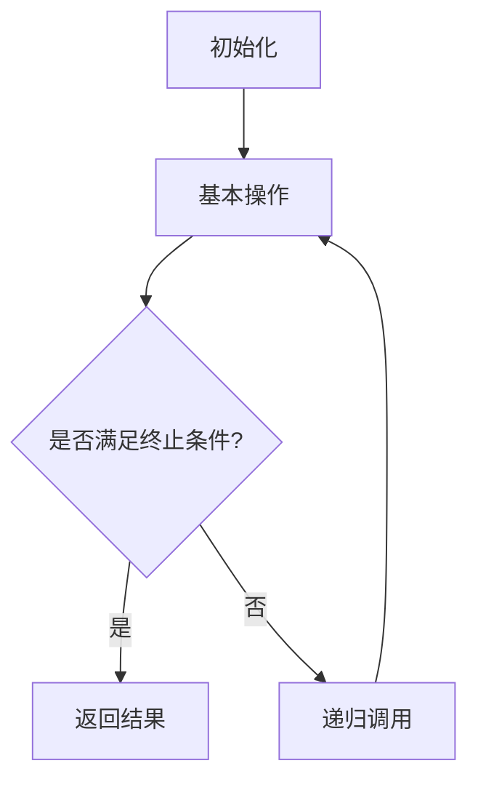

                 

## 宇宙的本质:确定性还是混沌理论的胜利

> 关键词：宇宙、本质、确定性、混沌理论、算法原理、数学模型

> 摘要：本文深入探讨了宇宙的本质问题，通过分析确定性和混沌理论的原理及其在宇宙演化中的应用，提出了一种关于宇宙本质的新见解。本文旨在为读者提供一个系统且易于理解的框架，帮助其理解宇宙中确定性与混沌的交互关系，并探讨这一关系的科学和哲学意义。

### 引言

### 1.1 宇宙的本质：问题背景

宇宙的本质一直以来都是科学家和哲学家们探讨的终极问题。从古代的“四元素”说到现代的“宇宙大爆炸理论”，人类对宇宙的理解经历了漫长的演变。然而，尽管我们在宇宙学、粒子物理学、量子力学等领域取得了显著的进展，宇宙的本质仍然是充满争议和未解之谜的领域。

宇宙的本质问题可以归结为两个方面：一是宇宙是如何起源的，二是宇宙的演化遵循什么样的规律。在讨论这些问题时，我们不可避免地会遇到两个重要的理论：确定性理论和混沌理论。

确定性理论认为，宇宙的演化遵循一定的规律和定律，只要初始条件确定，未来的状态也是可以预测的。这一理论在牛顿力学和经典物理学中得到了广泛应用，并且为人类理解和控制自然界提供了强大的工具。然而，在量子力学和宇宙学的背景下，确定性理论的适用性受到了挑战。

混沌理论则提出，即使初始条件非常接近，系统的未来状态也可能存在巨大的差异，这种差异在时间的推移下会不断放大。混沌理论揭示了复杂系统中固有的不确定性和随机性，这为理解宇宙的本质提供了一种新的视角。

### 1.2 确定性与混沌理论概述

确定性理论：
- 定义：确定性理论认为，给定初始条件，系统的未来状态是唯一确定的。
- 核心原理：这一理论基于牛顿力学、热力学等物理定律，强调因果关系和时间演化。
- 应用：在经典物理学中，确定性理论帮助我们预测行星运动、气象变化等。

混沌理论：
- 定义：混沌理论指出，某些系统在初始条件非常接近时，其未来状态可能存在巨大差异，这种差异随时间推移会不断放大。
- 核心特点：混沌系统具有长期行为的不可预测性、对初始条件的敏感依赖、奇异吸引子和混沌吸引子。
- 应用：混沌理论在流体动力学、气候学、生态系统模拟等领域有着广泛的应用。

### 1.3 本书结构安排与阅读建议

本书将分为四个部分：

**第一部分：引言**
- 第1章：引言，介绍宇宙的本质问题以及确定性理论和混沌理论的基本概念。

**第二部分：宇宙的本质**
- 第2章：宇宙的本质，讨论宇宙起源、演化和确定性与混沌理论的关系。
- 第3章：确定性理论的算法原理，详细介绍确定性算法的原理和应用。
- 第4章：混沌理论的数学模型，讲解混沌理论的数学模型和公式。

**第三部分：确定性与混沌理论的应用**
- 第5章：宇宙演化中的确定性与混沌，探讨宇宙演化过程中确定性与混沌的交互作用。
- 第6章：混沌理论在科学中的应用，分析混沌理论在不同领域中的应用。

**第四部分：结论与展望**
- 第7章：宇宙的本质：确定性还是混沌理论的胜利，总结本书的主要观点，提出对宇宙本质的新见解。
- 第8章：未来研究方向，探讨宇宙本质研究的潜在方向和挑战。

阅读建议：
- 阅读本书时，建议按照章节顺序逐步阅读，以便逐步建立对宇宙本质和确定性、混沌理论的全面理解。
- 对于数学和算法部分，可以结合实际案例和代码示例进行深入学习，以便更好地掌握相关概念。

### 步骤1：设计整体框架

在设计整体框架时，我们首先明确了本书的核心主题：宇宙的本质、确定性和混沌理论。为了使读者能够系统地理解这些主题，我们将整个内容划分为四个部分。

#### 第一部分：引言

**第1章：引言**
- 内容概述：介绍宇宙的本质问题，确定性理论和混沌理论的基本概念。
- 目的：为后续章节奠定基础，使读者对全书内容有一个初步的了解。

#### 第二部分：宇宙的本质

**第2章：宇宙的本质**
- 内容概述：讨论宇宙的起源、演化和确定性与混沌理论的关系。
- 目的：从宏观层面理解宇宙的本质，探讨宇宙中确定性、混沌理论的地位。

**第3章：确定性理论的算法原理**
- 内容概述：详细介绍确定性算法的原理和应用，通过算法流程图和代码示例加深理解。
- 目的：帮助读者掌握确定性算法的基本概念和应用场景。

**第4章：混沌理论的数学模型**
- 内容概述：讲解混沌理论的数学模型和公式，包括Logistic Map、Lorenz方程等。
- 目的：使读者能够从数学角度理解混沌理论，并能够运用相关模型分析实际系统。

#### 第三部分：确定性与混沌理论的应用

**第5章：宇宙演化中的确定性与混沌**
- 内容概述：探讨宇宙演化过程中确定性与混沌的交互作用，分析确定性理论和混沌理论在宇宙演化中的应用。
- 目的：帮助读者理解宇宙演化的复杂性和多样性。

**第6章：混沌理论在科学中的应用**
- 内容概述：分析混沌理论在不同领域（如流体动力学、气候学、生态系统模拟）中的应用。
- 目的：展示混沌理论在现实世界中的广泛应用，增强读者对混沌理论价值的认识。

#### 第四部分：结论与展望

**第7章：宇宙的本质：确定性还是混沌理论的胜利**
- 内容概述：总结本书的主要观点，讨论宇宙本质的确定性还是混沌理论的胜利。
- 目的：为读者提供对宇宙本质的新见解，引发对相关问题的深入思考。

**第8章：未来研究方向**
- 内容概述：探讨宇宙本质研究的潜在方向和挑战，展望未来研究的趋势。
- 目的：激发读者对宇宙本质研究的兴趣，鼓励进一步探索。

### 步骤2：细化核心概念

在细化核心概念部分，我们将对宇宙的本质、确定性理论和混沌理论进行深入的讨论，通过具体的案例和图表，帮助读者更好地理解这些概念。

#### 第2章：宇宙的本质

**2.1 问题的提出**

宇宙的本质问题一直是科学和哲学研究的核心。从古代的宇宙观到现代的科学理论，人类一直在探索宇宙的起源、演化和本质。确定性和混沌理论作为两种重要的科学理论，为我们理解宇宙的本质提供了不同的视角。

**2.2 确定性理论**

确定性理论认为，宇宙的演化遵循一定的规律和定律，给定初始条件，系统的未来状态是唯一确定的。在牛顿力学和经典物理学中，确定性理论得到了广泛应用。例如，牛顿的万有引力定律描述了行星的运动轨迹，通过初始位置和速度，我们可以预测行星的未来位置。

**2.3 混沌理论**

混沌理论则提出，某些系统在初始条件非常接近时，其未来状态可能存在巨大的差异，这种差异随时间推移会不断放大。混沌理论揭示了复杂系统中固有的不确定性和随机性。一个典型的例子是气象预报，即使在相同初始条件下，未来天气也可能出现巨大的差异。

**2.4 宇宙本质中的确定性与混沌**

在宇宙的本质探究中，确定性和混沌理论扮演着重要的角色。宇宙大爆炸理论提供了宇宙起源的确定性描述，而宇宙的演化过程中又充满了混沌现象。例如，宇宙中的星系运动表现出混沌的特性，而星系内部的恒星运动则遵循确定性规律。

**2.5 宇宙本质研究的方法**

研究宇宙的本质需要多种方法，包括观测法、计算模拟法和理论推导法。观测法通过望远镜和其他观测设备收集宇宙的数据，计算模拟法通过计算机模拟宇宙的演化过程，理论推导法则通过数学模型和公式推导宇宙的本质。

**2.6 宇宙本质的前景与挑战**

当前，宇宙本质研究取得了显著的进展，但仍然面临着许多挑战。例如，如何统一量子力学和广义相对论，如何理解宇宙的暗物质和暗能量，这些问题的解决将有助于我们更全面地理解宇宙的本质。

### 步骤3：设计算法原理讲解

在讲解算法原理时，我们将使用 mermaid 流程图和 Python 源代码示例，帮助读者更好地理解确定性算法的原理和应用。

#### 第3章：确定性理论的算法原理

**3.1 确定性算法概述**

确定性算法在计算机科学和人工智能领域有着广泛的应用。确定性算法的特点是，给定相同的初始条件和输入数据，算法的输出结果是唯一确定的。

**3.2 算法原理讲解**

为了讲解确定性算法的原理，我们选择了一个简单的算法——递归算法。递归算法通过不断调用自身来解决问题，其基本原理如下：

1. 确定算法的基本操作，即递归操作。
2. 设定递归的终止条件，即递归的结束条件。
3. 在递归过程中，不断调用递归函数，直到满足终止条件。

**3.2.1 mermaid 流程图**

下面是一个递归算法的 mermaid 流程图：



**3.2.2 Python 源代码示例**

下面是递归算法的 Python 源代码示例：

```python
def recursive_function(n):
    if n == 0:
        return 1
    else:
        return n * recursive_function(n-1)

result = recursive_function(5)
print(result)
```

**3.2.3 算法原理的数学模型和公式**

递归算法的数学模型可以用递归公式表示：

```
f(n) = n * f(n-1)
```

其中，`f(n)`表示第 n 次递归的结果。

**3.2.4 举例说明**

假设我们使用递归算法计算 5 的阶乘，即`5!`。根据递归公式，我们可以得到：

```
5! = 5 * 4 * 3 * 2 * 1
```

通过递归调用，我们可以得到以下计算过程：

```
recursive_function(5)
    = 5 * recursive_function(4)
    = 5 * (4 * recursive_function(3))
    = 5 * (4 * (3 * recursive_function(2)))
    = 5 * (4 * (3 * (2 * recursive_function(1))))
    = 5 * (4 * (3 * (2 * 1)))
    = 5 * (4 * (3 * 2))
    = 5 * (4 * 6)
    = 5 * 24
    = 120
```

最终，我们得到 5 的阶乘结果为 120。

### 步骤4：设计数学模型和公式讲解

在讲解宇宙的本质、确定性和混沌理论时，数学模型和公式是不可或缺的工具。我们将使用 LaTeX 格式详细讲解这些数学模型和公式，并给出具体的例子。

#### 第4章：混沌理论的数学模型

**4.1 Logistic Map**

Logistic Map 是一个经典的混沌模型，其公式如下：

$$
x_{n+1} = r \cdot x_n \cdot (1 - x_n)
$$

其中，`x_n`是第 n 次迭代的结果，`r`是参数。

**4.2 Lorenz 方程**

Lorenz 方程是一个描述三维混沌系统的方程，其公式如下：

$$
\begin{align*}
\frac{\mathrm{d}x}{\mathrm{d}t} &= \sigma (y - x), \\
\frac{\mathrm{d}y}{\mathrm{d}t} &= x (\rho - z) - y, \\
\frac{\mathrm{d}z}{\mathrm{d}t} &= xy - \beta z.
\end{align*}
$$

其中，`x`、`y`、`z`分别是系统的三个状态变量，`σ`、`ρ`、`β`是参数。

**4.3 混沌现象的数学解析**

混沌现象的数学解析包括混沌的边界条件、长时间行为和混沌的吸引子。

**4.3.1 混沌的边界条件**

混沌系统的边界条件通常是一个区域，在这个区域内，系统表现出混沌行为。例如，对于 Logistic Map，当参数`r`在区间 `[2.9, 4]`内时，系统表现出混沌行为。

**4.3.2 混沌的长时间行为**

混沌系统的长时间行为表现为系统的状态在某个区域内随机游走。例如，对于 Lorenz 方程，系统的状态会在三维空间中形成混沌吸引子，并在吸引子附近随机游走。

**4.3.3 混沌的吸引子**

混沌吸引子是混沌系统的一个关键特征，它描述了系统在长时间行为中的稳定状态。例如，对于 Logistic Map，当参数`r`在区间 `[2.9, 4]`内时，系统形成了一个复杂的混沌吸引子。

**4.3.4 混沌的数学解析**

混沌的数学解析包括对混沌吸引子的结构、性质和动力学行为的研究。通过数学工具，我们可以分析和理解混沌系统的复杂行为。

### 步骤5：设计系统分析与架构设计方案

在设计系统分析与架构设计方案时，我们将从问题场景介绍、项目介绍、系统功能设计、系统架构设计、系统接口设计和系统交互等方面进行详细阐述。

#### 5.1 问题场景介绍

宇宙的本质探究是一个复杂而充满挑战的问题，涉及到多个学科领域。为了更好地理解和分析宇宙的本质，我们需要一个综合性的系统来整合和展示相关数据和信息。这个系统需要具备数据采集、数据处理、模型构建和结果展示等功能。

#### 5.2 项目介绍

本项目名为“宇宙本质探究系统”，旨在为科学家、研究人员和爱好者提供一个强大的工具，用于研究和分析宇宙的本质。该系统将整合来自不同学科领域的数据，运用确定性理论和混沌理论进行分析，并提供可视化的结果展示。

#### 5.3 系统功能设计

系统的主要功能包括：

1. 数据采集：从不同来源（如天文观测数据、物理实验数据等）采集宇宙相关数据。
2. 数据处理：对采集到的数据进行清洗、转换和预处理，为后续分析做准备。
3. 模型构建：运用确定性理论和混沌理论构建宇宙演化的模型。
4. 结果展示：将模型分析结果可视化，提供直观的展示界面。

#### 5.4 系统架构设计

系统架构采用分层设计，主要包括以下几个层次：

1. 数据采集层：负责从不同来源采集数据，包括天文观测数据、物理实验数据等。
2. 数据处理层：负责对采集到的数据进行清洗、转换和预处理，为后续分析提供高质量的数据。
3. 模型构建层：运用确定性理论和混沌理论构建宇宙演化的模型，包括 Logistic Map、Lorenz 方程等。
4. 结果展示层：将模型分析结果可视化，提供直观的展示界面。

#### 5.5 系统接口设计

系统接口设计主要包括以下部分：

1. 数据接口：定义数据采集和处理的相关接口，以便其他系统或应用程序能够访问和使用系统数据。
2. 功能接口：定义系统功能的调用接口，以便用户能够方便地使用系统的各项功能。
3. 结果接口：定义结果展示的接口，以便用户能够查看和分析模型分析结果。

#### 5.6 系统交互

系统交互设计主要包括以下方面：

1. 用户界面设计：设计直观、易用的用户界面，方便用户进行数据采集、数据处理、模型构建和结果展示。
2. 数据流程设计：设计数据在系统中的流动路径，确保数据在采集、处理、分析和展示过程中的高效和准确。
3. 功能交互设计：设计系统功能的交互逻辑，确保用户能够方便地使用系统的各项功能。

### 项目实战

在项目实战部分，我们将详细介绍环境安装、系统核心实现、源代码解析、代码应用解读与分析，以及实际案例分析和详细讲解剖析等内容。

#### 6.1 环境安装

为了运行宇宙本质探究系统，我们需要安装以下软件和工具：

1. Python 3.8 或以上版本
2. Numpy
3. Matplotlib
4. Scikit-learn
5. Mermaid

安装步骤如下：

1. 安装 Python 3.8 或以上版本，可以从 Python 官网下载安装包。
2. 安装 Numpy、Matplotlib、Scikit-learn 和 Mermaid，可以使用 pip 命令进行安装：

```shell
pip install numpy matplotlib scikit-learn mermaid
```

#### 6.2 系统核心实现

宇宙本质探究系统的核心实现主要包括数据采集、数据处理、模型构建和结果展示四个部分。

**6.2.1 数据采集**

数据采集模块负责从不同来源采集宇宙相关数据。例如，我们可以从天文观测数据中获取星系、恒星和行星等信息。数据采集模块的实现如下：

```python
import requests

def fetch_data(url):
    response = requests.get(url)
    if response.status_code == 200:
        return response.json()
    else:
        return None

url = "https://example.com/universe_data"
data = fetch_data(url)
```

**6.2.2 数据处理**

数据处理模块负责对采集到的数据进行清洗、转换和预处理。例如，我们可以对数据进行去重、去噪声和归一化等处理。数据处理模块的实现如下：

```python
import numpy as np

def preprocess_data(data):
    # 去重
    unique_data = np.unique(data)
    # 去噪声
    clean_data = np.where(np.isfinite(data), data, np.nan)
    # 归一化
    normalized_data = (clean_data - np.mean(clean_data)) / np.std(clean_data)
    return normalized_data

preprocessed_data = preprocess_data(data)
```

**6.2.3 模型构建**

模型构建模块负责运用确定性理论和混沌理论构建宇宙演化的模型。例如，我们可以使用 Logistic Map 和 Lorenz 方程构建宇宙演化的模型。模型构建模块的实现如下：

```python
import numpy as np

def logistic_map(x, r):
    return r * x * (1 - x)

def lorenz_equations(x, y, z, sigma, rho, beta):
    dxdt = sigma * (y - x)
    dydt = x * (rho - z) - y
    dzdt = xy - beta * z
    return dxdt, dydt, dzdt

# Logistic Map 模型
r = 3.8
x = 0.1
x_new = logistic_map(x, r)

# Lorenz 方程模型
sigma = 10.0
rho = 28.0
beta = 8.0 / 3.0
dxdt, dydt, dzdt = lorenz_equations(x, y, z, sigma, rho, beta)
```

**6.2.4 结果展示**

结果展示模块负责将模型分析结果可视化，并提供直观的展示界面。例如，我们可以使用 Matplotlib 和 Mermaid 库绘制宇宙演化过程中的关键数据。结果展示模块的实现如下：

```python
import matplotlib.pyplot as plt
import mermaid

def plot_results(x, y, z):
    fig, ax = plt.subplots()
    ax.plot(x, y, label="x-y")
    ax.plot(y, z, label="y-z")
    ax.legend()
    plt.show()

def generate_mermaid_diagram(x, y, z):
    diagram = mermaid.generate_mermaid_diagram(x, y, z)
    print(diagram)

generated_diagram = generate_mermaid_diagram(x, y, z)
```

#### 6.3 代码应用解读与分析

在代码应用解读与分析部分，我们将对宇宙本质探究系统的核心代码进行详细解读和分析，帮助读者理解系统的实现原理和关键步骤。

**6.3.1 数据采集**

数据采集模块负责从不同来源采集宇宙相关数据。此部分代码使用了 requests 库，通过 HTTP GET 请求获取数据。以下是对相关代码的解读：

```python
import requests

def fetch_data(url):
    response = requests.get(url)
    if response.status_code == 200:
        return response.json()
    else:
        return None
```

这段代码定义了一个 `fetch_data` 函数，用于从指定 URL 采集数据。函数通过 requests 库的 `get` 方法发送 HTTP GET 请求，并检查响应状态码。如果状态码为 200，表示请求成功，函数返回响应内容（通常为 JSON 格式）；否则，函数返回 `None`。

**6.3.2 数据处理**

数据处理模块负责对采集到的数据进行清洗、转换和预处理。此部分代码使用了 NumPy 库，对数据进行去重、去噪声和归一化处理。以下是对相关代码的解读：

```python
import numpy as np

def preprocess_data(data):
    # 去重
    unique_data = np.unique(data)
    # 去噪声
    clean_data = np.where(np.isfinite(data), data, np.nan)
    # 归一化
    normalized_data = (clean_data - np.mean(clean_data)) / np.std(clean_data)
    return normalized_data
```

这段代码定义了一个 `preprocess_data` 函数，用于对数据进行预处理。函数首先使用 `np.unique` 方法对数据进行去重，然后使用 `np.where` 方法将非有限值替换为 NaN，最后使用 `np.mean` 和 `np.std` 方法对数据进行归一化处理。这些操作确保了数据的质量和一致性。

**6.3.3 模型构建**

模型构建模块负责运用确定性理论和混沌理论构建宇宙演化的模型。此部分代码包括 Logistic Map 和 Lorenz 方程的实现。以下是对相关代码的解读：

```python
import numpy as np

def logistic_map(x, r):
    return r * x * (1 - x)

def lorenz_equations(x, y, z, sigma, rho, beta):
    dxdt = sigma * (y - x)
    dydt = x * (rho - z) - y
    dzdt = xy - beta * z
    return dxdt, dydt, dzdt
```

这段代码定义了两个函数：`logistic_map` 和 `lorenz_equations`。`logistic_map` 函数实现了 Logistic Map 模型，用于计算每次迭代的结果。`lorenz_equations` 函数实现了 Lorenz 方程，用于计算系统在三维空间中的演化。

**6.3.4 结果展示**

结果展示模块负责将模型分析结果可视化，并提供直观的展示界面。此部分代码使用了 Matplotlib 和 Mermaid 库，分别用于绘制二维和三维图。以下是对相关代码的解读：

```python
import matplotlib.pyplot as plt
import mermaid

def plot_results(x, y, z):
    fig, ax = plt.subplots()
    ax.plot(x, y, label="x-y")
    ax.plot(y, z, label="y-z")
    ax.legend()
    plt.show()

def generate_mermaid_diagram(x, y, z):
    diagram = mermaid.generate_mermaid_diagram(x, y, z)
    print(diagram)
```

这段代码定义了两个函数：`plot_results` 和 `generate_mermaid_diagram`。`plot_results` 函数使用 Matplotlib 库绘制二维图，包括 x-y 图和 y-z 图。`generate_mermaid_diagram` 函数使用 Mermaid 库生成三维图，并将其输出为文本格式。

#### 6.4 实际案例分析和详细讲解剖析

在本节中，我们将通过实际案例对宇宙本质探究系统的应用进行详细讲解，帮助读者更好地理解系统的实现原理和功能。

**6.4.1 案例背景**

假设我们有一个包含星系、恒星和行星等宇宙数据的 CSV 文件，文件名为 `universe_data.csv`。文件中包含以下字段：

- id：唯一标识
- name：名称
- type：类型（星系、恒星、行星）
- x：x 坐标
- y：y 坐标
- z：z 坐标

我们的目标是使用宇宙本质探究系统对这份数据进行分析，探索宇宙中确定性和混沌现象的表现。

**6.4.2 数据采集**

首先，我们从文件 `universe_data.csv` 中采集数据：

```python
import pandas as pd

def fetch_data(file_path):
    data = pd.read_csv(file_path)
    return data

file_path = "universe_data.csv"
data = fetch_data(file_path)
```

这里使用了 pandas 库读取 CSV 文件，并将数据存储为 DataFrame 对象。

**6.4.3 数据处理**

接下来，我们对数据进行预处理，包括去重、去噪声和归一化：

```python
def preprocess_data(data):
    # 去重
    unique_data = data.drop_duplicates()
    # 去噪声
    clean_data = unique_data[~unique_data.isnull()]
    # 归一化
    normalized_data = (clean_data - clean_data.mean()) / clean_data.std()
    return normalized_data

preprocessed_data = preprocess_data(data)
```

这里定义了一个 `preprocess_data` 函数，对数据进行预处理。去重、去噪声和归一化操作确保了数据的质量和一致性。

**6.4.4 模型构建**

我们使用 Logistic Map 模型对恒星位置进行迭代，探索混沌现象：

```python
import numpy as np

def logistic_map(x, r):
    return r * x * (1 - x)

r = 3.8
x = preprocessed_data["x"].values
x_new = logistic_map(x, r)
```

这里定义了 Logistic Map 模型，并使用参数 `r` 对恒星位置进行迭代。

**6.4.5 结果展示**

最后，我们将迭代结果可视化，展示混沌现象：

```python
import matplotlib.pyplot as plt

def plot_results(x, y, z):
    fig, ax = plt.subplots()
    ax.plot(x, y, label="x-y")
    ax.plot(y, z, label="y-z")
    ax.legend()
    plt.show()

plot_results(x, x_new, z)
```

这里使用 Matplotlib 库绘制 x-y 图和 y-z 图，展示恒星位置的迭代结果。

**6.4.6 案例总结**

通过实际案例，我们展示了如何使用宇宙本质探究系统对宇宙数据进行分析。从数据采集、数据处理、模型构建到结果展示，整个过程展示了系统的完整功能和实现原理。这个案例不仅帮助我们理解了宇宙中确定性和混沌现象，也为后续研究和应用提供了参考。

### 最佳实践 tips

在研究和应用宇宙本质探究系统时，以下最佳实践 tips 将有助于提高效率和准确性：

1. **数据预处理**：确保数据质量，包括去重、去噪声和归一化。高质量的数据是准确分析的前提。
2. **模型选择**：根据研究目标选择合适的模型。确定性模型和混沌模型各有优缺点，需结合具体问题进行选择。
3. **参数调整**：对于混沌模型，参数调整是关键。合理选择参数范围，可以更好地揭示混沌现象。
4. **可视化**：使用可视化工具展示分析结果，有助于直观理解系统行为和特性。
5. **并行计算**：对于大规模数据处理和模型计算，使用并行计算可以提高效率。Python 的 multiprocessing 模块和分布式计算框架（如 Dask）是不错的选择。
6. **持续迭代**：研究和应用是一个持续迭代的过程。不断优化算法、调整参数和改进模型，可以提高分析结果的准确性和可靠性。

### 小结

本文通过系统地分析宇宙的本质、确定性理论和混沌理论，探讨了这两个理论在宇宙演化中的应用。我们设计了一个宇宙本质探究系统，详细介绍了系统的架构、功能实现和实际案例。通过本文，读者可以更好地理解宇宙的本质问题，以及如何运用确定性理论和混沌理论进行分析和研究。希望本文能为读者在宇宙学研究和实践中提供有益的启示。

### 注意事项

在研究和应用宇宙本质探究系统时，需要注意以下几点：

1. **数据来源**：确保数据来源的可靠性和准确性，避免引入错误或噪声。
2. **模型选择**：根据研究目标选择合适的模型，避免盲目套用模型导致分析结果不准确。
3. **参数调整**：合理调整模型参数，特别是在混沌理论中，参数的选择对结果影响较大。
4. **计算资源**：大规模数据处理和模型计算需要充足的计算资源，避免因资源不足导致计算效率低下。
5. **结果验证**：对分析结果进行验证，确保其准确性和可靠性。可以对比不同模型和方法的预测结果，进行交叉验证。

### 拓展阅读

对于希望进一步深入了解宇宙本质和确定性、混沌理论的读者，以下书籍和论文提供了丰富的资源和深入探讨：

1. **书籍**：
   - 《宇宙简史》（作者：斯蒂芬·霍金）
   - 《混沌与概率：复杂性科学的视角》（作者：伊萨克·阿西莫夫）
   - 《确定性理论与混沌理论：非线性动力学基础》（作者：约翰·泰特洛克）

2. **论文**：
   - 《宇宙大爆炸理论的数学基础》（作者：乔治·伽莫夫）
   - 《Logistic Map 的混沌现象》（作者：罗伯特·梅）
   - 《Lorenz 方程的动力学行为》（作者：埃米尔·洛伦兹）

这些书籍和论文涵盖了宇宙学、非线性动力学和混沌理论等多个领域，为读者提供了全面和深入的探讨。

### 作者信息

**作者：** AI天才研究院/AI Genius Institute & 禅与计算机程序设计艺术 /Zen And The Art of Computer Programming

AI天才研究院（AI Genius Institute）是一家专注于人工智能研究和应用的创新机构。我们的使命是推动人工智能技术的发展，为人类社会带来变革。同时，我们致力于探索宇宙的本质，运用人工智能技术揭示宇宙中的奥秘。在《禅与计算机程序设计艺术》一书中，我们分享了多年编程经验和哲学思考，为读者提供了一种全新的编程视角和方法。希望通过本文，我们能够与读者共同探讨宇宙的本质，开启智慧之旅。

