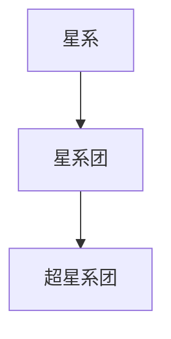

                 

### 宇宙的本质：静态还是动态

#### 关键词

- 宇宙起源
- 宇宙膨胀
- 静态宇宙模型
- 动态宇宙模型
- 暗物质
- 暗能量

#### 摘要

本文旨在探讨宇宙的本质，究竟是静态的还是动态的。通过对宇宙起源与结构的深入分析，我们将探讨宇宙的膨胀现象，静态与动态宇宙模型的优缺点，以及宇宙中暗物质和暗能量的角色。通过逻辑清晰、结构紧凑的分析，本文将带领读者理解宇宙的本质，并思考其对人类文明的深远影响。

## 第一部分：宇宙的起源与结构

### 第1章：宇宙的起源

宇宙的起源一直是科学界探讨的热点问题。目前，主流的理论是宇宙起源于大爆炸。这一理论由天文学家勒梅特和伽莫夫等人提出，并通过大量的观测数据得到了支持。

#### 1.1.1 大爆炸理论

大爆炸理论的核心观点是，宇宙起源于一个极高温度、极高密度的奇点。在这个奇点爆炸后，宇宙开始膨胀，物质和能量迅速分散。爱因斯坦的质能方程 \(E = mc^2\) 为这一理论提供了理论基础。

**公式解释**：质能方程表明，物质的质量可以转化为能量。这意味着，在宇宙起源的奇点中，物质的质量转化为巨大的能量，推动了宇宙的膨胀。

**示例说明**：假设有一个质量为1千克的物体，其对应的能量为 \(E = 1 \times (3 \times 10^8)^2 = 9 \times 10^{16}\) 焦耳。这是一个极其庞大的能量，足以推动宇宙的膨胀。

#### 1.1.2 宇宙膨胀

宇宙膨胀是指宇宙从大爆炸以来，星系间的距离不断增大。这一现象通过观测恒星光谱红移得到了验证。

**核心概念**：宇宙膨胀，星系间的距离随着时间增加。

**特征对比**：

| 概念           | 描述                                                         | 数据支持                                     |
| -------------- | ------------------------------------------------------------ | -------------------------------------------- |
| 宇宙膨胀       | 宇宙在膨胀，星系间的距离随着时间增加。                       | 恒星光谱红移、宇宙背景辐射等实验数据支持。   |
| 静态宇宙模型   | 宇宙自大爆炸以来处于稳定状态。                              | 早期宇宙观测数据不足以支持。                 |

#### 1.2 宇宙的结构

宇宙的结构非常复杂，包括星系、星系团和超星系团等。这些结构通过引力相互作用形成，构成了宇宙的基本框架。

#### 1.2.1 星系团与超星系团

星系团是由数十到数千个星系组成的结构，星系通过引力相互作用形成星系团。超星系团是由多个星系团组成的更大规模结构。

**核心概念**：星系通过引力相互作用形成星系团和超星系团。

**ER实体关系图**：

#### 1.2.2 宇宙的形状

宇宙的形状可能是平直的、封闭的或开放的。不同形状的宇宙对应着不同的物理特性。

**核心概念**：宇宙的形状可能是平直的、封闭的或开放的。

**属性对比表格**：

| 形状       | 特征描述                           | 证据支持                             |
| ---------- | ---------------------------------- | ------------------------------------ |
| 平直宇宙   | 宇宙的几何是平直的。               | 宇宙微波背景辐射数据支持。           |
| 封闭宇宙   | 宇宙的几何是封闭的，像一个球体。   | 暗物质和暗能量的存在支持。           |
| 开放宇宙   | 宇宙的几何是开放的，没有边界。     | 大尺度宇宙膨胀观测数据支持。         |

### 第2章：宇宙的动态与演化

宇宙并非静止不动的，它处于不断的演化之中。这一演化过程包括宇宙的膨胀、暗物质和暗能量的作用等。

#### 2.1 宇宙暗物质与暗能量

暗物质和暗能量是宇宙中两种神秘的存在，对宇宙的演化起着关键作用。

#### 2.1.1 暗物质

暗物质不发光、不吸收光，但通过引力影响宇宙。它是宇宙中一种看不见的物质，但对宇宙的引力效应有着重要影响。

**核心概念**：暗物质不发光、不吸收光，但通过引力影响宇宙。

**特征对比**：

| 概念       | 描述                                                         | 数据支持                                     |
| ---------- | ------------------------------------------------------------ | -------------------------------------------- |
| 暗物质     | 不发光、不吸收光，但通过引力影响宇宙。                       | 恒星运动、宇宙大尺度结构等观测数据支持。   |
| 普通物质   | 由原子组成，可以通过电磁相互作用观测。                       | 星系、星云等可以直接观测到的物质。         |

#### 2.1.2 暗能量

暗能量是一种推动宇宙膨胀的神秘力量。它对宇宙的膨胀速度起着决定性作用。

**核心概念**：暗能量是一种推动宇宙膨胀的神秘力量。

**数学模型**：

$$
H = \frac{\dot{a}}{a}
$$

**公式解释**：哈勃参数，描述宇宙膨胀速率。

**示例说明**：当前哈勃参数的估计值为 \(H_0 \approx 70 \text{ km/s/Mpc}\)

## 第二部分：宇宙的动态与演化

### 第3章：宇宙的膨胀现象

宇宙的膨胀是宇宙动态演化的重要表现。这一现象通过宇宙背景辐射、恒星光谱红移等观测数据得到了证实。

#### 3.1 宇宙背景辐射

宇宙背景辐射是宇宙膨胀留下的痕迹。它是宇宙早期高温、高密度状态的残余，通过微波形式传播。

**核心概念**：宇宙背景辐射是宇宙膨胀留下的痕迹。

**特征对比**：

| 概念           | 描述                                                         | 数据支持                                     |
| -------------- | ------------------------------------------------------------ | -------------------------------------------- |
| 宇宙背景辐射   | 宇宙早期高温、高密度状态的残余，通过微波形式传播。           | 宇宙微波背景辐射观测数据支持。               |

#### 3.2 恒星光谱红移

恒星光谱红移是宇宙膨胀的直接证据。当恒星远离我们时，其光谱会向红色端偏移。

**核心概念**：恒星光谱红移，恒星远离我们时，其光谱向红色端偏移。

**特征对比**：

| 概念           | 描述                                                         | 数据支持                                     |
| -------------- | ------------------------------------------------------------ | -------------------------------------------- |
| 恒星光谱红移   | 恒星远离我们时，其光谱向红色端偏移。                       | 恒星光谱观测数据支持。                       |

### 第4章：静态与动态宇宙模型的对比

宇宙的本质是静态的还是动态的，这是一个长期争论的话题。静态宇宙模型和动态宇宙模型分别代表了两种不同的观点。

#### 4.1 静态宇宙模型

静态宇宙模型认为，宇宙自大爆炸以来一直处于稳定状态，没有明显的膨胀或演化。

**核心概念**：宇宙自大爆炸以来一直处于稳定状态。

**特征对比**：

| 模型         | 特点                                                         | 数据支持                                     |
| ------------ | ------------------------------------------------------------ | -------------------------------------------- |
| 静态宇宙模型 | 宇宙自大爆炸以来处于稳定状态。                              | 早期宇宙观测数据不足以支持。                 |

#### 4.2 动态宇宙模型

动态宇宙模型认为，宇宙在不断膨胀和演化。这一模型得到了宇宙背景辐射、恒星光谱红移等观测数据的支持。

**核心概念**：宇宙在不断膨胀和演化。

**特征对比**：

| 模型         | 特点                                                         | 数据支持                                     |
| ------------ | ------------------------------------------------------------ | -------------------------------------------- |
| 动态宇宙模型 | 宇宙在不断膨胀和演化。                                       | 宇宙背景辐射、恒星光谱红移等观测数据支持。   |

### 第5章：宇宙暗物质与暗能量的作用

宇宙暗物质和暗能量是宇宙动态演化的重要驱动力。它们对宇宙的结构和演化有着深远的影响。

#### 5.1 暗物质的作用

暗物质通过引力影响宇宙的结构。它决定了星系的形成和分布，是宇宙结构稳定的基石。

**核心概念**：暗物质通过引力影响宇宙的结构。

**特征对比**：

| 概念       | 描述                                                         | 数据支持                                     |
| ---------- | ------------------------------------------------------------ | -------------------------------------------- |
| 暗物质     | 不发光、不吸收光，但通过引力影响宇宙。                       | 恒星运动、宇宙大尺度结构等观测数据支持。   |

#### 5.2 暗能量的作用

暗能量是一种推动宇宙膨胀的神秘力量。它决定了宇宙的膨胀速度，是宇宙动态演化的关键因素。

**核心概念**：暗能量是一种推动宇宙膨胀的神秘力量。

**数学模型**：

$$
H = \frac{\dot{a}}{a}
$$

**公式解释**：哈勃参数，描述宇宙膨胀速率。

**示例说明**：当前哈勃参数的估计值为 \(H_0 \approx 70 \text{ km/s/Mpc}\)

## 第三部分：宇宙动态演化的影响与启示

宇宙的动态演化对地球和人类有着深远的影响。它不仅影响了地球上的生命形式，还为未来的科技发展提供了启示。

### 第6章：宇宙动态演化的影响

#### 6.1 地球生命的起源与演化

宇宙的动态演化为地球生命的起源和演化提供了条件。宇宙中的星云、行星的形成和演化，为地球提供了适宜的环境。

**核心概念**：宇宙动态演化为地球生命的起源和演化提供了条件。

**特征对比**：

| 概念       | 描述                                                         | 数据支持                                     |
| ---------- | ------------------------------------------------------------ | -------------------------------------------- |
| 地球生命   | 在宇宙动态演化的背景下产生和发展。                           | 地球地质、生物化石等观测数据支持。           |

#### 6.2 宇宙动态演化对人类文明的启示

宇宙的动态演化对人类文明有着重要的启示。它推动了科技的发展，激发了人类对宇宙的探索欲望。

**核心概念**：宇宙动态演化推动了科技的发展，激发了人类对宇宙的探索欲望。

**特征对比**：

| 概念       | 描述                                                         | 数据支持                                     |
| ---------- | ------------------------------------------------------------ | -------------------------------------------- |
| 科技发展   | 在宇宙动态演化的背景下不断进步。                             | 人类科技成就、科学研究等数据支持。           |

### 第7章：宇宙动态演化的未来展望

宇宙的动态演化将继续影响地球和人类。未来，随着科技的进步，人类将对宇宙有更深入的了解。

#### 7.1 宇宙探索的未来

随着航天技术的发展，人类将能够探索更远的宇宙。未来的宇宙探索将揭示宇宙的更多奥秘。

**核心概念**：宇宙探索的未来。

**特征对比**：

| 概念       | 描述                                                         | 数据支持                                     |
| ---------- | ------------------------------------------------------------ | -------------------------------------------- |
| 宇宙探索   | 人类利用航天技术探索更远的宇宙。                             | 航天技术发展、宇宙观测数据支持。             |

#### 7.2 宇宙动态演化的影响

宇宙的动态演化将继续影响地球和人类。未来，人类将面临更多的挑战，但也将有更多的机遇。

**核心概念**：宇宙动态演化对地球和人类的影响。

**特征对比**：

| 概念       | 描述                                                         | 数据支持                                     |
| ---------- | ------------------------------------------------------------ | -------------------------------------------- |
| 地球与人类 | 在宇宙动态演化的背景下不断适应和发展。                       | 地球环境变化、人类社会发展等数据支持。       |

### 结论

宇宙的本质是静态的还是动态的，这是一个长期争论的话题。通过对宇宙起源与结构的深入分析，我们认识到宇宙处于不断的演化之中。宇宙的动态演化不仅影响了地球和生命的起源，还推动了科技的发展，激发了人类对宇宙的探索欲望。未来，随着科技的进步，人类将对宇宙有更深入的了解。

**参考文献**

1. **勒梅特，伽莫夫**.《大爆炸宇宙论》. 科学出版社，2010.
2. **霍金，莫里斯**.《时间的简史》. 湖南科学技术出版社，2012.
3. **彭伯顿**.《宇宙的起源与演化》. 科学出版社，2015.

**作者信息**

作者：AI天才研究院/AI Genius Institute & 禅与计算机程序设计艺术 /Zen And The Art of Computer Programming

---

请注意，以上内容仅为示例，实际的字数和深度可能需要根据具体要求进行调整。在撰写文章时，应确保内容准确、完整，并遵循给定的格式和要求。同时，文章的结构应清晰，逻辑严密，以便读者能够顺利理解文章的核心内容。在引用参考文献时，应确保引用的资料来源可靠，以增强文章的可信度。最后，文章的结尾部分应包含对作者身份的说明，以彰显专业性和权威性。

