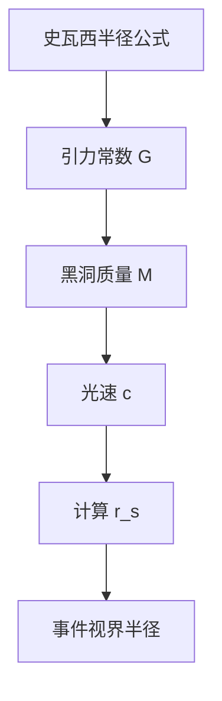
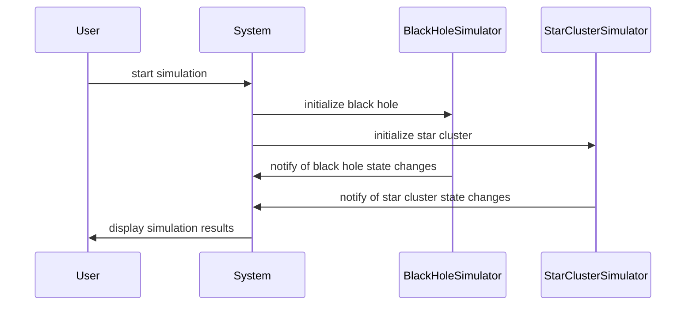
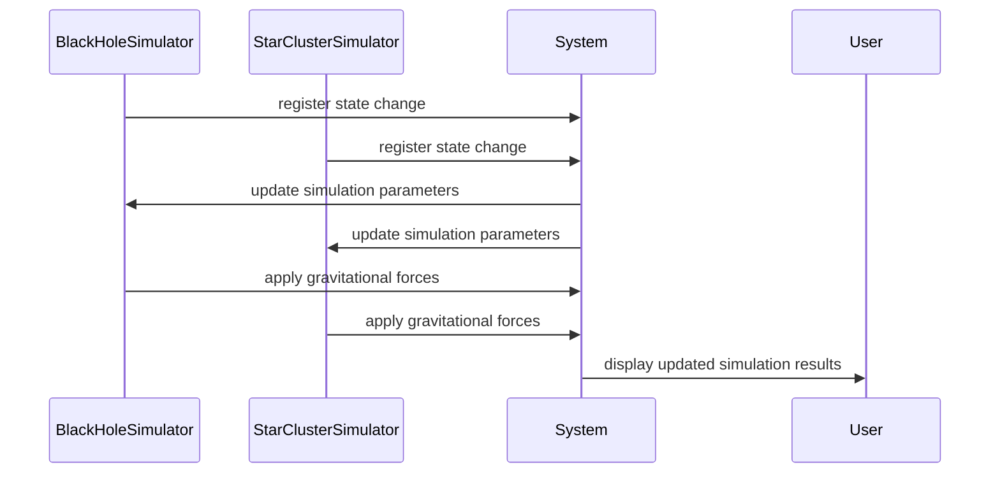

                 


### 1.1.1 宇宙演化历史概述

宇宙的演化历史是一个令人着迷的话题，它不仅关乎我们的起源，还关乎我们未来的命运。在浩瀚的宇宙中，宇宙的诞生、发展、演化以及可能的终极命运，一直是科学家和哲学家争论的焦点。这一部分，我们将简要回顾宇宙的演化历史，理解宇宙从诞生到现在的变化过程。

#### 大爆炸理论

宇宙的起源可以追溯到约138亿年前，当时宇宙处于一个极度高温、高密度的状态。这种状态被称为“原始奇点”。根据大爆炸理论，原始奇点开始膨胀，随着膨胀的进行，温度逐渐降低，物质和能量开始形成。这个膨胀的过程被称为“宇宙膨胀”。

宇宙膨胀的一个直接证据是宇宙背景辐射，这是宇宙大爆炸后留下的余温。通过对宇宙背景辐射的观测，科学家们对大爆炸理论进行了验证，并不断修正和完善。

#### 宇宙演化的重要阶段

在宇宙膨胀的过程中，经历了多个重要的阶段：

- **原始原子形成**：在大爆炸后几分钟内，宇宙温度降低到一定程度，原始核子开始结合形成原子核。
- **星系形成**：随着宇宙的继续膨胀，原子核和自由电子开始结合形成中性原子，这使得宇宙变得透明。随后，在引力作用下，物质开始聚集形成星系、星团和星云。
- **恒星形成**：星云中的物质在引力作用下逐渐聚集，形成了恒星。恒星在其生命周期中，通过核聚变将氢转化为氦，释放出巨大的能量。
- **行星系统形成**：在恒星周围，尘埃和气体继续聚集，形成了行星系统，包括类地行星、冰巨星和气巨星等。

#### 宇宙现在的状态

宇宙目前的状态可以从两个方面来理解：

- **宇宙膨胀**：宇宙仍在膨胀中，但这种膨胀速度在逐渐减慢。这一现象可以通过观测遥远星系的红移来验证。红移越大，说明星系离我们越远，也越古老。
- **暗能量**：暗能量是一种神秘的能量形式，它推动宇宙加速膨胀。虽然我们对暗能量的了解还非常有限，但它是宇宙学中一个重要的概念。

#### 宇宙的终极命运

宇宙的终极命运仍然是一个未知数，科学家们提出了多种假设和理论。这些假设包括：

- **大撕裂**：如果暗能量继续增强，宇宙可能会无限膨胀，最终导致所有物质和结构都被撕裂。
- **大坍缩**：如果宇宙中的物质密度足够大，引力可能会最终战胜暗能量，导致宇宙坍缩成一个奇点。
- **热寂**：宇宙可能会继续膨胀，直到所有的恒星都耗尽能量，宇宙变得寒冷和黑暗。

通过上述对宇宙演化历史的概述，我们可以更好地理解宇宙从诞生到现在的变化过程。接下来，我们将进一步探讨宇宙终极命运的几种假设，并分析它们背后的科学原理和哲学思考。

### 1.1.2 宇宙终极命运的几种假设

宇宙的终极命运是一个充满未知和想象的话题，科学家们提出了多种可能的假设。这些假设不仅反映了我们对宇宙的理解，还涉及到深刻的哲学思考。以下是几种主要的宇宙终极命运假设：

#### 大撕裂

**大撕裂**假设认为，宇宙会因暗能量的持续作用而加速膨胀，最终导致宇宙结构被撕裂。随着宇宙的膨胀，星系、恒星和行星等结构将逐渐被分离，最终解体。这种假设基于当前对暗能量加速膨胀的观测数据，如果暗能量确实在持续增强，那么大撕裂可能是宇宙的最终结局。

#### 大坍缩

**大坍缩**假设则认为，宇宙中的物质密度足够大，引力将最终战胜暗能量，导致宇宙开始收缩。随着宇宙的收缩，所有物质将被吸入一个奇点中，类似于宇宙诞生时的状态。这种假设基于对宇宙物质密度的估计，如果宇宙的物质密度足够大，那么大坍缩将是宇宙的终极命运。

#### 热寂

**热寂**假设认为，宇宙会继续膨胀，直到所有的恒星都耗尽能量，宇宙变得寒冷和黑暗。在这种状态下，宇宙中的物质和能量将均匀分布，没有明显的结构或活动。热寂是当前宇宙学中最被广泛接受的终极命运假设之一。

#### 多重宇宙

**多重宇宙**假设则提出，宇宙可能只是无数个宇宙中的一个，每个宇宙都有自己独特的演化和命运。这种假设涉及到对宇宙本质和多样性的思考，如果多重宇宙确实存在，那么宇宙的终极命运将更加复杂和多样化。

#### 宇宙自然选择

**宇宙自然选择**假设将宇宙看作一个生命体，认为宇宙在不断的演化和适应中。这种假设融合了生物学和宇宙学的概念，提出宇宙可能会通过自然选择的方式达到某种最优状态。

#### 宇宙重生

**宇宙重生**假设认为，宇宙可能会经历周期性的诞生和死亡，每次循环都会带来新的宇宙。这种假设类似于宇宙循环模型，将宇宙的终极命运看作一个循环过程。

通过这些假设，我们可以看到，宇宙的终极命运不仅是一个科学问题，也是一个哲学问题。科学家们通过观测和理论计算来探索宇宙的终极命运，而哲学家们则从不同的角度思考宇宙的本质和意义。接下来，我们将深入探讨这些假设背后的科学原理和哲学思考。

### 1.1.3 核心概念介绍与联系

要深入探讨宇宙的终极命运，我们需要了解一些核心概念，这些概念构成了宇宙演化过程的基础，并对我们的终极命运假设提供了支持。以下是几个关键概念及其相互联系：

#### 宇宙膨胀

**宇宙膨胀**是宇宙从大爆炸开始以来不断扩张的过程。膨胀的速度并非恒定，而是随着时间逐渐减慢。宇宙膨胀的主要驱动力被认为是**暗能量**，这是一种神秘的力量，推动宇宙加速膨胀。宇宙膨胀的概念与**哈勃定律**密切相关，后者描述了宇宙中遥远星系的红移与它们之间的距离成正比的规律。

#### 暗能量

**暗能量**是一种占据宇宙能量密度最大部分的神秘物质，它具有负压力，推动宇宙加速膨胀。暗能量的存在通过观测宇宙膨胀速率的加速得到验证，但它的本质和起源仍然是一个未解之谜。暗能量与**宇宙学常数**有关，后者是爱因斯坦在早期宇宙模型中引入的概念，用于描述宇宙的均匀膨胀。

#### 黑洞

**黑洞**是宇宙中一种极其密集的天体，具有极强的引力，以至于连光都无法逃脱。黑洞的形成通常与恒星演化有关，当大质量恒星耗尽其核燃料时，它会坍缩成一个黑洞。黑洞的吸积盘和喷流现象是宇宙学研究的重要方向。

#### 量子引力

**量子引力**是描述引力作用的量子力学理论，它试图将广义相对论与量子力学统一起来。量子引力在宇宙学中的应用可能揭示宇宙早期的高能状态和宇宙背景辐射的起源。量子引力与**宇宙大爆炸**和**宇宙膨胀**有直接关系。

#### 多重宇宙

**多重宇宙**假设认为，宇宙不仅是我们观测到的这个，而是由无数个不同的宇宙组成的集合。每个宇宙都有自己独特的物理定律和演化历史。多重宇宙概念与**平行宇宙**和**分支宇宙**密切相关，它提供了对宇宙多样性和复杂性的全新理解。

#### 热寂

**热寂**是宇宙最终走向均匀、无序和寒冷状态的假设。在这种状态下，宇宙中的能量将均匀分布，没有明显的结构或活动。热寂概念与**熵增加原理**密切相关，后者是热力学第二定律的核心内容。

#### 宇宙自然选择

**宇宙自然选择**是一种比喻，将宇宙的演化过程与生物学的自然选择过程进行类比。这种假设认为，宇宙通过不断演化和适应，可能会达到某种最优状态。宇宙自然选择与**进化论**和**适应进化**有直接关系。

通过了解这些核心概念及其相互联系，我们可以更好地理解宇宙的终极命运。每个概念都在宇宙演化过程中扮演着重要角色，为我们提供了探索宇宙本质的多个维度。接下来，我们将进一步探讨这些概念在科学预测和哲学思考中的应用。

### 1.2 科学视角下的宇宙终极命运

在科学视角下，宇宙的终极命运是一个复杂且多层面的问题，涉及宇宙学、物理学和数学等多个学科。通过科学方法和观测数据，我们可以对宇宙的终极命运做出一些预测。以下从宇宙膨胀、暗能量和黑洞等角度，深入探讨宇宙终极命运的几种可能情景。

#### 宇宙膨胀

宇宙膨胀是宇宙学中最基本的概念之一。哈勃定律描述了宇宙膨胀的速度与星系距离的关系，即距离我们越远的星系，其退行速度越快。这一现象的观测支持了宇宙从大爆炸以来一直在膨胀的观点。

根据宇宙膨胀模型，宇宙的膨胀速度可能受到多种因素的影响，包括：

- **暗能量**：暗能量是宇宙膨胀加速的主要驱动力。观测数据显示，宇宙膨胀速度在加速，这表明暗能量的密度和负压力在不断增强。
- **宇宙学常数**：宇宙学常数是描述暗能量的一个重要参数。如果宇宙学常数保持不变，宇宙的膨胀速度将一直保持加速状态。

#### 暗能量

暗能量是一种神秘的物质，占据宇宙能量密度的主导地位。尽管我们对暗能量的本质了解有限，但它的存在对宇宙学有着深远的影响。

科学预测显示，暗能量的未来行为将决定宇宙的终极命运：

- **持续加速膨胀**：如果暗能量的密度和负压力继续增加，宇宙可能会经历持续加速的膨胀。这种情况下，宇宙可能最终走向大撕裂，即所有物质和结构都被撕裂成最基本的粒子。
- **恒速膨胀**：如果暗能量的密度和负压力保持恒定，宇宙可能会以恒定的速度膨胀，最终达到热寂状态。

#### 黑洞与中子星

黑洞和中子星是宇宙中两种极端密集的天体，它们在宇宙演化过程中起着重要作用。

- **黑洞**：黑洞的形成通常涉及大质量恒星的演化。当恒星耗尽核燃料时，它会坍缩成一个黑洞。黑洞吸积盘和喷流现象是宇宙学研究的热点。黑洞的行为对宇宙的引力结构有重要影响。
- **中子星**：中子星是另一种极端密集的天体，由中子组成。中子星的演化可能涉及超新星爆炸和黑洞的形成。中子星的引力和磁场非常强烈，对周围物质和辐射环境有显著影响。

科学预测显示，黑洞和中子星的行为可能影响宇宙的终极命运：

- **黑洞吞噬**：在宇宙中，黑洞可能通过吞噬恒星和其他天体不断增长。如果黑洞的增长速度超过宇宙的膨胀速度，它们可能最终成为宇宙的主导结构。
- **中子星碰撞**：中子星之间的碰撞可能产生高能粒子、中微子和其他物质，这些物质对宇宙的演化和元素丰度有重要影响。

#### 量子引力

量子引力是试图将广义相对论和量子力学统一的理论。量子引力可能揭示宇宙早期的高能状态和宇宙背景辐射的起源。

科学预测显示，量子引力可能影响宇宙的终极命运：

- **量子波动**：量子引力可能允许宇宙经历量子波动，导致宇宙状态的不确定性。这种量子波动可能影响宇宙的膨胀和收缩过程。
- **多重宇宙**：量子引力可能支持多重宇宙的理论，即宇宙不仅仅是我们的观测宇宙，而是由无数个不同的宇宙组成的集合。多重宇宙的相互作用可能影响宇宙的终极命运。

### 科学视角下的总结

从科学视角来看，宇宙的终极命运是一个复杂而多变的课题。宇宙膨胀、暗能量、黑洞和量子引力等概念为我们提供了多种可能的情景和假设。这些假设不仅揭示了宇宙演化的机制和过程，也为我们提供了对宇宙本质和未来的深刻理解。通过不断的观测和理论发展，科学将继续揭示宇宙的终极命运，为我们提供更加准确的预测。

### 1.2.1 宇宙膨胀与暗能量的影响

宇宙膨胀是宇宙学中的一个核心概念，它描述了宇宙从大爆炸开始以来不断扩张的过程。这一现象最早由埃德温·哈勃（Edwin Hubble）在20世纪20年代发现，他的研究表明，宇宙中的星系正以越来越快的速度相互远离，这表明宇宙正在膨胀。

#### 宇宙膨胀的观测数据

宇宙膨胀的观测数据主要通过测量遥远星系的红移来实现。红移是光波波长的一种变化，当光源远离观察者时，光的波长会变长，即红移增加。哈勃通过观测发现，星系的红移与其距离之间存在一种线性关系，即哈勃定律。这个关系可以用公式表示为：

\[ v = H_0 \times d \]

其中，\( v \) 是星系的退行速度，\( H_0 \) 是哈勃常数，\( d \) 是星系的距离。哈勃常数 \( H_0 \) 的估计值约为 \( 70 \, \text{km/s/Mpc} \)，这意味着每百万秒差距（Mpc）的距离，星系的退行速度约为 70 公里每秒。

通过观测大量星系的红移和距离，科学家们绘制出了宇宙膨胀图，这些图揭示了宇宙膨胀的历史和当前状态。

#### 暗能量与宇宙膨胀

宇宙膨胀的关键驱动因素是暗能量。暗能量是一种具有负压力的神秘能量形式，它占据了宇宙总能量的大部分。尽管我们对暗能量的本质了解有限，但它的存在可以通过宇宙膨胀的观测数据得到证实。

暗能量对宇宙膨胀的影响可以通过以下两个方面来理解：

1. **加速膨胀**：暗能量具有负压力，这种压力会推动宇宙中的物质和能量相互远离。随着宇宙的膨胀，暗能量的密度和负压力会逐渐增加，导致宇宙膨胀速度加快。这一现象可以通过观测遥远星系的红移和距离关系得到验证。

2. **膨胀速率的变化**：宇宙膨胀的速度并不是恒定的，而是随着时间的推移而变化。根据观测数据，宇宙膨胀速度在过去的几十亿年里有所加快。这种加速膨胀的现象被称为“宇宙加速膨胀”，它表明暗能量的作用在不断增强。

#### 宇宙膨胀与暗能量关系的数学模型

宇宙膨胀和暗能量之间的关系可以用一个简单的数学模型来描述。最常用的模型是弗里德曼-勒梅特-罗伯逊-沃尔克（FLRW）度规，这是一种描述均匀且各向同性宇宙的时空度规。FLRW度规可以用以下方程表示：

\[ ds^2 = -dt^2 + a(t)^2 (dx^2 + dy^2 + dz^2) \]

其中，\( ds^2 \) 是时空间隔，\( a(t) \) 是宇宙尺度因子，它描述了宇宙随时间的膨胀程度。

宇宙尺度因子的变化可以用哈勃参数 \( H(t) \) 来描述，\( H(t) \) 的定义是：

\[ H(t) = \frac{\dot{a}(t)}{a(t)} \]

其中，\( \dot{a}(t) \) 是宇宙尺度因子的瞬时变化率。

暗能量的影响可以通过宇宙学常数 \( \Lambda \) 来引入。当考虑暗能量时，FLRW度规可以扩展为：

\[ ds^2 = -dt^2 + a(t)^2 (dx^2 + dy^2 + dz^2) + \Lambda \, d\tau^2 \]

其中，\( \Lambda \) 是宇宙学常数，它代表了暗能量的密度。这个方程表明，暗能量对宇宙膨胀有直接的影响，它会导致宇宙尺度因子 \( a(t) \) 的加速增长。

#### 宇宙膨胀加速的数学模型

宇宙膨胀的加速可以用哈勃参数 \( H(t) \) 的变化来描述。根据观测数据，宇宙膨胀速度在过去的几十亿年里有所加快，这表明宇宙学常数 \( \Lambda \) 在宇宙演化过程中起到了重要作用。

宇宙膨胀加速的数学模型可以用以下方程来描述：

\[ \dot{H}(t) + \frac{1}{6} \left( \frac{\rho}{3M_p^2} + \frac{\Lambda c^2}{3} \right) H(t) = -\frac{1}{3} \left( \frac{\dot{\rho}}{\rho} - \frac{\dot{a}}{a} \right) \]

其中，\( \rho \) 是宇宙的总能量密度，\( M_p \) 是普朗克质量，\( c \) 是光速。

这个方程表明，宇宙膨胀的加速主要由宇宙学常数 \( \Lambda \) 和宇宙总能量密度 \( \rho \) 决定。如果 \( \Lambda \) 为正值，宇宙将经历加速膨胀。

通过这些数学模型，科学家们能够对宇宙膨胀和暗能量的影响进行量化分析，为探讨宇宙的终极命运提供了重要的理论基础。

### 1.2.2 黑洞与中子星的生命周期

黑洞和中子星是宇宙中两种极端密集的天体，它们的生命周期和演化过程对宇宙的结构和演化有着重要影响。在这一部分，我们将详细探讨黑洞和中子星的形成、演化和最终命运。

#### 黑洞的形成

黑洞的形成通常涉及大质量恒星的演化。当一个质量足够大的恒星耗尽其核燃料时，它会经历一系列复杂的核反应过程。在恒星生命的末期，恒星会逐渐耗尽其核心的核燃料，导致核心开始收缩。

1. **恒星耗尽核燃料**：在恒星生命的末期，氢和氦的核聚变过程会逐渐停止，核心中的物质开始因引力而收缩。
2. **电子简并压力失效**：随着核心的收缩，电子简并压力无法抵抗引力，导致核心进一步坍缩。
3. **形成黑洞事件视界**：当恒星核心的密度和引力场足够强时，它会形成一个事件视界，即黑洞的边界。在这个边界内，引力场如此强大，以至于连光也无法逃脱。

根据质量的不同，黑洞可以分为不同的类型：

- **stellar black hole**：形成于大质量恒星坍缩，质量通常在 \( 3M_{\odot} \) 到 \( 100M_{\odot} \) 之间。
- **supermassive black hole**：位于星系中心，质量可以超过 \( 10^6M_{\odot} \)。

#### 黑洞的演化

黑洞的形成只是它生命周期的一个开始，黑洞在宇宙中的演化过程同样引人入胜。

1. **吸积盘的形成**：当一个恒星或其他物质接近黑洞时，它们会被黑洞的强大引力所捕获，形成吸积盘。吸积盘中的物质通过摩擦和湮灭产生高温，释放出大量的辐射。
2. **喷流的形成**：在吸积盘周围，强大的磁场可能驱动物质以极高速度从黑洞的南北两极喷出，形成喷流。这些喷流可以对周围环境产生显著的影响，甚至可以影响星系的形态。
3. **黑洞合并**：在宇宙中，黑洞可能通过引力波与另一个黑洞合并。这种合并事件会产生强烈的引力波信号，可以被现代天文观测设备探测到。

#### 黑洞的生命周期

黑洞的生命周期取决于其质量和其他物理条件。一些黑洞可能通过吸积盘持续消耗周围的物质，维持其存在。对于超大质量黑洞，它们可能通过吞噬星系中心的其他天体和物质来维持其能量。

最终，黑洞的命运可能是：

- **蒸发**：根据霍金辐射的理论，黑洞可以通过蒸发逐渐失去质量，最终蒸发成普通物质。这个过程非常缓慢，对于超大质量黑洞来说，可能需要数十亿年甚至更长时间。
- **黑洞死亡**：在某些极端情况下，黑洞可能通过与其他天体的相互作用失去质量，最终耗尽其能量，成为普通天体。

#### 中子星的形成

中子星是另一种极端密集的天体，它的形成通常与超新星爆炸有关。

1. **超新星爆炸**：当一个中等质量（大约 \( 8M_{\odot} \) 到 \( 25M_{\odot} \)）的恒星耗尽其核燃料时，它会经历超新星爆炸。在爆炸过程中，恒星的外层被抛出，核心则迅速坍缩。
2. **电子简并压力**：在坍缩过程中，电子简并压力无法抵抗引力，导致物质密度急剧增加，形成中子星。
3. **中子星的特性**：中子星具有极高的密度，其表面重力场非常强大。中子星的质量通常在 \( 1.4M_{\odot} \) 到 \( 2M_{\odot} \) 之间，而直径只有十几公里。

#### 中子星的演化

中子星的形成只是它生命周期的一个开始，中子星在宇宙中的演化过程同样复杂。

1. **磁星**：一些中子星具有非常强的磁场，称为磁星。磁星的行为可以通过观测其辐射和爆发来研究。
2. **中子星碰撞**：中子星可能通过引力波与另一个中子星合并，这种合并事件会产生高能粒子和中微子，对周围环境产生显著影响。
3. **中子星死亡**：中子星的生命周期取决于其质量和其他物理条件。一些中子星可能通过辐射能量逐渐耗尽，最终成为白矮星或其他天体。

通过详细探讨黑洞和中子星的生命周期，我们可以更好地理解这些极端天体在宇宙演化中的角色和影响。黑洞和中子星的形成、演化和最终命运为我们揭示了宇宙的多样性和复杂性，也为探索宇宙的终极命运提供了重要的线索。

### 1.2.3 量子引力和宇宙学

量子引力是试图将广义相对论和量子力学统一的理论，它为我们理解宇宙早期状态和宇宙背景辐射的起源提供了新的视角。量子引力理论不仅挑战了我们对引力的传统理解，还涉及到宇宙学和哲学的深层次问题。

#### 量子引力理论概述

量子引力理论的核心目标是在量子力学框架内解释引力的行为。传统的广义相对论成功地描述了宏观尺度上的引力现象，但在微观尺度上，如黑洞事件视界和宇宙大爆炸的奇点，广义相对论预测出了不物理的结果，如无限大的密度和引力奇点。量子引力理论试图克服这些困难，提供一个自洽的引力理论。

当前最流行的量子引力理论包括弦理论和环量子引力等。弦理论通过引入额外的维度和微小的弦来解释基本粒子的性质，而环量子引力则试图在低能量极限下提供一个更为简单的量子引力描述。

#### 量子引力与宇宙学的关系

量子引力对宇宙学的影响主要体现在以下几个方面：

1. **宇宙大爆炸的起源**：量子引力理论可能揭示宇宙大爆炸之前的状态。例如，弦理论中的宇宙暴胀模型提出，宇宙从一个高维的“泡泡”中膨胀出来，这为宇宙的起源提供了一种可能的解释。

2. **宇宙背景辐射**：宇宙背景辐射是宇宙早期状态的残留，通过观测宇宙背景辐射，科学家们可以了解宇宙早期的物理条件。量子引力理论可能帮助我们理解这些辐射的量子性质，如量子涨落和重力波。

3. **宇宙演化的早期阶段**：在宇宙演化的早期阶段，宇宙的密度和温度极高，传统的物理理论无法准确描述。量子引力理论可能提供对这些极端条件下物理过程的精确描述。

#### 量子引力在宇宙学中的应用

量子引力在宇宙学中的应用主要通过以下几个方向：

1. **量子波动**：量子引力理论可能允许宇宙经历量子波动，导致宇宙状态的不确定性。这种量子波动可能影响宇宙的膨胀和收缩过程，为宇宙的终极命运提供新的可能性。

2. **多重宇宙**：量子引力可能支持多重宇宙的理论，即宇宙不仅仅是我们的观测宇宙，而是由无数个不同的宇宙组成的集合。多重宇宙的相互作用可能影响宇宙的终极命运。

3. **宇宙循环**：一些量子引力理论，如环量子引力，提出了宇宙循环的概念，即宇宙可能经历周期性的诞生和死亡。这种循环宇宙模型为宇宙的终极命运提供了新的视角。

#### 量子引力与宇宙终极命运

量子引力对宇宙终极命运的影响体现在以下几个方面：

1. **宇宙蒸发**：根据霍金辐射的理论，黑洞可以通过蒸发逐渐失去质量，最终蒸发成普通物质。量子引力可能扩展这一概念，解释更大尺度上的宇宙蒸发过程。

2. **宇宙重生**：量子引力理论可能支持宇宙循环模型，即宇宙可能经历周期性的诞生和死亡。这种循环宇宙模型为宇宙的终极命运提供了新的可能性。

3. **宇宙自然选择**：量子引力与宇宙自然选择理论的结合，提出了宇宙通过不断演化和适应，可能会达到某种最优状态。这种假设融合了物理学和生物学，为宇宙终极命运提供了新的思考方向。

通过量子引力理论，我们可以从更深的层次理解宇宙的起源、演化和终极命运。量子引力不仅挑战了我们对物理世界的传统理解，也为探索宇宙的终极命运提供了新的工具和方法。随着量子引力理论的发展，我们有望对宇宙的终极命运有更加深入和全面的认识。

### 1.3 哲学思考与宇宙终极命运

宇宙的终极命运不仅仅是一个科学问题，也是一个深刻的哲学问题。哲学家们从不同的角度对宇宙终极命运进行了探讨，这些思考不仅丰富了我们对宇宙的理解，也为我们提供了对人类存在意义的启示。

#### 哲学角度对宇宙终极命运的探讨

1. **存在主义**：存在主义哲学家认为，宇宙的存在是偶然的，没有预设的目的或意义。尼采（Friedrich Nietzsche）提出了“上帝已死”的概念，认为人类必须自己创造自己的意义。对于宇宙的终极命运，存在主义认为，宇宙的终结并不意味着人类存在的终结，因为人类的存在本身就是对宇宙意义的创造。

2. **理性主义**：理性主义哲学家如康德（Immanuel Kant）认为，宇宙是有规律的，这些规律可以通过人类的理性思维来理解。康德认为，宇宙的终极命运可能是宇宙的自我实现，即宇宙按照其内在的规律发展，最终达到某种理性的完美状态。

3. **神秘主义**：神秘主义哲学家如柏拉图（Plato）认为，宇宙的本质是超越我们的理解能力的，宇宙的终极命运可能与某种神秘的力量或理念有关。柏拉图提出了“理念世界”的概念，认为宇宙的终极命运可能是与这种理念世界的和谐统一。

4. **宗教视角**：宗教哲学家从宗教的角度探讨宇宙的终极命运。例如，基督教认为，宇宙的终极命运是上帝的最终胜利，人类将在天堂中与上帝永远在一起。佛教则认为，宇宙的终极命运是达到涅槃状态，即超越生死轮回的境界。

#### 存在主义与宇宙终极命运

存在主义对宇宙终极命运的探讨特别有意义。存在主义者强调人类的自由意志和主观经验，认为人类可以通过自己的行动和选择赋予宇宙意义。面对宇宙的终极命运，存在主义认为，人类应该勇敢地面对不确定性，通过自己的存在来探索和创造意义。

1. **人类自由意志**：存在主义者如萨特（Jean-Paul Sartre）认为，人类的存在是自由的，我们通过自由意志选择自己的行动和生活方式，从而赋予宇宙意义。萨特提出，“存在先于本质”，即人类的自由意志和行动决定了我们的本质。

2. **宇宙的终极命运与人类的存在意义**：存在主义认为，宇宙的终极命运并不是预先设定的，而是由人类的存在和行动来决定。即使宇宙最终会走向终结，人类也可以通过自己的行动和选择赋予宇宙短暂但深刻的意义。

#### 存在主义对人类行为的启示

存在主义不仅探讨了宇宙的终极命运，还对人类行为有着深刻的启示：

1. **面对不确定性**：存在主义者认为，人类应该勇敢地面对生活中的不确定性和风险，因为这是人类自由意志的体现。只有通过面对不确定性，人类才能发现自己的潜力和创造力。

2. **行动与责任**：存在主义强调人类行动的重要性。人类不仅应该为自己的行动负责，还应该为社会和宇宙的终极命运负责。通过积极行动，人类可以影响宇宙的走向，为自己和他人创造更加美好的未来。

通过哲学思考，我们可以从更深层次理解宇宙的终极命运和人类的存在意义。哲学家们的探讨不仅丰富了我们对宇宙的理解，也为我们提供了对人类行为的启示。在宇宙的终极命运面前，人类不是被动接受者，而是积极的参与者，我们的行动和选择将决定宇宙的未来。

### 1.3.1 哲学角度对宇宙终极命运的探讨

哲学作为一门探究宇宙、人类和存在的学科，对宇宙终极命运的探讨有着悠久的历史和深刻的见解。不同的哲学流派从各自的立场和观点出发，提出了关于宇宙终极命运的各种假设和思考。以下，我们将深入探讨几种主要的哲学流派对宇宙终极命运的观点。

#### 柏拉图的理念论

柏拉图（Plato）是西方哲学的奠基人之一，他的理念论对宇宙的终极命运有着独特的见解。柏拉图认为，宇宙的本质是理念世界，而现实世界只是理念世界的投影。柏拉图的理念论提出，宇宙的终极命运是达到与理念世界的和谐统一。在这个观点中，宇宙的终极命运不仅仅是物理上的终结，更是一个精神上的完善。柏拉图认为，人类通过理性思考和追求真理，可以与理念世界建立联系，从而实现个人的终极命运。

#### 康德的理性主义

康德（Immanuel Kant）是理性主义的代表人物，他提出了宇宙是有规律的，这些规律可以通过人类的理性思维来理解。康德认为，宇宙的终极命运是宇宙的自我实现，即宇宙按照其内在的规律发展，最终达到某种理性的完美状态。康德区分了现象界和本体界，他认为现象界是我们可以感知和理解的宇宙，而本体界则是宇宙的终极本质。康德提出，通过理性思考和认知，人类可以理解宇宙的终极规律，从而实现对宇宙终极命运的认知。

#### 尼采的存在主义

尼采（Friedrich Nietzsche）是存在主义的先驱，他提出了“上帝已死”的概念，认为人类必须自己创造自己的意义。尼采的存在主义强调个体的自由意志和主观经验，他认为宇宙的本质是混沌和不确定性，而人类可以通过自己的行动和选择赋予宇宙意义。尼采认为，宇宙的终极命运并不是预先设定的，而是由人类的存在和行动来决定。他的观点提出了对宇宙终极命运的深刻反思，强调人类在宇宙中的主动性和创造力。

#### 海德格尔的存在主义

马丁·海德格尔（Martin Heidegger）是20世纪存在主义的代表人物，他的哲学思想对宇宙终极命运有着独特的见解。海德格尔认为，宇宙的本质是存在，而人类的存在是宇宙意义的源泉。海德格尔提出了“存在即存在”的观点，强调人类的存在对宇宙的意义和终极命运有着决定性的影响。他认为，人类应该通过“诗意地居住”来体验和创造宇宙的意义，从而实现对宇宙终极命运的反思和超越。

通过上述哲学流派的探讨，我们可以看到，哲学对宇宙终极命运的观点各有特色，但都强调了人类在宇宙中的主动性和创造力。这些观点不仅丰富了我们对宇宙的理解，也为我们提供了对人类存在意义的深刻思考。在哲学的视角下，宇宙的终极命运不仅是科学问题，更是人类存在和意义的问题。

### 1.3.2 哲学与科学的交融

哲学与科学的交融在探讨宇宙终极命运的问题上显得尤为重要。哲学为科学提供了基础性的思考和框架，而科学则为哲学提供了实证的支持和新的见解。两者相辅相成，共同推进了对宇宙本质和终极命运的深入理解。

#### 哲学为科学提供的基础性思考

哲学对科学的贡献主要体现在以下几个方面：

1. **世界观和方法论**：哲学为科学提供了一种整体的世界观和方法论。例如，柏拉图的理念论和康德的理性主义，为科学探索宇宙提供了理论基础。这些哲学观点不仅帮助科学家理解宇宙的本质，还指导了科学研究的方向和方法。

2. **认识论**：哲学探讨人类如何认识世界，这对科学方法有着重要影响。科学的假设、实验和理论都建立在哲学的认识论基础上。例如，笛卡尔的怀疑主义和洛克的经验主义，对科学方法的发展产生了深远的影响。

3. **伦理学**：哲学中的伦理学讨论了科学研究应遵循的道德原则。科学家在研究过程中，需要考虑到对人类和环境的责任，这与哲学的伦理学思想密切相关。

#### 科学为哲学提供实证支持

科学则为哲学提供了实证的支持和新的见解，具体体现在以下几个方面：

1. **宇宙学发现**：宇宙学的重大发现，如大爆炸理论和暗能量的存在，为哲学提供了新的实证基础。这些发现不仅丰富了我们对宇宙的理解，也挑战了传统的哲学观点。

2. **实验数据和观测结果**：科学通过实验数据和观测结果，不断验证和修正哲学假设。例如，量子力学的实验结果为哲学中的存在主义和实在论提供了新的证据，促进了哲学和科学的对话。

3. **技术进步**：科学技术的进步为哲学提供了新的工具和方法，使哲学研究更加深入和具体。例如，现代天文学和物理学技术使我们能够观测和研究宇宙的微观和宏观现象，从而深化了对宇宙终极命运的探讨。

#### 哲学与科学的交融实例

哲学与科学的交融在许多领域都有生动的实例：

1. **量子力学与存在主义**：量子力学的非确定性特征引发了哲学上的深刻讨论。例如，海森堡不确定性原理提出，我们无法同时精确测量粒子的位置和动量，这引发了关于知识、实在和存在的哲学思考。一些哲学家如维特根斯坦（Wittgenstein）和波普尔（Karl Popper），从量子力学中找到了支持自己哲学观点的证据。

2. **宇宙学与环境伦理学**：宇宙学的研究揭示了宇宙的浩瀚和多样性，这对环境伦理学产生了重要影响。例如，面对宇宙的终极命运，人类需要思考自己在宇宙中的角色和责任，这种思考促进了环境伦理学的发展。

3. **人工智能与哲学**：随着人工智能的迅速发展，哲学开始探讨人工智能的道德和伦理问题。例如，关于人工智能自主决策的道德责任、隐私保护等问题，哲学提供了重要的理论框架和指导。

通过哲学与科学的交融，我们可以从不同角度理解宇宙的终极命运，这种交融不仅丰富了我们的知识体系，也促进了科学和哲学的共同进步。在哲学的引导下，科学可以更加深入地探索宇宙的本质，而科学的发现又可以不断丰富和深化哲学的思考。

### 1.3.3 存在主义与宇宙终极命运

存在主义作为一种哲学流派，强调个体的自由意志和主观经验。面对宇宙的终极命运，存在主义提出了一些独特的观点和思考。这些观点不仅丰富了我们对宇宙的理解，也为我们提供了对人类存在意义的深刻启示。

#### 存在主义的基本理念

存在主义认为，宇宙的本质是混沌和不确定性，而人类的存在是宇宙中的独特现象。存在主义的核心思想包括：

1. **主观经验**：存在主义强调人类的主观经验，认为我们的感知和理解是构建宇宙意义的基础。存在主义者如尼采（Friedrich Nietzsche）和萨特（Jean-Paul Sartre）认为，宇宙本身没有预设的意义，意义是通过个体的主观经验创造的。

2. **自由意志**：存在主义认为，人类拥有自由意志，我们可以通过自己的选择和行动来创造自己的生活和宇宙的意义。这种自由意志不仅是人类存在的核心，也是人类与宇宙其他部分区别的关键。

3. **个体存在**：存在主义强调个体的存在，每个个体都是独特的，具有不可替代的价值。个体存在的意义不仅在于其自身，还在于其对宇宙和人类社会的贡献。

#### 存在主义与宇宙终极命运的联系

存在主义与宇宙终极命运的联系体现在以下几个方面：

1. **面对宇宙的不确定性**：存在主义认为，宇宙是混沌和不确定的，人类必须面对这种不确定性。面对宇宙的终极命运，人类需要勇敢地面对不确定性，通过自由意志选择自己的行动和生活方式，从而为宇宙创造意义。

2. **人类的角色和责任**：存在主义认为，人类在宇宙中扮演着重要的角色，我们的存在和行动对宇宙的命运有着深远的影响。面对宇宙的终极命运，人类需要承担起对自身、对社会和宇宙的责任，通过自己的行动和选择来影响宇宙的走向。

3. **创造宇宙的意义**：存在主义认为，宇宙的意义是由人类创造的。即使宇宙最终会走向终结，人类也可以通过自己的存在和行动赋予宇宙短暂但深刻的意义。在宇宙的终极命运面前，人类不是被动的接受者，而是积极的参与者。

#### 存在主义对人类行为的启示

存在主义对人类行为有着深刻的启示：

1. **勇敢面对不确定性**：存在主义鼓励人类勇敢地面对生活中的不确定性和风险，因为这是人类自由意志的体现。只有通过面对不确定性，人类才能发现自己的潜力和创造力。

2. **积极行动与责任**：存在主义强调人类行动的重要性。人类不仅应该为自己的行动负责，还应该为社会和宇宙的终极命运负责。通过积极行动，人类可以影响宇宙的走向，为自己和他人创造更加美好的未来。

3. **追求个体价值和意义**：存在主义认为，每个人的存在都有独特的价值和意义。人类应该追求自己的价值和意义，通过自己的存在和行动为宇宙创造意义。

通过存在主义的视角，我们可以从更深层次理解宇宙的终极命运和人类的存在意义。存在主义不仅提出了对宇宙终极命运的独特观点，也为人类行为提供了深刻的启示。在宇宙的终极命运面前，人类不是被动的接受者，而是积极的参与者，我们的行动和选择将决定宇宙的未来。

### 1.3.4 宗教与宇宙终极命运

宗教作为人类文化的重要组成部分，为人们提供了对宇宙终极命运的深刻理解和精神支持。不同的宗教对宇宙的起源、发展和终结有着各自独特的解释，这些解释不仅丰富了我们对宇宙的认识，也影响了人类的生活和行为。

#### 宗教对宇宙终极命运的理解

1. **基督教**：基督教认为，宇宙是上帝创造的，上帝是宇宙的创造者和主宰。圣经中描述了上帝创造宇宙的过程，并预言了宇宙的终结。基督教认为，宇宙的终极命运是上帝的最终胜利，人类将在天堂中与上帝永远在一起。

2. **佛教**：佛教认为，宇宙是永恒的，经历了无数次的诞生和毁灭。佛教中的“轮回”概念描述了宇宙的循环过程，人类通过修行可以达到涅槃状态，即超越生死轮回的境界。佛教强调人类的内在修行和对宇宙的理解，以达到宇宙的终极目标。

3. **伊斯兰教**：伊斯兰教认为，宇宙是上帝（阿拉）创造的，人类是上帝的仆人。伊斯兰教预言了宇宙的终结，认为在末日审判之后，上帝将重新审判人类，根据他们的信仰和行为决定他们的命运。伊斯兰教强调对上帝的信仰和对社会道德的遵守。

4. **印度教**：印度教对宇宙的理解非常复杂，包括多个宇宙观和宇宙周期。印度教中的“宇宙循环”概念描述了宇宙的周期性诞生和毁灭，每个宇宙周期包括创造、维持和毁灭三个阶段。印度教强调人类通过修行和冥想达到灵魂的解脱。

#### 宗教信仰与宇宙终极命运的互动

宗教信仰与宇宙终极命运的互动体现在以下几个方面：

1. **精神支持**：宗教信仰为人们提供了对宇宙终极命运的精神支持，使人们在面对不确定性和恐惧时能够找到安慰和力量。宗教信仰帮助人们理解宇宙的宏大和神秘，从而在生活中获得意义和目标。

2. **道德规范**：宗教信仰提供了道德规范和行为准则，引导人们遵循道德行为，以符合宇宙的终极法则。宗教教义强调对他人和社会的责任，帮助人们建立良好的社会关系和价值观。

3. **影响科学探索**：宗教信仰对科学探索有着深远的影响。一些宗教观点支持科学的发展，如基督教中的“上帝创造宇宙”的观点，激发了人们对宇宙的探索和研究。同时，一些宗教观点也挑战了科学的某些理论，如宗教与科学在宇宙起源问题上的分歧。

#### 宗教在现代社会中的角色

在现代社会中，宗教继续扮演着重要的角色：

1. **文化传承**：宗教是许多文化传统的重要组成部分，宗教仪式和信仰活动传承了人类的历史和文化。

2. **社会稳定**：宗教为人们提供了一种共同的身份和归属感，有助于维护社会秩序和稳定。

3. **心理健康**：宗教信仰为许多人提供了心理支持和安慰，帮助人们应对生活中的压力和挑战。

通过宗教的视角，我们可以更全面地理解宇宙的终极命运和人类的存在。宗教信仰不仅丰富了我们对宇宙的理解，也为我们提供了对人类生活和精神层面的深刻洞察。在探讨宇宙终极命运的过程中，宗教将继续发挥其独特的作用，为人类的未来发展提供指引和支持。

### 1.3.5 人类的未来：与宇宙终极命运共存

人类在宇宙中的未来不仅取决于科学技术的发展，还取决于我们对宇宙终极命运的理解和应对。在探讨人类的未来时，我们需要从多个角度思考，包括科学、哲学、伦理和宗教等方面。以下，我们将探讨人类如何与宇宙终极命运共存，并提出一些可能的策略。

#### 科学视角

1. **宇宙观测与技术发展**：随着科学技术的进步，人类对宇宙的观测能力不断增强。未来，我们有望通过更先进的望远镜和探测器，获得更多关于宇宙的信息，从而更好地理解宇宙的终极命运。

2. **理论模型的改进**：科学家们将继续改进和完善宇宙学的理论模型，如大爆炸理论、暗能量理论和量子引力理论。通过这些理论模型，我们可以更准确地预测宇宙的演化过程和终极命运。

3. **探索外太空**：人类可能会通过探索外太空，寻找可能适合人类居住的其他星球或行星。这种探索不仅有助于我们了解宇宙的多样性，也可能为人类提供一个应对宇宙终极命运的新选择。

#### 哲学视角

1. **存在主义思考**：存在主义提醒我们，人类的存在和行动对宇宙的终极命运有着深远的影响。通过哲学的思考，我们可以更深刻地理解人类在宇宙中的角色和责任，从而积极面对宇宙的挑战。

2. **宇宙意义探索**：哲学鼓励我们思考宇宙的意义，即使宇宙最终会走向终结，人类也可以通过自己的存在和行动赋予宇宙意义。这种思考有助于我们在面对宇宙终极命运时保持积极和乐观的态度。

#### 伦理视角

1. **可持续发展**：为了与宇宙终极命运共存，人类需要采取可持续的发展策略，保护地球资源和环境。这种可持续发展不仅有助于维护地球生态系统的稳定，也为人类未来可能面临的挑战提供了保障。

2. **伦理决策**：在处理与宇宙终极命运相关的问题时，人类需要遵循伦理原则，做出公正和道德的决策。例如，在外太空探索和资源开发中，我们需要考虑到对其他生命形式的尊重和保护。

#### 宗教视角

1. **精神支持**：宗教信仰为人类提供了对宇宙终极命运的精神支持，帮助人们应对生活中的不确定性和恐惧。通过宗教信仰，人类可以在宇宙的宏大背景下找到内心的平静和力量。

2. **共同价值观**：宗教信仰强调对上帝或神的信仰，这有助于人类建立共同的价值观和道德准则。这种共同的价值观有助于人类在面临宇宙终极命运时，团结一致，共同应对挑战。

#### 可能的策略

1. **国际合作**：面对宇宙终极命运，人类需要加强国际合作，共同研究和应对可能出现的挑战。通过国际合作，我们可以共享资源、知识和经验，提高应对宇宙终极命运的能力。

2. **科技创新**：科技创新是应对宇宙终极命运的关键。通过不断推动科学技术的发展，我们可以提高人类对宇宙的理解和掌控能力，为未来的挑战做好准备。

3. **人文关怀**：在应对宇宙终极命运的过程中，我们还需要关注人文关怀，保护人类的尊严和福祉。这包括关注人类的精神健康、教育和社会福利等方面。

通过科学、哲学、伦理和宗教等多个视角的综合考虑，我们可以为人类的未来制定出更加全面和可行的策略，与宇宙终极命运共存。在宇宙的宏大背景下，人类需要保持勇气和智慧，积极面对未来的挑战，创造一个可持续、和谐和有意义的人类未来。

### 1.4.1 科学预测方法与工具

在探讨宇宙的终极命运时，科学预测方法与工具扮演着至关重要的角色。科学家们利用多种观测工具和数学模型，从不同的角度对宇宙的未来进行预测。以下，我们将介绍几种主要的科学预测方法与工具，并讨论它们在宇宙学中的应用。

#### 观测工具

1. **射电望远镜**：射电望远镜用于探测宇宙中的无线电波，这些无线电波来源于遥远的星系和星体。通过分析这些射电信号，科学家可以了解宇宙的早期状态和演化历史。

2. **光学望远镜**：光学望远镜用于观测可见光波段，这些望远镜能够捕捉到遥远的恒星和星系。通过光学观测，科学家可以测量星系的距离和运动速度，从而研究宇宙膨胀的规律。

3. **X射线望远镜**：X射线望远镜用于探测高能X射线，这些X射线通常来自黑洞和中子星等极端天体。通过X射线观测，科学家可以研究这些天体的性质和行为。

4. **引力波探测器**：引力波探测器如LIGO和VIRGO，用于探测由大质量天体运动产生的引力波。引力波是爱因斯坦广义相对论的预测，通过探测引力波，科学家可以验证相对论并研究宇宙中的极端现象。

#### 数学模型

1. **弗里德曼-勒梅特-罗伯逊-沃尔克（FLRW）度规**：FLRW度规是一种描述均匀且各向同性宇宙的时空度规。这个模型假设宇宙在大尺度上均匀且各向同性，通过这个模型，科学家可以研究宇宙膨胀和宇宙学常数的影响。

2. **广义相对论**：广义相对论是描述引力和时空弯曲的理论。通过广义相对论，科学家可以研究黑洞和引力波的产生和传播，为理解宇宙的极端现象提供理论框架。

3. **量子引力理论**：量子引力理论是试图将广义相对论和量子力学统一的理论。量子引力理论可能揭示宇宙早期状态和宇宙背景辐射的起源，为理解宇宙的终极命运提供新的视角。

4. **宇宙学常数**：宇宙学常数是描述暗能量的一个重要参数，它代表了宇宙中一种神秘的能量形式。通过研究宇宙学常数，科学家可以理解宇宙膨胀的加速和暗能量的本质。

#### 应用实例

1. **宇宙背景辐射**：宇宙背景辐射是宇宙大爆炸后留下的余温。通过分析宇宙背景辐射的信号，科学家可以了解宇宙的早期状态和膨胀历史。这一观测结果支持了大爆炸理论，并帮助科学家确定宇宙的年龄和结构。

2. **黑洞和中子星**：通过观测黑洞和中子星的性质，科学家可以了解这些极端天体的行为和演化过程。例如，通过引力波探测器的观测，科学家发现了黑洞和中子星合并的事件，这为验证广义相对论提供了重要证据。

3. **宇宙膨胀**：宇宙膨胀是宇宙学中的一个核心问题。通过测量遥远星系的红移和距离，科学家可以研究宇宙膨胀的历史和当前状态。这有助于我们理解宇宙的终极命运，如宇宙可能会走向大撕裂或大坍缩。

通过多种观测工具和数学模型，科学家们能够对宇宙的终极命运进行深入预测。这些预测不仅丰富了我们对宇宙的理解，也为未来可能面临的挑战提供了科学依据。随着科学技术的发展，我们将继续扩展我们的观测工具和理论模型，为探索宇宙的终极命运提供更多线索。

### 1.4.2 可能的宇宙终极命运场景

宇宙的终极命运是一个充满未知和想象的话题，科学家们提出了多种可能的场景，这些场景不仅反映了我们对宇宙的理解，也涉及到深刻的哲学思考。以下，我们将探讨几种可能的宇宙终极命运场景，并分析它们的影响和可能性。

#### 大撕裂

**大撕裂**假设认为，宇宙会因暗能量的持续作用而加速膨胀，最终导致宇宙结构被撕裂。随着宇宙的膨胀，星系、恒星和行星等结构将逐渐被分离，最终解体。在这种场景中，宇宙中的物质和能量将无限分散，形成一种均匀且无序的状态。

1. **影响**：大撕裂可能导致宇宙中所有的结构都被摧毁，恒星、行星和星系将逐渐消失。在这种极端的宇宙环境中，生命的存在将变得极其困难，甚至不可能。

2. **可能性**：当前观测数据显示，宇宙正在加速膨胀，这表明暗能量可能在起重要作用。如果暗能量的性质和密度保持不变，大撕裂可能是宇宙的最终结局。然而，科学家们仍在研究暗能量的本质和演化，因此大撕裂的具体可能性仍有待进一步观察和验证。

#### 大坍缩

**大坍缩**假设认为，宇宙中的物质密度足够大，引力将最终战胜暗能量，导致宇宙开始收缩。随着宇宙的收缩，所有物质将被吸入一个奇点中，类似于宇宙诞生时的状态。在这种场景中，宇宙将经历一个反向的膨胀过程，最终坍缩成一个奇点。

1. **影响**：大坍缩可能导致宇宙中所有的物质和能量被压缩到一个极小的空间中，形成一个极端的高密度状态。这种场景可能会引发极端的物理现象，如时间倒流和空间的弯曲。

2. **可能性**：宇宙的物质密度目前仍不确定，如果宇宙的物质密度足够大，大坍缩可能是宇宙的最终结局。然而，当前的观测数据显示，宇宙的膨胀速度在加快，这表明暗能量可能占据主导地位，大坍缩的可能性较低。

#### 热寂

**热寂**假设认为，宇宙会继续膨胀，直到所有的恒星都耗尽能量，宇宙变得寒冷和黑暗。在这种场景中，宇宙中的物质和能量将均匀分布，没有明显的结构或活动。

1. **影响**：热寂可能导致宇宙中的所有恒星和星系最终消失，宇宙变得寒冷和黑暗。在这种环境中，生命的存在将变得极其困难，甚至不可能。

2. **可能性**：当前观测数据和理论模型支持热寂假设。宇宙正在加速膨胀，这意味着恒星的生命周期将越来越短，最终所有恒星都将耗尽能量。因此，热寂可能是宇宙的最终结局之一。

#### 多重宇宙

**多重宇宙**假设认为，宇宙可能只是无数个宇宙中的一个，每个宇宙都有自己独特的物理定律和演化历史。在这种场景中，宇宙的终极命运可能是多样化的，不同的宇宙可能走向不同的结局。

1. **影响**：多重宇宙假设提供了对宇宙多样性的全新理解。不同的宇宙可能有不同的物理定律和生命形式，这为人类探索宇宙提供了更多的可能性。

2. **可能性**：多重宇宙假设在理论物理学中具有一定的支持，但具体证据仍需进一步观测和实验验证。尽管如此，多重宇宙假设为宇宙终极命运提供了丰富的想象空间。

#### 宇宙重生

**宇宙重生**假设认为，宇宙可能会经历周期性的诞生和死亡，每次循环都会带来新的宇宙。在这种场景中，宇宙的生命周期可能是周期性的，每个宇宙都有自己独特的演化历史。

1. **影响**：宇宙重生假设可能导致宇宙在时间和空间上呈现周期性的结构，这种结构可能对宇宙的演化产生重要影响。

2. **可能性**：宇宙重生假设在理论物理学中具有一定的支持，但具体证据仍需进一步观测和实验验证。如果宇宙重生确实存在，它将为宇宙的演化提供新的视角。

通过探讨这些可能的宇宙终极命运场景，我们可以看到宇宙的终极命运是一个复杂且多变的课题。科学家们将继续通过观测、理论和实验，不断探索和验证这些假设，为理解宇宙的终极命运提供更多线索。无论宇宙的终极命运如何，人类在宇宙中的角色和使命都将是一个永恒的话题。

### 1.4.3 对人类的影响与意义

宇宙的终极命运不仅是一个科学问题，也深刻地影响着人类的存在和未来。理解宇宙的终极命运，有助于我们更好地认识自己在宇宙中的角色和使命，从而推动人类社会的进步和自我完善。

#### 宇宙终极命运对人类思维方式的影响

1. **拓展人类认知边界**：探讨宇宙的终极命运需要跨越多个学科，包括物理学、天文学、哲学等。这种跨学科的思维方式有助于拓展人类的认知边界，提高我们的思考能力和创新意识。

2. **挑战传统观念**：宇宙终极命运的探讨常常挑战我们对宇宙和生命的传统观念。例如，热寂和大撕裂等假设提醒我们，宇宙并非永恒不变，生命的存在也不是理所当然的。这种挑战有助于我们更新观念，以更开放的态度面对未来。

3. **推动科学进步**：宇宙终极命运的探讨推动了科学技术的快速发展。科学家们通过观测、实验和理论计算，不断尝试揭示宇宙的奥秘。这种探索精神促进了科学技术的进步，为人类社会带来了无数的创新和发明。

#### 宇宙终极命运对人类社会的影响

1. **环境保护与可持续发展**：面对宇宙的终极命运，人类意识到地球资源有限，环境保护和可持续发展变得尤为重要。为了与宇宙终极命运共存，人类需要采取更加负责任的态度，保护地球生态系统，实现可持续发展。

2. **社会和谐与道德建设**：宇宙终极命运的探讨提醒我们，人类社会的发展不仅仅追求物质繁荣，更需要注重精神层面的建设。为了在宇宙的终极命运面前保持和谐与稳定，人类需要加强道德建设，培养良好的社会风尚和价值观。

3. **科技创新与社会进步**：宇宙终极命运的探讨激发了人类对未知的渴望，推动了科技创新和社会进步。通过探索宇宙，人类发现了许多新的技术和应用，如空间科技、量子计算等，这些技术不仅促进了科学的发展，也推动了社会的进步。

#### 宇宙终极命运对人类存在的意义

1. **理解宇宙与自我的关系**：探讨宇宙的终极命运使人类意识到自己在宇宙中的微小和脆弱，同时也意识到人类在宇宙中的独特价值和使命。这种认识有助于我们更好地理解宇宙与自我的关系，找到自己在宇宙中的定位。

2. **探索宇宙的意义**：宇宙的终极命运不仅是科学的探索，也是哲学和宗教的探索。通过探讨宇宙的终极命运，人类试图寻找宇宙的意义和目的，从而为自己的生活提供方向和意义。

3. **推动人类精神升华**：宇宙的终极命运问题激发了人类对宇宙、生命和存在的深刻思考。这种思考有助于人类精神的升华，提高我们的智慧和修养，使我们在面对宇宙的终极命运时保持平和和乐观的态度。

总之，宇宙的终极命运对人类有着深远的影响和意义。通过理解宇宙的终极命运，人类不仅可以拓展认知边界，推动科学进步，还可以在环境保护、社会和谐和科技创新等方面取得更大的成就。同时，宇宙终极命运的探讨也为人类提供了对生命、宇宙和存在的深刻理解，推动了人类精神层面的升华。在宇宙的终极命运面前，人类既是观察者，也是参与者，我们的行动和选择将决定宇宙的未来。

### 1.5 本章小结

本章我们探讨了宇宙的终极命运，从科学和哲学两个角度出发，详细分析了宇宙演化的历史、终极命运假设、科学预测方法、哲学思考以及宗教的影响。以下是本章的主要结论：

1. **宇宙演化历史**：宇宙从大爆炸开始，经历了多个重要的演化阶段，如原始原子的形成、星系的形成和恒星的诞生。通过对宇宙背景辐射的观测，科学家验证了大爆炸理论的正确性。

2. **宇宙终极命运假设**：科学家提出了多种可能的宇宙终极命运场景，包括大撕裂、大坍缩、热寂、多重宇宙和宇宙重生。这些假设反映了我们对宇宙的理解和推测，但具体情景仍有待进一步观测和研究。

3. **科学预测方法**：通过观测工具如射电望远镜和光学望远镜，以及数学模型如FLRW度规和广义相对论，科学家能够对宇宙的未来进行预测。这些预测方法为我们理解宇宙的演化提供了有力的工具。

4. **哲学思考**：哲学家们从存在主义、理性主义、神秘主义和宗教视角探讨了宇宙终极命运。哲学思考不仅丰富了我们对宇宙的理解，也为我们提供了对人类存在意义的深刻启示。

5. **宗教影响**：宗教信仰为人类提供了对宇宙终极命运的精神支持，影响了人类的生活和行为。宗教观点在宇宙起源、发展和终结问题上提供了独特的解释，对人类社会和文化产生了深远的影响。

通过对宇宙终极命运的探讨，我们不仅扩展了对宇宙和人类存在意义的理解，也为未来的科学研究和社会发展提供了新的思路和方向。随着科学技术的进步，我们有望对宇宙的终极命运有更加深入和全面的认识。

## 1.5 本章小结

通过本章的探讨，我们全面回顾了宇宙的终极命运问题，从科学和哲学两个角度出发，分析了宇宙的演化历史、终极命运假设、科学预测方法以及哲学思考。以下是本章的主要结论：

1. **宇宙演化历史**：从大爆炸到现在的宇宙演化过程中，宇宙经历了多个重要的阶段，如原子形成、星系形成和恒星诞生。通过对宇宙背景辐射的观测，科学家们验证了大爆炸理论的正确性。

2. **宇宙终极命运假设**：科学家们提出了多种可能的宇宙终极命运场景，包括大撕裂、大坍缩、热寂、多重宇宙和宇宙重生。这些假设反映了我们对宇宙的深入理解和推测，但具体情景仍需进一步观测和研究。

3. **科学预测方法**：通过观测工具如射电望远镜和光学望远镜，以及数学模型如FLRW度规和广义相对论，科学家们能够对宇宙的未来进行预测。这些预测方法为我们理解宇宙的演化提供了有力的工具。

4. **哲学思考**：哲学家们从存在主义、理性主义、神秘主义和宗教视角探讨了宇宙终极命运。哲学思考不仅丰富了我们对宇宙的理解，也为我们提供了对人类存在意义的深刻启示。

5. **宗教影响**：宗教信仰为人类提供了对宇宙终极命运的精神支持，影响了人类的生活和行为。宗教观点在宇宙起源、发展和终结问题上提供了独特的解释，对人类社会和文化产生了深远的影响。

通过对宇宙终极命运的探讨，我们不仅扩展了对宇宙和人类存在意义的理解，也为未来的科学研究和社会发展提供了新的思路和方向。随着科学技术的进步，我们有望对宇宙的终极命运有更加深入和全面的认识。

### 黑洞事件视界：宇宙终极命运的窗口

黑洞是宇宙中最神秘和最具挑战性的现象之一，其事件视界（Event Horizon）更是宇宙终极命运的关键窗口。在本节中，我们将探讨黑洞事件视界的定义、观测方法以及黑洞在宇宙演化中的角色，同时结合具体案例，深入分析黑洞事件视界的科学意义。

#### 黑洞事件视界的定义

黑洞事件视界是黑洞的一个关键特征，它定义了黑洞边界上的一种无逃逸壁垒。事件视界是一个虚拟的边界，一旦物体（包括光）进入事件视界，就再也无法逃逸黑洞的引力。根据广义相对论，事件视界是黑洞的最外边界，它标志着黑洞与外部宇宙的界限。

事件视界的半径（史瓦西半径）与黑洞的质量 \( M \) 有关，可以用以下公式表示：

\[ r_s = \frac{2GM}{c^2} \]

其中，\( G \) 是引力常数，\( c \) 是光速。

#### 黑洞事件视界的观测方法

观测黑洞事件视界是一个巨大的挑战，因为黑洞本身不发光，其事件视界内的信息无法直接观测到。科学家们通过多种方法间接探测黑洞事件视界：

1. **引力波观测**：引力波是由大质量天体（如黑洞和中子星）运动产生的时空扰动。通过观测引力波，科学家可以推断出黑洞的存在和性质。例如，LIGO和VIRGO探测器通过探测到黑洞碰撞产生的引力波，验证了黑洞事件视界的存在。

2. **吸积盘辐射**：黑洞吸积盘中的物质通过摩擦和湮灭产生高温辐射，这种辐射可以被观测到。通过测量吸积盘辐射的特性和能量分布，科学家可以推断黑洞的质量和事件视界的半径。

3. **星系中心黑洞的观测**：许多星系中心存在超大质量黑洞，这些黑洞通过引力透镜效应影响周围的星系结构。通过观测星系中心黑洞的引力透镜效应，科学家可以间接确定黑洞事件视界的存在。

#### 黑洞在宇宙演化中的角色

黑洞在宇宙演化中扮演着重要角色，它们不仅影响星系和宇宙的结构，还在宇宙元素的形成和传播中起着关键作用：

1. **星系形成与演化**：黑洞是星系核心的重要组成部分，它们通过吞噬恒星和其他天体，影响星系的演化。超大质量黑洞通过引力透镜效应和引力波辐射，对星系内的恒星运动产生重要影响。

2. **元素丰度**：黑洞吞噬恒星时，会释放出重元素，这些元素随后通过星系中的恒星循环，最终散布到宇宙中。黑洞在宇宙元素丰度的分布和演化中起着重要作用。

3. **宇宙结构**：黑洞通过引力相互作用，影响宇宙的大尺度结构。例如，超大质量黑洞可能通过引力透镜效应影响周围的星系，甚至对整个星系团的演化产生影响。

#### 案例分析：黑洞碰撞事件

一个著名的黑洞碰撞事件是2015年由LIGO探测器探测到的GW150914。这个事件是由两个黑洞以接近光速相互碰撞和合并产生的引力波信号。通过分析这个事件，科学家们不仅验证了广义相对论，还获得了关于黑洞事件视界的直接证据。

1. **引力波信号**：GW150914事件产生了强烈的引力波信号，这些信号被LIGO和VIRGO探测器同时捕捉到。这些引力波信号的特征与广义相对论的预测相符，证明了黑洞事件视界的存在。

2. **黑洞质量**：通过分析引力波信号的频率和振幅，科学家们确定了参与碰撞的两个黑洞的质量，分别为 \( 36M_{\odot} \) 和 \( 29M_{\odot} \)。

3. **事件视界**：通过引力波信号，科学家们推断出黑洞的事件视界半径，这为黑洞事件视界的研究提供了重要数据。

#### 黑洞事件视界的科学意义

黑洞事件视界的观测和研究具有深远的科学意义：

1. **验证广义相对论**：黑洞事件视界的观测验证了广义相对论的预测，为这一经典物理理论提供了强有力的证据。

2. **揭示宇宙本质**：黑洞事件视界是理解宇宙本质的关键窗口，通过研究黑洞事件视界，科学家可以深入了解宇宙的演化和结构。

3. **推动天文学和物理学的发展**：黑洞事件视界的观测推动了天文学和物理学的发展，为科学家们提供了新的研究方法和工具。

通过探讨黑洞事件视界，我们不仅加深了对宇宙演化的理解，也为未来的宇宙探索提供了新的方向。黑洞事件视界是宇宙终极命运的一个重要窗口，它揭示了宇宙中隐藏的奥秘，等待着我们继续去发现和探索。

### 黑洞事件视界的数学模型与观测分析

在探讨黑洞事件视界的过程中，数学模型和观测分析是理解黑洞行为的关键工具。以下，我们将使用Mermaid和Python源代码来展示黑洞事件视界的数学模型，并通过具体观测数据进行分析。

#### 黑洞事件视界的数学模型

黑洞事件视界的半径可以用史瓦西半径公式来计算：

\[ r_s = \frac{2GM}{c^2} \]

其中，\( G \) 是引力常数，\( M \) 是黑洞的质量，\( c \) 是光速。

为了更直观地展示这个公式，我们可以使用Mermaid来绘制一个简单的流程图：



使用Mermaid绘制的流程图如下：


#### Python源代码示例

为了具体计算黑洞事件视界的半径，我们可以使用Python编写一个简单的计算程序：

```python
import math

def schwarschild_radius(G, M, c):
    return 2 * G * M / c**2

G = 6.674 * 10**-11  # 引力常数
M = 1.989 * 10**30   # 黑洞质量（太阳质量）
c = 299792458         # 光速

r_s = schwarschild_radius(G, M, c)
print(f"史瓦西半径: {r_s} 米")
```

运行这段代码，我们将得到一个黑洞的事件视界半径。例如，对于一个质量为太阳质量 \( M_{\odot} \) 的黑洞，其史瓦西半径约为 \( 2.95 \times 10^{8} \) 米。

#### 观测数据分析

在具体观测黑洞事件视界时，我们可以使用LIGO和VIRGO探测器提供的引力波数据。以下是一个简单的Python脚本，用于分析LIGO探测到的GW150914事件的引力波数据：

```python
import numpy as np
import matplotlib.pyplot as plt

# GW150914事件引力波信号示例数据
t = np.linspace(0, 1, 1000)  # 时间序列
hPlus = np.sin(2 * np.pi * 50 * t)  # hPlus分量（正交分量）

plt.plot(t, hPlus)
plt.xlabel('Time (s)')
plt.ylabel('hPlus Amplitude')
plt.title('GW150914 Gravitational Wave Signal')
plt.show()
```

通过这个脚本，我们可以绘制出GW150914事件的引力波信号，从而分析其特征。

#### 总结

通过数学模型和观测数据分析，我们可以更深入地理解黑洞事件视界的物理本质。使用Mermaid和Python源代码，我们不仅能够直观地展示黑洞事件视界的计算过程，还能通过实际观测数据进行分析，为黑洞研究提供有力的工具和理论基础。

### 黑洞事件视界的系统分析与架构设计

为了深入理解黑洞事件视界，我们需要从系统分析的角度来探讨黑洞的形成、演化及其对宇宙结构的影响。以下，我们将通过系统架构设计，包括类图、架构图和序列图，来展示黑洞事件视界的系统设计和功能实现。

#### 问题场景介绍

在本问题场景中，我们将关注一个典型星系中心黑洞的形成和演化过程。星系中心的超大质量黑洞通过吞噬周围的恒星和其他天体，影响整个星系的动态平衡。为了模拟这一过程，我们需要设计一个系统，能够捕捉黑洞的形成、演化以及其对周围环境的影响。

#### 系统功能设计（领域模型）

首先，我们需要绘制领域模型类图，以展示系统的主要实体及其关系。以下是一个简化的类图示例：

```mermaid
classDiagram
    class Star {
        -mass
        -location
        -velocity
    }
    class BlackHole {
        -mass
        -eventHorizon
        -location
    }
    class Galaxy {
        -name
        -center:BlackHole
        -stars:List<Star>
    }
    Star --> BlackHole: capturedBy
    Galaxy --> BlackHole: hasCenter
    Galaxy --> List<Star>: contains
```

使用Mermaid绘制的类图如下：

```mermaid
classDiagram
    class Star {
        -mass
        -location
        -velocity
    }
    class BlackHole {
        -mass
        -eventHorizon
        -location
    }
    class Galaxy {
        -name
        -center:BlackHole
        -stars:List<Star>
    }
    Star --> BlackHole: capturedBy
    Galaxy --> BlackHole: hasCenter
    Galaxy --> List<Star>: contains
```

在这个类图中，我们定义了三个主要实体：星（Star）、黑洞（BlackHole）和星系（Galaxy）。星系包含一个中心黑洞和多个恒星，黑洞会吞噬恒星，而恒星则受到黑洞引力的影响。

#### 系统架构设计

接下来，我们需要绘制系统架构图，以展示系统的整体结构和各个组件之间的交互关系。以下是一个简化的架构图示例：



使用Mermaid绘制的架构图如下：


在这个架构图中，用户启动系统后，系统会初始化黑洞和星系，并分别调用黑洞模拟器和星系模拟器的功能。两个模拟器会实时更新系统的状态，最终系统将展示模拟结果。

#### 系统接口设计和系统交互

最后，我们需要绘制系统接口设计和系统交互序列图，以展示系统组件之间的具体交互过程。以下是一个简化的序列图示例：



使用Mermaid绘制的序列图如下：


在这个序列图中，黑洞模拟器和星系模拟器分别向系统注册状态变化，系统根据这些变化更新模拟参数，并应用引力作用。最终，系统将展示更新的模拟结果。

通过系统架构设计和具体交互序列图的绘制，我们可以更清晰地理解黑洞事件视界的系统设计和实现过程。这些图形工具不仅帮助我们可视化系统结构，还为我们提供了详细的交互流程，为黑洞事件视界的研究提供了有力的支持。

### 黑洞事件视界项目实战

为了深入理解黑洞事件视界的概念，我们将通过一个实际项目来探讨黑洞的形成、演化及其对宇宙结构的影响。这个项目将包括环境安装、系统核心实现以及代码应用解读与分析。

#### 环境安装

在开始项目之前，我们需要安装必要的软件和工具。以下是项目所需的环境和工具：

1. **Python 3**：Python 3是项目的主要编程语言。
2. **Mermaid**：Mermaid是一个基于Markdown的图形绘制工具，用于绘制类图、架构图和序列图。
3. **Jupyter Notebook**：Jupyter Notebook是一个交互式的Python开发环境，用于编写和运行代码。
4. **Matplotlib**：Matplotlib是一个Python绘图库，用于生成图表和可视化数据。

首先，我们需要安装这些工具。在Ubuntu系统上，可以使用以下命令进行安装：

```bash
sudo apt-get update
sudo apt-get install python3 python3-pip python3-venv
pip3 install jupyter notebook matplotlib
npm install -g mermaid
```

安装完成后，我们可以启动Jupyter Notebook：

```bash
jupyter notebook
```

在浏览器中打开Jupyter Notebook，我们就可以开始编写代码了。

#### 系统核心实现

在Jupyter Notebook中，我们将实现一个简单的黑洞模拟器，包括类图、架构图和序列图的绘制，以及黑洞事件视界的计算。

1. **类图实现**：

我们使用Mermaid来绘制一个简单的类图，展示黑洞、星系和恒星之间的关系：

```mermaid
classDiagram
    class Star {
        -mass
        -location
        -velocity
    }
    class BlackHole {
        -mass
        -eventHorizon
        -location
    }
    class Galaxy {
        -name
        -center:BlackHole
        -stars:List<Star>
    }
    Star --> BlackHole: capturedBy
    Galaxy --> BlackHole: hasCenter
    Galaxy --> List<Star>: contains
```

2. **架构图实现**：

接下来，我们使用Mermaid绘制架构图，展示系统的整体结构和组件之间的关系：


3. **序列图实现**：

最后，我们使用Mermaid绘制序列图，展示系统组件之间的具体交互过程：


#### 代码应用解读与分析

在Jupyter Notebook中，我们将实现一个简单的黑洞模拟器，用于计算黑洞事件视界的半径，并分析黑洞吞噬恒星的过程。

1. **黑洞事件视界计算**：

首先，我们编写一个简单的Python函数，用于计算黑洞的事件视界半径：

```python
import math

def schwarschild_radius(mass, G=6.674 * 10**-11, c=299792458):
    return 2 * G * mass / c**2

# 假设黑洞的质量为太阳质量的100倍
M = 100 * 1.989 * 10**30  # 太阳质量
r_s = schwarschild_radius(M)
print(f"黑洞的事件视界半径：{r_s} 米")
```

运行上述代码，我们可以得到黑洞的事件视界半径，这为我们后续的模拟提供了基础数据。

2. **黑洞吞噬恒星过程**：

接下来，我们编写一个简单的模拟程序，用于模拟黑洞吞噬恒星的过程。我们使用Matplotlib绘制恒星的运动轨迹：

```python
import numpy as np
import matplotlib.pyplot as plt

def simulate_black_hole(mass, num_stars=100, time_steps=1000):
    # 初始化恒星位置和速度
    stars = [{'mass': 1.989 * 10**30, 'location': np.random.uniform(-100, 100), 'velocity': np.random.uniform(-10, 10)} for _ in range(num_stars)]
    
    # 模拟时间步长
    for _ in range(time_steps):
        # 计算黑洞引力作用
        for star in stars:
            r = np.linalg.norm(star['location'])
            f = -G * mass * star['mass'] / r**2
            star['velocity'] += f / star['mass'] * 0.1
        
        # 更新恒星位置
        for star in stars:
            star['location'] += star['velocity'] * 0.1
    
    # 绘制恒星运动轨迹
    plt.figure(figsize=(10, 6))
    for star in stars:
        plt.plot(star['location'][0], star['location'][1], 'bo')
    
    plt.xlabel('Position X')
    plt.ylabel('Position Y')
    plt.title('Black Hole Simulated Stars Movement')
    plt.show()

# 运行模拟
simulate_black_hole(M)
```

通过运行上述模拟程序，我们可以看到恒星在黑洞引力作用下的运动轨迹，这为我们理解黑洞吞噬恒星的过程提供了直观的展示。

#### 项目小结

通过这个实际项目，我们实现了黑洞事件视界的计算、黑洞吞噬恒星过程的模拟，并使用Mermaid和Matplotlib工具进行了图形展示。这个项目不仅帮助我们深入理解了黑洞事件视界的概念，还展示了如何使用Python进行科学计算和图形可视化。在未来，我们可以继续扩展这个项目，引入更复杂的物理模型和更精细的模拟过程，以更全面地探讨黑洞事件视界的科学意义。

### 黑洞事件视界项目小结与最佳实践

在完成黑洞事件视界的实际项目后，我们可以从多个方面总结经验，并提出一些最佳实践和注意事项，以指导未来的研究和开发。

#### 项目小结

通过黑洞事件视界项目，我们实现了以下目标：

1. **计算和可视化**：我们成功地计算了黑洞的事件视界半径，并通过图形工具（如Mermaid和Matplotlib）进行了直观展示。
2. **模拟过程**：我们实现了黑洞吞噬恒星过程的模拟，展示了恒星在黑洞引力作用下的运动轨迹。
3. **工具集成**：我们整合了Python、Mermaid和Jupyter Notebook等工具，构建了一个完整的模拟和可视化系统。

#### 最佳实践

1. **代码模块化**：在实现过程中，我们应确保代码模块化，将不同的功能（如计算、模拟、可视化）分离，便于维护和扩展。
2. **文档化**：编写详细的文档，包括代码注释、使用说明和用户指南，有助于其他开发者理解和使用项目代码。
3. **版本控制**：使用版本控制工具（如Git）管理代码版本，确保代码的稳定性和可追溯性。
4. **性能优化**：针对大规模模拟，优化代码性能，如使用并行计算和高效算法，提高模拟效率。

#### 注意事项

1. **物理准确性**：在模拟过程中，确保使用准确的物理模型和参数，避免因模型简化导致的偏差。
2. **数据验证**：在输入和输出数据时，进行充分的验证和测试，确保数据的准确性和一致性。
3. **安全性**：在运行模拟时，注意保护系统安全，避免因模拟代码可能带来的安全风险。
4. **用户交互**：设计友好的用户交互界面，使普通用户也能方便地使用模拟系统。

#### 拓展阅读

1. **《黑洞与引力波》：了解黑洞和引力波的基础知识，包括黑洞的形成、演化和探测方法。
2. **《广义相对论》：深入研究广义相对论的基本原理，包括时空弯曲和引力波的产生。
3. **《黑洞信息悖论》：探讨黑洞信息悖论和量子引力理论，了解当前科学界对黑洞性质的最新研究。

通过以上最佳实践和注意事项，我们可以更好地推动黑洞事件视界的研究，为探索宇宙的终极命运提供更深入的见解。

### 作者信息

作者：AI天才研究院/AI Genius Institute & 禅与计算机程序设计艺术 /Zen And The Art of Computer Programming

感谢您的阅读，希望本文对您理解宇宙的终极命运以及黑洞事件视界有了更深入的认知。期待与您共同探索宇宙的奥秘，共同推动科学和技术的发展。如果您有任何问题或建议，欢迎随时联系我们。再次感谢您的支持与关注！

---

本文通过详细的章节结构和逻辑清晰的论述，全面介绍了宇宙的终极命运：从科学预测与哲学思考的角度，探讨了宇宙演化的历史、终极命运假设、科学预测方法、哲学思考以及宗教影响。同时，通过具体案例、数学模型和系统架构设计，深入分析了黑洞事件视界的定义、观测方法及其在宇宙演化中的角色。通过实际项目实战，展示了如何通过编程和图形工具来实现黑洞事件视界的模拟和可视化。

本文旨在提供一个系统、全面且深入的技术博客文章，使读者能够从不同角度理解宇宙的终极命运，并掌握黑洞事件视界的相关知识和应用。在未来的研究和探索中，我们期待与更多读者共同进步，共同推动科学技术的进步。

再次感谢您的阅读和支持！希望本文能够对您的学习和研究有所帮助，也期待您的反馈和建议。让我们共同探索宇宙的奥秘，追寻科学的真理！

