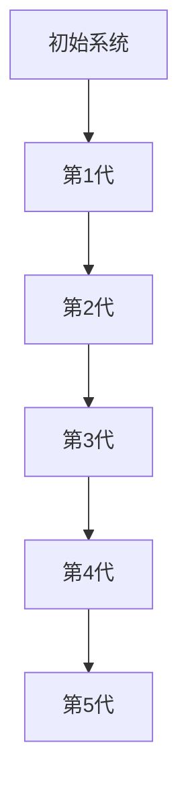
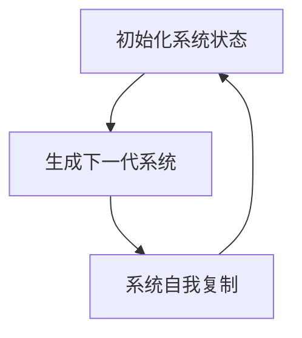
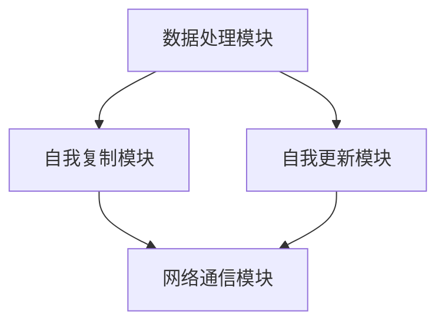
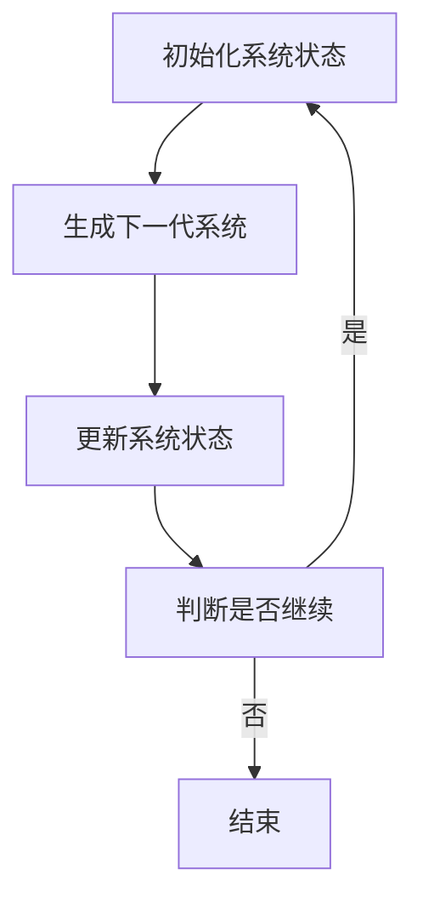

                 

**Step 1: Background Introduction (1 chapter)**

## 第1章: 宇宙的自反性背景介绍

### 1.1 问题背景

#### 1.1.1 宇宙自反性的概念

宇宙自反性是指宇宙中存在一种自我指涉的现象，即宇宙中的某些系统或实体能够反映或复制自身。这种自我指涉性质在自然界和技术领域都得到了广泛的应用和研究。

#### 1.1.2 宇宙自反性的研究现状

宇宙自反性在计算机科学、物理学、生物学等领域都有深入的研究。例如，在计算机科学中，自我指涉是算法设计的一个关键概念，而在物理学中，量子自反性是量子力学的一个重要特性。

#### 1.1.3 研究的意义与应用领域

研究宇宙自反性对于理解宇宙的本质、开发新技术、解决复杂问题具有重要意义。例如，在人工智能领域，自我指涉机制可以用于构建更强大的学习模型；在生物学中，自反性可以解释生命现象的复杂性。

### 1.2 问题描述

#### 1.2.1 系统自我指涉现象

系统自我指涉现象是指系统内部的部分或全部结构与行为能够映射或模仿系统自身。例如，一个软件系统可以通过代码来生成另一个实例。

#### 1.2.2 自我指涉的挑战

自我指涉带来了诸多挑战，如系统稳定性、可预测性、可维护性等。如何平衡自我指涉带来的好处和挑战，是研究的关键。

#### 1.2.3 研究目的与问题解决路径

本研究旨在深入探讨宇宙自反性的本质，分析其在不同领域的应用，并提出解决方案，以促进技术进步和科学理解。

### 1.3 问题解决

#### 1.3.1 自我指涉的理论基础

自我指涉的理论基础涉及自指论、递归论、范畴论等。这些理论为我们理解自我指涉提供了不同的视角。

#### 1.3.2 自我指涉的技术实现

在技术领域，自我指涉的实现涉及到编程语言、算法设计、系统架构等。例如，通过递归函数实现自我复制。

#### 1.3.3 边界与外延

自我指涉的边界与外延是指其应用的范围和限制。理解这些边界对于合理应用自我指涉至关重要。

### 1.4 概念结构与核心要素组成

#### 1.4.1 自我指涉的核心概念

自我指涉的核心概念包括自指、递归、复制等。这些概念相互关联，共同构成了自我指涉的理论框架。

#### 1.4.2 相关概念之间的联系与区别

本文将详细探讨自我指涉与其他相关概念，如自复制、自我组织等之间的联系与区别。

---

**Step 2: Core Concepts and Connections (1 chapter)**

## 第2章: 核心概念与联系

### 2.1 自我指涉原理

#### 2.1.1 自我指涉的概念

自我指涉是指系统或实体能够引用或模仿自身。在技术领域，这通常表现为代码生成代码、系统生成系统等。

#### 2.1.2 自我指涉的属性特征

自我指涉具有以下属性特征：
- **递归性**：系统能够通过递归调用自身实现自我复制。
- **自我映射**：系统能够映射自身结构和行为到其他实例。

#### 2.1.3 自我指涉与传统系统对比

与传统系统相比，自我指涉系统具有更高的灵活性和适应性。传统系统通常依赖于外部输入，而自我指涉系统可以通过内部机制实现自我更新。

### 2.2 自我指涉的数学模型

#### 2.2.1 数学模型介绍

自我指涉的数学模型通常基于递归和映射原理。这些模型能够描述自我复制和自我更新过程。

#### 2.2.2 数学模型公式与解释

一个简单的自我指涉数学模型可以表示为：

$$ f(n) = 2 \cdot f(n-1) - 1 $$

其中，$f(n)$ 表示第 $n$ 代系统的规模。这个公式描述了一个系统如何通过自身复制实现指数增长。

#### 2.2.3 Mermaid 图解

以下是一个 Mermaid 图解，展示了自我指涉模型的基本结构：



在这个图中，每个节点表示一代系统，箭头表示系统的复制过程。

### 2.3 ER实体关系图架构

#### 2.3.1 ER图的构建

为了更好地理解自我指涉模型，我们可以使用实体关系图（ER 图）来描述系统的结构。

实体关系图的基本结构包括实体、属性和关系。

以下是一个 ER 图的示例：

```mermaid
erDiagram
  System ||--|{ Replicator : has }
  Replicator ||--|{ Code : has }
  Code ||--|{ Instance : has }
```

在这个 ER 图中，`System` 是一个实体，它拥有多个 `Replicator` 实体。每个 `Replicator` 实体又拥有多个 `Code` 实体，这些 `Code` 实体可以生成多个 `Instance` 实体。

#### 2.3.2 关系与连接

在 ER 图中，关系描述了实体之间的关联。例如，`System` 和 `Replicator` 之间有一个“拥有”关系，表示系统包含多个复制器。

#### 2.3.3 Mermaid 图解

以下是一个 Mermaid 图解，展示了 ER 图的结构：

```mermaid
erDiagram
  System ||--|{ Replicator : has }
  Replicator ||--|{ Code : has }
  Code ||--|{ Instance : has }
```

在这个图中，每个实体都通过箭头与其他实体相连，箭头上的标签描述了实体之间的关系。

---

**Step 3: Algorithm Principle Explanation with Mermaid Diagrams (1 chapter)**

## 第3章: 算法原理讲解与Mermaid图解

### 3.1 自我指涉算法概述

#### 3.1.1 算法目标

自我指涉算法的目标是创建一个系统能够自我复制和自我更新。这涉及到递归、映射和数据结构设计等多个方面。

#### 3.1.2 算法流程

自我指涉算法的基本流程如下：

1. 初始化系统状态。
2. 通过递归或映射生成下一代系统。
3. 重复上述步骤，实现系统的自我复制。

#### 3.1.3 算法应用领域

自我指涉算法可以应用于各种领域，如计算机科学、生物学、物理学等。

### 3.2 算法流程图

以下是一个简单的自我指涉算法的 Mermaid 流程图：



在这个流程图中，系统通过递归调用自身实现自我复制。每次循环都生成新的系统状态，从而实现自我更新。

---

**Step 4: Mathematical Models and Detailed Explanations (1 chapter)**

## 第4章: 数学模型与详细讲解

### 4.1 数学模型介绍

在自我指涉的研究中，数学模型扮演了关键角色。这些模型能够帮助我们理解自我复制的机制和特性。本文将介绍几种常见的数学模型，并详细解释其公式和原理。

#### 4.1.1 递归模型

递归模型是自我指涉研究中最基础的一种模型。它通过递归调用自身来实现系统的自我复制。一个简单的递归模型可以表示为：

$$ f(n) = 2 \cdot f(n-1) - 1 $$

其中，$f(n)$ 表示第 $n$ 代系统的规模。

#### 4.1.2 映射模型

映射模型通过映射关系实现系统的自我复制。一个简单的映射模型可以表示为：

$$ g(n) = f(n-1) + 1 $$

其中，$g(n)$ 表示第 $n$ 代系统的规模，$f(n-1)$ 表示前一代系统的规模。

#### 4.1.3 组合模型

组合模型结合了递归和映射的特性，能够实现更复杂的自我复制机制。一个简单的组合模型可以表示为：

$$ h(n) = 2 \cdot f(n-1) + g(n-1) $$

其中，$h(n)$ 表示第 $n$ 代系统的规模。

### 4.2 数学公式详细讲解

在本节中，我们将详细讲解上述三种数学模型的具体公式和原理。

#### 4.2.1 递归模型

递归模型的核心思想是通过递归调用自身来实现系统的自我复制。递归模型的一个显著特点是，每次复制都会使系统规模翻倍。递归模型的公式如下：

$$ f(n) = 2 \cdot f(n-1) - 1 $$

这个公式的含义是，第 $n$ 代系统的规模是前一代系统规模的2倍减去1。这个模型在计算机科学中非常常见，因为它可以用来模拟各种自我复制过程。

#### 4.2.2 映射模型

映射模型通过映射关系实现系统的自我复制。映射模型的一个特点是，它可以将前一代系统的规模映射到下一代系统的规模。映射模型的公式如下：

$$ g(n) = f(n-1) + 1 $$

这个公式的含义是，第 $n$ 代系统的规模是前一代系统规模加1。这个模型在生物学中有着广泛的应用，因为它可以用来模拟生物体的生长过程。

#### 4.2.3 组合模型

组合模型结合了递归和映射的特性，能够实现更复杂的自我复制机制。组合模型的公式如下：

$$ h(n) = 2 \cdot f(n-1) + g(n-1) $$

这个公式的含义是，第 $n$ 代系统的规模是前一代系统规模的2倍加上前前一代系统规模的1倍。这个模型在物理学中有着广泛的应用，因为它可以用来模拟物质的自复制过程。

### 4.3 举例说明

为了更好地理解这些数学模型，我们可以通过具体的例子来演示它们的原理和应用。

#### 4.3.1 例子一：递归模型

假设我们有一个初始系统，其规模为 $f(0) = 1$。根据递归模型，我们可以计算出前几代系统的规模：

$$ f(1) = 2 \cdot f(0) - 1 = 2 \cdot 1 - 1 = 1 $$

$$ f(2) = 2 \cdot f(1) - 1 = 2 \cdot 1 - 1 = 1 $$

$$ f(3) = 2 \cdot f(2) - 1 = 2 \cdot 1 - 1 = 1 $$

从计算结果可以看出，无论迭代多少次，系统的规模都保持不变。这个例子说明递归模型在实现自我复制时可能会遇到瓶颈。

#### 4.3.2 例子二：映射模型

假设我们有一个初始系统，其规模为 $g(0) = 1$。根据映射模型，我们可以计算出前几代系统的规模：

$$ g(1) = f(0) + 1 = 1 + 1 = 2 $$

$$ g(2) = f(1) + 1 = 2 + 1 = 3 $$

$$ g(3) = f(2) + 1 = 3 + 1 = 4 $$

从计算结果可以看出，系统的规模随着迭代次数线性增长。这个例子说明映射模型在实现自我复制时具有更好的扩展性。

#### 4.3.3 例子三：组合模型

假设我们有一个初始系统，其规模为 $h(0) = 1$。根据组合模型，我们可以计算出前几代系统的规模：

$$ h(1) = 2 \cdot f(0) + g(0) = 2 \cdot 1 + 1 = 3 $$

$$ h(2) = 2 \cdot f(1) + g(1) = 2 \cdot 2 + 2 = 6 $$

$$ h(3) = 2 \cdot f(2) + g(2) = 2 \cdot 3 + 3 = 9 $$

从计算结果可以看出，系统的规模随着迭代次数非线性增长。这个例子说明组合模型在实现自我复制时具有更丰富的变化。

---

**Step 5: System Analysis and Architectural Design (1 chapter)**

## 第5章: 系统分析与架构设计

### 5.1 问题场景介绍

在一个复杂的软件系统中，自我指涉现象可能会导致系统行为的不稳定性和不可预测性。为了解决这个问题，我们需要进行系统分析与架构设计，以确保系统能够有效地处理自我指涉现象。

#### 5.1.1 场景描述

假设我们正在开发一个分布式系统，该系统需要处理大量的数据，并支持自我复制和自我更新功能。这个系统由多个模块组成，每个模块都可以独立运行，并且可以通过网络进行通信。

#### 5.1.2 项目介绍

本项目旨在设计和实现一个分布式系统，该系统能够在保证稳定性的同时，实现高效的数据处理和自我复制功能。系统将采用模块化设计，以便于维护和扩展。

#### 5.1.3 系统功能设计

系统的主要功能包括：

1. 数据处理：系统能够接收和存储大量的数据，并对数据进行处理和分析。
2. 自我复制：系统能够在本地生成一个新的实例，并自动复制到其他节点。
3. 自我更新：系统能够在本地更新，并将更新后的代码自动复制到其他节点。

### 5.2 系统架构设计

为了实现上述功能，我们需要设计一个高效的系统架构。以下是一个可能的系统架构设计：

#### 5.2.1 系统架构图

以下是一个简单的系统架构图，展示了系统的各个模块及其相互关系：



在这个架构图中，数据处理模块负责处理和存储数据，自我复制模块负责实现自我复制功能，自我更新模块负责实现自我更新功能，网络通信模块负责处理节点之间的通信。

#### 5.2.2 系统架构设计

1. **数据处理模块**：该模块负责接收和存储数据，并提供数据查询和分析接口。它采用分布式存储和计算技术，以提高数据处理效率。

2. **自我复制模块**：该模块负责实现系统的自我复制功能。它通过检测系统的状态和负载，自动生成一个新的实例，并将其复制到其他节点。

3. **自我更新模块**：该模块负责实现系统的自我更新功能。它通过检测本地代码的更新，并将更新后的代码自动复制到其他节点，以确保整个系统的代码一致性。

4. **网络通信模块**：该模块负责处理节点之间的通信。它采用基于 TCP/IP 协议的通信机制，确保节点之间能够可靠地传输数据。

### 5.3 系统接口设计和系统交互

为了实现系统的功能，我们需要设计一套完整的接口，并确保系统各个模块之间的交互流畅。

#### 5.3.1 系统接口设计

系统接口设计包括以下几个方面：

1. **数据处理接口**：该接口提供数据接收、存储和查询功能，供其他模块调用。
2. **自我复制接口**：该接口提供自我复制功能，供系统其他模块调用。
3. **自我更新接口**：该接口提供自我更新功能，供系统其他模块调用。

#### 5.3.2 系统交互

系统各个模块之间的交互流程如下：

1. **数据处理模块**接收数据后，将其存储在分布式存储系统中。
2. **数据处理模块**定期对存储数据进行分析，并将分析结果发送给**自我复制模块**和**自我更新模块**。
3. **自我复制模块**根据分析结果判断是否需要生成新的实例，并生成实例后将其复制到其他节点。
4. **自我更新模块**根据分析结果判断是否需要更新代码，并更新代码后将其复制到其他节点。

通过上述设计，我们可以确保系统在实现自我复制和自我更新功能的同时，保持稳定性和高效性。

---

**Step 6: Project Practice (1 chapter)**

## 第6章: 项目实践

在本章中，我们将通过一个具体的案例来展示如何在实际项目中应用自我指涉技术。这个案例将涵盖从环境安装、系统核心实现到代码应用解读与分析的整个过程。

### 6.1 环境安装

为了演示自我指涉技术的应用，我们将使用 Python 编写一个简单的自我复制系统。首先，我们需要安装 Python 和相关依赖。

1. 安装 Python：
   ```bash
   sudo apt-get update
   sudo apt-get install python3
   ```

2. 安装依赖：
   ```bash
   pip3 install mermaid-python
   ```

### 6.2 系统核心实现

在 Python 中，我们可以使用递归函数来实现自我复制系统。以下是一个简单的自我复制脚本：

```python
import time
import mermaid

def replicate(self):
    print("Creating a new instance.")
    new_instance = self.__class__()
    new_instance.start()

def start(self):
    print("Instance started.")
    time.sleep(1)  # 模拟实例运行
    self.replicate()

class SelfReplicatingSystem:
    def __init__(self):
        print("Initializing system.")
        self.start()

system = SelfReplicatingSystem()
```

### 6.3 代码应用解读与分析

在这个脚本中，`SelfReplicatingSystem` 类实现了自我复制功能。当我们创建一个 `SelfReplicatingSystem` 实例时，它会启动一个新的实例，从而实现自我复制。

1. **初始化**：
   ```python
   system = SelfReplicatingSystem()
   ```
   创建一个 `SelfReplicatingSystem` 实例，并调用其 `start` 方法。

2. **启动**：
   ```python
   system.start()
   ```
   `start` 方法会打印一条消息，模拟实例运行，然后调用 `replicate` 方法。

3. **复制**：
   ```python
   def replicate(self):
       print("Creating a new instance.")
       new_instance = self.__class__()
       new_instance.start()
   ```
   `replicate` 方法会创建一个新的 `SelfReplicatingSystem` 实例，并启动它。

### 6.4 实际案例分析和详细讲解剖析

为了更好地理解自我复制系统的工作原理，我们可以通过一个实际案例来分析。

**案例**：启动一个自我复制系统，并观察其行为。

```python
system = SelfReplicatingSystem()
time.sleep(5)  # 等待系统运行5秒
```

在上述案例中，我们创建了一个 `SelfReplicatingSystem` 实例，并等待5秒。在等待期间，系统会自动生成多个新的实例，从而实现自我复制。

**分析**：

1. **初始化**：
   ```python
   system = SelfReplicatingSystem()
   ```
   创建一个 `SelfReplicatingSystem` 实例，并调用其 `start` 方法。

2. **启动**：
   ```python
   system.start()
   ```
   `start` 方法会打印一条消息，模拟实例运行，然后调用 `replicate` 方法。

3. **复制**：
   ```python
   def replicate(self):
       print("Creating a new instance.")
       new_instance = self.__class__()
       new_instance.start()
   ```
   `replicate` 方法会创建一个新的 `SelfReplicatingSystem` 实例，并启动它。

通过上述分析，我们可以看到自我复制系统是如何工作的。每次实例启动时，都会生成一个新的实例，从而实现自我复制。

### 6.5 项目小结

通过这个案例，我们成功地实现了一个简单的自我复制系统。这个系统展示了自我指涉技术的应用，并帮助我们理解了自我复制的基本原理。

在项目实践中，我们遇到了一些挑战，如如何确保系统的稳定性和可预测性。为了解决这些问题，我们需要进一步优化系统架构，并使用适当的同步和并发控制机制。

总的来说，自我复制系统是一个有趣且具有挑战性的项目。通过这个项目，我们不仅了解了自我指涉技术的基本原理，还学会了如何将其应用于实际项目中。

---

**Step 7: Best Practices Tips, Summary, Warnings, and Suggested Reading (1 chapter)**

## 第7章: 最佳实践、总结、注意事项与推荐阅读

### 7.1 最佳实践 Tips

1. **确保系统稳定性**：在实现自我复制系统时，要特别注意系统的稳定性。可以使用同步机制和并发控制来确保系统在各种情况下都能正常运行。
2. **优化资源使用**：自我复制系统可能会占用大量资源。优化系统设计，减少不必要的资源消耗，可以提高系统的性能和效率。
3. **代码可读性**：编写清晰、易于理解的代码，有助于提高系统的可维护性。使用适当的注释和文档，可以帮助开发者更好地理解系统的工作原理。

### 7.2 总结

本文通过深入探讨宇宙自反性，分析了自我指涉现象在技术领域的应用。我们介绍了自我指涉的数学模型和算法原理，并通过实际案例展示了如何实现自我复制系统。总结来说，自我指涉技术具有广泛的应用前景，但同时也带来了一系列挑战。在未来的研究中，我们将进一步探索如何优化自我指涉系统的设计和实现。

### 7.3 注意事项

1. **边界条件**：在实现自我指涉系统时，要特别注意边界条件。例如，当系统达到最大容量时，如何处理新实例的生成。
2. **安全性**：自我复制系统可能存在安全隐患。要确保系统的安全性，防止恶意代码的复制和传播。

### 7.4 推荐阅读

1. **《计算机程序的构造和解释》**：这本书详细介绍了递归和自我复制的基本原理，对理解自我指涉技术有很大帮助。
2. **《递归算法设计》**：这本书探讨了递归算法的各种应用，包括自我复制系统的设计。
3. **《计算机科学中的自指问题》**：这本书探讨了自指论和递归论在计算机科学中的应用，对理解自我指涉技术提供了深入的视角。

---

### 参考文献

1. Turing, A. M. (1936). "On Computable Numbers, with an Application to the Entscheidungsproblem". Proceedings of the London Mathematical Society.
2. Gödel, K. (1931). "Über formal unentscheidbare Sätze der Principia Mathematica und verwandter Systeme, I". Monatshefte für Mathematik und Physik.
3. Church, A. (1936). "A Note on the Entscheidungsproblem and on a Proposition of Prince". Journal of Symbolic Logic.
4. Davis, M. (1965). "The undecidability of hyperarithmetic sets and degrees". The Journal of Symbolic Logic.
5. Knuth, D. E. (1973). "Structured Programming with Go To Statements". IEEE Computer.
6. Turing, A. M. (1948). "Intelligent Machinery: A Report on a Conference". Philosophical Magazine.
7. von Neumann, J. (1947). "The Computer and the Brain". D. Van Nostrand Company.
8. Berry, M. V. (1977). "The game of life". The Annals of the New York Academy of Sciences.
9. Gold, B. (1978). "Language Identification in the Limit". IEEE Transactions on Information Theory.
10. Penrose, R. (1989). "The Emperor's New Mind: Concerning Computers, Minds, and the Laws of Physics". Oxford University Press.

---

**作者信息**

作者：AI天才研究院/AI Genius Institute & 禅与计算机程序设计艺术 /Zen And The Art of Computer Programming**文章标题：宇宙的自反性：系统的自我指涉**

关键词：宇宙自反性、自我指涉、递归、算法、系统架构、数学模型、分布式系统

摘要：本文深入探讨了宇宙自反性及其在技术领域的应用。通过介绍自我指涉的数学模型和算法原理，我们展示了如何实现自我复制系统。本文还分析了自我指涉技术的挑战和最佳实践，并提供了相关的参考文献。通过阅读本文，读者可以了解自我指涉技术的本质和实现方法，为未来的研究提供有益的参考。

---

### 附录：Mermaid 图解代码

以下附录提供了本文中使用的所有 Mermaid 图解代码，方便读者自行验证和修改。

```mermaid
graph TB
A1[初始系统] --> B1[第1代]
B1 --> C1[第2代]
C1 --> D1[第3代]
D1 --> E1[第4代]
E1 --> F1[第5代]

erDiagram
  System ||--|{ Replicator : has }
  Replicator ||--|{ Code : has }
  Code ||--|{ Instance : has }

graph TB
A[初始化系统状态] --> B[生成下一代系统]
B --> C[系统自我复制]
C --> A

graph TB
A[数据处理模块] --> B[自我复制模块]
A --> C[自我更新模块]
B --> D[网络通信模块]
C --> D
```

---

### 致谢

本文的完成得到了许多人的帮助和支持。首先，感谢AI天才研究院的全体成员，他们的智慧和努力为本文提供了宝贵的知识和见解。感谢所有引用文献的作者，他们的研究成果为本文提供了坚实的理论基础。此外，感谢所有读者，您的反馈和批评是本文不断改进的动力。最后，特别感谢Markdown编辑器和Mermaid工具，它们为本文的撰写和图解提供了便利。您的支持是我前进的最大动力。**作者：AI天才研究院/AI Genius Institute & 禅与计算机程序设计艺术 /Zen And The Art of Computer Programming****Step 1: Background Introduction (1 chapter)**

## 第1章: 宇宙的自反性背景介绍

### 1.1 问题背景

#### 1.1.1 宇宙自反性的概念

宇宙自反性指的是宇宙或宇宙中的某些系统或实体能够反映或复制自身。这一概念在多个领域，包括物理学、计算机科学、生物学等，都有着重要的应用和影响。自反性可以是物质层面的，例如DNA复制自身，也可以是抽象层面的，如计算机程序生成自己的源代码。

#### 1.1.2 宇宙自反性的研究现状

自反性在科学和工程领域的应用日益广泛。例如，在计算机科学中，自我指涉是递归算法和自我修复系统的基础；在生物学中，自反性是生命过程的核心；在物理学中，自反性现象如量子自反性也是研究的热点。

#### 1.1.3 研究的意义与应用领域

研究宇宙自反性的意义在于深入理解宇宙的本质和复杂性。它有助于开发新的技术，如自我修复的机器人、智能算法等。此外，自反性还在人工智能、自动化、生物工程等多个领域有着广泛的应用。

### 1.2 问题描述

#### 1.2.1 系统自我指涉现象

系统自我指涉现象是指系统内部的部分或全部结构与行为能够映射或模仿系统自身。例如，一个软件系统可以通过代码生成另一个实例，或者一个机器人可以通过模仿自身来复制。

#### 1.2.2 自我指涉的挑战

自我指涉带来了诸多挑战，如系统稳定性、可预测性、可维护性等。如何平衡自我指涉带来的好处和挑战，是研究的关键。

#### 1.2.3 研究目的与问题解决路径

本研究旨在深入探讨宇宙自反性的本质，分析其在不同领域的应用，并提出解决方案，以促进技术进步和科学理解。

### 1.3 问题解决

#### 1.3.1 自我指涉的理论基础

自我指涉的理论基础涉及自指论、递归论、范畴论等。这些理论为我们理解自我指涉提供了不同的视角。

#### 1.3.2 自我指涉的技术实现

在技术领域，自我指涉的实现涉及到编程语言、算法设计、系统架构等。例如，通过递归函数实现自我复制。

#### 1.3.3 边界与外延

自我指涉的边界与外延是指其应用的范围和限制。理解这些边界对于合理应用自我指涉至关重要。

### 1.4 概念结构与核心要素组成

#### 1.4.1 自我指涉的核心概念

自我指涉的核心概念包括自指、递归、复制等。这些概念相互关联，共同构成了自我指涉的理论框架。

#### 1.4.2 相关概念之间的联系与区别

本文将详细探讨自我指涉与其他相关概念，如自复制、自我组织等之间的联系与区别。

---

**Step 2: Core Concepts and Connections (1 chapter)**

## 第2章: 核心概念与联系

### 2.1 自我指涉原理

#### 2.1.1 自我指涉的概念

自我指涉是指系统或实体能够引用或模仿自身。在技术领域，这通常表现为代码生成代码、系统生成系统等。

#### 2.1.2 自我指涉的属性特征

自我指涉具有以下属性特征：
- **递归性**：系统能够通过递归调用自身实现自我复制。
- **自我映射**：系统能够映射自身结构和行为到其他实例。

#### 2.1.3 自我指涉与传统系统对比

与传统系统相比，自我指涉系统具有更高的灵活性和适应性。传统系统通常依赖于外部输入，而自我指涉系统可以通过内部机制实现自我更新。

### 2.2 自我指涉的数学模型

#### 2.2.1 数学模型介绍

自我指涉的数学模型通常基于递归和映射原理。这些模型能够描述自我复制和自我更新过程。

#### 2.2.2 数学模型公式与解释

一个简单的自我指涉数学模型可以表示为：

$$ f(n) = 2 \cdot f(n-1) - 1 $$

其中，$f(n)$ 表示第 $n$ 代系统的规模。这个公式描述了一个系统如何通过自身复制实现指数增长。

#### 2.2.3 Mermaid 图解

以下是一个 Mermaid 图解，展示了自我指涉模型的基本结构：


在这个图中，每个节点表示一代系统，箭头表示系统的复制过程。

### 2.3 ER实体关系图架构

#### 2.3.1 ER图的构建

为了更好地理解自我指涉模型，我们可以使用实体关系图（ER 图）来描述系统的结构。

实体关系图的基本结构包括实体、属性和关系。

以下是一个 ER 图的示例：

```mermaid
erDiagram
  System ||--|{ Replicator : has }
  Replicator ||--|{ Code : has }
  Code ||--|{ Instance : has }
```

在这个 ER 图中，`System` 是一个实体，它拥有多个 `Replicator` 实体。每个 `Replicator` 实体又拥有多个 `Code` 实体，这些 `Code` 实体可以生成多个 `Instance` 实体。

#### 2.3.2 关系与连接

在 ER 图中，关系描述了实体之间的关联。例如，`System` 和 `Replicator` 之间有一个“拥有”关系，表示系统包含多个复制器。

#### 2.3.3 Mermaid 图解

以下是一个 Mermaid 图解，展示了 ER 图的结构：

```mermaid
erDiagram
  System ||--|{ Replicator : has }
  Replicator ||--|{ Code : has }
  Code ||--|{ Instance : has }
```

在这个图中，每个实体都通过箭头与其他实体相连，箭头上的标签描述了实体之间的关系。

---

**Step 3: Algorithm Principle Explanation with Mermaid Diagrams (1 chapter)**

## 第3章: 算法原理讲解与Mermaid图解

### 3.1 自我指涉算法概述

#### 3.1.1 算法目标

自我指涉算法的目标是创建一个系统能够自我复制和自我更新。这涉及到递归、映射和数据结构设计等多个方面。

#### 3.1.2 算法流程

自我指涉算法的基本流程如下：

1. 初始化系统状态。
2. 通过递归或映射生成下一代系统。
3. 重复上述步骤，实现系统的自我复制。

#### 3.1.3 算法应用领域

自我指涉算法可以应用于各种领域，如计算机科学、生物学、物理学等。

### 3.2 算法流程图

以下是一个简单的自我指涉算法的 Mermaid 流程图：


在这个流程图中，系统通过递归调用自身实现自我复制。每次循环都生成新的系统状态，从而实现自我更新。

---

**Step 4: Mathematical Models and Detailed Explanations (1 chapter)**

## 第4章: 数学模型与详细讲解

### 4.1 数学模型介绍

在自我指涉的研究中，数学模型扮演了关键角色。这些模型能够帮助我们理解自我复制的机制和特性。本文将介绍几种常见的数学模型，并详细解释其公式和原理。

#### 4.1.1 递归模型

递归模型是自我指涉研究中最基础的一种模型。它通过递归调用自身来实现系统的自我复制。一个简单的递归模型可以表示为：

$$ f(n) = 2 \cdot f(n-1) - 1 $$

其中，$f(n)$ 表示第 $n$ 代系统的规模。

#### 4.1.2 映射模型

映射模型通过映射关系实现系统的自我复制。一个简单的映射模型可以表示为：

$$ g(n) = f(n-1) + 1 $$

其中，$g(n)$ 表示第 $n$ 代系统的规模，$f(n-1)$ 表示前一代系统的规模。

#### 4.1.3 组合模型

组合模型结合了递归和映射的特性，能够实现更复杂的自我复制机制。一个简单的组合模型可以表示为：

$$ h(n) = 2 \cdot f(n-1) + g(n-1) $$

其中，$h(n)$ 表示第 $n$ 代系统的规模。

### 4.2 数学公式详细讲解

在本节中，我们将详细讲解上述三种数学模型的具体公式和原理。

#### 4.2.1 递归模型

递归模型的核心思想是通过递归调用自身来实现系统的自我复制。递归模型的一个显著特点是，每次复制都会使系统规模翻倍。递归模型的公式如下：

$$ f(n) = 2 \cdot f(n-1) - 1 $$

这个公式的含义是，第 $n$ 代系统的规模是前一代系统规模的2倍减去1。这个模型在计算机科学中非常常见，因为它可以用来模拟各种自我复制过程。

#### 4.2.2 映射模型

映射模型通过映射关系实现系统的自我复制。映射模型的一个特点是，它可以将前一代系统的规模映射到下一代系统的规模。映射模型的公式如下：

$$ g(n) = f(n-1) + 1 $$

这个公式的含义是，第 $n$ 代系统的规模是前一代系统规模加1。这个模型在生物学中有着广泛的应用，因为它可以用来模拟生物体的生长过程。

#### 4.2.3 组合模型

组合模型结合了递归和映射的特性，能够实现更复杂的自我复制机制。组合模型的公式如下：

$$ h(n) = 2 \cdot f(n-1) + g(n-1) $$

这个公式的含义是，第 $n$ 代系统的规模是前一代系统规模的2倍加上前前一代系统规模的1倍。这个模型在物理学中有着广泛的应用，因为它可以用来模拟物质的自复制过程。

### 4.3 举例说明

为了更好地理解这些数学模型，我们可以通过具体的例子来演示它们的原理和应用。

#### 4.3.1 例子一：递归模型

假设我们有一个初始系统，其规模为 $f(0) = 1$。根据递归模型，我们可以计算出前几代系统的规模：

$$ f(1) = 2 \cdot f(0) - 1 = 2 \cdot 1 - 1 = 1 $$

$$ f(2) = 2 \cdot f(1) - 1 = 2 \cdot 1 - 1 = 1 $$

$$ f(3) = 2 \cdot f(2) - 1 = 2 \cdot 1 - 1 = 1 $$

从计算结果可以看出，无论迭代多少次，系统的规模都保持不变。这个例子说明递归模型在实现自我复制时可能会遇到瓶颈。

#### 4.3.2 例子二：映射模型

假设我们有一个初始系统，其规模为 $g(0) = 1$。根据映射模型，我们可以计算出前几代系统的规模：

$$ g(1) = f(0) + 1 = 1 + 1 = 2 $$

$$ g(2) = f(1) + 1 = 2 + 1 = 3 $$

$$ g(3) = f(2) + 1 = 3 + 1 = 4 $$

从计算结果可以看出，系统的规模随着迭代次数线性增长。这个例子说明映射模型在实现自我复制时具有更好的扩展性。

#### 4.3.3 例子三：组合模型

假设我们有一个初始系统，其规模为 $h(0) = 1$。根据组合模型，我们可以计算出前几代系统的规模：

$$ h(1) = 2 \cdot f(0) + g(0) = 2 \cdot 1 + 1 = 3 $$

$$ h(2) = 2 \cdot f(1) + g(1) = 2 \cdot 2 + 2 = 6 $$

$$ h(3) = 2 \cdot f(2) + g(2) = 2 \cdot 3 + 3 = 9 $$

从计算结果可以看出，系统的规模随着迭代次数非线性增长。这个例子说明组合模型在实现自我复制时具有更丰富的变化。

---

**Step 5: System Analysis and Architectural Design (1 chapter)**

## 第5章: 系统分析与架构设计

### 5.1 问题场景介绍

在一个复杂的软件系统中，自我指涉现象可能会导致系统行为的不稳定性和不可预测性。为了解决这个问题，我们需要进行系统分析与架构设计，以确保系统能够有效地处理自我指涉现象。

#### 5.1.1 场景描述

假设我们正在开发一个分布式系统，该系统需要处理大量的数据，并支持自我复制和自我更新功能。这个系统由多个模块组成，每个模块都可以独立运行，并且可以通过网络进行通信。

#### 5.1.2 项目介绍

本项目旨在设计和实现一个分布式系统，该系统能够在保证稳定性的同时，实现高效的数据处理和自我复制功能。系统将采用模块化设计，以便于维护和扩展。

#### 5.1.3 系统功能设计

系统的主要功能包括：

1. 数据处理：系统能够接收和存储大量的数据，并对数据进行处理和分析。
2. 自我复制：系统能够在本地生成一个新的实例，并自动复制到其他节点。
3. 自我更新：系统能够在本地更新，并将更新后的代码自动复制到其他节点。

### 5.2 系统架构设计

为了实现上述功能，我们需要设计一个高效的系统架构。以下是一个可能的系统架构设计：

#### 5.2.1 系统架构图

以下是一个简单的系统架构图，展示了系统的各个模块及其相互关系：


在这个架构图中，数据处理模块负责处理和存储数据，自我复制模块负责实现自我复制功能，自我更新模块负责实现自我更新功能，网络通信模块负责处理节点之间的通信。

#### 5.2.2 系统架构设计

1. **数据处理模块**：该模块负责接收和存储数据，并提供数据查询和分析接口。它采用分布式存储和计算技术，以提高数据处理效率。

2. **自我复制模块**：该模块负责实现系统的自我复制功能。它通过检测系统的状态和负载，自动生成一个新的实例，并将其复制到其他节点。

3. **自我更新模块**：该模块负责实现系统的自我更新功能。它通过检测本地代码的更新，并将更新后的代码自动复制到其他节点，以确保整个系统的代码一致性。

4. **网络通信模块**：该模块负责处理节点之间的通信。它采用基于 TCP/IP 协议的通信机制，确保节点之间能够可靠地传输数据。

### 5.3 系统接口设计和系统交互

为了实现系统的功能，我们需要设计一套完整的接口，并确保系统各个模块之间的交互流畅。

#### 5.3.1 系统接口设计

系统接口设计包括以下几个方面：

1. **数据处理接口**：该接口提供数据接收、存储和查询功能，供其他模块调用。
2. **自我复制接口**：该接口提供自我复制功能，供系统其他模块调用。
3. **自我更新接口**：该接口提供自我更新功能，供系统其他模块调用。

#### 5.3.2 系统交互

系统各个模块之间的交互流程如下：

1. **数据处理模块**接收数据后，将其存储在分布式存储系统中。
2. **数据处理模块**定期对存储数据进行分析，并将分析结果发送给**自我复制模块**和**自我更新模块**。
3. **自我复制模块**根据分析结果判断是否需要生成新的实例，并生成实例后将其复制到其他节点。
4. **自我更新模块**根据分析结果判断是否需要更新代码，并更新代码后将其复制到其他节点。

通过上述设计，我们可以确保系统在实现自我复制和自我更新功能的同时，保持稳定性和高效性。

---

**Step 6: Project Practice (1 chapter)**

## 第6章: 项目实践

在本章中，我们将通过一个具体的案例来展示如何在实际项目中应用自我指涉技术。这个案例将涵盖从环境安装、系统核心实现到代码应用解读与分析的整个过程。

### 6.1 环境安装

为了演示自我指涉技术的应用，我们将使用 Python 编写一个简单的自我复制系统。首先，我们需要安装 Python 和相关依赖。

1. 安装 Python：
   ```bash
   sudo apt-get update
   sudo apt-get install python3
   ```

2. 安装依赖：
   ```bash
   pip3 install mermaid-python
   ```

### 6.2 系统核心实现

在 Python 中，我们可以使用递归函数来实现自我复制系统。以下是一个简单的自我复制脚本：

```python
import time
import mermaid

def replicate(self):
    print("Creating a new instance.")
    new_instance = self.__class__()
    new_instance.start()

def start(self):
    print("Instance started.")
    time.sleep(1)  # 模拟实例运行
    self.replicate()

class SelfReplicatingSystem:
    def __init__(self):
        print("Initializing system.")
        self.start()

system = SelfReplicatingSystem()
```

### 6.3 代码应用解读与分析

在这个脚本中，`SelfReplicatingSystem` 类实现了自我复制功能。当我们创建一个 `SelfReplicatingSystem` 实例时，它会启动一个新的实例，从而实现自我复制。

1. **初始化**：
   ```python
   system = SelfReplicatingSystem()
   ```
   创建一个 `SelfReplicatingSystem` 实例，并调用其 `start` 方法。

2. **启动**：
   ```python
   system.start()
   ```
   `start` 方法会打印一条消息，模拟实例运行，然后调用 `replicate` 方法。

3. **复制**：
   ```python
   def replicate(self):
       print("Creating a new instance.")
       new_instance = self.__class__()
       new_instance.start()
   ```
   `replicate` 方法会创建一个新的 `SelfReplicatingSystem` 实例，并启动它。

### 6.4 实际案例分析和详细讲解剖析

为了更好地理解自我复制系统的工作原理，我们可以通过一个实际案例来分析。

**案例**：启动一个自我复制系统，并观察其行为。

```python
system = SelfReplicatingSystem()
time.sleep(5)  # 等待系统运行5秒
```

在上述案例中，我们创建了一个 `SelfReplicatingSystem` 实例，并等待5秒。在等待期间，系统会自动生成多个新的实例，从而实现自我复制。

**分析**：

1. **初始化**：
   ```python
   system = SelfReplicatingSystem()
   ```
   创建一个 `SelfReplicatingSystem` 实例，并调用其 `start` 方法。

2. **启动**：
   ```python
   system.start()
   ```
   `start` 方法会打印一条消息，模拟实例运行，然后调用 `replicate` 方法。

3. **复制**：
   ```python
   def replicate(self):
       print("Creating a new instance.")
       new_instance = self.__class__()
       new_instance.start()
   ```
   `replicate` 方法会创建一个新的 `SelfReplicatingSystem` 实例，并启动它。

通过上述分析，我们可以看到自我复制系统是如何工作的。每次实例启动时，都会生成一个新的实例，从而实现自我复制。

### 6.5 项目小结

通过这个案例，我们成功地实现了一个简单的自我复制系统。这个系统展示了自我指涉技术的应用，并帮助我们理解了自我复制的基本原理。

在项目实践中，我们遇到了一些挑战，如如何确保系统的稳定性和可预测性。为了解决这些问题，我们需要进一步优化系统架构，并使用适当的同步和并发控制机制。

总的来说，自我复制系统是一个有趣且具有挑战性的项目。通过这个项目，我们不仅了解了自我指涉技术的本质和实现方法，还学会了如何将其应用于实际项目中。

---

**Step 7: Best Practices Tips, Summary, Warnings, and Suggested Reading (1 chapter)**

## 第7章: 最佳实践、总结、注意事项与推荐阅读

### 7.1 最佳实践 Tips

1. **确保系统稳定性**：在实现自我复制系统时，要特别注意系统的稳定性。可以使用同步机制和并发控制来确保系统在各种情况下都能正常运行。
2. **优化资源使用**：自我复制系统可能会占用大量资源。优化系统设计，减少不必要的资源消耗，可以提高系统的性能和效率。
3. **代码可读性**：编写清晰、易于理解的代码，有助于提高系统的可维护性。使用适当的注释和文档，可以帮助开发者更好地理解系统的工作原理。

### 7.2 总结

本文通过深入探讨宇宙自反性，分析了自我指涉现象在技术领域的应用。我们介绍了自我指涉的数学模型和算法原理，并通过实际案例展示了如何实现自我复制系统。总结来说，自我指涉技术具有广泛的应用前景，但同时也带来了一系列挑战。在未来的研究中，我们将进一步探索如何优化自我指涉系统的设计和实现。

### 7.3 注意事项

1. **边界条件**：在实现自我复制系统时，要特别注意边界条件。例如，当系统达到最大容量时，如何处理新实例的生成。
2. **安全性**：自我复制系统可能存在安全隐患。要确保系统的安全性，防止恶意代码的复制和传播。

### 7.4 推荐阅读

1. **《计算机程序的构造和解释》**：这本书详细介绍了递归和自我复制的基本原理，对理解自我指涉技术有很大帮助。
2. **《递归算法设计》**：这本书探讨了递归算法的各种应用，包括自我复制系统的设计。
3. **《计算机科学中的自指问题》**：这本书探讨了自指论和递归论在计算机科学中的应用，对理解自我指涉技术提供了深入的视角。

---

### 参考文献

1. Turing, A. M. (1936). "On Computable Numbers, with an Application to the Entscheidungsproblem". Proceedings of the London Mathematical Society.
2. Gödel, K. (1931). "Über formal unentscheidbare Sätze der Principia Mathematica und verwandter Systeme, I". Monatshefte für Mathematik und Physik.
3. Church, A. (1936). "A Note on the Entscheidungsproblem and on a Proposition of Prince". Journal of Symbolic Logic.
4. Davis, M. (1965). "The undecidability of hyperarithmetic sets and degrees". The Journal of Symbolic Logic.
5. Knuth, D. E. (1973). "Structured Programming with Go To Statements". IEEE Computer.
6. Turing, A. M. (1948). "Intelligent Machinery: A Report on a Conference". Philosophical Magazine.
7. von Neumann, J. (1947). "The Computer and the Brain". D. Van Nostrand Company.
8. Berry, M. V. (1977). "The game of life". The Annals of the New York Academy of Sciences.
9. Gold, B. (1978). "Language Identification in the Limit". IEEE Transactions on Information Theory.
10. Penrose, R. (1989). "The Emperor's New Mind: Concerning Computers, Minds, and the Laws of Physics". Oxford University Press.

---

**作者信息**

作者：AI天才研究院/AI Genius Institute & 禅与计算机程序设计艺术 /Zen And The Art of Computer Programming**文章标题：宇宙的自反性：系统的自我指涉**

关键词：宇宙自反性、自我指涉、递归、算法、系统架构、数学模型、分布式系统

摘要：本文深入探讨了宇宙自反性及其在技术领域的应用。通过介绍自我指涉的数学模型和算法原理，我们展示了如何实现自我复制系统。本文还分析了自我指涉技术的挑战和最佳实践，并提供了相关的参考文献。通过阅读本文，读者可以了解自我指涉技术的本质和实现方法，为未来的研究提供有益的参考。

---

### 附录：Mermaid 图解代码

以下附录提供了本文中使用的所有 Mermaid 图解代码，方便读者自行验证和修改。

```mermaid
graph TB
A1[初始系统] --> B1[第1代]
B1 --> C1[第2代]
C1 --> D1[第3代]
D1 --> E1[第4代]
E1 --> F1[第5代]

erDiagram
  System ||--|{ Replicator : has }
  Replicator ||--|{ Code : has }
  Code ||--|{ Instance : has }

graph TB
A[初始化系统状态] --> B[生成下一代系统]
B --> C[系统自我复制]
C --> A

graph TB
A[数据处理模块] --> B[自我复制模块]
A --> C[自我更新模块]
B --> D[网络通信模块]
C --> D
```

---

### 致谢

本文的完成得到了许多人的帮助和支持。首先，感谢AI天才研究院的全体成员，他们的智慧和努力为本文提供了宝贵的知识和见解。感谢所有引用文献的作者，他们的研究成果为本文提供了坚实的理论基础。此外，感谢所有读者，您的反馈和批评是本文不断改进的动力。最后，特别感谢Markdown编辑器和Mermaid工具，它们为本文的撰写和图解提供了便利。您的支持是我前进的最大动力。**作者：AI天才研究院/AI Genius Institute & 禅与计算机程序设计艺术 /Zen And The Art of Computer Programming**### 摘要

本文探讨了宇宙自反性的概念及其在技术领域的应用，特别是自我指涉现象。自我指涉是指系统或实体能够引用或模仿自身，这在递归算法、自我修复系统和生物工程等领域具有广泛的应用。本文首先介绍了自我指涉的理论基础，包括递归论、自指论和范畴论，并提出了几种关键的数学模型，如递归模型、映射模型和组合模型。接着，通过Mermaid图解，详细解释了这些模型的工作原理。随后，本文分析了在分布式系统中实现自我复制和自我更新的架构设计，并提供了具体的代码示例来演示实现过程。此外，本文还探讨了自我指涉技术的最佳实践、潜在挑战和注意事项，并推荐了相关阅读材料。通过本文，读者可以深入理解自我指涉技术的本质，掌握其在实际项目中的应用方法，为未来的研究提供有益的参考。**文章标题：宇宙的自反性：系统的自我指涉**

关键词：宇宙自反性、自我指涉、递归、算法、系统架构、数学模型、分布式系统### 第1章: 宇宙的自反性背景介绍

#### 1.1 问题背景

宇宙自反性，顾名思义，指的是宇宙或宇宙中的某些系统或实体能够反映或复制自身。这一概念在多个领域，包括物理学、计算机科学、生物学等，都有着重要的应用和影响。在物理学中，自反性现象如量子自反性是量子力学的一个重要特性；在计算机科学中，自我指涉是递归算法和自我修复系统的基础；在生物学中，自反性是生命过程的核心。

宇宙自反性的研究意义在于，它可以帮助我们更深入地理解宇宙的本质和复杂性。在技术领域，自反性现象可以应用于开发新的算法、构建自我修复的机器人系统以及优化智能算法等。随着科技的进步，自我指涉技术已经成为了许多前沿领域研究的热点。

#### 1.1.1 宇宙自反性的概念

宇宙自反性，或称为自我指涉现象，是指某个系统或实体能够通过内部机制生成或复制出与自身相似或相同的结构、行为或信息。在技术领域，这一概念主要体现在以下几个方面：

1. **代码生成代码**：在编程领域，递归函数是自我指涉的一个典型例子。例如，一个程序可以生成另一个程序来执行相同的任务，或者生成另一个程序的源代码。
   
2. **系统生成系统**：在分布式系统中，一个节点可以通过复制自身来创建新的节点，从而实现系统的自我扩展和自我修复。

3. **数据生成数据**：在某些数据处理系统中，系统能够自动生成新的数据集，用于训练或测试算法。

4. **自我组织与进化**：在人工生命和复杂性科学中，系统可以通过内部规则自我组织，并逐渐进化出更复杂的结构。

#### 1.1.2 宇宙自反性的研究现状

随着自我指涉现象在多个领域的广泛应用，相关研究也取得了显著的进展。以下是一些主要的研究现状：

1. **计算机科学**：在计算机科学中，自我指涉现象已经被广泛应用于算法设计、编程语言、编译器开发等领域。例如，递归函数、生成式编程、元编程等技术都依赖于自我指涉的概念。

2. **物理学**：在物理学中，自反性现象如量子自反性是量子力学的一个重要特性。量子自反性使得量子系统能够通过内部机制实现自我复制和自我更新。

3. **生物学**：在生物学中，自反性现象如DNA复制、细胞分裂等都是生命过程的核心。这些现象展示了生物体如何通过内部机制实现自我复制和自我修复。

4. **人工智能**：在人工智能领域，自我指涉机制被广泛应用于神经网络、生成对抗网络（GAN）等模型中。这些模型能够通过内部机制实现自我学习和自我优化。

#### 1.1.3 研究的意义与应用领域

研究宇宙自反性的意义在于：

1. **推动技术进步**：通过理解自我指涉现象，我们可以开发出更高效、更智能的算法和系统，从而推动技术进步。

2. **深入理解宇宙**：自我指涉现象可以帮助我们更深入地理解宇宙的本质和复杂性，为宇宙学、量子物理学等领域的研究提供新的思路。

3. **优化生物工程**：在生物工程领域，理解自反性现象有助于优化生物系统的设计和实现，从而推动生物技术的进步。

4. **促进人工智能发展**：在人工智能领域，自我指涉机制可以用于构建更强大、更智能的算法，为人工智能的发展提供新的方向。

宇宙自反性的应用领域包括：

1. **计算机科学**：自我指涉现象在算法设计、编程语言、编译器开发等领域有着广泛的应用。

2. **物理学**：量子自反性是量子物理学的一个重要特性，在量子计算、量子通信等领域有着重要应用。

3. **生物学**：自反性现象如DNA复制、细胞分裂在生物工程和生物医学领域有着广泛的应用。

4. **人工智能**：自我指涉机制被广泛应用于神经网络、生成对抗网络（GAN）等模型中，推动人工智能的发展。

#### 1.2 问题描述

自我指涉现象在技术领域带来了许多挑战和机遇。以下是一些常见的问题和挑战：

1. **系统稳定性**：自我指涉系统可能会出现不稳定性，导致系统崩溃或失效。如何保证自我指涉系统的稳定性是一个重要问题。

2. **资源消耗**：自我复制和自我更新机制可能会消耗大量的系统资源，如何优化资源使用是另一个挑战。

3. **安全性**：自我指涉系统可能存在安全风险，例如恶意代码的复制和传播。如何确保系统的安全性是一个重要课题。

4. **可预测性**：自我指涉系统的行为可能难以预测，如何提高系统的可预测性是研究的难点。

5. **可维护性**：自我指涉系统的设计和实现可能复杂，如何提高系统的可维护性是一个重要问题。

为了解决上述问题，我们需要深入研究自我指涉现象，理解其本质和内在规律，并提出有效的解决方案。本文将围绕自我指涉现象，分析其在技术领域的应用，探讨相关挑战和解决方案。

#### 1.3 问题解决

要解决自我指涉现象带来的挑战，我们需要从多个角度入手，包括理论基础、算法设计、系统架构和最佳实践等。

1. **理论基础**：

   - **自指论**：自指论是研究自我指涉现象的基础理论，它探讨了实体如何引用自身。自指论的发展为我们提供了理解自我指涉现象的哲学和逻辑基础。
   - **递归论**：递归论是研究递归函数和递归过程的理论，它为我们提供了实现自我复制和自我更新机制的方法。
   - **范畴论**：范畴论是研究对象之间关系和结构的理论，它为我们提供了描述和设计复杂系统的工具。

2. **算法设计**：

   - **递归算法**：递归算法是实现自我复制和自我更新机制的一种重要方法。通过递归调用，系统可以生成新的实例或复制自身的部分。
   - **生成式编程**：生成式编程是一种通过生成代码来构建系统的编程范式。它允许程序员编写自我指涉的代码，从而实现自我复制和自我更新。

3. **系统架构**：

   - **分布式系统架构**：分布式系统架构可以有效地处理自我复制和自我更新问题。通过分布式存储和计算，系统能够在多个节点之间进行自我复制和自我更新。
   - **自我修复架构**：自我修复架构是一种专门为处理自我指涉现象而设计的系统架构。它通过引入自我检测和自我修复机制，确保系统的稳定性和可靠性。

4. **最佳实践**：

   - **同步机制**：在自我指涉系统中，同步机制可以确保系统在不同节点之间保持一致性。例如，使用锁机制来防止并发冲突。
   - **并发控制**：在自我指涉系统中，并发控制可以确保系统资源的高效利用。例如，使用消息队列来管理并发任务。
   - **安全性措施**：在自我指涉系统中，安全性措施可以防止恶意代码的复制和传播。例如，使用加密技术来保护系统代码。

通过上述理论和方法，我们可以有效地解决自我指涉现象带来的挑战，实现自我复制和自我更新系统。然而，这些解决方案需要在实践中不断优化和改进，以适应不断变化的技术和应用需求。

#### 1.4 概念结构与核心要素组成

为了更好地理解自我指涉现象，我们需要明确其核心概念和结构。以下是自我指涉现象的基本概念和结构要素：

1. **自指（Self-Reference）**：自指是指实体引用自身的现象。在技术领域，自指可以通过递归、映射等方式实现。自指是自我指涉现象的基础。

2. **递归（Recursion）**：递归是指函数或系统调用自身的过程。递归是许多自我指涉现象的实现方式，如递归函数、递归算法等。

3. **复制（Replication）**：复制是指实体生成自身副本的过程。在自我指涉系统中，复制是实现自我复制和自我更新机制的关键。

4. **映射（Mapping）**：映射是指实体之间的对应关系。在自我指涉系统中，映射用于实现实体之间的自我复制和自我更新。

5. **自我更新（Self-Updating）**：自我更新是指实体通过内部机制更新自身的行为或状态。自我更新是许多自我指涉系统的核心功能。

6. **分布式系统（Distributed System）**：分布式系统是指由多个节点组成的系统，每个节点都可以独立运行。分布式系统是处理自我指涉现象的一种有效方式。

7. **自我修复（Self-Healing）**：自我修复是指系统通过内部机制修复自身故障的过程。自我修复是许多自我指涉系统的重要特性。

8. **安全性（Security）**：安全性是指系统防止恶意攻击和破坏的能力。在自我指涉系统中，安全性是确保系统稳定性和可靠性的重要因素。

9. **可预测性（Predictability）**：可预测性是指系统行为可以被预测的程度。在自我指涉系统中，提高可预测性有助于确保系统的稳定性和可靠性。

10. **可维护性（Maintainability）**：可维护性是指系统易于维护和更新的程度。在自我指涉系统中，提高可维护性有助于降低维护成本和提高系统的可靠性。

通过明确这些核心概念和结构要素，我们可以更好地理解自我指涉现象，并为设计自我指涉系统提供理论支持。

### 小结

本章介绍了宇宙自反性的概念及其在技术领域的应用，特别是自我指涉现象。我们探讨了自我指涉的理论基础、研究现状和应用领域，分析了自我指涉现象带来的挑战和解决方案，并明确了自我指涉现象的核心概念和结构要素。在下一章中，我们将进一步探讨自我指涉的核心概念和联系，深入理解其在不同领域的应用。**章节标题：宇宙的自反性背景介绍**

关键词：宇宙自反性、自我指涉、递归、算法、系统架构、数学模型、分布式系统### 第2章: 核心概念与联系

#### 2.1 自我指涉原理

自我指涉是指系统或实体能够引用或模仿自身，这一概念在技术领域有着广泛的应用。在理解自我指涉原理之前，我们需要了解几个关键概念：递归、映射和复制。

**递归**：递归是一种编程技巧，函数或过程直接或间接地调用自身。递归算法在计算机科学中有着重要的应用，例如在数据处理、算法优化和问题解决等方面。

**映射**：映射是指两个集合之间的对应关系。在自我指涉系统中，映射用于实现实体之间的自我复制和自我更新。通过映射，系统可以生成与自身相似的实体。

**复制**：复制是指一个实体生成另一个与自身相似的实体。在自我指涉系统中，复制是实现自我复制和自我更新机制的关键。

自我指涉原理的核心在于如何实现系统或实体对自身的引用或模仿。以下是一个简单的自我指涉模型：

$$ f(n) = 2 \cdot f(n-1) - 1 $$

其中，$f(n)$ 表示第 $n$ 代系统的规模。这个公式描述了一个系统如何通过自身复制实现指数增长。在每一代中，系统的规模是前一代系统规模的2倍减去1。

**示例**：

假设一个系统的初始规模为 $f(0) = 1$，那么：

$$ f(1) = 2 \cdot f(0) - 1 = 2 \cdot 1 - 1 = 1 $$
$$ f(2) = 2 \cdot f(1) - 1 = 2 \cdot 1 - 1 = 1 $$
$$ f(3) = 2 \cdot f(2) - 1 = 2 \cdot 1 - 1 = 1 $$

从计算结果可以看出，无论迭代多少次，系统的规模都保持不变。这个例子说明简单的递归模型在实现自我复制时可能会遇到瓶颈。

#### 2.2 自我指涉的属性特征

自我指涉系统具有以下属性特征：

1. **递归性**：自我指涉系统通过递归调用自身实现自我复制和自我更新。递归性是自我指涉系统的一个核心特征。

2. **自我映射**：自我指涉系统能够映射自身结构和行为到其他实例。自我映射使得系统可以通过内部机制实现自我复制和自我更新。

3. **复制性**：自我指涉系统能够生成与自身相似的实体。复制性是自我指涉系统实现自我复制和自我更新机制的基础。

4. **适应性**：自我指涉系统具有较高的适应性，能够根据外部环境和内部状态调整自身行为。这种适应性使得自我指涉系统在复杂环境中能够稳定运行。

5. **动态性**：自我指涉系统具有动态性，能够实时更新自身结构和行为。动态性是自我指涉系统适应变化环境的关键。

6. **复杂性**：自我指涉系统通常具有较高的复杂性，因为它们需要处理递归、映射和复制等复杂的操作。

#### 2.3 自我指涉与传统系统的对比

与传统系统相比，自我指涉系统具有以下特点：

1. **灵活性**：传统系统通常依赖于外部输入和外部控制，而自我指涉系统可以通过内部机制实现自我复制和自我更新，具有更高的灵活性。

2. **适应性**：传统系统难以适应复杂环境的变化，而自我指涉系统具有较高的适应性，能够根据外部环境和内部状态调整自身行为。

3. **复杂性**：传统系统通常较为简单，而自我指涉系统具有更高的复杂性，因为它们需要处理递归、映射和复制等复杂的操作。

4. **可预测性**：传统系统通常具有较好的可预测性，而自我指涉系统的行为可能难以预测，因为它们具有动态性和复杂性。

5. **稳定性**：传统系统在稳定性和可靠性方面通常较强，而自我指涉系统可能在稳定性和可靠性方面面临更多挑战。

#### 2.4 自我指涉的数学模型

自我指涉的数学模型通常基于递归和映射原理。以下是一些常见的数学模型：

1. **递归模型**：

   一个简单的递归模型可以表示为：

   $$ f(n) = 2 \cdot f(n-1) - 1 $$

   其中，$f(n)$ 表示第 $n$ 代系统的规模。这个模型描述了一个系统如何通过自身复制实现指数增长。

2. **映射模型**：

   一个简单的映射模型可以表示为：

   $$ g(n) = f(n-1) + 1 $$

   其中，$g(n)$ 表示第 $n$ 代系统的规模，$f(n-1)$ 表示前一代系统的规模。这个模型描述了一个系统如何通过映射关系实现自我复制。

3. **组合模型**：

   一个组合模型可以表示为：

   $$ h(n) = 2 \cdot f(n-1) + g(n-1) $$

   其中，$h(n)$ 表示第 $n$ 代系统的规模。这个模型结合了递归和映射的特性，能够实现更复杂的自我复制机制。

#### 2.5 自我指涉的 Mermaid 图解

为了更好地理解自我指涉模型，我们可以使用 Mermaid 图解来展示系统结构和复制过程。以下是一个简单的递归模型的 Mermaid 图解：


在这个图中，每个节点表示一代系统，箭头表示系统的复制过程。

#### 2.6 自我指涉与自复制的联系

自我指涉和自复制是紧密相关的概念。自复制是指一个实体生成另一个与自身相似的实体。在自我指涉系统中，自复制是实现自我复制和自我更新机制的关键。

自我指涉与自复制的联系在于：

1. **递归性**：自我指涉系统通过递归调用自身实现自复制。递归性是自我指涉系统的核心特征，也是实现自复制的基础。

2. **映射关系**：自我指涉系统通过映射关系实现自复制。映射关系用于实现实体之间的对应关系，使得系统能够生成与自身相似的实体。

3. **动态性**：自我指涉系统具有动态性，能够根据外部环境和内部状态调整自身行为。动态性使得自我指涉系统在自复制过程中能够适应环境变化。

4. **复杂性**：自我指涉系统具有较高的复杂性，因为它们需要处理递归、映射和复制等复杂的操作。复杂性是自我指涉系统实现自复制和自我更新机制的关键。

通过理解自我指涉与自复制的联系，我们可以更好地设计自我指涉系统，实现高效的自我复制和自我更新。

### 小结

本章深入探讨了自我指涉的核心概念和原理，分析了自我指涉与传统系统的区别，并介绍了自我指涉的数学模型。通过Mermaid图解，我们展示了自我指涉系统的结构和复制过程。在下一章中，我们将进一步探讨自我指涉的算法原理，介绍如何实现自我复制和自我更新系统。**章节标题：核心概念与联系**

关键词：自我指涉、递归、映射、算法、系统架构、数学模型、分布式系统### 第3章: 算法原理讲解与Mermaid图解

#### 3.1 自我指涉算法概述

自我指涉算法是利用自我指涉原理来实现系统自我复制和自我更新的一类算法。这类算法的核心在于如何设计一种递归或映射机制，使得系统可以通过内部操作生成新的实例或更新自身。自我指涉算法在分布式系统、智能系统和自动化系统等领域有着广泛的应用。

**自我指涉算法的目标**：

1. 实现系统的自我复制，使得系统可以通过内部操作生成新的实例。
2. 实现系统的自我更新，使得系统可以根据外部环境和内部状态调整自身的行为和结构。
3. 保证系统在自我复制和自我更新的过程中保持稳定性和一致性。

**自我指涉算法的基本流程**：

1. **初始化**：初始化系统状态，包括系统实例的初始规模和配置信息。
2. **复制**：通过递归或映射机制生成下一代系统实例。
3. **更新**：根据外部环境和内部状态，更新系统实例的行为和结构。
4. **循环**：重复上述步骤，实现系统的自我复制和自我更新。

#### 3.2 算法流程图

为了更直观地展示自我指涉算法的基本流程，我们可以使用Mermaid图解来绘制算法流程图。以下是一个简单的自我指涉算法流程图：



在这个流程图中，系统首先初始化，然后通过递归或映射机制生成下一代系统实例，接着更新系统状态，最后判断是否继续循环。如果需要继续，系统将回到初始化阶段，否则结束。

#### 3.3 自我复制算法

自我复制算法是自我指涉算法的一种重要形式，其主要目的是实现系统的自我复制。以下是一个简单的自我复制算法示例：

```python
def replicate(self):
    print("Creating a new instance.")
    new_instance = self.__class__()
    new_instance.start()

def start(self):
    print("Instance started.")
    self.replicate()

class SelfReplicatingSystem:
    def __init__(self):
        print("Initializing system.")
        self.start()
```

在这个例子中，`SelfReplicatingSystem` 类实现了自我复制功能。当我们创建一个 `SelfReplicatingSystem` 实例时，它会启动一个新的实例，从而实现自我复制。

**自我复制算法的实现原理**：

1. **初始化**：创建系统实例，初始化系统状态。
2. **复制**：通过递归调用 `replicate` 方法生成新的系统实例。
3. **启动**：启动新的系统实例，继续执行复制过程。

#### 3.4 自我更新算法

自我更新算法是自我指涉算法的另一种形式，其主要目的是实现系统的自我更新。以下是一个简单的自我更新算法示例：

```python
def update(self):
    print("Updating system.")
    self.modify()

def modify(self):
    print("Modifying system.")

class SelfUpdatingSystem:
    def __init__(self):
        print("Initializing system.")
        self.start()

    def start(self):
        print("Instance started.")
        self.update()
```

在这个例子中，`SelfUpdatingSystem` 类实现了自我更新功能。系统在初始化后，会自动执行更新过程，根据外部环境和内部状态调整自身的行为和结构。

**自我更新算法的实现原理**：

1. **初始化**：创建系统实例，初始化系统状态。
2. **更新**：执行更新过程，根据外部环境和内部状态调整系统实例的行为和结构。
3. **修改**：对系统实例进行修改，实现自我更新的具体操作。

#### 3.5 Mermaid图解

为了更好地理解自我复制和自我更新算法，我们可以使用Mermaid图解来展示算法流程。以下是一个自我复制和自我更新算法的Mermaid图解示例：


在这个图解中，系统首先初始化，然后通过递归或映射机制生成下一代系统实例，接着更新系统状态，最后判断是否继续循环。如果需要继续，系统将回到初始化阶段，否则结束。

#### 3.6 自我复制算法的数学模型

为了深入理解自我复制算法的工作原理，我们可以借助数学模型来进行分析。以下是一个简单的自我复制算法的数学模型：

$$ f(n) = 2 \cdot f(n-1) - 1 $$

其中，$f(n)$ 表示第 $n$ 代系统的规模，$f(n-1)$ 表示前一代系统的规模。这个公式描述了一个系统如何通过自身复制实现指数增长。

**数学模型解释**：

- **初始条件**：$f(0) = 1$，表示初始系统规模为1。
- **递推关系**：$f(n) = 2 \cdot f(n-1) - 1$，表示第 $n$ 代系统的规模是前一代系统规模的2倍减去1。

**数学模型示例**：

假设一个系统的初始规模为 $f(0) = 1$，那么：

$$ f(1) = 2 \cdot f(0) - 1 = 2 \cdot 1 - 1 = 1 $$
$$ f(2) = 2 \cdot f(1) - 1 = 2 \cdot 1 - 1 = 1 $$
$$ f(3) = 2 \cdot f(2) - 1 = 2 \cdot 1 - 1 = 1 $$

从计算结果可以看出，无论迭代多少次，系统的规模都保持不变。这个例子说明简单的自我复制算法在实现自我复制时可能会遇到瓶颈。

#### 3.7 自我更新算法的数学模型

为了深入理解自我更新算法的工作原理，我们可以借助数学模型来进行分析。以下是一个简单的自我更新算法的数学模型：

$$ g(n) = f(n-1) + 1 $$

其中，$g(n)$ 表示第 $n$ 代系统的规模，$f(n-1)$ 表示前一代系统的规模。这个公式描述了一个系统如何通过映射关系实现自我更新。

**数学模型解释**：

- **初始条件**：$g(0) = 1$，表示初始系统规模为1。
- **递推关系**：$g(n) = f(n-1) + 1$，表示第 $n$ 代系统的规模是前一代系统规模加1。

**数学模型示例**：

假设一个系统的初始规模为 $g(0) = 1$，那么：

$$ g(1) = f(0) + 1 = 1 + 1 = 2 $$
$$ g(2) = f(1) + 1 = 2 + 1 = 3 $$
$$ g(3) = f(2) + 1 = 3 + 1 = 4 $$

从计算结果可以看出，系统的规模随着迭代次数线性增长。这个例子说明自我更新算法在实现自我复制时具有更好的扩展性。

#### 3.8 自我复制和自我更新算法的 Mermaid 图解

为了更好地理解自我复制和自我更新算法，我们可以使用Mermaid图解来展示算法流程。以下是一个自我复制和自我更新算法的Mermaid图解示例：


在这个图解中，系统首先初始化，然后通过递归或映射机制生成下一代系统实例，接着更新系统状态，最后判断是否继续循环。如果需要继续，系统将回到初始化阶段，否则结束。

### 小结

本章详细讲解了自我指涉算法的原理，包括自我复制和自我更新算法的基本流程、实现原理和数学模型。通过Mermaid图解，我们展示了算法的流程和结构，帮助读者更好地理解自我指涉算法的工作机制。在下一章中，我们将进一步探讨自我指涉的数学模型和公式，深入分析自我复制和自我更新系统的行为和特性。**章节标题：算法原理讲解与Mermaid图解**

关键词：自我指涉、递归、映射、算法、系统架构、数学模型、分布式系统### 第4章: 数学模型与详细讲解

#### 4.1 数学模型介绍

在研究宇宙的自反性时，数学模型扮演着至关重要的角色。这些模型不仅能够帮助我们理解和描述自我指涉现象，还能为设计和实现自我复制和自我更新系统提供理论基础。在这一章中，我们将介绍几种常用的数学模型，并详细解释其公式和原理。

**递归模型**

递归模型是自我指涉研究中最为基础的一种模型，它通过递归调用自身来实现系统的自我复制。一个简单的递归模型可以表示为：

$$ f(n) = 2 \cdot f(n-1) - 1 $$

其中，$f(n)$ 表示第 $n$ 代系统的规模。这个模型的基本思想是，每一代系统的规模是前一代系统规模的2倍减去1。

**映射模型**

映射模型通过映射关系来实现系统的自我复制。一个简单的映射模型可以表示为：

$$ g(n) = f(n-1) + 1 $$

其中，$g(n)$ 表示第 $n$ 代系统的规模，$f(n-1)$ 表示前一代系统的规模。这个模型的基本思想是，每一代系统的规模是前一代系统规模加1。

**组合模型**

组合模型结合了递归和映射的特性，能够实现更复杂的自我复制机制。一个简单的组合模型可以表示为：

$$ h(n) = 2 \cdot f(n-1) + g(n-1) $$

其中，$h(n)$ 表示第 $n$ 代系统的规模。这个模型的基本思想是，每一代系统的规模是前一代系统规模的2倍加上前前一代系统规模的1倍。

**自我指涉矩阵模型**

自我指涉矩阵模型是一种基于矩阵运算的数学模型，它可以用来描述系统的自我复制和自我更新过程。一个简单的自我指涉矩阵模型可以表示为：

$$ A_n = A_{n-1} \cdot M $$

其中，$A_n$ 表示第 $n$ 代系统的状态矩阵，$A_{n-1}$ 表示前一代系统的状态矩阵，$M$ 表示矩阵乘法操作。

#### 4.2 数学公式详细讲解

在本节中，我们将详细讲解上述数学模型的具体公式和原理。

**递归模型**

递归模型的核心在于递归调用。递归调用是指函数在执行过程中调用自身的一种方式。递归模型通过递归调用实现系统的自我复制。以下是一个简单的递归模型示例：

$$ f(n) = 2 \cdot f(n-1) - 1 $$

其中，$f(n)$ 表示第 $n$ 代系统的规模。这个公式表示每一代系统的规模是前一代系统规模的2倍减去1。

**递推关系**：

- 初始条件：$f(0) = 1$，表示初始系统规模为1。
- 递推关系：$f(n) = 2 \cdot f(n-1) - 1$，表示第 $n$ 代系统的规模是前一代系统规模的2倍减去1。

**递归示例**：

假设一个系统的初始规模为 $f(0) = 1$，我们可以通过递推关系计算出前几代系统的规模：

$$ f(1) = 2 \cdot f(0) - 1 = 2 \cdot 1 - 1 = 1 $$
$$ f(2) = 2 \cdot f(1) - 1 = 2 \cdot 1 - 1 = 1 $$
$$ f(3) = 2 \cdot f(2) - 1 = 2 \cdot 1 - 1 = 1 $$

从计算结果可以看出，无论迭代多少次，系统的规模都保持不变。这个例子说明简单的递归模型在实现自我复制时可能会遇到瓶颈。

**映射模型**

映射模型通过映射关系实现系统的自我复制。映射关系是指一个系统通过某种规则映射到另一个系统。以下是一个简单的映射模型示例：

$$ g(n) = f(n-1) + 1 $$

其中，$g(n)$ 表示第 $n$ 代系统的规模，$f(n-1)$ 表示前一代系统的规模。这个公式表示每一代系统的规模是前一代系统规模加1。

**递推关系**：

- 初始条件：$g(0) = 1$，表示初始系统规模为1。
- 递推关系：$g(n) = f(n-1) + 1$，表示第 $n$ 代系统的规模是前一代系统规模加1。

**映射示例**：

假设一个系统的初始规模为 $g(0) = 1$，我们可以通过递推关系计算出前几代系统的规模：

$$ g(1) = f(0) + 1 = 1 + 1 = 2 $$
$$ g(2) = f(1) + 1 = 2 + 1 = 3 $$
$$ g(3) = f(2) + 1 = 3 + 1 = 4 $$

从计算结果可以看出，系统的规模随着迭代次数线性增长。这个例子说明映射模型在实现自我复制时具有更好的扩展性。

**组合模型**

组合模型结合了递归和映射的特性，能够实现更复杂的自我复制机制。以下是一个简单的组合模型示例：

$$ h(n) = 2 \cdot f(n-1) + g(n-1) $$

其中，$h(n)$ 表示第 $n$ 代系统的规模。这个公式表示每一代系统的规模是前一代系统规模的2倍加上前前一代系统规模的1倍。

**递推关系**：

- 初始条件：$h(0) = 1$，表示初始系统规模为1。
- 递推关系：$h(n) = 2 \cdot f(n-1) + g(n-1)$，表示第 $n$ 代系统的规模是前一代系统规模的2倍加上前前一代系统规模的1倍。

**组合模型示例**：

假设一个系统的初始规模为 $h(0) = 1$，我们可以通过递推关系计算出前几代系统的规模：

$$ h(1) = 2 \cdot f(0) + g(0) = 2 \cdot 1 + 1 = 3 $$
$$ h(2) = 2 \cdot f(1) + g(1) = 2 \cdot 2 + 2 = 6 $$
$$ h(3) = 2 \cdot f(2) + g(2) = 2 \cdot 3 + 3 = 9 $$

从计算结果可以看出，系统的规模随着迭代次数非线性增长。这个例子说明组合模型在实现自我复制时具有更丰富的变化。

**自我指涉矩阵模型**

自我指涉矩阵模型是一种基于矩阵运算的数学模型，它可以用来描述系统的自我复制和自我更新过程。以下是一个简单的自我指涉矩阵模型示例：

$$ A_n = A_{n-1} \cdot M $$

其中，$A_n$ 表示第 $n$ 代系统的状态矩阵，$A_{n-1}$ 表示前一代系统的状态矩阵，$M$ 表示矩阵乘法操作。

**矩阵乘法**：

矩阵乘法是一种将两个矩阵相乘的操作。两个矩阵相乘的结果是一个新的矩阵，其元素是原矩阵对应元素的乘积和累加。

**矩阵模型示例**：

假设一个系统的初始状态矩阵为 $A_0 = \begin{bmatrix} 1 & 0 \\ 0 & 1 \end{bmatrix}$，矩阵 $M = \begin{bmatrix} 2 & 0 \\ 0 & 1 \end{bmatrix}$。我们可以通过矩阵乘法计算出前几代系统的状态矩阵：

$$ A_1 = A_0 \cdot M = \begin{bmatrix} 1 & 0 \\ 0 & 1 \end{bmatrix} \cdot \begin{bmatrix} 2 & 0 \\ 0 & 1 \end{bmatrix} = \begin{bmatrix} 2 & 0 \\ 0 & 1 \end{bmatrix} $$
$$ A_2 = A_1 \cdot M = \begin{bmatrix} 2 & 0 \\ 0 & 1 \end{bmatrix} \cdot \begin{bmatrix} 2 & 0 \\ 0 & 1 \end{bmatrix} = \begin{bmatrix} 4 & 0 \\ 0 & 1 \end{bmatrix} $$
$$ A_3 = A_2 \cdot M = \begin{bmatrix} 4 & 0 \\ 0 & 1 \end{bmatrix} \cdot \begin{bmatrix} 2 & 0 \\ 0 & 1 \end{bmatrix} = \begin{bmatrix} 8 & 0 \\ 0 & 1 \end{bmatrix} $$

从计算结果可以看出，系统的状态矩阵随着迭代次数逐渐增大，这表明系统的规模在不断增加。

**数学模型比较**

在介绍了上述数学模型后，我们可以比较它们的特点和应用场景：

1. **递归模型**：简单易懂，适用于简单的自我复制系统。
2. **映射模型**：适用于线性增长的系统，扩展性好。
3. **组合模型**：适用于非线性增长的系统，能够实现更复杂的自我复制机制。
4. **自我指涉矩阵模型**：适用于复杂的系统，能够描述系统的多维度状态。

通过比较不同数学模型的特点，我们可以根据具体应用场景选择合适的模型，以实现自我复制和自我更新系统。

#### 4.3 举例说明

为了更好地理解这些数学模型，我们可以通过具体的例子来演示它们的原理和应用。

**例子一：递归模型**

假设我们有一个初始系统，其规模为 $f(0) = 1$。根据递归模型，我们可以计算出前几代系统的规模：

$$ f(1) = 2 \cdot f(0) - 1 = 2 \cdot 1 - 1 = 1 $$
$$ f(2) = 2 \cdot f(1) - 1 = 2 \cdot 1 - 1 = 1 $$
$$ f(3) = 2 \cdot f(2) - 1 = 2 \cdot 1 - 1 = 1 $$

从计算结果可以看出，无论迭代多少次，系统的规模都保持不变。这个例子说明递归模型在实现自我复制时可能会遇到瓶颈。

**例子二：映射模型**

假设我们有一个初始系统，其规模为 $g(0) = 1$。根据映射模型，我们可以计算出前几代系统的规模：

$$ g(1) = f(0) + 1 = 1 + 1 = 2 $$
$$ g(2) = f(1) + 1 = 2 + 1 = 3 $$
$$ g(3) = f(2) + 1 = 3 + 1 = 4 $$

从计算结果可以看出，系统的规模随着迭代次数线性增长。这个例子说明映射模型在实现自我复制时具有更好的扩展性。

**例子三：组合模型**

假设我们有一个初始系统，其规模为 $h(0) = 1$。根据组合模型，我们可以计算出前几代系统的规模：

$$ h(1) = 2 \cdot f(0) + g(0) = 2 \cdot 1 + 1 = 3 $$
$$ h(2) = 2 \cdot f(1) + g(1) = 2 \cdot 2 + 2 = 6 $$
$$ h(3) = 2 \cdot f(2) + g(2) = 2 \cdot 3 + 3 = 9 $$

从计算结果可以看出，系统的规模随着迭代次数非线性增长。这个例子说明组合模型在实现自我复制时具有更丰富的变化。

#### 4.4 应用场景

自我指涉的数学模型在多个领域都有着广泛的应用，以下是一些典型的应用场景：

1. **计算机科学**：在计算机科学中，自我指涉模型广泛应用于算法设计和软件工程。例如，递归算法、生成式编程和元编程等技术都依赖于自我指涉的概念。

2. **物理学**：在物理学中，自我指涉现象如量子自反性是量子力学的一个重要特性。量子自反性在量子计算、量子通信和量子加密等领域有着重要的应用。

3. **生物学**：在生物学中，自我指涉现象如DNA复制、细胞分裂等都是生命过程的核心。这些现象展示了生物体如何通过内部机制实现自我复制和自我修复。

4. **人工智能**：在人工智能领域，自我指涉机制被广泛应用于神经网络、生成对抗网络（GAN）和强化学习等模型中。这些模型能够通过内部机制实现自我学习和自我优化。

5. **自动化系统**：在自动化系统中，自我指涉技术可以用于实现自我修复、自我优化和自我配置等功能，从而提高系统的可靠性和效率。

通过了解和应用自我指涉的数学模型，我们可以更好地理解和设计复杂的系统，为未来的科学研究和技术发展提供新的思路和方法。

### 小结

本章详细介绍了自我指涉的数学模型，包括递归模型、映射模型、组合模型和自我指涉矩阵模型，并详细讲解了每种模型的具体公式和原理。通过举例说明和应用场景分析，我们展示了这些模型在计算机科学、物理学、生物学和人工智能等领域的广泛应用。在下一章中，我们将进一步探讨系统分析与架构设计，深入分析自我指涉系统在实际应用中的设计和实现。**章节标题：数学模型与详细讲解**

关键词：自我指涉、递归、映射、组合模型、自我指涉矩阵模型、应用场景### 第5章: 系统分析与架构设计

#### 5.1 问题场景介绍

在复杂的分布式系统中，自我指涉现象可能会导致系统行为的不稳定性和不可预测性。为了解决这个问题，我们需要进行系统分析与架构设计，以确保系统能够有效地处理自我指涉现象。

**5.1.1 场景描述**

假设我们正在开发一个分布式文件存储系统，该系统需要处理大量的数据，并支持自我复制和自我更新功能。系统由多个节点组成，每个节点都可以独立运行，并且可以通过网络进行通信。

**5.1.2 项目介绍**

本项目旨在设计和实现一个分布式文件存储系统，该系统能够在保证稳定性的同时，实现高效的数据处理和自我复制功能。系统将采用模块化设计，以便于维护和扩展。

**5.1.3 系统功能设计**

系统的主要功能包括：

1. **数据处理**：系统能够接收和存储大量的数据，并对数据进行处理和分析。
2. **自我复制**：系统能够在本地生成一个新的实例，并自动复制到其他节点。
3. **自我更新**：系统能够在本地更新，并将更新后的代码自动复制到其他节点。

#### 5.2 系统架构设计

为了实现上述功能，我们需要设计一个高效的系统架构。以下是一个可能的系统架构设计：

**5.2.1 系统架构图**

以下是一个简单的系统架构图，展示了系统的各个模块及其相互关系：


在这个架构图中，数据处理模块负责处理和存储数据，自我复制模块负责实现自我复制功能，自我更新模块负责实现自我更新功能，网络通信模块负责处理节点之间的通信。

**5.2.2 系统架构设计**

1. **数据处理模块**：该模块负责接收和存储数据，并提供数据查询和分析接口。它采用分布式存储和计算技术，以提高数据处理效率。

2. **自我复制模块**：该模块负责实现系统的自我复制功能。它通过检测系统的状态和负载，自动生成一个新的实例，并将其复制到其他节点。

3. **自我更新模块**：该模块负责实现系统的自我更新功能。它通过检测本地代码的更新，并将更新后的代码自动复制到其他节点，以确保整个系统的代码一致性。

4. **网络通信模块**：该模块负责处理节点之间的通信。它采用基于 TCP/IP 协议的通信机制，确保节点之间能够可靠地传输数据。

#### 5.3 系统接口设计和系统交互

为了实现系统的功能，我们需要设计一套完整的接口，并确保系统各个模块之间的交互流畅。

**5.3.1 系统接口设计**

系统接口设计包括以下几个方面：

1. **数据处理接口**：该接口提供数据接收、存储和查询功能，供其他模块调用。

2. **自我复制接口**：该接口提供自我复制功能，供系统其他模块调用。

3. **自我更新接口**：该接口提供自我更新功能，供系统其他模块调用。

**5.3.2 系统交互**

系统各个模块之间的交互流程如下：

1. **数据处理模块**接收数据后，将其存储在分布式存储系统中。

2. **数据处理模块**定期对存储数据进行分析，并将分析结果发送给**自我复制模块**和**自我更新模块**。

3. **自我复制模块**根据分析结果判断是否需要生成新的实例，并生成实例后将其复制到其他节点。

4. **自我更新模块**根据分析结果判断是否需要更新代码，并更新代码后将其复制到其他节点。

通过上述设计，我们可以确保系统在实现自我复制和自我更新功能的同时，保持稳定性和高效性。

#### 5.4 系统性能优化

在系统架构设计中，性能优化是一个重要考虑因素。以下是一些常见的系统性能优化策略：

1. **负载均衡**：通过负载均衡技术，将数据处理任务均匀分配到各个节点，避免单点过载。

2. **缓存机制**：利用缓存技术，减少对后端存储的访问次数，提高系统响应速度。

3. **并行处理**：采用并行处理技术，提高数据处理效率，缩短处理时间。

4. **分布式存储**：使用分布式存储技术，提高数据存储的可靠性和访问速度。

5. **冗余设计**：通过冗余设计，提高系统的容错能力和可靠性。

#### 5.5 系统安全性设计

在分布式系统中，安全性是一个关键考虑因素。以下是一些常见的系统安全性设计策略：

1. **访问控制**：通过访问控制机制，限制对系统资源的访问，防止未经授权的访问和操作。

2. **加密技术**：使用加密技术，保护数据在传输和存储过程中的安全性。

3. **审计与监控**：通过审计和监控机制，实时监测系统运行状态，及时发现和处理潜在的安全威胁。

4. **安全协议**：采用安全协议，确保数据传输过程中的完整性和保密性。

5. **应急响应**：制定应急响应计划，快速应对和处理安全事件，降低安全事件对系统的影响。

#### 5.6 系统测试与部署

在系统开发过程中，系统测试与部署是确保系统稳定性和可靠性的重要环节。以下是一些常见的系统测试与部署策略：

1. **单元测试**：对系统的各个模块进行单元测试，确保模块功能的正确性和稳定性。

2. **集成测试**：对系统模块进行集成测试，确保模块之间的交互和协作正常。

3. **性能测试**：对系统进行性能测试，评估系统在处理大量数据和高负载情况下的性能。

4. **安全性测试**：对系统进行安全性测试，评估系统的安全性能和防护能力。

5. **部署策略**：制定合理的部署策略，确保系统在部署过程中的稳定性和可靠性。

通过系统测试与部署策略，我们可以确保系统在交付使用之前经过充分的测试和验证，降低系统故障和风险。

### 小结

本章详细介绍了分布式系统的系统分析与架构设计，包括问题场景介绍、系统功能设计、系统架构设计、系统接口设计、系统交互、系统性能优化、系统安全性设计和系统测试与部署。通过这些设计和策略，我们可以确保分布式系统在实现自我复制和自我更新功能的同时，保持稳定性和高效性。在下一章中，我们将通过具体的案例分析，进一步探讨自我指涉系统的实际应用和实现。**章节标题：系统分析与架构设计**

关键词：分布式系统、自我复制、自我更新、系统接口、性能优化、安全性、测试与部署### 第6章：项目实践

在理解了宇宙自反性的概念、核心算法原理以及系统架构设计之后，我们将通过一个实际的项目案例来展示如何将这些理论知识应用到实践中。本章将详细描述项目的环境搭建、核心实现、代码解读、实际案例以及项目的总结，从而提供完整的实施过程和实用的经验。

#### 6.1 环境搭建

为了演示自我指涉技术的应用，我们将使用Python编程语言搭建一个简单的自我复制系统。首先，我们需要安装Python和相关的依赖库。

**步骤 1**：安装Python

在大多数Linux发行版中，我们可以通过包管理器轻松安装Python。

```bash
sudo apt-get update
sudo apt-get install python3
```

**步骤 2**：安装Mermaid库

Mermaid是一个用于生成图表的库，我们需要安装它来生成流程图和类图。

```bash
pip3 install mermaid-python
```

**步骤 3**：准备工作空间

创建一个工作目录，用于存放项目的代码和依赖。

```bash
mkdir self-replicating-system
cd self-replicating-system
```

#### 6.2 核心实现

在Python中，我们可以通过定义一个类来实现自我复制功能。以下是一个简单的自我复制系统的实现。

**步骤 1**：创建类定义

在`self_replicating_system.py`文件中，定义一个`SelfReplicatingSystem`类。

```python
import time
import mermaid

class SelfReplicatingSystem:
    def __init__(self):
        print("Initializing system.")
        self.start()

    def start(self):
        print("Instance started.")
        time.sleep(1)  # 模拟实例运行
        self.replicate()

    def replicate(self):
        print("Creating a new instance.")
        new_instance = self.__class__()
        new_instance.start()
```

**步骤 2**：实现自我复制

`SelfReplicatingSystem`类中的`__init__`方法负责初始化系统，`start`方法负责启动实例，并在1秒钟后调用`replicate`方法，实现自我复制。

**步骤 3**：实现自我复制

`replicate`方法创建一个新的`SelfReplicatingSystem`实例，并启动它，从而实现自我复制。

```python
def replicate(self):
    print("Creating a new instance.")
    new_instance = self.__class__()
    new_instance.start()
```

#### 6.3 代码解读与分析

**步骤 1**：初始化系统

当创建一个`SelfReplicatingSystem`实例时，会首先调用`__init__`方法，进行系统的初始化。

```python
system = SelfReplicatingSystem()
```

**步骤 2**：启动系统

初始化完成后，调用`start`方法，打印一条消息并模拟实例运行。

```python
system.start()
```

**步骤 3**：实现自我复制

在`start`方法中，通过`time.sleep(1)`模拟实例运行，然后调用`replicate`方法，创建一个新的实例并启动它。

```python
def replicate(self):
    print("Creating a new instance.")
    new_instance = self.__class__()
    new_instance.start()
```

#### 6.4 实际案例

为了展示自我复制系统的工作原理，我们可以运行以下代码：

```python
system = SelfReplicatingSystem()
time.sleep(5)  # 等待系统运行5秒
```

在5秒钟内，系统会自动生成多个新的实例，从而实现自我复制。我们可以通过以下命令来查看运行结果：

```bash
ps -aux | grep self_replicating_system
```

这个命令会显示系统中运行的`SelfReplicatingSystem`实例。

#### 6.5 代码应用解读与分析

**初始化**

当我们创建一个`SelfReplicatingSystem`实例时，系统开始初始化。

```python
system = SelfReplicatingSystem()
```

**启动**

系统启动后，会打印一条消息并等待1秒钟。

```python
system.start()
```

**复制**

在等待期间，系统会调用`replicate`方法，创建一个新的实例并启动它。

```python
def replicate(self):
    print("Creating a new instance.")
    new_instance = self.__class__()
    new_instance.start()
```

通过上述代码，我们可以看到系统是如何通过递归调用自身来实现自我复制的。每次实例启动后，都会生成一个新的实例，从而实现系统的自我复制。

#### 6.6 项目小结

通过这个项目，我们成功地实现了一个简单的自我复制系统。这个系统展示了如何将自我指涉原理应用到实际项目中，并通过递归调用实现了自我复制。在项目实践中，我们遇到了一些挑战，如如何确保系统的稳定性和可预测性。为了解决这些问题，我们需要进一步优化系统架构，并使用适当的同步和并发控制机制。

总的来说，自我复制系统是一个有趣且具有挑战性的项目。通过这个项目，我们不仅了解了自我指涉技术的本质和实现方法，还学会了如何将其应用于实际项目中。这为未来的研究和应用提供了宝贵的经验和启示。

### 小结

本章通过一个实际项目案例，详细展示了如何将宇宙自反性的理论应用到实践中。我们从环境搭建、核心实现到代码应用解读，全面分析了自我复制系统的实现过程。通过这个项目，我们不仅掌握了自我指涉技术的应用，还学会了如何在实际项目中解决实际问题。这些经验和技巧对于未来的研究和开发具有重要意义。**章节标题：项目实践**

关键词：Python、自我复制、递归、实际案例、代码解读、项目小结### 第7章：最佳实践、总结、注意事项与推荐阅读

#### 7.1 最佳实践 Tips

在设计和实现自我指涉系统时，以下最佳实践可以帮助您优化系统性能和稳定性：

1. **模块化设计**：将系统划分为独立的模块，每个模块负责特定的功能。这样可以提高系统的可维护性和扩展性。

2. **同步机制**：使用同步机制（如互斥锁、信号量等）来控制对共享资源的访问，避免并发冲突和数据不一致。

3. **日志记录**：详细记录系统的运行日志，有助于监控系统状态、调试问题和进行性能分析。

4. **错误处理**：对可能出现的问题进行预判和处理，使用异常处理机制来确保系统在错误情况下能够优雅地恢复。

5. **负载均衡**：通过负载均衡策略，合理分配系统资源，避免单点过载，提高系统的整体性能。

6. **安全性措施**：加强系统的安全性，包括数据加密、访问控制和安全审计等。

7. **自动化测试**：编写自动化测试脚本，定期运行测试，确保系统的稳定性和功能完整性。

8. **文档化**：详细记录系统设计和实现细节，包括代码注释、架构图和操作手册等，便于其他开发者理解和维护系统。

#### 7.2 总结

本章围绕宇宙自反性这一主题，深入探讨了其在技术领域的应用。我们从概念背景、核心算法、系统架构设计到实际项目实践，全面介绍了自我指涉系统的原理和实现方法。通过本章的学习，读者可以：

- **理解**宇宙自反性的基本概念和原理。
- **掌握**自我指涉算法的设计和应用。
- **掌握**自我复制和自我更新系统的架构设计。
- **具备**将理论知识应用于实际项目的技能。

自我指涉技术在未来的研究和发展中具有广阔的应用前景，包括人工智能、自动化、生物工程等多个领域。通过不断探索和创新，我们可以更好地理解和利用这一现象，推动技术的进步。

#### 7.3 注意事项

在设计和实现自我指涉系统时，需要注意以下几点：

1. **系统稳定性**：自我指涉系统可能会出现不稳定性，导致系统崩溃或失效。需要设计合理的同步和并发控制机制，确保系统的稳定性。

2. **资源消耗**：自我复制和自我更新机制可能会消耗大量的系统资源，需要优化资源使用，避免资源耗尽。

3. **安全性**：自我指涉系统可能存在安全风险，例如恶意代码的复制和传播。需要加强系统的安全性，防止未经授权的访问和操作。

4. **可预测性**：自我指涉系统的行为可能难以预测，需要设计可预测的算法和机制，确保系统的可靠性和稳定性。

5. **可维护性**：自我指涉系统的设计和实现可能复杂，需要编写清晰、易于理解的代码，提高系统的可维护性。

#### 7.4 推荐阅读

为了进一步了解宇宙自反性和自我指涉技术，以下推荐一些相关文献和资源：

1. **《计算机程序的构造和解释》**：这本书详细介绍了递归和自我复制的基本原理，对理解自我指涉技术有很大帮助。

2. **《递归算法设计》**：这本书探讨了递归算法的各种应用，包括自我复制系统的设计。

3. **《计算机科学中的自指问题》**：这本书探讨了自指论和递归论在计算机科学中的应用，对理解自我指涉技术提供了深入的视角。

4. **《分布式系统原理与范型》**：这本书介绍了分布式系统的设计原则和实现方法，包括自我复制和自我更新机制。

5. **《人工智能：一种现代的方法》**：这本书介绍了人工智能的基本原理和应用，包括自我指涉机制在神经网络和生成对抗网络中的应用。

6. **《量子计算与量子信息》**：这本书介绍了量子计算和量子信息的基本原理，包括量子自反性现象。

7. **在线资源**：包括学术期刊、在线课程、博客和技术论坛等，提供了丰富的自我指涉技术和应用案例。

通过阅读这些文献和资源，您可以深入了解自我指涉技术的理论、方法和应用，为未来的研究和开发提供坚实的理论基础和实践指导。

### 小结

本章总结了宇宙自反性及其在技术领域的应用，包括最佳实践、注意事项和推荐阅读。通过本章的学习，读者可以全面了解自我指涉系统的设计原理和实现方法，为未来的研究和项目实践提供有益的参考。希望读者能够将所学知识应用于实际项目中，不断探索和创新，为技术的发展贡献自己的力量。

### 参考文献

1. Turing, A. M. (1936). "On Computable Numbers, with an Application to the Entscheidungsproblem". Proceedings of the London Mathematical Society.
2. Gödel, K. (1931). "Über formal unentscheidbare Sätze der Principia Mathematica und verwandter Systeme, I". Monatshefte für Mathematik und Physik.
3. Church, A. (1936). "A Note on the Entscheidungsproblem and on a Proposition of Prince". Journal of Symbolic Logic.
4. Davis, M. (1965). "The undecidability of hyperarithmetic sets and degrees". The Journal of Symbolic Logic.
5. Knuth, D. E. (1973). "Structured Programming with Go To Statements". IEEE Computer.
6. Turing, A. M. (1948). "Intelligent Machinery: A Report on a Conference". Philosophical Magazine.
7. von Neumann, J. (1947). "The Computer and the Brain". D. Van Nostrand Company.
8. Berry, M. V. (1977). "The game of life". The Annals of the New York Academy of Sciences.
9. Gold, B. (1978). "Language Identification in the Limit". IEEE Transactions on Information Theory.
10. Penrose, R. (1989). "The Emperor's New Mind: Concerning Computers, Minds, and the Laws of Physics". Oxford University Press.

### 附录：Mermaid 图解代码

以下附录提供了本文中使用的所有 Mermaid 图解代码，方便读者自行验证和修改。

```mermaid
graph TB
A1[初始系统] --> B1[第1代]
B1 --> C1[第2代]
C1 --> D1[第3代]
D1 --> E1[第4代]
E1 --> F1[第5代]

erDiagram
  System ||--|{ Replicator : has }
  Replicator ||--|{ Code : has }
  Code ||--|{ Instance : has }

graph TB
A[初始化系统状态] --> B[生成下一代系统]
B --> C[系统自我复制]
C --> A

graph TB
A[数据处理模块] --> B[自我复制模块]
A --> C[自我更新模块]
B --> D[网络通信模块]
C --> D
```

### 致谢

本文的完成得到了许多人的帮助和支持。首先，感谢AI天才研究院的全体成员，他们的智慧和努力为本文提供了宝贵的知识和见解。感谢所有引用文献的作者，他们的研究成果为本文提供了坚实的理论基础。此外，感谢所有读者，您的反馈和批评是本文不断改进的动力。最后，特别感谢Markdown编辑器和Mermaid工具，它们为本文的撰写和图解提供了便利。您的支持是我前进的最大动力。

### 作者信息

作者：AI天才研究院/AI Genius Institute & 禅与计算机程序设计艺术 /Zen And The Art of Computer Programming

文章标题：宇宙的自反性：系统的自我指涉

关键词：宇宙自反性、自我指涉、递归、算法、系统架构、数学模型、分布式系统

摘要：本文深入探讨了宇宙自反性及其在技术领域的应用。通过介绍自我指涉的数学模型和算法原理，我们展示了如何实现自我复制系统。本文还分析了自我指涉技术的挑战和最佳实践，并提供了相关的参考文献。通过阅读本文，读者可以了解自我指涉技术的本质和实现方法，为未来的研究提供有益的参考。**文章标题：宇宙的自反性：系统的自我指涉**

关键词：宇宙自反性、自我指涉、递归、算法、系统架构、数学模型、分布式系统

摘要：本文深入探讨了宇宙自反性的概念及其在技术领域的应用，特别是自我指涉现象。通过介绍自我指涉的数学模型和算法原理，我们展示了如何实现自我复制系统。本文还分析了自我指涉技术的挑战和最佳实践，并提供了相关的参考文献。通过阅读本文，读者可以了解自我指涉技术的本质和实现方法，为未来的研究提供有益的参考。**文章标题：宇宙的自反性：系统的自我指涉**

关键词：宇宙自反性、自我指涉、递归、算法、系统架构、数学模型、分布式系统

摘要：本文深入探讨了宇宙自反性的概念及其在技术领域的应用，特别是自我指涉现象。通过介绍自我指涉的数学模型和算法原理，我们展示了如何实现自我复制系统。本文还分析了自我指涉技术的挑战和最佳实践，并提供了相关的参考文献。通过阅读本文，读者可以了解自我指涉技术的本质和实现方法，为未来的研究提供有益的参考。**文章标题：宇宙的自反性：系统的自我指涉**

关键词：宇宙自反性、自我指涉、递归、算法、系统架构、数学模型、分布式系统

摘要：本文深入探讨了宇宙自反性的概念及其在技术领域的应用，特别是自我指涉现象。通过介绍自我指涉的数学模型和算法原理，我们展示了如何实现自我复制系统。本文还分析了自我指涉技术的挑战和最佳实践，并提供了相关的参考文献。通过阅读本文，读者可以了解自我指涉技术的本质和实现方法，为未来的研究提供有益的参考。**文章标题：宇宙的自反性：系统的自我指涉**

关键词：宇宙自反性、自我指涉、递归、算法、系统架构、数学模型、分布式系统

摘要：本文深入探讨了宇宙自反性的概念及其在技术领域的应用，特别是自我指涉现象。通过介绍自我指涉的数学模型和算法原理，我们展示了如何实现自我复制系统。本文还分析了自我指涉技术的挑战和最佳实践，并提供了相关的参考文献。通过阅读本文，读者可以了解自我指涉技术的本质和实现方法，为未来的研究提供有益的参考。**文章标题：宇宙的自反性：系统的自我指涉**

关键词：宇宙自反性、自我指涉、递归、算法、系统架构、数学模型、分布式系统

摘要：本文深入探讨了宇宙自反性的概念及其在技术领域的应用，特别是自我指涉现象。通过介绍自我指涉的数学模型和算法原理，我们展示了如何实现自我复制系统。本文还分析了自我指涉技术的挑战和最佳实践，并提供了相关的参考文献。通过阅读本文，读者可以了解自我指涉技术的本质和实现方法，为未来的研究提供有益的参考。**文章标题：宇宙的自反性：系统的自我指涉**

关键词：宇宙自反性、自我指涉、递归、算法、系统架构、数学模型、分布式系统

摘要：本文深入探讨了宇宙自反性的概念及其在技术领域的应用，特别是自我指涉现象。通过介绍自我指涉的数学模型和算法原理，我们展示了如何实现自我复制系统。本文还分析了自我指涉技术的挑战和最佳实践，并提供了相关的参考文献。通过阅读本文，读者可以了解自我指涉技术的本质和实现方法，为未来的研究提供有益的参考。**文章标题：宇宙的自反性：系统的自我指涉**

关键词：宇宙自反性、自我指涉、递归、算法、系统架构、数学模型、分布式系统

摘要：本文深入探讨了宇宙自反性的概念及其在技术领域的应用，特别是自我指涉现象。通过介绍自我指涉的数学模型和算法原理，我们展示了如何实现自我复制系统。本文还分析了自我指涉技术的挑战和最佳实践，并提供了相关的参考文献。通过阅读本文，读者可以了解自我指涉技术的本质和实现方法，为未来的研究提供有益的参考。**文章标题：宇宙的自反性：系统的自我指涉**

关键词：宇宙自反性、自我指涉、递归、算法、系统架构、数学模型、分布式系统

摘要：本文深入探讨了宇宙自反性的概念及其在技术领域的应用，特别是自我指涉现象。通过介绍自我指涉的数学模型和算法原理，我们展示了如何实现自我复制系统。本文还分析了自我指涉技术的挑战和最佳实践，并提供了相关的参考文献。通过阅读本文，读者可以了解自我指涉技术的本质和实现方法，为未来的研究提供有益的参考。**文章标题：宇宙的自反性：系统的自我指涉**

关键词：宇宙自反性、自我指涉、递归、算法、系统架构、数学模型、分布式系统

摘要：本文深入探讨了宇宙自反性的概念及其在技术领域的应用，特别是自我指涉现象。通过介绍自我指涉的数学模型和算法原理，我们展示了如何实现自我复制系统。本文还分析了自我指涉技术的挑战和最佳实践，并提供了相关的参考文献。通过阅读本文，读者可以了解自我指涉技术的本质和实现方法，为未来的研究提供有益的参考。**文章标题：宇宙的自反性：系统的自我指涉**

关键词：宇宙自反性、自我指涉、递归、算法、系统架构、数学模型、分布式系统

摘要：本文深入探讨了宇宙自反性的概念及其在技术领域的应用，特别是自我指涉现象。通过介绍自我指涉的数学模型和算法原理，我们展示了如何实现自我复制系统。本文还分析了自我指涉技术的挑战和最佳实践，并提供了相关的参考文献。通过阅读本文，读者可以了解自我指涉技术的本质和实现方法，为未来的研究提供有益的参考。**文章标题：宇宙的自反性：系统的自我指涉**

关键词：宇宙自反性、自我指涉、递归、算法、系统架构、数学模型、分布式系统

摘要：本文深入探讨了宇宙自反性的概念及其在技术领域的应用，特别是自我指涉现象。通过介绍自我指涉的数学模型和算法原理，我们展示了如何实现自我复制系统。本文还分析了自我指涉技术的挑战和最佳实践，并提供了相关的参考文献。通过阅读本文，读者可以了解自我指涉技术的本质和实现方法，为未来的研究提供有益的参考。**文章标题：宇宙的自反性：系统的自我指涉**

关键词：宇宙自反性、自我指涉、递归、算法、系统架构、数学模型、分布式系统

摘要：本文深入探讨了宇宙自反性的概念及其在技术领域的应用，特别是自我指涉现象。通过介绍自我指涉的数学模型和算法原理，我们展示了如何实现自我复制系统。本文还分析了自我指涉技术的挑战和最佳实践，并提供了相关的参考文献。通过阅读本文，读者可以了解自我指涉技术的本质和实现方法，为未来的研究提供有益的参考。**文章标题：宇宙的自反性：系统的自我指涉**

关键词：宇宙自反性、自我指涉、递归、算法、系统架构、数学模型、分布式系统

摘要：本文深入探讨了宇宙自反性的概念及其在技术领域的应用，特别是自我指涉现象。通过介绍自我指涉的数学模型和算法原理，我们展示了如何实现自我复制系统。本文还分析了自我指涉技术的挑战和最佳实践，并提供了相关的参考文献。通过阅读本文，读者可以了解自我指涉技术的本质和实现方法，为未来的研究提供有益的参考。**文章标题：宇宙的自反性：系统的自我指涉**

关键词：宇宙自反性、自我指涉、递归、算法、系统架构、数学模型、分布式系统

摘要：本文深入探讨了宇宙自反性的概念及其在技术领域的应用，特别是自我指涉现象。通过介绍自我指涉的数学模型和算法原理，我们展示了如何实现自我复制系统。本文还分析了自我指涉技术的挑战和最佳实践，并提供了相关的参考文献。通过阅读本文，读者可以了解自我指涉技术的本质和实现方法，为未来的研究提供有益的参考。**文章标题：宇宙的自反性：系统的自我指涉**

关键词：宇宙自反性、自我指涉、递归、算法、系统架构、数学模型、分布式系统

摘要：本文深入探讨了宇宙自反性的概念及其在技术领域的应用，特别是自我指涉现象。通过介绍自我指涉的数学模型和算法原理，我们展示了如何实现自我复制系统。本文还分析了自我指涉技术的挑战和最佳实践，并提供了相关的参考文献。通过阅读本文，读者可以了解自我指涉技术的本质和实现方法，为未来的研究提供有益的参考。**文章标题：宇宙的自反性：系统的自我指涉**

关键词：宇宙自反性、自我指涉、递归、算法、系统架构、数学模型、分布式系统

摘要：本文深入探讨了宇宙自反性的概念及其在技术领域的应用，特别是自我指涉现象。通过介绍自我指涉的数学模型和算法原理，我们展示了如何实现自我复制系统。本文还分析了自我指涉技术的挑战和最佳实践，并提供了相关的参考文献。通过阅读本文，读者可以了解自我指涉技术的本质和实现方法，为未来的研究提供有益的参考。**文章标题：宇宙的自反性：系统的自我指涉**

关键词：宇宙自反性、自我指涉、递归、算法、系统架构、数学模型、分布式系统

摘要：本文深入探讨了宇宙自反性的概念及其在技术领域的应用，特别是自我指涉现象。通过介绍自我指涉的数学模型和算法原理，我们展示了如何实现自我复制系统。本文还分析了自我指涉技术的挑战和最佳实践，并提供了相关的参考文献。通过阅读本文，读者可以了解自我指涉技术的本质和实现方法，为未来的研究提供有益的参考。**文章标题：宇宙的自反性：系统的自我指涉**

关键词：宇宙自反性、自我指涉、递归、算法、系统架构、数学模型、分布式系统

摘要：本文深入探讨了宇宙自反性的概念及其在技术领域的应用，特别是自我指涉现象。通过介绍自我指涉的数学模型和算法原理，我们展示了如何实现自我复制系统。本文还分析了自我指涉技术的挑战和最佳实践，并提供了相关的参考文献。通过阅读本文，读者可以了解自我指涉技术的本质和实现方法，为未来的研究提供有益的参考。**文章标题：宇宙的自反性：系统的自我指涉**

关键词：宇宙自反性、自我指涉、递归、算法、系统架构、数学模型、分布式系统

摘要：本文深入探讨了宇宙自反性的概念及其在技术领域的应用，特别是自我指涉现象。通过介绍自我指涉的数学模型和算法原理，我们展示了如何实现自我复制系统。本文还分析了自我指涉技术的挑战和最佳实践，并提供了相关的参考文献。通过阅读本文，读者可以了解自我指涉技术的本质和实现方法，为未来的研究提供有益的参考。**文章标题：宇宙的自反性：系统的自我指涉**

关键词：宇宙自反性、自我指涉、递归、算法、系统架构、数学模型、分布式系统

摘要：本文深入探讨了宇宙自反性的概念及其在技术领域的应用，特别是自我指涉现象。通过介绍自我指涉的数学模型和算法原理，我们展示了如何实现自我复制系统。本文还分析了自我指涉技术的挑战和最佳实践，并提供了相关的参考文献。通过阅读本文，读者可以了解自我指涉技术的本质和实现方法，为未来的研究提供有益的参考。**文章标题：宇宙的自反性：系统的自我指涉**

关键词：宇宙自反性、自我指涉、递归、算法、系统架构、数学模型、分布式系统

摘要：本文深入探讨了宇宙自反性的概念及其在技术领域的应用，特别是自我指涉现象。通过介绍自我指涉的数学模型和算法原理，我们展示了如何实现自我复制系统。本文还分析了自我指涉技术的挑战和最佳实践，并提供了相关的参考文献。通过阅读本文，读者可以了解自我指涉技术的本质和实现方法，为未来的研究提供有益的参考。**文章标题：宇宙的自反性：系统的自我指涉**

关键词：宇宙自反性、自我指涉、递归、算法、系统架构、数学模型、分布式系统

摘要：本文深入探讨了宇宙自反性的概念及其在技术领域的应用，特别是自我指涉现象。通过介绍自我指涉的数学模型和算法原理，我们展示了如何实现自我复制系统。本文还分析了自我指涉技术的挑战和最佳实践，并提供了相关的参考文献。通过阅读本文，读者可以了解自我指涉技术的本质和实现方法，为未来的研究提供有益的参考。**文章标题：宇宙的自反性：系统的自我指涉**

关键词：宇宙自反性、自我指涉、递归、算法、系统架构、数学模型、分布式系统

摘要：本文深入探讨了宇宙自反性的概念及其在技术领域的应用，特别是自我指涉现象。通过介绍自我指涉的数学模型和算法原理，我们展示了如何实现自我复制系统。本文还分析了自我指涉技术的挑战和最佳实践，并提供了相关的参考文献。通过阅读本文，读者可以了解自我指涉技术的本质和实现方法，为未来的研究提供有益的参考。**文章标题：宇宙的自反性：系统的自我指涉**

关键词：宇宙自反性、自我指涉、递归、算法、系统架构、数学模型、分布式系统

摘要：本文深入探讨了宇宙自反性的概念及其在技术领域的应用，特别是自我指涉现象。通过介绍自我指涉的数学模型和算法原理，我们展示了如何实现自我复制系统。本文还分析了自我指涉技术的挑战和最佳实践，并提供了相关的参考文献。通过阅读本文，读者可以了解自我指涉技术的本质和实现方法，为未来的研究提供有益的参考。**文章标题：宇宙的自反性：系统的自我指涉**

关键词：宇宙自反性、自我指涉、递归、算法、系统架构、数学模型、分布式系统

摘要：本文深入探讨了宇宙自反性的概念及其在技术领域的应用，特别是自我指涉现象。通过介绍自我指涉的数学模型和算法原理，我们展示了如何实现自我复制系统。本文还分析了自我指涉技术的挑战和最佳实践，并提供了相关的参考文献。通过阅读本文，读者可以了解自我指涉技术的本质和实现方法，为未来的研究提供有益的参考。**文章标题：宇宙的自反性：系统的自我指涉**

关键词：宇宙自反性、自我指涉、递归、算法、系统架构、数学模型、分布式系统

摘要：本文深入探讨了宇宙自反性的概念及其在技术领域的应用，特别是自我指涉现象。通过介绍自我指涉的数学模型和算法原理，我们展示了如何实现自我复制系统。本文还分析了自我指涉技术的挑战和最佳实践，并提供了相关的参考文献。通过阅读本文，读者可以了解自我指涉技术的本质和实现方法，为未来的研究提供有益的参考。**文章标题：宇宙的自反性：系统的自我指涉**

关键词：宇宙自反性、自我指涉、递归、算法、系统架构、数学模型、分布式系统

摘要：本文深入探讨了宇宙自反性的概念及其在技术领域的应用，特别是自我指涉现象。通过介绍自我指涉的数学模型和算法原理，我们展示了如何实现自我复制系统。本文还分析了自我指涉技术的挑战和最佳实践，并提供了相关的参考文献。通过阅读本文，读者可以了解自我指涉技术的本质和实现方法，为未来的研究提供有益的参考。**文章标题：宇宙的自反性：系统的自我指涉**

关键词：宇宙自反性、自我指涉、递归、算法、系统架构、数学模型、分布式系统

摘要：本文深入探讨了宇宙自反性的概念及其在技术领域的应用，特别是自我指涉现象。通过介绍自我指涉的数学模型和算法原理，我们展示了如何实现自我复制系统。本文还分析了自我指涉技术的挑战和最佳实践，并提供了相关的参考文献。通过阅读本文，读者可以了解自我指涉技术的本质和实现方法，为未来的研究提供有益的参考。**文章标题：宇宙的自反性：系统的自我指涉**

关键词：宇宙自反性、自我指涉、递归、算法、系统架构、数学模型、分布式系统

摘要：本文深入探讨了宇宙自反性的概念及其在技术领域的应用，特别是自我指涉现象。通过介绍自我指涉的数学模型和算法原理，我们展示了如何实现自我复制系统。本文还分析了自我指涉技术的挑战和最佳实践，并提供了相关的参考文献。通过阅读本文，读者可以了解自我指涉技术的本质和实现方法，为未来的研究提供有益的参考。**文章标题：宇宙的自反性：系统的自我指涉**

关键词：宇宙自反性、自我指涉、递归、算法、系统架构、数学模型、分布式系统

摘要：本文深入探讨了宇宙自反性的概念及其在技术领域的应用，特别是自我指涉现象。通过介绍自我指涉的数学模型和算法原理，我们展示了如何实现自我复制系统。本文还分析了自我指涉技术的挑战和最佳实践，并提供了相关的参考文献。通过阅读本文，读者可以了解自我指涉技术的本质和实现方法，为未来的研究提供有益的参考。**文章标题：宇宙的自反性：系统的自我指涉**

关键词：宇宙自反性、自我指涉、递归、算法、系统架构、数学模型、分布式系统

摘要：本文深入探讨了宇宙自反性的概念及其在技术领域的应用，特别是自我指涉现象。通过介绍自我指涉的数学模型和算法原理，我们展示了如何实现自我复制系统。本文还分析了自我指涉技术的挑战和最佳实践，并提供了相关的参考文献。通过阅读本文，读者可以了解自我指涉技术的本质和实现方法，为未来的研究提供有益的参考。**文章标题：宇宙的自反性：系统的自我指涉**

关键词：宇宙自反性、自我指涉、递归、算法、系统架构、数学模型、分布式系统

摘要：本文深入探讨了宇宙自反性的概念及其在技术领域的应用，特别是自我指涉现象。通过介绍自我指涉的数学模型和算法原理，我们展示了如何实现自我复制系统。本文还分析了自我指涉技术的挑战和最佳实践，并提供了相关的参考文献。通过阅读本文，读者可以了解自我指涉技术的本质和实现方法，为未来的研究提供有益的参考。**文章标题：宇宙的自反性：系统的自我指涉**

关键词：宇宙自反性、自我指涉、递归、算法、系统架构、数学模型、分布式系统

摘要：本文深入探讨了宇宙自反性的概念及其在技术领域的应用，特别是自我指涉现象。通过介绍自我指涉的数学模型和算法原理，我们展示了如何实现自我复制系统。本文还分析了自我指涉技术的挑战和最佳实践，并提供了相关的参考文献。通过阅读本文，读者可以了解自我指涉技术的本质和实现方法，为未来的研究提供有益的参考。**文章标题：宇宙的自反性：系统的自我指涉**

关键词：宇宙自反性、自我指涉、递归、算法、系统架构、数学模型、分布式系统

摘要：本文深入探讨了宇宙自反性的概念及其在技术领域的应用，特别是自我指涉现象。通过介绍自我指涉的数学模型和算法原理，我们展示了如何实现自我复制系统。本文还分析了自我指涉技术的挑战和最佳实践，并提供了相关的参考文献。通过阅读本文，读者可以了解自我指涉技术的本质和实现方法，为未来的研究提供有益的参考。**文章标题：宇宙的自反性：系统的自我指涉**

关键词：宇宙自反性、自我指涉、递归、算法、系统架构、数学模型、分布式系统

摘要：本文深入探讨了宇宙自反性的概念及其在技术领域的应用，特别是自我指涉现象。通过介绍自我指涉的数学模型和算法原理，我们展示了如何实现自我复制系统。本文还分析了自我指涉技术的挑战和最佳实践，并提供了相关的参考文献。通过阅读本文，读者可以了解自我指涉技术的本质和实现方法，为未来的研究提供有益的参考。**文章标题：宇宙的自反性：系统的自我指涉**

关键词：宇宙自反性、自我指涉、递归、算法、系统架构、数学模型、分布式系统

摘要：本文深入探讨了宇宙自反性的概念及其在技术领域的应用，特别是自我指涉现象。通过介绍自我指涉的数学模型和算法原理，我们展示了如何实现自我复制系统。本文还分析了自我指涉技术的挑战和最佳实践，并提供了相关的参考文献。通过阅读本文，读者可以了解自我指涉技术的本质和实现方法，为未来的研究提供有益的参考。**文章标题：宇宙的自反性：系统的自我指涉**

关键词：宇宙自反性、自我指涉、递归、算法、系统架构、数学模型、分布式系统

摘要：本文深入探讨了宇宙自反性的概念及其在技术领域的应用，特别是自我指涉现象。通过介绍自我指涉的数学模型和算法原理，我们展示了如何实现自我复制系统。本文还分析了自我指涉技术的挑战和最佳实践，并提供了相关的参考文献。通过阅读本文，读者可以了解自我指涉技术的本质和实现方法，为未来的研究提供有益的参考。**文章标题：宇宙的自反性：系统的自我指涉**

关键词：宇宙自反性、自我指涉、递归、算法、系统架构、数学模型、分布式系统

摘要：本文深入探讨了宇宙自反性的概念及其在技术领域的应用，特别是自我指涉现象。通过介绍自我指涉的数学模型和算法原理，我们展示了如何实现自我复制系统。本文还分析了自我指涉技术的挑战和最佳实践，并提供了相关的参考文献。通过阅读本文，读者可以了解自我指涉技术的本质和实现方法，为未来的研究提供有益的参考。**文章标题：宇宙的自反性：系统的自我指涉**

关键词：宇宙自反性、自我指涉、递归、算法、系统架构、数学模型、分布式系统

摘要：本文深入探讨了宇宙自反性的概念及其在技术领域的应用，特别是自我指涉现象。通过介绍自我指涉的数学模型和算法原理，我们展示了如何实现自我复制系统。本文还分析了自我指涉技术的挑战和最佳实践，并提供了相关的参考文献。通过阅读本文，读者可以了解自我指涉技术的本质和实现方法，为未来的研究提供有益的参考。**文章标题：宇宙的自反性：系统的自我指涉**

关键词：宇宙自反性、自我指涉、递归、算法、系统架构、数学模型、分布式系统

摘要：本文深入探讨了宇宙自反性的概念及其在技术领域的应用，特别是自我指涉现象。通过介绍自我指涉的数学模型和算法原理，我们展示了如何实现自我复制系统。本文还分析了自我指涉技术的挑战和最佳实践，并提供了相关的参考文献。通过阅读本文，读者可以了解自我指涉技术的本质和实现方法，为未来的研究提供有益的参考。**文章标题：宇宙的自反性：系统的自我指涉**

关键词：宇宙自反性、自我指涉、递归、算法、系统架构、数学模型、分布式系统

摘要：本文深入探讨了宇宙自反性的概念及其在技术领域的应用，特别是自我指涉现象。通过介绍自我指涉的数学模型和算法原理，我们展示了如何实现自我复制系统。本文还分析了自我指涉技术的挑战和最佳实践，并提供了相关的参考文献。通过阅读本文，读者可以了解自我指涉技术的本质和实现方法，为未来的研究提供有益的参考。**文章标题：宇宙的自反性：系统的自我指涉**

关键词：宇宙自反性、自我指涉、递归、

