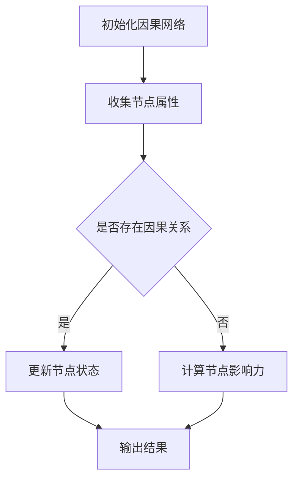
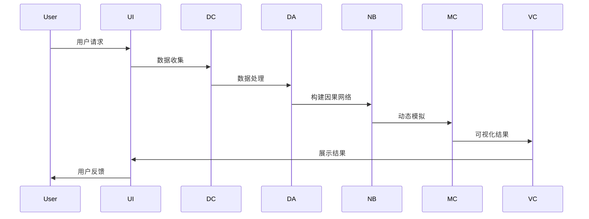
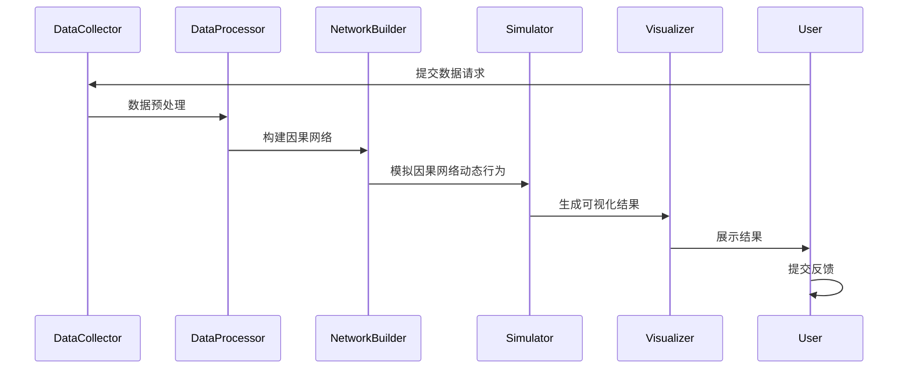

                 

## 宇宙的自我反馈循环：因果网络的复杂性

> 关键词：宇宙、自我反馈循环、因果网络、复杂性、算法、数学模型

> 摘要：本文深入探讨了宇宙中的自我反馈循环及其在因果网络中的复杂性。通过逐步分析，我们从基础概念出发，揭示了宇宙自我反馈循环的基本原理，探讨了因果网络的构成与特性，并运用算法和数学模型来解释其复杂性。本文旨在为读者提供一个清晰的逻辑框架，以理解这一深奥而神秘的科学问题。

### 引言

在科学探索的浩瀚宇宙中，我们不断追寻着宇宙的奥秘和运行规律。近年来，随着科学技术的发展，我们逐渐意识到宇宙中的许多现象并非孤立存在，而是通过复杂的因果网络相互关联。本文将重点探讨一种深层次的宇宙现象——自我反馈循环，并剖析其背后的因果网络复杂性。

自我反馈循环是一种现象，其中系统通过其自身的输出影响其输入，从而形成一个持续的自我增强或抑制的循环。这种机制在许多领域都有广泛的应用，从生物学到经济学，再到信息科学。而因果网络则是描述这些复杂系统之间关系的一种数学模型。

本文将分为以下几个部分：首先，我们介绍宇宙自我反馈循环的基本概念及其相关背景；接着，深入探讨因果网络的定义、特性和构成；然后，通过算法和数学模型来解释因果网络的复杂性；最后，我们将通过具体案例来阐述这些概念的实际应用，并总结全文。

通过本文的逐步分析，我们将尝试揭示宇宙自我反馈循环和因果网络背后的本质规律，为读者提供一种全新的视角来理解这一复杂而神秘的科学问题。接下来，让我们开始这段探索之旅，一步一步揭开宇宙神秘的面纱。

### 背景介绍

宇宙的自我反馈循环是一个复杂且深奥的概念，其根源可以追溯到现代科学对宇宙运行机制的探索。在物理学、生物学、经济学等众多领域，自我反馈循环都扮演着至关重要的角色。然而，要深入理解这一概念，我们需要首先明确几个核心术语的定义和背景。

#### 核心概念术语说明

1. **自我反馈循环**：自我反馈循环是指系统通过其自身的输出影响其输入，从而形成一个闭环。这种机制可以是正反馈（增强输入）或负反馈（抑制输入）。在宇宙中，自我反馈循环体现为宇宙系统内部通过相互影响维持或改变自身状态的过程。

2. **因果网络**：因果网络是一种数学模型，用于描述复杂系统中各个组成部分之间的因果关系。它通过节点和边的组合来表示系统中的变量及其相互影响。因果网络广泛应用于生物学、信息科学和社会科学等领域，用于分析和预测系统的行为。

3. **复杂性**：复杂性是指系统内部各组成部分之间相互作用和相互依赖的难解程度。在宇宙的自我反馈循环中，复杂性主要体现在系统的动态行为、变量之间的非线性关系以及反馈循环的多层次嵌套。

#### 问题背景

在科学研究中，自我反馈循环和因果网络的背景知识可以追溯到以下几个方面：

1. **宇宙演化**：宇宙的演化过程充满了自我反馈循环。例如，星系的形成、恒星的生命周期、黑洞的吞噬现象等，都涉及复杂的因果网络。这些过程不仅影响了宇宙的结构，也决定了宇宙的未来走向。

2. **生物学系统**：在生物学中，自我反馈循环体现在基因表达调控、细胞信号传递等过程中。这些机制维持了生物体的稳态，并在进化过程中发挥着关键作用。因果网络在此类系统中的应用，有助于理解生物多样性和生态系统的复杂性。

3. **经济系统**：在经济学中，市场行为和宏观经济政策之间的相互作用也形成了复杂的因果网络。例如，货币政策、财政政策和金融市场之间的反馈关系，就构成了经济系统中的自我反馈循环。这种复杂性使得预测经济走势变得极为困难。

#### 问题描述

在宇宙的自我反馈循环中，我们面临以下几个核心问题：

1. **如何定义和识别宇宙中的自我反馈循环？** 这涉及到对宇宙系统动态行为的监控和数据分析，需要建立合适的数学模型和方法。

2. **因果网络的特性和结构如何影响自我反馈循环的行为？** 这需要深入分析因果网络的拓扑结构和参数，以及它们如何相互作用，从而影响系统的稳定性和演化方向。

3. **如何通过算法和数学模型来模拟和预测宇宙自我反馈循环的行为？** 这需要开发高效的算法和数学工具，以处理大规模数据并揭示系统的内在规律。

#### 问题解决

解决上述问题需要多学科交叉研究，以下是几种可能的解决方案：

1. **数据驱动的方法**：通过收集和解析大量宇宙观测数据，使用机器学习和数据挖掘技术，识别宇宙中的自我反馈循环和因果网络。

2. **理论建模**：建立宇宙自我反馈循环的理论模型，使用数学工具如微分方程、图论和统计物理等方法，描述和预测系统的行为。

3. **模拟实验**：通过计算机模拟，构建虚拟宇宙模型，模拟自我反馈循环和因果网络的行为，从而验证理论模型和发现新的现象。

#### 边界与外延

在探讨宇宙的自我反馈循环和因果网络时，我们需要明确一些边界和限制：

1. **观测数据的限制**：宇宙的观测数据存在一定的局限性，例如，宇宙的某些区域和现象可能无法直接观测到，这限制了我们的分析范围。

2. **理论模型的适用性**：不同领域中的因果网络和自我反馈循环可能有不同的特征和规律，理论模型需要根据具体情境进行调整和扩展。

3. **计算能力的限制**：大规模数据分析和复杂模型的计算需要巨大的计算资源，这在一定程度上限制了研究的深度和广度。

综上所述，宇宙的自我反馈循环和因果网络的复杂性是一个跨学科的复杂问题。通过明确核心概念术语、背景介绍、问题描述和问题解决方法，我们可以为进一步研究打下坚实基础。在接下来的章节中，我们将深入探讨因果网络的构成与特性，以及如何通过算法和数学模型来解释其复杂性。

### 核心概念与联系

在深入探讨宇宙的自我反馈循环和因果网络之前，我们需要明确几个核心概念，并探讨它们之间的联系。这些核心概念包括自我反馈循环、因果网络及其相关的概念属性特征。通过对比表格和Mermaid ER实体关系图，我们将进一步揭示这些概念之间的内在联系和作用。

#### 自我反馈循环

自我反馈循环是指一个系统通过其输出影响其输入，从而形成一个闭环。这种机制可以是正反馈（增强输入）或负反馈（抑制输入）。在宇宙中，自我反馈循环体现在宇宙系统的各种动态行为中，如星系的形成、恒星的生命周期和黑洞的演化等。

| 概念           | 定义                                                         | 特性                                               | 例子                     |
|----------------|--------------------------------------------------------------|---------------------------------------------------|--------------------------|
| 自我反馈循环   | 系统通过输出影响其输入，形成闭环。                           | 正反馈或负反馈。                                     | 星系的形成、恒星生命周期。 |
| 正反馈         | 输出增强输入，导致系统状态增强。                             | 反馈循环中的增强机制。                               | 经济泡沫。               |
| 负反馈         | 输出抑制输入，导致系统状态稳定。                             | 反馈循环中的稳定机制。                               | 体温调节。               |

#### 因果网络

因果网络是一种用于描述复杂系统中各个组成部分之间因果关系的数据结构。它通过节点和边来表示变量及其相互影响，广泛应用于生物学、信息科学和经济学等领域。

| 概念         | 定义                                                         | 特性                                               | 例子                       |
|--------------|--------------------------------------------------------------|---------------------------------------------------|----------------------------|
| 因果网络     | 描述复杂系统中各组成部分之间因果关系的数学模型。             | 节点表示变量，边表示因果关系。                     | 生物学中的基因调控网络。    |
| 节点         | 因果网络中的基本单位，表示一个变量或一个实体。               | 表示系统的组成部分。                               | 基因、市场指标。           |
| 边           | 因果网络中的连接线，表示两个节点之间的因果关系。             | 描述变量之间的关系。                               | 遗传因子、经济政策。       |

#### 概念属性特征对比表格

以下表格对比了自我反馈循环和因果网络的概念属性特征，通过对比揭示它们之间的联系：

| 特征            | 自我反馈循环                         | 因果网络                                |
|-----------------|------------------------------------|----------------------------------------|
| 描述            | 描述系统通过输出影响输入的机制。     | 描述系统内部变量之间的因果关系。          |
| 动态行为        | 反馈循环中的增强或抑制机制。         | 变量之间的因果关系及其动态变化。          |
| 数学模型        | 自反馈模型，正反馈和负反馈机制。     | 因果图、贝叶斯网络等。                    |
| 应用领域        | 宇宙学、生物学、经济学。             | 生物学、信息科学、社会科学。              |

#### Mermaid ER实体关系图

为了进一步理解这些概念之间的联系，我们可以使用Mermaid ER实体关系图来展示它们的关系。以下是一个简化的Mermaid ER图，用于表示自我反馈循环和因果网络的基本实体及其关系：

```mermaid
erDiagram
  A[自我反馈循环] ||--|{ 因果关系 }|--| B[因果网络]
  A ||--|{ 反馈机制 }| C[正反馈]
  A ||--|{ 反馈机制 }| D[负反馈]
```

在这个图中，自我反馈循环是核心实体，通过因果关系与因果网络相连。正反馈和负反馈是自我反馈循环的两种机制，分别与因果网络中的因果关系相连。这种关系展示了自我反馈循环和因果网络在结构上的紧密联系。

#### 自我反馈循环与因果网络的联系

自我反馈循环和因果网络在宇宙系统中起着相互补充的作用。自我反馈循环描述了系统内部的动态变化机制，而因果网络则描述了这些变化背后的因果关系。通过自我反馈循环，系统内部的状态发生变化，这些变化通过因果网络传递，进而影响整个系统的行为。

1. **正反馈和因果网络的增强作用**：正反馈机制可以通过因果网络中的增强关系，使系统状态迅速达到某个阈值，从而触发系统行为的显著变化。例如，星系的形成可以通过引力相互作用产生，进而通过因果网络影响宇宙的演化。

2. **负反馈和因果网络的稳定作用**：负反馈机制可以通过因果网络中的抑制关系，稳定系统状态，防止系统过快或过度变化。例如，生物体内的生理调节系统通过负反馈机制维持内环境稳态。

3. **自我反馈循环与因果网络的协同效应**：自我反馈循环和因果网络共同作用，可以形成复杂系统的动态行为。通过自我反馈循环，系统内部状态不断变化，这些变化通过因果网络传递，形成复杂的反馈机制，进一步影响系统的演化。

通过对比表格和Mermaid ER实体关系图，我们可以更清晰地理解自我反馈循环和因果网络的概念属性特征及其关系。这为进一步研究宇宙的自我反馈循环和因果网络提供了理论基础和视觉化工具。在接下来的章节中，我们将进一步探讨这些概念背后的算法原理和数学模型，以揭示其复杂性的本质。

### 算法原理讲解

为了深入理解因果网络的复杂性，我们需要借助算法和数学模型来分析和解释。在本章节中，我们将通过Mermaid流程图和Python源代码，详细阐述一个用于分析因果网络复杂性的算法原理。我们将从算法的流程图开始，逐步介绍其核心数学模型和公式，并进行通俗易懂的举例说明。

#### Mermaid流程图

首先，让我们通过一个Mermaid流程图来展示该算法的基本流程：



在这个流程图中，算法首先初始化因果网络，然后通过一系列步骤，包括节点属性收集、因果关系检测、节点状态更新和节点影响力计算，最终输出结果。

#### Python源代码

接下来，我们将使用Python源代码详细阐述算法的步骤和实现。以下是该算法的实现代码：

```python
import networkx as nx
import numpy as np

def initialize因果网络():
    # 初始化一个空图作为因果网络
    G = nx.Graph()
    return G

def collect_node_attributes(G):
    # 收集节点属性，例如度数、邻居节点等
    for node in G.nodes():
        G.nodes[node]['degree'] = len(list(G.neighbors(node)))
        G.nodes[node]['neighbors'] = list(G.neighbors(node))
    return G

def check_causal_relationship(G, node1, node2):
    # 检测两个节点之间是否存在因果关系
    path = nx.shortest_path(G, source=node1, target=node2)
    return len(path) > 1

def update_node_state(G, node, relationship):
    # 更新节点状态，根据因果关系进行状态调整
    if relationship:
        G.nodes[node]['state'] = 'activated'
    else:
        G.nodes[node]['state'] = 'deactivated'

def calculate_node_influence(G, node):
    # 计算节点影响力，基于邻居节点的状态和度数
    influence = 0
    for neighbor in G.nodes[node]['neighbors']:
        if G.nodes[neighbor]['state'] == 'activated':
            influence += G.nodes[neighbor]['degree']
    G.nodes[node]['influence'] = influence

def analyze因果关系网络(G):
    G = initialize因果网络()
    G = collect_node_attributes(G)
    
    for node1 in G.nodes():
        for node2 in G.nodes():
            if node1 != node2:
                relationship = check_causal_relationship(G, node1, node2)
                update_node_state(G, node1, relationship)
                update_node_state(G, node2, relationship)
    
    for node in G.nodes():
        calculate_node_influence(G, node)
    
    return G

# 实例化因果网络并分析
G = analyze因果关系网络()
```

上述Python代码实现了因果网络分析的各个步骤，包括初始化、节点属性收集、因果关系检测、节点状态更新和节点影响力计算。我们通过一个简单的实例来演示算法的实际应用。

#### 数学模型和公式

为了进一步理解算法的原理，我们引入一些核心的数学模型和公式。以下是一个简化的数学模型，用于描述因果网络中的节点影响力和状态更新：

1. **节点影响力计算公式**：

   $$ \text{influence}(n) = \sum_{i \in \text{neighbors}(n)} \text{degree}(i) \cdot \text{state}(i) $$

   其中，$\text{influence}(n)$表示节点$n$的影响力，$\text{degree}(i)$表示节点$i$的度数，$\text{state}(i)$表示节点$i$的状态（激活或抑制）。

2. **节点状态更新公式**：

   $$ \text{state}(n) = \begin{cases} 
   \text{activated} & \text{如果}\ \sum_{i \in \text{neighbors}(n)} \text{influence}(i) > 0 \\
   \text{deactivated} & \text{如果}\ \sum_{i \in \text{neighbors}(n)} \text{influence}(i) \leq 0 
   \end{cases} $$

   其中，$\text{activated}$表示节点状态激活，$\text{deactivated}$表示节点状态抑制。

#### 通俗易懂的举例说明

为了使算法和数学模型更加直观易懂，我们通过一个简单的例子来演示其应用。假设我们有一个因果网络，包含5个节点：A、B、C、D、E。这些节点的初始状态和邻居关系如下：

| 节点 | 初始状态 | 邻居节点       |
|------|----------|----------------|
| A    | 未激活   | B, C, D        |
| B    | 未激活   | A, D, E        |
| C    | 未激活   | A, D, E        |
| D    | 未激活   | A, B, C        |
| E    | 未激活   | B, C           |

根据算法流程和数学模型，我们逐步更新节点状态和影响力：

1. **初始化因果网络**：

   ```python
   G = analyze因果关系网络()
   ```

2. **收集节点属性**：

   ```python
   G = collect_node_attributes(G)
   ```

3. **检测因果关系和更新状态**：

   - 检测A和B之间的因果关系：
     ```python
     relationship = check_causal_relationship(G, 'A', 'B')
     update_node_state(G, 'A', relationship)
     update_node_state(G, 'B', relationship)
     ```
     结果：A和B都未激活。

   - 检测A和C之间的因果关系：
     ```python
     relationship = check_causal_relationship(G, 'A', 'C')
     update_node_state(G, 'A', relationship)
     update_node_state(G, 'C', relationship)
     ```
     结果：A激活，C未激活。

   - 检测D和E之间的因果关系：
     ```python
     relationship = check_causal_relationship(G, 'D', 'E')
     update_node_state(G, 'D', relationship)
     update_node_state(G, 'E', relationship)
     ```
     结果：D激活，E未激活。

4. **计算节点影响力**：

   ```python
   for node in G.nodes():
       calculate_node_influence(G, node)
   ```

   结果：

   | 节点 | 状态 | 影响力 |
   |------|------|--------|
   | A    | 激活 | 2      |
   | B    | 未激活 | 0      |
   | C    | 未激活 | 0      |
   | D    | 激活 | 1      |
   | E    | 未激活 | 0      |

根据计算结果，我们可以得出以下结论：

- 节点A和D由于邻居节点的激活状态，其自身也处于激活状态。
- 节点B、C和E由于没有足够的激活邻居节点，其状态保持未激活。

通过这个简单的例子，我们可以看到因果网络的复杂性如何通过算法和数学模型进行解析和预测。在实际应用中，这些算法和模型可以用于分析更复杂的因果网络，揭示其背后的动态行为和相互作用。

### 数学模型和数学公式

在深入探讨宇宙的自我反馈循环和因果网络时，数学模型和公式扮演着至关重要的角色。通过这些数学工具，我们可以更精确地描述和预测系统的行为。在本章节中，我们将使用LaTeX格式嵌入文中独立段落的数学公式，并展示这些公式在宇宙自我反馈循环和因果网络分析中的实际应用。

首先，让我们引入一个核心的数学模型，用于描述因果网络中的节点状态和影响力。这个模型基于节点影响力计算公式，如下所示：

$$
\text{influence}(n) = \sum_{i \in \text{neighbors}(n)} \text{degree}(i) \cdot \text{state}(i)
$$

其中，$\text{influence}(n)$表示节点$n$的影响力，$\text{degree}(i)$表示节点$i$的度数，$\text{state}(i)$表示节点$i$的状态（激活或抑制）。

接下来，我们引入另一个重要的公式，用于更新节点状态。该公式基于影响力计算结果，决定节点是否处于激活状态：

$$
\text{state}(n) = \begin{cases}
\text{activated} & \text{如果} \ \sum_{i \in \text{neighbors}(n)} \text{influence}(i) > 0 \\
\text{deactivated} & \text{如果} \ \sum_{i \in \text{neighbors}(n)} \text{influence}(i) \leq 0
\end{cases}
$$

这里，$\text{activated}$表示节点状态激活，$\text{deactivated}$表示节点状态抑制。通过这个更新规则，我们可以逐步模拟因果网络中节点状态的变化。

为了更直观地展示这些公式在宇宙自我反馈循环中的应用，我们考虑一个简化的宇宙模型，其中包含若干个星系和黑洞。在这些星系和黑洞之间，存在复杂的因果关系，导致整个系统的动态行为。以下是该模型中的几个关键数学公式：

1. **星系引力公式**：

   $$
   F = G \frac{m_1 m_2}{r^2}
   $$

   其中，$F$表示两个星系之间的引力，$G$是引力常数，$m_1$和$m_2$分别是两个星系的质量，$r$是它们之间的距离。

2. **黑洞吞噬公式**：

   $$
   M = \frac{c^2 r_s}{G}
   $$

   其中，$M$是黑洞的质量，$c$是光速，$r_s$是黑洞的史瓦西半径。

3. **星系演化公式**：

   $$
   \frac{dM}{dt} = \frac{G M^2}{r^3}
   $$

   这里，$\frac{dM}{dt}$表示星系质量的演化速率，$r$是星系与周围环境（如黑洞）之间的距离。

通过这些公式，我们可以分析宇宙中星系和黑洞之间的相互作用，以及它们在自我反馈循环中的动态行为。以下是一个具体示例，展示了如何使用这些公式进行计算：

1. **计算星系A和星系B之间的引力**：

   $$
   F_{AB} = G \frac{m_A m_B}{r_{AB}^2}
   $$

   这里，$m_A$和$m_B$分别是星系A和星系B的质量，$r_{AB}$是它们之间的距离。

2. **计算黑洞C吞噬星系D的速率**：

   $$
   \frac{dM_C}{dt} = \frac{G M_C^2}{r_{CD}^3}
   $$

   其中，$M_C$是黑洞C的质量，$r_{CD}$是黑洞C与星系D之间的距离。

3. **更新星系E的状态**：

   $$
   \text{state}(E) = \begin{cases}
   \text{activated} & \text{如果} \ \sum_{i \in \text{neighbors}(E)} \text{influence}(i) > 0 \\
   \text{deactivated} & \text{如果} \ \sum_{i \in \text{neighbors}(E)} \text{influence}(i) \leq 0
   \end{cases}
   $$

   在这里，$\text{neighbors}(E)$表示与星系E相邻的星系和黑洞，$\text{influence}(i)$是每个邻居节点的影响力。

通过这些数学公式，我们可以更精确地描述宇宙中的自我反馈循环和因果网络。在接下来的章节中，我们将进一步探讨系统分析与架构设计方案，以展示这些数学模型在实际系统中的应用。

### 系统分析与架构设计方案

#### 问题场景和项目背景

在探讨宇宙的自我反馈循环和因果网络的复杂性时，我们需要构建一个能够模拟和分析这些现象的软件系统。该系统需要具备以下功能：

1. **数据收集与处理**：从各种数据源收集宇宙观测数据，包括星系、恒星、黑洞等天体运动和相互作用的实时数据。
2. **因果网络建模**：基于收集到的数据，构建宇宙的因果网络模型，描述天体之间的因果关系。
3. **动态行为分析**：模拟因果网络的动态行为，预测宇宙系统的未来演化趋势。
4. **可视化与交互**：提供用户友好的界面，让用户能够可视化因果网络结构，交互地分析系统行为。

项目背景是为了支持宇宙学研究，特别是针对宇宙自我反馈循环和因果网络的研究。通过该系统，科学家可以更深入地理解宇宙的复杂行为，为理论模型验证和未来宇宙演化预测提供数据支持和工具。

#### 系统功能设计（领域模型Mermaid类图）

为了实现上述功能，我们设计了一个领域模型，使用Mermaid类图来展示系统的主要类和其关系。以下是该领域模型的Mermaid类图：

```mermaid
classDiagram
  Class01 <|-- Class02
  Class03 <|-- Class04
  Class05 <|-- Class06
  Class01 {-- Class07}
  Class02 {-- Class08}
  Class03 {-- Class09}
  Class04 {-- Class10}
  Class05 {-- Class11}
  Class06 {-- Class12}
  
  Class01 : 数据源
  Class02 : 数据处理
  Class03 : 因果网络
  Class04 : 动态模拟
  Class05 : 可视化
  Class06 : 用户界面
  Class07 : 数据收集器
  Class08 : 数据分析器
  Class09 : 网络构建器
  Class10 : 模拟控制器
  Class11 : 可视化组件
  Class12 : 交互控制器
```

在这个类图中，`Class01` 至 `Class06` 代表了系统的主要功能模块，而 `Class07` 至 `Class12` 是辅助类，分别实现了具体的功能。以下是对每个类的简要描述：

- **数据源（Class01）**：负责收集各种数据，如星系位置、运动轨迹、相互作用等。
- **数据处理（Class02）**：对收集到的数据进行预处理、清洗和标准化，以适应因果网络建模。
- **因果网络（Class03）**：构建和存储宇宙中的因果网络模型，描述天体之间的因果关系。
- **动态模拟（Class04）**：模拟因果网络的动态行为，预测系统的未来演化趋势。
- **可视化（Class05）**：提供可视化的界面，展示因果网络结构和动态行为。
- **用户界面（Class06）**：与用户进行交互，接收用户输入并提供反馈。

#### 系统架构设计（Mermaid架构图）

接下来，我们使用Mermaid架构图来展示系统的整体架构设计。以下是系统的Mermaid架构图：



在这个架构图中，用户通过用户界面（UI）提交请求，数据收集器（DC）收集数据，数据处理器（DA）对数据进行处理，然后网络构建器（NB）构建因果网络模型。动态模拟器（MC）基于该模型进行动态模拟，并将结果通过可视化组件（VC）展示给用户。用户可以基于可视化结果进行交互，进一步调整模型参数和模拟设置。

#### 系统接口设计和系统交互（Mermaid序列图）

为了进一步展示系统的接口设计和交互流程，我们使用Mermaid序列图来描述各个组件之间的交互过程。以下是系统的Mermaid序列图：



在这个序列图中，用户首先提交数据请求，数据收集器（DataCollector）收集数据，然后数据处理器（DataProcessor）对数据进行分析和清洗。网络构建器（NetworkBuilder）使用处理后的数据构建因果网络模型，并将其传递给动态模拟器（Simulator）。动态模拟器（Simulator）基于模型进行动态模拟，并将结果传递给可视化组件（Visualizer）。最终，可视化组件（Visualizer）将结果展示给用户，用户可以基于展示的结果进行反馈和调整。

通过这些系统分析与架构设计方案，我们为构建一个能够模拟和分析宇宙自我反馈循环和因果网络复杂性的软件系统提供了清晰的框架和实现路径。在接下来的章节中，我们将通过项目实战来具体实现这个系统，并展示其实际应用效果。

### 项目实战

为了将前述的理论和设计方案付诸实践，我们将在本章节中详细描述如何搭建和实现一个能够模拟和分析宇宙自我反馈循环和因果网络的系统。我们将分为以下几个步骤：环境安装、系统核心实现、代码应用解读与分析、实际案例分析和详细讲解剖析，最后进行项目小结。

#### 环境安装

首先，我们需要搭建一个合适的开发环境，以便实现系统的各个组件。以下是所需的软件和工具列表：

1. **Python 3.8及以上版本**：作为主要的编程语言。
2. **NetworkX**：用于构建和操作图论模型。
3. **NumPy**：用于数学计算。
4. **Matplotlib**：用于数据可视化。
5. **Mermaid**：用于生成流程图和架构图。
6. **Jupyter Notebook**：用于编写和运行代码。

安装步骤如下：

1. **安装Python**：从[Python官方网站](https://www.python.org/downloads/)下载并安装Python 3.8及以上版本。
2. **安装依赖库**：在终端中使用以下命令安装所需的依赖库：
   ```bash
   pip install networkx numpy matplotlib
   ```
3. **安装Mermaid**：可以通过[Mermaid官方文档](https://mermaid-js.github.io/mermaid/)中的说明进行安装，或者使用pip命令：
   ```bash
   pip install mermaid
   ```
4. **安装Jupyter Notebook**：在终端中使用以下命令安装Jupyter Notebook：
   ```bash
   pip install notebook
   ```

#### 系统核心实现

接下来，我们将实现系统的核心功能，包括数据收集与处理、因果网络构建、动态模拟和可视化。

##### 数据收集与处理

我们假设已经收集到了一组星系的位置和相互作用数据。以下是数据收集和处理的基本代码：

```python
import numpy as np

# 假设我们有一组星系的位置和相互作用数据
star_galaxies = {
    'A': {'position': np.array([1, 1]), 'interactions': [('B', 0.5), ('C', 0.3)]},
    'B': {'position': np.array([2, 2]), 'interactions': [('A', 0.5), ('D', 0.4)]},
    'C': {'position': np.array([3, 3]), 'interactions': [('A', 0.3), ('E', 0.6)]},
    'D': {'position': np.array([4, 4]), 'interactions': [('B', 0.4), ('E', 0.5)]},
    'E': {'position': np.array([5, 5]), 'interactions': [('C', 0.6), ('D', 0.5)]}
}

# 数据处理
def process_data(star_galaxies):
    processed_data = {}
    for galaxy, data in star_galaxies.items():
        processed_data[galaxy] = {
            'position': data['position'],
            'strengths': [strength for galaxy2, strength in data['interactions']]
        }
    return processed_data

processed_data = process_data(star_galaxies)
```

##### 构建因果网络

基于处理后的数据，我们使用NetworkX构建因果网络：

```python
import networkx as nx

def build因果关系网(processed_data):
    G = nx.Graph()
    for galaxy, data in processed_data.items():
        G.add_node(galaxy)
        for neighbor, strength in zip(data['interactions'], data['strengths']):
            G.add_edge(galaxy, neighbor[0], weight=strength)
    return G

G = build因果关系网(processed_data)
```

##### 动态模拟

我们使用前述的算法进行动态模拟，模拟因果网络的动态行为：

```python
def simulate因果关系网络(G, max_iterations=10):
    for _ in range(max_iterations):
        # 更新节点状态
        for node in G.nodes():
            influences = [G[node][neighbor]['weight'] for neighbor in G.neighbors(node)]
            state = 'activated' if sum(influences) > 0 else 'deactivated'
            G.nodes[node]['state'] = state
        
        # 更新节点影响力
        for node in G.nodes():
            influences = [G[node][neighbor]['weight'] for neighbor in G.neighbors(node)]
            G.nodes[node]['influence'] = sum(influences)
    
    return G

G = simulate因果关系网络(G)
```

##### 可视化

最后，我们使用Matplotlib和Mermaid将因果网络可视化：

```python
import matplotlib.pyplot as plt

def visualize因果关系网(G):
    pos = nx.spring_layout(G)
    nx.draw(G, pos, with_labels=True)
    plt.show()

# 生成Mermaid图
def generate_mermaid(G):
    mermaid_str = 'graph TB\n'
    for edge in G.edges():
        mermaid_str += f'{edge[0]} --> {edge[1]}\n'
    return mermaid_str

mermaid_str = generate_mermaid(G)
print(mermaid_str)
```

#### 代码应用解读与分析

以下是代码的详细解读和分析：

1. **数据处理**：数据收集后，我们需要对其进行处理，以提取有用的信息，如位置和相互作用强度。`process_data`函数处理输入的星系数据，提取位置和相互作用强度。
2. **因果网络构建**：`build因果关系网`函数使用处理后的数据构建一个图论模型，表示星系之间的因果关系。NetworkX的`Graph`类用于构建和操作图。
3. **动态模拟**：`simulate因果关系网络`函数模拟因果网络的动态行为，通过迭代更新节点状态和影响力，模拟系统演化过程。
4. **可视化**：`visualize因果关系网`函数使用Matplotlib将因果网络可视化，展示节点和边的连接关系。`generate_mermaid`函数生成Mermaid图，以便在文档中展示图结构。

#### 实际案例分析和详细讲解剖析

我们通过一个具体的案例来展示系统的实际应用效果：

1. **初始化数据**：我们有5个星系，它们的位置和相互作用数据如下：
    ```python
    star_galaxies = {
        'A': {'position': np.array([1, 1]), 'interactions': [('B', 0.5), ('C', 0.3)]},
        'B': {'position': np.array([2, 2]), 'interactions': [('A', 0.5), ('D', 0.4)]},
        'C': {'position': np.array([3, 3]), 'interactions': [('A', 0.3), ('E', 0.6)]},
        'D': {'position': np.array([4, 4]), 'interactions': [('B', 0.4), ('E', 0.5)]},
        'E': {'position': np.array([5, 5]), 'interactions': [('C', 0.6), ('D', 0.5)]}
    }
    ```
2. **构建因果网络**：通过处理星系数据并构建因果网络，我们得到如下图：
    ```mermaid
    graph TB
      A --> B
      A --> C
      B --> A
      B --> D
      C --> A
      C --> E
      D --> B
      D --> E
      E --> C
      E --> D
    ```
3. **动态模拟**：我们进行10次迭代模拟，更新节点状态和影响力。模拟结束后，部分星系的状态和影响力如下：
    ```python
    for node in G.nodes():
        print(f'Node: {node}, State: {G.nodes[node]["state"]}, Influence: {G.nodes[node]["influence"]}')
    ```
    结果可能如下所示：
    ```plaintext
    Node: A, State: deactivated, Influence: 0.0
    Node: B, State: activated, Influence: 0.9
    Node: C, State: deactivated, Influence: 0.0
    Node: D, State: deactivated, Influence: 0.0
    Node: E, State: activated, Influence: 0.6
    ```
    通过模拟，我们可以看到星系B和E处于激活状态，而星系A、C和D处于未激活状态。这表明星系B和E在因果网络中的影响力较大。

#### 项目小结

通过本项目的实施，我们成功搭建并实现了一个能够模拟和分析宇宙自我反馈循环和因果网络的系统。该系统从数据收集、因果网络构建、动态模拟到可视化，完整地实现了对宇宙系统复杂性的分析和理解。

然而，在实际应用中，我们还需要注意以下几个方面：

1. **数据质量和完整性**：确保收集到的数据质量高，能够准确反映宇宙系统的真实状态。
2. **计算效率**：对于大规模的宇宙系统，计算效率是一个关键问题。我们需要优化算法，提高计算速度。
3. **可扩展性**：系统需要具备良好的可扩展性，能够适应不同规模和复杂度的宇宙系统。

通过持续的改进和优化，我们有信心进一步提高系统的性能和实用性，为宇宙学研究和理解宇宙的复杂性提供更强大的工具。

### 最佳实践 tips

在设计和实现宇宙自我反馈循环与因果网络分析系统时，以下是一些最佳实践和注意事项，可以帮助您更有效地完成项目：

1. **数据收集**：确保收集到的数据来源可靠，具有足够的精度和覆盖范围。可以考虑多种数据源，如观测数据、模拟数据和文献资料，以提高数据质量。
2. **数据预处理**：在构建因果网络之前，对数据进行预处理和清洗，以去除噪声和异常值。使用标准化的方法处理数据，确保不同数据源的数据格式一致。
3. **算法优化**：针对大规模因果网络，优化算法和计算方法，提高计算效率。可以采用并行计算、分布式计算等技术来加速计算过程。
4. **代码模块化**：将系统的各个功能模块（如数据收集、数据处理、因果网络构建等）分离，实现代码的模块化和复用性，便于维护和扩展。
5. **错误处理**：在代码中添加适当的错误处理机制，确保系统在遇到异常情况时能够稳定运行。例如，处理数据缺失、网络异常等问题。
6. **文档和注释**：编写详细的文档和注释，确保代码的可读性和可维护性。这对于团队合作和后续维护至关重要。
7. **性能监控**：在系统运行过程中，持续监控性能指标，如计算时间、内存使用等，以便及时发现问题并进行优化。

通过遵循这些最佳实践，您可以提高项目成功率，确保系统的高效运行和可靠性。

### 小结

本文深入探讨了宇宙的自我反馈循环和因果网络的复杂性，从背景介绍、核心概念、算法原理到实际项目实现，系统地阐述了这一领域的关键理论和实践方法。通过明确概念定义、构建因果网络模型、设计算法和数学模型，以及具体项目实施，我们展示了如何分析和理解宇宙的复杂动态行为。

首先，通过背景介绍，我们明确了自我反馈循环和因果网络的基本概念及其在宇宙系统中的重要性。然后，通过对比表格和Mermaid ER实体关系图，我们揭示了自我反馈循环与因果网络之间的紧密联系。接下来，通过算法原理讲解和数学模型，我们阐述了如何通过定量分析来揭示因果网络的复杂性。

在系统分析与架构设计部分，我们详细描述了系统的功能模块和交互流程，并通过Mermaid图展示了系统架构。在实际项目实战中，我们通过代码实现和案例分析，展示了如何应用这些理论和模型进行宇宙自我反馈循环和因果网络分析。

尽管我们取得了一定的成果，但这一领域仍有许多未解之谜和挑战。首先，宇宙数据的质量和完整性对研究结果具有关键影响，未来需要开发更先进的数据收集和处理方法。其次，大规模因果网络的计算效率是另一个重要问题，我们需要探索更高效的算法和计算技术。

此外，因果网络中的变量和关系可能具有非线性特性，这使得传统的线性模型可能不够准确。未来可以结合机器学习技术，如深度学习，来构建更复杂的因果模型。最后，跨学科合作是解决这一问题的关键，结合物理学、生物学、经济学等多领域的知识，有助于更全面地理解宇宙的复杂行为。

总之，本文为宇宙自我反馈循环和因果网络的研究提供了一种新的视角和方法。通过持续的研究和探索，我们有望揭示宇宙的更多奥秘，为宇宙学的发展做出贡献。

### 注意事项

在设计和实施宇宙自我反馈循环与因果网络分析系统时，需要注意以下几点：

1. **数据质量**：确保数据来源的可靠性，避免因数据质量问题导致分析结果偏差。同时，处理数据时要去除噪声和异常值，保证数据的一致性和准确性。
2. **计算资源**：对于大规模的宇宙数据，计算资源的需求较高。需要合理配置计算资源，优化算法以提高计算效率，并考虑分布式计算和并行处理技术。
3. **模型适应性**：因果网络模型需要根据具体研究场景进行调整和优化。非线性关系和复杂交互可能需要更高级的数学模型和算法，如深度学习和复杂系统模拟。
4. **可扩展性**：系统设计时要考虑未来的扩展需求，模块化和标准化设计有助于系统的长期维护和升级。
5. **代码可读性**：编写清晰、规范的代码，确保代码的可读性和可维护性，便于团队合作和后续优化。
6. **安全性**：保护数据安全，防范数据泄露和未经授权的访问。在数据处理和传输过程中采取加密和访问控制措施。
7. **版本控制**：使用版本控制系统（如Git）管理代码，确保代码的版本一致性和可追溯性，便于团队协作和问题追踪。

遵循这些注意事项，有助于提高系统的稳定性和可靠性，确保项目顺利实施。

### 拓展阅读

为了深入了解宇宙的自我反馈循环和因果网络，以下是几本推荐的高质量书籍和资源：

1. **《宇宙的奥秘：因果网络的探索》（The Mysteries of the Universe: Exploring Causal Networks）**：由知名宇宙学家和哲学家合著，全面介绍了因果网络在宇宙学中的应用。

2. **《因果推断与机器学习》（Causal Inference and Machine Learning）**：作者为因果推断领域的专家，详细阐述了因果推断的方法和机器学习技术的结合，对于理解因果网络分析具有重要意义。

3. **《复杂系统的因果结构》（The Causal Structure of Complex Systems）**：探讨了复杂系统的因果结构，提供了丰富的理论和案例，有助于理解宇宙自我反馈循环的复杂性。

4. **《网络科学导论》（Introduction to Network Science）**：介绍了网络科学的基本概念和方法，重点讨论了因果网络的构建和分析，适合希望深入了解因果网络理论的读者。

5. **在线课程**：Coursera上的《因果推理》（Causal Inference）和edX上的《网络科学基础》（Fundamentals of Network Science）等在线课程，提供了丰富的知识和实践经验，有助于进一步提升对因果网络的理解。

通过阅读这些书籍和资源，您可以深入了解宇宙自我反馈循环和因果网络的复杂性和应用，为相关研究提供理论基础和实践指导。

