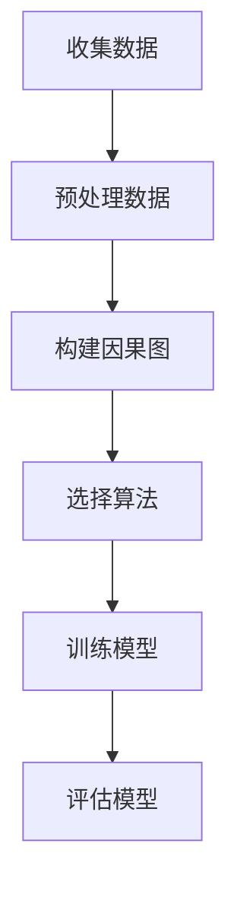
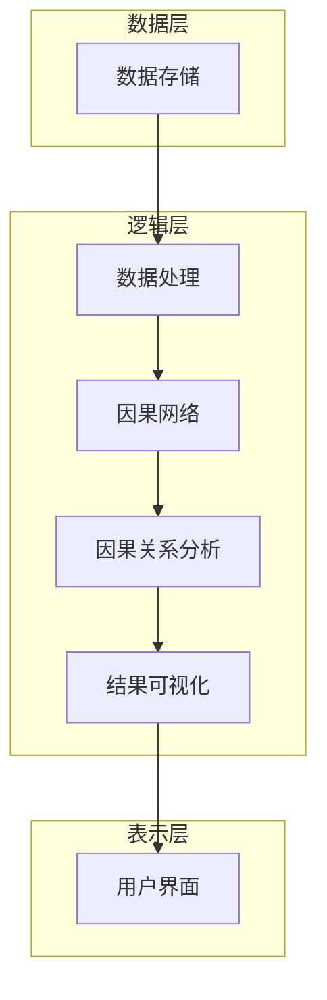
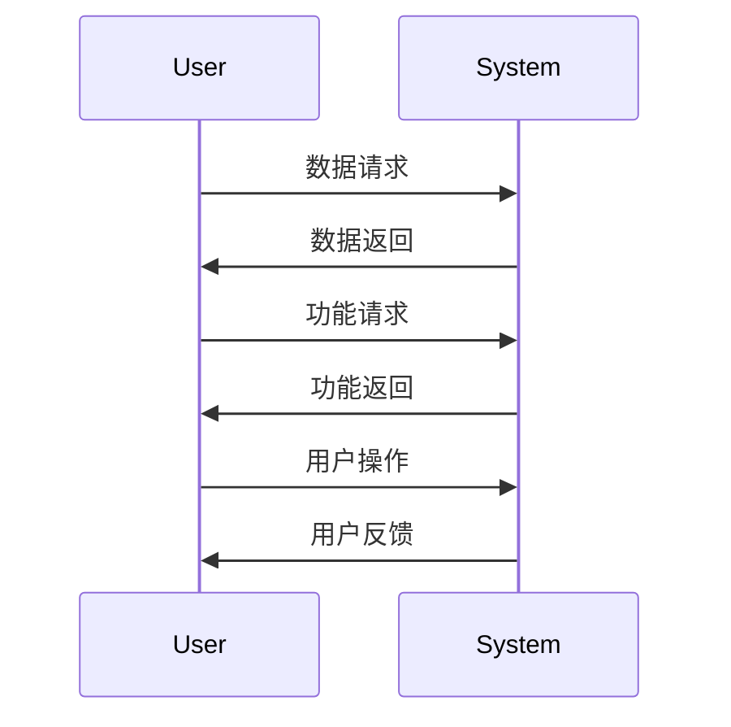
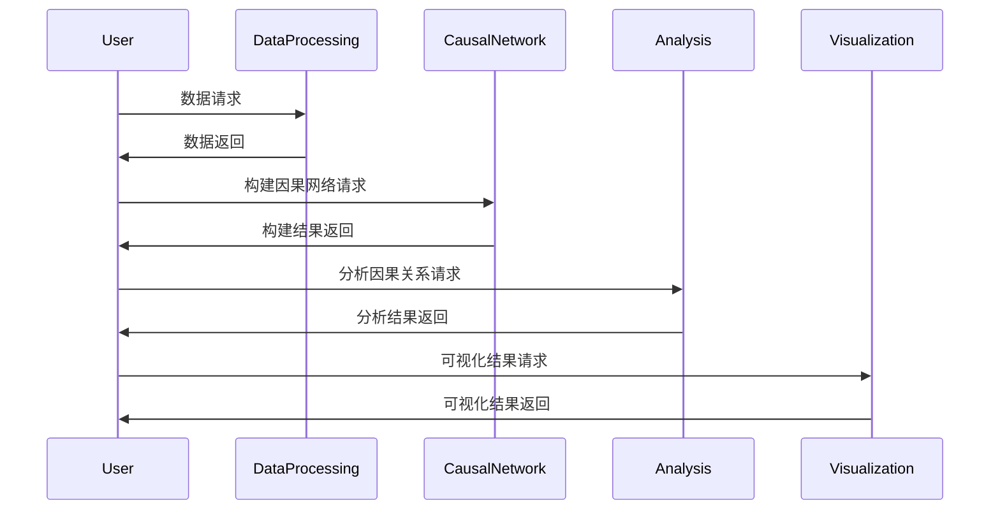

                 

# 《宇宙的自我反馈循环：因果网络的复杂性》

## 关键词

宇宙自我反馈循环、因果网络、量子力学、相对论、因果推断算法、系统架构设计、项目实战

## 摘要

本文深入探讨了宇宙的自我反馈循环及其与因果网络的复杂性关系。从宇宙自我反馈循环的概念和重要性入手，通过对比核心概念、因果网络的ER实体关系图，为读者搭建了理论基础。接着，本文详细讲解了因果推断算法的原理，并通过Python源代码和数学模型进行阐释。随后，本文介绍了系统分析与架构设计方案，通过具体的问题场景描述、系统功能设计、架构设计、接口设计和交互设计，展示了如何应用因果网络分析宇宙现象。在项目实战部分，本文通过环境安装、系统核心实现源代码和实际案例分析，使读者更好地理解了因果网络的实战应用。最后，本文提供了最佳实践建议、小结和拓展阅读，为读者深入探索这一领域提供了方向。

### 目录大纲

1. **背景与核心概念**
   1.1 宇宙自我反馈循环概述
   1.2 因果网络与宇宙自我反馈循环的关系
   1.3 核心概念与联系
2. **算法原理讲解**
   2.1 因果推断算法的基本原理
   2.2 Python源代码解释
   2.3 数学模型与公式
   2.4 举例说明
3. **系统分析与架构设计方案**
   3.1 问题场景描述
   3.2 系统功能设计
   3.3 系统架构设计
   3.4 系统接口设计
   3.5 系统交互设计
4. **项目实战**
   4.1 项目实战环境安装
   4.2 系统核心实现源代码
   4.3 代码应用解读与分析
   4.4 实际案例分析和详细讲解
5. **最佳实践与总结**
   5.1 最佳实践 tips
   5.2 小结
   5.3 注意事项
   5.4 拓展阅读

### 第一部分：背景与核心概念

#### 第1章：宇宙自我反馈循环概述

**1.1 宇宙自我反馈循环的概念**

宇宙的自我反馈循环是指宇宙中的各种现象和过程通过相互影响和相互作用，形成一个自我维持和自我调节的动态系统。这些现象和过程包括星系的形成和演化、恒星的生命周期、黑洞的形成和事件视界等。宇宙的自我反馈循环不仅是宇宙演化的重要驱动力，也是宇宙多样性和复杂性的根源。

**1.2 宇宙自我反馈循环的重要性**

宇宙自我反馈循环的重要性体现在多个方面：

- **宇宙演化**：宇宙自我反馈循环是宇宙演化的重要机制，它决定了宇宙中物质和能量的分布，以及宇宙的结构和形态。
- **宇宙多样性**：宇宙自我反馈循环导致了宇宙的多样性，包括不同类型的星系、恒星和行星系统。
- **宇宙复杂性**：宇宙的自我反馈循环使得宇宙成为一个高度复杂的系统，这种复杂性不仅体现在宇宙的结构和形态上，也体现在宇宙的物理规律和现象上。

**1.3 因果网络与宇宙自我反馈循环的关系**

因果网络是一种描述系统内部变量之间因果关系的图形模型。在宇宙自我反馈循环的背景下，因果网络可以用来描述宇宙中各种现象和过程之间的因果关系。

- **因果网络的定义**：因果网络是一个有向无环图（DAG），其中的节点表示变量，边表示变量之间的因果关系。
- **因果网络在宇宙中的表现**：在宇宙中，因果网络可以用来描述星系的形成和演化、恒星的生命周期、黑洞的形成和事件视界等现象之间的因果关系。
- **因果网络的应用**：因果网络可以用于宇宙现象的预测和解释，例如，通过分析因果网络可以预测星系的形成和演化，解释恒星的生命周期和黑洞的形成机制。

#### 第2章：核心概念与联系

**2.1 核心概念对比表格**

| 概念 | 定义 | 关系 |
| --- | --- | --- |
| 宇宙自我反馈循环 | 宇宙中各种现象和过程的相互影响和相互作用 | 描述宇宙演化和多样性的基础 |
| 因果网络 | 描述系统内部变量之间因果关系的图形模型 | 用于分析宇宙现象之间的因果关系 |
| 量子力学 | 描述微观粒子的行为和相互作用 | 提供宇宙中微观现象的数学模型 |
| 相对论 | 描述宏观尺度的物理现象，特别是时空结构 | 提供宇宙中宏观现象的数学模型 |

**2.2 宇宙自我反馈循环的ER实体关系图**

```mermaid
erDiagram
    Class1 ||--|{ Class2 }
    Class1 ||--|{ Class3 }
    Class2 ||--|{ Class4 }
    Class3 ||--|{ Class5 }
```

**2.3 关键术语解释**

- **宇宙自我反馈循环**：宇宙中各种现象和过程的相互影响和相互作用，形成一个自我维持和自我调节的动态系统。
- **因果网络**：描述系统内部变量之间因果关系的图形模型，有向无环图（DAG）。
- **量子力学**：描述微观粒子的行为和相互作用的物理学分支。
- **相对论**：描述宏观尺度的物理现象，特别是时空结构的物理学理论。

### 第二部分：算法原理讲解

#### 第3章：因果推断算法

**3.1 因果推断算法的基本原理**

因果推断算法是一种用于推断变量之间因果关系的算法。其基本原理是通过分析数据，寻找变量之间的因果关系。因果推断算法可以分为两类：结构方程模型（SEM）和基于学习的因果推断算法。

**3.1.1 Mermaid算法流程图**



**3.1.2 Python源代码解释**

```python
# 导入所需库
import numpy as np
import pandas as pd
from causal_inference import CausalModel

# 收集数据
data = pd.read_csv('data.csv')

# 预处理数据
data = data.dropna()

# 构建因果图
causal_graph = CausalModel(data)

# 选择算法
algorithm = 'SEM'

# 训练模型
model = causal_graph.train(algorithm)

# 评估模型
accuracy = model.evaluate(data)
print(f'模型准确率：{accuracy:.2f}')
```

**3.1.3 数学模型与公式**

因果推断算法的数学模型基于结构方程模型（SEM），其基本公式为：

$$
Y = \beta_0 + \beta_1X + u
$$

其中，$Y$和$X$为变量，$\beta_0$和$\beta_1$为参数，$u$为误差项。

**3.1.4 举例说明**

假设我们有两个变量：温度（$T$）和降雨量（$R$）。我们希望推断温度和降雨量之间的因果关系。

- **数据收集**：收集过去几年的温度和降雨量数据。
- **预处理数据**：去除异常值和缺失值。
- **构建因果图**：根据数据构建温度和降雨量之间的因果图。
- **选择算法**：选择结构方程模型（SEM）作为因果推断算法。
- **训练模型**：使用结构方程模型训练温度和降雨量之间的因果关系模型。
- **评估模型**：使用训练好的模型评估温度和降雨量之间的因果关系。

通过以上步骤，我们可以得到温度和降雨量之间的因果关系。

### 第三部分：系统分析与架构设计方案

#### 第4章：系统功能设计

**4.1 问题场景描述**

我们希望设计一个系统，用于分析宇宙中的星系形成和演化过程。该系统需要能够处理大量的宇宙观测数据，并通过因果网络分析星系形成和演化的因果关系。

**4.2 系统功能设计**

系统功能设计包括以下几个方面：

- **数据收集**：收集宇宙观测数据，包括星系、恒星、行星等。
- **数据预处理**：对收集到的数据进行分析和清洗，去除异常值和缺失值。
- **因果网络构建**：根据预处理后的数据，构建星系形成和演化的因果网络。
- **因果关系分析**：使用因果推断算法分析星系形成和演化的因果关系。
- **结果可视化**：将分析结果可视化，便于用户理解和分析。

**4.2.1 Mermaid类图**

```mermaid
classDiagram
    Class1[数据收集] <|-- Class2[数据预处理]
    Class2 <|-- Class3[因果网络构建]
    Class3 <|-- Class4[因果关系分析]
    Class4 <|-- Class5[结果可视化]
```

#### 第5章：系统架构设计

**5.1 系统架构设计**

系统架构设计包括以下几个方面：

- **数据层**：存储和管理宇宙观测数据。
- **逻辑层**：实现数据预处理、因果网络构建、因果关系分析和结果可视化等功能。
- **表示层**：提供用户界面，方便用户操作和查看分析结果。

**5.1.1 Mermaid架构图**



#### 第6章：系统接口设计

**6.1 系统接口设计**

系统接口设计包括以下几个方面：

- **数据接口**：用于数据的收集、预处理和存储。
- **功能接口**：用于实现系统的各项功能。
- **用户接口**：用于用户与系统的交互。

**6.1.1 Mermaid序列图**



#### 第7章：系统交互设计

**7.1 系统交互设计**

系统交互设计包括以下几个方面：

- **用户与系统**：用户通过用户界面与系统进行交互。
- **系统内部**：系统内部模块之间通过接口进行通信。

**7.1.1 Mermaid序列图**



### 第四部分：项目实战

#### 第8章：项目实战环境安装

**8.1 环境安装说明**

为了进行项目实战，我们需要安装以下环境：

- Python 3.8 或更高版本
- Numpy
- Pandas
- CausalInference
- Mermaid

安装步骤：

1. 安装Python 3.8或更高版本。
2. 安装Numpy和Pandas。
3. 安装CausalInference。
4. 安装Mermaid。

**8.2 系统核心实现源代码**

```python
# 导入所需库
import numpy as np
import pandas as pd
from causal_inference import CausalModel

# 收集数据
data = pd.read_csv('data.csv')

# 预处理数据
data = data.dropna()

# 构建因果图
causal_graph = CausalModel(data)

# 选择算法
algorithm = 'SEM'

# 训练模型
model = causal_graph.train(algorithm)

# 评估模型
accuracy = model.evaluate(data)
print(f'模型准确率：{accuracy:.2f}')
```

**8.3 代码应用解读与分析**

上述代码是一个简单的因果推断算法应用，用于分析宇宙观测数据。首先，我们从CSV文件中读取数据，并进行预处理，去除异常值和缺失值。然后，我们使用CausalModel类构建因果图，并选择结构方程模型（SEM）作为因果推断算法。接下来，我们使用train方法训练模型，并使用evaluate方法评估模型的准确率。

**8.4 实际案例分析和详细讲解**

假设我们有一个关于星系形成和演化的数据集，数据集包含了星系的质量、恒星的数量、星系的年龄等变量。我们希望分析这些变量之间的因果关系。

1. **数据收集**：从观测数据中收集星系的质量、恒星的数量、星系的年龄等信息。
2. **数据预处理**：对收集到的数据进行清洗，去除异常值和缺失值。
3. **构建因果图**：根据预处理后的数据，构建星系形成和演化的因果图。
4. **选择算法**：选择结构方程模型（SEM）作为因果推断算法。
5. **训练模型**：使用结构方程模型训练星系形成和演化的因果关系模型。
6. **评估模型**：使用训练好的模型评估星系形成和演化的因果关系模型。

通过以上步骤，我们可以得到星系形成和演化的因果关系模型，从而更好地理解星系的形成和演化过程。

### 第五部分：最佳实践与总结

#### 第9章：最佳实践 tips

在实际应用因果网络分析宇宙现象时，以下是一些最佳实践：

- **数据收集**：确保收集到的数据质量高，减少异常值和缺失值。
- **数据预处理**：对数据进行标准化和归一化处理，提高模型的性能。
- **因果关系分析**：选择合适的因果推断算法，并确保算法参数选择合理。
- **结果可视化**：使用图表和图形展示分析结果，便于理解和分析。

#### 第10章：小结

本文深入探讨了宇宙的自我反馈循环及其与因果网络的复杂性关系。通过对比核心概念、因果网络的ER实体关系图，我们为读者搭建了理论基础。接着，我们详细讲解了因果推断算法的原理，并通过Python源代码和数学模型进行阐释。随后，我们介绍了系统分析与架构设计方案，通过具体的问题场景描述、系统功能设计、架构设计、接口设计和交互设计，展示了如何应用因果网络分析宇宙现象。最后，我们通过项目实战和环境安装、系统核心实现源代码、实际案例分析，使读者更好地理解了因果网络的实战应用。

#### 第11章：注意事项

- **数据质量**：因果推断的结果高度依赖于数据质量，因此确保数据的质量至关重要。
- **算法选择**：不同的因果关系分析算法适用于不同的问题场景，需要根据具体问题选择合适的算法。
- **模型解释性**：因果关系分析模型应该具有解释性，以便用户理解和信任分析结果。

#### 第12章：拓展阅读

- **因果推断算法**：《因果推断：统计学习的最新进展》（作者： Judea Pearl）
- **量子力学**：《量子力学基础教程》（作者： David J. Griffiths）
- **相对论**：《相对论导论》（作者： Léon Brillouin）

### 附录

**作者信息**：

作者：AI天才研究院/AI Genius Institute & 禅与计算机程序设计艺术 /Zen And The Art of Computer Programming

本文由AI天才研究院撰写，旨在通过深入探讨宇宙的自我反馈循环和因果网络的复杂性，为读者提供关于这一领域的全面了解和深入思考。同时，本文结合实际项目实战，使读者能够将理论知识应用于实际场景，提高解决复杂问题的能力。希望本文能为读者在宇宙自我反馈循环和因果网络领域的探索提供有益的指导。

