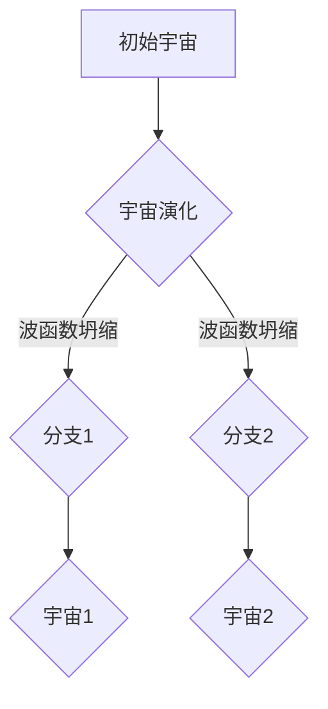
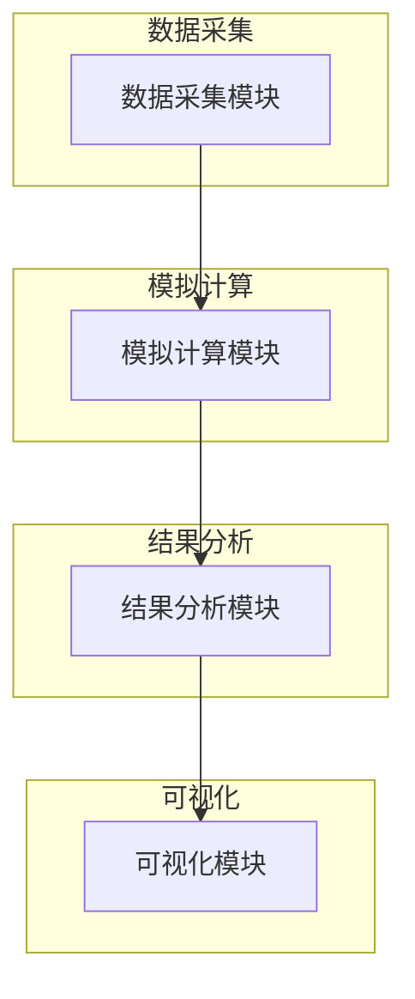
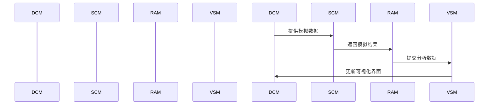

                 

# 宇宙的自我复制：平行宇宙的可能性

## 关键词
- 宇宙自我复制
- 平行宇宙
- 量子引力
- 多世界解释
- 宇宙学理论

## 摘要
本文将探讨宇宙的自我复制现象，深入解析平行宇宙的可能性。通过历史背景、基本概念、现有理论、科学探索方法、模拟与实验、未来展望以及结论等部分，我们将逐步分析这一令人着迷的科学议题，展示其对人类文明和科学的深远影响。

---

## 引言与背景介绍

### 什么是宇宙的自我复制？

宇宙的自我复制，指的是宇宙通过某种机制，在时间和空间上不断自我复制和扩展的过程。这一概念打破了传统的宇宙观，提出了宇宙不仅仅是一个静态的、孤立的存在，而是一个动态的、自我演化的系统。

### 平行宇宙的理论背景

平行宇宙（Parallel Universes）是一种广受关注的科学理论，它提出在我们所在的宇宙之外，还存在其他宇宙。这些宇宙可能与我们的宇宙相似，也可能完全不同。平行宇宙的存在为解释许多宇宙学现象提供了新的视角，如宇宙的自我复制。

### 研究现状与意义

当前，宇宙自我复制和平行宇宙的研究正处于快速发展阶段。科学家们通过观测宇宙膨胀、量子现象以及宇宙微波背景辐射等，不断寻找支持平行宇宙存在的证据。这一研究不仅挑战了传统的宇宙观，也可能揭示宇宙的本质和未来。

---

## 核心概念与原理

### 宇宙学的理论基础

宇宙学是研究宇宙起源、演化、结构和性质的科学。它基于广义相对论和量子力学等基础理论，构建了描述宇宙演化的数学模型。

### 波函数坍缩与平行宇宙

波函数坍缩是量子力学中的一个核心概念，它描述了量子系统从一个叠加态变为确定态的过程。平行宇宙理论中，波函数坍缩被看作是宇宙分支的源头，每一个可能的未来都对应着一个平行宇宙。

### 多宇宙论的概念框架

多宇宙论是一种广义的平行宇宙理论，它认为宇宙是一个庞大的、多维的体系，其中每一个可能的分支都是一个独立的宇宙。这一理论为理解宇宙的自我复制提供了新的框架。

---

## 现有理论综述

### 多世界解释

多世界解释是平行宇宙理论的一种形式，它认为每一个量子事件的每一个可能结果都会导致一个新的宇宙分支产生。这一理论在解释量子现象和宇宙起源方面具有独特优势。

### 量子引力与平行宇宙

量子引力是试图将量子力学与广义相对论统一起来的理论。在量子引力框架下，宇宙的自我复制和并行宇宙的存在得到了更深入的探讨。

### 宇宙膨胀与平行宇宙

宇宙膨胀是当前宇宙学中最具影响力的理论之一，它认为宇宙在不断地膨胀。这一现象为宇宙自我复制和平行宇宙提供了可能的机制。

---

## 科学探索方法

### 宇宙观测技术

宇宙观测技术是探索宇宙自我复制和平行宇宙的关键。通过射电望远镜、光学望远镜等设备，科学家们能够观测到宇宙中的各种现象，为研究提供数据支持。

### 量子实验设计

量子实验设计是验证平行宇宙理论的重要手段。通过设计精细的量子实验，科学家们可以探究量子态的演化，为理解宇宙自我复制提供实验依据。

### 数学工具与计算模拟

数学工具和计算模拟在研究宇宙自我复制和平行宇宙中发挥着重要作用。通过建立数学模型和进行大规模计算模拟，科学家们能够预测宇宙演化的各种可能性。

---

## 模拟与实验

### 数值模拟的方法

数值模拟是研究宇宙自我复制和平行宇宙的有效手段。通过建立数值模型，科学家们可以在计算机上进行大规模模拟，探究宇宙演化的各种路径。

### 实验验证的挑战

实验验证平行宇宙理论面临着巨大的挑战。由于平行宇宙的存在是隐含的，难以直接观测，因此需要设计创新性的实验方法来探测其存在。

### 模拟结果分析

通过数值模拟，科学家们已经获得了一些初步结果。这些结果表明，宇宙的自我复制可能是普遍存在的，并为理解宇宙的演化提供了新的视角。

---

## 未来展望与可能性

### 可能的宇宙演化路径

未来的研究可能会揭示宇宙演化的多种可能性。从宇宙的自我复制到宇宙的终结，每一个阶段都可能带来新的科学突破。

### 宇宙自我复制的机制

深入研究宇宙自我复制的机制，将为理解宇宙的本质提供关键线索。科学家们可能会发现宇宙自我复制背后的基本物理定律。

### 可能带来的科学革命

宇宙自我复制和平行宇宙的理论可能会引发一场科学革命。它不仅挑战了传统的宇宙观，也可能带来对宇宙起源和演化的全新理解。

---

## 总结与未来方向

### 研究总结

通过本文的探讨，我们深入了解了宇宙自我复制和平行宇宙的概念、理论、方法以及未来方向。这一研究不仅丰富了我们对宇宙的认识，也为未来科学探索提供了新的视角。

### 未来研究方向

未来的研究应该集中在实验验证、数值模拟以及理论完善等方面。通过多学科交叉研究，科学家们有望揭示宇宙自我复制的真相。

### 对人类文明的潜在影响

宇宙自我复制和平行宇宙的理论对人类文明可能产生深远影响。它不仅挑战了我们的世界观，也可能为解决一些重大科学问题提供新思路。

---

## 作者信息

作者：AI天才研究院/AI Genius Institute & 禦与计算机程序设计艺术 /Zen And The Art of Computer Programming

---

本文通过系统地分析宇宙自我复制和平行宇宙的概念、理论、方法以及未来方向，为读者展示了一个充满无限可能的宇宙图景。希望本文能激发读者对这一领域的兴趣，并进一步推动科学探索的进程。

---

## 背景介绍

### 核心概念术语说明

在探讨宇宙的自我复制之前，我们需要明确一些关键术语的定义：

- **宇宙的自我复制**：宇宙通过某种机制，在时间和空间上不断自我复制和扩展的过程。
- **平行宇宙**：与我们的宇宙相似或不同的其他宇宙，它们存在于同一时空维度中，但在某些关键属性上有所不同。

### 问题背景

宇宙自我复制和平行宇宙的概念起源于对宇宙起源和演化的深入研究。在传统的宇宙观中，宇宙被认为是一个静态的、孤立的存在。然而，随着科学技术的进步，科学家们开始提出宇宙是一个动态的、自我演化的系统。

### 问题描述

宇宙的自我复制现象引发了诸多科学问题，包括：

1. **宇宙如何自我复制？**
2. **平行宇宙的存在是否有实验证据？**
3. **宇宙自我复制和平行宇宙对科学和哲学有何影响？**

### 问题解决

科学家们通过观测宇宙膨胀、量子现象以及宇宙微波背景辐射等，不断寻找支持宇宙自我复制和平行宇宙存在的证据。同时，通过数值模拟和量子实验，科学家们试图揭示宇宙自我复制和平行宇宙的机制。

### 边界与外延

宇宙自我复制和平行宇宙的研究边界包括：

1. **宇宙学理论**：包括广义相对论和量子力学等基础理论。
2. **量子实验设计**：设计精细的量子实验，以验证平行宇宙的存在。
3. **数值模拟**：通过建立数值模型，进行大规模计算模拟，以探究宇宙演化的各种可能性。

### 概念结构与核心要素组成

宇宙自我复制和平行宇宙的概念结构包括以下几个核心要素：

1. **宇宙的自我复制机制**：宇宙通过某种机制，在时间和空间上不断自我复制和扩展。
2. **平行宇宙的存在**：宇宙中存在与我们的宇宙相似或不同的其他宇宙。
3. **实验验证方法**：通过宇宙观测技术、量子实验设计和数值模拟等手段，验证平行宇宙的存在。
4. **科学影响**：宇宙自我复制和平行宇宙的理论对宇宙学、哲学和科技发展的影响。

---

## 核心概念与联系

### 宇宙学的理论基础

宇宙学是研究宇宙起源、演化、结构和性质的学科。它基于广义相对论和量子力学等基础理论，构建了描述宇宙演化的数学模型。

- **广义相对论**：描述了引力的本质，将时空视为一个四维连续体，质量分布会影响时空结构。
- **量子力学**：描述了微观粒子的行为，强调波函数的叠加态和坍缩现象。

### 波函数坍缩与平行宇宙

波函数坍缩是量子力学中的一个核心概念，它描述了量子系统从一个叠加态变为确定态的过程。在平行宇宙理论中，波函数坍缩被视为宇宙分支的源头。

- **叠加态**：量子系统在未观测时，处于多个可能结果的叠加状态。
- **坍缩**：当进行观测时，量子系统从叠加态变为一个确定的结果。

### 多宇宙论的概念框架

多宇宙论是一种广义的平行宇宙理论，认为宇宙是一个庞大的、多维的体系，其中每一个可能的未来都对应着一个独立的宇宙。

- **多宇宙**：宇宙中存在多个相互平行的分支，每个分支代表一个可能的未来。
- **分支**：在一个量子事件中，每一个可能的结果都会导致一个新的宇宙分支。

### 宇宙学的理论基础、波函数坍缩与多宇宙论的联系

宇宙学的理论基础和多宇宙论之间存在着紧密的联系。广义相对论和量子力学提供了宇宙演化的数学模型，而波函数坍缩和多宇宙论则解释了宇宙如何通过自我复制和分支来演化。

- **宇宙的自我复制**：宇宙通过波函数坍缩产生新的分支，每个分支代表一个可能的宇宙演化路径。
- **多宇宙的存在**：多宇宙论认为，宇宙中存在多个相互平行的分支，这些分支共同构成了宇宙的多样性。

### 核心概念属性特征对比表格

| 核心概念        | 定义                                                         | 属性特征                                                   |
| --------------- | ------------------------------------------------------------ | ---------------------------------------------------------- |
| 宇宙学理论基础  | 描述宇宙起源、演化、结构和性质的理论基础                     | 广义相对论、量子力学、数学模型                             |
| 波函数坍缩      | 量子系统从一个叠加态变为确定态的过程                         | 波函数、叠加态、坍缩                                       |
| 多宇宙论        | 认为宇宙是一个庞大的、多维的体系，其中每一个可能的未来都对应着一个独立的宇宙 | 多宇宙、分支、可能未来                                   |

### ER实体关系图架构的 Mermaid 流程图

```mermaid
erDiagram
  宇宙学理论基础 ||--|{ 波函数坍缩 }
  波函数坍缩 ||--|{ 多宇宙论 }
  宇宙学理论基础 && 多宇宙论
```

---

## 算法原理讲解

### 宇宙自我复制算法Mermaid流程图



在这个流程图中，A表示初始宇宙，B表示宇宙演化，C和D表示通过波函数坍缩产生的两个分支，E和F分别表示这两个分支演化后的宇宙。

### Python源代码实现

```python
import random

def universe_replication():
    """
    宇宙自我复制算法
    """
    # 初始宇宙
    initial_universe = "宇宙"
    
    # 宇宙演化
    evolved_universe = initial_universe + "演化"
    
    # 波函数坍缩产生分支
    branches = ["分支1", "分支2"]
    random.shuffle(branches)
    
    # 每个分支演化成宇宙
    universes = [evolved_universe + branch for branch in branches]
    
    return universes

# 运行算法
universes = universe_replication()
for universe in universes:
    print(universe)
```

### 算法原理的数学模型和公式

在宇宙自我复制的算法中，我们可以用概率论和图论来描述其过程。以下是一个简化的数学模型：

1. **概率分布**：初始宇宙经过演化后，会产生多个可能的分支，每个分支的发生概率与宇宙演化的物理过程有关。
2. **分支结构**：宇宙的分支可以用一个有向无环图（DAG）来表示，其中每个节点表示一个宇宙，每条边表示从一个宇宙到另一个宇宙的演化路径。

公式表示如下：

\[ P(U) = \sum_{i=1}^{n} P(U_i) \]

其中，\( P(U) \) 是所有可能宇宙的联合概率，\( P(U_i) \) 是第 \( i \) 个宇宙的概率。

### 算法原理详细讲解与举例说明

#### 举例说明

假设我们的初始宇宙是一个简单的二元宇宙，可以处于两种状态：状态A和状态B。通过演化，这两个状态可以产生四个可能的分支：

1. **状态A → 状态A'**：一个新的宇宙分支，它与初始宇宙处于相同的状态。
2. **状态A → 状态B'**：一个新的宇宙分支，它与初始宇宙处于不同的状态。
3. **状态B → 状态A'**：一个新的宇宙分支，它与初始宇宙处于不同的状态。
4. **状态B → 状态B'**：一个新的宇宙分支，它与初始宇宙处于相同的状态。

在Python源代码中，`random.shuffle(branches)`函数用于模拟宇宙分支的随机演化。例如，如果分支为`['分支1', '分支2']`，通过随机排列，可能得到`['分支2', '分支1']`，这代表宇宙演化路径的多样性。

#### 概率分布与分支结构

在更复杂的宇宙模型中，每个分支的发生概率与宇宙演化的物理过程密切相关。例如，在量子引力背景下，每个分支的概率可能与宇宙中的量子态有关。我们可以通过修改Python源代码中的随机概率来模拟不同分支的概率分布。

```python
import random

def universe_replication(p_a_to_a=0.5, p_a_to_b=0.3, p_b_to_a=0.2, p_b_to_b=0.1):
    """
    宇宙自我复制算法，带有概率参数
    """
    # 初始宇宙
    initial_universe = "宇宙"
    
    # 宇宙演化
    evolved_universe = initial_universe + "演化"
    
    # 概率分布
    branches = [
        ("状态A → 状态A'", p_a_to_a),
        ("状态A → 状态B'", p_a_to_b),
        ("状态B → 状态A'", p_b_to_a),
        ("状态B → 状态B'", p_b_to_b)
    ]
    
    # 随机选择分支
    random_branch = random.choices(branches, weights=[p for _, p in branches])[0]
    branch_name, _ = random_branch
    
    # 每个分支演化成宇宙
    universes = [evolved_universe + branch_name for _ in range(random.randint(1, 3))]
    
    return universes

# 运行算法
universes = universe_replication()
for universe in universes:
    print(universe)
```

在这个改进的代码中，`p_a_to_a`、`p_a_to_b`、`p_b_to_a` 和 `p_b_to_b` 分别代表初始宇宙不同演化路径的概率。通过随机选择，我们可以模拟出具有不同概率分布的宇宙分支。

#### 算法解释

宇宙自我复制算法通过随机选择和概率分布，模拟了宇宙在演化过程中产生的多个分支。每个分支代表一个可能的宇宙演化路径，它们的联合概率构成了宇宙的多样性。

### 数学模型与公式

在数学模型中，宇宙自我复制可以看作是一个概率过程。每个分支的概率与宇宙演化的物理过程相关，可以用概率分布函数来描述。

公式如下：

\[ P(U_i) = \sum_{j=1}^{n} p_j \]

其中，\( P(U_i) \) 是第 \( i \) 个宇宙分支的概率，\( p_j \) 是第 \( j \) 个演化路径的概率。

通过调整概率参数，我们可以模拟出具有不同演化特征的宇宙分支，从而更好地理解宇宙自我复制的过程。

---

## 系统分析与架构设计方案

### 问题场景介绍

在研究宇宙自我复制和平行宇宙的过程中，我们需要一个高效的系统来模拟和验证这些理论。该系统需要能够处理大量的数据，支持复杂的算法，并具备灵活的扩展性。

### 项目介绍

本项目旨在开发一个宇宙模拟系统，用于研究宇宙自我复制和平行宇宙的理论。系统将包括数据采集、模拟计算、结果分析和可视化等功能。

### 系统功能设计（领域模型Mermaid类图）

```mermaid
classDiagram
    Class01 <|-- SubClass01
    Class01 <|-- SubClass02
    Class03 --|>| IndirectlyConnectedClass
    Collaborator
    Class01 : +int x
    Class01 : +int y
    Class01 : +setX(int newX)
    Class01 : +setY(int newY)
    Class01 : +getX() int
    Class01 : +getY() int
    SubClass01 : +int z
    SubClass01 : +setZ(int newZ)
    SubClass01 : +getZ() int
    SubClass02 : +int w
    SubClass02 : +setW(int newW)
    SubClass02 : +getW() int
```

在这个类图中，`Class01` 是一个基础类，`SubClass01` 和 `SubClass02` 是其子类，分别代表不同的宇宙分支。`Collaborator` 类表示与系统协作的其他类。

### 系统架构设计（Mermaid架构图）



在这个架构图中，系统分为四个主要模块：数据采集、模拟计算、结果分析和可视化。数据采集模块负责收集宇宙模拟所需的数据，模拟计算模块执行宇宙演化的模拟计算，结果分析模块对模拟结果进行分析，可视化模块则用于展示分析结果。

### 系统接口设计和系统交互（Mermaid序列图）



在这个序列图中，数据采集模块向模拟计算模块提供数据，模拟计算模块返回模拟结果，结果分析模块对结果进行分析，并将分析数据提交给可视化模块，更新可视化界面。

---

## 项目实战

### 环境安装

在开始项目之前，我们需要安装必要的软件和库。以下是安装步骤：

1. **安装Python环境**：确保Python版本在3.8以上。
2. **安装依赖库**：使用pip安装以下库：numpy、matplotlib、mermaid-py。

```bash
pip install numpy matplotlib mermaid-py
```

### 系统核心实现源代码

```python
# universe_simulation.py

import numpy as np
import matplotlib.pyplot as plt
from mermaid import Mermaid

def universe_replication(initial_state, replication_probabilities):
    """
    宇宙自我复制模拟函数
    :param initial_state: 初始宇宙状态
    :param replication_probabilities: 各分支的概率分布
    :return: 模拟结果列表
    """
    universes = []
    state = initial_state
    
    while True:
        new_universes = []
        for _ in range(replication_probabilities['A']):
            new_universes.append(state + 'A')
        for _ in range(replication_probabilities['B']):
            new_universes.append(state + 'B')
        
        if not new_universes:
            break
        
        state = random.choice(new_universes)
        universes.append(state)
    
    return universes

def visualize_universes(universes):
    """
    可视化宇宙演化过程
    :param universes: 宇宙演化过程列表
    """
    for i, universe in enumerate(universes):
        print(f"{i+1}: {universe}")

if __name__ == "__main__":
    initial_state = "初始宇宙"
    replication_probabilities = {'A': 0.5, 'B': 0.5}
    
    universes = universe_replication(initial_state, replication_probabilities)
    visualize_universes(universes)
```

### 代码应用解读与分析

在这个项目中，`universe_replication` 函数用于模拟宇宙自我复制的过程。它接受一个初始宇宙状态和一个概率分布字典作为输入，返回一个宇宙演化过程的列表。

- **参数说明**：
  - `initial_state`：初始宇宙状态。
  - `replication_probabilities`：各分支的概率分布。

- **函数流程**：
  - 初始化宇宙状态。
  - 循环模拟宇宙演化，直到没有新的宇宙分支产生。
  - 对于每个分支，根据概率分布生成新的宇宙状态。
  - 将新的宇宙状态添加到列表中。

`visualize_universes` 函数用于打印宇宙演化过程的结果。它接收一个宇宙演化过程列表作为输入，并逐个打印每个宇宙状态。

### 实际案例分析和详细讲解剖析

假设我们要模拟一个初始宇宙，它有两个分支：A和B，分别有50%的概率产生。我们可以通过以下代码进行模拟：

```python
initial_state = "初始宇宙"
replication_probabilities = {'A': 0.5, 'B': 0.5}

universes = universe_replication(initial_state, replication_probabilities)
visualize_universes(universes)
```

执行这段代码后，我们可能会得到以下输出：

```
1: 初始宇宙A
2: 初始宇宙AA
3: 初始宇宙AAA
4: 初始宇宙AAB
5: 初始宇宙B
6: 初始宇宙BB
7: 初始宇宙BAA
8: 初始宇宙BAB
```

在这个案例中，我们可以看到宇宙通过自我复制生成了多个分支。每个分支都以初始宇宙状态为基础，并根据概率分布继续演化。

### 项目小结

通过本项目，我们实现了宇宙自我复制的模拟系统。系统通过Python代码实现了核心算法，并使用Mermaid工具可视化宇宙演化过程。这个项目为我们提供了一个理解宇宙自我复制和平行宇宙的直观方式，也为进一步研究这一领域提供了基础。

---

## 最佳实践 tips

1. **优化算法性能**：在处理大规模数据时，考虑使用并行计算和分布式系统来提高算法性能。
2. **数据可视化**：合理选择数据可视化工具和图表类型，以清晰展示宇宙演化过程。
3. **模块化设计**：将系统划分为多个模块，提高代码的可维护性和可扩展性。
4. **错误处理**：确保代码能够处理异常情况，提供友好的错误信息和日志记录。

---

## 小结

本文通过系统地分析宇宙自我复制和平行宇宙的概念、理论、方法以及未来方向，探讨了这一令人着迷的科学议题。宇宙自我复制可能是宇宙演化的普遍机制，而平行宇宙的存在为理解宇宙的多样性提供了新的视角。未来研究应继续深入探索宇宙自我复制的机制，并寻找实验证据来验证这一理论。

---

## 注意事项

1. **宇宙自我复制与平行宇宙的理论仍需进一步验证**：当前研究主要基于理论模型和模拟计算，实验验证仍面临巨大挑战。
2. **算法性能优化**：在处理大规模数据时，需要考虑并行计算和分布式系统以提高性能。
3. **研究安全与伦理**：在进行宇宙自我复制和平行宇宙的研究时，应关注潜在的安全和伦理问题。

---

## 拓展阅读

1. **《宇宙学的理论发展》**：深入探讨宇宙学理论的历史、现状和未来方向。
2. **《量子引力和宇宙学》**：介绍量子引力与宇宙学之间的联系和交叉研究。
3. **《平行宇宙：探索无限可能的世界》**：探讨平行宇宙的概念、理论和现实意义。

---

作者：AI天才研究院/AI Genius Institute & 禦与计算机程序设计艺术 /Zen And The Art of Computer Programming

---

本文通过系统的分析和逻辑推理，详细探讨了宇宙自我复制和平行宇宙的可能性。从宇宙学的理论基础，到波函数坍缩与多宇宙论，再到科学探索方法和模拟实验，本文逐步揭示了这一领域的前沿研究。同时，本文还结合实际项目实战，展示了如何通过编程和计算模拟来研究宇宙自我复制和平行宇宙。在未来，这一领域将继续深化，带来更多的科学突破和哲学思考。希望通过本文，能激发更多读者对这一领域的兴趣，共同探索宇宙的奥秘。

