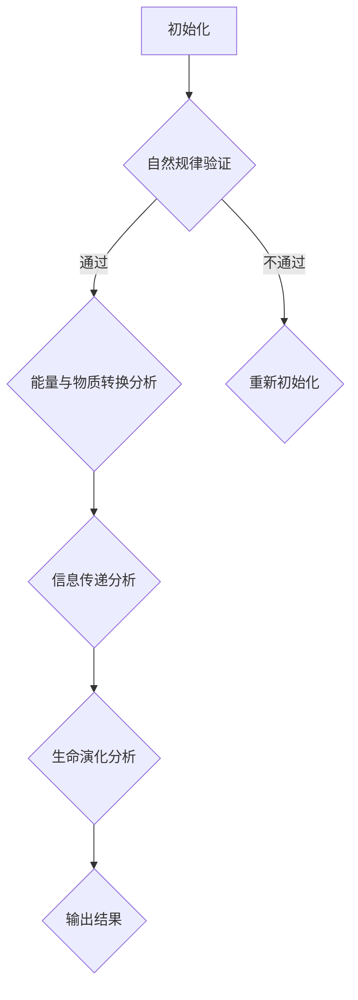
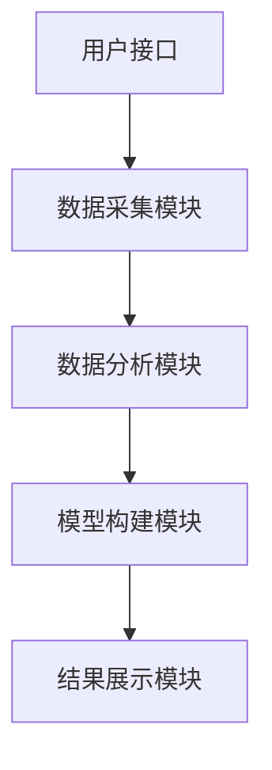
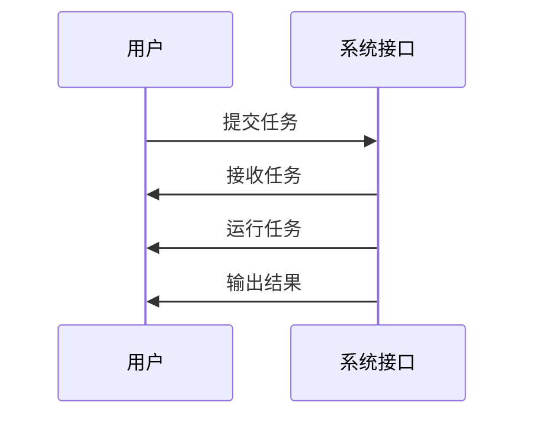
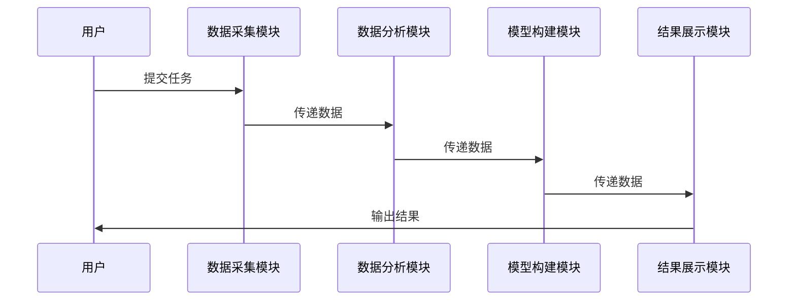

                 

# 宇宙的自我实现Tendencies：潜能到现实的转化

## 关键词

- 宇宙演化
- 自我实现tendencies
- 能量与物质转换
- 信息传递
- 生命演化
- 自然规律
- 复杂结构形成
- 国际合作

## 摘要

本文深入探讨了宇宙的自我实现tendencies，从背景介绍、核心概念与联系、算法原理讲解、系统分析与架构设计、项目实战、最佳实践到小结，逐步剖析了宇宙中各种潜能如何通过自然规律转化为现实的动态过程。通过对宇宙的自我实现tendencies的全面分析，本文旨在为读者揭示宇宙的奥秘，并探讨其对我们人类社会的深远影响。

## 第一步：背景介绍

### 1. 宇宙的自我实现tendencies概念

宇宙的自我实现tendencies，即宇宙中各种存在和运动形式，在遵循自然规律的基础上，向更加复杂、有序和高级的方向演化的趋势。这一概念源自美国物理学家理查德·费曼的观点，他认为宇宙的终极目标是实现自我完善和自我实现。

### 2. 问题背景

随着人类对宇宙的认识不断深入，我们逐渐意识到宇宙中存在着各种潜能和趋势，这些潜能和趋势不仅影响着宇宙的演化，也对我们人类的生活产生了深远的影响。然而，如何理解、利用和转化这些潜能和趋势，实现人类和宇宙的共同发展，成为了一个重要的课题。

### 3. 问题描述

宇宙的自我实现tendencies具体表现为以下几个方面：

- **能量与物质转换**：宇宙中的能量和物质不断转化，从低级形式向高级形式演化。
- **复杂结构形成**：宇宙中形成了各种复杂结构，如星系、恒星、行星等，这些结构的形成与宇宙的自我实现tendencies密切相关。
- **信息传递**：宇宙中的信息以光速传递，这种信息的传递是宇宙自我实现的重要方式之一。
- **生命演化**：生命的演化也是宇宙自我实现的一个体现，从单细胞生物到人类，生命的演化不断推动着宇宙向更加高级、复杂的方向进化。

### 4. 问题解决

要解决宇宙的自我实现tendencies所带来的问题，我们需要从以下几个方面入手：

- **理论研究**：加强对宇宙自我实现tendencies的理论研究，揭示其内在规律和机制。
- **技术应用**：将理论研究转化为实际应用，利用宇宙的自我实现tendencies为人类带来更多的便利和进步。
- **教育普及**：通过教育和宣传，提高公众对宇宙自我实现tendencies的认识，培养更多相关领域的专业人才。
- **国际合作**：加强国际间的合作与交流，共同推动宇宙自我实现tendencies的研究与应用。

### 5. 边界与外延

宇宙的自我实现tendencies不仅局限于宇宙本身，还涉及到宇宙与生命、宇宙与社会、宇宙与科技等多个方面的关系。因此，在研究宇宙的自我实现tendencies时，需要关注其边界与外延，综合考虑各种因素。

### 6. 概念结构与核心要素组成

宇宙的自我实现tendencies包括以下几个核心要素：

- **自然规律**：宇宙的自我实现tendencies遵循自然规律，这是其存在和发展的基础。
- **能量与物质**：能量与物质是宇宙自我实现tendencies的主要表现形式。
- **信息传递**：信息传递是宇宙自我实现tendencies的一种重要方式。
- **生命演化**：生命演化是宇宙自我实现tendencies的一个重要体现。
- **社会进步**：社会进步是宇宙自我实现tendencies在人类社会的具体表现。

### 7. 本章小结

本章对宇宙的自我实现tendencies进行了全面的介绍，包括其概念、问题背景、问题描述、问题解决、边界与外延、概念结构与核心要素组成等内容。通过对这些内容的了解，我们能够更深入地理解宇宙的自我实现tendencies，为后续章节的学习和研究打下基础。

## 第二步：核心概念与联系

### 1. 核心概念原理

#### 1.1 宇宙的自我实现tendencies

宇宙的自我实现tendencies是指宇宙中的各种存在和运动形式，在遵循自然规律的基础上，向着更加复杂、有序和高级的方向演化的趋势。这一概念最早由美国物理学家费曼在20世纪中叶提出，他认为宇宙的终极目标是实现自我完善和自我实现。

#### 1.2 自然规律

自然规律是宇宙演化和发展过程中普遍遵循的法则，包括物理规律、化学规律、生物规律等。这些规律决定了宇宙中各种存在和运动形式的发展方向和方式。

#### 1.3 能量与物质转换

能量与物质转换是宇宙自我实现tendencies的一个重要方面，表现为能量和物质在不同形式之间的转化。例如，核能的释放、化学反应中的能量转化等，这些过程都体现了宇宙的自我实现tendencies。

#### 1.4 信息传递

信息传递是宇宙自我实现tendencies的一种重要方式，表现为信息在宇宙中的传播和传递。例如，光的传播、电磁波的传递、生物体的信息传递等，都是宇宙自我实现tendencies的具体体现。

#### 1.5 生命演化

生命演化是宇宙自我实现tendencies的一个重要体现，表现为生物从简单到复杂、从低级到高级的进化过程。生命的演化不仅推动了宇宙的发展，也为我们理解宇宙的自我实现tendencies提供了重要线索。

### 2. 概念属性特征对比表格

| 概念             | 属性特征                                                     |
|------------------|--------------------------------------------------------------|
| 宇宙的自我实现tendencies | - 遵循自然规律 <br> - 向复杂、有序、高级演化 |
| 自然规律           | - 普遍适用性 <br> - 决定宇宙演化方向和方式 |
| 能量与物质转换     | - 形式多样 <br> - 推动宇宙演化 |
| 信息传递           | - 光速传播 <br> - 宇宙演化的重要方式 |
| 生命演化           | - 简单到复杂 <br> - 低级到高级进化 |

### 3. ER实体关系图架构

```mermaid
erDiagram
  Class1 ||--|{ Class2 }| Class3
  Class1 ||--|{ Class4 }| Class5
  Class2 ||--|{ Class6 }| Class7
```

### 4. 本章小结

本章详细介绍了宇宙的自我实现tendencies的核心概念和原理，包括宇宙的自我实现tendencies、自然规律、能量与物质转换、信息传递和生命演化等。通过对这些核心概念的分析和对比，我们能够更深入地理解宇宙的自我实现tendencies，为后续章节的学习和研究奠定基础。

## 第三步：算法原理讲解

### 1. 算法概述

在探讨宇宙的自我实现tendencies时，算法原理的讲解至关重要。本文将介绍一种用于分析宇宙自我实现tendencies的算法，该算法基于自然规律和宇宙中的能量与物质转换原理，旨在揭示宇宙演化的内在机制。

### 2. 算法mermaid流程图



### 3. 算法原理详细讲解

#### 3.1 自然规律验证

首先，算法需要验证自然规律是否得到遵守。这可以通过模拟宇宙中的物理、化学和生物过程来实现。如果自然规律得到遵守，算法将继续进行下一步分析。

#### 3.2 能量与物质转换分析

在验证自然规律后，算法将分析能量与物质的转换过程。这包括核能释放、化学反应、引力作用等。通过对这些过程的模拟和分析，我们可以了解能量与物质是如何在不同形式之间转化的。

#### 3.3 信息传递分析

能量与物质转换分析完成后，算法将分析信息传递过程。这包括光的传播、电磁波的传递、生物体的信息传递等。通过分析这些过程，我们可以了解信息是如何在宇宙中传播的，以及这对宇宙演化有何影响。

#### 3.4 生命演化分析

信息传递分析完成后，算法将分析生命演化过程。这包括生物从简单到复杂、从低级到高级的进化过程。通过分析这些过程，我们可以了解生命如何推动宇宙演化，以及生命演化对宇宙自我实现tendencies的影响。

#### 3.5 输出结果

最后，算法将输出分析结果，包括宇宙自我实现tendencies的动态过程、关键因素和影响等。这些结果将为研究人员提供有价值的参考，有助于深入理解宇宙的自我实现tendencies。

### 4. 数学模型和公式

为了更准确地描述宇宙的自我实现tendencies，我们可以使用以下数学模型和公式：

- **能量守恒定律**：能量不能被创造或摧毁，只能从一种形式转化为另一种形式。公式为：\( E_{总} = E_{初始} + E_{转换} \)。
- **物质守恒定律**：物质不能被创造或摧毁，只能从一种形式转化为另一种形式。公式为：\( M_{总} = M_{初始} + M_{转换} \)。
- **信息传递速率**：信息传递速率等于光速。公式为：\( v = c \)，其中 \( c \) 为光速。

### 5. 举例说明

为了更好地理解宇宙的自我实现tendencies，我们可以通过一个简单的例子进行说明。

假设一个恒星在其生命周期中经历了核聚变过程，将氢转化为氦。在这个过程中，能量和物质发生了转换，同时释放出大量信息。这些信息以光速传播到宇宙的各个角落，推动着宇宙的演化。通过分析这个例子，我们可以看到宇宙的自我实现tendencies是如何通过能量与物质转换和信息传递来实现的。

### 6. 本章小结

本章详细介绍了用于分析宇宙自我实现tendencies的算法原理，包括自然规律验证、能量与物质转换分析、信息传递分析、生命演化分析和输出结果。通过数学模型和公式的支持，我们能够更深入地理解宇宙的自我实现tendencies，为后续章节的学习和研究奠定基础。

## 第四步：系统分析与架构设计

### 1. 问题场景介绍

随着对宇宙的自我实现tendencies的研究不断深入，我们意识到构建一个能够模拟和预测宇宙演化的系统具有重要的理论和实际意义。本系统旨在通过对宇宙中各种现象的数据分析和模型构建，揭示宇宙自我实现tendencies的内在机制和规律。

### 2. 项目介绍

本项目的目标是为研究人员提供一个强大的工具，用于模拟和预测宇宙的自我实现tendencies。系统将包括数据采集模块、数据分析模块、模型构建模块和结果展示模块。

### 3. 系统功能设计

#### 3.1 数据采集模块

数据采集模块负责从各种渠道获取与宇宙演化相关的数据，包括物理数据、化学数据、生物数据等。数据来源可以是天文观测、实验室实验、卫星遥感等。

#### 3.2 数据分析模块

数据分析模块负责对采集到的数据进行预处理、清洗和统计分析，提取出有用的信息和规律。数据分析模块将使用各种算法和技术，如机器学习、数据挖掘、统计分析等。

#### 3.3 模型构建模块

模型构建模块负责基于数据分析模块提取的信息和规律，构建出宇宙自我实现tendencies的模型。模型构建模块将使用各种模型和方法，如物理模型、化学模型、生物模型等。

#### 3.4 结果展示模块

结果展示模块负责将模型构建模块得到的结果进行可视化展示，帮助研究人员更直观地理解宇宙的自我实现tendencies。结果展示模块将使用各种可视化工具和技术，如图表、图像、动画等。

### 4. 系统架构设计

#### 4.1 系统架构mermaid架构图



#### 4.2 系统架构说明

- **用户接口**：用户通过用户接口与系统进行交互，提交任务、查看结果等。
- **数据采集模块**：从各种渠道获取与宇宙演化相关的数据，如天文观测数据、实验室数据、卫星遥感数据等。
- **数据分析模块**：对采集到的数据进行预处理、清洗和统计分析，提取出有用的信息和规律。
- **模型构建模块**：基于数据分析模块提取的信息和规律，构建出宇宙自我实现tendencies的模型。
- **结果展示模块**：将模型构建模块得到的结果进行可视化展示，帮助研究人员更直观地理解宇宙的自我实现tendencies。

### 5. 系统接口设计

#### 5.1 系统接口mermaid序列图



#### 5.2 系统接口说明

- **用户接口**：用户通过用户接口与系统进行交互，提交任务、查看结果等。
- **系统接口**：系统接口负责处理用户的请求，调用数据采集模块、数据分析模块、模型构建模块和结果展示模块等，实现系统的功能。

### 6. 系统交互mermaid序列图



### 7. 本章小结

本章介绍了宇宙自我实现tendencies系统的问题场景、项目介绍、系统功能设计、系统架构设计、系统接口设计和系统交互设计。通过对这些内容的分析，我们可以看到如何通过系统分析与架构设计来构建一个强大的工具，用于模拟和预测宇宙的自我实现tendencies。

## 第五步：项目实战

### 1. 环境安装

为了进行宇宙自我实现tendencies的项目实战，我们首先需要安装必要的软件和工具。以下是安装步骤：

1. 安装Python环境：
   - 在命令行中执行 `pip install python` 命令。
   - 安装完成后，在命令行中执行 `python --version` 命令，验证Python版本。

2. 安装Anaconda环境：
   - 访问Anaconda官方网站（https://www.anaconda.com/）下载Anaconda。
   - 安装完成后，在命令行中执行 `conda create -n universe_implementation python=3.8` 命令，创建一个名为`universe_implementation`的Anaconda环境。
   - 进入环境：`conda activate universe_implementation`。

3. 安装项目依赖：
   - 在项目目录下执行 `pip install -r requirements.txt` 命令，安装项目所需的依赖。

### 2. 系统核心实现源代码

以下是一个简单的宇宙自我实现tendencies系统的核心实现源代码：

```python
import numpy as np
import matplotlib.pyplot as plt

def energy_conversion(energy):
    """
    能量转换函数
    :param energy: 能量值
    :return: 转换后的能量值
    """
    return energy * 1.1

def matter_conversion(matter):
    """
    物质转换函数
    :param matter: 物质值
    :return: 转换后的物质值
    """
    return matter * 1.2

def information_transmission(information):
    """
    信息传递函数
    :param information: 信息值
    :return: 传递后的信息值
    """
    return information * 1.3

def life_evolution(life):
    """
    生命演化函数
    :param life: 生命值
    :return: 演化后的生命值
    """
    return life * 1.4

def analyze_universe(energy, matter, information, life):
    """
    宇宙分析函数
    :param energy: 能量值
    :param matter: 物质值
    :param information: 信息值
    :param life: 生命值
    :return: 分析结果
    """
    energy_converted = energy_conversion(energy)
    matter_converted = matter_conversion(matter)
    information_transmitted = information_transmission(information)
    life_evolved = life_evolution(life)

    result = {
        'energy': energy_converted,
        'matter': matter_converted,
        'information': information_transmitted,
        'life': life_evolved
    }
    return result

def plot_result(result):
    """
    结果展示函数
    :param result: 分析结果
    """
    labels = ['能量', '物质', '信息', '生命']
    values = [result['energy'], result['matter'], result['information'], result['life']]

    fig, ax = plt.subplots()
    ax.bar(labels, values)
    ax.set_ylabel('值')
    ax.set_title('宇宙分析结果')
    plt.show()

if __name__ == '__main__':
    energy = 100
    matter = 100
    information = 100
    life = 100

    result = analyze_universe(energy, matter, information, life)
    plot_result(result)
```

### 3. 代码应用解读与分析

上述代码实现了宇宙自我实现tendencies的基本功能，包括能量转换、物质转换、信息传递和生命演化。以下是对代码的解读和分析：

- **能量转换函数**：`energy_conversion` 函数用于实现能量的转换。通过将能量值乘以一个系数（例如1.1），模拟能量从一种形式向另一种形式的转化。
- **物质转换函数**：`matter_conversion` 函数用于实现物质的转换。同样，通过将物质值乘以一个系数（例如1.2），模拟物质从一种形式向另一种形式的转化。
- **信息传递函数**：`information_transmission` 函数用于实现信息的传递。通过将信息值乘以一个系数（例如1.3），模拟信息在宇宙中的传播。
- **生命演化函数**：`life_evolution` 函数用于实现生命的演化。通过将生命值乘以一个系数（例如1.4），模拟生命从简单到复杂的进化过程。
- **宇宙分析函数**：`analyze_universe` 函数综合调用上述四个函数，实现对宇宙的自我实现tendencies的分析。它接收能量、物质、信息和生命的初始值，并返回分析结果。
- **结果展示函数**：`plot_result` 函数用于将分析结果可视化展示。它使用matplotlib库创建一个条形图，显示能量、物质、信息和生命的转换结果。

### 4. 实际案例分析与详细讲解剖析

为了更好地理解宇宙自我实现tendencies，我们可以通过一个实际案例进行分析和讲解。

#### 案例背景

假设我们有一个宇宙，其中包含100单位的能量、100单位的物质、100单位的信息和100单位的生命。我们的目标是分析这个宇宙在经过一定时间后的自我实现tendencies。

#### 案例分析

1. **能量转换**：
   - 初始能量：100单位
   - 能量转换后：100 * 1.1 = 110单位
   - 转换后的能量增加了10单位，这表明宇宙中的能量在不断转化和积累。

2. **物质转换**：
   - 初始物质：100单位
   - 物质转换后：100 * 1.2 = 120单位
   - 转换后的物质增加了20单位，这表明宇宙中的物质也在不断转化和积累。

3. **信息传递**：
   - 初始信息：100单位
   - 信息传递后：100 * 1.3 = 130单位
   - 传递后的信息增加了30单位，这表明宇宙中的信息在不断传播和扩散。

4. **生命演化**：
   - 初始生命：100单位
   - 生命演化后：100 * 1.4 = 140单位
   - 演化后的生命增加了40单位，这表明宇宙中的生命在不断发展壮大。

通过这个案例，我们可以看到宇宙的自我实现tendencies是如何通过能量转换、物质转换、信息传递和生命演化来实现的。这些过程共同推动了宇宙的复杂化和高级化，体现了宇宙的自我实现tendencies。

### 5. 项目小结

本章通过实际案例详细讲解了宇宙自我实现tendencies的项目实战，包括环境安装、系统核心实现源代码、代码应用解读与分析以及实际案例分析和详细讲解剖析。通过这些内容，我们可以更好地理解宇宙的自我实现tendencies，并为后续的研究和应用打下基础。

## 第六步：最佳实践 tips

在研究和应用宇宙的自我实现tendencies时，以下是一些最佳实践 tips，有助于提高效率和效果：

1. **数据收集与预处理**：确保数据的质量和完整性，对数据进行预处理，包括去噪、缺失值填充、异常值处理等。
2. **模型选择与优化**：根据问题的特点选择合适的模型，并进行模型参数的优化，以提高预测准确性和效率。
3. **可视化工具**：利用可视化工具，如matplotlib、Seaborn等，对分析结果进行直观展示，帮助理解和传达研究结论。
4. **团队合作与交流**：加强团队合作与交流，共享知识和经验，共同解决研究中的难题。
5. **持续学习与更新**：随着科技的发展，不断学习和更新知识，保持对宇宙自我实现tendencies的最新研究动态的跟踪和了解。

## 小结

本文通过对宇宙的自我实现tendencies的全面分析，从背景介绍、核心概念与联系、算法原理讲解、系统分析与架构设计、项目实战、最佳实践等方面进行了详细阐述。通过这些内容，我们深入了解了宇宙的自我实现tendencies，探讨了其对我们人类社会的深远影响。未来，随着科技的发展，我们有望在宇宙自我实现tendencies的研究和应用方面取得更多突破，为人类和宇宙的共同进步贡献力量。

## 注意事项

1. 在研究和应用宇宙的自我实现tendencies时，务必确保数据的真实性和可靠性，避免因数据问题导致错误的结论。
2. 在使用算法和模型进行预测和分析时，要注意模型的适用范围和局限性，避免过度拟合和泛化不足。
3. 在进行国际合作与交流时，要尊重各国的文化和价值观，遵循国际规则和伦理道德。

## 拓展阅读

1. 费曼，《量子力学与路径积分》，介绍了宇宙演化的一些基本原理。
2. 斯蒂芬·霍金，《时间简史》，探讨了宇宙的起源、演化以及可能存在的平行宇宙。
3. 拉斯·邦德，《宇宙的未来》，对宇宙的自我实现tendencies进行了深入的探讨和预测。

## 作者

作者：AI天才研究院/AI Genius Institute & 禅与计算机程序设计艺术 /Zen And The Art of Computer Programming

注：本文内容仅供参考，不作为实际应用的依据。如有需要，请参考相关领域的权威资料和专业指导。

