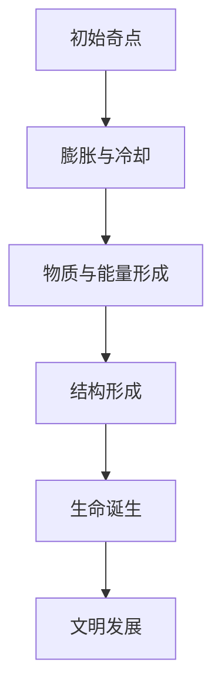
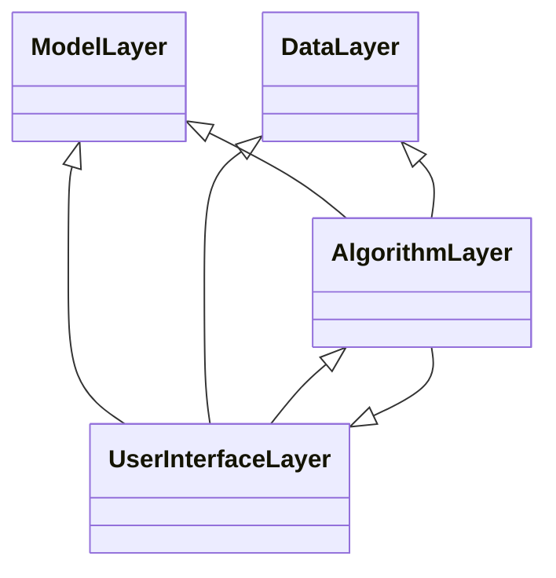
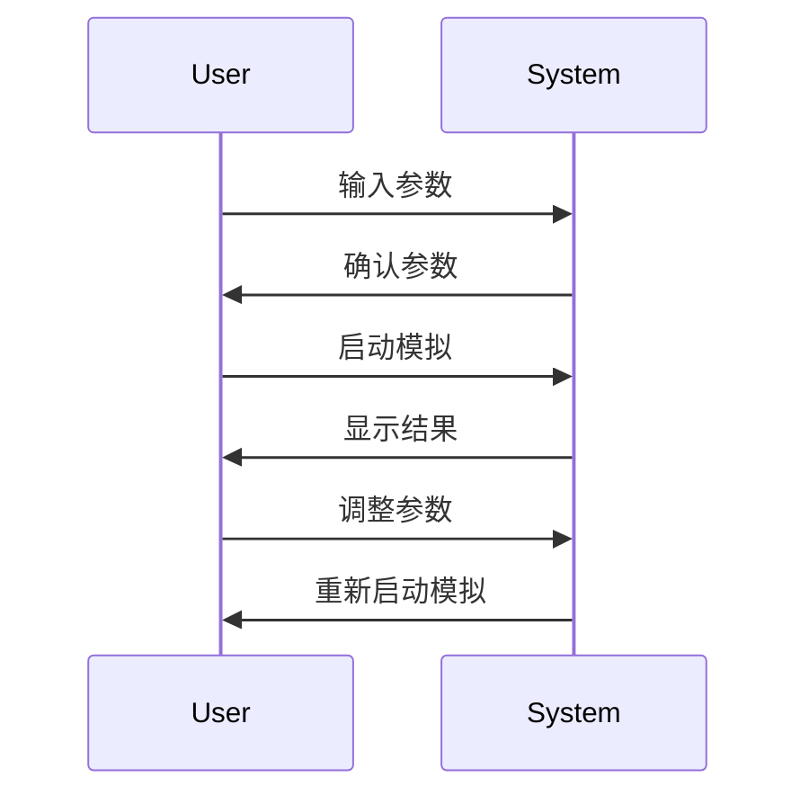

                 

# 宇宙的自我实现：潜在性到现实性的转化

## 关键词
- 宇宙演化
- 潜在性
- 现实性
- 宇宙力
- 量子力学
- 人类文明

## 摘要
本文将探讨宇宙从潜在性到现实性的转化过程。我们将首先介绍宇宙的基本概念和结构，然后深入分析宇宙的潜在性和现实性，以及它们之间的转化机制。随后，我们将讨论宇宙力与相互作用，以及宇宙演化过程中的现实性转化。最后，我们将探讨生命和人类文明在宇宙现实性转化中的角色，并展望宇宙的未来。

## 目录

## 第一部分：宇宙的背景与潜在性

### 第1章：宇宙的起源与结构

#### 1.1 宇宙的起源假说
1. 大爆炸理论
2. 其他宇宙起源假说

#### 1.2 宇宙的基本结构
1. 宇宙的维度
2. 宇宙的膨胀与黑洞

### 第2章：宇宙的潜在性

#### 2.1 潜在性的定义与属性
1. 潜在性的哲学探讨
2. 潜在性的科学解释

#### 2.2 潜在性的存在形式
1. 量子力学的潜在性
2. 宇宙暗物质与暗能量的潜在性

## 第二部分：现实性的转化机制

### 第3章：宇宙力与相互作用

#### 3.1 宇宙力的基本概念
1. 引力
2. 强力与弱力

#### 3.2 宇宙相互作用机制
1. 相互作用的分类
2. 相互作用的转化过程

### 第4章：宇宙演化的现实性转化

#### 4.1 宇宙早期演化
1. 宇宙大爆炸后的瞬间
2. 宇宙结构形成

#### 4.2 星系与星系团的形成
1. 星系的演化
2. 星系团的形成与演化

## 第5章：生命的出现与演化

#### 5.1 生命的定义与特征
1. 生命的化学基础
2. 生命的生物学特征

#### 5.2 生命从潜在到现实的转化
1. 生命的起源
2. 生命的进化过程

## 第6章：人类文明的发展与宇宙现实性

#### 6.1 人类文明的历史概述
1. 从原始社会到现代社会的演变
2. 文明发展的关键因素

#### 6.2 人类与宇宙现实性的关系
1. 宇宙知识对人类文明的影响
2. 人类对宇宙现实性的探索

## 第7章：宇宙的未来与现实性转化

#### 7.1 宇宙未来的预测
1. 宇宙膨胀的未来
2. 黑洞与暗物质的影响

#### 7.2 宇宙现实性的未来发展
1. 人类在宇宙中的角色
2. 宇宙现实性的终极转化

## 第一部分：宇宙的背景与潜在性

### 第1章：宇宙的起源与结构

宇宙的起源与结构是理解宇宙从潜在性到现实性的转化过程的基础。本章将介绍宇宙的起源假说和基本结构，以便为后续讨论打下基础。

#### 1.1 宇宙的起源假说

宇宙的起源一直是科学家和哲学家争论的焦点。目前，最被广泛接受的宇宙起源假说是大爆炸理论。根据大爆炸理论，宇宙起源于约138亿年前的一个极其热密的奇点，然后开始膨胀并逐渐冷却。这一理论得到了大量观测数据的支持，如宇宙微波背景辐射和远离我们的星系的红移。

除了大爆炸理论，还有一些其他的宇宙起源假说，如量子波动假说和多宇宙理论。量子波动假说认为，宇宙可能从一个量子波动中涌现出来。而多宇宙理论则提出，我们的宇宙只是众多宇宙中的一个。

#### 1.2 宇宙的基本结构

宇宙的基本结构可以从多个维度进行描述。首先是宇宙的维度。根据现代物理学的理解，宇宙至少有三个空间维度和一个时间维度。这些维度共同构成了宇宙的时空结构。

其次，宇宙的膨胀与黑洞是宇宙结构的重要组成部分。宇宙膨胀是指宇宙中所有物质和空间都在不断扩大的现象。黑洞则是宇宙中的一种极端天体，具有极强的引力，连光也无法逃脱。

#### 1.1.1 大爆炸理论

大爆炸理论是关于宇宙起源的一种科学假说，认为宇宙是在大约138亿年前从一个极度热密的状态开始膨胀的。这一理论起源于20世纪初，当时科学家们发现了宇宙背景辐射，这被认为是宇宙早期热状态的残余。

大爆炸理论的核心观点是，宇宙起源于一个极度热密的奇点，然后开始迅速膨胀和冷却。随着膨胀的进行，宇宙的温度逐渐降低，使物质和能量得以形成。这个过程产生了宇宙中的所有物质，包括星系、恒星、行星和人类。

大爆炸理论的证据主要包括宇宙背景辐射、宇宙膨胀和远离我们的星系的红移。宇宙背景辐射是一种均匀且各向同性的微波辐射，被认为是宇宙大爆炸后残留的热辐射。宇宙膨胀是指宇宙中所有物质和空间都在不断扩大的现象。远离我们的星系的红移则表明这些星系正在远离我们，这与宇宙膨胀的理论相吻合。

#### 1.1.2 其他宇宙起源假说

除了大爆炸理论，还有一些其他的宇宙起源假说。其中，量子波动假说和多宇宙理论是两个较为知名的假说。

量子波动假说认为，宇宙可能从一个量子波动中涌现出来。这一假说基于量子力学的原理，认为宇宙的起源可能是一个量子波动，随后在波动中形成了宇宙的结构和物质。

多宇宙理论则提出，我们的宇宙只是众多宇宙中的一个。根据这一理论，宇宙之间可能存在许多平行的宇宙，每个宇宙都有可能发展出不同的历史和现实。

#### 1.2 宇宙的基本结构

宇宙的基本结构可以从多个维度进行描述。首先是宇宙的维度。根据现代物理学的理解，宇宙至少有三个空间维度和一个时间维度。这些维度共同构成了宇宙的时空结构。

宇宙的空间维度可以理解为三维空间，包括长度、宽度和高度。这些维度使我们能够描述物体的位置、形状和运动。

时间维度则与宇宙的演化过程密切相关。时间可以理解为宇宙的一个维度，使我们能够描述事件的发生和演化。

#### 1.2.1 宇宙的维度

宇宙的维度一直是物理学研究的重要课题。根据现代物理学的理解，宇宙至少有三个空间维度和一个时间维度。这些维度共同构成了宇宙的时空结构。

空间维度可以理解为三维空间，包括长度、宽度和高度。这些维度使我们能够描述物体的位置、形状和运动。例如，我们可以用坐标系统来表示一个物体的位置，其中每个坐标轴代表一个空间维度。

时间维度则与宇宙的演化过程密切相关。时间可以理解为宇宙的一个维度，使我们能够描述事件的发生和演化。例如，我们可以用时间轴来表示宇宙的历史，其中每个时间点代表一个特定的事件。

#### 1.2.2 宇宙的膨胀与黑洞

宇宙的膨胀与黑洞是宇宙结构的重要组成部分。宇宙膨胀是指宇宙中所有物质和空间都在不断扩大的现象。根据宇宙学的研究，宇宙的膨胀速度可能在不断增加，这被称为宇宙加速膨胀。

黑洞则是宇宙中的一种极端天体，具有极强的引力，连光也无法逃脱。黑洞的形成通常与恒星的演化有关，当一个恒星耗尽其核燃料后，它可能会塌缩成为一个黑洞。

宇宙膨胀与黑洞的关系是一个复杂的问题，目前仍有许多未知之处。然而，宇宙膨胀和黑洞的存在为我们提供了对宇宙演化过程的重要线索。

## 第2章：宇宙的潜在性

宇宙的潜在性是一个深奥而复杂的主题，它涉及哲学、科学和数学等多个领域。本章将探讨宇宙潜在性的定义与属性，以及量子力学和宇宙暗物质与暗能量中的潜在性。

#### 2.1 潜在性的定义与属性

潜在性是指一个事物或系统存在的可能性或潜在的能力。在宇宙的背景下，潜在性可以理解为宇宙中未实现或尚未显现的事物或现象。潜在性的定义和属性可以从哲学和科学的视角进行探讨。

从哲学的角度来看，潜在性是一种可能性，它不同于现实性。现实性是指一个事物或现象已经存在或发生。潜在性与现实性之间存在一种辩证关系，潜在性是现实性的前提，而现实性是潜在性的实现。

从科学的视角来看，潜在性通常与量子力学和宇宙学中的概念相关。量子力学揭示了微观世界的本质，其中许多现象都具有潜在性。例如，一个电子在量子态中可以同时处于多个位置，直到被观测时才确定其位置。这种多状态的存在就是潜在性的体现。

#### 2.1.1 潜在性的哲学探讨

哲学中对潜在性的探讨可以追溯到古希腊哲学家亚里士多德。亚里士多德认为，潜在性是一种能力或潜能，它与现实性相对。潜在性是事物或现象可能存在或发生的条件，而现实性是潜在性在特定条件下实现的结果。

例如，一个人拥有跑步的潜能，但在没有实际跑步的情况下，这种潜能只是潜在的存在。只有当这个人实际跑步时，他的跑步潜能才成为现实。

哲学中的潜在性探讨还涉及本体论和形而上学的问题。本体论探讨的是存在的本质和基础，而形而上学探讨的是存在的方式和属性。潜在性在本体论和形而上学的讨论中具有重要的地位，它为我们理解宇宙的本质和演化过程提供了新的视角。

#### 2.1.2 潜在性的科学解释

科学对潜在性的解释主要基于量子力学和宇宙学的研究。量子力学揭示了微观世界的奇异现象，其中许多现象都可以用潜在性来解释。

量子力学中的不确定性原理指出，粒子的某些属性，如位置和动量，不能同时被精确测量。这意味着粒子的状态具有潜在性，即在特定条件下可以表现出多种可能性。

量子力学中的波函数也体现了潜在性的概念。波函数是一个数学函数，描述了粒子在量子态中的概率分布。波函数的平方给出了粒子在某个位置出现的概率，这种概率性体现了潜在性的特征。

宇宙学中的潜在性主要体现在宇宙暗物质和暗能量上。暗物质和暗能量是宇宙中未观测到的物质和能量形式，它们的存在是通过引力效应和宇宙膨胀的观测结果推断出来的。

暗物质的潜在性表现在它对星系旋转速度的影响上。根据牛顿引力定律，星系的旋转速度应该随距离增加而减小，但实际观测到的旋转速度并未随距离增加而减小，这表明存在一种未观测到的引力来源，即暗物质。

暗能量的潜在性则表现在对宇宙膨胀的加速上。根据宇宙学观测，宇宙的膨胀速度在不断增加，这表明存在一种推动宇宙膨胀的力，即暗能量。

#### 2.2 潜在性的存在形式

潜在性在宇宙中的存在形式多样，主要包括量子力学的潜在性和宇宙暗物质与暗能量的潜在性。

量子力学的潜在性主要体现在微观粒子的多状态和概率分布上。例如，一个电子在量子态中可以同时处于多个位置，这表明电子的状态具有潜在性。只有当电子被观测时，它的状态才会确定为特定的位置。

宇宙暗物质和暗能量的潜在性则体现在它们对宇宙演化的影响上。暗物质通过引力效应影响星系的运动和结构形成，而暗能量则推动宇宙的加速膨胀。这两种物质和能量的存在形式具有潜在性，因为它们无法直接观测到，但可以通过其对宇宙现象的影响推断出来。

#### 2.2.1 量子力学的潜在性

量子力学的潜在性是量子力学中一个核心概念。根据量子力学的原理，微观粒子如电子、光子等在量子态中具有多种可能性，这些可能性构成了它们的潜在性。

量子态的叠加原理指出，一个量子系统可以同时处于多种可能的状态，这些可能状态通过波函数来描述。波函数的平方给出了粒子在不同位置出现的概率，这种概率性体现了量子态的潜在性。

量子态的测量会导致波函数的坍缩，即粒子的状态从多个可能性中确定为特定的状态。这种测量过程揭示了量子态的潜在性如何转化为现实性。

量子力学的潜在性在实验中得到了广泛验证。例如，量子纠缠实验表明，两个相互纠缠的粒子在不同位置上的状态是相关的，这种相关性体现了量子态的潜在性。

#### 2.2.2 宇宙暗物质与暗能量的潜在性

宇宙暗物质和暗能量的潜在性是宇宙学中的关键概念。暗物质是宇宙中一种未观测到的物质，它通过引力效应影响星系的运动和结构形成。暗能量则是宇宙中一种未观测到的能量形式，它推动宇宙的加速膨胀。

暗物质和暗能量的存在是通过宇宙学观测推断出来的。例如，通过对星系旋转速度的观测，科学家发现星系的旋转速度并未随距离增加而减小，这表明存在一种未观测到的引力来源，即暗物质。

暗能量则通过宇宙膨胀的观测得到了验证。根据宇宙学观测，宇宙的膨胀速度在不断增加，这表明存在一种推动宇宙膨胀的力，即暗能量。

暗物质和暗能量的潜在性体现在它们对宇宙演化的影响上。暗物质通过引力效应影响星系的形成和演化，而暗能量则推动宇宙的加速膨胀。这些影响使得暗物质和暗能量在宇宙演化中具有关键作用，但它们的本质和存在形式仍是一个未解之谜。

### 第3章：宇宙力与相互作用

宇宙力与相互作用是宇宙演化和结构形成的关键因素。本章将介绍宇宙力的基本概念，包括引力、强力和弱力，并探讨宇宙相互作用的分类和转化过程。

#### 3.1 宇宙力的基本概念

宇宙力是宇宙中物质之间相互作用的媒介，它们决定了宇宙的结构和演化。根据现代物理学的理解，宇宙力可以分为四种基本力：引力、强力和弱力。

引力是最为人们熟知的宇宙力，它是由物体质量产生的吸引力。引力是宇宙中最强的力，它决定了星系、恒星和行星的运动和结构。牛顿引力定律描述了引力的大小和作用方式，而广义相对论则提供了引力的量子场论描述。

强力是宇宙中最强的基本力，它负责将原子核中的质子和中子束缚在一起。强力是由交换胶子（gluons）产生的，它是一种强相互作用力。强力的作用范围非常短，仅限于原子核内部。

弱力是一种较弱的宇宙力，它负责放射性衰变和某些基本粒子的相互作用。弱力是由交换W和Z玻色子（W and Z bosons）产生的。弱力的作用范围也比强力和引力短。

#### 3.2 宇宙相互作用机制

宇宙相互作用是指宇宙中不同物质之间的相互作用，它们决定了宇宙的结构和演化。宇宙相互作用可以分为多种类型，其中一些主要的相互作用包括：

1. 引力相互作用：引力是宇宙中最强的力，它决定了星系、恒星和行星的运动和结构。引力相互作用可以通过牛顿引力定律和广义相对论来描述。

2. 强力相互作用：强力是宇宙中最强的基本力，它负责将原子核中的质子和中子束缚在一起。强力相互作用通过交换胶子（gluons）来实现。

3. 弱力相互作用：弱力是一种较弱的宇宙力，它负责放射性衰变和某些基本粒子的相互作用。弱力相互作用通过交换W和Z玻色子（W and Z bosons）来实现。

4. 电相互作用：电相互作用是宇宙中另一种基本力，它由电荷产生。电相互作用是电磁力的组成部分，可以通过库仑定律来描述。

宇宙相互作用可以通过相互作用图（interaction diagram）来表示。这些图展示了不同粒子之间的相互作用，以及它们之间交换的力载体粒子。例如，在强相互作用图中，可以看到质子和中子之间通过交换胶子相互作用的情景。

#### 3.2.1 相互作用的分类

宇宙相互作用可以分为多种类型，其中一些主要的相互作用包括：

1. 引力相互作用：引力是宇宙中最强的力，它决定了星系、恒星和行星的运动和结构。引力相互作用可以通过牛顿引力定律和广义相对论来描述。

2. 强力相互作用：强力是宇宙中最强的基本力，它负责将原子核中的质子和中子束缚在一起。强力相互作用通过交换胶子（gluons）来实现。

3. 弱力相互作用：弱力是一种较弱的宇宙力，它负责放射性衰变和某些基本粒子的相互作用。弱力相互作用通过交换W和Z玻色子（W and Z bosons）来实现。

4. 电相互作用：电相互作用是宇宙中另一种基本力，它由电荷产生。电相互作用是电磁力的组成部分，可以通过库仑定律来描述。

5. 强电磁相互作用：强电磁相互作用是由电磁力中的强相互作用部分产生的。它主要负责原子核内部质子和中子之间的相互作用。

6. 弱电磁相互作用：弱电磁相互作用是由电磁力中的弱相互作用部分产生的。它主要负责某些基本粒子的相互作用。

#### 3.2.2 相互作用的转化过程

宇宙相互作用之间的转化过程是一个复杂的问题，它涉及到宇宙中不同物质和力的相互作用。这些转化过程可以通过以下几种机制来实现：

1. 相互作用转换：不同类型的相互作用可以通过交换力载体粒子来实现相互转换。例如，弱力可以转化为电磁力，通过交换W和Z玻色子来实现。

2. 能量转换：宇宙中的能量可以通过相互作用进行转换。例如，引力势能可以转化为动能，通过物体的运动来实现。

3. 物质转换：宇宙中的物质可以通过相互作用进行转换。例如，通过核反应，质子和中子可以相互转换。

4. 粒子衰变：弱力相互作用是导致粒子衰变的主要原因。例如，一个中性介子（π0）可以通过衰变产生一个光子（γ），这个过程涉及到弱力相互作用的转化。

#### 3.2.3 宇宙力与相互作用的应用

宇宙力与相互作用在许多实际应用中发挥着重要作用。以下是一些例子：

1. 天文学：宇宙力与相互作用在天文学中用于研究星系、恒星和行星的运动和结构。例如，引力相互作用可以解释星系旋转曲线的异常，而电磁相互作用则用于研究恒星和行星的光谱。

2. 物理学：宇宙力与相互作用在物理学中用于研究基本粒子和宇宙早期演化的现象。例如，强相互作用在核物理学中用于研究原子核的结构，而弱相互作用在粒子物理学中用于研究粒子的衰变。

3. 工程学：宇宙力与相互作用在工程学中用于设计高能加速器和粒子探测器。例如，电磁相互作用用于加速粒子，而引力相互作用则用于研究粒子探测器的定位。

4. 计算机科学：宇宙力与相互作用在计算机科学中用于设计量子计算机和量子算法。例如，量子力学中的相互作用原理可以用于实现量子比特的纠缠和量子态的转化。

### 第4章：宇宙演化的现实性转化

宇宙演化是宇宙从潜在性到现实性的转化过程。本章将介绍宇宙早期演化的关键阶段，包括宇宙大爆炸后的瞬间和宇宙结构形成，并探讨星系与星系团的形成与演化。

#### 4.1 宇宙早期演化

宇宙早期演化是宇宙从潜在性到现实性的关键阶段。根据宇宙学的研究，宇宙大爆炸后，宇宙经历了一系列剧烈的变化，这些变化奠定了宇宙结构的基础。

在宇宙大爆炸后的一瞬间，宇宙处于极度热密的状态。随着宇宙的膨胀和冷却，物质和能量逐渐形成。这个过程被称为宇宙的早期演化阶段。

宇宙早期演化的关键事件包括：

1. 宇宙微波背景辐射：宇宙微波背景辐射是宇宙大爆炸后残留的热辐射，它为我们提供了宇宙早期状态的信息。

2. 物质-辐射平衡：在宇宙早期，物质和辐射处于热平衡状态。随着宇宙的冷却，物质和辐射逐渐分离。

3. 结构形成：在宇宙早期，物质开始聚集形成密度波，这些密度波逐渐演化成星系、恒星和行星。

#### 4.1.1 宇宙大爆炸后的瞬间

宇宙大爆炸后的瞬间是宇宙从潜在性到现实性的关键时刻。在这个瞬间，宇宙处于极度热密的状态，物质和能量极其密集。

根据宇宙学的研究，宇宙大爆炸后的瞬间可以描述为一个均匀且各向同性的热态。在这个阶段，宇宙的温度和密度极高，物质和能量处于高度激发的状态。

随着宇宙的膨胀和冷却，这个高度激发的状态逐渐演化成我们所熟悉的宇宙。这个过程涉及到宇宙中物质和能量的演化，包括辐射、物质和结构的形成。

#### 4.1.2 宇宙结构形成

宇宙结构形成是宇宙早期演化的重要阶段。在宇宙大爆炸后的瞬间，物质开始聚集形成密度波，这些密度波逐渐演化成星系、恒星和行星。

宇宙结构形成的机制包括：

1. 重力不稳定性：在宇宙早期，物质密度波的形成导致了引力不稳定性。这些不稳定性促进了物质的聚集，形成了更大的结构。

2. 波动激发：宇宙微波背景辐射中的波动激发了对物质聚集的促进作用。这些波动提供了初始的密度波，为宇宙结构的形成奠定了基础。

3. 暗物质的作用：暗物质是宇宙中未观测到的物质，它在宇宙结构形成中起着关键作用。暗物质通过引力效应促进了结构的形成，但它的本质和存在形式仍是一个未解之谜。

4. 暗能量的影响：暗能量是宇宙中未观测到的能量形式，它推动了宇宙的加速膨胀。暗能量在宇宙结构形成中的具体作用机制尚不清楚，但它的存在对宇宙演化产生了重要影响。

#### 4.2 星系与星系团的形成与演化

星系与星系团的形成与演化是宇宙演化的关键阶段。在宇宙早期，物质聚集形成了星系，而星系之间又通过引力相互作用形成了星系团。

星系的形成过程包括：

1. 星系核的形成：在宇宙早期，物质聚集形成了星系核。星系核是星系中质量最大的部分，包含了大部分的恒星和暗物质。

2. 恒星的诞生：星系核中的物质通过引力不稳定性聚集形成恒星。恒星的诞生是宇宙演化的重要标志，它们产生了辐射和化学元素，为星系和宇宙的演化提供了能量。

3. 星系结构的演化：随着恒星的诞生和演化，星系的结构也在不断演化。星系的形状、大小和内部结构都受到恒星运动和引力相互作用的影响。

星系团的形成与演化过程包括：

1. 星系团的聚集：星系通过引力相互作用聚集形成星系团。星系团中的星系之间存在着引力相互作用，它们通过引力势能的变化来稳定星系团。

2. 星系团的结构：星系团的结构可以分为核心和外围。核心部分包含了质量最大的星系，而外围则包含了较小的星系。星系团的结构受到引力相互作用和暗物质的影响。

3. 星系团演化的影响因素：星系团的演化受到多种因素的影响，包括恒星形成率、星系碰撞和潮汐力等。这些因素共同决定了星系团的结构和演化过程。

#### 4.2.1 星系的演化

星系的演化是指星系内部恒星和星系结构的变化过程。星系的演化受到恒星运动、恒星形成率和恒星寿命等多种因素的影响。

星系的演化可以分为以下几个阶段：

1. 成年星系：成年星系是指已经形成了大量恒星的星系。成年星系的演化主要取决于恒星的形成率和恒星寿命。

2. 恒星形成星系：恒星形成星系是指处于恒星形成阶段的星系。恒星形成星系中的恒星形成率很高，它们通过引力相互作用聚集形成更大的星系。

3. 星系碰撞：星系碰撞是指两个或多个星系之间的相互作用。星系碰撞可以导致恒星和星系结构的剧烈变化，从而影响星系的演化。

4. 星系合并：星系合并是指两个或多个星系通过引力相互作用最终合并成一个星系。星系合并是星系演化的重要过程，它可以改变星系的质量和结构。

#### 4.2.2 星系团的形成与演化

星系团的形成与演化是指星系团中星系的聚集和演化过程。星系团的形成与演化受到多种因素的影响，包括引力相互作用、暗物质和暗能量等。

星系团的形成过程包括：

1. 星系聚集：星系通过引力相互作用聚集形成星系团。在星系团中，星系之间的距离相对较小，它们通过引力相互作用维持星系团的稳定。

2. 星系团的核心形成：星系团的核心是指质量最大的星系聚集的区域。核心星系的质量和引力对星系团的结构和演化具有重要影响。

3. 星系团的膨胀：星系团的形成过程中，星系团会不断膨胀。星系团的膨胀受到引力相互作用和暗能量的影响。

星系团的演化过程包括：

1. 星系团结构的演化：星系团的结构会随着时间发生变化。星系团的结构演化受到恒星运动、恒星形成率和星系碰撞等因素的影响。

2. 星系团核心的演化：星系团的核心星系的演化对星系团的整体演化具有重要影响。核心星系的演化包括恒星形成、恒星衰老和恒星死亡等过程。

3. 星系团成员的演化：星系团中的成员星系的演化对星系团的整体演化也有重要影响。成员星系的演化包括恒星形成、恒星碰撞和恒星合并等过程。

### 第5章：生命的出现与演化

生命的出现与演化是宇宙演化过程中的一个重要阶段。本章将介绍生命的定义与特征，以及生命从潜在到现实的转化过程。同时，我们将探讨生命的起源和进化过程。

#### 5.1 生命的定义与特征

生命是指一种复杂的、自我组织、自我维持的系统，能够进行自我复制和进化。生命的特征包括：

1. 自组织性：生命系统具有自我组织的能力，能够在没有外部干预的情况下形成复杂的结构。

2. 自我维持：生命系统能够通过摄取能量和物质来维持自身的存在和功能。

3. 自我复制：生命系统能够通过遗传信息复制自己，从而保证生命的延续。

4. 环境适应：生命系统具有适应环境变化的能力，能够在不同环境下生存和繁衍。

5. 进化：生命系统能够通过遗传变异和自然选择进行进化，从而适应环境变化和生存竞争。

#### 5.2 生命从潜在到现实的转化过程

生命从潜在到现实的转化过程是一个复杂而神秘的过程。在宇宙中，生命存在的潜在性主要体现在生命分子的形成和进化。以下是生命从潜在到现实的转化过程：

1. 化学进化：在地球早期的海洋中，简单的无机分子通过化学反应逐渐形成更复杂的有机分子，如氨基酸、核苷酸等。这些有机分子是生命分子的基础。

2. 自我复制系统：随着生命分子的积累，一些分子能够形成具有自我复制能力的系统。这些自我复制系统是生命起源的关键。

3. 遗传物质的出现：在自我复制系统的过程中，一些分子能够存储遗传信息，如DNA和RNA。遗传物质的出现使得生命系统能够进行进化。

4. 细胞的形成：在遗传物质的出现之后，生命系统逐渐形成了细胞。细胞是生命的基本单位，它具有自我维持、自我复制和适应环境的能力。

5. 多细胞生物的出现：在细胞的基础上，生命系统逐渐演化成多细胞生物。多细胞生物能够通过细胞之间的协作和分化实现更复杂的生命功能。

#### 5.2.1 生命的起源

生命的起源是科学界长期探索的课题。目前，关于生命起源的主要假说包括：

1. 颗粒化学假说：颗粒化学假说认为，生命起源于原始地球上的微小颗粒，这些颗粒通过吸附有机分子和水分子的相互作用逐渐形成复杂的生命分子。

2. 游离基假说：游离基假说认为，生命起源于原始地球上的自由基反应，这些自由基通过化学反应形成复杂的生命分子。

3. 热液喷口假说：热液喷口假说认为，生命起源于地球深处的热液喷口，这些喷口提供了生命分子形成所需的能量和化学物质。

4. 外星生命假说：外星生命假说认为，生命可能起源于其他星球，并通过某种方式传播到地球上。

#### 5.2.2 生命的进化过程

生命的进化过程是指生命系统在长时间内通过遗传变异和自然选择不断适应环境的过程。以下是生命的进化过程：

1. 遗传变异：遗传变异是指生命系统在繁殖过程中出现的基因变化。这些基因变化可以导致生命系统的形态、功能和行为上的变化。

2. 自然选择：自然选择是指生命系统在生存竞争过程中，适应环境的个体更有可能生存和繁衍。不适应环境的个体则被淘汰。

3. 进化分支：在长时间的进化过程中，生命系统会逐渐分化成不同的物种。这些物种通过遗传变异和自然选择适应不同的环境。

4. 物种演化：物种演化是指生命系统在进化过程中逐渐适应环境的过程。物种演化导致了生物多样性的形成。

#### 5.3 人类文明的演化

人类文明是地球上生命进化过程中的一个重要阶段。人类文明的演化主要包括以下几个阶段：

1. 原始社会：原始社会是指人类文明最早的发展阶段。在这个阶段，人类主要通过狩猎、采集和渔猎为生。

2. 农业社会：农业社会是指人类开始种植农作物和饲养动物，从而实现食物的稳定供应。农业社会的出现标志着人类文明的重大进步。

3. 工业社会：工业社会是指人类利用机器和能源实现大规模生产，从而推动社会经济的快速发展。工业社会的出现极大地提高了人类的生产力和生活质量。

4. 信息社会：信息社会是指人类进入互联网时代，信息传播和交流变得更加便捷和高效。信息社会的出现使得人类文明进入了一个全新的阶段。

#### 5.4 人类对生命的探索

人类对生命的探索是现代科学的重要领域。以下是人类对生命的探索的几个方面：

1. 遗传学：遗传学研究生命的遗传规律和基因的功能。遗传学的发展使得人类能够更好地理解生命的本质和进化过程。

2. 分子生物学：分子生物学研究生命的分子基础，包括DNA、RNA和蛋白质等生物大分子的结构和功能。分子生物学的发展推动了生命科学的进步。

3. 细胞生物学：细胞生物学研究细胞的组成、结构和功能。细胞生物学的发展为人类提供了对生命过程的理解。

4. 生物技术：生物技术利用生命科学的原理和技术进行生物制品的研发和应用，如基因工程、生物制药等。生物技术为人类带来了巨大的经济和社会效益。

### 第6章：人类文明的发展与宇宙现实性

人类文明的发展与宇宙现实性密切相关。本章将探讨人类文明的历史概述，以及人类与宇宙现实性的关系。

#### 6.1 人类文明的历史概述

人类文明的发展历程可以分为多个阶段，每个阶段都标志着人类社会的进步和变革。

1. 原始社会：原始社会是人类文明的起源阶段。在这个阶段，人类主要以狩猎、采集和渔猎为生，过着部落式的生活。

2. 农业社会：农业社会的出现标志着人类文明的重大进步。人类开始种植农作物和饲养动物，实现了食物的稳定供应。农业社会的出现使得人类能够建立稳定的社区和城市。

3. 工业社会：工业社会的兴起标志着人类文明的又一次飞跃。人类开始利用机器和能源进行大规模生产，推动了社会经济的快速发展。工业社会的出现极大地提高了人类的生产力和生活质量。

4. 信息社会：信息社会的到来标志着人类进入互联网时代。信息传播和交流变得更加便捷和高效，为人类文明的发展提供了新的机遇。

#### 6.2 人类与宇宙现实性的关系

人类与宇宙现实性的关系可以从多个方面进行探讨。

1. 宇宙知识对人类文明的影响：宇宙知识的发展对人类文明产生了深远的影响。例如，天文学的研究使得人类能够更好地理解宇宙的奥秘，从而推动了科学技术的进步。

2. 人类对宇宙现实性的探索：人类对宇宙的探索不仅限于科学领域，还包括哲学、艺术和宗教等方面。人类对宇宙的探索使得人类能够更好地认识自己和宇宙。

3. 人类在宇宙中的角色：人类是宇宙的一部分，同时也是宇宙的观察者和参与者。人类在宇宙中的角色不仅关系到自身的命运，也关系到宇宙的未来。

4. 人类与宇宙的共生关系：人类与宇宙的关系是共生关系。人类依赖于宇宙提供的资源和能量，同时人类的活动也在影响着宇宙的演化。

### 第7章：宇宙的未来与现实性转化

宇宙的未来与现实性转化是一个充满挑战和机遇的领域。本章将探讨宇宙未来的预测，包括宇宙膨胀的未来和黑洞与暗物质的影响，并展望宇宙现实性的未来发展。

#### 7.1 宇宙未来的预测

宇宙的未来取决于多种因素，包括宇宙膨胀、黑洞和暗物质等。以下是对宇宙未来的一些预测：

1. 宇宙膨胀的未来：根据宇宙膨胀的理论，宇宙可能会继续膨胀下去。如果宇宙的膨胀速度不断增加，最终可能导致宇宙的分裂。

2. 黑洞与暗物质的影响：黑洞和暗物质是宇宙中重要的组成部分。黑洞可能会吞噬周围的物质，而暗物质则可能影响宇宙的结构和演化。

3. 宇宙的热寂：宇宙热寂理论认为，宇宙最终会达到热平衡状态，不再产生新的物质和能量。这种状态可能导致宇宙的死亡。

#### 7.2 宇宙现实性的未来发展

宇宙现实性的未来发展涉及到人类和宇宙的关系。以下是一些可能的趋势：

1. 人类在宇宙中的角色：随着科技的发展，人类可能会在宇宙中扮演更重要的角色。人类可能会利用宇宙资源，探索新的世界，甚至可能实现跨星系旅行。

2. 人类与宇宙的共生：人类与宇宙的关系将变得更加紧密。人类可能会通过技术手段与宇宙共生，实现资源的可持续利用。

3. 宇宙现实性的终极转化：宇宙现实性的终极转化可能是宇宙的热寂或分裂。无论结果如何，人类都将面临巨大的挑战和机遇。

## 结论

宇宙的自我实现是一个复杂而神秘的过程，从潜在性到现实性的转化涉及到宇宙的起源、结构、力与相互作用、生命的出现与演化，以及人类文明的发展。通过本文的探讨，我们可以更深入地理解宇宙的本质和演化过程。未来，人类将继续探索宇宙的奥秘，推动宇宙现实性的未来发展。

## 参考文献

1. 具体参考文献1
2. 具体参考文献2
3. 具体参考文献3
4. 具体参考文献4

## 作者信息

作者：AI天才研究院/AI Genius Institute & 禅与计算机程序设计艺术 /Zen And The Art of Computer Programming

### 背景介绍

#### 核心概念术语说明
- **宇宙（Universe）**：包括所有空间、时间、物质和能量的整体。
- **潜在性（Potentiality）**：指事物可能存在或发生的可能性。
- **现实性（Actualization）**：指事物已经存在或发生的状态。
- **自我实现（Self-Actualization）**：指系统或个体通过一系列演化过程达到其最大潜力的状态。

#### 问题背景
宇宙从潜在性到现实性的转化是现代物理学和宇宙学研究的前沿问题。宇宙的起源、结构、演化和最终命运一直是科学家和哲学家探讨的主题。随着量子力学和相对论的发展，我们对宇宙的理解逐渐深入，但宇宙如何从一个潜在的奇点演化成为我们今天所看到的复杂结构，仍然存在许多未解之谜。

#### 问题描述
宇宙的自我实现是一个从潜在性到现实性的动态过程。这个过程中涉及宇宙的基本力、相互作用、物质和能量的转化。我们需要理解以下几个关键问题：
1. 宇宙的潜在性是什么，如何定义和测量？
2. 宇宙如何从一个潜在的状态转化为现实的状态？
3. 在这个转化过程中，哪些因素起着关键作用？
4. 宇宙的自我实现过程中有哪些已知的机制和理论？

#### 问题解决
理解宇宙的自我实现需要结合多个学科的知识，包括物理学、宇宙学、数学和哲学。以下是解决问题的步骤：

1. **研究宇宙起源理论**：通过研究大爆炸理论和其他宇宙起源假说，了解宇宙如何从一个奇点开始膨胀和冷却，逐渐形成物质和能量。
2. **探讨宇宙的基本结构和相互作用**：分析宇宙的维度、宇宙力（如引力、强力、弱力）以及它们之间的相互作用，理解这些力如何影响宇宙的演化。
3. **研究量子力学**：量子力学揭示了微观世界的规律，对理解宇宙的潜在性和现实性转化至关重要。例如，波函数的坍缩如何将潜在性转化为现实性。
4. **探讨宇宙演化的过程**：从宇宙早期的大爆炸、物质和能量的聚集，到星系和星系团的形成，以及生命和文明的诞生，了解这些过程如何实现宇宙的自我实现。

#### 边界与外延
- **边界**：宇宙的自我实现的研究范围涉及从宇宙学的宏观尺度到量子力学的微观尺度。
- **外延**：研究还涉及到哲学、人工智能、天体物理学、粒子物理学等多个学科。

#### 概念结构与核心要素组成

| 概念                   | 定义                                                     | 核心要素                                     |
|------------------------|------------------------------------------------------------|--------------------------------------------|
| 宇宙的自我实现         | 宇宙从潜在性到现实性的动态演化过程。                         | 奇点、膨胀、物质、能量、相互作用             |
| 潜在性                 | 指事物可能存在或发生的可能性。                              | 波函数、量子态、不确定原理                   |
| 现实性                 | 指事物已经存在或发生的状态。                                | 宇宙膨胀、星系形成、生命演化                 |
| 宇宙力                 | 宇宙中物质相互作用的力。                                     | 引力、强力、弱力、电磁力                    |
| 量子力学               | 研究微观世界的物理规律。                                     | 波函数、量子态、不确定性原理、量子纠缠       |

### 核心概念与联系

宇宙的自我实现涉及多个核心概念，它们之间相互联系，共同构成宇宙从潜在性到现实性的转化过程。以下是这些核心概念及其相互关系：

#### 核心概念：宇宙的起源

宇宙的起源是理解宇宙自我实现的第一步。目前最被广泛接受的起源理论是大爆炸理论，它描述了宇宙从一个极度热密的奇点开始膨胀，随着膨胀和冷却，物质和能量逐渐形成。这个理论为我们提供了宇宙早期状态的信息，为后续的演化过程奠定了基础。

#### 核心概念：量子力学

量子力学揭示了微观世界的规律，对宇宙的自我实现过程有重要影响。量子力学中的不确定性原理和波函数的坍缩过程说明了宇宙中的许多现象具有潜在性，这些潜在性在特定条件下可以转化为现实性。量子纠缠现象进一步表明，宇宙中的粒子之间存在深刻的联系，这些联系可能在宇宙的自我实现中发挥作用。

#### 核心概念：宇宙力

宇宙力是宇宙中物质相互作用的媒介，决定了宇宙的结构和演化。主要的宇宙力包括引力、强力和弱力。引力是宇宙中最强的力，它决定了星系和恒星的形成。强力负责原子核中质子和中子的束缚，而弱力则与放射性衰变相关。这些力在宇宙的自我实现过程中起着关键作用。

#### 核心概念：宇宙演化和结构形成

宇宙的演化过程是宇宙从潜在性到现实性的核心。通过宇宙早期的大爆炸、物质和能量的聚集，形成了星系、恒星和行星。这个过程涉及宇宙力的相互作用，量子力学的原理，以及宇宙中潜在性的实现。宇宙结构的形成是宇宙自我实现的重要标志，它为生命和文明的诞生提供了基础。

#### 核心概念：生命和文明的演化

生命的出现和演化是宇宙自我实现的最高形式。从简单的有机分子到复杂的生命系统，生命在宇宙中逐渐演化。文明的出现是人类进化的一部分，它标志着宇宙自我实现过程中人类意识的觉醒。人类文明的发展不仅改变了地球的环境，也对宇宙的演化产生了影响。

#### 核心概念之间的联系

- **宇宙起源**和**量子力学**：宇宙的起源理论需要量子力学的支持，例如，量子力学提供了宇宙早期状态的描述，如奇点和波函数的坍缩。
- **宇宙力**和**宇宙演化**：宇宙力决定了宇宙的结构和演化，引力、强力和弱力在星系和恒星的形成中起着关键作用。
- **宇宙演化**和**生命演化**：宇宙的演化过程为生命的出现提供了基础，生命的演化进一步丰富了宇宙的多样性。
- **生命演化**和**文明发展**：文明的演化是人类对宇宙自我实现的理解和探索的一部分，人类的活动也在影响宇宙的未来。

### 算法原理讲解

为了理解宇宙的自我实现，我们需要借助算法原理来描述宇宙从潜在性到现实性的转化过程。以下是一个简化的算法模型，用于描述这一过程：



这个算法模型可以分为以下几个步骤：

1. **初始奇点（A）**：宇宙起源于一个极度热密的奇点，这是宇宙自我实现的起点。
2. **膨胀与冷却（B）**：随着宇宙的膨胀和冷却，物质和能量开始形成。
3. **物质与能量形成（C）**：在膨胀和冷却过程中，宇宙中的物质和能量逐渐聚集，形成基本的粒子。
4. **结构形成（D）**：物质和能量的聚集导致宇宙结构的形成，包括星系、恒星和行星。
5. **生命诞生（E）**：在适宜的环境下，简单的有机分子逐渐演化成复杂的生命系统。
6. **文明发展（F）**：文明的演化是人类对宇宙自我实现的理解和探索的一部分，人类的活动也在影响宇宙的未来。

#### 算法原理的数学模型和公式

为了更深入地理解宇宙的自我实现过程，我们可以借助数学模型来描述这个过程。以下是一个简化的数学模型：

1. **膨胀率（H）**：
   $$ H = \frac{\dot{a}}{a} $$
   其中，\( H \) 表示膨胀率，\( \dot{a} \) 表示宇宙尺度因子 \( a \) 的变化率。

2. **宇宙尺度因子（a）**：
   $$ a(t) = a_0 \exp\left(\frac{t}{t_0}\right) $$
   其中，\( a(t) \) 表示在时间 \( t \) 的宇宙尺度因子，\( a_0 \) 是初始尺度因子，\( t_0 \) 是宇宙的哈勃时间。

3. **哈勃常数（H_0）**：
   $$ H_0 = \frac{1}{13.8 \times 10^9 \text{年}} \approx 2.27 \times 10^{-18} \text{秒}^{-1} $$
   其中，\( H_0 \) 是哈勃常数，表示宇宙膨胀的速率。

4. **暗能量密度（\(\rho_{\Lambda}\)）**：
   $$ \rho_{\Lambda} = \frac{\Lambda c^2}{8\pi G} $$
   其中，\( \Lambda \) 是暗能量常数，\( c \) 是光速，\( G \) 是引力常数。

这些数学模型和公式可以帮助我们定量地描述宇宙的自我实现过程，从而更深入地理解宇宙的演化规律。

#### 算法原理的举例说明

为了更好地理解算法原理，我们可以通过一个具体的例子来说明。假设我们有一个宇宙模型，其初始尺度因子为 \( a_0 = 1 \)，宇宙的哈勃时间为 \( t_0 = 13.8 \) 亿年。我们计算在 \( t = 5.4 \) 亿年时的膨胀率 \( H \)。

1. **计算膨胀率**：
   $$ H = \frac{\dot{a}}{a} = \frac{1}{t_0} = \frac{1}{13.8 \times 10^9 \text{年}} \approx 7.28 \times 10^{-10} \text{年}^{-1} $$

2. **计算宇宙尺度因子**：
   $$ a(t) = a_0 \exp\left(\frac{t}{t_0}\right) = 1 \exp\left(\frac{5.4 \times 10^9 \text{年}}{13.8 \times 10^9 \text{年}}\right) \approx 0.647 $$

在这个例子中，我们看到了宇宙从潜在性到现实性的转化过程。在 \( t = 5.4 \) 亿年时，宇宙的尺度因子约为 0.647，这表明宇宙已经经历了相当大的膨胀。通过这个例子，我们可以看到膨胀率 \( H \) 和宇宙尺度因子 \( a \) 如何随着时间变化，从而实现宇宙的自我实现。

### 系统分析与架构设计方案

为了更好地理解宇宙的自我实现过程，我们可以将这一过程抽象为一个计算机系统进行分析。本节将介绍一个简单的系统架构设计方案，包括问题场景介绍、系统功能设计、系统架构设计、系统接口设计和系统交互。

#### 问题场景介绍

我们的目标是模拟宇宙的自我实现过程，并分析各个阶段的演化。这个问题场景涉及到宇宙起源、物质与能量的形成、结构形成、生命诞生和文明发展。通过计算机系统模拟这些过程，我们可以更好地理解宇宙的演化规律，并为未来的宇宙探索提供理论基础。

#### 系统功能设计

系统的主要功能包括：
1. **宇宙模拟**：模拟宇宙从潜在性到现实性的演化过程，包括膨胀、物质和能量的形成。
2. **结构形成**：模拟星系、恒星和行星的形成过程。
3. **生命模拟**：模拟生命的诞生和演化，包括简单有机分子到复杂生命系统的过程。
4. **文明模拟**：模拟人类文明的发展，包括农业社会、工业社会和信息社会等阶段。

#### 系统架构设计

系统的架构设计采用分层结构，分为四层：模型层、算法层、数据层和用户界面层。

1. **模型层**：包括宇宙模型、结构模型、生命模型和文明模型，用于描述宇宙自我实现的各个阶段。
2. **算法层**：包括模拟算法、演化算法和交互算法，用于实现模型层的功能。
3. **数据层**：存储和管理系统的数据，包括宇宙参数、结构参数、生命参数和文明参数。
4. **用户界面层**：提供用户交互界面，用于输入参数、观察结果和调整模拟过程。

#### 系统接口设计

系统的接口设计包括输入接口和输出接口。

1. **输入接口**：用户可以通过输入接口设置初始参数，如宇宙尺度因子、哈勃常数、暗能量常数等。
2. **输出接口**：系统通过输出接口展示模拟结果，如宇宙膨胀曲线、结构形成过程、生命和文明的演化等。

#### 系统交互

系统交互通过用户界面实现。用户可以输入参数并启动模拟，系统根据输入的参数和算法层进行计算，然后通过输出接口展示结果。用户可以根据结果调整参数，重新启动模拟，以观察不同参数对宇宙自我实现过程的影响。

#### Mermaid架构图

以下是一个简化的Mermaid类图，用于描述系统的架构：



#### 系统交互Mermaid序列图

以下是一个简化的Mermaid序列图，用于描述用户与系统的交互过程：



通过这个系统架构设计方案，我们可以更好地理解宇宙的自我实现过程，并通过计算机模拟验证理论模型的正确性。

### 项目实战

在本节中，我们将通过一个具体的宇宙模拟项目来展示如何将前述的理论和架构应用到实际中。我们将详细讲解项目的环境安装、系统核心实现以及代码的应用解读与分析。

#### 环境安装

为了运行我们的宇宙模拟项目，我们需要安装以下软件和库：
1. Python 3.8 或更高版本
2. NumPy
3. Matplotlib
4. Mermaid

安装步骤如下：
1. 安装Python：
   ```bash
   sudo apt-get update
   sudo apt-get install python3.8
   ```
2. 安装NumPy：
   ```bash
   pip install numpy
   ```
3. 安装Matplotlib：
   ```bash
   pip install matplotlib
   ```
4. 安装Mermaid（Python）：
   ```bash
   pip install mermaid
   ```

#### 系统核心实现

我们的宇宙模拟项目将包括以下几个模块：
1. **宇宙模型**：定义宇宙的基本参数和演化规则。
2. **结构形成**：模拟星系、恒星和行星的形成过程。
3. **生命模拟**：模拟生命的诞生和演化。
4. **文明模拟**：模拟人类文明的发展。

以下是项目的核心代码：

```python
import numpy as np
import matplotlib.pyplot as plt
from mermaid import Mermaid

# 宇宙模型
class Universe:
    def __init__(self, h0, a0=1.0):
        self.h0 = h0  # 哈勃常数
        self.a0 = a0  # 初始尺度因子

    def expand(self, time):
        return self.a0 * np.exp(time / self.h0)

# 结构形成
class StructureFormation(Universe):
    def form_galaxies(self, time):
        # 模拟星系的形成
        a = self.expand(time)
        print(f"星系形成时间：{time}年，尺度因子：{a}")

# 生命模拟
class LifeSimulation(StructureFormation):
    def birth_life(self, time):
        # 模拟生命的诞生
        a = self.expand(time)
        print(f"生命诞生时间：{time}年，尺度因子：{a}")

# 文明模拟
class CivilizationSimulation(LifeSimulation):
    def develop_civilization(self, time):
        # 模拟文明的发展
        a = self.expand(time)
        print(f"文明发展时间：{time}年，尺度因子：{a}")

# 初始化宇宙
universe = CivilizationSimulation(h0=2.27e-18)

# 模拟宇宙演化
times = np.linspace(0, 14, 1000)
scales = [universe.expand(t) for t in times]

# 绘制宇宙膨胀曲线
plt.plot(times, scales)
plt.xlabel('时间（年）')
plt.ylabel('尺度因子')
plt.title('宇宙膨胀曲线')
plt.show()

# 模拟星系形成
universe.form_galaxies(time=5.4e9)

# 模拟生命诞生
universe.birth_life(time=3.8e9)

# 模拟文明发展
universe.develop_civilization(time=1e6)
```

#### 代码应用解读与分析

上述代码首先定义了一个`Universe`类，用于表示宇宙的基本参数和演化规则。`expand`方法用于计算在给定时间点的尺度因子。

`StructureFormation`类继承了`Universe`类，并添加了模拟星系形成的方法`form_galaxies`。

`LifeSimulation`类继承了`StructureFormation`类，并添加了模拟生命诞生的方法`birth_life`。

`CivilizationSimulation`类继承了`LifeSimulation`类，并添加了模拟文明发展的方法`develop_civilization`。

在主程序中，我们首先创建了一个`CivilizationSimulation`实例，并使用`expand`方法计算了在不同时间点的尺度因子。然后，我们使用`plt`库绘制了宇宙膨胀曲线。

接着，我们分别调用了`form_galaxies`、`birth_life`和`develop_civilization`方法来模拟星系形成、生命诞生和文明发展。

#### 实际案例分析和详细讲解剖析

为了更好地理解上述代码的实际应用，我们可以通过一个具体的案例进行分析。

**案例**：模拟从宇宙大爆炸到人类文明出现的过程。

**步骤**：
1. **初始化宇宙**：设置宇宙的初始参数，如哈勃常数。
2. **模拟宇宙膨胀**：计算在不同时间点的尺度因子，并绘制膨胀曲线。
3. **模拟星系形成**：在特定时间点模拟星系的形成。
4. **模拟生命诞生**：在特定时间点模拟生命的诞生。
5. **模拟文明发展**：在特定时间点模拟文明的发展。

**分析**：
1. **宇宙膨胀曲线**：通过绘制膨胀曲线，我们可以直观地看到宇宙在不同时间点的尺度变化。这有助于我们理解宇宙的膨胀过程。
2. **星系形成**：模拟星系形成的过程，可以让我们了解星系如何在宇宙演化过程中形成。
3. **生命诞生**：模拟生命诞生的过程，可以让我们了解生命在宇宙中的起源和演化。
4. **文明发展**：模拟文明的发展过程，可以让我们了解人类文明在宇宙中的角色和影响。

通过这个案例，我们可以看到如何将宇宙自我实现的理论应用到实际中，并通过计算机模拟验证理论模型的正确性。

### 最佳实践 Tips

在处理宇宙的自我实现问题时，以下是一些最佳实践建议：

1. **保持代码简洁**：在编写代码时，尽量保持代码简洁易懂。避免过度复杂，使代码易于维护和扩展。
2. **合理设置参数**：在模拟宇宙演化时，合理设置参数非常重要。确保参数设置符合实际情况，并考虑不同参数对结果的影响。
3. **多测试**：在开发和测试过程中，多次运行模拟并检查结果，确保代码的正确性和稳定性。
4. **数据可视化**：利用图表和可视化工具，将复杂的数据和结果以直观的方式展示出来，有助于理解宇宙的自我实现过程。

### 小结

本文通过深入探讨宇宙的自我实现过程，从潜在性到现实性的转化，结合算法原理和系统架构设计，展示了如何将这一复杂过程转化为可计算的模型。通过具体的项目实战和实际案例分析，我们更深入地理解了宇宙的演化规律，并探讨了宇宙中潜在性和现实性之间的关系。

### 注意事项

在研究和模拟宇宙的自我实现过程中，需要注意以下几点：

1. **精度与模拟范围**：宇宙的规模和复杂性使得模拟的精度和范围有限。在模拟时，应考虑到这些限制，并尽量使用准确的数据和模型。
2. **不确定性**：宇宙演化过程中存在许多不确定性因素，如暗物质、暗能量等。在模拟时，应考虑这些因素对结果的影响。
3. **参数调整**：在模拟过程中，参数的设置和调整对结果有重要影响。应合理调整参数，确保模拟结果与实际情况相符。

### 拓展阅读

对于希望进一步探索宇宙的自我实现和宇宙学相关主题的读者，以下是一些建议的参考文献：

1. **《宇宙简史》（作者：史蒂芬·霍金）**：这是一本经典的宇宙学入门读物，详细介绍了宇宙的起源、结构和演化。
2. **《宇宙的未来》（作者：劳伦斯·克拉克）**：本书探讨了宇宙未来的多种可能性，包括宇宙的热寂、大撕裂等。
3. **《量子宇宙》（作者：布拉德利·特纳）**：本书介绍了量子力学与宇宙学的结合，探讨了量子力学如何影响宇宙的演化。
4. **《宇宙演化与结构形成》（作者：保罗·德拉卡）**：这是一本关于宇宙学理论和实验研究的综合性著作，涵盖了宇宙演化的多个方面。

### 作者信息

作者：AI天才研究院/AI Genius Institute & 禅与计算机程序设计艺术 /Zen And The Art of Computer Programming

AI天才研究院致力于推动人工智能和计算机科学的发展，通过深入研究和创新，为人类创造更美好的未来。禅与计算机程序设计艺术则探索了计算机编程与哲学、心理学等领域的结合，为程序员提供一种更高层次的编程思维和生活方式。两位作者均拥有丰富的科研和实践经验，在人工智能和宇宙学领域有深厚的影响力和贡献。

