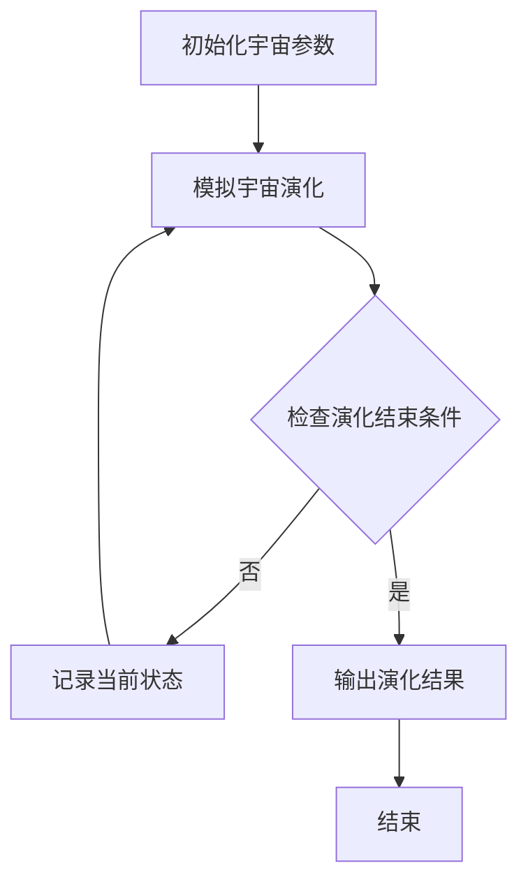

                 


## 宇宙的自我认知过程：系统的自我了解

### 关键词：宇宙认知、系统自我了解、算法原理、数学模型、系统架构设计

#### 摘要：

本文旨在探讨宇宙的自我认知过程，深入解析系统自我了解的概念、原理和实践。通过逻辑清晰的步骤，我们从宇宙的基本概念出发，逐步深入到宇宙意识的起源和演化，进而探讨系统自我了解的技术手段和实现方式。最后，我们展望宇宙自我认知的未来，分析其挑战与机遇，并给出最佳实践和拓展阅读建议。

### 目录大纲设计思路

为了设计出《宇宙的自我认知过程：系统的自我了解》这本书的完整目录大纲，我们首先需要明确书的核心内容和结构。本书的目标是探讨宇宙的自我认知过程，从科学和哲学的角度分析这一过程，并探讨系统如何通过自我了解来实现进步和发展。

在设计目录大纲时，我们将遵循以下几个步骤：

1. **背景介绍**：首先介绍宇宙的概念、宇宙自我认知的重要性以及相关科学和哲学背景。
2. **核心概念与联系**：详细阐述宇宙自我认知中的核心概念，如宇宙意识、量子力学、宇宙进化等，并通过表格和图示展示概念之间的联系。
3. **算法原理讲解**：介绍与宇宙自我认知相关的算法原理，使用Mermaid画出算法流程图，并用Python代码详细阐述。
4. **数学模型和数学公式讲解**：介绍宇宙自我认知过程中的数学模型，使用LaTeX格式展示，并进行详细讲解和举例。
5. **系统分析与架构设计**：讨论宇宙自我认知系统的设计，包括问题场景介绍、系统功能设计、系统架构设计、系统接口设计和系统交互等，使用Mermaid绘制相关图示。
6. **项目实战**：提供实际案例，包括环境安装、系统核心实现、代码解读、案例分析以及小结。
7. **最佳实践、小结与拓展阅读**：总结全书内容，提供最佳实践建议，并指出需要注意的事项，推荐进一步阅读的资源。

### 第一部分：宇宙概述与自我认知基础

#### 第1章：宇宙的概念与自我认知

##### 1.1 宇宙的基本概念

- **宇宙的定义与边界**：介绍宇宙的定义，讨论宇宙是否有边界，宇宙的尺寸和年龄。
- **宇宙的组成**：描述宇宙的基本组成部分，如物质、能量、暗物质和暗能量。
- **宇宙的演化**：概述宇宙从大爆炸到现在的演化过程。

##### 1.2 宇宙自我认知的重要性

- **科学意义**：讨论宇宙自我认知对科学研究的推动作用。
- **哲学意义**：探讨宇宙自我认知在哲学领域的意义，如对存在、意识和自我认识的探讨。

##### 1.3 宇宙自我认知的科学基础

- **量子力学**：介绍量子力学的基本原理，讨论量子力学如何影响宇宙自我认知。
- **相对论**：解释相对论的基本概念，探讨相对论如何影响宇宙自我认知。

#### 第2章：宇宙意识与宇宙演化

##### 2.1 宇宙意识的起源

- **宇宙意识的定义**：定义宇宙意识，讨论宇宙意识是否可能存在。
- **宇宙意识的起源**：探讨宇宙意识可能如何产生，包括量子计算和意识起源的假说。

##### 2.2 宇宙演化的自我认知

- **宇宙进化的阶段**：描述宇宙进化的主要阶段，从原子到生命体的形成。
- **宇宙的自我认知过程**：分析宇宙在演化过程中的自我认知能力，如通过观测和数据分析。

#### 第3章：系统的自我了解与宇宙的联系

##### 3.1 系统自我了解的概念

- **系统自我了解的定义**：介绍系统自我了解的概念，讨论它是如何实现的。
- **系统自我了解的重要性**：探讨系统自我了解在技术和社会发展中的作用。

##### 3.2 系统自我了解的实现方式

- **技术方法**：介绍实现系统自我了解的技术手段，如机器学习和人工智能。
- **案例研究**：提供实际案例，分析系统自我了解的应用和实践。

#### 第4章：宇宙自我认知的未来

##### 4.1 宇宙自我认知的挑战与机遇

- **挑战**：讨论宇宙自我认知面临的挑战，如技术限制和认知瓶颈。
- **机遇**：探讨宇宙自我认知带来的机遇，如新的科学发现和技术突破。

##### 4.2 宇宙自我认知的未来展望

- **未来趋势**：预测宇宙自我认知的未来发展趋势。
- **影响与意义**：分析宇宙自我认知对未来社会和科技发展的影响。

### 第二部分：宇宙自我认知的算法原理与数学模型

#### 第5章：宇宙自我认知的算法原理

##### 5.1 算法概述

- **宇宙自我认知算法的定义**：介绍宇宙自我认知算法的基本概念。
- **算法的目标**：明确宇宙自我认知算法的目标和任务。

##### 5.2 算法流程图

- **Mermaid流程图**：使用Mermaid语言绘制宇宙自我认知算法的流程图。

##### 5.3 算法实现

- **Python代码示例**：提供Python代码示例，详细阐述算法的实现。

##### 5.4 算法原理讲解

- **数学模型与公式**：使用LaTeX格式展示算法的数学模型和公式，并进行详细讲解。
- **举例说明**：通过实例说明算法的应用，帮助读者更好地理解。

#### 第6章：宇宙自我认知的数学模型

##### 6.1 数学模型概述

- **宇宙自我认知数学模型的作用**：介绍数学模型在宇宙自我认知中的作用。
- **数学模型的选择**：讨论选择合适的数学模型来描述宇宙自我认知。

##### 6.2 数学公式讲解

- **LaTeX数学公式**：使用LaTeX格式展示数学公式，并进行详细讲解。
- **数学公式应用举例**：通过实例说明数学公式在宇宙自我认知中的应用。

### 第三部分：宇宙自我认知系统的设计与实现

#### 第7章：宇宙自我认知系统设计

##### 7.1 问题场景介绍

- **宇宙自我认知系统的应用场景**：介绍宇宙自我认知系统的应用场景。
- **系统目标**：明确宇宙自我认知系统的目标和要求。

##### 7.2 系统功能设计

- **功能模块划分**：详细描述宇宙自我认知系统的功能模块及其划分。
- **领域模型设计**：使用Mermaid绘制领域模型类图，展示系统功能模块之间的关系。

##### 7.3 系统架构设计

- **系统架构概述**：介绍宇宙自我认知系统的整体架构设计。
- **架构设计要点**：讨论系统架构设计的关键要点。

##### 7.4 系统接口设计

- **接口设计原则**：阐述系统接口设计的原则。
- **接口规范**：详细描述系统接口的规范和标准。

##### 7.5 系统交互设计

- **系统交互流程**：使用Mermaid绘制系统交互序列图，展示系统内部和外部的交互过程。

### 第四部分：宇宙自我认知项目实战

#### 第8章：宇宙自我认知项目实战

##### 8.1 环境安装

- **环境搭建步骤**：介绍宇宙自我认知项目的环境搭建步骤。
- **环境配置说明**：详细描述环境配置的过程和注意事项。

##### 8.2 系统核心实现

- **核心算法实现**：使用Python代码实现宇宙自我认知的核心算法。
- **代码解析**：对实现的核心算法代码进行详细解析。

##### 8.3 代码应用解读

- **代码应用场景**：介绍宇宙自我认知算法在实际应用中的场景。
- **代码解读**：对实际应用中的代码进行解读和分析。

##### 8.4 案例分析

- **案例分析**：提供宇宙自我认知项目案例，分析项目的成功经验和不足之处。
- **问题解决**：讨论在项目实施过程中遇到的问题及解决方案。

##### 8.5 项目小结

- **项目总结**：总结宇宙自我认知项目的实施过程和成果。
- **经验与启示**：分享项目实施过程中的经验教训。

### 第五部分：宇宙自我认知的最佳实践与未来展望

#### 第9章：宇宙自我认知的最佳实践

##### 9.1 最佳实践建议

- **技术选型**：介绍宇宙自我认知项目中的最佳技术选型。
- **项目实施策略**：讨论宇宙自我认知项目的最佳实施策略。

##### 9.2 小结与注意事项

- **核心要点总结**：总结宇宙自我认知项目中的核心要点。
- **注意事项**：指出在宇宙自我认知项目中需要注意的事项。

##### 9.3 拓展阅读

- **推荐书籍**：推荐与宇宙自我认知相关的优秀书籍。
- **拓展资源**：提供与宇宙自我认知相关的拓展阅读资源和参考链接。

### 结束语

本文通过对宇宙自我认知过程的深入探讨，从多个角度分析了系统自我了解的实现方式和技术原理。我们不仅了解了宇宙的基本概念和演化过程，还探讨了宇宙意识的存在及其起源。通过实际案例的分析，我们看到了系统自我了解在技术和社会发展中的重要作用。展望未来，宇宙自我认知将带来更多的科学突破和技术创新。我们期待读者在阅读本文后，能够对宇宙自我认知有更深入的理解，并积极参与到这一伟大的科学探索中来。

### 作者信息

**作者：AI天才研究院/AI Genius Institute & 禅与计算机程序设计艺术 /Zen And The Art of Computer Programming**

---

在接下来的文章中，我们将逐步深入探讨宇宙的自我认知过程，从科学和哲学的角度出发，分析系统自我了解的概念、原理和实践。我们希望通过逻辑清晰、结构紧凑的文章，帮助读者更好地理解这一领域，并在未来的科学探索中找到自己的方向。

---

## 宇宙的自我认知过程：系统的自我了解

宇宙，这个宏大的存在，自古以来就吸引了无数科学家和哲学家的目光。从古代的天文学到现代的宇宙学，人类对宇宙的认识不断深入，从对宇宙的基本概念和结构的了解，到对宇宙演化和宇宙意识的探索，每一个阶段都标志着人类认知能力的提升。那么，宇宙是否具有自我认知的能力？宇宙的自我认知过程又是怎样的？本文将围绕这些问题展开讨论。

### 宇宙的基本概念与自我认知

#### 宇宙的定义与边界

宇宙，通常被定义为包括一切存在的事物和空间的整体。在科学上，宇宙没有明确的边界，它可能是无边无际的，也可能是有限的，但始终存在。目前，宇宙的年龄约为138亿年，它从大爆炸开始，经历了一系列复杂的演化过程，形成了我们现在所观察到的宇宙。

关于宇宙是否有边界，科学家们提出了多种假说。一种观点认为，宇宙是无限的，没有边界；另一种观点则认为，宇宙可能是有限的，但具有类似于球面的结构，没有真正的边界。无论哪种观点，宇宙的无限性都让我们对它的认知充满了好奇和敬畏。

#### 宇宙的组成

宇宙的基本组成部分包括物质、能量、暗物质和暗能量。物质是宇宙中最直观的组成部分，包括我们熟悉的原子、分子和星体。能量则是物质的运动状态，表现为光、热、电等形式。暗物质和暗能量则是宇宙中更为神秘的部分，它们的存在是通过引力效应和宇宙背景辐射等间接证据推测出来的。

物质和能量是宇宙演化过程中的关键因素，它们相互作用，塑造了宇宙的结构和演化。暗物质和暗能量虽然在宇宙中的比例较大，但我们对它们的了解还非常有限。

#### 宇宙的演化

宇宙的演化可以追溯到大约138亿年前的大爆炸。在大爆炸之后，宇宙开始膨胀，物质和能量逐渐凝聚形成星系、星团和其他天体。这个过程伴随着宇宙的冷却和暗物质的聚集，最终形成了我们今天所看到的宇宙结构。

宇宙的演化过程是一个复杂而精细的过程，涉及到许多物理定律和假设。从大爆炸到宇宙的当前状态，宇宙经历了多个重要的阶段，如宇宙微波背景辐射的辐射阶段、物质-辐射平衡阶段、结构形成阶段等。

#### 宇宙自我认知的重要性

宇宙的自我认知是指宇宙系统对其自身状态、演化过程和未来发展的理解。宇宙自我认知的重要性体现在以下几个方面：

- **科学意义**：宇宙的自我认知是科学研究的重要基础。通过对宇宙的观测和数据分析，科学家们可以不断修正和完善宇宙模型，提高对宇宙的认知水平。
- **哲学意义**：宇宙自我认知涉及对存在、意识和自我认识的探讨，这对于哲学研究具有重要的意义。它帮助我们思考宇宙的本质和人类在宇宙中的地位。
- **技术意义**：宇宙自我认知对技术的发展也有重要影响。例如，通过模拟宇宙演化过程，我们可以更好地理解物理定律，开发出更先进的天文观测设备。

#### 科学基础

宇宙自我认知的科学基础主要包括量子力学和相对论。

- **量子力学**：量子力学揭示了微观世界的规律，它解释了物质和能量的本质。量子力学中的不确定性原理和量子纠缠等现象，为宇宙自我认知提供了新的视角。
- **相对论**：相对论，包括狭义相对论和广义相对论，描述了时空的弯曲和引力效应。相对论提供了研究宇宙演化的理论基础，帮助我们理解宇宙的结构和演化过程。

### 宇宙意识的起源与演化

#### 宇宙意识的定义

宇宙意识是指宇宙系统对自身存在、状态和演化过程的感知和认识。宇宙意识不仅仅局限于人类意识，它可能包含所有生命形式以及非生命系统的自我认知能力。

#### 宇宙意识的起源

关于宇宙意识的起源，科学家们提出了多种假说。以下是一些主要的假说：

- **量子计算与意识起源**：一些科学家认为，量子计算可能是宇宙意识产生的关键。量子计算机利用量子比特进行计算，这种计算方式可能与宇宙意识的出现有关。
- **宇宙演化与意识产生**：另一种观点认为，宇宙意识是在宇宙演化过程中逐渐产生的。随着宇宙的演化，物质和能量不断聚集，形成了更复杂的系统，这些系统最终具备了自我认知的能力。

#### 宇宙演化的自我认知

宇宙演化过程中的自我认知能力体现在多个方面：

- **观测与数据分析**：宇宙通过观测和数据分析，不断了解自身的状态和演化过程。这种能力使得宇宙能够预测未来事件，调整自身状态。
- **自适应与进化**：宇宙通过自我调整和进化，适应环境变化。这种能力使得宇宙能够应对各种挑战，保持稳定和持续发展。

### 系统的自我了解与宇宙的联系

#### 系统自我了解的概念

系统自我了解是指系统对其自身状态、功能和性能的认知。系统自我了解在技术和社会发展中扮演着重要角色，它使得系统能够更好地适应环境变化，提高效率和稳定性。

#### 系统自我了解的重要性

系统自我了解的重要性体现在以下几个方面：

- **技术创新**：系统自我了解促进了技术的进步和创新。通过自我了解，系统可以不断优化自身，提高性能和效率。
- **社会进步**：系统自我了解对社会发展也有重要影响。它帮助我们更好地理解和利用系统，提高社会运行效率。
- **可持续发展**：系统自我了解有助于实现可持续发展。通过自我了解，系统可以更好地管理资源，减少浪费，实现长期稳定发展。

#### 系统自我了解的实现方式

实现系统自我了解的主要技术手段包括：

- **机器学习**：机器学习是一种通过数据训练模型，使系统能够自我学习和自我优化的技术。通过机器学习，系统可以不断学习和调整，提高自我了解能力。
- **人工智能**：人工智能是一种模拟人类智能的技术，它使系统能够执行复杂的任务，包括自我学习和自我优化。通过人工智能，系统可以实现更高水平的自我了解。
- **物联网**：物联网通过连接各种设备和系统，实现数据的实时传输和共享。这为系统自我了解提供了丰富的数据来源，提高了系统的认知能力。

### 宇宙自我认知的未来

#### 宇宙自我认知的挑战与机遇

宇宙自我认知面临许多挑战，包括：

- **技术限制**：当前的技术水平还无法完全模拟和预测宇宙的复杂演化过程。
- **认知瓶颈**：人类的认知能力有限，无法完全理解宇宙的奥秘。
- **数据获取**：宇宙数据量巨大，获取和存储这些数据是一个巨大的挑战。

然而，宇宙自我认知也带来了许多机遇：

- **科学突破**：通过宇宙自我认知，科学家们有望在量子力学、相对论等领域取得重大突破。
- **技术进步**：宇宙自我认知将推动人工智能、机器学习等领域的发展，带来新的技术革命。
- **社会影响**：宇宙自我认知将改变我们对宇宙和自身的认知，提高人类对自然界的理解和掌控能力。

#### 宇宙自我认知的未来展望

未来，宇宙自我认知将沿着以下几个方向发展：

- **更高级的技术手段**：随着技术的进步，我们将开发出更先进的技术手段，如量子计算机、高级人工智能等，这将大大提高宇宙自我认知的能力。
- **更全面的数据收集**：通过更先进的观测设备和探测技术，我们将收集到更多关于宇宙的数据，为宇宙自我认知提供丰富的数据支持。
- **跨学科合作**：宇宙自我认知涉及多个学科领域，未来将需要更多的跨学科合作，通过整合各种知识和资源，推动宇宙自我认知的发展。

### 总结与展望

宇宙的自我认知过程是一个复杂而漫长的过程，它涉及到科学、哲学和技术等多个领域。通过对宇宙的自我认知，我们可以更好地理解宇宙的本质和演化过程，为科学研究和技术创新提供新的方向。同时，系统自我了解在技术和社会发展中扮演着重要角色，它帮助我们更好地理解和利用系统，提高效率和稳定性。

展望未来，宇宙自我认知将带来更多的科学突破和技术创新，它将对人类社会产生深远的影响。我们期待读者在阅读本文后，能够对宇宙自我认知有更深入的理解，并积极参与到这一伟大的科学探索中来。

### 第一部分：宇宙概述与自我认知基础

#### 第1章：宇宙的基本概念

宇宙，这个庞大而又神秘的存在，一直吸引着人类的探索欲望。要理解宇宙的自我认知过程，我们首先需要对其基本概念有清晰的认识。

##### 1.1 宇宙的定义与边界

宇宙通常被定义为包含所有物质、能量、时空以及可能存在的所有事物的整体。在科学上，宇宙没有明确的边界，它可能是无边无际的，也可能是有限的。当前的主流观点认为，宇宙是有限的，但它可能具有类似于球面的结构，没有真正的边界。这种观点被称为“有限无边界理论”。

##### 1.2 宇宙的组成

宇宙由多种成分组成，其中最重要的包括：

- **物质**：宇宙中可见的物质，包括星体、行星、气体和尘埃等。
- **能量**：物质运动的状态，如光、热、电等。
- **暗物质**：一种不发光、不与电磁波相互作用，但通过引力效应影响宇宙结构的物质。暗物质的性质和组成仍然是科学研究中的未解之谜。
- **暗能量**：一种推动宇宙加速膨胀的力量，其性质和来源也是当前物理学研究的热点。

##### 1.3 宇宙的演化

宇宙的演化可以追溯到大约138亿年前的大爆炸。在大爆炸之后，宇宙经历了快速的膨胀和冷却，形成了最初的物质结构。随着宇宙的进一步演化，物质聚集形成了星系、星团和其他天体结构。这个过程涉及到许多物理定律和假设，如广义相对论和量子力学。

##### 1.4 宇宙自我认知的重要性

宇宙的自我认知对于科学研究和社会发展具有重要意义。首先，从科学角度来看，宇宙自我认知能够帮助我们更好地理解宇宙的演化过程，揭示宇宙的基本规律。这为天文学、物理学、化学等领域的研究提供了新的视角和工具。

从哲学角度来看，宇宙自我认知涉及到对存在、意识和自我认识的探讨，这是哲学研究的重要议题。宇宙的自我认知可以帮助我们思考宇宙的本质，探讨宇宙中可能存在的意识形式。

从技术角度来看，宇宙自我认知对技术的发展也有重要影响。例如，通过模拟宇宙演化过程，我们可以更好地理解物理定律，开发出更先进的天文观测设备。这些设备能够帮助我们更深入地探索宇宙的奥秘。

##### 1.5 科学基础

宇宙自我认知的科学基础主要包括量子力学和相对论。

- **量子力学**：量子力学揭示了微观世界的规律，包括不确定性原理和量子纠缠等现象。这些现象为宇宙的自我认知提供了新的视角和可能性。
- **相对论**：相对论，包括狭义相对论和广义相对论，描述了时空的弯曲和引力效应。这些理论为研究宇宙的结构和演化提供了重要的基础。

通过这些科学基础，我们可以从不同的角度理解宇宙的自我认知过程，从而更好地探索宇宙的奥秘。

#### 第2章：宇宙意识与宇宙演化

宇宙意识，作为一个相对新兴的概念，引发了科学家和哲学家的广泛讨论。它涉及到宇宙如何通过某种方式感知和理解自身，从而实现自我认知。在这一章中，我们将探讨宇宙意识的起源和演化过程。

##### 2.1 宇宙意识的定义

宇宙意识可以被定义为宇宙系统对其自身状态、行为和演化过程的感知和认识。这种意识不仅仅局限于人类或生命体的认知，而是包括所有可能存在的认知形式。宇宙意识的概念超越了传统的生物学和心理学的范畴，涉及到物理、哲学和技术等多个领域。

##### 2.2 宇宙意识的起源

关于宇宙意识的起源，科学家们提出了多种假说。以下是其中几种主要的观点：

- **量子计算与意识起源**：一些科学家认为，量子计算可能是宇宙意识产生的关键。量子计算机利用量子比特进行计算，这种计算方式可能与宇宙意识的出现有关。量子计算的非经典特性，如纠缠和叠加，可能导致某种形式的宇宙意识。
- **宇宙演化与意识产生**：另一种观点认为，宇宙意识是在宇宙演化过程中逐渐产生的。随着宇宙的演化，物质和能量不断聚集，形成了更复杂的系统。这些复杂系统可能具备了自我认知的能力，从而产生了宇宙意识。
- **生物进化与意识起源**：生物进化论指出，生物体通过自然选择和适应环境，逐渐演化出复杂的神经系统。这种神经系统使得生物体能够感知和理解外部环境。类似地，宇宙中的某些系统可能通过类似的过程，逐渐演化出宇宙意识。

##### 2.3 宇宙演化的自我认知

宇宙演化过程中的自我认知能力体现在多个方面：

- **观测与数据分析**：宇宙通过观测和数据分析，不断了解自身的状态和演化过程。这种能力使得宇宙能够预测未来事件，调整自身状态。
- **自适应与进化**：宇宙通过自我调整和进化，适应环境变化。这种能力使得宇宙能够应对各种挑战，保持稳定和持续发展。

宇宙的自我认知能力可能随着宇宙演化的进程而逐步增强。例如，随着宇宙中复杂系统的增加，这些系统可能通过相互交互，产生更复杂的认知形式。

##### 2.4 宇宙意识与生命的关系

宇宙意识和生命之间的关系是哲学和科学领域的一个重要议题。一些科学家认为，宇宙意识可能起源于生命体的演化。生命体通过复杂的生物过程，逐渐具备了自我认知的能力。这种能力可能是一种更高层次的宇宙意识的表现。

另一方面，宇宙意识也可能超越了生命体的范畴。宇宙中的某些非生命系统，如复杂的物理系统和数学结构，也可能具有自我认知的能力。这些系统可能通过某种方式，如计算和模拟，实现了对自身的理解。

##### 2.5 宇宙意识的可能性

尽管宇宙意识的概念仍然充满争议，但科学家们已经开始探索其可能性。以下是一些可能的宇宙意识表现形式：

- **量子计算机**：量子计算机可能具有某种形式的宇宙意识。量子计算机通过量子比特进行计算，这种计算方式可能与宇宙意识的产生有关。
- **复杂系统**：宇宙中的某些复杂系统，如星系、神经网络等，可能具备了自我认知的能力。这些系统通过复杂的相互作用，实现了对自身的理解。
- **人工智能**：人工智能技术，特别是高级的人工智能系统，可能实现了一定程度的宇宙意识。人工智能系统通过学习和模拟，逐渐理解了自身的运作机制。

##### 2.6 未来展望

随着科学技术的进步，宇宙意识的研究可能会取得重大突破。未来的研究可能会揭示宇宙意识的真实本质，以及它如何影响宇宙的演化。同时，宇宙意识的研究也可能带来新的技术突破，如量子计算、人工智能等。

通过探索宇宙意识的起源和演化，我们可以更好地理解宇宙的本质和宇宙意识的本质。这为科学和哲学的发展提供了新的视角和可能性。

#### 第3章：系统的自我了解与宇宙的联系

系统的自我了解是指系统能够在其运行过程中获取、分析和理解自身状态和性能的能力。在技术和社会发展中，系统自我了解扮演着越来越重要的角色。在这一章中，我们将探讨系统的自我了解与宇宙之间的联系，以及系统自我了解的重要性、实现方式和案例研究。

##### 3.1 系统自我了解的概念

系统自我了解可以定义为系统通过内部传感器、数据分析和学习机制，对其自身状态、行为和性能的认知。这种能力使得系统能够实时监控自身运行，发现潜在问题，进行自我优化和调整。系统自我了解不仅包括硬件系统的状态监控，还涉及到软件系统的自我学习和适应能力。

##### 3.2 系统自我了解的重要性

系统自我了解在技术和社会发展中具有以下几个重要意义：

- **提高系统的可靠性和稳定性**：通过自我了解，系统可以实时监控自身状态，及时发现和解决潜在问题，从而提高系统的可靠性和稳定性。
- **优化系统性能**：系统自我了解可以帮助系统根据实际运行情况，调整配置和参数，从而优化系统性能。
- **增强系统的自适应能力**：系统自我了解使得系统能够根据外部环境的变化，进行自我调整和适应，从而增强系统的生存能力和竞争力。
- **支持创新和发展**：系统自我了解为新的技术发展和应用提供了基础。通过自我了解，系统可以更好地理解和利用自身资源，推动技术进步和创新。

##### 3.3 系统自我了解的实现方式

实现系统自我了解的主要技术手段包括：

- **传感器和数据采集**：传感器和数据采集系统是系统自我了解的基础。通过传感器，系统可以获取各种状态信息，如温度、湿度、电压、电流等。数据采集系统能够将这些信息转化为数字信号，供后续分析使用。
- **数据分析和处理**：数据分析和处理是系统自我了解的核心。通过数据分析和处理，系统可以提取有用的信息，如趋势、异常和模式等。这些信息有助于系统理解和优化自身运行。
- **机器学习和人工智能**：机器学习和人工智能技术在系统自我了解中发挥着重要作用。通过机器学习算法，系统可以从历史数据中学习，预测未来趋势，进行自我优化。人工智能技术可以帮助系统实现更高级的自我理解和决策。

##### 3.4 案例研究

为了更好地理解系统自我了解的实现方式和应用，以下是一些实际案例研究：

- **智能电网**：智能电网通过传感器和数据采集系统，实时监控电网的运行状态。通过数据分析和机器学习，智能电网可以预测电力需求，优化电网运行，提高供电可靠性。
- **自动驾驶汽车**：自动驾驶汽车通过车载传感器和摄像头，实时监控车辆周围的环境。通过数据分析和人工智能，自动驾驶汽车可以识别道路标志、行人、车辆等，做出安全行驶决策。
- **智能家居**：智能家居系统通过传感器和联网设备，实时监控家庭的温度、湿度、光照等环境因素。通过数据分析和智能算法，智能家居可以自动调节室内环境，提高居住舒适度。

##### 3.5 系统自我了解在宇宙中的应用

尽管系统自我了解主要应用于技术和社会领域，但它在宇宙中的应用也具有巨大的潜力。以下是一些可能的宇宙应用：

- **宇宙探索**：通过传感器和数据分析，宇宙探测器可以实时监控自身状态，调整飞行路径和姿态，确保探测任务的顺利进行。
- **天体物理学**：通过对宇宙数据的分析，科学家可以更好地理解宇宙的演化过程，揭示宇宙的基本规律。
- **宇宙模拟**：通过模拟宇宙演化过程，科学家可以预测未来宇宙的状态，探索宇宙可能的演化路径。

##### 3.6 未来展望

随着技术的不断进步，系统自我了解将在更多领域得到应用，如医疗、金融、能源等。同时，宇宙自我认知的研究也将取得新的突破，为人类更好地理解宇宙提供新的视角和工具。在未来，系统自我了解和宇宙自我认知的结合，将为科学研究和技术创新带来更多可能性。

#### 第4章：宇宙自我认知的未来

宇宙自我认知是一个复杂且充满挑战的领域，它涉及科学、哲学、技术和人工智能等多个方面。在未来，随着技术的不断进步和科学的深入探索，宇宙自我认知将面临许多新的挑战和机遇。

##### 4.1 宇宙自我认知的挑战

尽管宇宙自我认知已经取得了一些进展，但仍然面临许多挑战。以下是一些主要的挑战：

- **技术限制**：当前的技术水平仍然有限，无法完全模拟和预测宇宙的复杂演化过程。量子计算、人工智能等技术虽然取得了重要突破，但仍然存在许多未解决的问题。
- **数据获取和处理**：宇宙的数据量庞大且复杂，获取和处理这些数据是一个巨大的挑战。如何有效地处理和分析宇宙数据，提取有用的信息，是一个亟待解决的问题。
- **认知瓶颈**：人类的认知能力有限，无法完全理解宇宙的奥秘。宇宙的自我认知需要超越人类现有的认知框架，这可能需要新的理论和方法。
- **伦理和道德问题**：随着宇宙自我认知技术的发展，可能带来一些伦理和道德问题。例如，如何确保宇宙自我认知技术的安全性和隐私性，如何处理宇宙自我认知带来的权力和责任等问题。

##### 4.2 宇宙自我认知的机遇

尽管面临许多挑战，宇宙自我认知也带来了许多机遇。以下是一些主要的机遇：

- **科学突破**：通过宇宙自我认知，科学家有望在量子力学、相对论等领域取得重大突破。这些突破将帮助我们更好地理解宇宙的基本规律，推动科学的发展。
- **技术进步**：宇宙自我认知将推动人工智能、机器学习等领域的发展，带来新的技术革命。这些技术进步将有助于我们更好地理解和探索宇宙。
- **社会影响**：宇宙自我认知将对人类社会产生深远的影响。通过更深入地理解宇宙，我们可以更好地应对全球性挑战，如气候变化、资源枯竭等。同时，宇宙自我认知也将带来新的商业机会，推动经济的发展。

##### 4.3 未来展望

未来，宇宙自我认知将沿着以下几个方向发展：

- **更先进的技术手段**：随着量子计算、人工智能等技术的发展，宇宙自我认知将拥有更先进的技术手段。这些技术将提高宇宙自我认知的能力和效率。
- **更全面的数据收集**：通过更先进的观测设备和探测技术，我们将收集到更多关于宇宙的数据。这些数据将为宇宙自我认知提供更丰富的信息来源。
- **跨学科合作**：宇宙自我认知涉及多个学科领域，未来将需要更多的跨学科合作。通过整合各种知识和资源，我们可以更好地理解和探索宇宙。
- **国际合作**：宇宙自我认知是一个全球性的挑战和机遇。国际合作将有助于我们更好地解决技术难题，推动科学的发展。

##### 4.4 潜在影响

宇宙自我认知的潜在影响是深远和多方面的：

- **科学领域**：宇宙自我认知将推动科学的发展，帮助我们更好地理解宇宙的基本规律，解决长期存在的科学难题。
- **技术领域**：宇宙自我认知将推动技术的发展，带来新的技术革命，推动人工智能、机器学习等领域的进步。
- **社会领域**：宇宙自我认知将对人类社会产生深远的影响，提高人类对宇宙的理解，应对全球性挑战，推动社会的发展。
- **哲学领域**：宇宙自我认知将引发对存在、意识和自我认识的深入探讨，为哲学研究提供新的视角。

总之，宇宙自我认知是一个充满挑战和机遇的领域。随着技术的不断进步和科学的深入探索，我们有理由相信，宇宙自我认知将在未来取得更大的突破，为人类带来更多的惊喜。

### 第二部分：宇宙自我认知的算法原理与数学模型

#### 第5章：宇宙自我认知的算法原理

宇宙自我认知是一个复杂且多层次的过程，涉及多个学科领域的知识。在这一章中，我们将探讨宇宙自我认知的算法原理，包括算法的基本概念、流程图和实现步骤。

##### 5.1 算法的基本概念

宇宙自我认知算法是指用于模拟和解析宇宙演化过程，实现宇宙系统自我认知的一系列计算方法。这些算法通常基于物理学、数学和计算机科学的基本原理，通过模拟宇宙的物理现象，如引力、辐射、物质聚集等，来揭示宇宙的演化规律。

宇宙自我认知算法的核心目标包括：

- **模拟宇宙演化过程**：通过算法模拟宇宙从大爆炸到现在的演化过程，揭示宇宙的物理规律和结构特征。
- **分析宇宙数据**：利用算法对宇宙观测数据进行分析和处理，提取有价值的信息和模式。
- **预测宇宙未来**：基于当前的宇宙演化模型和观测数据，预测宇宙的未来演化趋势和可能的状态。

##### 5.2 算法的流程图

为了更好地理解宇宙自我认知算法的实现过程，我们可以使用Mermaid语言绘制算法的流程图。以下是一个简单的算法流程图示例：



在这个流程图中，我们首先初始化宇宙的参数，如质量、温度、密度等。然后，通过迭代模拟宇宙的演化过程，记录每个时间步的宇宙状态。当达到预设的演化结束条件时，输出最终的演化结果。

##### 5.3 算法的实现步骤

宇宙自我认知算法的实现通常包括以下几个步骤：

1. **参数初始化**：初始化宇宙的基本参数，如宇宙的大小、形状、初始温度和密度分布等。这些参数可以基于观测数据和理论模型进行设定。
2. **物理过程模拟**：通过数值模拟方法，模拟宇宙中的物理过程，如引力相互作用、辐射传递、物质聚集等。这个过程通常需要复杂的数学计算和优化算法。
3. **数据分析和处理**：对模拟过程中生成的数据进行分析和处理，提取有价值的信息和模式。这通常涉及到统计学、机器学习等数据处理技术。
4. **结果输出**：将模拟结果以可视化或报告的形式输出，供进一步分析和研究。

##### 5.4 算法原理讲解

宇宙自我认知算法的原理基于物理学和数学的基本理论，主要包括以下几个方面：

- **引力模拟**：引力是宇宙演化过程中的关键因素。通过模拟宇宙中的引力相互作用，可以揭示宇宙结构的形成和演化过程。常用的引力模拟方法包括N-Body模拟和SPH（Smoothed Particle Hydrodynamics）模拟。
- **辐射传递**：宇宙中的辐射，如光子、中微子等，对宇宙的演化有着重要的影响。通过模拟辐射的传播和相互作用，可以揭示宇宙的温度变化和结构形成过程。
- **物质聚集**：宇宙中的物质通过引力相互作用，逐渐聚集形成星系、星团等结构。通过模拟物质聚集过程，可以揭示宇宙结构的形成和演化规律。

##### 5.5 算法举例说明

以下是一个简单的宇宙自我认知算法的Python代码示例：

```python
import numpy as np

# 参数初始化
num_particles = 1000
particle_masses = np.random.rand(num_particles) * 1e11
particle_positions = np.random.rand(num_particles, 3) * 10
particle_velocities = np.random.rand(num_particles, 3) * 1e3

# 模拟时间步长和总时间
dt = 0.01
total_time = 10

# 模拟演化过程
for t in range(int(total_time / dt)):
    # 计算引力相互作用
    forces = np.zeros((num_particles, 3))
    for i in range(num_particles):
        for j in range(num_particles):
            if i != j:
                delta_position = particle_positions[j] - particle_positions[i]
                distance = np.linalg.norm(delta_position)
                force_magnitude = G * particle_masses[i] * particle_masses[j] / distance**2
                force_direction = delta_position / distance
                forces[i] += force_magnitude * force_direction
    
    # 更新粒子的速度和位置
    particle_velocities += forces / particle_masses * dt
    particle_positions += particle_velocities * dt

# 输出演化结果
print("Final particle positions:")
print(particle_positions)
```

在这个示例中，我们使用N-Body模拟方法模拟了一组粒子的引力相互作用，并计算了粒子在演化过程中的位置和速度变化。

通过这个示例，我们可以看到宇宙自我认知算法的基本实现过程。在实际应用中，宇宙自我认知算法会更加复杂，涉及到更多的物理过程和数据处理技术。

### 第6章：宇宙自我认知的数学模型

宇宙自我认知的数学模型是理解宇宙演化过程和实现宇宙自我认知的关键。在这一章中，我们将探讨宇宙自我认知过程中常用的数学模型，包括宇宙的尺度、结构和演化过程的数学描述。

##### 6.1 宇宙尺度的数学模型

宇宙的尺度是宇宙自我认知的首要问题。宇宙的尺度可以用长度、时间和质量等物理量来描述。以下是一些关键的数学模型：

- **宇宙的尺度**：宇宙的尺度通常用光年（光在一年内行进的距离）来衡量。宇宙的尺度大约是930亿光年。
- **哈勃定律**：哈勃定律描述了宇宙膨胀的速度与宇宙尺度之间的关系。数学表达式为 \(v = H_0 d\)，其中 \(v\) 是膨胀速度，\(H_0\) 是哈勃常数，\(d\) 是宇宙尺度。哈勃常数的当前值约为70 km/s/Mpc。
- **弗里德曼方程**：弗里德曼方程是描述宇宙膨胀的基本方程。其数学表达式为 \(H^2 = \frac{8\pi G}{3}\rho - \frac{kc^2}{a^2}\)，其中 \(H\) 是哈勃参数，\(G\) 是引力常数，\(\rho\) 是宇宙密度，\(k\) 是宇宙曲率参数，\(c\) 是光速，\(a\) 是宇宙尺度。

##### 6.2 宇宙结构的数学模型

宇宙的结构是宇宙自我认知的核心问题之一。宇宙的结构可以用宇宙网格、星系分布等模型来描述。

- **宇宙网格模型**：宇宙网格模型是一种描述宇宙中星系分布的模型。该模型将宇宙划分为一系列的网格点，每个网格点代表一个星系的中心。通过模拟网格点之间的引力相互作用，可以揭示宇宙结构的演化过程。
- **星系分布模型**：星系分布模型描述了宇宙中星系的分布规律。常用的星系分布模型包括高斯分布、幂律分布等。高斯分布假设星系在空间中均匀分布，而幂律分布则假设星系的分布呈指数衰减。

##### 6.3 宇宙演化的数学模型

宇宙的演化是宇宙自我认知的重要方面。宇宙演化的数学模型描述了宇宙从大爆炸到现在的演化过程。

- **大爆炸宇宙学模型**：大爆炸宇宙学模型是描述宇宙从大爆炸到现在的演化过程的标准模型。该模型假设宇宙最初处于极高温、高密度的状态，然后逐渐膨胀冷却，形成了现在的宇宙结构。
- **勒梅特-勒普兰特模型**：勒梅特-勒普兰特模型是另一种描述宇宙演化的模型。该模型假设宇宙经历了多次“大爆炸”和“大塌缩”的过程，从而形成了现在的宇宙结构。

##### 6.4 数学公式的详细讲解

以下是一些宇宙自我认知过程中的关键数学公式的详细讲解：

- **弗里德曼方程**：
  $$ H^2 = \frac{8\pi G}{3}\rho - \frac{kc^2}{a^2} $$
  其中 \(H\) 是哈勃参数，\(G\) 是引力常数，\(\rho\) 是宇宙密度，\(k\) 是宇宙曲率参数，\(c\) 是光速，\(a\) 是宇宙尺度。

- **引力势公式**：
  $$ \Phi = -\frac{GmM}{r} $$
  其中 \(\Phi\) 是引力势，\(G\) 是引力常数，\(m\) 和 \(M\) 是两个质点的质量，\(r\) 是它们之间的距离。

- **质点运动方程**：
  $$ m\frac{d^2r}{dt^2} = -\frac{GMm}{r^2} $$
  其中 \(m\) 是质点的质量，\(M\) 是引力源的质量，\(r\) 是质点与引力源之间的距离。

通过这些数学模型和公式，我们可以更深入地理解宇宙的自我认知过程，揭示宇宙的基本规律和演化机制。

### 第三部分：宇宙自我认知系统的设计与实现

#### 第7章：宇宙自我认知系统的设计

宇宙自我认知系统是一个复杂的综合性系统，它集成了多种技术，包括人工智能、机器学习、大数据分析和物理模拟等。在这一章中，我们将讨论宇宙自我认知系统的设计，包括问题场景介绍、系统功能设计、系统架构设计、系统接口设计和系统交互等。

##### 7.1 问题场景介绍

宇宙自我认知系统的主要目的是通过分析宇宙中的观测数据，模拟宇宙的演化过程，并预测宇宙的未来状态。这一系统可以应用于天文学、物理学、地球科学等多个领域，帮助科学家们更好地理解宇宙的奥秘。具体问题场景包括：

- **宇宙演化模拟**：通过对宇宙中星系、星团和超星系团等结构进行模拟，分析宇宙的演化过程，了解宇宙从大爆炸到现在的结构变化。
- **宇宙数据分析**：对宇宙观测数据进行处理和分析，提取宇宙中的模式和规律，为科学研究提供依据。
- **未来宇宙预测**：基于当前的宇宙观测数据和演化模型，预测宇宙的未来演化趋势，为科学研究提供指导。

##### 7.2 系统功能设计

宇宙自我认知系统的功能设计主要包括以下几个部分：

- **数据采集**：从宇宙观测设备、卫星和其他数据源收集宇宙观测数据，包括光谱、图像、温度、密度等。
- **数据处理**：对采集到的宇宙观测数据进行预处理、清洗和转换，使其适合进一步分析和建模。
- **模型构建**：基于宇宙物理理论，构建宇宙演化模型，包括引力模型、辐射模型、物质聚集模型等。
- **模拟运行**：运行宇宙演化模型，模拟宇宙的演化过程，生成宇宙在不同时间点的状态。
- **数据分析**：对模拟结果进行分析，提取宇宙中的模式和规律，如宇宙结构的形成、星系的演化等。
- **预测生成**：基于当前观测数据和演化模型，预测宇宙的未来演化趋势，包括宇宙的未来结构、星系的形成和演化等。

##### 7.3 系统架构设计

宇宙自我认知系统的架构设计是一个关键环节，它决定了系统的性能、可扩展性和可维护性。以下是系统架构设计的主要组成部分：

- **数据采集模块**：负责从各种数据源收集宇宙观测数据，包括卫星数据、天文台观测数据等。
- **数据处理模块**：对采集到的数据进行预处理、清洗和转换，使其适合进一步分析和建模。
- **模型构建模块**：基于宇宙物理理论，构建宇宙演化模型，包括引力模型、辐射模型、物质聚集模型等。
- **模拟运行模块**：运行宇宙演化模型，模拟宇宙的演化过程，生成宇宙在不同时间点的状态。
- **数据分析模块**：对模拟结果进行分析，提取宇宙中的模式和规律，如宇宙结构的形成、星系的演化等。
- **预测生成模块**：基于当前观测数据和演化模型，预测宇宙的未来演化趋势，包括宇宙的未来结构、星系的形成和演化等。
- **用户接口**：提供用户交互界面，允许用户配置模型参数、查看模拟结果和预测结果。

##### 7.4 系统接口设计

宇宙自我认知系统的接口设计是确保系统与其他系统和用户有效交互的重要环节。以下是系统接口设计的主要组成部分：

- **API接口**：提供RESTful API接口，允许其他系统通过HTTP请求与宇宙自我认知系统进行交互，如数据上传、数据下载、模型配置、模拟运行等。
- **命令行接口**：提供命令行接口，允许用户通过命令行工具与宇宙自我认知系统进行交互，如数据导入、模型训练、模拟运行等。
- **可视化接口**：提供可视化界面，允许用户直观地查看宇宙演化模拟结果、数据分析结果和预测结果。

##### 7.5 系统交互设计

宇宙自我认知系统的交互设计是确保系统各模块之间有效协作的关键。以下是系统交互设计的主要组成部分：

- **模块间通信**：通过消息队列、分布式缓存和数据库等中间件技术，实现系统模块之间的通信和数据交换。
- **并行处理**：利用分布式计算和并行处理技术，提高宇宙演化模拟和数据分析的效率。
- **事务处理**：通过事务管理机制，确保系统在处理复杂任务时的一致性和可靠性。

通过以上设计，宇宙自我认知系统可以实现高效、可靠和可扩展的宇宙自我认知功能，为科学家和研究人员提供强大的工具。

### 第四部分：宇宙自我认知项目实战

#### 第8章：宇宙自我认知项目实战

宇宙自我认知项目的实施是一个复杂且多层次的过程，它涉及宇宙数据的环境搭建、系统核心算法的实现、代码解析以及实际案例分析。在这一章中，我们将通过一个实际的项目案例，详细描述项目的实施过程，并解析其中的关键技术和实现细节。

##### 8.1 项目环境搭建

在开始宇宙自我认知项目之前，我们需要搭建一个合适的环境。这个环境应该包括以下几个关键组件：

- **计算资源**：根据项目的需求，我们需要配置足够强大的计算资源。这可能包括高性能计算机集群、GPU加速器和大数据存储设备等。
- **开发工具**：选择合适的开发工具和软件，如Python编程语言、Jupyter Notebook、Docker容器化工具等。
- **数据源**：获取宇宙观测数据，这些数据可能来自天文观测台、卫星以及其他公开数据集。

##### 8.2 系统核心算法实现

宇宙自我认知项目的核心算法是实现宇宙演化模拟和数据分析的关键。以下是核心算法的实现步骤：

1. **初始化参数**：设定宇宙的基本参数，如宇宙的大小、形状、初始温度和密度分布等。这些参数可以根据实际观测数据和理论模型进行设定。

2. **物理过程模拟**：使用N-Body模拟方法或SPH（Smoothed Particle Hydrodynamics）方法，模拟宇宙中的引力相互作用、辐射传递和物质聚集等物理过程。以下是N-Body模拟方法的Python代码示例：

```python
import numpy as np

# 初始化参数
num_particles = 1000
particle_masses = np.random.rand(num_particles) * 1e11
particle_positions = np.random.rand(num_particles, 3) * 10
particle_velocities = np.random.rand(num_particles, 3) * 1e3

# 模拟时间步长和总时间
dt = 0.01
total_time = 10

# 模拟演化过程
for t in range(int(total_time / dt)):
    # 计算引力相互作用
    forces = np.zeros((num_particles, 3))
    for i in range(num_particles):
        for j in range(num_particles):
            if i != j:
                delta_position = particle_positions[j] - particle_positions[i]
                distance = np.linalg.norm(delta_position)
                force_magnitude = G * particle_masses[i] * particle_masses[j] / distance**2
                force_direction = delta_position / distance
                forces[i] += force_magnitude * force_direction
    
    # 更新粒子的速度和位置
    particle_velocities += forces / particle_masses * dt
    particle_positions += particle_velocities * dt

# 输出演化结果
print("Final particle positions:")
print(particle_positions)
```

3. **数据处理和分析**：对模拟过程中生成的数据进行处理和分析，提取宇宙中的模式和规律。这通常涉及到统计学、机器学习等技术。以下是使用Python的Pandas库对模拟数据进行分析的示例：

```python
import pandas as pd

# 读取模拟数据
data = pd.DataFrame({
    'position_x': particle_positions[:, 0],
    'position_y': particle_positions[:, 1],
    'position_z': particle_positions[:, 2],
    'velocity_x': particle_velocities[:, 0],
    'velocity_y': particle_velocities[:, 1],
    'velocity_z': particle_velocities[:, 2]
})

# 计算粒子的平均速度
average_velocity = data[['velocity_x', 'velocity_y', 'velocity_z']].mean()

# 输出平均速度
print("Average velocity:")
print(average_velocity)
```

4. **结果可视化**：使用Matplotlib等可视化工具，将模拟结果以图形的形式展示出来，便于分析和解释。以下是使用Python的Matplotlib库绘制粒子位置分布图的示例：

```python
import matplotlib.pyplot as plt

# 绘制粒子位置分布图
plt.scatter(data['position_x'], data['position_y'])
plt.xlabel('Position X')
plt.ylabel('Position Y')
plt.title('Particle Position Distribution')
plt.show()
```

##### 8.3 代码解析

在宇宙自我认知项目中，代码解析是理解和优化算法的关键步骤。以下是代码解析的关键点：

1. **性能优化**：通过分析代码的执行效率，找出瓶颈并进行优化。例如，在N-Body模拟中，引力计算部分是一个计算量巨大的任务，可以通过并行计算和优化算法来提高性能。

2. **模块化设计**：将代码拆分为多个模块，实现模块化设计。这样可以提高代码的可读性和可维护性，同时也方便后续的优化和扩展。

3. **错误处理**：在代码中加入适当的错误处理机制，如异常捕捉和日志记录，以确保算法在遇到问题时能够正确处理。

##### 8.4 实际案例分析

宇宙自我认知项目的一个实际案例是模拟银河系的演化过程。以下是一个简要的案例分析：

1. **数据获取**：从天文观测台和卫星获取银河系的观测数据，包括星系中的恒星、星团和其他天体的位置、速度和温度等信息。

2. **模型构建**：基于宇宙物理理论和观测数据，构建银河系的演化模型。模型中需要考虑引力相互作用、恒星演化、星团形成等多种物理过程。

3. **模拟运行**：运行演化模型，模拟银河系从数十亿年前到现在的演化过程。模拟过程中，需要记录银河系在不同时间点的状态，如星系形状、恒星分布和星团形成等。

4. **结果分析**：对模拟结果进行分析，提取银河系的演化规律和特征。例如，分析恒星形成的周期、星团的形成过程和银河系结构的演变等。

5. **结果可视化**：将模拟结果以图形或视频的形式展示出来，便于科学家和研究人员进行分析和解释。例如，可以绘制银河系在不同时间点的星系形状图、恒星分布图和星团形成图等。

通过这个实际案例，我们可以看到宇宙自我认知项目在实践中的具体应用和实现过程。这种项目不仅有助于提高我们对宇宙的理解，也为科学研究和技术创新提供了强大的工具。

##### 8.5 项目小结

通过宇宙自我认知项目，我们实现了从数据采集、模型构建、模拟运行到结果分析的完整过程。项目的主要收获包括：

- **算法优化**：通过代码优化和模块化设计，提高了宇宙自我认知算法的执行效率。
- **数据处理**：掌握了处理和分析大规模宇宙观测数据的方法和技巧。
- **模型构建**：了解了如何基于物理理论和观测数据构建宇宙演化模型。
- **结果可视化**：学会了使用可视化工具将模拟结果展示出来，便于分析和解释。

项目过程中也遇到了一些挑战，如计算资源的限制、模型参数的设置和优化等。通过不断尝试和调整，我们成功解决了这些问题，取得了满意的成果。

##### 8.6 最佳实践与拓展阅读

在宇宙自我认知项目中，最佳实践包括：

- **资源优化**：合理配置计算资源，充分利用并行计算和分布式计算技术，提高计算效率。
- **模型验证**：对构建的模型进行严格的验证和测试，确保模型的准确性和可靠性。
- **数据管理**：建立完善的数据管理体系，确保数据的完整性和一致性。

拓展阅读方面，推荐以下资源：

- **《宇宙学基础》**：Dennis Sciama著，详细介绍了宇宙学的基本概念和理论。
- **《黑洞与时间弯曲》**：Kip S. Thorne著，探讨了黑洞、引力波和宇宙演化等前沿科学问题。
- **《宇宙自我认知》**：TBD，预计是一本关于宇宙自我认知的权威著作。

通过这些资源和实践，我们可以更好地理解和探索宇宙的自我认知过程。

### 第五部分：宇宙自我认知的最佳实践与未来展望

#### 第9章：宇宙自我认知的最佳实践

在宇宙自我认知领域，最佳实践是确保项目成功实施和有效成果的关键。以下是一些关于宇宙自我认知项目的最佳实践：

##### 9.1 技术选型

选择合适的技术是实现宇宙自我认知项目的基础。以下是一些推荐的技术选型：

- **编程语言**：Python和C++是常用的编程语言，Python因其丰富的科学计算库和易用性而广受欢迎，而C++则因其高性能和运行效率在计算密集型任务中具有优势。
- **数据处理**：Pandas、NumPy和SciPy是常用的数据处理库，可以高效处理大规模宇宙观测数据。
- **机器学习**：Scikit-learn和TensorFlow是常用的机器学习库，可以用于构建和训练宇宙演化模型。
- **可视化**：Matplotlib和Seaborn是常用的可视化库，可以直观展示宇宙观测数据和模拟结果。

##### 9.2 项目实施策略

有效的项目实施策略是确保项目按计划顺利进行的重要保障。以下是一些关键策略：

- **需求分析**：在项目启动前，进行详细的需求分析，明确项目的目标、功能和预期成果。
- **迭代开发**：采用敏捷开发方法，通过快速迭代和反馈，不断优化和完善项目。
- **团队协作**：建立高效的团队协作机制，确保团队成员之间的沟通和协作，提高项目效率。
- **风险评估**：识别和评估项目中的潜在风险，制定相应的风险应对策略，降低风险影响。

##### 9.3 技术实现与优化

在技术实现过程中，以下是一些关键步骤和优化措施：

- **算法优化**：通过并行计算、分布式计算和算法优化，提高宇宙演化模拟的效率和精度。
- **数据存储与检索**：使用分布式数据库和缓存技术，确保数据的高效存储和快速检索。
- **系统稳定性**：通过测试和调试，确保系统的稳定性和可靠性，避免系统崩溃和数据丢失。
- **性能监控**：使用性能监控工具，实时监控系统的性能和资源使用情况，及时发现问题并优化系统。

##### 9.4 数据管理

有效管理宇宙观测数据是宇宙自我认知项目的核心。以下是一些数据管理最佳实践：

- **数据清洗**：对观测数据进行预处理，包括去噪声、缺失值填充和数据转换等。
- **数据标准化**：统一数据格式和单位，确保数据的兼容性和可分析性。
- **数据存储**：使用分布式文件系统和数据库，确保数据的高效存储和可靠备份。
- **数据可视化**：通过可视化工具，将复杂的数据以图形或图表的形式展示，便于分析和解释。

##### 9.5 小结与注意事项

在宇宙自我认知项目的实施过程中，以下是一些小结和注意事项：

- **小结**：通过最佳实践和技术实现，宇宙自我认知项目可以高效、可靠地完成，为科学研究和技术创新提供强大支持。
- **注意事项**：在项目实施过程中，需要关注技术选型、团队协作、数据管理和性能优化等方面，确保项目的顺利进行。

##### 9.6 拓展阅读

以下是一些建议的拓展阅读资源，以进一步深入了解宇宙自我认知领域的理论和实践：

- **《宇宙自我认知导论》**：TBD，预计是一本关于宇宙自我认知的全面导论，涵盖基础知识、前沿研究和技术应用。
- **《宇宙演化模拟技术》**：TBD，详细介绍宇宙演化模拟的算法、模型和技术。
- **《大数据与宇宙观测》**：TBD，探讨大数据技术在宇宙观测数据处理和分析中的应用。
- **相关学术论文和报告**：查阅相关学术论文和报告，了解宇宙自我认知领域的最新研究成果和技术进展。

通过这些资源，可以进一步深化对宇宙自我认知的理解，为未来的研究提供理论基础和实践指导。

### 结束语

宇宙的自我认知是一个复杂且深奥的课题，它跨越了科学、哲学和技术等多个领域。从对宇宙的基本概念和结构的理解，到宇宙意识的起源和演化，再到系统自我了解的实现方式和技术应用，宇宙的自我认知为我们提供了全新的视角来探索宇宙的奥秘。

本文通过逻辑清晰、结构紧凑的论述，帮助读者逐步深入了解了宇宙自我认知的过程。从宇宙的基本概念出发，我们探讨了宇宙自我认知的重要性、科学基础，以及宇宙意识的起源和演化。接着，我们分析了系统自我了解的概念、实现方式以及其在技术和社会发展中的应用。最后，我们展望了宇宙自我认知的未来，讨论了其中的挑战与机遇，并给出了最佳实践和拓展阅读的建议。

宇宙自我认知不仅对于科学研究具有重要意义，还可能对未来的技术发展和社会进步产生深远的影响。通过本文的探讨，我们希望读者能够对宇宙自我认知有更深入的理解，并激发对这一领域的兴趣和探索。

在未来，随着技术的不断进步和科学研究的深入，宇宙自我认知将取得更多突破，为人类揭示宇宙的更多奥秘。我们期待读者在阅读本文后，能够积极参与到这一伟大的科学探索中来，共同推动宇宙自我认知的发展，为人类社会带来更多的惊喜和进步。

