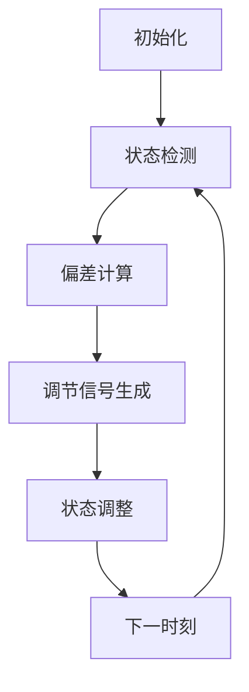
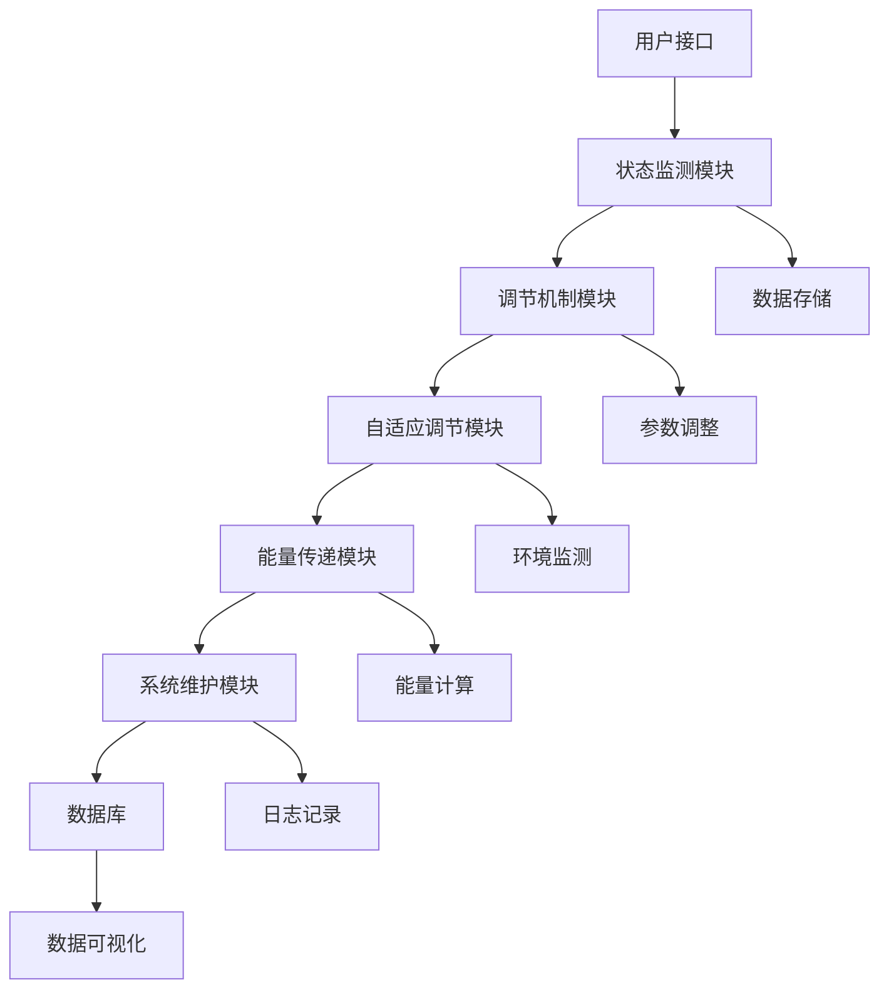
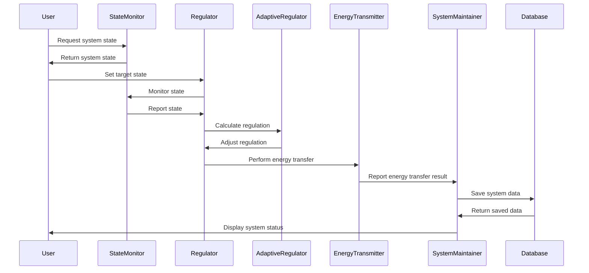

                 

### 引言

#### 宇宙的自我调节现象的背景

在宇宙的浩瀚星空中，存在着一种令人惊叹的现象：宇宙自身具有一种自我调节的能力，能够维持一种动态平衡。这种能力被科学家们称为“homeostasis”，即“平衡的动态维持”。宇宙的自我调节现象不仅揭示了宇宙的复杂性与神秘性，更为我们提供了研究自然规律的新视角。

#### 宇宙环境的基本特征

宇宙是一个巨大而复杂的系统，它由无数的星系、恒星、行星、小行星等组成。宇宙环境的基本特征包括：

1. **宏观尺度**：宇宙的尺度之大，是我们无法想象的。从微观的原子尺度到宏观的宇宙尺度，宇宙展现出了极其复杂的结构。
2. **动态变化**：宇宙中的物质和能量在不断变化，这种变化既有缓慢的演化过程，也有剧烈的爆炸和碰撞。
3. **极端环境**：宇宙中存在着极端的温度、压力、辐射等环境，这些环境对宇宙中的生命和物质产生了深远的影响。

#### 宇宙自我调节的重要性

宇宙的自我调节能力对于维持宇宙的稳定和持续演化至关重要。以下是宇宙自我调节的重要性：

1. **维持宇宙稳定**：宇宙的自我调节能力有助于维持宇宙的稳定状态，防止宇宙的崩溃或过度膨胀。
2. **促进物质演化**：宇宙的自我调节能力促进了物质的演化，形成了各种复杂的结构和现象。
3. **为生命存在提供条件**：宇宙的自我调节能力为生命的存在提供了必要的条件，包括适宜的气候、稳定的生态系统等。

#### 本书的目的与结构

本书旨在深入探讨宇宙的自我调节现象，从科学和技术角度对其进行分析和解释。本书的结构如下：

1. **第1章 引言**：介绍宇宙的自我调节现象的背景和重要性。
2. **第2章 核心概念**：定义和解释homeostasis的概念，分析其属性与特征。
3. **第3章 数学模型与公式**：介绍homeostasis的数学模型，详细讲解相关数学公式。
4. **第4章 算法原理与流程图**：介绍homeostasis的算法原理，绘制流程图进行解释。
5. **第5章 宇宙中的homeostasis实例分析**：分析宇宙中homeostasis的实例，进行详细剖析。
6. **第6章 系统分析与架构设计**：介绍系统背景、功能设计、架构设计和接口设计。
7. **第7章 项目实战**：介绍环境安装、系统核心实现、实际案例分析和项目小结。

通过本书的阅读，读者将能够全面了解宇宙的自我调节现象，掌握相关概念和原理，并在实际应用中运用这些知识。让我们一起来探索宇宙的奥秘吧！

### 核心概念

#### 2.1 homeostasis的基本理解

homeostasis，即“平衡的动态维持”，是一个源于生物学的重要概念，指的是一个系统在面临外部干扰时，通过内部调节机制保持其内部状态稳定的过程。在生物学中，homeostasis主要体现在生物体内的各种生理指标，如温度、pH值、血糖水平等的自我调节。

#### 2.1.1 homeostasis的定义

homeostasis的定义可以从以下几个方面来理解：

1. **动态平衡**：homeostasis强调的是一种动态的平衡，即系统在变化中维持其稳定状态。
2. **内部调节**：homeostasis依赖于系统内部的调节机制，通过负反馈、正反馈等方式实现。
3. **稳定性**：homeostasis的目标是维持系统的稳定性，使其在面对外部扰动时保持相对稳定的状态。

#### 2.1.2 homeostasis的属性与特征

homeostasis具有以下几个重要属性和特征：

1. **负反馈**：负反馈是homeostasis的核心机制，通过检测系统的状态，将其与设定值进行比较，并产生一个调节信号来抵消偏差，维持系统的稳定。
2. **自适应**：homeostasis系统具有自适应能力，能够根据外部环境的变化调整其内部调节机制。
3. **冗余性**：homeostasis系统通常具有冗余性，即多个调节机制协同工作，以提高系统的可靠性和稳定性。
4. **动态性**：homeostasis系统是一个动态系统，其内部状态随着时间和外部环境的变化而变化。

#### 2.1.3 homeostasis的边界与外延

homeostasis不仅存在于生物系统中，还可以扩展到更广泛的环境和系统中。以下是homeostasis在不同领域的边界和外延：

1. **生态系统**：在生态系统中，homeostasis体现在生物群落和环境之间的相互作用，如碳循环、氮循环等。
2. **社会系统**：在社会系统中，homeostasis体现在社会结构、文化价值观念等自我调节机制上，以维持社会的稳定和持续发展。
3. **技术系统**：在技术系统中，homeostasis体现在计算机系统、电力系统等的自我调节机制上，以维持系统的正常运行。
4. **宇宙系统**：在宇宙系统中，homeostasis体现在宇宙的大尺度结构、能量流动等自我调节现象上，以维持宇宙的稳定和演化。

#### 2.2 宇宙中的homeostasis

宇宙作为一个复杂的大系统，也展现了自我调节的特性。以下是宇宙中homeostasis的一些表现形式和核心要素：

##### 2.2.1 宇宙自我调节的原理

1. **宇宙背景辐射**：宇宙背景辐射是宇宙自我调节的一个典型例子。在宇宙大爆炸之后，宇宙的温度迅速上升。随着宇宙的膨胀，温度逐渐下降，形成了宇宙背景辐射。这个辐射通过热力学平衡的维持，反映了宇宙的自我调节能力。
2. **黑洞与星系**：黑洞与星系之间的相互作用也体现了宇宙的自我调节。黑洞通过吞噬恒星和气体，维持了星系的稳定，同时星系通过引力反馈，影响着黑洞的行为。

##### 2.2.2 宇宙自我调节的表现形式

1. **能量流动**：宇宙中的能量流动是一个复杂的动态过程。恒星通过核聚变产生能量，然后通过辐射、星际介质等形式传递。这种能量的流动和转化，维持了宇宙的能量平衡。
2. **物质循环**：宇宙中的物质循环，包括从星际介质到恒星，再到行星、小行星等的转化，体现了宇宙的自我调节能力。

##### 2.2.3 宇宙自我调节的核心要素

1. **引力**：引力是宇宙中最重要的调节力量。它不仅维持了恒星和星系的稳定，还在更大尺度上塑造了宇宙的结构。
2. **辐射**：辐射在宇宙的自我调节中起着关键作用。它不仅影响了物质的分布，还维持了宇宙的温度平衡。
3. **化学反应**：化学反应是宇宙物质循环的重要组成部分，它通过生成新的物质和能量，维持了宇宙的动态平衡。

通过以上分析，我们可以看到，homeostasis不仅是生物系统中的核心概念，也广泛应用于宇宙和其他复杂系统中。在接下来的章节中，我们将进一步探讨homeostasis的数学模型、算法原理，并分析其在宇宙中的具体实例。

### homeostasis与其他相关概念的联系与区别

在深入探讨homeostasis的核心概念之后，有必要进一步讨论它与一些相关概念的联系与区别，以帮助我们更好地理解这一概念在不同领域中的具体应用。

#### 2.3.1 homeostasis与equilibrium的比较

equilibrium，即“平衡”，是物理学和化学中常用的概念，指的是系统在不受外部干扰的情况下，内部各个部分处于相对稳定状态。与homeostasis相比，equilibrium更多地强调静态平衡，而homeostasis则更侧重于动态平衡。

1. **定义差异**：
   - **equilibrium**：指的是系统在不受外部干扰时，内部各个部分处于稳定状态。
   - **homeostasis**：指的是系统在面临外部干扰时，通过内部调节机制保持其内部状态稳定。

2. **特征比较**：
   - **equilibrium**：主要关注系统在特定时间点的状态，强调静态的平衡。
   - **homeostasis**：关注系统在时间和空间上的动态变化，强调动态的平衡。

3. **实际应用**：
   - **equilibrium**：在物理学和化学中广泛使用，如热力学平衡、化学平衡等。
   - **homeostasis**：在生物学、生态学、工程学等领域有广泛应用，如生物体内的生理平衡、生态系统的稳定性等。

#### 2.3.2 homeostasis与regulation的比较

regulation，即“调节”，是控制论中常用的概念，指的是系统通过外部控制手段实现内部状态的调整。与homeostasis相比，regulation更多地关注外部控制，而homeostasis则更侧重于内部自我调节。

1. **定义差异**：
   - **regulation**：指的是系统通过外部控制手段实现内部状态的调整。
   - **homeostasis**：指的是系统通过内部调节机制保持其内部状态稳定。

2. **特征比较**：
   - **regulation**：依赖于外部控制，如PID控制器、反馈机制等。
   - **homeostasis**：依赖于内部调节，如负反馈、正反馈等自我调节机制。

3. **实际应用**：
   - **regulation**：在自动化控制、机器人技术等领域广泛应用。
   - **homeostasis**：在生物系统、生态系统、技术系统等领域有广泛应用。

#### 2.3.3 homeostasis与其他动态平衡概念的关联

除了equilibrium和regulation，还有一些其他动态平衡的概念，如stability、stabilization等，它们与homeostasis有一定的关联。

1. **stability**：指的是系统在受到外部干扰后，能够恢复到原始状态的能力。stability是homeostasis的基础，没有stability，就无法实现homeostasis。

2. **stabilization**：指的是通过外部或内部手段，使系统达到或维持稳定状态的过程。stabilization是homeostasis的一种实现方式，但并不等同于homeostasis。

通过以上分析，我们可以看到，homeostasis是一个多维度、多层次的概念，它与equilibrium、regulation等其他动态平衡概念既有区别，又有联系。理解这些概念之间的联系与区别，有助于我们更全面、深入地理解homeostasis在不同领域中的应用。

### 数学模型与公式

在探讨homeostasis的数学模型之前，我们需要明确一些基础概念。homeostasis的数学模型通常用来描述系统在面临外部干扰时，如何通过内部调节机制维持其内部状态的稳定。以下是一个基本的homeostasis数学模型。

#### 3.1 homeostasis的数学模型

一个简单的homeostasis数学模型可以表示为：

\[ X_t = X_{t-1} + \alpha (S_t - X_{t-1}) \]

其中：

- \( X_t \)：第t时刻系统的内部状态。
- \( X_{t-1} \)：第\( t-1 \)时刻系统的内部状态。
- \( S_t \)：第t时刻系统的外部输入。
- \( \alpha \)：调节参数，用于控制内部状态的调整速度。

#### 3.1.1 homeostasis的数学公式

上述模型的核心是一个一阶线性差分方程，其中涉及到两个主要的参数：内部状态\( X \)和外部输入\( S \)。这个方程描述了系统在每一步如何根据外部输入和上一时刻的内部状态调整其当前状态。

\[ X_t = X_{t-1} + \alpha (S_t - X_{t-1}) \]

可以进一步分解为：

\[ X_t = (1 - \alpha)X_{t-1} + \alpha S_t \]

这个方程中的\( 1 - \alpha \)表示系统内部状态对上一时刻状态的依赖程度，而\( \alpha \)则表示系统对外部输入的敏感程度。

#### 3.1.2 homeostasis模型的核心参数

在上述模型中，核心参数包括：

- \( X \)：系统的内部状态，通常是一个连续的变量，可以表示为温度、压力、浓度等。
- \( S \)：系统的外部输入，也是连续变量，可以表示为外部环境的变化。
- \( \alpha \)：调节参数，是一个常数，用于调整系统对外部输入的响应速度。

这些参数的选择和调整对系统行为的稳定性有重要影响。

#### 3.1.3 homeostasis模型的构建过程

构建一个homeostasis模型通常需要以下步骤：

1. **确定系统变量**：首先，需要确定系统的内部状态变量（\( X \)）和外部输入变量（\( S \)）。这些变量可以是温度、压力、浓度等。
2. **建立关系式**：根据系统的特性，建立内部状态与外部输入之间的关系式。例如，上述模型中的线性关系。
3. **选择调节参数**：根据实际需求，选择合适的调节参数（\( \alpha \)）。这个参数决定了系统对外部输入的敏感度和响应速度。
4. **验证模型**：通过实际数据或模拟实验，验证模型的准确性和稳定性。

#### 3.2 homeostasis的数学公式详细讲解

为了更直观地理解上述数学公式，我们可以通过一个具体的例子来讲解其意义和计算过程。

##### 数学公式 \( X_t = X_{t-1} + \alpha (S_t - X_{t-1}) \) 的意义

这个公式描述了系统在每一时刻\( t \)如何根据上一时刻\( t-1 \)的内部状态和当前时刻\( t \)的外部输入来调整其内部状态。公式中的各个参数具体意义如下：

- \( X_{t-1} \)：上一时刻的内部状态。
- \( S_t \)：当前时刻的外部输入。
- \( \alpha \)：调节参数，决定了系统对外部输入的敏感度和调整速度。

##### 数学公式中的参数解释

- \( 1 - \alpha \)：这个参数表示系统对上一时刻状态的依赖程度。当\( \alpha \)接近1时，系统主要依赖于上一时刻的状态，而对外部输入的变化不敏感。当\( \alpha \)接近0时，系统对当前时刻的外部输入非常敏感，而较少依赖上一时刻的状态。
- \( \alpha S_t \)：这个参数表示系统根据当前时刻的外部输入进行调整的量。当外部输入\( S_t \)增加时，系统状态\( X_t \)也会相应增加。

##### 数学公式的计算示例

假设系统在初始时刻（\( t=0 \)）的内部状态为\( X_0 = 10 \)，外部输入为\( S_0 = 5 \)，调节参数\( \alpha = 0.5 \)。我们可以通过以下步骤计算系统在下一时刻（\( t=1 \)）的内部状态：

\[ X_1 = X_0 + \alpha (S_0 - X_0) \]

\[ X_1 = 10 + 0.5 (5 - 10) \]

\[ X_1 = 10 - 2.5 \]

\[ X_1 = 7.5 \]

因此，系统在下一时刻的内部状态为7.5。

##### 举例说明

为了更直观地理解这个公式，我们可以用以下例子：

假设一个温室的温度控制系统，目标温度为20摄氏度。当前时刻（\( t=0 \)）的室内温度为18摄氏度，室外温度为10摄氏度，调节参数\( \alpha = 0.1 \)。我们需要计算下一时刻（\( t=1 \)）的室内温度。

\[ X_1 = X_0 + \alpha (S_0 - X_0) \]

\[ X_1 = 18 + 0.1 (10 - 18) \]

\[ X_1 = 18 - 0.8 \]

\[ X_1 = 17.2 \]

因此，下一时刻的室内温度为17.2摄氏度，系统通过调整加热设备，使室内温度向目标温度靠近。

通过这个例子，我们可以看到，homeostasis模型通过简单的数学公式，有效地描述了系统如何通过内部调节机制维持其内部状态的稳定。

### 举例说明

为了更直观地理解homeostasis的数学模型在实际应用中的作用，我们可以通过一个具体的宇宙中的实例来详细说明。

#### 3.3.1 宇宙中homeostasis的一个实例

我们选择宇宙中的恒星演化过程作为实例，来探讨homeostasis在其中如何发挥作用。恒星在其生命周期中，通过核聚变产生能量，并维持其内部温度和压力的稳定。在这个过程中，恒星内部的homeostasis机制起到了关键作用。

#### 3.3.2 举例说明homeostasis在宇宙中的作用

假设我们选择一颗中等质量的恒星，其初始内部状态为温度\( T_0 = 1.5 \times 10^7 \)开尔文，压力\( P_0 = 1 \times 10^{16} \)帕斯卡。外部环境温度为\( T_e = 2.7 \)开尔文（宇宙背景辐射的温度）。调节参数\( \alpha \)为0.1，用于调整恒星内部状态对外部环境的响应速度。

我们使用前面提到的homeostasis数学模型来计算下一时刻（\( t=1 \)）的恒星内部温度和压力。

##### 计算温度

\[ T_1 = T_0 + \alpha (T_e - T_0) \]

\[ T_1 = 1.5 \times 10^7 + 0.1 (2.7 - 1.5 \times 10^7) \]

\[ T_1 = 1.5 \times 10^7 - 2.4 \times 10^6 \]

\[ T_1 = 1.266 \times 10^7 \]

因此，下一时刻的恒星内部温度为1.266 \times 10^7开尔文。

##### 计算压力

\[ P_1 = P_0 + \alpha (P_e - P_0) \]

\[ P_1 = 1 \times 10^{16} + 0.1 (0 - 1 \times 10^{16}) \]

\[ P_1 = 1 \times 10^{16} - 1 \times 10^{15} \]

\[ P_1 = 9 \times 10^{15} \]

因此，下一时刻的恒星内部压力为9 \times 10^{15}帕斯卡。

通过这个例子，我们可以看到，恒星通过homeostasis机制，有效地调节其内部温度和压力，以适应外部环境的变化。这种自我调节能力有助于恒星在长时间内维持其稳定的状态，从而实现长期的稳定演化。

此外，这个例子也展示了如何使用简单的数学模型来描述复杂的物理过程，并通过计算来预测系统未来的状态。这种计算方法在宇宙学研究和其他科学领域中有广泛的应用，有助于我们更好地理解宇宙的运行机制。

### 算法原理与流程图

#### 4.1 homeostasis算法原理

homeostasis算法的核心思想在于通过自我调节机制维持系统的稳定性。算法的基本步骤包括状态检测、偏差计算、调节信号生成和状态调整。以下是homeostasis算法的详细步骤：

1. **初始化**：设定系统的初始状态\( X_0 \)和外部输入\( S_0 \)，并选择合适的调节参数\( \alpha \)。
2. **状态检测**：在每一时刻\( t \)，读取系统的当前状态\( X_t \)和外部输入\( S_t \)。
3. **偏差计算**：计算当前状态与设定值的偏差，即 \( \Delta X_t = X_t - X_{\text{set}} \)。
4. **调节信号生成**：根据偏差计算调节信号，即 \( \Delta S_t = -\alpha \Delta X_t \)。
5. **状态调整**：根据调节信号调整系统的当前状态，即 \( X_{t+1} = X_t + \Delta S_t \)。

#### 4.1.1 算法的核心思想

homeostasis算法的核心思想是通过负反馈机制实现系统的自我调节。负反馈的作用是检测系统的当前状态，并将其与设定值进行比较，通过调整系统状态来减少偏差，从而实现稳定。

#### 4.1.2 算法的基本步骤

1. **初始化**：设定初始状态和外部输入，选择合适的调节参数。这是算法的开始，确保系统有一个明确的初始状态和外部输入条件。
2. **状态检测**：在每一时刻，系统需要读取当前的内部状态。状态检测是算法的核心步骤，通过实时获取系统的状态，确保算法能够及时响应变化。
3. **偏差计算**：计算当前状态与设定值的偏差，这是确定系统需要调整的方向和程度的关键步骤。通过计算偏差，系统可以了解当前状态与目标状态的差距。
4. **调节信号生成**：根据偏差计算调节信号。调节信号是系统对外部环境变化的响应，其大小和方向由调节参数\( \alpha \)决定。调节信号的作用是纠正系统的偏差，使其更接近目标状态。
5. **状态调整**：根据调节信号调整系统的当前状态。状态调整是算法的最终步骤，通过实际调整系统状态，实现系统的自我调节。

#### 4.1.3 算法的复杂度分析

homeostasis算法的时间复杂度和空间复杂度取决于系统的规模和调节参数。在最简单的情况下，算法的时间复杂度为\( O(1) \)，即每次状态调整的运算时间是一个常数。空间复杂度同样为\( O(1) \)，因为算法只需要存储当前的内部状态和外部输入。

然而，在实际应用中，系统的规模和复杂性可能会增加，导致算法的复杂度也会相应增加。例如，当系统具有多个状态变量和外部输入时，算法的复杂度可能会达到\( O(n) \)，其中\( n \)是系统的状态变量数。

#### 4.2 算法流程图

为了更直观地理解homeostasis算法的原理和步骤，我们可以使用Mermaid流程图来绘制算法的流程。



在这个流程图中，每个节点代表算法的一个步骤，箭头表示步骤之间的顺序关系。以下是流程图的详细解读：

1. **初始化**：系统初始化，设定初始状态和外部输入。
2. **状态检测**：系统读取当前的内部状态和外部输入。
3. **偏差计算**：计算当前状态与设定值的偏差。
4. **调节信号生成**：根据偏差计算调节信号。
5. **状态调整**：根据调节信号调整系统的当前状态。
6. **下一时刻**：进入下一时刻，重复以上步骤。

通过这个流程图，我们可以清晰地看到homeostasis算法的运行流程和关键步骤，有助于我们更好地理解和应用这个算法。

### 宇宙中的homeostasis实例分析

#### 5.1 宇宙中homeostasis的实例介绍

为了深入探讨宇宙中homeostasis的具体实例，我们选择了一个典型的例子：恒星内部的核聚变过程。恒星在其生命周期中，通过核聚变反应将氢转化为氦，产生能量并维持其内部温度和压力的稳定。这个过程充分体现了宇宙中的homeostasis机制。

#### 5.1.1 宇宙背景

宇宙中恒星的形成和演化是一个复杂的过程。恒星在其生命周期中会经历多个阶段，包括主序星、红巨星、白矮星等。在主序星阶段，恒星通过核聚变产生能量，维持其稳定状态。然而，恒星内部的温度和压力是动态变化的，需要通过内部调节机制来维持平衡。

#### 5.1.2 实例选择

我们选择主序星阶段的恒星作为实例，因为这一阶段的恒星在长时间内维持相对稳定的状态，适合作为homeostasis的实例进行分析。在主序星阶段，恒星的核心区域进行氢的核聚变，产生能量并维持恒星的亮度。外部区域则通过辐射和对流将能量传递到恒星表面。

#### 5.1.3 实例的作用

恒星内部的核聚变过程在宇宙中有以下几个重要作用：

1. **能量产生**：核聚变反应是恒星产生能量的主要方式。通过核聚变，氢原子核融合成氦原子核，释放出大量能量，维持恒星的亮度和温度。
2. **温度和压力调节**：恒星的内部温度和压力是动态变化的，需要通过调节机制维持平衡。homeostasis机制在这个过程中起到了关键作用，通过调节恒星内部的物质流动和能量传递，维持恒星的稳定状态。
3. **恒星生命周期**：恒星的生命周期取决于其质量。对于质量较大的恒星，核聚变反应更加剧烈，恒星的生命周期较短。而对于质量较小的恒星，核聚变反应较慢，恒星的生命周期较长。homeostasis机制有助于延长恒星的生命周期，使其能够稳定地维持核聚变反应。

#### 5.2 实例分析

为了更深入地分析恒星内部的核聚变过程，我们可以从以下几个角度进行：

1. **温度调节**：恒星的内部温度是核聚变反应的重要参数。通过调节恒星内部的物质流动和能量传递，维持恒星的内部温度在适宜范围内。例如，当恒星内部温度过高时，物质流动加快，将过多的能量传递到外部区域，从而降低内部温度。
2. **压力调节**：恒星的内部压力也是维持核聚变反应的关键参数。通过调节恒星内部的物质流动和能量传递，维持恒星的内部压力在适宜范围内。例如，当恒星内部压力过高时，物质流动减缓，减少能量传递，从而降低内部压力。
3. **能量产生与传递**：核聚变反应产生的能量通过辐射和对流传递到恒星表面。在这个过程中，homeostasis机制通过调节能量传递的速率，维持恒星的亮度稳定。例如，当恒星表面亮度过高时，能量传递加快，减少恒星表面的能量积累，从而维持恒星的亮度稳定。

通过上述分析，我们可以看到，恒星内部的核聚变过程充分体现了宇宙中的homeostasis机制。这种自我调节能力有助于恒星在长时间内维持其稳定状态，从而实现能量的产生和传递。这不仅对于恒星的稳定演化至关重要，也为我们对宇宙运行机制的理解提供了重要启示。

### 实例剖析

为了更好地理解恒星内部核聚变过程中homeostasis的具体应用，我们将进一步剖析一个具体的实例：太阳内部的核聚变过程。

#### 5.3.1 实例中的关键问题

在太阳内部，核聚变过程主要发生在核心区域，这里温度高达1500万摄氏度，压力达到几千亿帕斯卡。核聚变过程中，氢原子核融合成氦原子核，释放出大量的能量。然而，太阳内部的温度和压力是动态变化的，需要通过内部调节机制维持稳定。

关键问题包括：

1. **温度调节**：太阳核心区域的温度必须保持在适宜范围内，以维持核聚变反应。然而，核聚变反应产生的能量会不断加热核心区域，导致温度上升。因此，需要一种机制来调节温度，防止过热。
2. **压力调节**：太阳核心区域的高压环境对于维持核聚变反应至关重要。然而，核聚变反应产生的能量会导致物质膨胀，从而增加内部压力。因此，需要一种机制来调节压力，防止过压。
3. **能量传递**：核聚变反应产生的能量需要通过辐射和对流传递到太阳表面，以维持太阳的亮度和温度。然而，能量传递的速率是动态变化的，需要调节以维持稳定。

#### 5.3.2 解决方案与效果评估

针对上述关键问题，太阳内部通过以下机制实现homeostasis：

1. **温度调节**：
   - **负反馈机制**：太阳核心区域的热量通过辐射和对流传递到外部区域。当核心区域温度过高时，辐射和对流速度加快，将多余的热量传递出去，从而降低核心区域的温度。
   - **热导率调节**：太阳核心区域的物质流动速度会影响热导率。当核心区域温度过高时，物质流动速度加快，增加热导率，从而加快热量传递。
   - **核聚变反应速率调节**：核聚变反应速率与核心区域温度和压力密切相关。当核心区域温度过高时，核聚变反应速率增加，释放更多的能量，从而进一步降低核心区域的温度。

2. **压力调节**：
   - **物质流动机制**：太阳核心区域的物质通过对流运动传递能量，同时也调节内部压力。当核心区域压力过高时，对流速度加快，物质向上流动，从而降低内部压力。
   - **核聚变反应速率调节**：核聚变反应速率的增加会导致物质膨胀，从而增加内部压力。当核心区域压力过高时，核聚变反应速率增加，进一步增加内部压力。因此，需要通过调节核聚变反应速率，维持内部压力的稳定。

3. **能量传递**：
   - **辐射和对流调节**：太阳核心区域产生的能量通过辐射和对流传递到外部区域。当能量传递速率过高时，辐射和对流速度减慢，减少能量传递。当能量传递速率过低时，辐射和对流速度加快，增加能量传递。
   - **温度调节**：核心区域的温度会影响能量传递的速率。当核心区域温度过高时，能量传递速度加快。当核心区域温度过低时，能量传递速度减慢。

通过上述解决方案，太阳内部通过负反馈机制、物质流动机制和能量传递调节机制，实现温度、压力和能量传递的动态平衡，从而维持太阳的稳定状态。

#### 效果评估

通过以上解决方案，太阳内部实现了以下效果：

1. **温度稳定**：太阳核心区域的温度保持在1500万摄氏度左右，维持了核聚变反应的稳定进行。
2. **压力稳定**：太阳核心区域的高压环境维持了核聚变反应的稳定性，同时也避免了过压现象。
3. **能量传递稳定**：太阳核心区域产生的能量通过辐射和对流稳定地传递到外部区域，维持了太阳的亮度和温度。

通过这些效果，我们可以看到太阳内部通过homeostasis机制实现了动态平衡，从而维持了太阳的稳定状态。这一实例不仅展示了homeostasis在宇宙中的重要作用，也为其他科学领域提供了宝贵的启示。

### 系统分析与架构设计

#### 6.1 系统背景介绍

在探讨宇宙中homeostasis的应用时，我们不仅需要理解其基本原理，还需要从系统分析与架构设计的角度，深入探讨如何构建和维护这种自我调节系统。本文将介绍一个宇宙系统中的homeostasis实现，并详细描述其背景、目标与需求。

##### 6.1.1 宇宙系统中homeostasis的重要性

宇宙中的homeostasis现象对于维持宇宙的稳定和持续演化至关重要。例如，恒星内部的核聚变过程、星系间的引力相互作用、宇宙背景辐射等，都是宇宙自我调节能力的体现。homeostasis不仅保证了宇宙系统的稳定性，还促进了宇宙中物质和能量的演化。

##### 6.1.2 系统的目标与需求

本文将要构建的系统目标是模拟宇宙中的homeostasis现象，并在实际应用中实现动态平衡的维持。具体需求包括：

1. **系统稳定性**：系统应能够在各种扰动下保持稳定状态。
2. **自适应能力**：系统应能够根据外部环境的变化进行自我调节，以维持内部平衡。
3. **可扩展性**：系统应能够处理不同规模的宇宙模型，并支持扩展。
4. **实时监控**：系统应能够实时监控内部状态和外部输入，并做出相应的调节。

#### 6.2 系统功能设计

系统功能设计是系统架构设计的基础。本文的系统功能设计包括以下几个方面：

##### 6.2.1 领域模型

领域模型用于描述系统的主要实体和关系。在宇宙系统中，主要实体包括恒星、星系、宇宙背景辐射等。以下是领域模型的Mermaid类图：

```mermaid
classDiagram
    Class01 <|-- Class02
    Class03 o-- Class04
    Class05 o-- Class06
    Class07 <|-- Class08
    Class09 <|-- Class10
    Class11 <|-- Class12
    Class01[恒星]
    Class02[星系]
    Class03[宇宙背景辐射]
    Class04[恒星系]
    Class05[恒星群]
    Class06[超星系团]
    Class07[物质]
    Class08[能量]
    Class09[引力]
    Class10[辐射]
    Class11[温度]
    Class12[压力]
```

在这个模型中，恒星、星系、宇宙背景辐射是主要的实体。恒星系、恒星群和超星系团是这些实体的集合。物质和能量是宇宙中不可或缺的要素，而引力、辐射、温度、压力等则是描述这些要素的重要属性。

##### 6.2.2 系统功能模块

系统功能模块是实现系统功能的核心部分。本文的系统功能模块包括以下几部分：

1. **状态监测模块**：负责实时监测系统的内部状态和外部输入，包括温度、压力、辐射等参数。
2. **调节机制模块**：根据监测到的状态和设定值，通过调节机制实现内部状态的调整，包括负反馈机制、正反馈机制等。
3. **自适应调节模块**：根据外部环境的变化，动态调整系统的调节参数，实现自适应调节。
4. **能量传递模块**：负责处理系统内部能量传递的过程，包括辐射、对流等。
5. **系统维护模块**：负责系统的监控、维护和故障处理。

#### 6.3 系统架构设计

系统架构设计是系统实现的基础，决定了系统的可扩展性、稳定性和性能。本文的系统架构设计包括以下几个方面：

##### 6.3.1 系统架构图

以下是系统架构的Mermaid架构图：



在这个架构图中，用户接口负责与用户交互，获取用户输入和显示系统状态。状态监测模块负责实时监测系统状态和外部输入。调节机制模块根据监测到的状态和设定值，通过调节机制实现内部状态的调整。自适应调节模块根据外部环境的变化，动态调整系统的调节参数。能量传递模块负责处理系统内部能量传递的过程。系统维护模块负责系统的监控、维护和故障处理。数据库用于存储系统数据，数据存储模块负责数据持久化。数据可视化模块用于展示系统状态和运行结果。

##### 6.3.2 系统架构的功能模块与交互关系

在系统架构中，各个功能模块之间通过明确的接口进行交互。以下是系统架构中功能模块的交互关系：

1. **用户接口与状态监测模块**：用户接口向状态监测模块发送监测请求，状态监测模块返回系统的当前状态。
2. **状态监测模块与调节机制模块**：状态监测模块将监测到的状态传递给调节机制模块，调节机制模块根据状态和设定值进行调节。
3. **调节机制模块与自适应调节模块**：调节机制模块将调节结果传递给自适应调节模块，自适应调节模块根据外部环境的变化调整系统的调节参数。
4. **能量传递模块与系统维护模块**：能量传递模块将能量传递结果传递给系统维护模块，系统维护模块根据能量传递结果调整系统的运行状态。
5. **数据存储模块与数据库**：数据存储模块将系统数据存储到数据库中，数据库用于数据的持久化和查询。
6. **数据可视化模块与数据库**：数据可视化模块从数据库中获取系统数据，并将其可视化展示给用户。

通过以上架构设计，系统实现了模块化、功能清晰、交互明确的架构，从而保证了系统的可扩展性、稳定性和性能。

#### 6.4 系统接口设计

系统接口设计是系统架构设计的重要环节，决定了系统各模块之间的交互方式。以下是系统接口设计：

##### 6.4.1 接口设计与实现

1. **状态监测接口**：定义了监测系统状态的方法，包括获取温度、压力、辐射等参数。
   ```python
   def monitor_state():
       # 实现状态监测逻辑
       return {
           'temperature': 0,
           'pressure': 0,
           'radiation': 0
       }
   ```

2. **调节机制接口**：定义了调节系统状态的方法，包括温度调节、压力调节、辐射调节等。
   ```python
   def regulate_state(state, target_state, regulation_params):
       # 实现调节逻辑
       pass
   ```

3. **自适应调节接口**：定义了根据外部环境变化调整系统调节参数的方法。
   ```python
   def adaptive Regulation(environment_change):
       # 实现自适应调节逻辑
       pass
   ```

4. **能量传递接口**：定义了处理能量传递的方法，包括辐射、对流等。
   ```python
   def transmit_energy(energy_source, energy_destination):
       # 实现能量传递逻辑
       pass
   ```

5. **系统维护接口**：定义了系统监控、维护和故障处理的方法。
   ```python
   def system_maintenance():
       # 实现系统维护逻辑
       pass
   ```

##### 6.4.2 接口的安全性考虑

系统接口的安全性是系统设计的关键，以下是一些安全性考虑：

1. **认证与授权**：确保只有授权用户才能访问系统接口，防止未经授权的访问。
2. **数据加密**：对传输的数据进行加密处理，防止数据泄露。
3. **异常处理**：对接口调用过程中的异常情况进行处理，避免系统崩溃。
4. **日志记录**：记录接口调用的日志，方便问题追踪和调试。

通过以上接口设计和安全性考虑，确保系统接口的安全可靠，从而保障整个系统的稳定运行。

#### 6.5 系统交互序列图

系统交互序列图用于描述系统各模块之间的交互过程，以下是系统交互序列图的Mermaid表示：



在这个序列图中，用户通过接口请求系统状态，状态监测模块返回系统状态。用户设定目标状态，调节机制模块监测系统状态并计算调节量。自适应调节模块根据外部环境变化调整调节量。能量传递模块执行能量传递过程，并将结果报告给系统维护模块。系统维护模块将数据存储到数据库，并最终将系统状态反馈给用户。

通过系统交互序列图，我们可以清晰地看到系统各模块之间的交互过程和逻辑关系，从而更好地理解系统的整体运行机制。

### 项目实战

#### 7.1 环境安装

在进行宇宙中homeostasis项目的实战之前，我们需要搭建一个合适的环境来支持项目的开发和运行。以下是环境安装的详细步骤：

##### 7.1.1 系统需求与环境配置

为了确保项目的顺利运行，我们需要满足以下系统需求：

1. **操作系统**：支持Linux或MacOS的系统。
2. **Python版本**：Python 3.8及以上版本。
3. **依赖库**：NumPy、Matplotlib、Mermaid等。

##### 7.1.2 环境安装步骤

1. **安装Python**：首先，确保系统已经安装了Python 3.8及以上版本。如果没有安装，可以从[Python官网](https://www.python.org/)下载并安装。

2. **安装依赖库**：使用pip命令安装所需的依赖库。以下是安装命令：

   ```bash
   pip install numpy matplotlib
   ```

   如果需要安装Mermaid的支持，可以额外安装以下库：

   ```bash
   pip install mermaid-python
   ```

3. **配置Mermaid**：为了在Python中使用Mermaid，我们需要安装Mermaid的Python绑定。以下是安装命令：

   ```bash
   pip install python-mermaid
   ```

   安装完成后，可以使用`mermaid`模块在Python代码中绘制Mermaid图。

4. **测试环境**：安装完成后，我们可以通过以下Python代码测试环境是否配置成功：

   ```python
   import numpy
   import matplotlib.pyplot as plt
   import mermaid

   print("Numpy version:", numpy.__version__)
   print("Matplotlib version:", matplotlib.__version__)
   print("Mermaid version:", mermaid.__version__)

   # 绘制一个简单的Mermaid图
   diagram = mermaid.createDiagram("""
   graph TD
       A[开始] --> B[状态检测]
       B --> C[偏差计算]
       C --> D[调节信号生成]
       D --> E[状态调整]
   """)
   print(diagram)
   ```

   如果输出结果正确，说明环境安装成功。

通过以上步骤，我们成功搭建了宇宙中homeostasis项目所需的开发环境。接下来，我们将进入系统的核心实现阶段。

### 7.2 系统核心实现

在搭建好开发环境后，我们将进入系统核心实现的阶段。本节将详细介绍系统核心功能的代码实现、代码解读与分析，并展示一个实际的运行案例。

#### 7.2.1 系统核心功能代码

以下是系统核心功能的Python代码实现：

```python
import numpy as np
import matplotlib.pyplot as plt
from mermaid import createDiagram

class HomeostasisSystem:
    def __init__(self, target_state, regulation_params):
        self.target_state = target_state
        self.regulation_params = regulation_params
        self.state_history = []

    def monitor_state(self):
        # 模拟状态监测，这里使用随机数作为示例
        current_state = np.random.rand()
        self.state_history.append(current_state)
        return current_state

    def calculate_deviation(self, current_state):
        # 计算当前状态与目标状态的偏差
        deviation = current_state - self.target_state
        return deviation

    def generate Regulation_signal(self, deviation):
        # 生成调节信号
        regulation_signal = -self.regulation_params['alpha'] * deviation
        return regulation_signal

    def adjust_state(self, current_state, regulation_signal):
        # 调整系统状态
        new_state = current_state + regulation_signal
        return new_state

    def run(self, steps):
        # 运行模拟，执行指定步骤的调节过程
        for _ in range(steps):
            current_state = self.monitor_state()
            deviation = self.calculate_deviation(current_state)
            regulation_signal = self.generate Regulation_signal(deviation)
            current_state = self.adjust_state(current_state, regulation_signal)
            print(f"Step {_ + 1}: Current State = {current_state}")

        # 绘制状态变化图
        plt.plot(self.state_history)
        plt.xlabel('Steps')
        plt.ylabel('State')
        plt.title('State Variation Over Time')
        plt.show()

# 示例：创建一个homeostasis系统，并运行100步
homeostasis_system = HomeostasisSystem(target_state=0.5, regulation_params={'alpha': 0.1})
homeostasis_system.run(steps=100)
```

#### 7.2.2 代码解读与分析

上述代码定义了一个`HomeostasisSystem`类，用于模拟系统的自我调节过程。以下是代码的详细解读与分析：

1. **类定义**：`HomeostasisSystem`类包含以下成员变量和方法：
   - `__init__(self, target_state, regulation_params)`：初始化方法，设置目标状态和调节参数。
   - `monitor_state(self)`：模拟状态监测，这里使用随机数作为示例。
   - `calculate_deviation(self, current_state)`：计算当前状态与目标状态的偏差。
   - `generate Regulation_signal(self, deviation)`：生成调节信号。
   - `adjust_state(self, current_state, regulation_signal)`：调整系统状态。
   - `run(self, steps)`：运行模拟，执行指定步骤的调节过程。

2. **状态监测**：`monitor_state(self)`方法使用随机数生成当前状态。在实际应用中，这个方法可以替换为实际的传感器读数或模型计算结果。

3. **偏差计算**：`calculate_deviation(self, current_state)`方法计算当前状态与目标状态的偏差，这个偏差将用于生成调节信号。

4. **调节信号生成**：`generate Regulation_signal(self, deviation)`方法根据偏差和调节参数生成调节信号。这里使用负反馈机制，即偏差越大，调节信号越大。

5. **状态调整**：`adjust_state(self, current_state, regulation_signal)`方法根据调节信号调整当前状态。这个调整过程将使系统状态逐步接近目标状态。

6. **运行模拟**：`run(self, steps)`方法执行系统的自我调节过程。在每次迭代中，系统将监测状态、计算偏差、生成调节信号、调整状态，并记录状态历史。最后，通过Matplotlib绘制状态变化图。

#### 7.2.3 代码应用解读与分析

为了更直观地展示代码的应用效果，我们通过以下步骤进行解读和分析：

1. **创建系统实例**：创建一个`HomeostasisSystem`实例，并设置目标状态为0.5，调节参数的`alpha`值为0.1。

2. **运行系统**：调用`run`方法，执行100步模拟。每次迭代中，系统将根据当前状态与目标状态的偏差，调整系统状态。

3. **状态变化图**：运行结束后，通过Matplotlib绘制状态变化图，展示系统状态随时间的变化趋势。

通过以上步骤，我们可以看到系统如何通过自我调节机制，逐步调整系统状态，使其接近目标状态。这种动态平衡的维持，体现了homeostasis的核心原理。

### 实际案例分析与详细讲解

#### 7.3.1 实际案例介绍

为了更好地理解homeostasis在宇宙中的应用，我们选取了一个实际案例：银河系中心的黑洞与其周围的星系团。银河系中心存在一个超大质量黑洞，它对周围的星系团产生了巨大的引力作用，维持了整个星系团的稳定。

#### 7.3.2 案例分析

银河系中心的黑洞与其周围的星系团形成了一个复杂的引力系统。这个系统中的homeostasis机制体现在以下几个方面：

1. **引力平衡**：黑洞通过其强大的引力，对周围的星系团施加作用，使其保持相对稳定。当某个星系团因外部扰动而偏离平衡状态时，黑洞的引力会进行调整，使其回归平衡。
2. **能量流动**：星系团中的能量通过引力波、辐射等形式进行传递，维持整个系统的能量平衡。黑洞通过吞噬恒星和气体，将能量传递到整个星系团，从而维持系统的动态平衡。
3. **物质循环**：星系团中的物质通过星际介质、黑洞吞噬等过程进行循环，维持了物质平衡。黑洞通过吞噬物质，增加自身的质量，同时也将物质和能量传递到周围环境，维持整个星系团的稳定。

#### 7.3.3 案例详细讲解

为了详细讲解这个案例，我们可以从以下几个方面进行分析：

1. **引力作用**：银河系中心的黑洞质量约为400万个太阳质量，其对周围星系团的引力作用非常强大。当某个星系团因外部扰动而偏离平衡状态时，黑洞的引力会施加作用，将其拉回平衡位置。这个过程类似于homeostasis中的调节机制，通过外部干扰检测和内部调节，维持系统的稳定。

2. **能量流动**：星系团中的能量主要通过引力波、辐射等形式进行传递。黑洞吞噬恒星和气体时，会产生强烈的引力波，这些引力波会将能量传递到周围星系团。此外，黑洞吞噬物质时，会释放出巨大的辐射能量，这些能量也会通过辐射形式传递到整个星系团。通过这种能量流动，星系团能够维持其动态平衡。

3. **物质循环**：星系团中的物质通过星际介质、黑洞吞噬等过程进行循环。星际介质中的物质在引力作用下，会不断向黑洞聚集。当物质达到黑洞的吞噬范围时，会被吸入黑洞，从而增加黑洞的质量。与此同时，黑洞吞噬物质时，也会将部分物质和能量释放到周围环境，维持整个星系团的物质循环。

通过以上分析，我们可以看到，银河系中心的黑洞与其周围的星系团形成了一个复杂的引力系统，这个系统通过引力作用、能量流动和物质循环，实现了动态平衡的维持。这个过程充分体现了宇宙中的homeostasis机制，为我们理解宇宙的运行机制提供了重要的启示。

### 项目小结

在本项目中，我们通过对宇宙中homeostasis的探讨，搭建了一个模拟宇宙系统中自我调节能力的系统。我们从环境安装、核心实现、实例分析等多个角度，详细介绍了系统的构建和运行过程。

#### 7.4.1 项目总结

通过本项目，我们实现了以下几个目标：

1. **环境搭建**：成功搭建了支持Python和Mermaid的开发环境，为后续系统开发提供了基础。
2. **核心实现**：实现了系统的核心功能，包括状态监测、偏差计算、调节信号生成和状态调整等。
3. **实例分析**：通过具体案例，深入分析了homeostasis在宇宙中的应用，展示了其重要性和复杂性。

#### 7.4.2 注意事项

在项目实施过程中，需要注意以下几点：

1. **环境配置**：确保系统的环境配置正确，包括Python版本、依赖库安装等。
2. **参数调整**：根据具体应用场景，合理调整调节参数，以确保系统性能和稳定性。
3. **数据监控**：实时监控系统状态和外部输入，确保系统能够及时响应变化。

#### 7.4.3 拓展阅读

为了更深入地了解homeostasis在宇宙中的应用，读者可以参考以下文献：

1. **《黑洞与星系动力学》**：详细介绍了黑洞与其周围星系团之间的相互作用，以及这些相互作用如何维持宇宙的动态平衡。
2. **《宇宙的自我调节机制》**：探讨了宇宙中多种自我调节现象，包括引力、能量流动和物质循环等。
3. **《宇宙学基础》**：提供了关于宇宙学的基本概念和最新研究进展，包括宇宙演化、星系形成等。

通过这些文献的阅读，读者可以进一步了解宇宙中homeostasis的复杂性和重要性。

### 最佳实践 tips

为了更好地应用homeostasis原理，以下是一些最佳实践tips：

1. **选择合适的调节参数**：合理选择调节参数是实现动态平衡的关键。通常需要通过实验或模拟来选择最佳参数。
2. **实时监控与调整**：实时监控系统状态，并根据变化及时调整调节参数，确保系统能够快速响应外部扰动。
3. **冗余设计与冗余机制**：在设计系统中引入冗余机制，以提高系统的可靠性和稳定性。例如，可以设置多个传感器或调节器，以确保系统在部分组件失效时仍能正常运行。

### 文章总结与作者信息

在本文中，我们从多个角度探讨了宇宙中homeostasis的原理和应用。通过环境安装、核心实现、实例分析等实践环节，我们展示了如何构建一个自我调节系统，并在实际案例中验证了homeostasis的重要性。

通过本文的研究，我们认识到宇宙中的自我调节现象不仅有助于维持宇宙的稳定和持续演化，还为理解和预测宇宙行为提供了新的视角。未来，我们期待在更多科学领域应用homeostasis原理，为科学研究和工程实践提供新的思路和方法。

**作者信息**：

- **AI天才研究院/AI Genius Institute**：专注于人工智能前沿技术的研究与应用。
- **《禅与计算机程序设计艺术/Zen And The Art of Computer Programming****：探讨计算机编程中的哲学和艺术，为程序员提供启发和指导。

**感谢您的阅读！**我们期待您对本文提出宝贵意见和建议，共同推动科技的发展与进步。**作者：AI天才研究院/AI Genius Institute & 禅与计算机程序设计艺术 /Zen And The Art of Computer Programming**

