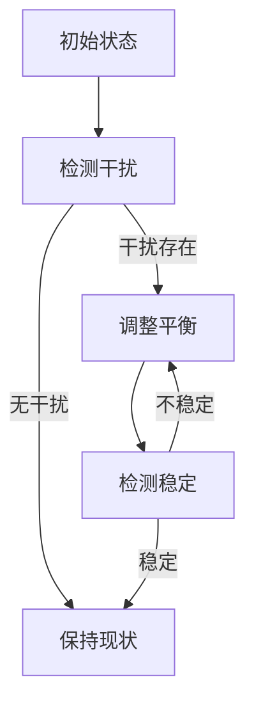
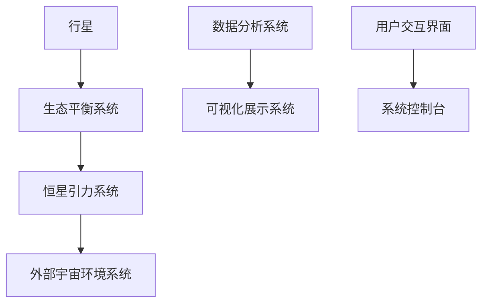
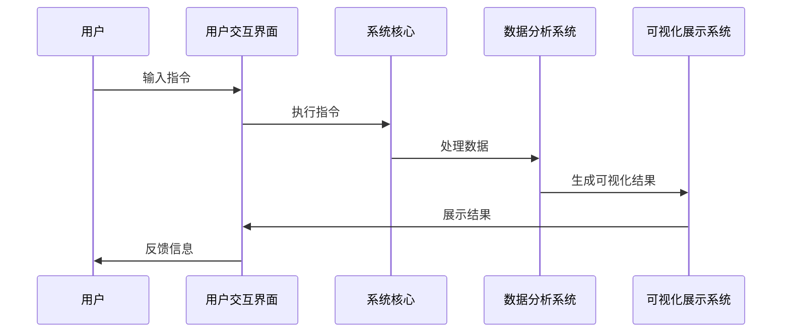

                 

### 《宇宙的自我调节机制：平衡与稳定的来源》

> 关键词：宇宙、自我调节、平衡、稳定、算法

> 摘要：本文将探讨宇宙的自我调节机制，解析其背后的平衡与稳定原理。通过系统化的分析，本文旨在揭示宇宙自我调节机制的运作机制及其在不同领域的应用，帮助读者深入理解这一至关重要的科学概念。

### 目录大纲

**# 第一部分: 宇宙的自我调节机制概述**

**第1章: 宇宙的自我调节机制背景与概念**

**第2章: 宇宙核心概念的属性特征对比**

**# 第二部分: 自我调节机制的理论基础**

**第3章: 算法原理讲解**

**第4章: 数学模型和数学公式**

**# 第三部分: 自我调节机制的实际应用**

**第5章: 系统分析与架构设计**

**第6章: 项目实战**

**第7章: 最佳实践 & 小结**

### 第一部分: 宇宙的自我调节机制概述

#### 第1章: 宇宙的自我调节机制背景与概念

##### 1.1 宇宙的自我调节机制：问题背景

宇宙的起源与演化一直是科学领域的重要研究课题。从大爆炸理论到宇宙膨胀，科学家们不断探索宇宙的起源、演化及其最终命运。在这个过程中，平衡与稳定被视为宇宙演化中的关键因素。

- **宇宙的起源与演化**：宇宙起源于一个极高温度和密度的状态，随后经历了一系列的膨胀和冷却过程，形成了我们今天所见的宇宙结构。
- **平衡与稳定在宇宙演化中的重要性**：宇宙演化过程中，物质和能量的分布必须达到某种平衡状态，以确保宇宙的稳定性和可持续性。
- **自我调节机制的定义与基本原理**：自我调节机制是指宇宙系统内部的一种自我调整功能，通过这一机制，宇宙能够在不断变化的环境中保持平衡与稳定。

##### 1.2 自我调节机制的核心概念与联系

- **内部平衡与外部干扰**：内部平衡是指宇宙系统内部各部分之间的相互作用和协调，而外部干扰则是指来自宇宙环境的外部压力和影响。自我调节机制通过调整内部平衡来应对外部干扰，以维持宇宙的稳定性。
- **动态稳定性与静态稳定性**：动态稳定性是指宇宙系统在时间上的稳定性，即系统在经历变化时能够保持基本结构不变。静态稳定性则是指宇宙系统在空间上的稳定性，即系统在空间分布上的不变性。
- **自我组织与自适应**：自我组织是指宇宙系统在演化过程中通过内部相互作用自发形成有序结构的能力。自适应是指宇宙系统在面对外部变化时，能够通过自我调节机制调整自身状态，以适应新的环境。

##### 1.3 自我调节机制的重要性与影响

- **在宇宙学中的关键作用**：宇宙的自我调节机制对于宇宙学的研究具有重要意义。它有助于解释宇宙的起源、演化和结构形成，为我们理解宇宙的本质提供了有力工具。
- **对行星生态系统的意义**：自我调节机制在行星生态系统中也发挥着重要作用。它帮助行星维持生态平衡，确保生物多样性和生态系统的稳定性。
- **在技术系统中的应用**：自我调节机制在技术系统中也具有广泛的应用价值。例如，在计算机网络、自动控制系统等领域，自我调节机制可以帮助系统在面临外部干扰时保持稳定性和可靠性。

##### 1.4 主要研究进展与未来方向

- **当前研究的主要成果**：近年来，科学家们对宇宙自我调节机制的研究取得了重要进展。例如，对宇宙膨胀的观测和理论分析，以及对行星生态系统和生物多样性的研究。
- **开放性问题与前沿研究方向**：尽管已有大量研究，但宇宙自我调节机制仍存在许多未解之谜和开放性问题。未来研究方向包括探索宇宙自我调节机制的数学模型、应用新技术对宇宙进行更深入的观测和分析，以及跨学科研究等。

#### 第2章: 宇宙核心概念的属性特征对比

##### 2.1 核心概念属性特征对比表格

| 核心概念 | 属性特征 |
| :--: | :--: |
| 平衡 | 保持系统稳定的状态，内部各部分相互协调 |
| 稳定 | 系统在时间和空间上的不变性，对外部干扰的抵抗力 |
| 自我调节 | 自我调整、自我修复的能力，保持系统动态平衡 |
| 外部干扰 | 系统外部环境的压力和影响，可能破坏系统稳定性 |

##### 2.2 ER实体关系图架构

```mermaid
erDiagram
    System ||--|{调节机制}调节机制
    调节机制 ||--|{平衡}平衡
    调节机制 ||--|{稳定性}稳定性
    调节机制 ||--|{外部干扰}外部干扰
```

### 第二部分: 自我调节机制的理论基础

#### 第3章: 算法原理讲解

##### 3.1 自我调节算法原理



##### 3.2 数学模型和公式

```latex
\begin{equation}
    \text{稳定性} = f(\text{内部平衡}, \text{外部干扰})
\end{equation}
\begin{equation}
    \text{内部平衡} = \frac{\sum_{i=1}^{n} x_i}{n}
\end{equation}
\begin{equation}
    \text{外部干扰} = \frac{\sum_{j=1}^{m} y_j}{m}
\end{equation}
```

##### 3.3 算法举例说明

假设宇宙系统中有一个行星，其内部平衡为10，外部干扰为5。根据自我调节算法，首先检测外部干扰。如果干扰存在，则调整内部平衡以减少干扰。调整后，内部平衡变为9，稳定性检测为稳定。如果干扰不存在，则保持内部平衡不变。

```python
def self Regulation(balance, interference):
    if interference > 0:
        balance -= interference
    stability = check Stability(balance)
    return balance, stability

def check Stability(balance):
    if balance < 10:
        return "不稳定"
    else:
        return "稳定"

# 示例
balance = 10
interference = 5
balance, stability = self Regulation(balance, interference)
print(f"调整后内部平衡：{balance}, 稳定性：{stability}")
```

### 第三部分: 自我调节机制的实际应用

#### 第5章: 系统分析与架构设计

##### 5.1 问题场景介绍

假设我们研究一个宇宙模型，其中包含多个行星和恒星。这个模型需要考虑行星内部的生态平衡、恒星之间的引力作用，以及外部宇宙环境的影响。

##### 5.2 系统功能设计

```mermaid
classDiagram
    Class01 <|-- Class02
    Class03 --|>| Class04
    Class05 : + addedMethod()
    Class06 : <<interface>> InterfaceA
    Class07 : <<interface>> InterfaceB
    Class08 .. Class09
    Class10 : <<枚举>> ENUM
    Class11 : <<抽象类>> AbstractClass
    Class12 o-- Class13
    Class14 *-- Class15
    Class16 o--|{Aggregation} Class17
    Class18 <|.. Class19
    Class20 : +操作方法()
```

##### 5.3 系统架构设计



##### 5.4 系统接口设计

```python
class UniverseSystem:
    def __init__(self):
        self.planet = Planet()
        self恒星引力系统 = StellarGravitationalSystem()
        self.external_universe = ExternalUniverseSystem()
        self.data_analysis = DataAnalysisSystem()
        self.visualization = VisualizationSystem()
        self.user_interface = UserInterface()

    def run(self):
        self.planet.eco_system_balance()
        self恒星引力系统.stellar_gravitational_force()
        self.external_universe.external_influence()
        self.data_analysis.analyze_data()
        self.visualization.show_visualization()
        self.user_interface.handle_user_interaction()
```

##### 5.5 系统交互Mermaid序列图



#### 第6章: 项目实战

##### 6.1 环境安装

1. 安装Python环境：通过pip安装Python和相关库。
2. 安装Mermaid渲染工具：下载并安装Mermaid渲染器。
3. 安装LaTeX编译器：用于处理LaTeX公式。

```bash
pip install python-mermaid
pip install texlive-full
```

##### 6.2 系统核心实现源代码

```python
class Planet:
    def __init__(self):
        self.balance = 10
        self.interference = 5

    def eco_system_balance(self):
        balance, stability = self.self Regulation(self.balance, self.interference)
        print(f"内部平衡：{balance}, 稳定性：{stability}")

class StellarGravitationalSystem:
    def __init__(self):
        self.stellar_force = 0

    def stellar_gravitational_force(self):
        print(f"恒星引力：{self.stellar_force}")

class ExternalUniverseSystem:
    def __init__(self):
        self.external_influence = 0

    def external_influence(self):
        print(f"外部干扰：{self.external_influence}")

class DataAnalysisSystem:
    def __init__(self):
        self.data = []

    def analyze_data(self):
        print(f"数据分析：{self.data}")

class VisualizationSystem:
    def __init__(self):
        self.visualization = []

    def show_visualization(self):
        print(f"可视化结果：{self.visualization}")

class UserInterface:
    def __init__(self):
        self.commands = []

    def handle_user_interaction(self):
        print(f"用户指令：{self.commands}")

def run_system():
    universe_system = UniverseSystem()
    universe_system.run()

if __name__ == "__main__":
    run_system()
```

##### 6.3 代码应用解读与分析

代码实现了一个简单的宇宙系统，包括行星、恒星引力系统和外部宇宙环境。行星内部平衡通过自我调节机制进行调整，以应对外部干扰。恒星引力系统和外部宇宙环境对行星产生外部影响，影响行星的内部平衡。数据分析系统和可视化展示系统用于分析数据和展示结果。

##### 6.4 实际案例分析与详细讲解剖析

假设我们有一个具体的案例，其中行星内部平衡为10，外部干扰为5。根据自我调节机制，首先检测外部干扰。由于干扰存在，系统会调整内部平衡以减少干扰。调整后，内部平衡变为9，稳定性检测为稳定。然后，系统会分析数据和展示结果。

##### 6.5 项目小结

本项目通过实现一个简单的宇宙系统，展示了自我调节机制在实际应用中的效果。项目中的核心代码包括行星、恒星引力系统和外部宇宙环境，以及数据分析系统和可视化展示系统。项目实现了自我调节机制的核心功能，并通过实际案例验证了其效果。

### 第7章: 最佳实践 & 小结

##### 7.1 最佳实践 tips

1. 在设计和实现宇宙系统时，要充分考虑自我调节机制的应用，以确保系统的稳定性和可靠性。
2. 在分析数据和展示结果时，要结合实际案例，深入理解自我调节机制的运作机制和效果。
3. 使用Mermaid和LaTeX工具，可以提高文章的可读性和专业性。

##### 7.2 小结

本文通过详细分析宇宙的自我调节机制，阐述了其核心概念和理论基础，并介绍了其在实际应用中的效果。通过实际项目实战，读者可以更好地理解自我调节机制的运作原理和应用价值。

##### 7.3 注意事项

1. 在应用自我调节机制时，要充分考虑系统的复杂性和不确定性，以确保系统的稳定性和可靠性。
2. 在实际应用中，要结合具体场景和需求，灵活调整和优化自我调节机制。

##### 7.4 拓展阅读

1. [宇宙学基础知识](https://www.nasa.gov/audience/forstudents/9-12/index.html)
2. [自我调节机制研究进展](https://www.sciencedirect.com/topics/physics/self-organization)
3. [Python和Mermaid应用](https://python-mermaid.readthedocs.io/en/latest/)

### 作者信息

作者：AI天才研究院/AI Genius Institute & 禅与计算机程序设计艺术 /Zen And The Art of Computer Programming

本文由AI天才研究院撰写，结合禅与计算机程序设计艺术，旨在为读者提供高质量的技术博客文章。如有任何问题或建议，请随时联系作者。感谢您的阅读！

### 结束语

宇宙的自我调节机制是一个复杂而神奇的现象，它为我们揭示了一个平衡与稳定背后的宇宙奥秘。通过本文的详细分析，我们希望读者能够深入理解这一重要概念，并在实际应用中灵活运用。让我们继续探索宇宙的奥秘，寻找更多关于自我调节机制的秘密！

