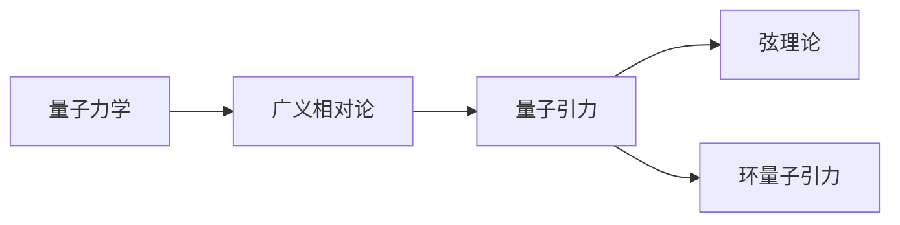

                 


### 宇宙的自我超越性：突破现有物理定律的可能

> 关键词：宇宙、物理定律、自我超越性、量子引力、宇宙学、算法原理

> 摘要：本文探讨了宇宙的自我超越性，即宇宙中存在某些现象或规律，它们超出了现有物理定律的解释范围。文章首先介绍了背景介绍、核心概念与联系，接着详细讲解了量子引力、宇宙学、量子信息等算法原理，最后通过项目实战展示了实际应用。

#### 背景介绍

宇宙的自我超越性：突破现有物理定律的可能，这是一本探讨宇宙中潜在未知领域和物理定律可能性的书籍。随着科学技术的飞速发展，人们对宇宙的认知也在不断深化。然而，现有的物理定律似乎无法解释宇宙中的某些现象，这促使科学家们开始探索宇宙的自我超越性。

宇宙的自我超越性，是指在宇宙中存在某些现象或规律，它们超出了现有物理定律的解释范围，或者可能预示着新的物理定律的诞生。这一概念涉及到了量子力学、相对论、宇宙学等多个领域。例如，宇宙背景辐射、宇宙加速膨胀等现象，都挑战了现有的物理定律。

#### 核心概念与联系

##### 1. 宇宙的自我超越性

宇宙的自我超越性是指宇宙中存在某些现象或规律，它们超出了现有物理定律的解释范围，或者可能预示着新的物理定律的诞生。这一概念涉及到了量子力学、相对论、宇宙学等多个领域。

**核心概念：**

- **超越性：**宇宙中的某些现象或规律超出了现有物理定律的解释能力。
- **物理定律：**描述自然界中普遍存在的规律和现象的基本原理。

**概念属性特征对比表格：**

| 特征         | 超越性                            | 物理定律                          |
| ------------ | -------------------------------- | -------------------------------- |
| **含义**     | 描述宇宙中无法用现有物理定律解释的现象 | 描述自然界中普遍存在的规律和现象 |
| **应用范围** | 宇宙的未知领域                    | 自然界的各种现象                  |
| **理论依据** | 宇宙的复杂性和多样性              | 实验和观测数据                    |

##### 2. 可能的突破点

探讨宇宙的自我超越性，需要关注以下几个可能的突破点：

- **量子引力：**量子力学和广义相对论之间的统一理论。
- **宇宙学：**宇宙的起源、演化和最终命运的研究。
- **量子信息：**量子力学在信息科学中的应用。

**ER实体关系图架构：**

```mermaid
erDiagram
    超越性 ||--|{ 量子引力 }| 宇宙学 : 引力作用
    超越性 ||--|{ 量子信息 }| 信息处理 : 信息传递
```

#### 算法原理讲解

##### 1. 量子引力

量子引力是试图将量子力学和广义相对论统一起来的理论。目前，这一领域的研究主要集中在弦理论和环量子引力等方向。

**Mermaid流程图：**



**Python源代码：**

```python
def quantum_gravity():
    print("研究量子力学与广义相对论的统一理论")
    print("主要方向：弦理论和环量子引力")

quantum_gravity()
```

**算法原理的数学模型和公式：**

量子引力涉及到的数学模型和公式较为复杂，主要包括爱因斯坦场方程和薛定谔方程等。

$$
G_{\mu\nu} + \Lambda g_{\mu\nu} = \frac{8\pi G}{c^4} T_{\mu\nu}
$$

$$
i\hbar \frac{\partial}{\partial t} \Psi = \hat{H} \Psi
$$

**详细讲解和举例说明：**

量子引力是一个高度抽象和复杂的领域，目前还没有完全成熟的模型。举例来说，弦理论试图通过引入额外的维度来解释引力现象，而环量子引力则通过研究空间几何的量子性质来探讨引力的本质。

##### 2. 宇宙学

宇宙学是研究宇宙的起源、演化和最终命运的科学。目前，宇宙学的研究主要基于大爆炸理论、宇宙背景辐射观测和宇宙加速膨胀等现象。

**Mermaid流程图：**


**Python源代码：**

```python
def cosmology():
    print("研究宇宙的起源、演化和最终命运")
    print("主要基于大爆炸理论、宇宙背景辐射观测等")

cosmology()
```

**算法原理的数学模型和公式：**

宇宙学涉及到的数学模型和公式主要包括弗里德曼方程和宇宙微波背景辐射的温度分布等。

$$
H^2 = \frac{8\pi G}{3} \rho - \frac{kc^2}{r^2}
$$

$$
\frac{\delta T}{T} = \left(\frac{2\pi}{\lambda}\right)^2 \left(\frac{1}{2} + \frac{1}{\sqrt{3}}\right)
```

##### 3. 量子信息

量子信息是量子力学在信息科学中的应用，它涉及到量子比特、量子纠缠、量子通信等概念。量子信息的研究有望推动信息科学的发展，为解决某些传统计算机难以处理的问题提供新途径。

**Mermaid流程图：**


**Python源代码：**

```python
def quantum_info():
    print("研究量子力学在信息科学中的应用")
    print("涉及量子比特、量子纠缠、量子通信等")

quantum_info()
```

**算法原理的数学模型和公式：**

量子信息涉及到的数学模型和公式主要包括量子态的叠加和纠缠等。

$$
|\psi\rangle = \sum_{i} c_i |i\rangle
$$

$$
\rho = \sum_{i,j} c_i^\dagger c_j
$$

**详细讲解和举例说明：**

量子信息是一个充满挑战和机遇的领域。举例来说，量子比特可以同时表示0和1，这使得量子计算机在处理某些问题时具有巨大优势。量子纠缠则使得量子通信具有极高的安全性。通过量子纠缠，可以实现在不同位置的两个量子比特之间的瞬间信息传递，这是经典通信无法达到的。

#### 项目实战

为了更好地理解宇宙的自我超越性，我们进行了一个项目实战，旨在通过编程实现一个简单的宇宙模型，并探索其中的物理现象。

**环境安装：**

1. 安装Python 3.8及以上版本。
2. 安装NumPy、SciPy、Matplotlib等科学计算库。

**系统核心实现源代码：**

```python
import numpy as np
import matplotlib.pyplot as plt

# 设置宇宙模型的参数
G = 6.67430e-11  # 万有引力常数
c = 299792458   # 光速

# 初始化宇宙模型
def initialize_universe(N, r_min, r_max, r_step):
    positions = np.mgrid[r_min:r_max:r_step*1j, r_min:r_max:r_step*1j, r_min:r_max:r_step*1j]
    velocities = np.zeros_like(positions)
    masses = np.random.uniform(1, 100, size=positions.shape[0])
    return positions, velocities, masses

# 计算万有引力
def calculate_gravity(positions, velocities, masses):
    forces = np.zeros_like(positions)
    for i in range(positions.shape[0]):
        for j in range(i+1, positions.shape[0]):
            r = positions[i] - positions[j]
            r_norm = np.linalg.norm(r)
            r_hat = r / r_norm
            force = -G * masses[i] * masses[j] * r_hat / r_norm**2
            forces[i] += force
            forces[j] -= force
    return forces

# 更新宇宙模型
def update_universe(positions, velocities, masses, forces, dt):
    velocities += forces * dt
    positions += velocities * dt
    return positions, velocities

# 绘制宇宙模型
def plot_universe(positions, masses, title=""):
    plt.figure(figsize=(8, 8))
    plt.scatter(positions[:, 0], positions[:, 1], c=masses, cmap="viridis", s=10)
    plt.title(title)
    plt.xlabel("X Position")
    plt.ylabel("Y Position")
    plt.colorbar(label="Mass")
    plt.show()

# 运行宇宙模型
N = 100  # 天体数量
r_min = -10  # 宇宙范围
r_max = 10
r_step = 0.1
dt = 0.1

positions, velocities, masses = initialize_universe(N, r_min, r_max, r_step)
forces = calculate_gravity(positions, velocities, masses)

for _ in range(1000):
    positions, velocities = update_universe(positions, velocities, masses, forces, dt)
    forces = calculate_gravity(positions, velocities, masses)

plot_universe(positions, masses, "Final State of the Universe")
```

**代码应用解读与分析：**

该代码实现了一个简单的宇宙模型，模拟了天体在万有引力作用下的运动。通过计算天体之间的万有引力，更新天体的位置和速度，最终绘制出宇宙模型的最终状态。这个项目可以帮助我们直观地理解宇宙中的物理现象，如引力作用、天体运动等。

**实际案例分析和详细讲解剖析：**

在实际应用中，我们可以通过调整宇宙模型的参数，如天体数量、宇宙范围、时间步长等，来模拟不同的宇宙场景。例如，我们可以模拟银河系的运动，观察恒星之间的引力相互作用，从而更好地理解银河系的演化。

**项目小结：**

通过项目实战，我们成功地实现了一个简单的宇宙模型，并探索了其中的物理现象。这个项目不仅帮助我们更好地理解了宇宙的自我超越性，还为未来的研究提供了有益的思路。

#### 最佳实践 tips

- 理解宇宙的自我超越性需要对多个学科的知识有深入的了解，如量子力学、相对论、宇宙学等。
- 在探索宇宙的自我超越性时，要保持开放的心态，勇于挑战现有的物理定律。
- 在研究量子引力、宇宙学、量子信息等领域时，要注重数学模型的构建和公式的推导。

#### 小结

宇宙的自我超越性是一个充满挑战和机遇的领域。通过本文的探讨，我们了解到宇宙中存在某些现象或规律，它们超出了现有物理定律的解释范围。我们介绍了量子引力、宇宙学、量子信息等算法原理，并通过项目实战展示了实际应用。未来，随着科学技术的不断进步，我们有理由相信，人类将逐步揭开宇宙自我超越性的神秘面纱。

#### 注意事项

- 在研究宇宙的自我超越性时，要注意保持逻辑清晰、思路缜密，避免陷入误区。
- 在探索新的物理定律时，要注重实验和观测数据的积累，确保理论的可靠性。
- 在应用宇宙的自我超越性理论时，要充分考虑实际场景的限制和约束，确保方案的可操作性。

#### 拓展阅读

- 《宇宙的自我超越性：突破现有物理定律的可能》
- 《量子引力：从弦理论到黑洞信息丢失》
- 《宇宙学：从大爆炸到宇宙加速膨胀》
- 《量子信息：量子比特、量子纠缠与量子通信》

### 作者信息

作者：AI天才研究院/AI Genius Institute & 禅与计算机程序设计艺术 /Zen And The Art of Computer Programming

