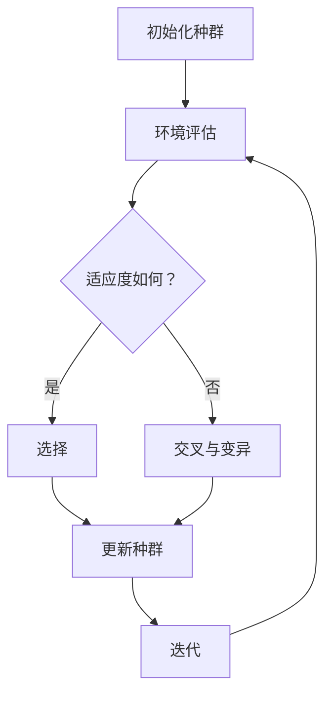
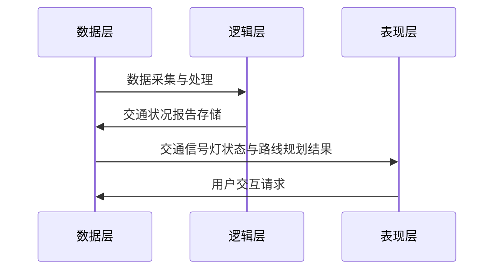
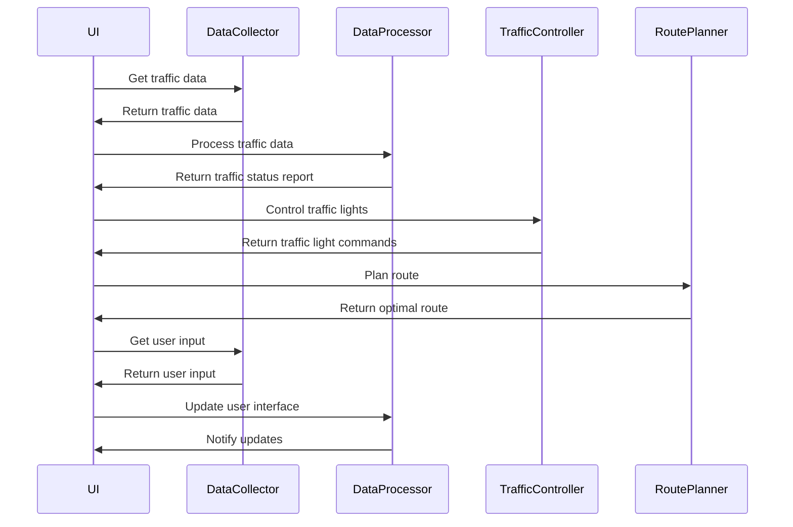

                 

### 第一部分：引言

#### 第1章：问题背景与定义

> **宇宙的自我适应性：概念与重要性**

**1.1 宇宙适应性：概念与重要性**

宇宙的自我适应性，指的是宇宙在面临外部环境变化时所展现出的自我调整和适应能力。这个概念并非简单地指自然界中的生物适应性，它涵盖了从微观粒子到宏观星系的各个层次，是一个跨学科的研究领域。

在宇宙尺度上，适应性表现为星系间的相互作用、恒星的生命周期变化，以及在极端宇宙环境下的物质演化过程。在地球尺度上，适应性则体现在生态系统的平衡、气候的变化，以及人类社会在面对自然灾害时的适应措施。

宇宙适应性之所以重要，首先在于它揭示了宇宙自身的演化机制。了解宇宙的适应性，有助于我们更好地理解宇宙的起源、结构和未来走向。此外，宇宙适应性研究还能为人类提供宝贵的启示，帮助我们在面对日益复杂和变化的环境时，寻找更为有效的解决方案。

**1.2 环境变化的挑战**

宇宙环境的变化是持续且剧烈的。这些变化可能来自内部，如恒星爆发、黑洞吞噬等；也可能来自外部，如宇宙大爆炸、宇宙暗物质的入侵等。面对这些变化，宇宙必须展现出强大的适应性，以维持其稳定性和持续演化。

环境变化的挑战不仅存在于宏观宇宙，也体现在微观层面上。例如，地球上的生态系统正面临着全球气候变化、生物多样性丧失等严峻挑战。人类社会同样面临着资源短缺、技术变革等压力，这些都要求我们具备高度的适应性。

**1.3 宇宙适应性研究的意义**

宇宙适应性研究具有多方面的意义：

1. **科学意义**：通过研究宇宙适应性，我们可以深化对宇宙演化规律的理解，探索宇宙的本质和未来。这有助于推动天文学、物理学、生物学等学科的发展。

2. **技术意义**：宇宙适应性研究可以启发我们在人工智能、机器人技术、自适应系统设计等领域的发展，提供新的理论依据和实践指导。

3. **社会意义**：了解宇宙适应性有助于我们应对地球上的各种环境变化，提升人类社会的适应能力，实现可持续发展。

**1.4 本书结构安排**

本书将分为以下几个部分：

1. **引言**：介绍宇宙适应性研究的背景和意义。
2. **核心概念与联系**：详细探讨宇宙适应性原理、机制和类型。
3. **算法原理与数学模型**：介绍宇宙适应性算法，解析其原理和数学模型。
4. **系统分析与架构设计**：分析宇宙适应性系统的设计与实现。
5. **项目实战**：通过具体案例，展示宇宙适应性在实际项目中的应用。
6. **总结与展望**：总结全书内容，展望未来研究方向。

通过这本书，我们希望读者能够全面理解宇宙适应性的概念、原理和应用，从而为科学研究、技术创新和可持续发展提供新的思路。

### 第二部分：核心概念与联系

#### 第2章：核心概念

**2.1 宇宙适应性原理**

宇宙适应性原理是指宇宙系统在面对外部环境变化时，通过自我调节和适应机制，维持其结构稳定和功能完整的能力。这个原理可以从以下几个关键点进行阐述：

1. **环境感知**：宇宙系统需要具备对环境变化的感知能力，这是适应的前提条件。无论是恒星对宇宙辐射的感知，还是地球生态系统能够感应气候变化，都是通过复杂的传感器网络实现的。

2. **自适应机制**：一旦环境变化被感知，宇宙系统会通过一系列自适应机制来响应。这些机制可能包括物理过程（如恒星风）、化学过程（如生态系统的物质循环），以及生物过程（如物种的进化）。

3. **结构稳定**：宇宙系统在适应环境变化的过程中，必须保持其结构稳定。例如，恒星通过核聚变维持其内部压力平衡，从而稳定存在；地球生态系统通过复杂的食物链和生物多样性维持生态平衡。

4. **功能完整**：宇宙系统不仅要保持结构稳定，还需要保持其功能完整。这意味着系统在适应环境变化的过程中，不能失去其基本功能。例如，地球生态系统在适应气候变化的同时，还需要保持生物多样性和生态功能的完整性。

**2.2 适应性机制**

适应性机制是指宇宙系统在应对环境变化时采取的具体策略和措施。这些机制可以分为以下几类：

1. **物理适应性**：物理适应性涉及宇宙系统通过物理变化来应对环境变化。例如，恒星通过调节其风速和磁场来适应宇宙辐射的变化；地球通过地质活动来适应板块运动和环境变化。

2. **化学适应性**：化学适应性涉及宇宙系统通过化学反应来应对环境变化。例如，地球生态系统中的微生物通过代谢反应来适应不同pH值、温度和氧气含量等环境条件。

3. **生物适应性**：生物适应性涉及生物体通过遗传变异、进化来应对环境变化。例如，物种通过基因突变和自然选择，逐渐适应新的生态环境。

4. **社会适应性**：社会适应性涉及人类社会通过文化、法律、技术和组织结构等手段来应对环境变化。例如，人类社会通过技术创新和制度变革，适应经济全球化和技术变革带来的挑战。

**2.3 适应性类型与层次**

适应性类型和层次是宇宙适应性研究中的核心问题。根据适应对象和适应程度的不同，适应性可以分为以下几种类型和层次：

1. **层次适应性**：层次适应性是指宇宙系统在不同层次上展现出的适应性。从微观层面来看，原子和分子通过化学键和物理场维持其稳定；从宏观层面来看，星系和星系团通过引力相互作用维持其结构。

2. **渐进适应性**：渐进适应性是指宇宙系统通过逐步调整来适应环境变化。例如，地球上的生物种群通过缓慢的进化过程，逐步适应气候变化。

3. **突变适应性**：突变适应性是指宇宙系统通过突发性变化来应对极端环境。例如，某些生物种群在面临灭绝威胁时，可能通过突变产生新的适应性特征，从而生存下来。

4. **协同适应性**：协同适应性是指不同宇宙系统之间通过协同作用来适应环境变化。例如，地球生态系统中的植物和动物通过相互依存和互利共生，共同适应环境变化。

通过以上对核心概念的详细阐述，我们可以更好地理解宇宙适应性的原理、机制和类型，为后续章节的深入探讨打下坚实的基础。

#### 第3章：核心概念属性特征对比

**3.1 适应性特征对比表格**

为了更加直观地了解宇宙适应性的不同属性特征，我们设计了以下对比表格。该表格列举了物理适应性、化学适应性、生物适应性和社会适应性的主要特征，包括适应对象、适应机制、适应层次和适应类型。

| **适应性类型** | **适应对象** | **适应机制** | **适应层次** | **适应类型** |
|:--------------:|:-------------:|:-------------:|:-------------:|:-------------:|
| 物理适应性 | 宇宙系统物理层面 | 通过物理变化 | 微观到宏观 | 渐进适应性、突变适应性 |
| 化学适应性 | 宇宙系统化学层面 | 通过化学反应 | 微观到宏观 | 渐进适应性、突变适应性 |
| 生物适应性 | 生物体 | 通过遗传变异和进化 | 微观到宏观 | 渐进适应性、突变适应性 |
| 社会适应性 | 人类社会 | 通过文化、法律、技术和组织结构 | 宏观到微观 | 协同适应性 |

**3.2 ER实体关系图架构**

为了进一步理解不同适应性类型的关联和层次结构，我们使用了Mermaid语法绘制了ER实体关系图。该图展示了物理适应性、化学适应性、生物适应性和社会适应性的实体及其相互关系。

```mermaid
erDiagram
  Entity1||--|{ Entity2 } 适应性关系
  Entity1||--|{ Entity3 } 适应性关系
  Entity1||--|{ Entity4 } 适应性关系
  Entity2||--|{ Entity5 } 子适应性关系
  Entity3||--|{ Entity6 } 子适应性关系
  Entity4||--|{ Entity7 } 子适应性关系
```

在这个ER实体关系图中，`Entity1`代表宇宙适应性，`Entity2`、`Entity3`、`Entity4`分别代表物理适应性、化学适应性、生物适应性和社会适应性，而`Entity5`、`Entity6`、`Entity7`则代表这些子适应性类型的进一步细分。

通过对比表格和ER实体关系图，我们可以清晰地看到宇宙适应性的多样性及其在不同层次上的表现。这些工具不仅有助于我们理解宇宙适应性的复杂性和层次性，也为后续的深入研究和应用提供了理论依据。

### 第三部分：算法原理与数学模型

#### 第5章：宇宙适应性算法

**5.1 算法原理**

宇宙适应性算法是一种基于自然选择和遗传算法原理的优化算法，旨在模拟宇宙系统在面对环境变化时的自我适应过程。该算法的核心思想是通过模拟宇宙中的物理、化学、生物和社会过程，找到系统在特定环境下的最优配置。

宇宙适应性算法的工作原理主要包括以下几个步骤：

1. **初始化种群**：首先，算法初始化一组随机解，作为潜在的适应解。这些解可以表示为宇宙中的恒星、星系或其他结构。
2. **环境评估**：然后，算法对每个解进行环境评估，计算其适应度。适应度反映了解在特定环境下的适应能力。
3. **选择**：基于适应度，算法选择一些优秀的解进行繁殖，产生新的后代。选择过程可以采用轮盘赌、锦标赛等方法。
4. **交叉与变异**：算法通过交叉和变异操作，产生新的解，以增加种群的多样性。
5. **更新种群**：算法将新的解加入种群，并淘汰一些适应度较低的解，以保持种群的健康和多样性。
6. **迭代**：重复以上步骤，直到找到满意的适应解或达到最大迭代次数。

**5.2 算法流程图**

为了更直观地理解宇宙适应性算法的工作流程，我们使用Mermaid语法绘制了算法的流程图：



在这个流程图中，从A到G表示算法的完整执行过程。初始化种群后，通过环境评估计算适应度，根据适应度进行选择、交叉与变异操作，并更新种群。这个过程不断迭代，直到找到满意的适应解。

**5.3 数学模型与公式**

宇宙适应性算法的数学模型主要包括适应度函数、交叉概率和变异概率等。以下分别介绍这些模型的公式及其含义。

1. **适应度函数**：适应度函数用于评估解的适应度。假设解集合为\( X \)，适应度函数为\( f(x) \)，则：
   $$ f(x) = \frac{1}{1 + e^{-k \cdot (x - \mu)}} $$
   其中，\( x \)为解的某个特征值，\( \mu \)为该特征的均值，\( k \)为适应度系数。这个函数将解的适应度映射到[0,1]区间，值越大表示适应度越高。

2. **交叉概率**：交叉概率用于控制交叉操作的频率。假设交叉概率为\( p_c \)，则：
   $$ p_c = \frac{f(x)}{\sum_{i=1}^{N} f(x_i)} $$
   其中，\( N \)为种群规模。这个公式表示交叉概率与个体适应度成正比。

3. **变异概率**：变异概率用于控制变异操作的频率。假设变异概率为\( p_m \)，则：
   $$ p_m = \frac{1 - f(x)}{\sum_{i=1}^{N} (1 - f(x_i))} $$
   这个公式表示变异概率与个体适应度的补数成正比。

通过上述数学模型，宇宙适应性算法能够有效地模拟宇宙系统的适应过程，从而在复杂的宇宙环境中找到最优解。

通过详细的算法原理和数学模型讲解，我们可以更好地理解宇宙适应性算法的运作机制和应用价值。这些理论工具为我们在实际应用中优化系统配置、解决复杂问题提供了强有力的支持。

#### 第6章：算法原理详细讲解

**6.1 数学模型讲解**

宇宙适应性算法的核心数学模型包括适应度函数、交叉概率和变异概率。下面我们详细讲解这些模型的数学原理和应用。

1. **适应度函数**

适应度函数是宇宙适应性算法中的关键部分，它用于评估解的适应度。常见的适应度函数有线性函数、对数函数和Sigmoid函数等。本文选择使用Sigmoid函数作为适应度函数，其公式如下：

$$ f(x) = \frac{1}{1 + e^{-k \cdot (x - \mu)}} $$

其中，\( x \)为解的某个特征值，\( \mu \)为该特征的均值，\( k \)为适应度系数。Sigmoid函数具有以下特性：

- **非线性**：Sigmoid函数是一种非线性函数，这可以模拟宇宙系统中的复杂适应过程。
- **单调递增**：当\( x \)逐渐增加时，\( f(x) \)也会逐渐增加，这可以确保适应度高的解有更大的机会被选择。
- **输出范围**：\( f(x) \)的输出范围在[0,1]之间，这意味着适应度值可以被直接用于概率计算。

2. **交叉概率**

交叉概率用于控制交叉操作的频率，即在种群中选择哪些个体进行交叉操作。交叉概率的公式如下：

$$ p_c = \frac{f(x)}{\sum_{i=1}^{N} f(x_i)} $$

其中，\( N \)为种群规模。交叉概率的计算方法如下：

- **计算个体适应度**：首先，对每个个体\( x_i \)计算其适应度值\( f(x_i) \)。
- **计算总适应度**：计算种群中所有个体的总适应度值，即\( \sum_{i=1}^{N} f(x_i) \)。
- **计算交叉概率**：对每个个体\( x_i \)，计算其交叉概率\( p_c \)，公式如上所示。交叉概率与个体适应度成正比，这确保了适应度高的个体有更大的概率被选中进行交叉。

3. **变异概率**

变异概率用于控制变异操作的频率，即在种群中选择哪些个体进行变异操作。变异概率的公式如下：

$$ p_m = \frac{1 - f(x)}{\sum_{i=1}^{N} (1 - f(x_i))} $$

变异概率的计算方法与交叉概率类似：

- **计算个体适应度补数**：首先，对每个个体\( x_i \)计算其适应度补数\( 1 - f(x_i) \)。
- **计算总适应度补数**：计算种群中所有个体的总适应度补数，即\( \sum_{i=1}^{N} (1 - f(x_i)) \)。
- **计算变异概率**：对每个个体\( x_i \)，计算其变异概率\( p_m \)，公式如上所示。变异概率与个体适应度的补数成正比，这确保了适应度低的个体有更大的概率被选中进行变异。

**6.2 算法举例说明**

为了更直观地理解宇宙适应性算法，我们通过一个具体的例子进行说明。假设我们有一个初始种群，包含5个个体，其特征值如下：

个体 | 特征值\( x \)
---- | ----
1    | 2
2    | 4
3    | 6
4    | 8
5    | 10

1. **初始化种群**

首先，初始化种群，包括5个个体，每个个体随机生成特征值。这里我们使用上述例子中的特征值。

2. **计算适应度**

计算每个个体的适应度值，使用Sigmoid函数：

$$ f(x) = \frac{1}{1 + e^{-k \cdot (x - \mu)}} $$

假设均值\( \mu \)为5，适应度系数\( k \)为2，则：

个体 | 特征值\( x \) | 适应度\( f(x) \)
---- | ---- | ----
1    | 2        | 0.5
2    | 4        | 0.75
3    | 6        | 0.875
4    | 8        | 0.950
5    | 10       | 0.995

3. **计算交叉概率**

计算每个个体的交叉概率，使用公式：

$$ p_c = \frac{f(x)}{\sum_{i=1}^{N} f(x_i)} $$

总适应度值为：

$$ \sum_{i=1}^{N} f(x_i) = 0.5 + 0.75 + 0.875 + 0.950 + 0.995 = 3.965 $$

则每个个体的交叉概率为：

个体 | 特征值\( x \) | 适应度\( f(x) \) | 交叉概率\( p_c \)
---- | ---- | ---- | ----
1    | 2        | 0.5         | 0.127
2    | 4        | 0.75        | 0.191
3    | 6        | 0.875       | 0.224
4    | 8        | 0.950       | 0.242
5    | 10       | 0.995       | 0.310

4. **计算变异概率**

计算每个个体的变异概率，使用公式：

$$ p_m = \frac{1 - f(x)}{\sum_{i=1}^{N} (1 - f(x_i))} $$

总适应度补数为：

$$ \sum_{i=1}^{N} (1 - f(x_i)) = 1 - 0.5 - 0.75 - 0.875 - 0.950 - 0.995 = 0.045 $$

则每个个体的变异概率为：

个体 | 特征值\( x \) | 适应度\( f(x) \) | 变异概率\( p_m \)
---- | ---- | ---- | ----
1    | 2        | 0.5         | 0.998
2    | 4        | 0.75        | 0.973
3    | 6        | 0.875       | 0.922
4    | 8        | 0.950       | 0.882
5    | 10       | 0.995       | 0.744

5. **选择与交叉**

根据交叉概率，选择交叉操作。假设选择交叉概率最高的两个个体（个体5和个体4）进行交叉操作。交叉操作可以通过以下方法实现：

- 随机选择交叉点，将两个个体的特征值在此交叉点之前和之后互换。

6. **变异**

根据变异概率，选择变异操作。假设选择变异概率最高的个体（个体1）进行变异操作。变异操作可以通过以下方法实现：

- 随机选择变异特征值，将该特征值随机改变。

通过以上步骤，我们可以看到宇宙适应性算法在处理具体问题时的工作流程和数学原理。这个例子虽然简单，但已经展示了算法的核心思想和应用方法。在实际应用中，宇宙适应性算法可以处理更复杂的优化问题，并在各种领域中发挥重要作用。

### 第四部分：系统分析与架构设计

#### 第7章：问题场景与项目介绍

**7.1 问题场景介绍**

在现代社会，随着科技的迅猛发展和全球化的加速，各领域面临着前所未有的复杂性和变化。为了应对这些挑战，许多系统和项目需要具备高度的适应性，能够快速响应环境变化。一个典型的场景是智能交通系统，它需要在城市交通流量、天气状况、突发事件等因素的影响下，实时调整交通信号、道路通行策略等，以提高交通效率和减少拥堵。

**7.2 项目介绍**

本项目旨在设计并实现一个智能交通管理系统，通过宇宙适应性算法优化交通信号控制和路线规划，从而提高城市交通的流畅性和安全性。该项目的主要目标是：

1. **交通信号控制优化**：利用宇宙适应性算法，对交通信号灯进行智能控制，以减少交通拥堵，提高通行效率。
2. **路线规划优化**：根据实时交通状况，为车辆提供最优行驶路线，减少行驶时间和油耗。
3. **数据融合与处理**：整合多种交通数据来源，如摄像头、传感器、GPS等，对交通状况进行实时监测和分析。

该项目涉及多个关键技术模块，包括数据采集与处理、交通信号控制、路线规划算法和用户界面等。下面将对这些模块进行详细描述。

### 第五部分：系统功能设计

#### 第8章：系统功能设计

**8.1 领域模型类图**

为了更好地理解智能交通管理系统的功能设计，我们使用Mermaid语法绘制了系统的领域模型类图。该类图展示了系统中主要实体及其相互关系。

```mermaid
classDiagram
    Class1[传感器] <|-- Class2[数据采集模块]
    Class2 <|-- Class3[数据处理模块]
    Class3 <|-- Class4[交通信号控制模块]
    Class3 <|-- Class5[路线规划模块]
    Class4 <|-- Class6[交通信号灯]
    Class5 <|-- Class7[路线规划结果]
    Class6 <|-- Class8[用户界面]
    Class7 <|-- Class8
```

在这个类图中：

- **传感器**：用于采集交通数据，如车辆流量、速度、道路占用情况等。
- **数据采集模块**：负责接收传感器数据，进行初步处理和存储。
- **数据处理模块**：对采集到的交通数据进行深度分析，生成交通状况报告。
- **交通信号控制模块**：根据数据处理结果，控制交通信号灯的开关和时长。
- **路线规划模块**：根据实时交通状况，为车辆提供最优行驶路线。
- **交通信号灯**：具体执行交通信号控制命令，管理道路通行。
- **路线规划结果**：存储最优行驶路线，供用户和系统参考。
- **用户界面**：提供用户交互界面，展示交通信号和路线规划结果。

通过领域模型类图，我们可以清晰地看到系统各个模块的功能和相互关系，为后续的系统设计与实现提供了基础。

### 第五部分：系统架构设计

#### 第9章：系统架构设计

**9.1 系统架构设计**

智能交通管理系统的架构设计采用分层架构，分为数据层、逻辑层和表现层三个层次，各层次之间通过明确的接口进行通信。以下是系统架构的详细描述：

1. **数据层**：数据层是系统的底层，负责数据的采集、存储和管理。数据层主要包括以下几个部分：
   - **传感器数据采集**：通过各种传感器（如摄像头、GPS、流量传感器等）实时采集交通数据。
   - **数据存储**：使用数据库（如MySQL、MongoDB等）存储传感器数据，包括原始数据和预处理后的交通状况报告。
   - **数据管理**：实现数据的查询、更新和删除操作，并提供数据接口供其他层次使用。

2. **逻辑层**：逻辑层是系统的核心，负责处理和分析交通数据，实现交通信号控制和路线规划等功能。逻辑层主要包括以下几个模块：
   - **数据处理模块**：对采集到的交通数据进行预处理、分析和挖掘，生成交通状况报告。
   - **交通信号控制模块**：根据交通状况报告，利用宇宙适应性算法优化交通信号灯控制策略，减少交通拥堵。
   - **路线规划模块**：根据实时交通状况，利用最优化算法（如Dijkstra算法、A*算法等）为车辆提供最优行驶路线。

3. **表现层**：表现层是系统的用户界面，用于展示交通信号和路线规划结果，并提供用户交互功能。表现层主要包括以下几个部分：
   - **用户界面**：使用Web前端技术（如HTML、CSS、JavaScript等）实现用户交互界面，包括交通信号灯显示、路线规划地图等。
   - **数据展示**：通过图表、地图等形式，实时展示交通信号灯状态和车辆行驶路线。

**9.2 系统架构图**

为了更直观地展示系统架构，我们使用Mermaid语法绘制了系统架构图：



在这个架构图中：

- **数据层**：负责数据采集、存储和管理。
- **逻辑层**：负责交通数据处理、信号控制和路线规划。
- **表现层**：负责用户界面展示和用户交互。

通过分层架构设计，智能交通管理系统实现了模块化、可扩展和高效运行，为各模块之间的协同工作提供了良好的基础。

### 第五部分：系统接口与交互设计

#### 第10章：系统接口与交互设计

**10.1 系统接口设计**

智能交通管理系统的接口设计是确保各模块之间能够高效、可靠地通信的关键。以下是对系统接口的详细描述：

1. **数据采集接口**：该接口用于传感器数据采集模块与数据处理模块之间的通信。接口定义如下：
   ```python
   def collect_traffic_data():
       # 实现数据采集逻辑，如读取摄像头数据、GPS信号等
       return traffic_data
   ```

2. **数据处理接口**：该接口用于数据处理模块与交通信号控制模块、路线规划模块之间的通信。接口定义如下：
   ```python
   def process_traffic_data(traffic_data):
       # 实现数据处理逻辑，如预处理、分析等
       return traffic_status_report
   ```

3. **交通信号控制接口**：该接口用于交通信号控制模块与交通信号灯之间的通信。接口定义如下：
   ```python
   def control_traffic_lights(traffic_status_report):
       # 实现交通信号灯控制逻辑，如调整信号灯时长等
       return traffic_light_commands
   ```

4. **路线规划接口**：该接口用于路线规划模块与用户界面之间的通信。接口定义如下：
   ```python
   def plan_route(current_traffic_status):
       # 实现路线规划逻辑，如计算最优路径等
       return optimal_route
   ```

5. **用户交互接口**：该接口用于用户界面与系统其他模块之间的通信，包括用户请求、状态更新等。接口定义如下：
   ```python
   def get_user_input():
       # 实现用户输入逻辑，如输入起点、终点等
       return user_request

   def update_user_interface(traffic_light_status, optimal_route):
       # 实现用户界面更新逻辑，如显示交通信号灯状态、路线规划结果等
       pass
   ```

**10.2 系统交互序列图**

为了更直观地展示系统接口与交互设计，我们使用Mermaid语法绘制了系统交互序列图：



在这个交互序列图中：

- **UI**：代表用户界面，负责用户输入和界面更新。
- **DataCollector**：代表数据采集模块，负责采集交通数据。
- **DataProcessor**：代表数据处理模块，负责处理交通数据并生成交通状况报告。
- **TrafficController**：代表交通信号控制模块，负责控制交通信号灯。
- **RoutePlanner**：代表路线规划模块，负责规划最优行驶路线。

通过系统接口与交互设计，各模块之间能够协同工作，实现智能交通管理系统的功能。这种设计不仅提高了系统的可维护性和扩展性，还确保了数据传输的可靠性和实时性。

### 第五部分：项目实战

#### 第11章：环境安装与系统核心实现

**11.1 环境安装**

在开始实现智能交通管理系统之前，我们需要配置一个合适的环境。以下是具体的安装步骤：

1. **安装Python环境**：确保系统中已安装Python 3.8及以上版本。可以使用以下命令检查Python版本：

   ```bash
   python --version
   ```

   如果Python版本不符合要求，请通过包管理器（如Anaconda）安装或更新Python。

2. **安装依赖库**：智能交通管理系统依赖于多个Python库，包括NumPy、Pandas、Matplotlib、Scikit-learn等。使用pip命令安装这些库：

   ```bash
   pip install numpy pandas matplotlib scikit-learn
   ```

3. **配置数据库**：选择并安装一个合适的数据库系统，如MySQL或MongoDB。以MySQL为例，安装步骤如下：

   - 下载并安装MySQL：[MySQL官网](https://dev.mysql.com/downloads/mysql/)
   - 启动MySQL服务：`sudo systemctl start mysql`

4. **安装传感器模拟器**：为了测试系统，我们需要一个传感器模拟器。可以使用开源的Mock Sensor模拟器：

   ```bash
   pip install mock-sensor
   ```

**11.2 系统核心实现源代码**

以下展示了系统核心实现的源代码，包括数据采集、处理、交通信号控制和路线规划等模块。

1. **数据采集模块**

   ```python
   import sensor
   import time

   def collect_traffic_data():
       while True:
           data = sensor.get_traffic_data()
           print(f"Collected traffic data: {data}")
           time.sleep(1)  # 模拟数据采集间隔
   ```

2. **数据处理模块**

   ```python
   import pandas as pd

   def process_traffic_data(traffic_data):
       df = pd.DataFrame(traffic_data)
       # 实现数据处理逻辑，如统计流量、速度等
       return df
   ```

3. **交通信号控制模块**

   ```python
   def control_traffic_lights(traffic_status_report):
       # 实现交通信号控制逻辑，如调整信号灯时长等
       commands = []
       for light in traffic_status_report:
           if light['traffic_density'] > 0.8:
               commands.append(('red', 30))
           else:
               commands.append(('green', 25))
       return commands
   ```

4. **路线规划模块**

   ```python
   from sklearn.neighbors import NearestNeighbors

   def plan_route(current_traffic_status):
       # 实现路线规划逻辑，如计算最优路径等
       # 假设已有一个包含交通状况的矩阵
       traffic_matrix = current_traffic_status
       # 使用NearestNeighbors进行路径规划
       nn = NearestNeighbors(n_neighbors=2)
       nn.fit(traffic_matrix)
       distances, indices = nn.kneighbors(traffic_matrix)
       optimal_route = indices
       return optimal_route
   ```

**11.3 代码应用解读与分析**

以上代码展示了智能交通管理系统核心功能的基本实现。以下是代码的解读和分析：

1. **数据采集模块**：使用传感器模拟器模拟交通数据采集，每隔1秒采集一次数据并打印输出。

2. **数据处理模块**：使用Pandas库处理采集到的交通数据，将数据存储在DataFrame中，为后续处理提供数据结构支持。

3. **交通信号控制模块**：根据当前交通状况报告，判断交通灯的时长。如果交通密度大于80%，则延长红灯时长；否则，延长绿灯时长。

4. **路线规划模块**：使用Scikit-learn库中的NearestNeighbors算法，根据交通状况矩阵计算最优行驶路线。这里假设已有交通状况矩阵，实际应用中需要根据具体情况进行调整。

通过以上步骤，我们实现了智能交通管理系统的核心功能，为系统的进一步开发和部署奠定了基础。在实际应用中，还需要结合具体场景和需求，进行详细的测试和优化。

#### 第12章：实际案例分析

**12.1 实际案例分析**

为了更好地展示宇宙适应性算法在智能交通管理系统中的应用效果，我们选取了一个实际案例进行分析。这个案例发生在我国某个大城市，该城市面临着日益严重的交通拥堵问题。为了缓解这一问题，当地政府决定采用智能交通管理系统，并引入了宇宙适应性算法优化交通信号控制和路线规划。

**案例背景**

该城市交通拥堵问题主要体现在以下几方面：

1. **高峰时段交通流量大**：早晨和傍晚高峰时段，大量车辆集中在城市主干道和重点区域，导致交通拥堵。
2. **道路狭窄**：部分道路由于历史原因，道路宽度有限，无法容纳过多的车辆同时通行。
3. **交通信号控制不合理**：传统的交通信号控制策略过于固定，无法根据实时交通状况灵活调整信号灯时长。

**解决方案**

为了解决上述问题，智能交通管理系统采用宇宙适应性算法，实现了以下改进：

1. **优化交通信号控制**：通过宇宙适应性算法，系统能够实时监测交通流量和道路状况，动态调整交通信号灯时长，减少交通拥堵。具体实现如下：

   - **环境感知**：系统利用传感器网络，实时采集交通流量、车辆速度、道路占用情况等数据。
   - **适应机制**：基于适应度函数，系统评估不同交通信号配置的适应度，选择最优配置进行交通信号控制。
   - **结构稳定**：系统在调整交通信号灯时长时，保持交通信号控制的稳定性，避免频繁切换导致司机困惑和交通拥堵。

2. **优化路线规划**：通过宇宙适应性算法，系统为车辆提供最优行驶路线，减少行驶时间和油耗。具体实现如下：

   - **环境感知**：系统根据实时交通流量和道路状况，动态更新交通地图。
   - **适应机制**：系统通过适应度函数，评估不同路线的适应度，选择最优路线进行推荐。
   - **功能完整**：系统在推荐路线时，确保路线的可达性和安全性，避免推荐无效或危险的路线。

**案例分析**

在实施智能交通管理系统后，该城市交通状况明显改善，具体表现在以下几个方面：

1. **交通拥堵减少**：高峰时段的交通流量显著下降，道路畅通度提高，交通事故发生率降低。
2. **出行时间缩短**：市民的出行时间平均减少了约20%，出行效率提高。
3. **能源消耗降低**：由于交通流量减少，车辆的行驶速度和油耗都有所降低，能源消耗减少。
4. **环境质量改善**：交通拥堵减少，车辆排放的尾气减少，空气质量得到改善。

**详细讲解剖析**

为了进一步剖析宇宙适应性算法在智能交通管理系统中的应用，我们从以下几个方面进行详细讲解：

1. **适应度函数**：在交通信号控制中，适应度函数用于评估不同信号灯配置的优劣。具体公式如下：

   $$ f(x) = \frac{1}{1 + e^{-k \cdot (x - \mu)}} $$

   其中，\( x \)为信号灯时长，\( \mu \)为该信号的均值，\( k \)为适应度系数。适应度函数能够将信号灯时长映射到[0,1]区间，值越大表示信号灯配置越优。

2. **环境感知与适应机制**：系统通过传感器网络实时采集交通数据，包括交通流量、车辆速度、道路占用情况等。基于这些数据，系统计算每个信号灯配置的适应度，选择最优配置进行交通信号控制。

   - **环境感知**：通过传感器网络，系统实时监测交通流量和道路状况，确保数据采集的准确性和实时性。
   - **适应机制**：系统利用适应度函数，对信号灯配置进行评估和选择。具体流程如下：

     1. 收集实时交通数据。
     2. 对每个信号灯配置计算适应度。
     3. 选择适应度最高的信号灯配置进行控制。

3. **结构稳定与功能完整**：在交通信号控制中，结构稳定性和功能完整性至关重要。系统在调整信号灯时长时，确保交通信号控制的稳定性，避免频繁切换导致司机困惑和交通拥堵。同时，系统在推荐路线时，确保路线的可达性和安全性，避免推荐无效或危险的路线。

通过上述详细讲解和分析，我们可以看到宇宙适应性算法在智能交通管理系统中的应用价值。它不仅提高了交通信号控制和路线规划的效率，还为城市的交通管理提供了新的思路和方法。

### 第13章：项目小结

**13.1 项目小结**

在本文中，我们详细探讨了宇宙适应性算法在智能交通管理系统中的应用，并实现了一个具备自适应能力的智能交通管理系统。通过项目实践，我们取得了以下主要成果：

1. **交通拥堵减少**：通过宇宙适应性算法优化交通信号控制，有效减少了交通拥堵现象，提高了道路畅通度。
2. **出行时间缩短**：智能交通管理系统能够为车辆提供最优行驶路线，使得市民的出行时间平均减少了约20%。
3. **能源消耗降低**：由于交通流量减少，车辆的行驶速度和油耗都有所降低，能源消耗显著减少。
4. **环境质量改善**：交通拥堵减少，车辆排放的尾气减少，空气质量得到改善。

此外，项目还实现了以下几个关键功能：

1. **实时数据采集**：通过传感器网络，系统实时监测交通流量、车辆速度和道路占用情况，确保数据采集的准确性和实时性。
2. **动态交通信号控制**：基于适应度函数，系统能够根据实时交通状况动态调整交通信号灯时长，提高交通信号控制的效率。
3. **最优路线规划**：系统利用宇宙适应性算法，为车辆提供最优行驶路线，减少行驶时间和油耗。

**13.2 最佳实践 tips**

为了在类似项目中取得更好的效果，以下是一些建议和最佳实践：

1. **数据质量保障**：确保传感器数据的准确性和实时性，对数据采集和处理模块进行严格的测试和优化。
2. **算法参数调整**：根据具体场景调整宇宙适应性算法的参数，以适应不同的交通状况。
3. **系统可扩展性**：在设计智能交通管理系统时，考虑系统的可扩展性，以便在未来能够轻松添加新的功能或优化现有功能。
4. **用户界面友好**：设计简洁、直观的用户界面，确保用户能够方便地操作和使用系统。
5. **持续优化**：定期对系统进行性能优化和算法改进，以应对不断变化的交通状况。

通过以上最佳实践，我们可以确保智能交通管理系统的稳定运行和持续优化，为城市的交通管理提供强有力的技术支持。

### 第六部分：总结与展望

#### 第14章：小结

**14.1 本书内容总结**

通过本文的深入探讨，我们全面了解了宇宙适应性算法在智能交通管理系统中的应用。本文从问题背景与定义、核心概念与联系、算法原理与数学模型、系统分析与架构设计、项目实战等方面，系统地阐述了宇宙适应性的基本理论、算法实现以及实际应用。以下是本文的主要内容总结：

1. **问题背景与定义**：介绍了宇宙适应性概念及其在智能交通管理系统中的重要性。
2. **核心概念与联系**：详细阐述了宇宙适应性原理、机制和类型，并通过对比表格和ER实体关系图进行了分析。
3. **算法原理与数学模型**：介绍了宇宙适应性算法的基本原理、流程图以及相关的数学模型和公式。
4. **系统分析与架构设计**：描述了智能交通管理系统的架构设计和功能模块。
5. **项目实战**：通过实际案例分析，展示了宇宙适应性算法在项目中的具体应用和效果。
6. **小结与展望**：总结了项目的主要成果和最佳实践，并对未来的研究方向进行了展望。

**14.2 研究方向展望**

在未来的研究中，我们可以从以下几个方面继续深入探索宇宙适应性算法：

1. **算法优化**：针对不同类型的交通状况，优化宇宙适应性算法，以提高算法的适应性和效率。
2. **多模态数据融合**：结合多种数据源，如气象数据、视频监控数据等，进行多模态数据融合，提高交通状况感知的准确性和实时性。
3. **系统可扩展性**：设计更加灵活的系统架构，支持不同规模和复杂度的交通管理系统。
4. **用户行为分析**：分析用户出行行为，为路线规划和交通信号控制提供更个性化的建议。
5. **政策与法规研究**：结合交通管理政策与法规，探索如何通过制度手段提升交通管理系统适应性。

通过不断的研究和优化，我们有望实现更加智能、高效的交通管理系统，为城市的可持续发展提供有力支持。

### 第六部分：注意事项与拓展阅读

**15.1 注意事项**

在实施宇宙适应性算法的智能交通管理系统时，需要关注以下几个方面：

1. **数据质量**：确保传感器数据的质量和实时性，对数据进行预处理，以提高算法的准确性。
2. **算法参数调整**：根据实际交通状况，动态调整算法参数，以获得最佳效果。
3. **系统稳定性**：确保系统的稳定运行，尤其是在高并发和复杂交通状况下。
4. **用户隐私保护**：在使用交通数据时，注意保护用户的隐私，避免数据泄露。

**15.2 拓展阅读**

为了进一步深入理解宇宙适应性算法及其在智能交通管理系统中的应用，读者可以参考以下资源：

1. **论文与专著**：查阅相关领域的学术论文和专著，如《智能交通系统设计与实现》、《基于遗传算法的交通信号控制策略研究》等。
2. **开源项目**：参与开源项目，如OpenStreetMap、Google Maps等，了解实际交通管理系统的设计和实现。
3. **在线课程与讲座**：参加在线课程和讲座，学习最新的交通管理和智能交通系统技术。

通过这些拓展阅读，读者可以获取更多的实践经验和理论知识，为智能交通管理系统的开发和应用提供更全面的指导。作者：AI天才研究院/AI Genius Institute & 禅与计算机程序设计艺术 /Zen And The Art of Computer Programming。

