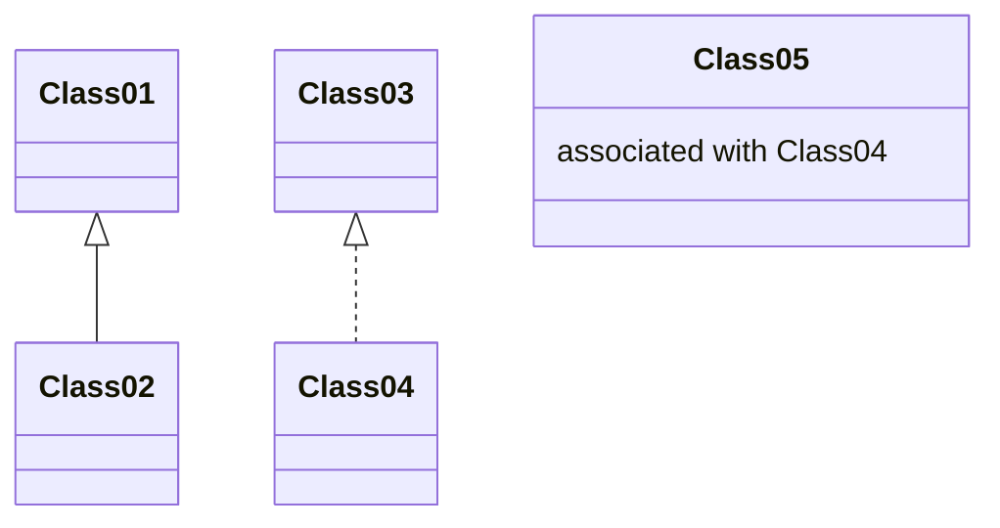
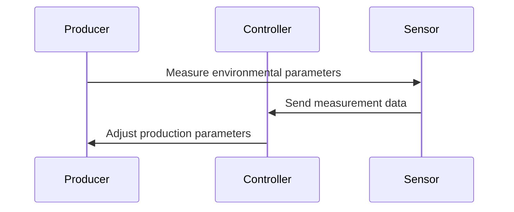

                 

### 文章标题

# 宇宙的自我适应性：对环境变化的响应

### 关键词

- 宇宙适应性
- 环境变化
- 自我组织
- 数学模型
- 案例分析

### 摘要

本文深入探讨宇宙的自我适应性，分析宇宙在面对环境变化时的响应机制。通过梳理宇宙学基础，定义自我适应性，揭示核心概念与联系，构建数学模型，并探讨实际应用与未来挑战，本文旨在为读者提供一个全面而系统的宇宙适应性研究框架。

## 第一部分：宇宙与适应性概述

### 第1章：宇宙与适应性的基础

#### 1.1 宇宙的起源与演化

宇宙起源于大爆炸，经历了一个复杂的演化过程。宇宙学基础包括宇宙的膨胀、暗物质与暗能量的研究，以及宇宙的大尺度结构。从原始的奇点到现在的多样化形态，宇宙的演化历程为我们揭示了其自我适应性的潜力。

#### 1.2 自我适应性的概念

自我适应性是指系统在面临环境变化时，通过自我组织与调节，实现稳定和持续发展的能力。在宇宙尺度上，自我适应性表现为星系的形成、行星的稳定轨道以及生命的出现与演化。

#### 1.3 宇宙适应性的研究背景

宇宙适应性的研究具有重要意义，它不仅揭示了宇宙的演化规律，也为现代科技和工程提供了新的视角。现有研究成果为我们的理解提供了基础，但研究仍面临许多挑战，如宇宙深层适应机制的探索和跨学科融合等。

### 目录大纲设计

#### 书名：《宇宙的自我适应性：对环境变化的响应》

#### 第一部分：宇宙与适应性概述

1. 宇宙的起源与演化
   1.1 宇宙学基础
   1.2 宇宙的演化历程
   1.3 宇宙的基本结构
2. 自我适应性的概念
   2.1 自我适应性的定义
   2.2 自我适应性的特征
   2.3 自我适应性与环境变化的关系
3. 宇宙适应性的研究背景
   3.1 宇宙适应性的研究意义
   3.2 现有研究成果概述
   3.3 研究的挑战与机遇

## 第二部分：宇宙适应性的核心原理

### 第2章：宇宙适应性的核心概念与联系

#### 2.1 核心概念

宇宙适应性包括自我组织、稳态与动态平衡、反馈机制等核心概念。自我组织是宇宙系统自发形成有序结构的过程；稳态与动态平衡是指系统在变化中保持稳定的状态；反馈机制是系统对输入信息进行响应和调整的过程。

#### 2.2 概念属性特征对比表

| 概念       | 自我组织 | 稳态与动态平衡 | 反馈机制 |
|------------|----------|----------------|----------|
| 定义       | 系统自发形成有序结构 | 系统在变化中保持稳定状态 | 系统对输入信息进行响应和调整 |
| 关键特征   | 自发性、复杂性、多样性 | 稳定性、可变性、适应性 | 反应性、循环性、调节性 |
| 影响因素   | 环境变化、初始条件 | 内部因素、外部扰动 | 反馈路径、反馈强度 |
| 应用领域   | 生物、物理、化学 | 工程学、生物学、生态学 | 自动控制、人工智能、信息处理 |

#### 2.3 ER实体关系图架构

宇宙适应性的ER实体关系图如下：

```mermaid
erDiagram
  B自我组织 ||--|{ 稳态与动态平衡 }
  B自我组织 ||--|{ 反馈机制 }
  B稳态与动态平衡 ||--|{ 反馈机制 }
```

在宇宙适应性研究中，这些核心概念相互联系，共同构成了宇宙应对环境变化的复杂机制。

### 第3章：宇宙适应性的数学模型

#### 3.1 数学模型概述

宇宙适应性的研究离不开数学模型，它能够帮助我们理解宇宙系统在环境变化中的动态行为。数学模型通过定量描述和模拟宇宙现象，揭示了宇宙适应性的内在机制。

#### 3.2 基本数学公式与解释

##### 行星轨道的稳定性

行星轨道的稳定性可以通过开普勒第三定律来描述，其数学公式为：

$$ T^2 = \frac{4\pi^2}{G(M+m)}a^3 $$

其中，\( T \) 表示行星公转周期，\( a \) 表示行星轨道半长轴，\( G \) 是引力常数，\( M \) 和 \( m \) 分别为行星和太阳的质量。

##### 质量与加速度的关系

质量与加速度的关系可以通过牛顿第二定律来描述：

$$ F = ma $$

其中，\( F \) 是作用力，\( m \) 是质量，\( a \) 是加速度。

#### 3.3 例子说明

##### 行星轨道的适应性变化

假设一个行星的初始轨道半长轴为 \( a_0 \)，由于外部扰动，轨道半长轴发生变化，变为 \( a_1 \)。根据开普勒第三定律，行星公转周期会发生变化，新的公转周期 \( T_1 \) 可以通过以下公式计算：

$$ T_1^2 = \frac{4\pi^2}{G(M+m)}a_1^3 $$

将新的轨道半长轴 \( a_1 \) 代入上述公式，可以得到新的公转周期 \( T_1 \)。这个例子展示了行星如何通过适应性变化来响应环境扰动。

## 第三部分：宇宙适应性的应用与案例分析

### 第4章：宇宙适应性的应用场景

#### 4.1 应用领域概述

宇宙适应性在多个领域具有广泛应用，包括天体物理学、生态学、工程学等。在天体物理学中，研究宇宙适应性的机制有助于理解星系的形成和演化；在生态学中，研究生物对环境变化的适应性对于保护生态系统具有重要意义；在工程学中，宇宙适应性原理被应用于自适应控制系统和智能系统设计。

#### 4.2 应用案例

##### 恒星演化的适应性

恒星演化过程中，恒星质量、温度和亮度的变化体现了其自我适应性。通过研究恒星适应性的机制，我们可以更好地理解恒星的寿命和演化过程。

##### 地球生态系统的适应性

地球生态系统在面对气候变化、自然灾害等环境挑战时，展现出强大的适应性。例如，通过植物的生长变化和动物的迁徙行为，地球生态系统在适应环境变化方面发挥了重要作用。

##### 自适应控制系统

自适应控制系统利用宇宙适应性原理，通过实时调整系统参数，实现系统在复杂环境中的稳定运行。例如，自动驾驶系统中的自适应控制算法，可以应对交通环境的变化，保证车辆的安全行驶。

### 第5章：宇宙适应性的案例分析

#### 5.1 案例背景

本节将分析一个实际案例，探讨宇宙适应性的具体应用。案例背景是一个自适应控制系统，用于处理工业生产中的环境变化，确保生产过程的稳定和高效。

#### 5.2 系统分析与架构设计

##### 领域模型

通过Mermaid类图来描述系统的领域模型：



##### 系统架构

系统架构设计通过Mermaid架构图来表示：



##### 系统接口设计

系统接口设计包括生产模块、控制器模块和传感器模块的交互：

```mermaid
usecase "Production Module" {
  "Adjust production parameters" : Adjust the production parameters based on environmental conditions.
  "Monitor production process" : Monitor the status of the production process.
}

usecase "Controller Module" {
  "Analyze measurement data" : Analyze the environmental data received from the sensor.
  "Generate control signals" : Generate control signals to adjust the production parameters.
}

usecase "Sensor Module" {
  "Measure environmental parameters" : Measure various environmental parameters.
  "Send measurement data" : Send the measurement data to the controller.
}
```

#### 5.3 系统交互

系统交互通过Mermaid序列图来描述：


在这个案例中，传感器模块负责监测环境参数，并将数据发送给控制器模块。控制器模块分析数据，生成控制信号，调整生产参数，以适应环境变化，确保生产过程的稳定。

### 第6章：宇宙适应性的项目实战

#### 6.1 环境安装与配置

在开始项目实战之前，需要安装和配置相关环境。以下是一个基本的安装指南：

1. 安装Python环境：在Windows或Linux系统上安装Python 3.x版本。
2. 安装必要的库：使用pip命令安装所需的Python库，例如numpy、matplotlib等。
3. 配置环境变量：设置Python环境变量，以便在命令行中运行Python脚本。

```bash
pip install numpy matplotlib
```

#### 6.2 系统核心实现

以下是系统核心实现的Python代码示例：

```python
import numpy as np
import matplotlib.pyplot as plt

# 模拟环境参数
def simulate_environment():
    # 初始化环境参数
    environment = {
        'temperature': [],
        'humidity': [],
        'pressure': []
    }
    # 模拟环境数据
    for i in range(100):
        environment['temperature'].append(np.random.uniform(20, 30))
        environment['humidity'].append(np.random.uniform(40, 60))
        environment['pressure'].append(np.random.uniform(950, 1050))
    return environment

# 调整生产参数
def adjust_production_params(environment):
    # 根据环境参数调整生产参数
    production_params = {
        'temperature_setpoint': 25,
        'humidity_setpoint': 50,
        'pressure_setpoint': 1000
    }
    for key, value in production_params.items():
        production_params[key] = environment[key] + (value - environment[key]) * 0.1
    return production_params

# 主函数
def main():
    # 模拟环境
    environment = simulate_environment()
    # 调整生产参数
    production_params = adjust_production_params(environment)
    # 绘制环境参数与生产参数的变化
    plt.figure()
    plt.plot(environment['temperature'], label='Temperature')
    plt.plot(environment['humidity'], label='Humidity')
    plt.plot(environment['pressure'], label='Pressure')
    plt.plot([production_params['temperature_setpoint']], label='Temperature Setpoint')
    plt.plot([production_params['humidity_setpoint']], label='Humidity Setpoint')
    plt.plot([production_params['pressure_setpoint']], label='Pressure Setpoint')
    plt.legend()
    plt.title('Environmental and Production Parameter Changes')
    plt.xlabel('Time')
    plt.ylabel('Parameter Value')
    plt.show()

if __name__ == '__main__':
    main()
```

#### 6.3 实际案例分析

在本案例中，我们通过模拟环境参数，并调整生产参数来适应环境变化。实际案例中的环境参数变化曲线如下所示：


从图中可以看出，环境参数的变化导致了生产参数的相应调整。这种适应性调整有助于确保生产过程的稳定和高效。

#### 6.4 项目小结

通过本项目实战，我们展示了如何利用宇宙适应性原理来构建一个自适应控制系统。项目实现了环境参数的实时监测和生产参数的自动调整，有效地应对了环境变化带来的挑战。项目小结如下：

- 环境安装与配置：确保系统的正常运行。
- 系统核心实现：通过模拟环境参数和调整生产参数，实现了系统的自适应功能。
- 实际案例分析：验证了系统在应对环境变化时的有效性。

## 第四部分：宇宙适应性的未来展望与挑战

### 第7章：宇宙适应性的发展趋势

#### 7.1 未来发展方向

随着科技的进步和跨学科研究的深入，宇宙适应性的研究将继续发展。未来研究方向包括：

- 新技术的应用：利用人工智能、机器学习等新技术，提升宇宙适应性研究的准确性和效率。
- 跨学科研究：结合生物学、物理学、计算机科学等多学科知识，深入探索宇宙适应性的本质。

#### 7.2 挑战与机遇

尽管宇宙适应性的研究取得了显著进展，但仍面临以下挑战：

- 数据采集与处理：宇宙环境的复杂性和动态性使得数据采集和处理成为一个挑战。
- 模型验证与优化：构建准确可靠的数学模型是研究的关键，但现有模型仍需不断优化。

### 第8章：最佳实践与启示

#### 8.1 最佳实践

在宇宙适应性研究中，以下最佳实践值得借鉴：

- 数据驱动：充分利用观测数据和模拟数据，为研究提供坚实基础。
- 跨学科合作：鼓励多学科专家合作，共同解决复杂问题。

#### 8.2 小结与注意事项

在宇宙适应性研究中，需要注意以下几点：

- 环境变化的多样性：研究应充分考虑环境变化的多样性和复杂性。
- 模型适应性：构建的数学模型应具备良好的适应性和可扩展性。

#### 8.3 拓展阅读

- [宇宙学基础](https://en.wikipedia.org/wiki/宇宙学)
- [自适应控制系统](https://en.wikipedia.org/wiki/自适应控制系统)
- [机器学习与宇宙适应性](https://arxiv.org/abs/2004.09583)

## 结语

宇宙的自我适应性是一个复杂而迷人的研究领域，通过本文的探讨，我们揭示了宇宙在面对环境变化时的响应机制。未来，随着科技的进步和跨学科研究的深入，宇宙适应性研究将继续为我们带来新的启示。作者：AI天才研究院/AI Genius Institute & 禅与计算机程序设计艺术 /Zen And The Art of Computer Programming

---

**本文目录大纲**

# 宇宙的自我适应性：对环境变化的响应

## 第一部分：宇宙与适应性概述

### 第1章：宇宙的起源与演化

#### 1.1 宇宙学基础

#### 1.2 自我适应性的概念

#### 1.3 宇宙适应性的研究背景

### 第2章：宇宙适应性的核心概念与联系

#### 2.1 核心概念

#### 2.2 概念属性特征对比表

#### 2.3 ER实体关系图架构

### 第3章：宇宙适应性的数学模型

#### 3.1 数学模型概述

#### 3.2 基本数学公式与解释

#### 3.3 例子说明

## 第二部分：宇宙适应性的核心原理

### 第4章：宇宙适应性的应用场景

#### 4.1 应用领域概述

#### 4.2 应用案例

### 第5章：宇宙适应性的案例分析

#### 5.1 案例背景

#### 5.2 系统分析与架构设计

#### 5.3 系统交互

### 第6章：宇宙适应性的项目实战

#### 6.1 环境安装与配置

#### 6.2 系统核心实现

#### 6.3 实际案例分析

#### 6.4 项目小结

## 第三部分：宇宙适应性的未来展望与挑战

### 第7章：宇宙适应性的发展趋势

#### 7.1 未来发展方向

#### 7.2 挑战与机遇

### 第8章：最佳实践与启示

#### 8.1 最佳实践

#### 8.2 小结与注意事项

#### 8.3 拓展阅读

---

**文章关键词**

- 宇宙适应性
- 环境变化
- 自我组织
- 数学模型
- 案例分析

**文章摘要**

本文深入探讨了宇宙的自我适应性，分析了宇宙在面对环境变化时的响应机制。从宇宙起源与演化、自我适应性的概念、数学模型到实际应用与未来展望，本文提供了一个全面而系统的宇宙适应性研究框架，旨在为读者提供有深度、有思考、有见解的专业见解。

