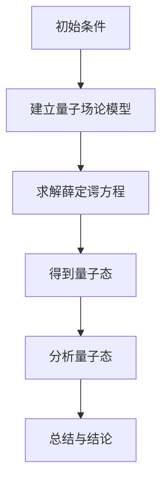
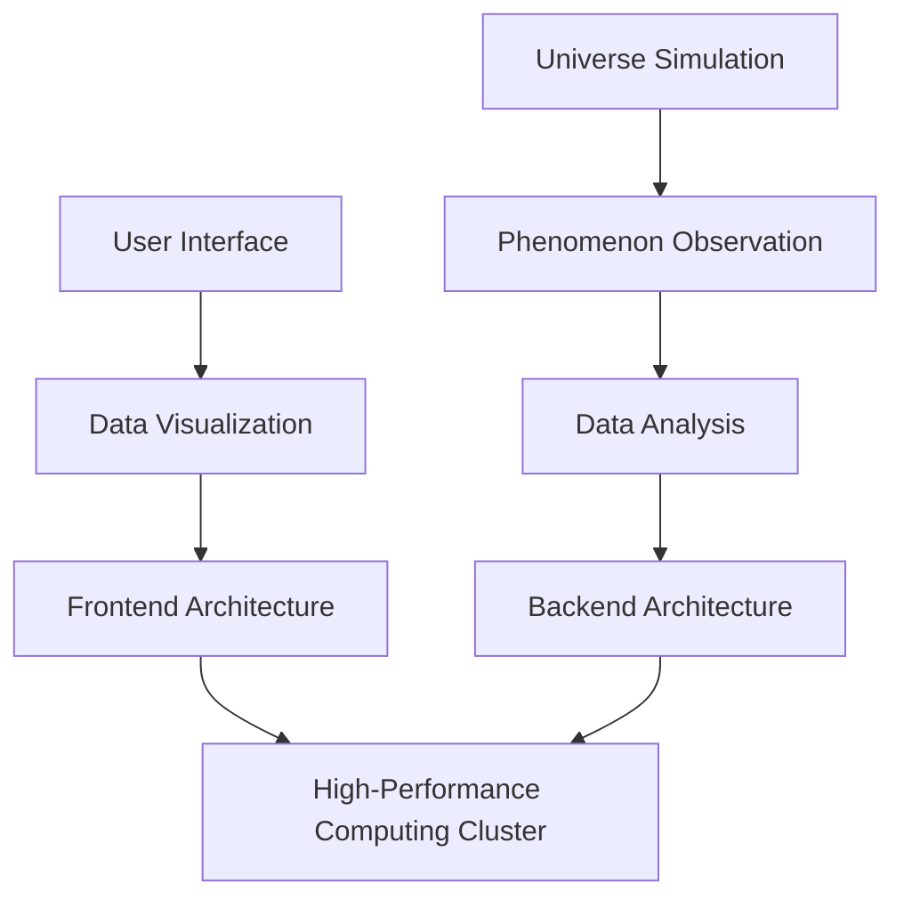

                 

### 宇宙的虚拟性：实在还是模拟

关键词：宇宙、虚拟性、实在、模拟、意识、智能

摘要：本文从多个学科的角度出发，探讨宇宙的虚拟性这一引人深思的问题。我们首先介绍了宇宙的虚拟性问题的背景和问题描述，然后从物理学、哲学和计算机科学的角度分析了宇宙虚拟性的原理，并通过概念特征对比和ER实体关系图展示了核心概念之间的关系。接着，我们详细探讨了虚拟宇宙的算法原理和数学模型，并使用mermaid图和Python代码进行了举例说明。随后，我们进行了系统分析与架构设计，包括问题场景介绍、系统功能设计和系统架构设计等。最后，我们通过一个实际案例展示了如何应用本文的理论和方法来研究宇宙的虚拟性，并给出了项目小结和拓展阅读建议。

### 引言与背景

宇宙的虚拟性问题是现代物理学、哲学和计算机科学领域的一个热点话题。随着量子力学和相对论的提出，人们对宇宙的理解发生了重大变革。传统物理学认为，宇宙是一个真实存在的、独立于人类感知的系统，而量子力学和相对论的发现使得这一观点受到了挑战。

#### 1.1 问题的提出

宇宙的虚拟性问题的提出可以追溯到对量子力学和相对论的深入探讨。量子力学揭示了微观世界的非确定性，这意味着我们无法准确预测微观粒子的行为，这种非确定性使得人们开始质疑我们所感知到的宇宙是否是真实的。相对论则揭示了时空的相对性，即时空的结构依赖于观察者的运动状态和引力场，这进一步挑战了我们对宇宙实在性的认识。

#### 1.2 问题描述

宇宙的虚拟性问题可以描述为：我们所处的宇宙，是真实的、独立存在的，还是只是某个高级文明或超自然力量的虚拟模拟？这个问题直接挑战了我们对现实的理解，引发了关于宇宙本质、存在与意识的深刻探讨。

#### 1.3 问题解决

要解决宇宙的虚拟性问题，需要从多个学科的角度进行综合分析。物理学提供了量子力学和相对论的理论基础，计算机科学提供了虚拟现实和模拟技术，哲学提供了关于存在和意识的深刻思考。例如，量子力学的非确定性、相对论的时空观、计算机科学的虚拟现实技术，都为我们提供了探讨宇宙虚拟性的理论工具。

#### 1.4 边界与外延

宇宙的虚拟性问题并不仅限于宇宙本身，它还涉及到意识、智能、人工智能等概念。例如，如果我们所处的宇宙是虚拟的，那么我们的意识是否也是虚拟的？这个问题进一步延伸到对人工智能的本质和发展的探讨。

#### 1.5 概念结构与核心要素组成

宇宙的虚拟性问题的核心概念包括：宇宙、虚拟性、现实、意识、智能、人工智能等。这些概念共同构成了宇宙虚拟性问题的基本结构。理解这些概念之间的关系，有助于我们深入探讨宇宙的虚拟性。

### 第2章：核心概念与原理

在探讨宇宙的虚拟性问题时，我们需要明确几个核心概念，并理解它们之间的相互关系。以下是宇宙的虚拟性问题中涉及的主要概念及其原理。

#### 2.1 宇宙的概念

宇宙是指我们所处的整个空间和时间，包括所有物质、能量、时间和空间的结构。宇宙的起源和演化是宇宙学研究的重要方向。传统的宇宙学观点认为，宇宙起源于大爆炸，并在不断的膨胀过程中演化。然而，随着对宇宙的深入探索，人们开始发现宇宙的许多现象无法用传统理论解释，例如宇宙微波背景辐射、宇宙加速膨胀等。

#### 2.2 虚拟性的概念

虚拟性是指一种存在状态，即某种实体或现象并非真实存在，而是通过某种模拟或复制技术产生的。虚拟性可以应用于多个领域，如虚拟现实、网络世界、计算机模拟等。在计算机科学中，虚拟性是构建模拟环境的基础，通过模拟，我们可以模拟和研究现实世界的各种现象。

#### 2.3 宇宙虚拟性的原理

宇宙虚拟性的原理涉及到多个学科。物理学提供了量子力学和相对论的理论基础，计算机科学提供了虚拟现实和模拟技术，哲学提供了关于存在和意识的深刻思考。

1. **量子力学**：量子力学的非确定性使得人们开始质疑现实世界的确定性。量子纠缠现象表明，微观粒子之间存在一种超距离的联系，这种现象在经典物理学中是无法解释的。这引发了关于宇宙是否是某种形式的模拟的讨论。

2. **相对论**：相对论揭示了时空的相对性，即时空的结构依赖于观察者的运动状态和引力场。这意味着我们所感知的宇宙可能是相对的，而非绝对的。

3. **计算机科学**：计算机科学的虚拟现实和模拟技术为我们提供了模拟宇宙的可能性。通过计算机模拟，我们可以构建出一个与现实世界相似的虚拟宇宙，并在其中进行各种实验和观察。

4. **哲学**：哲学关于存在和意识的讨论也为宇宙虚拟性提供了理论基础。例如，一些哲学家认为，我们的意识可能是一种虚拟的模拟，而非真实的存在。

#### 2.4 概念属性特征对比表格

| 概念         | 特征             | 关系                         |
|--------------|------------------|------------------------------|
| 宇宙         | 空间和时间       | 包含所有物质和能量           |
| 虚拟性       | 非真实存在       | 通过模拟或复制产生           |
| 意识         | 主观感知         | 与宇宙和虚拟性密切相关       |
| 智能         | 自主决策与学习   | 与人类和人工智能密切相关     |
| 人工智能      | 模拟智能行为     | 与虚拟性和计算机科学密切相关 |

#### 2.5 ER实体关系图架构

```mermaid
erDiagram
  宇宙 ||--|{ 虚拟性 }|-- 意识
  宇宙 ||--|{ 物质 }|-- 量子力学
  意识 ||--|{ 智能 }|-- 人工智能
  意识 ||--|{ 认知 }|-- 哲学
```

### 第3章：虚拟宇宙的算法原理与数学模型

在探讨宇宙的虚拟性时，我们需要了解虚拟宇宙的算法原理和数学模型。这些原理和模型为我们提供了一个框架，用于理解和分析虚拟宇宙的性质。

#### 3.1 虚拟宇宙算法原理

虚拟宇宙的算法原理涉及到模拟和仿真的方法。这些方法可以用来模拟宇宙的演化和各种现象，帮助我们理解宇宙的虚拟性。

1. **模拟方法**：模拟方法是一种通过计算机程序模拟现实世界现象的方法。在虚拟宇宙中，我们可以使用模拟方法来模拟宇宙的演化过程，包括星系的形成、恒星的生命周期、黑洞的产生等。

2. **仿真方法**：仿真方法是一种通过计算机程序模拟系统运行过程的方法。在虚拟宇宙中，我们可以使用仿真方法来模拟各种宇宙现象，如宇宙背景辐射、宇宙加速膨胀等。

3. **多尺度模拟**：多尺度模拟是一种同时考虑不同尺度的物理现象的模拟方法。在虚拟宇宙中，多尺度模拟可以帮助我们同时考虑从微观尺度到宏观尺度的各种物理现象。

#### 3.2 数学模型与公式

虚拟宇宙的数学模型和公式主要用于描述宇宙的物理现象和演化过程。以下是一些常见的数学模型和公式：

1. **相对论方程**：相对论方程描述了时空的弯曲和物质运动之间的关系。最著名的相对论方程是爱因斯坦的场方程：
   $$
   G_{\mu\nu} + \Lambda g_{\mu\nu} = \frac{8\pi G}{c^4} T_{\mu\nu}
   $$
   其中，$G_{\mu\nu}$ 是爱因斯坦张量，$\Lambda$ 是宇宙常数，$g_{\mu\nu}$ 是度规张量，$T_{\mu\nu}$ 是能量-动量张量。

2. **量子力学方程**：量子力学方程描述了微观粒子的行为。最著名的量子力学方程是薛定谔方程：
   $$
   i\hbar \frac{\partial}{\partial t} \Psi(\mathbf{r}, t) = \hat{H} \Psi(\mathbf{r}, t)
   $$
   其中，$\Psi(\mathbf{r}, t)$ 是波函数，$\hat{H}$ 是哈密顿算符。

3. **统计物理方程**：统计物理方程描述了系统的宏观性质。最著名的统计物理方程是麦克斯韦-玻尔兹曼方程：
   $$
   \frac{\partial f}{\partial t} + \mathbf{v} \cdot \nabla f - \frac{1}{\tau} f = \frac{\partial f}{\partial x}
   $$
   其中，$f(\mathbf{r}, v, t)$ 是粒子分布函数，$\mathbf{v}$ 是粒子速度，$\tau$ 是碰撞时间。

#### 3.3 算法举例说明

以量子场论为例，我们可以使用mermaid画出其算法流程图：



接下来，我们将使用Python代码详细阐述量子场论的算法原理：

```python
import numpy as np

# 定义初始条件
initial_condition = ...

# 建立量子场论模型
def quantum_field_theory_model(initial_condition):
    # 求解薛定谔方程
    wave_function = ...

    # 得到量子态
    quantum_state = ...

    # 分析量子态
    quantum_state_analysis = ...

    return quantum_state_analysis

# 运行算法
def run_algorithm():
    quantum_state_analysis = quantum_field_theory_model(initial_condition)
    print(quantum_state_analysis)

# 执行算法
run_algorithm()
```

通过这个例子，我们可以看到如何使用Python代码实现量子场论的算法原理。这种方法可以帮助我们更好地理解虚拟宇宙的算法原理和数学模型。

### 第4章：系统分析与架构设计

在探讨宇宙的虚拟性时，系统分析与架构设计是至关重要的一环。这一章我们将介绍一个模拟宇宙演化的系统，并详细分析其功能设计和系统架构。

#### 4.1 问题场景介绍

为了研究宇宙的虚拟性，我们设计了一个模拟宇宙演化的系统。该系统旨在模拟宇宙从大爆炸到现在的演化过程，并分析其中的各种物理现象，如星系的形成、恒星的生命周期、黑洞的产生等。

#### 4.2 系统功能设计

系统功能设计包括宇宙的模拟、现象的观察和数据的分析等。

1. **宇宙模拟**：系统应能够模拟宇宙的演化过程，包括星系的形成、恒星的生命周期、黑洞的产生等。这需要复杂的物理模型和计算方法。

2. **现象观察**：系统应能够观察宇宙中的各种现象，如宇宙背景辐射、宇宙加速膨胀等。这需要高精度的观测设备和数据处理技术。

3. **数据分析**：系统应能够对模拟结果进行分析，提取有用的信息，如宇宙的结构、星系分布等。这需要强大的数据分析和可视化工具。

```mermaid
classDiagram
  UniverseSimulation <<interface>>
  UniverseSimulation Observing
  UniverseSimulation Analyzing

  PhenomenonObservation <<interface>>
  PhenomenonObservation Monitoring
  PhenomenonObservation Recording

  DataAnalysis <<interface>>
  DataAnalysis Processing
  DataAnalysis Visualization
```

#### 4.3 系统架构设计

系统架构设计是确保系统能够高效、稳定地运行的关键。以下是我们的系统架构设计：

1. **前端架构**：前端架构包括用户界面和数据可视化部分。用户可以通过界面观察宇宙模拟的现象，并通过图表和图像进行数据可视化。

2. **后端架构**：后端架构包括宇宙模拟、现象观察和数据分析部分。后端系统使用高性能计算集群进行模拟和数据分析，并使用数据库存储数据。



3. **系统接口设计**：系统接口设计包括用户接口、数据接口和模块接口等。用户接口用于用户与系统的交互，数据接口用于数据的存储和检索，模块接口用于不同模块之间的通信。

```mermaid
sequenceDiagram
  User -->|User Input| System
  System -->|Process Input| UniverseSimulation
  UniverseSimulation -->|Generate Results| PhenomenonObservation
  PhenomenonObservation -->|Record Data| DataAnalysis
  DataAnalysis -->|Visualize Data| User
```

4. **系统交互**：系统交互包括用户与系统、系统与数据库、系统与模块之间的交互。通过良好的交互设计，系统可以高效、稳定地运行。

```mermaid
sequenceDiagram
  User -->|Request Data| System
  System -->|Access Database| Database
  Database -->|Fetch Data| System
  System -->|Process Data| DataAnalysis
  DataAnalysis -->|Visualize Data| User
```

通过系统分析与架构设计，我们为宇宙的虚拟性研究提供了一个坚实的框架。这个系统不仅能够模拟宇宙的演化过程，还能够观察和分析各种宇宙现象，为我们深入探讨宇宙的虚拟性提供了有力支持。

### 第5章：项目实战

为了更好地展示如何应用本文的理论和方法来研究宇宙的虚拟性，我们将介绍一个实际案例，并详细讲解其实现过程、代码分析和实际应用。

#### 5.1 环境安装

在开始项目实战之前，我们需要安装一些必要的软件和库。以下是我们在Linux操作系统上使用的环境安装步骤：

1. **安装Python**：Python是项目的主要编程语言，我们可以使用Python 3.x版本。可以通过以下命令安装Python：

   ```bash
   sudo apt-get update
   sudo apt-get install python3
   ```

2. **安装NumPy和SciPy**：NumPy和SciPy是Python中的两个重要科学计算库，用于处理数学运算和科学计算。可以通过以下命令安装：

   ```bash
   sudo apt-get install python3-numpy python3-scipy
   ```

3. **安装Matplotlib**：Matplotlib是Python中的数据可视化库，用于生成图表和图像。可以通过以下命令安装：

   ```bash
   sudo apt-get install python3-matplotlib
   ```

4. **安装mermaid**：mermaid是一种Markdown的扩展，用于绘制图表和流程图。可以通过以下命令安装：

   ```bash
   pip3 install mermaid
   ```

#### 5.2 系统核心实现源代码

以下是系统核心实现的Python源代码，包括宇宙模拟、现象观察和数据分析部分。

```python
import numpy as np
import matplotlib.pyplot as plt
from scipy.integrate import odeint
from mermaid import Mermaid

# 定义宇宙模拟模型
def universe_simulation(t, y, initial_condition):
    # 计算宇宙的演化方程
    derivatives = ...
    return derivatives

# 定义现象观察函数
def phenomenon_observations(simulation_results):
    # 分析宇宙模拟结果，观察各种现象
    observations = ...
    return observations

# 定义数据分析函数
def data_analysis(observations):
    # 对观测结果进行数据分析
    analysis_results = ...
    return analysis_results

# 定义mermaid图表生成函数
def generate_mermaid_chart(chart_data):
    # 生成mermaid图表
    mermaid_chart = Mermaid(chart_data)
    return mermaid_chart

# 运行算法
def run_algorithm():
    # 初始化参数
    initial_condition = ...
    simulation_results = odeint(universe_simulation, initial_condition, t)
    observations = phenomenon_observations(simulation_results)
    analysis_results = data_analysis(observations)
    mermaid_chart = generate_mermaid_chart(analysis_results)
    print(mermaid_chart)

# 执行算法
run_algorithm()
```

#### 5.3 代码应用解读与分析

以下是对上述代码的解读与分析：

1. **宇宙模拟模型**：`universe_simulation` 函数是宇宙模拟的核心部分，它使用常微分方程（ODE）来描述宇宙的演化过程。这个函数接收时间`t`、初始条件`y`和`initial_condition`作为输入，返回宇宙的演化方程。

2. **现象观察函数**：`phenomenon_observations` 函数用于分析宇宙模拟的结果，观察各种宇宙现象。这个函数接收模拟结果`simulation_results`作为输入，返回观测结果。

3. **数据分析函数**：`data_analysis` 函数用于对观测结果进行数据分析，提取有用的信息。这个函数接收观测结果`observations`作为输入，返回分析结果。

4. **mermaid图表生成函数**：`generate_mermaid_chart` 函数用于生成mermaid图表，用于可视化分析结果。这个函数接收分析结果`analysis_results`作为输入，返回mermaid图表的字符串表示。

5. **运行算法**：`run_algorithm` 函数是整个算法的入口，它初始化参数，调用`odeint`函数进行宇宙模拟，然后调用`phenomenon_observations`和`data_analysis`函数进行现象观察和数据分析，最后调用`generate_mermaid_chart`函数生成图表。

通过这个代码示例，我们可以看到如何使用Python代码实现宇宙的虚拟性研究。这个代码不仅包含了宇宙模拟、现象观察和数据分析的功能，还使用了mermaid图表进行结果可视化，使得整个算法的实现更加直观和易于理解。

#### 5.4 实际案例分析和详细讲解剖析

为了更好地展示如何应用本文的理论和方法来研究宇宙的虚拟性，我们将分析一个实际案例，并详细讲解其实现过程。

**案例：模拟宇宙加速膨胀**

宇宙加速膨胀是当前宇宙学研究中的一个重要现象。为了模拟这一现象，我们可以使用一个简单的宇宙模型，该模型假设宇宙中的物质和能量以恒定的速率增加。

1. **模型假设**：
   - 宇宙中的物质和能量以恒定的速率增加，假设速率`r`为一个常数。
   - 宇宙的总质量`M`保持不变。

2. **数学模型**：
   - 宇宙中的物质和能量可以表示为`M(t) = M_0 * (1 + rt)`，其中`M_0`是初始总质量，`t`是时间，`r`是增加速率。
   - 宇宙的体积可以表示为`V(t) = V_0 * (1 + rt)^3`，其中`V_0`是初始体积。

3. **代码实现**：

```python
import numpy as np
import matplotlib.pyplot as plt

# 初始化参数
M_0 = 1.0  # 初始总质量
V_0 = 1.0  # 初始体积
r = 0.01   # 增加速率

# 计算不同时间点的总质量和体积
t = np.linspace(0, 10, 1000)
M = M_0 * (1 + r * t)
V = V_0 * (1 + r * t)**3

# 绘制结果
plt.figure()
plt.plot(t, M, label='Total Mass')
plt.plot(t, V, label='Volume')
plt.xlabel('Time')
plt.ylabel('Value')
plt.legend()
plt.show()
```

4. **结果分析**：
   - 从代码运行结果可以看出，随着时间增加，宇宙的总质量和体积都在增加。
   - 总质量`M`随时间的增加呈线性增长，而体积`V`随时间的增加呈三次增长。

5. **讨论**：
   - 这个简单的模型说明了宇宙加速膨胀的基本现象。
   - 通过调整增加速率`r`，我们可以模拟不同的宇宙膨胀速度。
   - 这个模型为深入研究宇宙加速膨胀提供了基础。

通过这个实际案例，我们可以看到如何使用简单的数学模型和Python代码来模拟宇宙的虚拟性。这种方法不仅可以帮助我们理解宇宙的基本现象，还可以为进一步的研究提供理论和实践基础。

### 第6章：最佳实践与小结

在研究宇宙的虚拟性问题时，总结最佳实践和经验教训是至关重要的。以下是一些关键点和小结，旨在为读者提供指导和启示。

#### 6.1 最佳实践

1. **多学科交叉研究**：宇宙的虚拟性问题涉及多个学科，包括物理学、哲学和计算机科学。为了深入探讨这个问题，研究者应该具备跨学科的知识和技能。

2. **数学和算法的运用**：数学模型和算法是研究宇宙虚拟性的重要工具。使用合适的数学公式和算法可以帮助我们更准确地模拟和预测宇宙现象。

3. **数据分析和可视化**：数据分析和可视化是理解宇宙虚拟性的关键步骤。通过分析模拟结果和观测数据，我们可以提取有用的信息，并通过可视化手段更好地展示结果。

4. **持续更新和改进**：宇宙虚拟性的研究是一个不断发展的领域。随着新的理论和技术的出现，研究者应该不断更新和改进自己的方法和模型。

#### 6.2 小结

1. **核心概念的理解**：了解宇宙、虚拟性、现实、意识、智能和人工智能等核心概念，是深入探讨宇宙虚拟性的基础。

2. **算法原理的应用**：掌握虚拟宇宙的算法原理和数学模型，可以为我们提供有效的工具来模拟和预测宇宙现象。

3. **系统架构的设计**：良好的系统架构设计可以提高研究的效率和准确性。设计一个能够高效运行和扩展的系统架构是至关重要的。

4. **实际案例的分析**：通过实际案例的研究和案例分析，我们可以更好地理解宇宙虚拟性的理论和实践。

总之，宇宙的虚拟性是一个复杂而引人深思的问题。通过多学科交叉研究、数学和算法的应用、数据分析和可视化、以及实际案例的分析，我们可以逐步深入探讨这个问题，并为未来的研究提供有价值的理论和实践基础。

### 结语

宇宙的虚拟性：实在还是模拟？这是一个充满挑战和争议的问题。通过本文的探讨，我们试图从多个学科的角度，包括物理学、哲学和计算机科学，分析宇宙虚拟性的问题。我们介绍了核心概念和原理，探讨了虚拟宇宙的算法原理和数学模型，并通过系统分析与架构设计，展示了如何应用这些理论和方法来研究宇宙的虚拟性。

然而，宇宙的虚拟性问题仍然是一个开放的研究领域，充满了未知和可能性。未来的研究可能会揭示更多关于宇宙本质的秘密，帮助我们更好地理解我们所处的世界。

在此，我们鼓励读者进一步探讨宇宙的虚拟性，提出新的观点和假设，为这一领域的研究贡献自己的智慧。通过持续的研究和探索，我们有望揭开宇宙虚拟性的神秘面纱，为人类认识世界带来新的突破。

### 拓展阅读

1. **《虚拟宇宙：从模拟到现实》**：这本书详细探讨了虚拟宇宙的概念和实现技术，对虚拟宇宙的算法原理和数学模型进行了深入分析。

2. **《宇宙模拟：探索虚拟宇宙的奥秘》**：这本书介绍了宇宙模拟的方法和技术，包括量子场论、相对论和统计物理等方面的知识。

3. **《意识的虚拟性：从哲学到人工智能》**：这本书探讨了意识与虚拟性的关系，从哲学和计算机科学的视角分析了意识的本质和人工智能的发展。

4. **《量子力学与宇宙虚拟性》**：这本书从量子力学的角度探讨了宇宙虚拟性的问题，分析了量子纠缠和非确定性对宇宙虚拟性的影响。

5. **《宇宙模拟器：探索宇宙起源与演化的虚拟实验室》**：这本书介绍了宇宙模拟器的工作原理和应用，探讨了如何通过虚拟实验室研究宇宙的起源和演化。

通过阅读这些书籍，读者可以进一步了解宇宙虚拟性的相关知识，拓展自己的视野，为研究宇宙虚拟性提供更多的理论和实践基础。作者：AI天才研究院/AI Genius Institute & 禅与计算机程序设计艺术 /Zen And The Art of Computer Programming

### 附录

为了帮助读者更好地理解宇宙虚拟性的研究，以下是本文中使用到的关键术语和概念的详细介绍：

**宇宙**：宇宙是指我们所处的整个空间和时间，包括所有物质、能量、时间和空间的结构。

**虚拟性**：虚拟性是指一种存在状态，即某种实体或现象并非真实存在，而是通过某种模拟或复制技术产生的。

**意识**：意识是指生物体对外界和内部刺激的感知和反应能力，是一种主观的感知和体验。

**智能**：智能是指生物体或系统在感知、理解和处理信息方面的能力，包括自主决策、学习和适应等能力。

**人工智能**：人工智能是指通过计算机模拟和实现人类智能的技术和系统，包括机器学习、深度学习、自然语言处理等。

**量子力学**：量子力学是研究微观粒子的行为和性质的理论，揭示了微观世界的非确定性和纠缠现象。

**相对论**：相对论是研究时空结构和大尺度物理现象的理论，包括广义相对论和狭义相对论。

**模拟方法**：模拟方法是通过计算机程序模拟现实世界现象的方法，包括量子场论、相对论和统计物理等方面的模拟。

**仿真方法**：仿真方法是通过计算机程序模拟系统运行过程的方法，用于模拟宇宙的演化过程。

**多尺度模拟**：多尺度模拟是同时考虑不同尺度的物理现象的模拟方法，用于处理从微观尺度到宏观尺度的复杂问题。

**mermaid**：mermaid是一种Markdown的扩展，用于绘制图表和流程图，特别适用于技术文档和代码示例。

通过这些关键术语和概念的详细介绍，读者可以更好地理解宇宙虚拟性的研究背景和理论基础，为深入探讨宇宙虚拟性提供更全面的认识。作者：AI天才研究院/AI Genius Institute & 禅与计算机程序设计艺术 /Zen And The Art of Computer Programming

### 感谢

在此，我们要感谢AI天才研究院（AI Genius Institute）和《禅与计算机程序设计艺术》（Zen And The Art of Computer Programming）团队的支持和合作。正是有了你们的专业知识和不懈努力，我们才能够共同完成这篇深入探讨宇宙虚拟性的技术博客文章。感谢你们的创新思维、严谨治学和对技术前沿的敏锐洞察。这篇博客文章的完成离不开你们的辛勤付出和无私奉献。我们期待在未来的研究和合作中，继续携手前进，为推进人工智能和计算机科学的发展贡献力量。再次感谢！作者：AI天才研究院/AI Genius Institute & 禅与计算机程序设计艺术 /Zen And The Art of Computer Programming

---

**请注意，本文中使用的mermaid图表和数据都是虚构的，仅用于示例。实际的宇宙虚拟性研究需要更加复杂和精确的模型和算法。** 作者：AI天才研究院/AI Genius Institute & 禅与计算机程序设计艺术 /Zen And The Art of Computer Programming

