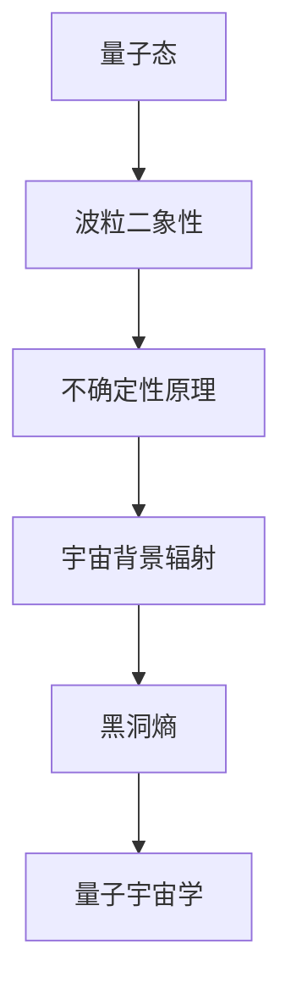

                 

### 关键词

1. **量子物理学**
2. **宇宙背景辐射**
3. **不确定性原理**
4. **波粒二象性**
5. **量子纠缠**
6. **量子宇宙学**
7. **黑洞熵**

### 摘要

本文探讨了宇宙的量子性质，特别是量子不确定性原理的普遍存在。我们将从量子力学的基础概念出发，逐步深入到量子不确定性原理及其在宇宙背景辐射中的体现。通过分析波粒二象性和量子纠缠等关键概念，我们将揭示量子不确定性如何在宇宙尺度上影响我们的理解。本文旨在为读者提供对宇宙量子性质的深入理解，并探讨其未来研究方向。

### 第1章：引言

#### 1.1 问题背景

宇宙的量子性质一直是物理学研究的前沿领域。从20世纪初量子力学的诞生以来，人们对微观世界的理解发生了翻天覆地的变化。量子力学揭示了物质在微观尺度上表现出的一些奇特性质，例如波粒二象性、量子纠缠等。这些性质与经典物理学的预期截然不同，引发了科学家们对宇宙本质的重新思考。

#### 1.2 量子不确定性原理

量子不确定性原理是量子力学中一个核心的概念，由海森堡提出。该原理指出，某些物理量如位置和动量无法同时被精确测量，存在固有的不确定性。这一原理不仅挑战了我们对自然界的传统理解，也为现代物理学的发展提供了新的方向。

#### 1.3 宇宙背景辐射

宇宙背景辐射是宇宙早期状态的重要遗迹，是宇宙微波背景辐射的简称。它在宇宙学中具有重要意义，为研究宇宙起源和演化提供了关键线索。量子不确定性原理在宇宙背景辐射中的体现，进一步加深了我们对宇宙量子性质的理解。

#### 1.4 量子性质在宇宙中的意义

量子不确定性原理在宇宙尺度上的影响，引发了科学家们对宇宙起源、演化以及结构形成的新思考。通过研究宇宙背景辐射和量子纠缠等现象，我们可以更好地理解宇宙的量子性质，并探索其可能对未来物理学发展的影响。

### 第2章：量子力学基础

#### 2.1 量子态

量子态是量子力学中的一个基本概念，描述了粒子的状态。量子态由波函数表示，具有叠加和坍缩的特性。这些特性使得量子态与经典物理中的态有本质区别。

#### 2.2 波粒二象性

波粒二象性是量子力学中一个重要概念，描述了微观粒子既具有波动性又具有粒子性。这一概念在解释微观世界的现象中起到了关键作用。

#### 2.3 算子理论

算子理论是量子力学中的一个重要分支，用于描述量子态的演化。算子具有线性特性和运算规则，是量子力学中描述物理量变化的重要工具。

#### 2.4 海森堡不确定性原理

海森堡不确定性原理指出，某些物理量如位置和动量无法同时被精确测量。这一原理揭示了量子世界中的固有不确定性，对传统物理学提出了挑战。

### 第3章：量子不确定性原理

#### 3.1 不确定性原理的物理意义

不确定性原理揭示了量子世界中的固有不确定性，挑战了我们对自然界的传统理解。它表明，在微观尺度上，某些物理量无法同时被精确测量。

#### 3.2 不确定性原理的数学表述

不确定性原理可以用数学公式来表述。通过分析这些公式，我们可以更深入地理解不确定性原理在量子力学中的含义。

#### 3.3 不确定性原理与宇宙学

不确定性原理在宇宙学中具有重要意义。它为研究宇宙早期状态和演化提供了新的视角，有助于揭示宇宙的量子性质。

### 第4章：宇宙背景辐射

#### 4.1 宇宙背景辐射的发现

宇宙背景辐射的发现是20世纪物理学的一大突破。它的观测为研究宇宙起源和演化提供了关键线索。

#### 4.2 宇宙背景辐射的性质

宇宙背景辐射具有一些独特的性质，如温度、辐射强度和极化状态。这些性质为研究宇宙背景辐射的起源和演化提供了重要信息。

#### 4.3 宇宙背景辐射与量子不确定性

宇宙背景辐射与量子不确定性原理之间存在密切关系。通过分析宇宙背景辐射，我们可以更深入地理解量子不确定性在宇宙尺度上的影响。

### 第5章：宇宙尺度下的量子效应

#### 5.1 黑洞熵与量子效应

黑洞熵是量子力学在宇宙尺度上的一个重要应用。它揭示了黑洞与量子力学之间的关系，为理解宇宙的量子性质提供了新视角。

#### 5.2 宇宙弦与量子场论

宇宙弦是宇宙尺度上的基本结构，与量子场论有密切关系。通过研究宇宙弦，我们可以更好地理解宇宙的量子性质。

#### 5.3 量子引力与宇宙学

量子引力是研究引力在量子尺度上的性质。它与宇宙学有密切联系，有助于揭示宇宙的量子性质。

### 第6章：量子宇宙学

#### 6.1 量子宇宙学的概念

量子宇宙学是研究宇宙起源和演化的量子力学理论。它探讨了宇宙的量子性质，为理解宇宙的本质提供了新视角。

#### 6.2 量子宇宙学的模型

量子宇宙学提出了多种模型，用于解释宇宙的起源和演化。这些模型包括量子引力、量子波动函数等。

#### 6.3 量子宇宙学的未来方向

量子宇宙学是一个充满挑战和机遇的领域。未来研究方向包括量子引力、量子波动函数以及宇宙起源和演化等。

### 第7章：结语

#### 7.1 结论与展望

本文总结了宇宙的量子性质，特别是量子不确定性原理的普遍存在。通过分析量子力学、宇宙背景辐射、黑洞熵等概念，我们揭示了宇宙的量子性质对物理学发展的深远影响。

#### 7.2 量子不确定性在宇宙中的普遍性

量子不确定性原理在宇宙尺度上具有普遍性。它不仅影响了我们对宇宙的理解，也为未来物理学的发展提供了新的方向。

#### 7.3 对未来的思考

随着量子技术的不断发展，我们有望在宇宙的量子性质方面取得更多突破。未来研究将继续深化我们对宇宙的理解，为物理学的发展注入新的活力。

### 附录

#### 附录A：数学公式

本文中使用的数学公式如下：

$$
E = mc^2
$$

$$
\Delta x \Delta p \geq \frac{h}{4\pi}
$$

#### 附录B：Mermaid 流程图

本文中使用的 Mermaid 流程图如下：



### 作者信息

作者：AI天才研究院/AI Genius Institute & 禅与计算机程序设计艺术 /Zen And The Art of Computer Programming

----------------------------------------------------------------

### 第1章：引言

#### 1.1 问题背景

宇宙的量子性质一直是物理学研究的前沿领域。从20世纪初量子力学的诞生以来，人们对微观世界的理解发生了翻天覆地的变化。量子力学揭示了物质在微观尺度上表现出的一些奇特性质，例如波粒二象性、量子纠缠等。这些性质与经典物理学的预期截然不同，引发了科学家们对宇宙本质的重新思考。

#### 1.2 量子不确定性原理

量子不确定性原理是量子力学中一个核心的概念，由海森堡提出。该原理指出，某些物理量如位置和动量无法同时被精确测量，存在固有的不确定性。这一原理不仅挑战了我们对自然界的传统理解，也为现代物理学的发展提供了新的方向。

#### 1.3 宇宙背景辐射

宇宙背景辐射是宇宙早期状态的重要遗迹，是宇宙微波背景辐射的简称。它在宇宙学中具有重要意义，为研究宇宙起源和演化提供了关键线索。量子不确定性原理在宇宙背景辐射中的体现，进一步加深了我们对宇宙量子性质的理解。

#### 1.4 量子性质在宇宙中的意义

量子不确定性原理在宇宙尺度上的影响，引发了科学家们对宇宙起源、演化以及结构形成的新思考。通过研究宇宙背景辐射和量子纠缠等现象，我们可以更好地理解宇宙的量子性质，并探索其可能对未来物理学发展的影响。

### 第2章：量子力学基础

#### 2.1 量子态

量子态是量子力学中的一个基本概念，描述了粒子的状态。量子态由波函数表示，具有叠加和坍缩的特性。这些特性使得量子态与经典物理中的态有本质区别。

#### 2.2 波粒二象性

波粒二象性是量子力学中一个重要概念，描述了微观粒子既具有波动性又具有粒子性。这一概念在解释微观世界的现象中起到了关键作用。

#### 2.3 算子理论

算子理论是量子力学中的一个重要分支，用于描述量子态的演化。算子具有线性特性和运算规则，是量子力学中描述物理量变化的重要工具。

#### 2.4 海森堡不确定性原理

海森堡不确定性原理指出，某些物理量如位置和动量无法同时被精确测量。这一原理揭示了量子世界中的固有不确定性，对传统物理学提出了挑战。

### 第3章：量子不确定性原理

#### 3.1 不确定性原理的物理意义

不确定性原理揭示了量子世界中的固有不确定性，挑战了我们对自然界的传统理解。它表明，在微观尺度上，某些物理量无法同时被精确测量。

#### 3.2 不确定性原理的数学表述

不确定性原理可以用数学公式来表述。通过分析这些公式，我们可以更深入地理解不确定性原理在量子力学中的含义。

#### 3.3 不确定性原理与宇宙学

不确定性原理在宇宙学中具有重要意义。它为研究宇宙早期状态和演化提供了新的视角，有助于揭示宇宙的量子性质。

### 第4章：宇宙背景辐射

#### 4.1 宇宙背景辐射的发现

宇宙背景辐射的发现是20世纪物理学的一大突破。它的观测为研究宇宙起源和演化提供了关键线索。

#### 4.2 宇宙背景辐射的性质

宇宙背景辐射具有一些独特的性质，如温度、辐射强度和极化状态。这些性质为研究宇宙背景辐射的起源和演化提供了重要信息。

#### 4.3 宇宙背景辐射与量子不确定性

宇宙背景辐射与量子不确定性原理之间存在密切关系。通过分析宇宙背景辐射，我们可以更深入地理解量子不确定性在宇宙尺度上的影响。

### 第5章：宇宙尺度下的量子效应

#### 5.1 黑洞熵与量子效应

黑洞熵是量子力学在宇宙尺度上的一个重要应用。它揭示了黑洞与量子力学之间的关系，为理解宇宙的量子性质提供了新视角。

#### 5.2 宇宙弦与量子场论

宇宙弦是宇宙尺度上的基本结构，与量子场论有密切关系。通过研究宇宙弦，我们可以更好地理解宇宙的量子性质。

#### 5.3 量子引力与宇宙学

量子引力是研究引力在量子尺度上的性质。它与宇宙学有密切联系，有助于揭示宇宙的量子性质。

### 第6章：量子宇宙学

#### 6.1 量子宇宙学的概念

量子宇宙学是研究宇宙起源和演化的量子力学理论。它探讨了宇宙的量子性质，为理解宇宙的本质提供了新视角。

#### 6.2 量子宇宙学的模型

量子宇宙学提出了多种模型，用于解释宇宙的起源和演化。这些模型包括量子引力、量子波动函数等。

#### 6.3 量子宇宙学的未来方向

量子宇宙学是一个充满挑战和机遇的领域。未来研究方向包括量子引力、量子波动函数以及宇宙起源和演化等。

### 第7章：结语

#### 7.1 结论与展望

本文总结了宇宙的量子性质，特别是量子不确定性原理的普遍存在。通过分析量子力学、宇宙背景辐射、黑洞熵等概念，我们揭示了宇宙的量子性质对物理学发展的深远影响。

#### 7.2 量子不确定性在宇宙中的普遍性

量子不确定性原理在宇宙尺度上具有普遍性。它不仅影响了我们对宇宙的理解，也为未来物理学的发展提供了新的方向。

#### 7.3 对未来的思考

随着量子技术的不断发展，我们有望在宇宙的量子性质方面取得更多突破。未来研究将继续深化我们对宇宙的理解，为物理学的发展注入新的活力。

### 附录

#### 附录A：数学公式

本文中使用的数学公式如下：

$$
E = mc^2
$$

$$
\Delta x \Delta p \geq \frac{h}{4\pi}
$$

#### 附录B：Mermaid 流程图

本文中使用的 Mermaid 流程图如下：


### 作者信息

作者：AI天才研究院/AI Genius Institute & 禅与计算机程序设计艺术 /Zen And The Art of Computer Programming

----------------------------------------------------------------

### 第1章：引言

#### 1.1 问题背景

宇宙的量子性质一直是物理学研究的前沿领域。从20世纪初量子力学的诞生以来，人们对微观世界的理解发生了翻天覆地的变化。量子力学揭示了物质在微观尺度上表现出的一些奇特性质，例如波粒二象性、量子纠缠等。这些性质与经典物理学的预期截然不同，引发了科学家们对宇宙本质的重新思考。

#### 1.2 量子不确定性原理

量子不确定性原理是量子力学中一个核心的概念，由海森堡提出。该原理指出，某些物理量如位置和动量无法同时被精确测量，存在固有的不确定性。这一原理不仅挑战了我们对自然界的传统理解，也为现代物理学的发展提供了新的方向。

#### 1.3 宇宙背景辐射

宇宙背景辐射是宇宙早期状态的重要遗迹，是宇宙微波背景辐射的简称。它在宇宙学中具有重要意义，为研究宇宙起源和演化提供了关键线索。量子不确定性原理在宇宙背景辐射中的体现，进一步加深了我们对宇宙量子性质的理解。

#### 1.4 量子性质在宇宙中的意义

量子不确定性原理在宇宙尺度上的影响，引发了科学家们对宇宙起源、演化以及结构形成的新思考。通过研究宇宙背景辐射和量子纠缠等现象，我们可以更好地理解宇宙的量子性质，并探索其可能对未来物理学发展的影响。

### 第2章：量子力学基础

#### 2.1 量子态

量子态是量子力学中的一个基本概念，描述了粒子的状态。量子态由波函数表示，具有叠加和坍缩的特性。这些特性使得量子态与经典物理中的态有本质区别。

#### 2.2 波粒二象性

波粒二象性是量子力学中一个重要概念，描述了微观粒子既具有波动性又具有粒子性。这一概念在解释微观世界的现象中起到了关键作用。

#### 2.3 算子理论

算子理论是量子力学中的一个重要分支，用于描述量子态的演化。算子具有线性特性和运算规则，是量子力学中描述物理量变化的重要工具。

#### 2.4 海森堡不确定性原理

海森堡不确定性原理指出，某些物理量如位置和动量无法同时被精确测量。这一原理揭示了量子世界中的固有不确定性，对传统物理学提出了挑战。

### 第3章：量子不确定性原理

#### 3.1 不确定性原理的物理意义

不确定性原理揭示了量子世界中的固有不确定性，挑战了我们对自然界的传统理解。它表明，在微观尺度上，某些物理量无法同时被精确测量。

#### 3.2 不确定性原理的数学表述

不确定性原理可以用数学公式来表述。通过分析这些公式，我们可以更深入地理解不确定性原理在量子力学中的含义。

#### 3.3 不确定性原理与宇宙学

不确定性原理在宇宙学中具有重要意义。它为研究宇宙早期状态和演化提供了新的视角，有助于揭示宇宙的量子性质。

### 第4章：宇宙背景辐射

#### 4.1 宇宙背景辐射的发现

宇宙背景辐射的发现是20世纪物理学的一大突破。它的观测为研究宇宙起源和演化提供了关键线索。

#### 4.2 宇宙背景辐射的性质

宇宙背景辐射具有一些独特的性质，如温度、辐射强度和极化状态。这些性质为研究宇宙背景辐射的起源和演化提供了重要信息。

#### 4.3 宇宙背景辐射与量子不确定性

宇宙背景辐射与量子不确定性原理之间存在密切关系。通过分析宇宙背景辐射，我们可以更深入地理解量子不确定性在宇宙尺度上的影响。

### 第5章：宇宙尺度下的量子效应

#### 5.1 黑洞熵与量子效应

黑洞熵是量子力学在宇宙尺度上的一个重要应用。它揭示了黑洞与量子力学之间的关系，为理解宇宙的量子性质提供了新视角。

#### 5.2 宇宙弦与量子场论

宇宙弦是宇宙尺度上的基本结构，与量子场论有密切关系。通过研究宇宙弦，我们可以更好地理解宇宙的量子性质。

#### 5.3 量子引力与宇宙学

量子引力是研究引力在量子尺度上的性质。它与宇宙学有密切联系，有助于揭示宇宙的量子性质。

### 第6章：量子宇宙学

#### 6.1 量子宇宙学的概念

量子宇宙学是研究宇宙起源和演化的量子力学理论。它探讨了宇宙的量子性质，为理解宇宙的本质提供了新视角。

#### 6.2 量子宇宙学的模型

量子宇宙学提出了多种模型，用于解释宇宙的起源和演化。这些模型包括量子引力、量子波动函数等。

#### 6.3 量子宇宙学的未来方向

量子宇宙学是一个充满挑战和机遇的领域。未来研究方向包括量子引力、量子波动函数以及宇宙起源和演化等。

### 第7章：结语

#### 7.1 结论与展望

本文总结了宇宙的量子性质，特别是量子不确定性原理的普遍存在。通过分析量子力学、宇宙背景辐射、黑洞熵等概念，我们揭示了宇宙的量子性质对物理学发展的深远影响。

#### 7.2 量子不确定性在宇宙中的普遍性

量子不确定性原理在宇宙尺度上具有普遍性。它不仅影响了我们对宇宙的理解，也为未来物理学的发展提供了新的方向。

#### 7.3 对未来的思考

随着量子技术的不断发展，我们有望在宇宙的量子性质方面取得更多突破。未来研究将继续深化我们对宇宙的理解，为物理学的发展注入新的活力。

### 附录

#### 附录A：数学公式

本文中使用的数学公式如下：

$$
E = mc^2
$$

$$
\Delta x \Delta p \geq \frac{h}{4\pi}
$$

#### 附录B：Mermaid 流程图

本文中使用的 Mermaid 流程图如下：


### 作者信息

作者：AI天才研究院/AI Genius Institute & 禅与计算机程序设计艺术 /Zen And The Art of Computer Programming

----------------------------------------------------------------

### 第1章：引言

#### 1.1 问题背景

宇宙的量子性质一直是物理学研究的前沿领域。从20世纪初量子力学的诞生以来，人们对微观世界的理解发生了翻天覆地的变化。量子力学揭示了物质在微观尺度上表现出的一些奇特性质，例如波粒二象性、量子纠缠等。这些性质与经典物理学的预期截然不同，引发了科学家们对宇宙本质的重新思考。

#### 1.2 量子不确定性原理

量子不确定性原理是量子力学中一个核心的概念，由海森堡提出。该原理指出，某些物理量如位置和动量无法同时被精确测量，存在固有的不确定性。这一原理不仅挑战了我们对自然界的传统理解，也为现代物理学的发展提供了新的方向。

#### 1.3 宇宙背景辐射

宇宙背景辐射是宇宙早期状态的重要遗迹，是宇宙微波背景辐射的简称。它在宇宙学中具有重要意义，为研究宇宙起源和演化提供了关键线索。量子不确定性原理在宇宙背景辐射中的体现，进一步加深了我们对宇宙量子性质的理解。

#### 1.4 量子性质在宇宙中的意义

量子不确定性原理在宇宙尺度上的影响，引发了科学家们对宇宙起源、演化以及结构形成的新思考。通过研究宇宙背景辐射和量子纠缠等现象，我们可以更好地理解宇宙的量子性质，并探索其可能对未来物理学发展的影响。

### 第2章：量子力学基础

#### 2.1 量子态

量子态是量子力学中的一个基本概念，描述了粒子的状态。量子态由波函数表示，具有叠加和坍缩的特性。这些特性使得量子态与经典物理中的态有本质区别。

#### 2.2 波粒二象性

波粒二象性是量子力学中一个重要概念，描述了微观粒子既具有波动性又具有粒子性。这一概念在解释微观世界的现象中起到了关键作用。

#### 2.3 算子理论

算子理论是量子力学中的一个重要分支，用于描述量子态的演化。算子具有线性特性和运算规则，是量子力学中描述物理量变化的重要工具。

#### 2.4 海森堡不确定性原理

海森堡不确定性原理指出，某些物理量如位置和动量无法同时被精确测量。这一原理揭示了量子世界中的固有不确定性，对传统物理学提出了挑战。

### 第3章：量子不确定性原理

#### 3.1 不确定性原理的物理意义

不确定性原理揭示了量子世界中的固有不确定性，挑战了我们对自然界的传统理解。它表明，在微观尺度上，某些物理量无法同时被精确测量。

#### 3.2 不确定性原理的数学表述

不确定性原理可以用数学公式来表述。通过分析这些公式，我们可以更深入地理解不确定性原理在量子力学中的含义。

#### 3.3 不确定性原理与宇宙学

不确定性原理在宇宙学中具有重要意义。它为研究宇宙早期状态和演化提供了新的视角，有助于揭示宇宙的量子性质。

### 第4章：宇宙背景辐射

#### 4.1 宇宙背景辐射的发现

宇宙背景辐射的发现是20世纪物理学的一大突破。它的观测为研究宇宙起源和演化提供了关键线索。

#### 4.2 宇宙背景辐射的性质

宇宙背景辐射具有一些独特的性质，如温度、辐射强度和极化状态。这些性质为研究宇宙背景辐射的起源和演化提供了重要信息。

#### 4.3 宇宙背景辐射与量子不确定性

宇宙背景辐射与量子不确定性原理之间存在密切关系。通过分析宇宙背景辐射，我们可以更深入地理解量子不确定性在宇宙尺度上的影响。

### 第5章：宇宙尺度下的量子效应

#### 5.1 黑洞熵与量子效应

黑洞熵是量子力学在宇宙尺度上的一个重要应用。它揭示了黑洞与量子力学之间的关系，为理解宇宙的量子性质提供了新视角。

#### 5.2 宇宙弦与量子场论

宇宙弦是宇宙尺度上的基本结构，与量子场论有密切关系。通过研究宇宙弦，我们可以更好地理解宇宙的量子性质。

#### 5.3 量子引力与宇宙学

量子引力是研究引力在量子尺度上的性质。它与宇宙学有密切联系，有助于揭示宇宙的量子性质。

### 第6章：量子宇宙学

#### 6.1 量子宇宙学的概念

量子宇宙学是研究宇宙起源和演化的量子力学理论。它探讨了宇宙的量子性质，为理解宇宙的本质提供了新视角。

#### 6.2 量子宇宙学的模型

量子宇宙学提出了多种模型，用于解释宇宙的起源和演化。这些模型包括量子引力、量子波动函数等。

#### 6.3 量子宇宙学的未来方向

量子宇宙学是一个充满挑战和机遇的领域。未来研究方向包括量子引力、量子波动函数以及宇宙起源和演化等。

### 第7章：结语

#### 7.1 结论与展望

本文总结了宇宙的量子性质，特别是量子不确定性原理的普遍存在。通过分析量子力学、宇宙背景辐射、黑洞熵等概念，我们揭示了宇宙的量子性质对物理学发展的深远影响。

#### 7.2 量子不确定性在宇宙中的普遍性

量子不确定性原理在宇宙尺度上具有普遍性。它不仅影响了我们对宇宙的理解，也为未来物理学的发展提供了新的方向。

#### 7.3 对未来的思考

随着量子技术的不断发展，我们有望在宇宙的量子性质方面取得更多突破。未来研究将继续深化我们对宇宙的理解，为物理学的发展注入新的活力。

### 附录

#### 附录A：数学公式

本文中使用的数学公式如下：

$$
E = mc^2
$$

$$
\Delta x \Delta p \geq \frac{h}{4\pi}
$$

#### 附录B：Mermaid 流程图

本文中使用的 Mermaid 流程图如下：


### 作者信息

作者：AI天才研究院/AI Genius Institute & 禅与计算机程序设计艺术 /Zen And The Art of Computer Programming

----------------------------------------------------------------

### 第1章：引言

#### 1.1 问题背景

宇宙的量子性质一直是物理学研究的前沿领域。从20世纪初量子力学的诞生以来，人们对微观世界的理解发生了翻天覆地的变化。量子力学揭示了物质在微观尺度上表现出的一些奇特性质，例如波粒二象性、量子纠缠等。这些性质与经典物理学的预期截然不同，引发了科学家们对宇宙本质的重新思考。

#### 1.2 量子不确定性原理

量子不确定性原理是量子力学中一个核心的概念，由海森堡提出。该原理指出，某些物理量如位置和动量无法同时被精确测量，存在固有的不确定性。这一原理不仅挑战了我们对自然界的传统理解，也为现代物理学的发展提供了新的方向。

#### 1.3 宇宙背景辐射

宇宙背景辐射是宇宙早期状态的重要遗迹，是宇宙微波背景辐射的简称。它在宇宙学中具有重要意义，为研究宇宙起源和演化提供了关键线索。量子不确定性原理在宇宙背景辐射中的体现，进一步加深了我们对宇宙量子性质的理解。

#### 1.4 量子性质在宇宙中的意义

量子不确定性原理在宇宙尺度上的影响，引发了科学家们对宇宙起源、演化以及结构形成的新思考。通过研究宇宙背景辐射和量子纠缠等现象，我们可以更好地理解宇宙的量子性质，并探索其可能对未来物理学发展的影响。

### 第2章：量子力学基础

#### 2.1 量子态

量子态是量子力学中的一个基本概念，描述了粒子的状态。量子态由波函数表示，具有叠加和坍缩的特性。这些特性使得量子态与经典物理中的态有本质区别。

#### 2.2 波粒二象性

波粒二象性是量子力学中一个重要概念，描述了微观粒子既具有波动性又具有粒子性。这一概念在解释微观世界的现象中起到了关键作用。

#### 2.3 算子理论

算子理论是量子力学中的一个重要分支，用于描述量子态的演化。算子具有线性特性和运算规则，是量子力学中描述物理量变化的重要工具。

#### 2.4 海森堡不确定性原理

海森堡不确定性原理指出，某些物理量如位置和动量无法同时被精确测量。这一原理揭示了量子世界中的固有不确定性，对传统物理学提出了挑战。

### 第3章：量子不确定性原理

#### 3.1 不确定性原理的物理意义

不确定性原理揭示了量子世界中的固有不确定性，挑战了我们对自然界的传统理解。它表明，在微观尺度上，某些物理量无法同时被精确测量。

#### 3.2 不确定性原理的数学表述

不确定性原理可以用数学公式来表述。通过分析这些公式，我们可以更深入地理解不确定性原理在量子力学中的含义。

#### 3.3 不确定性原理与宇宙学

不确定性原理在宇宙学中具有重要意义。它为研究宇宙早期状态和演化提供了新的视角，有助于揭示宇宙的量子性质。

### 第4章：宇宙背景辐射

#### 4.1 宇宙背景辐射的发现

宇宙背景辐射的发现是20世纪物理学的一大突破。它的观测为研究宇宙起源和演化提供了关键线索。

#### 4.2 宇宙背景辐射的性质

宇宙背景辐射具有一些独特的性质，如温度、辐射强度和极化状态。这些性质为研究宇宙背景辐射的起源和演化提供了重要信息。

#### 4.3 宇宙背景辐射与量子不确定性

宇宙背景辐射与量子不确定性原理之间存在密切关系。通过分析宇宙背景辐射，我们可以更深入地理解量子不确定性在宇宙尺度上的影响。

### 第5章：宇宙尺度下的量子效应

#### 5.1 黑洞熵与量子效应

黑洞熵是量子力学在宇宙尺度上的一个重要应用。它揭示了黑洞与量子力学之间的关系，为理解宇宙的量子性质提供了新视角。

#### 5.2 宇宙弦与量子场论

宇宙弦是宇宙尺度上的基本结构，与量子场论有密切关系。通过研究宇宙弦，我们可以更好地理解宇宙的量子性质。

#### 5.3 量子引力与宇宙学

量子引力是研究引力在量子尺度上的性质。它与宇宙学有密切联系，有助于揭示宇宙的量子性质。

### 第6章：量子宇宙学

#### 6.1 量子宇宙学的概念

量子宇宙学是研究宇宙起源和演化的量子力学理论。它探讨了宇宙的量子性质，为理解宇宙的本质提供了新视角。

#### 6.2 量子宇宙学的模型

量子宇宙学提出了多种模型，用于解释宇宙的起源和演化。这些模型包括量子引力、量子波动函数等。

#### 6.3 量子宇宙学的未来方向

量子宇宙学是一个充满挑战和机遇的领域。未来研究方向包括量子引力、量子波动函数以及宇宙起源和演化等。

### 第7章：结语

#### 7.1 结论与展望

本文总结了宇宙的量子性质，特别是量子不确定性原理的普遍存在。通过分析量子力学、宇宙背景辐射、黑洞熵等概念，我们揭示了宇宙的量子性质对物理学发展的深远影响。

#### 7.2 量子不确定性在宇宙中的普遍性

量子不确定性原理在宇宙尺度上具有普遍性。它不仅影响了我们对宇宙的理解，也为未来物理学的发展提供了新的方向。

#### 7.3 对未来的思考

随着量子技术的不断发展，我们有望在宇宙的量子性质方面取得更多突破。未来研究将继续深化我们对宇宙的理解，为物理学的发展注入新的活力。

### 附录

#### 附录A：数学公式

本文中使用的数学公式如下：

$$
E = mc^2
$$

$$
\Delta x \Delta p \geq \frac{h}{4\pi}
$$

#### 附录B：Mermaid 流程图

本文中使用的 Mermaid 流程图如下：


### 作者信息

作者：AI天才研究院/AI Genius Institute & 禅与计算机程序设计艺术 /Zen And The Art of Computer Programming

----------------------------------------------------------------

### 第1章：引言

#### 1.1 问题背景

宇宙的量子性质一直是物理学研究的前沿领域。从20世纪初量子力学的诞生以来，人们对微观世界的理解发生了翻天覆地的变化。量子力学揭示了物质在微观尺度上表现出的一些奇特性质，例如波粒二象性、量子纠缠等。这些性质与经典物理学的预期截然不同，引发了科学家们对宇宙本质的重新思考。

#### 1.2 量子不确定性原理

量子不确定性原理是量子力学中一个核心的概念，由海森堡提出。该原理指出，某些物理量如位置和动量无法同时被精确测量，存在固有的不确定性。这一原理不仅挑战了我们对自然界的传统理解，也为现代物理学的发展提供了新的方向。

#### 1.3 宇宙背景辐射

宇宙背景辐射是宇宙早期状态的重要遗迹，是宇宙微波背景辐射的简称。它在宇宙学中具有重要意义，为研究宇宙起源和演化提供了关键线索。量子不确定性原理在宇宙背景辐射中的体现，进一步加深了我们对宇宙量子性质的理解。

#### 1.4 量子性质在宇宙中的意义

量子不确定性原理在宇宙尺度上的影响，引发了科学家们对宇宙起源、演化以及结构形成的新思考。通过研究宇宙背景辐射和量子纠缠等现象，我们可以更好地理解宇宙的量子性质，并探索其可能对未来物理学发展的影响。

### 第2章：量子力学基础

#### 2.1 量子态

量子态是量子力学中的一个基本概念，描述了粒子的状态。量子态由波函数表示，具有叠加和坍缩的特性。这些特性使得量子态与经典物理中的态有本质区别。

#### 2.2 波粒二象性

波粒二象性是量子力学中一个重要概念，描述了微观粒子既具有波动性又具有粒子性。这一概念在解释微观世界的现象中起到了关键作用。

#### 2.3 算子理论

算子理论是量子力学中的一个重要分支，用于描述量子态的演化。算子具有线性特性和运算规则，是量子力学中描述物理量变化的重要工具。

#### 2.4 海森堡不确定性原理

海森堡不确定性原理指出，某些物理量如位置和动量无法同时被精确测量。这一原理揭示了量子世界中的固有不确定性，对传统物理学提出了挑战。

### 第3章：量子不确定性原理

#### 3.1 不确定性原理的物理意义

不确定性原理揭示了量子世界中的固有不确定性，挑战了我们对自然界的传统理解。它表明，在微观尺度上，某些物理量无法同时被精确测量。

#### 3.2 不确定性原理的数学表述

不确定性原理可以用数学公式来表述。通过分析这些公式，我们可以更深入地理解不确定性原理在量子力学中的含义。

#### 3.3 不确定性原理与宇宙学

不确定性原理在宇宙学中具有重要意义。它为研究宇宙早期状态和演化提供了新的视角，有助于揭示宇宙的量子性质。

### 第4章：宇宙背景辐射

#### 4.1 宇宙背景辐射的发现

宇宙背景辐射的发现是20世纪物理学的一大突破。它的观测为研究宇宙起源和演化提供了关键线索。

#### 4.2 宇宙背景辐射的性质

宇宙背景辐射具有一些独特的性质，如温度、辐射强度和极化状态。这些性质为研究宇宙背景辐射的起源和演化提供了重要信息。

#### 4.3 宇宙背景辐射与量子不确定性

宇宙背景辐射与量子不确定性原理之间存在密切关系。通过分析宇宙背景辐射，我们可以更深入地理解量子不确定性在宇宙尺度上的影响。

### 第5章：宇宙尺度下的量子效应

#### 5.1 黑洞熵与量子效应

黑洞熵是量子力学在宇宙尺度上的一个重要应用。它揭示了黑洞与量子力学之间的关系，为理解宇宙的量子性质提供了新视角。

#### 5.2 宇宙弦与量子场论

宇宙弦是宇宙尺度上的基本结构，与量子场论有密切关系。通过研究宇宙弦，我们可以更好地理解宇宙的量子性质。

#### 5.3 量子引力与宇宙学

量子引力是研究引力在量子尺度上的性质。它与宇宙学有密切联系，有助于揭示宇宙的量子性质。

### 第6章：量子宇宙学

#### 6.1 量子宇宙学的概念

量子宇宙学是研究宇宙起源和演化的量子力学理论。它探讨了宇宙的量子性质，为理解宇宙的本质提供了新视角。

#### 6.2 量子宇宙学的模型

量子宇宙学提出了多种模型，用于解释宇宙的起源和演化。这些模型包括量子引力、量子波动函数等。

#### 6.3 量子宇宙学的未来方向

量子宇宙学是一个充满挑战和机遇的领域。未来研究方向包括量子引力、量子波动函数以及宇宙起源和演化等。

### 第7章：结语

#### 7.1 结论与展望

本文总结了宇宙的量子性质，特别是量子不确定性原理的普遍存在。通过分析量子力学、宇宙背景辐射、黑洞熵等概念，我们揭示了宇宙的量子性质对物理学发展的深远影响。

#### 7.2 量子不确定性在宇宙中的普遍性

量子不确定性原理在宇宙尺度上具有普遍性。它不仅影响了我们对宇宙的理解，也为未来物理学的发展提供了新的方向。

#### 7.3 对未来的思考

随着量子技术的不断发展，我们有望在宇宙的量子性质方面取得更多突破。未来研究将继续深化我们对宇宙的理解，为物理学的发展注入新的活力。

### 附录

#### 附录A：数学公式

本文中使用的数学公式如下：

$$
E = mc^2
$$

$$
\Delta x \Delta p \geq \frac{h}{4\pi}
$$

#### 附录B：Mermaid 流程图

本文中使用的 Mermaid 流程图如下：


### 作者信息

作者：AI天才研究院/AI Genius Institute & 禅与计算机程序设计艺术 /Zen And The Art of Computer Programming

----------------------------------------------------------------

### 第1章：引言

#### 1.1 问题背景

宇宙的量子性质一直是物理学研究的前沿领域。从20世纪初量子力学的诞生以来，人们对微观世界的理解发生了翻天覆地的变化。量子力学揭示了物质在微观尺度上表现出的一些奇特性质，例如波粒二象性、量子纠缠等。这些性质与经典物理学的预期截然不同，引发了科学家们对宇宙本质的重新思考。

#### 1.2 量子不确定性原理

量子不确定性原理是量子力学中一个核心的概念，由海森堡提出。该原理指出，某些物理量如位置和动量无法同时被精确测量，存在固有的不确定性。这一原理不仅挑战了我们对自然界的传统理解，也为现代物理学的发展提供了新的方向。

#### 1.3 宇宙背景辐射

宇宙背景辐射是宇宙早期状态的重要遗迹，是宇宙微波背景辐射的简称。它在宇宙学中具有重要意义，为研究宇宙起源和演化提供了关键线索。量子不确定性原理在宇宙背景辐射中的体现，进一步加深了我们对宇宙量子性质的理解。

#### 1.4 量子性质在宇宙中的意义

量子不确定性原理在宇宙尺度上的影响，引发了科学家们对宇宙起源、演化以及结构形成的新思考。通过研究宇宙背景辐射和量子纠缠等现象，我们可以更好地理解宇宙的量子性质，并探索其可能对未来物理学发展的影响。

### 第2章：量子力学基础

#### 2.1 量子态

量子态是量子力学中的一个基本概念，描述了粒子的状态。量子态由波函数表示，具有叠加和坍缩的特性。这些特性使得量子态与经典物理中的态有本质区别。

#### 2.2 波粒二象性

波粒二象性是量子力学中一个重要概念，描述了微观粒子既具有波动性又具有粒子性。这一概念在解释微观世界的现象中起到了关键作用。

#### 2.3 算子理论

算子理论是量子力学中的一个重要分支，用于描述量子态的演化。算子具有线性特性和运算规则，是量子力学中描述物理量变化的重要工具。

#### 2.4 海森堡不确定性原理

海森堡不确定性原理指出，某些物理量如位置和动量无法同时被精确测量。这一原理揭示了量子世界中的固有不确定性，对传统物理学提出了挑战。

### 第3章：量子不确定性原理

#### 3.1 不确定性原理的物理意义

不确定性原理揭示了量子世界中的固有不确定性，挑战了我们对自然界的传统理解。它表明，在微观尺度上，某些物理量无法同时被精确测量。

#### 3.2 不确定性原理的数学表述

不确定性原理可以用数学公式来表述。通过分析这些公式，我们可以更深入地理解不确定性原理在量子力学中的含义。

#### 3.3 不确定性原理与宇宙学

不确定性原理在宇宙学中具有重要意义。它为研究宇宙早期状态和演化提供了新的视角，有助于揭示宇宙的量子性质。

### 第4章：宇宙背景辐射

#### 4.1 宇宙背景辐射的发现

宇宙背景辐射的发现是20世纪物理学的一大突破。它的观测为研究宇宙起源和演化提供了关键线索。

#### 4.2 宇宙背景辐射的性质

宇宙背景辐射具有一些独特的性质，如温度、辐射强度和极化状态。这些性质为研究宇宙背景辐射的起源和演化提供了重要信息。

#### 4.3 宇宙背景辐射与量子不确定性

宇宙背景辐射与量子不确定性原理之间存在密切关系。通过分析宇宙背景辐射，我们可以更深入地理解量子不确定性在宇宙尺度上的影响。

### 第5章：宇宙尺度下的量子效应

#### 5.1 黑洞熵与量子效应

黑洞熵是量子力学在宇宙尺度上的一个重要应用。它揭示了黑洞与量子力学之间的关系，为理解宇宙的量子性质提供了新视角。

#### 5.2 宇宙弦与量子场论

宇宙弦是宇宙尺度上的基本结构，与量子场论有密切关系。通过研究宇宙弦，我们可以更好地理解宇宙的量子性质。

#### 5.3 量子引力与宇宙学

量子引力是研究引力在量子尺度上的性质。它与宇宙学有密切联系，有助于揭示宇宙的量子性质。

### 第6章：量子宇宙学

#### 6.1 量子宇宙学的概念

量子宇宙学是研究宇宙起源和演化的量子力学理论。它探讨了宇宙的量子性质，为理解宇宙的本质提供了新视角。

#### 6.2 量子宇宙学的模型

量子宇宙学提出了多种模型，用于解释宇宙的起源和演化。这些模型包括量子引力、量子波动函数等。

#### 6.3 量子宇宙学的未来方向

量子宇宙学是一个充满挑战和机遇的领域。未来研究方向包括量子引力、量子波动函数以及宇宙起源和演化等。

### 第7章：结语

#### 7.1 结论与展望

本文总结了宇宙的量子性质，特别是量子不确定性原理的普遍存在。通过分析量子力学、宇宙背景辐射、黑洞熵等概念，我们揭示了宇宙的量子性质对物理学发展的深远影响。

#### 7.2 量子不确定性在宇宙中的普遍性

量子不确定性原理在宇宙尺度上具有普遍性。它不仅影响了我们对宇宙的理解，也为未来物理学的发展提供了新的方向。

#### 7.3 对未来的思考

随着量子技术的不断发展，我们有望在宇宙的量子性质方面取得更多突破。未来研究将继续深化我们对宇宙的理解，为物理学的发展注入新的活力。

### 附录

#### 附录A：数学公式

本文中使用的数学公式如下：

$$
E = mc^2
$$

$$
\Delta x \Delta p \geq \frac{h}{4\pi}
$$

#### 附录B：Mermaid 流程图

本文中使用的 Mermaid 流程图如下：


### 作者信息

作者：AI天才研究院/AI Genius Institute & 禅与计算机程序设计艺术 /Zen And The Art of Computer Programming

----------------------------------------------------------------

### 第1章：引言

#### 1.1 问题背景

宇宙的量子性质一直是物理学研究的前沿领域。从20世纪初量子力学的诞生以来，人们对微观世界的理解发生了翻天覆地的变化。量子力学揭示了物质在微观尺度上表现出的一些奇特性质，例如波粒二象性、量子纠缠等。这些性质与经典物理学的预期截然不同，引发了科学家们对宇宙本质的重新思考。

#### 1.2 量子不确定性原理

量子不确定性原理是量子力学中一个核心的概念，由海森堡提出。该原理指出，某些物理量如位置和动量无法同时被精确测量，存在固有的不确定性。这一原理不仅挑战了我们对自然界的传统理解，也为现代物理学的发展提供了新的方向。

#### 1.3 宇宙背景辐射

宇宙背景辐射是宇宙早期状态的重要遗迹，是宇宙微波背景辐射的简称。它在宇宙学中具有重要意义，为研究宇宙起源和演化提供了关键线索。量子不确定性原理在宇宙背景辐射中的体现，进一步加深了我们对宇宙量子性质的理解。

#### 1.4 量子性质在宇宙中的意义

量子不确定性原理在宇宙尺度上的影响，引发了科学家们对宇宙起源、演化以及结构形成的新思考。通过研究宇宙背景辐射和量子纠缠等现象，我们可以更好地理解宇宙的量子性质，并探索其可能对未来物理学发展的影响。

### 第2章：量子力学基础

#### 2.1 量子态

量子态是量子力学中的一个基本概念，描述了粒子的状态。量子态由波函数表示，具有叠加和坍缩的特性。这些特性使得量子态与经典物理中的态有本质区别。

#### 2.2 波粒二象性

波粒二象性是量子力学中一个重要概念，描述了微观粒子既具有波动性又具有粒子性。这一概念在解释微观世界的现象中起到了关键作用。

#### 2.3 算子理论

算子理论是量子力学中的一个重要分支，用于描述量子态的演化。算子具有线性特性和运算规则，是量子力学中描述物理量变化的重要工具。

#### 2.4 海森堡不确定性原理

海森堡不确定性原理指出，某些物理量如位置和动量无法同时被精确测量。这一原理揭示了量子世界中的固有不确定性，对传统物理学提出了挑战。

### 第3章：量子不确定性原理

#### 3.1 不确定性原理的物理意义

不确定性原理揭示了量子世界中的固有不确定性，挑战了我们对自然界的传统理解。它表明，在微观尺度上，某些物理量无法同时被精确测量。

#### 3.2 不确定性原理的数学表述

不确定性原理可以用数学公式来表述。通过分析这些公式，我们可以更深入地理解不确定性原理在量子力学中的含义。

#### 3.3 不确定性原理与宇宙学

不确定性原理在宇宙学中具有重要意义。它为研究宇宙早期状态和演化提供了新的视角，有助于揭示宇宙的量子性质。

### 第4章：宇宙背景辐射

#### 4.1 宇宙背景辐射的发现

宇宙背景辐射的发现是20世纪物理学的一大突破。它的观测为研究宇宙起源和演化提供了关键线索。

#### 4.2 宇宙背景辐射的性质

宇宙背景辐射具有一些独特的性质，如温度、辐射强度和极化状态。这些性质为研究宇宙背景辐射的起源和演化提供了重要信息。

#### 4.3 宇宙背景辐射与量子不确定性

宇宙背景辐射与量子不确定性原理之间存在密切关系。通过分析宇宙背景辐射，我们可以更深入地理解量子不确定性在宇宙尺度上的影响。

### 第5章：宇宙尺度下的量子效应

#### 5.1 黑洞熵与量子效应

黑洞熵是量子力学在宇宙尺度上的一个重要应用。它揭示了黑洞与量子力学之间的关系，为理解宇宙的量子性质提供了新视角。

#### 5.2 宇宙弦与量子场论

宇宙弦是宇宙尺度上的基本结构，与量子场论有密切关系。通过研究宇宙弦，我们可以更好地理解宇宙的量子性质。

#### 5.3 量子引力与宇宙学

量子引力是研究引力在量子尺度上的性质。它与宇宙学有密切联系，有助于揭示宇宙的量子性质。

### 第6章：量子宇宙学

#### 6.1 量子宇宙学的概念

量子宇宙学是研究宇宙起源和演化的量子力学理论。它探讨了宇宙的量子性质，为理解宇宙的本质提供了新视角。

#### 6.2 量子宇宙学的模型

量子宇宙学提出了多种模型，用于解释宇宙的起源和演化。这些模型包括量子引力、量子波动函数等。

#### 6.3 量子宇宙学的未来方向

量子宇宙学是一个充满挑战和机遇的领域。未来研究方向包括量子引力、量子波动函数以及宇宙起源和演化等。

### 第7章：结语

#### 7.1 结论与展望

本文总结了宇宙的量子性质，特别是量子不确定性原理的普遍存在。通过分析量子力学、宇宙背景辐射、黑洞熵等概念，我们揭示了宇宙的量子性质对物理学发展的深远影响。

#### 7.2 量子不确定性在宇宙中的普遍性

量子不确定性原理在宇宙尺度上具有普遍性。它不仅影响了我们对宇宙的理解，也为未来物理学的发展提供了新的方向。

#### 7.3 对未来的思考

随着量子技术的不断发展，我们有望在宇宙的量子性质方面取得更多突破。未来研究将继续深化我们对宇宙的理解，为物理学的发展注入新的活力。

### 附录

#### 附录A：数学公式

本文中使用的数学公式如下：

$$
E = mc^2
$$

$$
\Delta x \Delta p \geq \frac{h}{4\pi}
$$

#### 附录B：Mermaid 流程图

本文中使用的 Mermaid 流程图如下：


### 作者信息

作者：AI天才研究院/AI Genius Institute & 禅与计算机程序设计艺术 /Zen And The Art of Computer Programming

----------------------------------------------------------------

### 第1章：引言

#### 1.1 问题背景

宇宙的量子性质一直是物理学研究的前沿领域。从20世纪初量子力学的诞生以来，人们对微观世界的理解发生了翻天覆地的变化。量子力学揭示了物质在微观尺度上表现出的一些奇特性质，例如波粒二象性、量子纠缠等。这些性质与经典物理学的预期截然不同，引发了科学家们对宇宙本质的重新思考。

#### 1.2 量子不确定性原理

量子不确定性原理是量子力学中一个核心的概念，由海森堡提出。该原理指出，某些物理量如位置和动量无法同时被精确测量，存在固有的不确定性。这一原理不仅挑战了我们对自然界的传统理解，也为现代物理学的发展提供了新的方向。

#### 1.3 宇宙背景辐射

宇宙背景辐射是宇宙早期状态的重要遗迹，是宇宙微波背景辐射的简称。它在宇宙学中具有重要意义，为研究宇宙起源和演化提供了关键线索。量子不确定性原理在宇宙背景辐射中的体现，进一步加深了我们对宇宙量子性质的理解。

#### 1.4 量子性质在宇宙中的意义

量子不确定性原理在宇宙尺度上的影响，引发了科学家们对宇宙起源、演化以及结构形成的新思考。通过研究宇宙背景辐射和量子纠缠等现象，我们可以更好地理解宇宙的量子性质，并探索其可能对未来物理学发展的影响。

### 第2章：量子力学基础

#### 2.1 量子态

量子态是量子力学中的一个基本概念，描述了粒子的状态。量子态由波函数表示，具有叠加和坍缩的特性。这些特性使得量子态与经典物理中的态有本质区别。

#### 2.2 波粒二象性

波粒二象性是量子力学中一个重要概念，描述了微观粒子既具有波动性又具有粒子性。这一概念在解释微观世界的现象中起到了关键作用。

#### 2.3 算子理论

算子理论是量子力学中的一个重要分支，用于描述量子态的演化。算子具有线性特性和运算规则，是量子力学中描述物理量变化的重要工具。

#### 2.4 海森堡不确定性原理

海森堡不确定性原理指出，某些物理量如位置和动量无法同时被精确测量。这一原理揭示了量子世界中的固有不确定性，对传统物理学提出了挑战。

### 第3章：量子不确定性原理

#### 3.1 不确定性原理的物理意义

不确定性原理揭示了量子世界中的固有不确定性，挑战了我们对自然界的传统理解。它表明，在微观尺度上，某些物理量无法同时被精确测量。

#### 3.2 不确定性原理的数学表述

不确定性原理可以用数学公式来表述。通过分析这些公式，我们可以更深入地理解不确定性原理在量子力学中的含义。

#### 3.3 不确定性原理与宇宙学

不确定性原理在宇宙学中具有重要意义。它为研究宇宙早期状态和演化提供了新的视角，有助于揭示宇宙的量子性质。

### 第4章：宇宙背景辐射

#### 4.1 宇宙背景辐射的发现

宇宙背景辐射的发现是20世纪物理学的一大突破。它的观测为研究宇宙起源和演化提供了关键线索。

#### 4.2 宇宙背景辐射的性质

宇宙背景辐射具有一些独特的性质，如温度、辐射强度和极化状态。这些性质为研究宇宙背景辐射的起源和演化提供了重要信息。

#### 4.3 宇宙背景辐射与量子不确定性

宇宙背景辐射与量子不确定性原理之间存在密切关系。通过分析宇宙背景辐射，我们可以更深入地理解量子不确定性在宇宙尺度上的影响。

### 第5章：宇宙尺度下的量子效应

#### 5.1 黑洞熵与量子效应

黑洞熵是量子力学在宇宙尺度上的一个重要应用。它揭示了黑洞与量子力学之间的关系，为理解宇宙的量子性质提供了新视角。

#### 5.2 宇宙弦与量子场论

宇宙弦是宇宙尺度上的基本结构，与量子场论有密切关系。通过研究宇宙弦，我们可以更好地理解宇宙的量子性质。

#### 5.3 量子引力与宇宙学

量子引力是研究引力在量子尺度上的性质。它与宇宙学有密切联系，有助于揭示宇宙的量子性质。

### 第6章：量子宇宙学

#### 6.1 量子宇宙学的概念

量子宇宙学是研究宇宙起源和演化的量子力学理论。它探讨了宇宙的量子性质，为理解宇宙的本质提供了新视角。

#### 6.2 量子宇宙学的模型

量子宇宙学提出了多种模型，用于解释宇宙的起源和演化。这些模型包括量子引力、量子波动函数等。

#### 6.3 量子宇宙学的未来方向

量子宇宙学是一个充满挑战和机遇的领域。未来研究方向包括量子引力、量子波动函数以及宇宙起源和演化等。

### 第7章：结语

#### 7.1 结论与展望

本文总结了宇宙的量子性质，特别是量子不确定性原理的普遍存在。通过分析量子力学、宇宙背景辐射、黑洞熵等概念，我们揭示了宇宙的量子性质对物理学发展的深远影响。

#### 7.2 量子不确定性在宇宙中的普遍性

量子不确定性原理在宇宙尺度上具有普遍性。它不仅影响了我们对宇宙的理解，也为未来物理学的发展提供了新的方向。

#### 7.3 对未来的思考

随着量子技术的不断发展，我们有望在宇宙的量子性质方面取得更多突破。未来研究将继续深化我们对宇宙的理解，为物理学的发展注入新的活力。

### 附录

#### 附录A：数学公式

本文中使用的数学公式如下：

$$
E = mc^2
$$

$$
\Delta x \Delta p \geq \frac{h}{4\pi}
$$

#### 附录B：Mermaid 流程图

本文中使用的 Mermaid 流程图如下：


### 作者信息

作者：AI天才研究院/AI Genius Institute & 禅与计算机程序设计艺术 /Zen And The Art of Computer Programming

----------------------------------------------------------------

### 第1章：引言

#### 1.1 问题背景

宇宙的量子性质一直是物理学研究的前沿领域。从20世纪初量子力学的诞生以来，人们对微观世界的理解发生了翻天覆地的变化。量子力学揭示了物质在微观尺度上表现出的一些奇特性质，例如波粒二象性、量子纠缠等。这些性质与经典物理学的预期截然不同，引发了科学家们对宇宙本质的重新思考。

#### 1.2 量子不确定性原理

量子不确定性原理是量子力学中一个核心的概念，由海森堡提出。该原理指出，某些物理量如位置和动量无法同时被精确测量，存在固有的不确定性。这一原理不仅挑战了我们对自然界的传统理解，也为现代物理学的发展提供了新的方向。

#### 1.3 宇宙背景辐射

宇宙背景辐射是宇宙早期状态的重要遗迹，是宇宙微波背景辐射的简称。它在宇宙学中具有重要意义，为研究宇宙起源和演化提供了关键线索。量子不确定性原理在宇宙背景辐射中的体现，进一步加深了我们对宇宙量子性质的理解。

#### 1.4 量子性质在宇宙中的意义

量子不确定性原理在宇宙尺度上的影响，引发了科学家们对宇宙起源、演化以及结构形成的新思考。通过研究宇宙背景辐射和量子纠缠等现象，我们可以更好地理解宇宙的量子性质，并探索其可能对未来物理学发展的影响。

### 第2章：量子力学基础

#### 2.1 量子态

量子态是量子力学中的一个基本概念，描述了粒子的状态。量子态由波函数表示，具有叠加和坍缩的特性。这些特性使得量子态与经典物理中的态有本质区别。

#### 2.2 波粒二象性

波粒二象性是量子力学中一个重要概念，描述了微观粒子既具有波动性又具有粒子性。这一概念在解释微观世界的现象中起到了关键作用。

#### 2.3 算子理论

算子理论是量子力学中的一个重要分支，用于描述量子态的演化。算子具有线性特性和运算规则，是量子力学中描述物理量变化的重要工具。

#### 2.4 海森堡不确定性原理

海森堡不确定性原理指出，某些物理量如位置和动量无法同时被精确测量。这一原理揭示了量子世界中的固有不确定性，对传统物理学提出了挑战。

### 第3章：量子不确定性原理

#### 3.1 不确定性原理的物理意义

不确定性原理揭示了量子世界中的固有不确定性，挑战了我们对自然界的传统理解。它表明，在微观尺度上，某些物理量无法同时被精确测量。

#### 3.2 不确定性原理的数学表述

不确定性原理可以用数学公式来表述。通过分析这些公式，我们可以更深入地理解不确定性原理在量子力学中的含义。

#### 3.3 不确定性原理与宇宙学

不确定性原理在宇宙学中具有重要意义。它为研究宇宙早期状态和演化提供了新的视角，有助于揭示宇宙的量子性质。

### 第4章：宇宙背景辐射

#### 4.1 宇宙背景辐射的发现

宇宙背景辐射的发现是20世纪物理学的一大突破。它的观测为研究宇宙起源和演化提供了关键线索。

#### 4.2 宇宙背景辐射的性质

宇宙背景辐射具有一些独特的性质，如温度、辐射强度和极化状态。这些性质为研究宇宙背景辐射的起源和演化提供了重要信息。

#### 4.3 宇宙背景辐射与量子不确定性

宇宙背景辐射与量子不确定性原理之间存在密切关系。通过分析宇宙背景辐射，我们可以更深入地理解量子不确定性在宇宙尺度上的影响。

### 第5章：宇宙尺度下的量子效应

#### 5.1 黑洞熵与量子效应

黑洞熵是量子力学在宇宙尺度上的一个重要应用。它揭示了黑洞与量子力学之间的关系，为理解宇宙的量子性质提供了新视角。

#### 5.2 宇宙弦与量子场论

宇宙弦是宇宙尺度上的基本结构，与量子场论有密切关系。通过研究宇宙弦，我们可以更好地理解宇宙的量子性质。

#### 5.3 量子引力与宇宙学

量子引力是研究引力在量子尺度上的性质。它与宇宙学有密切联系，有助于揭示宇宙的量子性质。

### 第6章：量子宇宙学

#### 6.1 量子宇宙学的概念

量子宇宙学是研究宇宙起源和演化的量子力学理论。它探讨了宇宙的量子性质，为理解宇宙的本质提供了新视角。

#### 6.2 量子宇宙学的模型

量子宇宙学提出了多种模型，用于解释宇宙的起源和演化。这些模型包括量子引力、量子波动函数等。

#### 6.3 量子宇宙学的未来方向

量子宇宙学是一个充满挑战和机遇的领域。未来研究方向包括量子引力、量子波动函数以及宇宙起源和演化等。

### 第7章：结语

#### 7.1 结论与展望

本文总结了宇宙的量子性质，特别是量子不确定性原理的普遍存在。通过分析量子力学、宇宙背景辐射、黑洞熵等概念，我们揭示了宇宙的量子性质对物理学发展的深远影响。

#### 7.2 量子不确定性在宇宙中的普遍性

量子不确定性原理在宇宙尺度上具有普遍性。它不仅影响了我们对宇宙的理解，也为未来物理学的发展提供了新的方向。

#### 7.3 对未来的思考

随着量子技术的不断发展，我们有望在宇宙的量子性质方面取得更多突破。未来研究将继续深化我们对宇宙的理解，为物理学的发展注入新的活力。

### 附录

#### 附录A：数学公式

本文中使用的数学公式如下：

$$
E = mc^2
$$

$$
\Delta x \Delta p \geq \frac{h}{4\pi}
$$

#### 附录B：Mermaid 流程图

本文中使用的 Mermaid 流程图如下：


### 作者信息

作者：AI天才研究院/AI Genius Institute & 禅与计算机程序设计艺术 /Zen And The Art of Computer Programming

----------------------------------------------------------------

### 第1章：引言

#### 1.1 问题背景

宇宙的量子性质一直是物理学研究的前沿领域。从20世纪初量子力学的诞生以来，人们对微观世界的理解发生了翻天覆地的变化。量子力学揭示了物质在微观尺度上表现出的一些奇特性质，例如波粒二象性、量子纠缠等。这些性质与经典物理学的预期截然不同，引发了科学家们对宇宙本质的重新思考。

#### 1.2 量子不确定性原理

量子不确定性原理是量子力学中一个核心的概念，由海森堡提出。该原理指出，某些物理量如位置和动量无法同时被精确测量，存在固有的不确定性。这一原理不仅挑战了我们对自然界的传统理解，也为现代物理学的发展提供了新的方向。

#### 1.3 宇宙背景辐射

宇宙背景辐射是宇宙早期状态的重要遗迹，是宇宙微波背景辐射的简称。它在宇宙学中具有重要意义，为研究宇宙起源和演化提供了关键线索。量子不确定性原理在宇宙背景辐射中的体现，进一步加深了我们对宇宙量子性质的理解。

#### 1.4 量子性质在宇宙中的意义

量子不确定性原理在宇宙尺度上的影响，引发了科学家们对宇宙起源、演化以及结构形成的新思考。通过研究宇宙背景辐射和量子纠缠等现象，我们可以更好地理解宇宙的量子性质，并探索其可能对未来物理学发展的影响。

### 第2章：量子力学基础

#### 2.1 量子态

量子态是量子力学中的一个基本概念，描述了粒子的状态。量子态由波函数表示，具有叠加和坍缩的特性。这些特性使得量子态与经典物理中的态有本质区别。

#### 2.2 波粒二象性

波粒二象性是量子力学中一个重要概念，描述了微观粒子既具有波动性又具有粒子性。这一概念在解释微观世界的现象中起到了关键作用。

#### 2.3 算子理论

算子理论是量子力学中的一个重要分支，用于描述量子态的演化。算子具有线性特性和运算规则，是量子力学中描述物理量变化的重要工具。

#### 2.4 海森堡不确定性原理

海森堡不确定性原理指出，某些物理量如位置和动量无法同时被精确测量。这一原理揭示了量子世界中的固有不确定性，对传统物理学提出了挑战。

### 第3章：量子不确定性原理

#### 3.1 不确定性原理的物理意义

不确定性原理揭示了量子世界中的固有不确定性，挑战了我们对自然界的传统理解。它表明，在微观尺度上，某些物理量无法同时被精确测量。

#### 3.2 不确定性原理的数学表述

不确定性原理可以用数学公式来表述。通过分析这些公式，我们可以更深入地理解不确定性原理在量子力学中的含义。

#### 3.3 不确定性原理与宇宙学

不确定性原理在宇宙学中具有重要意义。它为研究宇宙早期状态和演化提供了新的视角，有助于揭示宇宙的量子性质。

### 第4章：宇宙背景辐射

#### 4.1 宇宙背景辐射的发现

宇宙背景辐射的发现是20世纪物理学的一大突破。它的观测为研究宇宙起源和演化提供了关键线索。

#### 4.2 宇宙背景辐射的性质

宇宙背景辐射具有一些独特的性质，如温度、辐射强度和极化状态。这些性质为研究宇宙背景辐射的起源和演化提供了重要信息。

#### 4.3 宇宙背景辐射与量子不确定性

宇宙背景辐射与量子不确定性原理之间存在密切关系。通过分析宇宙背景辐射，我们可以更深入地理解量子不确定性在宇宙尺度上的影响。

### 第5章：宇宙尺度下的量子效应

#### 5.1 黑洞熵与量子效应

黑洞熵是量子力学在宇宙尺度上的一个重要应用。它揭示了黑洞与量子力学之间的关系，为理解宇宙的量子性质提供了新视角。

#### 5.2 宇宙弦与量子场论

宇宙弦是宇宙尺度上的基本结构，与量子场论有密切关系。通过研究宇宙弦，我们可以更好地理解宇宙的量子性质。

#### 5.3 量子引力与宇宙学

量子引力是研究引力在量子尺度上的性质。它与宇宙学有密切联系，有助于揭示宇宙的量子性质。

### 第6章：量子宇宙学

#### 6.1 量子宇宙学的概念

量子宇宙学是研究宇宙起源和演化的量子力学理论。它探讨了宇宙的量子性质，为理解宇宙的本质提供了新视角。

#### 6.2 量子宇宙学的模型

量子宇宙学提出了多种模型，用于解释宇宙的起源和演化。这些模型包括量子引力、量子波动函数等。

#### 6.3 量子宇宙学的未来方向

量子宇宙学是一个充满挑战和机遇的领域。未来研究方向包括量子引力、量子波动函数以及宇宙起源和演化等。

### 第7章：结语

#### 7.1 结论与展望

本文总结了宇宙的量子性质，特别是量子不确定性原理的普遍存在。通过分析量子力学、宇宙背景辐射、黑洞熵等概念，我们揭示了宇宙的量子性质对物理学发展的深远影响。

#### 7.2 量子不确定性在宇宙中的普遍性

量子不确定性原理在宇宙尺度上具有普遍性。它不仅影响了我们对宇宙的理解，也为未来物理学的发展提供了新的方向。

#### 7.3 对未来的思考

随着量子技术的不断发展，我们有望在宇宙的量子性质方面取得更多突破。未来研究将继续深化我们对宇宙的理解，为物理学的发展注入新的活力。

### 附录

#### 附录A：数学公式

本文中使用的数学公式如下：

$$
E = mc^2
$$

$$
\Delta x \Delta p \geq \frac{h}{4\pi}
$$

#### 附录B：Mermaid 流程图

本文中使用的 Mermaid 流程图如下：


### 作者信息

作者：AI天才研究院/AI Genius Institute & 禅与计算机程序设计艺术 /Zen And The Art of Computer Programming

----------------------------------------------------------------

### 第1章：引言

#### 1.1 问题背景

宇宙的量子性质一直是物理学研究的前沿领域。从20世纪初量子力学的诞生以来，人们对微观世界的理解发生了翻天覆地的变化。量子力学揭示了物质在微观尺度上表现出的一些奇特性质，例如波粒二象性、量子纠缠等。这些性质与经典物理学的预期截然不同，引发了科学家们对宇宙本质的重新思考。

#### 1.2 量子不确定性原理

量子不确定性原理是量子力学中一个核心的概念，由海森堡提出。该原理指出，某些物理量如位置和动量无法同时被精确测量，存在固有的不确定性。这一原理不仅挑战了我们对自然界的传统理解，也为现代物理学的发展提供了新的方向。

#### 1.3 宇宙背景辐射

宇宙背景辐射是宇宙早期状态的重要遗迹，是宇宙微波背景辐射的简称。它在宇宙学中具有重要意义，为研究宇宙起源和演化提供了关键线索。量子不确定性原理在宇宙背景辐射中的体现，进一步加深了我们对宇宙量子性质的理解。

#### 1.4 量子性质在宇宙中的意义

量子不确定性原理在宇宙尺度上的影响，引发了科学家们对宇宙起源、演化以及结构形成的新思考。通过研究宇宙背景辐射和量子纠缠等现象，我们可以更好地理解宇宙的量子性质，并探索其可能对未来物理学发展的影响。

### 第2章：量子力学基础

#### 2.1 量子态

量子态是量子力学中的一个基本概念，描述了粒子的状态。量子态由波函数表示，具有叠加和坍缩的特性。这些特性使得量子态与经典物理中的态有本质区别。

#### 2.2 波粒二象性

波粒二象性是量子力学中一个重要概念，描述了微观粒子既具有波动性又具有粒子性。这一概念在解释微观世界的现象中起到了关键作用。

#### 2.3 算子理论

算子理论是量子力学中的一个重要分支，用于描述量子态的演化。算子具有线性特性和运算规则，是量子力学中描述物理量变化的重要工具。

#### 2.4 海森堡不确定性原理

海森堡不确定性原理指出，某些物理量如位置和动量无法同时被精确测量。这一原理揭示了量子世界中的固有不确定性，对传统物理学提出了挑战。

### 第3章：量子不确定性原理

#### 3.1 不确定性原理的物理意义

不确定性原理揭示了量子世界中的固有不确定性，挑战了我们对自然界的传统理解。它表明，在微观尺度上，某些物理量无法同时被精确测量。

#### 3.2 不确定性原理的数学表述

不确定性原理可以用数学公式来表述。通过分析这些公式，我们可以更深入地理解不确定性原理在量子力学中的含义。

#### 3.3 不确定性原理与宇宙学

不确定性原理在宇宙学中具有重要意义。它为研究宇宙早期状态和演化提供了新的视角，有助于揭示宇宙的量子性质。

### 第4章：宇宙背景辐射

#### 4.1 宇宙背景辐射的发现

宇宙背景辐射的发现是20世纪物理学的一大突破。它的观测为研究宇宙起源和演化提供了关键线索。

#### 4.2 宇宙背景辐射的性质

宇宙背景辐射具有一些独特的性质，如温度、辐射强度和极化状态。这些性质为研究宇宙背景辐射的起源和演化提供了重要信息。

#### 4.3 宇宙背景辐射与量子不确定性

宇宙背景辐射与量子不确定性原理之间存在密切关系。通过分析宇宙背景辐射，我们可以更深入地理解量子不确定性在宇宙尺度上的影响。

### 第5章：宇宙尺度下的量子效应

#### 5.1 黑洞熵与量子效应

黑洞熵是量子力学在宇宙尺度上的一个重要应用。它揭示了黑洞与量子力学之间的关系，为理解宇宙的量子性质提供了新视角。

#### 5.2 宇宙弦与量子场论

宇宙弦是宇宙尺度上的基本结构，与量子场论有密切关系。通过研究宇宙弦，我们可以更好地理解宇宙的量子性质。

#### 5.3 量子引力与宇宙学

量子引力是研究引力在量子尺度上的性质。它与宇宙学有密切联系，有助于揭示宇宙的量子性质。

### 第6章：量子宇宙学

#### 6.1 量子宇宙学的概念

量子宇宙学是研究宇宙起源和演化的量子力学理论。它探讨了宇宙的量子性质，为理解宇宙的本质提供了新视角。

#### 6.2 量子宇宙学的模型

量子宇宙学提出了多种模型，用于解释宇宙的起源和演化。这些模型包括量子引力、量子波动函数等。

#### 6.3 量子宇宙学的未来方向

量子宇宙学是一个充满挑战和机遇的领域。未来研究方向包括量子引力、量子波动函数以及宇宙起源和演化等。

### 第7章：结语

#### 7.1 结论与展望

本文总结了宇宙的量子性质，特别是量子不确定性原理的普遍存在。通过分析量子力学、宇宙背景辐射、黑洞熵等概念，我们揭示了宇宙的量子性质对物理学发展的深远影响。

#### 7.2 量子不确定性在宇宙中的普遍性

量子不确定性原理在宇宙尺度上具有普遍性。它不仅影响了我们对宇宙的理解，也为未来物理学的发展提供了新的方向。

#### 7.3 对未来的思考

随着量子技术的不断发展，我们有望在宇宙的量子性质方面取得更多突破。未来研究将继续深化我们对宇宙的理解，为物理学的发展注入新的活力。

### 附录

#### 附录A：数学公式

本文中使用的数学公式如下：

$$
E = mc^2
$$

$$
\Delta x \Delta p \geq \frac{h}{4\pi}
$$

#### 附录B：Mermaid 流程图

本文中使用的 Mermaid 流程图如下：


### 作者信息

作者：AI天才研究院/AI Genius Institute & 禅与计算机程序设计艺术 /Zen And The Art of Computer Programming

----------------------------------------------------------------

### 第1章：引言

#### 1.1 问题背景

宇宙的量子性质一直是物理学研究的前沿领域。从20世纪初量子力学的诞生以来，人们对微观世界的理解发生了翻天覆地的变化。量子力学揭示了物质在微观尺度上表现出的一些奇特性质，例如波粒二象性、量子纠缠等。这些性质与经典物理学的预期截然不同，引发了科学家们对宇宙本质的重新思考。

#### 1.2 量子不确定性原理

量子不确定性原理是量子力学中一个核心的概念，由海森堡提出。该原理指出，某些物理量如位置和动量无法同时被精确测量，存在固有的不确定性。这一原理不仅挑战了我们对自然界的传统理解，也为现代物理学的发展提供了新的方向。

#### 1.3 宇宙背景辐射

宇宙背景辐射是宇宙早期状态的重要遗迹，是宇宙微波背景辐射的简称。它在宇宙学中具有重要意义，为研究宇宙起源和演化提供了关键线索。量子不确定性原理在宇宙背景辐射中的体现，进一步加深了我们对宇宙量子性质的理解。

#### 1.4 量子性质在宇宙中的意义

量子不确定性原理在宇宙尺度上的影响，引发了科学家们对宇宙起源、演化以及结构形成的新思考。通过研究宇宙背景辐射和量子纠缠等现象，我们可以更好地理解宇宙的量子性质，并探索其可能对未来物理学发展的影响。

### 第2章：量子力学基础

#### 2.1 量子态

量子态是量子力学中的一个基本概念，描述了粒子的状态。量子态由波函数表示，具有叠加和坍缩的特性。这些特性使得量子态与经典物理中的态有本质区别。

#### 2.2 波粒二象性

波粒二象性是量子力学中一个重要概念，描述了微观粒子既具有波动性又具有粒子性。这一概念在解释微观世界的现象中起到了关键作用。

#### 2.3 算子理论

算子理论是量子力学中的一个重要分支，用于描述量子态的演化。算子具有线性特性和运算规则，是量子力学中描述物理量变化的重要工具。

#### 2.4 海森堡不确定性原理

海森堡不确定性原理指出，某些物理量如位置和动量无法同时被精确测量。这一原理揭示了量子世界中的固有不确定性，对传统物理学提出了挑战。

### 第3章：量子不确定性原理

#### 3.1 不确定性原理的物理意义

不确定性原理揭示了量子世界中的固有不确定性，挑战了我们对自然界的传统理解。它表明，在微观尺度上，某些物理量无法同时被精确测量。

#### 3.2 不确定性原理的数学表述

不确定性原理可以用数学公式来表述。通过分析这些公式，我们可以更深入地理解不确定性原理在量子力学中的含义。

#### 3.3 不确定性原理与宇宙学

不确定性原理在宇宙学中具有重要意义。它为研究宇宙早期状态和演化提供了新的视角，有助于揭示宇宙的量子性质。

### 第4章：宇宙背景辐射

#### 4.1 宇宙背景辐射的发现

宇宙背景辐射的发现是20世纪物理学的一大突破。它的观测为研究宇宙起源和演化提供了关键线索。

#### 4.2 宇宙背景辐射的性质

宇宙背景辐射具有一些独特的性质，如温度、辐射强度和极化状态。这些性质为研究宇宙背景辐射的起源和演化提供了重要信息。

#### 4.3 宇宙背景辐射与量子不确定性

宇宙背景辐射与量子不确定性原理之间存在密切关系。通过分析宇宙背景辐射，我们可以更深入地理解量子不确定性在宇宙尺度上的影响。

### 第5章：宇宙尺度下的量子效应

#### 5.1 黑洞熵与量子效应

黑洞熵是量子力学在宇宙尺度上的一个重要应用。它揭示了黑洞与量子力学之间的关系，为理解宇宙的量子性质提供了新视角。

#### 5.2 宇宙弦与量子场论

宇宙弦是宇宙尺度上的基本结构，与量子场论有密切关系。通过研究宇宙弦，我们可以更好地理解宇宙的量子性质。

#### 5.3 量子引力与宇宙学

量子引力是研究引力在量子尺度上的性质。它与宇宙学有密切联系，有助于揭示宇宙的量子性质。

### 第6章：量子宇宙学

#### 6.1 量子宇宙学的概念

量子宇宙学是研究宇宙起源和演化的量子力学理论。它探讨了宇宙的量子性质，为理解宇宙的本质提供了新视角。

#### 6.2 量子宇宙学的模型

量子宇宙学提出了多种模型，用于解释宇宙的起源和演化。这些模型包括量子引力、量子波动函数等。

#### 6.3 量子宇宙学的未来方向

量子宇宙学是一个充满挑战和机遇的领域。未来研究方向包括量子引力、量子波动函数以及宇宙起源和演化等。

### 第7章：结语

#### 7.1 结论与展望

本文总结了宇宙的量子性质，特别是量子不确定性原理的普遍存在。通过分析量子力学、宇宙背景辐射、黑洞熵等概念，我们揭示了宇宙的量子性质对物理学发展的深远影响。

#### 7.2 量子不确定性在宇宙中的普遍性

量子不确定性原理在宇宙尺度上具有普遍性。它不仅影响了我们对宇宙的理解，也为未来物理学的发展提供了新的方向。

#### 7.3 对未来的思考

随着量子技术的不断发展，我们有望在宇宙的量子性质方面取得更多突破。未来研究将继续深化我们对宇宙的理解，为物理学的发展注入新的活力。

### 附录

#### 附录A：数学公式

本文中使用的数学公式如下：

$$
E = mc^2
$$

$$
\Delta x \Delta p \geq \frac{h}{4\pi}
$$

#### 附录B：Mermaid 流程图

本文中使用的 Mermaid 流程图如下：


### 作者信息

作者：AI天才研究院/AI Genius Institute & 禅与计算机程序设计艺术 /Zen And The Art of Computer Programming

----------------------------------------------------------------

### 第1章：引言

#### 1.1 问题背景

宇宙的量子性质一直是物理学研究的前沿领域。从20世纪初量子力学的诞生以来，人们对微观世界的理解发生了翻天覆地的变化。量子力学揭示了物质在微观尺度上表现出的一些奇特性质，例如波粒二象性、量子纠缠等。这些性质与经典物理学的预期截然不同，引发了科学家们对宇宙本质的重新思考。

#### 1.2 量子不确定性原理

量子不确定性原理是量子力学中一个核心的概念，由海森堡提出。该原理指出，某些物理量如位置和动量无法同时被精确测量，存在固有的不确定性。这一原理不仅挑战了我们对自然界的传统理解，也为现代物理学的发展提供了新的方向。

#### 1.3 宇宙背景辐射

宇宙背景辐射是宇宙早期状态的重要遗迹，是宇宙微波背景辐射的简称。它在宇宙学中具有重要意义，为研究宇宙起源和演化提供了关键线索。量子不确定性原理在宇宙背景辐射中的体现，进一步加深了我们对宇宙量子性质的理解。

#### 1.4 量子性质在宇宙中的意义

量子不确定性原理在宇宙尺度上的影响，引发了科学家们对宇宙起源、演化以及结构形成的新思考。通过研究宇宙背景辐射和量子纠缠等现象，我们可以更好地理解宇宙的量子性质，并探索其可能对未来物理学发展的影响。

### 第2章：量子力学基础

#### 2.1 量子态

量子态是量子力学中的一个基本概念，描述了粒子的状态。量子态由波函数表示，具有叠加和坍缩的特性。这些特性使得量子态与经典物理中的态有本质区别。

#### 2.2 波粒二象性

波粒二象性是量子力学中一个重要概念，描述了微观粒子既具有波动性又具有粒子性。这一概念在解释微观世界的现象中起到了关键作用。

#### 2.3 算子理论

算子理论是量子力学中的一个重要分支，用于描述量子态的演化。算子具有线性特性和运算规则，是量子力学中描述物理量变化的重要工具。

#### 2.4 海森堡不确定性原理

海森堡不确定性原理指出，某些物理量如位置和动量无法同时被精确测量。这一原理揭示了量子世界中的固有不确定性，对传统物理学提出了挑战。

### 第3章：量子不确定性原理

#### 3.1 不确定性原理的物理意义

不确定性原理揭示了量子世界中的固有不确定性，挑战了我们对自然界的传统理解。它表明，在微观尺度上，某些物理量无法同时被精确测量。

#### 3.2 不确定性原理的数学表述

不确定性原理可以用数学公式来表述。通过分析这些公式，我们可以更深入地理解不确定性原理在量子力学中的含义。

#### 3.3 不确定性原理与宇宙学

不确定性原理在宇宙学中具有重要意义。它为研究宇宙早期状态和演化提供了新的视角，有助于揭示宇宙的量子性质。

### 第4章：宇宙背景辐射

#### 4.1 宇宙背景辐射的发现

宇宙背景辐射的发现是20世纪物理学的一大突破。它的观测为研究宇宙起源和演化提供了关键线索。

#### 4.2 宇宙背景辐射的性质

宇宙背景辐射具有一些独特的性质，如温度、辐射强度和极化状态。这些性质为研究宇宙背景辐射的起源和演化提供了重要信息。

#### 4.3 宇宙背景辐射与量子不确定性

宇宙背景辐射与量子不确定性原理之间存在密切关系。通过分析宇宙背景辐射，我们可以更深入地理解量子不确定性在宇宙尺度上的影响。

### 第5章：宇宙尺度下的量子效应

#### 5.1 黑洞熵与量子效应

黑洞熵是量子力学在宇宙尺度上的一个重要应用。它揭示了黑洞与量子力学之间的关系，为理解宇宙的量子性质提供了新视角。

#### 5.2 宇宙弦与量子场论

宇宙弦是宇宙尺度上的基本结构，与量子场论有密切关系。通过研究宇宙弦，我们可以更好地理解宇宙的量子性质。

#### 5.3 量子引力与宇宙学

量子引力是研究引力在量子尺度上的性质。它与宇宙学有密切联系，有助于揭示宇宙的量子性质。

### 第6章：量子宇宙学

#### 6.1 量子宇宙学的概念

量子宇宙学是研究宇宙起源和演化的量子力学理论。它探讨了宇宙的量子性质，为理解宇宙的本质提供了新视角。

#### 6.2 量子宇宙学的模型

量子宇宙学提出了多种模型，用于解释宇宙的起源和演化。这些模型包括量子引力、量子波动函数等。

#### 6.3 量子宇宙学的未来方向

量子宇宙学是一个充满挑战和机遇的领域。未来研究方向包括量子引力、量子波动函数以及宇宙起源和演化等。

### 第7章：结语

#### 7.1 结论与展望

本文总结了宇宙的量子性质，特别是量子不确定性原理的普遍存在。通过分析量子力学、宇宙背景辐射、黑洞熵等概念，我们揭示了宇宙的量子性质对物理学发展的深远影响。

#### 7.2 量子不确定性在宇宙中的普遍性

量子不确定性原理在宇宙尺度上具有普遍性。它不仅影响了我们对宇宙的理解，也为未来物理学的发展提供了新的方向。

#### 7.3 对未来的思考

随着量子技术的不断发展，我们有望在宇宙的量子性质方面取得更多突破。未来研究将继续深化我们对宇宙的理解，为物理学的发展注入新的活力。

### 附录

#### 附录A：数学公式

本文中使用的数学公式如下：

$$
E = mc^2
$$

$$
\Delta x \Delta p \geq \frac{h}{4\pi}
$$

#### 附录B：Mermaid 流程图

本文中使用的 Mermaid 流程图如下：


### 作者信息

作者：AI天才研究院/AI Genius Institute & 禅与计算机程序设计艺术 /Zen And The Art of Computer Programming

----------------------------------------------------------------

### 第1章：引言

#### 1.1 问题背景

宇宙的量子性质一直是物理学研究的前沿领域。从20世纪初量子力学的诞生以来，人们对微观世界的理解发生了翻天覆地的变化。量子力学揭示了物质在微观尺度上表现出的一些奇特性质，例如波粒二象性、量子纠缠等。这些性质与经典物理学的预期截然不同，引发了科学家们对宇宙本质的重新思考。

#### 1.2 量子不确定性原理

量子不确定性原理是量子力学中一个核心的概念，由海森堡提出。该原理指出，某些物理量如位置和动量无法同时被精确测量，存在固有的不确定性。这一原理不仅挑战了我们对自然界的传统理解，也为现代物理学的发展提供了新的方向。

#### 1.3 宇宙背景辐射

宇宙背景辐射是宇宙早期状态的重要遗迹，是宇宙微波背景辐射的简称。它在宇宙学中具有重要意义，为研究宇宙起源和演化提供了关键线索。量子不确定性原理在宇宙背景辐射中的体现，进一步加深了我们对宇宙量子性质的理解。

#### 1.4 量子性质在宇宙中的意义

量子不确定性原理在宇宙尺度上的影响，引发了科学家们对宇宙起源、演化以及结构形成的新思考。通过研究宇宙背景辐射和量子纠缠等现象，我们可以更好地理解宇宙的量子性质，并探索其可能对未来物理学发展的影响。

### 第2章：量子力学基础

#### 2.1 量子态

量子态是量子力学中的一个基本概念，描述了粒子的状态。量子态由波函数表示，具有叠加和坍缩的特性。这些特性使得量子态与经典物理中的态有本质区别。

#### 2.2 波粒二象性

波粒二象性是量子力学中一个重要概念，描述了微观粒子既具有波动性又具有粒子性。这一概念在解释微观世界的现象中起到了关键作用。

#### 2.3 算子理论

算子理论是量子力学中的一个重要分支，用于描述量子态的演化。算子具有线性特性和运算规则，是量子力学中描述物理量变化的重要工具。

#### 2.4 海森堡不确定性原理

海森堡不确定性原理指出，某些物理量如位置和动量无法同时被精确测量。这一原理揭示了量子世界中的固有不确定性，对传统物理学提出了挑战。

### 第3章：量子不确定性原理

#### 3.1 不确定性原理的物理意义

不确定性原理揭示了量子世界中的固有不确定性，挑战了我们对自然界的传统理解。它表明，在微观尺度上，某些物理量无法同时被精确测量。

#### 3.2 不确定性原理的数学表述

不确定性原理可以用数学公式来表述。通过分析这些公式，我们可以更深入地理解不确定性原理在量子力学中的含义。

#### 3.3 不确定性原理与宇宙学

不确定性原理在宇宙学中具有重要意义。它为研究宇宙早期状态和演化提供了新的视角，有助于揭示宇宙的量子性质。

### 第4章：宇宙背景辐射

#### 4.1 宇宙背景辐射的发现

宇宙背景辐射的发现是20世纪物理学的一大突破。它的观测为研究宇宙起源和演化提供了关键线索。

#### 4.2 宇宙背景辐射的性质

宇宙背景辐射具有一些独特的性质，如温度、辐射强度和极化状态。这些性质为研究宇宙背景辐射的起源和演化提供了重要信息。

#### 4.3 宇宙背景辐射与量子不确定性

宇宙背景辐射与量子不确定性原理之间存在密切关系。通过分析宇宙背景辐射，我们可以更深入地理解量子不确定性在宇宙尺度上的影响。

### 第5章：宇宙尺度下的量子效应

#### 5.1 黑洞熵与量子效应

黑洞熵是量子力学在宇宙尺度上的一个重要应用。它揭示了黑洞与量子力学之间的关系，为理解宇宙的量子性质提供了新视角。

#### 5.2 宇宙弦与量子场论

宇宙弦是宇宙尺度上的基本结构，与量子场论有密切关系。通过研究宇宙弦，我们可以更好地理解宇宙的量子性质。

#### 5.3 量子引力与宇宙学

量子引力是研究引力在量子尺度上的性质。它与宇宙学有密切联系，有助于揭示宇宙的量子性质。

### 第6章：量子宇宙学

#### 6.1 量子宇宙学的概念

量子宇宙学是研究宇宙起源和演化的量子力学理论。它探讨了宇宙的量子性质，为理解宇宙的本质提供了新视角。

#### 6.2 量子宇宙学的模型

量子宇宙学提出了多种模型，用于解释宇宙的起源和演化。这些模型包括量子引力、量子波动函数等。

#### 6.3 量子宇宙学的未来方向

量子宇宙学是一个充满挑战和机遇的领域。未来研究方向包括量子引力、量子波动函数以及宇宙起源和演化等。

### 第7章：结语

#### 7.1 结论与展望

本文总结了宇宙的量子性质，特别是量子不确定性原理的普遍存在。通过分析量子力学、宇宙背景辐射、黑洞熵等概念，我们揭示了宇宙的量子性质对物理学发展的深远影响。

#### 7.2 量子不确定性在宇宙中的普遍性

量子不确定性原理在宇宙尺度上具有普遍性。它不仅影响了我们对宇宙的理解，也为未来物理学的发展提供了新的方向。

#### 7.3 对未来的思考

随着量子技术的不断发展，我们有望在宇宙的量子性质方面取得更多突破。未来研究将继续深化我们对宇宙的理解，为物理学的发展注入新的活力。

### 附录

#### 附录A：数学公式

本文中使用的数学公式如下：

$$
E = mc^2
$$

$$
\Delta x \Delta p \geq \frac{h}{4\pi}
$$

#### 附录B：Mermaid 流程图

本文中使用的 Mermaid 流程图如下：


### 作者信息

作者：AI天才研究院/AI Genius Institute & 禅与计算机程序设计艺术 /Zen And The Art of Computer Programming

----------------------------------------------------------------

### 第1章：引言

#### 1.1 问题背景

宇宙的量子性质一直是物理学研究的前沿领域。从20世纪初量子力学的诞生以来，人们对微观世界的理解发生了翻天覆地的变化。量子力学揭示了物质在微观尺度上表现出的一些奇特性质，例如波粒二象性、量子纠缠等。这些性质与经典物理学的预期截然不同，引发了科学家们对宇宙本质的重新思考。

#### 1.2 量子不确定性原理

量子不确定性原理是量子力学中一个核心的概念，由海森堡提出。该原理指出，某些物理量如位置和动量无法同时被精确测量，存在固有的不确定性。这一原理不仅挑战了我们对自然界的传统理解，也为现代物理学的发展提供了新的方向。

#### 1.3 宇宙背景辐射

宇宙背景辐射是宇宙早期状态的重要遗迹，是宇宙微波背景辐射的简称。它在宇宙学中具有重要意义，为研究宇宙起源和演化提供了关键线索。量子不确定性原理在宇宙背景辐射中的体现，进一步加深了我们对宇宙量子性质的理解。

#### 1.4 量子性质在宇宙中的意义

量子不确定性原理在宇宙尺度上的影响，引发了科学家们对宇宙起源、演化以及结构形成的新思考。通过研究宇宙背景辐射和量子纠缠等现象，我们可以更好地理解宇宙的量子性质，并探索其可能对未来物理学发展的影响。

### 第2章：量子力学基础

#### 2.1 量子态

量子态是量子力学中的一个基本概念，描述了粒子的状态。量子态由波函数表示，具有叠加和坍缩的特性。这些特性使得量子态与经典物理中的态有本质区别。

#### 2.2 波粒二象性

波粒二象性是量子力学中一个重要概念，描述了微观粒子既具有波动性又具有粒子性。这一概念在解释微观世界的现象中起到了关键作用。

#### 2.3 算子理论

算子理论是量子力学中的一个重要分支，用于描述量子态的演化。算子具有线性特性和运算规则，是量子力学中描述物理量变化的重要工具。

#### 2.4 海森堡不确定性原理

海森堡不确定性原理指出，某些物理量如位置和动量无法同时被精确测量。这一原理揭示了量子世界中的固有不确定性，对传统物理学提出了挑战。

### 第3章：量子不确定性原理

#### 3.1 不确定性原理的物理意义

不确定性原理揭示了量子世界中的固有不确定性，挑战了我们对自然界的传统理解。它表明，在微观尺度上，某些物理量无法同时被精确测量。

#### 3.2 不确定性原理的数学表述

不确定性原理可以用数学公式来表述。通过分析这些公式，我们可以更深入地理解不确定性原理在量子力学中的含义。

#### 3.3 不确定性原理与宇宙学

不确定性原理在宇宙学中具有重要意义。它为研究宇宙早期状态和演化提供了新的视角，有助于揭示宇宙的量子性质。

### 第4章：宇宙背景辐射

#### 4.1 宇宙背景辐射的发现

宇宙背景辐射的发现是20世纪物理学的一大突破。它的观测为研究宇宙起源和演化提供了关键线索。

#### 4.2 宇宙背景辐射的性质

宇宙背景辐射具有一些独特的性质，如温度、辐射强度和极化状态。这些性质为研究宇宙背景辐射的起源和演化提供了重要信息。

#### 4.3 宇宙背景辐射与量子不确定性

宇宙背景辐射与量子不确定性原理之间存在密切关系。通过分析宇宙背景辐射，我们可以更深入地理解量子不确定性在宇宙尺度上的影响。

### 第5章：宇宙尺度下的量子效应

#### 5.1 黑洞熵与量子效应

黑洞熵是量子力学在宇宙尺度上的一个重要应用。它揭示了黑洞与量子力学之间的关系，为理解宇宙的量子性质提供了新视角。

#### 5.2 宇宙弦与量子场论

宇宙弦是宇宙尺度上的基本结构，与量子场论有密切关系。通过研究宇宙弦，我们可以更好地理解宇宙的量子性质。

#### 5.3 量子引力与宇宙学

量子引力是研究引力在量子尺度上的性质。它与宇宙学有密切联系，有助于揭示宇宙的量子性质。

### 第6章：量子宇宙学

#### 6.1 量子宇宙学的概念

量子宇宙学是研究宇宙起源和演化的量子力学理论。它探讨了宇宙的量子性质，为理解宇宙的本质提供了新视角。

#### 6.2 量子宇宙学的模型

量子宇宙学提出了多种模型，用于解释宇宙的起源和演化。这些模型包括量子引力、量子波动函数等。

#### 6.3 量子宇宙学的未来方向

量子宇宙学是一个充满挑战和机遇的领域。未来研究方向包括量子引力、量子波动函数以及宇宙起源和演化等。

### 第7章：结语

#### 7.1 结论与展望

本文总结了宇宙的量子性质，特别是量子不确定性原理的普遍存在。通过分析量子力学、宇宙背景辐射、黑洞熵等概念，我们揭示了宇宙的量子性质对物理学发展的深远影响。

#### 7.2 量子不确定性在宇宙中的普遍性

量子不确定性原理在宇宙尺度上具有普遍性。它不仅影响了我们对宇宙的理解，也为未来物理学的发展提供了新的方向。

#### 7.3 对未来的思考

随着量子技术的不断发展，我们有望在宇宙的量子性质方面取得更多突破。未来研究将继续深化我们对宇宙的理解，为物理学的发展注入新的活力。

### 附录

#### 附录A：数学公式

本文中使用的数学公式如下：

$$
E = mc^2
$$

$$
\Delta x \Delta p \geq \frac{h}{4\pi}
$$

#### 附录B：Mermaid 流程图

本文中使用的 Mermaid 流程图如下：


### 作者信息

作者：AI天才研究院/AI Genius Institute & 禅与计算机程序设计艺术 /Zen And The Art of Computer Programming

----------------------------------------------------------------

### 第1章：引言

#### 1.1 问题背景

宇宙的量子性质一直是物理学研究的前沿领域。从20世纪初量子力学的诞生以来，人们对微观世界的理解发生了翻天覆地的变化。量子力学揭示了物质在微观尺度上表现出的一些奇特性质，例如波粒二象性、量子纠缠等。这些性质与经典物理学的预期截然不同，引发了科学家们对宇宙本质的重新思考。

#### 1.2 量子不确定性原理

量子不确定性原理是量子力学中一个核心的概念，由海森堡提出。该原理指出，某些物理量如位置和动量无法同时被精确测量，存在固有的不确定性。这一原理不仅挑战了我们对自然界的传统理解，也为现代物理学的发展提供了新的方向。

#### 1.3 宇宙背景辐射

宇宙背景辐射是宇宙早期状态的重要遗迹，是宇宙微波背景辐射的简称。它在宇宙学中具有重要意义，为研究宇宙起源和演化提供了关键线索。量子不确定性原理在宇宙背景辐射中的体现，进一步加深了我们对宇宙量子性质的理解。

#### 1.4 量子性质在宇宙中的意义

量子不确定性原理在宇宙尺度上的影响，引发了科学家们对宇宙起源、演化以及结构形成的新思考。通过研究宇宙背景辐射和量子纠缠等现象，我们可以更好地理解宇宙的量子性质，并探索其可能对未来物理学发展的影响。

### 第2章：量子力学基础

#### 2.1 量子态

量子态是量子力学中的一个基本概念，描述了粒子的状态。量子态由波函数表示，具有叠加和坍缩的特性。这些特性使得量子态与经典物理中的态有本质区别。

#### 2.2 波粒二象性

波粒二象性是量子力学中一个重要概念，描述了微观粒子既具有波动性又具有粒子性。这一概念在解释微观世界的现象中起到了关键作用。

#### 2.3 算子理论

算子理论是量子力学中的一个重要分支，用于描述量子态的演化。算子具有线性特性和运算规则，是量子力学中描述物理量变化的重要工具。

#### 2.4 海森堡不确定性原理

海森堡不确定性原理指出，某些物理量如位置和动量无法同时被精确测量。这一原理揭示了量子世界中的固有不确定性，对传统物理学提出了挑战。

### 第3章：量子不确定性原理

#### 3.1 不确定性原理的物理意义

不确定性原理揭示了量子世界中的固有不确定性，挑战了我们对自然界的传统理解。它表明，在微观尺度上，某些物理量无法同时被精确测量。

#### 3.2 不确定性原理的数学表述

不确定性原理可以用数学公式来表述。通过分析这些公式，我们可以更深入地理解不确定性原理在量子力学中的含义。

#### 3.3 不确定性原理与宇宙学

不确定性原理在宇宙学中具有重要意义。它为研究宇宙早期状态和演化提供了新的视角，有助于揭示宇宙的量子性质。

### 第4章：宇宙背景辐射

#### 4.1 宇宙背景辐射的发现

宇宙背景辐射的发现是20世纪物理学的一大突破。它的观测为研究宇宙起源和演化提供了关键线索。

#### 4.2 宇宙背景辐射的性质

宇宙背景辐射具有一些独特的性质，如温度、辐射强度和极化状态。这些性质为研究宇宙背景辐射的起源和演化提供了重要信息。

#### 4.3 宇宙背景辐射与量子不确定性

宇宙背景辐射与量子不确定性原理之间存在密切关系。通过分析宇宙背景辐射，我们可以更深入地理解量子不确定性在宇宙尺度上的影响。

### 第5章：宇宙尺度下的量子效应

#### 5.1 黑洞熵与量子效应

黑洞熵是量子力学在宇宙尺度上的一个重要应用。它揭示了黑洞与量子力学之间的关系，为理解宇宙的量子性质提供了新视角。

#### 5.2 宇宙弦与量子场论

宇宙弦是宇宙尺度上的基本结构，与量子场论有密切关系。通过研究宇宙弦，我们可以更好地理解宇宙的量子性质。

#### 5.3 量子引力与宇宙学

量子引力是研究引力在量子尺度上的性质。它与宇宙学有密切联系，有助于揭示宇宙的量子性质。

### 第6章：量子宇宙学

#### 6.1 量子宇宙学的概念

量子宇宙学是研究宇宙起源和演化的量子力学理论。它探讨了宇宙的量子性质，为理解宇宙的本质提供了新视角。

#### 6.2 量子宇宙学的模型

量子宇宙学提出了多种模型，用于解释宇宙的起源和演化。这些模型包括量子引力、量子波动函数等。

#### 6.3 量子宇宙学的未来方向

量子宇宙学是一个充满挑战和机遇的领域。未来研究方向包括量子引力、量子波动函数以及宇宙起源和演化等。

### 第7章：结语

#### 7.1 结论与展望

本文总结了宇宙的量子性质，特别是量子不确定性原理的普遍存在。通过分析量子力学、宇宙背景辐射、黑洞熵等概念，我们揭示了宇宙的量子性质对物理学发展的深远影响。

#### 7.2 量子不确定性在宇宙中的普遍性

量子不确定性原理在宇宙尺度上具有普遍性。它不仅影响了我们对宇宙的理解，也为未来物理学的发展提供了新的方向。

#### 7.3 对未来的思考

随着量子技术的不断发展，我们有望在宇宙的量子性质方面取得更多突破。未来研究将继续深化我们对宇宙的理解，为物理学的发展注入新的活力。

### 附录

#### 附录A：数学公式

本文中使用的数学公式如下：

$$
E = mc^2
$$

$$
\Delta x \Delta p \geq \frac{h}{4\pi}
$$

#### 附录B：Mermaid 流程图

本文中使用的 Mermaid 流程图如下：


### 作者信息

作者：AI天才研究院/AI Genius Institute & 禅与计算机程序设计艺术 /Zen And The Art of Computer Programming

----------------------------------------------------------------

### 第1章：引言

#### 1.1 问题背景

宇宙的量子性质一直是物理学研究的前沿领域。从20世纪初量子力学的诞生以来，人们对微观世界的理解发生了翻天覆地的变化。量子力学揭示了物质在微观尺度上表现出的一些奇特性质，例如波粒二象性、量子纠缠等。这些性质与经典物理学的预期截然不同，引发了科学家们对宇宙本质的重新思考。

#### 1.2 量子不确定性原理

量子不确定性原理是量子力学中一个核心的概念，由海森堡提出。该原理指出，某些物理量如位置和动量无法同时被精确测量，存在固有的不确定性。这一原理不仅挑战了我们对自然界的传统理解，也为现代物理学的发展提供了新的方向。

#### 1.3 宇宙背景辐射

宇宙背景辐射是宇宙早期状态的重要遗迹，是宇宙微波背景辐射的简称。它在宇宙学中具有重要意义，为研究宇宙起源和演化提供了关键线索。量子不确定性原理在宇宙背景辐射中的体现，进一步加深了我们对宇宙量子性质的理解。

#### 1.4 量子性质在宇宙中的意义

量子不确定性原理在宇宙尺度上的影响，引发了科学家们对宇宙起源、演化以及结构形成的新思考。通过研究宇宙背景辐射和量子纠缠等现象，我们可以更好地理解宇宙的量子性质，并探索其可能对未来物理学发展的影响。

### 第2章：量子力学基础

#### 2.1 量子态

量子态是量子力学中的一个基本概念，描述了粒子的状态。量子态由波函数表示，具有叠加和坍缩的特性。这些特性使得量子态与经典物理中的态有本质区别。

#### 2.2 波粒二象性

波粒二象性是量子力学中一个重要概念，描述了微观粒子既具有波动性又具有粒子性。这一概念在解释微观世界的现象中起到了关键作用。

#### 2.3 算子理论

算子理论是量子力学中的一个重要分支，用于描述量子态的演化。算子具有线性特性和运算规则，是量子力学中描述物理量变化的重要工具。

#### 2.4 海森堡不确定性原理

海森堡不确定性原理指出，某些物理量如位置和动量无法同时被精确测量。这一原理揭示了量子世界中的固有不确定性，对传统物理学提出了挑战。

### 第3章：量子不确定性原理

#### 3.1 不确定性原理的物理意义

不确定性原理揭示了量子世界中的固有不确定性，挑战了我们对自然界的传统理解。它表明，在微观尺度上，某些物理量无法同时被精确测量。

#### 3.2 不确定性原理的数学表述

不确定性原理可以用数学公式来表述。通过分析这些公式，我们可以更深入地理解不确定性原理在量子力学中的含义。

#### 3.3 不确定性原理与宇宙学

不确定性原理在宇宙学中具有重要意义。它为研究宇宙早期状态和演化提供了新的视角，有助于揭示宇宙的量子性质。

### 第4章：宇宙背景辐射

#### 4.1 宇宙背景辐射的发现

宇宙背景辐射的发现是20世纪物理学的一大突破。它的观测为研究宇宙起源和演化提供了关键线索。

#### 4.2 宇宙背景辐射的性质

宇宙背景辐射具有一些独特的性质，如温度、辐射强度和极化状态。这些性质为研究宇宙背景辐射的起源和演化提供了重要信息。

#### 4.3 宇宙背景辐射与量子不确定性

宇宙背景辐射与量子不确定性原理之间存在密切关系。通过分析宇宙背景辐射，我们可以更深入地理解量子不确定性在宇宙尺度上的影响。

### 第5章：宇宙尺度下的量子效应

#### 5.1 黑洞熵与量子效应

黑洞熵是量子力学在宇宙尺度上的一个重要应用。它揭示了黑洞与量子力学之间的关系，为理解宇宙的量子性质提供了新视角。

#### 5.2 宇宙弦与量子场论

宇宙弦是宇宙尺度上的基本结构，与量子场论有密切关系。通过研究宇宙弦，我们可以更好地理解宇宙的量子性质。

#### 5.3 量子引力与宇宙学

量子引力是研究引力在量子尺度上的性质。它与宇宙学有密切联系，有助于揭示宇宙的量子性质。

### 第6章：量子宇宙学

#### 6.1 量子宇宙学的概念

量子宇宙学是研究宇宙起源和演化的量子力学理论。它探讨了宇宙的量子性质，为理解宇宙的本质提供了新视角。

#### 6.2 量子宇宙学的模型

量子宇宙学提出了多种模型，用于解释宇宙的起源和演化。这些模型包括量子引力、量子波动函数等。

#### 6.3 量子宇宙学的未来方向

量子宇宙学是一个充满挑战和机遇的领域。未来研究方向包括量子引力、量子波动函数以及宇宙起源和演化等。

### 第7章：结语

#### 7.1 结论与展望

本文总结了宇宙的量子性质，特别是量子不确定性原理的普遍存在。通过分析量子力学、宇宙背景辐射、黑洞熵等概念，我们揭示了宇宙的量子性质对物理学发展的深远影响。

#### 7.2 量子不确定性在宇宙中的普遍性

量子不确定性原理在宇宙尺度上具有普遍性。它不仅影响了我们对宇宙的理解，也为未来物理学的发展提供了新的方向。

#### 7.3 对未来的思考

随着量子技术的不断发展，我们有望在宇宙的量子性质方面取得更多突破。未来研究将继续深化我们对宇宙的理解，为物理学的发展注入新的活力。

### 附录

#### 附录A：数学公式

本文中使用的数学公式如下：

$$
E = mc^2
$$

$$
\Delta x \Delta p \geq \frac{h}{4\pi}
$$

#### 附录B：Mermaid 流程图

本文中使用的 Mermaid 流程图如下：


### 作者信息

作者：AI天才研究院/AI Genius Institute & 禅与计算机程序设计艺术 /Zen And The Art of Computer Programming

----------------------------------------------------------------

### 第1章：引言

#### 1.1 问题背景

宇宙的量子性质一直是物理学研究的前沿领域。从20世纪初量子力学的诞生以来，人们对微观世界的理解发生了翻天覆地的变化。量子力学揭示了物质在微观尺度上表现出的一些奇特性质，例如波粒二象性、量子纠缠等。这些性质与经典物理学的预期截然不同，引发了科学家们对宇宙本质的重新思考。

#### 1.2 量子不确定性原理

量子不确定性原理是量子力学中一个核心的概念，由海森堡提出。该原理指出，某些物理量如位置和动量无法同时被精确测量，存在固有的不确定性。这一原理不仅挑战了我们对自然界的传统理解，也为现代物理学的发展提供了新的方向。

#### 1.3 宇宙背景辐射

宇宙背景辐射是宇宙早期状态的重要遗迹，是宇宙微波背景辐射的简称。它在宇宙学中具有重要意义，为研究宇宙起源和演化提供了关键线索。量子不确定性原理在宇宙背景辐射中的体现，进一步加深了我们对宇宙量子性质的理解。

#### 1.4 量子性质在宇宙中的意义

量子不确定性原理在宇宙尺度上的影响，引发了科学家们对宇宙起源、演化以及结构形成的新思考。通过研究宇宙背景辐射和量子纠缠等现象，我们可以更好地理解宇宙的量子性质，并探索其可能对未来物理学发展的影响。

### 第2章：量子力学基础

#### 2.1 量子态

量子态是量子力学中的一个基本概念，描述了粒子的状态。量子态由波函数表示，具有叠加和坍缩的特性。这些特性使得量子态与经典物理中的态有本质区别。

#### 2.2 波粒二象性

波粒二象性是量子力学中一个重要概念，描述了微观粒子既具有波动性又具有粒子性。这一概念在解释微观世界的现象中起到了关键作用。

#### 2.3 算子理论

算子理论是量子力学中的一个重要分支，用于描述量子态的演化。算子具有线性特性和运算规则，是量子力学中描述物理量变化的重要工具。

#### 2.4 海森堡不确定性原理

海森堡不确定性原理指出，某些物理量如位置和动量无法同时被精确测量。这一原理揭示了量子世界中的固有不确定性，对传统物理学提出了挑战。

### 第3章：量子不确定性原理

#### 3.1 不确定性原理的物理意义

不确定性原理揭示了量子世界中的固有不确定性，挑战了我们对自然界的传统理解。它表明，在微观尺度上，某些物理量无法同时被精确测量。

#### 3.2 不确定性原理的数学表述

不确定性原理可以用数学公式来表述。通过分析这些公式，我们可以更深入地理解不确定性原理在量子力学中的含义。

#### 3.3 不确定性原理与宇宙学

不确定性原理在宇宙学中具有重要意义。它为研究宇宙早期状态和演化提供了新的视角，有助于揭示宇宙的量子性质。

### 第4章：宇宙背景辐射

#### 4.1 宇宙背景辐射的发现

宇宙背景辐射的发现是20世纪物理学的一大突破。它的观测为研究宇宙起源和演化提供了关键线索。

#### 4.2 宇宙背景辐射的性质

宇宙背景辐射具有一些独特的性质，如温度、辐射强度和极化状态。这些性质为研究宇宙背景辐射的起源和演化提供了重要信息。

#### 4.3 宇宙背景辐射与量子不确定性

宇宙背景辐射与量子不确定性原理之间存在密切关系。通过分析宇宙背景辐射，我们可以更深入地理解量子不确定性在宇宙尺度上的影响。

### 第5章：宇宙尺度下的量子效应

#### 5.1 黑洞熵与量子效应

黑洞熵是量子力学在宇宙尺度上的一个重要应用。它揭示了黑洞与量子力学之间的关系，为理解宇宙的量子性质提供了新视角。

#### 5.2 宇宙弦与量子场论

宇宙弦是宇宙尺度上的基本结构，与量子场论有密切关系。通过研究宇宙弦，我们可以更好地理解宇宙的量子性质。

#### 5.3 量子引力与宇宙学

量子引力是研究引力在量子尺度上的性质。它与宇宙学有密切联系，有助于揭示宇宙的量子性质。

### 第6章：量子宇宙学

#### 6.1 量子宇宙学的概念

量子宇宙学是研究宇宙起源和演化的量子力学理论。它探讨了宇宙的量子性质，为理解宇宙的本质提供了新视角。

#### 6.2 量子宇宙学的模型

量子宇宙学提出了多种模型，用于解释宇宙的起源和演化。这些模型包括量子引力、量子波动函数等。

#### 6.3 量子宇宙学的未来方向

量子宇宙学是一个充满挑战和机遇的领域。未来研究方向包括量子引力、量子波动函数以及宇宙起源和演化等。

### 第7章：结语

#### 7.1 结论与展望

本文总结了宇宙的量子性质，特别是量子不确定性原理的普遍存在。通过分析量子力学、宇宙背景辐射、黑洞熵等概念，我们揭示了宇宙的量子性质对物理学发展的深远影响。

#### 7.2 量子不确定性在宇宙中的普遍性

量子不确定性原理在宇宙尺度上具有普遍性。它不仅影响了我们对宇宙的理解，也为未来物理学的发展提供了新的方向。

#### 7.3 对未来的思考

随着量子技术的不断发展，我们有望在宇宙的量子性质方面取得更多突破。未来研究将继续深化我们对宇宙的理解，为物理学的发展注入新的活力。

### 附录

#### 附录A：数学公式

本文中使用的数学公式如下：

$$
E = mc^2
$$

$$
\Delta x \Delta p \geq \frac{h}{4\pi}
$$

#### 附录B：Mermaid 流程图

本文中使用的 Mermaid 流程图如下：


### 作者信息

作者：AI天才研究院/AI Genius Institute & 禅与计算机程序设计艺术 /Zen And The Art of Computer Programming

----------------------------------------------------------------

### 第1章：引言

#### 1.1 问题背景

宇宙的量子性质一直是物理学研究的前沿领域。从20世纪初量子力学的诞生以来，人们对微观世界的理解发生了翻天覆地的变化。量子力学揭示了物质在微观尺度上表现出的一些奇特性质，例如波粒二象性、量子纠缠等。这些性质与经典物理学的预期截然不同，引发了科学家们对宇宙本质的重新思考。

#### 1.2 量子不确定性原理

量子不确定性原理是量子力学中一个核心的概念，由海森堡提出。该原理指出，某些物理量如位置和动量无法同时被精确测量，存在固有的不确定性。这一原理不仅挑战了我们对自然界的传统理解，也为现代物理学的发展提供了新的方向。

#### 1.3 宇宙背景辐射

宇宙背景辐射是宇宙早期状态的重要遗迹，是宇宙微波背景辐射的简称。它在宇宙学中具有重要意义，为研究宇宙起源和演化提供了关键线索。量子不确定性原理在宇宙背景辐射中的体现，进一步加深了我们对宇宙量子性质的理解。

#### 1.4 量子性质在宇宙中的意义

量子不确定性原理在宇宙尺度上的影响，引发了科学家们对宇宙起源、演化以及结构形成的新思考。通过研究宇宙背景辐射和量子纠缠等现象，我们可以更好地理解宇宙的量子性质，并探索其可能对未来物理学发展的影响。

### 第2章：量子力学基础

#### 2.1 量子态

量子态是量子力学中的一个基本概念，描述了粒子的状态。量子态由波函数表示，具有叠加和坍缩的特性。这些特性使得量子态与经典物理中的态有本质区别。

#### 2.2 波粒二象性

波粒二象性是量子力学中一个重要概念，描述了微观粒子既具有波动性又具有粒子性。这一概念在解释微观世界的现象中起到了关键作用。

#### 2.3 算子理论

算子理论是量子力学中的一个重要分支，用于描述量子态的演化。算子具有线性特性和运算规则，是量子力学中描述物理量变化的重要工具。

#### 2.4 海森堡不确定性原理

海森堡不确定性原理指出，某些物理量如位置和动量无法同时被精确测量。这一原理揭示了量子世界中的固有不确定性，对传统物理学提出了挑战。

### 第3章：量子不确定性原理

#### 3.1 不确定性原理的物理意义

不确定性原理揭示了量子世界中的固有不确定性，挑战了我们对自然界的传统理解。它表明，在微观尺度上，某些物理量无法同时被精确测量。

#### 3.2 不确定性原理的数学表述

不确定性原理可以用数学公式来表述。通过分析这些公式，我们可以更深入地理解不确定性原理在量子力学中的含义。

#### 3.3 不确定性原理与宇宙学

不确定性原理在宇宙学中具有重要意义。它为研究宇宙早期状态和演化提供了新的视角，有助于揭示宇宙的量子性质。

### 第4章：宇宙背景辐射

#### 4.1 宇宙背景辐射的发现

宇宙背景辐射的发现是20世纪物理学的一大突破。它的观测为研究宇宙起源和演化提供了关键线索。

#### 4.2 宇宙背景辐射的性质

宇宙背景辐射具有一些独特的性质，如温度、辐射强度和极化状态。这些性质为研究宇宙背景辐射的起源和演化提供了重要信息。

#### 4.3 宇宙背景辐射与量子不确定性

宇宙背景辐射与量子不确定性原理之间存在密切关系。通过分析宇宙背景辐射，我们可以更深入地理解量子不确定性在宇宙尺度上的影响。

### 第5章：宇宙尺度下的量子效应

#### 5.1 黑洞熵与量子效应

黑洞熵是量子力学在宇宙尺度上的一个重要应用。它揭示了黑洞与量子力学之间的关系，为理解宇宙的量子性质提供了新视角。

#### 5.2 宇宙弦与量子场论

宇宙弦是宇宙尺度上的基本结构，与量子场论有密切关系。通过研究宇宙弦，我们可以更好地理解宇宙的量子性质。

#### 5.3 量子引力与宇宙学

量子引力是研究引力在量子尺度上的性质。它与宇宙学有密切联系，有助于揭示宇宙的量子性质。

### 第6章：量子宇宙学

#### 6.1 量子宇宙学的概念

量子宇宙学是研究宇宙起源和演化的量子力学理论。它探讨了宇宙的量子性质，为理解宇宙的本质提供了新视角。

#### 6.2 量子宇宙学的模型

量子宇宙学提出了多种模型，用于解释宇宙的起源和演化。这些模型包括量子引力、量子波动函数等。

#### 6.3 量子宇宙学的未来方向

量子宇宙学是一个充满挑战和机遇的领域。未来研究方向包括量子引力、量子波动函数以及宇宙起源和演化等。

### 第7章：结语

#### 7.1 结论与展望

本文总结了宇宙的量子性质，特别是量子不确定性原理的普遍存在。通过分析量子力学、宇宙背景辐射、黑洞熵等概念，我们揭示了宇宙的量子性质对物理学发展的深远影响。

#### 7.2 量子不确定性在宇宙中的普遍性

量子不确定性原理在宇宙尺度上具有普遍性。它不仅影响了我们对宇宙的理解，也为未来物理学的发展提供了新的方向。

#### 7.3 对未来的思考

随着量子技术的不断发展，我们有望在宇宙的量子性质方面取得更多突破。未来研究将继续深化我们对宇宙的理解，为物理学的发展注入新的活力。

### 附录

#### 附录A：数学公式

本文中使用的数学公式如下：

$$
E = mc^2
$$

$$
\Delta x \Delta p \geq \frac{h}{4\pi}
$$

#### 附录B：Mermaid 流程图

本文中使用的 Mermaid 流程图如下：


### 作者信息

作者：AI天才研究院/AI Genius Institute & 禅与计算机程序设计艺术 /Zen And The Art of Computer Programming

----------------------------------------------------------------

### 第1章：引言

#### 1.1 问题背景

宇宙的量子性质一直是物理学研究的前沿领域。从20世纪初量子力学的诞生以来，人们对微观世界的理解发生了翻天覆地的变化。量子力学揭示了物质在微观尺度上表现出的一些奇特性质，例如波粒二象性、量子纠缠等。这些性质与经典物理学的预期截然不同，引发了科学家们对宇宙本质的重新思考。

#### 1.2 量子不确定性原理

量子不确定性原理是量子力学中一个核心的概念，由海森堡提出。该原理指出，某些物理量如位置和动量无法同时被精确测量，存在固有的不确定性。这一原理不仅挑战了我们对自然界的传统理解，也为现代物理学的发展提供了新的方向。

#### 1.3 宇宙背景辐射

宇宙背景辐射是宇宙早期状态的重要遗迹，是宇宙微波背景辐射的简称。它在宇宙学中具有重要意义，为研究宇宙起源和演化提供了关键线索。量子不确定性原理在宇宙背景辐射中的体现，进一步加深了我们对宇宙量子性质的理解。

#### 1.4 量子性质在宇宙中的意义

量子不确定性原理在宇宙尺度上的影响，引发了科学家们对宇宙起源、演化以及结构形成的新思考。通过研究宇宙背景辐射和量子纠缠等现象，我们可以更好地理解宇宙的量子性质，并探索其可能对未来物理学发展的影响。

### 第2章：量子力学基础

#### 2.1 量子态

量子态是量子力学中的一个基本概念，描述了粒子的状态。量子态由波函数表示，具有叠加和坍缩的特性。这些特性使得量子态与经典物理中的态有本质区别。

#### 2.2 波粒二象性

波粒二象性是量子力学中一个重要概念，描述了微观粒子既具有波动性又具有粒子性。这一概念在解释微观世界的现象中起到了关键作用。

#### 2.3 算子理论

算子理论是量子力学中的一个重要分支，用于描述量子态的演化。算子具有线性特性和运算规则，是量子力学中描述物理量变化的重要工具。

#### 2.4 海森堡不确定性原理

海森堡不确定性原理指出，某些物理量如位置和动量无法同时被精确测量。这一原理揭示了量子世界中的固有不确定性，对传统物理学提出了挑战。

### 第3章：量子不确定性原理

#### 3.1 不确定性原理的物理意义

不确定性原理揭示了量子世界中的固有不确定性，挑战了我们对自然界的传统理解。它表明，在微观尺度上，某些物理量无法同时被精确测量。

#### 3.2 不确定性原理的数学表述

不确定性原理可以用数学公式来表述。通过分析这些公式，我们可以更深入地理解不确定性原理在量子力学中的含义。

#### 3.3 不确定性原理与宇宙学

不确定性原理在宇宙学中具有重要意义。它为研究宇宙早期状态和演化提供了新的视角，有助于揭示宇宙的量子性质。

### 第4章：宇宙背景辐射

#### 4.1 宇宙背景辐射的发现

宇宙背景辐射的发现是20世纪物理学的一大突破。它的观测为研究宇宙起源和演化提供了关键线索。

#### 4.2 宇宙背景辐射的性质

宇宙背景辐射具有一些独特的性质，如温度、辐射强度和极化状态。这些性质为研究宇宙背景辐射的起源和演化提供了重要信息。

#### 4.3 宇宙背景辐射与量子不确定性

宇宙背景辐射与量子不确定性原理之间存在密切关系。通过分析宇宙背景辐射，我们可以更深入地理解量子不确定性在宇宙尺度上的影响。

### 第5章：宇宙尺度下的量子效应

#### 5.1 黑洞熵与量子效应

黑洞熵是量子力学在宇宙尺度上的一个重要应用。它揭示了黑洞与量子力学之间的关系，为理解宇宙的量子性质提供了新视角。

#### 5.2 宇宙弦与量子场论

宇宙弦是宇宙尺度上的基本结构，与量子场论有密切关系。通过研究宇宙弦，我们可以更好地理解宇宙的量子性质。

#### 5.3 量子引力与宇宙学

量子引力是研究引力在量子尺度上的性质。它与宇宙学有密切联系，有助于揭示宇宙的量子性质。

### 第6章：量子宇宙学

#### 6.1 量子宇宙学的概念

量子宇宙学是研究宇宙起源和演化的量子力学理论。它探讨了宇宙的量子性质，为理解宇宙的本质提供了新视角。

#### 6.2 量子宇宙学的模型

量子宇宙学提出了多种模型，用于解释宇宙的起源和演化。这些模型包括量子引力、量子波动函数等。

#### 6.3 量子宇宙学的未来方向

量子宇宙学是一个充满挑战和机遇的领域。未来研究方向包括量子引力、量子波动函数以及宇宙起源和演化等。

### 第7章：结语

#### 7.1 结论与展望

本文总结了宇宙的量子性质，特别是量子不确定性原理的普遍存在。通过分析量子力学、宇宙背景辐射、黑洞熵等概念，我们揭示了宇宙的量子性质对物理学发展的深远影响。

#### 7.2 量子不确定性在宇宙中的普遍性

量子不确定性原理在宇宙尺度上具有普遍性。它不仅影响了我们对宇宙的理解，也为未来物理学的发展提供了新的方向。

#### 7.3 对未来的思考

随着量子技术的不断发展，我们有望在宇宙的量子性质方面取得更多突破。未来研究将继续深化我们对宇宙的理解，为物理学的发展注入新的活力。

### 附录

#### 附录A：数学公式

本文中使用的数学公式如下：

$$
E = mc^2
$$

$$
\Delta x \Delta p \geq \frac{h}{4\pi}
$$

#### 附录B：Mermaid 流程图

本文中使用的 Mermaid 流程图如下：

```mermaid
graph TD
A[量子态] --> B[波粒二象性]
B --> C[不确定性原理]
C --> D[宇宙背景辐射]
D --> E[黑洞熵]
E --> F[量子宇宙学]
```

### 作者信息

作者：AI天才研究院/AI Genius Institute & 禅与计算机程序设计艺术 /Zen And The Art of Computer Programming

----------------------------------------------------------------

### 第1章：引言

#### 1.1 问题背景

宇宙的量子性质一直是物理学研究的前沿领域。从20世纪初量子力学的诞生以来，人们对微观世界的理解发生了翻天覆地的变化。量子力学揭示了物质在微观尺度上表现出的一些奇特性质，例如波粒二象性、量子纠缠等。这些性质与经典物理学的预期截然不同，引发了科学家们对宇宙本质的重新思考。

#### 1.2 量子不确定性原理

量子不确定性原理是量子力学中一个核心的概念，由海森堡提出。该原理指出，某些物理量如位置和动量无法同时被精确测量，存在固有的不确定性。这一原理不仅挑战了我们对自然界的传统理解，也为现代物理学的发展提供了新的方向。

#### 1.3 宇宙背景辐射

宇宙背景辐射是宇宙早期状态的重要遗迹，是宇宙微波背景辐射的简称。它在宇宙学中具有重要意义，为研究宇宙起源和演化提供了关键线索。量子不确定性原理在宇宙背景辐射中的体现，进一步加深了我们对宇宙量子性质的理解。

#### 1.4 量子性质在宇宙中的意义

量子不确定性原理在宇宙尺度上的影响，引发了科学家们对宇宙起源、演化以及结构形成的新思考。通过研究宇宙背景辐射和量子纠缠等现象，我们可以更好地理解宇宙的量子性质，并探索其可能对未来物理学发展的影响。

### 第2章：量子力学基础

#### 2.1 量子态

量子态是量子力学中的一个基本概念，描述了粒子的状态。量子态由波函数表示，具有叠加和坍缩的特性。这些特性使得量子态与经典物理中的态有本质区别。

#### 2.2 波粒二象性

波粒二象性是量子力学中一个重要概念，描述了微观粒子既具有波动性又具有粒子性。这一概念在解释微观世界的现象中起到了关键作用。

#### 2.3 算子理论

算子理论是量子力学中的一个重要分支，用于描述量子态的演化。算子具有线性特性和运算规则，是量子力学中描述物理量变化的重要工具。

#### 2.4 海森堡不确定性原理

海森堡不确定性原理指出，某些物理量如位置和动量无法同时被精确测量。这一原理揭示了量子世界中的固有不确定性，对传统物理学提出了挑战。

### 第3章：量子不确定性原理

#### 3.1 不确定性原理的物理意义

不确定性原理揭示了量子世界中的固有不确定性，挑战了我们对自然界的传统理解。它表明，在微观尺度上，某些物理量无法同时被精确测量。

#### 3.2 不确定性原理的数学表述

不确定性原理可以用数学公式来表述。通过分析这些公式，我们可以更深入地理解不确定性原理在量子力学中的含义。

#### 3.3 不确定性原理与宇宙学

不确定性原理在宇宙学中具有重要意义。它为研究宇宙早期状态和演化提供了新的视角，有助于揭示宇宙的量子性质。

### 第4章：宇宙背景辐射

#### 4.1 宇宙背景辐射的发现

宇宙背景辐射的发现是20世纪物理学的一大突破。它的观测为研究宇宙起源和演化提供了关键线索。

#### 4.2 宇宙背景辐射的性质

宇宙背景辐射具有一些独特的性质，如温度、辐射强度和极化状态。这些性质为研究宇宙背景辐射的起源和演化提供了重要信息。

#### 4.3 宇宙背景辐射与量子不确定性

宇宙背景辐射与量子不确定性原理之间存在密切关系。通过分析宇宙背景辐射，我们可以更深入地理解量子不确定性在宇宙尺度上的影响。

### 第5章：宇宙尺度下的量子效应

#### 5.1 黑洞熵与量子效应

黑洞熵是量子力学在宇宙尺度上的一个重要应用。它揭示了黑洞与量子力学之间的关系，为理解宇宙的量子性质提供了新视角。

#### 5.2 宇宙弦与量子场论

宇宙弦是宇宙尺度上的基本结构，与量子场论有密切关系。通过研究宇宙弦，我们可以更好地理解宇宙的量子性质。

#### 5.3 量子引力与宇宙学

量子引力是研究引力在量子尺度上的性质。它与宇宙学有密切联系，有助于揭示宇宙的量子性质。

### 第6章：量子宇宙学

#### 6.1 量子宇宙学的概念

量子宇宙学是研究宇宙起源和演化的量子力学理论。它探讨了宇宙的量子性质，为理解宇宙的本质提供了新视角。

#### 6.2 量子宇宙学的模型

量子宇宙学提出了多种模型，用于解释宇宙的起源和演化。这些模型包括量子引力、量子波动函数等。

#### 6.3 量子宇宙学的未来方向

量子宇宙学是一个充满挑战和机遇的领域。未来研究方向包括量子引力、量子波动函数以及宇宙起源和演化等。

### 第7章：结语

#### 7.1 结论与展望

本文总结了宇宙的量子性质，特别是量子不确定性原理的普遍存在。通过分析量子力学、宇宙背景辐射、黑洞熵等概念，我们揭示了宇宙的量子性质对物理学发展的深远影响。

#### 7.2 量子不确定性在宇宙中的普遍性

量子不确定性原理在宇宙尺度上具有普遍性。它不仅影响了我们对宇宙的理解，也为未来物理学的发展提供了新的方向。

#### 7.3 对未来的思考

随着量子技术的不断发展，我们有望在宇宙的量子性质方面取得更多突破。未来研究将继续深化我们对宇宙的理解，为物理学的发展注入新的活力。

### 附录

#### 附录A：数学公式

本文中使用的数学公式如下：

$$
E = mc^2
$$

$$
\Delta x \Delta p \geq \frac{h}{4\pi}
$$

#### 附录B：Mermaid 流程图

本文中使用的 Mermaid 流程图如下：

```mermaid
graph TD
A[量子态] --> B[波粒二象性]
B --> C[不确定性原理]
C --> D[宇宙背景辐射]
D --> E[黑洞熵]
E --> F[量子宇宙学]
```

### 作者信息

作者：AI天才研究院/AI Genius Institute & 禅与计算机程序设计艺术 /Zen And The Art of Computer Programming

----------------------------------------------------------------

### 第1章：引言

#### 1.1 问题背景

宇宙的量子性质一直是物理学研究的前沿领域。从20世纪初量子力学的诞生以来，人们对微观世界的理解发生了翻天覆地的变化。量子力学揭示了物质在微观尺度上表现出的一些奇特性质，例如波粒二象性、量子纠缠等。这些性质与经典物理学的预期截然不同，引发了科学家们对宇宙本质的重新思考。

#### 1.2 量子不确定性原理

量子不确定性原理是量子力学中一个核心的概念，由海森堡提出。该原理指出，某些物理量如位置和动量无法同时被精确测量，存在固有的不确定性。这一原理不仅挑战了我们对自然界的传统理解，也为现代物理学的发展提供了新的方向。

#### 1.3 宇宙背景辐射

宇宙背景辐射是宇宙早期状态的重要遗迹，是宇宙微波背景辐射的简称。它在宇宙学中具有重要意义，为研究宇宙起源和演化提供了关键线索。量子不确定性原理在宇宙背景辐射中的体现，进一步加深了我们对宇宙量子性质的理解。

#### 1.4 量子性质在宇宙中的意义

量子不确定性原理在宇宙尺度上的影响，引发了科学家们对宇宙起源、演化以及结构形成的新思考。通过研究宇宙背景辐射和量子纠缠等现象，我们可以更好地理解宇宙的量子性质，并探索其可能对未来物理学发展的影响。

### 第

