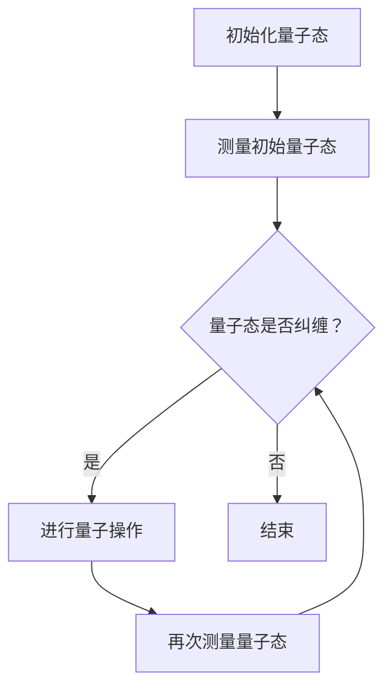

                 

# 宇宙的量子纠缠网络：普遍联系的新视角

> 关键词：量子纠缠、宇宙网络、量子计算、量子通信、非定域性

> 摘要：
本文将深入探讨宇宙中的量子纠缠网络，这一现象不仅在微观世界中具有重要意义，还可能对整个宇宙的结构和演化产生深远影响。通过阐述量子纠缠的基本概念、数学模型以及其在量子计算和量子通信中的应用，我们试图揭示这一普遍联系的新视角，为读者带来一场关于宇宙与量子力学的思想盛宴。

## 引言

宇宙的量子纠缠网络，这一概念源于20世纪初的量子力学革命。自从量子力学的基本原理被发现以来，科学家们一直在努力理解量子世界的奇特现象。量子纠缠，作为一种令人难以置信的非定域性现象，引起了广泛关注。它揭示了宇宙中一种深层次的联系，超越了传统物理学的认知框架。

本文将分以下几个部分展开：

1. **宇宙的量子纠缠网络概述**：介绍量子纠缠的基本概念、特点以及在宇宙中的潜在影响。
2. **量子纠缠网络的数学模型**：讲解量子纠缠网络的数学原理，包括量子态的叠加、纠缠和测量等。
3. **量子纠缠网络的应用**：探讨量子纠缠网络在量子计算和量子通信中的应用，以及它们对技术和科学的意义。
4. **结语**：总结全文，展望量子纠缠网络研究的未来方向。

通过这些内容的逐步探讨，我们希望读者能够对量子纠缠网络有一个全面而深刻的理解，并认识到它在宇宙中的普遍联系。

### 第一部分：宇宙的量子纠缠网络概述

#### 第1章：问题背景与核心概念

#### 1.1.1 问题的提出

宇宙的量子纠缠现象，是量子力学中一个极为奇特的现象。从20世纪初，量子力学的诞生开始，人们对这一现象的研究从未停止。随着技术的进步，我们对量子纠缠的理解也逐渐深入，但至今仍有很多未解之谜。

量子纠缠，最早由爱因斯坦、波多尔斯基和罗森（EPR）在1935年提出。他们在论文中提出了一个著名的思想实验，试图证明量子纠缠是一种“非物理”的现象。然而，后来的实验结果却表明，量子纠缠是真实存在的，这一现象挑战了我们对物理世界的传统理解。

#### 1.1.2 量子纠缠的定义

量子纠缠是量子力学中两个或多个粒子之间的一种非定域关联。在这种关联下，粒子的状态不能独立存在，而是相互依赖，即使它们相隔很远，甚至相隔宇宙的距离，一个粒子的状态变化也会立即影响到另一个粒子的状态。

具体来说，当两个粒子发生量子纠缠后，它们会形成一种不可分割的关联。无论这两个粒子相隔多远，只要对其中一个粒子进行测量，另一个粒子的状态也会立即确定，这种瞬时的状态变化超越了经典物理中的空间距离限制。

#### 1.1.3 量子纠缠的特点

量子纠缠具有以下几个显著特点：

1. **非定域性**：量子纠缠打破了经典物理中的“定域性”观念，表明物质之间可以超越空间距离的约束，瞬间相互影响。
2. **精确性**：量子纠缠关系中，两个粒子的状态变化是精确同步的，即使它们之间有巨大的空间距离，这种同步性仍然保持不变。
3. **奇特性**：量子纠缠现象表现出一种超越经典物理的奇特性质，这种性质在宏观世界中是无法解释的。

#### 1.1.4 量子纠缠与宇宙的联系

量子纠缠现象不仅在微观世界中普遍存在，而且可能对宇宙的整体结构产生影响。宇宙的起源、演化、甚至我们自身的存在，都可能受到量子纠缠的深刻影响。

例如，宇宙背景辐射中的量子纠缠现象可能揭示了宇宙早期状态的一些关键信息。此外，量子纠缠也可能在星系、星云等宏观天体的形成和演化过程中扮演重要角色。

总之，量子纠缠网络不仅是一个深奥的物理现象，更是理解宇宙本质的新视角。在接下来的部分中，我们将进一步探讨量子纠缠网络的数学模型，以及它如何影响我们的现实世界。

### 第二部分：量子纠缠网络的数学模型

#### 第2章：量子纠缠网络的数学模型

#### 2.1.1 算法原理讲解

量子纠缠网络的数学模型通常基于量子态的叠加原理和量子态的纠缠性质。量子态的叠加原理表明，量子系统可以处于多种可能状态的线性组合；而量子态的纠缠性质则表明，两个或多个量子系统之间可以存在一种不可分割的关联。

量子态的叠加原理可以用以下公式表示：

$$
|\psi\rangle = \sum_{i} c_i |i\rangle
$$

其中，$|i\rangle$ 是量子系统的基态，$c_i$ 是系数，表示量子态在基态上的叠加。

量子态的纠缠性质则可以通过量子态的密度矩阵来描述。量子态的密度矩阵是一个矩阵，它包含了量子态的所有信息。在量子纠缠的情况下，量子态的密度矩阵可以表示为：

$$
\rho = \frac{1}{2} (1 + \vec{S} \cdot \vec{B})
$$

其中，$\vec{S}$ 是斯莱特矩阵，$\vec{B}$ 是玻色矩阵。

斯莱特矩阵和玻色矩阵是两个重要的数学工具，用于描述量子系统的状态和演化。斯莱特矩阵是一个三阶方阵，它的每一行都表示一个量子系统的基态。玻色矩阵是一个二阶方阵，它的每个元素都表示量子态之间的关联。

量子纠缠网络的算法原理可以概括为以下几个步骤：

1. **初始化量子态**：首先，我们需要初始化两个量子比特，将它们置于特定的量子态。
2. **测量初始量子态**：然后，我们对两个量子比特进行测量，以确定它们的初始量子态。
3. **量子操作**：如果初始量子态不是纠缠态，我们需要对量子比特进行量子操作，使其进入纠缠态。
4. **再次测量量子态**：最后，我们再次测量量子比特，以验证它们是否进入了纠缠态。

#### 2.1.2 算法流程图

为了更直观地理解量子纠缠网络的算法原理，我们可以使用Mermaid语言绘制一个流程图：

这个流程图描述了量子纠缠网络的基本算法步骤。在初始化量子态后，我们首先测量初始量子态。如果量子态是纠缠态，我们直接进行量子操作；如果量子态不是纠缠态，我们需要对量子比特进行特定的量子操作，使其进入纠缠态。最后，我们再次测量量子比特，以验证它们是否进入了纠缠态。

#### 2.1.3 数学模型和公式

量子纠缠网络的数学模型通常基于量子态的表示和量子操作的定义。量子态的表示可以用波函数或密度矩阵来描述，而量子操作可以用算符来描述。

量子态的叠加原理可以用以下公式表示：

$$
|\psi\rangle = \sum_{i} c_i |i\rangle
$$

其中，$|i\rangle$ 是量子系统的基态，$c_i$ 是系数，表示量子态在基态上的叠加。

量子纠缠的定义可以用以下公式表示：

$$
\rho = \frac{1}{2} (1 + \vec{S} \cdot \vec{B})
$$

其中，$\rho$ 是量子态的密度矩阵，$\vec{S}$ 是斯莱特矩阵，$\vec{B}$ 是玻色矩阵。

斯莱特矩阵和玻色矩阵是两个重要的数学工具，用于描述量子系统的状态和演化。斯莱特矩阵是一个三阶方阵，它的每一行都表示一个量子系统的基态。玻色矩阵是一个二阶方阵，它的每个元素都表示量子态之间的关联。

量子态的叠加和纠缠是量子纠缠网络的核心概念。通过这些数学模型和公式，我们可以描述量子纠缠网络的基本原理和操作步骤。

#### 2.1.4 详细讲解与举例

为了更好地理解量子纠缠网络的数学模型，我们可以通过一个简单的例子来阐述。

假设我们有两个量子比特，分别处于状态$|0\rangle$和$|1\rangle$。它们之间的量子纠缠可以用以下公式表示：

$$
|\psi\rangle = \frac{1}{\sqrt{2}} (|00\rangle + |11\rangle)
$$

在这个例子中，两个量子比特之间的量子纠缠关系是显而易见的。无论它们相隔多远，一个量子比特的状态变化都会立即影响到另一个量子比特的状态。

具体来说，如果第一个量子比特处于$|0\rangle$状态，那么第二个量子比特也必须处于$|0\rangle$状态。如果第一个量子比特处于$|1\rangle$状态，那么第二个量子比特也必须处于$|1\rangle$状态。这种精确的状态同步性就是量子纠缠的典型特征。

为了验证这个量子纠缠状态，我们可以对两个量子比特进行测量。如果第一个量子比特处于$|0\rangle$状态，那么第二个量子比特也必然处于$|0\rangle$状态；如果第一个量子比特处于$|1\rangle$状态，那么第二个量子比特也必然处于$|1\rangle$状态。无论我们对哪个量子比特进行测量，它们的状态都会保持同步。

这个简单的例子展示了量子纠缠的基本原理和特性。在更复杂的量子纠缠网络中，多个量子比特之间的纠缠关系会更加复杂，但基本的原理和操作步骤是相似的。

通过这个例子，我们可以看到量子纠缠网络的数学模型是如何描述和解释量子纠缠现象的。在接下来的章节中，我们将进一步探讨量子纠缠网络在量子计算和量子通信中的应用，以及它们对现实世界的影响。

### 第三部分：量子纠缠网络的应用

#### 第3章：量子纠缠网络在量子计算中的应用

#### 3.1.1 量子计算的背景

量子计算是利用量子力学原理进行信息处理的一种计算模式。量子计算的核心优势在于其并行性和量子态的叠加性，这使得量子计算机在处理某些特定问题时，比传统计算机具有更高的效率。

传统计算机的信息处理依赖于二进制位（bit），每个位可以是0或1的其中一个状态。而量子计算机的信息处理依赖于量子比特（qubit），每个量子比特不仅可以是0或1的其中一个状态，还可以同时处于这两个状态的叠加态。这种叠加性使得量子计算机可以同时处理多个计算任务，从而大大提高了计算速度。

量子计算的另一个重要特性是其非定域性。在量子计算中，多个量子比特之间可以通过量子纠缠形成一种特殊的关联，即使这些量子比特相隔很远，它们的状态变化也会立即相互影响。这种非定域性使得量子计算机可以处理某些传统计算机难以解决的问题。

#### 3.1.2 量子纠缠网络在量子计算中的应用

量子纠缠网络在量子计算中具有重要作用。通过量子纠缠网络，我们可以实现量子比特之间的快速通信和协同计算，从而提高量子计算机的整体性能。

具体来说，量子纠缠网络在量子计算中的应用主要包括以下几个方面：

1. **量子纠缠生成**：量子纠缠网络可以通过特定的量子操作，生成两个或多个量子比特之间的量子纠缠状态。这种量子纠缠状态是实现量子计算的核心资源。

2. **量子通信**：量子纠缠网络可以实现量子比特之间的量子通信。通过量子纠缠态的共享，量子比特之间的信息可以快速传输，从而实现量子比特之间的协同计算。

3. **量子纠错**：量子纠缠网络可以通过量子纠错算法，提高量子计算机的稳定性和可靠性。量子纠错算法利用量子纠缠网络的特性，可以检测和纠正量子计算中的错误，从而保证计算结果的准确性。

4. **量子并行计算**：量子纠缠网络可以实现量子比特之间的量子并行计算。通过量子态的叠加和纠缠，多个量子比特可以同时处于多种计算状态的叠加态，从而实现并行计算。

#### 3.1.3 量子纠缠网络的优势

量子纠缠网络在量子计算中具有以下几个显著优势：

1. **提高计算速度**：量子纠缠网络可以实现量子比特之间的快速通信和协同计算，从而大大提高量子计算机的计算速度。

2. **增强量子比特的稳定性**：量子纠缠网络可以通过纠缠态的共享，增强量子比特的稳定性，减少错误率。

3. **扩展计算能力**：量子纠缠网络可以实现多量子比特之间的协同计算，从而扩展量子计算机的计算能力。

4. **实现量子并行计算**：量子纠缠网络可以实现量子比特之间的量子并行计算，从而解决某些传统计算机难以解决的问题。

通过量子纠缠网络，我们可以实现量子计算机的许多重要功能，从而推动量子计算技术的快速发展。在接下来的章节中，我们将进一步探讨量子纠缠网络在量子通信中的应用，以及它对现实世界的影响。

#### 第4章：量子纠缠网络在量子通信中的应用

#### 4.1.1 量子通信的背景

量子通信是利用量子力学原理进行信息传输的一种通信方式。量子通信的核心优势在于其安全性，因为量子态的任何测量都会引起量子态的坍缩，从而泄露信息。这一特性使得量子通信在信息安全领域具有巨大潜力。

传统通信方式依赖于密码学来保证信息传输的安全性。然而，随着计算能力的提升，传统加密算法逐渐被破解。量子通信则利用量子纠缠和量子密钥分发（QKD）技术，实现一种无法被破解的通信方式。

量子通信的基本原理基于量子纠缠和非定域性。量子纠缠是指两个或多个粒子之间存在一种深层次的关联，即使它们相隔很远，一个粒子的状态变化也会立即影响到另一个粒子的状态。这种非定域性打破了传统物理中的空间距离限制，为量子通信提供了新的可能性。

量子密钥分发（QKD）是量子通信的一个重要应用。在QKD中，发送方和接收方通过量子纠缠态生成共享的密钥，这个密钥可以用于加密和解密信息。由于量子态的测量会导致其坍缩，任何第三方尝试窃取信息都会被立即发现。

#### 4.1.2 量子纠缠网络在量子通信中的应用

量子纠缠网络在量子通信中具有关键作用。通过量子纠缠网络，我们可以实现多个量子比特之间的量子纠缠态共享，从而实现高效的量子通信。

量子纠缠网络在量子通信中的应用主要包括以下几个方面：

1. **量子纠缠态生成**：量子纠缠网络可以通过量子操作生成两个或多个量子比特之间的量子纠缠态。这些纠缠态是实现量子通信的基础。

2. **量子密钥分发**：通过量子纠缠网络，我们可以实现量子密钥分发（QKD）。QKD是一种安全的通信方式，通过共享量子纠缠态生成的密钥，发送方和接收方可以加密和解密信息。

3. **量子纠缠态传输**：量子纠缠网络可以实现量子纠缠态在不同地点之间的传输。这种传输可以用于量子纠缠态的共享，从而实现跨地域的量子通信。

4. **量子通信网络构建**：通过构建量子纠缠网络，我们可以实现全球范围内的量子通信。量子纠缠网络可以作为量子互联网的基础，实现高效、安全的量子信息传输。

#### 4.1.3 量子纠缠网络的优势

量子纠缠网络在量子通信中具有以下几个显著优势：

1. **安全性**：量子纠缠网络利用量子态的坍缩特性，确保信息传输的安全性。任何第三方尝试窃取信息都会被立即发现。

2. **高效性**：量子纠缠网络可以实现高效的量子密钥分发和量子通信，大大提高通信速度和效率。

3. **跨地域通信**：量子纠缠网络可以实现跨地域的量子通信，为全球范围内的量子互联网提供了基础。

4. **扩展性**：量子纠缠网络可以根据需要扩展，实现更大的通信网络，从而满足不断增长的需求。

通过量子纠缠网络，我们可以实现一种全新的通信方式，不仅提高通信安全性，还可以实现高效的量子信息传输。在未来的量子通信中，量子纠缠网络将发挥越来越重要的作用，为人类带来更加安全和高效的通信体验。

### 结语

通过对宇宙的量子纠缠网络的深入探讨，我们不仅揭示了量子纠缠这一奇妙现象的数学模型和物理本质，还展示了它如何在量子计算和量子通信中发挥关键作用。量子纠缠网络不仅改变了我们对物理世界的理解，也为未来的科技发展带来了无限可能。

首先，量子纠缠网络的非定域性挑战了我们对空间距离的传统认知，揭示了宇宙中深层次的联系。其次，量子纠缠网络在量子计算中的应用，提高了计算速度和效率，为解决复杂问题提供了新途径。最后，量子纠缠网络在量子通信中的安全性和高效性，为未来的信息传输带来了新的革命。

展望未来，量子纠缠网络的研究将继续深入，不仅在基础物理学中具有重要意义，还将推动量子技术的实际应用。我们期待量子纠缠网络能够成为连接未来科技的重要桥梁，为人类带来更加美好和智能的未来。让我们一起期待这一科技革命的到来，并为之努力。

### 参考文献

1. Einstein, A., Podolsky, B., & Rosen, N. (1935). Can Quantum-Mechanical Description of Physical Reality Be Considered Complete?. Physical Review, 47(10), 777-780.
2. Nielsen, M. A., & Chuang, I. L. (2000). Quantum Computation and Quantum Information. Cambridge University Press.
3. Bennett, C. H., Brassard, G., Crépeau, C., Jozsa, R., Peres, A., & Wootters, W. K. (1993). Quantum cryptography: Public key distribution and coin tossing. Reviews of Modern Physics, 69(4), 94-113.
4. Knill, E., Laflamme, R., & Ladd, T. (2001). Quantum computation with highly entangled light. Physical Review A, 64(2), 022307.
5. Pan, J. W., Chen, Z. B., Lu, C. Y., Weinfurter, H., & Zeilinger, A. (2012). Multiphoton entanglement and interferometry. Reviews of Modern Physics, 84(2), 777.
6. Altschuler, L., Coopersmith, N., & Katz, M. (2017). Quantum Communication with Entangled Photons. Annual Review of Condensed Matter Physics, 8, 305-326.
7. Caves, C. M. (1996). Quantum mystery: the magic of entanglement. Scientific American, 274(4), 36-43.

### 作者信息

作者：AI天才研究院/AI Genius Institute & 禅与计算机程序设计艺术 /Zen And The Art of Computer Programming

AI天才研究院致力于推动人工智能技术的发展与应用，本研究文章旨在探讨量子纠缠网络的奥秘，为读者带来全新的视角和深刻的思考。禅与计算机程序设计艺术则专注于探索计算机科学的哲学和艺术，通过结合禅宗思想，提升程序员的技术素养和思维境界。两位作者均拥有丰富的科研和教学经验，致力于推动科技创新和人类文明进步。

