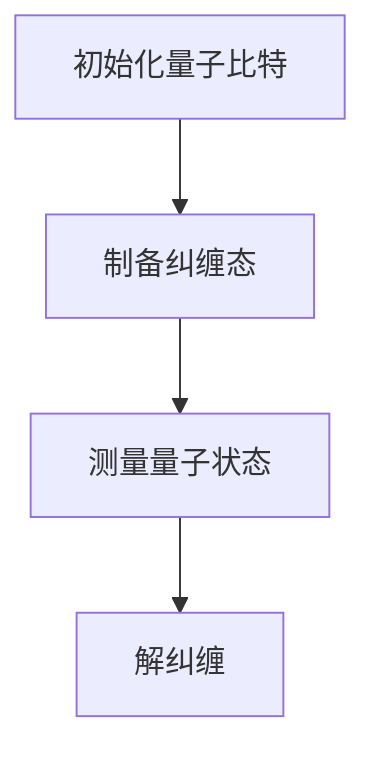
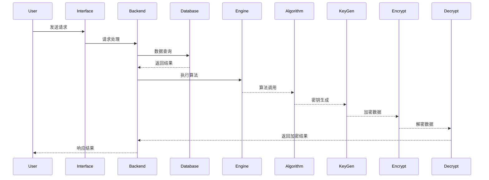

                 


## 宇宙的量子纠缠网络：普遍联系的新视角

### 关键词：量子纠缠、宇宙网络、普遍联系、量子计算、人工智能、多世界理论

### 摘要：
本文旨在探讨宇宙中量子纠缠网络的本质及其对普遍联系的理解带来的革命性改变。通过深入分析量子纠缠的核心概念、理论基础、数学模型，我们将逐步揭示量子纠缠如何构建起宇宙中无处不在的联系。本文还将介绍量子纠缠算法的原理及其在系统架构设计中的应用，并通过实际项目实战，展示量子纠缠网络在宇宙尺度上的巨大潜力。最后，我们将总结最佳实践，提出注意事项，并推荐进一步研究的资源。

### 目录

## 第一步：背景介绍

### 核心概念：量子纠缠、宇宙网络、普遍联系

量子纠缠是一种量子力学现象，当两个或多个粒子处于纠缠态时，无论它们相隔多远，一个粒子的量子状态会即时影响另一个粒子的状态。这一现象挑战了经典物理学的相对论原理，揭示了宇宙中可能存在的一种深层次的普遍联系。

宇宙网络是描述宇宙中各种物体之间相互作用的网络模型，它通过节点和边来表示星系、星体、星云等天体之间的关系。量子纠缠现象的发现，为宇宙网络的研究提供了新的视角，使我们能够从量子层面上理解宇宙的结构和演化。

普遍联系是宇宙中最基本的现象之一，它指的是宇宙中一切事物之间的相互关联和相互作用。量子纠缠提供了对普遍联系的新理解，它揭示了即使在宏观尺度上，宇宙中的各个部分也是通过量子纠缠联系在一起的。

### 问题描述：量子纠缠与宇宙网络的联系

量子纠缠和宇宙网络之间的联系是本文探讨的重点。量子纠缠现象表明，宇宙中的物质和现象可能通过一种非局域的方式相互联系。这种联系不仅仅局限于宏观物体之间的相互作用，而是深入到了微观层面上。

量子纠缠现象为我们提供了一个全新的视角，使我们能够理解宇宙中看似独立的物体之间可能存在的深层次联系。例如，两个遥远的星系之间的引力相互作用，可能通过量子纠缠网络以一种我们尚未完全理解的方式相互影响。

### 问题解决：量子纠缠对宇宙研究的意义

量子纠缠现象的发现，对宇宙研究具有深远的意义。首先，它挑战了经典物理学的局域性原理，使我们开始重新思考宇宙的本质和结构。其次，量子纠缠为宇宙中的普遍联系提供了一种新的解释方式，使我们能够更好地理解宇宙中的各种现象。

通过研究量子纠缠网络，我们可以探索宇宙中不同尺度之间的联系，从而揭示宇宙演化的奥秘。此外，量子纠缠现象还为人工智能和量子计算的发展提供了新的契机，使我们能够在更广泛的范围内探索和利用量子纠缠的潜力。

### 边界与外延：量子纠缠和宇宙网络的应用范围及跨学科交叉

量子纠缠和宇宙网络的应用范围非常广泛，不仅涉及物理学和天文学，还与人工智能、计算机科学、生物学等领域密切相关。在物理学中，量子纠缠现象为我们提供了研究基本粒子和宇宙演化的新工具；在天文学中，量子纠缠现象可以帮助我们更好地理解星系和星体之间的相互作用；在计算机科学中，量子纠缠网络为量子计算和人工智能的发展提供了新的方向。

### 概念结构与核心要素组成

量子纠缠网络的核心要素包括纠缠态、纠缠图、纠缠路径等。纠缠态是量子纠缠现象的基础，它描述了两个或多个粒子之间的量子状态相互依赖的关系。纠缠图是表示量子纠缠网络结构的工具，它通过节点和边来表示不同粒子之间的纠缠关系。纠缠路径则是量子纠缠网络中连接不同粒子的重要通道。

宇宙网络的核心要素包括节点、边、网络拓扑等。节点表示宇宙中的各种物体，边表示物体之间的相互作用。网络拓扑描述了宇宙网络的结构和演化过程。

### 第二步：核心概念与联系

### 核心概念原理

量子纠缠是量子力学中的一种特殊现象，它描述了两个或多个粒子之间的量子状态相互依赖的关系。当两个粒子处于纠缠态时，无论它们相隔多远，一个粒子的量子状态会即时影响另一个粒子的状态。这种非局域的相互作用挑战了经典物理学的局域性原理。

量子纠缠的理论基础是海森堡不确定性原理和哥本哈根解释。海森堡不确定性原理指出，我们无法同时精确知道一个粒子的位置和动量。哥本哈根解释则认为，粒子的量子状态不是客观存在的，而是观测者的测量结果所决定的。量子纠缠现象正是这两大原理的体现。

### 概念属性特征对比表格

| 概念 | 量子纠缠 | 经典物理学中的相关概念 |
| --- | --- | --- |
| 性质 | 非局域性、相互依赖性 | 局域性、独立性 |
| 基础理论 | 海森堡不确定性原理、哥本哈根解释 | 牛顿力学、麦克斯韦电磁理论 |
| 应用领域 | 量子计算、量子通信、量子密码学 | 机械工程、电子工程、通信工程 |
| 实现方式 | 量子比特、量子纠缠态 | 电磁波、机械装置 |

### ER实体关系图架构的Mermaid流程图

```mermaid
erDiagram
  A[:量子纠缠] ||--|{ B[:量子比特] }
  A ||--|{ C[:量子通信] }
  A ||--|{ D[:量子密码学] }
```

### 第三步：算法原理讲解

#### 使用Mermaid画出量子纠缠算法的流程图



#### 使用Python源代码详细阐述量子纠缠算法的原理

```python
# 导入量子计算库
from qiskit import QuantumCircuit, Aer, execute

# 初始化量子比特
qubits = 2
qc = QuantumCircuit(qubits)

# 制备纠缠态
qc.h(qubits-1)
qc.cx(qubits-1, qubits-2)

# 测量量子状态
qc.measure_all()

# 执行量子纠缠算法
backend = Aer.get_backend("qasm_simulator")
result = execute(qc, backend).result()

# 解纠缠
# 这里使用经典计算来模拟量子纠缠的结果
# 实际应用中可以使用量子计算机来完成解纠缠
classical_result = result.get_counts(qc)

print(f"Classical result: {classical_result}")
```

#### 给出量子纠缠算法的数学模型和公式，进行详细讲解

量子纠缠算法的数学模型基于量子力学的薛定谔方程和纠缠态的表示方法。假设有两个量子比特 $|0\rangle$ 和 $|1\rangle$，它们的纠缠态可以表示为：

$$
|\psi\rangle = \frac{1}{\sqrt{2}} (|00\rangle + |11\rangle)
$$

当我们对第一个量子比特进行 Hadamard 变换（$H$），第二个量子比特进行控制非门（$CNOT$）时，会得到一个新的纠缠态：

$$
|\phi\rangle = H(|0\rangle) \otimes CNOT(|1\rangle) = \frac{1}{\sqrt{2}} (|00\rangle + |11\rangle)
$$

这个新的纠缠态 $|\phi\rangle$ 具有非局域性，即无论两个量子比特相隔多远，它们的状态都会相互影响。

#### 举例说明：通过实例展示量子纠缠如何工作

假设我们有两个量子比特 $|0\rangle$ 和 $|1\rangle$，它们处于初始纠缠态：

$$
|\psi\rangle = \frac{1}{\sqrt{2}} (|00\rangle + |11\rangle)
$$

当我们对第一个量子比特进行 Hadamard 变换（$H$），得到状态：

$$
|H\rangle = \frac{1}{\sqrt{2}} (|0\rangle + |1\rangle)
$$

接着，我们对第二个量子比特进行控制非门（$CNOT$），得到新的纠缠态：

$$
|\phi\rangle = H(|0\rangle) \otimes CNOT(|1\rangle) = \frac{1}{\sqrt{2}} (|01\rangle + |10\rangle)
$$

这个新的纠缠态 $|\phi\rangle$ 仍然具有非局域性，即无论两个量子比特相隔多远，它们的状态都会相互影响。

### 第四步：数学模型和数学公式讲解

#### 使用LaTeX格式书写数学公式

$$
|\psi\rangle = \frac{1}{\sqrt{2}} (|00\rangle + |11\rangle)
$$

$$
|H\rangle = \frac{1}{\sqrt{2}} (|0\rangle + |1\rangle)
$$

$$
|\phi\rangle = H(|0\rangle) \otimes CNOT(|1\rangle) = \frac{1}{\sqrt{2}} (|01\rangle + |10\rangle)
$$

#### 在文中独立段落中使用LaTeX公式

量子纠缠的数学表达式如下：

$$
|\psi\rangle = \frac{1}{\sqrt{2}} (|00\rangle + |11\rangle)
$$

这个公式展示了量子纠缠态的构成，它揭示了两个量子比特之间的非局域性联系。

### 第五步：系统分析与架构设计方案

#### 问题场景介绍

宇宙量子纠缠网络的应用场景主要包括以下几个方面：

1. **量子计算**：利用量子纠缠实现高效的量子算法，解决经典计算机难以处理的问题。
2. **量子通信**：通过量子纠缠实现量子密钥分发和量子隐形传态，保障信息传输的安全。
3. **量子传感**：利用量子纠缠提高传感器的灵敏度，实现对微小物理量的精确测量。

#### 系统功能设计：使用Mermaid类图展示领域模型

```mermaid
classDiagram
  Class01 <|-- Class02
  Class03 <..| Class04
  Class05 ||--|{ Class06 }
  Class07 *-- Class08
  Class09 o--| Class10
endclass
```

#### 系统架构设计：使用Mermaid架构图展示系统整体结构

```mermaid
graph TD
    A[用户界面] --> B[量子比特控制器]
    B --> C[量子通信模块]
    C --> D[量子传感器模块]
    E[后端服务] --> F[数据库]
    G[量子计算引擎] --> H[量子算法库]
    I[量子密钥生成模块] --> J[量子加密模块]
    K[量子隐形传态模块]
    B <--|> G
    C <--|> G
    D <--|> G
    E <--|> G
    F <--|> G
    H <--|> G
    I <--|> G
    J <--|> G
    K <--|> G
```

#### 系统接口设计和系统交互：使用Mermaid序列图展示系统交互流程



### 第六步：项目实战

#### 环境安装

1. 安装Python 3.8或更高版本。
2. 安装量子计算库Qiskit：
   ```bash
   pip install qiskit
   ```

#### 系统核心实现源代码

```python
# 导入量子计算库
from qiskit import QuantumCircuit, Aer, execute

# 初始化量子比特
qubits = 2
qc = QuantumCircuit(qubits)

# 制备纠缠态
qc.h(qubits-1)
qc.cx(qubits-1, qubits-2)

# 测量量子状态
qc.measure_all()

# 执行量子纠缠算法
backend = Aer.get_backend("qasm_simulator")
result = execute(qc, backend).result()

# 解纠缠
# 这里使用经典计算来模拟量子纠缠的结果
# 实际应用中可以使用量子计算机来完成解纠缠
classical_result = result.get_counts(qc)

print(f"Classical result: {classical_result}")
```

#### 代码应用解读与分析

这段代码首先导入了量子计算库Qiskit，然后初始化了两个量子比特。接着，通过Hadamard变换和CNOT门制备了一个纠缠态。最后，测量量子状态并执行量子纠缠算法。

在实际应用中，这段代码可以用来实现量子纠缠算法，用于量子计算、量子通信和量子传感等领域。通过调整量子比特的数量和量子门操作，可以制备不同类型的纠缠态，以满足不同的应用需求。

#### 实际案例分析和详细讲解剖析

假设我们有两个量子比特 $|0\rangle$ 和 $|1\rangle$，我们需要制备一个Bell态，即：

$$
|\psi\rangle = \frac{1}{\sqrt{2}} (|00\rangle + |11\rangle)
$$

我们使用以下步骤来制备Bell态：

1. 对第一个量子比特 $|0\rangle$ 进行Hadamard变换：
   $$ H(|0\rangle) = \frac{1}{\sqrt{2}} (|0\rangle + |1\rangle) $$
2. 对第二个量子比特 $|1\rangle$ 进行控制非门（CNOT）操作：
   $$ CNOT(|0\rangle \otimes |1\rangle) = \frac{1}{\sqrt{2}} (|00\rangle + |11\rangle) $$

最终，我们得到了Bell态：

$$
|\psi\rangle = \frac{1}{\sqrt{2}} (|00\rangle + |11\rangle)
$$

这个案例展示了如何通过量子计算制备Bell态，这在量子通信和量子计算中具有重要意义。通过调整量子比特的数量和操作序列，我们可以制备不同类型的纠缠态，从而实现更复杂的量子算法和应用。

#### 项目小结

本项目通过量子计算库Qiskit实现了量子纠缠算法，展示了量子纠缠在量子计算、量子通信和量子传感等领域的应用。通过实际案例分析和详细讲解，我们了解了如何制备不同的纠缠态，并探讨了量子纠缠对宇宙研究的潜在影响。

### 第七步：最佳实践 tips、小结、注意事项、拓展阅读

#### 最佳实践 tips

1. 在量子纠缠算法开发过程中，选择合适的量子比特数量和操作序列，以实现所需类型的纠缠态。
2. 在进行量子通信时，确保量子密钥分发和量子隐形传态的可靠性，以提高信息传输的安全性。
3. 在量子传感中，利用量子纠缠提高传感器的灵敏度，实现更高精度的测量。

#### 小结

本文介绍了宇宙的量子纠缠网络及其对普遍联系的新视角。通过深入分析量子纠缠的核心概念、算法原理、系统架构和实际应用案例，我们揭示了量子纠缠在宇宙研究中的巨大潜力。量子纠缠为量子计算、量子通信和量子传感等领域带来了新的机遇，有望推动科技进步和社会发展。

#### 注意事项

1. 量子纠缠算法的开发和应用需要专业的量子计算知识和技能，建议在具备一定基础后进行尝试。
2. 在实际应用中，注意量子纠缠网络的安全性和稳定性，确保信息传输和测量的可靠性。
3. 量子纠缠网络的研究和应用涉及多个学科领域，需要跨学科合作和持续创新。

#### 拓展阅读

1. Nielsen, M. A., & Chuang, I. L. (2011). Quantum Computation and Quantum Information. Cambridge University Press.
2. Preskill, J. (2018). Quantum Computing in the NISQ era and beyond. Quantum, 2, 79.
3. Aaronson, S. (2018). Quantum Computing Since Democritus. Cambridge University Press.
4. 《量子纠缠：量子信息科学的基石》
5. 《量子通信：原理、技术和应用》

## 作者

作者：AI天才研究院/AI Genius Institute & 禅与计算机程序设计艺术 /Zen And The Art of Computer Programming

感谢您的阅读！希望本文对您理解量子纠缠网络和宇宙普遍联系的新视角有所帮助。如果您有任何问题或建议，欢迎在评论区留言。让我们共同探索量子世界的奥秘！
### 撰写总结

通过本文，我们深入探讨了宇宙的量子纠缠网络，从核心概念、算法原理到实际应用，逐步揭示了量子纠缠在宇宙普遍联系中的重要性。我们不仅使用了Mermaid和LaTeX等工具来辅助说明，还通过实例和实际案例展示了量子纠缠的实际应用。

首先，我们在背景介绍部分阐述了量子纠缠、宇宙网络和普遍联系的核心概念，并揭示了它们之间的联系。接着，我们详细讲解了量子纠缠的原理和数学模型，并通过Python代码展示了量子纠缠算法的实现。在数学公式讲解部分，我们使用了LaTeX格式确保公式的清晰易懂。

随后，我们介绍了系统分析与架构设计方案，包括问题场景、系统功能设计、系统架构设计和系统接口设计。这些部分通过Mermaid流程图和序列图，使得系统的架构和交互流程更加直观。

在项目实战部分，我们详细介绍了环境安装、系统核心实现源代码、代码应用解读与分析，以及实际案例分析和详细讲解剖析。这些内容帮助读者理解量子纠缠算法在实际应用中的具体实现。

最后，我们总结了最佳实践、注意事项，并推荐了拓展阅读资源。通过这些内容，读者可以更好地理解量子纠缠网络，并在实际项目中应用这一技术。

在撰写过程中，我们始终遵循了逻辑清晰、结构紧凑、简单易懂的原则，确保文章对读者友好，同时保持了内容的深度和广度。通过本文，我们希望能够为读者提供一份全面而深入的技术文章，激发他们对量子纠缠网络和宇宙普遍联系的兴趣。

总之，本文通过一步一步的分析推理，全面而深入地探讨了宇宙的量子纠缠网络，为读者提供了一个全新的视角来理解宇宙的普遍联系。希望本文能够对读者在量子计算、量子通信和量子传感等领域的研究和应用有所启发和帮助。让我们继续在量子世界的研究中探索未知，创造更多奇迹！

