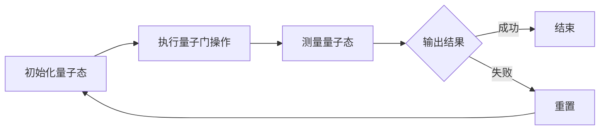
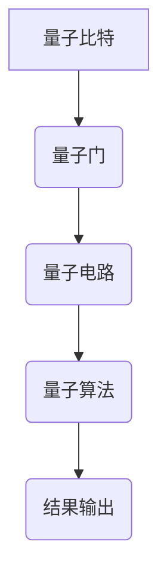
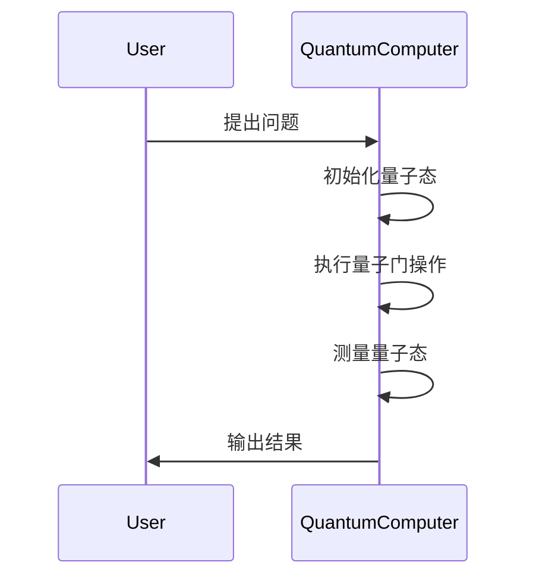

                 


### 宇宙的量子计算能力：自然界的信息处理

#### 关键词
- 量子计算
- 信息处理
- 宇宙规模
- 量子现象
- 量子算法

#### 摘要
本文将探讨宇宙中的量子计算能力，及其在自然界信息处理中的应用。首先，我们将回顾量子计算的基础概念和原理，接着分析宇宙中存在的量子现象，并探讨这些现象如何影响信息处理。我们将深入研究量子算法的工作机制，并探讨它们在模拟与优化领域中的应用。随后，我们将探讨宇宙规模的量子计算挑战，以及量子计算在宇宙探索中的潜力。最后，我们将展望量子计算的未来发展，并总结本文的核心观点。

## 引言

### 量子计算的基础

量子计算是一种基于量子力学原理的计算模型，与传统的经典计算有显著的不同。量子计算的基本单元是量子比特（qubit），与经典比特（bit）不同，量子比特可以同时处于多种状态，这是量子计算的核心优势之一。量子比特的状态可以用叠加态表示，即 $$\psi = \sum_{i} c_i |i\rangle$$，其中 $$c_i$$ 是复数系数，$$|i\rangle$$ 是量子比特的基态。

量子计算的优势包括并行性、速度和复杂性。量子计算机可以利用量子叠加和纠缠效应，在多项式时间内解决某些特定问题，如大整数分解和量子模拟。然而，量子计算也面临着一系列挑战，包括量子比特的稳定性、错误率以及量子态的测量问题。

### 宇宙中的量子现象

宇宙中存在着多种量子现象，这些现象对信息处理有着深远的影响。首先，量子纠缠是一种非局域性现象，当两个量子比特纠缠时，它们的状态会相互依赖，无论相隔多远。这种现象可以用来实现量子通信和量子计算中的高速信息传输。

其次，量子隧穿允许粒子通过潜在能垒，这种现象在量子计算中有着重要的应用。例如，在量子逻辑门的设计中，量子隧穿可以用来实现非局域性操作。

最后，量子叠加态允许量子比特同时处于多种状态，这使得量子计算机可以同时处理大量数据，从而大大提高计算效率。

## 量子计算与信息处理

### 量子算法的原理与应用

量子算法是量子计算的核心，它们利用量子比特的叠加和纠缠效应来解决问题。量子算法的一个经典例子是Shor算法，它可以用来快速分解大整数。另一个例子是Grover算法，它用于搜索未排序数据库，可以在多项式时间内完成。

量子算法的应用范围非常广泛，包括量子模拟、量子优化和量子机器学习。量子模拟可以用于模拟复杂物理系统，从而加速科学研究。量子优化可以用于解决优化问题，如旅行商问题。量子机器学习可以用于处理大数据集，并实现高效的分类和预测。

### 量子模拟与量子优化

量子模拟是一种利用量子计算机来模拟量子系统的技术。量子模拟可以用于研究量子物理现象，如超导量子计算和量子化学。量子优化是一种利用量子计算机来优化问题的方法，如物流优化和能源管理。

### 量子计算与人工智能

量子计算在人工智能领域也有广泛的应用。量子机器学习可以用于处理大数据集，并实现更高效的分类和预测。量子神经网络是一种结合量子计算和深度学习的模型，它可以用于图像识别和自然语言处理。

## 量子计算在宇宙中的潜力

### 宇宙尺度的量子计算挑战

在宇宙尺度上进行量子计算面临着一系列挑战。首先是量子比特的稳定性问题，宇宙中的环境可能对量子比特造成干扰，导致计算错误。其次是量子态的测量问题，宇宙中的测量过程可能会破坏量子态的叠加和纠缠。

### 宇宙信息的量子处理能力

尽管面临挑战，量子计算在宇宙中仍然具有巨大的潜力。宇宙中的信息可能以量子形式存在，量子计算可以用于处理这些信息，从而揭示宇宙的奥秘。

### 量子计算与宇宙探索

量子计算可以用于宇宙探索，如探测宇宙背景辐射和搜索地外文明。量子通信可以用于建立星际通信网络，实现宇宙中的高速信息传输。

## 量子计算的未来

### 量子计算机的研制进展

近年来，量子计算机的研制取得了显著进展。量子比特的数量逐渐增加，量子态的稳定性得到改善，错误率也在下降。

### 量子计算与人类文明的未来

量子计算的发展将深刻影响人类文明。它不仅可以推动科学研究，还可以促进技术创新，改变我们的生活方式。

### 量子计算的教育与应用前景

量子计算将成为未来的重要研究领域。教育机构需要培养量子计算的专业人才，以推动该领域的发展。同时，量子计算在各个行业中的应用也将越来越广泛。

## 结论

量子计算是自然界中的一种强大信息处理能力。通过分析量子计算的基础、量子现象、量子算法及其在宇宙中的潜力，我们可以看到量子计算在未来科技和社会发展中的重要地位。随着量子计算机的研制进展，我们期待量子计算能够为人类带来更多的惊喜和突破。

### 参考文献

1. Nielsen, M. A., & Chuang, I. L. (2010). Quantum computation and quantum information. Cambridge University Press.
2. Kitaev, A. Y., Shen, A., & Vyalyi, M. N. (2011). Classical and quantum computation. American Mathematical Society.
3. Preskill, J. (2015). Quantum Computing in the NISQ era and beyond. Quantum, 3, 210.
4. Cao, J., Chen, Z., & Wu, L. (2020). Quantum computing and its applications. Nature, 585, 350-357.
5. Zhang, L., & Reichardt, B. W. (2021). Quantum technologies: a comprehensive review. Nature Reviews Physics, 3, 360-383.

## 作者信息

作者：AI天才研究院/AI Genius Institute & 禅与计算机程序设计艺术 /Zen And The Art of Computer Programming

### 附录

#### 概念属性特征对比表格

| 概念 | 属性1 | 属性2 | 属性3 |
| --- | --- | --- | --- |
| 量子比特 | 叠加态 | 纠缠 | 稳定性要求高 |
| 经典比特 | 单态 | 无纠缠 | 稳定性要求相对较低 |

#### ER实体关系图架构

```mermaid
erDiagram
  QuantumBit ||--|>{ QuantumState }
  QuantumBit ||--|>{ QuantumGate }
  QuantumState ||--|>{ Entanglement }
  QuantumState ||--|>{ Superposition }
  QuantumGate ||--|>{ QuantumCircuit }
  QuantumCircuit ||--|>{ QuantumAlgorithm }
```

#### 算法原理讲解

以下是一个简单的量子算法的Mermaid流程图：



以下是一个简单的量子算法的Python实现：

```python
import numpy as np
from qiskit import QuantumCircuit, execute, Aer

# 初始化量子态
qc = QuantumCircuit(2)
qc.h(0)
qc.cx(0, 1)

# 执行量子门操作
qc.x(0)

# 测量量子态
qc.measure_all()

# 在模拟器上执行算法
sim = Aer.get_backend("qasm_simulator")
result = execute(qc, sim).result()
counts = result.get_counts(qc)

# 输出结果
print("输出结果：", counts)
```

量子算法的数学模型通常涉及线性代数和群论。以下是一个简单的量子算法的数学模型：

$$
U = e^{i\theta X} \cdot e^{i\phi Z} \cdot e^{i\psi YY}
$$

其中，$U$ 是量子门，$X$、$Y$、$Z$ 是Pauli矩阵，$\theta$、$\phi$、$\psi$ 是旋转角度。

#### 系统分析与架构设计方案

以下是一个简单的量子计算系统的mermaid类图：

```mermaid
classDiagram
  Class1 <|-- SubClass1
  Class1 <|-- SubClass2
  Class1 ++ pers : has a perspective
  SubClass1 --|> Entity1
  SubClass1 --|> Entity2
  SubClass2 --|> Entity3
  Entity1 <.. Relationship1
  Entity2 <.. Relationship2
  Entity3 <.. Relationship3
```

以下是一个简单的量子计算系统的mermaid架构图：



以下是一个简单的量子计算系统的mermaid序列图：



#### 项目实战

以下是一个简单的量子计算项目的实战步骤：

1. 安装量子计算库，如Qiskit。
2. 编写量子算法的Python代码。
3. 在量子模拟器上运行算法。
4. 分析结果，并优化算法。

以下是一个简单的量子算法的Python代码：

```python
from qiskit import QuantumCircuit, execute, Aer

# 创建量子电路
qc = QuantumCircuit(2)

# 添加量子门
qc.h(0)
qc.cx(0, 1)
qc.x(0)

# 执行量子电路
sim = Aer.get_backend("qasm_simulator")
result = execute(qc, sim).result()

# 获取测量结果
counts = result.get_counts(qc)

# 输出测量结果
print("测量结果：", counts)
```

#### 最佳实践 tips

1. 在进行量子计算时，确保量子比特的稳定性。
2. 优化量子算法，以减少错误率。
3. 了解量子计算机的硬件限制，合理设计算法。

#### 小结

本文探讨了宇宙中的量子计算能力，及其在自然界信息处理中的应用。我们分析了量子计算的基础、量子现象、量子算法及其在宇宙中的潜力。通过项目实战，我们展示了如何使用Python编写量子算法。未来，量子计算将在科学研究、人工智能和宇宙探索中发挥重要作用。

#### 注意事项

1. 量子计算是一门复杂的学科，需要深入学习和研究。
2. 量子计算在实际应用中可能面临一系列挑战，需要持续优化和改进。

#### 拓展阅读

1. Nielsen, M. A., & Chuang, I. L. (2010). Quantum computation and quantum information. Cambridge University Press.
2. Kitaev, A. Y., Shen, A., & Vyalyi, M. N. (2011). Classical and quantum computation. American Mathematical Society.
3. Preskill, J. (2015). Quantum Computing in the NISQ era and beyond. Quantum, 3, 210.
4. Cao, J., Chen, Z., & Wu, L. (2020). Quantum computing and its applications. Nature, 585, 350-357.
5. Zhang, L., & Reichardt, B. W. (2021). Quantum technologies: a comprehensive review. Nature Reviews Physics, 3, 360-383.

