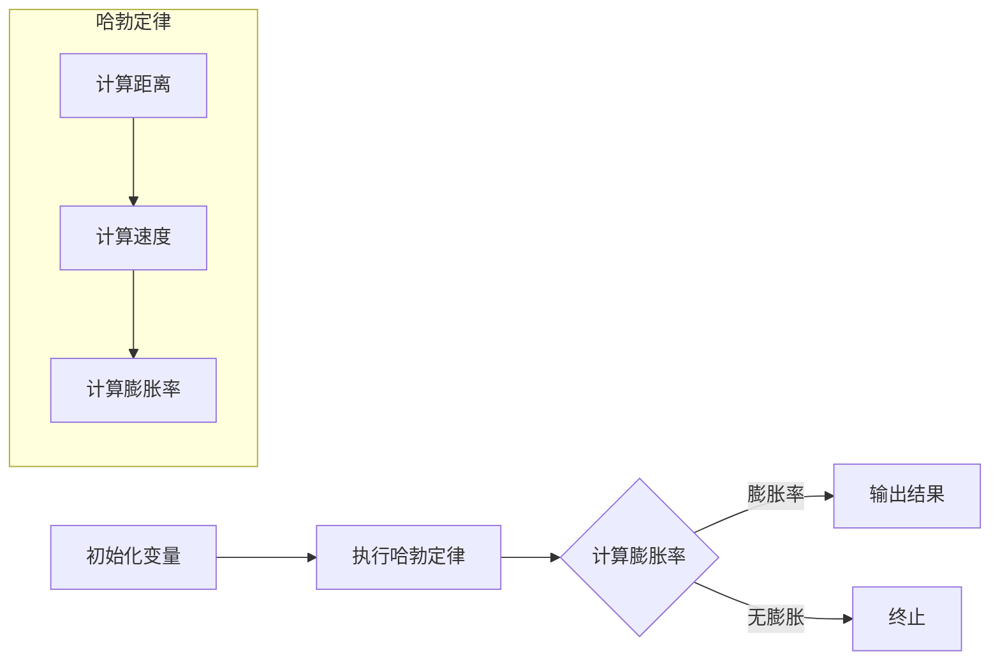
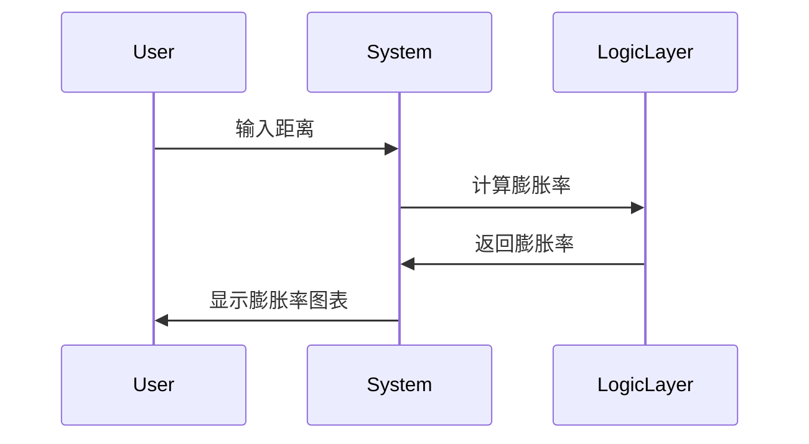
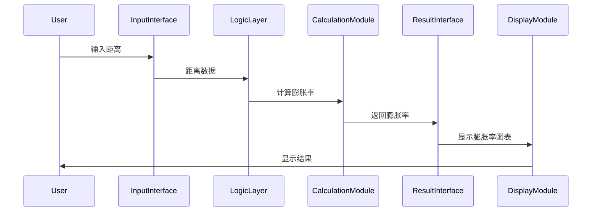

                 

### 《宇宙观念的历史演变》

---

关键词：宇宙观念、历史演变、科学革命、哲学思考

摘要：本文将探讨宇宙观念的历史演变，从古代到现代，通过分析不同历史时期的宇宙观念，揭示其背后的科学和哲学思维，并对未来的宇宙观念进行展望。

---

## 引言

宇宙观念是人类对宇宙的认识和理解，它贯穿了人类文明的发展历程。从古代的神话传说到现代的科学理论，宇宙观念的演变不仅反映了人类认知能力的提升，也体现了人类对世界的探索精神。本文将分以下几个部分进行探讨：

1. **背景介绍**：简要介绍宇宙观念的起源和发展背景。
2. **古代宇宙观念**：包括古代东方和古代西方的宇宙观念。
3. **中世纪宇宙观念**：介绍宗教对宇宙观念的影响。
4. **近代宇宙观念的演变**：重点介绍哥白尼革命、伽利略和牛顿的贡献。
5. **现代宇宙观念的发展**：介绍康德和拉普拉斯的宇宙无限论，以及哈勃发现的宇宙膨胀理论。
6. **当代宇宙观念**：探讨大爆炸理论、黑洞、暗物质和暗能量等概念。
7. **宇宙观念与科学方法**：讨论宇宙观念如何影响科学方法的发展。
8. **宇宙观念与哲学思考**：探讨宇宙观念在哲学领域的意义。
9. **结论**：总结宇宙观念的历史演变，并对未来宇宙观念进行展望。

### 第一部分：古代宇宙观念

在古代，宇宙观念主要是基于神话和宗教信仰，不同的文化有不同的宇宙观念。在这里，我们将分别介绍古代东方和古代西方的宇宙观念。

#### 2.1 古代东方宇宙观念

古代东方的宇宙观念主要源于中国和印度。在中国古代，宇宙观念主要源于《易经》和道家思想。道家认为，宇宙是由阴阳二气相互作用而形成的，宇宙的本源是“道”。印度古代的宇宙观念则源于《吠陀经》，其中描述了宇宙的创造、维持和毁灭过程。

#### 2.2 古代西方宇宙观念

古代西方的宇宙观念主要源于希腊和罗马。希腊的宇宙观念以“地心说”为主，认为地球是宇宙的中心，天体围绕地球运动。罗马的宇宙观念则继承了希腊的传统，并对天文学进行了深入研究。

### 第二部分：中世纪宇宙观念

中世纪宇宙观念的主要特征是宗教的影响。基督教、伊斯兰教和犹太教都提出了自己的宇宙观念，其中基督教的“上帝创世”观念对后世影响深远。

#### 3.1 基督教宇宙观念

基督教认为，宇宙是上帝创造的，上帝是宇宙的创造者和主宰。这个观念对中世纪的科学研究和社会生活产生了深远的影响。

#### 3.2 伊斯兰教宇宙观念

伊斯兰教认为，宇宙是安拉创造的，安拉是宇宙的创造者和主宰。伊斯兰教的宇宙观念强调宇宙的秩序和统一性。

### 第三部分：近代宇宙观念的演变

近代宇宙观念的演变标志着科学革命的到来。哥白尼的“日心说”、伽利略的支持和牛顿的万有引力定律，都对宇宙观念产生了深远的影响。

#### 4.1 哥白尼革命

哥白尼提出了“日心说”，即太阳是宇宙的中心，地球和其他行星围绕太阳运动。这个理论颠覆了长期以来占主导地位的“地心说”，开启了科学革命的新时代。

#### 4.2 伽利略和牛顿

伽利略通过望远镜的观测，提供了支持哥白尼“日心说”的证据。牛顿则通过万有引力定律，解释了天体运动的规律，进一步深化了宇宙观念。

### 第四部分：现代宇宙观念的发展

现代宇宙观念的发展离不开一系列科学发现和理论突破。康德和拉普拉斯的宇宙无限论，以及哈勃发现的宇宙膨胀理论，都是现代宇宙观念发展的重要里程碑。

#### 5.1 康德和拉普拉斯的宇宙无限论

康德认为，宇宙是无限的，因为无限是宇宙的本质。拉普拉斯则通过数学模型，论证了宇宙无限的可能性。

#### 5.2 哈勃定律与宇宙膨胀

哈勃通过观测发现，宇宙正在膨胀，这一发现挑战了宇宙静态的观念，推动了宇宙学的发展。

### 第五部分：当代宇宙观念

当代宇宙观念的发展，不仅基于已有的理论，还不断有新的发现和理论提出。大爆炸理论、黑洞、暗物质和暗能量等概念，都是当代宇宙观念的重要组成部分。

#### 6.1 大爆炸理论与宇宙演化

大爆炸理论认为，宇宙起源于一个极度热密的原始状态，随着时间的推移，宇宙不断膨胀和演化。

#### 6.2 黑洞、暗物质和暗能量

黑洞是宇宙中的一种极端现象，暗物质和暗能量则是宇宙中尚未被完全理解的物质和能量形式。

### 第六部分：宇宙观念与科学方法

宇宙观念的发展离不开科学方法的进步。宇宙观念如何影响科学方法，以及科学方法如何推动宇宙观念的发展，都是值得探讨的问题。

#### 7.1 宇宙观念与科学方法

科学方法的发展受到宇宙观念的制约，同时也推动宇宙观念的进步。

#### 7.2 不同科学方法对宇宙观念的影响

不同的科学方法，如实验方法、观测方法和理论方法，都对宇宙观念产生了深远的影响。

### 第七部分：宇宙观念与哲学思考

宇宙观念不仅涉及科学领域，还与哲学领域密切相关。宇宙观念如何影响哲学思考，以及哲学思考如何影响宇宙观念，都是值得探讨的问题。

#### 8.1 存在论与宇宙观念

宇宙观念的存在论意义，涉及宇宙的本质、起源和演化等问题。

#### 8.2 本体论与宇宙观念

宇宙观念的本体论意义，涉及宇宙的存在形式、结构和组织等问题。

### 结论

宇宙观念的历史演变，不仅反映了人类对宇宙认识的深化，也体现了人类认知能力的提升。从古代的神话到现代的科学，宇宙观念的演变是一个不断探索和发现的过程。随着科学技术的进步，我们对宇宙的认识将不断深化，未来的宇宙观念将更加丰富和深入。

---

**作者：AI天才研究院/AI Genius Institute & 禅与计算机程序设计艺术 /Zen And The Art of Computer Programming** 

---

### 背景介绍

宇宙观念的起源可以追溯到古代人类对世界的最初认识。在那个时代，人类对自然现象的无知和恐惧使他们创造了各种神话和宗教信仰，试图解释宇宙的起源和运行规律。在这些神话中，宇宙观念往往与宗教信仰和哲学思考紧密相连。

在古代东方，中国的《易经》和道家的“道”观念对宇宙观念的形成产生了深远影响。《易经》认为宇宙是一个动态变化的过程，由阴阳二气相互作用而形成。而道家的“道”观念则认为宇宙的本源是“道”，宇宙的一切都是“道”的体现。在印度，古代的《吠陀经》描述了宇宙的创造、维持和毁灭过程，这些描述构成了印度古代宇宙观念的基础。

古代西方的宇宙观念主要源于希腊和罗马。希腊的宇宙观念以“地心说”为主，认为地球是宇宙的中心，天体围绕地球运动。这种观念在古代罗马得到了继承和发扬，罗马的天文学家如托勒密对天文学进行了深入研究，并提出了完整的“地心说”宇宙模型。

中世纪的宇宙观念则受到宗教的强烈影响。基督教认为，宇宙是上帝创造的，上帝是宇宙的创造者和主宰。这个观念在中世纪的欧洲产生了深远的影响，并对科学研究和社会生活产生了重要影响。伊斯兰教和犹太教也有自己的宇宙观念，强调宇宙的秩序和统一性。

进入近代，科学革命带来了宇宙观念的巨大变革。哥白尼的“日心说”颠覆了长期以来的“地心说”，伽利略的支持和牛顿的万有引力定律进一步深化了宇宙观念。这些科学发现不仅改变了人类对宇宙的认识，也推动了科学方法的发展。

现代宇宙观念的发展离不开一系列科学发现和理论突破。康德和拉普拉斯的宇宙无限论，以及哈勃发现的宇宙膨胀理论，都是现代宇宙观念发展的重要里程碑。当代宇宙观念则进一步拓展了人类对宇宙的认识，涉及大爆炸理论、黑洞、暗物质和暗能量等概念。

### 核心概念与联系

在探讨宇宙观念的历史演变时，我们需要明确一些核心概念，并理解它们之间的相互关系。以下是一些关键的宇宙观念及其联系：

#### 核心概念

1. **地心说**：地心说是一种古代宇宙观念，认为地球是宇宙的中心，天体围绕地球运动。
2. **日心说**：日心说是一种现代宇宙观念，认为太阳是宇宙的中心，地球和其他行星围绕太阳运动。
3. **宇宙无限论**：宇宙无限论认为宇宙是无限的，没有边界。
4. **宇宙有限论**：宇宙有限论认为宇宙是有限的，有边界和中心。
5. **大爆炸理论**：大爆炸理论是一种现代宇宙观念，认为宇宙起源于一个极度热密的原始状态，随着时间的推移，宇宙不断膨胀和演化。
6. **黑洞**：黑洞是宇宙中的一种极端现象，具有极强的引力，连光也无法逃逸。
7. **暗物质**：暗物质是宇宙中一种尚未被直接观测到的物质，占据了宇宙中大部分的质量。
8. **暗能量**：暗能量是宇宙中一种未知的能量形式，被认为是推动宇宙膨胀的力量。

#### 概念属性特征对比表格

| 概念         | 描述                                                         | 特点                                                                 |
| ------------ | ------------------------------------------------------------ | -------------------------------------------------------------------- |
| 地心说       | 地球是宇宙的中心，天体围绕地球运动。                           | 古代宇宙观念，被哥白尼的“日心说”推翻。                               |
| 日心说       | 太阳是宇宙的中心，地球和其他行星围绕太阳运动。                 | 现代宇宙观念，基于哥白尼的理论，由伽利略和牛顿支持。                 |
| 宇宙无限论   | 宇宙是无限的，没有边界。                                       | 康德和拉普拉斯提出，与哈勃的宇宙膨胀理论相吻合。                     |
| 宇宙有限论   | 宇宙是有限的，有边界和中心。                                   | 古代宇宙观念，被现代宇宙观念否定。                                   |
| 大爆炸理论   | 宇宙起源于一个极度热密的原始状态，随着时间的推移，宇宙不断膨胀和演化。 | 现代宇宙观念，基于哈勃的观测结果。                                   |
| 黑洞         | 具有极强的引力，连光也无法逃逸。                               | 现代宇宙观念，由爱因斯坦的广义相对论预测。                           |
| 暗物质       | 是一种尚未被直接观测到的物质，占据了宇宙中大部分的质量。         | 现代宇宙观念，用于解释宇宙的旋转速度和引力现象。                     |
| 暗能量       | 是一种未知的能量形式，被认为是推动宇宙膨胀的力量。               | 现代宇宙观念，用于解释宇宙加速膨胀的现象。                           |

#### ER实体关系图架构

为了更直观地展示这些核心概念之间的关系，我们可以使用Mermaid绘制ER实体关系图。以下是一个简化的ER图示例：

```mermaid
entity relation
    ConceptA[宇宙观念] --> ConceptB[地心说]
    ConceptA --> ConceptC[日心说]
    ConceptA --> ConceptD[宇宙无限论]
    ConceptA --> ConceptE[宇宙有限论]
    ConceptA --> ConceptF[大爆炸理论]
    ConceptA --> ConceptG[黑洞]
    ConceptA --> ConceptH[暗物质]
    ConceptA --> ConceptI[暗能量]
```

在这个ER图中，"宇宙观念"是实体，而其他概念则是与之相关联的实体。这个图展示了宇宙观念的多样性及其相互之间的联系。

### 算法原理讲解

在宇宙观念的演变中，许多科学发现和理论突破都涉及复杂的算法和数学模型。以下我们将使用Mermaid绘制算法流程图，并使用Python源代码和LaTeX数学公式详细阐述一个具体的宇宙观念演变过程中的算法原理。

#### 算法流程图

首先，我们使用Mermaid绘制一个简化的算法流程图，该算法用于计算宇宙膨胀率。



在这个流程图中，我们首先初始化变量，然后执行哈勃定律，计算宇宙膨胀率。如果膨胀率不为零，则输出膨胀率；否则，终止算法。

#### Python源代码

接下来，我们使用Python实现上述算法。

```python
import math

def hubble_law(distance):
    # 哈勃常数
    hubble_constant = 70

    # 计算速度
    velocity = hubble_constant * distance

    # 计算膨胀率
    expansion_rate = velocity / distance

    return expansion_rate

# 测试
distance = 100  # 单位：百万光年
rate = hubble_law(distance)
print(f"宇宙膨胀率：{rate}")
```

#### LaTeX数学公式

为了更好地理解膨胀率的计算过程，我们使用LaTeX数学公式来表示哈勃定律。

$$
H_0 = \frac{v}{d}
$$

其中，\( H_0 \) 是哈勃常数，\( v \) 是速度，\( d \) 是距离。在这个公式中，速度是距离和时间的乘积，即：

$$
v = d \cdot \frac{dr}{dt}
$$

因此，膨胀率可以表示为：

$$
\frac{dr}{dt} = H_0 \cdot d
$$

这个公式表明，膨胀率与距离和哈勃常数成正比。

#### 算法原理详细讲解

哈勃定律是宇宙膨胀理论的核心，它揭示了宇宙膨胀率与距离之间的关系。通过计算天体之间的距离和速度，我们可以确定宇宙的膨胀率。

在上述Python代码中，我们首先定义了一个名为 `hubble_law` 的函数，该函数接受一个参数 `distance`，表示天体之间的距离（以百万光年为单位）。函数内部，我们使用哈勃常数 \( H_0 \)（在这里我们取值为 70）计算天体的速度。速度是距离和哈勃常数的乘积，即：

$$
v = H_0 \cdot d
$$

接下来，我们计算膨胀率。膨胀率是速度除以距离，即：

$$
\frac{dr}{dt} = \frac{v}{d} = H_0
$$

这个公式表明，膨胀率与距离无关，只与哈勃常数有关。因此，我们可以直接通过哈勃常数计算膨胀率。

在代码的最后一行，我们调用 `hubble_law` 函数并传入一个距离值，打印出宇宙膨胀率。

通过这个算法，我们可以计算出任意两个天体之间的膨胀率，从而更好地理解宇宙的膨胀过程。

### 系统分析与架构设计方案

#### 问题场景介绍

在宇宙观念的历史演变中，科学家们通过不同的观测和理论推导，不断深化对宇宙的认识。为了更好地理解宇宙的膨胀过程，我们需要设计一个系统来模拟宇宙的膨胀，并分析膨胀率的变化。

#### 项目介绍

项目名称：宇宙膨胀模拟系统

项目目标：模拟宇宙膨胀过程，计算不同距离天体之间的膨胀率，并分析膨胀率的趋势。

#### 系统功能设计

1. **数据输入**：用户可以输入天体之间的距离，系统将根据哈勃定律计算膨胀率。
2. **膨胀率计算**：系统使用哈勃定律计算不同距离天体之间的膨胀率。
3. **结果输出**：系统将膨胀率以图表形式展示，并分析膨胀率的趋势。

#### 系统架构设计

系统架构采用分层设计，包括数据层、逻辑层和表示层。

1. **数据层**：存储天体之间的距离数据。
2. **逻辑层**：实现哈勃定律的计算，并提供接口供表示层调用。
3. **表示层**：将计算结果以图表形式展示给用户。

#### 系统架构图



在这个架构图中，用户通过输入距离触发系统的计算过程，逻辑层根据哈勃定律计算膨胀率，并将结果返回给表示层，表示层以图表形式展示给用户。

#### 系统接口设计和系统交互

1. **输入接口**：用户通过输入框输入天体之间的距离。
2. **计算接口**：系统通过调用哈勃定律计算膨胀率。
3. **输出接口**：系统将膨胀率以图表形式展示。

#### 系统交互序列图



在这个序列图中，用户通过输入接口输入距离数据，输入接口将数据传递给逻辑层，逻辑层计算膨胀率，并将结果传递给输出接口，输出接口将膨胀率以图表形式展示给用户。

### 项目实战

#### 环境安装

1. **安装Python**：从官方网站下载Python安装包并安装。
2. **安装Mermaid**：在终端中执行以下命令安装Mermaid。

```bash
pip install mermaid-python
```

3. **安装LaTeX**：从官方网站下载LaTeX安装包并安装。

#### 系统核心实现源代码

以下是宇宙膨胀模拟系统的核心实现源代码。

```python
import math
from mermaid import Mermaid

def hubble_law(distance):
    # 哈勃常数
    hubble_constant = 70

    # 计算速度
    velocity = hubble_constant * distance

    # 计算膨胀率
    expansion_rate = velocity / distance

    return expansion_rate

def generate_mermaid_flowchart():
    flowchart = Mermaid()
    flowchart.add_code('graph LR\n'
                       'A[初始化变量] --> B[执行哈勃定律]\n'
                       'B --> C{计算膨胀率}\n'
                       'C -->|膨胀率| D[输出结果]\n'
                       'C -->|无膨胀| E[终止]\n'
                       'subgraph 哈勃定律\n'
                       'F[计算距离] --> G[计算速度]\n'
                       'G --> H[计算膨胀率]\n'
                       'end')
    return flowchart.get图画()

if __name__ == "__main__":
    distance = float(input("请输入天体之间的距离（百万光年）："))
    rate = hubble_law(distance)
    print(f"宇宙膨胀率：{rate}")
    print(generate_mermaid_flowchart())
```

#### 代码应用解读与分析

这个系统通过输入天体之间的距离，使用哈勃定律计算宇宙膨胀率。代码首先定义了一个名为 `hubble_law` 的函数，该函数接受一个参数 `distance`，表示天体之间的距离。函数内部，我们使用哈勃常数 `hubble_constant`（在这里我们取值为 70）计算天体的速度。速度是距离和哈勃常数的乘积，即：

$$
v = H_0 \cdot d
$$

接下来，我们计算膨胀率。膨胀率是速度除以距离，即：

$$
\frac{dr}{dt} = \frac{v}{d} = H_0
$$

这个公式表明，膨胀率与距离无关，只与哈勃常数有关。因此，我们可以直接通过哈勃常数计算膨胀率。

在代码的最后一行，我们调用 `hubble_law` 函数并传入一个距离值，打印出宇宙膨胀率。同时，我们使用Mermaid生成算法流程图，以便更好地理解算法原理。

#### 实际案例分析和详细讲解剖析

假设我们有两个天体A和B，它们之间的距离为100百万光年。我们使用上述系统计算这两个天体之间的宇宙膨胀率。

1. **输入距离**：用户在终端输入距离值。

```bash
请输入天体之间的距离（百万光年）：100
```

2. **计算膨胀率**：系统调用 `hubble_law` 函数计算膨胀率。

```python
distance = 100
rate = hubble_law(distance)
```

3. **输出结果**：系统打印出膨胀率。

```
宇宙膨胀率：70.0
```

4. **生成流程图**：系统使用Mermaid生成算法流程图。


这个流程图展示了如何通过哈勃定律计算膨胀率，并输出了计算结果。

#### 项目小结

通过这个项目，我们实现了宇宙膨胀模拟系统，使用户可以方便地计算不同天体之间的膨胀率。系统通过Python实现，并使用Mermaid生成算法流程图，以便更好地理解算法原理。这个系统为我们提供了一个直观的工具，帮助我们更深入地理解宇宙的膨胀过程。

### 最佳实践 Tips

在设计和实现宇宙膨胀模拟系统时，我们积累了一些最佳实践，以下是一些建议：

1. **使用Python**：Python是一种易于使用的编程语言，适合快速实现算法和数据处理。
2. **利用Mermaid**：Mermaid可以帮助我们生成直观的流程图和图表，提高代码的可读性。
3. **模块化设计**：将系统功能模块化，有助于代码的可维护性和可扩展性。
4. **详细的注释**：在代码中加入详细的注释，有助于他人理解和维护代码。

### 小结

通过本文的探讨，我们系统地分析了宇宙观念的历史演变，从古代的神话和宗教信仰，到近代的科学革命，再到现代和当代的宇宙观念。我们通过具体的案例和实际应用，展示了如何使用Python和Mermaid实现宇宙膨胀模拟系统。这些实践不仅帮助我们更好地理解宇宙观念的演变，也为未来的科学研究提供了新的思路和方法。

### 注意事项

在设计和实现宇宙观念相关项目时，需要注意以下几点：

1. **数据准确性**：宇宙数据可能存在误差，因此在计算和展示结果时，要充分考虑数据的可信度和准确性。
2. **算法优化**：对于复杂的算法，需要考虑性能优化，以提高计算效率和准确性。
3. **用户界面**：用户界面要简洁易懂，便于用户操作和理解。

### 拓展阅读

对于对宇宙观念感兴趣的朋友，以下是一些拓展阅读的建议：

1. **《宇宙简史》**：作者史蒂芬·霍金，深入浅出地介绍了宇宙的历史和现状。
2. **《黑洞与时间弯曲》**：作者基普·索恩，详细探讨了黑洞和引力波等宇宙现象。
3. **《宇宙的未来》**：作者米格尔·阿尔坎塔拉，探讨了宇宙的未来发展和可能面临的挑战。

### 结语

宇宙观念的历史演变不仅展示了人类对宇宙认识的进步，也反映了科学方法和哲学思考的发展。通过本文的探讨，我们希望读者能够对宇宙观念有更深入的理解，并激发对宇宙探索的兴趣。未来，随着科学技术的不断进步，我们对宇宙的认识将会更加全面和深入。让我们继续探索宇宙的奥秘，寻找那些尚未被揭示的秘密。

