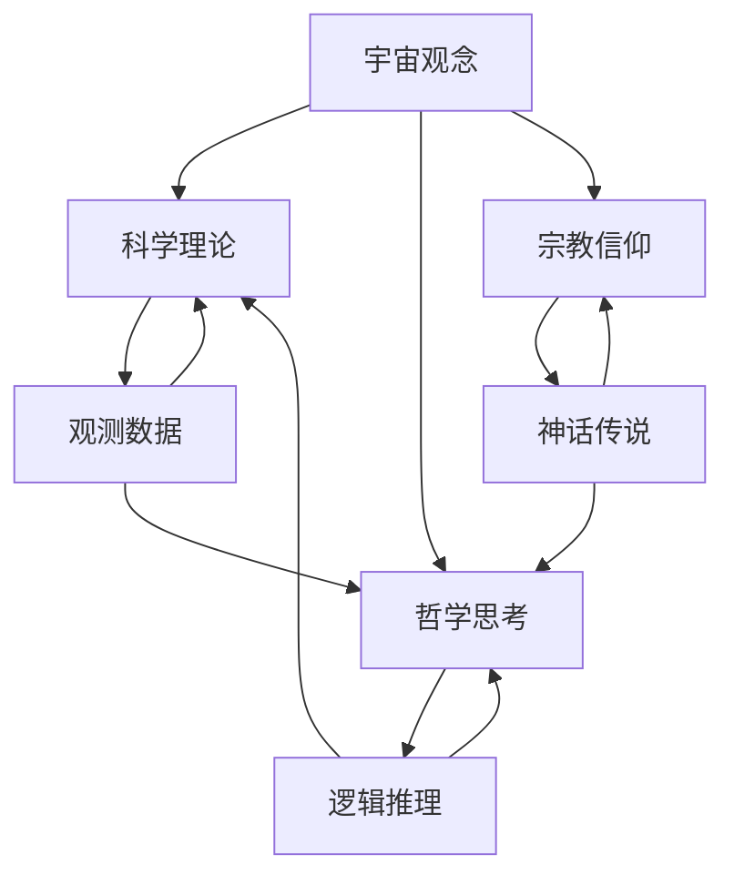
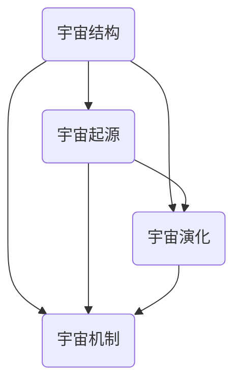

                 

### 宇宙观念的历史演变：从古至今的思想轨迹

**关键词：** 宇宙观念、历史演变、古代文明、中世纪、近代科学、现代理论、当代研究

**摘要：** 本文将系统地探讨宇宙观念的历史演变，从古至今的思想轨迹。通过梳理不同历史时期的宇宙观念，我们能够看到人类对于宇宙的认识在不断深化，从古代神话和宗教观念到现代科学的精密理论，再到当代的前沿研究，每一步都是思想探索的伟大进步。本文旨在提供一个清晰、易懂的框架，帮助读者理解宇宙观念如何随时间演变，并思考其对我们认识世界的深远影响。

本文的写作结构分为七个主要部分：

1. **引言**：介绍宇宙观念的历史演变，概述文章的核心内容和主题思想。
2. **古代宇宙观念**：探讨古代文明中的宇宙观念，包括中国、西方、印度和波斯等。
3. **中世纪宇宙观念**：分析中世纪的宇宙观念，特别是基督教和阿拉伯天文学的影响。
4. **近代宇宙观念**：介绍近代科学的宇宙观念，包括伽利略、牛顿和开普勒的贡献。
5. **现代宇宙观念**：探讨现代宇宙观念的演进，如宇宙大爆炸理论和黑洞。
6. **当代宇宙观念**：分析当代宇宙观念的前沿研究，包括量子宇宙学和多宇宙理论。
7. **宇宙观念的未来**：展望宇宙观念的未来趋势，探讨科技进步对宇宙观念的影响。

通过这样的结构，本文将帮助读者逐步理解宇宙观念的历史演变，并思考其对我们认识世界的深远影响。接下来的部分将详细探讨每一个历史阶段的宇宙观念，让我们开始这次思想的旅行吧。

### 第一部分：引言

宇宙观念的历史演变是一个漫长而复杂的过程，它不仅反映了人类对自然界的认知和探索，也体现了科学思想的进步和哲学思考的深化。从古代的神话和宗教观念，到中世纪的教义和天文学，再到近代科学的革命性突破，人类对宇宙的认识不断深化，每一个阶段都为后继的发展奠定了基础。

**核心概念与联系**

在探讨宇宙观念的历史演变之前，我们需要明确一些核心概念。首先，“宇宙观念”指的是人类对宇宙的理解和认知，包括宇宙的结构、起源和演化。这些观念不仅包含了科学理论，还包括哲学思考和宗教信仰。

为了更清晰地理解这些概念之间的关系，我们可以使用Mermaid流程图来表示它们的核心属性和相互联系：

在上述流程图中，宇宙观念作为一个总体概念，与科学理论、哲学思考和宗教信仰紧密相连。科学理论依赖于观测数据和逻辑推理，哲学思考则通过抽象思维和逻辑推理来探索宇宙的本质，而宗教信仰则通过神话传说和教义来阐释宇宙的意义。

**问题背景**

宇宙观念的历史演变涉及到多个历史时期和文化背景，每一个时期都有其独特的宇宙观念。例如，古代文明中的宇宙观念多基于神话和宗教信仰，而中世纪则受教义和天文学的影响。近代科学的兴起带来了宇宙观念的革命性变化，而现代宇宙观念则进一步融合了物理学、天文学和哲学的成果。

这些宇宙观念的变化不仅影响了人类对自然界的认知，也深刻地影响了社会的文化、科技和哲学发展。例如，哥白尼的日心说挑战了长期以来教会的主张，推动了科学革命；牛顿力学和开普勒的行星运动定律则为现代物理学奠定了基础；现代宇宙大爆炸理论和黑洞研究则揭示了宇宙的起源和演化机制。

**问题描述**

尽管宇宙观念在历史上经历了多次变革，但当前仍存在一些争议和未解问题。例如，宇宙大爆炸理论虽然广为接受，但关于宇宙起源和暗物质、暗能量的性质仍然存在许多未解之谜。此外，量子宇宙学和多宇宙理论的提出，虽然为宇宙观念提供了新的视角，但也引发了新的哲学和科学挑战。

因此，理解宇宙观念的历史演变，不仅有助于我们更好地理解当前的科学理论和未解问题，还能为未来的科学研究提供启示。

**问题解决**

要解决上述问题，我们需要采取以下步骤：

1. **梳理历史阶段**：将宇宙观念的历史演变划分为不同的阶段，如古代、中世纪、近代和现代。
2. **分析各个阶段的特点**：对每个历史阶段的宇宙观念进行详细分析，探讨其形成的原因和影响。
3. **探讨核心概念和联系**：使用Mermaid流程图和ER实体关系图来表示核心概念和它们之间的联系。
4. **讲解科学原理**：使用Python源代码和数学公式来详细阐述科学原理和算法。
5. **总结和展望**：总结各个阶段的宇宙观念，并提出未来可能的发展方向。

通过这些步骤，我们可以系统地理解宇宙观念的历史演变，并为未来的科学研究提供有价值的参考。

**边界与外延**

在探讨宇宙观念的历史演变时，我们还需要明确一些边界与外延。首先，宇宙观念的边界在于人类对宇宙的认知范围，即人类能够观测和理解的宇宙部分。这个边界随着科技的发展不断扩展，但仍然存在许多未知的领域。

宇宙观念的外延则包括多个学科领域，如物理学、天文学、哲学和宗教。不同学科对宇宙观念的贡献和解释各有侧重，共同构成了对宇宙的全面理解。

**概念结构与核心要素组成**

宇宙观念的核心要素包括以下方面：

1. **宇宙结构**：对宇宙整体结构的描述，如是否是平直的、弯曲的或闭合的。
2. **宇宙起源**：对宇宙如何起源和演化的解释，如大爆炸理论。
3. **宇宙演化**：宇宙从起源到现在的演化过程，包括宇宙膨胀、恒星形成、黑洞等。
4. **宇宙机制**：宇宙内部的各种机制和规律，如引力、量子力学等。

通过这些核心要素，我们可以对宇宙观念进行系统化的分析和理解。

**本章小结**

本章通过介绍宇宙观念的历史演变，概述了文章的核心内容和主题思想。我们明确了核心概念和联系，分析了历史背景和问题描述，提出了问题解决的步骤，并探讨了边界与外延以及概念结构与核心要素组成。接下来，我们将深入探讨古代宇宙观念，了解不同文明的宇宙观念及其影响。

### 第一部分：引言

#### 1.5 概念结构与核心要素组成

在探讨宇宙观念的历史演变时，理解宇宙观念的核心概念和结构是非常重要的。宇宙观念不仅涉及对宇宙本身的理解，还包括对宇宙起源、演化和机制的认识。以下是宇宙观念的主要组成部分和其核心要素：

**1. 宇宙结构**

宇宙结构是指宇宙的整体形态和空间分布。它包括宇宙的形状（如平直宇宙、弯曲宇宙或闭合宇宙）、宇宙的尺度（从微观的原子尺度到宏观的宇宙尺度）以及宇宙的维度（三维空间加上一维时间）。对宇宙结构的理解直接关系到对宇宙的整体认知。

**2. 宇宙起源**

宇宙起源是宇宙观念中一个核心的问题，主要涉及宇宙如何从一个初始状态演化为当前的状态。历史上，从古代的创世神话到现代的大爆炸理论，不同的宇宙起源观念不断演进。大爆炸理论提出宇宙起源于一个极高温度和密度的初始状态，通过膨胀和冷却逐渐形成现在的宇宙。

**3. 宇宙演化**

宇宙演化是指宇宙从起源到现在的变化过程。宇宙的演化过程包括宇宙膨胀、恒星和星系的形成、黑洞等现象。理解宇宙演化不仅需要天文学和物理学的观测数据，还需要深入的数学模型和理论分析。例如，宇宙膨胀的观测数据和宇宙微波背景辐射的发现，为宇宙演化的研究提供了重要证据。

**4. 宇宙机制**

宇宙机制是指宇宙内部的各种物理规律和机制，如引力、量子力学、相对论等。这些机制是理解宇宙演化和宇宙结构的基础。引力是宇宙中物体相互作用的力，量子力学则描述了微观粒子的行为，而相对论则提供了对时空的理解。

**核心要素对比表格**

为了更清晰地展示宇宙观念的核心要素，我们可以通过一个对比表格来分析不同历史时期的宇宙观念：

| 历史时期 | 宇宙结构 | 宇宙起源 | 宇宙演化 | 宇宙机制 |
|----------|----------|----------|----------|----------|
| 古代文明 | 宗教神话 | 创世神话 | 星体运行 | 宗教信仰 |
| 中世纪   | 宇宙中心 | 教义解释 | 地心说   | 宗教哲学 |
| 近代科学 | 平直宇宙 | 大爆炸 | 宇宙膨胀 | 牛顿力学、相对论 |
| 现代宇宙 | 多元宇宙 | 大爆炸理论 | 暗物质、暗能量 | 量子宇宙学 |

**ER实体关系图**

为了更好地理解宇宙观念的核心要素及其相互关系，我们可以使用Mermaid流程图来绘制ER实体关系图：

在这个ER实体关系图中，宇宙结构、宇宙起源、宇宙演化和宇宙机制构成了宇宙观念的核心要素，它们之间相互联系和影响。

**本章小结**

通过梳理宇宙观念的核心概念和结构，我们能够更好地理解宇宙观念的历史演变。接下来，我们将深入探讨古代宇宙观念，分析不同文明的宇宙观念及其影响。这将为我们理解宇宙观念的演变提供重要的历史背景和理论基础。

### 第二部分：古代宇宙观念

古代宇宙观念是人类对宇宙早期认知的集合，它们深深植根于各种文化、宗教和哲学体系中。在这一部分，我们将逐一探讨古代中国、西方、印度和波斯等文明的宇宙观念，分析其核心思想及其对后世的影响。

#### 2.1 古代中国：道家、儒家与宇宙观念

**道家思想与宇宙观念**

道家的宇宙观念主要体现在“道”这一核心概念上。道家认为，“道”是宇宙的根本原理，是万物生成的根源。道是自然法则的体现，也是宇宙的规律和秩序。《道德经》中多次提到“道生一，一生二，二生三，三生万物”，这表达了道是宇宙万物生成和发展的基础。

道家的宇宙观念强调“无为而治”，即顺应自然的法则，不做无谓的干预。这一思想体现在宇宙观念中，即认为宇宙有其自身的运行规律，人类应当顺应这些规律，而不是去强行改变它们。这种思想在中国古代哲学中具有深远影响，也体现在中国的文化和生活中。

**儒家思想与宇宙观念**

儒家的宇宙观念则更侧重于人类社会和道德伦理。儒家认为，宇宙是有序的，这个秩序不仅体现在自然界中，也体现在社会生活中。儒家经典《易经》中提到：“天行健，君子以自强不息；地势坤，君子以厚德载物。”这表明，宇宙的运行有其规律，人类应当效仿自然，不断自强不息，同时也要厚德载物，关注社会责任。

儒家的宇宙观念强调了天人合一的思想，认为天和人相互关联，人的行为应当符合天意。这种观念对中国古代的政治、伦理和社会有着深远的影响，促进了社会的和谐与稳定。

**2.2 古代西方：古希腊与古罗马的宇宙观念**

**古希腊的宇宙观念**

古希腊的宇宙观念主要来源于哲学和天文学。在古希腊哲学中，泰勒斯的“水是万物的本原”和赫拉克利特的“火是万物的本原”都是对宇宙起源的早期思考。而亚里士多德则提出了地球是宇宙中心，行星和恒星绕地球旋转的“地心说”。

古希腊天文学家欧多克斯提出了“地心均轮说”，认为天体按照一定的规律围绕地球旋转。这一观念在古希腊哲学和天文学中占主导地位，直到哥白尼提出日心说。

**古罗马的宇宙观念**

古罗马的宇宙观念在很大程度上继承了古希腊的思想。罗马哲学家如西塞罗和塞涅卡，也在其哲学作品中探讨了宇宙的本质和秩序。古罗马天文学家托勒密则发展了地心说，提出了“地心均轮说”的详细模型，这一模型在西方世界保持了主导地位长达千年。

**2.3 古印度与古波斯的宇宙观念**

**古印度的宇宙观念**

古印度的宇宙观念深受宗教和哲学的影响，特别是印度教和佛教。印度教中的宇宙观念包含了“宇宙循环”的概念，即宇宙经历四个时期：创世（梵天时期）、维持（毗湿奴时期）、衰退（湿婆时期）和毁灭（梵天时期）。这一循环不断重复，体现了宇宙的永恒性和周期性。

佛教的宇宙观念则强调了因果律和轮回，认为一切现象都是因果关系的产物，宇宙是无始无终的。

**古波斯的宇宙观念**

古波斯的宇宙观念主要源于琐罗亚斯德教。琐罗亚斯德教认为，宇宙由善和恶两种力量组成，善的阿胡拉·马兹达与恶的安格拉·曼纽相互斗争，决定着宇宙的命运。这一观念反映了古波斯人对宇宙秩序和正义的信仰。

**2.4 本章小结：古代宇宙观念的异同与影响**

古代中国、西方、印度和波斯的宇宙观念各有特点，但也有一些共同点。它们都试图解释宇宙的起源、结构和运行规律，同时反映了当时社会的文化、宗教和哲学背景。

道家的“道”和儒家的“天人合一”思想，为中国的文化和哲学奠定了基础。古希腊的哲学和天文学对西方科学的发展产生了深远影响，而古印度的宇宙观念则深刻影响了佛教哲学和印度教教义。古波斯的宇宙观念则对后来的伊斯兰哲学和波斯文化产生了影响。

这些古代宇宙观念不仅在当时的社会中起到了指导作用，也为后来的科学研究提供了基础和灵感。通过对古代宇宙观念的探讨，我们可以更好地理解人类对宇宙的认识是如何逐步发展的。

### 第三部分：中世纪宇宙观念

#### 3.1 教会的宇宙观：中世纪的宇宙观念与基督教

中世纪的宇宙观念在很大程度上受到基督教教义的影响。教会在这一时期不仅是精神领袖，也是社会秩序的维护者，其宇宙观对当时的社会生活和科学思想产生了深远影响。

**教会的宇宙观**

中世纪教会的宇宙观主要基于圣经和教父们的解释。根据圣经的描述，宇宙是由上帝在六天之内创造的，第七天上帝休息，这一天成为礼拜日。教会认为，宇宙是上帝的创造，人类是上帝的选民，拥有神圣的使命。

教会宇宙观的核心是地心说，这一观念认为地球是宇宙的中心，其他天体（如太阳、月亮、行星和恒星）围绕地球旋转。这一观念最早由古希腊天文学家欧多克斯提出，后经罗马天文学家托勒密系统化，成为中世纪主流的宇宙模型。

**教义与宇宙观的影响**

教会的宇宙观对当时的社会和科学产生了深远影响。首先，教会的权威性使得地心说成为无可争议的科学真理，任何与地心说相悖的观点都受到严厉的批判和迫害。哥白尼在提出日心说时，就面临巨大的压力和质疑，他的理论在教会和科学界引起了激烈的争议。

其次，教会的宇宙观强调人类在世界中的特殊地位，这导致了人类中心主义的思想。教会认为，人类是上帝的造物，具有神圣的使命，应当保护和统治自然界。这一思想不仅影响了中世纪的社会文化，也对后来的环境保护和生态思想产生了深远影响。

**3.2 阿拉伯天文学与宇宙观**

阿拉伯天文学在中世纪取得了显著成就，对西方科学的发展产生了重要影响。阿拉伯天文学起源于公元8世纪的巴格达，随后在西班牙和北非等地区蓬勃发展。

**阿拉伯天文学的发展**

阿拉伯天文学的发展离不开数学和观测技术的进步。阿拉伯天文学家们不仅翻译和传播了古希腊和古罗马的天文学著作，如托勒密的《天文学大成》，还进行了大量的观测和实验，推动了天文学的发展。

在数学方面，阿拉伯数学家如花拉子米和阿尔·哈里德以代数和三角学的研究著称。这些数学成果不仅在天文学中应用广泛，也为后来的物理学和工程学奠定了基础。

在观测技术方面，阿拉伯天文学家如阿尔·巴塔尼和阿尔·哈斐兹进行了精确的天文观测，编制了精确的星表和天文表，这些成果对后来的天文学研究具有重要意义。

**阿拉伯的宇宙观**

阿拉伯的宇宙观在一定程度上接受了古希腊和古罗马的思想，但也具有自己的特色。阿拉伯天文学家普遍接受了地心说，但他们也意识到地心说的某些不足，如无法解释行星逆行等现象。

阿拉伯天文学家阿尔·法拉比提出了“宇宙灵魂”的概念，认为宇宙中存在一种类似于人类的灵魂，赋予宇宙生命和活力。这一观念在一定程度上融合了希腊哲学和伊斯兰教思想，丰富了中世纪的宇宙观念。

**3.3 中世纪科学思想：哥白尼与宇宙观**

哥白尼是中世纪晚期一位重要的天文学家，他的日心说理论对宇宙观念产生了深远影响。

**哥白尼的日心说**

哥白尼在《天体运行论》中提出了日心说，认为太阳是宇宙的中心，地球和其他行星围绕太阳旋转。这一理论与传统的地心说相悖，挑战了教会的权威和传统的宇宙观念。

哥白尼的日心说提出了一种全新的宇宙模型，强调行星运动的规律性，这为后来的科学革命奠定了基础。他的理论通过数学计算和天文观测得到了支持，逐渐被学术界接受。

**哥白尼宇宙观的影响**

哥白尼的日心说对中世纪宇宙观念产生了重大影响。首先，它挑战了教会的地心说，引发了学术界和宗教界的激烈争论。尽管哥白尼在生前并未受到严重迫害，但他的理论在中世纪末期的传播过程中受到了很多阻力。

其次，哥白尼的日心说为后来的科学革命提供了理论基础。他的理论促进了人们对宇宙的认识，推动了天文学、物理学和数学的发展。哥白尼的工作标志着现代科学的兴起，开启了人类对自然界的新认识。

**3.4 本章小结：中世纪宇宙观念的转变**

中世纪的宇宙观念以基督教教义和地心说为核心，教会和宗教思想对宇宙观念的形成和传播起到了重要作用。阿拉伯天文学的发展丰富了中世纪的宇宙观念，为后来的科学革命奠定了基础。

哥白尼的日心说对中世纪的宇宙观念产生了深远影响，尽管它在当时并未得到广泛接受，但为后来的科学进步提供了新的视角。中世纪宇宙观念的转变，不仅反映了人类对宇宙认识的发展，也体现了科学思想的进步和宗教权威的演变。

### 第四部分：近代宇宙观念

#### 4.1 伽利略与宇宙观念的变革

伽利略是近代科学的重要奠基人之一，他的工作对宇宙观念产生了深远影响。伽利略通过精确的观测和实验，对天文学、物理学和宇宙观念进行了革命性的变革。

**伽利略的观测与理论**

伽利略使用自制的望远镜进行了一系列重要的天文观测，这些观测结果对传统的宇宙观念提出了挑战。他发现木星有四颗卫星，这些卫星围绕木星旋转，这与地心说中的行星静止状态相矛盾。他还观测到了月亮表面的山脉和陨石坑，这些细节使得人们开始重新思考宇宙的本质。

伽利略的另一项重要贡献是对自由落体运动的研究。通过实验，他证明了所有物体在没有空气阻力的情况下，无论重量大小，都以相同的加速度下落。这一发现挑战了亚里士多德关于重物下落速度与重量成正比的观念，为后来的牛顿力学奠定了基础。

**伽利略对宇宙观念的贡献**

伽利略的观测和理论对宇宙观念产生了重大影响。首先，他通过实际观测提供了强有力的证据，证明地球不是宇宙的中心，行星围绕太阳旋转。这一观念与哥白尼的日心说相一致，但伽利略的工作使得这一理论更加被学术界接受。

其次，伽利略的工作促进了人们对自然界的定量研究。他强调通过实验和观测来验证理论，这一方法成为现代科学的基础。伽利略的实证主义思想对后来的科学家如牛顿和开普勒产生了深远影响。

**4.2 牛顿力学与宇宙观念**

牛顿力学的提出是近代宇宙观念的重要里程碑。牛顿通过《自然哲学的数学原理》系统地阐述了运动定律和万有引力定律，为宇宙的机械运行提供了完整的理论框架。

**牛顿力学的理论框架**

牛顿的三大运动定律描述了物体在力的作用下如何运动。第一定律（惯性定律）指出，一个物体如果不受外力作用，将保持静止或匀速直线运动。第二定律（加速度定律）描述了力与加速度之间的关系，即物体所受的合力等于其质量与加速度的乘积（F=ma）。第三定律（作用与反作用定律）指出，任何作用力都有一个大小相等、方向相反的反作用力。

牛顿的万有引力定律则解释了天体之间的相互作用。根据这一定律，任何两个物体之间都存在相互吸引的引力，这个力的大小与两物体的质量成正比，与它们之间的距离的平方成反比（F = G * (m1 * m2) / r^2）。

**牛顿力学对宇宙观念的影响**

牛顿力学的提出对宇宙观念产生了深远影响。首先，它提供了对宇宙运动的数学描述，使得天体运动的预测和计算成为可能。牛顿的定律不仅适用于地面物体，也适用于天体，这使得人类首次能够理解整个宇宙的机械运行。

其次，牛顿力学打破了地心说的束缚，支持了哥白尼的日心说。牛顿的引力定律解释了行星围绕太阳的椭圆轨道，这一发现使得日心说得到了更广泛的认可。

最后，牛顿力学的成功促进了科学革命的进一步发展。它为后来的物理学、化学和天文学研究提供了基础，使得科学方法成为探索自然界的主要工具。

**4.3 开普勒与行星运动定律**

开普勒是另一位对宇宙观念产生重要影响的天文学家。他通过分析泰坦堡星表的观测数据，总结出了行星运动的三大定律，这些定律对理解行星运动和宇宙结构具有重要意义。

**开普勒的行星运动定律**

开普勒的第一定律（椭圆轨道定律）指出，行星绕太阳的轨道是椭圆形的，太阳位于椭圆的一个焦点上。第二定律（面积速度定律）描述了行星在轨道上运动时，与太阳连线在相等时间内扫过的面积相等。第三定律（调和定律）指出，行星绕太阳公转周期的平方与其轨道半长轴的立方成正比（T^2 ∝ a^3）。

**开普勒对宇宙观念的贡献**

开普勒的行星运动定律对宇宙观念产生了深远影响。首先，他的定律提供了对行星运动的精确描述，与牛顿的引力定律相辅相成，共同构成了现代天文学的基础。

其次，开普勒的定律表明，行星的运动不仅遵循物理规律，还具有某种数学上的和谐性。这种和谐性激发了人们对宇宙的探索欲望，促使人们进一步研究宇宙的本质和运行规律。

**4.4 本章小结：近代科学的宇宙观念的进步**

近代科学的兴起带来了宇宙观念的巨大变革。伽利略的观测和理论挑战了传统的宇宙观念，牛顿力学为宇宙的机械运行提供了完整的理论框架，开普勒的行星运动定律进一步加深了人们对宇宙的理解。

这些科学家的贡献不仅推动了科学革命的发展，也改变了人们对宇宙的看法。近代宇宙观念的进步为我们提供了更全面、更精确的认识，为现代科学和技术的进步奠定了基础。

### 第五部分：现代宇宙观念

#### 5.1 宇宙大爆炸理论

宇宙大爆炸理论是现代宇宙学的基础理论之一，它提出了宇宙起源于一个极高温度和密度的初始状态，随后经历快速膨胀的过程。这一理论不仅解释了宇宙的起源，还揭示了宇宙的演化和结构。

**大爆炸理论的历史与提出**

宇宙大爆炸理论的起源可以追溯到20世纪初。1927年，比利时天文学家勒梅特首次提出了大爆炸理论，他假设宇宙从一个“原始原子”开始膨胀。然而，这一理论并未引起广泛的关注。

1931年，俄国物理学家乔治·伽莫夫提出了现代宇宙大爆炸理论的雏形。他结合量子理论和相对论，假设宇宙最初处于一个极高温度和密度的状态，随后开始膨胀。这个理论得到了美国天文学家勒梅特的支持，他们在20世纪40年代进一步发展了大爆炸理论。

**大爆炸理论对宇宙观念的影响**

大爆炸理论对宇宙观念产生了深远影响。首先，它改变了人类对宇宙起源的传统观念。传统的观念认为宇宙是永恒存在的，而大爆炸理论提出了宇宙有一个起点，这一起点标志着宇宙的诞生。

其次，大爆炸理论解释了宇宙的膨胀现象。根据观测数据，天文学家发现宇宙在不断地膨胀，这一发现支持了大爆炸理论的预测。大爆炸理论认为，宇宙的膨胀是由于初始状态的快速膨胀所导致的。

此外，大爆炸理论还揭示了宇宙的演化和结构。根据理论，宇宙在大爆炸后逐渐冷却和膨胀，形成了恒星、星系和其他天体。这一过程被称为“宇宙再合成”，它是现代宇宙学的重要研究方向。

**5.2 黑洞与宇宙观念**

黑洞是宇宙中的一种极端天体，它具有极强的引力，甚至连光也无法逃脱。黑洞的存在和特性对宇宙观念产生了深刻影响。

**黑洞的概念与性质**

黑洞是由极端密集的物质组成，它的引力场如此强大，以至于在它的周围形成一个事件视界，任何物质或信息都无法逃离这个边界。黑洞的引力场甚至能够扭曲时空，这是爱因斯坦广义相对论的预测。

黑洞可以分为两种：一种是恒星质量黑洞，由恒星坍缩形成；另一种是超大质量黑洞，存在于星系中心，可能对星系的演化产生重要影响。

**黑洞对宇宙观念的挑战**

黑洞的概念对传统的宇宙观念提出了挑战。首先，它揭示了物质可以极度密集，甚至超过原子核的密度。这种极端状态使得我们对物质的基本构成有了新的认识。

其次，黑洞的存在表明宇宙中存在着无法直接观测到的物质，这被称为“暗物质”。暗物质对宇宙的结构和演化有重要影响，但它至今尚未被直接观测到。

此外，黑洞的引力效应挑战了我们对时空的理解。根据广义相对论，黑洞周围的时空被极度扭曲，这为研究时空的性质提供了新的视角。

**5.3 宇宙学的新发现**

宇宙学在20世纪末和21世纪初取得了许多重要发现，这些发现进一步丰富了我们对宇宙的理解。

**宇宙膨胀与暗物质**

宇宙膨胀的观测数据支持了大爆炸理论的预测，但同时也揭示了宇宙膨胀速度在加速的现象。这一发现表明宇宙中存在一种未知的能量形式，被称为“暗能量”。暗能量是推动宇宙加速膨胀的主要因素，但它的本质尚未完全理解。

暗物质是宇宙学的另一个重要发现。根据观测数据，宇宙中大部分物质不发光，无法直接观测，但它的引力效应却对星系的运动产生了显著影响。暗物质可能是宇宙中一种未知的基本粒子，它的存在和性质成为现代物理学和宇宙学研究的热点。

**宇宙学的新理论**

随着新观测数据和理论的发展，宇宙学提出了许多新理论，以解释宇宙的起源、演化和结构。

**多宇宙理论**

多宇宙理论提出，我们的宇宙只是众多宇宙中的一个，这些宇宙可能具有不同的物理常数和规律。这一理论试图解释宇宙中的多样性和随机性。多宇宙理论对哲学和科学都有重要启示，但至今仍存在许多未解之谜。

**宇宙学与量子力学的关系**

宇宙学与量子力学的关系是当前科学研究的前沿之一。量子力学描述了微观粒子的行为，而宇宙学则试图解释宇宙的宏观现象。如何将这两者统一，是现代物理学面临的重大挑战。

**5.4 本章小结：现代宇宙观念的更新**

现代宇宙观念的更新不仅体现在对宇宙起源和演化的新理解，还体现在对宇宙结构和性质的深入研究。宇宙大爆炸理论和黑洞概念的提出，改变了我们对宇宙的传统观念。同时，宇宙学的新发现和新理论为我们提供了更全面的宇宙图景。

尽管现代宇宙观念仍然存在许多未解之谜，但科学家们通过不断的观测和理论探索，正在逐步揭示宇宙的奥秘。现代宇宙观念的更新不仅推动了科学的发展，也深刻影响了我们对宇宙和人类自身地位的认识。

### 第六部分：当代宇宙观念

#### 6.1 量子宇宙学

量子宇宙学是当代宇宙学研究的前沿领域之一，它试图将量子力学与宇宙学结合起来，以解释宇宙的起源和演化。量子宇宙学的基本原理包括量子波动、量子纠缠和量子涨落等。

**量子宇宙学的基本原理**

量子宇宙学的基本原理源于量子力学，特别是量子波动原理。根据量子波动原理，物质和能量可以表现出波动性，这种波动性在微观尺度上非常显著。在宇宙的极早期，物质和能量处于极端的密度和温度状态，量子波动性是宇宙的基本特征。

量子纠缠是量子宇宙学的另一个核心原理。量子纠缠指的是两个或多个量子粒子之间存在一种即时的相互联系，即使这些粒子相隔很远，一个粒子的状态变化会立即影响另一个粒子的状态。这一原理在宇宙学的背景下，被用来解释宇宙结构的形成和演化。

量子涨落是宇宙早期的一个关键现象。量子涨落指的是在宇宙大爆炸后，宇宙中的物质和能量分布出现的微小波动。这些量子涨落最终演化为恒星、星系和其他天体，是宇宙结构的根源。

**量子宇宙学对宇宙观念的启示**

量子宇宙学对传统宇宙观念提出了新的挑战和启示。首先，它表明宇宙的起源和演化并不遵循经典物理学中的确定性规律，而是具有随机性和不确定性。量子波动和量子涨落使得宇宙的形成过程更加复杂和多样化。

其次，量子宇宙学强调了宇宙的统一性。在量子宇宙学中，宇宙的基本结构是由量子场和量子波动组成的，这种统一性为理解宇宙的整体性质提供了新的视角。

最后，量子宇宙学促进了跨学科的研究。它要求物理学家、天文学家和哲学家共同探讨宇宙的本质，推动了科学思想的融合和进步。

**6.2 多宇宙理论**

多宇宙理论是当代宇宙学中一个充满争议但引人入胜的领域，它提出我们的宇宙只是众多宇宙中的一个。多宇宙理论的基本概念是，不同的物理常数和规律可能导致不同的宇宙存在，这些宇宙可能具有不同的性质和演化路径。

**多宇宙理论的基本概念**

多宇宙理论的基本概念包括：

1. **平行宇宙**：平行宇宙是指与我们的宇宙在空间和时间上平行存在的其他宇宙。每个平行宇宙可能有不同的物理常数，如光速、电子质量等。

2. **本征分支**：多宇宙理论中，每个宇宙都可以看作是一个独立的“分支”，每个分支可能具有不同的物理状态和演化路径。

3. **概率性**：多宇宙理论认为，宇宙的演化具有概率性，不同的物理常数可能导致不同的宇宙状态。例如，一个宇宙中可能存在超光速旅行，而另一个宇宙中则不可能。

**多宇宙理论的影响与争议**

多宇宙理论对宇宙观念产生了深远影响，但也存在许多争议。

**影响**

1. **解释宇宙多样性**：多宇宙理论提供了一种解释宇宙多样性的方法。不同的宇宙可能有不同的物理常数和规律，这解释了为什么我们的宇宙具有独特的性质。

2. **推动科学研究**：多宇宙理论促使科学家探讨宇宙的起源、演化和性质，推动了天文学、物理学和哲学的跨学科研究。

**争议**

1. **观测证据不足**：多宇宙理论尚未得到直接的观测证据支持，其科学性受到质疑。

2. **哲学挑战**：多宇宙理论提出了关于存在、意识和因果性的哲学问题，这些问题的解答仍然存在争议。

3. **计算难题**：多宇宙理论涉及到巨大的计算量，如何模拟和验证多宇宙的存在成为一个重大挑战。

**6.3 宇宙与生命的起源**

宇宙与生命的起源是当代科学和哲学研究的重要课题，它探讨宇宙如何演化为生命，以及生命存在的意义。

**生命的起源与宇宙的关系**

生命的起源与宇宙的关系可以从以下几个方面来理解：

1. **化学起源**：化学起源说认为，生命起源于地球上的原始汤，通过化学反应逐渐形成简单的有机分子，这些分子进一步组合成复杂的生物分子，最终演化为生命。

2. **宇宙起源**：宇宙起源说认为，生命的起源与宇宙的演化密切相关。宇宙中的物理和化学过程为生命的产生提供了必要的条件。

**宇宙生命的可能性探讨**

关于宇宙生命的可能性，科学家提出了多种假设：

1. **外星生命**：许多科学家认为，在宇宙中可能存在其他生命形式，这些生命可能不同于地球生命，但具有类似的生物学特征。

2. **星际旅行**：多宇宙理论和星际旅行的概念使得我们能够探讨宇宙中其他星系和行星上生命的可能性。未来，人类可能通过技术手段探索和接触其他生命形式。

3. **生命存在的多样性**：科学家认为，生命可能以多种形式存在于宇宙中，包括微生物、智能生命甚至更高级的生命形式。

**6.4 本章小结：当代宇宙观念的发展趋势**

当代宇宙观念的发展趋势表明，我们对宇宙的认识正在不断深化。量子宇宙学和多宇宙理论为我们提供了新的视角，挑战了传统的宇宙观念。同时，对宇宙与生命的起源的研究，让我们更加关注宇宙中的生命现象。

尽管当前还存在许多未解之谜和争议，但随着科技的进步和理论的完善，我们对宇宙的认识将不断扩展。未来，我们将继续探索宇宙的奥秘，寻求对生命和存在的更深刻理解。

### 第七部分：宇宙观念的未来

#### 7.1 科技进步与宇宙观念的演变

随着科技的不断进步，宇宙观念也在不断演变，尤其是在人工智能、量子计算和空间探索等前沿领域的发展中，这些科技不仅改变了我们对宇宙的认知方式，也为宇宙观念的未来提供了新的可能性。

**未来的科技发展对宇宙观念的影响**

1. **人工智能与数据分析**：人工智能（AI）在宇宙学研究中的应用，使得我们能够处理和分析海量的天文数据，从而揭示宇宙的奥秘。AI可以通过机器学习算法识别天体现象、预测宇宙事件，甚至发现新的宇宙规律。这种数据分析能力将极大地提升我们对宇宙的理解。

2. **量子计算**：量子计算以其强大的计算能力，有望解决传统计算机无法处理的复杂宇宙问题，如量子引力和宇宙早期状态的计算。量子计算可能帮助科学家解决当前宇宙学中的某些基本问题，从而推动宇宙观念的进一步发展。

3. **空间探索**：随着人类对宇宙的探索不断深入，未来我们将可能获取更多关于宇宙的第一手资料。例如，未来的太空任务可能直接探测到暗物质、暗能量或黑洞等宇宙现象，从而验证或修正现有的宇宙观念。

**人工智能在宇宙学研究中的应用**

人工智能在宇宙学研究中已经有了初步的应用，主要表现在以下几个方面：

1. **数据挖掘与识别**：AI可以通过分析大量天文观测数据，识别出异常天体现象和新的天文目标。例如，AI已经被用于发现新的行星、超新星爆发和黑洞事件。

2. **预测与模拟**：AI可以基于现有的物理模型和观测数据，预测未来可能发生的宇宙事件，如超新星爆发、星系碰撞等。这些预测有助于我们更好地理解宇宙的演化过程。

3. **机器学习模型**：AI可以开发新的机器学习模型，用于解释宇宙现象和验证物理定律。例如，AI可以用来改进宇宙微波背景辐射的测量和分析，从而更精确地了解宇宙的早期状态。

**7.2 宇宙观念的未来趋势**

随着科技的进步，宇宙观念的未来趋势将体现在以下几个方面：

1. **宇宙结构的理解**：随着对宇宙的观测技术不断提高，我们有望更精确地了解宇宙的结构，包括宇宙的维度、形状和组成。量子宇宙学和多宇宙理论可能为我们提供新的视角，帮助我们更全面地理解宇宙。

2. **宇宙起源与演化的深入研究**：未来，我们将通过更多的观测和理论探索，深入理解宇宙的起源和演化过程。例如，通过探测宇宙微波背景辐射，我们可能揭示宇宙的早期状态和宇宙膨胀的机制。

3. **宇宙生命的探索**：随着空间探索技术的发展，我们可能会发现宇宙中的其他生命形式，甚至外星智慧生命。这将极大地改变我们对宇宙和生命的认识。

**7.3 本章小结：展望宇宙观念的未来**

展望宇宙观念的未来，我们可以预期科技的发展将极大地推动我们对宇宙的理解。人工智能、量子计算和空间探索等前沿科技的应用，将为我们揭示宇宙的奥秘提供新的工具和方法。未来，我们将不断深化对宇宙结构、起源和演化过程的认识，同时探索宇宙中的生命现象。这些进步不仅将丰富我们的宇宙观念，也将为科学和技术的发展带来新的机遇和挑战。

### 总结与展望

本文系统地探讨了宇宙观念的历史演变，从古至今的思想轨迹，通过分析不同历史阶段的宇宙观念，展示了人类对宇宙认识的不断深化和科学思想的进步。古代宇宙观念主要基于神话和宗教信仰，中世纪宇宙观念受教会和天文学的影响，近代科学带来了宇宙观念的革命性变革，而现代宇宙观念则融合了量子理论和宇宙学的新发现。当代宇宙观念的前沿研究，如量子宇宙学和多宇宙理论，为我们提供了新的视角和思考。

通过对宇宙观念的深入探讨，我们不仅更好地理解了宇宙的本质和演化过程，也对人类自身的地位和未来有了更深刻的认识。宇宙观念的演变不仅反映了科学进步，也体现了人类思想的不断拓展和深化。

在未来的研究中，我们期待科技进步，特别是人工智能和量子计算的应用，将为我们揭示宇宙的更多奥秘。我们鼓励读者继续关注宇宙观念的发展，积极参与到这一充满挑战和机遇的领域中，为科学的进步贡献自己的力量。

### 拓展阅读

1. **《宇宙简史》** - 史蒂芬·霍金
   本书是宇宙学的经典之作，详细介绍了宇宙的起源、演化和未来。

2. **《量子宇宙学导论》** - 马克斯·泰格马克
   本书深入介绍了量子宇宙学的基本原理和最新研究成果。

3. **《多宇宙：探索无穷的宇宙和可能的宇宙》** - 比尔·布莱森
   本书以通俗易懂的方式介绍了多宇宙理论，探讨了宇宙多样性的可能性。

4. **《古代宇宙观念》** - 詹姆斯·冈恩
   本书分析了古代文明中的宇宙观念，包括中国、西方、印度和波斯等。

5. **《中世纪宇宙观》** - 肖拉·雅各布斯
   本书探讨了中世纪基督教和阿拉伯天文学对宇宙观念的影响。

6. **《宇宙观念的演变》** - 约翰·D. 巴罗
   本书从科学和哲学的角度分析了宇宙观念的演变，包括近代科学和现代理论。

这些书籍和文献为我们提供了丰富的阅读资源，可以帮助读者更深入地了解宇宙观念的历史演变和当代研究。希望读者在探索宇宙奥秘的过程中，能够不断拓展自己的知识领域，开启新的思考。

