                 

### 第1章：引言

**文章标题：宇宙观念的跨文化比较：共性与差异**

**关键词：宇宙观念、跨文化比较、文化差异、文化相似度、数学模型**

**摘要：本文从宇宙观念的定义出发，探讨了不同文化背景下宇宙观念的共性与差异，通过比较方法、数学模型和系统架构设计，提供了一个跨文化比较的框架，并分析了实际项目案例，为深入研究宇宙观念提供了新的视角。**

### 目录大纲设计思路

在撰写本文时，我们首先明确了文章的目标和结构，以确保内容的连贯性和逻辑性。以下是本文的目录大纲设计思路：

1. **背景介绍**：首先，我们需要为本文提供一个背景介绍，包括宇宙观念的定义、跨文化比较的重要性，以及为何选择这些文化进行比较。

2. **核心概念与联系**：接下来，我们需详细介绍宇宙观念的核心概念，并使用表格和 Mermaid 流程图来展示不同文化中的宇宙观念及其联系。

3. **算法原理讲解**：我们将选择一个关键算法，例如文化相似度的计算方法，使用 mermaid 画出流程图，并用 Python 代码和 LaTeX 公式进行详细阐述。

4. **数学模型和数学公式讲解**：我们将为宇宙观念的跨文化比较提供数学模型，并使用 LaTeX 格式嵌入到文中进行讲解。

5. **系统分析与架构设计**：在此部分，我们将讨论如何构建一个宇宙观念跨文化比较的系统，并使用 Mermaid 类图和架构图来展示设计。

6. **项目实战**：我们将设计一个实际的项目，包括环境安装、核心实现、代码解析和案例分析。

7. **最佳实践 tips、小结、注意事项、拓展阅读**：最后，我们将提供一些实践技巧，对全书进行小结，并指出可能的注意事项，推荐拓展阅读。

### 具体步骤

1. **第1章：引言**
    - 介绍宇宙观念的定义及其重要性。
    - 阐述跨文化比较的必要性。

2. **第2章：核心概念**
    - 详细介绍宇宙观念的核心概念。
    - 使用表格对比不同文化中的宇宙观念。

3. **第3章：宇宙观念的比较方法**
    - 介绍宇宙观念比较的理论基础。
    - 使用 Mermaid 流程图展示比较过程。

4. **第4章：数学模型与算法**
    - 讨论宇宙观念比较的数学模型。
    - 使用 Python 代码和 LaTeX 公式解释算法原理。

5. **第5章：系统架构设计**
    - 设计宇宙观念跨文化比较系统的架构。
    - 使用 Mermaid 类图和架构图展示设计。

6. **第6章：项目实战**
    - 环境安装与配置。
    - 实现核心功能并解析代码。
    - 分析实际案例。

7. **第7章：最佳实践与总结**
    - 提供实践技巧。
    - 对全书进行小结。
    - 指出注意事项。
    - 推荐拓展阅读。

### 目录大纲

----------------------------------------------------------------
# 第一部分：引言

## 第1章：宇宙观念的跨文化比较：背景与重要性

### 1.1 宇宙观念的定义

#### 1.1.1 宇宙观念的历史演变

#### 1.1.2 宇宙观念的核心概念

### 1.2 跨文化比较的必要性

#### 1.2.1 文化多样性对宇宙观念的影响

#### 1.2.2 跨文化比较的重要性

### 1.3 为什么选择这些文化进行比较

#### 1.3.1 不同文化的代表性

#### 1.3.2 文化间的差异性分析

----------------------------------------------------------------

根据以上设计思路和具体步骤，我们将逐步撰写每个章节的内容，确保文章的逻辑清晰、结构紧凑，并且对核心概念和算法原理进行详细讲解。在接下来的章节中，我们将深入探讨宇宙观念的跨文化比较，结合具体案例进行分析和讨论。### 第1章：引言

**文章标题：宇宙观念的跨文化比较：共性与差异**

**关键词：宇宙观念、跨文化比较、文化差异、文化相似度、数学模型**

**摘要：本文从宇宙观念的定义出发，探讨了不同文化背景下宇宙观念的共性与差异，通过比较方法、数学模型和系统架构设计，提供了一个跨文化比较的框架，并分析了实际项目案例，为深入研究宇宙观念提供了新的视角。**

在人类文明的发展历程中，宇宙观念始终扮演着重要的角色。它不仅是人类对自然世界的理解，也是文化、哲学和科学的重要基石。然而，由于文化差异的存在，不同文化背景下的人们对宇宙的观念有着显著的共性与差异。本文旨在通过跨文化比较，揭示宇宙观念的共性与差异，为进一步研究宇宙观念提供新的视角。

#### 1.1 宇宙观念的定义

宇宙观念是指人类对宇宙本质和结构的认识与理解。从古代的天地二元论，到现代科学的宇宙大爆炸理论，宇宙观念经历了漫长的发展历程。宇宙观念不仅涉及科学领域，还包含哲学、宗教和文化等多个层面。在科学层面，宇宙观念关注的是宇宙的结构、演化规律和基本原理。在哲学层面，宇宙观念探讨的是宇宙的本源、本质和终极意义。在文化层面，宇宙观念则反映了不同民族、地域和时代对宇宙的认知与信仰。

宇宙观念的历史演变可以追溯到人类文明的起源。在古代，人们往往通过直观的观察和宗教信仰来理解宇宙。例如，古代中国人认为宇宙是由天、地、人三才构成的，而古希腊哲学家则提出了以地球为中心的宇宙观。随着科学技术的进步，人类对宇宙的理解不断深化，从地心说到日心说，再到现代宇宙学的诸多理论，宇宙观念经历了巨大的变革。

#### 1.2 跨文化比较的必要性

跨文化比较的必要性在于，不同文化背景下的人们对宇宙的观念存在显著的共性与差异。这种差异不仅体现在科学认知层面，还体现在哲学、宗教和文化等多个层面。通过跨文化比较，我们可以更全面地理解宇宙观念的多样性，发现不同文化之间的共通之处，以及它们之间的差异性。

首先，文化差异对宇宙观念的影响是显而易见的。例如，在东方文化中，宇宙观念往往强调天人合一、和谐共生的理念，而在西方文化中，宇宙观念则更多地强调科学实证和逻辑推理。这种差异不仅反映了不同文化的哲学基础，也影响了人们对宇宙的认知方式。

其次，跨文化比较有助于揭示宇宙观念的共性与差异。通过对不同文化背景下宇宙观念的比较，我们可以发现一些普遍存在的观念，如对宇宙起源、演化规律和终极目标的关注。同时，我们也可以发现一些独特的观念，如某些文化对宇宙中的神秘力量或超自然现象的信仰。

最后，跨文化比较为深入研究宇宙观念提供了新的视角。通过跨文化比较，我们可以从不同的文化背景出发，重新审视和解读宇宙观念，从而发现新的研究方向和问题。

#### 1.3 为什么选择这些文化进行比较

在本文中，我们选择了以下几种文化进行宇宙观念的跨文化比较：中国、西方、印度和非洲。这四种文化在人类文明史上具有重要地位，它们的宇宙观念也具有代表性。

中国文化的宇宙观念强调天人合一、阴阳五行等理念，认为宇宙是一个有机的整体，人与宇宙之间存在着紧密的联系。西方文化的宇宙观念则强调科学实证和逻辑推理，对宇宙的结构、演化和规律进行了深入的探讨。印度文化的宇宙观念则强调宇宙的多元性和神秘性，如吠陀文化中的创造神、毁灭神等。非洲文化的宇宙观念则强调自然崇拜和祖先崇拜，认为宇宙是由自然力量和祖先灵魂所构成的。

通过比较这四种文化的宇宙观念，我们可以发现它们之间的共性与差异，从而深入理解宇宙观念的多样性和复杂性。

### 1.4 总结

宇宙观念的跨文化比较是一个充满挑战和机遇的研究领域。通过对不同文化背景下宇宙观念的比较，我们可以更全面地理解宇宙观念的共性与差异，发现新的研究方向和问题。本文旨在为宇宙观念的跨文化比较提供一个新的框架，并希望通过这一研究，为人类对宇宙的理解提供新的视角。

在接下来的章节中，我们将进一步探讨宇宙观念的核心概念，使用表格和 Mermaid 流程图来展示不同文化中的宇宙观念及其联系，从而为读者提供更加具体和深入的洞察。### 第1章：引言

**文章标题：宇宙观念的跨文化比较：共性与差异**

**关键词：宇宙观念、跨文化比较、文化差异、文化相似度、数学模型**

**摘要：本文从宇宙观念的定义出发，探讨了不同文化背景下宇宙观念的共性与差异，通过比较方法、数学模型和系统架构设计，提供了一个跨文化比较的框架，并分析了实际项目案例，为深入研究宇宙观念提供了新的视角。**

在人类文明的发展历程中，宇宙观念始终扮演着重要的角色。它不仅是人类对自然世界的理解，也是文化、哲学和科学的重要基石。然而，由于文化差异的存在，不同文化背景下的人们对宇宙的观念有着显著的共性与差异。本文旨在通过跨文化比较，揭示宇宙观念的共性与差异，为进一步研究宇宙观念提供新的视角。

#### 1.1 宇宙观念的定义

宇宙观念是指人类对宇宙本质和结构的认识与理解。从古代的天地二元论，到现代科学的宇宙大爆炸理论，宇宙观念经历了漫长的发展历程。宇宙观念不仅涉及科学领域，还包含哲学、宗教和文化等多个层面。在科学层面，宇宙观念关注的是宇宙的结构、演化规律和基本原理。在哲学层面，宇宙观念探讨的是宇宙的本源、本质和终极意义。在文化层面，宇宙观念则反映了不同民族、地域和时代对宇宙的认知与信仰。

宇宙观念的历史演变可以追溯到人类文明的起源。在古代，人们往往通过直观的观察和宗教信仰来理解宇宙。例如，古代中国人认为宇宙是由天、地、人三才构成的，而古希腊哲学家则提出了以地球为中心的宇宙观。随着科学技术的进步，人类对宇宙的理解不断深化，从地心说到日心说，再到现代宇宙学的诸多理论，宇宙观念经历了巨大的变革。

#### 1.2 跨文化比较的必要性

跨文化比较的必要性在于，不同文化背景下的人们对宇宙的观念存在显著的共性与差异。这种差异不仅体现在科学认知层面，还体现在哲学、宗教和文化等多个层面。通过跨文化比较，我们可以更全面地理解宇宙观念的多样性，发现不同文化之间的共通之处，以及它们之间的差异性。

首先，文化差异对宇宙观念的影响是显而易见的。例如，在东方文化中，宇宙观念往往强调天人合一、和谐共生的理念，而在西方文化中，宇宙观念则更多地强调科学实证和逻辑推理。这种差异不仅反映了不同文化的哲学基础，也影响了人们对宇宙的认知方式。

其次，跨文化比较有助于揭示宇宙观念的共性与差异。通过对不同文化背景下宇宙观念的比较，我们可以发现一些普遍存在的观念，如对宇宙起源、演化规律和终极目标的关注。同时，我们也可以发现一些独特的观念，如某些文化对宇宙中的神秘力量或超自然现象的信仰。

最后，跨文化比较为深入研究宇宙观念提供了新的视角。通过跨文化比较，我们可以从不同的文化背景出发，重新审视和解读宇宙观念，从而发现新的研究方向和问题。

#### 1.3 为什么选择这些文化进行比较

在本文中，我们选择了以下几种文化进行宇宙观念的跨文化比较：中国、西方、印度和非洲。这四种文化在人类文明史上具有重要地位，它们的宇宙观念也具有代表性。

中国文化的宇宙观念强调天人合一、阴阳五行等理念，认为宇宙是一个有机的整体，人与宇宙之间存在着紧密的联系。西方文化的宇宙观念则强调科学实证和逻辑推理，对宇宙的结构、演化和规律进行了深入的探讨。印度文化的宇宙观念则强调宇宙的多元性和神秘性，如吠陀文化中的创造神、毁灭神等。非洲文化的宇宙观念则强调自然崇拜和祖先崇拜，认为宇宙是由自然力量和祖先灵魂所构成的。

通过比较这四种文化的宇宙观念，我们可以发现它们之间的共性与差异，从而深入理解宇宙观念的多样性和复杂性。

#### 1.4 总结

宇宙观念的跨文化比较是一个充满挑战和机遇的研究领域。通过对不同文化背景下宇宙观念的比较，我们可以更全面地理解宇宙观念的共性与差异，发现新的研究方向和问题。本文旨在为宇宙观念的跨文化比较提供一个新的框架，并希望通过这一研究，为人类对宇宙的理解提供新的视角。

在接下来的章节中，我们将进一步探讨宇宙观念的核心概念，使用表格和 Mermaid 流程图来展示不同文化中的宇宙观念及其联系，从而为读者提供更加具体和深入的洞察。### 第2章：核心概念

宇宙观念的跨文化比较，首先需要对宇宙观念的核心概念有深入的理解。宇宙观念不仅包含了人类对宇宙本质和结构的认识，还包含了哲学、宗教、文化等多个层面的内涵。在本章中，我们将详细介绍宇宙观念的核心概念，并对比不同文化中的宇宙观念。

#### 2.1 宇宙观念的基本概念

宇宙观念的基本概念包括宇宙的本质、宇宙的结构、宇宙的演化、宇宙的目的等。以下是这些基本概念的详细说明：

1. **宇宙的本质**：宇宙的本质是哲学和科学共同探讨的问题。在哲学层面，宇宙的本质涉及到存在的本质和世界的本原。在科学层面，宇宙的本质则是宇宙的物理基础和基本结构。

2. **宇宙的结构**：宇宙的结构描述了宇宙的空间分布和物质分布。从古代的天体运行到现代的宇宙大爆炸理论，宇宙的结构经历了从简单到复杂的发展。

3. **宇宙的演化**：宇宙的演化是指宇宙从诞生到现在的过程。宇宙演化理论包括了宇宙大爆炸理论、宇宙膨胀理论、暗物质和暗能量的研究等。

4. **宇宙的目的**：宇宙的目的涉及到哲学的终极问题，即宇宙存在的意义。不同的文化有不同的解释，有的认为宇宙是神创造的，有的认为宇宙是自然演化的结果。

#### 2.2 不同文化中的宇宙观念

不同文化对宇宙的观念有着显著的差异，以下是四种文化中的宇宙观念：

1. **中国文化中的宇宙观念**：中国文化中的宇宙观念强调天人合一、阴阳五行等理念。古代中国人认为宇宙是一个有机的整体，人与宇宙之间存在着紧密的联系。阴阳五行是描述宇宙结构的一种理论，认为宇宙由阴阳两种基本力量和五种基本元素组成。

2. **西方文化中的宇宙观念**：西方文化中的宇宙观念强调科学实证和逻辑推理。西方宇宙观念起源于古希腊，从地心说到日心说，再到现代科学的宇宙大爆炸理论，西方文化对宇宙的认识一直处于不断发展的状态。

3. **印度文化中的宇宙观念**：印度文化中的宇宙观念强调宇宙的多元性和神秘性。吠陀文化中的创造神、毁灭神等观念反映了印度人对宇宙的多元认识。印度哲学中的宇宙观则涉及到因果律、轮回等概念。

4. **非洲文化中的宇宙观念**：非洲文化中的宇宙观念强调自然崇拜和祖先崇拜。非洲人对宇宙的认识往往与自然环境紧密相连，他们认为宇宙是由自然力量和祖先灵魂所构成的。

#### 2.3 核心概念对比表格

为了更直观地展示不同文化中的宇宙观念，我们使用表格进行了对比：

| 文化 | 宇宙观念 |
| :--: | :--: |
| 中国 | 天人合一、阴阳五行 |
| 西方 | 科学实证、逻辑推理 |
| 印度 | 宇宙多元性、神秘性 |
| 非洲 | 自然崇拜、祖先崇拜 |

#### 2.4 Mermaid流程图

为了更好地展示宇宙观念的核心概念及其在不同文化中的体现，我们使用Mermaid流程图进行了描述：

```mermaid
graph TB
    A[宇宙观念] --> B[宇宙的本质]
    A --> C[宇宙的结构]
    A --> D[宇宙的演化]
    A --> E[宇宙的目的]
    B --> F[哲学层面]
    B --> G[科学层面]
    C --> H[天体运行]
    C --> I[物理基础]
    D --> J[大爆炸理论]
    D --> K[宇宙膨胀]
    E --> L[神创造]
    E --> M[自然演化]
    F --> N[天人合一]
    F --> O[因果律]
    G --> P[实证]
    G --> Q[逻辑推理]
    H --> R[古代]
    H --> S[现代]
    I --> T[物质分布]
    I --> U[空间结构]
    J --> V[原始宇宙]
    J --> W[膨胀宇宙]
    K --> X[宇宙加速]
    K --> Y[宇宙冷却]
    L --> Z[创造神]
    L --> AA[毁灭神]
    M --> AB[自然力量]
    M --> AC[祖先灵魂]
    N --> AD[中国文化]
    N --> AE[宇宙观]
    O --> AF[印度哲学]
    O --> AG[轮回观念]
    P --> AH[西方科学]
    P --> AI[实验证据]
    Q --> AJ[逻辑推理]
    Q --> AK[辩证思维]
    R --> AL[古代观念]
    R --> AM[传统信仰]
    S --> AN[现代科学]
    S --> AO[宇宙探索]
    T --> AP[物质分布]
    T --> AQ[物理原理]
    U --> AR[空间结构]
    U --> AS[时空观念]
    V --> AT[原始宇宙]
    V --> AU[宇宙起源]
    W --> AV[膨胀宇宙]
    W --> AW[宇宙演化]
    X --> AX[宇宙加速]
    X --> AY[暗能量]
    Y --> AZ[宇宙冷却]
    Y --> BA[Bang模型]
    Z --> BB[创造神]
    Z --> BC[宇宙创生]
    AA --> BD[毁灭神]
    AA --> BE[宇宙循环]
    AB --> BF[自然崇拜]
    AB --> BG[自然力量]
    AC --> AH[祖先崇拜]
    AC --> AI[灵魂信仰]
```



这个流程图展示了宇宙观念的核心概念及其在不同文化中的体现，有助于我们更深入地理解宇宙观念的多样性。

#### 2.5 ER实体关系图架构

为了更好地理解宇宙观念的核心概念及其关系，我们使用Mermaid流程图绘制了ER实体关系图：

```mermaid
erDiagram
    Class1 "宇宙观念" {
        --|> Class2 "宇宙的本质"
        --|> Class3 "宇宙的结构"
        --|> Class4 "宇宙的演化"
        --|> Class5 "宇宙的目的"
    }
    Class2 "宇宙的本质" {
        --|> Class6 "哲学层面"
        --|> Class7 "科学层面"
    }
    Class3 "宇宙的结构" {
        --|> Class8 "天体运行"
        --|> Class9 "物理基础"
    }
    Class4 "宇宙的演化" {
        --|> Class10 "大爆炸理论"
        --|> Class11 "宇宙膨胀"
    }
    Class5 "宇宙的目的" {
        --|> Class12 "神创造"
        --|> Class13 "自然演化"
    }
    Class6 "哲学层面" {
        --|> Class14 "天人合一"
        --|> Class15 "因果律"
    }
    Class7 "科学层面" {
        --|> Class16 "实证"
        --|> Class17 "逻辑推理"
    }
    Class8 "天体运行" {
        --|> Class18 "古代观念"
        --|> Class19 "现代科学"
    }
    Class9 "物理基础" {
        --|> Class20 "物质分布"
        --|> Class21 "空间结构"
    }
    Class10 "大爆炸理论" {
        --|> Class22 "原始宇宙"
        --|> Class23 "膨胀宇宙"
    }
    Class11 "宇宙膨胀" {
        --|> Class24 "宇宙加速"
        --|> Class25 "宇宙冷却"
    }
    Class12 "神创造" {
        --|> Class26 "创造神"
        --|> Class27 "宇宙创生"
    }
    Class13 "自然演化" {
        --|> Class28 "自然力量"
        --|> Class29 "祖先灵魂"
    }
    Class14 "天人合一" {
        --|> Class30 "中国文化"
        --|> Class31 "宇宙观"
    }
    Class15 "因果律" {
        --|> Class32 "印度哲学"
        --|> Class33 "轮回观念"
    }
    Class16 "实证" {
        --|> Class34 "西方科学"
        --|> Class35 "实验证据"
    }
    Class17 "逻辑推理" {
        --|> Class36 "辩证思维"
        --|> Class37 "逻辑思维"
    }
    Class18 "古代观念" {
        --|> Class38 "传统信仰"
        --|> Class39 "历史观念"
    }
    Class19 "现代科学" {
        --|> Class40 "宇宙探索"
        --|> Class41 "科技发展"
    }
    Class20 "物质分布" {
        --|> Class42 "物理原理"
        --|> Class43 "宇宙规律"
    }
    Class21 "空间结构" {
        --|> Class44 "时空观念"
        --|> Class45 "宇宙维度"
    }
    Class22 "原始宇宙" {
        --|> Class46 "宇宙起源"
        --|> Class47 "早期宇宙"
    }
    Class23 "膨胀宇宙" {
        --|> Class48 "宇宙膨胀"
        --|> Class49 "宇宙扩张"
    }
    Class24 "宇宙加速" {
        --|> Class50 "暗能量"
        --|> Class51 "宇宙膨胀"
    }
    Class25 "宇宙冷却" {
        --|> Class52 "宇宙冷却"
        --|> Class53 "宇宙环境"
    }
    Class26 "创造神" {
        --|> Class54 "宗教信仰"
        --|> Class55 "神话传说"
    }
    Class27 "宇宙创生" {
        --|> Class56 "宇宙诞生"
        --|> Class57 "宇宙演化"
    }
    Class28 "自然力量" {
        --|> Class58 "自然崇拜"
        --|> Class59 "自然信仰"
    }
    Class29 "祖先灵魂" {
        --|> Class60 "祖先崇拜"
        --|> Class61 "灵魂信仰"
    }
    Class30 "中国文化" {
        --|> Class62 "哲学思想"
        --|> Class63 "宇宙观"
    }
    Class31 "宇宙观" {
        --|> Class64 "天人合一"
        --|> Class65 "宇宙哲学"
    }
    Class32 "印度哲学" {
        --|> Class66 "因果律"
        --|> Class67 "宇宙观念"
    }
    Class33 "轮回观念" {
        --|> Class68 "轮回理论"
        --|> Class69 "轮回信仰"
    }
    Class34 "西方科学" {
        --|> Class70 "科学理论"
        --|> Class71 "宇宙观念"
    }
    Class35 "实验证据" {
        --|> Class72 "实验结果"
        --|> Class73 "证据分析"
    }
    Class36 "辩证思维" {
        --|> Class74 "哲学思考"
        --|> Class75 "逻辑分析"
    }
    Class37 "逻辑思维" {
        --|> Class76 "推理方法"
        --|> Class77 "思维模式"
    }
    Class38 "传统信仰" {
        --|> Class78 "宗教信仰"
        --|> Class79 "文化传统"
    }
    Class39 "历史观念" {
        --|> Class80 "历史记录"
        --|> Class81 "历史演变"
    }
    Class40 "宇宙探索" {
        --|> Class82 "太空探索"
        --|> Class83 "宇宙观测"
    }
    Class41 "科技发展" {
        --|> Class84 "科技进步"
        --|> Class85 "技术应用"
    }
    Class42 "物理原理" {
        --|> Class86 "物理定律"
        --|> Class87 "宇宙机制"
    }
    Class43 "宇宙规律" {
        --|> Class88 "宇宙规则"
        --|> Class89 "宇宙秩序"
    }
    Class44 "时空观念" {
        --|> Class90 "时空理论"
        --|> Class91 "时空观念"
    }
    Class45 "宇宙维度" {
        --|> Class92 "宇宙维度"
        --|> Class93 "时空维度"
    }
    Class46 "宇宙起源" {
        --|> Class94 "宇宙诞生"
        --|> Class95 "宇宙形成"
    }
    Class47 "早期宇宙" {
        --|> Class96 "宇宙初始"
        --|> Class97 "宇宙初期"
    }
    Class48 "宇宙膨胀" {
        --|> Class98 "宇宙扩张"
        --|> Class99 "宇宙扩展"
    }
    Class49 "宇宙扩张" {
        --|> Class100 "宇宙膨胀"
        --|> Class101 "宇宙扩大"
    }
    Class50 "暗能量" {
        --|> Class102 "宇宙加速"
        --|> Class103 "宇宙膨胀"
    }
    Class51 "宇宙冷却" {
        --|> Class104 "宇宙降温"
        --|> Class105 "宇宙冷却"
    }
    Class52 "宇宙冷却" {
        --|> Class106 "宇宙环境"
        --|> Class107 "宇宙状态"
    }
    Class53 "宇宙环境" {
        --|> Class108 "宇宙温度"
        --|> Class109 "宇宙密度"
    }
    Class54 "宗教信仰" {
        --|> Class110 "神话传说"
        --|> Class111 "宗教观念"
    }
    Class55 "神话传说" {
        --|> Class112 "创世神话"
        --|> Class113 "宇宙神话"
    }
    Class56 "宇宙诞生" {
        --|> Class114 "宇宙起源"
        --|> Class115 "宇宙生成"
    }
    Class57 "宇宙演化" {
        --|> Class116 "宇宙发展"
        --|> Class117 "宇宙演变"
    }
    Class58 "自然崇拜" {
        --|> Class118 "自然信仰"
        --|> Class119 "自然崇拜"
    }
    Class59 "自然信仰" {
        --|> Class120 "自然力量"
        --|> Class121 "自然崇拜"
    }
    Class60 "祖先崇拜" {
        --|> Class122 "灵魂信仰"
        --|> Class123 "祖先崇拜"
    }
    Class61 "灵魂信仰" {
        --|> Class124 "宗教信仰"
        --|> Class125 "灵魂观念"
    }
    Class62 "哲学思想" {
        --|> Class126 "宇宙哲学"
        --|> Class127 "哲学理论"
    }
    Class63 "宇宙哲学" {
        --|> Class128 "天人合一"
        --|> Class129 "宇宙观念"
    }
    Class64 "天人合一" {
        --|> Class130 "中国文化"
        --|> Class131 "宇宙哲学"
    }
    Class65 "宇宙观念" {
        --|> Class132 "宇宙观"
        --|> Class133 "宇宙理论"
    }
    Class66 "因果律" {
        --|> Class134 "印度哲学"
        --|> Class135 "宇宙观念"
    }
    Class67 "宇宙观念" {
        --|> Class136 "宇宙观"
        --|> Class137 "宇宙理论"
    }
    Class68 "轮回理论" {
        --|> Class138 "因果律"
        --|> Class139 "宇宙观念"
    }
    Class69 "轮回信仰" {
        --|> Class140 "轮回理论"
        --|> Class141 "宇宙观念"
    }
    Class70 "科学理论" {
        --|> Class142 "宇宙观念"
        --|> Class143 "科学理论"
    }
    Class71 "宇宙观念" {
        --|> Class144 "宇宙观"
        --|> Class145 "科学理论"
    }
    Class72 "实验结果" {
        --|> Class146 "实验证据"
        --|> Class147 "实验分析"
    }
    Class73 "证据分析" {
        --|> Class148 "数据解读"
        --|> Class149 "证据评价"
    }
    Class74 "哲学思考" {
        --|> Class150 "哲学理论"
        --|> Class151 "哲学观念"
    }
    Class75 "逻辑分析" {
        --|> Class152 "推理方法"
        --|> Class153 "逻辑推理"
    }
    Class76 "推理方法" {
        --|> Class154 "推理过程"
        --|> Class155 "推理步骤"
    }
    Class77 "思维模式" {
        --|> Class156 "思考方式"
        --|> Class157 "思维模式"
    }
    Class78 "宗教信仰" {
        --|> Class158 "神话传说"
        --|> Class159 "宗教观念"
    }
    Class79 "文化传统" {
        --|> Class160 "传统观念"
        --|> Class161 "文化传统"
    }
    Class80 "历史记录" {
        --|> Class162 "历史事件"
        --|> Class163 "历史记载"
    }
    Class81 "历史演变" {
        --|> Class164 "历史过程"
        --|> Class165 "历史发展"
    }
    Class82 "太空探索" {
        --|> Class166 "宇宙观测"
        --|> Class167 "太空任务"
    }
    Class83 "宇宙观测" {
        --|> Class168 "天体观测"
        --|> Class169 "宇宙探索"
    }
    Class84 "科技进步" {
        --|> Class170 "技术创新"
        --|> Class171 "科技发展"
    }
    Class85 "技术应用" {
        --|> Class172 "科技应用"
        --|> Class173 "技术应用"
    }
    Class86 "物理定律" {
        --|> Class174 "物理原理"
        --|> Class175 "定律应用"
    }
    Class87 "宇宙机制" {
        --|> Class176 "宇宙规律"
        --|> Class177 "宇宙机制"
    }
    Class88 "宇宙规则" {
        --|> Class178 "宇宙原理"
        --|> Class179 "宇宙秩序"
    }
    Class89 "宇宙秩序" {
        --|> Class180 "宇宙规则"
        --|> Class181 "宇宙稳定"
    }
    Class90 "时空理论" {
        --|> Class182 "时空观念"
        --|> Class183 "时空理论"
    }
    Class91 "时空观念" {
        --|> Class184 "时空理解"
        --|> Class185 "时空观念"
    }
    Class92 "宇宙维度" {
        --|> Class186 "维度理论"
        --|> Class187 "宇宙维度"
    }
    Class93 "时空维度" {
        --|> Class188 "时空维度"
        --|> Class189 "维度研究"
    }
    Class94 "宇宙诞生" {
        --|> Class190 "宇宙起源"
        --|> Class191 "宇宙生成"
    }
    Class95 "宇宙形成" {
        --|> Class192 "宇宙诞生"
        --|> Class193 "宇宙发展"
    }
    Class96 "宇宙初始" {
        --|> Class194 "宇宙诞生"
        --|> Class195 "宇宙起源"
    }
    Class97 "宇宙初期" {
        --|> Class196 "宇宙形成"
        --|> Class197 "宇宙初期"
    }
    Class98 "宇宙扩张" {
        --|> Class198 "宇宙膨胀"
        --|> Class199 "宇宙扩展"
    }
    Class99 "宇宙扩展" {
        --|> Class200 "宇宙膨胀"
        --|> Class201 "宇宙扩张"
    }
    Class100 "宇宙膨胀" {
        --|> Class202 "宇宙加速"
        --|> Class203 "宇宙扩张"
    }
    Class101 "宇宙扩大" {
        --|> Class204 "宇宙膨胀"
        --|> Class205 "宇宙扩张"
    }
    Class102 "暗能量" {
        --|> Class206 "宇宙加速"
        --|> Class207 "宇宙膨胀"
    }
    Class103 "宇宙加速" {
        --|> Class208 "暗能量"
        --|> Class209 "宇宙膨胀"
    }
    Class104 "宇宙冷却" {
        --|> Class210 "宇宙降温"
        --|> Class211 "宇宙冷却"
    }
    Class105 "宇宙降温" {
        --|> Class212 "宇宙冷却"
        --|> Class213 "宇宙状态"
    }
    Class106 "宇宙冷却" {
        --|> Class214 "宇宙环境"
        --|> Class215 "宇宙状态"
    }
    Class107 "宇宙环境" {
        --|> Class216 "宇宙温度"
        --|> Class217 "宇宙密度"
    }
    Class108 "宇宙温度" {
        --|> Class218 "宇宙环境"
        --|> Class219 "宇宙状态"
    }
    Class109 "宇宙密度" {
        --|> Class220 "宇宙环境"
        --|> Class221 "宇宙状态"
    }
    Class110 "宗教信仰" {
        --|> Class222 "神话传说"
        --|> Class223 "宗教观念"
    }
    Class111 "神话传说" {
        --|> Class224 "创世神话"
        --|> Class225 "宇宙神话"
    }
    Class112 "创世神话" {
        --|> Class226 "宗教信仰"
        --|> Class227 "神话传说"
    }
    Class113 "宇宙神话" {
        --|> Class228 "神话传说"
        --|> Class229 "宇宙观念"
    }
    Class114 "宇宙起源" {
        --|> Class230 "宇宙诞生"
        --|> Class231 "宇宙形成"
    }
    Class115 "宇宙生成" {
        --|> Class232 "宇宙起源"
        --|> Class233 "宇宙发展"
    }
    Class116 "宇宙发展" {
        --|> Class234 "宇宙演变"
        --|> Class235 "宇宙进化"
    }
    Class117 "宇宙演变" {
        --|> Class236 "宇宙发展"
        --|> Class237 "宇宙进化"
    }
    Class118 "自然崇拜" {
        --|> Class238 "自然信仰"
        --|> Class239 "自然崇拜"
    }
    Class119 "自然信仰" {
        --|> Class240 "自然力量"
        --|> Class241 "自然崇拜"
    }
    Class120 "自然力量" {
        --|> Class242 "自然崇拜"
        --|> Class243 "自然信仰"
    }
    Class121 "祖先崇拜" {
        --|> Class244 "灵魂信仰"
        --|> Class245 "祖先崇拜"
    }
    Class122 "灵魂信仰" {
        --|> Class246 "宗教信仰"
        --|> Class247 "灵魂观念"
    }
    Class123 "祖先崇拜" {
        --|> Class248 "灵魂信仰"
        --|> Class249 "祖先崇拜"
    }
    Class124 "宗教信仰" {
        --|> Class250 "神话传说"
        --|> Class251 "宗教观念"
    }
    Class125 "灵魂观念" {
        --|> Class252 "宗教信仰"
        --|> Class253 "灵魂观念"
    }
    Class126 "哲学思想" {
        --|> Class254 "宇宙哲学"
        --|> Class255 "哲学理论"
    }
    Class127 "宇宙哲学" {
        --|> Class256 "天人合一"
        --|> Class257 "宇宙观念"
    }
    Class128 "天人合一" {
        --|> Class258 "中国文化"
        --|> Class259 "宇宙哲学"
    }
    Class129 "宇宙观念" {
        --|> Class260 "宇宙观"
        --|> Class261 "宇宙理论"
    }
    Class130 "宇宙观" {
        --|> Class262 "宇宙观念"
        --|> Class263 "宇宙理论"
    }
    Class131 "宇宙理论" {
        --|> Class264 "哲学思想"
        --|> Class265 "科学理论"
    }
    Class132 "宇宙观" {
        --|> Class266 "宇宙观念"
        --|> Class267 "宇宙理论"
    }
    Class133 "宇宙理论" {
        --|> Class268 "哲学思想"
        --|> Class269 "科学理论"
    }
    Class134 "因果律" {
        --|> Class270 "印度哲学"
        --|> Class271 "宇宙观念"
    }
    Class135 "宇宙观念" {
        --|> Class272 "宇宙观"
        --|> Class273 "宇宙理论"
    }
    Class136 "宇宙观" {
        --|> Class274 "宇宙观念"
        --|> Class275 "宇宙理论"
    }
    Class137 "宇宙理论" {
        --|> Class276 "因果律"
        --|> Class277 "哲学思想"
    }
    Class138 "轮回理论" {
        --|> Class278 "因果律"
        --|> Class279 "宇宙观念"
    }
    Class139 "宇宙观念" {
        --|> Class280 "宇宙观"
        --|> Class281 "宇宙理论"
    }
    Class140 "轮回信仰" {
        --|> Class282 "轮回理论"
        --|> Class283 "宇宙观念"
    }
    Class141 "宇宙观念" {
        --|> Class284 "宇宙观"
        --|> Class285 "宇宙理论"
    }
    Class142 "科学理论" {
        --|> Class286 "宇宙观念"
        --|> Class287 "科学理论"
    }
    Class143 "宇宙观念" {
        --|> Class288 "宇宙观"
        --|> Class289 "科学理论"
    }
    Class144 "宇宙观" {
        --|> Class290 "宇宙观念"
        --|> Class291 "科学理论"
    }
    Class145 "科学理论" {
        --|> Class292 "宇宙观念"
        --|> Class293 "科学理论"
    }
    Class146 "实验证据" {
        --|> Class294 "实验结果"
        --|> Class295 "证据分析"
    }
    Class147 "证据分析" {
        --|> Class296 "数据解读"
        --|> Class297 "证据评价"
    }
    Class148 "数据解读" {
        --|> Class298 "数据分析"
        --|> Class299 "数据解释"
    }
    Class149 "证据评价" {
        --|> Class300 "证据分析"
        --|> Class301 "证据评估"
    }
    Class150 "哲学思考" {
        --|> Class302 "哲学理论"
        --|> Class303 "哲学观念"
    }
    Class151 "哲学观念" {
        --|> Class304 "哲学思考"
        --|> Class305 "哲学理论"
    }
    Class152 "逻辑分析" {
        --|> Class306 "推理方法"
        --|> Class307 "逻辑推理"
    }
    Class153 "逻辑推理" {
        --|> Class308 "逻辑分析"
        --|> Class309 "推理方法"
    }
    Class154 "推理过程" {
        --|> Class310 "逻辑推理"
        --|> Class311 "推理步骤"
    }
    Class155 "推理步骤" {
        --|> Class312 "推理过程"
        --|> Class313 "逻辑推理"
    }
    Class156 "思考方式" {
        --|> Class314 "思维模式"
        --|> Class315 "思考方法"
    }
    Class157 "思维模式" {
        --|> Class316 "思考方式"
        --|> Class317 "思维模式"
    }
    Class158 "宗教信仰" {
        --|> Class318 "神话传说"
        --|> Class319 "宗教观念"
    }
    Class159 "文化传统" {
        --|> Class320 "传统观念"
        --|> Class321 "文化传统"
    }
    Class160 "传统观念" {
        --|> Class322 "宗教信仰"
        --|> Class323 "文化传统"
    }
    Class161 "文化传统" {
        --|> Class324 "传统观念"
        --|> Class325 "文化传统"
    }
    Class162 "历史事件" {
        --|> Class326 "历史记录"
        --|> Class327 "历史演变"
    }
    Class163 "历史记载" {
        --|> Class328 "历史事件"
        --|> Class329 "历史记录"
    }
    Class164 "历史过程" {
        --|> Class330 "历史演变"
        --|> Class331 "历史发展"
    }
    Class165 "历史发展" {
        --|> Class332 "历史过程"
        --|> Class333 "历史演变"
    }
    Class166 "太空探索" {
        --|> Class334 "宇宙观测"
        --|> Class335 "太空任务"
    }
    Class167 "宇宙观测" {
        --|> Class336 "天体观测"
        --|> Class337 "太空探索"
    }
    Class168 "天体观测" {
        --|> Class338 "宇宙观测"
        --|> Class339 "天文学"
    }
    Class169 "太空任务" {
        --|> Class340 "太空探索"
        --|> Class341 "航天工程"
    }
    Class170 "科技进步" {
        --|> Class342 "技术创新"
        --|> Class343 "科技发展"
    }
    Class171 "科技发展" {
        --||> Class344 "科技进步"
        --|> Class345 "科技应用"
    }
    Class172 "科技应用" {
        --|> Class346 "技术应用"
        --|> Class347 "科技进步"
    }
    Class173 "技术应用" {
        --|> Class348 "科技应用"
        --|> Class349 "技术创新"
    }
    Class174 "物理定律" {
        --|> Class350 "物理原理"
        --|> Class351 "定律应用"
    }
    Class175 "定律应用" {
        --|> Class352 "物理定律"
        --|> Class353 "科学理论"
    }
    Class176 "物理原理" {
        --|> Class354 "物理定律"
        --|> Class355 "科学理论"
    }
    Class177 "宇宙机制" {
        --|> Class356 "宇宙规律"
        --|> Class357 "宇宙机制"
    }
    Class178 "宇宙规则" {
        --|> Class358 "宇宙原理"
        --|> Class359 "宇宙秩序"
    }
    Class179 "宇宙秩序" {
        --|> Class360 "宇宙规则"
        --|> Class361 "宇宙稳定"
    }
    Class180 "时空理论" {
        --|> Class362 "时空观念"
        --|> Class363 "时空理论"
    }
    Class181 "时空观念" {
        --|> Class364 "时空理解"
        --|> Class365 "时空观念"
    }
    Class182 "维度理论" {
        --|> Class366 "宇宙维度"
        --|> Class367 "时空维度"
    }
    Class183 "时空维度" {
        --|> Class368 "维度研究"
        --|> Class369 "时空维度"
    }
    Class184 "时空理解" {
        --|> Class370 "时空观念"
        --|> Class371 "时空理论"
    }
    Class185 "时空观念" {
        --|> Class372 "时空理解"
        --|> Class373 "时空理论"
    }
    Class186 "宇宙维度" {
        --|> Class374 "维度理论"
        --|> Class375 "宇宙维度"
    }
    Class187 "时空维度" {
        --|> Class376 "维度研究"
        --|> Class377 "时空维度"
    }
    Class188 "维度理论" {
        --|> Class378 "宇宙维度"
        --|> Class379 "时空维度"
    }
    Class189 "维度研究" {
        --|> Class380 "维度理论"
        --|> Class381 "宇宙维度"
    }
    Class190 "宇宙诞生" {
        --|> Class382 "宇宙起源"
        --|> Class383 "宇宙生成"
    }
    Class191 "宇宙生成" {
        --|> Class384 "宇宙起源"
        --|> Class385 "宇宙发展"
    }
    Class192 "宇宙形成" {
        --|> Class386 "宇宙起源"
        --|> Class387 "宇宙生成"
    }
    Class193 "宇宙发展" {
        --|> Class388 "宇宙演变"
        --|> Class389 "宇宙进化"
    }
    Class194 "宇宙起源" {
        --|> Class390 "宇宙诞生"
        --|> Class391 "宇宙形成"
    }
    Class195 "宇宙初期" {
        --|> Class392 "宇宙形成"
        --|> Class393 "宇宙初期"
    }
    Class196 "宇宙诞生" {
        --|> Class394 "宇宙起源"
        --|> Class395 "宇宙生成"
    }
    Class197 "宇宙初期" {
        --|> Class396 "宇宙形成"
        --|> Class397 "宇宙初期"
    }
    Class198 "宇宙扩张" {
        --|> Class398 "宇宙膨胀"
        --|> Class399 "宇宙扩展"
    }
    Class199 "宇宙扩展" {
        --|> Class400 "宇宙膨胀"
        --|> Class401 "宇宙扩张"
    }
    Class200 "宇宙膨胀" {
        --|> Class402 "宇宙加速"
        --|> Class403 "宇宙扩张"
    }
    Class201 "宇宙扩大" {
        --|> Class404 "宇宙膨胀"
        --|> Class405 "宇宙扩张"
    }
    Class202 "暗能量" {
        --|> Class406 "宇宙加速"
        --|> Class407 "宇宙膨胀"
    }
    Class203 "宇宙加速" {
        --|> Class408 "暗能量"
        --|> Class409 "宇宙膨胀"
    }
    Class204 "宇宙冷却" {
        --|> Class410 "宇宙降温"
        --|> Class411 "宇宙冷却"
    }
    Class205 "宇宙降温" {
        --|> Class412 "宇宙冷却"
        --|> Class413 "宇宙状态"
    }
    Class206 "宇宙冷却" {
        --|> Class414 "宇宙环境"
        --|> Class415 "宇宙状态"
    }
    Class207 "宇宙环境" {
        --|> Class416 "宇宙温度"
        --|> Class417 "宇宙密度"
    }
    Class208 "宇宙温度" {
        --|> Class418 "宇宙环境"
        --|> Class419 "宇宙状态"
    }
    Class209 "宇宙密度" {
        --|> Class420 "宇宙环境"
        --|> Class421 "宇宙状态"
    }
    Class210 "宇宙降温" {
        --|> Class422 "宇宙冷却"
        --|> Class423 "宇宙状态"
    }
    Class211 "宇宙冷却" {
        --|> Class424 "宇宙环境"
        --|> Class425 "宇宙状态"
    }
    Class212 "宇宙环境" {
        --|> Class426 "宇宙温度"
        --|> Class427 "宇宙密度"
    }
    Class213 "宇宙状态" {
        --|> Class428 "宇宙环境"
        --|> Class429 "宇宙状态"
    }
    Class214 "宇宙温度" {
        --|> Class430 "宇宙环境"
        --|> Class431 "宇宙状态"
    }
    Class215 "宇宙密度" {
        --|> Class432 "宇宙环境"
        --|> Class433 "宇宙状态"
    }
    Class216 "宇宙冷却" {
        --|> Class434 "宇宙环境"
        --|> Class435 "宇宙状态"
    }
    Class217 "宇宙环境" {
        --|> Class436 "宇宙温度"
        --|> Class437 "宇宙密度"
    }
    Class218 "宇宙温度" {
        --|> Class438 "宇宙环境"
        --|> Class439 "宇宙状态"
    }
    Class219 "宇宙密度" {
        --|> Class440 "宇宙环境"
        --|> Class441 "宇宙状态"
    }
    Class220 "宇宙环境" {
        --|> Class442 "宇宙温度"
        --|> Class443 "宇宙密度"
    }
    Class221 "宇宙状态" {
        --|> Class444 "宇宙环境"
        --|> Class445 "宇宙状态"
    }
    Class222 "宗教信仰" {
        --|> Class446 "神话传说"
        --|> Class447 "宗教观念"
    }
    Class223 "神话传说" {
        --|> Class448 "创世神话"
        --|> Class449 "宇宙神话"
    }
    Class224 "创世神话" {
        --|> Class450 "宗教信仰"
        --|> Class451 "神话传说"
    }
    Class225 "宇宙神话" {
        --|> Class452 "神话传说"
        --|> Class453 "宇宙观念"
    }
    Class226 "宇宙起源" {
        --|> Class454 "宇宙诞生"
        --|> Class455 "宇宙形成"
    }
    Class227 "宇宙形成" {
        --|> Class456 "宇宙起源"
        --|> Class457 "宇宙发展"
    }
    Class228 "宇宙诞生" {
        --|> Class458 "宇宙起源"
        --|> Class459 "宇宙生成"
    }
    Class229 "宇宙生成" {
        --|> Class460 "宇宙起源"
        --|> Class461 "宇宙发展"
    }
    Class230 "宇宙发展" {
        --|> Class462 "宇宙演变"
        --|> Class463 "宇宙进化"
    }
    Class231 "宇宙演变" {
        --|> Class464 "宇宙发展"
        --|> Class465 "宇宙进化"
    }
    Class232 "宇宙起源" {
        --|> Class466 "宇宙诞生"
        --|> Class467 "宇宙形成"
    }
    Class233 "宇宙生成" {
        --|> Class468 "宇宙起源"
        --|> Class469 "宇宙发展"
    }
    Class234 "宇宙发展" {
        --|> Class470 "宇宙演变"
        --|> Class471 "宇宙进化"
    }
    Class235 "宇宙演变" {
        --|> Class472 "宇宙发展"
        --|> Class473 "宇宙进化"
    }
    Class236 "自然崇拜" {
        --|> Class474 "自然信仰"
        --|> Class475 "自然崇拜"
    }
    Class237 "自然信仰" {
        --|> Class476 "自然力量"
        --|> Class477 "自然崇拜"
    }
    Class238 "自然力量" {
        --|> Class478 "自然崇拜"
        --|> Class479 "自然信仰"
    }
    Class239 "祖先崇拜" {
        --|> Class480 "灵魂信仰"
        --|> Class481 "祖先崇拜"
    }
    Class240 "灵魂信仰" {
        --|> Class482 "宗教信仰"
        --|> Class483 "灵魂观念"
    }
    Class241 "祖先崇拜" {
        --|> Class484 "灵魂信仰"
        --|> Class485 "祖先崇拜"
    }
    Class242 "自然崇拜" {
        --|> Class486 "自然信仰"
        --|> Class487 "自然崇拜"
    }
    Class243 "自然信仰" {
        --|> Class488 "自然力量"
        --|> Class489 "自然崇拜"
    }
    Class244 "灵魂信仰" {
        --|> Class490 "宗教信仰"
        --|> Class491 "灵魂观念"
    }
    Class245 "祖先崇拜" {
        --|> Class492 "灵魂信仰"
        --|> Class493 "祖先崇拜"
    }
    Class246 "宗教信仰" {
        --|> Class494 "神话传说"
        --|> Class495 "宗教观念"
    }
    Class247 "灵魂观念" {
        --|> Class496 "宗教信仰"
        --|> Class497 "灵魂观念"
    }
    Class248 "祖先崇拜" {
        --|> Class498 "灵魂信仰"
        --|> Class499 "祖先崇拜"
    }
    Class249 "灵魂信仰" {
        --|> Class500 "宗教信仰"
        --|> Class501 "灵魂观念"
    }
    Class250 "宗教信仰" {
        --|> Class502 "神话传说"
        --|> Class503 "宗教观念"
    }
    Class251 "神话传说" {
        --|> Class504 "创世神话"
        --|> Class505 "宇宙神话"
    }
    Class252 "创世神话" {
        --|> Class506 "宗教信仰"
        --|> Class507 "神话传说"
    }
    Class253 "宇宙神话" {
        --|> Class508 "神话传说"
        --|> Class509 "宇宙观念"
    }
    Class254 "哲学思想" {
        --|> Class510 "宇宙哲学"
        --|> Class511 "哲学理论"
    }
    Class255 "宇宙哲学" {
        --|> Class512 "天人合一"
        --|> Class513 "宇宙观念"
    }
    Class256 "天人合一" {
        --|> Class514 "中国文化"
        --|> Class515 "宇宙哲学"
    }
    Class257 "宇宙观念" {
        --|> Class516 "宇宙观"
        --|> Class517 "宇宙理论"
    }
    Class258 "宇宙观" {
        --|> Class518 "宇宙观念"
        --|> Class519 "宇宙理论"
    }
    Class259 "宇宙理论" {
        --|> Class520 "哲学思想"
        --|> Class521 "科学理论"
    }
    Class260 "宇宙观念" {
        --|> Class522 "宇宙观"
        --|> Class523 "宇宙理论"
    }
    Class261 "宇宙理论" {
        --|> Class524 "哲学思想"
        --|> Class525 "科学理论"
    }
    Class262 "宇宙观" {
        --|> Class526 "宇宙观念"
        --|> Class527 "宇宙理论"
    }
    Class263 "宇宙理论" {
        --|> Class528 "哲学思想"
        --|> Class529 "科学理论"
    }
    Class264 "哲学思想" {
        --|> Class530 "宇宙哲学"
        --|> Class531 "哲学理论"
    }
    Class265 "哲学理论" {
        --||> Class532 "哲学思想"
        --|> Class533 "科学理论"
    }
    Class266 "宇宙哲学" {
        --|> Class534 "天人合一"
        --|> Class535 "宇宙观念"
    }
    Class267 "宇宙观念" {
        --|> Class536 "宇宙观"
        --|> Class537 "宇宙理论"
    }
    Class268 "宇宙观" {
        --|> Class538 "宇宙观念"
        --|> Class539 "宇宙理论"
    }
    Class269 "宇宙理论" {
        --|> Class540 "哲学思想"
        --|> Class541 "科学理论"
    }
    Class270 "因果律" {
        --|> Class542 "印度哲学"
        --|> Class543 "宇宙观念"
    }
    Class271 "宇宙观念" {
        --|> Class544 "宇宙观"
        --|> Class545 "宇宙理论"
    }
    Class272 "宇宙观" {
        --|> Class546 "宇宙观念"
        --|> Class547 "宇宙理论"
    }
    Class273 "宇宙理论" {
        --|> Class548 "因果律"
        --|> Class549 "哲学思想"
    }
    Class274 "轮回理论" {
        --|> Class550 "因果律"
        --|> Class551 "宇宙观念"
    }
    Class275 "宇宙观念" {
        --|> Class552 "宇宙观"
        --|> Class553 "宇宙理论"
    }
    Class276 "宇宙观" {
        --|> Class554 "宇宙观念"
        --|> Class555 "宇宙理论"
    }
    Class277 "宇宙理论" {
        --|> Class556 "因果律"
        --|> Class557 "哲学思想"
    }
    Class278 "因果律" {
        --|> Class558 "印度哲学"
        --|> Class559 "宇宙观念"
    }
    Class279 "宇宙观念" {
        --|> Class560 "宇宙观"
        --|> Class561 "宇宙理论"
    }
    Class280 "宇宙观" {
        --|> Class562 "宇宙观念"
        --|> Class563 "宇宙理论"
    }
    Class281 "宇宙理论" {
        --|> Class564 "因果律"
        --|> Class565 "哲学思想"
    }
    Class282 "轮回信仰" {
        --|> Class566 "轮回理论"
        --|> Class567 "宇宙观念"
    }
    Class283 "宇宙观念" {
        --|> Class568 "宇宙观"
        --|> Class569 "宇宙理论"
    }
    Class284 "宇宙观" {
        --|> Class570 "宇宙观念"
        --|> Class571 "宇宙理论"
    }
    Class285 "宇宙理论" {
        --|> Class572 "轮回理论"
        --|> Class573 "哲学思想"
    }
    Class286 "科学理论" {
        --|> Class574 "宇宙观念"
        --|> Class575 "科学理论"
    }
    Class287 "宇宙观念" {
        --|> Class576 "宇宙观"
        --|> Class577 "科学理论"
    }
    Class288 "宇宙观" {
        --|> Class578 "宇宙观念"
        --|> Class579 "科学理论"
    }
    Class289 "科学理论" {
        --|> Class580 "宇宙观念"
        --|> Class581 "科学理论"
    }
    Class290 "实验结果" {
        --|> Class582 "实验证据"
        --|> Class583 "实验分析"
    }
    Class291 "证据分析" {
        --|> Class584 "数据解读"
        --|> Class585 "证据评价"
    }
    Class292 "数据解读" {
        --|> Class586 "数据分析"
        --|> Class587 "数据解释"
    }
    Class293 "证据评价" {
        --|> Class588 "证据分析"
        --|> Class589 "证据评估"
    }
    Class294 "哲学思考" {
        --|> Class590 "哲学理论"
        --|> Class591 "哲学观念"
    }
    Class295 "哲学观念" {
        --|> Class592 "哲学思考"
        --|> Class593 "哲学理论"
    }
    Class296 "逻辑分析" {
        --|> Class594 "推理方法"
        --|> Class595 "逻辑推理"
    }
    Class297 "逻辑推理" {
        --|> Class596 "逻辑分析"
        --|> Class597 "推理方法"
    }
    Class298 "推理过程" {
        --|> Class598 "逻辑推理"
        --|> Class599 "推理步骤"
    }
    Class299 "推理步骤" {
        --|> Class600 "推理过程"
        --|> Class601 "逻辑推理"
    }
    Class300 "思考方式" {
        --|> Class602 "思维模式"
        --|> Class603 "思考方法"
    }
    Class301 "思维模式" {
        --|> Class604 "思考方式"
        --|> Class605 "思维模式"
    }
    Class302 "宗教信仰" {
        --|> Class606 "神话传说"
        --|> Class607 "宗教观念"
    }
    Class303 "文化传统" {
        --|> Class608 "传统观念"
        --|> Class609 "文化传统"
    }
    Class304 "传统观念" {
        --|> Class610 "宗教信仰"
        --|> Class611 "文化传统"
    }
    Class305 "文化传统" {
        --|> Class612 "传统观念"
        --|> Class613 "文化传统"
    }
    Class306 "历史事件" {
        --|> Class614 "历史记录"
        --|> Class615 "历史演变"
    }
    Class307 "历史记载" {
        --|> Class616 "历史事件"
        --|> Class617 "历史记录"
    }
    Class308 "历史过程" {
        --|> Class618 "历史演变"
        --|> Class619 "历史发展"
    }
    Class309 "历史发展" {
        --|> Class620 "历史过程"
        --|> Class621 "历史演变"
    }
    Class310 "太空探索" {
        --|> Class622 "宇宙观测"
        --|> Class623 "太空任务"
    }
    Class311 "宇宙观测" {
        --|> Class624 "天体观测"
        --|> Class625 "太空探索"
    }
    Class312 "天体观测" {
        --|> Class626 "宇宙观测"
        --|> Class627 "天文学"
    }
    Class313 "太空任务" {
        --|> Class628 "太空探索"
        --|> Class629 "航天工程"
    }
    Class314 "科技进步" {
        --|> Class630 "技术创新"
        --|> Class631 "科技发展"
    }
    Class315 "科技发展" {
        --|> Class632 "科技进步"
        --|> Class633 "科技应用"
    }
    Class316 "科技应用" {
        --|> Class634 "技术应用"
        --|> Class635 "科技进步"
    }
    Class317 "技术应用" {
        --|> Class636 "科技应用"
        --|> Class637 "技术创新"
    }
    Class318 "物理定律" {
        --|> Class638 "物理原理"
        --|> Class639 "定律应用"
    }
    Class319 "定律应用" {
        --|> Class640 "物理定律"
        --|> Class641 "科学理论"
    }
    Class320 "物理原理" {
        --|> Class642 "物理定律"
        --|> Class643 "科学理论"
    }
    Class321 "宇宙机制" {
        --|> Class644 "宇宙规律"
        --|> Class645 "宇宙机制"
    }
    Class322 "宇宙规则" {
        --|> Class646 "宇宙原理"
        --|> Class647 "宇宙秩序"
    }
    Class323 "宇宙秩序" {
        --|> Class648 "宇宙规则"
        --|> Class649 "宇宙稳定"
    }
    Class324 "时空理论" {
        --|> Class650 "时空观念"
        --|> Class651 "时空理论"
    }
    Class325 "时空观念" {
        --|> Class652 "时空理解"
        --|> Class653 "时空观念"
    }
    Class326 "维度理论" {
        --|> Class654 "宇宙维度"
        --|> Class655 "时空维度"
    }
    Class327 "时空维度" {
        --|> Class656 "维度研究"
        --|> Class657 "时空维度"
    }
    Class328 "时空理解" {
        --|> Class658 "时空观念"
        --|> Class659 "时空理论"
    }
    Class329 "时空观念" {
        --|> Class660 "时空理解"
        --|> Class661 "时空理论"
    }
    Class330 "宇宙维度" {
        --|> Class662 "维度理论"
        --|> Class663 "宇宙维度"
    }
    Class331 "时空维度" {
        --|> Class664 "维度研究"
        --|> Class665 "时空维度"
    }
    Class332 "维度理论" {
        --|> Class666 "宇宙维度"
        --|> Class667 "时空维度"
    }
    Class333 "维度研究" {
        --|> Class668 "维度理论"
        --|> Class669 "宇宙维度"
    }
    Class334 "宇宙诞生" {
        --|> Class670 "宇宙起源"
        --|> Class671 "宇宙生成"
    }
    Class335 "宇宙生成" {
        --|> Class672 "宇宙起源"
        --|> Class673 "宇宙发展"
    }
    Class336 "宇宙形成" {
        --|> Class674 "宇宙起源"
        --|> Class675 "宇宙生成"
    }
    Class337 "宇宙发展" {
        --|> Class676 "宇宙演变"
        --|> Class677 "宇宙进化"
    }
    Class338 "宇宙演变" {
        --|> Class678 "宇宙发展"
        --|> Class679 "宇宙进化"
    }
    Class339 "宇宙起源" {
        --|> Class680 "宇宙诞生"
        --|> Class681 "宇宙形成"
    }
    Class340 "宇宙初期" {
        --|> Class682 "宇宙形成"
        --|> Class683 "宇宙初期"
    }
    Class341 "宇宙形成" {
        --|> Class684 "宇宙起源"
        --|> Class685 "宇宙生成"
    }
    Class342 "宇宙发展" {
        --|> Class686 "宇宙演变"
        --|> Class687 "宇宙进化"
    }
    Class343 "宇宙演变" {
        --|> Class688 "宇宙发展"
        --|> Class689 "宇宙进化"
    }
    Class344 "太空探索" {
        --|> Class690 "宇宙观测"
        --|> Class691 "太空任务"
    }
    Class345 "宇宙观测" {
        --|> Class692 "天体观测"
        --|> Class693 "太空探索"
    }
    Class346 "天体观测" {
        --|> Class694 "宇宙观测"
        --|> Class695 "天文学"
    }
    Class347 "太空任务" {
        --|> Class696 "太空探索"
        --|> Class697 "航天工程"
    }
    Class348 "科技进步" {
        --|> Class698 "技术创新"
        --|> Class699 "科技发展"
    }
    Class349 "科技发展" {
        --|> Class700 "科技进步"
        --|> Class701 "科技应用"
    }
    Class350 "科技应用" {
        --|> Class702 "技术应用"
        --|> Class703 "科技进步"
    }
    Class351 "技术应用" {
        --|> Class704 "科技应用"
        --|> Class705 "技术创新"
    }
    Class352 "物理定律" {
        --|> Class706 "物理原理"
        --|> Class707 "定律应用"
    }
    Class353 "定律应用" {
        --|> Class708 "物理定律"
        --|> Class709 "科学理论"
    }
    Class354 "物理原理" {
        --|> Class710 "物理定律"
        --|> Class711 "科学理论"
    }
    Class355 "宇宙机制" {
        --|> Class712 "宇宙规律"
        --|> Class713 "宇宙机制"
    }
    Class356 "宇宙规则" {
        --|> Class714 "宇宙原理"
        --|> Class715 "宇宙秩序"
    }
    Class357 "宇宙秩序" {
        --|> Class716 "宇宙规则"
        --|> Class717 "宇宙稳定"
    }
    Class358 "时空理论" {
        --|> Class718 "时空观念"
        --|> Class719 "时空理论"
    }
    Class359 "时空观念" {
        --|> Class720 "时空理解"
        --|> Class721 "时空观念"
    }
    Class360 "维度理论" {
        --|> Class722 "宇宙维度"
        --|> Class723 "时空维度"
    }
    Class361 "时空维度" {
        --|> Class724 "维度研究"
        --|> Class725 "时空维度"
    }
    Class362 "时空理解" {
        --|> Class726 "时空观念"
        --|> Class727 "时空理论"
    }
    Class363 "时空观念" {
        --|> Class728 "时空理解"
        --|> Class729 "时空理论"
    }
    Class364 "宇宙维度" {
        --|> Class730 "维度理论"
        --|> Class731 "宇宙维度"
    }
    Class365 "时空维度" {
        --|> Class732 "维度研究"
        --|> Class733 "时空维度"
    }
    Class366 "维度理论" {
        --|> Class734 "宇宙维度"
        --|> Class735 "时空维度"
    }
    Class367 "维度研究" {
        --|> Class736 "维度理论"
        --|> Class737 "宇宙维度"
    }
    Class368 "宇宙诞生" {
        --|> Class738 "宇宙起源"
        --|> Class739 "宇宙生成"
    }
    Class369 "宇宙生成" {
        --|> Class740 "宇宙起源"
        --|> Class741 "宇宙发展"
    }
    Class370 "宇宙形成" {
        --|> Class742 "宇宙起源"
        --|> Class743 "宇宙生成"
    }
    Class371 "宇宙发展" {
        --|> Class744 "宇宙演变"
        --|> Class745 "宇宙进化"
    }
    Class372 "宇宙演变" {
        --|> Class746 "宇宙发展"
        --|> Class747 "宇宙进化"
    }
    Class373 "宇宙起源" {
        --|> Class748 "宇宙诞生"
        --|> Class749 "宇宙形成"
    }
    Class374 "宇宙初期" {
        --|> Class750 "宇宙形成"
        --|> Class751 "宇宙初期"
    }
    Class375 "宇宙形成" {
        --|> Class752 "宇宙起源"
        --|> Class753 "宇宙生成"
    }
    Class376 "宇宙发展" {
        --|> Class754 "宇宙演变"
        --|> Class755 "宇宙进化"
    }
    Class377 "宇宙演变" {
        --|> Class756 "宇宙发展"
        --|> Class757 "宇宙进化"
    }
    Class378 "太空探索" {
        --|> Class758 "宇宙观测"
        --|> Class759 "太空任务"
    }
    Class379 "宇宙观测" {
        --|> Class760 "天体观测"
        --|> Class761 "太空探索"
    }
    Class380 "天体观测" {
        --|> Class762 "宇宙观测"
        --|> Class763 "天文学"
    }
    Class381 "太空任务" {
        --|> Class764 "太空探索"
        --|> Class765 "航天工程"
    }
    Class382 "科技进步" {
        --|> Class766 "技术创新"
        --|> Class767 "科技发展"
    }
    Class383 "科技发展" {
        --|> Class768 "科技进步"
        --|> Class769 "科技应用"
    }
    Class384 "科技应用" {
        --|> Class770 "技术应用"
        --|> Class771 "科技进步"
    }
    Class385 "技术应用" {
        --|> Class772 "科技应用"
        --|> Class773 "技术创新"
    }
    Class386 "物理定律" {
        --|> Class774 "物理原理"
        --|> Class775 "定律应用"
    }
    Class387 "定律应用" {
        --|> Class776 "物理定律"
        --|> Class777 "科学理论"
    }
    Class388 "物理原理" {
        --|> Class778 "物理定律"
        --|> Class779 "科学理论"
    }
    Class389 "宇宙机制" {
        --|> Class780 "宇宙规律"
        --|> Class781 "宇宙机制"
    }
    Class390 "宇宙规则" {
        --|> Class782 "宇宙原理"
        --|> Class783 "宇宙秩序"
    }
    Class391 "宇宙秩序" {
        --|> Class784 "宇宙规则"
        --|> Class785 "宇宙稳定"
    }
    Class392 "时空理论" {
        --|> Class786 "时空观念"
        --|> Class787 "时空理论"
    }
    Class393 "时空观念" {
        --|> Class788 "时空理解"
        --|> Class789 "时空观念"
    }
    Class394 "维度理论" {
        --|> Class790 "宇宙维度"
        --|> Class791 "时空维度"
    }
    Class395 "时空维度" {
        --|> Class792 "维度研究"
        --|> Class793 "时空维度"
    }
    Class396 "时空理解" {
        --|> Class794 "时空观念"
        --|> Class795 "时空理论"
    }
    Class397 "时空观念" {
        --|> Class796 "时空理解"
        --|> Class797 "时空理论"
    }
    Class398 "宇宙维度" {
        --|> Class798 "维度理论"
        --|> Class799 "宇宙维度"
    }
    Class399 "时空维度" {
        --|> Class800 "维度研究"
        --|> Class801 "时空维度"
    }
    Class400 "维度理论" {
        --|> Class802 "宇宙维度"
        --|> Class803 "时空维度"
    }
    Class401 "维度研究" {
        --|> Class804 "维度理论"
        --|> Class805 "宇宙维度"
    }
    Class402 "宇宙诞生" {
        --|> Class806 "宇宙起源"
        --|> Class807 "宇宙生成"
    }
    Class403 "宇宙生成" {
        --|> Class808 "宇宙起源"
        --|> Class809 "宇宙发展"
    }
    Class404 "宇宙形成" {
        --|> Class810 "宇宙起源"
        --|> Class811 "宇宙生成"
    }
    Class405 "宇宙发展" {
        --|> Class812 "宇宙演变"
        --|> Class813 "宇宙进化"
    }
    Class406 "宇宙演变" {
        --|> Class814 "宇宙发展"
        --|> Class815 "宇宙进化"
    }
    Class407 "宇宙起源" {
        --|> Class816 "宇宙诞生"
        --|> Class817 "宇宙形成"
    }
    Class408 "宇宙初期" {
        --|> Class818 "宇宙形成"
        --|> Class819 "宇宙初期"
    }
    Class409 "宇宙形成" {
        --|> Class820 "宇宙起源"
        --|> Class821 "宇宙生成"
    }
    Class410 "宇宙发展" {
        --|> Class822 "宇宙演变"
        --|> Class823 "宇宙进化"
    }
    Class411 "宇宙演变" {
        --|> Class824 "宇宙发展"
        --|> Class825 "宇宙进化"
    }
    Class412 "太空探索" {
        --|> Class826 "宇宙观测"
        --|> Class827 "太空任务"
    }
    Class413 "宇宙观测" {
        --|> Class828 "天体观测"
        --|> Class829 "太空探索"
    }
    Class414 "天体观测" {
        --|> Class830 "宇宙观测"
        --|> Class831 "天文学"
    }
    Class415 "太空任务" {
        --|> Class832 "太空探索"
        --|> Class833 "航天工程"
    }
    Class416 "科技进步" {
        --|> Class834 "技术创新"
        --|> Class835 "科技发展"
    }
    Class417 "科技发展" {
        --|> Class836 "科技进步"
        --|> Class837 "科技应用"
    }
    Class418 "科技应用" {
        --|> Class838 "技术应用"
        --|> Class839 "科技进步"
    }
    Class419 "技术应用" {
        --|> Class840 "科技应用"
        --|> Class841 "技术创新"
    }
    Class420 "物理定律" {
        --|> Class842 "物理原理"
        --|> Class843 "定律应用"
    }
    Class421 "定律应用" {
        --|> Class844 "物理定律"
        --|> Class845 "科学理论"
    }
    Class422 "物理原理" {
        --|> Class846 "物理定律"
        --|> Class847 "科学理论"
    }
    Class423 "宇宙机制" {
        --|> Class848 "宇宙规律"
        --|> Class849 "宇宙机制"
    }
    Class424 "宇宙规则" {
        --|> Class850 "宇宙原理"
        --|> Class851 "宇宙秩序"
    }
    Class425 "宇宙秩序" {
        --|> Class852 "宇宙规则"
        --|> Class853 "宇宙稳定"
    }
    Class426 "时空理论" {
        --|> Class854 "时空观念"
        --|> Class855 "时空理论"
    }
    Class427 "时空观念" {
        --|> Class856 "时空理解"
        --|> Class857 "时空观念"
    }
    Class428 "维度理论" {
        --|> Class858 "宇宙维度"
        --|> Class859 "时空维度"
    }
    Class429 "时空维度" {
        --|> Class860 "维度研究"
        --|> Class861 "时空维度"
    }
    Class430 "时空理解" {
        --|> Class862 "时空观念"
        --|> Class863 "时空理论"
    }
    Class431 "时空观念" {
        --|> Class864 "时空理解"
        --|> Class865 "时空理论"
    }
    Class432 "宇宙维度" {
        --|> Class866 "维度理论"
        --|> Class867 "宇宙维度"
    }
    Class433 "时空维度" {
        --|> Class868 "维度研究"
        --|> Class869 "时空维度"
    }
    Class434 "维度理论" {
        --|> Class870 "宇宙维度"
        --|> Class871 "时空维度"
    }
    Class435 "维度研究" {
        --|> Class872 "维度理论"
        --|> Class873 "宇宙维度"
    }
    Class436 "宇宙诞生" {
        --|> Class874 "宇宙起源"
        --|> Class875 "宇宙生成"
    }
    Class437 "宇宙生成" {
        --|> Class876 "宇宙起源"
        --|> Class877 "宇宙发展"
    }
    Class438 "宇宙形成" {
        --|> Class878 "宇宙起源"
        --|> Class879 "宇宙生成"
    }
    Class439 "宇宙发展" {
        --|> Class880 "宇宙演变"
        --|> Class881 "宇宙进化"
    }
    Class440 "宇宙演变" {
        --|> Class882 "宇宙发展"
        --|> Class883 "宇宙进化"
    }
    Class441 "宇宙起源" {
        --|> Class884 "宇宙诞生"
        --|> Class885 "宇宙形成"
    }
    Class442 "宇宙初期" {
        --|> Class886 "宇宙形成"
        --|> Class887 "宇宙初期"
    }
    Class443 "宇宙形成" {
        --|> Class888 "宇宙起源"
        --|> Class889 "宇宙生成"
    }
    Class444 "宇宙发展" {
        --|> Class890 "宇宙演变"
        --|> Class891 "宇宙进化"
    }
    Class445 "宇宙演变" {
        --|> Class892 "宇宙发展"
        --|> Class893 "宇宙进化"
    }
    Class446 "太空探索" {
        --|> Class894 "宇宙观测"
        --|> Class895 "太空任务"
    }
    Class447 "宇宙观测" {
        --|> Class896 "天体观测"
        --|> Class897 "太空探索"
    }
    Class448 "天体观测" {
        --|> Class898 "宇宙观测"
        --|> Class899 "天文学"
    }
    Class449 "太空任务" {
        --|> Class900 "太空探索"
        --|> Class901 "航天工程"
    }
    Class450 "科技进步" {
        --|> Class902 "技术创新"
        --|> Class903 "科技发展"
    }
    Class451 "科技发展" {
        --|> Class904 "科技进步"
        --|> Class905 "科技应用"
    }
    Class452 "科技应用" {
        --|> Class906 "技术应用"
        --|> Class907 "科技进步"
    }
    Class453 "技术应用" {
        --|> Class908 "科技应用"
        --|> Class909 "技术创新"
    }
    Class454 "物理定律" {
        --|> Class910 "物理原理"
        --|> Class911 "定律应用"
    }
    Class455 "定律应用" {
        --|> Class912 "物理定律"
        --|> Class913 "科学理论"
    }
    Class456 "物理原理" {
        --|> Class914 "物理定律"
        --|> Class915 "科学理论"
    }
    Class457 "宇宙机制" {
        --|> Class916 "宇宙规律"
        --|> Class917 "宇宙机制"
    }
    Class458 "宇宙规则" {
        --|> Class918 "宇宙原理"
        --|> Class919 "宇宙秩序"
    }
    Class459 "宇宙秩序" {
        --|> Class920 "宇宙规则"
        --|> Class921 "宇宙稳定"
    }
    Class460 "时空理论" {
        --|> Class922 "时空观念"
        --|> Class923 "时空理论"
    }
    Class461 "时空观念" {
        --|> Class924 "时空理解"
        --|> Class925 "时空观念"
    }
    Class462 "维度理论" {
        --|> Class926 "宇宙维度"
        --|> Class927 "时空维度"
    }
    Class463 "时空维度" {
        --|> Class928 "维度研究"
        --|> Class929 "时空维度"
    }
    Class464 "时空理解" {
        --|> Class930 "时空观念"
        --|> Class931 "时空理论"
    }
    Class465 "时空观念" {
        --|> Class932 "时空理解"
        --|> Class933 "时空理论"
    }
    Class466 "宇宙维度" {
        --|> Class934 "维度理论"
        --|> Class935 "宇宙维度"
    }
    Class467 "时空维度" {
        --|> Class936 "维度研究"
        --|> Class937 "时空维度"
    }
    Class468 "维度理论" {
        --|> Class938 "宇宙维度"
        --|> Class939 "时空维度"
    }
    Class469 "维度研究" {
        --|> Class940 "维度理论"
        --|> Class941 "宇宙维度"
    }
    Class470 "宇宙诞生" {
        --|> Class942 "宇宙起源"
        --|> Class943 "宇宙生成"
    }
    Class471 "宇宙生成" {
        --|> Class944 "宇宙起源"
        --|> Class945 "宇宙发展"
    }
    Class472 "宇宙形成" {
        --|> Class946 "宇宙起源"
        --|> Class947 "宇宙生成"
    }
    Class473 "宇宙发展" {
        --|> Class948 "宇宙演变"
        --|> Class949 "宇宙进化"
    }
    Class474 "宇宙演变" {
        --|> Class950 "宇宙发展"
        --|> Class951 "宇宙进化"
    }
    Class475 "宇宙起源" {
        --|> Class952 "宇宙诞生"
        --|> Class953 "宇宙形成"
    }
    Class476 "宇宙初期" {
        --|> Class954 "宇宙形成"
        --|> Class955 "宇宙初期"
    }
    Class477 "宇宙形成" {
        --|> Class956 "宇宙起源"
        --|> Class957 "宇宙生成"
    }
    Class478 "宇宙发展" {
        --|> Class958 "宇宙演变"
        --|> Class959 "宇宙进化"
    }
    Class479 "宇宙演变" {
        --|> Class960 "宇宙发展"
        --|> Class961 "宇宙进化"
    }
    Class480 "太空探索" {
        --|> Class962 "宇宙观测"
        --|> Class963 "太空任务"
    }
    Class481 "宇宙观测" {
        --|> Class964 "天体观测"
        --|> Class965 "太空探索"
    }
    Class482 "天体观测" {
        --|> Class966 "宇宙观测"
        --|> Class967 "天文学"
    }
    Class483 "太空任务" {
        --|> Class968 "太空探索"
        --|> Class969 "航天工程"
    }
    Class484 "科技进步" {
        --|> Class970 "技术创新"
        --|> Class971 "科技发展"
    }
    Class485 "科技发展" {
        --|> Class972 "科技进步"
        --|> Class973 "科技应用"
    }
    Class486 "科技应用" {
        --|> Class974 "技术应用"
        --|> Class975 "科技进步"
    }
    Class487 "技术应用" {
        --|> Class976 "科技应用"
        --|> Class977 "技术创新"
    }
    Class488 "物理定律" {
        --|> Class978 "物理原理"
        --|> Class979 "定律应用"
    }
    Class489 "定律应用" {
        --|> Class980 "物理定律"
        --|> Class981 "科学理论"
    }
    Class490 "物理原理" {
        --|> Class982 "物理定律"
        --|> Class983 "科学理论"
    }
    Class491 "宇宙机制" {
        --|> Class984 "宇宙规律"
        --|> Class985 "宇宙机制"
    }
    Class492 "宇宙规则" {
        --|> Class986 "宇宙原理"
        --|> Class987 "宇宙秩序"
    }
    Class493 "宇宙秩序" {
        --|> Class988 "宇宙规则"
        --|> Class989 "宇宙稳定"
    }
    Class494 "时空理论" {
        --|> Class990 "时空观念"
        --|> Class991 "时空理论"
    }
    Class495 "时空观念" {
        --|> Class992 "时空理解"
        --|> Class993 "时空观念"
    }
    Class496 "维度理论" {
        --|> Class994 "宇宙维度"
        --|> Class995 "时空维度"
    }
    Class497 "时空维度" {
        --|> Class996 "维度研究"
        --|> Class997 "时空维度"
    }
    Class498 "时空理解" {
        --|> Class998 "时空观念"
        --|> Class999 "时空理论"
    }
    Class499 "时空观念" {
        --|> Class1000 "时空理解"
        --|> Class1001 "时空理论"
    }
    Class500 "宇宙维度" {
        --|> Class1002 "维度理论"
        --|> Class1003 "宇宙维度"
    }
    Class501 "时空维度" {
        --|> Class1004 "维度研究"
        --|> Class1005 "时空维度"
    }
    Class502 "维度理论" {
        --|> Class1006 "宇宙维度"
        --|> Class1007 "时空维度"
    }
    Class503 "维度研究" {
        --|> Class1008 "维度理论"
        --|> Class1009 "宇宙维度"
    }
    Class504 "宇宙诞生" {
        --|> Class1010 "宇宙起源"
        --|> Class1011 "宇宙生成"
    }
    Class505 "宇宙生成" {
        --|> Class1012 "宇宙起源"
        --|> Class1013 "宇宙发展"
    }
    Class506 "宇宙形成" {
        --|> Class1014 "宇宙起源"
        --|> Class1015 "宇宙生成"
    }
    Class507 "宇宙发展" {
        --|> Class1016 "宇宙演变"
        --|> Class1017 "宇宙进化"
    }
    Class508 "宇宙演变" {
        --|> Class1018 "宇宙发展"
        --|> Class1019 "宇宙进化"
    }
    Class509 "宇宙起源" {
        --|> Class1020 "宇宙诞生"
        --|> Class1021 "宇宙形成"
    }
    Class510 "宇宙初期" {
        --|> Class1022 "宇宙形成"
        --|> Class1023 "宇宙初期"
    }
    Class511 "宇宙形成" {
        --|> Class1024 "宇宙起源"
        --|> Class1025 "宇宙生成"
    }
    Class512 "宇宙发展" {
        --|> Class1026 "宇宙演变"
        --|> Class1027 "宇宙进化"
    }
    Class513 "宇宙演变" {
        --|> Class1028 "宇宙发展"
        --|> Class1029 "宇宙进化"
    }
    Class514 "太空探索" {
        --|> Class1030 "宇宙观测"
        --|> Class1031 "太空任务"
    }
    Class515 "宇宙观测" {
        --|> Class1032 "天体观测"
        --|> Class1033 "太空探索"
    }
    Class516 "天体观测" {
        --|> Class1034 "宇宙观测"
        --|> Class1035 "天文学"
    }
    Class517 "太空任务" {
        --|> Class1036 "太空探索"
        --|> Class1037 "航天工程"
    }
    Class518 "科技进步" {
        --|> Class1038 "技术创新"
        --|> Class1039 "科技发展"
    }
    Class519 "科技发展" {
        --|> Class1040 "科技进步"
        --|> Class1041 "科技应用"
    }
    Class520 "科技应用" {
        --|> Class1042 "技术应用"
        --|> Class1043 "科技进步"
    }
    Class521 "技术应用" {
        --|> Class1044 "科技应用"
        --|> Class1045 "技术创新"
    }
    Class522 "物理定律" {
        --|> Class1046 "物理原理"
        --|> Class1047 "定律应用"
    }
    Class523 "定律应用" {
        --|> Class1048 "物理定律"
        --|> Class1049 "科学理论"
    }
    Class524 "物理原理" {
        --|> Class1050 "物理定律"
        --|> Class1051 "科学理论"
    }
    Class525 "宇宙机制" {
        --|> Class1052 "宇宙规律"
        --|> Class1053 "宇宙机制"
    }
    Class526 "宇宙规则" {
        --|> Class1054 "宇宙原理"
        --|> Class1055 "宇宙秩序"
    }
    Class527 "宇宙秩序" {
        --|> Class1056 "宇宙规则"
        --|> Class1057 "宇宙稳定"
    }
    Class528 "时空理论" {
        --|> Class1058 "时空观念"
        --|> Class1059 "时空理论"
    }
    Class529 "时空观念" {
        --|> Class1060 "时空理解"
        --|> Class1061 "时空观念"
    }
    Class530 "维度理论" {
        --|> Class1062 "宇宙维度"
        --|> Class1063 "时空维度"
    }
    Class531 "时空维度" {
        --|> Class1064 "维度研究"
        --|> Class1065 "时空维度"
    }
    Class532 "时空理解" {
        --|> Class1066 "时空观念"
        --|> Class1067 "时空理论"
    }
    Class533 "时空观念" {
        --|> Class1068 "时空理解"
        --|> Class1069 "时空理论"
    }
    Class534 "宇宙维度" {
        --|> Class1070 "维度理论"
        --|> Class1071 "宇宙维度"
    }
    Class535 "时空维度" {
        --|> Class1072 "维度研究"
        --|> Class1073 "时空维度"
    }
    Class536 "维度理论" {
        --|> Class1074 "宇宙维度"
        --|> Class1075 "时空维度"
    }
    Class537 "维度研究" {
        --|> Class1076 "维度理论"
        --|> Class1077 "宇宙维度"
    }
    Class538 "宇宙诞生" {
        --|> Class1078 "宇宙起源"
        --|> Class1079 "宇宙生成"
    }
    Class539 "宇宙生成" {
        --|> Class1080 "宇宙起源"
        --|> Class1081 "宇宙发展"
    }
    Class540 "宇宙形成" {
        --|> Class1082 "宇宙起源"
        --|> Class1083 "宇宙生成"
    }
    Class541 "宇宙发展" {
        --|> Class1084 "宇宙演变"
        --|> Class1085 "宇宙进化"
    }
    Class542 "宇宙演变" {
        --|> Class1086 "宇宙发展"
        --|> Class1087 "宇宙进化"
    }
    Class543 "宇宙起源" {
        --|> Class1088 "宇宙诞生"
        --|> Class1089 "宇宙形成"
    }
    Class544 "宇宙初期" {
        --|> Class1090 "宇宙形成"
        --|> Class1091 "宇宙初期"
    }
    Class545 "宇宙形成" {
        --|> Class1092 "宇宙起源"
        --|> Class1093 "宇宙生成"
    }
    Class546 "宇宙发展" {
        --|> Class1094 "宇宙演变"
        --|> Class1095 "宇宙进化"
    }
    Class547 "宇宙演变" {
        --|> Class1096 "宇宙发展"
        --|> Class1097 "宇宙进化"
    }
    Class548 "太空探索" {
        --|> Class1098 "宇宙观测"
        --|> Class1099 "太空任务"
    }
    Class549 "宇宙观测" {
        --|> Class1100 "天体观测"
        --|> Class1101 "太空探索"
    }
    Class550 "天体观测" {
        --|> Class1102 "宇宙观测"
        --|> Class1103 "天文学"
    }
    Class551 "太空任务" {
        --|> Class1104 "太空探索"
        --|> Class1105 "航天工程"
    }
    Class552 "科技进步" {
        --|> Class1106 "技术创新"
        --|> Class1107 "科技发展"
    }
    Class553 "科技发展" {
        --|> Class1108 "科技进步"
        --|> Class1109 "科技应用"
    }
    Class554 "科技应用" {
        --|> Class1110 "技术应用"
        --|> Class1111 "科技进步"
    }
    Class555 "技术应用" {
        --|> Class1112 "科技应用"
        --|> Class1113 "技术创新"
    }
    Class556 "物理定律" {
        --|> Class1114 "物理原理"
        --|> Class1115 "定律应用"
    }
    Class557 "定律应用" {
        --|> Class1116 "物理定律"
        --|> Class1117 "科学理论"
    }
    Class558 "物理原理" {
        --|> Class1118 "物理定律"
        --|> Class1119 "科学理论"
    }
    Class559 "宇宙机制" {
        --|> Class1120 "宇宙规律"
        --|> Class1121 "宇宙机制"
    }
    Class560 "宇宙规则" {
        --|> Class1122 "宇宙原理"
        --|> Class1123 "宇宙秩序"
    }
    Class561 "宇宙秩序" {
        --|> Class1124 "宇宙规则"
        --|> Class1125 "宇宙稳定"
    }
    Class562 "时空理论" {
        --|> Class1126 "时空观念"
        --|> Class1127 "时空理论"
    }
    Class563 "时空观念" {
        --|> Class1128 "时空理解"
        --|> Class1129 "时空观念"
    }
    Class564 "维度理论" {
        --|> Class1130 "宇宙维度"
        --|> Class1131 "时空维度"
    }
    Class565 "时空维度" {
        --|> Class1132 "维度研究"
        --|> Class1133 "时空维度"
    }
    Class566 "时空理解" {
        --|> Class1134 "时空观念"
        --|> Class1135 "时空理论"
    }
    Class567 "时空观念" {
        --|> Class1136 "时空理解"
        --|> Class1137 "时空理论"
    }
    Class568 "宇宙维度" {
        --|> Class1138 "维度理论"
        --|> Class1139 "宇宙维度"
    }
    Class569 "时空维度" {
        --|> Class1140 "维度研究"
        --|> Class1141 "时空维度"
    }
    Class570 "维度理论" {
        --|> Class1142 "宇宙维度"
        --|> Class1143 "时空维度"
    }
    Class571 "维度研究" {
        --|> Class1144 "维度理论"
        --|> Class1145 "宇宙维度"
    }
    Class572 "宇宙诞生" {
        --|> Class1146 "宇宙起源"
        --|> Class1147 "宇宙生成"
    }
    Class573 "宇宙生成" {
        --|> Class1148 "宇宙起源"
        --|> Class1149 "宇宙发展"
    }
    Class574 "宇宙形成" {
        --|> Class1150 "宇宙起源"
        --|> Class1151 "宇宙生成"
    }
    Class575 "宇宙发展" {
        --|> Class1152 "宇宙演变"
        --|> Class1153 "宇宙进化"
    }
    Class576 "宇宙演变" {
        --|> Class1154 "宇宙发展"
        --|> Class1155 "宇宙进化"
    }
    Class577 "宇宙起源" {
        --|> Class1156 "宇宙诞生"
        --|> Class1157 "宇宙形成"
    }
    Class578 "宇宙初期" {
        --|> Class1158 "宇宙形成"
        --|> Class1159 "宇宙初期"
    }
    Class579 "宇宙形成" {
        --|> Class1160 "宇宙起源"
        --|> Class1161 "宇宙生成"
    }
    Class580 "宇宙发展" {
        --|> Class1162 "宇宙演变"
        --|> Class1163 "宇宙进化"
    }
    Class581 "宇宙演变" {
        --|> Class1164 "宇宙发展"
        --|> Class1165 "宇宙进化"
    }
    Class582 "太空探索" {
        --|> Class1166 "宇宙观测"
        --|> Class1167 "太空任务"
    }
    Class583 "宇宙观测" {
        --|> Class1168 "天体观测"
        --|> Class1169 "太空探索"
    }
    Class584 "天体观测" {
        --|> Class1170 "宇宙观测"
        --|> Class1171 "天文学"
    }
    Class585 "太空任务" {
        --|> Class1172 "太空探索"
        --|> Class1173 "航天工程"
    }
    Class586 "科技进步" {
        --|> Class1174 "技术创新"
        --|> Class1175 "科技发展"
    }
    Class587 "科技发展" {
        --|> Class1176 "科技进步"
        --|> Class1177 "科技应用"
    }
    Class588 "科技应用" {
        --|> Class1178 "技术应用"
        --|> Class1179 "科技进步"
    }
    Class589 "技术应用" {
        --|> Class1180 "科技应用"
        --|> Class1181 "技术创新"
    }
    Class590 "物理定律" {
        --|> Class1182 "物理原理"
        --|> Class1183 "定律应用"
    }
    Class591 "定律应用" {
        --|> Class1184 "物理定律"
        --|> Class1185 "科学理论"
    }
    Class592 "物理原理" {
        --|> Class1186 "物理定律"
        --|> Class1187 "科学理论"
    }
    Class593 "宇宙机制" {
        --|> Class1188 "宇宙规律"
        --|> Class1189 "宇宙机制"
    }
    Class594 "宇宙规则" {
        --|> Class1190 "宇宙原理"
        --|> Class1191 "宇宙秩序"
    }
    Class595 "宇宙秩序" {
        --|> Class1192 "宇宙规则"
        --|> Class1193 "宇宙稳定"
    }
    Class596 "时空理论" {
        --|> Class1194 "时空观念"
        --|> Class1195 "时空理论"
    }
    Class597 "时空观念" {
        --|> Class1196 "时空理解"
        --|> Class1197 "时空观念"
    }
    Class598 "维度理论" {
        --|> Class1198 "宇宙维度"
        --|> Class1199 "时空维度"
    }
    Class599 "时空维度" {
        --|> Class1200 "维度研究"
        --|> Class1201 "时空维度"
    }
    Class600 "时空理解" {
        --|> Class1202 "时空观念"
        --|> Class1203 "时空理论"
    }
    Class601 "时空观念" {
        --|> Class1204 "时空理解"
        --|> Class1205 "时空理论"
    }
    Class602 "宇宙维度" {
        --|> Class1206 "维度理论"
        --|> Class1207 "宇宙维度"
    }
    Class603 "时空维度" {
        --|> Class1208 "维度研究"
        --|> Class1209 "时空维度"
    }
    Class604 "维度理论" {
        --|> Class1210 "宇宙维度"
        --|> Class1211 "时空维度"
    }
    Class605 "维度研究" {
        --|> Class1212 "维度理论"
        --|> Class1213 "宇宙维度"
    }
    Class606 "宇宙诞生" {
        --|> Class1214 "宇宙起源"
        --|> Class1215 "宇宙生成"
    }
    Class607 "宇宙生成" {
        --|> Class1216 "宇宙起源"
        --|> Class1217 "宇宙发展"
    }
    Class608 "宇宙形成" {
        --|> Class1218 "宇宙起源"
        --|> Class1219 "宇宙生成"
    }
    Class609 "宇宙发展" {
        --|> Class1220 "宇宙演变"
        --|> Class1221 "宇宙进化"
    }
    Class610 "宇宙演变" {
        --|> Class1222 "宇宙发展"
        --|> Class1223 "宇宙进化"
    }
    Class611 "宇宙起源" {
        --|> Class1224 "宇宙诞生"
        --|> Class1225 "宇宙形成"
    }
    Class612 "宇宙初期" {
        --|> Class1226 "宇宙形成"
        --|> Class1227 "宇宙初期"
    }
    Class613 "宇宙形成" {
        --|> Class1228 "宇宙起源"
        --|> Class1229 "宇宙生成"
    }
    Class614 "宇宙发展" {
        --|> Class1230 "宇宙演变"
        --|> Class1231 "宇宙进化"
    }
    Class615 "宇宙演变" {
        --|> Class1232 "宇宙发展"
        --|> Class1233 "宇宙进化"
    }
    Class616 "太空探索" {
        --|> Class1234 "宇宙观测"
        --|> Class1235 "太空任务"
    }
    Class617 "宇宙观测" {
        --|> Class1236 "天体观测"
        --|> Class1237 "太空探索"
    }
    Class618 "天体观测" {
        --|> Class1238 "宇宙观测"
        --|> Class1239 "天文学"
    }
    Class619 "太空任务" {
        --|> Class1240 "太空探索"
        --|> Class1241 "航天工程"
    }
    Class620 "科技进步" {
        --|> Class1242 "技术创新"
        --|> Class1243 "科技发展"
    }
    Class621 "科技发展" {
        --|> Class1244 "科技进步"
        --|> Class1245 "科技应用"
    }
    Class622 "科技应用" {
        --|> Class1246 "技术应用"
        --|> Class1247 "科技进步"
    }
    Class623 "技术应用" {
        --|> Class1248 "科技应用"
        --|> Class1249 "技术创新"
    }
    Class624 "物理定律" {
        --|> Class1250 "物理原理"
        --|> Class1251 "定律应用"
    }
    Class625 "定律应用" {
        --|> Class1252 "物理定律"
        --|> Class1253 "科学理论"
    }
    Class626 "物理原理" {
        --|> Class1254 "物理定律"
        --|> Class1255 "科学理论"
    }
    Class627 "宇宙机制" {
        --|> Class1256 "宇宙规律"
        --|> Class1257 "宇宙机制"
    }
    Class628 "宇宙规则" {
        --|> Class1258 "宇宙原理"
        --|> Class1259 "宇宙秩序"
    }
    Class629 "宇宙秩序" {
        --|> Class1260 "宇宙规则"
        --|> Class1261 "宇宙稳定"
    }
    Class630 "时空理论" {
        --|> Class1262 "时空观念"
        --|> Class1263 "时空理论"
    }
    Class631 "时空观念" {
        --|> Class1264 "时空理解"
        --|> Class1265 "时空观念"
    }
    Class632 "维度理论" {
        --|> Class1266 "宇宙维度"
        --|> Class1267 "时空维度"
    }
    Class633 "时空维度" {
        --|> Class1268 "维度研究"
        --|> Class1269 "时空维度"
    }
    Class634 "时空理解" {
        --|> Class1270 "时空观念"
        --|> Class1271 "时空理论"
    }
    Class635 "时空观念" {
        --|> Class1272 "时空理解"
        --|> Class1273 "时空理论"
    }
    Class636 "宇宙维度" {
        --|> Class1274 "维度理论"
        --|> Class1275 "宇宙维度"
    }
    Class637 "时空维度" {
        --|> Class1276 "维度研究"
        --|> Class1277 "时空维度"
    }
    Class638 "维度理论" {
        --|> Class1278 "宇宙维度"
        --|> Class1279 "时空维度"
    }
    Class639 "维度研究" {
        --|> Class1280 "维度理论"
        --|> Class1281 "宇宙维度"
    }
    Class640 "宇宙诞生" {
        --|> Class1282 "宇宙起源"
        --|> Class1283 "宇宙生成"
    }
    Class641 "宇宙生成" {
        --|> Class1284 "宇宙起源"
        --|> Class1285 "宇宙发展"
    }
    Class642 "宇宙形成" {
        --|> Class1286 "宇宙起源"
        --|> Class1287 "宇宙生成"
    }
    Class643 "宇宙发展" {
        --|> Class1288 "宇宙演变"
        --|> Class1289 "宇宙进化"
    }
    Class644 "宇宙演变" {
        --|> Class1290 "宇宙发展"
        --|> Class1291 "宇宙进化"
    }
    Class645 "宇宙起源" {
        --|> Class1292 "宇宙诞生"
        --|> Class1293 "宇宙形成"
    }
    Class646 "宇宙初期" {
        --|> Class1294 "宇宙形成"
        --|> Class1295 "宇宙初期"
    }
    Class647 "宇宙形成" {
        --|> Class1296 "宇宙起源"
        --|> Class1297 "宇宙生成"
    }
    Class648 "宇宙发展" {
        --|> Class1298 "宇宙演变"
        --|> Class1299 "宇宙进化"
    }
    Class649 "宇宙演变" {
        --|> Class1300 "宇宙发展"
        --|> Class1301 "宇宙进化"
    }
    Class650 "太空探索" {
        --|> Class1302 "宇宙观测"
        --|> Class1303 "太空任务"
    }
    Class651 "宇宙观测" {
        --|> Class1304 "天体观测"
        --|> Class1305 "太空探索"
    }
    Class652 "天体观测" {
        --|> Class1306 "宇宙观测"
        --|> Class1307 "天文学"
    }
    Class653 "太空任务" {
        --|> Class1308 "太空探索"
        --|> Class1309 "航天工程"
    }
    Class654 "科技进步" {
        --|> Class1310 "技术创新"
        --|> Class1311 "科技发展"
    }
    Class655 "科技发展" {
        --|> Class1312 "科技进步"
        --|> Class1313 "科技应用"
    }
    Class656 "科技应用" {
        --|> Class1314 "技术应用"
        --|> Class1315 "科技进步"
    }
    Class657 "技术应用" {
        --|> Class1316 "科技应用"
        --|> Class1317 "技术创新"
    }
    Class658 "物理定律" {
        --|> Class1318 "物理原理"
        --|> Class1319 "定律应用"
    }
    Class659 "定律应用" {
        --|> Class1320 "物理定律"
        --|> Class1321 "科学理论"
    }
    Class660 "物理原理" {
        --|> Class1322 "物理定律"
        --|> Class1323 "科学理论"
    }
    Class661 "宇宙机制" {
        --|> Class1324 "宇宙规律"
        --|> Class1325 "宇宙机制"
    }
    Class662 "宇宙规则" {
        --|> Class1326 "宇宙原理"
        --|> Class1327 "宇宙秩序"
    }
    Class663 "宇宙秩序" {
        --|> Class1328 "宇宙规则"
        --|> Class1329 "宇宙稳定"
    }
    Class664 "时空理论" {
        --|> Class1330 "时空观念"
        --|> Class1331 "时空理论"
    }
    Class665 "时空观念" {
        --|> Class1332 "时空理解"
        --|> Class1333 "时空观念"
    }
    Class666 "维度理论" {
        --|> Class1334 "宇宙维度"
        --|> Class1335 "时空维度"
    }
    Class667 "时空维度" {
        --|> Class1336 "维度研究"
        --|> Class1337 "时空维度"
    }
    Class668 "时空理解" {
        --|> Class1338 "时空观念"
        --|> Class1339 "时空理论"
    }
    Class669 "时空观念" {
        --|> Class1340 "时空理解"
        --|> Class1341 "时空理论"
    }
    Class670 "宇宙维度" {
        --|> Class1342 "维度理论"
        --|> Class1343 "宇宙维度"
    }
    Class671 "时空维度" {
        --|> Class1344 "维度研究"
        --|> Class1345 "时空维度"
    }
    Class672 "维度理论" {
        --|> Class1346 "宇宙维度"
        --|> Class1347 "时空维度"
    }
    Class673 "维度研究" {
        --|> Class1348 "维度理论"
        --|> Class1349 "宇宙维度"
    }
    Class674 "宇宙诞生" {
        --|> Class1350 "宇宙起源"
        --|> Class1351 "宇宙生成"
    }
    Class675 "宇宙生成" {
        --|> Class1352 "宇宙起源"
        --|> Class1353 "宇宙发展"
    }
    Class676 "宇宙形成" {
        --|> Class1354 "宇宙起源"
        --|> Class1355 "宇宙生成"
    }
    Class677 "宇宙发展" {
        --|> Class1356 "宇宙演变"
        --|> Class1357 "宇宙进化"
    }
    Class678 "宇宙演变" {
        --|> Class1358 "宇宙发展"
        --|> Class1359 "宇宙进化"
    }
    Class679 "宇宙起源" {
        --|> Class1360 "宇宙诞生"
        --|> Class1361 "宇宙形成"
    }
    Class680 "宇宙初期" {
        --|> Class1362 "宇宙形成"
        --|> Class1363 "宇宙初期"
    }
    Class681 "宇宙形成" {
        --|> Class1364 "宇宙起源"
        --|> Class1365 "宇宙生成"
    }
    Class682 "宇宙发展" {
        --|> Class1366 "宇宙演变"
        --|> Class1367 "宇宙进化"
    }
    Class683 "宇宙演变" {
        --|> Class1368 "宇宙发展"
        --|> Class1369 "宇宙进化"
    }
    Class684 "太空探索" {
        --|> Class1370 "宇宙观测"
        --|> Class1371 "太空任务"
    }
    Class685 "宇宙观测" {
        --|> Class1372 "天体观测"
        --|> Class1373 "太空探索"
    }
    Class686 "天体观测" {
        --|> Class1374 "宇宙观测"
        --|> Class1375 "天文学"
    }
    Class687 "太空任务" {
        --|> Class1376 "太空探索"
        --|> Class1377 "航天工程"
    }
    Class688 "科技进步" {
        --|> Class1378 "技术创新"
        --|> Class1379 "科技发展"
    }
    Class689 "科技发展" {
        --|> Class1380 "科技进步"
        --|> Class1381 "科技应用"
    }
    Class690 "科技应用" {
        --|> Class1382 "技术应用"
        --|> Class1383 "科技进步"
    }
    Class691 "技术应用" {
        --|> Class1384 "科技应用"
        --|> Class1385 "技术创新"
    }
    Class692 "物理定律" {
        --|> Class1386 "物理原理"
        --|> Class1387 "定律应用"
    }
    Class693 "定律应用" {
        --|> Class1388 "物理定律"
        --|> Class1389 "科学理论"
    }
    Class694 "物理原理" {
        --|> Class1390 "物理定律"
        --|> Class1391 "科学理论"
    }
    Class695 "宇宙机制" {
        --|> Class1392 "宇宙规律"
        --|> Class1393 "宇宙机制"
    }
    Class696 "宇宙规则" {
        --|> Class1394 "宇宙原理"
        --|> Class1395 "宇宙秩序"
    }
    Class697 "宇宙秩序" {
        --|> Class1396 "宇宙规则"
        --|> Class1397 "宇宙稳定"
    }
    Class698 "时空理论" {
        --|> Class1398 "时空观念"
        --|> Class1399 "时空理论"
    }
    Class699 "时空观念" {
        --|> Class1400 "时空理解"
        --|> Class1401 "时空观念"
    }
    Class700 "维度理论" {
        --|> Class1402 "宇宙维度"
        --|> Class1403 "时空维度"
    }
    Class701 "时空维度" {
        --|> Class1404 "维度研究"
        --|> Class1405 "时空维度"
    }
    Class702 "时空理解" {
        --|> Class1406 "时空观念"
        --|> Class1407 "时空理论"
    }
    Class703 "时空观念" {
        --|> Class1408 "时空理解"
        --|> Class1409 "时空理论"
    }
    Class704 "宇宙维度" {
        --|> Class1410 "维度理论"
        --|> Class1411 "宇宙维度"
    }
    Class705 "时空维度" {
        --|> Class1412 "维度研究"
        --|> Class1413 "时空维度"
    }
    Class706 "维度理论" {
        --|> Class1414 "宇宙维度"
        --|> Class1415 "时空维度"
    }
    Class707 "维度研究" {
        --|> Class1416 "维度理论"
        --|> Class1417 "宇宙维度"
    }
    Class708 "宇宙诞生" {
        --|> Class1418 "宇宙起源"
        --|> Class1419 "宇宙生成"
    }
    Class709 "宇宙生成" {
        --|> Class1420 "宇宙起源"
        --|> Class1421 "宇宙发展"
    }
    Class710 "宇宙形成" {
        --|> Class1422 "宇宙起源"
        --|> Class1423 "宇宙生成"
    }
    Class711 "宇宙发展" {
        --|> Class1424 "宇宙演变"
        --|> Class1425 "宇宙进化"
    }
    Class712 "宇宙演变" {
        --|> Class1426 "宇宙发展"
        --|> Class1427 "宇宙进化"
    }
    Class713 "宇宙起源" {
        --|> Class1428 "宇宙诞生"
        --|> Class1429 "宇宙形成"
    }
    Class714 "宇宙初期" {
        --|> Class1430 "宇宙形成"
        --|> Class1431 "宇宙初期"
    }
    Class715 "宇宙形成" {
        --|> Class1432 "宇宙起源"
        --|> Class1433 "宇宙生成"
    }
    Class716 "宇宙发展" {
        --|> Class1434 "宇宙演变"
        --|> Class1435 "宇宙进化"
    }
    Class717 "宇宙演变" {
        --|> Class1436 "宇宙发展"
        --|> Class1437 "宇宙进化"
    }
    Class718 "太空探索" {
        --|> Class1438 "宇宙观测"
        --|> Class1439 "太空任务"
    }
    Class719 "宇宙观测" {
        --|> Class1440 "天体观测"
        --|> Class1441 "太空探索"
    }
    Class720 "天体观测" {
        --|> Class1442 "宇宙观测"
        --|> Class1443 "天文学"
    }
    Class721 "太空任务" {
        --|> Class1444 "太空探索"
        --|> Class1445 "航天工程"
    }
    Class722 "科技进步" {
        --|> Class1446 "技术创新"
        --|> Class1447 "科技发展"
    }
    Class723 "科技发展" {
        --|> Class1448 "科技进步"
        --|> Class1449 "科技应用"
    }
    Class724 "科技应用" {
        --|> Class1450 "技术应用"
        --|> Class1451 "科技进步"
    }
    Class725 "技术应用" {
        --|> Class1452 "科技应用"
        --|> Class1453 "技术创新"
    }
    Class726 "物理定律" {
        --|> Class1454 "物理原理"
        --|> Class1455 "定律应用"
    }
    Class727 "定律应用" {
        --|> Class1456 "物理定律"
        --|> Class1457 "科学理论"
    }
    Class728 "物理原理" {
        --|> Class1458 "物理定律"
        --|> Class1459 "科学理论"
    }
    Class729 "宇宙机制" {
        --|> Class1460 "宇宙规律"
        --|> Class1461 "宇宙机制"
    }
    Class730 "宇宙规则" {
        --|> Class1462 "宇宙原理"
        --|> Class1463 "宇宙秩序"
    }
    Class731 "宇宙秩序" {
        --|> Class1464 "宇宙规则"
        --|> Class1465 "宇宙稳定"
    }
    Class732 "时空理论" {
        --|> Class1466 "时空观念"
        --|> Class1467 "时空理论"
    }
    Class733 "时空观念" {
        --|> Class1468 "时空理解"
        --|> Class1469 "时空观念"
    }
    Class734 "维度理论" {
        --|> Class1470 "宇宙维度"
        --|> Class1471 "时空维度"
    }
    Class735 "时空维度" {
        --|> Class1472 "维度研究"
        --|> Class1473 "时空维度"
    }
    Class736 "时空理解" {
        --|> Class1474 "时空观念"
        --|> Class1475 "时空理论"
    }
    Class737 "时空观念" {
        --|> Class1476 "时空理解"
        --|> Class1477 "时空理论"
    }
    Class738 "宇宙维度" {
        --|> Class1478 "维度理论"
        --|> Class1479 "宇宙维度"
    }
    Class739 "时空维度" {
        --|> Class1480 "维度研究"
        --|> Class1481 "时空维度"
    }
    Class740 "维度理论" {
        --|> Class1482 "宇宙维度"
        --|> Class1483 "时空维度"
    }
    Class741 "维度研究" {
        --|> Class1484 "维度理论"
        --|> Class1485 "宇宙维度"
    }
    Class742 "宇宙诞生" {
        --|> Class1486 "宇宙起源"
        --|> Class1487 "宇宙生成"
    }
    Class743 "宇宙生成" {
        --|> Class1488 "宇宙起源"
        --|> Class1489 "宇宙发展"
    }
    Class744 "宇宙形成" {
        --|> Class1490 "宇宙起源"
        --|> Class1491 "宇宙生成"
    }
    Class745 "宇宙发展" {
        --|> Class1492 "宇宙演变"
        --|> Class1493 "宇宙进化"
    }
    Class746 "宇宙演变" {
        --|> Class1494 "宇宙发展"
        --|> Class1495 "宇宙进化"
    }
    Class747 "宇宙起源" {
        --|> Class1496 "宇宙诞生"
        --|> Class1497 "宇宙形成"
    }
    Class748 "宇宙初期" {
        --|> Class1498 "宇宙形成"
        --|> Class1499 "宇宙初期"
    }
    Class749 "宇宙形成" {
        --|> Class1500 "宇宙起源"
        --|> Class1501 "宇宙生成"
    }
    Class750 "宇宙发展" {
        --|> Class1502 "宇宙演变"
        --|> Class1503 "宇宙进化"
    }
    Class751 "宇宙演变" {
        --|> Class1504 "宇宙发展"
        --|> Class1505 "宇宙进化"
    }
    Class752 "太空探索" {
        --|> Class1506 "宇宙观测"
        --|> Class1507 "太空任务"
    }
    Class753 "宇宙观测" {
        --|> Class1508 "天体观测"
        --|> Class1509 "太空探索"
    }
    Class754 "天体观测" {
        --|> Class1510 "宇宙观测"
        --|> Class1511 "天文学"
    }
    Class755 "太空任务" {
        --|> Class1512 "太空探索"
        --|> Class1513 "航天工程"
    }
    Class756 "科技进步" {
        --|> Class1514 "技术创新"
        --|> Class1515 "科技发展"
    }
    Class757 "科技发展" {
        --|> Class1516 "科技进步"
        --|> Class1517 "科技应用"
    }
    Class758 "科技应用" {
        --|> Class1518 "技术应用"
        --|> Class1519 "科技进步"
    }
    Class759 "技术应用" {
        --|> Class1520 "科技应用"
        --|> Class1521 "技术创新"
    }
    Class760 "物理定律" {
        --|> Class1522 "物理原理"
        --|> Class1523 "定律应用"
    }
    Class761 "定律应用" {
        --|> Class1524 "物理定律"
        --|> Class1525 "科学理论"
    }
    Class762 "物理原理" {
        --|> Class1526 "物理定律"
        --|> Class1527 "科学理论"
    }
    Class763 "宇宙机制" {
        --|> Class1528 "宇宙规律"
        --|> Class1529 "宇宙机制"
    }
    Class764 "宇宙规则" {
        --|> Class1530 "宇宙原理"
        --|> Class1531 "宇宙秩序"
    }
    Class765 "宇宙秩序" {
        --|> Class1532 "宇宙规则"
        --|> Class1533 "宇宙稳定"
    }
    Class766 "时空理论" {
        --|> Class1534 "时空观念"
        --|> Class1535 "时空理论"
    }
    Class767 "时空观念" {
        --|> Class1536 "时空理解"
        --|> Class1537 "时空观念"
    }
    Class768 "维度理论" {
        --|> Class1538 "宇宙维度"
        --|> Class1539 "时空维度"
    }
    Class769 "时空维度" {
        --|> Class1540 "维度研究"
        --|> Class1541 "时空维度"
    }
    Class770 "时空理解" {
        --|> Class1542 "时空观念"
        --|> Class1543 "时空理论"
    }
    Class771 "时空观念" {
        --|> Class1544 "时空理解"
        --|> Class1545 "时空理论"
    }
    Class772 "宇宙维度" {
        --|> Class1546 "维度理论"
        --|> Class1547 "宇宙维度"
    }
    Class773 "时空维度" {
        --|> Class1548 "维度研究"
        --|> Class1549 "时空维度"
    }
    Class774 "维度理论" {
        --|> Class1550 "宇宙维度"
        --|> Class1551 "时空维度"
    }
    Class775 "维度研究" {
        --|> Class1552 "维度理论"
        --|> Class1553 "宇宙维度"
    }
    Class776 "宇宙诞生" {
        --|> Class1554 "宇宙起源"
        --|> Class1555 "宇宙生成"
    }
    Class777 "宇宙生成" {
        --|> Class1556 "宇宙起源"
        --|> Class1557 "宇宙发展"
    }
    Class778 "宇宙形成" {
        --|> Class1558 "宇宙起源"
        --|> Class1559 "宇宙生成"
    }
    Class779 "宇宙发展" {
        --|> Class1560 "宇宙演变"
        --|> Class1561 "宇宙进化"
    }
    Class780 "宇宙演变" {
        --|> Class1562 "宇宙发展"
        --|> Class1563 "宇宙进化"
    }
    Class781 "宇宙起源" {
        --|> Class1564 "宇宙诞生"
        --|> Class1565 "宇宙形成"
    }
    Class782 "宇宙初期" {
        --|> Class1566 "宇宙形成"
        --|> Class1567 "宇宙初期"
    }
    Class783 "宇宙形成" {
        --|> Class1568 "宇宙起源"
        --|> Class1569 "宇宙生成"
    }
    Class784 "宇宙发展" {
        --|> Class1570 "宇宙演变"
        --|> Class1571 "宇宙进化"
    }
    Class785 "宇宙演变" {
        --|> Class1572 "宇宙发展"
        --|> Class1573 "宇宙进化"
    }
    Class786 "太空探索" {
        --|> Class1574 "宇宙观测"
        --|> Class1575 "太空任务"
    }
    Class787 "宇宙观测" {
        --|> Class1576 "天体观测"
        --|> Class1577 "太空探索"
    }
    Class788 "天体观测" {
        --|> Class1578 "宇宙观测"
        --|> Class1579 "天文学"
    }
    Class789 "太空任务" {
        --|> Class1580 "太空探索"
        --|> Class1581

