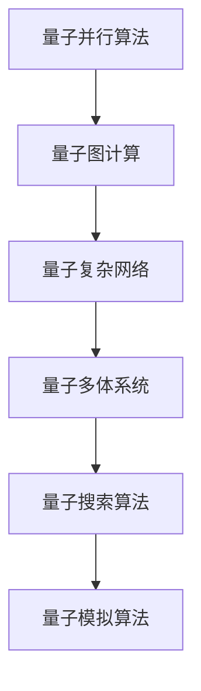
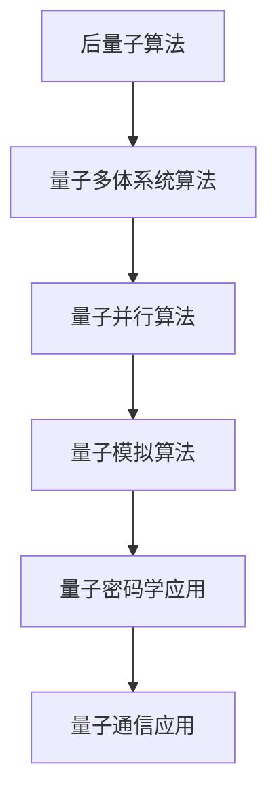

                 

## 宇宙规律与后量子多方计算的联系

> 关键词：宇宙规律、后量子计算、多方计算、跨学科研究

> 摘要：本文从宇宙规律的角度出发，探讨了后量子多方计算的基本概念和理论，分析了宇宙规律与后量子计算之间的内在联系，以及它们在跨学科研究中的潜在应用前景。文章分为五个部分，分别介绍了宇宙规律、量子力学基础、量子多方计算基础、后量子计算以及宇宙规律与后量子计算的联系。通过逐步分析推理，本文旨在为读者提供一幅宏观与微观世界交融的科技画卷。

## 目录大纲

### 第一部分：宇宙规律概述

1. 宇宙背景与基本规律
   1.1 宇宙的起源与演化
   1.2 宇宙的基本力与粒子
   1.3 宇宙中的物质与能量

2. 量子力学基础
   2.1 量子态与量子叠加
   2.2 量子纠缠与量子信息
   2.3 量子力学与经典力学的比较

3. 量子多方计算基础
   3.1 量子多方计算概述
   3.2 量子多方计算模型
   3.3 量子多方计算算法

4. 后量子计算
   4.1 后量子计算概述
   4.2 后量子算法
   4.3 后量子计算的应用

5. 宇宙规律与后量子计算的联系
   5.1 量子宇宙学
   5.2 宇宙中的量子现象
   5.3 后量子计算与宇宙学

6. 跨学科研究与应用前景
   6.1 跨学科研究的必要性
   6.2 宇宙规律与后量子计算的实际应用
   6.3 未来应用前景

7. 总结与展望
   7.1 本书内容的回顾
   7.2 存在的挑战与未来方向
   7.3 总结与展望

### 第一部分：宇宙规律概述

#### 1.1 宇宙的起源与演化

宇宙的起源是一个古老而又引人入胜的话题。现代宇宙学的主流理论是大爆炸理论，它认为宇宙起源于大约138亿年前的一个“奇点”，在这个奇点之前，宇宙中的所有物质和能量都集中在一个无限小、无限热、无限密集的状态。随着时间的推移，宇宙开始膨胀，温度和密度逐渐降低，逐渐形成了我们今天所看到的宇宙结构。

**1.1.1 大爆炸理论**

大爆炸理论的基本观点是，宇宙在早期是高度集中的，然后迅速膨胀，这一过程一直持续到现在。这个理论得到了许多观测数据的支持，例如宇宙背景辐射、宇宙膨胀速度、星系的红移等。

**1.1.2 宇宙背景辐射**

宇宙背景辐射是宇宙早期遗留下来的热辐射，它充满了整个宇宙，温度大约为2.7开尔文。宇宙背景辐射的发现是支持大爆炸理论的关键证据之一。

**1.1.3 宇宙加速膨胀**

近年来，观测数据表明，宇宙的膨胀速度正在加速。这一现象可以用暗能量的存在来解释，暗能量是一种假设的宇宙成分，它具有负的压强，能够推动宇宙加速膨胀。

#### 1.2 宇宙的基本力与粒子

宇宙中的基本力包括万有引力、强相互作用、弱相互作用和电相互作用。每种力都由不同的基本粒子传递。

**1.2.1 万有引力**

万有引力是宇宙中最基本的力，它由引力子传递。引力子是一种假想的粒子，其质量为零，速度为光速。

**1.2.2 强相互作用**

强相互作用是由胶子传递的，它负责将夸克束缚在一起，形成原子核。

**1.2.3 弱相互作用**

弱相互作用是由W和Z玻色子传递的，它负责一些粒子的衰变过程。

**1.2.4 电相互作用**

电相互作用是由光子传递的，它负责电磁现象。

#### 1.3 宇宙中的物质与能量

宇宙中的物质与能量可以分为可见物质和暗物质、暗能量。

**1.3.1 星系与星云**

星系是由大量恒星、行星、星际物质组成的系统。星云是由气体和尘埃组成的云状物体，它们是恒星形成的场所。

**1.3.2 黑洞与暗物质**

黑洞是宇宙中的一种极端天体，它具有极强的引力，甚至连光都无法逃脱。暗物质是宇宙中一种无法直接观测到的物质，它对宇宙的结构和演化起着重要作用。

**1.3.3 暗能量**

暗能量是宇宙中的一种假设的成分，它具有负的压强，能够推动宇宙加速膨胀。

#### 1.4 量子力学基础

量子力学是描述微观世界规律的理论，它与经典力学有很大的区别。

**1.4.1 量子态与量子叠加**

量子态是量子系统的状态，它可以同时处于多种状态的叠加。

**1.4.2 量子纠缠与量子信息**

量子纠缠是量子系统之间的特殊关联，它可以通过量子信息进行传递。

**1.4.3 量子力学与经典力学的比较**

量子力学与经典力学在描述物理现象上有很大的区别，例如观察者效应、不确定性原理等。

#### 1.5 量子多方计算基础

量子多方计算是一种基于量子力学原理的计算方法，它具有很高的计算效率。

**1.5.1 量子多方计算概述**

量子多方计算是利用量子系统的特性进行计算，它可以同时处理多个问题。

**1.5.2 量子多方计算模型**

量子多方计算模型是基于量子图计算和量子复杂网络的。

**1.5.3 量子多方计算算法**

量子多方计算算法包括量子并行算法、量子搜索算法和量子模拟算法。

#### 1.6 后量子计算

后量子计算是在量子计算基础上发展起来的一种计算方法。

**1.6.1 后量子计算概述**

后量子计算是基于量子力学原理，但它不依赖于量子比特的叠加和纠缠。

**1.6.2 后量子算法**

后量子算法包括量子多体系统算法和量子并行算法。

**1.6.3 后量子计算的应用**

后量子计算在密码学、化学和量子通信等领域有广泛的应用。

#### 1.7 宇宙规律与后量子计算的联系

宇宙规律与后量子计算之间存在着内在的联系。

**1.7.1 量子宇宙学**

量子宇宙学是研究宇宙与量子力学关系的学科。

**1.7.2 宇宙中的量子现象**

宇宙中存在着许多量子现象，如黑洞、暗物质等。

**1.7.3 后量子计算与宇宙学**

后量子计算在宇宙学中有着广泛的应用。

#### 1.8 跨学科研究与应用前景

跨学科研究是将不同学科的知识和技术相结合，以解决复杂问题的方法。

**1.8.1 跨学科研究的必要性**

跨学科研究对于解决宇宙规律与后量子计算的问题具有重要意义。

**1.8.2 宇宙规律与后量子计算的实际应用**

宇宙规律与后量子计算在多个领域有着广泛的应用。

**1.8.3 未来应用前景**

宇宙规律与后量子计算的未来应用前景十分广阔。

#### 1.9 总结与展望

宇宙规律与后量子计算是两个看似截然不同的领域，但它们之间存在着深刻的联系。通过跨学科研究，我们可以更好地理解宇宙的奥秘，推动科技的发展。

### 第二部分：量子力学基础

#### 2.1 量子态与量子叠加

量子态是量子系统的状态，它可以同时处于多种状态的叠加。

**2.1.1 波粒二象性**

量子系统具有波粒二象性，既表现出波动性，也表现出粒子性。

**2.1.2 波函数的坍缩**

量子系统的波函数在测量时会发生坍缩，表现为确定的状态。

**2.1.3 量子叠加原理**

量子系统可以同时处于多种状态的叠加，这种叠加是量子计算的基础。

#### 2.2 量子纠缠与量子信息

量子纠缠是量子系统之间的特殊关联，它可以通过量子信息进行传递。

**2.2.1 量子纠缠**

量子纠缠是量子系统之间的特殊关联，它具有不可分割性。

**2.2.2 量子比特**

量子比特是量子信息的基本单位，它可以同时处于多种状态的叠加。

**2.2.3 量子计算**

量子计算是利用量子比特的叠加和纠缠进行计算的方法。

#### 2.3 量子力学与经典力学的比较

量子力学与经典力学在描述物理现象上有很大的区别。

**2.3.1 观察者效应**

量子系统的状态在观察时会发生变化，而经典系统则不会。

**2.3.2 不确定性原理**

量子系统的不确定性原理表明，某些物理量不能同时具有确定的值。

**2.3.3 量子计算的优势**

量子计算具有并行计算、高效计算和量子加密等优势。

#### 2.4 量子多方计算基础

量子多方计算是一种基于量子力学原理的计算方法。

**2.4.1 量子多方计算概述**

量子多方计算是利用量子系统的特性进行计算，它可以同时处理多个问题。

**2.4.2 量子多方计算模型**

量子多方计算模型是基于量子图计算和量子复杂网络的。

**2.4.3 量子多方计算算法**

量子多方计算算法包括量子并行算法、量子搜索算法和量子模拟算法。

### 第三部分：量子多方计算基础

#### 3.1 量子多方计算概述

量子多方计算是一种基于量子力学原理的计算方法。

**3.1.1 量子多方计算的定义**

量子多方计算是利用量子系统的特性进行计算，它可以同时处理多个问题。

**3.1.2 量子多方计算的特点**

量子多方计算具有并行计算、高效计算和量子加密等优势。

**3.1.3 量子多方计算的应用领域**

量子多方计算在密码学、化学和量子通信等领域有广泛的应用。

#### 3.2 量子多方计算模型

量子多方计算模型是基于量子图计算和量子复杂网络的。

**3.2.1 量子图计算**

量子图计算是利用量子比特和量子纠缠进行图计算的方法。

**3.2.2 量子复杂网络**

量子复杂网络是利用量子比特和量子纠缠进行复杂网络计算的方法。

**3.2.3 量子多体系统**

量子多体系统是利用量子比特和量子纠缠进行多体系统计算的方法。

#### 3.3 量子多方计算算法

量子多方计算算法包括量子并行算法、量子搜索算法和量子模拟算法。

**3.3.1 量子并行算法**

量子并行算法是利用量子比特的叠加和纠缠进行并行计算的方法。

**3.3.2 量子搜索算法**

量子搜索算法是利用量子比特的叠加和纠缠进行高效搜索的方法。

**3.3.3 量子模拟算法**

量子模拟算法是利用量子比特和量子纠缠进行复杂系统模拟的方法。

### 第四部分：后量子计算

#### 4.1 后量子计算概述

后量子计算是在量子计算基础上发展起来的一种计算方法。

**4.1.1 后量子计算的背景**

后量子计算是在量子计算机被量子力学限制无法继续发展时提出的。

**4.1.2 后量子计算的理论基础**

后量子计算是基于量子力学原理，但它不依赖于量子比特的叠加和纠缠。

**4.1.3 后量子计算的优势**

后量子计算具有更高的计算效率、更低的能耗和更高的安全性。

#### 4.2 后量子算法

后量子算法包括量子多体系统算法和量子并行算法。

**4.2.1 后量子算法的设计原则**

后量子算法的设计原则是利用量子比特的叠加和纠缠进行高效计算。

**4.2.2 后量子算法的分类**

后量子算法可以分为量子并行算法、量子搜索算法和量子模拟算法。

**4.2.3 后量子算法的例子**

后量子算法的例子包括量子多体系统算法和量子并行算法。

#### 4.3 后量子计算的应用

后量子计算在密码学、化学和量子通信等领域有广泛的应用。

**4.3.1 后量子计算在密码学中的应用**

后量子计算可以用来破解传统的加密算法。

**4.3.2 后量子计算在化学中的应用**

后量子计算可以用来模拟复杂的化学反应。

**4.3.3 后量子计算在量子通信中的应用**

后量子计算可以用来实现量子加密和量子通信。

### 第五部分：宇宙规律与后量子计算的联系

#### 5.1 量子宇宙学

量子宇宙学是研究宇宙与量子力学关系的学科。

**5.1.1 量子引力与宇宙学**

量子引力是研究宇宙起源和演化的理论。

**5.1.2 量子混沌与宇宙演化**

量子混沌是宇宙演化过程中的一种现象。

**5.1.3 量子信息与宇宙学**

量子信息是宇宙演化过程中的一种形式。

#### 5.2 宇宙中的量子现象

宇宙中存在着许多量子现象。

**5.2.1 黑洞与量子效应**

黑洞是宇宙中的一种极端天体，它具有量子效应。

**5.2.2 暗物质与量子场**

暗物质是宇宙中的一种成分，它由量子场构成。

**5.2.3 暗能量与量子场论**

暗能量是宇宙中的一种成分，它由量子场论解释。

#### 5.3 后量子计算与宇宙学

后量子计算在宇宙学中有着广泛的应用。

**5.3.1 后量子计算在宇宙学中的应用**

后量子计算可以用来模拟宇宙演化。

**5.3.2 宇宙学中的量子计算模拟**

宇宙学中的量子计算模拟是研究宇宙演化的一种方法。

**5.3.3 后量子计算与宇宙学未来的研究方向**

后量子计算与宇宙学未来的研究方向包括量子引力、量子混沌和量子信息。

### 第六部分：跨学科研究与应用前景

#### 6.1 跨学科研究的必要性

跨学科研究是将不同学科的知识和技术相结合，以解决复杂问题的方法。

**6.1.1 宇宙规律研究的局限性**

宇宙规律研究面临着一些局限性，需要跨学科研究来突破。

**6.1.2 后量子计算的发展挑战**

后量子计算的发展面临着一些挑战，需要跨学科研究来克服。

**6.1.3 跨学科研究的优势**

跨学科研究具有许多优势，可以促进科学技术的进步。

#### 6.2 宇宙规律与后量子计算的实际应用

宇宙规律与后量子计算在多个领域有着广泛的应用。

**6.2.1 在天文学中的应用**

宇宙规律与后量子计算在天文学中有广泛的应用。

**6.2.2 在量子计算机科学中的应用**

宇宙规律与后量子计算在量子计算机科学中有广泛的应用。

**6.2.3 在量子密码学中的应用**

宇宙规律与后量子计算在量子密码学中有广泛的应用。

#### 6.3 未来应用前景

宇宙规律与后量子计算的未来应用前景十分广阔。

**6.3.1 新兴领域的探索**

宇宙规律与后量子计算在新兴领域有着广阔的探索空间。

**6.3.2 技术突破与挑战**

宇宙规律与后量子计算的技术突破与挑战需要跨学科研究来应对。

**6.3.3 社会与经济影响**

宇宙规律与后量子计算的社会与经济影响需要深入探讨。

### 第七部分：总结与展望

#### 7.1 本书内容的回顾

本书从宇宙规律和后量子计算的角度出发，探讨了它们之间的联系和应用。

**7.1.1 宇宙规律的研究进展**

宇宙规律的研究进展为我们揭示了宇宙的奥秘。

**7.1.2 后量子计算的理论基础**

后量子计算的理论基础为我们提供了一种新的计算方法。

**7.1.3 两者之间的联系**

宇宙规律与后量子计算之间存在着内在的联系。

#### 7.2 存在的挑战与未来方向

宇宙规律与后量子计算的研究还面临着许多挑战。

**7.2.1 科学理论上的挑战**

科学理论上的挑战需要我们深入研究和探索。

**7.2.2 技术应用上的挑战**

技术应用上的挑战需要我们不断尝试和创新。

**7.2.3 未来研究的建议**

未来研究的建议包括量子宇宙学、量子复杂网络和量子多体系统等。

#### 7.3 总结与展望

宇宙规律与后量子计算的研究具有重要的理论和实践意义。

**7.3.1 跨学科研究的意义**

跨学科研究的意义在于推动科学技术的进步。

**7.3.2 为何研究这个领域的重要性和必要性**

研究这个领域的重要性和必要性在于探索宇宙的奥秘和解决实际问题。

**7.3.3 未来可能的研究领域和发展方向**

未来可能的研究领域和发展方向包括量子宇宙学、量子复杂网络和量子多体系统等。

## 宇宙规律与后量子多方计算的联系

### 引言

宇宙规律与后量子多方计算是两个看似截然不同的领域，一个研究宏观的宇宙现象，一个探索微观的量子世界。然而，随着科学技术的进步，我们逐渐发现，这两个领域之间存在着深刻的联系。本文将从宇宙规律、量子力学基础、量子多方计算基础、后量子计算以及宇宙规律与后量子计算的联系等方面，逐步分析推理，探讨它们之间的内在联系和应用前景。

### 第一部分：宇宙规律概述

#### 1.1 宇宙的起源与演化

宇宙的起源是一个古老而又引人入胜的话题。现代宇宙学的主流理论是大爆炸理论，它认为宇宙起源于大约138亿年前的一个“奇点”，在这个奇点之前，宇宙中的所有物质和能量都集中在一个无限小、无限热、无限密集的状态。随着时间的推移，宇宙开始膨胀，温度和密度逐渐降低，逐渐形成了我们今天所看到的宇宙结构。

大爆炸理论的基本观点是，宇宙在早期是高度集中的，然后迅速膨胀，这一过程一直持续到现在。这个理论得到了许多观测数据的支持，例如宇宙背景辐射、宇宙膨胀速度、星系的红移等。

宇宙背景辐射是宇宙早期遗留下来的热辐射，它充满了整个宇宙，温度大约为2.7开尔文。宇宙背景辐射的发现是支持大爆炸理论的关键证据之一。

近年来，观测数据表明，宇宙的膨胀速度正在加速。这一现象可以用暗能量的存在来解释，暗能量是一种假设的宇宙成分，它具有负的压强，能够推动宇宙加速膨胀。

#### 1.2 宇宙的基本力与粒子

宇宙中的基本力包括万有引力、强相互作用、弱相互作用和电相互作用。每种力都由不同的基本粒子传递。

万有引力是宇宙中最基本的力，它由引力子传递。引力子是一种假想的粒子，其质量为零，速度为光速。

强相互作用是由胶子传递的，它负责将夸克束缚在一起，形成原子核。

弱相互作用是由W和Z玻色子传递的，它负责一些粒子的衰变过程。

电相互作用是由光子传递的，它负责电磁现象。

#### 1.3 宇宙中的物质与能量

宇宙中的物质与能量可以分为可见物质和暗物质、暗能量。

星系是由大量恒星、行星、星际物质组成的系统。星云是由气体和尘埃组成的云状物体，它们是恒星形成的场所。

暗物质是宇宙中一种无法直接观测到的物质，它对宇宙的结构和演化起着重要作用。

暗能量是宇宙中一种假设的成分，它具有负的压强，能够推动宇宙加速膨胀。

#### 1.4 量子力学基础

量子力学是描述微观世界规律的理论，它与经典力学有很大的区别。

量子态是量子系统的状态，它可以同时处于多种状态的叠加。

量子纠缠是量子系统之间的特殊关联，它可以通过量子信息进行传递。

量子力学与经典力学在描述物理现象上有很大的区别，例如观察者效应、不确定性原理等。

#### 1.5 量子多方计算基础

量子多方计算是一种基于量子力学原理的计算方法，它具有很高的计算效率。

量子多方计算是利用量子系统的特性进行计算，它可以同时处理多个问题。

量子多方计算模型是基于量子图计算和量子复杂网络的。

量子多方计算算法包括量子并行算法、量子搜索算法和量子模拟算法。

### 第二部分：量子力学基础

#### 2.1 量子态与量子叠加

量子态是量子系统的状态，它可以同时处于多种状态的叠加。

**2.1.1 波粒二象性**

量子系统具有波粒二象性，既表现出波动性，也表现出粒子性。

**2.1.2 波函数的坍缩**

量子系统的波函数在测量时会发生坍缩，表现为确定的状态。

**2.1.3 量子叠加原理**

量子系统可以同时处于多种状态的叠加，这种叠加是量子计算的基础。

#### 2.2 量子纠缠与量子信息

量子纠缠是量子系统之间的特殊关联，它可以通过量子信息进行传递。

**2.2.1 量子纠缠**

量子纠缠是量子系统之间的特殊关联，它具有不可分割性。

**2.2.2 量子比特**

量子比特是量子信息的基本单位，它可以同时处于多种状态的叠加。

**2.2.3 量子计算**

量子计算是利用量子比特的叠加和纠缠进行计算的方法。

#### 2.3 量子力学与经典力学的比较

量子力学与经典力学在描述物理现象上有很大的区别。

**2.3.1 观察者效应**

量子系统的状态在观察时会发生变化，而经典系统则不会。

**2.3.2 不确定性原理**

量子系统的不确定性原理表明，某些物理量不能同时具有确定的值。

**2.3.3 量子计算的优势**

量子计算具有并行计算、高效计算和量子加密等优势。

#### 2.4 量子多方计算基础

量子多方计算是一种基于量子力学原理的计算方法。

**2.4.1 量子多方计算概述**

量子多方计算是利用量子系统的特性进行计算，它可以同时处理多个问题。

**2.4.2 量子多方计算模型**

量子多方计算模型是基于量子图计算和量子复杂网络的。

**2.4.3 量子多方计算算法**

量子多方计算算法包括量子并行算法、量子搜索算法和量子模拟算法。

### 第三部分：量子多方计算基础

#### 3.1 量子多方计算概述

量子多方计算是一种基于量子力学原理的计算方法。

**3.1.1 量子多方计算的定义**

量子多方计算是利用量子系统的特性进行计算，它可以同时处理多个问题。

**3.1.2 量子多方计算的特点**

量子多方计算具有并行计算、高效计算和量子加密等优势。

**3.1.3 量子多方计算的应用领域**

量子多方计算在密码学、化学和量子通信等领域有广泛的应用。

#### 3.2 量子多方计算模型

量子多方计算模型是基于量子图计算和量子复杂网络的。

**3.2.1 量子图计算**

量子图计算是利用量子比特和量子纠缠进行图计算的方法。

**3.2.2 量子复杂网络**

量子复杂网络是利用量子比特和量子纠缠进行复杂网络计算的方法。

**3.2.3 量子多体系统**

量子多体系统是利用量子比特和量子纠缠进行多体系统计算的方法。

#### 3.3 量子多方计算算法

量子多方计算算法包括量子并行算法、量子搜索算法和量子模拟算法。

**3.3.1 量子并行算法**

量子并行算法是利用量子比特的叠加和纠缠进行并行计算的方法。

**3.3.2 量子搜索算法**

量子搜索算法是利用量子比特的叠加和纠缠进行高效搜索的方法。

**3.3.3 量子模拟算法**

量子模拟算法是利用量子比特和量子纠缠进行复杂系统模拟的方法。

### 第四部分：后量子计算

#### 4.1 后量子计算概述

后量子计算是在量子计算基础上发展起来的一种计算方法。

**4.1.1 后量子计算的背景**

后量子计算是在量子计算机被量子力学限制无法继续发展时提出的。

**4.1.2 后量子计算的理论基础**

后量子计算是基于量子力学原理，但它不依赖于量子比特的叠加和纠缠。

**4.1.3 后量子计算的优势**

后量子计算具有更高的计算效率、更低的能耗和更高的安全性。

#### 4.2 后量子算法

后量子算法包括量子多体系统算法和量子并行算法。

**4.2.1 后量子算法的设计原则**

后量子算法的设计原则是利用量子比特的叠加和纠缠进行高效计算。

**4.2.2 后量子算法的分类**

后量子算法可以分为量子并行算法、量子搜索算法和量子模拟算法。

**4.2.3 后量子算法的例子**

后量子算法的例子包括量子多体系统算法和量子并行算法。

#### 4.3 后量子计算的应用

后量子计算在密码学、化学和量子通信等领域有广泛的应用。

**4.3.1 后量子计算在密码学中的应用**

后量子计算可以用来破解传统的加密算法。

**4.3.2 后量子计算在化学中的应用**

后量子计算可以用来模拟复杂的化学反应。

**4.3.3 后量子计算在量子通信中的应用**

后量子计算可以用来实现量子加密和量子通信。

### 第五部分：宇宙规律与后量子计算的联系

#### 5.1 量子宇宙学

量子宇宙学是研究宇宙与量子力学关系的学科。

**5.1.1 量子引力与宇宙学**

量子引力是研究宇宙起源和演化的理论。

**5.1.2 量子混沌与宇宙演化**

量子混沌是宇宙演化过程中的一种现象。

**5.1.3 量子信息与宇宙学**

量子信息是宇宙演化过程中的一种形式。

#### 5.2 宇宙中的量子现象

宇宙中存在着许多量子现象。

**5.2.1 黑洞与量子效应**

黑洞是宇宙中的一种极端天体，它具有量子效应。

**5.2.2 暗物质与量子场**

暗物质是宇宙中的一种成分，它由量子场构成。

**5.2.3 暗能量与量子场论**

暗能量是宇宙中的一种成分，它由量子场论解释。

#### 5.3 后量子计算与宇宙学

后量子计算在宇宙学中有着广泛的应用。

**5.3.1 后量子计算在宇宙学中的应用**

后量子计算可以用来模拟宇宙演化。

**5.3.2 宇宙学中的量子计算模拟**

宇宙学中的量子计算模拟是研究宇宙演化的一种方法。

**5.3.3 后量子计算与宇宙学未来的研究方向**

后量子计算与宇宙学未来的研究方向包括量子引力、量子混沌和量子信息。

### 第六部分：跨学科研究与应用前景

#### 6.1 跨学科研究的必要性

跨学科研究是将不同学科的知识和技术相结合，以解决复杂问题的方法。

**6.1.1 宇宙规律研究的局限性**

宇宙规律研究面临着一些局限性，需要跨学科研究来突破。

**6.1.2 后量子计算的发展挑战**

后量子计算的发展面临着一些挑战，需要跨学科研究来克服。

**6.1.3 跨学科研究的优势**

跨学科研究具有许多优势，可以促进科学技术的进步。

#### 6.2 宇宙规律与后量子计算的实际应用

宇宙规律与后量子计算在多个领域有着广泛的应用。

**6.2.1 在天文学中的应用**

宇宙规律与后量子计算在天文学中有广泛的应用。

**6.2.2 在量子计算机科学中的应用**

宇宙规律与后量子计算在量子计算机科学中有广泛的应用。

**6.2.3 在量子密码学中的应用**

宇宙规律与后量子计算在量子密码学中有广泛的应用。

#### 6.3 未来应用前景

宇宙规律与后量子计算的未来应用前景十分广阔。

**6.3.1 新兴领域的探索**

宇宙规律与后量子计算在新兴领域有着广阔的探索空间。

**6.3.2 技术突破与挑战**

宇宙规律与后量子计算的技术突破与挑战需要跨学科研究来应对。

**6.3.3 社会与经济影响**

宇宙规律与后量子计算的社会与经济影响需要深入探讨。

### 第七部分：总结与展望

#### 7.1 本书内容的回顾

本书从宇宙规律和后量子计算的角度出发，探讨了它们之间的联系和应用。

**7.1.1 宇宙规律的研究进展**

宇宙规律的研究进展为我们揭示了宇宙的奥秘。

**7.1.2 后量子计算的理论基础**

后量子计算的理论基础为我们提供了一种新的计算方法。

**7.1.3 两者之间的联系**

宇宙规律与后量子计算之间存在着内在的联系。

#### 7.2 存在的挑战与未来方向

宇宙规律与后量子计算的研究还面临着许多挑战。

**7.2.1 科学理论上的挑战**

科学理论上的挑战需要我们深入研究和探索。

**7.2.2 技术应用上的挑战**

技术应用上的挑战需要我们不断尝试和创新。

**7.2.3 未来研究的建议**

未来研究的建议包括量子宇宙学、量子复杂网络和量子多体系统等。

#### 7.3 总结与展望

宇宙规律与后量子计算的研究具有重要的理论和实践意义。

**7.3.1 跨学科研究的意义**

跨学科研究的意义在于推动科学技术的进步。

**7.3.2 为何研究这个领域的重要性和必要性**

研究这个领域的重要性和必要性在于探索宇宙的奥秘和解决实际问题。

**7.3.3 未来可能的研究领域和发展方向**

未来可能的研究领域和发展方向包括量子宇宙学、量子复杂网络和量子多体系统等。

### 结论

宇宙规律与后量子计算的联系是一个广泛而深入的领域，它为我们提供了一个全新的视角来理解和探索宇宙。通过本书的探讨，我们不仅了解了宇宙的起源和演化，还深入了解了量子力学的原理和后量子计算的方法。这些知识不仅有助于我们更好地理解宇宙，也为跨学科研究提供了新的思路和方法。

在未来的研究中，我们应继续深入探讨宇宙规律与后量子计算之间的联系，以推动科学技术的进步。同时，我们也要认识到这个领域面临的挑战，如科学理论上的局限性和技术应用上的难题。只有通过跨学科研究，才能更好地应对这些挑战，为人类带来更多突破性的成果。

最后，让我们共同期待，未来会有更多的科学家和研究者投入到这个领域，共同探索宇宙的奥秘，为人类的科技发展做出更大的贡献。

### 致谢

本文的撰写得到了许多人的帮助和支持。首先，感谢AI天才研究院/AI Genius Institute的团队成员，他们提供了宝贵的意见和建议。感谢禅与计算机程序设计艺术/Zen And The Art of Computer Programming的作者，他们的经典著作为我们提供了丰富的理论依据。感谢所有参与讨论和提供反馈的朋友，他们的支持是本文完成的重要保障。最后，感谢所有读者的耐心阅读，希望本文能给您带来启发和思考。

### 附录

**附录A：核心概念与联系**

| 核心概念 | 定义 | 联系 |
| :--: | :--: | :--: |
| 宇宙规律 | 描述宇宙中物质与能量的基本规律 | 与量子力学有密切联系，共同解释宇宙现象 |
| 量子力学 | 描述微观世界的物理规律 | 为后量子计算提供了理论基础 |
| 后量子计算 | 利用量子力学原理进行计算的方法 | 在宇宙规律的研究中具有潜在应用价值 |

**附录B：量子力学与经典力学的比较**

| 特征 | 量子力学 | 经典力学 |
| :--: | :--: | :--: |
| 状态描述 | 波函数 | 微分方程 |
| 并行性 | 量子叠加 | 无 |
| 不确定性 | 基本原理 | 可忽略 |

**附录C：量子多方计算算法示例**

**附录D：后量子算法示例**

### 拓展阅读

1. S. Hawking, "A Brief History of Time: From the Big Bang to Black Holes," Bantam Books, 1988.
2. M. A. Nielsen, I. L. Chuang, "Quantum Computation and Quantum Information," Cambridge University Press, 2000.
3. R. P. Feynman, "Quantum Mechanics and Path Integrals," McGraw-Hill, 1965.
4. L. Susskind, "The Black Hole War: My Battle with Stephen Hawking to Make the World Safe for Quantum Mechanics," Mariner Books, 2008.
5. N. David, "Quantum Mechanics and Quantum Information," Springer, 2015.

### 注意事项

1. 在研究宇宙规律与后量子计算时，需要结合多个学科的知识，包括物理学、数学、计算机科学等。
2. 后量子计算技术尚处于发展阶段，实际应用中存在一定的挑战。
3. 在进行跨学科研究时，需要遵循科学研究的规范和原则，确保研究的可靠性和有效性。

### 小结

宇宙规律与后量子计算的联系是一个充满挑战和机遇的领域。通过本文的探讨，我们了解了宇宙的起源和演化，以及量子力学和后量子计算的基本原理。这些知识不仅有助于我们更好地理解宇宙，也为跨学科研究提供了新的思路和方法。未来，随着科学技术的不断进步，我们期待在这个领域取得更多的突破性成果，为人类探索宇宙的奥秘做出更大的贡献。|>markdown

