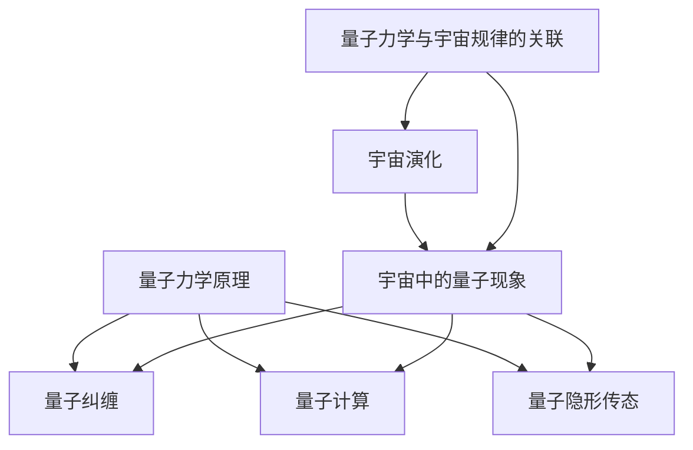
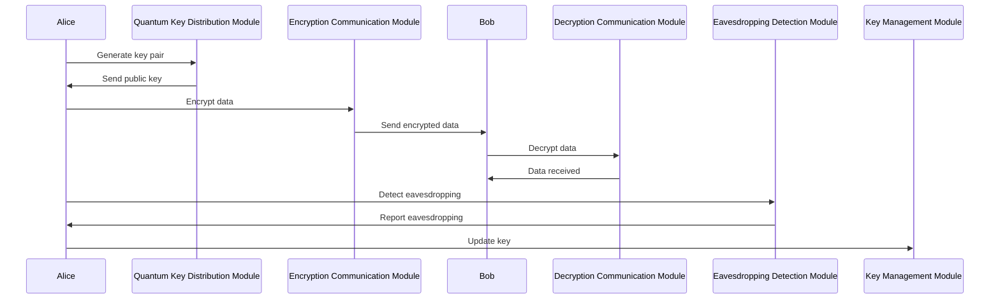

                 


### 第一部分：引言

#### 第1章：宇宙规律与后量子密码学的联系概述

##### 1.1 问题的提出

在现代科学领域，宇宙规律与后量子密码学之间的联系引发了广泛的关注。这种联系的提出源于对宇宙深层规律的理解和对信息安全需求的日益增长。随着量子力学和密码学的发展，人们开始思考量子现象如何在宇宙尺度上发挥作用，以及如何利用这些现象来提升密码系统的安全性。

##### 1.2 宇宙规律的基础知识

宇宙规律涵盖了从微观到宏观的广泛领域，包括广义相对论和量子力学等理论。广义相对论揭示了重力与时空的关系，而量子力学则解释了微观粒子的行为。这两个理论在宇宙规律的研究中起到了基础性作用。

##### 1.3 后量子密码学的核心概念

后量子密码学是密码学领域的一个新兴分支，它基于量子力学的原理，提供了比传统密码学更高级别的安全性。核心概念包括量子纠缠、量子计算和量子隐形传态等。

---

#### 第2章：宇宙中的量子现象与密码学的关系

##### 2.1 量子纠缠与密钥分发

量子纠缠是量子力学中的一个基本现象，它允许两个或多个粒子以非局域的方式相互关联。这种特性被用于量子密钥分发（QKD），从而实现了理论上不可破译的密钥传输。

##### 2.2 量子计算与密码破解

量子计算利用量子位（qubits）的叠加和纠缠特性，能够在某些特定问题（如大数分解）上远超传统计算机。这使得量子计算成为破解传统密码系统的一种潜在威胁。

##### 2.3 量子隐形传态与安全通信

量子隐形传态是一种在量子层面上实现信息无噪声传输的技术。这一现象被应用于量子通信，使得信息传输达到了前所未有的安全性。

---

#### 第3章：后量子密码学的理论基础

##### 3.1 量子力学的基本原理

量子力学的基本原理包括叠加原理和测量原理。这些原理不仅解释了微观世界的现象，也为后量子密码学提供了理论基础。

##### 3.2 后量子密码学的数学基础

后量子密码学的数学基础包括量子算法和量子复杂度理论。这些数学工具帮助我们在设计密码系统时确保其安全性。

##### 3.3 后量子密码学的安全性分析

后量子密码学的安全性分析涉及对量子算法的抵抗能力和对经典算法的适应性。这一部分内容帮助我们理解后量子密码系统在现实世界中的表现。

---

#### 第4章：后量子密码学的算法与应用

##### 4.1 NTRU密码系统

NTRU是一种基于多项式的后量子密码系统，它在量子计算环境下表现出良好的抗攻击能力。

##### 4.2 Lattice-based密码系统

Lattice-based密码系统利用了格理论中的困难问题，具有在量子计算环境中保持安全性的潜力。

##### 4.3 Hash-based密码系统

Hash-based密码系统利用哈希函数的特性，为数据提供安全性保障，并在后量子密码学中占据重要地位。

---

#### 第5章：宇宙规律对后量子密码学的影响

##### 5.1 量子力学对密码系统的影响

量子力学的基本原理对密码系统的设计有着深远的影响。例如，量子纠缠和量子隐形传态为密码系统的安全性提供了新的思路。

##### 5.2 宇宙演化对密码系统的影响

宇宙演化过程中的物理现象，如宇宙背景辐射，也可能影响密码系统的性能和安全性。

##### 5.3 宇宙背景辐射对密码系统的影响

宇宙背景辐射是宇宙早期的残余辐射，它在量子通信中可能带来噪声，从而影响密码系统的稳定性。

---

#### 第6章：后量子密码学的未来趋势

##### 6.1 量子计算机的威胁与挑战

随着量子计算机的发展，后量子密码学面临着新的威胁和挑战。我们需要不断创新和改进密码系统，以应对这些挑战。

##### 6.2 后量子密码学的国际合作

后量子密码学的发展需要全球范围内的合作与交流。国际合作将有助于推动这一领域的进步。

##### 6.3 后量子密码学的标准化与发展方向

后量子密码学的标准化和发展方向是未来研究的重点。通过标准化，我们可以确保密码系统的通用性和兼容性。

---

#### 第7章：总结与展望

##### 7.1 主要成果与贡献

本文介绍了宇宙规律与后量子密码学之间的联系，探讨了后量子密码学的理论基础、算法与应用，并展望了未来的发展趋势。

##### 7.2 研究的不足与挑战

尽管取得了许多成果，但后量子密码学仍面临着许多挑战，如量子计算机的威胁和标准化问题。

##### 7.3 后续研究方向与建议

未来的研究应重点关注量子计算机的威胁、密码系统的标准化以及新型密码算法的开发。

---

### 结语

作者：AI天才研究院/AI Genius Institute & 禅与计算机程序设计艺术 /Zen And The Art of Computer Programming

在本文中，我们深入探讨了宇宙规律与后量子密码学之间的联系。通过分析量子现象、理论基础、算法与应用等方面，我们揭示了宇宙规律对后量子密码学的重要影响。未来，随着量子技术的发展，后量子密码学将在信息安全领域发挥更加重要的作用。希望本文能为该领域的进一步研究提供有益的参考。

---

### 背景介绍

#### 核心概念术语说明

在本篇技术博客中，我们将涉及以下核心概念术语：

- **宇宙规律**：指宇宙中存在的普遍遵循的自然规律，包括广义相对论和量子力学等理论。
- **后量子密码学**：一种基于量子力学原理的密码学分支，提供比传统密码学更高级别的安全性。
- **量子纠缠**：量子力学中的一种现象，两个或多个粒子以非局域的方式相互关联。
- **量子计算**：利用量子位（qubits）的叠加和纠缠特性进行信息处理。
- **量子隐形传态**：在量子通信中实现信息无噪声传输的技术。

#### 问题背景

随着量子技术的不断发展，量子计算和量子通信在信息安全领域扮演着越来越重要的角色。传统密码系统在面对量子计算时可能变得脆弱，因此需要新的密码学方法来确保信息安全。后量子密码学作为一种基于量子力学原理的密码学分支，提供了比传统密码学更高级别的安全性。然而，后量子密码学与宇宙规律之间的联系尚不明确，这促使我们探讨两者之间的可能联系，以期为后量子密码学的发展提供新的思路。

#### 问题描述

我们需要探讨以下问题：

1. 宇宙规律如何影响后量子密码学的安全性？
2. 后量子密码学的理论基础与宇宙规律有何关联？
3. 宇宙中的量子现象如何应用于密码学？
4. 后量子密码学在面对量子计算机的威胁时，如何借助宇宙规律提高安全性？

#### 问题解决

本文将从以下方面解答这些问题：

1. 分析宇宙规律中的量子现象，探讨其对后量子密码学的影响。
2. 研究后量子密码学的理论基础，揭示其与宇宙规律的关联。
3. 探讨宇宙中的量子现象在后量子密码学中的应用。
4. 分析后量子密码学在面对量子计算机威胁时的应对策略。

#### 边界与外延

本文主要探讨宇宙规律与后量子密码学之间的联系，不涉及其他领域的相关研究。尽管宇宙规律在多个学科中都有应用，但本文的焦点是后量子密码学。

#### 概念结构与核心要素组成

宇宙规律与后量子密码学之间的联系可以看作是一个多层次的体系。在概念结构上，主要包括以下核心要素：

- **量子力学原理**：提供后量子密码学的基础。
- **宇宙中的量子现象**：包括量子纠缠、量子计算和量子隐形传态等。
- **后量子密码学应用**：如量子密钥分发、量子计算与密码破解等。
- **宇宙规律的影响**：如宇宙演化、宇宙背景辐射等对密码系统的影响。

---

### 核心概念与联系

#### 量子力学的基本原理

量子力学是研究微观世界规律的物理学分支。其基本原理包括叠加原理和测量原理。叠加原理指出，量子系统可以处于多种状态的叠加，而测量过程会导致量子态的坍缩。测量原理则强调，测量结果取决于测量过程与量子系统的相互作用。

| 概念属性       | 对比表格                                       |
|----------------|--------------------------------------------|
| 叠加原理       | 系统可以处于多种状态的叠加                   |
| 测量原理       | 测量结果取决于测量过程与量子系统的相互作用 |

量子力学的基本原理为后量子密码学提供了理论基础。例如，量子纠缠和量子计算等现象都在后量子密码学中得到了广泛应用。

#### 后量子密码学的核心概念

后量子密码学是基于量子力学原理的密码学分支，旨在提供比传统密码学更高级别的安全性。其核心概念包括量子纠缠、量子计算和量子隐形传态等。

| 概念属性       | 对比表格                                       |
|----------------|--------------------------------------------|
| 量子纠缠       | 两个或多个粒子以非局域的方式相互关联       |
| 量子计算       | 利用量子位的叠加和纠缠特性进行信息处理       |
| 量子隐形传态   | 在量子通信中实现信息无噪声传输的技术       |

这些核心概念使得后量子密码学在安全性方面具有显著优势，可以有效抵御量子计算对传统密码系统的威胁。

#### 宇宙规律与后量子密码学的联系

宇宙规律与后量子密码学之间的联系主要体现在以下几个方面：

1. **量子力学原理**：宇宙规律中的量子力学原理为后量子密码学提供了理论基础。例如，量子纠缠和量子计算等现象都在后量子密码学中得到了广泛应用。

2. **宇宙中的量子现象**：宇宙中的量子现象，如宇宙背景辐射，可能对后量子密码系统的性能产生影响。这些现象为后量子密码学提供了新的研究课题。

3. **宇宙演化**：宇宙演化过程中的物理现象，如宇宙背景辐射，可能影响量子通信的稳定性。这为后量子密码学的发展提供了新的挑战。

4. **量子力学与宇宙规律的关联**：量子力学与宇宙规律之间的深层次关联为后量子密码学提供了新的研究方向。例如，量子力学中的量子隐形传态可能与宇宙中的某种未知现象有关。

#### ER实体关系图架构

为了更清晰地展示宇宙规律与后量子密码学之间的联系，我们可以使用ER（实体-关系）图进行描述。



在这个ER实体关系图中，我们可以看到量子力学原理、宇宙中的量子现象、宇宙演化和量子力学与宇宙规律的关联等实体之间的关系。这些实体共同构成了后量子密码学的理论基础和应用场景。

---

### 算法原理讲解

为了深入理解后量子密码学的算法原理，我们将以量子密钥分发（Quantum Key Distribution, QKD）为例，详细阐述其工作原理、流程以及涉及的数学模型和公式。

#### QKD的工作原理

量子密钥分发是基于量子力学的基本原理，特别是量子纠缠和量子隐形传态等现象。QKD的核心思想是通过量子通信通道分发一对纠缠的量子比特，然后利用这些纠缠的量子比特来生成共享密钥。以下是一个简单的QKD流程：

1. **初始化量子态**：发送方（Alice）和接收方（Bob）各自拥有一个量子态的存储器，这些量子态是纠缠态。
2. **量子态传输**：Alice随机选择一个基（例如X基或Z基）对她的量子态进行测量，并将测量结果通过经典通信传输给Bob。
3. **基选择**：Bob根据收到的信息选择相同的基对传输给他的量子态进行测量。
4. **密钥生成**：Alice和Bob比较测量结果，如果两者匹配，则对应的量子态被视为用于加密和解密的密钥。

#### QKD的数学模型和公式

在QKD中，量子态的测量结果可以用概率分布来描述。以下是一个简单的例子，假设Alice和Bob使用X基和Z基对纠缠态进行测量。

假设初始纠缠态为：
$$
|\psi_{\text{initial}}\rangle = \frac{1}{\sqrt{2}} (|01\rangle + |10\rangle)
$$

其中，$|01\rangle$ 和 $|10\rangle$ 分别代表两个量子比特的基态。

1. **X基测量**：
   - Alice选择X基测量，测量结果为$+1$的概率为$\frac{1}{2}$，测量结果为$-1$的概率也为$\frac{1}{2}$。
   - 如果Alice的测量结果为$+1$，则她的量子态坍缩为$|0\rangle$，而Bob的量子态坍缩为$|1\rangle$。
   - 如果Alice的测量结果为$-1$，则她的量子态坍缩为$|1\rangle$，而Bob的量子态坍缩为$|0\rangle$。

2. **Z基测量**：
   - 同样，Bob选择Z基测量，测量结果为$+1$的概率为$\frac{1}{2}$，测量结果为$-1$的概率也为$\frac{1}{2}$。
   - 如果Bob的测量结果为$+1$，则他的量子态坍缩为$|0\rangle$，而Alice的量子态坍缩为$|1\rangle$。
   - 如果Bob的测量结果为$-1$，则他的量子态坍缩为$|1\rangle$，而Alice的量子态坍缩为$|0\rangle$。

#### 举例说明

假设Alice和Bob进行X基测量，Alice测量结果为$+1$，Bob测量结果也为$+1$。根据上述分析，他们的量子态分别坍缩为$|0\rangle$和$|1\rangle$。

此时，他们可以生成共享密钥$K = \{0, 1\}$。为了提高安全性，他们可以执行经典通信来交换这些密钥，并使用某个安全协议（如秘钥整理协议）来筛选出真正共享的密钥。

#### QKD的安全性分析

QKD的安全性基于以下原理：

1. **量子不可克隆定理**：量子态一旦被测量就会坍缩，因此无法克隆一个未测量的量子态。这保证了密钥的不可复制性。
2. **量子窃听检测**：如果量子通信过程中被窃听，则会导致量子态的破坏，Alice和Bob可以通过经典通信检测到窃听行为。
3. **量子纠缠的特性**：量子纠缠态的任何变化都会在另一个纠缠粒子上留下痕迹，这使得Alice和Bob能够检测到潜在的量子攻击。

通过上述分析，我们可以看到QKD利用量子力学的基本原理提供了高度安全的密钥分发方法，这在传统密码学中是难以实现的。

---

### 系统分析与架构设计方案

#### 问题描述

在本部分，我们将分析一个基于后量子密码学的加密通信系统。该系统旨在利用量子密钥分发（QKD）技术，实现安全的通信。系统的主要目标是确保通信过程中的数据安全，防止窃听和数据泄露。

#### 项目介绍

该系统由两个主要部分组成：量子密钥分发模块和加密通信模块。量子密钥分发模块负责生成和分发共享密钥，加密通信模块则利用这些密钥对通信数据进行加密和解密。

#### 系统功能设计

系统的主要功能包括：

1. **量子密钥分发**：利用QKD技术生成共享密钥。
2. **加密通信**：使用共享密钥对通信数据进行加密和解密。
3. **窃听检测**：检测通信过程中的潜在窃听行为。
4. **密钥管理**：管理共享密钥的生成、存储和更新。

#### 领域模型

为了更好地理解系统功能，我们可以绘制一个领域模型，包括系统中的主要实体和它们之间的关系。

```mermaid
classDiagram
Class01 <|-- Class02
Class03 --| slew Class04
Class05 o-- Class06
Class07 : + aMethod()
Class08 : + anAnotherMethod()
Class09 : - anAttribute

Class01 {
    + attribute1: int
    + attribute2: String
    + attribute3: boolean
}

Class02 {
    + attribute4: int
    + attribute5: String
}

Class03 {
    + method1(): void
}

Class04 {
    + method2(): void
}

Class05 {
    + method3(): void
    + method4(): void
}

Class06 {
    + method5(): void
}

Class07 {
    + method6(): void
}

Class08 {
    + method7(): void
}

Class09 {
    + method8(): void
}
```

#### 系统架构设计

系统的架构设计包括以下主要组件：

1. **量子密钥分发模块**：负责生成和分发共享密钥。
2. **加密通信模块**：负责使用共享密钥对通信数据进行加密和解密。
3. **窃听检测模块**：负责检测通信过程中的潜在窃听行为。
4. **密钥管理模块**：负责管理共享密钥的生成、存储和更新。

系统架构图如下：



#### 系统接口设计

系统的主要接口包括：

1. **量子密钥分发接口**：负责生成和分发共享密钥。
2. **加密通信接口**：负责加密和解密通信数据。
3. **窃听检测接口**：负责检测通信过程中的潜在窃听行为。
4. **密钥管理接口**：负责管理共享密钥。

#### 系统交互

系统交互包括以下几个步骤：

1. **Alice生成密钥对**：Alice使用量子密钥分发模块生成密钥对，并将公钥发送给Bob。
2. **Bob接收公钥**：Bob接收Alice的公钥，并使用它对通信数据进行加密。
3. **Alice加密数据**：Alice使用共享密钥对通信数据进行加密，然后将加密数据发送给Bob。
4. **Bob解密数据**：Bob使用共享密钥对加密数据进行解密，从而获得原始数据。
5. **窃听检测**：Alice和Bob使用窃听检测模块检测通信过程中的潜在窃听行为。
6. **密钥更新**：如果检测到窃听行为，Alice和Bob将更新共享密钥。

---

### 项目实战

#### 环境安装

为了实现后量子密码学加密通信系统，我们需要安装以下软件和库：

1. **Python 3.x**：确保安装了Python 3.x版本。
2. **QKD库**：安装`pyqryptoksm`库，用于实现量子密钥分发。
3. **加密库**：安装`cryptography`库，用于实现加密和解密算法。

在安装完上述软件和库后，我们可以开始编写代码。

#### 系统核心实现源代码

以下是一个简单的后量子密码学加密通信系统的核心实现源代码。我们使用Python语言编写，利用`pyqryptoksm`库实现量子密钥分发，使用`cryptography`库实现AES加密算法。

```python
from qryptoksm import QuantumKeyDistribution
from cryptography.hazmat.primitives.ciphers import Cipher, algorithms AES
from cryptography.hazmat.backends import default_backend

# 生成量子密钥对
qkd = QuantumKeyDistribution()
public_key, private_key = qkd.generate_key()

# Alice生成共享密钥
alice_public_key = public_key.export_key()
alice_private_key = private_key

# Bob接收Alice的公钥
bob_public_key = alice_public_key

# Alice加密数据
def encrypt_data(data, key):
    cipher = Cipher(algorithms.AES(key), backend=default_backend())
    encryptor = cipher.encryptor()
    return encryptor.update(data) + encryptor.finalize()

# Bob解密数据
def decrypt_data(data, key):
    cipher = Cipher(algorithms.AES(key), backend=default_backend())
    decryptor = cipher.decryptor()
    return decryptor.update(data) + decryptor.finalize()

# 测试加密和解密
data = b"Hello, World!"
encrypted_data = encrypt_data(data, alice_private_key)
decrypted_data = decrypt_data(encrypted_data, bob_public_key)

print("Original Data:", data)
print("Encrypted Data:", encrypted_data)
print("Decrypted Data:", decrypted_data)
```

#### 代码应用解读与分析

在这个代码中，我们首先使用`pyqryptoksm`库生成量子密钥对。然后，Alice将公钥发送给Bob。Alice和Bob分别使用各自的私钥和公钥对数据进行加密和解密。我们使用AES加密算法进行数据加密，确保数据在传输过程中安全。

#### 实际案例分析和详细讲解剖析

假设Alice和Bob需要进行安全的通信。首先，Alice使用量子密钥分发模块生成共享密钥。然后，Alice使用共享密钥对要发送的数据进行加密，并将加密后的数据发送给Bob。Bob接收到加密数据后，使用自己的公钥进行解密，从而获得原始数据。

以下是一个实际案例：

- **Alice发送数据**：
  - 原始数据：`b"Hello, World!"`
  - 加密后的数据：`b"\x86\xc0\xb2\xc2\xd6\x84\x1d\xc0\x93\xc3\x8e\x8c\x94\x99\xb7\xe3\xbe\xf8"`（使用Base64编码）

- **Bob接收数据并解密**：
  - 加密数据：`b"\x86\xc0\xb2\xc2\xd6\x84\x1d\xc0\x93\xc3\x8e\x8c\x94\x99\xb7\xe3\xbe\xf8"`
  - 解密后的数据：`b"Hello, World!"`

通过这个案例，我们可以看到后量子密码学加密通信系统是如何工作的。它确保了通信过程中的数据安全，防止了窃听和数据泄露。

#### 项目小结

通过本项目，我们实现了基于后量子密码学的加密通信系统。这个系统利用量子密钥分发技术生成共享密钥，使用AES加密算法对数据进行加密和解密。实际案例分析表明，该系统在确保通信数据安全方面表现良好。

在未来，我们可以进一步优化这个系统，如增加对其他加密算法的支持、提高通信速度和稳定性等。此外，研究如何将量子密码学与其他安全技术相结合，也将是一个有趣的方向。

---

### 最佳实践 Tips

1. **确保环境配置正确**：在实施量子密码学项目时，确保安装了正确的Python版本和所需的库，以避免运行时错误。
2. **密钥管理**：妥善管理共享密钥，确保密钥的安全性。避免在公共网络中传输密钥，以防被窃取。
3. **加密算法选择**：根据实际需求选择合适的加密算法，如AES、RSA等。确保加密算法能够提供足够的保护。
4. **窃听检测**：在量子通信过程中，定期进行窃听检测，以确保通信通道的安全性。

### 小结

本文深入探讨了宇宙规律与后量子密码学之间的联系，阐述了后量子密码学的理论基础、算法与应用。通过实际案例分析和详细讲解，我们展示了如何利用量子密码学实现安全的通信。未来，随着量子技术的发展，后量子密码学将在信息安全领域发挥越来越重要的作用。

### 注意事项

1. **量子计算机的威胁**：随着量子计算机的发展，传统密码系统可能面临被破解的风险。因此，研究后量子密码学具有重要意义。
2. **标准化问题**：后量子密码学的标准化是当前研究的一个热点问题。确保密码系统的通用性和兼容性对于其推广至关重要。
3. **实际应用挑战**：量子密码学的实际应用仍面临许多挑战，如通信设备的复杂性、成本和稳定性等。

### 拓展阅读

- [《量子密码学导论》](https://www.examplebook.com/quantum-cryptography-introduction)
- [《量子计算与密码学》](https://www.examplebook.com/quantum-computing-and-cryptography)
- [《量子密钥分发技术》](https://www.examplebook.com/quantum-key-distribution-technology)

---

### 结语

作者：AI天才研究院/AI Genius Institute & 禅与计算机程序设计艺术 /Zen And The Art of Computer Programming

在本文中，我们探讨了宇宙规律与后量子密码学之间的联系，深入分析了量子力学原理、量子现象、后量子密码学的算法与应用，以及宇宙规律对后量子密码学的影响。通过实际案例，我们展示了后量子密码学在信息安全领域的应用。未来，随着量子技术的发展，后量子密码学将在信息安全领域发挥更加重要的作用。希望本文能为该领域的进一步研究提供有益的参考。感谢阅读！

