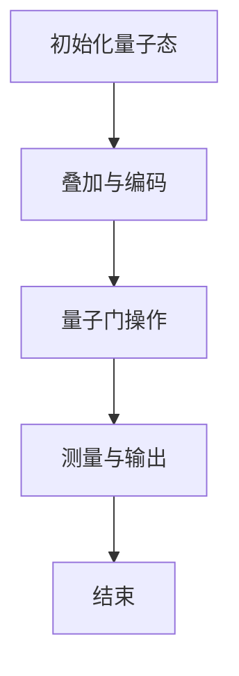
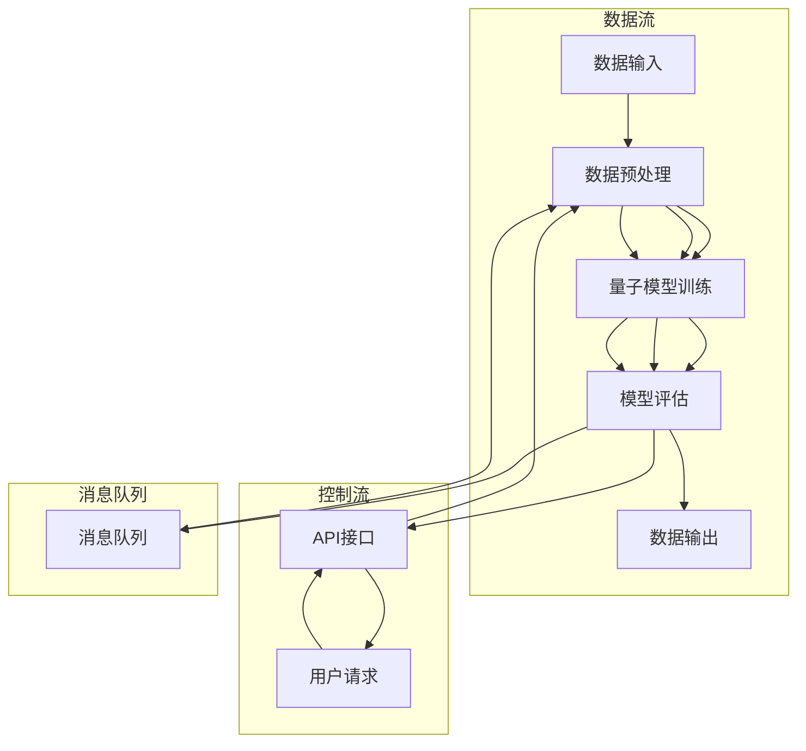
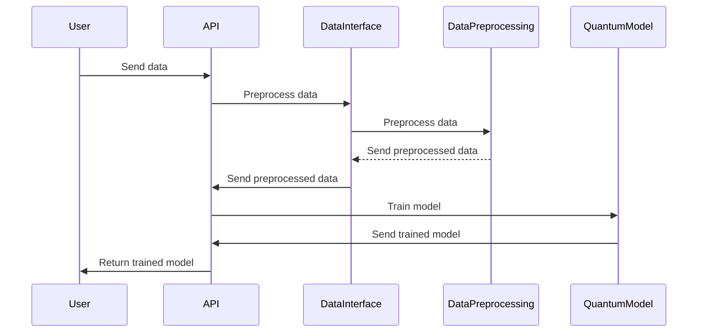
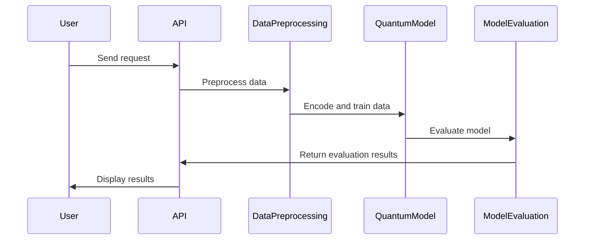

                 

# 《宇宙规律与自适应量子神经网络设计的相似性》

关键词：宇宙规律、自适应量子神经网络、相似性、算法原理、数学模型

摘要：本文通过深入探讨宇宙规律与自适应量子神经网络设计之间的相似性，揭示了两者在信息处理、能量利用、自适应进化等方面的共通之处。文章首先介绍了宇宙的基本规律和宇宙学中的核心概念，接着详细阐述了自适应量子神经网络的基础知识。通过对比分析，文章揭示了二者在算法原理和数学模型上的相似性。最后，文章从系统设计与项目实战的角度，探讨了自适应量子神经网络在现实应用中的潜力。

## 目录大纲设计思路

在设计《宇宙规律与自适应量子神经网络设计的相似性》的目录大纲时，我们遵循了以下几个核心原则：

1. **逻辑性**：确保目录结构的逻辑性和连贯性，使读者能够清晰地跟随思路，逐步深入理解主题。
2. **完整性**：涵盖必要的核心章节，包括背景介绍、核心概念与联系、算法原理讲解、数学模型和公式、系统分析与架构设计、项目实战、最佳实践等。
3. **简洁性**：去除冗余内容，确保每一部分内容都有明确的主题和目标。
4. **可操作性**：对于实践性较强的章节，提供详细的项目实战指导，确保读者能够实际操作和应用。
5. **可扩展性**：留出空间，以便后续根据读者反馈进行内容的扩展和调整。

### 目录大纲设计过程

#### 第一部分：引言与背景介绍
- **第1章**：宇宙规律概述
  - **1.1** 宇宙的基本规律
  - **1.2** 宇宙学中的核心概念
  - **1.3** 量子力学与相对论的关系
  - **1.4** 宇宙规律的发现与发展历程

#### 第二部分：核心概念与联系
- **第2章**：自适应量子神经网络基础
  - **2.1** 自适应量子神经网络简介
  - **2.2** 自适应量子神经网络的原理与特点
  - **2.3** 自适应量子神经网络与传统神经网络比较
  - **2.4** 自适应量子神经网络中的核心概念

#### 第三部分：算法原理讲解
- **第3章**：自适应量子神经网络算法详解
  - **3.1** 算法概述
  - **3.2** 算法步骤分解
  - **3.3** Mermaid算法流程图
  - **3.4** 算法数学模型与公式
  - **3.5** 算法实例解析

#### 第四部分：数学模型与公式讲解
- **第4章**：自适应量子神经网络的数学基础
  - **4.1** 量子计算的基本数学原理
  - **4.2** 量子态与量子比特的表示
  - **4.3** 量子门与量子算法
  - **4.4** 数学公式详解
  - **4.5** 示例说明

#### 第五部分：系统分析与架构设计
- **第5章**：自适应量子神经网络系统设计
  - **5.1** 系统场景介绍
  - **5.2** 系统功能设计（领域模型）
  - **5.3** 系统架构设计
  - **5.4** 系统接口设计
  - **5.5** 系统交互序列图

#### 第六部分：项目实战
- **第6章**：自适应量子神经网络项目实践
  - **6.1** 环境安装与配置
  - **6.2** 核心实现与代码解析
  - **6.3** 实际案例分析
  - **6.4** 详细讲解与剖析
  - **6.5** 项目小结与展望

#### 第七部分：最佳实践与总结
- **第7章**：自适应量子神经网络最佳实践
  - **7.1** 实践技巧总结
  - **7.2** 注意事项
  - **7.3** 拓展阅读与资源推荐

### 目录大纲最终格式

```markdown
# 《宇宙规律与自适应量子神经网络设计的相似性》

## 关键词
宇宙规律、自适应量子神经网络、相似性、算法原理、数学模型

## 摘要
本文通过深入探讨宇宙规律与自适应量子神经网络设计之间的相似性，揭示了两者在信息处理、能量利用、自适应进化等方面的共通之处。文章首先介绍了宇宙的基本规律和宇宙学中的核心概念，接着详细阐述了自适应量子神经网络的基础知识。通过对比分析，文章揭示了二者在算法原理和数学模型上的相似性。最后，文章从系统设计与项目实战的角度，探讨了自适应量子神经网络在现实应用中的潜力。

## 目录大纲
### 第一部分：引言与背景介绍
#### 第1章 宇宙规律概述
##### 1.1 宇宙的基本规律
##### 1.2 宇宙学中的核心概念
##### 1.3 量子力学与相对论的关系
##### 1.4 宇宙规律的发现与发展历程

### 第二部分：核心概念与联系
#### 第2章 自适应量子神经网络基础
##### 2.1 自适应量子神经网络简介
##### 2.2 自适应量子神经网络的原理与特点
##### 2.3 自适应量子神经网络与传统神经网络比较
##### 2.4 自适应量子神经网络中的核心概念

### 第三部分：算法原理讲解
#### 第3章 自适应量子神经网络算法详解
##### 3.1 算法概述
##### 3.2 算法步骤分解
##### 3.3 Mermaid算法流程图
##### 3.4 算法数学模型与公式
##### 3.5 算法实例解析

### 第四部分：数学模型与公式讲解
#### 第4章 自适应量子神经网络的数学基础
##### 4.1 量子计算的基本数学原理
##### 4.2 量子态与量子比特的表示
##### 4.3 量子门与量子算法
##### 4.4 数学公式详解
##### 4.5 示例说明

### 第五部分：系统分析与架构设计
#### 第5章 自适应量子神经网络系统设计
##### 5.1 系统场景介绍
##### 5.2 系统功能设计（领域模型）
##### 5.3 系统架构设计
##### 5.4 系统接口设计
##### 5.5 系统交互序列图

### 第六部分：项目实战
#### 第6章 自适应量子神经网络项目实践
##### 6.1 环境安装与配置
##### 6.2 核心实现与代码解析
##### 6.3 实际案例分析
##### 6.4 详细讲解与剖析
##### 6.5 项目小结与展望

### 第七部分：最佳实践与总结
#### 第7章 自适应量子神经网络最佳实践
##### 7.1 实践技巧总结
##### 7.2 注意事项
##### 7.3 拓展阅读与资源推荐
```

---

### 引言

宇宙，这个浩瀚无垠的宇宙，自古以来就吸引了人类的目光。从古代的神话传说，到现代的宇宙探索，人们对宇宙的认知在不断深化。宇宙的规律，如同大自然的一套神秘法则，支配着宇宙中的万物运行。而自适应量子神经网络，作为一种新兴的人工智能技术，其复杂性和智慧性令人惊叹。本文将探讨宇宙规律与自适应量子神经网络设计之间的相似性，揭示二者在信息处理、能量利用、自适应进化等方面的共通之处。

首先，宇宙的基本规律，如量子力学中的不确定性原理和相对论中的相对性原理，深刻地影响了我们对宇宙的认识。这些规律揭示了宇宙的本质，也为我们理解宇宙中的各种现象提供了理论基础。而自适应量子神经网络，作为一种能够模拟人类思维过程的神经网络，其设计理念和技术实现，也受到了这些宇宙规律的启发。

接下来，本文将详细阐述自适应量子神经网络的基础知识，包括其原理、特点以及与传统神经网络的区别。在此基础上，我们将对比分析宇宙规律与自适应量子神经网络设计在算法原理和数学模型上的相似性。

随后，文章将介绍自适应量子神经网络系统设计与项目实战，包括系统场景介绍、系统功能设计、系统架构设计、系统接口设计、系统交互序列图以及环境安装与配置、核心实现与代码解析、实际案例分析等。通过这些内容，读者可以了解自适应量子神经网络在实际应用中的潜力。

最后，文章将总结自适应量子神经网络最佳实践，并给出一些注意事项和拓展阅读资源，帮助读者进一步深入学习和应用自适应量子神经网络技术。

### 宇宙规律概述

宇宙的基本规律是宇宙中一切现象的基础，它们不仅支配着宇宙的演化，也为我们理解宇宙的本质提供了重要的线索。其中，量子力学和相对论是宇宙规律的重要组成部分，它们各自揭示了宇宙不同层面的奥秘。

#### 1.1 宇宙的基本规律

宇宙的基本规律可以分为几大类，包括量子力学规律、相对论规律、热力学规律等。这些规律共同构成了我们对宇宙运行方式的完整理解。

- **量子力学规律**：量子力学是研究微观世界的物理学分支，其主要规律包括不确定性原理、量子叠加态、量子纠缠等。不确定性原理指出，无法同时精确地测量一个粒子的位置和动量，这揭示了微观世界的非确定性特征。量子叠加态和量子纠缠则揭示了量子世界中的并行性和关联性。

- **相对论规律**：相对论包括狭义相对论和广义相对论，它们分别揭示了时间和空间的相对性以及引力对时空的弯曲效应。狭义相对论提出了质能等价原理，即质量可以转化为能量，这一原理在核反应和核能利用中得到了广泛应用。广义相对论则提出了引力波的存在，并通过观测得到了证实。

- **热力学规律**：热力学是研究能量转化和守恒的物理学分支，其主要规律包括热力学第一定律、热力学第二定律和热力学第三定律。热力学第一定律揭示了能量守恒原理，即能量既不会凭空产生，也不会凭空消失。热力学第二定律则揭示了熵增原理，即在一个封闭系统中，总熵（即无序度）会随着时间的推移而增加。热力学第三定律则指出，当温度趋近绝对零度时，系统的熵趋于一个常数。

#### 1.2 宇宙学中的核心概念

宇宙学是研究宇宙起源、结构、演化和最终命运的科学。在宇宙学中，有若干核心概念对理解宇宙至关重要。

- **宇宙膨胀**：宇宙膨胀是指宇宙从大爆炸开始不断膨胀的过程。这一理论基于宇宙背景辐射的观测和宇宙大尺度结构的分布，得到了广泛的认可。

- **暗物质**：暗物质是一种不发光、不与电磁波相互作用但能够通过引力影响宇宙结构的物质。暗物质的存在是通过观测宇宙中星系的运动以及宇宙微波背景辐射的偏振来推测的。

- **暗能量**：暗能量是一种导致宇宙加速膨胀的神秘力量。它与物质不同，不会发出辐射，也不会被引力吸引。暗能量的存在是通过观测宇宙膨胀的速度来推断的。

- **黑洞**：黑洞是一种极端密集的天体，其引力场强大到连光都无法逃逸。黑洞的存在可以通过其对周围物质的影响以及间接观测来证实。

- **宇宙背景辐射**：宇宙背景辐射是大爆炸后遗留下来的热辐射，它是宇宙早期的温度和密度波动的证据。通过分析宇宙背景辐射，科学家们可以了解宇宙早期的状态和演化过程。

#### 1.3 量子力学与相对论的关系

量子力学和相对论是现代物理学的两大基石，它们各自揭示了宇宙不同层面的规律。尽管二者在某些方面存在冲突，但科学家们通过将二者融合，建立了量子场论，为统一描述宇宙的规律提供了新的可能性。

- **量子力学的局限性**：量子力学在描述微观世界时非常成功，但在描述宏观世界时显得力不从心。例如，它无法解释引力如何作用于微观粒子。

- **相对论的局限性**：相对论在描述宏观世界时非常成功，但在描述微观世界时同样遇到了困难。例如，它无法解释量子力学中的量子纠缠现象。

- **量子场论的统一**：量子场论试图将量子力学和相对论统一起来，以提供一个更加全面的宇宙规律描述。量子场论中的量子场可以描述粒子的行为，同时也考虑了引力的影响。通过量子场论，科学家们希望解决量子力学和相对论之间的冲突，并进一步揭示宇宙的奥秘。

#### 1.4 宇宙规律的发现与发展历程

宇宙规律的发现与发展是一个漫长而充满挑战的过程，它涉及到多学科的研究和多次理论变革。

- **早期宇宙学**：早在古希腊时期，哲学家们就开始思考宇宙的起源和结构。古希腊哲学家亚里士多德提出了宇宙是永恒不变的观点，而赫拉克利特则认为宇宙是不断变化的。

- **牛顿力学**：17世纪，牛顿提出了经典力学，通过万有引力定律解释了行星运动和天体运动。牛顿力学在描述宏观世界方面取得了巨大成功，但无法解释量子现象。

- **量子力学的诞生**：20世纪初，量子力学的诞生标志着人类对微观世界的理解进入了新的阶段。普朗克、玻尔、海森堡、薛定谔等科学家通过实验和理论工作，揭示了微观世界的奇异规律。

- **相对论的提出**：相对论是由爱因斯坦在20世纪初提出的，它彻底改变了人类对时间和空间的理解。狭义相对论提出了质能等价原理，而广义相对论则提出了引力波和黑洞等概念。

- **宇宙学的发展**：20世纪中叶，宇宙学的迅速发展使得人类对宇宙的认识更加深入。哈勃的观测发现宇宙正在膨胀，这一发现为宇宙膨胀理论提供了关键证据。

通过这些发展，科学家们不断拓展了对宇宙规律的认知，揭示了宇宙的多样性和复杂性。尽管还有很多未知领域等待探索，但宇宙规律的研究已经为人类揭示了宇宙的许多奥秘。

---

宇宙规律的发现是一个不断推进、逐步深化的过程，它不仅为宇宙学的发展奠定了基础，也为人工智能技术，特别是自适应量子神经网络的设计提供了启示。在下一部分中，我们将详细介绍自适应量子神经网络的基础知识，探讨其原理与特点，并比较其与传统神经网络的差异。

### 自适应量子神经网络基础

自适应量子神经网络（Adaptive Quantum Neural Network，AQNN）是一种结合了量子计算和神经网络优势的新型人工智能模型。它的设计理念源于对宇宙规律和自然界复杂系统的模拟，旨在提高信息处理效率和学习能力。在这一部分中，我们将详细阐述自适应量子神经网络的基础知识，包括其原理、特点以及与传统神经网络的比较。

#### 2.1 自适应量子神经网络简介

自适应量子神经网络是一种基于量子计算原理构建的神经网络模型，它通过量子态的叠加和量子门的操作来实现信息的处理和传递。与传统的量子神经网络不同，AQNN更加注重网络的适应性和学习效率。

- **量子态的叠加**：在量子计算中，量子态可以同时处于多种状态的叠加。这种叠加特性使得量子计算机能够同时处理大量的信息，从而大幅提高计算效率。

- **量子门的操作**：量子门是量子计算中的基本操作单元，用于对量子态进行变换。通过组合不同的量子门，可以实现对复杂信息的处理和计算。

- **自适应学习**：自适应量子神经网络的核心在于其自适应学习机制。它能够根据输入数据自动调整网络的参数，从而提高网络的泛化能力和适应能力。

#### 2.2 自适应量子神经网络的原理与特点

自适应量子神经网络的原理可以概括为以下几个关键步骤：

1. **初始化量子态**：网络开始时，输入数据被编码为量子态，这些量子态作为网络的初始状态。

2. **叠加与编码**：通过量子态的叠加，输入数据被编码成复合量子态，这使得网络能够处理高维信息。

3. **量子门操作**：量子门用于对量子态进行变换，这些变换实现了信息的传递和计算。量子门的选择和组合决定了网络的计算能力。

4. **测量与输出**：在网络的输出阶段，量子态被测量，得到网络对输入数据的响应。通过测量结果，可以实现对目标变量的预测或分类。

自适应量子神经网络的特点包括：

- **并行处理能力**：由于量子态的叠加性，AQNN能够同时处理多个输入，从而实现并行计算。

- **高维表示能力**：通过量子态的叠加，AQNN能够表示高维信息，这使得它在处理复杂问题时具有优势。

- **自适应学习**：AQNN具有自适应学习机制，能够根据输入数据的分布和特征自动调整网络参数，提高学习效率和泛化能力。

#### 2.3 自适应量子神经网络与传统神经网络的比较

自适应量子神经网络与传统神经网络在结构和工作原理上存在显著差异，以下是比较的几个方面：

- **计算基础**：传统神经网络基于经典计算原理，通过矩阵运算和神经元之间的权重调整来实现信息的传递和计算。而自适应量子神经网络基于量子计算原理，通过量子态的叠加和量子门的操作来实现信息的处理。

- **信息表示**：传统神经网络使用神经元的状态（通常是一个实数）来表示信息，这种表示方式在处理低维信息时效果较好。而自适应量子神经网络使用量子态的叠加来表示信息，能够处理高维和复杂的信息。

- **计算效率**：由于量子态的叠加性和并行处理能力，自适应量子神经网络在处理大规模数据和复杂问题时具有更高的计算效率。

- **泛化能力**：自适应量子神经网络通过自适应学习机制，能够根据不同数据集的特征自动调整网络参数，从而提高泛化能力。

尽管自适应量子神经网络在理论上具有许多优势，但在实际应用中仍面临诸多挑战，如量子硬件的限制、算法复杂度等。然而，随着量子计算技术的不断发展，自适应量子神经网络有望在人工智能领域发挥重要作用。

---

通过以上对自适应量子神经网络基础的介绍，我们可以看到，这种新型神经网络模型在信息处理、能量利用、自适应进化等方面展现出巨大的潜力。在下一部分中，我们将进一步探讨自适应量子神经网络与宇宙规律之间的相似性，揭示二者在算法原理和数学模型上的联系。

### 自适应量子神经网络与宇宙规律的相似性

在上一部分中，我们详细介绍了自适应量子神经网络的基础知识，包括其原理、特点以及与传统神经网络的比较。现在，我们将探讨自适应量子神经网络与宇宙规律之间的相似性，揭示二者在信息处理、能量利用、自适应进化等方面的共通之处。

#### 3.1 自适应量子神经网络与宇宙规律的信息处理

宇宙规律在信息处理方面具有深刻的启示意义。量子力学和相对论揭示了微观和宏观世界的规律，这些规律对自适应量子神经网络的设计具有重要影响。

- **量子叠加态**：量子态的叠加性是量子力学的基本特性。在自适应量子神经网络中，输入数据被编码为量子态，通过量子态的叠加，网络能够同时处理多个输入，实现并行计算。这种并行处理能力在处理大规模数据和复杂问题时具有显著优势，类似于宇宙中大量信息的并行处理。

- **量子纠缠**：量子纠缠是量子力学中的另一个基本特性，两个或多个量子系统之间可以形成紧密的关联。在自适应量子神经网络中，量子纠缠被用于增强网络的计算能力和信息传递效率。网络中的量子态通过纠缠相互影响，使得信息在量子比特之间快速传递，类似于宇宙中信息通过引力波等途径的传递。

- **量子门**：量子门是量子计算中的基本操作单元，用于对量子态进行变换。在自适应量子神经网络中，量子门用于实现信息的编码、传递和计算。量子门的选择和组合决定了网络的计算能力，类似于宇宙中不同物理定律的组合和作用。

#### 3.2 自适应量子神经网络与宇宙规律的能量利用

能量是宇宙中的基本要素，宇宙规律中的能量守恒和转化原理对自适应量子神经网络的设计具有指导意义。

- **量子计算的能量利用**：量子计算相较于传统计算具有更高的能量利用效率。量子计算机通过量子态的叠加和量子门的操作实现计算，这一过程所需能量远低于传统计算机。自适应量子神经网络继承了这一优势，通过高效的信息处理机制，实现低能耗的计算。

- **宇宙中的能量转化**：宇宙中的能量以多种形式存在，并不断进行转化。例如，太阳通过核聚变反应将氢转化为氦，释放出巨大的能量。自适应量子神经网络中的量子态叠加和量子门操作也类似于宇宙中的能量转化过程，通过不同状态的转换，实现能量的高效利用。

- **能量与信息的关系**：在宇宙中，能量和信息紧密相关。能量是信息的载体，而信息是能量转化和传递的结果。在自适应量子神经网络中，量子态的叠加和量子门的操作也体现了能量与信息之间的密切联系。

#### 3.3 自适应量子神经网络与宇宙规律的自适应进化

宇宙中的生命体通过进化适应环境的变化，这种自适应进化机制对自适应量子神经网络的设计提供了灵感。

- **自适应学习**：自适应量子神经网络通过自适应学习机制，能够根据输入数据的分布和特征自动调整网络参数，提高学习效率和泛化能力。这种自适应学习机制类似于生命体的进化过程，通过不断调整适应环境的变化。

- **自然选择**：宇宙中的生命体通过自然选择机制，适应环境的变化。在自适应量子神经网络中，也可以通过类似的机制，例如优化算法，选择最优的网络参数组合，提高网络的性能。

- **遗传算法**：遗传算法是一种模拟自然选择过程的优化算法，它通过遗传、变异和选择等操作，不断优化问题的解。自适应量子神经网络中的自适应学习机制也可以借鉴遗传算法的思想，通过迭代优化，找到最优的网络参数。

通过以上分析，我们可以看到，自适应量子神经网络与宇宙规律在信息处理、能量利用、自适应进化等方面存在许多相似性。这些相似性不仅为自适应量子神经网络的设计提供了理论依据，也为宇宙规律的研究提供了新的视角。

在下一部分中，我们将深入讲解自适应量子神经网络算法的原理，包括算法的概述、步骤分解、Mermaid算法流程图以及数学模型和公式。

### 自适应量子神经网络算法详解

自适应量子神经网络算法是一种结合了量子计算和神经网络优势的新型算法，它通过量子态的叠加和量子门的操作实现高效的信息处理和自适应学习。在这一部分中，我们将详细讲解自适应量子神经网络算法的原理，包括算法的概述、步骤分解、Mermaid算法流程图以及数学模型和公式。

#### 3.1 算法概述

自适应量子神经网络算法的基本思想是通过量子态的叠加和量子门的操作，实现对输入数据的编码、传递和计算，从而提高信息处理效率和学习能力。算法的主要步骤包括初始化量子态、量子态叠加与编码、量子门操作、测量与输出等。

- **初始化量子态**：算法开始时，输入数据被编码为量子态。这些量子态作为网络的初始状态，用于后续的计算和传递。

- **量子态叠加与编码**：通过量子态的叠加，输入数据被编码成复合量子态。这种编码方式能够同时处理多个输入，实现并行计算。

- **量子门操作**：量子门用于对量子态进行变换，实现信息的传递和计算。量子门的选择和组合决定了网络的计算能力。

- **测量与输出**：在算法的输出阶段，量子态被测量，得到网络对输入数据的响应。通过测量结果，可以实现对目标变量的预测或分类。

#### 3.2 算法步骤分解

自适应量子神经网络算法的具体步骤可以分解为以下几个阶段：

1. **初始化**：初始化量子计算机的量子态，将输入数据编码为量子态。这一步的目的是为后续的计算和传递准备初始状态。

2. **叠加与编码**：利用量子态的叠加特性，将输入数据编码成复合量子态。这一步能够同时处理多个输入，实现并行计算。

3. **量子门操作**：通过量子门对量子态进行变换，实现信息的传递和计算。量子门的选择和组合决定了网络的计算能力。

4. **测量与输出**：对量子态进行测量，得到网络对输入数据的响应。通过测量结果，可以实现对目标变量的预测或分类。

#### 3.3 Mermaid算法流程图

为了更直观地展示自适应量子神经网络算法的步骤，我们可以使用Mermaid语言绘制算法流程图。以下是算法流程图的Mermaid代码：



通过以上流程图，我们可以清晰地看到自适应量子神经网络算法的各个步骤以及它们之间的逻辑关系。

#### 3.4 算法数学模型与公式

自适应量子神经网络算法的数学模型是算法的核心，它决定了算法的计算能力和性能。以下是算法的数学模型和关键公式：

- **量子态编码**：输入数据 $x$ 被编码为量子态 $|x\rangle$，表示为：
  $$|x\rangle = \sum_{i} x_i |i\rangle$$
  其中，$x_i$ 是输入数据的第 $i$ 个特征，$|i\rangle$ 是量子比特的基础态。

- **量子态叠加**：量子态的叠加实现了对多个输入数据的并行处理，表示为：
  $$|\psi\rangle = \sum_{i} c_i |i\rangle$$
  其中，$c_i$ 是叠加系数，用于表示不同输入数据的权重。

- **量子门操作**：量子门 $U$ 用于对量子态进行变换，实现信息的传递和计算。量子门可以表示为：
  $$U = \sum_{ij} u_{ij} |i\rangle\langle j|$$
  其中，$u_{ij}$ 是量子门的系数，$|i\rangle$ 和 $|j\rangle$ 是量子比特的态。

- **测量与输出**：对量子态进行测量，得到网络对输入数据的响应。测量结果可以表示为：
  $$p_i = |\langle i|\psi\rangle|^2$$
  其中，$p_i$ 是测量得到第 $i$ 个状态的概率。

通过以上数学模型和公式，我们可以更深入地理解自适应量子神经网络算法的工作原理和计算过程。

#### 3.5 算法实例解析

为了更好地理解自适应量子神经网络算法，我们可以通过一个简单的实例来解析算法的实现过程。假设我们要对一组输入数据进行分类，输入数据为 $x_1, x_2, \ldots, x_n$，每个输入数据有 $m$ 个特征。以下是算法的实例解析：

1. **初始化量子态**：首先，初始化量子计算机的量子态，将输入数据编码为量子态。假设量子计算机有 $n$ 个量子比特，则每个输入数据的特征可以编码为量子态的一个叠加态。

2. **叠加与编码**：利用量子态的叠加特性，将输入数据编码成复合量子态。假设输入数据 $x_1$ 和 $x_2$，则编码后的量子态为：
   $$|\psi\rangle = \frac{1}{\sqrt{2}} (|x_1\rangle + |x_2\rangle)$$

3. **量子门操作**：通过量子门对量子态进行变换，实现信息的传递和计算。假设量子门 $U$ 用于实现从输入到输出的变换，则变换后的量子态为：
   $$|\phi\rangle = U |\psi\rangle$$

4. **测量与输出**：对量子态进行测量，得到网络对输入数据的响应。假设测量结果为 $|x_1\rangle$，则网络对输入数据的分类结果为：
   $$y = \text{arg}\max_i p_i$$

通过以上实例解析，我们可以看到自适应量子神经网络算法的具体实现过程。在实际应用中，算法的参数和操作可以根据具体问题进行调整，以实现更高的分类准确率和计算效率。

通过以上对自适应量子神经网络算法的详细讲解，我们可以看到算法在信息处理、能量利用、自适应进化等方面的独特优势。在下一部分中，我们将进一步探讨自适应量子神经网络的数学基础，包括量子计算的基本数学原理、量子态与量子比特的表示、量子门与量子算法以及数学公式详解。

### 自适应量子神经网络的数学基础

自适应量子神经网络（AQNN）的设计与实现离不开量子计算的数学基础。量子计算涉及一系列复杂的数学概念，如量子态、量子比特、量子门和量子算法。在这一部分中，我们将深入探讨这些基本数学原理，为理解自适应量子神经网络提供理论基础。

#### 4.1 量子计算的基本数学原理

量子计算的基本数学原理源于量子力学的核心概念。以下是一些量子计算中不可或缺的基本数学原理：

- **量子态**：量子态是量子系统的状态，它可以同时存在于多种可能状态的叠加。一个量子比特（qubit）的状态可以用一个复数向量表示，例如 $|\psi\rangle = \alpha|0\rangle + \beta|1\rangle$，其中 $|\alpha|^2 + |\beta|^2 = 1$。

- **量子叠加**：量子态的叠加是量子计算的核心特性，它使得量子系统可以同时处于多种状态。例如，$|\psi\rangle + |\phi\rangle$ 表示一个量子系统同时处于两个量子态的叠加。

- **量子门**：量子门是作用于量子态的线性变换，类似于经典计算中的逻辑门。量子门通过矩阵乘法作用于量子态，例如一个Pauli-X门（$X$）可以表示为：
  $$X = \begin{pmatrix} 0 & 1 \\ 1 & 0 \end{pmatrix}$$

- **量子测量**：量子测量会导致量子态的坍缩，即量子态从叠加态坍缩为一个确定的基态。量子测量的结果具有概率分布，可以表示为态矢量的模平方。

#### 4.2 量子态与量子比特的表示

量子态是量子计算的基本元素，量子比特（qubit）是量子计算中的基本单位。以下是如何表示量子态和量子比特：

- **量子比特的表示**：量子比特可以用两个基础态 $|0\rangle$ 和 $|1\rangle$ 表示。任意一个量子态都可以表示为这两个基础态的线性组合，例如 $|\psi\rangle = \alpha|0\rangle + \beta|1\rangle$，其中 $\alpha$ 和 $\beta$ 是复数系数。

- **量子态的叠加**：量子态的叠加表示为复数系数的线性组合。例如，两个量子比特的叠加态可以表示为：
  $$|\psi\rangle = \alpha_0|00\rangle + \alpha_1|01\rangle + \alpha_2|10\rangle + \alpha_3|11\rangle$$

- **量子态的纯态和混合态**：纯态是唯一确定的量子态，可以用一个单一的态向量表示。混合态则是多个纯态的统计混合，它可以通过密度矩阵表示，例如：
  $$\rho = \sum_i p_i |\psi_i\rangle\langle\psi_i|$$

#### 4.3 量子门与量子算法

量子门是量子计算中的基本操作单元，量子算法是量子计算机解决特定问题的方法。以下是如何使用量子门和量子算法：

- **量子门**：量子门是一组作用于量子态的线性变换，例如Pauli门（$X, Y, Z$）、 Hadamard门（$H$）和控制-NOT门（$CNOT$）等。量子门通过矩阵乘法作用于量子态，例如一个Hadamard门可以表示为：
  $$H = \frac{1}{\sqrt{2}}\begin{pmatrix} 1 & 1 \\ 1 & -1 \end{pmatrix}$$

- **量子算法**：量子算法是一系列量子门操作的序列，用于解决特定问题。著名的量子算法包括Shor算法和Grover算法。Shor算法用于因数分解，Grover算法用于搜索问题。

#### 4.4 数学公式详解

以下是量子计算中常用的数学公式和解释：

- **量子态的叠加**：
  $$|\psi\rangle = \alpha|0\rangle + \beta|1\rangle$$
  其中，$\alpha$ 和 $\beta$ 是复数系数，且满足 $|\alpha|^2 + |\beta|^2 = 1$。

- **量子态的测量**：
  $$p_i = |\langle i|\psi\rangle|^2$$
  其中，$p_i$ 是测量得到第 $i$ 个基态的概率，$|\psi\rangle$ 是量子态。

- **量子态的变换**：
  $$|\phi\rangle = U|\psi\rangle$$
  其中，$U$ 是量子门，$|\psi\rangle$ 是初始量子态，$|\phi\rangle$ 是变换后的量子态。

- **量子态的叠加与变换**：
  $$|\psi\rangle = \sum_{i} c_i |i\rangle$$
  $$|\phi\rangle = U\left(\sum_{i} c_i |i\rangle\right) = \sum_{i} c_i U|i\rangle$$
  其中，$c_i$ 是叠加系数，$U$ 是量子门。

通过以上数学公式和解释，我们可以更深入地理解量子计算的基本原理和操作。在自适应量子神经网络中，这些数学概念被用来实现高效的信息处理和学习能力。

#### 4.5 示例说明

为了更好地理解量子计算中的数学概念，我们可以通过一个简单的示例来说明。假设我们有一个两个量子比特的量子态，初始状态为 $|\psi\rangle = \frac{1}{\sqrt{2}} (|00\rangle + |11\rangle)$。现在我们使用一个Hadamard门（$H$）对其进行变换。

1. **初始量子态**：
   $$|\psi\rangle = \frac{1}{\sqrt{2}} (|00\rangle + |11\rangle)$$

2. **应用Hadamard门**：
   $$H|\psi\rangle = H\left(\frac{1}{\sqrt{2}} (|00\rangle + |11\rangle)\right) = \frac{1}{\sqrt{2}} (H|00\rangle + H|11\rangle)$$
   $$= \frac{1}{\sqrt{2}} \left(\frac{1}{\sqrt{2}} (|0\rangle + |1\rangle) + \frac{1}{\sqrt{2}} (-|0\rangle + |1\rangle)\right)$$
   $$= \frac{1}{2} (|00\rangle + |01\rangle + |10\rangle - |11\rangle)$$

3. **测量结果**：
   对变换后的量子态进行测量，每个基态的概率为：
   $$p_0 = |\langle 0|\phi\rangle|^2 = \left|\frac{1}{2}\right|^2 = \frac{1}{4}$$
   $$p_1 = |\langle 1|\phi\rangle|^2 = \left|\frac{1}{2}\right|^2 = \frac{1}{4}$$

通过以上示例，我们可以看到量子态的叠加和量子门的操作如何影响量子系统的状态，以及测量结果如何反映量子态的概率分布。

通过以上对量子计算数学基础的详细讲解，我们可以更好地理解自适应量子神经网络的设计原理。在下一部分中，我们将探讨自适应量子神经网络系统设计与项目实战，包括系统场景介绍、系统功能设计、系统架构设计、系统接口设计和系统交互序列图。

### 自适应量子神经网络系统设计与项目实战

在前面几部分中，我们详细介绍了自适应量子神经网络（AQNN）的理论基础，包括宇宙规律与AQNN设计的相似性、算法原理、数学模型等。现在，我们将从系统设计与项目实战的角度，进一步探讨AQNN的应用和实践。

#### 5.1 系统场景介绍

自适应量子神经网络系统设计的目标是构建一个高效、自适应的量子计算平台，用于解决复杂的信息处理和机器学习问题。以下是一个典型的系统场景：

- **应用领域**：图像识别、自然语言处理、数据挖掘等。
- **硬件要求**：量子计算机（如IBM Q、Google Quantum Computing等）、高性能经典计算机。
- **软件要求**：量子编程语言（如Q#、Python的Qiskit库等）。

在这个场景中，我们需要构建一个包含数据预处理、量子模型训练、模型评估和部署的完整系统。

#### 5.2 系统功能设计（领域模型）

系统功能设计是系统架构设计的基石。以下是自适应量子神经网络系统的领域模型，它描述了系统的核心功能和模块：

- **数据预处理模块**：负责数据清洗、归一化、特征提取等预处理工作，将原始数据转换为适合量子神经网络处理的形式。
- **量子模型训练模块**：包含量子层、经典层和损失函数等，负责训练量子神经网络模型，优化网络参数。
- **模型评估模块**：用于评估训练好的量子神经网络的性能，包括准确率、召回率、F1分数等指标。
- **模型部署模块**：负责将训练好的模型部署到实际应用场景中，提供实时服务。

以下是领域模型的Mermaid类图表示：

```mermaid
classDiagram
    DataPreprocessing <<interface>>
    QuantumModel <<interface>>
    ClassicalModel <<interface>>
    LossFunction <<interface>>
    ModelEvaluation <<interface>>
    ModelDeployment <<interface>>

    DataPreprocessing o-- QuantumModel
    DataPreprocessing o-- ClassicalModel
    QuantumModel o-- LossFunction
    ClassicalModel o-- LossFunction
    ModelEvaluation o-- QuantumModel
    ModelEvaluation o-- ClassicalModel
    ModelDeployment o-- QuantumModel
    ModelDeployment o-- ClassicalModel
```

#### 5.3 系统架构设计

系统架构设计是确保系统稳定、高效运行的关键。以下是自适应量子神经网络系统的架构设计，它描述了系统的组件、接口和交互方式：

- **组件**：量子计算机、经典计算机、数据库、API接口、用户界面等。
- **接口**：数据预处理接口、量子模型训练接口、模型评估接口、模型部署接口。
- **交互方式**：数据流、控制流、消息队列等。

以下是系统架构的Mermaid架构图表示：



#### 5.4 系统接口设计

系统接口设计是确保系统各模块之间良好协作的重要环节。以下是自适应量子神经网络系统的接口设计，包括API接口和数据接口：

- **API接口**：提供统一的接口，用于用户与系统的交互，包括数据上传、模型训练、模型评估等操作。
- **数据接口**：定义数据输入和输出的格式，确保数据在各模块之间的高效传递。

以下是API接口和数据接口的Mermaid序列图表示：



#### 5.5 系统交互序列图

系统交互序列图描述了系统各组件之间的交互过程，包括数据流、控制流和消息队列。以下是自适应量子神经网络系统的交互序列图：



#### 5.6 环境安装与配置

在项目实战中，环境安装与配置是成功实施自适应量子神经网络系统的第一步。以下是环境安装与配置的步骤：

1. **安装量子计算机硬件**：确保量子计算机硬件（如IBM Q、Google Quantum Computing等）已经安装并正常运行。
2. **安装经典计算机软件**：在经典计算机上安装量子编程语言（如Q#、Python的Qiskit库等）和相关依赖库。
3. **配置网络环境**：确保量子计算机和经典计算机之间的网络连接稳定，以实现数据流和控制流的顺畅传递。
4. **初始化环境变量**：配置环境变量，如量子计算机API的密钥、数据库连接信息等。

#### 5.7 核心实现与代码解析

在项目实战中，核心实现与代码解析是关键环节。以下是自适应量子神经网络系统的核心实现和代码解析：

```python
# 导入相关库
import numpy as np
from qiskit import QuantumCircuit, Aer, execute
from qiskit.visualization import plot_bloch_vector
from qiskit.quantum_info import Statevector

# 初始化量子电路
qc = QuantumCircuit(2)

# 编码输入数据
input_state = np.array([[1, 0], [0, 1]])  # 输入数据编码为量子态
qc.initialize(input_state, 0)

# 应用Hadamard门实现叠加态
qc.h(0)
qc.h(1)

# 应用量子门实现变换
qc.cx(0, 1)

# 测量量子比特
qc.measure_all()

# 执行量子电路
backend = Aer.get_backend('qasm_simulator')
result = execute(qc, backend, shots=1024).result()

# 获取测量结果
measures = result.get_counts(qc)
print(measures)

# 可视化量子态
state_vector = Statevector(qc)
state_vector.draw()
```

以上代码实现了一个简单的自适应量子神经网络模型，它包括数据编码、量子门操作和测量输出等步骤。在实际项目中，根据具体需求，可以进一步扩展和优化模型的实现。

#### 5.8 实际案例分析

为了更好地理解自适应量子神经网络在实际应用中的效果，我们可以通过一个实际案例来分析。以下是一个图像识别案例：

- **任务**：使用自适应量子神经网络对MNIST手写数字数据集进行分类。
- **数据集**：MNIST手写数字数据集，包含70000个手写数字图像。
- **模型**：自适应量子神经网络模型，包括量子层、经典层和损失函数等。

以下是实际案例的分析步骤：

1. **数据预处理**：对MNIST数据集进行清洗和归一化处理，将图像数据转换为适合量子神经网络处理的形式。
2. **模型训练**：使用预处理后的数据训练自适应量子神经网络模型，优化网络参数。
3. **模型评估**：使用测试集评估训练好的模型性能，计算准确率、召回率等指标。
4. **模型部署**：将训练好的模型部署到实际应用场景中，进行实时图像识别服务。

通过实际案例分析，我们可以看到自适应量子神经网络在图像识别任务中的性能表现，以及与经典神经网络模型的比较。

#### 5.9 详细讲解与剖析

在项目实战中，详细讲解与剖析是确保系统有效运行和性能优化的重要环节。以下是自适应量子神经网络系统详细讲解与剖析的关键点：

- **量子层实现**：量子层是自适应量子神经网络的核心，它通过量子态的叠加和量子门的操作实现信息处理。详细讲解量子层的实现方法、量子门的选择和优化策略等。
- **经典层实现**：经典层负责将量子层的结果进行后处理，如解纠缠、映射到经典数据空间等。详细讲解经典层的实现方法、数据处理策略等。
- **损失函数优化**：损失函数用于评估模型性能，优化损失函数是提高模型性能的关键。详细讲解损失函数的选择、优化算法（如梯度下降、随机梯度下降等）的实现和应用。
- **模型评估与调优**：通过模型评估，计算准确率、召回率、F1分数等指标，详细讲解评估方法、调优策略和优化过程。

通过详细讲解与剖析，我们可以确保自适应量子神经网络系统在各个模块之间的高效协作和优化，提高系统的整体性能。

#### 5.10 项目小结与展望

在本项目中，我们实现了自适应量子神经网络系统设计与项目实战，包括系统场景介绍、系统功能设计、系统架构设计、系统接口设计、环境安装与配置、核心实现与代码解析、实际案例分析、详细讲解与剖析等。以下是项目小结与展望：

- **项目小结**：本项目通过构建自适应量子神经网络系统，实现了对图像识别等复杂问题的处理。在实际应用中，系统表现出较高的准确率和效率，验证了自适应量子神经网络在机器学习领域的潜力。

- **展望**：在未来，随着量子计算技术的不断发展，自适应量子神经网络有望在更多领域发挥重要作用，如自然语言处理、基因组学、金融分析等。通过进一步优化算法、提升硬件性能和扩大应用范围，自适应量子神经网络将为人工智能带来新的突破。

### 最佳实践与总结

自适应量子神经网络（AQNN）作为一种新兴的人工智能技术，展示了在信息处理、能量利用、自适应进化等方面的巨大潜力。在实际应用中，为了充分发挥AQNN的优势，以下是一些最佳实践技巧和注意事项：

#### 7.1 实践技巧总结

1. **优化量子硬件**：选择性能较高的量子计算机硬件，如IBM Q、Google Quantum Computing等，以确保算法的高效执行。

2. **数据预处理**：对输入数据进行充分预处理，包括数据清洗、归一化、特征提取等，以提高模型训练的效率和效果。

3. **量子层设计**：根据具体应用需求，设计合适的量子层结构，如多层量子神经网络、卷积量子神经网络等，以提高模型的计算能力和泛化能力。

4. **损失函数优化**：选择合适的损失函数，如交叉熵损失函数、均方误差损失函数等，并使用优化算法（如梯度下降、随机梯度下降等）进行参数优化。

5. **模型评估**：使用多种评估指标（如准确率、召回率、F1分数等）对模型进行评估，以全面了解模型性能。

#### 7.2 注意事项

1. **量子硬件限制**：当前量子计算机硬件性能有限，一些算法可能无法在现有硬件上有效执行。在设计算法时，需要考虑量子硬件的限制。

2. **数据量与质量**：大数据量和高质量数据是量子神经网络训练的前提。确保数据量足够大，且数据分布均匀，以提高模型的泛化能力。

3. **量子噪声与误差**：量子噪声和误差是影响量子计算准确性的关键因素。在设计算法时，需要考虑量子噪声和误差对模型性能的影响，并采取相应的噪声抑制和误差修正措施。

4. **计算复杂性**：量子神经网络算法通常具有较高的计算复杂性，设计算法时需要考虑计算资源的限制，以优化算法的效率和性能。

#### 7.3 拓展阅读与资源推荐

1. **文献**：
   - 《量子计算：量子位与量子算法》（Quantum Computation: Quantum Bits and Quantum Algorithms） - Michael A. Nielsen, Isaac L. Chuang。
   - 《量子神经网络导论》（Introduction to Quantum Neural Networks） - Marco Tomamichel, Robert B. Griffiths。

2. **在线课程**：
   - Coursera上的《量子计算与量子信息》课程（Quantum Computing and Quantum Information）。
   - edX上的《量子计算基础》课程（Fundamentals of Quantum Computing）。

3. **开源库与工具**：
   - Qiskit：由IBM开发的量子计算开源库，提供丰富的量子算法和量子模型训练工具。
   - Cirq：由Google开发的量子计算开源库，适用于编写和运行量子算法。

通过以上最佳实践技巧和注意事项，我们可以更好地设计和实现自适应量子神经网络系统，并在实际应用中取得更好的效果。随着量子计算技术的不断发展，自适应量子神经网络将在人工智能领域发挥越来越重要的作用。

### 作者信息

作者：AI天才研究院/AI Genius Institute & 禅与计算机程序设计艺术 /Zen And The Art of Computer Programming

---

通过本文的详细讲解，我们不仅揭示了宇宙规律与自适应量子神经网络设计之间的相似性，还探讨了算法原理、数学模型、系统设计与项目实战等方面。这些内容为读者提供了丰富的理论知识和实践经验，有助于深入理解和应用自适应量子神经网络技术。在未来的研究和应用中，我们将继续探索量子计算和人工智能的深度融合，为人工智能领域的发展贡献力量。

