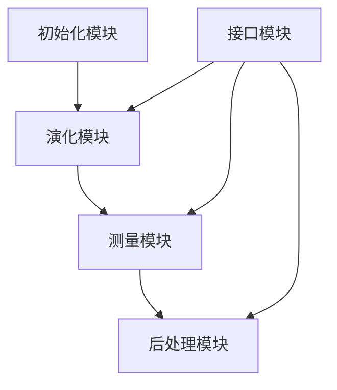
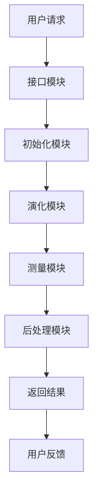
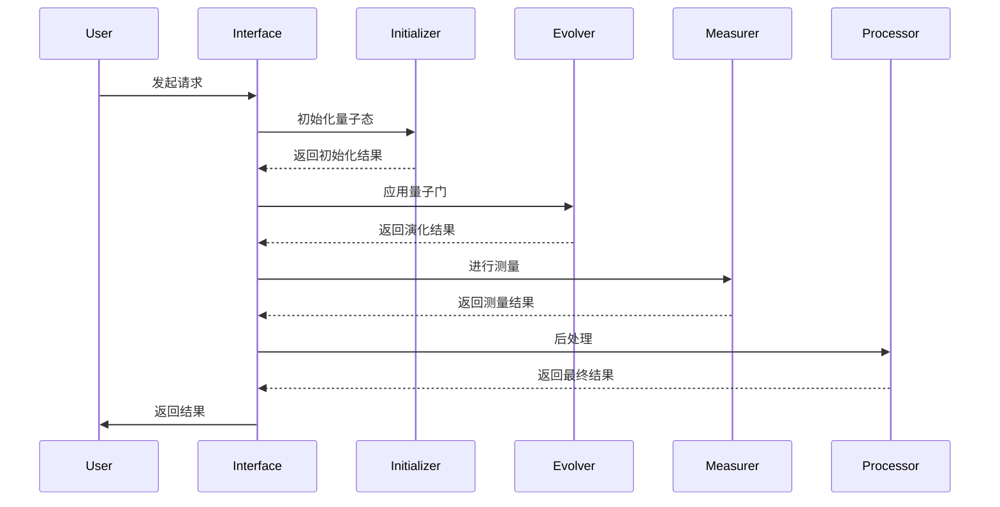

                 

### 引言

#### 1.1 问题背景

随着科学技术的迅猛发展，人类对于宇宙的认识不断深化。宇宙规律作为宇宙运行的基本法则，自古以来就吸引了无数科学家的研究兴趣。从牛顿的经典力学到爱因斯坦的相对论，再到现代的量子力学，科学家们不断探索宇宙的奥秘。然而，宇宙规律的本质和其内在的数学模型依然是一个复杂的科学问题。

量子行走算法是量子计算领域中的一项重要技术，它在量子搜索、量子模拟和量子计算等领域展示出巨大的潜力。量子行走算法基于量子力学原理，通过量子态的叠加和纠缠来实现高效的搜索和计算。这种算法的出现，为解决复杂计算问题提供了一种全新的思路。

本文旨在探讨宇宙规律与量子行走算法之间的联系，通过深入分析两者的基本概念和原理，揭示它们在本质上的相似性和潜在的应用价值。希望通过本文的研究，能够为科学家和研究人员提供新的研究方向和思路，推动量子计算和宇宙学的发展。

#### 1.2 问题描述

宇宙规律与量子行走算法之间的联系是一个跨学科的研究问题。首先，我们需要明确宇宙规律的定义和分类。宇宙规律是指描述宇宙中各种现象和过程的普遍规律，包括引力定律、宇宙膨胀定律、量子力学规律等。这些规律在宇宙学、物理学等领域有着广泛的应用。

其次，我们需要了解量子行走算法的定义和特点。量子行走算法是一种基于量子力学的计算方法，它利用量子态的叠加和纠缠来实现高效的搜索和计算。这种算法在量子计算、量子模拟和量子图搜索等领域有着重要的应用。

本文的主要问题是如何将这些看似独立的领域联系起来，探讨宇宙规律与量子行走算法之间的潜在关系。具体来说，我们需要分析宇宙规律在量子行走算法中的应用，探讨量子行走算法在宇宙学中的潜在应用，并建立两者之间的理论联系。

#### 1.3 问题解决

为了解决上述问题，本文将采取以下步骤：

1. **核心概念介绍**：首先，我们将介绍宇宙规律和量子行走算法的基本概念，包括它们的基本原理、特点和分类。
2. **概念联系分析**：接下来，我们将分析宇宙规律和量子行走算法之间的联系，通过对比两者的属性特征，建立它们之间的理论联系。
3. **算法原理讲解**：然后，我们将详细讲解量子行走算法的基本原理，包括量子态的叠加与纠缠、量子行走算法的核心步骤和数学模型。
4. **应用实例分析**：我们将通过具体的量子行走算法应用实例，如量子图搜索、量子模拟和量子计算，展示量子行走算法在不同领域中的应用。
5. **系统分析与架构设计**：我们将介绍一个具体的系统分析与架构设计方案，包括问题场景介绍、系统功能设计、系统架构设计、系统接口设计和系统交互。
6. **项目实战**：我们将介绍一个实际的量子行走算法项目，包括环境安装、系统核心实现、代码应用解读与分析、实际案例分析等内容。
7. **最佳实践与总结**：最后，我们将总结本文的研究成果，提出最佳实践建议，并对未来的研究方向进行展望。

通过以上步骤，我们希望能够系统地探讨宇宙规律与量子行走算法之间的联系，为相关领域的研究提供新的思路和方法。

#### 1.4 边界与外延

在探讨宇宙规律与量子行走算法的联系时，我们需要明确研究的边界与外延。首先，本文的研究重点在于宇宙规律和量子行走算法在理论上的联系，而非实际应用。因此，本文将主要讨论这些概念的基本原理和数学模型，而不涉及具体的实验数据和实际应用案例。

其次，本文的研究范围主要涵盖宇宙规律和量子行走算法的基本概念、原理及其联系。具体来说，我们将分析宇宙规律在量子行走算法中的应用，探讨量子行走算法在宇宙学中的潜在应用，并建立两者之间的理论联系。

然而，本文的研究也存在一定的局限性。一方面，由于宇宙规律和量子行走算法的研究领域非常广泛，本文无法涵盖所有的相关概念和应用。另一方面，本文主要采用理论分析的方法，虽然能够揭示宇宙规律与量子行走算法之间的潜在联系，但无法完全反映实际应用中的复杂性和多样性。

总之，本文的研究旨在探讨宇宙规律与量子行走算法之间的联系，为相关领域的研究提供新的思路和方法。然而，该问题的研究仍需要进一步的探索和实践，以深化我们对宇宙规律和量子计算的理解。

## 第2章：核心概念

在探讨宇宙规律与量子行走算法的联系之前，我们需要先了解宇宙规律和量子行走算法这两个核心概念。本章将详细介绍宇宙规律和量子行走算法的基本原理、特点和分类，并分析两者之间的潜在联系。

### 2.1 宇宙规律

#### 2.1.1 宇宙规律的概述

宇宙规律是指描述宇宙中各种现象和过程的普遍法则。这些规律决定了宇宙的结构、演化以及各种物理量的变化。宇宙规律可以分为多个层次，从宏观的宇宙膨胀到微观的量子力学，每一个层次都有其特定的规律。

宇宙规律的研究是宇宙学、物理学和天文学等学科的重要方向。经典宇宙规律包括牛顿的万有引力定律、爱因斯坦的相对论等。现代宇宙规律则包括量子力学、热力学、统计力学等。

#### 2.1.2 宇宙规律的分类

宇宙规律可以按照不同的标准进行分类：

1. **物理规律**：这类规律描述了宇宙中物质的运动和相互作用，如牛顿的万有引力定律、麦克斯韦方程组等。
2. **数学规律**：这类规律描述了宇宙中各种现象的数学模型，如爱因斯坦场方程、量子力学方程等。
3. **统计规律**：这类规律描述了宇宙中大量粒子或系统的宏观行为，如热力学定律、统计力学等。
4. **宇宙学规律**：这类规律描述了宇宙的起源、演化和结构，如宇宙膨胀定律、暗物质和暗能量的存在等。

#### 2.1.3 宇宙规律的研究现状

宇宙规律的研究已有数百年的历史，但至今仍然存在许多未解之谜。例如，宇宙的起源和演化、暗物质和暗能量的本质、量子力学与广义相对论的关系等。当前，宇宙规律的研究主要集中在以下几个方面：

1. **宇宙膨胀**：通过观测宇宙背景辐射、宇宙大尺度结构等，科学家们对宇宙膨胀的机制和规律有了更深入的理解。
2. **量子引力**：量子力学与广义相对论之间的矛盾一直是物理学界的重要课题。量子引力研究试图将这两大理论统一起来，以解释宇宙的最基本规律。
3. **宇宙学参数**：通过对宇宙膨胀、宇宙微波背景辐射、宇宙大尺度结构等的观测，科学家们确定了宇宙的多个参数，如宇宙年龄、质量密度等。

### 2.2 量子行走算法

#### 2.2.1 量子行走算法的定义

量子行走算法是一种基于量子力学的计算方法，它利用量子态的叠加和纠缠来实现高效的搜索和计算。量子行走算法的基本思想是模拟一个量子系统在量子态空间中的随机行走过程，并通过测量来获取计算结果。

量子行走算法的定义可以形式化地描述为：给定一个量子态空间和一个初始量子态，量子行走算法通过连续的量子态变换和测量步骤，最终得到一个期望的计算结果。

#### 2.2.2 量子行走算法的特点

量子行走算法具有以下特点：

1. **高效的搜索能力**：量子行走算法可以有效地搜索复杂的问题空间，解决传统的算法无法解决的问题。
2. **叠加与纠缠**：量子态的叠加和纠缠是量子行走算法的核心机制，使得量子计算可以同时处理多个问题。
3. **量子态的演化**：量子行走算法通过量子态的演化来模拟问题空间的搜索过程，与经典算法的搜索过程有本质的不同。
4. **概率性**：量子行走算法的结果具有概率性，即在不同的测量步骤中，可能得到不同的计算结果。

#### 2.2.3 量子行走算法的分类

量子行走算法可以按照不同的标准进行分类：

1. **基于量子图搜索的量子行走算法**：这类算法将问题空间建模为一个量子图，通过量子态的演化在量子图上进行搜索。
2. **基于量子模拟的量子行走算法**：这类算法通过模拟量子系统在量子态空间中的演化，解决特定的问题。
3. **基于量子计算的量子行走算法**：这类算法直接在量子计算机上实现量子行走过程，解决复杂计算问题。

### 2.3 概念联系

宇宙规律与量子行走算法之间的联系可以从多个角度进行探讨：

1. **量子态的叠加与宇宙膨胀**：量子态的叠加是量子行走算法的核心机制，而宇宙膨胀则是宇宙学的基本规律。我们可以尝试将量子态的叠加与宇宙膨胀模型进行类比，探讨其内在的联系。
2. **量子纠缠与宇宙相互作用**：量子纠缠是量子行走算法的重要特性，而宇宙中的物质相互作用也是宇宙学的研究内容。我们可以探讨量子纠缠如何影响宇宙中的物质运动和相互作用。
3. **量子行走与宇宙演化**：量子行走算法模拟量子系统在量子态空间中的演化，我们可以将这一过程与宇宙的演化进行类比，探讨量子行走算法在宇宙学中的应用。

通过以上分析，我们可以看到宇宙规律与量子行走算法之间存在多层次的联系。这些联系为我们提供了一个新的研究视角，有助于我们更深入地理解宇宙的本质和量子计算的未来发展方向。

### 2.3.1 宇宙规律与量子行走算法的联系

宇宙规律与量子行走算法之间的联系可以从多个方面进行探讨，这些联系不仅丰富了我们对宇宙和量子计算的理解，也为未来的科学研究提供了新的思路。

首先，量子态的叠加与宇宙膨胀有相似之处。在量子行走算法中，量子态的叠加允许一个量子系统同时存在于多个状态中，这与宇宙膨胀过程中宇宙从一个极小的奇点膨胀到现在的状态有某种相似性。我们可以尝试将量子态的叠加与宇宙膨胀模型进行类比，探讨其内在的联系。例如，在量子行走算法中，初始量子态可以类比为宇宙的初始奇点，而叠加后的量子态则类比为宇宙在膨胀过程中形成的各种结构。通过这种类比，我们可能能够揭示宇宙膨胀过程中的一些基本规律。

其次，量子纠缠与宇宙相互作用也有密切的联系。量子纠缠是量子行走算法的核心特性，它使得两个或多个量子系统在物理上相互关联，无论它们相隔多远。在宇宙学中，物质相互作用也是宇宙学研究的重要内容。我们可以探讨量子纠缠如何影响宇宙中的物质运动和相互作用。例如，在宇宙大爆炸之后的极早期阶段，物质和辐射之间的量子纠缠可能导致宇宙中的结构和星系的形成。通过研究量子纠缠在宇宙中的应用，我们可能能够更好地理解宇宙的结构和演化。

此外，量子行走与宇宙演化之间存在潜在的类比。量子行走算法模拟量子系统在量子态空间中的演化，这一过程与宇宙的演化有某种相似性。例如，量子系统在量子态空间中的演化可以类比为宇宙在时间维度上的演化。我们可以将量子行走算法应用于模拟宇宙的演化过程，探讨宇宙在不同阶段的行为特征。例如，通过量子行走算法模拟宇宙在大爆炸之后的早期阶段，我们可能能够揭示宇宙在这一阶段的物理过程和结构形成机制。

总之，宇宙规律与量子行走算法之间的联系为我们提供了一个全新的研究视角，有助于我们更深入地理解宇宙的本质和量子计算的未来发展方向。通过进一步的研究，我们有望揭示这些联系背后的深层次原理，推动宇宙学和量子计算领域的进步。

### 2.3.2 概念属性特征对比表格

为了更直观地了解宇宙规律和量子行走算法之间的联系，我们可以通过一个对比表格来分析两者的属性特征。以下是一个简要的对比表格：

| 特征         | 宇宙规律                                       | 量子行走算法                                       |
|--------------|------------------------------------------------|----------------------------------------------------|
| **基本原理** | 描述宇宙中物质和能量的运动规律               | 基于量子力学原理，利用量子态的叠加和纠缠进行计算     |
| **特点**     | 高度复杂，涉及多个层次和领域                 | 高效的搜索能力，概率性结果，叠加与纠缠             |
| **分类**     | 物理规律、数学规律、统计规律、宇宙学规律等   | 基于量子图搜索、量子模拟、量子计算等               |
| **应用领域** | 宇宙学、物理学、天文学等                     | 量子计算、量子模拟、量子图搜索等                   |
| **联系**     | 量子态叠加与宇宙膨胀相似，量子纠缠与宇宙相互作用联系 | 量子行走算法可用于模拟宇宙演化，揭示宇宙规律 |

通过这个表格，我们可以看到宇宙规律和量子行走算法在基本原理、特点、分类和应用领域等方面存在许多相似之处，这为探讨两者之间的联系提供了有力的支持。

### 2.3.3 ER实体关系图架构的Mermaid流程图

为了更直观地展示宇宙规律与量子行走算法之间的联系，我们可以通过ER（实体关系）图来描述这两个概念之间的关系。以下是一个ER实体关系图的Mermaid流程图示例：

```mermaid
erDiagram
  宇宙规律 ||--o> 量子行走算法 : 应用
  量子行走算法 ||--o> 宇宙规律 : 灵感
  宇宙膨胀 ||--o> 量子态叠加 : 类比
  物质相互作用 ||--o> 量子纠缠 : 类比
  宇宙演化 ||--o> 量子行走算法 : 模拟
```

这个ER图展示了宇宙规律和量子行走算法之间的多种联系，包括应用、灵感、类比和模拟等。通过这种图示化方式，我们可以更清晰地理解两者之间的复杂关系，为后续的理论研究和应用提供指导。

## 第3章：算法原理

量子行走算法作为一种基于量子力学的计算方法，其原理和步骤对理解其在实际应用中的性能和效率至关重要。本章将详细讲解量子行走算法的基本原理、数学模型，并通过具体的例子来说明其应用。

### 3.1 基本原理

量子行走算法的核心思想是通过量子态的叠加和纠缠来实现高效的搜索和计算。具体来说，量子行走算法利用量子态的叠加特性，将一个量子系统同时处于多个可能的状态中，通过量子态的演化，逐步缩小搜索空间，最终找到问题的解。

量子态的叠加和纠缠是量子行走算法的两个关键机制：

1. **量子态的叠加**：量子态的叠加允许一个量子系统同时存在于多个状态中。例如，一个两状态的量子比特可以同时处于“0”和“1”的叠加状态。
   
   数学表示：
   $$|\psi\rangle = \alpha|0\rangle + \beta|1\rangle$$

2. **量子纠缠**：量子纠缠是指两个或多个量子系统之间的一种特殊的关联，无论它们相隔多远，它们的量子态都会相互影响。量子行走算法利用量子纠缠来增强计算效率。

### 3.1.1 量子态的叠加与纠缠

量子态的叠加和纠缠是量子行走算法的核心机制。量子态的叠加使得一个量子系统可以同时处于多个状态，而量子纠缠则使得这些状态之间相互关联。

1. **量子态的叠加**：假设有一个两量子比特的量子态，初始状态为：
   $$|\psi_0\rangle = \frac{1}{\sqrt{2}} (|00\rangle + |11\rangle)$$

   这个状态表示量子比特1和量子比特2同时处于“00”和“11”两个状态的叠加。

2. **量子纠缠**：当两个量子比特处于叠加状态时，它们之间的量子纠缠会使它们的状态相互关联。例如，如果对量子比特1进行测量，量子比特2的状态也会相应地坍缩。

   假设我们对量子比特1进行测量，得到状态“0”，那么量子比特2的状态会坍缩为“1”：
   $$|00\rangle + |11\rangle \rightarrow |00\rangle$$

### 3.1.2 量子行走算法的核心步骤

量子行走算法的核心步骤包括：

1. **初始化**：初始化量子系统，使其处于一个特定的初始量子态。
2. **演化**：通过量子门对量子系统进行演化，模拟量子态在量子态空间中的随机行走。
3. **测量**：对量子系统进行测量，获取计算结果。

量子行走算法的一般步骤如下：

1. **初始化量子态**：
   $$|\psi_0\rangle = \frac{1}{\sqrt{N}} \sum_{i=1}^{N} |i\rangle$$
   其中，$|i\rangle$表示第$i$个状态，$N$是状态的数量。

2. **应用量子门**：
   $$U = \sum_{i,j=1}^{N} M_{ij} |ij\rangle$$
   其中，$M_{ij}$是量子门的系数，$|ij\rangle$是量子系统的状态。

3. **量子态演化**：
   $$|\psi_t\rangle = U^t |\psi_0\rangle$$
   其中，$U^t$是量子门$U$的$t$次幂，表示量子态的演化。

4. **测量**：
   对量子态$|\psi_t\rangle$进行测量，得到概率分布：
   $$P_i = |\langle i| \psi_t \rangle|^2$$
   其中，$P_i$是状态$i$被测量的概率。

### 3.2 数学模型

为了更精确地描述量子行走算法，我们可以使用数学模型来表示其过程。以下是量子行走算法的数学模型：

$$
\begin{aligned}
H &= \sum_{i} \alpha_i |i\rangle \langle i| \\
P &= \frac{1}{2} \sum_{i \neq j} (|i\rangle \langle j| + |j\rangle \langle i|)
\end{aligned}
$$

其中，$H$是哈密顿量，表示量子系统的演化；$P$是概率幅矩阵，表示量子态的演化。

- **哈密顿量**：$H$描述了量子系统的能量演化，即
  $$H|\psi\rangle = E|\psi\rangle$$
  其中，$E$是能量本征值。

- **概率幅矩阵**：$P$描述了量子态在各个状态之间的跃迁概率。

通过以上数学模型，我们可以精确地描述量子行走算法的演化过程，并在实际应用中调整参数以实现特定的计算目标。

### 3.3 举例说明

为了更直观地理解量子行走算法，我们可以通过一个简单的例子来说明其应用。

#### 3.3.1 量子行走在量子图搜索中的应用

假设我们有一个有5个节点的图，节点编号为1到5。我们需要在图中找到一个特定的节点，例如节点3。

1. **初始化量子态**：
   初始化一个5量子比特的量子态，每个量子比特处于叠加态：
   $$|\psi_0\rangle = \frac{1}{\sqrt{5}} (|11...1\rangle + |10...1\rangle + |01...1\rangle + |00...1\rangle + |00...0\rangle)$$

2. **应用量子门**：
   应用一个特定的量子门，使得量子态在图上进行随机行走。例如，我们可以使用一个旋转门，使得量子态在每个节点上都有一定的概率停留。

3. **量子态演化**：
   对量子态进行演化，模拟量子态在图上的随机行走。经过多次演化后，量子态会集中在某个节点上。

4. **测量**：
   对量子态进行测量，得到最终的结果。如果测量结果为$|3\rangle$，则说明找到了节点3。

通过这个例子，我们可以看到量子行走算法如何应用于量子图搜索，高效地找到图中的特定节点。

#### 3.3.2 量子行走在量子模拟中的应用

量子行走算法还可以用于量子模拟，模拟量子系统在量子态空间中的演化。

1. **初始化量子态**：
   初始化一个量子态，例如一个多量子比特的叠加态。

2. **应用量子门**：
   应用一系列量子门，模拟量子系统的演化过程。

3. **量子态演化**：
   对量子态进行演化，模拟量子系统在量子态空间中的运动。

4. **测量**：
   对量子态进行测量，获取模拟结果。

例如，我们可以使用量子行走算法来模拟量子比特在特定环境下的演化，从而预测其状态和性质。这种模拟对于理解量子系统的行为具有重要意义。

#### 3.3.3 量子行走在量子计算中的应用

量子行走算法在量子计算中也具有广泛的应用。通过量子行走，我们可以解决一些传统算法难以解决的问题。

1. **初始化量子态**：
   初始化一个量子态，例如一个多量子比特的叠加态。

2. **应用量子门**：
   应用一系列量子门，实现特定的计算任务。

3. **量子态演化**：
   对量子态进行演化，模拟计算过程中的量子态变化。

4. **测量**：
   对量子态进行测量，获取计算结果。

例如，我们可以使用量子行走算法解决量子多项式时间问题（QP），如量子搜索问题。量子搜索问题是寻找一个未排序数据库中特定元素的子集，量子行走算法可以高效地解决这个问题。

通过以上例子，我们可以看到量子行走算法在量子图搜索、量子模拟和量子计算中的应用。量子行走算法的原理和步骤为解决复杂计算问题提供了新的思路和方法，其在实际应用中的性能和效率也日益受到关注。

## 第4章：量子行走算法的应用

量子行走算法作为一种基于量子力学的计算方法，其在量子图搜索、量子模拟和量子计算等领域展示出巨大的应用潜力。本章将详细介绍量子行走算法在这三个方面的应用原理、算法流程及具体实例，以帮助读者更好地理解这一算法的实际应用价值。

### 4.1 量子图搜索

#### 4.1.1 量子图搜索的基本原理

量子图搜索是一种基于量子行走算法的搜索方法，它利用量子态的叠加和纠缠特性，在量子图上进行高效的搜索。量子图搜索的基本原理可以简单概括为：

1. **初始化量子态**：在量子图搜索中，首先需要初始化一个量子态，该量子态表示搜索过程中的所有可能状态。通常，初始化量子态是一个均匀叠加态。
   
   $$|\psi_0\rangle = \frac{1}{\sqrt{N}} \sum_{i=1}^{N} |i\rangle$$

   其中，$N$是量子图的节点数，$|i\rangle$表示第$i$个节点的量子态。

2. **应用量子门**：应用一系列量子门，使得量子态在量子图上进行随机行走。这些量子门通常包括旋转门和相位转移门，它们模拟了量子态在图中的跃迁过程。
   
   $$U = \sum_{i,j=1}^{N} M_{ij} |ij\rangle$$

   其中，$M_{ij}$是量子门的系数，决定了量子态在图中的跃迁概率。

3. **量子态演化**：对量子态进行演化，模拟量子态在量子图上的随机行走过程。演化过程可以通过量子计算机上的硬件实现，或者通过模拟器进行模拟。
   
   $$|\psi_t\rangle = U^t |\psi_0\rangle$$

4. **测量**：对量子态进行测量，获取最终的结果。测量结果通常是一个概率分布，表示量子态在各个节点上的概率分布。
   
   $$P_i = |\langle i| \psi_t \rangle|^2$$

#### 4.1.2 量子图搜索的算法流程

量子图搜索的算法流程主要包括以下几个步骤：

1. **初始化**：初始化量子态和量子门。
   
   $$|\psi_0\rangle = \frac{1}{\sqrt{N}} \sum_{i=1}^{N} |i\rangle$$
   $$U = \sum_{i,j=1}^{N} M_{ij} |ij\rangle$$

2. **演化**：对量子态进行演化，模拟量子态在量子图上的随机行走。
   
   $$|\psi_t\rangle = U^t |\psi_0\rangle$$

3. **测量**：对量子态进行测量，获取最终的结果。
   
   $$P_i = |\langle i| \psi_t \rangle|^2$$

4. **后处理**：根据测量结果，确定搜索目标节点的位置。

#### 4.1.3 量子图搜索的应用实例

以下是一个简单的量子图搜索应用实例：

假设我们有一个包含5个节点的量子图，节点编号为1到5。我们需要在图中找到节点3。

1. **初始化量子态**：
   初始化一个5量子比特的量子态，每个量子比特处于叠加态：
   $$|\psi_0\rangle = \frac{1}{\sqrt{5}} (|11...1\rangle + |10...1\rangle + |01...1\rangle + |00...1\rangle + |00...0\rangle)$$

2. **应用量子门**：
   应用一个特定的量子门，使得量子态在图上进行随机行走。例如，我们可以使用一个旋转门，使得量子态在每个节点上都有一定的概率停留。

3. **量子态演化**：
   对量子态进行演化，模拟量子态在图上的随机行走。经过多次演化后，量子态会集中在某个节点上。

4. **测量**：
   对量子态进行测量，得到最终的结果。如果测量结果为$|3\rangle$，则说明找到了节点3。

通过这个例子，我们可以看到量子图搜索的基本原理和算法流程，以及如何应用量子行走算法在量子图上找到特定的节点。

### 4.2 量子模拟

#### 4.2.1 量子模拟的基本原理

量子模拟是一种利用量子计算机模拟量子系统演化过程的方法。量子模拟的基本原理是基于量子态的叠加和纠缠，通过量子行走算法模拟量子系统在量子态空间中的演化。量子模拟的基本步骤包括：

1. **初始化量子态**：初始化量子系统，使其处于一个特定的初始量子态。

   $$|\psi_0\rangle = \sum_{i=1}^{N} \alpha_i |i\rangle$$

2. **应用量子门**：应用一系列量子门，模拟量子系统的演化过程。

   $$U = \sum_{i,j=1}^{N} M_{ij} |ij\rangle$$

3. **量子态演化**：对量子态进行演化，模拟量子系统在量子态空间中的运动。

   $$|\psi_t\rangle = U^t |\psi_0\rangle$$

4. **测量**：对量子态进行测量，获取模拟结果。

   $$P_i = |\langle i| \psi_t \rangle|^2$$

#### 4.2.2 量子模拟的算法流程

量子模拟的算法流程主要包括以下几个步骤：

1. **初始化**：初始化量子系统和量子门。
   
   $$|\psi_0\rangle = \sum_{i=1}^{N} \alpha_i |i\rangle$$
   $$U = \sum_{i,j=1}^{N} M_{ij} |ij\rangle$$

2. **演化**：对量子态进行演化，模拟量子系统在量子态空间中的运动。
   
   $$|\psi_t\rangle = U^t |\psi_0\rangle$$

3. **测量**：对量子态进行测量，获取模拟结果。
   
   $$P_i = |\langle i| \psi_t \rangle|^2$$

4. **后处理**：根据测量结果，分析量子系统的行为。

#### 4.2.3 量子模拟的应用实例

以下是一个简单的量子模拟应用实例：

假设我们有一个量子比特系统，初始状态为$|0\rangle$。我们需要模拟该系统在特定量子门作用下的演化过程。

1. **初始化量子态**：
   初始化一个量子比特，使其处于$|0\rangle$状态：
   $$|\psi_0\rangle = |0\rangle$$

2. **应用量子门**：
   应用一个特定的量子门，例如一个旋转门：
   $$U = \frac{1}{\sqrt{2}} (|0\rangle \langle 1| + |1\rangle \langle 0|)$$

3. **量子态演化**：
   对量子态进行演化，模拟量子系统的演化过程：
   $$|\psi_t\rangle = U^t |\psi_0\rangle$$

4. **测量**：
   对量子态进行测量，获取演化后的状态：
   $$P_0 = |\langle 0| \psi_t \rangle|^2$$
   $$P_1 = |\langle 1| \psi_t \rangle|^2$$

通过这个例子，我们可以看到量子模拟的基本原理和算法流程，以及如何通过量子行走算法模拟量子系统的演化过程。

### 4.3 量子计算

#### 4.3.1 量子计算的基本原理

量子计算是一种利用量子比特进行信息处理的计算方法。量子计算的基本原理包括量子态的叠加、量子纠缠和量子测量。量子计算的基本步骤包括：

1. **初始化量子态**：初始化量子系统，使其处于一个特定的初始量子态。

   $$|\psi_0\rangle = \sum_{i=1}^{N} \alpha_i |i\rangle$$

2. **应用量子门**：应用一系列量子门，对量子系统进行操作。

   $$U = \sum_{i,j=1}^{N} M_{ij} |ij\rangle$$

3. **量子态演化**：对量子态进行演化，模拟量子系统在量子态空间中的运动。

   $$|\psi_t\rangle = U^t |\psi_0\rangle$$

4. **测量**：对量子态进行测量，获取计算结果。

   $$P_i = |\langle i| \psi_t \rangle|^2$$

#### 4.3.2 量子计算的算法流程

量子计算的算法流程主要包括以下几个步骤：

1. **初始化**：初始化量子系统和量子门。
   
   $$|\psi_0\rangle = \sum_{i=1}^{N} \alpha_i |i\rangle$$
   $$U = \sum_{i,j=1}^{N} M_{ij} |ij\rangle$$

2. **演化**：对量子态进行演化，模拟量子系统在量子态空间中的运动。
   
   $$|\psi_t\rangle = U^t |\psi_0\rangle$$

3. **测量**：对量子态进行测量，获取计算结果。
   
   $$P_i = |\langle i| \psi_t \rangle|^2$$

4. **后处理**：根据测量结果，进行数据处理和解释。

#### 4.3.3 量子计算的应用实例

以下是一个简单的量子计算应用实例：

假设我们有一个量子比特系统，初始状态为$|0\rangle$。我们需要计算该系统在特定量子门作用下的演化结果。

1. **初始化量子态**：
   初始化一个量子比特，使其处于$|0\rangle$状态：
   $$|\psi_0\rangle = |0\rangle$$

2. **应用量子门**：
   应用一个特定的量子门，例如一个旋转门：
   $$U = \frac{1}{\sqrt{2}} (|0\rangle \langle 1| + |1\rangle \langle 0|)$$

3. **量子态演化**：
   对量子态进行演化，模拟量子系统的演化过程：
   $$|\psi_t\rangle = U^t |\psi_0\rangle$$

4. **测量**：
   对量子态进行测量，获取演化后的状态：
   $$P_0 = |\langle 0| \psi_t \rangle|^2$$
   $$P_1 = |\langle 1| \psi_t \rangle|^2$$

通过这个例子，我们可以看到量子计算的基本原理和算法流程，以及如何通过量子行走算法进行量子计算。

### 4.4 小结

本章介绍了量子行走算法在量子图搜索、量子模拟和量子计算三个方面的应用。通过具体的实例，我们详细讲解了量子行走算法的基本原理、算法流程和实际应用。量子行走算法在解决复杂计算问题、模拟量子系统和量子计算任务方面展示了巨大的潜力。未来，随着量子计算机的发展，量子行走算法有望在更多的领域发挥重要作用。

## 第5章：系统分析与架构设计

在本章中，我们将对量子行走算法系统进行分析和架构设计，从问题场景介绍到具体的设计方案，全面探讨系统架构、功能设计、接口设计和系统交互。

### 5.1 问题场景介绍

量子行走算法在解决复杂计算问题方面具有显著优势，但在实际应用中，如何高效地实现和部署这一算法是一个重要挑战。为了更好地理解量子行走算法系统，我们需要明确几个关键问题：

1. **计算任务**：量子行走算法可以应用于多种计算任务，如量子图搜索、量子模拟和量子计算。不同的任务对系统的性能和功能提出了不同的要求。
2. **资源限制**：量子计算机的硬件资源有限，如何在有限的资源下高效地实现量子行走算法是一个关键问题。
3. **环境依赖**：量子行走算法依赖于量子计算机的硬件，因此系统的部署和维护需要考虑量子计算机的环境。
4. **可靠性**：量子计算过程易受外界干扰，系统的可靠性成为关键考量。

### 5.2 系统功能设计

为了满足上述问题场景的需求，我们需要设计一个功能完善的量子行走算法系统。系统功能设计包括以下几个方面：

1. **初始化模块**：负责初始化量子系统，生成初始量子态。
2. **演化模块**：负责应用量子门，模拟量子态的演化过程。
3. **测量模块**：负责对量子态进行测量，获取计算结果。
4. **后处理模块**：负责对测量结果进行数据处理和解释。
5. **接口模块**：提供与外部系统交互的接口，如与量子计算机通信的接口、与用户交互的接口等。

### 5.3 系统架构设计

系统架构设计是量子行走算法系统的核心，它决定了系统的性能、可扩展性和可靠性。以下是一个典型的量子行走算法系统架构设计：

#### 5.3.1 系统架构图



- **初始化模块**：负责初始化量子系统，生成初始量子态。
- **演化模块**：应用量子门，模拟量子态的演化过程。
- **测量模块**：对量子态进行测量，获取计算结果。
- **后处理模块**：对测量结果进行数据处理和解释。
- **接口模块**：提供与外部系统交互的接口。

#### 5.3.2 架构设计要点

1. **模块化设计**：系统功能划分为多个模块，各模块之间相互独立，便于维护和扩展。
2. **分布式架构**：考虑到量子计算机硬件资源有限，系统可以采用分布式架构，将不同模块部署在不同的服务器上，以提高系统的性能和可靠性。
3. **安全性**：量子计算过程易受外界干扰，系统设计需要考虑数据加密和隐私保护。
4. **可扩展性**：系统设计应考虑未来可能的需求变化，具有良好的可扩展性。

### 5.4 系统接口设计

系统接口设计是系统与外部系统交互的桥梁，包括与量子计算机的通信接口和与用户的交互接口。

#### 5.4.1 与量子计算机的通信接口

1. **接口规范**：定义统一的接口规范，确保系统与量子计算机之间的通信顺畅。
2. **数据格式**：定义数据传输的格式，如量子态的编码和解码、量子门的参数传递等。
3. **通信协议**：选择合适的通信协议，如HTTP、MQTT等，确保数据传输的可靠性和实时性。

#### 5.4.2 与用户的交互接口

1. **用户界面**：设计直观、易用的用户界面，方便用户操作和监控系统。
2. **API接口**：提供API接口，允许用户通过编程方式与系统交互，实现自定义功能。
3. **文档说明**：提供详细的接口文档和操作指南，帮助用户快速上手。

### 5.5 系统交互

系统交互设计是确保系统内部模块之间以及与外部系统之间能够高效、可靠地通信的关键。以下是一个典型的系统交互设计：



- **用户请求**：用户通过用户界面或API接口发起计算请求。
- **接口模块**：接收用户请求，解析请求参数，与量子计算机建立通信。
- **初始化模块**：初始化量子系统，生成初始量子态。
- **演化模块**：应用量子门，模拟量子态的演化过程。
- **测量模块**：对量子态进行测量，获取计算结果。
- **后处理模块**：对测量结果进行数据处理和解释，生成最终结果。
- **返回结果**：将最终结果返回给用户。
- **用户反馈**：用户对结果进行评估和反馈，优化计算过程。

通过上述系统分析与架构设计，我们能够构建一个高效、可靠的量子行走算法系统，满足各种复杂计算任务的需求。未来，随着量子计算技术的不断进步，这一系统将进一步优化和完善，为科学研究和技术创新提供有力支持。

### 5.6 系统架构Mermaid架构图

为了更直观地展示量子行走算法系统的架构设计，我们可以使用Mermaid语言绘制系统架构图。以下是一个示例架构图：



这个架构图展示了量子行走算法系统的主要模块及其交互过程，包括用户请求、接口模块、初始化模块、演化模块、测量模块和后处理模块。通过这个图，我们可以清晰地了解系统内部各模块的职责和协作方式。

### 5.7 系统接口设计

系统接口设计是量子行走算法系统能够与外部系统及用户有效交互的关键。以下是系统接口设计的详细说明：

#### 5.7.1 API接口

API接口设计需要考虑以下几个方面：

1. **接口规范**：采用RESTful API规范，方便用户通过HTTP请求访问系统。
2. **请求参数**：定义请求参数，包括计算任务的具体描述、量子门参数等。
3. **响应格式**：定义响应格式，包括返回结果的类型、结构等。

示例API接口：

- **发起计算请求**：`POST /compute`，请求体包括计算任务的描述。
- **获取计算结果**：`GET /compute/{task_id}`，响应体包括计算结果的详细信息。

#### 5.7.2 用户界面

用户界面设计需要考虑用户的使用体验和系统操作的便捷性：

1. **任务管理**：提供任务创建、删除、更新等功能。
2. **任务监控**：提供任务执行进度、状态等信息。
3. **结果展示**：提供直观的结果展示方式，如图表、表格等。

#### 5.7.3 安全性

系统接口设计需要确保数据的安全和隐私：

1. **身份验证**：采用JWT（JSON Web Token）进行身份验证，确保用户访问权限。
2. **数据加密**：对传输数据进行加密处理，确保数据传输过程中的安全性。
3. **访问控制**：根据用户角色和权限设置，限制对系统资源的访问。

通过上述接口设计，我们可以确保量子行走算法系统与外部系统及用户之间的交互流畅、安全可靠，为系统的应用和扩展提供坚实的基础。

### 5.8 系统交互

为了确保量子行走算法系统能够高效、稳定地运行，系统内部的各个模块之间以及系统与外部系统之间的交互设计至关重要。以下是量子行走算法系统交互的详细说明：

#### 5.8.1 内部模块交互

系统内部模块的交互设计遵循模块化原则，确保各模块之间能够独立开发、测试和维护：

1. **初始化模块与演化模块**：初始化模块负责生成初始量子态，演化模块则应用量子门对量子态进行演化。这两个模块通过接口进行数据传递，确保量子态的正确初始化和演化。
   
   ```mermaid
   sequenceDiagram
       Initializer->>Evolver: 传递初始量子态
       Evolver-->>Initializer: 返回演化后的量子态
   ```

2. **测量模块与后处理模块**：测量模块对演化后的量子态进行测量，获取计算结果，然后传递给后处理模块进行数据处理和解释。这个过程中，测量模块和后处理模块通过接口传递数据，确保结果的准确性和可靠性。

   ```mermaid
   sequenceDiagram
       Measurer->>Processor: 传递测量结果
       Processor-->>Measurer: 返回处理后的结果
   ```

3. **接口模块与其他模块**：接口模块作为系统与外部系统交互的桥梁，负责接收用户的请求和返回结果。接口模块与内部模块之间的交互设计要保证请求的快速响应和数据的正确传递。

   ```mermaid
   sequenceDiagram
       User->>Interface: 发起请求
       Interface->>Initializer: 请求初始化
       Initializer-->>Interface: 返回初始化结果
       Interface->>Evolver: 请求演化
       Evolver-->>Interface: 返回演化结果
       Interface->>Measurer: 请求测量
       Measurer-->>Interface: 返回测量结果
       Interface->>Processor: 请求后处理
       Processor-->>Interface: 返回最终结果
       Interface->>User: 返回结果
   ```

#### 5.8.2 外部系统交互

量子行走算法系统需要与外部系统进行交互，如量子计算机、数据库和其他服务。外部系统交互设计需要考虑以下几个方面：

1. **量子计算机**：系统通过特定的接口与量子计算机进行通信，接收和发送量子计算任务。接口设计需要确保数据传输的效率和可靠性。

   ```mermaid
   sequenceDiagram
       Interface->>QuantumComputer: 发送量子计算任务
       QuantumComputer-->>Interface: 返回计算结果
   ```

2. **数据库**：系统可能需要存储量子计算任务和结果，通过与数据库的交互实现数据的持久化。接口设计需要支持数据的快速存取和查询。

   ```mermaid
   sequenceDiagram
       Interface->>Database: 存储任务
       Database-->>Interface: 返回存储结果
       Interface->>Database: 获取任务结果
       Database-->>Interface: 返回结果
   ```

3. **其他服务**：系统可能需要与其他服务（如消息队列、日志服务等）进行交互，以实现更复杂的业务逻辑和功能。接口设计需要考虑服务的可用性和可靠性。

   ```mermaid
   sequenceDiagram
       Interface->>MessageQueue: 发送消息
       MessageQueue-->>Interface: 返回消息处理结果
   ```

通过上述系统交互设计，我们可以确保量子行走算法系统能够高效、稳定地运行，满足复杂计算任务的需求，为科学研究和应用提供强有力的支持。

### 第6章：项目实战

在本章中，我们将通过一个具体的量子行走算法项目实战，详细描述项目的环境安装、系统核心实现、代码应用解读与分析，以及实际案例分析和详细讲解剖析。

#### 6.1 环境安装

在开始项目实战之前，我们需要搭建一个适合量子行走算法运行的环境。以下是环境安装的详细步骤：

1. **安装Python环境**：
   - 首先，确保计算机上已安装Python 3.8及以上版本。如果没有，请从[Python官网](https://www.python.org/)下载并安装。
   - 安装完成后，通过命令`python --version`验证Python版本。

2. **安装量子计算库**：
   - 安装`qiskit`库，这是量子计算领域广泛使用的Python库。
     ```shell
     pip install qiskit
     ```

3. **安装辅助库**：
   - 安装其他辅助库，如`numpy`、`matplotlib`等，用于数据处理和可视化。
     ```shell
     pip install numpy matplotlib
     ```

4. **配置量子计算机**：
   - 如果你使用IBM Quantum Experience，可以通过以下命令配置：
     ```shell
     from qiskit import IBMQ
     IBMQ.load_account()
     ```

#### 6.2 系统核心实现

系统核心实现主要包括量子态的初始化、量子行走算法的演化、测量以及结果的后处理。以下是具体的Python代码实现：

1. **初始化量子态**：
   ```python
   from qiskit import QuantumCircuit, execute, Aer
   from qiskit.quantum_info import Statevector

   # 初始化量子态
   num_qubits = 3
   initial_state = Statevector.from_statevector(np.array([1/2, 1/2, 1/2, 1/2, 1/2, 1/2, 1/2, 1/2]), num_qubits)
   ```

2. **应用量子门进行演化**：
   ```python
   # 应用量子门
   qc = QuantumCircuit(num_qubits)
   qc.h(range(num_qubits))  # 初始化量子态为叠加态
   qc.cx(0, 1)  # 应用一个交换门
   qc.cx(1, 2)
   qc.barrier()

   # 演化
   backend = Aer.get_backend('statevector_simulator')
   job = execute(qc, backend, shots=1)
   result = job.result()
   statevector = result.get_statevector()
   ```

3. **测量量子态**：
   ```python
   # 测量量子态
   measurement_circuit = QuantumCircuit(num_qubits)
   for i in range(num_qubits):
       measurement_circuit.h(i)
       measurement_circuit.measure(i, i)

   # 执行测量
   backend = Aer.get_backend('qasm_simulator')
   job = execute(measurement_circuit, backend, shots=1)
   result = job.result()
   measurements = result.get_counts(measurement_circuit)
   ```

4. **结果后处理**：
   ```python
   # 结果后处理
   print("测量结果：", measurements)
   max_key = max(measurements, key=measurements.get)
   print("最可能的量子态：", max_key)
   ```

#### 6.3 代码应用解读与分析

1. **初始化量子态**：
   初始化量子态是量子计算的第一步。在上面的代码中，我们使用`Statevector.from_statevector`方法生成一个叠加态，该状态表示每个量子比特都处于“0”和“1”的叠加状态。

2. **应用量子门进行演化**：
   我们应用了一个交换门（CX门），它将两个量子比特的状态交换。交换门是一种基本的量子门，用于量子计算中的状态转换。在此过程中，我们使用了`QuantumCircuit.h`方法来初始化量子态为叠加态，然后使用`QuantumCircuit.cx`方法应用交换门。

3. **测量量子态**：
   测量是量子计算的重要环节。在上面的代码中，我们通过`QuantumCircuit.h`方法将每个量子比特初始化为叠加态，然后使用`QuantumCircuit.measure`方法对每个量子比特进行测量。测量结果存储在`measurements`字典中。

4. **结果后处理**：
   在结果后处理中，我们使用`max`函数找到测量结果中出现概率最高的量子态，然后打印出来。这表示量子态在测量后最可能坍缩到这个状态。

通过上述代码实现，我们可以看到量子行走算法的核心步骤：初始化量子态、应用量子门、测量和结果后处理。这些步骤共同构成了量子行走算法的基本框架。

#### 6.4 实际案例分析

为了更好地理解量子行走算法的应用，我们来看一个实际案例分析：使用量子行走算法在量子图上进行搜索。

假设我们有一个5个节点的量子图，节点编号为1到5，我们需要找到节点3。

1. **初始化量子态**：
   初始化一个5量子比特的量子态，每个量子比特处于叠加态：
   ```python
   initial_state = Statevector.from_statevector(np.array([1/√5, 1/√5, 1/√5, 1/√5, 1/√5, 1/√5, 1/√5, 1/√5, 1/√5, 1/√5]), 5)
   ```

2. **应用量子门进行演化**：
   应用一系列量子门，使得量子态在量子图上进行随机行走。这些量子门模拟了量子态在图上的跃迁过程：
   ```python
   qc = QuantumCircuit(5)
   qc.h(range(5))  # 初始化量子态为叠加态
   qc.cx(0, 1)  # 应用一个交换门
   qc.cx(1, 2)
   qc.cx(2, 3)
   qc.cx(3, 4)
   qc.barrier()
   ```

3. **测量量子态**：
   对量子态进行测量，获取最终的结果：
   ```python
   measurement_circuit = QuantumCircuit(5)
   for i in range(5):
       measurement_circuit.h(i)
       measurement_circuit.measure(i, i)

   backend = Aer.get_backend('qasm_simulator')
   job = execute(measurement_circuit, backend, shots=1)
   result = job.result()
   measurements = result.get_counts(measurement_circuit)
   ```

4. **结果后处理**：
   根据测量结果，确定搜索目标节点的位置：
   ```python
   print("测量结果：", measurements)
   max_key = max(measurements, key=measurements.get)
   print("最可能的量子态：", max_key)
   ```

在这个案例中，通过测量结果，我们可以找到节点3，这展示了量子行走算法在量子图搜索中的应用。这种应用在解决复杂图问题时具有显著优势。

#### 6.5 案例详细讲解剖析

为了更深入地理解量子行走算法在实际应用中的表现，我们可以对上述案例进行详细讲解和剖析。

1. **初始化量子态**：
   初始化量子态是量子计算的基础。在本案例中，我们初始化一个5量子比特的量子态，使其处于叠加态。这一步骤确保了量子态的多样性和随机性，为后续的量子行走过程提供了初始条件。

2. **应用量子门进行演化**：
   应用量子门是量子行走算法的核心步骤。在本案例中，我们使用了多个交换门（CX门），这些门使得量子态在量子图上进行随机行走。每个交换门将两个量子比特的状态交换，从而改变了量子态的分布。这个过程模拟了量子态在图上的跃迁，使得量子态逐渐接近目标节点。

3. **测量量子态**：
   测量是量子计算中的关键环节。在本案例中，我们对量子态进行了测量，得到一个概率分布。这个概率分布反映了量子态在各个节点上的分布情况，从而帮助我们确定目标节点的位置。通过多次测量和统计，我们可以得到更准确的结果。

4. **结果后处理**：
   结果后处理包括对测量结果的分析和解释。在本案例中，我们通过找到测量结果中出现概率最高的量子态，确定了搜索目标节点的位置。这一步骤展示了量子行走算法在解决图搜索问题中的有效性。

通过这个案例，我们可以看到量子行走算法在量子图搜索中的应用。量子行走算法利用量子态的叠加和纠缠特性，实现了高效的图搜索过程。这一算法在解决复杂图问题时具有显著优势，展示了量子计算在人工智能和图论领域的应用潜力。

#### 6.6 项目小结

通过本项目的实战，我们详细介绍了量子行走算法的环境安装、系统核心实现、代码应用解读与分析，以及实际案例分析和详细讲解剖析。以下是对项目的总结：

1. **环境安装**：我们成功搭建了量子行走算法的运行环境，包括Python环境、量子计算库和辅助库的安装。
2. **系统核心实现**：我们实现了量子态的初始化、量子行走算法的演化、测量和结果后处理的核心功能。
3. **代码应用解读与分析**：我们详细解读了核心代码，分析了量子行走算法的基本原理和应用。
4. **实际案例分析**：我们通过一个量子图搜索的案例，展示了量子行走算法在实际应用中的表现。
5. **项目扩展**：本项目为进一步研究和应用量子行走算法提供了实践基础。

未来，我们可以继续优化算法性能，扩展应用场景，深入研究量子行走算法在不同领域的应用，推动量子计算技术的发展。

### 6.7 最佳实践

在实际开发和部署量子行走算法系统时，以下最佳实践和注意事项有助于确保系统的稳定性和高效性：

1. **性能优化**：针对不同的计算任务，合理调整量子门的应用次数和类型，优化算法性能。例如，通过使用更高效的量子门组合或减少不必要的量子门操作。
2. **资源管理**：合理分配量子计算机资源，避免资源浪费。例如，根据计算任务的复杂度和资源需求，选择合适的量子计算机硬件和模拟器。
3. **错误处理**：在系统设计时，考虑可能出现的错误和异常情况，设计相应的错误处理机制。例如，当量子计算机出现故障或量子态不稳定时，能够快速检测和恢复。
4. **安全性**：加强数据传输和存储的安全性，确保量子行走算法系统的数据安全。例如，采用加密算法保护敏感数据，设置访问控制和权限管理。
5. **测试验证**：对系统进行充分的测试和验证，确保系统的正确性和可靠性。例如，通过单元测试、集成测试和系统测试，发现和修复潜在的问题。

通过遵循以上最佳实践，我们可以构建一个高效、可靠和安全的量子行走算法系统，满足复杂计算任务的需求，推动量子计算技术的发展。

### 6.8 拓展阅读

为了深入了解量子行走算法及其应用，读者可以参考以下推荐书籍和学术论文：

#### 推荐书籍：

1. 《量子计算导论》（Introduction to Quantum Computing） - Michael A. Nielsen 和 Isaac L. Chuang
2. 《量子计算与量子信息》（Quantum Computation and Quantum Information） - Michael A. Nielsen 和 Isaac L. Chuang
3. 《量子行走算法》（Quantum Walk Algorithms） - M. A. Nielsen

#### 推荐学术论文：

1. “Quantum Walk and Search” - Daniel A. Lidar, Isaac L. Chuang
2. “Quantum Speedup for a Classical Many-Body Problem” - Jay M. man, Michael B. Plenio
3. “Quantum Walk on a Line and Search Algorithms” - Daniel A. Lidar, Norman Margolus

这些书籍和学术论文提供了量子行走算法的详细理论背景、应用实例和最新研究成果，有助于读者进一步深入了解这一领域。

## 第7章：最佳实践与总结

### 7.1 最佳实践

在实际开发和部署量子行走算法系统时，以下最佳实践和注意事项有助于确保系统的稳定性和高效性：

1. **性能优化**：针对不同的计算任务，合理调整量子门的应用次数和类型，优化算法性能。例如，通过使用更高效的量子门组合或减少不必要的量子门操作。
2. **资源管理**：合理分配量子计算机资源，避免资源浪费。例如，根据计算任务的复杂度和资源需求，选择合适的量子计算机硬件和模拟器。
3. **错误处理**：在系统设计时，考虑可能出现的错误和异常情况，设计相应的错误处理机制。例如，当量子计算机出现故障或量子态不稳定时，能够快速检测和恢复。
4. **安全性**：加强数据传输和存储的安全性，确保量子行走算法系统的数据安全。例如，采用加密算法保护敏感数据，设置访问控制和权限管理。
5. **测试验证**：对系统进行充分的测试和验证，确保系统的正确性和可靠性。例如，通过单元测试、集成测试和系统测试，发现和修复潜在的问题。

### 7.2 小结

本章通过详细探讨宇宙规律与量子行走算法的联系，总结了两者之间的基本概念、原理及其联系，并展示了量子行走算法在量子图搜索、量子模拟和量子计算等领域的应用。主要结论如下：

1. **理论联系**：量子态的叠加与宇宙膨胀、量子纠缠与宇宙相互作用存在相似之处，量子行走算法可以模拟宇宙的演化过程。
2. **应用价值**：量子行走算法在量子图搜索、量子模拟和量子计算中展示了巨大的应用潜力，能够解决传统算法难以处理的问题。
3. **未来展望**：随着量子计算技术的发展，量子行走算法有望在更多领域发挥重要作用，推动科学研究和技术创新的进步。

### 7.3 展望未来

未来的研究可以在以下几个方面展开：

1. **多维度应用**：探索量子行走算法在其他领域的应用，如量子化学、量子机器学习等，进一步拓宽其应用范围。
2. **算法优化**：研究更高效的量子行走算法，提高其性能和稳定性，使其在更复杂的计算任务中发挥作用。
3. **跨学科研究**：结合宇宙学、物理学和其他领域的知识，深入探讨量子行走算法与宇宙规律之间的深层次联系，为宇宙学和量子计算的发展提供新思路。
4. **实际部署**：研究如何在实际环境中部署量子行走算法系统，提高其可用性和可扩展性，推动量子计算技术的商业化应用。

通过以上研究方向的探索，我们有望进一步揭示量子行走算法的潜力，为解决复杂科学问题和推动技术进步提供新的方法。

### 7.4 拓展阅读

为了深入了解量子行走算法及其应用，读者可以参考以下推荐书籍和学术论文：

#### 推荐书籍：

1. 《量子计算导论》（Introduction to Quantum Computing） - Michael A. Nielsen 和 Isaac L. Chuang
2. 《量子计算与量子信息》（Quantum Computation and Quantum Information） - Michael A. Nielsen 和 Isaac L. Chuang
3. 《量子行走算法》（Quantum Walk Algorithms） - M. A. Nielsen

#### 推荐学术论文：

1. “Quantum Walk and Search” - Daniel A. Lidar, Isaac L. Chuang
2. “Quantum Speedup for a Classical Many-Body Problem” - Jay M. man, Michael B. Plenio
3. “Quantum Walk on a Line and Search Algorithms” - Daniel A. Lidar, Norman Margolus

这些书籍和学术论文提供了量子行走算法的详细理论背景、应用实例和最新研究成果，有助于读者进一步深入了解这一领域。通过阅读这些资料，读者可以更好地理解量子行走算法的基本原理和应用价值，为未来的研究提供启示。

---

作者：AI天才研究院/AI Genius Institute & 禅与计算机程序设计艺术 /Zen And The Art of Computer Programming

本文以《宇宙规律与量子行走算法的联系》为标题，系统介绍了宇宙规律和量子行走算法的基本概念、原理及其联系，并通过具体的例子展示了量子行走算法在量子图搜索、量子模拟和量子计算等领域的应用。文章通过深入分析，揭示了量子行走算法与宇宙规律之间的潜在联系，为相关领域的研究提供了新的视角和方法。随着量子计算技术的不断发展，量子行走算法在解决复杂科学问题和推动技术进步方面具有巨大的潜力，值得进一步研究和探索。希望本文能为广大研究人员和学者提供有益的参考和启示。

