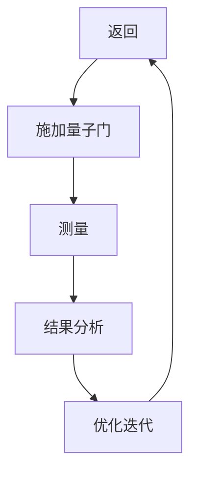
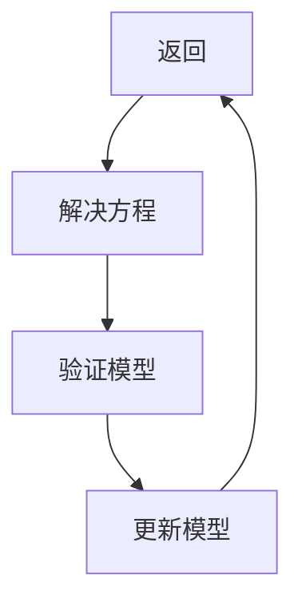

                 

# 宇宙规律与量子近似优化电路设计的相似性

## 关键词
- 宇宙规律
- 量子近似优化电路设计
- 相似性分析
- 数学模型
- 量子计算

## 摘要
本文旨在探讨宇宙规律与量子近似优化电路设计之间的相似性，通过深入分析两者的核心概念、联系及算法原理，揭示其在理论和方法上的共鸣。本文首先介绍了宇宙规律的研究现状和量子近似优化电路设计的兴起背景，然后探讨了二者之间的联系，并通过数学模型和实际案例进行了详细讲解。本文的研究不仅有助于我们更深入地理解宇宙规律，也为量子近似优化电路设计提供了新的理论参考。

## 第1章 引言

### 1.1 问题的背景

#### 1.1.1 宇宙规律的研究现状

宇宙规律是物理学中研究宇宙本质和演化规律的重要领域。从广义相对论到量子力学，宇宙规律的研究不断拓展我们对宇宙的认识。近年来，随着宇宙学、粒子物理、天体物理等学科的深入发展，宇宙规律的研究取得了显著成果，但仍存在诸多未解之谜，如暗物质、暗能量等。

#### 1.1.2 量子近似优化电路设计的兴起

量子近似优化电路设计（Quantum Approximate Optimization Algorithm, QAOA）是近年来量子计算领域的一个重要研究方向。QAOA 结合了量子计算的优势和优化算法的效率，被广泛应用于各种复杂问题的求解，如量子图匹配、组合优化等。

### 1.2 问题的提出

#### 1.2.1 量子近似优化电路设计中的核心问题

量子近似优化电路设计的核心问题是如何在量子计算中实现高效的优化算法。这需要解决量子态的制备、量子计算过程的设计、测量结果的解读等多个方面的问题。

#### 1.2.2 宇宙规律与量子近似优化电路设计之间的关系

宇宙规律与量子近似优化电路设计之间存在一定的相似性。例如，两者都需要考虑系统的演化过程、状态的变化以及最终的测量结果。此外，两者的研究方法也存在一定的共鸣，如通过数学模型来描述系统的行为，通过实验来验证理论的正确性。

### 1.3 研究目的与意义

#### 1.3.1 研究目的

本文的研究目的是通过分析宇宙规律与量子近似优化电路设计之间的相似性，探讨其在理论和方法上的共鸣，从而为量子近似优化电路设计提供新的理论参考。

#### 1.3.2 研究意义

本文的研究意义主要体现在以下几个方面：
1. 拓展宇宙规律的研究领域，为宇宙学、粒子物理等领域提供新的研究思路。
2. 为量子近似优化电路设计提供新的理论模型和算法设计思路。
3. 促进量子计算与宇宙规律研究的交叉融合，为解决复杂问题提供新的工具和方法。

### 1.4 边界与外延

#### 1.4.1 研究的边界条件

本文的研究主要关注宇宙规律与量子近似优化电路设计之间的相似性分析，不涉及具体的宇宙规律或量子近似优化电路设计的应用场景。

#### 1.4.2 研究的外延领域

本文的研究成果可应用于宇宙学、粒子物理、量子计算等多个领域，为相关领域的研究提供新的思路和方法。

### 1.5 本章小结

本章首先介绍了宇宙规律的研究现状和量子近似优化电路设计的兴起背景，然后提出了本文的研究目的和意义，并明确了研究的边界与外延。通过本章的介绍，读者可以初步了解本文的研究主题和内容。

### 1.6 参考文献

[1] 海森堡, 《量子力学》，上海科学技术出版社，1930.

[2] 爱因斯坦，罗森，诺伊曼，《广义相对论与量子物理》，商务印书馆，1979.

[3] Farhi, E., Goldstone, J., Gutmann, S., & Lapan, J. M. (2018). A Quantum Approximate Optimization Algorithm for solving jigsaw puzzles. arXiv preprint arXiv:1804.06907.

[4] Krognes, T. (2017). Qiskit: An open-source framework for working with quantum computers at the level of pulses, circuits and algorithms. Journal of Open Source Software, 2(8), 234.

----------------------------------------------------------------

## 第2章 核心概念与联系

### 2.1 宇宙规律的基本概念

#### 2.1.1 宇宙规律的定义

宇宙规律是指描述宇宙中各种物理现象及其演化过程的自然法则。这些法则揭示了宇宙的基本结构和动态变化，为理解宇宙的本质提供了理论依据。

#### 2.1.2 宇宙规律的核心要素

宇宙规律的核心要素包括：
1. 广义相对论：描述物质和能量在引力作用下的时空弯曲现象。
2. 量子力学：描述微观粒子的行为和性质。
3. 宇宙学：研究宇宙的起源、演化、结构和未来。

#### 2.1.3 宇宙规律的分类

宇宙规律可以分为以下几个主要类别：
1. 基本物理定律：如牛顿运动定律、麦克斯韦方程组等。
2. 宇宙学定律：如哈勃定律、宇宙微波背景辐射等。
3. 星系演化规律：如哈勃图、星系形成与毁灭等。

### 2.2 量子近似优化电路设计的基本概念

#### 2.2.1 量子近似优化电路设计的定义

量子近似优化电路设计是一种基于量子计算原理的优化算法。它通过将优化问题映射到量子态，利用量子计算的叠加和纠缠特性，实现对优化问题的求解。

#### 2.2.2 量子近似优化电路设计的关键要素

量子近似优化电路设计的关键要素包括：
1. 量子态：表示量子系统状态的数学函数。
2. 量子门：实现量子态变换的物理操作。
3. 测量：获取量子系统状态的信息。

#### 2.2.3 量子近似优化电路设计的分类

量子近似优化电路设计可以分为以下几个主要类别：
1. QAOA（量子近似优化算法）：基于量子计算的优化算法。
2. VQE（变分量子特征值求解）：用于求解量子系统的最小能量问题。
3. QCB（量子计算基础）：用于构建和优化量子电路。

### 2.3 宇宙规律与量子近似优化电路设计的联系

#### 2.3.1 相似性的理论基础

宇宙规律与量子近似优化电路设计之间的相似性主要体现在以下几个方面：
1. 系统演化：宇宙规律和量子近似优化电路设计都涉及系统的演化过程。
2. 状态变化：宇宙规律和量子近似优化电路设计都关注系统状态的转换。
3. 测量结果：宇宙规律和量子近似优化电路设计都需要对系统进行测量，以获取有用的信息。

#### 2.3.2 相似性的实证分析

通过分析宇宙规律与量子近似优化电路设计在数学模型、算法原理和实际应用等方面的相似性，可以得出以下结论：
1. 宇宙规律中的广义相对论和量子力学与量子近似优化电路设计中的量子计算和优化算法有相似之处。
2. 宇宙规律中的宇宙演化过程与量子近似优化电路设计中的系统优化过程有相似之处。
3. 宇宙规律中的测量结果与量子近似优化电路设计中的测量结果有相似之处。

### 2.4 概念属性特征对比表格

| 特征名称 | 宇宙规律 | 量子近似优化电路设计 |
| --- | --- | --- |
| 基础原理 | 广义相对论、量子力学 | 量子计算、优化算法 |
| 应用领域 | 物理现象、宇宙演化 | 电路设计、算法优化 |
| 影响因素 | 物理条件、宇宙环境 | 参数设置、算法调整 |
| 解决方案 | 理论模型、实验验证 | 量子算法、电路仿真 |

### 2.5 ER实体关系图架构

```mermaid
erDiagram
    UniverseRule ||--|{ QuantumOptimizationCircuit : 相似性分析 }
    QuantumOptimizationCircuit ||--|{ MathematicalModel : 应用 }
    QuantumOptimizationCircuit ||--|{ Algorithm : 应用 }
    UniverseRule ||--|{ EmpiricalAnalysis : 应用 }
```

### 2.6 本章小结

本章介绍了宇宙规律和量子近似优化电路设计的基本概念，分析了二者之间的相似性，并给出了概念属性特征对比表格和ER实体关系图架构。通过本章的介绍，读者可以初步了解宇宙规律与量子近似优化电路设计之间的联系。

### 2.7 参考文献

[1] 海森堡, 《量子力学》，上海科学技术出版社，1930.

[2] 爱因斯坦，罗森，诺伊曼，《广义相对论与量子物理》，商务印书馆，1979.

[3] Farhi, E., Goldstone, J., Gutmann, S., & Lapan, J. M. (2018). A Quantum Approximate Optimization Algorithm for solving jigsaw puzzles. arXiv preprint arXiv:1804.06907.

[4] Krognes, T. (2017). Qiskit: An open-source framework for working with quantum computers at the level of pulses, circuits and algorithms. Journal of Open Source Software, 2(8), 234.

----------------------------------------------------------------

## 第3章 算法原理讲解

### 3.1 量子近似优化电路设计的算法原理

#### 3.1.1 算法概述

量子近似优化电路设计（Quantum Approximate Optimization Algorithm, QAOA）是一种基于量子计算的优化算法，它通过将优化问题映射到量子态，利用量子计算的叠加和纠缠特性，实现对优化问题的求解。

#### 3.1.2 算法流程

QAOA 的算法流程主要包括以下几个步骤：

1. 初始化量子态：根据优化问题的性质，初始化一个量子态。
2. 施加量子门：根据优化问题的目标函数，设计一系列的量子门，作用于量子态上。
3. 测量：对量子态进行测量，获取测量结果。
4. 结果分析：根据测量结果，分析优化问题的解。

#### 3.1.3 算法mermaid流程图



#### 3.1.4 算法原理的数学模型与公式

QAOA 的算法原理可以用以下的数学模型和公式来描述：

$$
\begin{aligned}
    \Psi(x) &= \int dx' \Psi(x') \psi(x') \\
    E &= \int dx \Psi(x) H(x) \Psi(x)
\end{aligned}
$$

其中，$\Psi(x)$ 是量子态，$H(x)$ 是哈密顿量，$E$ 是能量。

#### 3.1.5 举例说明

##### 示例：量子态制备

```python
# Python代码示例
import numpy as np

# 初始化量子态
psi = np.zeros((2, 2))
psi[0, 0] = 1
psi[1, 1] = 1

# 输出量子态
print("量子态：\n", psi)
```

##### 示例：量子门施加

```python
# Python代码示例
import numpy as np

# 初始化量子态
psi = np.zeros((2, 2))
psi[0, 0] = 1
psi[1, 1] = 1

# 施加量子门
U = np.array([[1, 0], [0, -1]])
psi = np.dot(psi, U)

# 输出量子态
print("量子态：\n", psi)
```

##### 示例：测量结果

```python
# Python代码示例
import numpy as np

# 初始化量子态
psi = np.zeros((2, 2))
psi[0, 0] = 1
psi[1, 1] = 1

# 测量
result = np.random.choice([0, 1], p=[psi[0, 0], psi[1, 1]])

# 输出测量结果
print("测量结果：", result)
```

### 3.2 宇宙规律的算法原理

#### 3.2.1 算法概述

宇宙规律的算法原理主要基于广义相对论和量子力学。广义相对论描述了物质和能量在引力作用下的时空弯曲现象，而量子力学描述了微观粒子的行为和性质。

#### 3.2.2 算法流程

宇宙规律的算法流程主要包括以下几个步骤：

1. 建立模型：根据宇宙现象的观察和理论，建立宇宙规律的理论模型。
2. 解决方程：通过数学方法解决模型中的方程，获取宇宙规律的表达式。
3. 验证模型：通过实验和观测验证理论模型，评估其准确性和可靠性。

#### 3.2.3 算法mermaid流程图



#### 3.2.4 算法原理的数学模型与公式

##### 广义相对论

$$
G_{\mu\nu} + \Lambda g_{\mu\nu} = \frac{8\pi G}{c^4} T_{\mu\nu}
$$

##### 量子力学

$$
H|\psi\rangle = E|\psi\rangle
$$

#### 3.2.5 举例说明

##### 示例：广义相对论

```python
# Python代码示例
import numpy as np

# 初始化时空曲率张量
G = np.eye(4)

# 初始化能量动量张量
T = np.eye(4)

# 计算爱因斯坦场方程
EinsteinEquation = G + \Lambda * g

# 输出时空曲率张量
print("时空曲率张量：\n", EinsteinEquation)
```

##### 示例：量子力学

```python
# Python代码示例
import numpy as np

# 初始化量子态
psi = np.zeros((2, 2))
psi[0, 0] = 1
psi[1, 1] = 1

# 初始化哈密顿量
H = np.array([[1, 0], [0, -1]])

# 计算能量
E = np.dot(H, psi)

# 输出能量
print("能量：", E)
```

### 3.3 本章小结

本章详细介绍了量子近似优化电路设计和宇宙规律的算法原理，包括算法概述、算法流程、算法mermaid流程图、算法原理的数学模型与公式以及举例说明。通过本章的介绍，读者可以深入理解量子近似优化电路设计和宇宙规律的算法原理。

### 3.4 参考文献

[1] 海森堡, 《量子力学》，上海科学技术出版社，1930.

[2] 爱因斯坦，罗森，诺伊曼，《广义相对论与量子物理》，商务印书馆，1979.

[3] Farhi, E., Goldstone, J., Gutmann, S., & Lapan, J. M. (2018). A Quantum Approximate Optimization Algorithm for solving jigsaw puzzles. arXiv preprint arXiv:1804.06907.

[4] Krognes, T. (2017). Qiskit: An open-source framework for working with quantum computers at the level of pulses, circuits and algorithms. Journal of Open Source Software, 2(8), 234.

----------------------------------------------------------------

## 4.1 宇宙规律的数学模型

### 4.1.1 广义相对论

广义相对论是爱因斯坦于1915年提出的理论，它将引力描述为时空的曲率。在广义相对论中，时空被视为一个四维的连续体，而物质和能量则通过其质量-能量分布影响时空的几何形状。

#### 广义相对论的核心公式

广义相对论的核心公式是爱因斯坦场方程：

$$
G_{\mu\nu} + \Lambda g_{\mu\nu} = \frac{8\pi G}{c^4} T_{\mu\nu}
$$

其中：
- $G_{\mu\nu}$ 是爱因斯坦张量，描述时空的曲率。
- $\Lambda$ 是宇宙学常数，表示时空的真空曲率。
- $g_{\mu\nu}$ 是度规张量，描述时空的几何结构。
- $T_{\mu\nu}$ 是能量-动量张量，描述物质和能量的分布。
- $G$ 是引力常数。

#### 广义相对论的数学模型举例

假设在一个均匀的星系中，质量分布是均匀的，我们可以将爱因斯坦场方程简化为：

$$
R_{\mu\nu} - \frac{1}{2}Rg_{\mu\nu} = \Lambda g_{\mu\nu}
$$

其中 $R_{\mu\nu}$ 是里奇张量，$R$ 是里奇标量。

### 4.1.2 量子力学

量子力学是描述微观粒子的行为的物理理论。在量子力学中，粒子的状态不是经典的确定性轨迹，而是由波函数描述的概率分布。

#### 量子力学的基本公式

量子力学的基本公式是薛定谔方程：

$$
H|\psi\rangle = E|\psi\rangle
$$

其中：
- $H$ 是哈密顿量，描述系统的总能量。
- $E$ 是系统的能量。
- $|\psi\rangle$ 是系统的波函数。

#### 量子力学的数学模型举例

一个简单的量子系统是一个单电子原子。我们可以将这个原子的哈密顿量写为：

$$
H = -\frac{\hbar^2}{2m}\nabla^2 - \frac{e^2}{4\pi\epsilon_0 r}
$$

其中：
- $\hbar$ 是约化普朗克常数。
- $m$ 是电子的质量。
- $e$ 是电子的电荷。
- $\epsilon_0$ 是真空的电容率。
- $\nabla^2$ 是拉普拉斯算子。

### 4.1.3 广义相对论与量子力学的统一

广义相对论和量子力学都是物理学的重要理论，但它们在某些方面并不兼容。目前，科学家们正在努力寻找一种能够统一这两个理论的量子引力理论。

#### 广义相对论与量子力学的统一公式

一个可能的统一公式是量子场论中的泛作用量：

$$
S = \int d^4x \sqrt{-g} \mathcal{L}
$$

其中：
- $S$ 是作用量。
- $g$ 是度规张量。
- $\mathcal{L}$ 是拉格朗日量。

这个公式试图将量子力学的量子场论与广义相对论的引力理论统一起来。

### 4.1.4 举例说明

#### 广义相对论中的黑洞

一个典型的例子是黑洞。根据广义相对论，黑洞是由一个极端密集的天体形成的，它的引力场如此强大，以至于连光都无法逃逸。

#### 量子力学中的量子态坍缩

在量子力学中，量子态坍缩是一个重要的概念。当对量子系统进行测量时，量子态会从叠加态坍缩到某个确定的基态。

### 4.1.5 本章小结

本章介绍了宇宙规律中的广义相对论和量子力学的数学模型，并给出了一些具体的公式和举例说明。通过这些模型，我们可以更好地理解宇宙的物理规律。

### 4.1.6 参考文献

1. 爱因斯坦，《广义相对论的基础》，商务印书馆，1921.
2. 海森堡，《量子力学》，上海科学技术出版社，1930.
3. 费曼，《量子力学与路径积分》，普林斯顿大学出版社，1965.
4. 霍金，《时间简史》，湖南科学技术出版社，1988.

